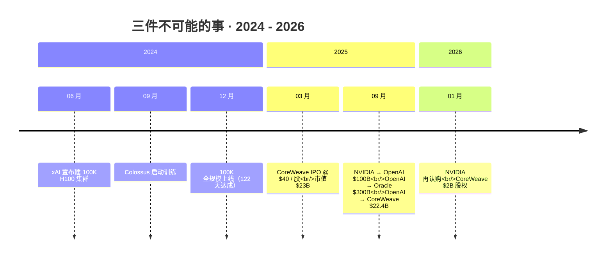
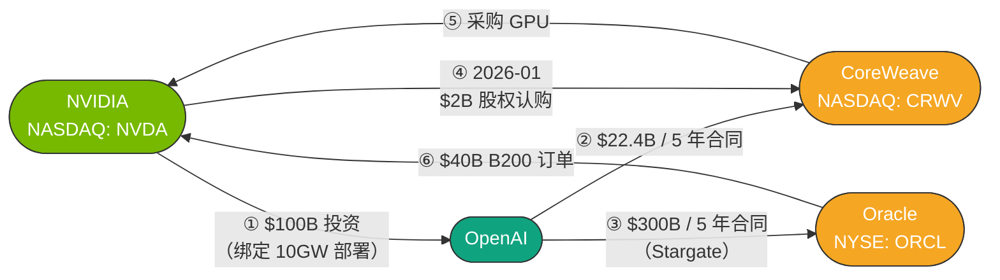

# 序章：三个不可能的算力故事

## 本章概览

写这本书的起点,是 2024-2025 年同时发生的三件事。

任何一件单独拿出来,用传统的工程、财务或估值框架都能挑出毛病。三件叠在一起,挑毛病这件事本身就开始失效——传统框架解不了眼前发生的事。

### 第一件:用 122 天通电了 10 万张 H100

2024 年 6 月,[xAI](https://x.ai/) 公开宣布要在田纳西州孟菲斯一座废弃伊莱克斯(Electrolux)工厂里建一个 100,000 张 H100 的训练集群,叫 [Colossus](https://en.wikipedia.org/wiki/Colossus_(supercomputer))。然后用 122 天把它跑起来。

"122 天"这个数字写在新闻稿里像营销口号,写在数据中心行业的工程手册里是不成立的。

同等规模的传统超大规模云厂自建项目,光是电力接入排队就要 18-24 个月,土建 + 机电 + 调试再叠 12-18 个月,整个周期奔着 4-7 年走。Colossus 跳过了这个周期。它怎么跳过去的,对 2024 年之后所有想盖 100MW+ AI 数据中心的人都是一个被迫学习的新答案。

### 第二件:四家公司签下了 \$400B+ 的资金回环

2025 年 9 月,[英伟达](https://www.nvidia.com/)、[OpenAI](https://openai.com/)、[Oracle](https://www.oracle.com/)、[CoreWeave](https://www.coreweave.com/) 这四家公司之间签下了一组让人记不住数字的协议:

- 英伟达承诺向 OpenAI [最高投资 \$100B](https://blogs.nvidia.com/blog/openai-nvidia/)(绑定 10GW 算力部署进度)
- OpenAI 与 Oracle 签下 [5 年 \$300B 算力采购合同](https://en.wikipedia.org/wiki/Stargate_LLC)
- OpenAI 与 CoreWeave 累计签 5 年 \$22.4B 算力合同

这串数字相加超过 \$400B,比 2024 年全美超大规模云厂的合计资本支出还大。

但更关键的不是数字大小,是钱流的方向:**英伟达投 OpenAI,OpenAI 把钱付给 Oracle 和 CoreWeave,Oracle 和 CoreWeave 又把钱付回英伟达买 GPU**。

钱绕了一圈回到原点。每一笔单看都合规,但拼起来是一个 GAAP 关联交易披露框架管不到的资金回环。

### 第三件:亏 \$863M,IPO 还估值 \$23B

2025 年 3 月 28 日,CoreWeave 以 \$40/股的 IPO 价[登陆纳斯达克](https://www.cnbc.com/2025/03/28/coreweave-ipo-prices-at-40-share-down-from-expected-range.html),代码 CRWV,募资 \$1.5B,市值约 \$23B。

这家公司 2017 年成立,2023 年才从加密矿场转型 AI 算力。IPO 时,已经是同类公司里最大的一家。

传统估值教科书里,上市公司的前置条件是 GAAP 盈利、客户分散、债务可控。但 CoreWeave 在招股书里写明:

- 2024 全年营收 \$1.92B、GAAP 净亏损 **\$863M**
- 2024 年来自微软一家的营收占比 **62%**
- IPO 时点债务总额 **\$7.9B**
- 同时披露:调整后 EBITDA 利润率 **60%+**

这四个数字按传统估值教科书互相矛盾。但市场给了 \$23B 估值,IPO 当天平开收盘。

### 三件事拼到一张桌上

每件事都击穿了一种"常识":

- 122 天通电击穿了基础设施建设节奏的物理框架
- 四角资金回环击穿了关联交易披露的财务框架
- CoreWeave IPO 击穿了盈亏与估值的传统对应

把它们拼到一张桌上,传统框架在三个独立维度上同时失效。这是促使我们停下来想"是不是缺一种新语言"的起点。

按时间把它们摆在一条轴上：

本章不下结论，只把三件事摆在桌上。每件事都会在后面的章节里被反复展开：

| 这件事 | 主要展开章节 |
|---|---|
| xAI Memphis 122 天通电 100K H100 | 第 10 章（数据中心电力）、第 27 章（电力市场） |
| 英伟达-OpenAI-Oracle-CoreWeave 四角合同 | 第 16 章（GPU 云）、第 18 章（vendor financing）、第 29 章（周期定位）、第 30 章（估值模板） |
| CoreWeave IPO 的估值悖论 | 第 16 章（GPU 云解剖）、第 17 章（超大规模云厂折旧） |

本章后面 3 节做这件事：

- **第 4 节**：把三件事放在同一张坐标系上，看它们指向的共同结构
- **第 5 节**：把"另一条链"摆出来——华为 Ascend 910C、中芯国际 N+2、CXMT HBM——说明这套新语言不是单一国家的事情
- **第 6 节**：回到题目——"算力经济学"这门学科要回答的是什么

## 1. 122 天通电 100,000 张 H100：xAI 是怎么做到的

孟菲斯（Memphis）市民在 2024 年 6 月得知 xAI 要在城南一座废弃伊莱克斯（Electrolux）家电工厂里建数据中心。没有人——包括当天发布会上的孟菲斯商会自己——预料到接下来 6 个月里这事会以什么节奏发生。

这座废厂的底子很简单：2020 年关停，建筑面积约 73,000 平方米，屋顶都漏水。但它有两件资产值钱：

- 一栋建好的工业建筑——省下 6-12 个月土建周期
- 一条 8MW 的工业电力接入

接电的对面是 TVA——田纳西河流域管理局，美国东南七州的联邦电力公司，后文会反复提到。

2023 年 12 月，一家叫 Phoenix Investors 的芝加哥工业地产基金以 \$35M 买下这块厂房。三个月后，xAI 拿到使用权。然后是按周计算的工程时间表：

- **2024 年 7 月**：第一批英伟达 H100 服务器从 [超微电脑（Supermicro）](https://www.supermicro.com/) 圣何塞工厂直发 Memphis
- **2024 年 9 月**：项目正式启动，第一批训练任务跑起来
- **2024 年 12 月**：扩展到全规模 100,000 张 H100，从 9 月算起 122 天到位
- **2025 年内**：进一步扩展到约 23 万张 GPU（H100/H200/GB200 三代混部），峰值功率从 150MW 升到 250MW

> 超微电脑（NASDAQ: SMCI）是 H100 时代 AI 整机集成的龙头，后文常出现，不再赘述。

工程师看到这张时间表，第一反应通常是两个不可能。

### 不可能一:电从哪儿来?

8MW 的工业用电连 10K 张 H100 都喂不饱，更别说 100K。

简单算一下：10 万张 H100 SXM5 算上整机、网络、液冷，单卡平均功耗 0.7-1kW，合计 70-100MW；再叠加散热和配电损耗，整个集群需要 120-150MW。

从 TVA 申请这么大一笔新增容量到孟菲斯，走传统电网升级流程，4-7 年起步。这一条 PJM/ERCOT 行业老兵闭着眼也能背出来的物理事实，xAI 直接跳过了。

**怎么跳的？** 在工厂里自己发电。

这种供电方式行话叫 "behind-the-meter"——电表后端。电直接进园区，不上公网，公用事业的容量调度管不到。2024 年之前美国超大规模云厂没人这么干过。

xAI 的方案是请德州一家叫 VoltaGrid 的公司，往现场拉移动燃机——一种装在卡车拖车上的便携式甲烷燃气发电机组。从 14 台开始铺，到 2025 年 4 月已经部署 35 台、合计 422MW。单台 5-10MW，35 台连起来相当于一座中型燃气电厂的功率，专门给一个数据中心供主用电。

代价立刻显现。当地 NAACP 分会在 2025 年起诉 xAI——35 台燃机连续运行，在孟菲斯南区（一个以非裔为主的低收入社区）上空形成的 NOx 和 PM2.5 浓度高到失控。谢尔比县卫生局直到 2025 年 7 月才补发了一份回溯性的临时空气许可。

"先建再补许可"是这个项目电力部分的真实程序——一种 2024 年之前美国数据中心行业根本不存在的新合规边界,既谈不上合规也谈不上违规。

### 不可能二:整机怎么交付的?

一台 8 卡 H100 整机（行话叫 HGX H100，由超微电脑、富士康、戴尔等代工集成）业内估算出厂价 \$250K-\$310K。10 万张 H100 等于 12,500 台整机。

超微电脑 2024 年的 H100 整机月产能估算 800-1,500 台。xAI 一个项目要在 5 个月内消化掉超微电脑大约 6-8 个月的全球 H100 产能。

部署节奏也是反常规。

正常超大规模云厂自建项目，整机从超微电脑工厂出来后走第三方物流 → 数据中心运营商验收 → 安装 → 调试 → 投运，单台 8-12 周。Colossus 是超微电脑自己派工程师驻场，整机直发现场，拆箱装架 + 通电烧机一气呵成，从工厂出货到 GPU 跑训练任务 1-2 周搞定。

这种节奏在 2024 年之前是工业园区临时项目的玩法。现在被拿来跑全球前三大的 GPU 训练集群。

两件事拼起来——绕开公用事业自己发电 + 超微电脑把"出货到投运"压到 1-2 周——122 天通电 100K H100 在物理上才成立。

成立的代价没有写在新闻稿上：合规边界被试探（NAACP 诉讼）、供应链冗余被压到零（超微电脑一家被一个客户占满半年产能）、电力市场被绕过（TVA 失去对这块负荷的容量管理）。这才是 Colossus 项目真实的代价清单。

### 这不是孤例

xAI Memphis 是极端案例，但不是孤例。

Crusoe 在德州 Abilene 建的 1.2GW 数据中心，第一期 360MW 用了同样的 behind-the-meter 燃机方案。OpenAI 的 Stargate 在亚利桑那、新墨西哥、北达科他多个站点都在复制类似模式。CoreWeave 与 Lancium 在德州的合作如出一辙。

从 2024 到 2026 这一年半里，"AI 数据中心 + 自建燃机 + 绕过公用事业"已经成了美国电力新增装机的最大边际增量。

宏观盘子也对得上：美国能源信息署（EIA）2025 年月度数据显示，全国计划新增天然气燃机装机约 4.4GW，但这只算并入公用事业电网的部分；数据中心 behind-the-meter 燃机不进这个口径。两条口径合计，业内估算新增天然气燃机 8-12GW，相当一部分服务数据中心。

工程含义留给第 10 章展开，宏观外溢（容量市场、政治回压、居民电费）留给第 27 章。本章不急于下结论，只把这件事立在桌上。

下一件事是合同结构。

## 2. 一个让会计师皱眉的资金回环:四家公司,\$400B

2025 年 9 月这一周，市场连续看到四家公司公布协议。按日期摆出来：

- **2025-09-10**：Oracle 与 OpenAI 签下 5 年 \$300B 算力采购合同。合同从 2027 年开始计费，Oracle 用这笔订单作为 Stargate 项目的核心收入支撑
- **2025-09-22**：英伟达宣布向 OpenAI 投资最高 \$100B，分批发放，绑定 OpenAI 部署 Vera Rubin 平台的进度。目标是 10GW 系统、数百万颗 GPU。首批 1GW 系统预计 2026 下半年上线
- **2025-09-25**：CoreWeave 把 OpenAI 合同再扩 \$6.5B，累计 5 年 \$22.4B（3 月初签 \$11.9B + 5 月扩 \$4B + 9 月再扩 \$6.5B）

这三笔之外还有同期已经搭好的连接：英伟达是 CoreWeave 2024 年的大客户（自用 GPU 工作负载约占 CoreWeave 当年营收 15%），也持有 CoreWeave 股权——IPO 前持股 5% 以上，2026 年 1 月又以 \$87.20/股认购 22,935,780 股、合计 \$2B。同期 OpenAI 在 2025 年 3 月 CoreWeave IPO 时也认购了 \$350M 股权。

把这堆数字画成箭头图就成了一个回环：

> 钱沿着英伟达 → OpenAI → Oracle / CoreWeave → 英伟达绕了一圈回到原点。每条边单看在法律和会计形式上都干净，但 6 条边叠在一起，就是一个 \$400B+ 的同向资金闭环。

这张图在 2025 年 9 月之前的金融教科书里没有对应词。

它不是关联交易——四家公司之间没有控股或共同董事关系。

它不是 1990 年代电信周期里 Lucent、Nortel 借钱给客户买自家设备的厂商融资（vendor financing）的简单翻版。

它也不是 2001 年安然（Enron）那种通过空壳公司双向虚增营收的循环交易。

每一项交易单独看都合规，但物理上是一组同向资金流叠加成的闭环——英伟达把钱投给 OpenAI，OpenAI 把钱付给 Oracle 和 CoreWeave，Oracle 和 CoreWeave 用这笔钱再向英伟达买 GPU，绕一圈回到英伟达自己的营收线。

### 这套结构在做什么?

翻译一层就清楚了:**英伟达名义上的"投资 + 销售"叠加,物理上是把"未来 5 年自家 GPU 的需求"提前折现到了今天**。

英伟达承诺给 OpenAI 投 \$100B，等于把 OpenAI 5 年内能买多少英伟达 GPU 这件事——按 10GW × 5 年部署节奏估算大致 \$200-300B 量级——的需求侧风险，部分搬回到了英伟达自己的资产负债表上。

同理 Oracle-OpenAI 5 年 \$300B 合同，本质是 Oracle 用自己的资产负债表为 OpenAI 未来 5 年的 GPU 需求做担保。Oracle 同期也确实向英伟达下了 \$40B 量级的 B200 订单。

### 对四家公司的会计影响,各不相同

**英伟达**:营收线确认更稳了——OpenAI、Oracle、CoreWeave 三家加起来锁定 \$400B+ 量级的未来需求。

但要分清两层口径。英伟达自身 GAAP 报表上的 RPO（剩余履约义务）在 FY26 年报里只有约 \$2.6B——RPO 只算"已签合同 + 已开始履约"的部分，超大 GPU 订单按英伟达的会计政策走的是供应承诺（supply commitments）而非 RPO。三方协议绑定的算力部署是分阶段确认的需求，更多体现在供应承诺和未来营收指引里。

同时英伟达资产负债表上多了 \$100B 量级的 OpenAI 投资敞口。OpenAI 不是上市公司,这笔投资按私募估值入账,假设变一变,non-GAAP 利润就跟着变。

**OpenAI**:现金流从 2025 年中的 \$13B 量级年化经常性收入，到 2026 年一季度升至 \$22-25B，再到承诺 5 年 \$300B+ 算力采购——平均每年算力支出 \$60B+，是 2025 年全年年化经常性收入的 4-5 倍。

OpenAI 自己的算盘是按 5 年内年化经常性收入持续高速增长建模出来的。但只要某一年年化经常性收入增速回落（比如从 +200% 降到 +50%），账面就会暴露成一笔"合同承诺 vs 现金流不匹配"的悬挂债务。

**Oracle**:2025 年 9 月 9 日 FY26Q1 财报披露当天,股价单日暴涨约 30%,9 月全月收涨约 25%,9 月 10 日盘中触及历史高点 \$345.72。

资本支出指引同步上调:FY25 实际 \$21.2B → FY26Q1 指引 \$35B → FY26Q2 指引再上调至 \$50B。对应到自身 FY27-FY30 的折旧和利息支出会显著上行。

**CoreWeave**:在手订单(合同储备)从 Q2 2025 的 \$30.1B 跳到 Q3 2025 的 \$55.6B,OpenAI 一家就占 \$22.4B,合 40%。客户集中度从 IPO 时点 Microsoft 一家 62%,变成 Microsoft + OpenAI 两家加起来 60%+。

### 关键不在违规,在没有框架管它

把四家放在同一张表上看,会发现一个核心结构:**每一方都把自己的资产负债表当作上下游需求侧的担保物**。

英伟达担保 OpenAI 的算力需求，OpenAI 担保 Oracle 和 CoreWeave 的算力采购，Oracle 和 CoreWeave 担保英伟达的 GPU 销售。这不是任何一家公司可以独立完成的财务结构——是 2025 年 9 月这四家在同一张桌上互相借资产负债表撑出来的一组协议。

更微妙的是，这套结构在 GAAP 财务披露上没有任何一处违规。每一笔交易都是市场化定价、每一份合同都按 SEC 规则披露、关联交易因为四家没有控股或共同董事关系而不需要列在 related-party 段落。

**传统财务披露框架管不到这种类型的资金回环**。这是 2025 年 9 月这一周市场反应剧烈的真正原因——市场看到了一种自己还没有评估工具的新结构。

这件事第 18 章会进一步展开。形态上最像的历史先例,是 1996-2001 电信周期里 Lucent 和 Nortel 给新兴电信运营商的厂商融资——用未来增长承诺为当前资本支出融资。规模差一个数量级，但结构性质相似。第 29 章会用 12 维度对照表把这两轮逐项比较。

第三件事是估值框架。

## 3. 亏 \$863M 还能 IPO?CoreWeave 与 60% EBITDA 神话

2025 年 3 月 28 日，CoreWeave 在纳斯达克上市，代码 CRWV。IPO 定价 \$40/股，募资 \$1.5B——是当时美国 AI 相关 IPO 中募资规模最大的一笔。

这家公司的故事，市场上有两个版本。

### 版本一:招股书封面

CoreWeave 是最大的独立 GPU 云厂商，2024 全年营收 \$1.92B，年化增长 +700%。

客户名单一翻就是顶流:微软(占 2024 营收 62%)、英伟达(既是供应商又是股东又是 2024 年第二大客户,估算占营收 15%)、OpenAI(同期签下 5 年 \$11.9B 合同)。调整后 EBITDA 利润率 60%+(non-GAAP 口径)。

IPO 完全稀释市值约 \$23B。首日盘中触及 \$42 后回落到 \$40 平开收盘——市场没给溢价但也没给折价。

### 版本二:招股书内页

同一份 S-1，往后翻几页就是另一个画面。

- **第 28 页**——"Risk Factors"开头第一条:`our revenue is highly concentrated`。微软一家占 2024 营收 62%,前两大客户合计 77%
- **第 39 页**:2024 全年 GAAP 净亏 \$863M,2023 年净亏 \$593M,成立以来累计亏损超过 \$1.5B
- **第 64 页**:IPO 时点债务总额 \$7.92B,2024 年单年利息支出 \$584M
- **第 91 页**:GPU 和服务器按 6 年直线折旧

把这四个数字摆在一起:**GAAP 亏 \$863M / 单一客户占营收 62% / 债务比营收高 4 倍 / 用非标 EBITDA 口径包装**——2024 年之前的传统估值教科书会把这家公司归为"根本不该上市"。但市场给了 \$23B 估值。

### 关键就在那 6 年折旧

这件事的核心机制,就是**6 年直线折旧 vs 实际经济寿命的会计选择**。也就是 2025 年 11 月 Michael Burry(《大空头》原型,这一波公开做空美国 AI 巨头的人)在 X 上公开攻击的那一点。

第 16 章会把这件事展开成完整的敏感矩阵,这里只把核心算术摆出来:

| 折旧期假设 | H100 单卡年折旧 | 调整后 EBITDA 利润率 |
|---|---:|---:|
| **6 年**(CoreWeave 选择) | ~\$4,667 | **60%+** |
| 4 年(亚马逊云 AWS 选择) | ~\$7,200 | 估算 38% |
| 3 年(Burry 反情景) | ~\$10,667 | 估算 15% |

> 表内按 \$32K 整机摊销;6 年和 4 年情景已扣 12.5% 残值,3 年情景按 Burry 假设全额摊销。详细测算见第 16 章。

一个会计假设的旋钮——6 年还是 4 年——决定 CoreWeave 在同一笔生意上 EBITDA 利润率从 38% 跳到 60%+。**23 个百分点的差距全部来自会计选择，不来自任何运营层面的真实改善**。

市场愿意给 CoreWeave \$23B 估值，本质上就是给两件事在付溢价:

1. "6 年折旧合理"这个假设
2. "长合约 + 照付不议(照付不议:客户按期付款,不管用没用)"锁定的 5 年现金流

### 估值模板被打穿

CoreWeave 让四个传统估值口径,三个直接失效:

- **DCF(现金流折现)**:用 GAAP 净亏算是负的,用调整后 EBITDA 算又特别高——没有标准答案,看你用哪个口径
- **EV/EBITDA**:用 GAAP 算分母是负的,倍数无法计算;只有用 non-GAAP 调整后 EBITDA 才算得出来
- **PEG(市盈率/增长率)**:CoreWeave 没有正的 GAAP 净利润,PEG 不存在
- **P/S(市销率)**:CoreWeave IPO 时点约 12x,卖方分析师给 AWS 隐含的 P/S 大约 5-7x——高出 2 倍

四个传统口径,三个直接失效,一个明显高出对照。剩下唯一能算的口径是"按在手订单折现 + 假设折旧政策不变 + 假设客户不流失"。

这是一个非常窄的估值模板。但市场在 IPO 时点给出的 \$23B,就是用这个模板算出来的——一个全部押注在单一假设链条上的数字。

这件事第 16 章会拆到分析颗粒度,第 30 章会作为估值模板的样本反复出现。本章只把它立在桌上——**当 GAAP 净亏和 60% EBITDA 同时存在,传统估值教科书要被重写**。

至此本章三件事摆完:122 天通电 100K H100(物理框架失效)、四角资金回环(合同披露框架失效)、亏着上市的 60% EBITDA(估值框架失效)。下一节把它们放到同一张坐标系上,看共同结构。

## 4. 三件事,一个共同结构

三件事各自落在三个不同的分析框架里——物理资产、合同结构、资本结构。三个框架在 2024 年之前的产业研究里基本各管各的:

| 故事 | 冲撞的框架 | 关键变量 | 后续章节 |
|---|---|---|---|
| xAI Memphis 122 天 | 物理基础设施建设节奏 | 电力 / 整机交付 / 合规边界 | ch10 / ch27 |
| 四角资金回环 | 关联交易 / 财务披露 | 供应承诺 / 现代厂商融资 / 互担保 | ch18 / ch29 |
| CoreWeave IPO | 传统估值方法 | 折旧期 / 客户集中度 / non-GAAP 包装 | ch16 / ch30 |

把它们拼到一张图上，会发现指向同一种结构:**用未来现金流承诺撑起当前的资本支出周期**。

- xAI 用未来 5 年 Grok 商业化的预期，撑当下 250MW 数据中心 + 约 23 万 GPU 的资本支出
- OpenAI / Oracle / CoreWeave 用未来 5 年年化经常性收入增长的预期，撑 \$400B+ 量级的合同承诺
- CoreWeave 用 5 年照付不议长合约的现金流承诺，撑 IPO 估值

三件事是同一种生意的三个侧面:**当资本支出周期需要的资金量超过任何单一参与者的资产负债表,市场就被迫发明新工具——绕电网的临时燃机、四角互相担保的合同、亏着上市的高估值——把"未来的承诺"折现成"今天能花的钱"**。

### 历史上有先例,但每次结局都不一样

这种结构在历史上不是头一回。

最近最像的一次是 1996-2001 年美国电信周期。全美长途光纤骨干铺设累计资本支出约 \$500B,靠的是高收益债 + 厂商融资 + IRU 合约(Indefeasible Right of Use,光纤永久使用权)把未来的流量承诺折现到今天的设备资本支出。

再往前还有 1843-1846 年的英国铁路狂热,1880-1930 年代美国电气化里 Insull 控股证券化——形态各异但底层一致。每一轮通用目的技术(GPT)的基础设施扩张,都会发明一套对应的金融工具。

但**形态相似不等于结局相似**。

1843 铁路狂热是过度建设撞上运量低于预期;1929 Insull 帝国是控股层级利息覆盖率崩了;2001 电信是单位经济(每比特成本)崩塌叠加会计造假。每次崩盘的方式都不一样。

AI 算力这一轮如果出现崩盘剧本,形态也会和历史几轮各自不同。第 29 章会用 12 维度对照表把它们逐项比较。本章不下"必然失败"的结论,但把这套结构作为一个周期信号位摆在桌上。

接下来还有一条平行线。

## 5. 与此同时,另一条链

前面三节讲的故事都在美国发生。但 2024-2026 这一轮 AI 算力周期不是单一国家的事——它在中国独立演化出了第二条链,结构不同、节奏不同、玩家不同。

这里摆出三个数据点,说明本书是双轨叙事,不只是美国故事。

### 数据点一:华为 Ascend 与中芯国际的爬坡

华为 Ascend 是华为海思自研的 AI 训练/推理加速器,对标英伟达 H100/H200。三代芯片的演化是:

- **Ascend 910(2019)**:用台积电 7nm EUV 工艺
- **Ascend 910B(2023-2024)**:被美国出口管制切断台积电之后,转用中芯国际(中芯国际)的 7nm N+1 工艺
- **Ascend 910C(2025 年 5 月量产)**:中芯国际 N+2(第二代 7nm)工艺,双裸片封装。DeepSeek 测试结果显示推理性能约为 H100 的 60%

华为 2025 全年 910B + 910C 合计出货量,业内估算超过 80 万颗。

放进全球大盘看:英伟达 FY26 全年(2025-02 至 2026-01)数据中心营收 \$193.7B,对应估算 600-800 万颗 H100/H200/B100/B200/GB200 等价单元出货。

华为 80 万 vs 英伟达 600-800 万——华为现在是英伟达的 1/8 到 1/10。

但 2024 年初这个比例还是 1/30 到 1/50。两年时间里,中国侧 AI 加速器的产能爬升幅度,比美国市场预期得要快。

**爬升的物理瓶颈是中芯国际的良率**。

中芯国际 2020 年被列入美国出口管制实体清单后,失去了阿斯麦（ASML） EUV 光刻机进口渠道,只能靠 DUV(深紫外光刻)多次曝光做 7nm。这条工艺路径的良率估算 30-50%,远低于台积电同期 7nm 的 70-80%。良率低 = 单晶圆出片少 = 单裸片摊销成本高。

这是华为 Ascend 现阶段难以正面替代英伟达的核心物理约束——不是设计不行,是制造端良率撑不起规模经济。

不过中芯国际 12 寸晶圆产能在持续爬升:2025 年底披露季度产能 720,000 片晶圆等价,比 2023 年的 540,000 片爬了 33%。其中分配给 7nm(N+1/N+2)的产能估算 2025 年达到月均 25-35K 片——这个数字直接决定了 Ascend 910C 在 2025 下半年到 2026 上半年的可获得性。

### 数据点二:HBM 代差 3-4 代

HBM(高带宽内存)是 AI 加速器的核心物料,单卡 BOM 占比 40%+(第 1 章会拆)。

全球 HBM 供应集中在三家:SK 海力士(2025 年市占约 55%)、三星、美光。中国侧 HBM 产能由长鑫存储(CXMT)和长江存储承担。

- **SK 海力士 2025 主力出货**:HBM3e(第五代),单 stack 24-36GB,2024 年一季度量产
- **长鑫存储 2025-2026 主力出货**:HBM2/HBM2e(第二、第三代),单 stack 8-16GB,2024 下半年开始小规模出货,2025 上半年进入正式量产

HBM 代际是 HBM → HBM2 → HBM2e → HBM3 → HBM3e → HBM4——长鑫的 HBM2 比 SK 海力士的主力代际**落后 3-4 代**。这意味着单 stack 容量差 2-3 倍、带宽差 3-4 倍、能效比差 50%+。

落到产品上:Ascend 910C 用 HBM2e,单卡 HBM 容量 64GB / 总带宽 1.2 TB/s;H100 SXM5 用 HBM3,80GB / 3.35 TB/s。HBM 容量差 25%,带宽差 64%。

这个差距在训练 GPT-4 量级前沿大模型时是物理硬约束——大模型训练是显存受限(memory-bound)的,HBM 不够,模型权重就得切得更碎,通信开销大幅上升,单 GPU 利用率下降。

**但代差不等于不能用**。

中国侧 AI 加速器市场目前以推理为主(占国内 AI 算力需求估算 60-70%),推理对 HBM 容量和带宽的要求远低于训练。HBM2e 64GB 在 7B-70B 量级模型推理上基本够用。

中国侧加速器在 2024-2026 的可获得性大幅改善,主要靠三件事:**产能从无到有、推理场景大量出现、商业模式调整**——技术上仍没追上英伟达。

### 数据点三:"算力券"——补贴撑起的双轨市场

美国超大规模云厂的算力卖给企业客户,市场化定价 + 长期合约。

中国大陆侧不一样。国产 AI 算力(华为 Ascend、寒武纪、摩尔线程、燧原等)的主要客户是政府、国有云、垂直行业(金融/制造/政务),市场化定价的部分远小于美国市场。

支撑这件事的核心政策工具叫**算力券**。

北京、上海、深圳、杭州、成都等城市在 2024-2025 期间陆续推出"AI 算力券"补贴:企业购买国产算力(必须是 Ascend/寒武纪/海光这些上了国产化清单的加速器),按合同金额 30-50% 由政府补贴。

这个机制本质上把国产算力从"价格高 + 性能弱"扭转成"补贴后总成本与英伟达持平",让需求侧(国企、政务、部分行业客户)愿意先用起来。

算力券的市场后果有两层:

1. **客户结构不是市场出清的**——国资云 + 政府客户 + 政策受益行业为主,市场化客户(互联网公司、AI 初创)占比估算 20-30%
2. **价格不是市场化定价**——单卡含补贴的等效售价估算英伟达 H100 的 50-70%,剔除补贴后的真实成本与英伟达仍有差距

这就出现了一个跟美国不同的双轨结构:

- **一轨**:英伟达的中国特供版(H20 和其他降配版,详见第 28 章)在大陆互联网客户中维持市占
- **另一轨**:国产算力在国资云 + 政府客户中以补贴定价快速渗透

两轨长期会有交叉点,但 2024-2026 阶段是平行存在。

### 两条链,共享物理约束,走向不同形态

把三个数据点拼起来——中芯国际 N+2 良率爬升 + 长鑫 HBM2 落后 3-4 代 + 算力券补贴渗透——中国侧 AI 算力链的演化逻辑跟美国完全不同。

- **美国链**玩的是:英伟达议价权 + 超大规模云厂资本支出周期 + 四角合同 + 60% EBITDA 神话
- **中国链**玩的是:政策补贴 + 国资客户 + 中芯/长鑫良率爬升 + 双轨市场

两条链共享相同的物理约束(HBM 带宽决定训练效率、CoWoS 封装是先进工艺瓶颈、电力是数据中心瓶颈),但商业模式、资本结构、监管框架走向截然不同的形态。

这件事第 21 章(中国应对)和第 28 章(出口管制经济账)会展开。

序章在这里把"另一条链"摆出来,是为了说明本书的视角——**AI 算力经济学是双轨的,不能只用美国链的语言去描述全球**。这一点在中文产业研究里是常识,在英文同类资料(SemiAnalysis、Acquired、Power Law 系列)里几乎缺位。本书要补上的,就是这个空隙。

## 6. 为什么需要一门"算力经济学"

回头看,本章四件事其实落在四个不同的传统学科里:

- **xAI Memphis 122 天通电**是工程问题——电从哪儿来、整机怎么交付、合规怎么过关
- **四角合同**是金融问题——投资是什么、营收是什么、未来现金流的折现链条怎么搭
- **CoreWeave 60% EBITDA + GAAP 亏 \$863M IPO**是估值问题——折旧期怎么定、客户集中度怎么定价、non-GAAP 是真盈利还是会计魔术
- **另一条链**是产业组织问题——为什么中国 AI 算力市场长成了和美国不一样的形状

四件事单看,数据中心工程学、财务会计学、估值理论、产业组织经济学,每一门都有现成的研究框架。

**但任何一门都解不了"四件事同时发生"这件事本身。**

xAI 之所以能 122 天通电,部分原因是英伟达给超微电脑开了产能通道(合同结构),部分原因是市场愿意按英伟达-OpenAI 合作预期给 xAI 估值(资本结构),部分原因是孟菲斯当地政府愿意先批后审(产业组织)。

CoreWeave 60% EBITDA 之所以成立,部分原因是它能锁到微软和 OpenAI 5 年照付不议长合约(合同结构),部分原因是它能用 6 年折旧期把利润推迟(资本结构),部分原因是它能在德州和北弗吉尼亚拿到电(工程)。

**四件事互相是对方的前提条件。任何一件拿掉,其他三件都不成立。**

本书最初的写作动机正在这里——当工程、合同、估值、产业组织四门独立学科开始相互依赖、再也没法分开看的时候,我们需要一种新的语言同时讨论它们。

这种语言可以叫"算力经济学",也可以叫别的。本书选这个名字,是因为它简短,能描述对象(算力),能定位学科(产业经济学 + 金融经济学 + 工程经济学的交集),也不像"AI 产业研究"那么含糊。

这门学科还在形成中。本书不假设它已有完整体系,只是把 2024-2026 这一轮周期里观察到的现象 + 数据 + 推理链条整理出来,组织成 30 章,留给后面的人继续修订。

### 本书的六条主轴

- **A 产业链全景**(第 1-10 章):沙子到 token 之间,每一个环节的玩家、毛利、护城河、风险
- **B 因果与机制**(第 11-14 章):双瓶颈(CoWoS + HBM)的物理学、2027 年拐点的供需测算、瓶颈缓解后的新硬约束
- **C 商业模式**(第 15-18 章):自建 / 长租 / 转租三种模式的会计分野、CoreWeave 解剖、循环交易、超大规模云厂怎么算账
- **D 全球格局**(第 19-23 章):美国主导体系、中国应对、东亚与欧洲的对冲、主权 AI
- **E 宏观影响**(第 24-28 章):算力作为通用目的技术、TFP 渠道、人力资本、电力市场、出口管制经济账
- **F 周期与资本**(第 29-32 章):12 维度周期定位、五种估值模板、12 个争议答辩、五年前瞻

六条主轴在每一章都互相穿插——讲英伟达的护城河(第 7 章)会牵出客户集中度(F)和软件税(C);讲 PJM 容量市场(第 10 章)会牵出超大规模云厂长期购电协议(C)和居民电费的政治回压(E)。这种交叉是设计而不是缺陷——序章三个故事本身就告诉读者,这个领域的事情就是这样发生的。

### 这本书的目标

本章不下结论。后面 30 章也不假装给出完整答案。

读这本书的最低要求是:**读完之后,下一次再看到一条新的算力新闻——不管是某家自建燃机数据中心通电、某家四角合同签下、某家 AI 公司亏着 IPO——你知道把它放进哪个坐标系里看**。

本书的目标就到这一步。

接下来第 1 章会从一张 H100 SXM5 的物理 BOM 开始拆产业链,把序章留下的三个悬念逐一展开。沙子到 token 一共 11 个环节,每个环节的玩家、毛利、产地、风险,是后续 30 章的物理基准。

## 章末小结

- 本章三件事:xAI Memphis 122 天通电(物理框架失效)、英伟达-OpenAI-Oracle-CoreWeave 四角合同(财务披露框架失效)、CoreWeave 60% EBITDA + GAAP 亏 \$863M IPO(估值框架失效)
- 三件事在 2024 年之前的任何单一学科里都没有完整答案;它们在 2024-2025 同时发生,意味着工程、金融、估值、产业组织四个领域开始相互依赖
- "另一条链"——华为 Ascend 910C / 中芯国际 N+2 / 长鑫存储 HBM2 / 中国算力券机制——说明本书是双轨叙事,不只是美国故事
- 本书六条主轴(A 产业链 / B 因果机制 / C 商业模式 / D 全球格局 / E 宏观影响 / F 周期资本)在每一章交叉出现
- 本章不下结论,三件事各自指向后面第 1、10、16、18、21、27、28、29、30 章,由后续章节展开分析

---

> 本章来自《算力经济学》开源版 · 作者「递归客」  
> 在线阅读完整书系：[inferloop.dev](https://inferloop.dev)  
> 开源仓库：[github.com/diguike/book-compute-economics](https://github.com/diguike/book-compute-economics)
