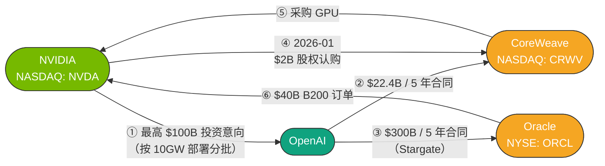
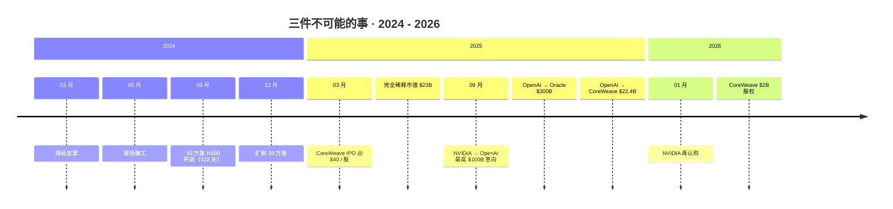

# 序章：三个不可能的算力故事

2023 年 12 月，一家叫 Phoenix Investors 的芝加哥工业地产基金花 \$35M，买下孟菲斯城南一座停产四年的伊莱克斯（Electrolux）家电厂：建筑面积约 73,000 平方米，屋顶漏水，账面上还值钱的东西只剩一条 8MW 的工业电力接入——够开一条家电装配线，喂不饱一台 AI 训练机柜。

三个月后，这块地归了 [xAI](https://x.ai/)。2024 年 9 月 2 日，同一栋厂房里 10 万张 H100 开始跑训练任务，代号 [Colossus](https://en.wikipedia.org/wiki/Colossus_(supercomputer))。到 2025 年，园区峰值用电 250MW，是它买来时那条线路的三十倍。多出来的电不来自田纳西河流域管理局（TVA，美国东南七州的联邦电力公司，后文会反复出现），来自停在场地上的 35 台拖车式燃气轮机——先发电，空气许可是一年后补发的。

按这个行业的建设常识，从动工到 10 万卡通电要四到七年。孟菲斯用了 122 天。

122 天值得记住，不是因为它快。是因为在这之后的十二个月里，另外两件同样不该发生的事跟着发生了——四家公司签下一组五年期、合计 \$400B 量级的合同，钱绕一圈回到起点；一家年亏 \$863M、单一客户占六成营收的公司完成 IPO，市场给了 \$23B 估值。三件事分别撞碎了工程、合同、估值三套框架，而它们互为前提：任何一件拿掉，另外两件都不成立。

写这本书的人是一名 AI 工程师，每天和算力打交道，也长期跟踪这条产业链上的资本流向。这本书写给同样想看清产业坐标的工程师，和需要把技术叙事翻译成可建模框架的投资者；它不是 AI 与半导体的入门科普，不披露持仓，也不做选股建议——金融视角在这里是拆解产业结构的一把尺子，不是买卖信号。时间紧的读者，读完这一章可以直接跳到第 1 章（一张 H100 的物理账）和第 29 章（这一轮周期的位置）。

## 1. 一座漏雨的家电厂，122 天，10 万张 H100

孟菲斯市民在 2024 年 6 月得知 xAI 要在城南这座废厂里建数据中心。没有人——包括当天发布会上的孟菲斯商会自己——预料到接下来半年会以什么节奏发生。

这座废厂的底子很简单：2020 年关停，屋顶漏水。但它有两件资产值钱：一栋建好的工业建筑，省下 6-12 个月土建周期；一条 8MW 的工业电力接入，意味着变电站和线路已经在那儿。

2024 年 3 月项目定案，随后是场地设计与改造准备；按马斯克事后给出的 122 天口径从 9 月 2 日倒推，现场施工的起点落在 5 月初。此后是按周计算的工程时间表：

- **2024 年 7 月**：第一批英伟达 H100 服务器从 [超微电脑（Supermicro，NASDAQ: SMCI）](https://www.supermicro.com/) 圣何塞工厂直发孟菲斯。超微电脑是 H100 时代 AI 整机集成的龙头，后文常出现
- **2024 年 9 月 2 日**：10 万张 H100 的集群跑起第一批训练任务。马斯克当天的原话是 "From start to finish, it was done in 122 days"——**122 天算的是从现场施工到十万卡开训，既不是从 6 月公开宣布算起，也不是到扩容完成**
- **2024 年 12 月**：又用约三个月扩到 20 万张（新增的一半是 H200）
- **2025 年内**：进一步扩到 20 万张以上（H100 / H200 / GB200 三代混部），峰值功率从 150MW 升到 250MW

这张时间表里有两件事在工程上说不通：电从哪儿来，机器怎么交付。

### 从 8MW 到 250MW：电从哪儿来

8MW 的工业用电连 1 万张 H100 都喂不饱，更别说 10 万张。

按行业口径算一遍：H100 SXM5 单卡 TDP 700W，算上 CPU、内存、网卡、供电损耗与液冷开销，整机全包通常按单卡 1.2-1.4kW 估，10 万张对应 120-140MW 的设施负荷。这个数字和 Colossus 十万卡阶段披露的约 150MW 峰值对得上。

从 TVA 申请这么大一笔新增容量到孟菲斯，走传统电网升级流程，四到七年起步。这是 PJM、ERCOT 这类电网调度机构的排队现实（PJM 覆盖美国中大西洋十三州，ERCOT 覆盖德州，两家管辖区内的并网队列长度是行业公开数据）。xAI 直接跳过了这个流程。

**怎么跳的？在工厂里自己发电。**

这种供电方式行话叫 "behind-the-meter"——电表后端。电直接进园区，不上公网，公用事业的容量调度管不到。2024 年之前美国超大规模云厂没人这么干过。

xAI 的方案是请德州一家叫 VoltaGrid 的公司往现场拉移动燃机——装在卡车拖车上的便携式甲烷燃气发电机组。从 14 台开始铺，到 2025 年 4 月已部署 35 台、合计约 422MW（平均单台约 12MW），相当于一座中型燃气电厂的功率，专门给一个数据中心供主用电。装机容量比 250MW 的峰值负荷高出七成，是因为燃机按铭牌容量计，要留出检修轮换和后续扩容的余量。

代价立刻显现。当地 NAACP 分会在 2025 年起诉 xAI——35 台燃机连续运行，在孟菲斯南区（一个以非裔为主的低收入社区）上空形成的 NOx 和 PM2.5 浓度高到失控。谢尔比县卫生局直到 2025 年 7 月才补发了一份回溯性的临时空气许可。

「先建再补许可」是这个项目电力部分的真实程序。补发回溯许可这个动作本身说明：在此之前它不合规，只是没有一个现成的执法框架来处理一座凭空出现在电网之外的 400MW 级电厂。

### 12,500 台整机，五个月

一台 8 卡 H100 整机（行话叫 HGX H100，由超微电脑、富士康、戴尔等代工集成）业内估算出厂价 \$250K-\$310K。10 万张 H100 等于 12,500 台整机，光整机采购就是 \$3.1-3.9B 量级——这笔钱在同一个季度里变成了英伟达和超微电脑的营收。

超微电脑 2024 年的 AI 整机月产能业内估算 1,500-2,500 台。12,500 台意味着它五到八个月的全球产量，xAI 要在五个月内吃掉——一个客户占满一家龙头集成商大半年的产能。

部署节奏同样反常规。传统流程和 Colossus 的差距，摆在一张表里更清楚：

| 环节 | 传统超大规模云厂自建 | xAI Colossus |
|-|-|-|
| 电力接入 | 向公用事业申请新增容量，排队 18-24 个月，大容量四到七年 | behind-the-meter 自建燃机，不进并网队列 |
| 土建 + 机电 + 调试 | 12-18 个月 | 沿用现成厂房，省 6-12 个月 |
| 整机从出厂到投运 | 第三方物流 → 运营商验收 → 安装 → 调试，单台 8-12 周 | 超微电脑工程师驻场，整机直发、拆箱装架 + 通电烧机一气呵成，1-2 周 |
| 总周期 | 四到七年 | 122 天 |

这种节奏在 2024 年之前是工业园区临时项目的玩法，现在被拿来跑全球前三大的 GPU 训练集群。

两件事拼起来——绕开公用事业自己发电 + 超微电脑把「出货到投运」压到 1-2 周——122 天通电 10 万张 H100 在物理上才成立。

成立的代价没有写在新闻稿上：合规边界被试探（NAACP 诉讼与回溯许可）、供应链冗余被压到零（超微电脑一家被一个客户占满大半年产能）、电力市场被绕过（TVA 失去对这块负荷的容量管理）。这才是 Colossus 项目真实的代价清单。

### 不止孟菲斯一家

xAI Memphis 是极端案例，但不是孤例。

Crusoe 在德州 Abilene 建的 1.2GW 数据中心，第一期 360MW 用了同样的 behind-the-meter 燃机方案。OpenAI 的 Stargate 在亚利桑那、新墨西哥、北达科他多个站点都在复制类似模式。CoreWeave 与 Lancium 在德州的合作如出一辙。

从 2024 到 2026 这一年半里，「AI 数据中心 + 自建燃机 + 绕过公用事业」已经成了美国电力新增装机的最大边际增量。

宏观盘子也对得上：美国能源信息署（EIA）2025 年月度数据显示，全国计划新增天然气燃机装机约 4.4GW——但这只统计并入公用事业电网的部分，数据中心 behind-the-meter 燃机不进这个口径。把表内的 4.4GW 和表外的自建加在一起，业内估算 2025 年实际新增天然气燃机 8-12GW。也就是说，统计口径之外的那一半，规模和统计口径之内的一样大，而它主要服务数据中心。

工程含义在第 10 章展开，宏观外溢（容量市场、政治回压、居民电费）在第 27 章。

## 2. 四家公司，六条边，\$400B 绕回原点

2025 年 9 月这一周，市场连续看到四家公司公布协议。按日期摆出来：

- **2025-09-10**：[Oracle](https://www.oracle.com/)（NYSE: ORCL）与 [OpenAI](https://openai.com/) 签下 5 年 \$300B 算力采购合同。合同从 2027 年开始计费，Oracle 用这笔订单作为 Stargate 项目的核心收入支撑
- **2025-09-22**：[英伟达](https://www.nvidia.com/)（NASDAQ: NVDA）宣布[意向向 OpenAI 投资最高 \$100B](https://blogs.nvidia.com/blog/openai-nvidia/)。公告原文是 "intends to invest up to \$100 billion in OpenAI progressively as each gigawatt is deployed"——**按每 1GW 部署到位分批投入的意向，不是一张已经签出去的 \$100B 支票**，目标是 10GW 系统、数百万颗 GPU，首批 1GW 预计 2026 下半年上线
- **2025-09-25**：[CoreWeave](https://www.coreweave.com/)（NASDAQ: CRWV）把 OpenAI 合同再扩 \$6.5B，累计 5 年 \$22.4B（3 月初签 \$11.9B + 5 月扩 \$4B + 9 月再扩 \$6.5B）

这三笔之外还有同期已经搭好的连接：英伟达是 CoreWeave 2024 年的大客户（自用 GPU 工作负载约占 CoreWeave 当年营收 15%），也持有 CoreWeave 股权——IPO 前持股 5% 以上，2026 年 1 月又以 \$87.20/股认购 22,935,780 股、合计约 \$2B。同期 OpenAI 在 2025 年 3 月 CoreWeave IPO 时也认购了 \$350M 股权。

把六条边的方向画出来，就是一个闭环（图 0-1）。

```mermaid
graph LR
    NVDA([NVIDIA<br/>NASDAQ: NVDA])
    OAI([OpenAI])
    CRWV([CoreWeave<br/>NASDAQ: CRWV])
    ORCL([Oracle<br/>NYSE: ORCL])

    NVDA -- "① 最高 $100B 投资意向<br/>（按 10GW 部署分批）" --> OAI
    OAI -- "② $22.4B / 5 年合同" --> CRWV
    OAI -- "③ $300B / 5 年合同<br/>（Stargate）" --> ORCL
    NVDA -- "④ 2026-01<br/>$2B 股权认购" --> CRWV
    CRWV -- "⑤ 采购 GPU" --> NVDA
    ORCL -- "⑥ $40B B200 订单" --> NVDA

    classDef supplier fill:#76B900,stroke:#333,color:#fff
    classDef model fill:#10A37F,stroke:#333,color:#fff
    classDef cloud fill:#F5A623,stroke:#333,color:#fff
    class NVDA supplier
    class OAI model
    class CRWV,ORCL cloud
```

**图 0-1：英伟达 - OpenAI - Oracle - CoreWeave 四角资金回环**

钱沿着英伟达 → OpenAI → Oracle / CoreWeave → 英伟达绕了一圈回到原点。每条边单看在法律和会计形式上都干净，六条边叠在一起就是一个同向资金闭环。

这串数字相加超过 \$400B，接近北美四大云厂资本支出合计（约 \$2,200 亿，亚马逊 / 微软 / Alphabet / Meta 各自 2024 财年披露值汇总，四家财年起止不完全一致）的两倍。但要先把口径说清楚：\$400B 是 5 年期的合同额与投资意向总额，按年摊约 \$80B——和四大云厂的年度资本支出属于同一量级，不是数倍于它。把五年总额和一年支出放在一起比大小，是这一轮算力叙事里最常见的一种放大手法。

已有的词只能覆盖它的一部分。它不是关联交易——四家公司之间没有控股或共同董事关系（不过美国会计准则 ASC 850 判定关联方还看「重大影响」，英伟达同时是 CoreWeave 的供应商、第二大客户和 5% 以上股东，这一条严格说来是可辩论的，不是一句话能排除的）。它不是 1990 年代电信周期里 Lucent、Nortel 借钱给客户买自家设备的厂商融资（vendor financing）的简单翻版。它也不是 2001 年安然（Enron）那种通过空壳公司双向虚增营收的循环交易。

每一项交易单独看都合规，但物理上是一组同向资金流叠加成的闭环——英伟达把钱投给 OpenAI，OpenAI 把钱付给 Oracle 和 CoreWeave，Oracle 和 CoreWeave 用这笔钱再向英伟达买 GPU，绕一圈回到英伟达自己的营收线。

### 把五年后的需求折现到今天

先说清楚一个后文会反复用到的动词：**折现**。明年到手的 100 块，今天不值 100 块——按一个折扣率换算回今天，是 90 多；后年的 100 块，今天更少。把未来一串收入按这个规矩换算成今天的一个数，就叫折现。这本书里说的「把未来的钱花在今天」，机制都是它。

翻译一层就清楚了：**英伟达名义上的「投资 + 销售」叠加，物理上是把未来 5 年自家 GPU 的需求提前折现到了今天**。

英伟达表示愿意给 OpenAI 投最高 \$100B，等于把 OpenAI 5 年内能买多少英伟达 GPU 这件事——按 10GW × 5 年部署节奏估算大致 \$200-300B 量级——的需求侧风险，部分搬回到了自己的资产负债表上。

资产负债表就是一家公司的家底与欠债清单。所谓「拿资产负债表担保」，是 A 用自己的家底替 B 的采购背书：B 付不出钱的时候，风险落在 A 头上。这个动作在本章后面还会出现三次。

同理 Oracle-OpenAI 5 年 \$300B 合同，本质是 Oracle 用自己的资产负债表为 OpenAI 未来 5 年的 GPU 需求做担保。Oracle 同期也确实向英伟达下了 \$40B 量级的 B200 订单。

### 同一组合同，四张不同的报表

| 公司 | 这组合同带来什么 | 关键数字 |
|-|-|-|
| 英伟达 | 营收线确认更稳，同时资产负债表上多出 \$100B 量级的 OpenAI 投资敞口 | 三家客户合计锁定 \$400B+ 量级未来需求；OpenAI 非上市公司，投资按私募估值入账 |
| OpenAI | 合同承诺远超当前收入规模 | 年化经常性收入（按当前月度订阅收入乘 12 推算的年收入，非实收现金）2025 年中约 \$13B、2026 年一季度 \$22-25B；承诺 5 年 \$300B+ 算力采购，平均每年 \$60B+ |
| Oracle | 收入指引与资本支出同步跳升，未来折旧与利息跟着上行（今天买的机器要在往后几年逐年记成本，机制见 §3） | 2025-09-09 FY26Q1 财报当天股价涨约 30%，9 月 10 日盘中触及 \$345.72；资本支出 FY25 实际 \$21.2B → FY26Q1 指引 \$35B → FY26Q2 指引 \$50B（Oracle 财年 5 月末结束，FY26Q1 对应 2025 年 6-8 月） |
| CoreWeave | 在手订单翻倍，客户集中度换了个名字但没下降 | 在手订单 Q2 2025 \$30.1B → Q3 2025 \$55.6B，OpenAI 一家占 \$22.4B（40%）；集中度从 2024 年营收口径的微软一家 62%，变成在手订单口径的微软 + OpenAI 两家 60%+（两个口径不同，不可直接相减） |

OpenAI 那一行的量级关系是这组合同里最紧的：\$60B+ 的年均算力支出，是它 2025 年全年年化经常性收入的 4-5 倍。这个模型能成立，前提是未来 5 年收入持续高速增长。只要某一年增速回落（比如从 +200% 降到 +50%），账面上就会出现一笔签了字却付不出的合同承诺。

英伟达那一行还藏着一个更技术性的细节：**\$400B+ 是头条数字，进英伟达 GAAP 报表的只有约 \$2.6B**。

GAAP 是美国通用会计准则，上市公司财报的强制口径。英伟达 FY26 年报里的 RPO（剩余履约义务，指已签合同中尚未确认为收入的部分）只有约 \$2.6B——超大 GPU 订单按英伟达的会计政策走的是供应承诺（supply commitments，披露在财报附注的承诺与或有事项一节），不计入 RPO。

\$2.6B 这个数本身并不异常：卖硬件是一单一结，货交出去就确认收入，天然留不下多少未履约的合同余额；订阅制软件公司的 RPO 才会常年很大。所以这里的重点不是英伟达在藏数字，而是一个可复用的检查动作：**以后看到任何巨额算力合同，先去翻这家公司的 RPO 和供应承诺附注，看头条数和入表数差多少、差额靠什么支撑**。差得越多，说明这笔生意越依赖对方未来的融资能力，而不是已经落地的履约。

### 每一笔都合规，加起来没人管

把四家放在同一张表上看，会发现一个核心结构：**每一方都把自己的资产负债表当作上下游需求侧的担保物**。

英伟达担保 OpenAI 的算力需求，OpenAI 担保 Oracle 和 CoreWeave 的算力采购，Oracle 和 CoreWeave 担保英伟达的 GPU 销售。这不是任何一家公司可以独立完成的财务结构，是 2025 年 9 月这四家在同一张桌上互相借资产负债表撑出来的一组协议。

更微妙的是，这套结构在 GAAP 财务披露上找不到明确的违规点。每一笔交易都是市场化定价、每一份合同都按 SEC 规则披露、关联方段落因为四家没有控股或共同董事关系而没有被触发。

**现有的财务披露框架没有为这种类型的资金回环准备好口径**。2025 年 9 月这一周市场反应剧烈（Oracle 单日涨约 30%），既有对增长的追捧，也有一部分是因为市场遇到了一种还没有现成评估工具的结构。

形态上最像的历史先例，是 1996-2001 电信周期里 Lucent 和 Nortel 给新兴电信运营商的厂商融资——用未来增长承诺为当前资本支出融资。规模差一个数量级，但结构性质相似。这件事第 18 章会进一步展开。

## 3. 同一份招股书的两个版本：\$863M 净亏与 60% EBITDA

2025 年 3 月 28 日，CoreWeave 在纳斯达克上市，代码 CRWV。IPO 定价 \$40/股，募资 \$1.5B——当时美国 AI 相关 IPO 中募资规模最大的一笔。

这家公司的故事，市场上有两个版本，而且都写在同一份 S-1（美国 IPO 招股书）里。

### 版本一：招股书封面

CoreWeave 是最大的独立 GPU 云厂商，2024 全年营收 \$1.92B，年化增长 +700%。

客户名单一翻就是顶流：微软（占 2024 营收 62%）、英伟达（既是供应商又是股东又是 2024 年第二大客户，估算占营收 15%）、OpenAI（同期签下 5 年 \$11.9B 合同）。调整后 EBITDA 利润率 60%+。

EBITDA 是「税息折旧摊销前利润」——把利息、税、设备折旧摊销这三样先不算的利润口径。对一家买了一堆很贵机器的公司特别友好，因为机器的钱被挪出了这道题。「调整后」意味着公司在此基础上又自行剔除了更多项目（股权激励等），不受统一准则约束，可比性弱于 GAAP 口径。这个区别在下一小节会变成整节的关键。

IPO 完全稀释市值约 \$23B（含员工持股、RSU 与期权池的口径；按 \$40 × 已发行股本算的基础市值约 \$19B，本书后续统一用 \$23B）。首日盘中一度摸到 \$42，收盘回到发行价 \$40——市场没给溢价，也没给折价。

### 版本二：招股书内页

同一份 S-1，往后翻几页就是另一个画面（页码为 2025-03 定稿版）：

- **第 28 页**——"Risk Factors" 开头第一条：`our revenue is highly concentrated`。微软一家占 2024 营收 62%，前两大客户合计 77%
- **第 39 页**：2024 全年 GAAP 净亏 \$863M，2023 年净亏 \$593M，成立以来累计亏损超过 \$1.5B
- **第 64 页**：IPO 时点债务总额 \$7.92B，2024 年单年利息支出 \$584M
- **第 91 页**：GPU 和服务器按 6 年直线折旧

把这四个数字摆在一起——GAAP 亏 \$863M、单一客户占营收 62%、债务比营收高 4 倍、用非标 EBITDA 口径包装——2024 年之前的传统估值教科书会把这家公司归为「根本不该上市」。但市场给了 \$23B 估值。

### 折旧年限这个旋钮

先把折旧说清楚：一台 \$250K 的整机，会计上不允许在买的当年一次性计成本，得摊到未来若干年。摊 6 年，每年记掉六分之一；摊 3 年，每年记掉三分之一——机器还是那台机器，账上每年的成本差一倍。**摊几年，是公司自己选的**。

同一批机器，同业选的年限并不一样：CoreWeave 选 6 年；亚马逊 2025 年起把服务器折旧从 6 年缩到 5 年，理由是 AI 训练加速让设备实际寿命变短；GPU 云同业里最短的 Nebius 选 4 年；2025 年 11 月公开攻击这套政策的 Michael Burry（《大空头》原型）主张 GPU 的真实经济寿命只有 3 年左右。

这里有一个很多人会绕晕的地方：**EBITDA 里的 D 就是折旧**。既然这个口径本身已经把折旧加回去了，那么改折旧年限，调整后 EBITDA 利润率一分钱都不会变。真正被改动的是折旧之后的利润。用 CoreWeave 2025 年三季度的实际数字跑四种假设：

| 折旧年限假设 | 单季折旧摊销 | 调整后 EBITDA 利润率 | GAAP 营业利润率 |
|-|-|-|-|
| **6 年**（CoreWeave 选择） | \$630M | **61%** | **+3.8%** |
| 5 年（亚马逊 2025 起，服务器口径） | \~\$756M | 61% | 约 -5% |
| 4 年（Nebius 选择，GPU 云同业最短） | \~\$945M | 61% | 约 -19% |
| 3 年（Burry 反情景） | \~\$1,260M | 61% | 约 -42% |

> 基数为 CoreWeave 2025 Q3 实际披露：营收 \$1,364.7M、调整后 EBITDA \$838.1M（61.4%）、GAAP 营业利润 \$51.9M（3.8%）；折旧摊销约 \$630M 为业内估算。5 / 4 / 3 年情景按折旧摊销等比放大、其余收支不变测算。各家折旧年限来源见第 16 章 §3.1 对照表（AWS 2024 10-K、Nebius IR 等）。

四行 EBITDA 利润率纹丝不动，营业利润率从 +3.8% 一路掉到 -42%。所以问题不是「折旧年限改变了 EBITDA」，而是**在一门接近一半成本都是折旧摊销的生意里（Q3 2025：折旧摊销约 \$630M，总成本约 \$1,313M），拿 EBITDA 当利润指标，等于把最大的一项成本从题面上划掉**。

市场愿意给 CoreWeave \$23B 估值，本质上是在为两件事付溢价：一是「6 年折旧合理」这个假设，二是长合约 + 照付不议（客户按期付款，不管实际用没用）锁定的 5 年现金流。两件事都是假设，不是已经发生的事实。

### 四个估值口径，三个算不出来

| 估值口径 | 在 CoreWeave 身上为什么失效 |
|-|-|
| DCF（现金流折现） | 用 GAAP 净亏算是负的，用调整后 EBITDA 算又特别高——取哪个口径决定结论，没有标准答案 |
| EV/EBITDA（企业价值倍数） | 用 GAAP 口径分母是负的，倍数算不出来；只有换成 non-GAAP 调整后 EBITDA 才有数 |
| PEG（市盈率 / 增长率） | 没有正的 GAAP 净利润，市盈率不存在，PEG 无从谈起 |
| P/S（市销率） | 唯一能算的：IPO 时点约 12x，卖方分析师给 AWS 分部的隐含 P/S 约 5-7x，前者大约是后者的 2 倍 |

剩下唯一能算得下去的口径是「按在手订单折现 + 假设折旧政策不变 + 假设客户不流失」。这是一个非常窄的估值模板，全部押在单一假设链条上——市场在 IPO 时点给出的 \$23B，就是用它算出来的。

> 本节涉及具体公司的会计政策与估值口径，**仅为研究方法与产业机制演示，不构成投资建议**；情景测算与完整模型见第 16 章、第 30 章。

## 4. 同一门生意的三个侧面

三件事各自落在三个不同的分析框架里——物理资产、合同结构、资本结构。三个框架在 2024 年之前的产业研究里基本各管各的。

按时间把它们放到同一条轴上（图 0-2）：

```mermaid
timeline
    title 三件不可能的事 · 2024 - 2026
    section 2024
        03 月 : 项目定案
05 月 : 现场施工
        09 月 : 10 万张 H100 开训（122 天）
        12 月 : 扩到 20 万张
    section 2025
        03 月 : CoreWeave IPO @ $40 / 股
完全稀释市值 $23B
        09 月 : NVIDIA → OpenAI 最高 $100B 意向
OpenAI → Oracle $300B
OpenAI → CoreWeave $22.4B
    section 2026
        01 月 : NVIDIA 再认购
CoreWeave $2B 股权
```

**图 0-2：三件不可能的事时间线（2024-2026）**

| 故事 | 撞碎的框架 | 关键变量 | 后续展开 |
|-|-|-|-|
| xAI Memphis 122 天 | 物理基础设施建设节奏 | 电力 / 整机交付 / 合规边界 | 第 10 章、第 27 章 |
| 四角资金回环 | 关联交易与财务披露 | 供应承诺 / 现代厂商融资 / 互担保 | 第 18 章、第 29 章 |
| CoreWeave IPO | 传统估值方法 | 折旧年限 / 客户集中度 / non-GAAP 包装 | 第 16 章、第 30 章 |

把它们拼到一起，会发现指向同一种结构：**用未来现金流承诺撑起当前的资本支出周期**。

- xAI 用未来 5 年 Grok 商业化的预期，撑当下 250MW 数据中心 + 20 万卡以上的资本支出
- OpenAI / Oracle / CoreWeave 用未来 5 年收入增长的预期，撑 \$400B+ 量级的合同承诺
- CoreWeave 用 5 年照付不议长合约的现金流承诺，撑 IPO 估值

三件事是同一门生意的三个侧面：**当资本支出周期需要的资金量超过任何单一参与者的资产负债表，市场就被迫发明新工具——绕电网的临时燃机、四角互相担保的合同、亏着上市的高估值——把「未来的承诺」折现成「今天能花的钱」**。

### 1846、1929、2001：形态相似，死法不同

这种结构在历史上不是头一回。

最近最像的一次是 1996-2001 年美国电信周期。全美长途光纤骨干铺设累计资本支出约 \$500B，靠的是高收益债 + 厂商融资 + IRU 合约（Indefeasible Right of Use，光纤永久使用权）把未来的流量承诺折现到今天的设备资本支出。

再往前还有 1843-1846 年的英国铁路狂热，1880-1930 年代美国电气化里 Insull 控股证券化——形态各异但底层一致。每一轮通用目的技术的基础设施扩张，都会发明一套对应的金融工具。

但形态相似不等于结局相似。1846 铁路狂热是过度建设撞上运量低于预期；1929 Insull 帝国是控股层级的利息覆盖率崩了；2001 电信是单位经济（每比特成本）崩塌叠加会计造假。每一次崩盘的方式都不一样。

AI 算力这一轮如果出现崩盘剧本，形态也会和历史几轮各自不同。第 29 章会用 12 维度对照表把它们逐项比较。

## 5. 另一条链：一样的物理约束，两本不同的账

前面三个故事都在美国发生。但 2024-2026 这一轮 AI 算力周期不是单一国家的事——它在中国独立演化出了第二条链，结构不同、节奏不同、玩家不同。这一节用三个切面说明本书是双轨叙事，细节让给第 21 章和第 28 章。

### 中芯国际的良率天花板

华为 Ascend 是华为海思自研的 AI 训练 / 推理加速器，对标英伟达 H100 / H200。三代芯片的演化是一条被出口管制改道的路线：

- **Ascend 910（2019）**：台积电 7nm EUV 工艺
- **910B（2023-2024）**：台积电通道被切断后，转用中芯国际（SMIC）的国产 7nm
- **910C（2025 年 5 月量产）**：中芯国际第二代国产 7nm（厂内代号 N+2，工艺代际细节见第 4 章），双裸片封装。DeepSeek 2025 年 2 月的公开测试显示，910C 在其推理场景下的吞吐约为 H100 的 60%（单一测试口径，非通用基准）

华为 2025 全年 910B + 910C 合计出货量，业内估算 70-80 万颗（SemiAnalysis、Bernstein、IDC 三家口径区间一致）。

放进全球大盘看：英伟达 FY26 全年（2025-02 至 2026-01）数据中心营收 \$193.7B，按各代产品均价折算，对应估算 600-800 万颗 H100 等价单元（等价单元指按单卡算力折算的口径，一颗 GB200 计为多个 H100 等价）。

80 万对 600-800 万，华为现在是英伟达的 1/8 到 1/10。两个口径并不严格可比（华为侧是实际颗数，英伟达侧是算力等价折算），只用来看数量级。但 2024 年初这个比例还是 1/30 到 1/50（同口径估算）。两年时间里，中国侧 AI 加速器的产能爬升幅度，比美国市场预期的要快。

爬升的物理瓶颈是中芯国际的良率。中芯国际 2020 年被列入美国出口管制实体清单后，失去了阿斯麦（ASML）EUV 光刻机进口渠道，只能靠 DUV（深紫外光刻）多次曝光做 7nm——同一层图形要分成几次曝光叠加，每多一次曝光就多一次对准误差和缺陷机会。这条路径的良率业内估算 30-50%，远低于台积电同期 7nm 的 70-80%。良率低 = 单晶圆出片少 = 单裸片摊销成本高。

这是华为 Ascend 现阶段难以正面替代英伟达的核心物理约束——不是设计不行，是制造端良率撑不起规模经济。

不过中芯国际 12 寸晶圆产能在持续爬升：2025 年底披露单季产能 720,000 片 12 寸等价，比 2023 年的 540,000 片爬了 33%。其中分配给国产 7nm 的产能估算 2025 年达到月均 25-35K 片——这个数字直接决定了 910C 在 2025 下半年到 2026 上半年的可获得性。

### 落后三到四代的 HBM

HBM（高带宽内存）是 AI 加速器的核心物料，单卡 BOM 占比 40%+（第 1 章会拆）。它的物理形态是多层 DRAM 裸片垂直堆叠、用硅通孔打通，一摞叫一个 stack，一张加速卡上装几个 stack。

全球 HBM 供应集中在三家：SK 海力士（2025 年市占约 55%）、三星、美光。中国侧 HBM 产能由长鑫存储（CXMT）和长江存储承担。

- **SK 海力士 2025 主力出货**：HBM3e（第五代），单 stack 24-36GB，2024 年一季度量产
- **长鑫存储 2025-2026 主力出货**：HBM2 / HBM2e（第二、三代），单 stack 8-16GB，2024 下半年开始小规模出货，2025 上半年进入正式量产

HBM 代际是 HBM → HBM2 → HBM2e → HBM3 → HBM3e → HBM4，长鑫比 SK 海力士的主力代际落后三到四代。

落到产品上：Ascend 910C 用 HBM2e，单卡 HBM 容量 64GB、总带宽 1.2 TB/s；H100 SXM5 用 HBM3，80GB、3.35 TB/s。以 H100 为基准，910C 的显存容量是它的 80%，带宽只有它的 36%。

容量和带宽的差距在训练前沿大模型时都是硬约束——训练同时受显存容量与访存带宽限制（memory-bound）：显存不够，模型权重就得切得更碎，跨卡通信开销大幅上升，单 GPU 利用率下降。

但代差不等于不能用。中国侧 AI 加速器市场目前以推理为主（占国内 AI 算力需求估算 60-70%），推理对显存和带宽的要求低于训练。64GB 显存能直接放下 7B-30B 量级模型的 FP16 权重（30B 已经贴着上限，留给 KV cache 的余量很小，长上下文跑不动）；再大的模型（比如 70B，FP16 权重约 140GB）单卡放不下，要靠 INT8 / INT4 量化或多卡切分，代价是精度损失或通信开销——能跑，但不是免费的。

中国侧加速器在 2024-2026 的可获得性大幅改善，主要靠产能从无到有、推理场景大量出现、商业模式调整这三件事，技术上仍没追上英伟达。

### 算力券：一个不出清的市场

美国超大规模云厂的算力卖给企业客户，市场化定价 + 长期合约。

中国大陆侧不一样。国产 AI 算力（华为 Ascend、寒武纪、摩尔线程、燧原等）的主要客户是政府、国有云、垂直行业（金融 / 制造 / 政务），市场化定价的部分远小于美国市场。

支撑这件事的核心政策工具叫**算力券**。北京、上海、深圳、杭州、成都等城市在 2024-2025 期间陆续推出「AI 算力券」补贴：企业购买国产算力（须是上了国产化清单的加速器），按合同金额的一定比例由政府补贴，各市细则不同，公开文件中的比例区间大致在 30-50%。

这个机制本质上把国产算力从「价格高 + 性能弱」扭转成「补贴后总成本与英伟达持平」，让需求侧愿意先用起来。市场后果有两层：

1. **客户结构不是市场出清的**——国资云 + 政府客户 + 政策受益行业为主，市场化客户（互联网公司、AI 初创）占比估算 20-30%
2. **价格不是市场化定价**——单卡含补贴的等效售价估算为英伟达 H100 的 50-70%，剔除补贴后的真实成本与英伟达仍有差距

于是出现了一个跟美国不同的双轨结构：

- **一轨**：英伟达的中国特供版（H20 和其他降配版，详见第 28 章）在大陆互联网客户中维持市占
- **另一轨**：国产算力在国资云 + 政府客户中以补贴定价快速渗透

两轨长期会有交叉点，但 2024-2026 阶段是平行存在。

### 两条链共享物理约束，走向不同形态

把三个切面拼起来——中芯国际良率天花板 + 长鑫 HBM 落后三到四代 + 算力券补贴渗透——中国侧 AI 算力链的演化逻辑跟美国完全不同。

- **美国链**玩的是：英伟达议价权 + 超大规模云厂资本支出周期 + 四角合同 + 60% EBITDA 叙事
- **中国链**玩的是：政策补贴 + 国资客户 + 中芯 / 长鑫良率爬升 + 双轨市场

两条链共享相同的物理约束（HBM 带宽决定训练效率、先进封装是产能瓶颈、电力是数据中心瓶颈），但商业模式、资本结构、监管框架走向截然不同的形态。

把这条线放进序章，是因为**AI 算力经济学是双轨的，不能只用美国链的语言去描述全球**。英文同类研究（SemiAnalysis 等）对中国链的技术侧覆盖并不缺，缺的是把它和美国链放在同一套经济学框架里、用同一组变量（良率、代际、单位成本、客户结构、定价机制）逐项对照。本书试着补的是这一层。

## 6. 为什么需要一门「算力经济学」

回头看，本章的三个故事加上「另一条链」，分别落在四个不同的传统学科里：孟菲斯是工程问题，四角合同是金融问题，CoreWeave 的 60% EBITDA 是估值问题，中国那条链是产业组织问题。单看每一件，数据中心工程学、财务会计学、估值理论、产业组织经济学都有现成的研究框架。

**但任何一门都解不了「四件事同时发生」这件事本身。**

xAI 能 122 天通电，部分原因是英伟达给超微电脑开了产能通道（合同结构），部分原因是资本市场愿意按 AI 训练需求的预期给 xAI 融资（资本结构），部分原因是孟菲斯当地愿意先建后审（产业组织）。

CoreWeave 的 60% EBITDA 能成立，部分原因是它锁到了微软和 OpenAI 的 5 年照付不议长合约（合同结构），部分原因是它用 6 年折旧期把成本推迟（资本结构），部分原因是它能在德州和北弗吉尼亚先拿到电、把机器装上并跑满利用率（工程）。

**四件事互相是对方的前提条件。任何一件拿掉，其他三件都不成立。**

当工程、合同、估值、产业组织四门独立学科开始相互依赖、再也没法分开看的时候，需要一种能同时讨论它们的语言。

这种语言可以叫「算力经济学」，也可以叫别的。本书选这个名字，是因为它简短，能描述对象（算力），能定位学科（产业经济学 + 金融经济学 + 工程经济学的交集），也不像「AI 产业研究」那么含糊。

这门学科还在形成中。本书不假设它已有完整体系，只是把 2024-2026 这一轮周期里观察到的现象、数据和推理链条整理出来，组织成 32 章，留给后面的人继续修订。

后面 32 章不会给出一个终局判断。读完之后能带走的东西是：下一次再看到一条新的算力新闻——某家自建燃机数据中心通电、某组四角合同签下、某家 AI 公司亏着上市——你知道该把它放进哪个坐标系里看，该去翻哪张报表的哪一行。

## 小结

- 122 天通电 10 万张 H100、\$400B 四角资金回环、GAAP 亏 \$863M 完成 IPO，三件事分别撞碎了物理建设节奏、财务披露、估值方法三套框架
- 三件事共享同一种结构：当资本支出需求超过任何单一参与者的资产负债表，市场就发明工具把未来的承诺折现成今天能花的钱。历史上铁路、电气化、电信周期都发明过类似工具，但每一轮的崩盘方式各不相同
- 中国侧的第二条链共享相同的物理约束（良率、HBM 代际、电力），却由补贴与国资客户塑造出完全不同的商业形态——本书是双轨叙事
- 反复出现的检查动作：看到头条合同金额，先翻 RPO 与供应承诺；看到高 EBITDA 利润率，先翻折旧年限

---

> **免责声明**
> 
> 本章涉及 xAI、英伟达、OpenAI、Oracle、CoreWeave、华为、中芯国际等具体公司的合同结构、会计政策与财务数据评论，仅为作者基于公开信息（SEC 财报与招股书、公司公告与新闻稿、监管文件、行业研究、媒体报道）所做的产业机制分析，**不构成任何投资建议**，也不构成对任何公司股价走向的预测或买卖证券的建议。
> 
> 本章对 Michael Burry 公开发表的折旧攻击论点做了复述与算术演示，是对公开论证的审视，不代表作者对该论点的支持或反对，也不构成对相关公司折旧政策合规性的法律判断。§3 的折旧敏感表是分析工具，不是估值结论。
> 
> 本章数据截至 2026-05，其中多处标注「业内估算」的数字（H100 整机出厂价、整机月产能、集群功耗、中芯国际良率与 7nm 产能、华为出货量、国产算力补贴后售价等），是因为相关一手数据不公开，作者给出区间而非点估计，请勿当作精确数据引用。公司基本面与市场环境可能在阅读时已发生显著变化。
> 
> 按本书体例，全书不做持仓披露、不做投资建议。如发现事实错误或论证瑕疵，欢迎在 inferloop.dev 反馈勘误。

---

> 本章来自《算力经济学》开源版 · 作者「递归客」  
> 在线阅读完整书系：[inferloop.dev](https://inferloop.dev)  
> 开源仓库：[github.com/diguike/book-compute-economics](https://github.com/diguike/book-compute-economics)
