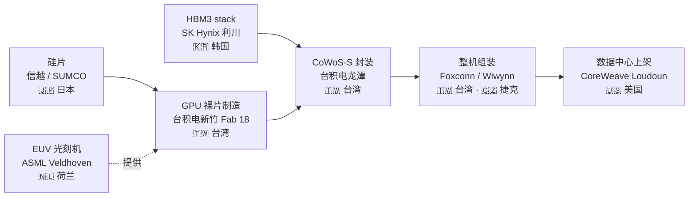
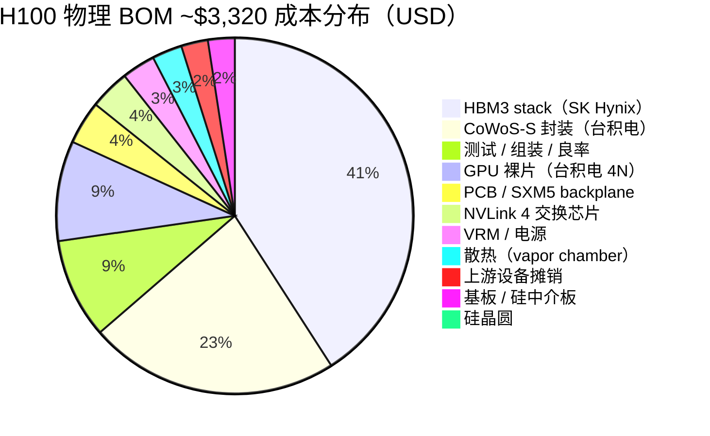

# 第 01 章 一张 H100 的旅程：从沙子到 token 的 BOM

## 本章概览

打开一台 8 卡 HGX H100 服务器，里面最贵的部件不是机箱、CPU 或者 800G 网卡，是 8 块巴掌大的金属外壳——封装着 8 张 NVIDIA H100 SXM5 GPU。

一台整机售价约 30 万美元，光这 8 张 GPU 就占 22-24 万。再往里拆，每张 H100 SXM5 渠道售价 25,000-30,000 美元，物理 BOM 估算约 3,320 美元。

> BOM = Bill of Materials，物料清单，下同。

从硅原料到出厂卡，价格抽象出**8 倍价差**。这 8 倍里发生了什么、谁拿走了哪一部分，是本书第一部要回答的问题，也是后续 30 章反复回引的物理基准。

这一章把这张 BOM 拆到能用的程度。一张 H100 的物理旅程跨 4 个国家、11 个环节、6 个月：

每一个箭头都对应一个真实的物理动作。硅片从信越或 SUMCO 的拉单晶炉里拉出来，进台积电 4N 工艺线走 1,000+ 道工序；HBM3 从 SK 海力士利川 M16 厂堆叠完成；GPU 裸片和 HBM3 在台积电龙潭的 CoWoS-S 封装线汇合；封装好的模组送到富士康嘉义或 Wiwynn 捷克工厂焊到 HGX 整机里；整机最后落到美国超大规模云厂或 CoreWeave 这样的 GPU 云数据中心上架。

本章对每个环节给出物理参数、估算成本、加价幅度、国别归属。

> **术语速查**：
> - ASML（荷兰阿斯麦）—— EUV 极紫外光刻机全球独家
> - 台积电（TSMC）——全球最大晶圆代工厂
> - SK 海力士——韩国 DRAM 大厂，HBM 市场主导者
> - CoWoS（Chip-on-Wafer-on-Substrate）——台积电自创的 2.5D 先进封装
> - 富士康（Foxconn）——台湾整机代工龙头
> - Wiwynn（纬颖）——台湾 ODM
> - CoreWeave —— 最大独立 GPU 云

本章的目标不是得到一个准确的成本数字——BOM 至少 6 项是第三方拆解或业内估算，公司不披露真实数字，谁说准确谁就是不诚实。本章的目标是建立一个所有人都能对照的基准，把每个估算的来源、时点、不确定区间标清楚。后续每章拎其中一环展开时，所有读者从同一张基准表出发，知道这个数字从哪里来、有多大水分、应该信几分。

对工程师读者，这章把每天 nvidia-smi 看到的那块卡拆成全产业链坐标。对金融读者，这章把财报里的半导体服务器数据中心分类映射到具体物理环节。两类读者从这一章开始有共同语言。

## 核心结论

读这一章前先看 5 句话——后面所有 BOM 拆解、地理分布、毛利率比较，都是在论证它们：

1. 一张 H100 物理 BOM 约 \$3,000-3,500、渠道售价 \$25,000-30,000 — **8 倍价差**是整条产业链价值流的总抽象。
2. 这 8 倍不平均分配 — 11 个环节里只有 4 个享受 50%+ 毛利率（上游设备 / 晶圆制造 / HBM / 加速芯片）。
3. 这 4 个高毛利环节高度集中在 **美 / 台 / 韩 / 荷**四个地理点 — 所谓全球供应链，在 AI 算力上是物理集中度极高的伪命题。
4. BOM 里至少 6 项数字是第三方拆解或业内估算（公司不披露）—— 必须明示数据缺口，绝不在缺口处编点估计。
5. 这张 BOM 是后续所有章节的物理基准 — HBM 反共识、CoWoS 紧缺、客户集中度、资本支出周期都从这里发芽。

## 1. 从 0.1 微米的硅片说起：H100 的物理起点

### 硅片到裸片

一张 H100 SXM5 的旅程，物理上从一片 12 英寸硅晶圆开始。晶圆从信越化学或 SUMCO 的拉单晶炉里拉出来，这两家合计占全球 12 英寸硅片产能约 50%。一片裸晶圆出厂价约 USD 150-200。

到了台积电新竹 Fab 18（5nm / 4nm 主力厂），要走 1,000+ 道工序，跨越数月。光刻、刻蚀、离子注入、沉积、量测、清洗——每一道都重复几十遍。每一道用的设备就来自这五家：[ASML](https://www.asml.com/)（光刻）、Applied Materials（沉积）、Lam Research（刻蚀）、KLA（量测）、东京电子（涂胶 / 显影）。

最关键的一步是 EUV 光刻。EUV 是 ASML 全球独家——荷兰 Veldhoven 工厂每年出货 40-50 台。[2025 全年交付 48 套](https://www.asml.com/en/investors/financial-results)，其中 46 台为低 NA EUV，单价约 1.83-2.2 亿美元；2 台为高 NA EUV，单价约 3.8 亿美元。

> 高 NA（High Numerical Aperture，高数值孔径）是下一代 EUV 平台，用于 2nm 及更先进节点。

EUV 光刻把 13.5 纳米波长的极紫外光打到光阻上，在硅晶圆上把电路图案缩印到 5 纳米线宽以下。这是把沙子变成 GPU 裸片过程里最难的物理工程之一。

走完 1,000+ 道工序，一片 12 英寸晶圆上能出 60-80 颗 GH100 裸片。

> GH100 是 H100 的 GPU 芯片代号，单裸片面积 814 mm²，集成 800 亿晶体管。来源见 NVIDIA Hopper Architecture In-Depth 技术博客，2022-03。

考虑边缘裸片、缺陷裸片、按性能分箱（binning），单片晶圆实际能用的 H100-class 裸片业内估算 40-50 颗。把晶圆成本摊到裸片上，台积电 4N 单颗 H100 裸片的制造成本业内估算 300 美元。

### CoWoS 封装

裸片从台积电新竹厂出来后，要送到台积电龙潭的先进封装厂做 CoWoS-S 封装。

> CoWoS 是台积电自创的 2.5D 先进封装工艺，把 GPU 裸片与 HBM 集成在同一硅中介层上。

CoWoS 流程的核心是中间那块硅中介板——台积电用一片硅晶圆切出尺寸约 2,500 mm² 的硅中介板，相当于标准 reticle 858 mm² 的 3 倍。然后分两步：先把 GPU 裸片和 HBM stack 用微凸块焊到硅中介板上（Chip-on-Wafer），再把这块硅中介板焊到 BT 树脂或 ABF 基板上（Wafer-on-Substrate）。三层叠加完成。

> ABF 全称 Ajinomoto Build-up Film，是高端封装的关键基板材料。

与 GPU 裸片并行送来的，是 **5 颗 HBM3 8-Hi stack**。每颗 stack 由 8 颗 DRAM 裸片加 1 颗 base 裸片用 TSV（硅通孔）垂直堆叠而成。单 stack 16GB、IO 接口 1,024 bit、带宽 819 GB/s。

5 颗加起来给 H100 SXM5 提供 80GB HBM3 容量、3.35 TB/s 总带宽。这 5 颗 HBM3 stack 来自 SK 海力士利川 M16 厂——H100 SXM5 量产期间，SK 海力士是独家供应商。

### 整机与上架

封装完的 H100 模组送到台湾的板卡组装厂，多数是富士康嘉义的服务器线，焊到 8 路 SXM5 backplane 上。

> SXM5 是 NVIDIA 自研的高密度 GPU 模组接口，用于 HGX/DGX 整机；backplane 即承载多张 SXM5 卡的主板基底。

板卡组装包含几道工序：组装散热片、加上 NVLink 4.0 互连芯片、嵌入 VRM、设计散热。

> NVLink 4.0 是 NVIDIA 自研的 GPU-GPU 高带宽协议，第 4 代单向带宽 450 GB/s，远高于 PCIe Gen5 的 64 GB/s。VRM（电压调节模块）把 12V 直流降压到 GPU 内部 0.7-1V 工作电压。

8 张 SXM5 卡，加一对 Sapphire Rapids CPU（Intel Xeon 第四代）或 Grace CPU（NVIDIA 自研 Arm 服务器 CPU），加配套主板、电源、机箱、网卡，组成一台 HGX H100 整机。整机额定功耗 6-8 kW，重量 100 公斤左右。

整机出厂后送到客户的数据中心。客户通常是超大规模云厂或 GPU 云的 colocation 机房。

> 超大规模云厂指亚马逊云、微软 Azure、Google Cloud、Meta、Oracle 等运营 100,000+ 服务器的超大规模云。GPU 云指 CoreWeave、Lambda、Crusoe 这类 AI 算力专门玩家。

上架、接电、接液冷、接 InfiniBand 网络、烧机几天后开始跑训练任务。

一颗硅原料经过 11 个环节、4 个国家、6 个月时间，最终变成 GPU·hour 形态租给模型公司或自建数据中心——一张 H100 的物理旅程到此为止。

下面把这条旅程的每一步拆成数字。

## 2. BOM 11 环节拆解：\$3,320 到 \$28,000 之间发生了什么

把 H100 的物理 BOM 按 11 个环节展开，每个环节带成本、毛利率、产地三列。三方拆解口径不一致是常态，本表用 Silicon Analysts 2026-04 数据为主，关键节点用 SemiAnalysis 历年 teardown、Bernstein 卖方研报、Epoch AI 蒙特卡洛模型交叉验证，差异超过 ±15% 的项目明示。

| 环节 | 子项 | 业内估算成本（USD） | 单环节毛利率（业内估算） | 产地 | 主要玩家 |
|---|---|---:|---:|---|---|
| 1 | 硅晶圆 | \$20 | 30-35% | 日本 | 信越 / SUMCO |
| 2 | 上游设备摊销 | \$80 | 50-60% | 美 / 荷 / 日 | ASML / AMAT / Lam / KLA / TEL |
| 3 | GPU 裸片（台积电 4N） | \$300 | 60-65% | 台湾 | 台积电 |
| 4 | HBM3 stack（5 颗 × 16GB） | \$1,350 | 60-65% | 韩国 | SK Hynix |
| 5 | CoWoS-S 封装 | \$750 | 业内估算 50-55% | 台湾 | 台积电 |
| 6 | 基板 / 硅中介板 / BT 树脂 | \$80 | 30-40% | 日 / 台 | Ibiden / Unimicron |
| 7 | NVLink 4 交换芯片 | \$120 | 70%+ | 台湾（台积电制造） | NVIDIA |
| 8 | VRM / 电源 / 滤波 | \$100 | 25-30% | 台 / 中 | MPS / Vicor |
| 9 | 散热（vapor chamber） | \$90 | 20-25% | 中 / 台 | AVC / Auras |
| 10 | PCB 板卡 / SXM5 backplane | \$130 | 15-20% | 台 / 中 | Foxconn / Wiwynn 板厂 |
| 11 | 测试 / 组装 / 良率损失 | \$300 | （计入板厂毛利） | 台 / 中 / 捷克 | Foxconn |
| | **物理 BOM 合计** | **~\$3,320** | | | |
| | **NVIDIA 渠道售价（业内估算）** | **\$25,000-30,000** | | | |
| | **8 倍价差归 NVIDIA + 渠道商** | **~\$24,500** | | | |

把 \$3,320 的物理 BOM 按成本占比画出来，HBM 一家占去 41%：

> **数据口径**：BOM 主体口径来自 Silicon Analysts AI Chip Costs Database 2026-04，方法论含 Epoch AI 蒙特卡洛、Raymond James 半导体研究、TrendForce 季度报告、SemiAnalysis teardown 交叉验证。Silicon Analysts 原口径只到 4 项（logic 裸片 \$300 + HBM3 \$1,350 + CoWoS \$750 + test/assembly \$920），本表将 \$920 进一步细拆为环节 1/2/6-11 的业内估算明细，属作者推演，单环节绝对值 ±20%。
>
> **毛利率口径**：综合台积电 FY25 整体 59.9%、SK Hynix FY25 营业利润率 49%、工业富联 FY25 整体毛利率 6.98% / AI 服务器 12-15%、ASML FY2025 52.8% 等公司财报反推，单环节毛利率属业内估算。
>
> **8 倍价差≠ NVIDIA 实际毛利率**：本表 87.7% BOM 毛利率指物理成本与渠道售价的倍数。NVIDIA FY26Q4 财报口径整体毛利率 GAAP 75.0% / 数据中心业务约 75%+，分母还要扣减 R&D、CUDA 软件、销售管理、保修等，与 BOM 不同口径，不可直接比较。
>
> **整机环节口径**：本表服务器整机环节统一用工业富联（601138，鸿海 Foxconn 的 A 股子公司）口径；鸿海母公司 FY25 合并报表 6.15%（含手机代工等低毛利业务），不混用。渠道售价综合 IntuitionLabs 2024 价格指南、Dell HGX H100 8-GPU 渠道报价（\$216,000 即单卡 \$27,000）、SemiAnalysis teardown；NVIDIA 不官方披露单卡出厂价。

把这张表纵向看一下，三件事跳出来。

### HBM 比 GPU 裸片贵 4.5 倍

GPU 裸片是 NVIDIA 设计、台积电制造，市场把它当作 H100 的灵魂。但物理成本上，5 颗 HBM3 stack 合计 \$1,350，是 GPU 裸片 \$300 的 4.5 倍。

这不是统计偶然，是 AI 加速卡架构的物理结果。HBM 把容量从 GDDR6 / GDDR7 的几十 GB 一跃推到 80GB 起步，把带宽从 GDDR7 的 1 TB/s 量级推到 3 TB/s 量级。这种低延迟、高带宽、大容量的组合是当下 AI 训练的硬约束——attention 计算是 memory-bound 的，HBM 容量与带宽直接决定 GPU 利用率。

HBM 的物理成本因此堆得很高：5 颗 stack × \$200-300 加 TSV 工艺，再叠 12-Hi 堆叠的良率损失。单卡里 HBM 占 BOM 的 41%，是产业链的物理特征，不是 NVIDIA 的定价选择。

这件事在第 6 章会展开为反共识 #2「HBM 价值远高于 GPU 裸片」的主战场。本章只把物理事实摆在桌上：单卡 BOM 里最值钱的部件是焊在 GPU 旁边的 5 颗 SK 海力士 HBM3。

### CoWoS 是另一个大头

CoWoS-S 单卡成本 \$750，是逻辑裸片 \$300 的 2.5 倍。

这同样反映物理工程的难度。CoWoS 硅中介板大小约 2,500 mm²，相当于 3 倍标准 reticle。上面要焊 1 颗 GPU 裸片、5 颗 HBM stack、数万根微凸块，整体良率串联损失大。台积电在 CoWoS 上单价高、毛利低于纯逻辑代工，是市场共识。

这件事在第 5 章会展开为「CoWoS 是被低估的物理瓶颈」。台积电 CoWoS 月产能 2024 年仅 35K 片晶圆，2025 年扩到 75K，2026 年目标 130K，是 2024-2025 全产业链最紧的环节。

### 8 倍加价的 NVIDIA 内部账本

把 BOM 看作 \$3,320，渠道售价看作 \$27,000（取区间中位），差额 \$23,680 是 NVIDIA 对客户收取的所有非物理成本。

这笔钱分四块：

- **CUDA 软件税**：开发者用 PyTorch、JAX、TensorFlow 时底层默认调 CUDA，NVIDIA 拿到的是框架层切换成本形成的护城河溢价。详见第 7 章。
- **研发摊销**：NVIDIA FY26 R&D 支出 \$18.497B。按 FY26 加速卡出货总量 600-800 万颗摊销，单卡 R&D 摊销约 \$2,300-3,100（R&D 总额覆盖全产品线，按加速卡分母摊销属上限估算）。
- **数据中心整机方案**：NVIDIA 卖的不仅是单卡，还有 NVLink Switch、InfiniBand 网卡（通过收购 Mellanox 获得）、DGX 系统软件、NVAIE 软件订阅。整机方案的 ASP 远高于单卡。
- **渠道分销加客户认证服务**：戴尔、HPE、Supermicro、联想这些 OEM 从 NVIDIA 拿货后加 5-10% 渠道差价，再卖给最终客户。

> CUDA 是 NVIDIA 的 GPU 编程框架，对 AI 训练栈是事实标准。ASP 即 Average Selling Price 平均售价。

\$23,680 里只有一部分进了 NVIDIA 口袋。FY26Q4 NVIDIA 整体 GAAP 毛利率 75.0%，扣除运营费用、税之后净利润率约 55-60%。也就是说一张 H100 单卡里，NVIDIA 净拿走约 \$15,000-18,000，其余 \$5,000-8,000 是渠道分销与运营摊销。

相对于 \$3,320 的 BOM，单卡净利仍然是 BOM 的 4-5 倍。这是产业链最浓的价值密度所在。

跨代看 H100 / B200 / GB200 三代的 BOM，会看到一条物理规律——HBM 占比一代代在涨：

- H100：HBM 占 41%
- B200：HBM 占 45%
- GB200：HBM 占 43%（多了 Grace CPU 摊薄了一点）

整条 BOM 演化的中心趋势是 HBM 占比上升、GPU 裸片占比下降。

> Grace 是 NVIDIA 自研 Arm CPU，B200 是 Blackwell 代 GPU；GB200 模组把两者打包。B200 单卡 BOM \$6,400、售价 ~\$40,000，毛利率业内估算 84%；GB200 模组 BOM 估算 \$13,500、售价 ~\$65,000，毛利率约 79%。

下面把这张 BOM 中的 GB200 NVL72 整柜对照拉出来。

## 3. GB200 NVL72 整柜的对照旅程

H100 SXM5 是单卡形态，2024-2025 是主力训练 / 推理加速器。NVIDIA 在 2024 年开始把整柜作为更高单位的销售方式。

GB200 NVL72 整柜里塞了 72 张 GB200 模组，含 36 颗 Grace CPU 加 72 颗 B200 GPU 加 13.4 TB HBM3E 内存。液冷散热，整柜功率 120 kW，重量 1.36 吨，给出 1.44 EFLOPS 的 FP4 推理算力。

> 1 EFLOPS = 10^18 次浮点运算每秒。

整柜售价业内估算 \$2.8-3.4 million。把这个数字拆开：

| 子项 | 业内估算成本（USD） | 占整柜比例 |
|---|---:|---:|
| 72 块 GB200 模组（GPU + CPU + HBM）BOM | ~\$970K（按 72 × Silicon Analysts GB200 单模组 BOM \$13,500 推算） | 物理 BOM 中约 81-86% |
| NVLink Switch tray + 第 5 代 NVSwitch（整柜内 GPU-GPU 互连，9 NVSwitch tray） | ~\$90K | 物理 BOM 中约 7-9% |
| 液冷系统 + Coolant Distribution Unit | ~\$120K | 物理 BOM 中约 10% |
| 整柜机架 / 电源 / InfiniBand 卡 / 测试 | ~\$50K | 物理 BOM 中约 4% |
| **整柜物理 BOM 合计（业内估算）** | **~\$1.0-1.2M** | |
| **NVIDIA 整柜出厂价（业内估算）** | **\$2.8-3.4M** | |

> 来源：BOM 数据综合 Silicon Analysts 2026-04 + SemiAnalysis 2024-03 "B100, B200, GB200 COGS, Pricing, Margins" 分析。整柜售价 \$3M 区间见 Tom's Hardware 2024 "Nvidia's next-gen Blackwell AI Superchips" + LaptopMedia 2024 + tweaktown.com 2024 多家报道，HSBC 2024 研报为原始估算来源。
>
> **口径说明**：本表 BOM 指模组级物料成本（裸片 + HBM + CoWoS 等物理材料），与 NVIDIA 模组出厂价（72 × ~\$65,000 ≈ \$4.7M）不可混。模组出厂价含 NVIDIA 毛利和 R&D 摊销，已包含在整柜出厂价 \$2.8-3.4M 里——NVIDIA 把模组直接组进整柜出货，没有先卖模组再装柜的双重加价。第 9 章 GB200 NVL72 整柜 BOM 推算法（含 NVSwitch tray、互连套件、整柜机架的全口径）给出更宽区间 \$1.0-1.2M，与本表口径一致。

GB200 NVL72 的价值密度更极端——整柜物理 BOM 业内估算 \$1.0-1.2M，出厂 \$2.8-3.4M，加价倍数 2.5-3 倍。

乍看 H100 单卡的 8 倍加价被压缩了，但这是因为整柜方案里 NVIDIA 把更多本来由板厂、OEM 渠道吃的部分自己内化了。72 张 GB200 加上 NVLink Switch、整柜级软件栈、液冷设计，NVIDIA 自己做，整柜 ASP 大涨而 BOM 加价倍数缩水。

绝对利润上，NVIDIA 单柜净拿 \$1.5-1.8M（按整柜售价 \$3M × 75% 毛利率，再扣 15-18% 运营费用反推）。

而 72 张 H100 单卡售卖给客户能给 NVIDIA 带来的总净利约 \$1.08-1.30M（按单卡净利 \$15K-18K × 72 推算）。

单柜 GB200 NVL72 给 NVIDIA 带来的净利明显高于等数量 H100 单卡的合计。整柜方案让 NVIDIA 把 OEM 渠道挤出去，自己吃掉了原本由戴尔、HPE 拿走的渠道毛利。这是 NVIDIA 在 Blackwell 时代主动做的产业链垂直整合，第 9 章会展开。

对客户而言，买一个 GB200 NVL72 整柜得到 1.44 EFLOPS FP4 算力。按 OpenAI 训练 GPT-4 公开估算 ~10^25 FP16 FLOPs，GPT-4 量级训练在 NVL72 上的等效推算时间，从几千张 H100 跑数月压缩到百柜级集群跑几周。

算力密度的跨代跃迁是超大规模云厂愿意付 \$3M / 柜的根本理由——NVL72 的单 EFLOPS 美元成本业内估算比 H100 集群低 30-40%。

整柜对单卡，BOM 结构的差异指向一件事：NVIDIA 在 Blackwell 一代把系统集成度作为新增价值层。单卡售价加价倍数下降但绝对利润上升，整柜级方案把 OEM 渠道毛利吞掉。这是 NVIDIA 议价权进一步上行的信号，第 7 章护城河会回到这条线。

## 4. 价值切片：毛利率沿产业链的分布

把这条产业链 11 个环节的毛利率横截面画出来，会看到一条 U 形曲线——两端高、中段低、下游极低。

先把这一节用到的金融术语对齐：

- **PE**：市盈率，市值除以净利润，估值倍数最常用口径
- **EBITDA**：息税折旧摊销前利润；重资产行业（IDC / GPU 云）的现金创造能力主要看这个
- **EV/EBITDA**：企业价值（市值加净债务）除以 EBITDA，跨资本结构可比的估值倍数
- **CR3**：行业前三家市占率合计
- **IDC**：数据中心；本书特指 colocation 数据中心运营商如 Equinix、Digital Realty
- **REIT**：房地产投资信托基金；Equinix、DLR 是 REIT 结构
- **PJM / ERCOT**：美国两大区域电力市场。PJM 覆盖东北部 13 州加华盛顿特区，ERCOT 覆盖德州。数据中心电力的现货价、容量价格由这两个市场出清

| 环节 | 单环节毛利率（业内估算） | 行业平均 PE 估值倍数 | 集中度（CR3 业内估算） |
|---|---:|---:|---:|
| 上游设备（ASML / AMAT / Lam / KLA / TEL） | 47-60% | 25-35x | 75% |
| 上游硅片（信越 / SUMCO） | 30-35% | 15-20x | 50%+ |
| 晶圆代工（台积电 4N） | 59.9%（FY25 整体）| 22x（TSM） | 90%+（先进节点） |
| HBM（SK Hynix / Samsung / Micron） | 49%（SK Hynix FY25 营业利润率）/ 60-65% 业内估算 HBM 单品毛利率 | 12-15x | 100%（三家全占） |
| CoWoS 封装（台积电） | 业内估算 50-55% | 22x（与台积电合并） | 100%（台积电主导） |
| 加速芯片设计（NVIDIA） | 75%+（NVDA FY26 GAAP）| 30-40x（NVDA） | 90%+ |
| 网络互连（Broadcom / Marvell / Astera） | 50-60% | 20-30x | 70%+ |
| 服务器整机（工业富联 601138 / Wiwynn） | 6.98%（工业富联 FY25 整体）/ 12-15% 业内估算 AI 服务器分品类 | 8-12x | 40% |
| 数据中心 IDC（Equinix / DLR） | 50%（EBITDA Margin，REIT 口径） | EV/EBITDA 22-28x | 30% |
| 电力（PJM / ERCOT 容量市场） | 通胀挂钩，难单独算 | 公用事业 12-18x | 分散 |
| GPU 云 / 超大规模云厂（CoreWeave / AWS） | 60% EBITDA（CoreWeave 业内估算）/ 30% 业务部门口径 | 10-50x（差异极大） | 60% |

> 来源：单环节毛利率综合各公司 FY25 一手财报（台积电 FY25 整体 59.9%、SK Hynix FY25 整体 49%、NVIDIA Q4 FY26 GAAP 75.0%、工业富联 601138 FY25 整体 6.98%、ASML FY2025 52.8%）+ 业内估算（CoWoS 单业务毛利率、HBM 单品毛利率，公司不分品类披露）。服务器整机环节用工业富联 A 股子公司口径（鸿海母公司 Hon Hai 合并报表 FY25 毛利率 6.15%，含手机代工等其他业务）。PE 估值倍数取 2026-05 区间业内常用值，仅作为口径参照，单环节内公司差异大。CR3 = 行业前三家市占率合计，业内估算。

把这张表的形状描述出来，是一条 U 形曲线。

- **两端高**：上游设备和加速芯片设计这两端，毛利率都在 50%+
- **中段半高**：晶圆代工、HBM、先进封装这三个环节都是 50%+ 毛利率的产业链腰部
- **下段低**：服务器整机毛利率 6-15%；IDC EBITDA Margin 50% 但 EV/EBITDA 倍数低
- **末端复杂**：GPU 云、超大规模云厂因为模式与折旧政策差异巨大，毛利率口径不可直接比较

U 形曲线对应的产业链含义是：算力链上的高利润玩家集中在四个国家——美国（NVIDIA、上游设备）、台湾（台积电）、韩国（SK 海力士、三星）、荷兰（ASML）。这四个地方的玩家拿走整条链 70-80% 的利润。

中段的服务器组装、IDC 建设、下游算力租赁则是脏活累活，绝对营收大、绝对利润薄、估值倍数低。

这件事是市场对算力链估值最普遍的误解之一。很多投资者以为算力火爆等于全产业链都受益，实际上利润高度集中分布，绝大多数链上玩家拿到的是规模而非利润。第 9 章 8-12% 毛利的脏活 会单独把服务器整机环节放大看。

## 5. 谁拿走了 8 倍加价里的多少

把 H100 单卡 \$25,000-30,000 的渠道售价（取中位 \$27,000）按链上玩家拆出来，看每家公司从这笔生意里实际拿到多少：

| 玩家 | 单卡拿到的金额（USD） | 占售价比 | 单卡净利润（业内估算） |
|---|---:|---:|---:|
| 信越 / SUMCO（硅片） | ~\$20 | 0.07% | ~\$6-7 |
| ASML（EUV 摊销 / 折旧） | ~\$30（业内估算摊销） | 0.11% | ~\$15 |
| 其他设备（AMAT / Lam / KLA / TEL）| ~\$50（摊销） | 0.19% | ~\$25 |
| 台积电（GPU 裸片 4N 代工） | ~\$300 | 1.11% | ~\$180（按台积电 FY25 整体净利润率 ~40% 估）|
| SK Hynix（HBM3 stack × 5） | ~\$1,350 | 5.00% | ~\$660（按 SK Hynix FY25 营业利润率 49%）|
| 台积电（CoWoS-S 封装） | ~\$750 | 2.78% | ~\$300（业内估算 CoWoS 毛利率 50-55%、减运营摊销）|
| 基板 / 板厂 / 散热（Ibiden / AVC 等）| ~\$400 | 1.48% | ~\$80-100 |
| 工业富联 601138（测试 / 组装 / SXM5 backplane） | ~\$430 | 1.59% | ~\$30-40（按 6.98% 整体毛利率 + 12-15% AI 分品类）|
| **以上 BOM 合计** | **~\$3,320** | ** 12.3%** | |
| **NVIDIA + 渠道分销** | **~\$23,680** | ** 87.7%** | NVIDIA 净拿 ~\$15,000-18,000 |

> 来源：BOM 子项分配综合 Silicon Analysts 2026-04 + SemiAnalysis 历年 teardown；台积电 CoWoS 毛利率公司不披露、业内估算 50-55%；SK Hynix HBM 单卡分到金额按 5 颗 stack × \$200-300/stack 估算；NVIDIA 净利润率按 FY26 GAAP 净利润率（综合 NVDA 各季 10-Q + FY26 全年）反推。所有玩家净利润数字属业内估算，单卡级利润分配不能逐项作为投资测算输入。

这张表的纵向结构很清楚：整条产业链 12 家以上主要上游玩家拿走的 BOM 部分 \$3,320，只占售价 12.3%。剩余 87.7%（约 \$23,680）由 NVIDIA 加渠道分销分掉。这是产业链最浓的事实。

进一步拆 NVIDIA 加渠道：

- NVIDIA 净拿约 \$15,000-18,000，按 FY26Q4 GAAP 毛利率 75.0% 加运营费用率 15-18% 反推
- OEM 渠道分销（戴尔、HPE、Supermicro 等）约 \$2,500-3,500，OEM 加价 10-15%
- NVIDIA 软件、NVAIE、服务费约 \$1,000-3,000，按企业版订阅价估算
- 运输、关税、保险、渠道库存约 \$1,000-1,500

NVIDIA 自身在单卡上的净利 \$15,000-18,000，链上其他 12 家以上主要上游玩家合计净利约 \$1,300-1,500——NVIDIA 一家拿走的净利润是产业链上游所有玩家净利润合计的 11-13 倍。

这是反共识 #5「客户集中度是 NVDA 估值反身性核心」（第 14 / 18 章答辩）的物理基础。NVIDIA 在单卡上的高净利依赖三件事：

- CUDA 软件生态形成的客户切换成本壁垒
- 数据中心方案集成度形成的整柜溢价
- HBM、CoWoS 双瓶颈条件下供给受限带来的定价权

三个条件中任何一个松动，NVIDIA 在单卡上的 \$15,000+ 净利都会被压缩。

把这条产业链利润分配的事实放回全书叙事——产业链是腰部加头部环节赚走绝大部分利润、下游脏活与渠道分到残余的结构。后续 30 章会反复回引：

- SK 海力士（第 6 章）分到 \$660，相对它整体业务的位置权重为什么这么高
- 台积电（第 4 / 5 章）在 CoWoS 上分到 \$300、GPU 裸片上分到 \$180，合计 \$480 是单卡上仅次于 NVIDIA 的金额
- 富士康（第 9 章）拿 \$430 上的 \$30-40 净利，对应整柜售价的微薄毛利率

## 6. 地理归属：从荷兰到弗吉尼亚的物理路径

把这 11 个环节摊到地图上，全球供应链这个词，在 AI 算力上其实是一个伪命题。

| 环节 | 国别 / 地区 | 替代可能性（业内估算） |
|---|---|---|
| 1. 硅晶圆 | 日本（信越 / SUMCO）| 中等：韩国 / 台湾有替代，但 12 寸高纯度硅片日本仍主导 |
| 2. EUV 光刻机 | 荷兰（ASML 唯一）| **极低**：无第二家。重建产能 10+ 年 |
| 3. 沉积 / 刻蚀 / 量测设备 | 美国（AMAT / Lam / KLA）| 中等：东京电子部分替代，中国国产有 28nm 替代但 5nm 及以下无替代 |
| 4. GPU 裸片制造 | 台湾（台积电新竹）| **极低**：4N / 5nm 节点 Samsung 仅次主，Intel Foundry 落后 1-2 代 |
| 5. HBM 制造 | 韩国（SK Hynix / Samsung）+ 美国（Micron 台湾 fab）| **极低**：三家寡占，CXMT（长鑫存储）落后 6-7 年 |
| 6. CoWoS 封装 | 台湾（台积电龙潭）| **极低**：Amkor / ASE 在补 CoWoS-class 能力，但产能跟进慢 |
| 7. 基板 / 硅中介板 | 日本（Ibiden）+ 台湾（Unimicron）| 中等：日本 ABF 基板 80%+ 集中度 |
| 8. NVIDIA 加速芯片设计 | 美国（Santa Clara）| **极低**：AMD MI300X 部分替代但 CUDA 生态差距大 |
| 9. 板卡 / 模组组装 | 台湾（Foxconn 嘉义 / Wiwynn）+ 中国大陆 + 捷克 | 高：多家 ODM 能做 |
| 10. 整机集成 | 台湾 + 中国大陆 + 捷克 + 墨西哥 | 高：Dell / HPE / Supermicro / Lenovo 多家 |
| 11. 数据中心上架 | 美国（Loudoun VA / Dallas TX / Phoenix AZ）+ 全球 | 中等：电力 / 网络是约束 |

> 来源：替代可能性评估综合本书第 3-10 章物理瓶颈分析。极低指替代供给方完整接手需 5-10 年，中等指替代供给方存在但需 1-3 年爬产能。

11 个环节里，6 个环节集中在台、韩、荷、美的极少数公司：

- ASML（荷兰，光刻）
- 台积电（台湾，GPU 裸片加 CoWoS 两个环节）
- SK 海力士（韩国，HBM）
- 三星（韩国，DRAM 与 HBM 第二供）
- NVIDIA（美国，设计）
- Applied Materials、Lam、KLA、东京电子（美、日，前道设备）

6 个环节里任何一个出问题，整条 H100 产业链就停摆。

地理集中度对中美科技博弈有几个直接含义。

### 出口管制以地点加公司为单位生效

美国商务部工业与安全局（BIS）2022-10、2023-10 两轮规则，把 GPU 裸片制造、设计、HBM 三道关键环节用 Foreign Direct Product Rule（外国直接产品规则，简称 FDPR）扣住。

只要含有 meaningful U.S. content 的设备、设计、软件，全球任何地点产品流向中国都需要美国许可。

这道工具的物理基础是：6 个关键环节中含美国成分的就有 5 个。ASML 虽然是荷兰公司，但设备里包含美国 CYMER 光源加 Applied Materials 配件。

### 台湾是物理重心

台积电占了 11 个环节里 2 个（GPU 裸片 4N 加 CoWoS-S）。

台湾在 H100 产业链上的被攻击半径是整条链最大的——一旦台海出现物理冲突，全球 H100 / B200 / GB200 / Rubin 出货量在 6-12 个月内归零。

这是反共识 #3「AI 不是 telecom 2.0」（第 29 章答辩）的一条结构性差异：电信时代的设备制造分散在欧美日中四地；AI 时代的物理瓶颈集中在台湾一地。

### 韩国半导体板块的位置

SK 海力士和三星占了 HBM 与 DRAM 主力 fab。

韩国在 H100 产业链上的贡献度经常被市场低估。只有看过 BOM 表 HBM 占 41% 这个数字之后，才会理解 SK 海力士 FY25 营业利润率为什么能冲到 49%（DRAM 行业历史最高），韩国半导体板块为什么在 2024-2026 这一波 AI 周期里跑出了 NVIDIA 之外最强的财务弹性。

### 数据中心物理上架地点

H100 装到整机后送到客户机房。以超大规模云厂为例：

- 亚马逊云主要在北弗吉尼亚 Loudoun、俄亥俄、俄勒冈
- 微软主要在弗吉尼亚、德州、亚利桑那
- Google 主要在俄勒冈、爱荷华、南卡
- CoreWeave 主要在弗吉尼亚、德州、内华达

地点选择由电力供应、长期 PPA、联邦或州税补贴、网络骨干位置共同决定。

> PPA = Power Purchase Agreement，长期固定价格的购电协议。

第 10 章和第 27 章会把数据中心电力地图单独展开。

## 7. 数据缺口清单：BOM 里我们承认不知道的 6 项

产业研究书的诚实标尺，是把知道什么 / 不知道什么分开放置。本节列出 H100 BOM 拆解里属于业内估算的 6 项，每项给出区间 + 估算来源 + 不确定度。

| 缺口 # | 数据项 | 估算区间 | 估算来源 | 不确定度（业内估算） |
|---|---|---|---|---:|
| 1 | NVIDIA 实际 BOM | \$3,000-3,500 | Silicon Analysts / SemiAnalysis / Bernstein 三方拆解 | ±15-20% |
| 2 | 台积电 CoWoS-S 单独毛利率 | 50-55% | 台积电不分品类披露；卖方研报反推 | ±10 个百分点 |
| 3 | HBM3 单 stack 出厂价 | \$200-300/stack | SK Hynix / Micron / Samsung 均不分品类披露 | ±15% |
| 4 | GB200 NVL72 整柜实际成交价 | \$2.8-3.4M | HSBC 2024 + 多家媒体共识；不同客户实际价差大 | ±15% |
| 5 | 台积电 4N 单颗 H100 裸片制造成本 | \$300（区间 \$280-340）| Silicon Analysts 晶圆成本 + 良率反推 | ±15% |
| 6 | NVIDIA 数据中心业务单卡净利 | \$15,000-18,000 | 由 GAAP 毛利率 + 运营费用率反推 | ±20% |

> 来源：各缺口的不确定度评估综合作者综合判断 + 业内研报披露的范围。所有数字属业内估算，绝不作为投资测算的输入。涉及上述数字时本书一律给区间不给点估计。

为什么这 6 项不能硬挤一个数字出来？

**缺口 #1：NVIDIA 实际 BOM**

NVIDIA 不披露 BOM，这是 fabless 公司的标准做法。所有第三方拆解都是从公开渠道拼出来的——台积电晶圆成本估算、SK 海力士 HBM 业务推算、富士康整机毛利率反推，再叠工程师团队对良率、按性能分箱的假设。

三方口径差异往往在 ±15-20%：SemiAnalysis 2023 给的是 \$3,200，Bernstein 给的是 \$3,500，Silicon Analysts 2026-04 给的是 \$3,320。本书取 \$3,320 作为中位估算，读者应理解这个数字有 ±500 的不确定区间。

> fabless 指无晶圆厂的芯片设计公司，下同。

**缺口 #2：台积电 CoWoS 单独毛利率**

台积电 FY25 整体毛利率 59.9%，Q4 62.3%，但 CoWoS 业务单独的毛利率不分品类披露。业内估算 50-55%，低于纯逻辑代工 4nm/3nm 的 65%+。CoWoS 良率仍在爬坡，单价低于先进逻辑节点。

本书在涉及 CoWoS 毛利率时一律标业内估算 50-55%。

**缺口 #3：HBM3 单 stack 出厂价**

SK 海力士、美光、三星都不分品类披露 HBM 单品价格。\$200-300 / stack 是业内估算。三家厂之间也有价差——SK 海力士对 NVIDIA 长合约价业内估算高于美光现货价 10-15%。

本书涉及 HBM 单价时一律给区间加业内估算。

**缺口 #4：GB200 NVL72 整柜实际成交价**

\$2.8-3.4M 是市场共识范围。不同客户的实际成交价差很大，超大规模云厂长合约价、二级 GPU 云价、政府客户价各不相同，NVIDIA 和 OEM 不公开分客户报价。

**缺口 #5：台积电 4N 单颗 H100 裸片制造成本**

依赖晶圆成本、良率、按性能分箱三个假设。晶圆成本 USD 17,000-20,000 / 12 寸，良率 60-70%，单片可用裸片数 60-80 颗，估算每颗裸片 \$200-350，取 \$300 作为中位。

不同分析师对良率假设差 10 个百分点，最终单裸片成本就有 ±\$50 区间。

**缺口 #6：NVIDIA 数据中心业务单卡净利**

NVIDIA 不分单卡披露净利。从 GAAP 毛利率 75% 加运营费用率 15-18% 加单卡售价 \$27,000 反推，单卡净利约 \$15,000-18,000，区间 ±20%。

6 项缺口里，#2 和 #3 在第 5 章 CoWoS 和第 6 章 HBM 单独展开，对这两个数据点做了更细的论证。其余 4 项缺口在涉及到的章节都按本表的区间加业内估算四字标识。

## 8. 怎么用这张地图

BOM 表搭好了，接下来 30 章每章拎其中一环或一条横向逻辑展开。下面给出哪个环节去看哪一章的导航表，方便不同读者按需阅读。

| BOM 环节 / 议题 | 对应章节 | 重点 |
|---|---|---|
| 硅片 / 上游设备 | 第 3 章上游设备 | ASML / AMAT / Lam / KLA 的隐形垄断结构 |
| GPU 裸片制造（台积电 4N） | 第 4 章晶圆代工 | 台积电工艺溢价 + 三家分蛋糕（台积电 / Samsung / Intel） |
| CoWoS 先进封装 | 第 5 章 CoWoS | 被低估的物理瓶颈——产能时间表与外包给 OSAT |
| HBM | 第 6 章 HBM | 反共识 #2「HBM > GPU 裸片」主战场 + 三家厂分化 |
| NVIDIA 加速芯片设计 | 第 7 章加速芯片 | 75% 毛利率护城河的五层拆解（CUDA + 系统 + 客户认证 + ...） |
| 网络互连（NVLink / InfiniBand / 以太网） | 第 8 章网络与互连 | Broadcom 的隐形 AI 红利 |
| 服务器整机 / SXM 板 | 第 9 章服务器与整柜 | 8-12% 毛利的脏活 + NVIDIA 垂直 onshore |
| 数据中心 / 电力 | 第 10 章数据中心与电力 | 钢筋水泥不是瓶颈，电是 |
| 双瓶颈机理（CoWoS + HBM）| 第 11 章双瓶颈物理学 | 为什么是真紧缺 |
| 2027 缓解节奏 | 第 12 章 2027 拐点 | 双瓶颈缓解时间表 + 三个预警信号 |
| 训练-推理-后训三段 | 第 13 章训-后训-推三段 | 需求侧 2027 之后的形态 |
| 算力商业模式（自建 / 长租 / 转租）| 第 15 章三种算力商业模式 | TCO / 折旧 / 利用率博弈 |
| GPU 云解剖 | 第 16 章 GPU 云解剖 | CoreWeave 60% EBITDA 的会计学张力 |
| 超大规模云厂算力账本 | 第 17 章三大云的算力账本 | 资本支出 / 折旧政策 / AI 回报路径 |
| 模型层 + 循环交易 | 第 18 章模型层与循环交易 | NVDA 关联投资 + 1999 vendor financing 复刻识别 |
| 美国 / 中国 / 东亚 / 全球格局 | 第 19-23 章全球格局 | 5 个反共识 #1 / #3 的地缘基础 |
| 周期定位与估值 | 第 29-30 章周期与估值 | 12 维度对照 + 5 种估值模板 |

工程师读者建议路线：直接从第 5 章 CoWoS 或第 6 章 HBM 进入（这两章对工程师每天接触的硬件有最直接的工程语言映射），再回到第 7 章 NVIDIA 护城河看自己的工程工作所在的产业位置。

投资者读者建议路线：从第 4 章 / 第 6 章 / 第 7 章看完链上主要利润分配后，直接跳到第 17 章超大规模云厂账本 + 第 18 章循环交易 + 第 29 章周期定位 + 第 30 章估值模板。

财经记者 / 产业研究员建议路线：按章节顺序读完前 11 章（产业链全景），然后选第 19-23 章地缘 + 第 31 章 12 个争议答辩。

跨章节的横向议题（如反共识洞察、12 个争议、5 年展望），统一在第 29-32 章答辩。

## 小结

这一章把一张 H100 拆到底，留下三件事进入下面 30 章。

### 反共识 #2 的物理基础

H100 单卡 BOM 里 HBM \$1,350，是 GPU 裸片 \$300 的 4.5 倍。这不是一句标题，是 Silicon Analysts 2026-04、SemiAnalysis 历年 teardown、Bernstein 卖方研报三方口径下的共同事实。

HBM 占 H100 BOM 的 41%、B200 的 45%、GB200 的 43%——跨代上升的物理规律。

这件事在第 6 章里展开为「至少在 2027 年 HBM4 三家同步爬坡之前，SK 海力士是产业链上议价能力被严重低估的隐形赢家」。

### CoWoS 的物理瓶颈

H100 BOM 里 CoWoS-S 封装 \$750，是 GPU 裸片的 2.5 倍。CoWoS 月产能 2024 年 35K 晶圆、2025 年 75K、2026 年目标 130K，整条 H100 / B200 / GB200 出货量被台积电 CoWoS 月产能决定。

第 5 章会把这条产能时间表拉长：2024-2025 全产业链最紧的环节为什么是台积电龙潭一座 AP 厂，Amkor 和 ASE 接外包为什么是台积电主动放产能，CoWoS 在 HBM4 时代为什么会跟 HBM 合并成同一个瓶颈。

### 产业链利润分配的反共识视角

H100 单卡 \$27,000 售价里：

- 物理 BOM \$3,320，占 12.3%
- NVIDIA 净拿 \$15,000-18,000，占 55-67%
- 渠道分销 \$5,000-8,000，占 18-29%

链上 12 家以上主要上游玩家拿走的 BOM 部分（除 NVIDIA 外），合计净利约 \$1,300-1,500。NVIDIA 一家拿走的净利润是产业链上游所有玩家净利润合计的 11-13 倍。

这条利润分配在第 7 章护城河、第 14 章客户集中度、第 18 章 vendor financing、第 29 章周期定位会被反复回引——它指向一个反共识判断：算力产业链是高度倾斜的分配，上游集中赚钱，下游分到脏活累活。水涨船高在这里不成立。市场把 AI 火爆等同于全链受益的常识需要修正。

接下来第 2 章会把算力抬到经济学层面——它作为生产要素的三重身份（资本、中间品、通用目的技术），与 H100 BOM 这张物理表的关系。然后从第 3 章开始，按产业链上游到下游的顺序，把 BOM 表中的每一环展开。

---

> 本章来自《算力经济学》开源版 · 作者「递归客」  
> 在线阅读完整书系：[inferloop.dev](https://inferloop.dev)
