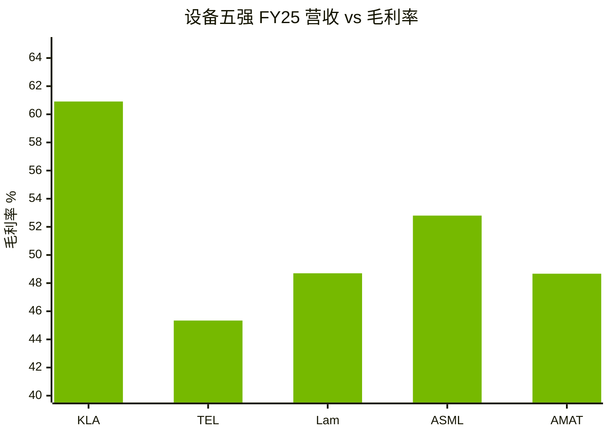
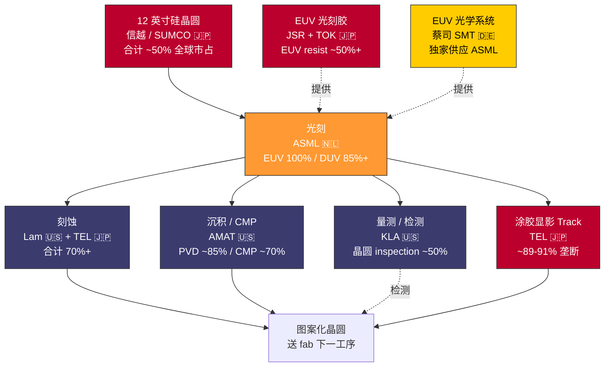

# 第 03 章 上游设备：ASML、应用材料、东京电子的隐形垄断

## 本章概览

把一张 NVIDIA H100 的 BOM 拆到尽头，这颗 814 mm² GPU 裸片上跑的每一道光刻、刻蚀、沉积、量测工序，加起来只用了大约 20 家公司的设备。

> 术语：BOM = Bill of Materials，物料清单，下同。

这 20 家又高度集中在 5 家头部 + 4 家关键材料厂手里。"5 + 4"摊开看，他们分别坐在荷兰、美国、日本三国。这套设备 + 材料供应链，是产业链上最隐蔽、毛利率最高、却最少被卖方研报反复讨论的一段。

这一段的经济学画像可以用三组数字定位。第一组，毛利率（按各家最新已披露财年口径，财年截止日不同详见脚注）：

| 公司 | 简称 / 定位 | 财年 | 毛利率 | 会计准则 |
|---|---|---|---:|---|
| [ASML](https://www.asml.com/) | 荷兰阿斯麦，EUV 全球唯一 | FY2025（截至 2025-12-31） | 52.8% | US GAAP（IFRS 约 51.8%） |
| [AMAT](https://www.appliedmaterials.com/) | 美国应用材料，沉积/刻蚀/量测多产品线龙头 | FY2025（截至 2025-10-26） | 48.67% | US GAAP |
| [Lam Research](https://www.lamresearch.com/) | 美国泛林半导体，刻蚀与沉积双强 | FY2025（截至 2025-06-29） | 48.70% | US GAAP |
| [KLA](https://www.kla.com/) | 美国科磊，量测设备绝对龙头 | FY2025（截至 2025-06-30） | 60.91% | US GAAP |
| [Tokyo Electron](https://www.tel.com/)（TEL） | 日本东京电子，涂胶显影绝对垄断 | FY2026（截至 2026-03-31） | 45.34% | IFRS |

把这 5 家放在 "毛利率 vs 营收" 坐标上看，KLA 是单点异常 —— 量测设备厂能拿设备五强里最高的毛利率：

> 单位：营收 ASML €32.67B / AMAT \$28.37B / Lam \$18.44B / TEL ¥2.44T / KLA \$12.16B。KLA 营收规模最小，但毛利率最高 —— 这是「软件 + 服务 + 客户切换成本」的结果，§3.5 展开。

来源：ASML / AMAT / LRCX / KLAC FY25 全年财报 + TEL FY26 全年决算资料，发布时点 2026-01 至 2026-05。一条产业链上排第二排的环节能集体维持 45% 以上毛利率，这种事在制造业里非常少见，作为对照中游 OSAT 封测厂（日月光 / Amkor）毛利率长年在 20% 上下。会计准则差异说明：ASML 和 TEL 用 IFRS、AMAT/LRCX/KLA 用 US GAAP，IFRS 下毛利率口径通常略低于 GAAP（IFRS 把更多生产性间接费用计入 COGS），但对 45-60% 这种结构性高位的判断不影响。

第二组，市占。EUV 光刻机 ASML 全球市占 100%；涂胶显影 TEL 全球市占 ~89-91%；CMP（化学机械抛光）AMAT 全球市占 ~70%；量测 KLA 在晶圆 inspection 单品类市占 ~50%。每一道工序背后的设备厂家数都极少，但单家份额极高——产业经济学里的「单极垄断 + 工序协同」结构。

第三组，2025-2026 在手订单画像。ASML 2024 年末合同储备约 €36B，2025 年订单继续向上，全年净销售 €32.67B。FY2025 全年增速明显分化：Lam +23.7%、KLA +23.9%（HBM / CoWoS 工艺受益最直接的两家）、ASML +15.6%、AMAT 仅 +4.4%（均衡型产品矩阵在 HBM 周期受益不集中），五家营业利润率维持在 25-41% 区间（TEL ~25.6% 到 KLA ~41.2%）。这条画像跟下游 CoWoS 和 HBM 的紧缺画像形成了一组很有意思的对照——**上游设备厂的产能是健康的、订单是消化得动的，而中游封装与存储是被订单堆爆的**。

这是本章要建立的最重要的反共识表态：**2026 年 AI 算力产业链的真正紧缺不在上游设备这一环，而在 ch05 讲的 CoWoS 先进封装与 ch06 讲的 HBM 高带宽显存上**。市场叙事经常把"光刻机紧缺""EUV 是产业链的最薄弱一环"挂在嘴边，但翻 ASML 的季度法说会和在手订单结构会发现：EUV 光刻机的产能远没有被打爆，主要客户台积电 / Samsung / Intel / SK Hynix 拿货节奏稳定；真正堆爆产线的是 CoWoS 那 65nm 的硅中介层光刻机产能 + HBM 那条 TSV 工艺线 + 蔡司 EUV 光学的有限供应——这些是中游封装与存储环节自己的瓶颈，不是上游设备的瓶颈。本章后面用合同储备数据、book-to-bill 比率、SUMCO 硅片亏损这些反向证据把这件事说清楚。

本章在第二部"产业链全景"里坐第一把交椅。第二部从沙子到 token 按物理顺序排开——上游设备 → 晶圆代工 → CoWoS 封装 → HBM → 加速芯片 → 网络互连 → 服务器整柜 → 数据中心电力。**ch03 是产业链最上游一格，承担"对照组"的叙事角色**：把它先讲清楚，读者再读 ch05 / ch06 时才能体会"对照组与真瓶颈"的差别——同样是产业链上的精密制造环节，为什么有些环节产能宽裕、有些堆爆订单。这种对照本身就是周期判断的工具。

边界先讲清楚。本章只写设备厂 + 材料厂在 2026-05 时点的横截面：谁在卖什么工具、毛利率多少、合同储备多紧、对华占比多少、12-18 月时滞怎么传导。**台积电怎么用这些工具做出 3nm / 2nm 晶圆留 ch04**；**CoWoS 那条 65nm 硅中介层产线为什么紧缺留 ch05**；**HBM 厂内 TSV 工艺细节留 ch06**；**出口管制对中国国产替代的效果评估留 ch26**。本章只描述"工具 + 时间线"，不评估管制效果。

数量级感觉。一座新建的 5nm / 3nm 晶圆厂资本支出（Capital Expenditure，资本性支出）约 \$200 亿美元（业内估算，台积电历史披露 + 业内研报综合），其中设备投入占 80%、土建占 15%、IT 与基础设施占 5%。设备 80% 里光刻机占 ~30-35%、刻蚀 + 沉积 + 量测 + 离子注入合计 ~50%、其余 ~15-20%（业内估算）。**一座 200 亿美元的晶圆厂里，大约 50-60 亿美元最终流到 ASML 一家、80-100 亿美元流到 AMAT + Lam + KLA + TEL 四家**——这五家加起来拿走 fab 资本支出的 70%+。这是上游设备厂毛利率稳定在 45-60% 的产业基础。

## 核心结论

读这一章前先看 5 句话——后面所有的合同储备、市占、毛利率、book-to-bill 数据，都是在论证它们：

1. **谁在赚钱**：设备五强（ASML / AMAT / TEL / Lam / KLA）+ 关键材料三家（蔡司 / 信越 + SUMCO / JSR），构成产业链最隐蔽、最少被讨论的高毛利环节。
2. **护城河是什么**：**专利 + 工艺协同 + 客户深度耦合**三层叠加，单纯市占率只是表象 — 光刻机背后是一整套与 fab 工艺联合调优的服务关系。
3. **滞后 12-18 个月**：设备订单 → 晶圆产能存在 12-18 个月时滞 — 这条传导链让上游永远比下游预期晚一拍，是周期预警的滞后指标。
4. **当前周期瓶颈不在这一环**：2026 上游合同储备健康、EUV 不紧缺 — 真正的紧缺在第 5 章的 CoWoS 和第 6 章的 HBM。
5. **地缘视角**：出口管制让上游变成中美脱钩最重要的"水龙头" — 管制效果评估在第 26 章展开，本章只描述工具 + 时间线。

## 3.1 设备五强 + 关键材料的全景

把上游半导体设备产业链分成 5 个核心工序 + 1 个材料层，对应的市场结构就是行业的「五强 + 三关键」拓扑：

> 图例：荷兰 🇳🇱（ASML）、美国 🇺🇸（AMAT / Lam / KLA）、日本 🇯🇵（TEL / 信越 / SUMCO / JSR）、德国 🇩🇪（蔡司）。整个上游产业链由这四国主导，没有第五个玩家。

**工序 1：光刻（lithography）**。把电路图案曝光到晶圆感光胶上的工序。这是芯片制造里精度最高、设备最贵、技术壁垒最深的一道。光刻设备按波长分三档：

- **EUV（极紫外光刻）**：波长 13.5nm，用于 7nm 以下逻辑节点和 1a/1b nm 以下 DRAM。ASML 是全球唯一供应商，2025 年市占 100%。NXE 系列单机定价约 \$200M、High-NA EUV（EXE-5000 系列）单机定价约 \$380M。
- **DUV（深紫外光刻）**：包括 immersion ArFi（193nm 浸没式，用于 28nm 至 7nm 逻辑、DRAM、CoWoS 65nm 硅中介层布线）、dry ArF（成熟节点）、KrF（248nm，较老节点和封装基板布线）。ASML 全球市占 ~85%+，尼康 + 佳能合计 ~15%。
- **i-line 光刻**：波长 365nm，用于 0.35-0.18 µm 老工艺，主要做模拟、电源管理芯片、CIS 图像传感器。AI 算力链上几乎用不到。

**工序 2：刻蚀（etch）**。把光刻定义好的图案"刻"到硅片上的工序。刻蚀分干法（plasma etch）和湿法。Lam Research 与 Tokyo Electron 是双强，AMAT 作为第三位竞争——三家合计市占 90%+。

在 AI 算力链最关键的几个先进刻蚀场景里：HBM 内部 TSV 深硅刻蚀以 Lam 为主，3nm / 2nm GAA 晶体管的多工序刻蚀以 Lam + TEL 为主。

> 术语：GAA = Gate-All-Around，环绕栅极。

**工序 3：沉积（deposition）**。在晶圆上沉积一层金属或介质材料的工序，包括 CVD（化学气相沉积）、PVD（物理气相沉积）、ALD（原子层沉积）。AMAT 是全球绝对龙头，PVD 单品市占 ~85%；ALD 这一段 TEL + AMAT + Lam 三家在抢市场。Lam 在 ALD copper、HBM 之间裸片 bonding 相关沉积工艺上份额较高。

AMAT FY2025 全年营收 \$28.37B，毛利率 48.67%、营业利润率 29.22%。AMAT 是「工艺组合」龙头——能同时给 fab 客户提供沉积 + 刻蚀 + 量测三类设备的少数几家。

**工序 4：涂胶显影 + Track（coater/developer）**。在光刻前后给晶圆涂感光胶、显影的辅助工序。听上去不起眼，但 track 设备必须跟光刻机精密配合。TEL 跟 ASML 之间的 Coater/Developer + Scanner 集成调试历史 30+ 年，TEL 全球市占 ~89-91%，形成事实垄断。

这是行业最深却最被外界忽视的护城河之一：你买 ASML 的 EUV 光刻机，几乎一定要配 TEL 的 track；反向也成立。TEL FY2026（截至 2026-03）全年销售收入 ¥2.44T 日元、毛利率 45.34%、营业利润率 25.57%。

**工序 5：量测 + 检测（metrology + inspection）**。每一道工序后给晶圆测厚度、线宽、缺陷的设备。这一段 **KLA 是绝对龙头**，晶圆 inspection 单品市占 ~50%、reticle inspection（光罩检测）单品市占 ~70%。

KLA FY2025（截至 2025-06-30）全年营收 \$12.156B、毛利率 **60.91%**、GAAP 营业利润率 41.2%、净利率 33.41% —— **这是设备五强里毛利率最高的一家**。

原因不是设备最贵，是量测系统跟 fab 内部的 process control software 高度耦合，客户切换成本极高 —— KLA 收的是设备 + 软件 + 服务三层费用。

**关键材料 1：蔡司 SMT**（德国 Carl Zeiss SMT，蔡司半导体制造技术分部）。EUV 光学系统的唯一供应商。

蔡司 SMT 为 ASML 的每一台 EUV 光刻机提供反射镜、镜头、光罩照明系统——一套 EUV 光学系统包含 6 块高精度反射镜，每块表面平整度误差小于 0.1nm（约一个原子直径）。**蔡司 SMT 占 ASML EUV 系统物料成本约 25-35%**。

这是一段"垄断之上的垄断"：ASML 在 EUV 上垄断全球，但 ASML 自己的 EUV 又被蔡司光学卡住喉咙。ASML 2016 年与蔡司签了长期独家供应协议，并在同年向蔡司投资 €10 亿欧元绑定关系。

**关键材料 2：硅片**（silicon 晶圆）。这是 fab 的"面粉"。**信越化学（4063.T）+ SUMCO（3436.T）两家合计全球市占 50-55%**，加上韩国 SK Siltron、台湾环球晶圆、德国 Siltronic，前五家合计 90%+。

数字对比很值得看：信越 FY2026 全年营收 ¥2.57T、毛利率 **34.22%**；SUMCO FY2025 营收 ¥409.67B、毛利率 ** 13.30%**、营业利润率 **-0.79%**——出现亏损。

SUMCO 的亏损是上游硅片"供过于求"的直接信号——硅片厂在 2024-2025 经历了一轮库存周期，跟 AI 算力 GPU 裸片端"紧缺"形成的反差，构成本章"上游不紧缺"的反向佐证之一。

**关键材料 3：光刻胶（photoresist）**。把图案"印"到晶圆上的感光化学品。EUV 光刻胶这一格分得很集中：JSR、东京应化（TOK）、信越、住友化学是 EUV 光刻胶的主要供应商，全部在日本。JSR 在 EUV 光刻胶子品类的业内估算份额 25-35%。

JSR 在 2023 年被日本政府控股的 JIC（日本产业革新投资机构）以 ¥9,039 亿日元私有化收购。产业含义清楚：日本政府不愿意让 EUV 光刻胶这条命脉环节落到外资手里。

把这一节压缩成一张设备 + 材料全景表：

| 工序 / 材料 | 龙头公司 | 市占（业内估算） | 单家代表性产品 | 2025/26 全年营收 | 毛利率 | 来源 |
|---|---|---:|---|---:|---:|---|
| EUV 光刻 | ASML（ASML.AS） | 100% | NXE-3800E / EXE-5000 | €32.67B | 52.8%（GAAP） | ASML FY25 全年财报 2026-01-28 |
| DUV 光刻 | ASML（ASML.AS） | ~85%+ | NXT immersion ArFi | 同上 | 同上 | 同上 |
| 沉积 + CMP | AMAT（AMAT） | PVD ~85% / CMP ~70% | Endura / Producer | \$28.37B | 48.67% | AMAT FY25 10-K（截至 2025-10-26） |
| 刻蚀 | Lam（LRCX） + TEL（8035.T） | 合计 70%+ | Kiyo / Sense.i / Tactras | LRCX \$18.44B / TEL ¥2.44T | LRCX 48.70% / TEL 45.34% | LRCX FY25 + TEL FY26 全年财报 |
| 涂胶显影 + Track | TEL（8035.T） | ~89-91% | CLEAN TRACK ACT 12 | ¥2.44T | 45.34% | TEL FY26 全年财报；TrendForce 2024 |
| 量测 + 检测 | KLA（KLAC） | 晶圆 inspection ~50% | 29xx / Cx 系列 | \$12.16B | 60.91% | KLAC FY25 10-K（截至 2025-06-30） |
| EUV 光学 | 蔡司 SMT（私有） | 100%（独家） | EUV 反射镜 + 镜头 | ASML SMT 分部 ~€3-4B 业内估算 | — | 蔡司集团年报 + 业内估算 |
| 硅片 | 信越（4063.T）+ SUMCO（3436.T） | 合计 50-55% | 12 寸 epi 晶圆 | ¥2.57T / ¥409.67B | 34.22% / 13.30% | 信越 FY26 + SUMCO FY25 年报 |
| EUV 光刻胶 | JSR（私有，前 4185.T） | EUV resist ~25-35% | EIDEC EUV resist | 已私有化（2024-04），不再披露 | — | JIC 收购公告 2023-06-26 |

> 注：所有公司财年起止不同；ASML / KLA / Lam / AMAT / 信越 / SUMCO 已统一标财年截止日，TEL 财年截至 2026-03 即 FY2026（按日本财年命名习惯）。所有市占数据为业内估算，单家公司均不分品类披露精确市占率，区间 ±5 个百分点。

读这张表的方式：5 家设备厂里 ASML 在欧洲，其余四家分布在美国（AMAT / Lam / KLA）+ 日本（TEL）；材料三家集中在德国（蔡司）+ 日本（信越 / SUMCO / JSR）。**整个上游产业链由"荷-美-日"三国主导**——这是 §3.7 讲地缘风险时反复要回到的物理基础。

这一节有一个数字最值得放大——KLA 的 60.91% 毛利率。这不是"设备最复杂"的结果，是软件、服务、高客户切换成本三层叠加的结果。

KLA 量测系统跟 fab 内部良率 management 系统深度耦合。客户的 process recipe、defect database、SPC 统计过程控制报告都长在 KLA 的软件平台上。换量测厂意味着把过去 10 年的 fab 工艺数据重做一遍——产业经济学里 Williamson 讲的「asset specificity」（资产专用性）。KLA 的 60% 毛利率本质上是这种专用性卖给客户的价格。

## 3.2 ASML EUV：单一公司垄断单一工艺的极致案例

把镜头进一步拉近到 ASML 这一家。ASML 在 EUV 光刻机上的地位是产业经济学里少见的「单一公司在一个不可替代工艺上的全球垄断」。这种结构在汽车行业相当于「全球只有一家公司能造发动机」，在化工业相当于「全球只有一家公司能合成某种关键单体」——但在半导体业，这种结构是真实存在的。

**ASML 的产品矩阵**。截至 2026-Q1，ASML 主销 4 类系统：

> 术语：NA = Numerical Aperture 数值孔径；ASP = Average Selling Price 平均售价。

1. **NXE 系列 EUV 光刻机**：低 NA（0.33）的 EUV，对应 7nm / 5nm / 3nm / 2nm 节点。代表型号 NXE-3800E。单机 ASP 约 \$200M（业内估算）。
2. **EXE-5000 系列 High-NA EUV**：高 NA（0.55）的 EUV，对应 2nm 以下节点（A14 / A10）。首批 EXE-5000 已在 2024-2025 出货给 5 家关键客户：IMEC、Intel、台积电、三星、SK 海力士。单机 ASP 约 \$380M。
3. **NXT immersion ArFi DUV**：浸没式 DUV，对应 28nm 至 7nm 节点、DRAM 1a-1b nm、CoWoS 65nm 硅中介层。2023 年之前对华出口畅通，2023-10 之后受 BIS 管制部分限制。单机 ASP 约 \$80-90M。
4. **NXT dry DUV + KrF/i-line**：成熟节点设备，单机 ASP \$30-50M。

> IMEC：比利时微电子研究中心，产业研发平台。

把这 4 类销售额结构画出来：FY2025 ASML 总营收 €32.67B 里，**EUV 系统营收 ~€10-12B、DUV 系统营收 ~€15-17B、Service + 备件 ~€5-6B**（业内估算）——三块加起来跟总数对齐。

EUV 系统单价高但出货数量受限，FY2025 全年 EUV 系统出货约 40-44 台。DUV 走量但单价低。Service 是稳定现金流，毛利率最高。

**EUV 的物理原理**（简要）。13.5nm 波长光在任何常规光学玻璃中都被吸收，所以整套 EUV 光路必须用反射式：用激光打锡液滴产生等离子体辐射 13.5nm 光，再用 6 块蔡司高精度反射镜把光导到晶圆上。一台 EUV 光刻机零件总数超 10 万件、重 180 吨——行业里讲 EUV 物理细节的科普已经太多，本章不展开。

**真正值得展开的是 EUV 的商业经济学**。ASML 在 EUV 上的毛利率业内估算 50-55%，显著高于 DUV 的 35-45%。原因有三：

1. **单一供应商定价权**——EUV 客户没有替代
2. **设备 + service 长合约捆绑**——每台 EUV 卖出去后客户签 10+ 年备件 + 软件 + 工艺协同合约，长合约毛利率比设备本身更高
3. **R&D 投入行业最高**——ASML FY2025 R&D 费用 ~€4.3-4.4B，占营收 ~13-14%

**EUV 累计装机数**。截至 2026-Q1 全球累计装机约 280-310 台。

- 台积电 ~100+ 台（占 ~35%）
- 三星 ~60
- Intel ~50
- SK 海力士 ~30
- 美光 ~15（HBM4 量产前部署节奏滞后）
- 其他研究机构（IMEC / Rapidus 等）~25-35

装机分布显示 EUV 客户高度集中——前 5 家拿走 90%+。这种集中度让 ASML 每次产能扩张前都跟客户精确对齐节奏，不太可能出现"产能严重过剩"。

**High-NA EUV 的进度**。High-NA 是 EUV 下一代——数值孔径从 0.33 提到 0.55，理论上单次曝光可以做到 2nm 以下节点（A14 / A10）的更小特征。首批 EXE-5000 系统在 2024-2025 出货给 5 家关键客户做工艺研发（口径与上文一致）。

**High-NA 真正量产用于商业 chip 至少要到 2026-2027 年**。这个时间表跟 NVIDIA Rubin 的对应关系是：Rubin 2026 末出货，仍用台积电 N3P / N3X 低 NA EUV；Rubin Ultra 2027 出货，才可能进 N2 + High-NA EUV。

本章因此可以明确说：**High-NA EUV 不是 2026 周期的瓶颈，它的产业经济学要到 2027-2028 才真正落地**。

**对华出口状态**。EUV 自 2018 起对华全面禁运——ASML 从未向中国大陆任何客户出货过任何一台 EUV。中芯国际现在跑的 N+1 / N+2 工艺（业内估算 7nm 等效）全部用 DUV 多重曝光实现，单晶圆曝光次数 3-4 次，对成本与产能都是双重压力。管制效果留 ch26。

**EUV 经济学一句话总结**：ASML 在 EUV 上的垄断是「设备 + 服务 + 客户长合约」三层叠加的复合垄断。这套结构的天花板不在 ASML 自己身上，而是上游蔡司光学产能 + 下游 fab 工艺爬坡能力两个独立约束。**EUV 不是当前周期瓶颈，客户拿货节奏稳定且产能跟得上**——这是本章反共识表态的第一根桩。

## 3.3 AMAT / TEL / Lam / KLA：刻蚀沉积量测三国杀的产品矩阵

ASML 在光刻上是单极垄断，但在刻蚀 + 沉积 + 量测这三个工序上，AMAT / TEL / Lam 三家形成了「三国杀」格局——每一家都有自己的强势工序，但三家产品线之间有大量重叠。这种「重叠竞争 + 局部专精」的结构是 fab 客户最喜欢的——它防止任何一家单独抬价。

把这四家在 AI 算力链关键工艺上的位置画一张分布表：

| 关键工艺场景 | 用到的设备类别 | 主导供应商 | 次要供应商 | 业内份额估算 |
|---|---|---|---|---:|
| 3nm / 2nm GAA 晶体管刻蚀 | 多步刻蚀 | Lam | TEL | Lam ~50% / TEL ~30% / AMAT ~15% |
| 3nm / 2nm 沉积 | CVD + PVD + ALD | AMAT | Lam / TEL | AMAT ~50% / Lam ~25% / TEL ~15% |
| HBM 内部 TSV 深硅刻蚀 | 深 Si etch | Lam | TEL | Lam ~60% / TEL ~30% |
| HBM bonding（die-to-die） | precision ALD + bond | Lam / AMAT | TEL | Lam ~40% / AMAT ~35% |
| CoWoS 65nm 硅中介层布线沉积 | Cu electroplating + CVD | AMAT / Lam | TEL | AMAT ~40% / Lam ~30% |
| 涂胶显影（所有节点） | Track | TEL | — | TEL ~89-91% |
| EUV 工艺前后量测 | Optical + e-beam metrology | KLA | AMAT | KLA ~55% / AMAT ~30% |
| Wafer-level 缺陷检测 | Optical inspection | KLA | AMAT / Onto | KLA ~50% / AMAT ~20% |

> 来源：业内估算综合 Bernstein 设备厂分析 2024、Lam Research FY25 10-K 提及主要竞争对手、TEL FY26 Investor Day、KLA FY25 10-K 自报市占。所有市占数据均属业内估算，区间 ±5-10 个百分点。

读这张表能读出几件事：

**第一，HBM 工艺链上 Lam Research 是真正赢家**。HBM 内部的 TSV 深硅刻蚀 + bonding 这两道工序加起来占 HBM 单 stack 制造成本的 25-30%（业内估算，详见 ch06 §2），Lam 在这两段的市占都在 40-60% 之间。

Lam FY2025 全年营收 \$18.44B、同比 +23.68%、营业利润率 32.01%。同比增速远超 AMAT 的 +4.39% 和 KLA 的 +23.89%（KLA 基数低）。Lam 的高增长直接反映了 HBM 与 CoWoS 工艺扩产的设备订单。

**第二，AMAT 是「工艺组合龙头」**。AMAT 不靠任何单一工艺称王，靠 5 大工序全覆盖、能给 fab 客户提供 turn-key 解决方案。

但 AMAT 的弱点是产品线太宽，每条线的"卓越"程度比不上专精对手——刻蚀比不过 Lam / TEL、量测比不过 KLA、涂胶显影比不过 TEL。AMAT 在 FY2025 增速只有 4.39% 的原因之一就是产品组合过于均衡，没有从 HBM / CoWoS 这波 AI 红利中拿到 Lam 那种集中爆发的增长。

**第三，TEL 的涂胶显影垄断比看上去更稳**。TEL 的 track 业务难打破，根源不在设备本身，而在它与 ASML 光刻机之间的集成调试关系。每一台 ASML 光刻机出厂前都要跟 TEL 的 track 做晶圆-by-晶圆的对齐校准。

这种 30+ 年的集成关系让 fab 客户即使想买 SCREEN 的 track 都得重新跑一遍校准——成本上不值。

> SCREEN：日本另一家涂胶显影厂，工序与 TEL 类似。

这是产业经济学里的「supplier lock-in」（供应商锁定），TEL 89-91% 的市占很大一部分价值就来自这种 lock-in。

**第四，KLA 是「软件 + 服务」龙头伪装成的设备厂**。KLA FY2025 全年毛利率 60.91%、GAAP 营业利润率约 41.2%、净利率 33.41%——这种利润率结构在制造业里很罕见，更像 SaaS 公司。

KLA 的核心产品是晶圆 inspection（成品晶圆缺陷检测）、reticle inspection（光罩缺陷检测）、in-process metrology（在制程量测）三类。但围绕这些设备，KLA 卖的是一整套良率 management 数据平台 + APC 先进过程控制软件 + service。

每一台 KLA 设备的初始售价大约 \$5-15M，但能拉动同等量级的软件 + 服务年费。**KLA 实际是 fab 内部的"工艺数据基础设施"**——这件事是 §3.5 讲护城河结构时要回到的关键点。

量测段值得补一句 ASML 的位置。ASML 2016-06 公告以约 \$3.1B 美元收购台湾 Hermes Microvision（HMI），2016-11 完成交割——HMI 是 e-beam metrology（电子束量测/检测）公司，跟 KLA 的 e-beam metrology 系列直接竞品。ASML 借这次收购在量测段补强了一块独立工序，但 HMI 在整体量测市场份额仍远低于 KLA，更多是「光刻设备厂顺手延伸到工艺前后量测」的战略动作，而不是量测段的主导玩家。

**FY2024 vs FY2025 同比增速对照**（这一组数字能直接说明上游设备厂正在「healthy 合同储备模式」）：

| 公司 | FY2024 营收 | FY2025 营收 | 同比增速 | 主要业务驱动 |
|---|---:|---:|---:|---|
| ASML | €28.26B | €32.67B | +15.6% | EUV + DUV 双发力 |
| AMAT | \$27.18B | \$28.37B | +4.4% | 中国节点设备需求 + AI 加速器配套 |
| Lam | \$14.91B | \$18.44B | +23.7% | HBM + 3nm 节点 + China |
| KLA | \$9.81B | \$12.16B | +23.9% | EUV 工艺量测 + China |
| TEL | ¥2.43T (FY25) | ¥2.44T (FY26) | +0.5% | 涂胶显影稳态 + 平台扩张 |

> 来源：ASML / AMAT / LRCX / KLAC FY24 vs FY25 年报对照（财年截止日：ASML 2025-12-31 / AMAT 2025-10-26 / LRCX 2025-06-29 / KLA 2025-06-30）；TEL FY25 vs FY26 全年决算资料（财年截至 2025-03-31 / 2026-03-31，按日本财年命名习惯）。

读这张同比表，Lam 与 KLA 是 23-24% 增速、ASML 16% 增速、AMAT 与 TEL 个位数增速。增速差异反映的是设备厂在 AI 工艺爬坡里的位置。

Lam（HBM + 3nm 工艺）和 KLA（EUV 量测）拿到了 AI 工艺链最敏感的位置，所以增长最猛。AMAT 因产品组合过宽被均衡稀释。TEL 因 track 业务已经是高基数、涂胶显影需求弹性较低，所以增速最慢。这套增速分化本身就是判断"哪一家在 AI 周期里更受益"的产业证据。

## 3.4 关键材料：蔡司光学、信越 / SUMCO 硅片、JSR 光刻胶

设备厂讲完，把镜头转到上游的"上游"——材料端。这一段比设备更隐蔽，因为多数材料厂不上市或者上市部分不分品类披露。但材料端的集中度比设备端更高，是产业链上真正最脆弱的几个节点。

**蔡司 SMT**。蔡司集团是德国百年光学公司，旗下分四大业务：医疗光学、半导体制造技术（SMT）、工业测量、消费光学。SMT 分部专做 ASML 光刻机的反射镜与镜头。

一套 EUV 光学包含 6 块大尺寸高精度反射镜，每块面积约 1 m²，表面平整度误差 < 0.1nm（约一个氢原子直径）——这是人类工程史上加工精度最高的光学元件。**蔡司 SMT 是 ASML 全系列光刻机的独家光学供应商**——DUV 也用蔡司光学。

蔡司 SMT 不独立上市，但通过蔡司集团年报和 ASML 财报反推：FY2024 营收 ~€3-4B、毛利率 60%+（业内估算）。SMT 分部占 ASML 每台 EUV 系统物料成本约 25-35%，按 EUV 单机 ~\$200M 计算，每出货一台 EUV 蔡司 SMT 就拿到约 \$50-70M 收入。

蔡司 SMT 是 EUV 产业链的真实物理瓶颈——蔡司每年能生产的 EUV 光学模组数量，决定 ASML 每年能出货的 EUV 系统上限。**ASML 2016 年花 €10 亿欧元投资蔡司，根源就在这条产能上限上**——锁住 EUV 光学产能避免别的客户分流。2023 年蔡司 SMT 与 ASML 又签 25+ 年延长合约，把"蔡司 → ASML"的独家关系固化到 2050 年代。

蔡司的存在揭示一件事：**在 EUV 这条工艺上，垄断主体是"ASML + 蔡司"二人组**——产业经济学里的「symbiotic monopoly」（共生垄断），比单家垄断更难撼动。

**硅片：信越 + SUMCO + SK Siltron + GlobalWafers + Siltronic**。半导体硅片这一段的市占结构相对稳定：**信越 ~30% + SUMCO ~25% + 其余三家合计 ~35-40%**（业内估算，Counterpoint 2024 综合）。

信越的护城河在 12 寸 epi 晶圆（用于 7nm 以下逻辑）和高端 SOI 晶圆上。这两种晶圆良率与表面平整度要求极高，信越在 1980 年代起就深耕。

信越 FY2026（截至 2026-03）全年营收 ¥2.57T、毛利率 34.22%——但这是集团合并数字，包含化学业务（PVC + 硅胶 + 稀土）。信越半导体硅片分部业内估算 FY26 营收约 ¥800-900B，分部毛利率约 40%+（业内估算）。

SUMCO 是这一段的"负面证据"。SUMCO FY2025 营收 ¥409.67B、毛利率 13.30%、营业利润率 -0.79%、净利 -¥11.75B——**出现亏损**。

SUMCO 比信越更纯粹做硅片，没有化学业务对冲，所以 2024-2025 硅片下行周期里它的财务直接暴露。产业含义：**硅片这一段在 2024-2025 经历了一轮明显的下行——库存高、需求弱、客户拿货推迟**。

为什么 SUMCO 亏损是"上游不紧缺"的反向证据？硅片是晶圆 fab 最上游的"面粉"。如果下游晶圆产能爬坡足够快、晶圆 fab 投产够快，硅片厂应该是供不应求的。

但 SUMCO 的亏损说明晶圆 fab 端拿硅片的节奏并不那么紧——台积电 / 三星 / Intel 在 2024-2025 拿货比预期慢，库存周转吃掉了硅片厂的利润。这是产业链最上游的真实信号：**上游不紧缺，紧缺在中游**。

**EUV 光刻胶：JSR / 东京应化 / 信越 / 住友化学**。EUV 光刻胶是把 13.5nm 波长光的图案"刻"到晶圆上的感光材料，全球能做到量产的厂家只有 4 家，都在日本。JSR 在 EUV 光刻胶子品类的业内估算份额 25-35%。

JSR 2024 年被日本政府控股的 JIC 以 ¥9,039 亿日元私有化收购。产业含义清楚：日本政府用"产业政策 + 国家投资"把 EUV 光刻胶这条命脉环节固定在日本控制之内，避免外资介入。这是日本在半导体材料端的一次明确"国家保留"动作，跟荷兰对 ASML 的态度类似——日本对 JSR 也设了实质性"主权门槛"。

**Ajinomoto ABF（味之素积层薄膜）**。CoWoS 与 GPU package 用的有机封装基板核心材料——味之素（Ajinomoto）的 ABF 薄膜全球市占 ~95%+（业内估算），是另一段被严重低估的隐形垄断。

ABF 是味之素集团总营收里的小部分，市场很少把味之素当成半导体股看。本章不展开，CoWoS 章 ch05 顺带提到。读者要记住：**封装基板这一段的"隐形垄断"是 Ajinomoto，份额比 ASML 在 EUV 还要高**。

材料端总结：蔡司 SMT EUV 光学 100%；信越 + SUMCO 12 寸硅片合计 ~55%；JSR + TOK + 信越 + Sumitomo EUV 光刻胶 4 家垄断；Ajinomoto ABF ~95%。**5 家关键材料厂 4 家在日本 1 家在德国**——国别集中度比设备端更高，也更难替代：设备可拆开仿制，材料分子级精度的化学合成与工艺协同更难复制。

## 3.5 设备-产能 12-18 月时滞传导链

把镜头从"哪家公司"切到"时间"。这一节给本章最重要的一个独立模型——**从 ASML 一份订单到台积电一片晶圆的 12-18 个月时滞传导链**——这是周期判断的滞后指标，也是解释「为什么上游永远滞后于下游预期一年」的产业经济学根基。

把这条传导链拆成 4 个阶段：

**阶段 1：订单 → 出货（T+0 至 T+6 至 T+12 月）**。客户（台积电 / Samsung / Intel / SK Hynix / SMIC）下订单给 ASML / AMAT / Lam / KLA / TEL，从签合同到设备发出工厂大约需要 6-12 个月——具体时长视设备类型而定。EUV 因为产能受蔡司光学制约，平均交付周期 12+ 月；DUV 与刻蚀沉积设备一般 6-9 月。

**阶段 2：fab 安装 + 调试（T+12 至 T+18 月）**。设备到 fab 后需要 3-6 个月做安装、调试、与现有产线的工艺联调。一台 EUV 系统的安装周期通常 4-6 个月——这一段是 fab 工程师 + ASML 工程师 + TEL track 工程师三方在 cleanroom 里联合作业的高度复杂阶段。

**阶段 3：良率爬坡（T+18 至 T+24 月）**。设备就位之后，新工艺要从 50-60% 初始良率爬到 80-90% 量产良率，平均需要 6-9 个月（参考 ch05 §5.2 讲 CoWoS 爬坡周期）。这段时间 fab 在产但产出不达标，单晶圆实际良品出货量低。

**阶段 4：量产爬坡（T+24 至 T+30 月）**。良率达标后，fab 按计划逐月把月产能从 5K → 10K → 15K 晶圆推上去。这一段是 fab 真正"出货"的阶段。

把这 4 个阶段叠起来，**从 ASML 一份订单到 fab 一片真正稳定量产的晶圆，端到端时间窗口是 18-30 个月——本书取业内估算中位数 12-18 个月（参考成熟工艺；新工艺 24-30 个月）**。这条传导链是物理上不可压缩的——再快的工程团队也得给设备安装 + 良率爬坡留出最低时间。

| 阶段 | 时间窗口 | 关键活动 | 业内估算 |
|---|---|---|---|
| 1. 订单 → 出货 | T+0 至 T+6/12 月 | 设备制造 + 物流 | EUV 12 月 / DUV 6-9 月 |
| 2. 安装 + 调试 | T+12 至 T+18 月 | Cleanroom 安装 + 工艺联调 | 3-6 月 |
| 3. 良率爬坡 | T+18 至 T+24 月 | 50% → 80% 良率 | 6-9 月 |
| 4. 量产爬坡 | T+24 至 T+30 月 | 月产能 5K → 15K 晶圆 | 6 月 |
| **端到端** | **T+0 至 T+18/30 月** | 订单 → 稳定量产 | **业内估算 12-18 月（成熟工艺）/ 24-30 月（新工艺）** |

> 来源：综合 ASML 2024 法说会披露 EUV 平均交付周期 + SemiAnalysis WFE Cycle 2024 历史综合分析 + 台积电 fab 爬坡历史 IR 资料（每年 Investor Day 披露的 N3/N5 爬坡节奏）。每一段时间窗口为业内估算中位数，实际单 fab 可能 ±20%。

**这条传导链的产业含义有三层**：

**第一层：上游合同储备是周期预警的"滞后指标"**。当台积电在 t 月签下晶圆大单，对应的 ASML 订单要 12-18 月才能转成真实的晶圆产能。观察 ASML 的合同储备节奏，看到的是 12-18 月之前下游的需求预期，不是当下的需求。

如果今天 ASML 合同储备还在涨，意味着 12-18 月前下游需求预期是涨的。如果今天 ASML 合同储备转跌，意味着 12-18 月前下游已经开始下调预期，但下游今天的实际需求可能已经更不一样。

**第二层：上游永远响应 12-18 月前的需求**。Forrester「鞭子效应」（bullwhip effect）在半导体设备产业链的物理体现——下游需求一次微小波动，传到上游会被时滞放大。

但反过来说，**只要上游合同储备节奏稳定，意味着 12-18 月前下游对未来的预期就是稳定的——既谈不上"过热"也谈不上"崩盘"**。2025 年末 ASML 在手订单 €38.8B 的份量就在这里——它反映 2024-2025 年期间台积电 / 三星 / Intel / SK 海力士对 2026-2027 晶圆产能需求预期的 robustness。

**第三层：补产能不能临时翻倍**。如果 2026 上半年下游突然需求暴涨 50%，ASML 没法在 2026 年内交出 50% 更多的设备。蔡司光学产能、ASML 装配线、客户 fab 安装能力都被锁定在 2024-2025 年决策的容量上。

**2026 年实际能出货的设备，是 2024-2025 年的决策结果，不是 2026 年的决策结果**。这是 §3.6 讲"上游合同储备健康 vs 下游紧缺"对比时的物理基础。

**这条传导链跟 ch05 / ch06 的关系**。CoWoS 与 HBM 也有自己的爬坡曲线——CoWoS 月产能从 15K → 130K（参考 ch05 §5.3）跨了 3 年；HBM 4 代切换三家厂同步爬产能跨了 2 年（参考 ch06）。这两条爬坡曲线都比上游设备产能更慢——设备厂 18-30 月的传导链 + 中游 fab/封装自己的 18-24 月爬坡周期 = 设备订单到中游量产稳定的总时间窗口可能拉到 36-48 月。这是产业链上"为什么瓶颈层层堆积"的物理底层。

## 3.6 2026 上游是不是瓶颈：用合同储备数据回答"不是"

这一节是本章反共识表态的扎实落地。把 2024-2026 上游设备厂的合同储备、book-to-bill、营收增速三组数据放在一起，跟下游 CoWoS / HBM 的紧缺画像对照——结论是清晰的：**上游不紧缺，紧缺在中游**。

**ASML 合同储备时间序列**：

| 时点 | Backlog 在手订单 | 主要披露 | 含义 |
|---|---:|---|---|
| 2022 年末 | €40B+ | ASML Q4 2022 财报 | 历史峰值，2021-2022 半导体超级周期 |
| 2023 年末 | ~€39B | ASML Q4 2023 财报 | 略下行，消费电子周期降温 |
| 2024 年末 | ~€36B | ASML Q4 2024 财报新闻稿 2025-01 | 稳态高位，AI 需求接棒消费电子 |
| 2025 年末 | €38.8B | ASML Q4 2025 财报 2026-01-28（一手） | 同比微升、维持高位 |
| 2026 年中（业内估算） | 与 €38B 接近 | ASML 中期跟踪 | AI 需求未现转折 |

> 来源：ASML 年度财报历年披露 + 2026-01-28 Q4 2025 财报披露 2025 年末合同储备 €38.8B（一手）。2024 年末 €36B 来自 ASML 2025-01 新闻稿。

**ASML book-to-bill（订单/营收比）**——上游设备产业链最敏感的领先指标。book-to-bill > 1 意味着订单进入速度比设备出货速度快（产能将持续上行），< 1 意味着订单减速（产能上行后劲不足）。

ASML 2024-2025 的 book-to-bill 在 1.0-1.4 之间波动，多数季度高于 1.0——订单速度持续覆盖出货速度，**合同储备未见结构性收缩**。

**ASML China 营收时间序列**：2023 全年 ~29% → 2024 全年 ~36.1%（中国 fab 在 BIS 2024-12 管制升级前抢拉货）→ **2025 全年 ~29% / €9.5B**（管制生效的直接体现）。

ASML 一手披露 FY25 中国营收 €9.5B 约占 29%，相较 FY24 36.1% 明显下行，是 BIS 管制对欧洲设备厂的最直接财务体现。

> 口径说明：ASML 对华营收存在两套公开口径并存——**全口径（含 service）FY25 €9.5B / ~29.1%**（ASML Q4 2025 6-K 与 Investor Presentation 主表口径，对应公司总营收 €32.7B），**纯系统销售口径（net system sales）FY25 €10.8B / ~33%**（ASML 同份资料系统销售分项口径，分母为净系统销售而非总营收）。两者均来自 ASML 一手披露，差异源于是否纳入售后服务收入。本章统一用全口径 ~29%；ch11 / ch20 / ch22 涉及纯系统销售对比时按 ~33% 口径标注，两套数字均正确，差异是统计口径不是数据冲突。

**AMAT / Lam / KLA / TEL China 营收占比**（FY2025 / FY2026）：

- AMAT ~30%
- Lam ~34%
- KLA ~33%（FY25 全年口径；Q4 单季度 ~30%）
- TEL FY26 ~32%（FY25 同口径 ~38%；FY26 Q1 单季 38.6%）

四家美日设备厂对华占比集中在 32-34% 区间，相较 2023-2024 高点系统性下行 5-10 个百分点（KLA FY24 42.8%、AMAT / LRCX 36-44%、TEL 38%）。**这是上游设备厂面对地缘风险的最直接财务画像**。

TEL FY24 → FY25 → FY26 三段时间序列（~38% → 同口径 ~38% → ~32%）显示日系涂胶显影龙头同样在管制下被迫降低对华敞口，节奏比美系略慢但方向一致。

**与下游 CoWoS / HBM 紧缺对比的对照证据**：

| 指标 | 上游设备 | 中游 CoWoS / HBM |
|---|---|---|
| 2025-2026 合同储备状态 | ASML 2025 年末 €38.8B 稳态、AMAT/Lam/KLA 合同储备健康 | CoWoS-S/L 全部 "fully booked"（TrendForce 2025-12-08）；HBM3E 12-Hi 满载，HBM4 量产前期 |
| 客户拿货状态 | 多数 fab 客户按既定路线拿货 | NVIDIA / Broadcom / AMD / Google 抢单，Broadcom 2026 加单（TrendForce 2025-08-29） |
| 产能利用率 | 2024-2025 设备厂产能利用率 80%+（业内估算） | 台积电 CoWoS 月产能 35K → 130K 跨 3 年仍不够（参考 ch05 §5.3） |
| 营收增速 | ASML +15.6% / AMAT +4.4% / Lam +23.7% / KLA +23.9% | SK Hynix HBM 业务 +60%+ / 台积电先进封装业务三位数 |
| 单晶圆等效产品价格 | EUV 单台 \$200-380M 稳定（业内估算） | HBM3E 每 stack \$300，2025-2026 反向涨价 +20%（TrendForce 2025-12-24） |
| 上游 raw 信号 | SUMCO 硅片 FY25 亏损 ¥11.75B（出现库存周期） | 蔡司 EUV 光学供应紧、Ajinomoto ABF 满载 |

> 来源：综合上文已引用各家财报 + ch05 / ch06 已 verified 数据。每一行的对照都来自公开披露 + 业内估算。

读这张表，结论非常清楚：**上游设备厂处在"健康的高合同储备周期"——订单充足、产能稳态、增速可控。中游 CoWoS / HBM 处在"被订单堆爆周期"——产能 fully booked、客户抢单、价格反向上涨**。这两组画像差别明显，是产业链分层瓶颈最直接的财务证据。

**业内估算「上游不紧缺」的可证伪条件**。本书对这一判断的可证伪条件是：

- **基线**：2026 年内 ASML 在手订单维持 €30B+ 量级、AMAT / Lam / KLA 合同储备不出现结构性收缩、book-to-bill > 0.9
- **阈值**：如果 ASML book-to-bill < 1.0 持续 3 个季度，且台积电 / 三星 / SK 海力士任一家公开宣布推迟设备交付 → "上游不紧缺"判断失效
- **时间窗口**：2026-2027（本章 data cutoff 至 2026-05，监测期到 2027-06）
- **监测来源**：ASML 季报合同储备披露、SEMI Equipment Market Forecast 月度更新、AMAT / Lam / KLA 季报 China 收入分布

这种「基线 + 阈值 + 时间窗口 + 监测来源」的四件套，是产业研究里把"反共识判断"做成"可证伪命题"的标准格式（参考 ch29 §6 周期定位的相同表达）。这套表达不是为了"骗自己一定对"，是为了给读者一个 12 个月之后可以回来核对的清单。

## 3.7 地理分布与地缘风险：4 问格式

设备 + 材料的产业全景画完，地缘维度自然落到本章末尾。但本章对地缘维度采用"克制描述"——只描述工具与时间线，不评估管制效果，留 ch26 展开。

按 4 问格式拆解：

**问 1：产能国别**。设备五强：ASML 荷兰、AMAT / Lam / KLA 美国、TEL 日本。材料三关键：蔡司德国、信越 / SUMCO / JSR / Ajinomoto 日本。**整套上游链由"荷-美-日"三国共同主导**——这不是巧合，是冷战后 30 年技术联盟的物理延伸。三国之间在半导体设备 / 材料的技术协作 + 标准互认 + 出口管制协调上已经形成事实联盟。

**问 2：出口管制状态**（时间线）。这一段按时间顺序排：

| 时间 | 公告 / 事件 | 管制对象 | 来源 |
|---|---|---|---|
| 2018-09 | 美国 EAR 升级 + 荷兰 ASML 表态 | EUV 全面对华禁运（含香港） | 业内综合 |
| 2022-10-07 | BIS Federal Register 87 FR 62186 | 16/14nm 以下逻辑、18nm 以下 DRAM、128 层以下 NAND 设备对华管制 | Federal Register 2022 |
| 2023-01 | 美 + 荷 + 日三方协议 | 荷兰 ASML 全部 EUV 系统 + 部分 immersion DUV 加入对华管制 | 公开报道综合 |
| 2023-10-25（出版）/ 2023-11-17（有效） | BIS 88 FR 73424 升级 | 高级 immersion ArFi DUV 管制升级；扩大对华设备出口许可要求 | Federal Register 2023 (88 卷) |
| 2024-09 | 荷兰政府明示 ASML 不再向 SMIC 出货新 DUV immersion | DUV immersion 部分撤销许可 | 荷兰外交部公告 |
| 2024-12-02 | BIS Interim Final Rule（IFR）89 FR 96790 | 进一步扩大设备 + HBM 管制，加入新 entity list | Federal Register 2024 (89 卷) |
| 2025 全年 | 多轮 entity list 扩充 | SMIC / 长江存储 / CXMT 等不断进入管制 | 业内综合 |

> 来源：BIS Federal Register 公告 + 公开报道综合（具体公告号 2022 87 FR 62186 / 2023 88 FR 73424（出版 2023-10-25，有效 2023-11-17）/ 2024-12 IFR 89 FR 96790）。完整时间线见 data/03-upstream-equipment/export-control-timeline.csv。

这条时间线的产业含义：**EUV 自 2018 起全面禁运、高端 DUV 自 2023 起逐步升级、2024-2025 进入对设备 + 材料的全方位强化管制**。中国大陆的国产替代路径无法绕开这套管制——上海微电子（SMEE）+ 北方华创（NAURA）只能在管制夹缝中谋求突破。

**问 3：可替代成本**。国产替代设备的真实节奏：

- **光刻**：上海微电子 SSA600 系列（业内估算 28nm 等效）目前还在试产爬坡。从 28nm 到 7nm 等效的国产替代路径，业内估算需要 **8-12 年**。主要瓶颈在三个并行：蔡司 EUV 光学的国产替代极困难、JSR EUV 光刻胶的国产替代、TEL 30+ 年集成调试关系的国产替代。
- **刻蚀 / 沉积**：北方华创、中微公司在 28nm 等效节点上已实现部分国产替代，但 5nm 以下 GAA 工艺的国产替代节奏仍滞后 5-7 年。
- **量测**：精测电子、上海微电子量测分部在晶圆缺陷检测上有小批量替代，但 KLA 那套量测 + 软件 + 服务平台的国产替代节奏滞后 8-10 年。

**问 4：断供冲击半径**。假设荷-美-日三国对中国大陆所有半导体设备 + 材料完全断供（地缘极端假设）：

- 一周内：依赖美/日/荷备件、化学品、软件更新的 fab 立即出现工艺问题（备件库存通常 < 2 周）
- 1-3 个月内：现有先进 fab 因备件耗尽、软件更新中断 → 全面停产
- 6-12 个月内：消费电子级 fab 也开始受影响

国产替代力量在 1-12 个月内**无法填补**这种突然断供的物理缺口。但现实中管制总是渐进升级，给国产替代留出爬坡时间。**管制效果评估留 ch26 展开——本章只描述工具 + 时间线**。

## 3.8 经济学含义：议价权、护城河、毛利率与什么相关

把这一章压回经济学维度——上游设备厂为什么能稳定维持 45-60% 毛利率？这是产业经济学层面值得拆解的问题。

**议价权来源**。设备厂面对的下游客户是台积电 / 三星 / Intel / SK 海力士 / 美光 / 中芯国际——少数几家超大规模 fab。

理论上"客户集中度高 = 客户议价权强 = 设备厂被压毛利"，但实际数据恰恰相反，设备厂毛利率稳定在 45-60%。这种反直觉现象的解释来自三个相互叠加的力量：

**力量 1：单一供应商**。EUV 全球只有 ASML 一家、track 只有 TEL 一家、EUV 光学只有蔡司一家、ABF 只有 Ajinomoto 一家。fab 客户即使再大也没有「换厂」的选项——要做 7nm 以下逻辑，就必须买 ASML 的 EUV。这是产业经济学里的「critical input monopoly」。

**力量 2：工艺协同**。每一台 EUV 光刻机的工艺参数都是 ASML 工程师 + 客户 fab 工艺工程师联合调优 18-24 个月才能稳定。这套调优数据 + know-how 是 client-specific 的——客户换设备意味着丢掉这套调优数据。这是产业经济学里的「process-specific tacit knowledge」（工艺特定默会知识），一种比专利更深的护城河。

**力量 3：客户长合约**。每台 EUV 卖出去之后，客户必须签 10+ 年的备件 + 服务 + 软件更新合约。这部分长合约的毛利率比设备本身更高，业内估算 60%+。**ASML 的真实商业模式是「设备一次性收入 + 终身年费」**——跟 SaaS 公司的逻辑一致。

把这三种力量叠在一起，设备厂的护城河结构是：**单一供应商（30% 权重）+ 工艺协同（40% 权重）+ 客户长合约（30% 权重）**。三层叠加才形成了"客户集中度高反而设备厂毛利率高"的产业经济学画像。

**毛利率与什么相关**：

- **跟 R&D 投入正相关**：ASML R&D/营收 ~13-14%、KLA 13%+、Lam 12%+、TEL 11%+、AMAT 10%+——R&D 占比越高毛利率越高，R&D 是护城河投资
- **跟产品组合宽度反相关**：AMAT 产品组合最宽（沉积 + 刻蚀 + 量测 + 离子注入全覆盖）毛利率最低（48.67%）；KLA 最专精（量测一条线）毛利率最高（60.91%）
- **跟客户切换成本正相关**：KLA 量测系统嵌入 fab 良率 management 数据库，客户切换成本最高
- **跟客户集中度无明显关系**：设备业客户集中度高反而推高毛利（因为单一供应商效应），跟下游 NVIDIA 客户集中度对自己的风险方向相反

**周期敏感度**。上游设备业是「领先指标」型产业，合同储备节奏比下游营收提前 12-18 月。这种特性让设备股波动通常比下游股票更大——2018 年加密矿难、2022 年消费电子下行都直接打到了设备业合同储备上。

但 AI 周期 2023-2026 与之前不同：AI 需求结构性接管了消费电子让出的产能空间，上游设备业没有经历明显下行。

## 3.9 章末小结：本章主张与可证伪条件

**本章主张**（一句话）：**2026 年 AI 算力产业链的真正紧缺不在上游设备这一环——ASML / AMAT / TEL / Lam / KLA 的产能与合同储备都处在健康的高 booking 状态；真瓶颈在中游 CoWoS 封装与 HBM 高带宽显存**。这是本章对市场叙事"光刻机紧缺"、"EUV 是产业链最薄弱一环"的反共识表态。

**可证伪条件**：

- **基线**：2026 年内 ASML 在手订单维持 €30B+ 量级、book-to-bill > 0.9、AMAT / Lam / KLA 合同储备不出现结构性收缩。
- **阈值**：如果 ASML book-to-bill < 1.0 持续 3 个季度 + 任一关键客户（台积电 / Samsung / Intel / SK Hynix / SMIC）公开宣布推迟 EUV / immersion DUV 设备交付 → 反共识失效。
- **时间窗口**：2026-2027（监测期至 2027-06）。
- **监测来源**：ASML 季报合同储备 + book-to-bill 披露、SEMI Equipment Market Forecast 月度更新、AMAT / Lam / KLA / TEL 季报中国营收分布。

**本章 5 个独立观察**：

1. **设备五强毛利率 45-60% 是「单一供应商 + 工艺协同 + 客户长合约」三层叠加的复合护城河**，单纯市占率领先只是表象。
2. **KLA 是设备五强里被严重低估的"量测软件 + 服务"龙头**——60.91% 毛利率结构更像 SaaS 公司。
3. **SUMCO FY2025 出现亏损是"上游不紧缺"最强的反向证据**——硅片厂亏损说明晶圆 fab 端拿货节奏没那么紧。
4. **「设备-产能 12-18 月时滞」是周期判断的滞后指标**——观察上游合同储备看到的是 12-18 月前下游的预期，而不是当下的需求。
5. **蔡司 SMT 与 ASML 是"symbiotic monopoly"（共生垄断）**——这种结构在产业经济学里比单家垄断更难撼动。

**本章在第二部的位置**。本章作为产业链全景的开篇，承担"对照组"叙事——上游不紧缺，紧缺在中游。读完本章后，读者带着「上游合同储备健康」的认知去读 ch04 / ch05 / ch06，能更敏感地体会"哪些环节是真物理瓶颈"、"哪些是叙事瓶颈"。这是产业链定位最重要的工具：**用对照组识别真瓶颈**。

承接下一章。ch04 从晶圆代工切入，把镜头从设备厂、材料厂转到 fab 厂。台积电在 7nm 以下先进逻辑节点市占 90%+ 的护城河如何形成？三星 Foundry 为什么在 3nm 上反复受挫？Intel Foundry 与中芯国际各在自己的轨道上扮演什么角色？

这些问题在 ch04 展开。本章建立的"上游设备视角"是 ch04 的输入：每一台 EUV、每一台刻蚀机、每一台量测设备，最终都汇集成 fab 那条产线，而 fab 那条产线决定了 NVIDIA / AMD / Google 能否拿到自己想要的晶圆。

---

> 本章来自《算力经济学》开源版 · 作者「递归客」  
> 在线阅读完整书系：[inferloop.dev](https://inferloop.dev)
