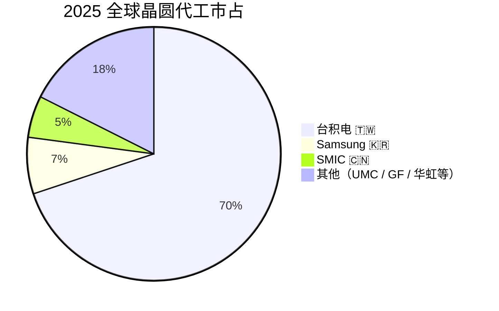
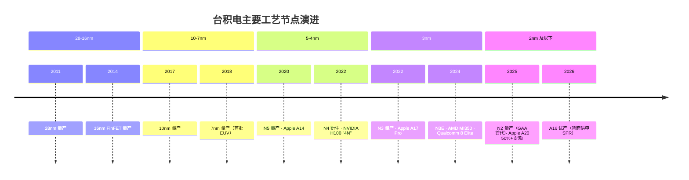
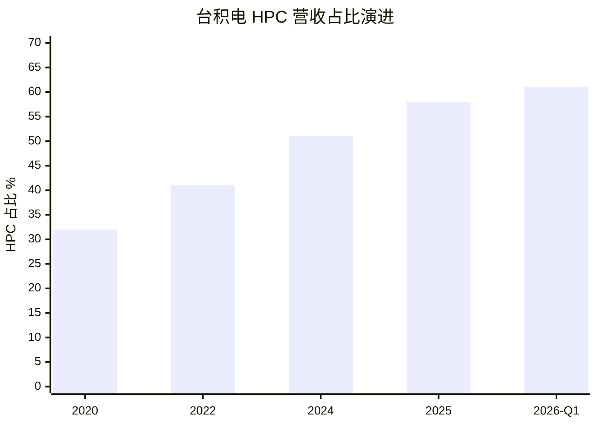
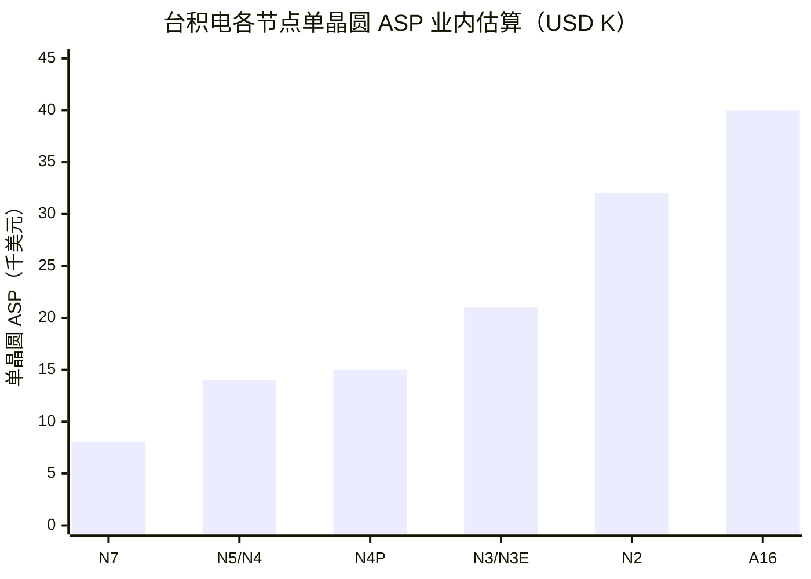
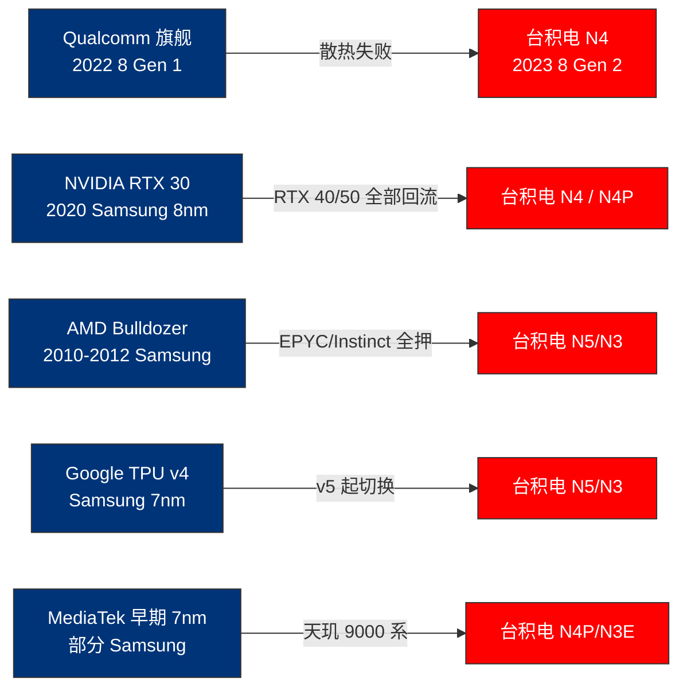
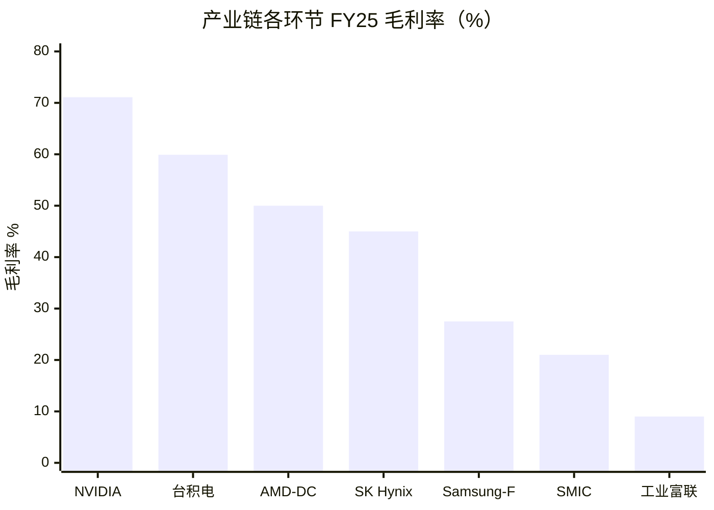
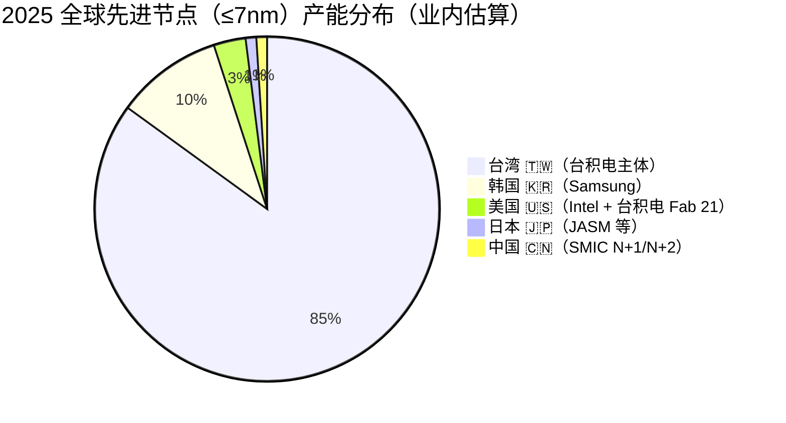

# 第 04 章 晶圆代工：台积电的工艺溢价与三家分蛋糕

## 本章概览

[台积电](https://www.tsmc.com/)是全球最大晶圆代工厂，2025 年合计代工市占 69.9%。同一报告里[三星](https://www.samsung.com/semiconductor/) Foundry 2025 全年市占 7.2%、中芯国际（SMIC）5.32%。第一名比后两名之和大 6 倍——这是全球工业里少见的"一家分大头、其他分零头"结构。

> 三星 Foundry 是三星电子代工部门，与三星 DS 半导体部门混合披露。中芯国际是中国大陆最大晶圆代工厂。



把镜头拉近到先进节点（≤7nm），这个差距还要再放大一档。台积电在 2025 上半年 3nm 良率被业内估算稳定在 90%+。三星 Foundry 3nm GAA 经过三年量产，良率长期被多家媒体引用为 50% 区间。

> 术语：GAA = Gate-All-Around，环绕栅极晶体管，是 3nm 节点的核心晶体管结构，取代 FinFET 成为下一代逻辑工艺基底。

即便如此，2025 下半年三星 3nm 良率被多份报道修正为"接近 perfect level"、与台积电相当。但 [NVIDIA](https://www.nvidia.com/)、[AMD](https://www.amd.com/)、Qualcomm 的旗舰订单仍然没有回流三星。本章要拆的第一个反共识就在这里：**技术追上不等于商业追上**。

本章先把先进节点的资本壁垒与学习曲线讲清楚——为什么台积电、三星、[Intel](https://www.intel.com/) 之外没有第四家活下来。

再把台积电的节点经济学按 4nm / 3nm / 2nm / A16 摊开看 ASP 与毛利率。

> 术语：ASP = Average Selling Price，平均售价。

接着用 NVIDIA、AMD、Qualcomm、Google 的产品节奏反推三星 Foundry 长期亏损的真正原因。然后看 Intel Foundry 在 Lip-Bu Tan 接任 CEO 之后的 18A 量产路径与外部客户进展。

继续讲中芯国际 N+2 的良率与产能反推中国国产替代的硬上限。

> 术语：中芯国际 N+2 是 7nm 等效节点，因 EUV 出口管制无法使用，靠 DUV 多重曝光实现。

最后讲台积电海外厂的政治账与经济账。Arizona Fab 21 单位成本溢价业内估算 30%+，但台积电不会用这笔账给客户打折，而是通过先进节点议价权和 CHIPS Act 补贴对冲。熊本、Dresden 同理。

边界先讲清楚——本章只写"代工环节"的横截面：哪几家、份额多少、为什么差距这么大、海外厂值不值。CoWoS 是 ch05 的主菜，本章只在台积电营收结构里提到先进封装作为收入构成的一部分，不展开。

> 术语：CoWoS = Chip-on-Wafer-on-Substrate，台积电 2.5D 先进封装工艺。GPU 裸片 = 裸晶，从晶圆切割下来的单颗芯片。

ch01 已经给过单卡 BOM 里 GPU 裸片业内估算 \$300 这条价值锚点，本章不重复 BOM 数字。出口管制对中芯国际与台积电-华为代工链的影响在 ch20 / ch26 详谈，本章只描述事件不评估管制效果。

本章对全书的位置：第二部"产业链全景"按从沙子到 token 的顺序排开。ch03 上游设备（ASML / AMAT / TEL 卖工具）、ch04 晶圆代工（拿工具的人怎么把晶圆做出来）、ch05 CoWoS（晶圆出厂后怎么和 HBM 拼成一颗成品 GPU）、ch06 HBM。

读完 ch03 + ch04 + ch05 + ch06，读者应该完整知道一颗 H100 / B200 在工厂里走的物理路径——光刻机做晶圆、晶圆切裸片、裸片上 CoWoS、CoWoS 上 HBM——以及每一段卡在谁手里。



## 4.1 先进节点的双重门槛：资本 + 学习曲线

先进节点为什么只剩三家？答案不在"技术机密"，在两件可以量化的事——资本壁垒与学习曲线。

**第一道门槛：单座 fab 资本支出突破 \$20B**。台积电 Arizona Fab 21 总投资 \$165B（一期 4nm + 二期 2nm + 三期 1.6nm），单座 fab 的设备 + 厂房投资量级在 \$20-30B 之间。这个数字 2010 年只有 \$5-8B，2015 年 \$10-15B，2020 年 \$15-20B——15 年涨了 4-5 倍。

涨的不是钢筋水泥，是设备。一台 ASML 的 EUV 光刻机业内估算单价 \$200-350M（参见 ch03），High-NA EUV 单台 \$380M+。一座先进 fab 通常配 10-20 台 EUV，单是光刻机这一项就吃掉 \$3-7B 资本支出。

把这件事翻成"想入场要花多少钱"——任何一家从零开始做先进逻辑代工的公司，需要先备好 \$20B+ 的资本支出，外加 6-12 个月的设备交付排期。

Rapidus 是个参照。这家公司 2022 年由日本经济产业省、丰田、Sony、软银等出资成立，目标 2027 年 2nm 量产。启动资本金 \$5B 量级、政府补贴累计 \$13B+，仍然只把 2nm 量产目标定在 2027 年——这是新进入者从决策到第一片晶圆出厂的真实节奏。资本不是入场费，是 5-7 年才能见到第一颗合格裸片的"沉没"。

**第二道门槛：学习曲线 18-24 个月**。先进节点的良率不是设备装好就有的，是逐月爬出来的。台积电在 2025 年法说会与媒体报道里给出的口径是 N3 良率到 90%+ 用了约 18-24 个月；Samsung 3nm GAA 从 2022-06 量产到 2024-2025 年才接近 perfect level，用了 24-36 个月。在良率没爬到 80% 以前，单晶圆上能出的合格裸片数量不足以摊薄折旧，整条 fab 处于"开机就亏"的状态。这道学习曲线在财务上的物理表现是：

| 节点 | 量产时点 | 量产到良率 ≥ 80% 用时 | 第一年单晶圆现金毛利 | 量产 2-3 年后单晶圆现金毛利 |
|---|---|---|---|---|
| 台积电 N5 | 2020-Q2 | ~12 个月 | 微利 | \$7-9K（业内估算） |
| 台积电 N3 | 2022-Q4 | ~18 个月 | 亏损 | \$10-13K（业内估算） |
| 台积电 N2 | 2025-Q4 | 良率爬坡中（业内估算 60-70%） | 亏损 | 业内估算 \$15-18K（2027 后稳态） |
| Samsung 3nm GAA | 2022-06 | ~24-36 个月| 持续亏损 | 业内估算微利 |

> 来源：台积电节点爬坡时点综合台积电法说会 + Design Reuse 2025-10 综合；单晶圆现金毛利为业内估算，台积电不分节点披露毛利率。Samsung 3nm 良率口径：TrendForce 2025-05-29 报道"良率长期卡在 50%"；后期 Design Reuse 2025-10 引用业内"接近 perfect level"修正，本表取保守口径。

这两道门槛叠加，结果是先进节点形成了**自然垄断 + 学习曲线双重保护**的市场结构。资本壁垒决定了新玩家入场难，学习曲线决定了即便入场也要熬 2-3 年才能见现金。

Intel 在 14nm / 10nm 节点摔过一次跤——2017-2020 良率长期不达标，最终把 10nm 改名 Intel 7 以掩盖落后；代价是 CPU 在数据中心市场被 AMD 蚕食到一度只剩 60% 市占。

这件事让市场充分认识到：先进节点要"投入 + 时间 + 学习经验"三件齐备才有回报，光投入资本是不够的。

**第三道隐性门槛：客户信任的迁移成本**。这是上面两道门槛的"商业化版本"，也是本章核心反共识的根。

> 术语：Tape-out 即流片，把 IC 设计的最终版图发给晶圆厂用于实际生产。

Tape-out 一次的成本与时间在 5nm / 3nm 节点已经非常昂贵——业内估算单次 tape-out 总成本在 \$50-100M 之间，含 mask set、IP 授权、工程迭代。

> mask set：光刻掩膜版套件，先进节点每套 \$5-10M+，每次 tape-out 都要一整套新掩膜版。

从 RTL 完工到首颗工程样片回到设计公司手里需要 4-6 个月，从样片到量产爬坡再加 12-18 个月。一颗 5nm / 3nm SoC 从设计完工到量产铺货的总周期是 18-24 个月。

> 术语：RTL = Register Transfer Level，IC 设计在硬件描述语言层级的完成状态，相当于把芯片图纸交给代工厂的最终设计版本。SoC = System on Chip，集成 CPU、GPU、Modem 等多个功能模块的单颗芯片。

客户切换代工厂的代价就摊在这条 18-24 个月的周期上：

- 设计公司要重做 DTCO（设计与工艺协同优化，把芯片设计与 PDK 工艺参数联合调优），4-6 个月
- 设计公司要重新做 IP 验证（同一个 USB / PCIe / 内存控制器 IP 在台积电 N3 和三星 3nm 上的物理实现完全不一样），3-6 个月
- 工程样片回片到量产爬坡，12-18 个月
- 期间产品发布周期延后，市场窗口可能错过

NVIDIA 把 H100 / B200 / Rubin 全部押在台积电，AMD 把 MI300 / MI350 / MI400 全部押在台积电，Qualcomm 在 Snapdragon 8 Gen 4 之后旗舰 SoC 重回台积电。这些"宁愿等台积电也不切三星"的决策，不是"三星工艺不行"那么简单——切换的 18-24 个月市场窗口风险，远大于继续等台积电的产能配额风险。

客户信任是这道门槛的现金价值。台积电在 ≤7nm 节点上的 90%+ 市占，就是这道门槛的物理结果。

## 4.2 台积电的节点经济学：从 N4 到 A16

把台积电 2025 全年的财务摊开看，节点经济学的全貌就在数字里。

| 财务指标 | FY2025 全年 | 2026-Q1 | 一手来源 |
|---|---:|---:|---|
| 总营收 | ~\$120.9B（NTD 3,809B 折算）| \$35.9B（YoY +40.6%） | 台积电 6-K 2026-Q1 + Bitget News 综合 |
| 毛利率 | ~59.9%（GAAP 全年） | 66.2% | 台积电 6-K + StockAnalysis |
| 营业利润率 | ~50%（全年） | 58.1% | 台积电 6-K |
| 净利润 | ~\$50B（全年估算） | \$18.2B | 台积电 6-K |
| 资本支出 | \$40.9B | 2026 指引 \$52-56B | 台积电 6-K |
| HPC 营收占比 | 58%（全年）| 61%（Q1）| 台积电法说会原文 |
| 北美客户营收占比 | 75%（全年）| ~75%+ | 台积电法说会原文 |

> 来源：台积电 2025 年报与 2026-Q1 6-K（SEC EDGAR 文件号 0001046179）；FY2025 NTD 营收 3,809.05B（StockAnalysis 财务数据库）+ 资本支出 \$40.9B + 2026 资本支出指引 \$52-56B + HPC 58% + 北美 75% 来自台积电法说会与 SEC 文件转引（Bitget News 2026-Q1 业绩报道 + Finovian 综合）。
>
> USD 换算口径：FY25 营收 3,809.05B NTD 按全年均值汇率约 31.5 NTD/USD折算约 \$120.9B；如取 31.0 则约 \$122.9B、取 32.0 则约 \$119.0B，本章统一取中值 \$120.9B。毛利率 GAAP 全年 59.9%，与 2024 全年 53% 相比上行约 7pp，主因 N3 / N5 利用率拉满与 N3 单晶圆 ASP 提升。FY26 = 台积电财年与日历年同步，2026-Q1 = 2026 年 1-3 月。

把这张表里几个数字单独拎出来。

**HPC 营收占比从 2024 年的 51% 跳到 2025 年的 58% 再到 2026-Q1 的 61%**。这是 AI 算力周期对台积电财务结构的最直接物理表现。

2020 年 HPC 占台积电营收 32%、2022 年 41%、2025 年 58%——5 年时间 HPC 从"和智能手机平分"变成"占六成、把手机挤到 ~25%"。



HPC 这一类的客户基本是 NVIDIA、AMD、[Broadcom](https://www.broadcom.com/)、[Apple](https://www.apple.com/) Mac 芯片、Google TPU、AWS Trainium 等高毛利客户，对应节点也是最先进的 N5 / N4 / N3。

**毛利率从 2024 全年 ~53% 到 2025 全年 ~59.9% 再到 2026-Q1 66.2%**。这个变化幅度在产业里非常罕见——台积电是一家年营收 \$120B+ 的资本密集型制造企业，毛利率一年跳 7 个百分点意味着单位定价权显著上行。

原因有三层：

1. N3 / N5 节点产能利用率随 NVIDIA Blackwell 与 AMD MI350 量产拉到接近满载
2. N3 节点单晶圆 ASP 比 N5 高 25-30%（业内估算）
3. Arizona 等海外厂折旧尚未完全计入，CHIPS Act 补贴对冲了一部分海外成本

任何一项发生反向变化，毛利率都会回落。但 2026-Q1 一开年就把毛利率推到 66.2%，足以让台积电当年全年毛利率向 60%+ 守稳。

**资本支出从 FY25 \$40.9B 跳到 FY26 指引 \$52-56B**。这是台积电自上市以来最激进的资本支出指引。\$52-56B 这个区间相当于 2025 全年营收的 42-46%。资本支出 / 营收比已经超过超大规模云厂在云上的扩张强度（参见 ch29 周期定位章对照）。

这笔钱的去向是：N2 / A16 先进节点产能、Arizona Fab 21 二期三期建设、CoWoS 月产能从 130K 向 160-180K 爬升（参见 ch05）、熊本与 Dresden 海外厂设备搬入。

**北美客户营收占比 75%**——这是产业地缘上一个关键数字。台积电 2025 全年 75% 营收来自北美客户，意味着真实命脉绑在美国设计公司身上——NVIDIA、AMD、Apple、Qualcomm、Broadcom、Google、AWS，以及 Intel Foundry-as-customer 的部分订单。

这件事对 ch20 / ch22 / ch26 三章地缘分析非常关键。台积电不是"中立的代工厂"，更接近"美国设计公司事实上的物理依赖"。任何"台海风险 = 美国 AI 算力停摆"的分析，根都在这 75% 上。

### 节点 ASP 与毛利率分布

台积电不分节点单独披露毛利率，但通过台积电法说会问答 + 业内估算 + Silicon Analysts 数据库 + SemiAnalysis 节点经济学报告，可以画出一个"分节点 ASP + 毛利率"业内估算表：

| 节点 | 量产时点 | 单晶圆 ASP 业内估算 | 业内估算毛利率 | 单晶圆容纳裸片数（H100 级） | 主要客户产品 |
|---|---|---:|---:|---:|---|
| N7 / N7+ | 2019 | \$7-9K | 50-55% | ~150-180 | A100、MI100、传统 ASIC |
| N5 / N4 | 2020-Q3 / 2022 | \$13-15K | 60-65% | ~110-130 | H100、H200、MI300、A17 Pro、M2/M3 |
| N4P | 2023-Q1 | \$14-16K | 60-65% | ~110-130 | B100/B200/B300（CoWoS 端用 N4P）、MI325X |
| N3 / N3E | 2022-Q4 / 2024-Q4 | \$19-23K | 60-65% | ~80-100 | Apple A18 / A19、M4、AMD MI350、Qualcomm 8 Elite Gen 5、Rubin (R100) 部分 |
| N2 | 2025-Q4 | \$30-35K | 量产初期亏损，2027 后预计 60-65% | ~60-80 | Apple A20（业内估算 50%+ 配额）、AMD Zen6、NVIDIA Rubin 升级版、MediaTek 旗舰 |
| A16（1.6nm 等效）| 2026-Q4 计划 | 业内估算 \$40K+ | 量产初期亏损 | ~50-70 | 2027 后才上量 |

> 来源：单晶圆 ASP 综合 SemiAnalysis 节点经济学历年报告 + Silicon Analysts H100 / B200 cost breakdown 2026-03-02 + 台积电法说会问答的节点 ASP 模糊指引；毛利率业内估算，台积电不分节点单独披露。各 ASP 数字业内估算区间 ±15%。N2 单晶圆 ASP \$30-35K 与 Apple 锁定 50%+ 2nm 配额相关：台积电在 2026-Q1 法说会上确认 N2 量产爬坡良率优于 N3，但首批客户集中在 Apple A20 + AMD Zen6 + NVIDIA Rubin 升级版 + MediaTek。

这张表读起来有几个值得拎出来的事。



**ASP 从 N7 到 N2 涨了 4-5 倍**，跨度 5 年。同一片 12 寸晶圆，N7 时代单价 \$7-9K、N2 时代 \$30-35K。涨价不是台积电单方面要价，是良率爬升周期、设备成本（每节点 EUV 台数从 4-5 台增加到 15-20 台）、研发摊销三件事一起推上去的。

客户为什么愿意付？节点向下走一档（N5 → N3），同等面积裸片上的晶体管密度提升 60-70%、功耗下降 25-30%（业内行业平均值）。NVIDIA H100（4N，即 N5 衍生节点）到 Rubin R100 升级版（业内估算 N3E / N2 混合）单卡推理 token / 美元变化业内估算 2-3 倍。这条价值传导链最终让客户愿意付更高的代工费。

**单晶圆裸片数从 N7 的 180 颗下降到 N2 的 60-70 颗**。这是先进节点的一个被低估的事实——同样大小的裸片，节点先进了裸片不变小。GPU 裸片反而越来越大：H100 是 814 mm²，B200 由 2 颗合计 ~1,600 mm² 拼成。结果是单晶圆切出来的合格裸片数下降。

这个事实让"节点先进 = 单卡成本下降"这条直觉不成立。NVIDIA H100 单裸片成本业内估算 \$300（参见 ch01 BOM），Rubin 单裸片成本业内估算 \$400-500（2026 量产时点）——并没有因为节点更先进而便宜，反而更贵。先进节点的价值在"性能"，不在"便宜"，这是节点经济学最反直觉的一点。

**N2 量产时点 2025-Q4**——台积电法说会与多份媒体报道确认 N2 高良率 mass production 已在 2025-Q4 启动，2026 全年爬坡。Apple 锁定 N2 首批 50%+ 产能（A20 chip 用于 iPhone 18 系列），剩余配额给 AMD Zen6、NVIDIA Rubin 升级版、MediaTek、Qualcomm。

这是产业里"Apple 是台积电最大单一客户"这件事的物理表现——Apple 每代旗舰 SoC 在台积电最新节点上独占首批产能 6-9 个月，其他客户排在后面。对 NVIDIA Rubin 的产业节奏有具体影响：NVIDIA 的 R100 初始版本仍主要走 N3E 节点，R100 升级版才上 N2，整体落后 Apple A20 约 6-12 个月。

**A16 量产 2026-Q4 计划**——A16 是 1.6nm 等效节点，台积电在 N2 之后的下一个节点，引入了 SPR 背面供电技术（Super Power Rail）。这个节点的主要客户对象是 2027-2028 年的 AI 加速器与下一代 Apple SoC。

本章 data_cutoff 在 2026-05，A16 仍处于试产阶段。台积电 FY26 资本支出指引 \$52-56B 里有相当一部分是 A16 设备购置——这一笔在 2026 全年财报里看不到产能贡献，但会进入折旧表，对 2026 全年毛利率有 1-2 pp 的压制。

### 一句话总结节点经济学

把 4.2 节压成一句话：**台积电在每一个新节点上都先亏损 12-24 个月（学习曲线 + 设备折旧），然后用 3-5 年的稳态高毛利 60-65% 赚回来；下一个节点开始之前，上一节点已经摊薄了所有资本支出，纯利状态**。

这条节点经济学曲线的结果是台积电在 ≤7nm 节点上整体毛利率业内估算 65%+，全集团 FY25 毛利率 ~59.9% 与 2026-Q1 66.2% 都是这条曲线的加权平均。

任何"三星 Foundry 价格更便宜所以会赢"的分析，没有把节点经济学这条曲线纳入。三星在 3nm GAA 节点上学习曲线走了 24-36 个月才接近 perfect level，期间良率不足导致单晶圆成本反而高于台积电。"价格低"和"成本低"在先进节点上不是同一件事。

## 4.3 三星 Foundry 长期亏损：技术追上 ≠ 商业追上

三星 Foundry 在 2025 年遭遇了一个产业里少见的悖论：3nm 良率（业内多份口径修正后）已经追平台积电的水平，但旗舰订单一个也没有抢回来。这一节用 NVIDIA、AMD、Qualcomm、Google、MediaTek 五家的客户行为反推，把"为什么追上技术不等于追上商业"讲清楚。



### 五条客户行为反推

**NVIDIA**：H100（N4）、H200（N4）、B100 / B200 / B300（N4P + CoWoS-L）、Rubin R100（N3E 主体 + 部分 N2 升级版）。NVIDIA 自 2018 V100（台积电 12nm）以后所有 HPC GPU 全部在台积电，三星 Foundry 在 NVIDIA HPC 产品线的份额是 0%。

三星给 NVIDIA 做过 8nm，用于 2020 年消费级 GeForce RTX 30 系。但到 2022 年 RTX 40 系（Ada Lovelace，台积电 N4）和 2024 年 RTX 50 系（Blackwell 消费级，台积电 N4P），NVIDIA 把消费级 GPU 也搬回了台积电。NVIDIA 给三星的订单从"消费级 GPU 二供"变成"完全没有"。

**AMD**：MI300（N5）、MI300X（N5）、MI325X（N5）、MI350（N3）、MI400（业内估算 N3 / N2 混合）。AMD 数据中心 GPU 产品线 100% 在台积电，三星 Foundry 在 AMD HPC 与消费级 GPU 产品线份额都是 0%。

AMD 历史上唯一一次试三星是在 2010-2012 年的 Bulldozer CPU 上，结果整代产品市场失败。这次教训让 AMD 在 EPYC 数据中心 CPU 与 Radeon Instinct 数据中心 GPU 全部押在台积电。

**Qualcomm**：

- Snapdragon 8 Gen 1（三星 4nm，2022 旗舰）：量产后被业内反复批评散热与续航问题
- Snapdragon 8 Gen 2（台积电 N4，2023 旗舰）：市场口碑回弹
- 8 Gen 3（台积电 N4P）
- 8 Elite（台积电 N3E，2024 旗舰）
- 8 Elite Gen 5（台积电 N3 + 三星 SF2 双源，2026 旗舰）

Qualcomm 在 2022 三星 4nm 旗舰失败之后，2023-2025 三代旗舰全部押在台积电。2026 年 Snapdragon 8 Elite Gen 5 重新尝试三星 2nm GAA（SF2）作为二供。这是三星 Foundry 在旗舰 SoC 上拿到的第一笔大单，但本质仍是"双源策略 + 三星备胎"——Qualcomm 没有主动回流三星。

**Google TPU**：v4（三星 7nm）、v5e（台积电 N5）、v5p（台积电 N5）、v6e（台积电 N5）、v7（台积电 N3 + CoWoS-L）、v8（业内估算台积电 N3E / N2）。Google TPU 从 v5 起完全转移到台积电，三星 Foundry 失去了它在 AI ASIC 上唯一的大客户。

**MediaTek**：天玑 9300（台积电 N4P）、9400（台积电 N3E）、9500（台积电 N3）。MediaTek 旗舰 SoC 100% 在台积电。Google v7e / v8e TPU 的 OEM 设计也由 MediaTek 主导，对应订单也走台积电（参见 ch05 §5.3）。

**唯一在三星 3nm GAA 量产旗舰的客户**：三星自家 Exynos 2400 / 2500 系列。Exynos 是三星自家 SoC 品牌，给 Galaxy S 系列与 Note 系列旗舰手机使用。这是一个"自产自销"的客户结构，等同于三星 Foundry 在外部市场上没有旗舰客户。

| 客户 | 旗舰产品 2024-2025 | 代工厂 | 是否曾在 Samsung |
|---|---|---|---|
| NVIDIA HPC | H100/H200/B100/B200/B300/Rubin | 台积电 | 是（2020 RTX 30 系消费级 8nm） |
| AMD HPC | MI300/MI325X/MI350/MI400 | 台积电 | 是（2010-2012 Bulldozer CPU） |
| Qualcomm | 8 Gen 2-4 / 8 Elite Gen 1-5 | 台积电（双源 Samsung 2nm） | 是（2022 8 Gen 1 Samsung 4nm 失败） |
| Google TPU | v5-v8 | 台积电 | 是（v4 Samsung 7nm） |
| MediaTek | 天玑 9300-9500 | 台积电 | 是（早期 7nm 部分） |
| Samsung Exynos | 2400/2500 | Samsung | 仅自家 |

> 来源：客户产品代工厂归属综合各家公开发布会、产品 whitepaper、SemiAnalysis 代工分配跟踪、Design Reuse 2025-10 综合报道。

读这张表的方式：纵向看每一家客户从"曾在三星"到"重回台积电"的轨迹，共同的结论是 **三星在每个客户那里都有过机会，但都没把客户留住**。

根本原因不在"三星工艺差"——2025 年三星 3nm GAA 良率已经接近台积电——而在以下三件事：

**第一，客户信任迁移成本极高**。前面 4.1 节讲过，旗舰 SoC 从 RTL 完工到量产需要 18-24 个月，期间一次良率波动可能导致整代产品发售延期、错过市场窗口。

Qualcomm 2022 年在三星 4nm 上踩坑（Snapdragon 8 Gen 1 散热问题）的代价是整年旗舰 SoC 口碑下降、与 MediaTek 在高端市场打平。Qualcomm 不愿意再冒这个险。

这在客户的财务部门看来是**风险价值 vs 价格差**的权衡。三星单晶圆报价比台积电低 10-15%（业内估算口径），但 18-24 个月的产品延期风险价值远高于这 10-15%。

**第二，产能确定性差距**。台积电在 2023-2025 AI 算力周期中拿到所有大客户的产能优先级排队权——NVIDIA Blackwell 量产、Apple A18 量产、AMD MI350 量产同时发生，台积电都按合约配置产能。

三星 Foundry 在 2025 年仍然存在"在 3nm GAA 上良率波动 → 客户实际拿货量低于合约"的产业反馈。在产能不确定的情况下，客户宁愿付高价拿台积电的确定产能。

**第三，IP 生态绑定**。台积电 OIP（Open Innovation Platform）是 2008 年推出的 IP 生态联盟，整合 EDA 工具厂、IP 供应商、设计服务公司、封装测试厂等。2025 年成员超过 100 家，覆盖从 Synopsys / Cadence EDA 工具到 ARM / Synopsys / Cadence IP，再到 ASE / Amkor 封装测试。

一家设计公司在台积电 N3 节点完成的 IP 验证，可以无缝复用到下一代 N2 / A16，所有第三方 IP 都有台积电 PDK 工艺设计套件的支持。三星 Foundry 自己的 SAFE 联盟规模业内估算 50 家左右，IP 覆盖度与节点支持深度都比 OIP 差一档。

> SAFE = Samsung Advanced Foundry Ecosystem。

这件事让设计公司在切换三星时不仅要重做 DTCO，还要重新验证 IP——成本与时间成倍数放大。

### 三星 Foundry FY25 财务画像

三星 Foundry 在三星电子财报中不单独披露，混合在 DS 半导体业务部门里。DS 包含内存（DRAM + NAND + HBM）+ Foundry + System LSI 系统大规模集成芯片业务。

> 术语：DS = Device Solutions。

业内估算口径：

- 三星 Foundry FY25 营收业内估算 \$12-13B（约占 DS 总营收的 14-15%）
- 三星 Foundry FY25 经营亏损业内估算 \$4-5B
- 2025 全年市占 7.2%

> 三星内部 4 季度财报会上多次承认 Foundry 业务"running at significant loss"，但具体数字不披露。

三星在 2024 年下半年到 2025 年间对 Foundry 业务做了两次内部重组：一是缩减 Hwaseong / Pyeongtaek 工厂的 3nm 扩产计划，二是把更多资源压在 2nm GAA 上做"差异化追赶"。三星把 2nm GAA 节点命名为 SF2，对应台积电 N2。

> 三星 GAA 2022 量产、台积电 GAA 2025-Q4 才量产，三星在 GAA 技术上领先约 3 年。

这两个动作的本质是三星接受了"3nm 这一代追不上台积电"的现实，准备在 2nm 节点用 GAA 技术领先做差异化卖点。

但 4.1 节讲的客户信任问题在 2nm 节点不会自动消失——三星在 SF2 上的良率爬坡仍需 18-24 个月，期间台积电的 N2 节点和 A16 节点已经压上。三星 Foundry 在 2026-2027 年是否能拿到旗舰大客户，关键变量是客户愿不愿意承担再一次 18-24 个月的切换风险；"GAA 工艺差异化"反倒是次要的。

Qualcomm 8 Elite Gen 5 双源（台积电 N3 + 三星 SF2）是三星拿到的唯一旗舰订单。但这是双源结构，台积电仍占主力，三星拿到的是补充配额。

把三星 Foundry 的长期亏损放回到产业上，可以画一个直接的判断：**这是一个"政府补贴 + 内部交叉补贴 + 战略意义"维持的业务**。

韩国政府通过 K-Chip Act 给三星 Foundry 业务的间接补贴（含税收减免、研发抵免）业内估算累计 \$5B+。三星电子内部用 DRAM / HBM 的利润反哺 Foundry 的运营亏损，是公开的"内部交叉补贴"。这件事让三星 Foundry 不会破产，但也限制了它能投入的资本支出与研发上限——长期保持"亏损 + 缓慢追赶"的均衡。

### 反共识小结

主流叙事"3nm 三星已追上台积电"在技术维度上 2025 年下半年大致成立（业内估算良率口径修正后）。但商业维度上三星 Foundry 仍处于"持续亏损 + 拿不到旗舰大客户"的状态。

本章的反共识表态：**技术追上是必要条件，不是充分条件；客户信任迁移成本、产能确定性、IP 生态绑定三层合起来，才是三星真正过不去的坎**。任何"三星即将赶超台积电"的分析，必须先回答它怎么解决这三层——这三层每一层都不是几个季度能解决的。

## 4.4 Intel Foundry 18A 的真实进度：Lip-Bu Tan 时代的战略调整

Intel 是美国老牌芯片厂，1968 年成立，走 IDM 模式——同时做芯片设计与制造。2021 年 Pat Gelsinger 任 CEO 时启动了"IDM 2.0"战略，把 Intel Foundry Services（IFS）作为独立业务对外开放代工。

这是 Intel 自 1990 年代以来最激进的业务模型变化——从"只做自家 CPU 的工厂"变成"对外接代工订单的工厂"。但 2021-2024 这 4 年里 IFS 的进展业内评价"远低于预期"，外部客户订单稀疏，内部 Intel 产品组也对 IFS 节点延期不满。

2024-12 Pat Gelsinger 在 Intel 董事会与外部投资者的双重压力下辞任 CEO，由 Lip-Bu Tan（陈立武）接任。陈立武是 Cadence 前 CEO、半导体业内资深人物。他上任后做的几件大事：

**第一，把 IFS 战略从"全节点对外"收窄到"18A 节点突围"**。Lip-Bu Tan 公开表态 IFS 放弃在所有节点上与台积电直接竞争，把所有资源压在 Intel 18A 上做差异化突破。

> 术语：Intel 18A 是 Intel 自命名的 1.8nm 等效节点。

18A 的核心技术差异点有两个：

1. **RibbonFET**：Intel 的 GAA 晶体管命名，与三星 SF3GAP、台积电 N2 同代
2. **PowerVia**：背面供电技术，业内首个量产背面供电的先进节点，与台积电 A16 SPR 同代但量产时点早 1 年

Intel 18A 的量产时点定在 2025-H2，比台积电 N2 的 2025-Q4 量产略早，比台积电 A16 计划的 2026-Q4 量产早 1 年。这是 Intel Foundry 在节点路线图上"首次领先台积电一个身位"的策略尝试。

**第二，签到 Microsoft 作为首个外部大客户**。Microsoft 在 2024 年公开签订 Intel 18A 代工合约，用于生产 Microsoft 自己的 Maia 系列 AI 加速器（业内估算为下一代 Maia 2 或 Maia 3）。这是 IFS 第一个被市场广泛认可的外部大单，给 Intel Foundry 的"对外代工"叙事一个真实锚点。

**第三，Panther Lake（Intel 自家下一代笔记本 CPU）作为 18A 首批量产产品**。Panther Lake 在 2025-H2 量产，是 Intel 自家产品组从 Intel 7 / Intel 4 节点切到 Intel 18A 的首个产品。这是"IFS 内部客户优先"策略的物理表现——18A 节点先服务内部 Intel Products，确保良率稳定后再大规模放给外部客户。

### Intel Foundry FY25 财务画像

Intel 在 FY2025 10-K 把 Intel Foundry 作为独立业务分部披露：

| 项目 | FY25 数据 | 口径说明 |
|---|---:|---|
| Intel Foundry 总营收 | 业内估算 \$4-5B | 含内部转移定价 + 外部客户 |
| 外部客户营收 | 业内估算 \$8M（Q4'25 数据，业内估算）| 仅来自 Microsoft 等外部签约客户首批样片 |
| 内部转移定价占比 | ~99% | 大部分营收来自 Intel 自家 CPU / Xeon 部门下单 |
| Intel Foundry 经营亏损 | FY24 \$13.2B（Intel FY24 10-K 分部披露）；FY25 业内估算 \$9-11B（Q4 单季 \$2.5B 全年外推，完整数字待 FY25 10-K 分部数据）| 10-K 分部披露口径 |
| 经营利润率 | FY24 约 -65% / FY25 业内估算 -45 至 -50% | 业内估算口径 |

> 来源：Intel FY2024 10-K SEC 文件分部披露 IFS 全年运营亏损 \$13.2B；Intel FY25 全公司合并运营亏损仅 \$2.214B（StockAnalysis），意味着 IFS FY25 亏损必显著收窄。本表 FY25 IFS 亏损 \$9-11B 区间基于 Intel FY25 Q4 单季 IFS 亏损 \$2.5B 全年外推，完整分部数字待 Intel FY25 10-K 披露后核对。Intel Foundry 外部客户 \$8M 数字业内估算（综合 Yahoo Finance 2025-Q3 报道 + Tom's Hardware 2025 综合），Q4 单季 IFS 经营亏损 \$2.5B 来自 Intel FY25 Q4 财报。Intel 在 10-K 中对 IFS 营收口径的解释——"includes products sold to internal Intel Products"，意为 IFS 报告的营收大部分来自 Intel 自家 CPU 业务购买 IFS 制造服务的内部转移定价。

**Intel Foundry 营收口径必须强调清楚**：10-K 报告的 IFS 营收 \$4-5B 里业内估算 99% 来自 Intel 自家产品组的内部转移定价——也就是 Intel CPU 业务从 Intel Foundry 制造部门"购买"晶圆代工服务。

这个数字在合并财务里被消除，但分部披露时仍计入。所以"Intel Foundry FY25 营收 \$4-5B"理解为"Intel 自家自产自销 + 极少外部客户"——和台积电那种"对外接单的代工业务"不可等同。

外部真实代工营收业内估算 \$8M（FY25 单季业内估算口径）。这个数字相对于台积电 FY25 全年 ~\$120.9B 营收是个零头。Intel Foundry 的"对外代工"业务在 2025 年仍处于早期阶段。

### 18A 是否兑现

把 Intel 18A 当下的产业进展按"客户兑现度"评估：

| 客户 | 状态 | 进度 | 备注 |
|---|---|---|---|
| Intel 自家 Panther Lake | 已签 + 量产 | 2025-H2 mass production | 内部客户，不算 IFS 外部客户营收 |
| Microsoft Maia AI 加速器 | 已签 | 业内估算 2026 量产 | 外部首个大客户，Maia 2 / Maia 3 业内估算 |
| AWS | 评估中 | 业内估算 2026 决定 | 暂未公开签约 |
| NVIDIA | 暂无明确订单 | — | 业内估算 NVIDIA 在 Rubin / Feynman 节奏上仍押台积电 |
| AMD | 暂无明确订单 | — | 业内估算 AMD Zen6 / MI400 仍押台积电 |
| Qualcomm | 暂无明确订单 | — | Qualcomm 双源策略仍以台积电 + Samsung 为主 |

> 来源：Intel 18A 客户进展综合 Techzine Global 2025-06 + Tom's Hardware 2024-Q4 + Bits&Chips 2025 + Intel FY25 投资者沟通；NVIDIA / AMD / Qualcomm 状态为业内估算（综合各家产品路线图公开信息）。

Intel 18A 在 2025-2026 这两年的成败要看两件事：

1. **18A 良率与 PowerVia 工艺的稳定性**：能不能让 Microsoft Maia 量产顺利、让 Panther Lake 在市场上取得正反馈
2. **第二个外部大单**：能否在 2026 年内拿到 AWS / Google / 一线 ASIC 厂商至少一家的大单（业内估算 \$1B+ 量级）

如果两件都成，Intel Foundry 在 2027-2028 年才有机会从"内部转移定价为主"转向"真正的外部代工"。如果至少一件不成，IFS 可能被迫继续收窄战略——甚至有业内分析预测 Intel 可能在 2027 年后剥离 IFS 单独上市。

### 一句话总结 Intel Foundry

Intel Foundry 在陈立武时代把所有资源压在 18A 这个"单点突围"的策略上。技术差异点（RibbonFET + PowerVia）确实存在，但客户兑现度仍处于"Microsoft 一个外部大客户 + Intel 内部产品自用"的早期阶段。

把 Intel Foundry 2025 年的现实状态放在产业里看，它比三星 Foundry 更弱：三星至少有 7% 全球代工市占，Intel Foundry 外部营收仅占全球代工市场的 0.01% 量级。

Intel 18A 是否能在 2026-2027 年突破，是产业里少数有明确"成败时间窗口"的事件——18 个月内会有定论。两个可观察指标：

1. **18A 良率**：Panther Lake OEM 版 2026-Q1 出货量是否超过 100K 颗（内部量产验证的量化门槛）
2. **外部大单**：2026 年内 Intel Foundry 是否能签到除 Microsoft 之外的第二家外部大单（\$500M+ 级别）

这两个指标在 12-18 个月内会公开，是这个判断的验证窗口。

## 4.5 中芯国际 N+2 的硬上限：从良率反推中国国产替代节奏

中芯国际是中国大陆最大的晶圆代工厂。在一连串出口管制之后，被迫用 DUV 多重曝光实现 7nm 等效节点（内部命名为 N+1 / N+2）。

> 术语：DUV = 深紫外光刻机，193nm 浸没式。multi-patterning = 多重曝光，把单层电路图案分多次曝光合成。

三个时点要分开看：

- **2019-11**：ASML 向中芯国际出口 EUV 光刻机的许可证未获荷兰政府续期，这是中芯失去 EUV 通路的实际起点
- **2020-09-14**：美国 BIS 全面禁止台积电向华为代工含美国技术的芯片，这是台积电-华为代工链终止时点，与中芯国际无关
- **2020-12-18**：BIS 把中芯国际列入 Entity List，禁止中芯采购任何含美国技术的先进设备

这一节回答的问题：中芯 N+2 在 2025-2026 这两年的真实良率与产能是多少？能不能撑起华为 Ascend、国产 ASIC 在 2026-2027 年的国产替代叙事？

本节良率基准声明：采用 Digitimes 2025-02-25 报道口径的 ~40% 作为 2025 年中芯 N+2 良率基准，区间 30-50% 反映业内估算的不确定范围。本节所有产能与出货推演均采用 40% 中值；如以 30% / 50% 代入，结论分别变化约 ±25%。

### 良率与产能的业内估算

SMIC N+2 在 2025 年的真实数据散见各种来源，本节做一个综合：

| 指标 | 2024 业内估算 | 2025 业内估算 | 2026 预测（业内估算） | 来源 |
|---|---:|---:|---:|---|
| N+2 良率 | ~20% | ~40%（Digitimes 2025-02-25 报道 Ascend 910C N+2 良率近 40%）| 50-60% | Digitimes 2025-02-25、SemiAnalysis 2025-09 综合 |
| SMIC 先进节点（含 14nm + N+1 / N+2）月产能 | ~30K 晶圆 | ~45K 晶圆| 60K 晶圆 | SemiAnalysis 综合预测 |
| SMIC N+2 单独月产能 | ~5K 晶圆 | 10-15K 晶圆 | 20-25K 晶圆 | 业内估算，SMIC 不分节点披露 |
| SMIC FY25 总营收（人民币）| 57.8B 元 ≈ \$8.0B | 67.323B 元 ≈ \$9.4B（YoY +16.5%）| — | SMIC FY25 业绩公告（Digitimes 2026-02-11）|
| SMIC FY25 毛利率 | 18% | 21.0%（FY2025 全年）/ 19.2%（Q4 2025 单季）| — | SMIC FY25 业绩公告 + TrendForce 2026-02-11 |
| Huawei Ascend 910C 单裸片年产能反推 | — | 业内估算 200-300K 颗 | 业内估算 400-500K 颗 | SemiAnalysis 2025-09 Huawei Ascend Production Ramp 报告 |

> 来源：SMIC N+2 良率与产能数据综合 Digitimes 2025-02-25「Huawei Ascend 910C reportedly hits 40% 良率」+ SemiAnalysis 2025-09「Huawei Ascend Production Ramp」+ SemiAnalysis CloudMatrix 报告 + Tom's Hardware 2025-09 综合；SMIC FY25 全年营收 67.323B 元 + YoY +16.5% 来源 Digitimes 2026-02-11 SMIC 业绩公告；全年毛利率 21.0%（YoY +3pp）+ Q4 2025 单季 19.2%（环比 Q3 22.0% 下降）口径来源 TrendForce 2026-02-11「SMIC posts record \$9.3B in 2025 sales」+ SMIC FY25 业绩公告。各业内估算数字区间 ±25%（数据稀缺）。

读这张表的方式：从良率反推产能、再从产能反推华为 Ascend 单裸片出货上限。

**良率反推**：N+2 良率 2025 年从 ~20% 升到 ~40%，意味着单片晶圆上的合格裸片数从 1/5 变成 2/5。这个跳升给"国产 AI 芯片可以大规模量产"叙事提供了第一个物理基础。

但 40% 良率仍低于台积电 N7 节点良率（业内估算 90%+），意味着中芯 N+2 单裸片实际成本仍高于台积电 N7。这是中芯在国产替代上的"价格不便宜"的真相——客户得到的不是"性价比好"，是出口管制下唯一可选。

**产能反推**：中芯先进节点（含 14nm + N+1 / N+2）月产能从 2024 ~30K 晶圆升到 2025 ~45K 晶圆。其中 N+2 单独产能业内估算 10-15K 晶圆 / 月。

一片 12 寸晶圆切 Ascend 910C 裸片（裸片面积 ~600 mm²）反推约 60-80 颗裸片，良率 40% 折算后约 24-32 颗合格裸片。月产能 10K 晶圆 × 24-32 颗 = 24-32 万颗合格裸片 / 月。

但中芯 N+2 不只给 Ascend，还分配给寒武纪、燧原等其他国产 ASIC，业内估算 70-80% 给 Ascend、20-30% 给其他客户。按 75% 折算，Ascend 910C 单裸片月产能业内估算 18-24 万颗，年产能 216-288 万颗。

**但还有 HBM 约束**。SemiAnalysis 2025-09 报告里讲一个关键事实：中芯可以做出更多 Ascend 裸片，但中国国产 HBM 的供给跟不上。国产 HBM 走长鑫存储、长江存储路线，业内估算 HBM2e 2025 量产、HBM3 2026 计划。

在没有 stockpiled 海外 HBM 库存的情况下，Ascend 910C 全年量产上限被 HBM 卡到不超过 30 万颗。这是产业链条对中芯单独良率提升的反向制约——裸片做得再多，没有 HBM 拼成 package 也不能上服务器。

### 国产替代的硬上限

把上面的数字综合一下，国产 AI 替代叙事在 2025-2026 年的硬上限是这样：

- 华为 Ascend 910C 全年最大出货量：2025 年 200-300K 颗、2026 年 400-500K 颗（业内估算，SemiAnalysis 2025-09）
- 对照 NVIDIA Blackwell 系列 2025-2026 年累计出货量业内估算 5-7M 颗（参见 ch05 §5.5）
- 国产替代率（以单裸片计）：2025 年约 3-5%、2026 年约 6-10%

这个数字与"中国 AI 算力完全自主"的叙事差距很大。10% 替代率意味着中国 AI 算力体系在 90% 仍依赖 NVIDIA + AMD（或其低配版 H20 / MI308），即便在最乐观的 2026 年情景下也是如此。本章不讨论出口管制的政策博弈（留 ch20 / ch26），只描述中芯在物理层面的产能硬上限。

把这个硬上限放到产业里看，国产替代的真实节奏不是"两年内追上 NVIDIA"，是用 5-7 年时间把替代率从 10% 推到 30-40%。这需要两件事同步发生：

1. 中芯 N+2 / N+3 的产能持续扩张（N+3 业内估算 5nm 等效，2027-2028 年路线）
2. 长鑫国产 HBM3 / HBM4 量产，与中芯裸片形成完整国产 package 链条

两件中任一卡住，国产替代速度会显著放缓。

### 中芯国际 FY25 财务画像

把中芯国际 FY25 全年财务摊开：

- 总营收：67.323B 元 ≈ \$9.4B（按 2025 全年汇率均值 7.2 折算），YoY +16.5%
- 全年毛利率：21.0%（YoY +3pp）
- Q4 2025 单季毛利率：19.2%（环比 Q3 22.0% 下降，主因 7nm 良率波动）
- 主要客户：业内估算 84% 来自国内客户（华为、紫光、地平线等），16% 来自海外客户
- 美国客户营收占比：业内估算 Q1 13%

中芯营收 \$9.4B 对比台积电 ~\$120.9B，差距约 13 倍——这是中国大陆代工产业与台积电的真实距离。

即便把华虹、长江存储、长鑫存储等国产代工 / 存储厂全部加上，中国大陆代工产业总营收 2025 年业内估算 \$15-18B，仍是台积电一家的 12-15%。这个差距决定了"国产替代"在产业链层面是个 5-10 年的渐进过程，不是 2-3 年的"超车"。

> 华虹是中国第二大代工厂，主要做成熟节点。

### 台积电给华为代工的历史与终止

2020 年之前台积电是华为海思（HiSilicon）麒麟系列、Ascend 系列的代工厂。海思是华为旗下芯片设计子公司。

2020-09-14（2020-Q3）美国商务部 BIS 出口管制规则正式生效，全面禁止台积电给华为代工任何含美国技术的芯片。台积电在 2020-09 完成华为麒麟 9000（最后一批 7nm 旗舰手机 SoC）订单后，所有华为订单全部终止。

> 2020-Q3 是台积电-华为代工链终止时点；中芯国际被列入 Entity List 是 2020-12-18（2020-Q4）。两件独立事件，不要混淆。BIS = Bureau of Industry and Security，工业与安全局。

华为在 2020-2023 这三年里转向库存消化与中芯 N+1 / N+2 节点扶植。2023-09 华为发布 Mate 60 Pro 搭载麒麟 9000s（中芯 N+1 / N+2 代工），是华为在 4 年禁运之后首次推出旗舰 SoC——这是中芯 N+2 节点能够走出实验室的关键事件。

2024-2025 年 Ascend 910B / 910C 在中芯 N+1 / N+2 上量产，是华为 AI 加速器在产业链上接续的物理基础。

本章只描述台积电-华为代工链的事件本身（2020-09-14 禁运 + 2023-09 中芯接棒），不评估出口管制的双边经济成本——这件事在 ch28（出口管制经济账）单独展开。

## 4.6 经济学含义：议价权、护城河、毛利率的传导链

把 4.2 到 4.5 的内容汇总，可以画一个"代工厂毛利率"的因果链：

```
1. 节点先进度（N2 / N3 vs N7 vs 14nm）
        ↓
2. 节点上的产能利用率（90%+ vs 60-70% vs 40-50%）
        ↓
3. 客户集中度（高毛利的 NVIDIA + AMD + Apple vs 低毛利的中小 fabless）
        ↓
4. 单晶圆 ASP × 良率 × 利用率
        ↓
5. 节点毛利率（业内估算 65%+ vs 50% vs 20%）
        ↓
6. 公司层毛利率加权平均（台积电 ~59.9% vs Samsung 业内估算 25-30% vs SMIC 21.0%）
```

这条传导链有几个关键变量值得拎出来。

**节点先进度决定议价权上限**。N2 / N3 / N5 这一组节点上，能做的代工厂只有台积电（市占 90%+）、三星（市占 5-8%）、Intel Foundry（外部市占 0.01% 量级）。

三家中只有台积电真正享有 65%+ 毛利率。三星在 3nm 上长期亏损，Intel Foundry 在 18A 上仍处于负毛利。议价权完全由"客户能不能切到下一家"决定——能切是 1 折让，不能切是 0 折让。

**产能利用率决定议价权下限**。如果台积电 N3 节点产能利用率掉到 70% 以下，台积电不会主动降价（降价会破坏长期客户结构），而是会把空闲产能转给低毛利客户（中小 fabless 的成熟节点订单），让节点毛利率从 65% 降到 55%。这是节点经济学的"毛利率下限"。

台积电 2025 年 N3 / N5 节点产能利用率业内估算 90%+，毛利率守在 60-65%，不存在这个下限风险。

**客户集中度的双面性**。台积电北美客户营收占比 75%（FY25 一手），意味着对 NVIDIA + AMD + Apple + Qualcomm + Broadcom + Google + AWS 七家的依赖度极高。

正面是这七家的产品节奏稳定且高毛利，反面是任一家产品节奏变化都会立刻冲击台积电单季营收（比如 NVIDIA 数据中心 GPU 出货量下行）。台积电在 2024-2025 AI 算力周期里没有遇到这个反向冲击。2026-2027 任何超大规模云厂资本支出下行都会从 NVIDIA 传导到台积电（参见 ch29 周期定位）。

把代工厂毛利率与"客户毛利率"做一次对照可以看到更深的事：



| 公司 | FY25 毛利率 | 议价权来源 |
|---|---:|---|
| NVIDIA（数据中心 GPU 设计公司，FY26 = 截至 2026-01-25 财年）| 71.1%（GAAP，FY26 全年）| CUDA 软件生态 + 加速器寡头垄断 |
| 台积电（代工厂）| ~59.9%（GAAP 全年）| 先进节点 90%+ 市占 + 学习曲线 |
| SK Hynix（HBM 供应商）| ~45% | HBM 双家寡头（SK Hynix + Micron + Samsung）|
| AMD（数据中心 GPU 设计公司）| ~50%（数据中心业务）| 单家替代 NVIDIA 的"次优解" |
| Samsung Foundry | 业内估算 25-30% | 韩国政府补贴 + 内部交叉补贴 |
| 工业富联（服务器代工）| 8-10%（参见 ch01 + ch09）| 装配规模优势，议价权弱 |
| SMIC | 21.0%（FY25 全年）/ Q4 2025 单季 19.2% | 出口管制下国内市场唯一选择 |

> 来源：NVIDIA 毛利率：NVIDIA FY26 全年 10-K；台积电：FY25 法说会；SK Hynix：news.skhynix.com 2026-01-28；AMD 数据中心业务：AMD FY25 10-K 业内估算；Samsung Foundry / 工业富联 / SMIC 综合上述章节数据。
>
> 口径说明：本表各公司毛利率口径不统一——NVIDIA 为 GAAP 财年（FY26 截至 2026-01-25）；台积电为 GAAP 全年（59.9%）；SK Hynix 为韩国会计准则；AMD 为 GAAP 财年分部口径；Samsung Foundry / 工业富联 / SMIC 为各自当地会计准则（韩国 / A 股 / A 股）或业内估算。SMIC 21.0% 为 FY2025 全年口径、19.2% 为 Q4 2025 单季口径，本表取全年口径与其他公司全年口径对齐。跨公司比较仅用于说明议价权量级差异（如 70% vs 50% vs 20%），不适合做 margin 精度对比（不同会计准则下不直接可比）。

读这张表读出三件事：

**第一，NVIDIA 71.1% 毛利率高于台积电 59.9%**。NVIDIA 的议价权来自设计与软件生态，单家高于台积电的制造工艺先进度。这是 fabless + foundry 价值分配上的"设计公司拿大头"特征。

**第二，台积电 59.9% 高于所有其他制造环节**。台积电的工艺溢价在制造环节里是顶层。SK 海力士在 HBM 上 45% 毛利率（参见 ch06）是制造环节第二档。

**第三，议价权与毛利率高度相关**。但议价权来源不同：NVIDIA 是软件 + 加速器寡头、台积电是工艺先进度、SK 海力士是 HBM 寡头、AMD 是次优解、三星 Foundry 是补贴、工业富联是规模、中芯国际是地缘。

把这件事压成一句话：**产业链上每一段的毛利率，本质是这一段在客户那里的"被替代成本"**。能被替代越难，毛利率越高；能被随时切换，毛利率被压到 8-10%（装配端）。台积电在先进节点上的不可替代性，是它 ≤7nm 节点 90%+ 市占的现实结果，不是政策赋予。

## 4.7 地理分布与地缘风险：4 问格式

代工产能的地理分布是产业链地缘分析的核心。本节用 4 问格式回答台积电、三星、Intel、中芯国际的地缘位置。



### 问 1：国别分布

| 国别 / 地区 | 主要代工厂 / 产能 | 2025 全球先进节点产能占比业内估算 |
|---|---|---:|
| 台湾（新竹 / 台南 / 高雄 / 嘉义）| 台积电（≥80% 产能）+ UMC | ~85% |
| 韩国（Hwaseong / Pyeongtaek） | 三星 Foundry | ~10% |
| 美国（Arizona / Ohio / Oregon）| Intel + 台积电 Fab 21（4nm 量产中） | ~3% |
| 日本（熊本）| 台积电 JASM（28-22nm 量产 2025-2026）+ Rapidus（北海道 2nm 计划 2027）| ~1%（计划 2027 后 ~3%）|
| 德国（Dresden）| 台积电 ESMC（28-22nm 计划 2027）| 0%（计划 2028 后 ~1%）|
| 中国大陆（上海 / 北京 / 深圳）| 中芯国际（≤7nm 仅中芯加少数特殊节点厂）| ~1%（仅含中芯 N+1 / N+2）|

> 来源：产能占比业内估算，综合 TrendForce 2026-03-12 + Counterpoint Research 2025-Q4 + 台积电 / 三星 / Intel 公开建厂时间表。先进节点定义为 ≤7nm。

把这张表读出来：**台湾在先进节点上独占 85%，地缘风险呈现极端单点暴露**。任何"台湾出现重大风险"的情景，都会在数月内冲击全球 AI 算力供给。

本章不讨论政治情景（留 ch22），只给一个经济学量化：业内估算如果台湾完全停产 6-12 个月，全球先进逻辑芯片月度产出降到接近零，对应 AI 算力体系扩张完全停滞、库存消耗周期约 6-9 个月。这是产业链对"台海风险"在经济学上的真实冲击半径。

### 问 2：出口管制状态

- **台积电给华为代工**：2020-09-14 BIS 全面禁运台积电向华为代工含美国技术的芯片，本章 4.5 节已详述
- **ASML 向中芯出口 EUV**：2019-11 荷兰政府未续期 ASML 向中芯出口 EUV 光刻机的许可证（在美国施压下），这是中芯失去 EUV 通路的实际时点；2023-2024 年荷兰进一步把限制扩展到部分高端 DUV 浸没式光刻机
- **中芯国际**：2020-12-18 BIS 把中芯列入 Entity List（2020-Q4，不是 2020-Q3），禁止采购任何含美国技术的先进设备（含 High-NA EUV、部分 DUV 多重曝光设备）。2024-12 BIS 进一步收紧，禁止中芯采购 N+1 / N+2 节点所需的高端 DUV 浸没式光刻机配件
- **三星 Foundry**：无直接出口管制，但需要遵守 FDPR 外国直接产品规则——任何在三星用美国设备或 IP 生产的芯片，仍要遵守美国出口管制。三星给华为、寒武纪、其他被管制实体的代工自 2022 起严格受限
- **Intel Foundry**：作为美国本土制造，对中国客户的代工业务受 BIS 与美国 Commerce Department 直接管辖，外部客户限于"非中国 + 通过 BIS 出口许可"的客户

出口管制对代工产业的塑形作用：把全球先进节点市场从"全球开放竞争"切成两个子市场——美国阵营（台积电 + 三星 + Intel）与中国阵营（中芯独家）。美国阵营内部继续竞争（台积电主导、三星与 Intel 追赶），但跨阵营订单严格受限。

### 问 3：替代成本——台积电海外厂的"经济账 vs 政治账"

台积电在美、日、德三地的海外厂是本节的核心案例。把这三厂的当下进度摊开：

| 项目 | Arizona Fab 21 | 熊本 JASM | Dresden ESMC |
|---|---|---|---|
| 节点 | 一期 4nm（2024-Q4 量产）+ 二期 3nm（2028 计划）+ 三期 2nm / 1.6nm（2030 计划）| 一期 28-22nm（2025 量产）+ 二期 12-16nm（2027 计划）| 28-22nm（2027 计划） |
| 总投资 | \$165B（一期 + 二期 + 三期累计，2025-03 上调） | \$86B（合资项目，含 JASM 一期 + 二期）| \$11B（合资项目，含西门子、博世、NXP 投资）|
| CHIPS Act / 当地补贴 | \$6.6B 美国 CHIPS Act 直接补贴 + 业内估算 \$5B+ 税收抵免 | 日本经产省补贴累计 ~\$8B+ | 欧盟 Chips Act + 德国政府补贴累计 ~\$5B+ |
| 单位成本溢价业内估算 | 4nm chip vs 台湾溢价 5-10%；2nm 溢价 40-60%（高度不确定，2nm 尚未量产，区间基于 4nm 溢价 × EUV 台数 × 工程师成本的外推） | 业内估算 20-25%（成熟节点 OPEX 偏高，但折旧低）| 业内估算 30-40%（28-22nm 全新厂） |
| 实际产能 / 月（业内估算） | 一期 ~20K 晶圆/月（2025 末满产）| 一期 ~45K 晶圆/月（2025 末满产）| 0（仍在建设） |
| 总投资里台积电出资份额 | ~80% | ~70%（Sony + Denso + 日本经产省合资 30%）| ~70%（西门子 + 博世 + NXP 合资 30%）|

> 来源：海外厂数据综合 BlackRidge Research 项目数据库 + 台积电 2025-03 投资公告 + Tom's Hardware 2024-Q4 / 2025 综合 + 各国政府公开补贴信息。单位成本溢价为业内估算（综合卖方研报 + 媒体报道），台积电不公开海外厂单位成本。注意 4nm Arizona 溢价 Tom's Hardware 报道 5-10%（chip 维度），与本章业内估算 "30%+" 的整体单位成本（晶圆维度）不矛盾——chip 维度涉及良率 + 裸片 size + ASP 多变量加权，晶圆维度只看 OPEX + 资本支出。

把这三厂综合起来，可以画一个判断：**台积电海外厂是政治产物，不是经济产物**。几条证据：

**第一，单位成本溢价业内估算 20-50%**。Arizona 4nm 业内估算 5-10% chip 溢价（Tom's Hardware 口径，仅看 chip ASP），但晶圆维度业内估算溢价更高（电力 + 人工 + 折旧 + 物流综合）；Arizona 2nm 业内估算溢价 40-60%（区间反映 2nm 尚未量产的高度不确定性）。熊本 28-22nm 业内估算溢价 20-25%，Dresden 28-22nm 业内估算溢价 30-40%。

三厂的共同特征是：成熟节点 28-22nm 溢价相对小（折旧低），先进节点 2nm / 1.6nm 溢价大（设备 + 人工成本高）。

**第二，政府补贴累计抵消大部分溢价**。Arizona 总投资 \$165B + 美国 CHIPS Act 补贴 \$6.6B 直接 + 业内估算 \$5B+ 税收抵免，补贴占总投资约 7-8%。日本、德国补贴占比类似（业内估算 6-9%）。

政府补贴大致可以抵消"单晶圆成本 20-30% 溢价"中的一半，剩余一半由台积电通过先进节点议价权转嫁——在向美国客户和当地客户报价里包含海外溢价。

**第三，台积电不会主动降低海外厂报价**。这是台积电内部利润最大化的逻辑——海外厂的更高成本会通过给客户的更高报价覆盖，不会让海外厂亏损补贴客户。

NVIDIA、Apple 等高毛利客户愿意接受这个海外溢价，因为他们的客户（超大规模云厂、消费者）也愿意为"非台湾产"芯片支付一定地缘风险溢价。这是台积电在海外扩产时不会"降价拿订单"的产业逻辑。

**第四，海外厂在产能上谈不上"分散供应链"，本质是政治账**。台积电海外厂的总产能业内估算 2030 年达到全集团 15-20%，但即便如此，剩余 80-85% 产能仍在台湾。"分散供应链"叙事在产能上不成立。只有"先进节点的一部分"（Arizona 三期 2nm / 1.6nm）有政治意义，但这些节点 2030 年才量产，物理上短期对供应链的影响有限。

### 问 4：断供冲击半径

业内估算如果台湾代工产业完全停产 6-12 个月：

- 全球先进节点（≤7nm）月度产出降到接近零（三星 + Intel 海外产能补不齐）
- AI 算力体系扩张完全停滞（NVIDIA / AMD / Apple / Google / Broadcom 七家产品全部停产）
- 库存消耗周期约 6-9 个月（NVIDIA / Apple 等大客户裸片 bank 储备）
- 6-9 个月后全球先进芯片市场进入"零供应"状态
- 替代方案：三星 + Intel + 中芯三家月度产能业内估算 50K 晶圆量级，是台积电月度 ~250K 先进节点晶圆的 20%。即便所有非台积电产能 100% 转给 AI / 旗舰客户，也只能满足 20% 需求
- 经济影响：业内估算累计 GDP 影响 \$5-10T 量级（综合 PIIE + Bloomberg Economics 历史模型）

这个冲击半径的关键不在"断供本身"，在"没有替代方案"。先进节点的资本壁垒 + 学习曲线（本章 4.1 节）决定了即便有政治意愿，也没有 6-12 个月内补齐台积电产能的物理可能性。"分散供应链"是 5-10 年的事，不是 6-12 个月的事。

本章对地缘分析的态度：经济学优先于地缘叙事。具体的政治情景留 ch20 / ch22 详谈。

## 4.8 台积电海外扩张的政治账与经济账

把 4.7 节的海外厂综述展开为一段独立分析——台积电海外厂到底是怎么算的账。

### 政治账：台积电必须有海外厂的理由

**理由 1：美国 CHIPS Act 与盟友政策红利**。美国 CHIPS Act 在 2022 年签署，对台积电 Arizona 项目提供 \$6.6B 直接补贴 + 25% 投资税收抵免（投资额 × 25% 可抵免联邦税）。

Arizona 总投资 \$165B × 25% = 业内估算 \$41B 税收抵免上限。这是台积电在 Arizona 项目上能拿到的最大单笔政府补贴，相当于覆盖 25% 总投资。

**理由 2：客户分散供应链的政治压力**。Apple、NVIDIA、Microsoft、Google 等美国大客户在 2022-2024 年内部对"100% 依赖台湾"的供应链结构表达政治顾虑。

台积电海外厂的一部分意义是给客户一个"非台湾"产能的替代选项——即便这个选项更贵。这是台积电维持北美客户营收占比 75% 的"政治维稳成本"。

**理由 3：日本、德国、欧盟的当地政府绑定**。熊本 JASM 项目背后是日本经产省的"半导体自给"战略 + 索尼 CMOS 传感器客户绑定。Dresden ESMC 是欧盟 Chips Act 第一个落地的先进代工项目，背后是欧洲汽车产业的车规芯片需求 + 欧盟"战略自主"政策。

这两个项目的政治意义都远大于经济意义——台积电通过这两个项目把欧洲、日本的政策风险锁定（如未来欧盟数据主权、日本对半导体出口管制配合）。

### 经济账：海外厂的真实成本

| 成本项 | 台湾 fab 业内估算 | 海外 fab 业内估算溢价 | 主要驱动 |
|---|---|---|---|
| 设备资本支出 | \$20-30B 单座 | 接近持平（设备全球统一价）| ASML / AMAT 等设备全球同价 |
| 厂房建设 | 业内估算 \$3-5B 单座 | +50-80% | 美国建筑工人 / 工时 / 监管成本远高于台湾 |
| 电力 OPEX | 台湾电价 ~\$0.08/kWh | 美国 ~\$0.10-0.12 / 日本 ~\$0.15 / 德国 ~\$0.20-0.25 | 电力成本占 fab 总 OPEX 业内估算 15-20% |
| 人力 OPEX | 台湾工程师 ~\$100-150K 年薪 | +60-100%（美国）/ +30-50%（日德） | Arizona 工程师业内估算 \$200-300K 年薪 |
| 物流成本 | 接近零 | +5-10% | 海外厂裸片仍需运回台湾 CoWoS 厂封装 |
| 学习曲线 | 已成熟 | 重新爬坡 12-18 个月 | 海外新厂工程师培训 + 良率爬坡 |

> 来源：成本拆解为业内估算，综合 Tom's Hardware 2025 + Yahoo Finance + Financial Content 2025-10 综合报道；台积电不公开海外厂单位成本，估算区间 ±30%。

把这些累加起来，**Arizona 单晶圆 4nm 综合成本溢价业内估算 30%+（晶圆维度，含资本支出摊销）**。Tom's Hardware 报道 chip 维度溢价 5-10%，是因为 chip 维度的口径剔除了资本支出折旧 + 部分 OPEX。不同口径下数字不同，但所有口径都指向"海外厂比台湾贵"。

### 台积电怎么把海外厂的账平掉

台积电在 2024-2025 年法说会上多次回应"海外厂会不会拖累毛利率"的提问，给出的官方口径是：海外厂 dilutive effect 在 2025-2027 期间累计影响毛利率 2-3 pp；2028 年后随着海外厂良率成熟、客户对海外产能愿意支付溢价，dilutive 影响可控。

把这个表态拆开看，台积电平账的三个手段是：

**手段 1：给客户报价里包含海外溢价**。Apple、NVIDIA、AMD 等大客户在台积电报价表里，台湾产能与 Arizona 产能的报价是分开的。Arizona 产能业内估算单晶圆报价比台湾高 10-15%。客户为"非台湾"产能多付的钱，台积电拿来覆盖 Arizona 高成本。

**手段 2：CHIPS Act 补贴 + 税收抵免对冲**。\$6.6B 直接补贴 + 业内估算 \$41B 税收抵免上限，分 10-15 年摊销，相当于每年 \$3-5B 净补贴流入。这笔钱直接降低 Arizona 项目的折旧成本。

**手段 3：海外厂集中在成熟节点 + 先进节点初期**。Arizona 一期是 4nm（已成熟节点），熊本 JASM 是 28-22nm（成熟节点）。这两类节点设备折旧低、良率成熟，相对容易盈利。Dresden 同理。

Arizona 二期 3nm（2028）与三期 2nm（2030）才进入"高成本高溢价"的真正先进节点——这两期的资本支出与折旧高峰在 2027-2030 年才完全显现。

### 一句话总结海外扩张

台积电海外厂在经济上不划算，但在政治上是必须的扩产决策。台积电用"客户报价里加海外溢价 + 政府补贴 + 集中成熟节点"三个手段把账平掉，让海外厂在财务上不至于过分拖累。但本质上台积电海外厂的存在意义在于"维持美国客户 75% 营收占比 + 政府政策友好关系"，不在赚钱。

## 4.9 章末小结

这一章把代工环节摊开看了八个角度。把核心结论压成几条：

**一、代工产业是先进节点 + 学习曲线 + 客户信任三层叠加的自然垄断**。资本壁垒 \$20B+ 单座 fab、学习曲线 18-24 个月、客户切换成本 18-24 个月——三层叠加让台积电在 ≤7nm 节点 90%+ 市占成为产业自然结果，不是政策赋予。三星 Foundry、Intel Foundry、中芯国际在不同维度有突破，但都没有同时跨过这三层。

**二、技术追上不等于商业追上**。三星 3nm GAA 良率 2025 年下半年已经接近台积电，但 NVIDIA、AMD、Qualcomm、Google、MediaTek 五家旗舰客户全部押台积电，三星仅留住自家 Exynos。客户信任迁移成本、产能确定性、IP 生态绑定三件事比"良率追上"更难。这是本章对"3nm 三星已追上"市场叙事的核心反共识。

**三、中芯 N+2 的硬上限在 HBM 不在裸片**。中芯 N+2 良率 2025 ~40%、先进节点月产能 ~45K 晶圆，给华为 Ascend 910C 的年产能上限业内估算 200-300K 颗（2025）/ 400-500K 颗（2026）。但 SemiAnalysis 2025-09 报告确认实际出货被国产 HBM 卡到 30 万颗以下——裸片做得再多，没有 HBM 就上不了服务器。国产替代 2026 年最乐观情景下替代率约 6-10%，距离"完全自主"5-10 年。

**四、台积电海外厂是政治产物，不是经济产物**。Arizona Fab 21 单位成本溢价业内估算 30%+，靠 CHIPS Act \$6.6B 直接补贴 + \$41B 税收抵免上限 + 给客户报价加海外溢价三个手段平账。海外厂的存在意义在维持美国客户营收占比 75% 的政治维稳，不在赚钱。

**五、Intel Foundry 18A 仍处于"内部转移定价为主 + Microsoft 一个外部大客户"的早期阶段**。陈立武上任后把所有资源压在 18A 单点突围，2025-H2 量产 Panther Lake 与 Microsoft Maia 是关键里程碑。Intel Foundry 在 2026-2027 能否真正"对外代工"，是 18 个月内会有定论的产业事件。

**六、台积电 FY25 整体毛利率 ~59.9%（GAAP 全年）/ 2026-Q1 66.2%，是这条产业链上最稳定的盈利结构**。先进节点 65%+ 毛利率 + HPC 营收占比 58-61% + 北美客户营收占比 75% + 资本支出强度 \$40-56B / 年——这是台积电的财务画像。但 75% 北美营收的另一面是台海地缘风险的极端单点暴露。这件事的双面性是 ch22 / ch26 / ch28 三章地缘分析的基础。

### 承接 ch05

晶圆代工是 GPU 裸片的归宿，但裸片出厂后还要做先进封装。NVIDIA H100 / B200 / Rubin 的裸片从台积电新竹、台南、高雄走出来之后，要送到台积电的 CoWoS 产线（AP3 / AP5 / AP6 / AP7 / AP8）与 HBM stack 拼成一颗能上服务器的成品 package。

CoWoS 是 ch05 的主菜。它在台积电营收里的占比相对小（业内估算 10-15%），但它是 2024-2026 年 AI 算力产能的真正物理瓶颈。本章把先进逻辑裸片这一层讲清楚了，下一章接着讲"裸片出厂后到 package 之间"的那一层。

---

> 本章来自《算力经济学》开源版 · 作者「递归客」  
> 在线阅读完整书系：[inferloop.dev](https://inferloop.dev)
