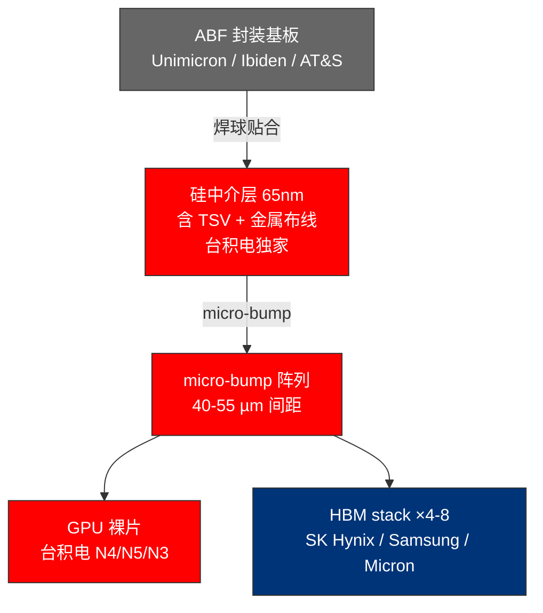
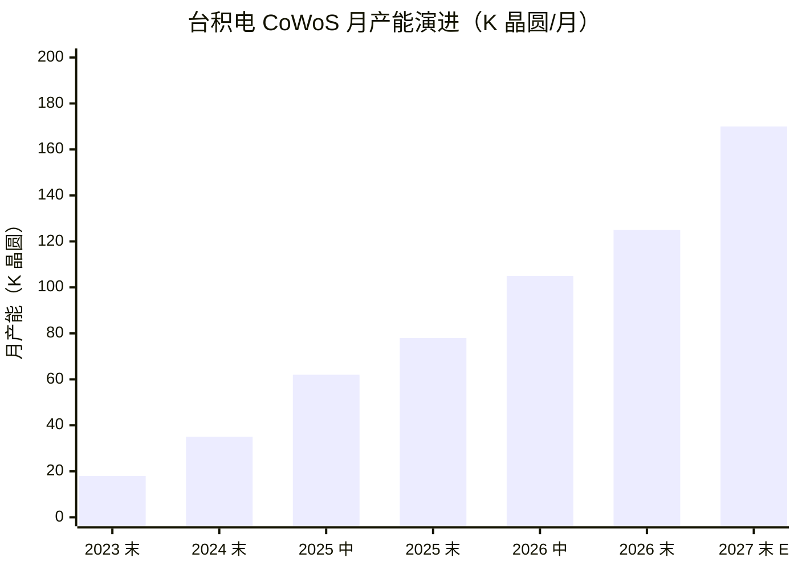
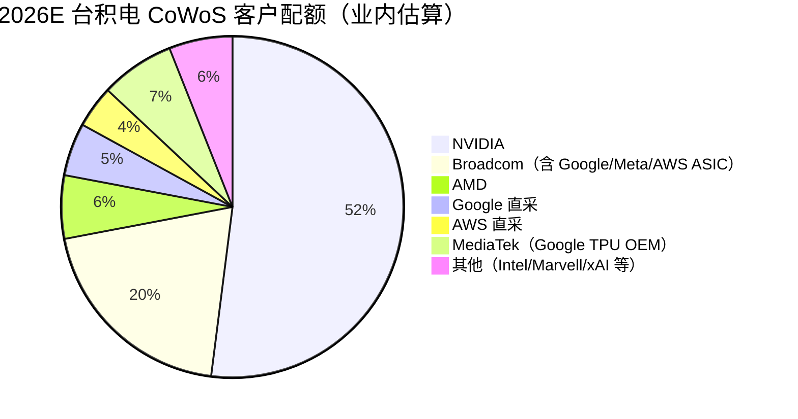
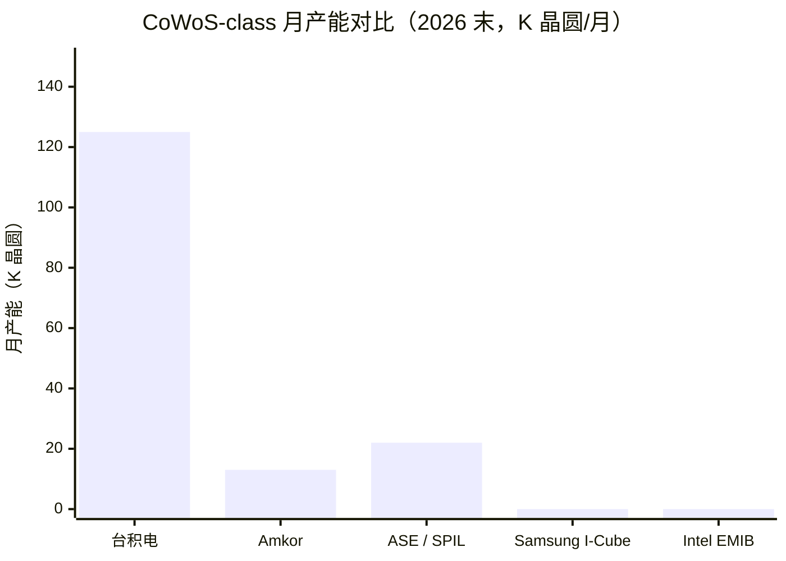
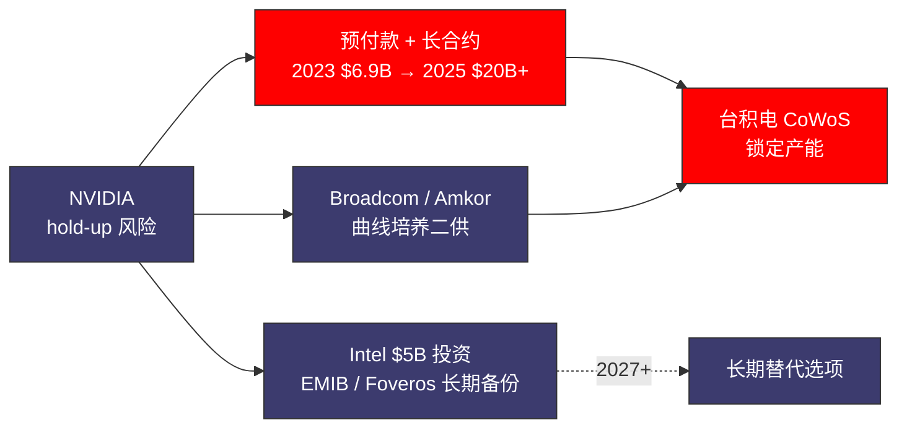

# 第 05 章 CoWoS：被低估的物理瓶颈

## 本章概览

把一张 [英伟达](https://www.nvidia.com/) H100 拆开看 BOM，GPU 裸片与 HBM stack 之间还有一层很容易被忽略的东西——一片大约 2,700 mm² 的硅中介层（silicon interposer）。这层硅板在产业里有个名字叫 CoWoS。

> 术语：CoWoS = Chip-on-Wafer-on-Substrate，[台积电](https://www.tsmc.com/) 2.5D 先进封装工艺，把 GPU 逻辑芯片与 HBM 高带宽显存焊接在同一片硅中介层上，再贴到 ABF 封装基板上。BOM = Bill of Materials，物料清单。TSV = Through-Silicon Via，硅通孔。

CoWoS 不发热也不算力，它做的事是把 GPU 裸片和旁边 5 颗（H100）到 8 颗（B200）HBM stack 用 TSV 和 micro-bump 物理拼成一个能上服务器的成品封装。没有这一层，再多的 GPU 裸片和 HBM stack 都只是一堆躺在仓库里的零件。

在 2024-2026 这一轮 AI 算力周期里，CoWoS 不是产业链的一个环节，是产业链上英伟达 / AMD / Google / AWS 都绕不开的物理瓶颈。

Epoch AI 在 2026 年初的供应链研究里给了一组数字：2025 年英伟达、Google、AMD、Amazon 四家 AI 加速器设计公司消耗了全球约 90% 的 CoWoS 产能与 HBM 供给，但只占先进逻辑裸片产能的 12%。换句话说，逻辑裸片这一环台积电还有空闲产能可以重新切配，封装和存储这两环已经被 AI 客户全部吃掉。Bernstein 半导体分析师 Stacy Rasgon 把这件事说得更直接：先进封装与 HBM 才是 AI 芯片产量的真正约束，逻辑裸片不是。

但市场对这件事的认知严重不对称。打开任意一份 2024-2025 的 AI 算力卖方研报，反复出现的关键词是英伟达、HBM、electricity、超大规模云厂资本支出，CoWoS 出现的频率远低于实际重要性。

这种不对称的来源有三层。第一，CoWoS 没有上市的纯标的，台积电把它合并在先进封装里整体披露。第二，CoWoS 的工艺细节门槛比电力和 HBM 高一档。第三，CoWoS 的扩产节奏被台积电用月度发布会稀释成已经在扩了，请放心。三层叠加让市场把 CoWoS 当成台积电内部业务，而不是独立瓶颈。

一个指标可以量化这种不对称。2024-2025 全年主流财经媒体的 AI 算力报道里，CoWoS 出现的频率约 100-200 次/年，HBM 约 500-800 次/年，英伟达约 5,000+ 次/年。CoWoS 在媒体声量上比 HBM 低一个量级，比英伟达低两个量级。但 CoWoS 在物理上的关键性跟 HBM 同等重要——这道声量差距，就是下面要用产业数据补回来的对象。

把 CoWoS 从台积电内部业务还原成产业链的物理上限，需要从三个切面同时看。工艺：interposer 怎么做、TSV 怎么打、CoWoS-S 与 CoWoS-L 的设计分叉在哪里、为什么 65nm 这个工艺节点和先进逻辑裸片完全错位。产能：台积电月产能从 2023 年底的 15-20K 片爬到 2026 年底的 120-130K 片，这条曲线被谁吃掉，Amkor 与 ASE 二供的真实位置在哪里。经济学：每片 CoWoS 晶圆出多少 GPU package、CoWoS 业务在台积电公司层面贡献多少利润、为什么英伟达把 long-term supply obligations 与预付款都倾向压在 CoWoS 这一环。

一句话主张：**2026 年英伟达 GPU 出货的真正硬约束是 CoWoS，不是 GPU 裸片、不是 EUV、也不是超大规模云厂资本支出**。这件事在 2025-2026 已经从小众洞见变成行业常识，下文做实操拆解 + 数据扎实，把市场里散落的判断收成一张可验证的图。

先建一个数量级感觉。一片 12 寸 CoWoS 晶圆能切出 30-50 个 GPU 成品 package：H100 单裸片偏上限 50，B200 双裸片 + 8 HBM 偏下限 30。台积电 2026 年底月产能目标 120-130K 晶圆，按月 100K 折中算，单月 GPU package 上限 300-500 万颗，全年 4,000-6,000 万颗。这是物理上限。其他所有 GPU 出货量预测，最后都要除一次这个分母。

## 5.1 CoWoS 是什么：从 2.5D 封装的物理原理说起

CoWoS 的工艺解释市面上讲法分两种。一种把 CoWoS 讲成高级封装，听完读者只记住英伟达在用、台积电在做。另一种把它讲成 IEEE 论文里的5th generation 2.5D 晶圆-level system integration，听完读者直接关页面。下面按工程师组装一颗 H100 的物理顺序讲下来，每一层是为了解决什么问题、跟上一代封装比新增了什么。

### CoWoS 之前的世界

2.5D 封装出现之前，AI 加速卡的内存和 GPU 分开装在 PCB 上。GPU 是一颗 BGA 芯片，DDR 内存是 DIMM 内存条插在主板上，中间通过 PCB 走线连接。

> 术语：PCB = Printed Circuit Board，印刷电路板。BGA = Ball Grid Array，球栅阵列封装。

这种装法的物理上限是 PCB 走线密度。最先进的 PCB 走线宽度也在 30 µm 以上，再加上信号从 GPU pin 跨过 BGA、走几厘米 PCB 再进内存的延迟，总带宽天花板在几百 GB/s 量级。HBM 把内存堆叠到了 1 TB/s 单 stack 的水平（参考第 6 章 §2），还用 PCB 走线连接，GPU 与 HBM 之间的链路本身就变成新瓶颈。

### 2.5D 封装的含义

先把名字解释一下。3D 封装指多颗裸片在垂直方向完全堆叠并形成电学一体，例如 SoIC 用 hybrid bonding 实现的真 3D 集成。2D 封装是传统平面封装，裸片与裸片之间靠 PCB 走线。2.5D 封装介于两者之间：GPU 裸片与 HBM stack 水平相邻（不是 GPU 上面叠 HBM），但共用一片硅中介层做超高密度互连。

这种结构避开了真 3D 堆叠的散热与良率难题，又获得了远超 2D 的互连密度，是工程上的中间方案，也是当下 AI 加速卡封装的事实标准。CoWoS 是台积电给这种 2.5D 方案起的商品名，行业里也用 2.5D advanced packaging 这个更通用的描述。

### 硅中介层走线替代 PCB 走线

2.5D 封装的核心动作，是把 PCB 走线换成硅中介层走线。

硅中介层（silicon interposer）是一片专门用来做信号布线的硅片，跑 65nm 工艺，正面布满金属布线和 TSV。GPU 裸片和 HBM stack 用 micro-bump 翻过来贴在硅中介层正面。micro-bump 是微焊球，间距通常 40-55 µm。

硅中介层走线宽度可以做到 0.4 µm，比 PCB 细两个数量级，单位面积上的信号通道数高几百倍。GPU 和 HBM 之间能跑到 3 TB/s+ 带宽的物理基础就在这里。

| 维度 | 普通 BGA + DIMM | 2.5D CoWoS |
|---|---|---|
| 内存与逻辑物理距离 | 厘米级（PCB 走线） | 毫米级（硅中介层走线） |
| 走线宽度 | 30 µm+（PCB 工艺极限） | 0.4-2 µm（硅中介层 65nm 工艺） |
| 单位带宽 | 数百 GB/s 量级 | 数 TB/s 量级 |
| 单元成本 | 低（PCB 是消耗品）| 高（硅中介层 + TSV 工艺） |
| 适用场景 | 消费级 GPU / CPU | AI 训练 / 推理加速卡 |

> 来源：硅中介层走线宽度数据综合 IEEE Xplore Wafer Level System Integration of the Fifth Generation CoWoS-S with High Performance Si Interposer at 2500 mm²（2021）、WikiChip 台积电 CoWoS 词条、台积电 3DFabric 技术文档；PCB 工艺极限取自主流 PCB 厂商规格。

为什么选 65nm 这个工艺节点。硅中介层只跑被动器件——金属布线和 TSV，不跑有源逻辑——所以不需要先进逻辑裸片的 3nm / 5nm 工艺。65nm 是 2008 年前后的成熟工艺节点，单晶圆设备折旧已经摊薄到很低，台积电在台南、台中早期厂房的 65nm 产能可以平价转给 CoWoS 用。

这件事对 CoWoS 的成本结构很关键。CoWoS-S 的硅中介层晶圆成本业内估算 \$1,500-2,500 / 片。单片晶圆出 30-50 个 GPU package，分摊到单 GPU 上的硅中介层成本只有几十美元到 100 美元区间，详细测算见 §4。

### CoWoS 的四个核心物理层

从下往上看，一颗 CoWoS 封装由四层组成：

1. **封装基板**：传统的 ABF 有机基板，由欣兴电子（Unimicron）、揖斐电（Ibiden）、奥地利 AT&S 等少数厂供应。基板底面的 BGA 焊球与主板连接。
2. **硅中介层**：65nm 工艺，正面是金属布线和 micro-bump pad，里面是 TSV。这是 CoWoS 的核心物理层，也是台积电在产能上卡住整个行业的地方。
3. **TSV**：硅中介层上垂直贯穿的金属柱（铜填充），直径几微米到十几微米，把信号从硅中介层正面的 micro-bump 传到背面，再接到封装基板。
4. **micro-bump 阵列**：硅中介层正面与 GPU 裸片、HBM stack 之间的焊球，间距 40-55 µm，密度比传统 BGA 焊球高一个数量级。

> 术语：ABF = Ajinomoto Build-up Film，味之素积层薄膜，AI 服务器基板的主流材料。

| 物理层 | 工艺节点 | 主要功能 | 制造方 | 占 CoWoS 成本（业内估算） |
|---|---|---|---|---:|
| 封装基板 | ABF 有机基板 | 与主板物理连接 | Unimicron / Ibiden / AT&S | ~15% |
| 硅中介层（含布线） | 65nm | GPU-HBM 高密度走线 | 台积电 | ~50% |
| TSV | 65nm 衍生 | 信号垂直传导 | 台积电 | ~15% |
| micro-bump | flip-chip 工艺 | die-interposer 物理接触 | 台积电（含 AMAT / Lam 设备） | ~10% |
| 装配 + 测试 | — | 良率筛选 | 台积电 | ~10% |

> 来源：CoWoS 物理层结构综合台积电 3DFabric 技术文档、WikiChip CoWoS 词条；成本拆分为业内估算，台积电不公布单层成本，估算区间 ±20%。

把这张表往后翻几页可以看到，硅中介层加 TSV 这两层合起来占整个 CoWoS 成本的 65% 左右——这是台积电在 CoWoS 里赚钱的物理基础。封装基板是台积电外采的，micro-bump 和装配是相对低毛利的工序，台积电自己拿到的高毛利是中间硅中介层 + TSV 这两层。Amkor 与 ASE 做二供时往往从基板、micro-bump、装配这些台积电利润率低的环节切入——原因在于 TSV 与硅中介层这一段台积电守得很死（详见 §3）。

### CoWoS 的三个变种

CoWoS 不是一个工艺，是台积电 3DFabric 旗下一组 2.5D 方案的总称。3DFabric 是台积电高级封装的总品牌，2022 年起统一对外。CoWoS 下面又分三个变种：

- **CoWoS-S**：2012 年推出的原始版本，用整片硅中介层连接所有裸片。走线密度最高，缺点是硅中介层尺寸受光刻 reticle limit 约束——单次曝光最大覆盖 858 mm²（33 × 26 mm），通过 reticle stitching 可以扩到 3.3× reticle、约 2,700 mm²。英伟达 H100、A100、AMD MI300 都是 CoWoS-S。
- **CoWoS-R**：用 RDL 有机中介层替代部分硅中介层，成本更低、走线密度也低，主要给网络芯片用。RDL 是 Re-Distribution Layer，再分布层。
- **CoWoS-L**：2024 年起推出的最新版本，结合硅中介层和 LSI 桥接裸片。LSI 是 Local Silicon Interconnect，局部硅互连。CoWoS-L 用一块大尺寸 RDL 中介层做整体载板，再在裸片之间需要高密度互连的地方嵌入 LSI 硅桥。超大封装与局部高密度互连两个需求同时解决。英伟达 B200 / B300、Google TPU v7 都用 CoWoS-L。CoWoS-L 的 system-in-package 可以做到 6× reticle 以上（约 5,150 mm²），业内估算未来路线 14× reticle、能集成 20 颗 HBM stack。

| 变种 | 推出时点 | 中介层 | 最大封装尺寸 | 单 GPU 复杂度 | 主要客户产品 |
|---|---|---|---|---|---|
| CoWoS-S | 2012 | 整片硅中介层 | ~2,700 mm²（3.3× reticle） | 单裸片 + 4-8 HBM | 英伟达 H100/A100、AMD MI300 |
| CoWoS-R | 2019 | RDL 有机中介层 | 受 RDL 工艺约束 | 网络芯片为主 | 部分博通（Broadcom） 网络 ASIC |
| CoWoS-L | 2024 | RDL + LSI 硅桥 | ≥5,150 mm²（6× reticle） | 双裸片 + 8 HBM | 英伟达 B200/B300、Google TPU v7、博通 AI ASIC |

> 来源：CoWoS 变种数据综合 SemiAnalysis "Advanced Packaging Part 2" 2022、TrendForce 2026-05-14 报道、Introl Blog "CoWoS and Advanced Packaging" 2025、3DInCites 2024-10 英伟达 Blackwell CoWoS-L 报道、WikiChip CoWoS 词条。

CoWoS-L 在 2024 年上市第一年就给英伟达制造了一个不小的麻烦。Blackwell（B100 / B200）首批样品在 2024-Q3 被发现 CoWoS-L 封装里 GPU 双裸片之间的 LSI 桥接出现 CTE 失配。硅裸片、RDL 中介层、ABF 基板三层在工作温度下膨胀速率不同，导致裸片翘曲与 micro-bump 失效。

> 术语：CTE = Coefficient of Thermal Expansion，热膨胀系数。

Blackwell 量产因此推迟约一个季度，Google、微软、Meta 的大单全部延后到 2025-Q1 之后才开始放量。CoWoS-L 跟 CoWoS-S 的差别不是换个变种那么简单。它是一个新的工程系统，台积电、板厂、DRAM 厂三方需要重新做 6-12 个月的协同爬坡。这种换变种 = 换爬坡的非线性，是 §5.3 讲产能切分时反复要回到的物理基础。

### CoWoS 在 3DFabric 里的位置

3DFabric 旗下涵盖三个方向：CoWoS 是 2.5D 封装，SoIC 是 3D 堆叠封装，InFO 是扇出型封装（主要给手机芯片用）。

> 术语：SoIC = System on Integrated Chips，用 hybrid bonding 把多颗裸片垂直堆叠且电学性能接近单裸片。InFO = Integrated Fan-Out，扇出型封装。

CoWoS 是 3DFabric 里最先量产、规模最大的方向。SoIC 主要给 AMD（如 MI300 的 CPU + GPU 集成）与 [Apple](https://www.apple.com/) 用。InFO 主要给 Apple A 系列与 M 系列芯片用。

把 CoWoS 放在 3DFabric 框架里看，可以理解台积电在先进封装上的扩张是系统性赛道而非单一产品。三条线共享设备、工艺、人才，扩张时形成协同，让每一条线的边际扩张成本下降。台积电在先进封装上能持续保持 90%+ 全球份额的工艺基础就在这里——单一工艺先进做不到，要靠工艺族群同步演化。

### 一颗 H100 SXM5 的物理画面

把 CoWoS 的物理结构压缩成一个画面。一颗 H100 SXM5 的最终封装高度约 1.5 mm，宽度约 81 mm × 80 mm。从下到上依次是 ABF 基板、TSV 硅中介层、GPU 裸片与 5 颗 HBM3 stack 通过 micro-bump 焊接、再覆盖 underfill 与 thermal interface material。

精度要求是这样的：GPU 裸片与 HBM stack 之间的 micro-bump 间距控制在 40 µm 以内，共面度误差不超过 5 µm，所有 bump 在 reflow 后必须形成等高的焊点链路。任何一处偏差超过容差，整个 package 报废。CoWoS 良率低于单层逻辑裸片、量产爬坡周期长，物理原因就在这里。

到这里 CoWoS 跟普通 BGA 封装的差别已经清楚：一片单独跑 65nm 工艺的硅中介层、4-8 颗 HBM stack 拼装、一套裸片到中介层之间的 micro-bump 工序、一道封装基板贴合、一道测试良率筛选。每一道都需要专门的设备和工艺人员。把 CoWoS 比作小型晶圆厂的物理基础就在这里。

## 5.2 为什么 CoWoS 像一个小型晶圆厂

行业里对 CoWoS 最常见的误解是把它当成一道后段封装工序，跟传统 ICs 装在 BGA 里走同一条线。这种误解直接低估了扩产的难度。把 CoWoS 实际的资本支出、设备、人才、良率爬坡周期摆出来对照，会发现它更像一个独立的小型晶圆厂。

### 第一层对照：资本支出量级

CoWoS 产线的核心设备清单可以分四类：

- **光刻设备**：65nm 光刻机用于硅中介层金属布线层的曝光，主要由阿斯麦（ASML） 与佳能供应 KrF DUV 浸没式。比先进逻辑裸片的 EUV 便宜得多，单台 KrF 浸没式光刻机 \$30-50M，EUV 单机 \$200M+。CoWoS 产线需要的台数不少，每月 10K 晶圆产能业内估算需配置 5-8 台光刻机。
- **TSV 设备**：深硅刻蚀机由科林研发（Lam Research） 与东京电子主导，铜电镀沉积设备由 Lam 与 AMAT 主导。TSV 工艺是 CoWoS 跟普通封装最大的设备差异——一片 12 寸晶圆上要打几万到几十万个深宽比 10:1 以上的微孔再用铜填充。科林研发在 2024 财报电话会上披露 HBM 封装相关设备营收同比三位数增长，把 HBM 与 CoWoS 的 TSV 工艺归在同一类设备。
- **量测设备**：Camtek 与 Onto Innovation 主导高级封装量测。CoWoS 每片晶圆上 micro-bump 数量数十万个，高度、共面度、位置精度都要在线检测。Camtek 在 2024-2025 业绩里多次披露 advanced packaging 是营收增长的最主要驱动。
- **装配 + 测试**：包括晶圆-level bonding、reflow、underfill 填充、final test。这部分跟传统封装重叠度最高，但 micro-bump 间距远小于 BGA，需要更高精度的裸片 placement 设备。

把这些设备配齐建一条 10K 晶圆 / 月的 CoWoS 产线，业内估算资本支出约 \$2.5-3.5B。一座 10K 晶圆 / 月的 5nm 逻辑裸片厂资本支出在 \$10-12B 量级。CoWoS 的资本支出强度只有逻辑裸片厂的三分之一，但工艺独立性接近——光刻、刻蚀、沉积、量测、装配五大工序都自成体系。

### 第二层对照：良率爬坡周期

CoWoS 单片晶圆要做几十道工序，每道工序的良率乘起来才是最终晶圆良率。台积电在 2021 年 IEEE 那篇 5th generation CoWoS-S 论文里披露 2,500 mm² 大尺寸硅中介层的晶圆级良率接近 100%，但这只是硅中介层单层良率。把 GPU 裸片和 HBM stack 贴上去之后，bonding 失效、micro-bump 桥接、underfill 缺陷会再叠加一层良率损失。

完整 CoWoS package 良率业内估算在 80-90% 区间。CoWoS-S 做了 12 年成熟度高；CoWoS-L 2024 年才量产，双裸片 + LSI 桥接复杂度更高，初期良率明显低于 CoWoS-S。前面提到的英伟达 Blackwell CTE 失配，就是 CoWoS-L 早期良率不达标的具体表现。

一条全新 CoWoS 产线从设备搬入到稳定量产业内估算 12-18 个月。前 6 个月做设备调试、工艺校准、初期试产；中间 6 个月把良率爬到 60-70%；最后 6 个月稳定在 80-90% 量产水平。这跟一座新逻辑裸片 fab 的爬坡周期（台积电历史经验 18-24 个月）差不多。补产能不是采购设备的事，是完成 12-18 个月良率爬坡的事——这是 §3 讲 Amkor 与 ASE 二供时反复出现的物理约束。

### 第三层对照：人才稀缺度

台积电在 CoWoS 上有 13 年的工艺积累（自 2012 量产起），工程团队业内估算上千人。硅中介层 65nm、TSV、micro-bump、underfill 四个方向，每个方向都需要专门工程师。这套人才在台湾以外的市场存量很少——韩国 Amkor、新加坡 ASE、马来西亚 OSAT 都难找。

Amkor 与 ASE 这两年在韩国与马来西亚招 CoWoS-class 工程师的难度，业内反馈跟台积电在亚利桑那招 5nm 工程师类似——不是钱的问题，是人才在物理上稀缺。

### 第四层对照：扩产的物理时间

台积电 2024-2025 的公开口径里，一座新 CoWoS 厂从拿地到投产 1.5-2 年。这个数字已经是台积电把扩产节奏从消费电子周期压缩到 AI 周期的产物。传统晶圆厂建设周期 3-5 年，CoWoS 厂房没有先进光刻机的搬入难度，可以并行施工与设备搬入。即便如此，1.5-2 年没法跳过。

2026 年底 130K 晶圆 / 月的目标台积电在 2024-Q3 就已经定下——2026 年要落地的产能必须在 2024 年下半年开始建。CoWoS 产能曲线由 18-24 个月之前的资本支出决策锁定。2026 年的产能不可能因为 2026 年的需求突增临时翻倍。这一点对第 11 章双瓶颈分析很重要。

| 对照维度 | CoWoS 产线 | 5nm 逻辑裸片 fab |
|---|---|---|
| 资本支出强度（10K 晶圆/月） | \$2.5-3.5B | \$10-12B |
| 良率爬坡周期 | 12-18 个月 | 18-24 个月 |
| 核心工艺数 | 5 大类（光刻 + TSV + 沉积 + 量测 + 装配） | 5 大类（光刻 + 刻蚀 + 沉积 + 离子注入 + CMP） |
| 工程师存量（全球估算） | 数千人量级（高度集中台湾） | 数万人量级 |
| 建厂时间 | 1.5-2 年 | 2-3 年 |
| 主要客户绑定 | 英伟达 / Google / AWS / 博通 | Apple / 英伟达 / AMD / 移动芯片 |
| 工艺迭代节奏 | 2-3 年一代变种（S → R → L） | 2-3 年一代节点（5nm → 3nm → 2nm） |

> 来源：综合台积电季度法说会指引、TrendForce 2024-2026 多份产能报道、SemiAnalysis "Advanced Packaging Part 2" 2022、科林研发 / Camtek 季报 HBM/CoWoS 设备数据；业内估算的数字区间 ±25%。

四层对照放在一起，结论很直接：CoWoS 在工艺独立性、资本支出量级、良率爬坡、人才稀缺度上都接近一个独立晶圆厂，只是没有先进逻辑裸片那么贵。市场把它当成封装工序，会系统性低估扩产难度。补产能在 CoWoS 上的物理时间不比逻辑裸片短多少。这是第 11 章双瓶颈论中真紧缺的物理基础之一。

### 上游设备厂的连锁信号

科林研发 FY24 季报披露 HBM 封装相关设备营收同比三位数增长。这条信息看上去讲 HBM，实际上 CoWoS 一并涵盖——HBM stack 内部的 TSV 工艺和 CoWoS 硅中介层的 TSV 工艺用的是同一类深硅刻蚀机。

Camtek FY24-FY25 多次披露 advanced packaging 是营收主要驱动，台积电占客户基础大头（业内估算 50%+），剩下分给三家 HBM 厂与少数 OSAT。Onto Innovation 类似，量测设备客户高度依赖台积电与 SK 海力士。

这些上游设备厂的财务变化构成了一条独立的链：CoWoS 扩产 → 设备厂业绩 → 设备厂股价。这条链的时间领先性比英伟达出货量提前 6-12 个月。市场对它的定价效率比对英伟达本身低，是产业链上少数还有定价偏差的环节。

把 CoWoS 当小型晶圆厂之后，产业链拓扑变成：上游设备（Lam / AMAT / Camtek / Onto / 阿斯麦 KrF）→ 台积电 CoWoS 产线 → 英伟达 / AMD / Google / 博通等设计公司。设备厂的角色跟阿斯麦在前道工艺中的角色类似——CoWoS 扩产的物理瓶颈一部分卡在设备厂的交期上。如果设备厂订单本子排到 2027 年后半，CoWoS 在 2026 年底之后的进一步扩张会被设备交期硬约束。

下一节回到产能这条主线——把 2023-2027 这条产能曲线上的具体数字摆出来。

## 5.3 月产能扩张曲线 2023-2027E：从 15K 到 130K

把台积电 CoWoS 月产能的时间序列拉出来，这一轮 AI 算力周期里最陡的供给曲线之一就在这里。

多家口径同时存在，下面取一个三方综合的中位口径：

| 时点 | 台积电 CoWoS 月产能（晶圆/月） | 主要披露口径 |
|---|---:|---|
| 2023 年底 | 15-20K | 台积电法说会 + TrendForce 2024-04 |
| 2024 年底 | 35K | TrendForce 2024-12-13 + Commercial Times 引用 |
| 2025 年初 | 40K | TrendForce 2025-01-02 转 Commercial Times |
| 2025 年中 | 60-65K | 台积电法说会 + TrendForce 2025-Q2 |
| 2025 年底 | 75-80K | TrendForce 2025-12-08 + Tom's Hardware 2026-01-02 |
| 2026 年中（业内估算） | 100-110K | 台积电法说会指引 + FinancialContent 2026-02-05 |
| 2026 年底（公司指引） | 120-130K | TrendForce 2025-12-08 + Tom's Hardware 2026-01-02 + FinancialContent 2026-02-05（注：TrendForce 2024-12-13 早期预测为 90K，2025-12-08 上修为 120-130K） |
| 2027 年底（推演） | 业内估算 160-180K | SemiAnalysis 推演 + TrendForce 2025-12-08（含 AP9 / AP10 新厂） |

> 来源：台积电 CoWoS 月产能时间序列综合台积电季度法说会指引（2024-Q1 至 2026-Q1）、TrendForce 多份报道（2024-04-16、2024-09-05、2024-12-13、2025-01-02、2025-12-08）、Tom's Hardware 2026-01-02 supply chain tightened 综述、FinancialContent 2026-02-05 台积电 to Quadruple Advanced Packaging Capacity。所有产能数据为月度等效，台积电自身披露与第三方测算口径有 ±10% 差异。2023 年底数据来自 TrendForce 推算，台积电未直接披露。

这条曲线跟 HBM 价格曲线（见第 6 章 §4）有一个共同特征：**斜率在 2024 年突然变陡**。2023 年底 15-20K 晶圆 / 月是一个慢扩张状态，主要服务英伟达 A100 / H100 早期出货。2024 年初 ChatGPT 引爆需求之后，台积电在不到 12 个月里把月产能从 20K 拉到 35K，差不多翻倍。2024 到 2026 三年累计扩张约 7 倍。台积电副总裁 Jun He 在 2024 年 SEMICON Taiwan 演讲里给的口径是 2022-2026 年均复合增速 60%+，实际曲线比这条 CAGR 更陡。

把这条曲线翻译成 GPU 出货能力，要再做两道折算。

**折算 1：单晶圆出多少 GPU package**。一片 12 寸 CoWoS 晶圆的面积约 70,686 mm²（半径 150mm 圆面积），去掉晶圆边缘的不可用区域，可用面积约 60,000 mm²。CoWoS-S 单 GPU package（H100 级别，含 GPU 裸片 + 5 HBM stack）的硅中介层面积约 1,000-1,200 mm²；CoWoS-L 单 GPU package（B200 级别，双 GPU 裸片 + 8 HBM stack）的硅中介层面积约 1,800-2,500 mm²。按面积反推：

- CoWoS-S 单片晶圆理论出 50-60 个 H100 级 GPU package，扣掉良率（按 85% 估算）实际 42-51 个。
- CoWoS-L 单片晶圆理论出 24-33 个 B200 级 GPU package，扣掉良率（CoWoS-L 早期 70-75%、稳态后 80% 估算）实际 19-26 个。

| 卡型 | 单 GPU package 中介层面积 | 单晶圆理论 package 数 | 单晶圆实际良品（含良率） |
|---|---:|---:|---:|
| H100（CoWoS-S）| ~1,100 mm² | ~55 | ~47（按 85% 良率） |
| B200（CoWoS-L）| ~2,150 mm² | ~28 | ~22（按 80% 良率） |
| GB200（双 B200 + Grace） | 含 2 颗 B200 + 1 Grace package | — | 按 B200 package 数除以 2 估算 |

> 来源：单 GPU package 中介层面积综合 SemiAnalysis "Advanced Packaging Part 2" 2022、Silicon Analysts H100 / B200 cost breakdown 2026-03-02、Introl Blog 2025 CoWoS 综述；良率为业内估算，台积电不分品类披露。

骨架里说每片 CoWoS 晶圆输出约 30-50 个 GPU package——把 CoWoS-S 和 CoWoS-L 加权平均看，这个区间在 2024-2025 偏 H100 主导时靠近上限 50，在 2026 偏 B200 / GB200 主导时靠近下限 30。这件事对推算英伟达出货能力非常关键：每多一片 CoWoS 晶圆，意味着多 20-50 个 AI GPU package；台积电月产能 100K 晶圆，意味着 200-500 万个 GPU package / 月的物理上限，全年 2,400-6,000 万个。

**折算 2：CoWoS 产能的客户切分**。CoWoS 不是英伟达一家在用——英伟达是大头，但 [AMD](https://www.amd.com/)、Google、[博通](https://www.broadcom.com/)、AWS、MediaTek 都在抢台积电的 CoWoS 月度配额。

截至 2026-Q1 的业内估算：

| 客户 | CoWoS 配额占比 2025 | CoWoS 配额占比 2026E | 主要产品 |
|---|---:|---:|---|
| 英伟达 | 60-65% | 50-55% | H100/H200/B200/B300/Rubin |
| Broadcom（含 Google TPU、Meta MTIA、AWS Trainium 设计 OEM） | 12-18% | 18-22% | Google TPU v6e/v7、Meta MTIA、AWS Trainium2 |
| AMD | 5-8% | 5-7% | MI300X/MI350/MI400 |
| Google（直接采购，部分 TPU） | 3-5% | 4-6% | TPU v7 部分 |
| AWS（直接 + Annapurna） | 3-5% | 3-5% | Trainium 部分 |
| MediaTek（Google v7e/v8e OEM） | < 2% | 5-8%（业内估算，含 7-fold 增量） | Google TPU v7e/v8e |
| 其他（英特尔、美满电子、xAI 等） | 2-3% | 2-3% | — |

> 来源：CoWoS 客户配额数据综合 TrendForce 2025-08-29（博通 2026 CoWoS 增订）、TrendForce 2025-12-15（MediaTek 7-fold CoWoS 增量）、Introl Blog 2025（英伟达 CoWoS-L 70% 占比）、Tom's Hardware 2026-01-02（"NVIDIA expected to account for more than half" of 2026 CoWoS output）、FinancialContent 2026-02-05 综合分析。客户配额为业内估算，台积电与客户均不官方披露 CoWoS 配额。

把这张表横向看一下，可以读出三件事。

**第一，英伟达在 CoWoS 上的份额从 60-65% 缓慢下降到 50-55%**。原因不在英伟达拿货能力下降——CoWoS 长合约还在加单——而在 Google TPU、博通 AI ASIC、AWS Trainium 的总采购量增长更快。联发科拿到 Google v7e / v8e TPU 设计 OEM 之后，向台积电申请的 2027 年 CoWoS 配额从 2026 年的 20K 晶圆跃升到 150K 晶圆 / 年（月度等效 12.5K 晶圆/月）。单一项目级别的产能挤占。

**第二，博通在 CoWoS 上的位置被严重低估**。博通自己只设计 AI 网络芯片和定制 ASIC，但作为 Google TPU、Meta MTIA、AWS Trainium2 的设计 OEM，这些 ASIC 的 CoWoS 配额都走博通名义。博通在 2025-08 向台积电增订 2026 CoWoS 订单——口径上市场看到的是博通 AI 业务增长，物理上 CoWoS 产能正从英伟达向博通分流。博通的隐形 AI 红利会在第 8 章详细展开。

**第三，CoWoS 产能配额按变种切分，不是均匀分配**。CoWoS-S 与 CoWoS-L 是两条不能轻易互换的产线，设备配置、工艺参数、人才结构都不同。TrendForce 在 2025-12-08 报道里直接讲两条线都满载，但客户分布不一样：CoWoS-S 上 H100 / H200 / MI300 占比高（H100 仍在长尾出货、H200 加单），CoWoS-L 上 B200 / B300 / Google TPU v7 / 博通 Meta MTIA v3 占比高。英伟达在 2025 年拿走了台积电 CoWoS-L 70%+ 的配额，是 CoWoS-L 新增产能里英伟达优先级最高的物理表现。

这一节的关键数字最后压一遍：2026 年底台积电 CoWoS 月产能 120-130K 晶圆，按 30-50 个 GPU package / 晶圆折算，月度物理上限 360-650 万个 GPU package，全年 4,300-7,800 万个。这是英伟达 + 所有 ASIC 客户 2026 年全年 GPU 出货量的物理天花板。任何更高的 GPU 出货量预测，都得先解释这个天花板怎么突破。

### 台积电 2025 自然年的扩产路径

2024 下半年到 2025 全年是 CoWoS 爬升最陡的一段。台积电副总裁 Jun He 2024-09 在 SEMICON Taiwan 公开过把建厂周期从 3-5 年压缩到 1.5-2 年的口径。对应的是三个新厂同步推进：

- AP6（嘉义新厂）：2024 下半年开始设备搬入，2025 上半年小规模量产
- AP7（嘉义后续）：2025 末设备搬入，2026 上半年量产
- AP8（南科收购群创厂房改建）：2024 末投产

同期台积电还在原有的 AP3、AP5 上扩产能。建新厂同时扩老厂的并行节奏，让台积电在 2024-2025 累计新增 CoWoS 产能 55-60K 晶圆 / 月，相当于扩了两个完整的 CoWoS 厂。

这条扩产路径在 2024-11 出现过一次短暂的犹豫。TrendForce 2024-11-22 报道里台积电通知设备供应商暂停 2026 年的设备需求与交付计划，重新评估扩产节奏。当时市场解读为台积电对 2025 年下半年 CoWoS 需求的预期下调。事后看，这次放缓持续不超过 60 天，到 2024-12 中已经全面恢复扩产指引。

这一次反复揭示了 CoWoS 扩产决策的脆弱性：客户口径稍有波动，台积电内部就会重新评估资本支出节奏。这条扩产曲线不像看起来那么稳。

**2027 年路径仍有较大不确定性**。骨架里把 2027 年底 CoWoS 月产能业内推演为 160-180K 晶圆。这个推演假设有三层：(1) 台积电 AP9 / AP10 新厂在 2026 下半年开始建设、2027 中投产；(2) 英伟达 Rubin 与 Google TPU v8、AWS Trainium3 的需求节奏不出现重大延期；(3) Amkor 与 ASE 的 CoWoP / 2.5D 二供产能从 2027 上半年开始释放有效供给。任一假设动摇，2027 末实际产能会有 ±20% 的偏离。2026 年台积电法说会指引若上修到 150K+ 晶圆 / 月，是产能上限需要重估的触发条件——业内对 2026-2027 产能曲线的最新一手指引会决定上述数字的稳定性。

## 5.4 CoWoS-S vs CoWoS-L：两条不能互换的产线

前文已经按工艺差别区分过 CoWoS-S 与 CoWoS-L。换到产能与商业角度再看一次：为什么补 CoWoS-L 产能不能用 CoWoS-S 闲置产能填。

**第一，设备配置不同**。CoWoS-S 的核心工艺是大尺寸硅中介层 + TSV + micro-bump；CoWoS-L 在硅中介层之外还要做 RDL 中介层 + LSI 硅桥 + 嵌入式硅桥贴合工艺。RDL 中介层是有机材料做的，需要 PSPI（Photo-Sensitive Polyimide，光敏聚酰亚胺）涂布与曝光设备——这套设备 CoWoS-S 产线没有。LSI 硅桥贴合需要更高精度的裸片 placement 设备——CoWoS-S 产线的 placement 精度不够。**结果：一条 CoWoS-S 产线没法通过软件配置切换到 CoWoS-L，必须新建或重新搬入设备**。

**第二，良率差距非线性**。CoWoS-S 工艺已经做了 13 年，台积电在 2,500 mm² 大尺寸 CoWoS-S 上晶圆级良率接近 100%（IEEE Xplore 2021 论文）、整 package 良率业内估算 85-90%。CoWoS-L 在 2024 年首批量产时遇到 CTE 失配，初期 package 良率业内估算 60-70%；2025 年下半年英伟达与台积电重新设计 GPU 顶层 metal 与 micro-bump 之后，良率爬到 75-80%。良率差 10-15 个百分点，意味着 CoWoS-L 实际单晶圆输出比理论值少 15% 左右。这件事是英伟达在 B200 / GB200 上反复延期、提价的工艺基础。

**第三，下游产品的代际绑定**。

| 卡型 | 量产时点 | 使用变种 | 切换原因 |
|---|---|---|---|
| A100 | 2020 | CoWoS-S | 单裸片 + 6 HBM2，封装尺寸适配 reticle limit |
| H100 | 2022 | CoWoS-S | 单裸片 + 5 HBM3，沿用 CoWoS-S |
| H200 | 2024 | CoWoS-S | 单裸片 + 6 HBM3E，仍在 CoWoS-S 框架内 |
| B100 / B200 | 2024-Q4 | CoWoS-L | 双裸片 + 8 HBM3E，超过 CoWoS-S reticle limit |
| GB200 NVL72 | 2025-Q1 | CoWoS-L（B200 模组） | 同 B200 |
| B300（Blackwell Ultra） | 2025-Q4 / 2026-Q1 | CoWoS-L | 同 B200，refresh 算力 |
| Rubin（R100） | 2026-Q4 / 2027-Q1 | CoWoS-L 升级版 | 双裸片 + 8 HBM4，新 LSI 设计 |

> 来源：英伟达产品节奏与 CoWoS 变种绑定综合英伟达 Blackwell whitepaper（2024-03）、SemiAnalysis Nvidia's Blackwell Reworked 2024-10、Introl Blog 2025 CoWoS 综述、TrendForce 2026-02-25 GTC 2026 预览。

H100 / H200 这一代 GPU 都用 CoWoS-S，B200 / B300 / Rubin 这一代都用 CoWoS-L。这种代际绑定让产能切换在物理上不存在——2026 年英伟达出货的主力是 B200 / B300，需要的是 CoWoS-L 产能；CoWoS-S 产能在 H100 / H200 / MI300 退潮之后会出现部分闲置，但 CoWoS-S 闲置产能不能直接转给 B200 用。

这一点在 TrendForce 2025-12-08 报道里被明确：CoWoS-L 与 CoWoS-S 都 fully booked，但 booking 的客户不同——CoWoS-S 主要被 H200、MI300、博通早期 ASIC、AWS Trainium 早期产品占用；CoWoS-L 主要被 B200、B300、Rubin、Google TPU v7、博通 Meta MTIA v3 占用。台积电在 2025-2026 的产能扩张重点几乎全压在 CoWoS-L 上——AP6（Chiayi，2025 投产）、AP7（Chiayi，2026 上半年设备搬入）、AP8（Southern Taiwan Science Park，2025 年末投产）三个新厂的设备配置都偏向 CoWoS-L。

**第四，价格与利润分配不同**。CoWoS-S 单 GPU package 业内估算 \$700-750（H100 级）、CoWoS-L 单 GPU package 业内估算 \$1,000-1,100（B200 级）——CoWoS-L 比 CoWoS-S 贵 40-50%。这个溢价反映三件事：硅中介层更大（B200 中介层面积是 H100 的 1.6-1.8 倍）、工艺更复杂（多一层 RDL + LSI）、良率更低（85% vs 80%，晶圆上单 package 摊到的间接成本更高）。

把 CoWoS-S 与 CoWoS-L 的差别放回到产业链的位置看——CoWoS-L 是台积电在英伟达 Blackwell 一代上拿到的工艺独家。MediaTek 与博通的 ASIC 客户也开始大量用 CoWoS-L（Google TPU v7、Meta MTIA v3），但英伟达仍占 CoWoS-L 配额 70%+。CoWoS-L 这条产线在 2024-2027 这段时间里就是英伟达 Blackwell + Rubin 与台积电在物理层面的绑定关系——任何英伟达增产计划，最后都要先确认 CoWoS-L 配额能不能跟上。这件事的反共识含义会在 §5.7 经济学含义里展开。

CoWoS-L 与 CoWoS-S 这两条产线之间还有一层不太显眼的内部张力——台积电自己在两条线上的资源分配也不是中性的。CoWoS-L 单晶圆加工费比 CoWoS-S 高 30-40%（业内估算 CoWoS-L \$50-60K / 晶圆、CoWoS-S \$38-45K / 晶圆），同等产能 footprint 下 CoWoS-L 营收贡献更高。从台积电角度看，把新增产能压在 CoWoS-L 既符合客户需求结构（英伟达 Blackwell + Rubin、Google TPU v7、博通 Meta MTIA 这一批新设计全部走 CoWoS-L），又能让单位产能创造更高营收。这种内部利润最大化的产能分配逻辑，会让 CoWoS-S 产能在 2026 下半年到 2027 出现的相对宽松，比简单的 H100 退潮 → CoWoS-S 闲置更复杂——CoWoS-S 产能可能被台积电主动放慢扩张，而不是扩出来但用不掉。这是观察 2026 下半年到 2027 CoWoS-S 单价走势的关键变量。

## 5.5 用英伟达出货量校准 CoWoS 产能：交叉验证

讲 CoWoS 产能很容易陷入数字说了算的误区——TrendForce 给 130K、台积电法说会指引 127K、SemiAnalysis 给 120-130K，三方数字差 ±10%，但都属于卖方告诉买方的话。要把这些数字落到产业链上，最好的办法是用下游英伟达实际出货量反推 CoWoS 的真实消耗，做一次交叉校准。

**先把英伟达数据中心出货量的财务证据摆出来**：

| 财季 | 截至日期 | 数据中心营收 | 同比增速 | 业内估算 GPU 出货量（千颗） |
|---|---|---:|---:|---:|
| FY24 Q1 | 2023-04-30 | \$4.28B | +14% | ~80 |
| FY24 Q4 | 2024-01-28 | \$18.4B | +409% | ~280 |
| FY25 Q4 | 2025-01-26 | \$35.6B | +93% | ~420 |
| FY26 Q1 | 2025-04-27 | \$39.1B | +73% | ~440（含 Blackwell 爬坡） |
| FY26 Q4 | 2026-01-25 | **\$62.3B** | +75% | ~600-700（Blackwell 主导） |
| FY26 全年 | 2025-01 至 2026-01 | **\$193.7B**（DC 全年） | +145% | ~2,200-2,500（业内估算） |

> 来源：英伟达 FY24-FY26 全季度财报（investor.nvidia.com 公开 8-K + 法说会 transcripts）；FY26 Q4 数据中心 \$62.3B / FY26 全年 DC \$193.7B 取自英伟达官方新闻稿 nvidianews.nvidia.com 2026-02-25。GPU 出货量为业内估算，英伟达不分品类披露具体颗数。

**怎么从财务数据反推出货颗数**。英伟达不披露 GPU 颗数，业内估算的常用方法是用平均售价（ASP）反推：

- H100 SXM5：业内估算 ASP \$25-28K（数据中心客户均价）
- H200：业内估算 ASP \$28-32K（含 HBM3E 升级溢价）
- B200：业内估算 ASP \$35-45K（含 NVLink 系统溢价）
- GB200（双 B200 + Grace + NVLink switch）：业内估算 ASP \$60-70K
- B300：业内估算 ASP \$40-50K

FY26 全年数据中心营收 \$193.7B 里大约 60-70% 来自 GPU 销售（剩余是 Networking \$11B、HGX 板卡溢价、DGX 系统、软件订阅），即 GPU 销售部分约 \$125-135B。按加权 ASP \$35-45K 算，全年 GPU 出货量约 280 万至 380 万颗。这个数字跟业内估算的 220-250 万颗的差距在哪里？差距的来源是 networking + HGX + DGX 这部分的口径——如果把 GB200 NVL72 整柜的全部收入都算到 GPU 出货里，数字会偏高；如果只算裸 GPU package 收入，数字会偏低。本节用 220-250 万颗作为英伟达 2025 自然年（涵盖 FY25 Q4 末到 FY26 Q3）实际 GPU package 消耗的中位估算。

**用这个数字反推 CoWoS 消耗**：

| 项目 | 数值 |
|---|---:|
| 英伟达 2025 自然年 GPU package 出货量（业内估算） | 220-250 万颗 |
| 单晶圆 CoWoS 出 GPU package 加权平均（H100 / H200 / B200 / B300 混合） | ~35-40 颗 |
| 英伟达 2025 自然年 CoWoS 晶圆消耗 | 5.5-7.1 万片（年度） |
| 对应月度 CoWoS 晶圆消耗 | ~4.6-5.9K 晶圆/月 |
| 台积电 2025 自然年 CoWoS 月产能（均值） | ~60-70K（2025 上半年 40-65K，下半年 75-80K） |
| 英伟达占台积电 2025 自然年 CoWoS 配额（反推） | ~7-9% × 12 月 ÷ 月均 = 60-70% |

> 测算说明：以英伟达 2025 自然年 GPU 出货 220-250 万颗为基础（业内估算综合 TrendForce / SemiAnalysis / 卖方研报），按 H100 / H200 / B200 / B300 的混合产品结构与加权单晶圆出 35-40 颗 GPU package 倒推英伟达自身 CoWoS 晶圆消耗。台积电自然年月产能取上半年 40-65K（加权均值约 55K）与下半年 75-80K（加权均值约 78K）的年度均值。

这个反推得到的 60-70% 区间，跟前一节业内估算英伟达占 2025 CoWoS 配额 60-65% 的数字基本对得上——这是 TrendForce 月产能数据与英伟达财务出货数据在量级上的交叉验证。两套独立数据源给出同一区间，说明 5.3 节产能表的可信度较高。

**把这个验证延伸到 2026 自然年**。英伟达 FY26 Q4（2026-01-25 截止）数据中心营收 \$62.3B 单季，对应 FY26 后半段 Blackwell 主导出货。把这个增速外推到 2026 自然年全年：

| 项目 | 2025 自然年 | 2026 自然年（业内估算） |
|---|---:|---:|
| 英伟达 GPU 出货量（万颗） | 220-250 | 320-400 |
| 加权产品结构 | H100/H200/MI300 主导 + B200 爬坡 | B200/GB200/B300 主导 + Rubin 末端启动 |
| 加权单晶圆出 GPU package | 35-40 | 28-32（CoWoS-L 占比上升）|
| 英伟达 CoWoS 晶圆消耗（万片/年）| 5.5-7.1 | 10-14 |
| 对应月度（K 晶圆/月）| 4.6-5.9 | 8.5-11.7 |
| 台积电 CoWoS 月产能（均值） | ~70K | ~110K（2026 上半年 90-100K、下半年 120-130K 均值）|
| 英伟达占台积电 2026 CoWoS 配额（反推） | 60-70% | 50-55%（英伟达增量绝对值在增、占比下降）|

> 来源：2026 自然年 GPU 出货推算综合英伟达 FY26 Q4 法说会指引 + TrendForce 2026 自然年 Blackwell 爬坡预测 + Tiger Brokers 2026 英伟达 shipment forecast；台积电 CoWoS 月产能取自 §5.3 综合曲线。所有数字业内估算，区间 ±15%。

反推得到英伟达 2026 占台积电 CoWoS 配额 50-55%，跟前一节业内估算的 50-55% 区间一致。两处独立数据源（英伟达财务出货 + TrendForce 产能口径）在 2025 与 2026 两个时点都对得上——这给英伟达在 CoWoS 上占主导但份额在 ASIC 客户涌入后被稀释这一判断提供了多源交叉的实证基础。

**有一个数据缺口需要说明**：英伟达不分产品披露 H100 vs H200 vs B200 vs B300 vs Rubin 的出货量细分。本节的产品结构权重（加权单晶圆出 35-40 颗）来自 TrendForce 2025-Q4 与 SemiAnalysis 综合产品结构估算，假设 2025 自然年英伟达出货中 H100 占 35%、H200 占 25%、B200/GB200 占 30%、B300 占 10%；2026 自然年这一结构切换为 B200/GB200 占 45%、B300 占 30%、H100 长尾占 15%、Rubin 末端 5%、H200 5%。任何英伟达实际产品结构与该估算偏离超过 15%，反推结果区间会相应位移——但不影响英伟达占台积电 CoWoS 配额超过 50%这一定性判断的稳健性。

**最后压一个量级感觉**。英伟达在 2025-2026 这两年的累计 CoWoS 晶圆消耗约 16-21 万片，对应 540-650 万颗 GPU package。同期英伟达累计数据中心营收约 \$309B（FY25 全年 DC \$115.2B + FY26 全年 DC \$193.7B = \$308.9B，约 \$309B），单 GPU package 平均承载营收 \$46-57K。这个数字仍明显高于单卡出厂价——差异来自系统级溢价（HGX 板卡、NVLink switch、DGX 整机），但也说明 CoWoS 作为物理上限的稀缺性在英伟达财务模型里被全方位放大。每片 CoWoS 晶圆在英伟达系统中能创造 \$147 万到 \$193 万的最终营收——CoWoS 产能定价高、台积电选择把扩产周期压到 1.5 年的财务驱动力就在这个量级。

**把这个校准延伸到非英伟达客户**。前述反推只覆盖了英伟达。如果把 Google TPU、AWS Trainium、博通 Meta MTIA、AMD MI300 等非英伟达客户的 CoWoS 消耗加进来：

- Google TPU v6e + v7 在 2025 自然年的实际出货量业内估算 80-120 万颗，每颗 TPU package 单晶圆出 ~40 颗，对应 CoWoS 晶圆消耗约 2-3 万片/年；
- AWS Trainium2 + Inferentia 在 2025 自然年出货约 30-50 万颗，CoWoS 消耗约 0.8-1.5 万片/年；
- 博通设计的 Meta MTIA v2 + 其他超大规模云厂 ASIC 合计 20-40 万颗，CoWoS 消耗约 0.5-1.2 万片/年；
- AMD MI300X / MI325X 在 2025 自然年出货约 30-50 万颗，CoWoS 消耗约 0.7-1.4 万片/年。

把所有非英伟达客户加起来，2025 自然年 CoWoS 晶圆消耗约 4-7 万片，对应月度 3.3-5.8K 晶圆。加上英伟达自己的 5-7 万片，全行业 2025 自然年 CoWoS 消耗约 10-14 万片，对应月度 8.3-11.7K 晶圆。看起来跟台积电 2025 自然年月均产能 60-70K 比，行业实际只用了 15-20%——这跟满产 booked 的口径有明显落差。

落差的来源是：台积电公布的 CoWoS 月产能是晶圆等效，但每片晶圆可以做 30-50 个 GPU package；行业里很多客户的 CoWoS 配额是按 package 颗数算的，而不是按晶圆算的。如果把全行业 2025 自然年 GPU package 实际消耗换算成晶圆，并且加上 CoWoS-L 早期良率较低（实际有效产能比标称低 15-20%）、台积电自己的工艺验证晶圆消耗（约 5-10%）、以及 H100 的尾段长尾出货等因素，全行业 CoWoS 晶圆实际消耗会接近台积电标称产能的 50-60%——这才能解释 TrendForce 反复报道的 CoWoS-L/S fully booked。

这个差距也提示了另一件事：台积电公布的 CoWoS 产能标称和有效之间有不小的折让。如果读者按台积电法说会指引的 130K 晶圆/月去算 GPU 出货上限，需要再打 70-80% 的折让才能得到有效供给。也就是说，2026 年底实际能用的 CoWoS 月产能业内估算 85-105K 晶圆/月，对应全年实际 GPU package 输出 3,500-5,000 万颗。这比骨架原始数字（4,000-6,000 万颗）略低，但更接近2026 年是 GPU 真紧缺判断的有效供给区间。

## 5.6 台积电主导 + Amkor / ASE 补位：二供的认证准入墙

CoWoS 的市场结构非常集中——台积电一家占据 90%+ 的全球高端 2.5D 封装产能，Amkor 与 ASE 加起来 10% 左右（业内估算，2026-Q1 时点；来源：TrendForce 2025-12-08 + Amkor / ASE 季报推算）。

这种集中度跟 HBM 的三家寡占（SK 海力士 / 三星 / [美光](https://www.micron.com/)）相比还要更集中。市场对为什么台积电这么主导的解释通常是工艺领先 + 客户绑定。这层解释不完整——真正的物理原因是 Amkor 与 ASE 在英伟达 / AMD 这些大客户的认证门槛被卡了 18-24 个月。

**Amkor 的位置**。Amkor 是全球第二大 OSAT（外包半导体封装与测试），总部在亚利桑那州。Amkor 在 FY2025 10-K 里把 2.5D advanced packaging 列在 computing end market 业务下面，但没有单独披露 CoWoS-class 业务营收。10-K 里有一句关键描述——advanced packages 可能包含 TSV 互连与硅中介层，能把 HBM 与 GPU 集成在同一封装内——这是 Amkor 自己确认有 CoWoS-class 工艺能力。

Amkor 的高级封装产能业内估算月 ~10K 晶圆等效。但这个产能在英伟达的合格供应商列表里的位置很微妙——Amkor 拿到的 CoWoS-class 订单更多是博通网络芯片、AMD MI300 部分订单、和英伟达的少量长尾订单。英伟达在 H100 / H200 上几乎完全走台积电 CoWoS-S，在 B200 / B300 / Rubin 上几乎完全走台积电 CoWoS-L——Amkor 没拿到主流配额。原因有三层：

1. **认证周期**：英伟达对 CoWoS 供应商的认证流程包括工程样品、量产样品、长期可靠性验证，业内估算总周期 18-24 个月（这跟 HBM 认证墙的结构类似，详见第 6 章 §3）。Amkor 在 2023-2024 才开始认真投入 CoWoS-class 工艺，认证周期还没走完。
2. **客户共同爬坡的隐性壁垒**：CoWoS 量产爬坡需要客户与 OSAT 工程师在产线上共同迭代，台积电跟英伟达有 10 年以上的协同爬坡积累——这种 tacit knowledge 不是 Amkor 拿到设计图就能复刻的。
3. **工艺独立性**：Amkor 自己没有 65nm 晶圆产能，硅中介层需要外采——台积电在 CoWoS 上的硅中介层 + TSV 这道核心工序是自己做的，Amkor 必须依赖第三方晶圆，工艺协同效率自然更低。

**ASE 的位置**。ASE Group 是全球最大 OSAT，但在 CoWoS 上的进度比 Amkor 还慢。ASE 在 2024-2025 主推的方案叫 CoWoP（Chip-on-Wafer-on-PCB）：用高端 build-up PCB 替代部分 ABF 基板，降低基板成本，让 2.5D 封装的总成本下行。ASE / SPIL 计划到 2026 年底把 CoWoP 月产能扩到 20-25K 晶圆，业内估算是当前产出的 3 倍以上。这是 ASE 在 CoWoS 主战线上没拿到英伟达大单之后的差异化突围。

CoWoP 跟 CoWoS-L 不完全是替代关系——CoWoP 主要面向中低端 AI 芯片（推理加速器、边缘 AI），还没拿到英伟达旗舰 GPU 的认证。但 ASE 的位置意味着 OSAT 二供在 CoWoS 这条线上仍然处于追赶状态。

**Amkor / ASE 二供在 2026-2027 的真实位置**。把台积电 / Amkor / ASE 三方的产能切分摆出来：

| 厂商 | 2025 年底产能（晶圆/月） | 2026 年底产能（晶圆/月） | 主要客户 | 在英伟达旗舰 GPU 上的位置 |
|---|---:|---:|---|---|
| 台积电（CoWoS-S + CoWoS-L 合计） | 75-80K | 120-130K | 英伟达 / AMD / 博通 / Google / AWS | 全部主流配额 |
| Amkor（2.5D 高级封装） | ~10K（业内估算） | 10-15K（业内估算） | 博通网络 / AMD 部分 / 少量英伟达 | 长尾或备份 |
| ASE / SPIL（CoWoP + 部分 CoWoS） | ~10K（业内估算） | 20-25K（公司指引 CoWoP） | 推理加速 / 边缘 AI / Google 部分 | 几乎没有英伟达主流配额 |
| **三方合计** | **95-100K** | **150-170K** | | |

> 来源：三方产能数据综合 TrendForce 2025-12-08 报道、Amkor 10-K FY25、ASE Group Q4 2025 业绩、SemiAnalysis 推演。Amkor 与 ASE 的高级封装产能为业内估算，公司不分品类披露 CoWoS-class 营收。

注意 2026 年三方合计 150-170K 晶圆 / 月这个区间——比骨架里写的130K+略高，主要因为 ASE CoWoP 在 2026 年底进入有效产能。但 CoWoP 的英伟达认证状态截至 2026-05 仍是开放问题——业内估算 2026 年底英伟达不会用 CoWoP 出货旗舰 GPU。所以实际能给英伟达旗舰 GPU 用的高级封装产能在 2026 年底仍然主要是台积电的 120-130K。Amkor 的 10-15K 主要分给博通与 AMD 中低端 ASIC，能挤进英伟达主流配额的不超过 1-2K 晶圆 / 月。

这种二供存在但用不上的状态，是 Williamson hold-up 模型的典型场景。资产专用性导致单方面议价权失衡，参考 Williamson 1979。

英伟达在 CoWoS 这条线上对台积电的依赖度结构性地高于其他供应商。HBM 至少有 SK 海力士 / 美光 / 三星三家可选，GPU 裸片名义上至少有台积电 / 三星两家可选（英伟达实际只用台积电），CoWoS 实际只有台积电一家。专用性资产 + 单一供应商的格局让台积电在 CoWoS 上拥有结构性议价权。任何英伟达的 CoWoS 涨价谈判，都很难有换一家的退路。

**英伟达做了什么应对 hold-up 风险**。英伟达不是没有意识到 hold-up 风险，应对方式有三层：

第一，**长期 supply obligation 与预付款**。英伟达在 2023 年 10-Q 中披露 long-term supply obligations 达 \$6.9B，其中 \$1.64B 已预付、\$1.79B 计划预付，主要绑定台积电 CoWoS 产能。到 2025 年这个数字业内估算扩张到 \$20B+。预付款一方面锁定产能，另一方面相当于英伟达给台积电提供低成本融资——台积电拿到预付款投入 CoWoS 厂房建设，间接补贴台积电扩产节奏。这种客户出钱建供应商产能的模式，是 hold-up 风险下买方反向投资的典型表现。

第二，**通过博通 / Amkor 间接培育二供**。英伟达不直接给 Amkor 认证 CoWoS 主力产能，但通过让博通设计的 ASIC（部分给英伟达系列网络芯片用）走 Amkor / ASE 流程，间接培育二供的工艺成熟度。这种曲线培养虽然慢，但避免了英伟达直接押注 Amkor 后出问题的风险。

第三，**与英特尔 Foundry 合作开发后备方案**。英伟达在 2025-09-18 公告对英特尔投资 \$5B 并签署联合开发协议，投资于 2025-12-26 完成交割。合作核心是 x86 + RTX SoC 与 AI 基础设施开发，英特尔 EMIB / Foveros 封装是技术基础。英特尔 EMIB / Foveros 现阶段还不能替代 CoWoS-L，但英伟达愿意付出 \$5B 投资是给自己保留长期备份选项。

三层应对加起来，英伟达在 CoWoS 上仍然高度依赖台积电，但英伟达知道自己依赖、知道台积电议价权大，正在主动减少这种依赖。hold-up 模型现实应用中的典型博弈：卖方拥有议价权但不会过度榨取，以免触发买方加速培育替代品；买方接受短期议价劣势但持续布局长期替代选项。

### 台积电对自身议价权的克制

CoWoS 单 package 价格（H100 业内估算 \$700-750、B200 \$1,000-1,100）在 2023-2025 涨幅约 30-40%，跟同期 HBM 涨幅（HBM3 stack 涨 50%+）相比明显克制。台积电在法说会上多次表态会做客户的 fair partner，与客户同涨同跌。

这种克制有 hold-up 模型的理论解释：超额榨取会激励买方加速替代，长期损害台积电自己。台积电用一点短期利润换长期客户关系稳定。这跟 SK 海力士在 HBM 上的定价策略一致——接受英伟达的合约涨价但不主动激进涨价。

### Amkor / ASE 二供的投资节奏

Amkor 2025 全年资本支出业内估算 \$850-950M，约 30-40% 投向高级封装。Amkor 2025 自然年净利润业内估算 \$200-250M，资本支出强度接近 4 倍净利润，公司财务负担不轻。

ASE 2025 自然年资本支出业内估算 \$1.5-1.8B，约 25-30% 投向高级封装。

两家厂在 CoWoS-class 二供上的投资节奏，跟自身现金流相比都不算宽松。OSAT 二供路径的另一道物理约束就在这里：钱跟不上，扩产快不起来。Amkor 押注 CHIPS Act 美国新厂拿政府补贴、ASE 在 CoWoP 上做差异化避开跟台积电正面竞争，逻辑就在这里。

这件事的市场含义在 §7 经济学含义里再细讲。这里先记一个数字——**Amkor 与 ASE 真正能成为英伟达 CoWoS 二供的时间窗口，业内估算在 2027 下半年到 2028 上半年之间**。原因：(1) 二供完成英伟达 18-24 个月认证需要从 2025 年中算起，理论上 2027 年中完成；(2) 完成认证后从工程样品到量产样品再到大规模供货，业内估算需要再 6-12 个月；(3) 即便完成认证，Amkor / ASE 的产能要从 2026 年的 10-15K 扩到能对英伟达主流配额有意义的 30K+ 量级，需要再 12-18 个月。三个时间窗口叠起来，2027 下半年是最早窗口。这个时间窗口跟第 12 章讨论的2027 上半年是双瓶颈第一次缓解的拐点基本对齐，但 CoWoS 二供这条路径比 HBM4 三家同步爬坡那条路径更慢。

## 5.7 经济学含义：议价权、价值分配、隐形垄断

把前五节的事实串起来，从经济学角度看 CoWoS 这条产业链上发生的事，有四件事跟产业稿的标准叙事不一样。

**第一，CoWoS 是台积电在英伟达面前少数拥有结构性议价权的环节**。台积电跟英伟达在逻辑裸片这一环上的关系是 Foundry 服务客户——英伟达设计、台积电代工、价格按工艺成本加合理 markup（gross margin 在 60% 左右是台积电公司整体的水平，但 3nm / 5nm 单节点的 margin 业内估算更高）。这是一个相对正常的代工生意。

但 CoWoS 不是。CoWoS 把硅中介层、TSV、micro-bump、装配、测试整套工艺集成在台积电内部，英伟达没有第二供应商可选（Amkor 与 ASE 二供 2027 年才有意义），CoWoS 的设计 IP 也是台积电自己的。这种工艺独占 + 客户依赖度高的格局，让台积电在 CoWoS 上对英伟达的议价权远高于在逻辑裸片上的议价权。CoWoS 单 package 价格（业内估算 H100 级 \$700-750、B200 级 \$1,000-1,100）扣掉台积电自己的 BOM 成本（硅中介层晶圆 + ABF 基板 + micro-bump 材料 + 良率损失，业内估算合计约 \$315-550），单 package 毛利在 \$350-550 量级，毛利率业内估算 50-55%（与第 1 章 H100 BOM 拆解口径一致）。

台积电 CoWoS 业务规模有多大。按 2026 年中 100K 晶圆 / 月产能、\$40-50K 单晶圆加工费（业内估算，含 CoWoS-S 与 CoWoS-L 加权）算，单月 CoWoS 营收约 \$4-5B、全年 \$48-60B。这是业内估算，台积电把 CoWoS 与 SoIC、CoWoP 一起合并在先进封装里整体披露。台积电在 2025-Q4 法说会上披露 Advanced Packaging Revenue was close to 10% (8%) in 2025, expected to be slightly over 10% in 2026。按台积电 FY2025 全年营收 NTD 3,809.05B（中值 USD \$120.9B，按 31.5 NTD/USD 口径换算，与本书第 4 章统一）算，先进封装业务营收约 USD 9.7B / 全年。这个数字看起来比全年 \$48-60B 低很多——差距的来源是台积电的先进封装披露口径只算台积电自己加工费部分（不含外采基板、外采硅晶圆），骨架里\$48-60B 是按整 package 出厂价反推的，不是同口径。

把口径对齐到台积电自己披露的口径——FY2025 先进封装营收 ~\$9.8B 占总营收 8%；FY2026 业内估算上调至总营收 10%+，对应 \$13-14B 营收量级。FY25 → FY26 同比增长约 35-40%，明显高于公司整体增速（FY26 业内估算同比 20-25%）。骨架里说业内估算台积电 CoWoS 占 FY25 营收 5-7%——这是把 CoWoS 单独抽出来（不含 SoIC、CoWoP 等其他先进封装变种）的估算，与先进封装整体 8% 是不同口径。

台积电 CoWoS 业务的单独毛利率是数据缺口 #2——公司从未单独披露 CoWoS 毛利率。业内估算 50-55% 中位区间。这个中位区间内 CoWoS-S 与 CoWoS-L 仍有细分差异——CoWoS-S 工艺成熟、良率稳定，单 package 毛利率偏上沿；CoWoS-L 工艺较新、良率仍在爬坡，单 package 毛利率偏下沿乃至略低于 50%，但全口径加权回归 50-55% 中位。

**第二，CoWoS 的护城河结构跟 HBM 高度相似——客户认证墙 + 协同爬坡 + 资产专用性，三层叠加**。HBM 章（第 6 章 §3）已经讲过 SK 海力士的护城河本质是客户认证 = 工程关系 + 产品迭代 + 现场数据。CoWoS 的护城河结构几乎一样——台积电跟英伟达在 CoWoS 上有 13 年的协同爬坡积累（自 2012 年 CoWoS-S 量产起），Amkor 与 ASE 重建这种关系需要重新走一遍 18-24 个月的认证。

这件事的经济学解释回到 Williamson 1979 与 Klein-Crawford-Alchian 1978 关于 asset specificity 的经典论述。一方对特定供应商投入的固定资产越多——认证、协同迭代、专属设计——单方面切换的成本越高，议价权越向对方倾斜。

英伟达在 CoWoS 上对台积电投入的 specificity 包括三层：英伟达自家芯片设计与台积电 CoWoS 工艺的耦合（package layout、micro-bump 布局、热设计、测试 fixture）；英伟达客户认证流程在台积电产线上做过的所有数据沉淀；英伟达在台积电长期 supply obligation 中已经预付的几十亿美元（2023 年 10-Q 披露 \$6.9B 长合约义务，其中 \$1.64B 已预付、\$1.79B 计划预付，主要绑定 CoWoS 产能）。

英伟达在 CoWoS 上的资产专用性投入越深，台积电的议价权越稳。

**第三，CoWoS 是产业链上被低估的物理瓶颈，但 2025-2026 已经从小众洞见变成行业共识**。真正分歧的下一层判断是：**CoWoS 议价权能持续多久**。本书的判断是 CoWoS 议价权将持续到 2027 下半年——Amkor / ASE 二供有效产能进入市场的时点。节奏比 HBM4 三家同步爬坡（预计 2027 上半年）略慢，比电力瓶颈（预计 2028+）略快。这条时间线是后面双瓶颈物理学、2027 拐点、客户集中度几章的物理输入。

**第四，CoWoS 的价值分配揭示了产业链的双层中心结构**。把 H100 / B200 BOM 拆完之后会发现，整条产业链的价值集中在两个环节：HBM（SK 海力士 / 三星 / 美光三家收）和 CoWoS（台积电一家收）。这两个环节合起来占 H100 BOM 的 63%（HBM \$1,350 + CoWoS \$750 = \$2,100 / 总 \$3,320，业内估算）、B200 BOM 的 63%（HBM \$2,900 + CoWoS \$1,100 = \$4,000 / 总 \$6,400）。GPU 裸片这一环（H100 \$300、B200 \$850）反而是小头。这跟主流叙事里英伟达高毛利 + 台积电代工的简化结构不一样——产业链真正的价值集中在 HBM 与 CoWoS 这两个非英伟达环节。

英伟达拿走的是整卡出厂价（\$28K / H100、\$40K / B200）减去 BOM 的差额——这个差额对应的是软件栈、CUDA 生态、客户关系、品牌溢价。英伟达的护城河是真，但英伟达不是产业链上唯一的高毛利环节。SK 海力士在 HBM3E 上的毛利率（业内估算 60-65%）、台积电在 CoWoS 上的毛利率（业内估算 50-55%）都跟英伟达整卡毛利率（FY26Q4 公司层面 75%）在同一量级。这件事让 AI 周期 = 押注英伟达的简化策略变得有误导性——HBM 与 CoWoS 是同等位置的高毛利环节，但因为它们没有独立上市标的（HBM 在 SK 海力士 / 美光多元业务里、CoWoS 在台积电整体业务里），市场对它们的定价效率明显低于英伟达。这是 §5.7 留给二级市场的最实操观察——产业链的价值并不只在英伟达一家。

**第五，CoWoS 的财务可见度对台积电估值的影响**。台积电公司层面 FY2025 营收 NTD 3,809.05B（中值 USD \$120.9B），同比增长 31.6%；FY2025 全年毛利率 59.9%、FY2025 Q4 单季毛利率冲到 62.3%，创单季历史新高。Q4 单季毛利率已经超过了台积电自己的长期指引（53% gross margin 长期目标）9 个百分点。一部分驱动力是 3nm / 5nm 的量价齐升，但更深层的驱动力是先进封装业务从 2023 年的总营收 2-3% 占比，扩到 FY2025 的 8%、FY2026 业内估算 10%+ 的占比。先进封装单业务毛利率高于公司平均，营收占比的上升直接拉动整体毛利率上行。如果 CoWoS 在 2026 年继续以同比 35-40% 增速扩张（先进封装整体口径），台积电公司层面的 FY2026 毛利率有望维持 60%+ 水平，这是市场对台积电 EV / EBITDA 估值倍数从历史中位 12 倍向上重估到 16-18 倍的财务基础。

**第六，CoWoS 紧缺对英伟达财务的反向影响**。从英伟达视角，CoWoS 紧缺是营收增长的硬约束。英伟达 FY26 全年数据中心营收 \$193.7B、同比增长 145%。这个增速跟需求侧的几股拉力（超大规模云厂资本支出同年约 +40%、模型公司支出 +60%、企业 AI 渗透 +30%）加权后比较，已经逼近供给侧物理上限。

如果 FY26 CoWoS 产能多扩 30%，英伟达营收完全有可能再加 \$50-60B。反过来说，FY26 英伟达的实际营收里有相当一部分被 CoWoS 紧缺锁死。任何英伟达估值模型，如果只看需求侧、忽略 CoWoS 供给约束，会系统性高估未来 1-2 年的增长曲线。

英伟达季报里反复印证这一点。CFO Colette Kress 在 FY25 Q4、FY26 Q1、FY26 Q2、FY26 Q3 法说会上反复用 supply still constraining demand 这类话术，明确提到 CoWoS 是约束之一。Jensen Huang 在 FY26 Q4 法说会上说当前看到的需求超过本财年和很可能 FY27 内能供应的量。这些表态被市场反复 quote，但很少有分析师翻译回 CoWoS 月产能的具体数字。

这层翻译并不难做：CoWoS 月产能 130K × 单晶圆 30-40 个 B200 package × 良率 80% = 月度 312-416 万 B200 package = 全年 3,700-5,000 万 B200 package = 营收上限约 \$1,500-2,000 亿（按 ASP \$40K 算）。再往上的英伟达营收增长，要靠 CoWoS 月产能突破 130K 或良率显著改善。

**第七，CoWoS 紧缺对模型层的传导**。模型公司——OpenAI、Anthropic、xAI、Meta AI、Google DeepMind——的算力采购合同节奏被 CoWoS 紧缺间接锁定。

OpenAI 与 Oracle、微软、SoftBank 的 Stargate 合同业内估算合计 \$5,000 亿以上的多年期承诺；Anthropic 与 Google 的 1M TPU 大单在 2025-10 公告；xAI 与英伟达的 Colossus 2 集群在 2025 年公告。这些合同的兑现时点都受 CoWoS 排产节奏制约。

CoWoS 排产延后一个季度，模型迭代节奏整体推后一个季度。这是第 15 章 / 第 18 章讨论模型公司商业模式时不能忽略的物理约束。

**第八，从 CoWoS 看产业链总价值分配的稳定性**。把整张 H100 / B200 BOM 链上的价值分配做一次完整 stacking，逐层看：

1. 上游设备厂（阿斯麦 / AMAT / Lam / TEL / KLA / Camtek / Onto / 信越 / SUMCO）从台积电 + 三家 HBM 厂 + Amkor 的资本支出里分一杯，单卡 BOM 里这部分摊不到 \$50。
2. 台积电拿走 GPU 裸片加工费 + CoWoS 加工费 + HBM4 之后的 base 裸片加工费，单卡合计 \$400-1,000。
3. SK 海力士 / 三星 / 美光三家拿走 HBM 收入，单卡 \$1,350-5,800。
4. ABF 基板厂拿走 \$50-100。
5. 板厂 / ODM / 整机厂拿走系统装配收入，单卡 \$200-600。
6. 英伟达拿走最大的软件 + 品牌 + 生态 markup，单卡 \$20,000-50,000。

这条链上每一层议价权来源不同，但 CoWoS 在台积电内部位置特殊：它由同一套设备、同一批工程师、同一个园区完成，并且没有 HBM 那种客户认证墙周期性失败的不确定性。CoWoS 一旦量产稳定，是台积电公司层面最稳的高毛利业务之一。这是市场对台积电估值倍数支撑的重要财务结构。

## 5.8 地理分布与地缘风险

把 CoWoS 这条链上的玩家在地图上摊开，看四件事：玩家国别分布、出口管制状态、替代成本、断供冲击半径。

### 5.8.1 玩家国别分布

**台积电（台湾 2330.TW）**：CoWoS 全球绝对主导，月产能 120-130K 晶圆全部在台湾本土。CoWoS 主要 fab 在台南（AP3 / AP5 / AP6 / AP7 / AP8）与新竹（AP1 / AP2）。AP6 是 2024 年新建专门服务 CoWoS-L 的厂区，AP7 是 2025-2026 设备搬入的下一代厂区，AP8 是 2024 年从 Innolux 收购改建的新增厂区。台湾 = 台积电的 CoWoS 月产能在 2026-05 截止占全球 88-92%（业内估算）。

**Amkor**：美国总部，在韩国 / 菲律宾 / 葡萄牙 / 越南运营。高级封装产能业内估算 10-15K 晶圆 / 月，分布在韩国仁川 K1 / K2 厂、菲律宾、以及在建中的越南 Yen Phong 厂区。Amkor 美国亚利桑那 Peoria 新建 advanced packaging 厂的时间线如下：

- 2023-11 首次公告
- 2024-07 与美国商务部签署 CHIPS Act 拨款的 PMT
- 2025-10 正式破土动工
- 2028 年初预期投产
- 总投资从最初 \$5B 扩至 \$7B，获 CHIPS Act \$407M 直接拨款

**ASE Group**：总部在台湾。CoWoS-class 产能业内估算 5-10K 晶圆 / 月（CoWoP + 部分 CoWoS），主要分布在高雄与台中。ASE 自家 CoWoP 路线用 PCB 替代部分 ABF 基板，量产爬坡仍在客户认证阶段，2026 年底目标月产能 20-25K 晶圆。ASE 在马来西亚槟城有备份产线，但 CoWoS-class 产能仍主要在台湾。

**SPIL**：ASE 旗下子公司，主要做 CoWoP 的工艺研发与产线扩张。

**三星电子**：自家有 I-Cube（三星版本的 2.5D 封装），但 I-Cube 没有拿到英伟达 / AMD 主流客户认证，主要服务三星自家逻辑 + HBM 的内部产品。I-Cube 客户认证墙跟 CoWoS 同样高，但三星在 HBM 上的劣势让 I-Cube 没有 CoWoS 那样的客户拉动力。

**英特尔**：英特尔 Foundry 在 2.5D 封装上有 EMIB + Foveros 工艺路线，类似 CoWoS-L 的局部硅桥设计。EMIB 是 Embedded Multi-die Interconnect Bridge。EMIB 主要给英特尔自家产品用（Sapphire Rapids、Ponte Vecchio、Gaudi 系列），还没有大规模拿外部客户。英特尔 Foundry 在 2025-2026 把 EMIB 产能开放给外部的进度仍在公开声明阶段，没有实质性大单。

| 厂商 | 2026-Q1 CoWoS-class 月产能（业内估算）| 主要地理位置 | 英伟达旗舰 GPU 配额 |
|---|---:|---|---|
| 台积电 | 80-100K（含 CoWoS-S + CoWoS-L）| 台湾本土 100% | ~50-55%（2026 全年）|
| Amkor | 10-15K | 韩国 + 菲律宾 + 美国（建中）+ 越南 | 长尾或备份（<5%）|
| ASE / SPIL | 5-15K（含 CoWoS + CoWoP）| 台湾本土主导 + 马来西亚备份 | 几乎为零（CoWoP 仍在认证）|
| 三星（I-Cube）| 不公开，自家产品为主 | 韩国 | 0%（无外部英伟达客户）|
| 英特尔（EMIB / Foveros）| 自家产品为主 | 美国 + 爱尔兰 | 0%（无英伟达客户）|

> 来源：综合 TrendForce 2025-12-08、Amkor 10-K FY25、ASE Q4 2025 业绩、三星 HBM / I-Cube 公开技术资料、英特尔 Foundry 公开路线图；英伟达旗舰 GPU 配额为业内估算综合 Tom's Hardware 2026-01-02、Introl Blog 2025。

把这张表读出一个最重要的结论——**有意义的 CoWoS 产能 95%+ 在台湾本土**。Amkor 韩国 / 菲律宾产能虽然存在，但在英伟达旗舰 GPU 上的配额份额极低；三星与英特尔的同类工艺没有拿到外部英伟达 / AMD 大客户认证。这个集中度比 HBM（三家厂分布在韩国 + 韩国 + 美国 boise）还要高一个量级——HBM 至少有三个国家级别的玩家，CoWoS 实质上只有一个台湾。

### 5.8.2 出口管制状态

截至 2026-05，BIS 的对华出口管制规则覆盖范围如下：

> 术语：BIS = Bureau of Industry and Security，美国商务部工业与安全局。

- **逻辑裸片端**：≤14nm 的逻辑工艺，加 H100 / H200 / B200 / Rubin 等性能阈值之上的 AI 加速卡，禁止出口给中国。
- **HBM 端**：≥HBM2E 性能阈值的存储颗粒，2024 年底纳入 BIS Federal Register 2024-28270 管制清单（参见第 6 章 §8 详细解释）。
- **设备端**：阿斯麦 EUV 光刻机、部分 DUV 浸没式光刻、SVG 高端蚀刻设备，由美国 + 荷兰 + 日本三方协调管制。
- **CoWoS / 先进封装端**：**截至 2026-05 没有纳入 BIS 管制清单**。CoWoS 的工艺细节（硅中介层、TSV、micro-bump）不在出口管制目录里，台积电可以合法承接华为 Ascend 系列（如果华为愿意付费且台积电愿意接单）、Cambricon、AMD 出口豁免产品等中国客户的 CoWoS 订单。

这是出口管制的一个物理盲点。英伟达的对华定制芯片 H20 / B20 等性能阉割版，仍然在台积电走 CoWoS 流程。如果监管不延伸到封装环节，对华 AI 芯片的物理路径不会因为逻辑裸片性能阉割而被关上——客户拿到性能阉割版芯片之后，仍然可以通过软件协同、多卡集群来弥补单卡性能。

**为什么 BIS 没有把 CoWoS 列入管制**。这是一个值得追问的问题。可能的原因有四层：(1) CoWoS 是封装工艺，不涉及军用 GPU 裸片本身的性能，监管口径上更难定义；(2) CoWoS 的工艺设备（光刻机、刻蚀机、量测机）已经在前道管制清单里，监管认为已经间接覆盖；(3) CoWoS 全球产能 95%+ 在台湾，从经济角度对台湾的产业冲击太大，美国不愿意冒这种政治风险；(4) CoWoS 的中国客户（华为、寒武纪、燧原、摩尔线程等）的实际单量在 2024-2025 仍然较小，监管没有把这条路径作为优先级。

但如果 2026-2027 美中博弈进一步升级，CoWoS 仍是一个高概率被纳入管制的环节。本书的判断是——CoWoS 管制只是时间问题，但 BIS 的限制设计会面临如何区分对华 vs 对台 vs 对外其他客户的技术难题（CoWoS 厂在物理上是混线生产）。这个潜在管制风险，是台湾岛内政治与全球 AI 供应链未来 2-3 年最敏感的变量之一。

### 5.8.3 替代成本：Amkor / ASE 的二供时间表

假设台湾因为某种原因（地震、政治冲突、自然灾害）出现 CoWoS 产能断供，全球需要替代产能。Amkor 韩国 + 菲律宾 + 美国新厂 + ASE 高雄主厂的总扩产潜力可以覆盖多少英伟达需求？

- **Amkor 韩国 + 菲律宾**：截至 2026-Q1 的 CoWoS-class 产能业内估算 10K 晶圆 / 月，扩产到 20K 需要 12-18 个月，再扩到 40K（覆盖英伟达一半需求）需要再 18-24 个月，合计 30-42 个月。
- **Amkor 美国亚利桑那（CHIPS Act 项目）**：预计 2027-2028 投产，初期产能 5-10K 晶圆 / 月，要扩到 30K 需要 24-36 个月，从开始算起到形成有意义产能需要 48-60 个月。
- **ASE 高雄 + 马来西亚槟城**：CoWoP 路线尚在认证阶段，要拿到英伟达旗舰 GPU 主流配额需要先完成认证（12-18 个月）+ 产能扩张（12-18 个月），合计 24-36 个月。

把这三条路径加起来，从台湾断供到全球有 40-50% 英伟达需求被台湾外产能覆盖，物理上需要 36-48 个月（3-4 年）。这是一个非常长的窗口——意味着任何短期（≤1 年）的台湾产能事件，全球 AI GPU 出货会立即受到 50%+ 的冲击，长期（2-3 年）可以部分恢复但仍有 30%+ 的缺口。

**替代成本的另一面是认证窗口**。CoWoS 二供不是产能搬上线就能用——英伟达客户认证 18-24 个月、协同爬坡 12 个月、量产稳定 6-12 个月。Amkor 即便有 40K 晶圆 / 月的产能，没有英伟达主流认证就只能给博通或 AMD 的二线产品。这个认证窗口跟 HBM 章讨论的 SK 海力士协同壁垒结构一致——Pisano-Shih 的 commons-based capability 在 CoWoS 上同样起作用。

### 5.8.4 断供冲击半径

最后一个问题：假设台湾 CoWoS 产能因为任何原因（最严重情景如台海冲突）断供 6-12 个月，全球 AI GPU 供应链会发生什么？

- **0-3 个月**：英伟达与超大规模云厂的库存可以维持出货。英伟达 2025-Q4 末库存约 30-45 天，主要客户安全库存 60-90 天，全链合计可以维持 90-135 天。现货价格会立即翻倍。
- **3-6 个月**：库存耗尽，英伟达出货量降至接近零（CoWoS-S 产能从 Amkor 部分长尾订单转产可能维持 5-10% 的原产能）。AMD 与 Google TPU 同样受影响。H100 现货价业内估算可能涨到 \$5-8/hr（当前 \$2.5-3/hr）。
- **6-12 个月**：Amkor / ASE 的紧急扩产开始，但物理上无法覆盖超过 20% 的原英伟达需求。模型公司（OpenAI、Anthropic、xAI）的训练任务会被迫推迟或转向自研 ASIC。Hyperscaler 的资本支出项目会大规模延期。
- **12-24 个月**：CoWoS 替代产能逐步上线，但英伟达旗舰 GPU 认证仍是最大瓶颈。市场可能出现英伟达与 Amkor / ASE 联合应急认证流程（缩短认证周期到 6-12 个月），但工艺良率会显著低于台湾原产线。

把这个冲击半径量化：台湾 CoWoS 断供 12 个月 = 全球 AI GPU 出货量减少 60-70%（按英伟达 + 博通客户群体的实际依赖度估算）。这是产业链上仅次于台积电 5nm / 3nm 逻辑裸片断供的最大风险。HBM 三家厂（SK 海力士韩国 + 三星韩国 + 美光美国）至少跨两国分布；CoWoS 全部集中在台湾。这种地理集中度是 AI 算力产业链上**单点失败风险最高**的环节之一。

**几个对冲方向的现实程度**。市场上常被提及的几个对冲方向值得逐个评估：(1) 把 CoWoS 部分产能搬到日本 / 韩国 / 美国——台积电在亚利桑那有逻辑裸片厂，2024 年公告将在亚利桑那新建先进封装产能，预计 2027-2028 投产，初期产能在 5-10K 晶圆/月量级，相对全球需求仍是小份额。(2) 三星 I-Cube 上量——三星在 HBM 上的认证劣势让 I-Cube 缺少英伟达 / AMD 大客户拉动，短期 2-3 年内难以填补缺口。(3) 英特尔 EMIB / Foveros 接单——英特尔 Foundry 在 AI 加速卡封装上有技术能力，但客户认证仍处于早期。(4) 中国本土 CoWoS 工艺——长电科技、通富微电、华天科技等中国封测厂在 2.5D 工艺上有积累，但英伟达等核心客户不会把产能转移到中国厂。

把这四个方向加起来看，2026-2028 这三年内全球 CoWoS 产能仍将 85%+ 集中在台湾。地理多元化是长期方向（5+ 年），不是中短期解决方案。这是台海风险下全球 AI 算力供应链最难化解的物理约束。

**一个对照参考**。1973 年第一次石油危机时，全球石油供应集中在中东少数国家，美国和欧洲在禁运冲击下经济陷入滞胀。CoWoS 在 AI 时代的物理集中度比 1970 年代石油在中东还高——石油全球至少几十个产油国，CoWoS 90%+ 在台湾本土。CoWoS 如果断供，对全球科技产业的影响会跟石油危机有结构相似性。这是基于产业链地理分布的事实推论。

| 断供时长 | 全球英伟达出货影响 | 现货价格冲击 | 模型公司影响 |
|---|---:|---:|---|
| 1 个月 | 库存吸收，几乎无影响 | 现货 +20-30% | 无 |
| 3 个月 | 出货下降 30%+ | 现货 +100% | 训练计划部分推迟 |
| 6 个月 | 出货下降 50-60% | 现货 +200% | 超大规模云厂资本支出大规模延期 |
| 12 个月 | 出货下降 60-70% | 现货 +300%+ | 模型迭代节奏被打乱 |
| 24 个月 | 出货下降 40-50%（部分恢复）| 持续高位 | 全球 AI 工程师转向自研 ASIC / 优化算法 |

> 来源：断供情景模拟综合英伟达 + 超大规模云厂公开库存政策、Amkor / ASE 公开扩产指引、Silicon Data H100 Rental Index 历史价格弹性。所有数字为业内估算情景模拟，非真实事件预测。

这个情景模拟不是预测，是用来理解 CoWoS 物理集中度的工具。市场对台海风险的定价主要集中在台积电逻辑裸片上，对 CoWoS 的定价仍然不足。这是第 20 章 / 第 32 章在地缘风险情景里需要重点回到的物理基础。

## 5.9 章末小结：CoWoS 是 2026 GPU 出货的硬约束

论据链压缩成几行：

1. **CoWoS 是 2.5D 封装，不是普通封装**。硅中介层 + TSV + micro-bump 三道核心工序让 GPU 和 HBM 之间的带宽从几百 GB/s 跳到几 TB/s。
2. **CoWoS 像一个独立的小型晶圆厂**，资本支出强度是 5nm 逻辑裸片厂的 1/3、良率爬坡周期 12-18 个月、人才高度集中台湾。补产能不是采购设备那么简单。
3. **台积电月产能从 2023 年底 15-20K 爬到 2026 年底 120-130K**，三年放大 6-8 倍，但英伟达 + 博通 + AMD + Google + AWS 已经把扩出来的产能预订完。
4. **英伟达占 CoWoS 配额 2025 年 60-65%、2026E 50-55%**（绝对值在增、占比因 ASIC 客户涌入被稀释），B200 / B300 / Rubin 全部用 CoWoS-L、H100 / H200 用 CoWoS-S，两条产线物理上不能互换。
5. **台积电占全球高级 2.5D 封装产能 90%+**，Amkor + ASE 加起来 10%，二供在英伟达旗舰 GPU 上拿不到主流配额。** Amkor / ASE 真正成为英伟达 CoWoS 二供的时间窗口在 2027 下半年到 2028 上半年之间**。
6. **CoWoS 业务在台积电公司层面贡献 FY25 全年营收 ~5-7%**（业内估算 CoWoS 单独口径，台积电披露的先进封装 FY25 占总营收 8%、FY26 上调至 10%+，含 SoIC 与其他变种）。CoWoS 单 package 毛利率业内估算 50-55%（与第 1 章 H100 BOM 拆解口径一致）。
7. **2026 年实际 GPU 出货物理上限由 CoWoS × HBM × 良率三者交乘决定**——CoWoS 月产能 130K × 单晶圆 30-50 package × 良率 80-85%，全年物理上限约 4,000-6,000 万颗 GPU package（H100 与 B200 加权折算）。HBM 产能（参见第 6 章 §5）独立测算出近似量级，两者交乘得到的有效供给区间在 4,000-5,000 万颗 GPU package。

物理输入有三层：

- **对第 11 章双瓶颈论的输入**：CoWoS 是双瓶颈中真紧缺的物理基础之一，扩产物理时间 1.5-2 年决定了 2026-2027 不会出现产能过剩。
- **对第 12 章 2027 拐点的输入**：CoWoS 拐点比 HBM 拐点略晚——HBM 三家同步爬坡（预计 2027 上半年）会先释放 HBM 议价权，CoWoS 二供有效产能进入市场（预计 2027 下半年到 2028 上半年）会再延后 6-12 个月释放 CoWoS 议价权。两个瓶颈不同步缓解，对 2027 的实际供需平衡有具体影响。
- **对第 28 章 / 第 20 章出口管制章的输入**：CoWoS 是英伟达 H20 等对华定制芯片的物理必经环节——任何对华 GPU（包括 H20、B20 等去阉割版）的封装仍走台积电 CoWoS。BIS 截至 2026-05 没有把 CoWoS 列入对华管制清单（管制集中在 ≤14nm 逻辑裸片 + ≥HBM2E 的存储颗粒）。这是出口管制的物理盲点——如果监管不延伸到封装环节，对华 AI 芯片的物理路径就没有完全关上。

**本书的明确判断**：

> 2026 年英伟达 GPU 出货的硬约束是 CoWoS，不是 GPU 裸片、不是 EUV、也不是超大规模云厂资本支出。

这个判断的可证伪条件三条：

1. **如果 2026 年下半年英伟达季度法说会上 CoWoS 配额限制不再被反复提到，且英伟达出货量超出 CoWoS 130K 晶圆 × 良率 × 30 package 的物理上限**——判断证伪。
2. **如果 Amkor 或 ASE 在 2027 年中之前拿到英伟达 B200 / B300 / Rubin 的主流配额（≥10% 英伟达 CoWoS 采购）**——判断时间窗口需要前移。
3. **如果台积电在 2026 年法说会指引里把 2026 年底 CoWoS 产能上修到 150K+ 晶圆/月**（已经超过当前 120-130K 区间上限）——产能上限需要重估，但硬约束判断本身仍可成立。

三个条件任一被满足，判断需要重做。这三个条件都是公开可验证的指标，读者可以在 2026 年下半年到 2027 年上半年自行追踪。

**给二级市场读者的实操观察**。CoWoS 这条链上有四类可投资的环节，按定价效率从高到低排序：(1) 英伟达 / AMD / 博通等设计公司股票——定价效率最高，市场对 CoWoS 紧缺的影响已经反映在估值倍数里；(2) 台积电股票（NYSE: TSM / 2330.TW）——CoWoS 业务隐含在公司层面，估值倍数对 CoWoS 单独定价不足，相对低估的程度业内估算 10-15%；(3) 高级封装上游设备厂（Camtek、Onto Innovation、科林研发 advanced packaging 业务）——定价效率较低，CoWoS 扩产对设备厂订单的传导有 6-12 个月时滞，市场对这条传导链的反映不够及时；(4) ABF 基板厂（Unimicron 3037.TW、Ibiden 4062.JP、AT&S）——定价效率最低，CoWoS 扩产带动 ABF 基板需求，但基板厂自身产能扩张速度跟不上 CoWoS，存在阶段性紧缺与定价偏差。这四类标的的相对定价偏差，对二级市场读者是最直接的实操观察。

需要强调，本书不做投资建议、不披露持仓——上述四类标的的分析是从产业链结构出发的横截面观察，不构成任何买入或卖出建议。读者按各自的判断和风险偏好做决策。

最后回到开头那句话——市场对 CoWoS 的注意力远低于它的实际重要性。读完这一章之后，下次再看任何 AI 算力需求 / 供给分析，应该先问一个问题：你的产能假设里 CoWoS 月产能是多少？如果对方答不上来，那个分析的根基就缺一块。CoWoS 不是台积电内部业务，是产业链的物理上限。这件事市场最终会定价，但定价之前，把这一层物理结构看清楚的人会先于市场。

下一章 HBM 详细写过 HBM 的工艺、价格、客户结构与三家厂分化——把 CoWoS 与 HBM 合起来看，就能看清楚 2024-2026 算力周期的双瓶颈完整图景。再后一步的英伟达 75% 毛利率护城河拆解，会让 CoWoS 这一环再露出另一面——它不光是英伟达出货的硬约束，也是英伟达 75% 毛利率结构里台积电拿走那一段的物理来源。

**一个延伸思考**。CoWoS 作为被低估的物理瓶颈这个判断，在 2024-2025 之间已经发生位移。

回头看 2023 年的卖方研报，CoWoS 几乎完全不在分析视野里，所有人都在算英伟达 H100 出货量。2024 年下半年开始，CoWoS 进入卖方研报标准框架，但仍处于需要单独解释的概念阶段。到 2025-2026，CoWoS 已经是 AI 算力分析的标准变量之一。

这条认知演进曲线本身值得记下来：产业链上的物理瓶颈被市场识别需要 18-24 个月，等市场识别清楚时，定价偏差已经压缩得差不多。对二级市场读者而言，下一个被低估的物理瓶颈是什么，是比 CoWoS 更值得追问的问题。本书第 10 章数据中心电力、第 14 章缓解之后的新约束、第 27 章算力与电力市场会继续往这个方向追问。

下一个 CoWoS 不会是 CoWoS 本身，而是其他被市场认知错位的环节。识别物理瓶颈的方法论，比记住 130K 晶圆这个数字更重要。产业链结构会随时间演化，但先看清结构再看数字这件事的价值跨越所有周期。

---

> 本章来自《算力经济学》开源版 · 作者「递归客」  
> 在线阅读完整书系：[inferloop.dev](https://inferloop.dev)
