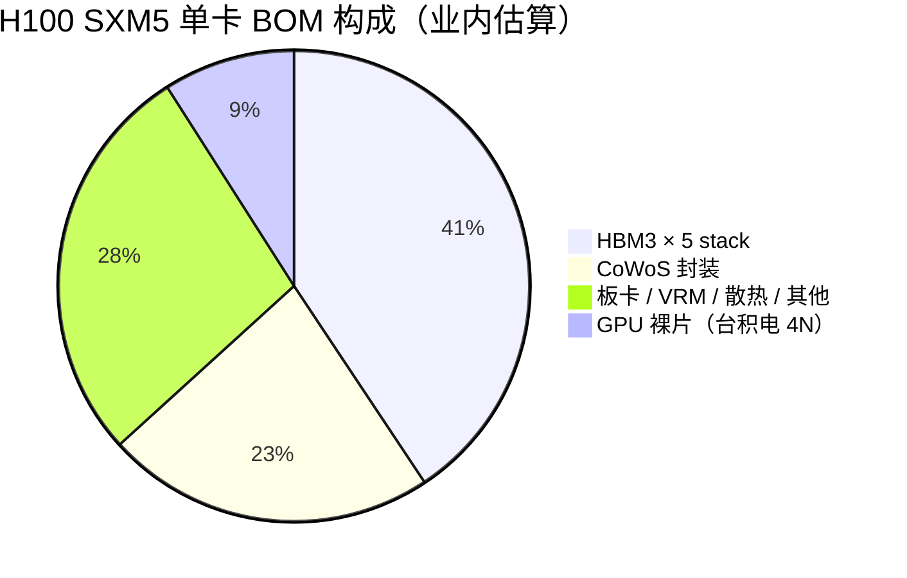
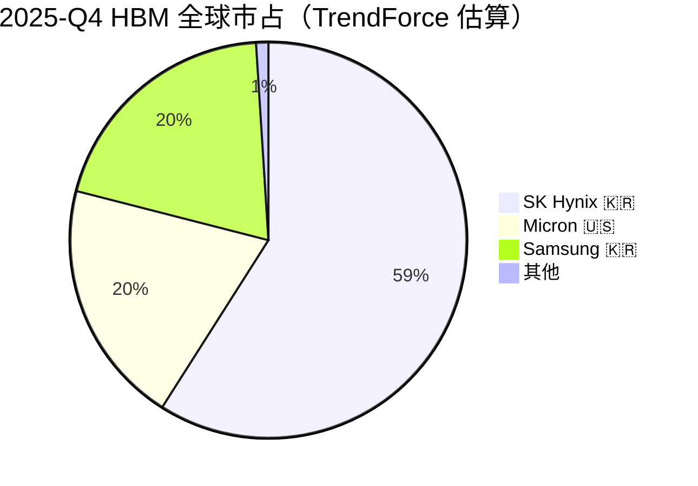
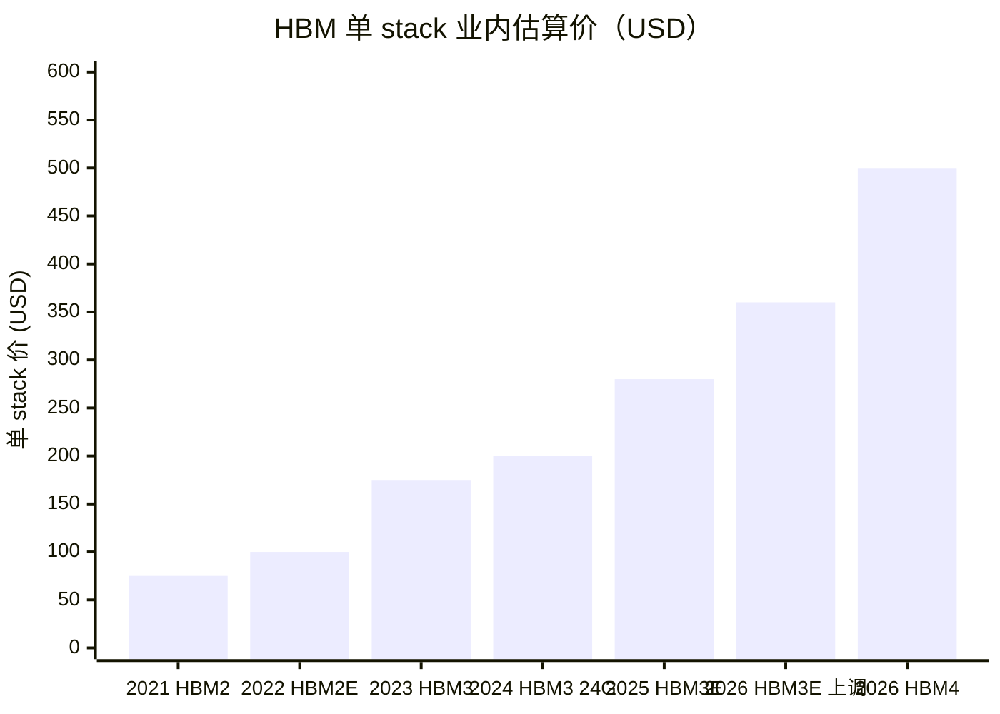
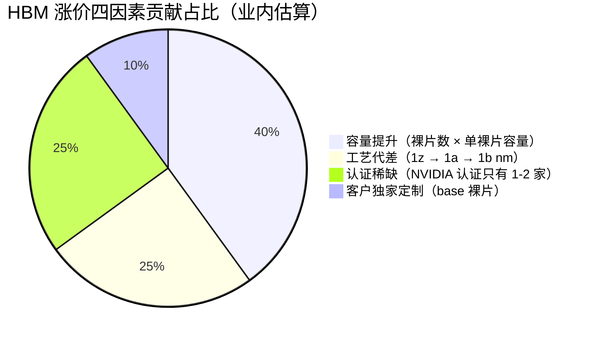
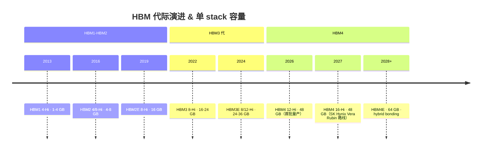

# 第 06 章 HBM：单卡最贵部件，反共识主战场

## 本章概览

把一张 [NVIDIA](https://www.nvidia.com/) H100 拆开看 BOM，最贵的部件不是那颗 814 mm² 的 GPU 裸片，是焊在它旁边的 5 颗 HBM3 stack。按 Silicon Analysts 2026-04 数据库的拆解，H100 SXM5 的 GPU 裸片制造成本约 \$300，HBM 部分合计约 \$1,350，CoWoS 封装约 \$750，整卡 BOM 约 \$3,320。

> 术语：BOM = Bill of Materials，物料清单。CoWoS = Chip-on-Wafer-on-Substrate，[台积电](https://www.tsmc.com/) 2.5D 先进封装，把 GPU 与 HBM 集成在同一硅中介层。HBM = High Bandwidth Memory，高带宽显存。

也就是说，**单卡里 HBM 的成本是 GPU 裸片的 4.5 倍**。这件事市场长期低估，本章把它放在第二部产业链全景的中枢位置。

HBM 贵的第一层原因不是用了多少硅，是它把 8-12 颗 DRAM 裸片用 TSV 垂直堆叠起来，再贴上 base 裸片做 IO。对良率、散热、客户认证都是非常苛刻的工程。

> 术语：TSV = Through-Silicon Via，硅通孔，垂直贯穿硅裸片的金属柱，让上下层裸片用最短路径连通。

第二层原因是这件事全球只有三家公司能做：[SK 海力士](https://www.skhynix.com/)、[三星](https://www.samsung.com/semiconductor/)、[美光](https://www.micron.com/)。三家在 HBM3E → HBM4 切换中表现完全分化：SK 海力士守住主导位，美光拿到 NVIDIA HBM3E 大单异军突起，三星用 18 个月才通过 NVIDIA 12-Hi HBM3E 认证。三星市占从 2024 年约 40%（全年口径）跌到 2025-Q2 的 17%。

本章把价值链上最贵的一格讲透。先看 BOM 中的位置，再看工艺为什么远不止"普通 DRAM 加堆叠"，再看比工艺更难翻越的客户认证墙，最后看三家厂的财务画像、HBM4 切换中的非线性、以及 2024 年底 BIS 对华 HBM 出口管制的地缘后果。

> 术语：BIS = Bureau of Industry and Security，美国商务部工业与安全局。

读完这一章，"算力周期"应该有一个新坐标：**至少在 2027 年 HBM4 三家同步爬坡之前，议价权被严重低估的是 SK 海力士，而不只是 NVIDIA**。

## 1. HBM 在 BOM 中的位置：单卡最贵部件

H100 的 BOM 拆解在主流媒体里普遍是"NVIDIA 高毛利 + 台积电收 CoWoS 费 + 韩国厂吃 HBM"这种粗线条描述，但具体到一卡里的数字结构，市场的直觉和数据差距很大。

| 组件 | H100 SXM5 80GB 估算成本（USD） | B200 估算成本 | GB200 估算成本 | 价值流向 |
|------|---:|---:|---:|---|
| GPU 裸片（台积电工艺） | \$300 | \$850（双裸片） | \$1,700（双 B200 + Grace） | 台积电收 |
| HBM | **\$1,350**（5 stack ×\$200-300） | **\$2,900** | **\$5,800** | SK Hynix / Micron / Samsung 收 |
| CoWoS 封装 | \$750 | \$1,100 | \$2,200 | 台积电收 |
| 板卡 / VRM / 散热 / 其他 | \$920 | \$1,550 | \$3,800 | ODM / 板厂 |
| **整卡 BOM 合计** | **\$3,320** | **\$6,400** | **\$13,500** | |
| NVIDIA 出厂价（业内估算） | ~\$28,000 | ~\$40,000 | ~\$65,000 | NVIDIA 拿走差额 |
| 整卡 NVIDIA 毛利率 | ~88% | ~84% | ~79% | |

> 来源：Silicon Analysts AI Chip Costs Database（2026-04），方法论披露含 Epoch AI 蒙特卡洛模型、Raymond James 半导体研究、TrendForce 季度报告、SemiAnalysis teardown 数据。HBM 单价取自 Silicon Analysts HBM Pricing 数据库（2026-04）：HBM3 \$200/24GB stack、HBM3E \$300/36GB stack、HBM4 业内估算 \$500/48GB stack。整卡 NVIDIA 出厂价来自 SemiAnalysis 系列拆解与卖方 BOM 报告，NVIDIA 不官方披露。所有数字属业内估算，三家 HBM 厂商均不分品类披露 HBM 单价，估算区间 ±15%。
>
> **口径说明**：本表"NVIDIA 整卡毛利率"是出厂价对 BOM 硬件成本估算的毛利率，与 NVIDIA FY26Q4 财报口径 gross margin（75%）不是同一口径——财报 gross margin 还包含软件 / CUDA / 服务 / 库存计提 / 保修 / 运营摊销等成本。本表的"88% / 84% / 79%"只能用于看 BOM 层级的链上利润分配，不可直接对比公司层面利润率。

把这张表的列纵向看一下会发现两件事。

**第一件，HBM 单价加起来是 GPU 裸片的 4 倍以上。** H100 上 GPU 裸片约 \$300，HBM 约 \$1,350。B200 上 GPU 裸片约 \$850（双裸片设计），HBM 约 \$2,900。GB200 整柜里一块 GB200 模组的 GPU + Grace CPU 裸片约 \$1,700，HBM 约 \$5,800。

卡越往上一代走，HBM 占比不仅没下降，结构上反而更突出。因为每代 GPU 配的 HBM 容量都在涨：

- H100 SXM5：80GB HBM3，5 个 16GB stack
- H200：141GB HBM3E，6 个 24GB stack
- B200：192GB HBM3E，8 个 24GB stack
- HBM3E 转 HBM4 的下一代：单 stack 36GB 起跳，单卡总容量进入 256GB 量级

HBM 在 BOM 里的占比正在向 50% 靠拢。SemiAnalysis 2023 年的服务器成本分析里给过一句话：跨所有芯片，HBM 内存占总制造成本 35-47%。这句话当时没引起太多关注，因为它出现在一篇标题更诱人的"内存是最大输家"文章里——那篇文章讲的是非 HBM 的 DDR5 / DDR4 因为 AI 服务器 BOM 重排被边缘化。但同一篇里的 HBM 占比数据，三年后被 H100 / B200 / GB200 的实际成本结构反复验证。

**第二件，市场对 NVIDIA 整卡毛利率的关注，掩盖了链上利润分配的精细结构。** NVIDIA FY26（截至 2026-01-25）数据中心业务全年营收 \$193.7B、Q4 单季毛利率 75%。这个 75% 是讲整卡的，分母里 HBM 占了 BOM 近一半。

NVIDIA 75% 毛利率里白送的那部分（约 25 个百分点），其实是给 SK 海力士的 HBM 加价腾出来的空间。SK 海力士 FY2025 全年营业利润率 49%，跟 NVIDIA 整体净利润率打架。公开市场里 NVIDIA 是这个时代的算力之王，但在 BOM 这一层，SK 海力士才是和 NVIDIA 同坐一桌的那个人。

后面几节展开三个问题：HBM 为什么不是 DDR5 的简单加价、三家厂同样的工艺为什么拿不到同样的订单、市占率为什么反映的是认证差距而不是工艺差距。

把 HBM 放在 BOM 的 C 位看，市场对算力链议价权的常识需要修正：**单卡里最值钱的部件是 GPU 旁边那 5 颗存储，不是逻辑芯片本身**。这件事对 NVIDIA 估值、对韩国半导体板块、对中国国产替代节奏的判断都有连锁影响。后面几节把这件事拆到能用的程度。

## 2. HBM 不是普通 DRAM

要看清 HBM 为什么贵，得先看清它的工艺跟普通 DRAM 是怎么分叉的。

DDR5（Double Data Rate 5，第 5 代主流双倍数据率内存）是 PC 和服务器主板上每根内存条用的标准——单裸片 32-64 Gb，IO 接口 32 bit，单条带宽 38.4-51.2 GB/s。HBM 跟 DDR5 共享同一套底层 DRAM 工艺（同样的 1a / 1b nm 工艺节点、同样的电容存储原理），但在器件层面是两个完全不同的物种。

**第一处差异，3D 堆叠**。HBM 把 8 颗或 12 颗 DRAM 裸片用 TSV 垂直堆叠起来。TSV 是在硅片上打一个直径几微米的孔再填铜，让上下两层裸片用最短路径连通。

DDR5 是平面的，所有裸片平铺在 PCB 上靠表面布线连接，单根内存条容量上限被面积约束。HBM 把容量约束从面积换成高度：HBM3E 12-Hi（12 层堆叠）单 stack 36GB，**HBM4 首批量产为 12-Hi 48GB，部分定制版本目标 16-Hi 64GB**。HBM2 用的是 4-Hi 或 8-Hi，到 HBM4 跨进 12-Hi 首批、16-Hi 次批，堆叠层数翻番，每代之间良率必须重新爬一遍。

TSV 本身是 1990 年代就有的工艺，但要做到 8-12 高 stack 商用量产，难点不在打孔，难在**良率串联**。一颗 8-Hi HBM stack 里有 8 颗裸片 + 1 颗 base 裸片，任何一颗有缺陷整个 stack 报废。假设每颗裸片良率 95%，整 stack 良率是 0.95^9 = 63%；如果是 12-Hi，0.95^13 = 51%；HBM4 的 16-Hi 在没有良率改进的情况下会跌到 44%。

SK 海力士能在 HBM3E 12-Hi 上守住主导位，靠的是单裸片良率做到 99% 以上，把 stack 总良率推回 85% 这条线（业内估算，三家厂均不公开 stack 良率数据）。**业内估算 SK 海力士走通的路径有三条同时发力**：1a-1b nm 工艺成熟度领先、MR-MUF 封装工艺降低 stack 翘曲与热阻、单裸片出厂前 EDS 多轮筛选。

> 术语：MR-MUF = Mass Reflow-Molded Underfill，一次性同时回流焊接所有焊点并填充树脂的封装工艺。EDS = Electrical Die Sorting，电学晶圆测试筛选。

三星 HBM3E 12-Hi 在 NVIDIA 认证里反复延迟 18 个月，问题大概率也卡在这里。KED Global 2025-09 报道里，三星半导体业务负责人 Jun Young-hyun 上任后做的第一件事是重新设计 DRAM core 来解决早期版本的热性能问题。热性能问题翻译成工程语言就是堆叠之后单裸片散热不达标，进而拉低良率和性能。

**第二处差异，IO 带宽**。DDR5 通过提高时钟频率拉带宽，HBM 通过**把数据通道做宽**拉带宽。

- HBM3 单 stack：IO 接口 1,024 bit，带宽 819 GB/s
- HBM3E 单 stack：1,024 bit、9.2 Gb/s 速率、带宽 1.18 TB/s
- HBM4 单 stack：接口扩到 2,048 bit、带宽 2 TB/s 起步

一张 H100 上 5 颗 HBM3 stack 加起来理论 IO 带宽 3.35 TB/s。主流服务器整个 DDR5 子系统总带宽不到 800 GB/s。HBM 的 IO 宽度路线选得很对——AI 训练里 attention 计算是 memory-bound 的，把内存带宽推到极限直接决定 GPU 利用率。

**第三处差异，base 裸片的角色**。这一处是从 HBM3E 切到 HBM4 时最大的工艺断点。HBM3 / HBM3E 的 base 裸片还用 DRAM 工艺做（10nm 级 DRAM 工艺，主要做 IO 缓冲与控制逻辑）。

到了 HBM4，base 裸片开始用 logic 工艺做。SK 海力士在 2025-04 台积电北美技术论坛上公开宣布 HBM4 的 base 裸片由台积电用 logic 工艺代工，初期是 N5（5nm），关键客户的定制版升级到 N3（3nm）。影响后面 §6 单独展开。意义是 HBM 从 DRAM 厂自己 fabbed in-house 变成 DRAM 厂 + 台积电联合产品，HBM 的供应链从此跟台积电绑得更深。

**第四处差异，热管理**。8-12 颗裸片堆起来，热量不能像 PCB 上的散热片那样散，必须从中间层向四周抽。HBM 的散热设计有三层：

- 用很薄的裸片：每颗厚度从传统 DRAM 的 700 µm 减到 30-50 µm，做 thinning 工艺
- 裸片之间填 underfill 材料
- stack 顶部贴 thermal interface material

stack 顶部温度一旦突破 95°C，DRAM 的 retention 会非线性退化，必须靠 refresh 频率加倍来维持，反过来又增加功耗发热，形成负反馈循环。三星 12-Hi HBM3E 在 NVIDIA 认证里反复失败被业内归因为热与功耗问题，根源就在这条负反馈链上。

**第五处差异，客户绑定的定制化程度**。DDR5 是标准件，JEDEC 发布通用规范，所有厂商按规范生产，下游主板厂随便挑。

> 术语：JEDEC = Joint Electron Device Engineering Council，联合电子器件工程委员会。

HBM 不是标准件。HBM3 / HBM3E 时代，每个大客户对 base 裸片上的 ECC、refresh policy、power management 都有定制要求；HBM4 时代客户甚至要求把自家 controller IP 集成进 base 裸片，叫 custom HBM 或 semi-custom HBM。这件事让 HBM 的客户认证周期从几个月到半年延长到一年到一年半。后面 §3 详细讲这个准入墙。

| 维度 | DDR5（标准服务器内存） | HBM3E（当下主流 AI 内存） |
|---|---|---|
| 堆叠方式 | 平面，多裸片平铺 | TSV 垂直堆叠 8-12 高 |
| 单 stack 容量 | 单条 32-64 GB（多裸片） | 单 stack 24-36 GB |
| IO 接口位宽 | 32 bit | 1,024 bit |
| 单条 / 单 stack 带宽 | ~50 GB/s | ~1.18 TB/s |
| 工艺要求 | 1a-1b nm DRAM | 1a-1b nm DRAM + TSV + 薄裸片 + base 裸片（HBM3E 时仍是 DRAM 工艺）|
| 客户认证周期 | 1-3 个月 | 12-18 个月 |
| 单价（2026-04） | ~\$3-4 / GB | ~\$8.3 / GB（HBM3 / HBM3E）|
| 供应商家数 | 5+ 家充分竞争 | 3 家（SK Hynix / Samsung / Micron）|

> 来源：DDR5 数据为 JEDEC 规范 + 三家厂商通用规格；HBM3E 数据见前文 §1 与下文 §4。\$/GB 价格取自 Silicon Analysts HBM Pricing 数据库 2026-04 snapshot。

把这五处差异放在一起看，"HBM 跟 DDR5 不是一个生意"是结论。HBM 是 DRAM 工艺加上 TSV 堆叠加上 base 裸片设计加上客户定制加上热管理工程的复合工艺品，跟普通 DRAM 共享的是裸片工艺这条主干，往上的所有事都得重新做。供给端的弹性远小于 DRAM——产能不能通过简单加 fab 来扩，要扩 TSV 工序、要训练 stack 团队、要让客户重新做一遍 12-18 个月的认证。这正是 HBM 跟 CoWoS 一起成为 2024-2026 算力周期"双瓶颈"的工艺基础。

下一节把这条工艺壁垒之上更难翻的客户认证墙单独拿出来讲——因为这一层才是三家厂分化的真正分水岭。

## 3. 客户认证准入墙：比工艺门槛更高

如果只看 1a / 1b nm DRAM 工艺、TSV 堆叠能力、base 裸片设计这三件事，三星跟 SK 海力士在技术储备上的差距并不大。三星 DRAM 工艺历史上长期领先，从 1980 年代到 2010 年代一直是 DRAM 业的老大；TSV 工艺在 HBM2 时代也是三星首发；整个工程团队规模也不输 SK 海力士。

但 HBM3E 时代三星市占从 2024 年约 40%（全年口径）跌到 2025-Q2 的 17%。同期 SK 海力士从 50% 涨到 62%，美光从 5% 涨到 21%（TrendForce 2025-Q2 数据）。这个分化解释不了"三星工艺不行"，能解释的是另一件事：**HBM 的客户认证是客户跟你一起爬良率曲线的过程，不是工艺问题。**

NVIDIA 的 HBM 认证流程大致分四个阶段。NVIDIA 不公开正式流程文档，本框架综合 SK 海力士技术白皮书、美光认证案例披露与 TrendForce 认证跟踪报道整理：

1. **Engineering sample（ES，工程样品）**：内存厂把单 stack 样品送到 NVIDIA，做基本的 IO 时序、信号完整性、power profile 验证。这一步多数厂能过，做的是设计文档对工艺的合规。
2. **Qualification sample（QS，认证样品）**：装到 NVIDIA 目标 GPU 测试 board 上（H100 / H200 / B200 / Rubin），跑 NVIDIA 内部 stress test 套件——热循环、电压 margin、抗噪声、长时间高温运行下的 retention 退化。这一步淘汰大部分新厂。三星在 12-Hi HBM3E 这一步反复失败三次：2024-Q3、2024-Q4、2025-Q2 三次提交全部因热管理与 power consumption 不达标退回。
3. **Production sample（PS，量产样品）**：实测良率在客户线上验证，10 万颗以上的批次跑过 NVIDIA 工厂的整机集成。这一步是从"能做出来"到"持续稳定做出来"的过渡。
4. **Long-term reliability validation（LRV，长期可靠性验证）**：在 NVIDIA 客户端（超大规模云厂，下同）数据中心实际部署 6-12 个月，验证现场失效率（FIT，Failures in Time）。这一步只有 NVIDIA 真正部署过的合作伙伴才能拿到数据，新厂没机会做。

> 术语：超大规模云厂指 AWS / Microsoft Azure / Google Cloud / Meta / Oracle 等运营超过 100,000 台服务器的超大规模云服务商。

三星 HBM3E 12-Hi 这条线的故事可以追到 2024 年 3 月。Jensen Huang 在 GTC 2024 上拿起三星 HBM3E 12-Hi 样品签了一句 Jensen Approved。市场当时以为三星已经过关。

但接下来一年半，三星在第 2 步 QS 上连续失败：2024-Q3、2024-Q4、2025-Q2 三次。每次失败后三星都重新做 DRAM core 的 redesign，把厚度、TSV 间距、power island 重新调一遍。直到 Jun Young-hyun（三星电子半导体业务总负责人，2024-05 上任）主导的第四次重做版本，在 2025-09 终于通过 NVIDIA 12-Hi HBM3E 的 QS。从 Jensen Approved 到真正通过认证，三星花了 18 个月。

这 18 个月里，SK 海力士和美光拿走了 NVIDIA HBM3E 几乎全部增量需求。美光的故事是另一种类型。它一直是 HBM 市场的第三名，在 HBM2 / HBM3 时代被三星和 SK 海力士压得很死。美光在 2023 年下注 HBM3E 12-Hi、跳过 HBM3 8-Hi，把工程资源集中在 NVIDIA H200 上。2024-02 用 24GB 8-Hi HBM3E 拿到 NVIDIA H200 量产订单。到 HBM3E 12-Hi 阶段（36GB stack），美光 2024-09 用第二版样品通过认证，成了 NVIDIA HBM3E 的 preferred vendor 之一。

美光没有靠工艺降维。它做的是把 HBM3 一步跳过，把客户认证资源 all-in HBM3E，用一次跳代换来进 NVIDIA 供应链的机会。这是美光从 5% 市占爬到 21% 的核心动作。

三家的认证经历拼起来是一条规律：**HBM 市占率不反映工艺水平，反映的是你跟 NVIDIA 一起爬过几条良率曲线。** 这是 Pisano-Shih 在 2009 年《Restoring American Competitiveness》里讲的 co-located 爬坡 learning 的现代版。制造业真正的壁垒不在单点工艺，在工程师跟客户工程师在量产爬坡阶段反复迭代积累的 tacit knowledge（默会知识）。

SK 海力士从 2014 年第一代 HBM 开始就跟 NVIDIA 绑在一起，Tesla P100 用的 HBM2 是 SK 海力士独家供货。HBM3 时代 SK 海力士是 NVIDIA H100 的唯一供应商。HBM3E 时代 NVIDIA 引入美光做 second source 来缓解单源风险，但 SK 海力士拿大头。这套关系是 10 年积累出来的，三星在一年半里 redesign 三次补不上。

客户认证 = 工程关系 + 产品迭代 + 现场数据的复合壁垒，让 HBM 的供给侧弹性远低于一般 DRAM。HBM 不是"等三家厂都扩产就够用"的市场——一个供应商认证失败一年半，市场的有效供给就少 25-40 个百分点。HBM 在 2024-2026 持续供不应求的根本原因不是产能不够，是有效供给被认证墙过滤掉了。

放到本章主轴上看，HBM 的议价权稳得住，不是因为产业链上玩家少，是因为产业链上能真正交付的玩家更少。

## 4. HBM 价格曲线 2020-2026

把 HBM 的单价拉一条时间序列出来，可以看到这一轮算力周期里最陡峭的几条价格曲线之一。

| 时点 | HBM 主力规格 | 单 stack 容量 | 单 stack 业内估算价（USD） | 对应 \$/GB |
|---|---|---:|---:|---:|
| 2020-2021 | HBM2 8GB | 8 GB | \$60-90 | \$7.5-11.3 |
| 2022 上半年 | HBM2E 16GB | 16 GB | \$80-120 | \$5-7.5 |
| 2023 | HBM3 16-24GB | 16-24 GB | \$150-200 | \$8.3-9.4 |
| 2024 | HBM3 24GB + HBM3E 24GB 8-Hi | 24 GB | \$200 | \$8.3 |
| 2025 H1 | HBM3E 36GB 12-Hi | 36 GB | \$250-280 | \$7-7.8 |
| 2025 H2 / 2026 H1 | HBM3E 36GB（合约价上调） | 36 GB | \$300 | \$8.3 |
| 2026 H2（预测） | HBM3E 36GB 合约价 + 20% / HBM4 48GB 爬坡 | 36 / 48 GB | \$360（HBM3E） / \$500（HBM4 业内估算） | \$10 / \$10.4 |

> 来源：2026-04 当下价格取自 Silicon Analysts HBM Pricing 数据库（HBM2e \$120/16GB stack、HBM3 \$200/24GB stack、HBM3E \$300/36GB stack、HBM4 估算 \$500/48GB stack）。2020-2024 历史价格综合 TrendForce 月度报告、SemiAnalysis 历史 teardown、Bernstein 卖方研报（2022-2025），所有数字均属业内估算，三家厂商均不分品类披露 HBM 单价，估算区间 ±15%。2026 涨价 20% 数据来自 TrendForce 2025-12-24 报道。

这条曲线里有几件事值得分开看。

**第一，HBM 的"普通"价格曲线不是涨，是慢慢往下走。** 在 2020-2022 这段，HBM 的 \$/GB 是慢慢下降的，从 HBM2 \$7-11 降到 HBM2E \$5-7.5，这是正常 DRAM 学习曲线的体现——同样容量、工艺迭代、良率改进推着单 GB 价格往下走。如果 HBM 一直处在"AI 周期之前"的状态（主要客户是 HPC 和高端图形卡），它会跟 DDR5 一样每代降价 15-20%。

**第二，2023 是分水岭。** HBM3 上市，单 stack 价格从 HBM2E 的 \$80-120 跳到 \$150-200，\$/GB 从 \$5-7 反弹回 \$8-9。

这一跳的内核不在工艺更难。HBM3 跟 HBM2E 的 DRAM 裸片是同代工艺，差别在堆叠层数与 IO 速率。真正的内核是 AI 需求结构变了——2023-Q1 NVIDIA H100 开始大规模供货，HBM3 一夜成为 AI 加速卡的标配，需求曲线垂直拉升，三家厂的产能没跟上。Bernstein 在 2023-Q2 的 HBM 跟踪报告里给的结论是 HBM 已经从 memory commodity 变成 AI 加速器组件。HBM 从此跟 DRAM 商品周期脱钩。

**第三，2025-2026 出现历史罕见的 HBM3E 反向涨价。** HBM3E 在 2024 上市时 12-Hi 36GB stack 单价就稳定在 \$250-300。到 2025 年底，三星与 SK 海力士给 NVIDIA H200 / Google TPU v7 / AWS Trainium2 的 2026 年合约报价上调约 20%。

HBM3E 本应在 HBM4 进入量产时面临降价压力，这是 DRAM 行业过去 30 年的常态。但 2026 年发生的是反向涨价。三个原因叠加：HBM4 量产爬坡比预期慢；HBM3E 转产 HBM4 让产能临时收缩；NVIDIA H200（每 GPU 6 stack）+ Google TPU v7（8 stack）+ AWS Trainium2（4 stack）三个产品 2026 出货量超预期，把 HBM3E 的需求支撑住了。这是 DRAM 周期史上少见的现象。

四因素分解一下，HBM 从 2022 年 \$80/stack 涨到 2025 年 \$300/stack，业内估算 +275%，驱动力如下：

| 因素 | 解释 | 贡献占比（业内估算） |
|---|---|---:|
| 容量提升 | HBM2E 16GB → HBM3 24GB → HBM3E 36GB，单 stack 裸片数从 8 加到 12，单裸片容量从 8 Gb 升到 24 Gb | ~40% |
| 工艺代差 | 1z nm → 1a nm → 1b nm 三代节点切换，每代晶圆 cost 上升 | ~25% |
| 认证稀缺 | 三家厂里只有 1-2 家通过 NVIDIA 认证，有效供给减半，需方议价权丧失 | ~25% |
| 客户独家定制 | base 裸片 ECC / refresh / power management 定制化，晶圆不能跨客户共用 | ~10% |

> 来源：四因素分解为本书基于多份业内研报（Bernstein 2024-Q2、Mizuho 2024-Q3、Morgan Stanley 2025-Q1）的整理估算。三家 HBM 厂均不公开单 stack 成本结构，分解比例属作者推演，每一项独立有多份卖方研报支持，但合计权重为作者推演结果。

四个因素里，**认证稀缺这一项被市场低估最多**。容量提升和工艺代差是硬性涨价因素——HBM 真的因为多堆裸片、用了更先进工艺所以贵了。但认证稀缺是软性议价因素——三家厂同时通过 NVIDIA 认证、有效供给翻倍，HBM 合约价就该回落。这一项的 25% 贡献会在三家 HBM4 同步通过 NVIDIA 认证后逐步释放。

§7 经济学含义里会再回到这条价格曲线。HBM 单价从 \$80 涨到 \$300，对 SK 海力士营业利润率从 2023 年低个位数拉到 2025 年 49% 起了决定性作用，这是 DRAM 行业过去 30 年没见过的盈利水平。

## 5. 三家厂的财务画像

把 SK Hynix、Micron、Samsung 三家厂的 HBM 相关业绩 8 季度对照排出来，可以看到 HBM 上下游的财务后果分布。

| 指标 | SK Hynix（000660.KS） | Micron（MU） | Samsung Electronics（005930.KS） |
|---|---|---|---|
| FY 历法 | 历年制（1-12 月）| 财年截至 8 月底 | 历年制 |
| 最新一期口径 | FY2025（2025-01 至 2025-12）| FY2026 Q1（2025-09-01 至 2025-11-30）| FY2025 历年 |
| 总营收 | 97.15 万亿 KRW（业内估算 ~\$71B）| Q1 \$13.6B、FY2025 \$25B+ | Samsung Electronics 整体 ~302 万亿 KRW（业内估算 ~\$220B）|
| 营业利润 | 47.21 万亿 KRW（~\$35B）| Q1 non-GAAP 营业利润率 47%（业内估算 ~\$6.4B Q1）| DS（半导体）部门 ~16 万亿 KRW|
| 营业利润率 | 49%（一手） | Q1 47%（non-GAAP）| DS 部门 ~22%（计算自一手） |
| 净利润 | 42.95 万亿 KRW（~\$31B） | Q1 ~\$5B（业内估算）| Samsung 整体 ~30 万亿 KRW |
| HBM 占营收比 | "HBM revenue more than doubled YoY"（一手定性披露）；业内估算 HBM 占 SK Hynix 总营收 30%+ | Q1 Cloud Memory BU \$5.3B（HBM 主体），占 Micron 总营收 ~39% | 业内估算 HBM 占 Samsung 半导体营收 < 10% |
| HBM 单品毛利率 | 业内估算 60-65%（公司不分品类披露）| 业内估算 60%+ | 业内估算低于 SK Hynix（订单结构差）|
| HBM 市占率（2025 Q4 TrendForce 估算） | 59% | 20% | 20% |
| 净现金 / 杠杆 | 现金 KRW 34.9 万亿，债务率 18% | 净债务约 \$5B | 净现金 ~\$80B（集团整体）|
| 资本开支（FY2025）| 业内估算 ~22 万亿 KRW | FY2025 业内估算 ~\$10-12B | 业内估算 DS 部门 ~50 万亿 KRW |

> 一手来源：SK Hynix FY2025 Financial Results 新闻稿（2026-01-28，news.skhynix.com）；Micron Q1 FY2026 财报电话会（2025-12，Futurum / Investing.com 转载）；Samsung Electronics 2025 全年业绩（2026-01，samsung.com IR）。HBM 单品营业利润率和 HBM 占营收比均属业内估算，三家厂均不分品类披露 HBM 单独的财务数据。HBM 市占率取自 TrendForce 2025-10、2025-12 多份报告整理。

把这张表的纵向结构看清楚，会看到三家厂在 HBM 周期里的位置完全不同。

**SK 海力士：这一轮周期最大的赢家。** FY2025 全年营业利润 47.21 万亿 KRW、营业利润率 49%、Q4 单季利润率冲到 58%。

放回 SK 海力士自己的历史里看更震撼。2019 年 DRAM 周期底部时营业利润率 12%，2023 年 HBM 才刚起步、传统 DRAM 还在去库存时是负 18%。从负 18% 到正 49% 用了两年。这两年里 SK 海力士的营收增长一半来自 HBM 量价齐升，另一半来自传统 DRAM 价格被 AI 服务器拉动反弹。

HBM 是触发器，也是杠杆。HBM 占 SK 海力士总营收业内估算 30%+，但 HBM 单品毛利率 60-65% 拉动整体毛利率上行的弹性非常大。SK 海力士在 2026-01 财报会上提到 HBM 营收同比翻倍以上，这是公司方第一次正面定性披露 HBM 业务增速。

**美光：从配角到主角的赛季。** 美光 Q1 FY2026（2025-09 至 2025-11）总营收 \$13.6B、同比 +57%。Cloud Memory Business Unit 涵盖 HBM 和其他 AI / 云相关业务，单季营收 \$5.3B、同比 +100%。

美光在 Q1 FY2026 法说会上披露 2026 全年 HBM 产能已经被客户长合约全数预订。市场信号是美光已经从 HBM 链上的 third source 升级为跟 SK 海力士并列的长合约稀缺资源。

美光把 HBM4 的量产时点定在 2026 年自然季度第二季，跟 SK 海力士的 HBM4 爬坡节奏几乎并行。美光的非 GAAP 营业利润率从 FY2025 之前的 27% 跳到 FY2026 Q1 的 47%，背后是 HBM 这块高单价 + 高毛利业务在营收占比里的快速攀升。

**三星：DS 部门拖累集团的一年。** 三星在 HBM3E 上反复失利，错过了 2024-2025 这一波最大的涨价红利。2025-Q2 三星给出 profit slump 预警时，市场才意识到 HBM3E 认证失败的直接财务后果有多严重。同期 SK 海力士营业利润率 49%，三星 DS 部门营业利润率仅 22%。

> 术语：DS = Device Solutions，三星的半导体业务部门。

27 个百分点的差距几乎全部来自 HBM 业务的认证差距。三星 2025-09 终于通过 NVIDIA 12-Hi HBM3E 认证之后，整个半导体板块的市场预期才开始上修。这件事的市场含义后面 §6 讲 HBM4 切换时再回到。

三家放一起还要看一个多数财务分析忽略的指标：**HBM 业务的现金转换效率**。HBM 是合约预付款主导的业务，NVIDIA / Google / AWS 这些大客户在 2024-2025 跟三家厂签的是 12-24 个月的照付不议长合约，预付款比例业内估算 20-40%。

HBM 厂的现金流因此远比账面利润漂亮。SK 海力士 Q4 2025 末账上现金 34.9 万亿 KRW、业内估算 \$25B，债务率 18%。这个净现金水位是 SK 海力士历史上第一次。

这个现金会变成什么？答案是下一轮 HBM4 / HBM4E 的资本支出。SK 海力士 2026 计划把资本支出抬到 22 万亿 KRW 以上（业内估算，公司未正式指引），其中 70% 投向 HBM 相关产能。这是一个由现金流自驱动的产能扩张闭环：HBM 单价高 → 三家厂赚钱 → 拿钱投 HBM4 产能 → HBM4 三家同步爬坡 → 议价权下降。闭环什么时候完成，决定了反共识 #2 的可证伪条件之一。

## 6. HBM3E → HBM4 切换中的非线性

HBM 工艺迭代节奏过去十年是稳定的——HBM1（2013）→ HBM2（2016）→ HBM2E（2019）→ HBM3（2022）→ HBM3E（2024）→ HBM4（2026），大致 2-3 年一代。

从 HBM3E 到 HBM4 这一步有几个跟以往不一样的非线性变化，把这一步从"按部就班的工艺迭代"变成"产业链结构性重排"。

**变化 1：堆叠从 12-Hi 走向 16-Hi。** HBM3E 主力是 12-Hi 36GB；** HBM4 首批量产仍是 12-Hi（48GB stack），16-Hi（48GB）由 SK Hynix 在 CES 2026 首次公开样品、面向 NVIDIA Vera Rubin 平台，目前仍在开发中**。64GB 单 stack 是 HBM4E 时代目标，Samsung 已经放出 "hybrid bonding" 20-layer 路线。多 4 层意味着良率串联再恶化一次——前面 §2 算过，单裸片良率 95% 下 12-Hi stack 良率 51%，16-Hi 跌到 44%。三家厂在 HBM4 上爬良率的难度，比 HBM3E 12-Hi 时高一档。

**变化 2：base 裸片跨进 logic 工艺。** HBM3 / HBM3E 的 base 裸片用 DRAM 工艺制造，DRAM 厂自己就能把整 stack 完成。HBM4 的 base 裸片改用 logic 工艺。SK 海力士在 2025-04 台积电北美技术论坛上公开宣布 HBM4 的 base 裸片由台积电用 N5（5nm）工艺代工，关键客户的定制版本进一步升级到 N3（3nm）。美光的 HBM4 也选台积电做 base 裸片，业内估算节点是 N5。三星用自家 logic 工艺做 base 裸片。

这件事的意义不在工艺更细。5nm logic 工艺台积电跑了快 4 年，节点已经非常成熟。意义在于**HBM 的产能模型从此跟台积电绑得更深**。

| 维度 | HBM3 / HBM3E（base 裸片用 DRAM 工艺）| HBM4（base 裸片用 logic 工艺）|
|---|---|---|
| Base 裸片制造 | DRAM 厂自己做（in-house）| 台积电代工（除 Samsung 部分自做）|
| 产能上限 | 由 DRAM 厂自己的 TSV / 堆叠产能决定 | 由 DRAM 厂 + 台积电 N5 产能共同决定 |
| 定制弹性 | 受限（DRAM 工艺难放复杂逻辑）| 高（logic 工艺可集成 controller / SRAM）|
| 价值分配 | DRAM 厂吃整 stack | 台积电吃 base 裸片部分（业内估算占 stack 成本 15-20%）|

> 来源：HBM4 工艺架构数据综合 SK Hynix 2025-04 公告、Digitimes 2025-12 关于 HBM4E 报道、TrendForce 2024-12 关于 base 裸片工艺。base 裸片占 stack 成本比例属业内估算，三家厂均不公开。

这个变化对供应链有两个连锁后果。

**后果 1：CoWoS 和 HBM 的瓶颈合并了。** HBM3 / HBM3E 时代，CoWoS 与 HBM 是两个独立瓶颈：台积电做封装、三家 DRAM 厂做存储，台积电扩 CoWoS 不影响 HBM 厂产能，HBM 厂扩 TSV 不影响 CoWoS。HBM4 时代台积电既要在 N5 / N3 上给三家 HBM 厂代工 base 裸片，又要在自家 CoWoS 产线上做 2.5D 封装。**台积电的 N5 / N3 + CoWoS 产能成为 HBM 的间接约束**。这是第 5 章 CoWoS 与本章 HBM 两个瓶颈在 HBM4 时代合体的根本原因。

**后果 2：custom HBM 商业模式打开。** base 裸片用 logic 工艺可以集成复杂控制逻辑。2025 年下半年开始出现 custom HBM 或 semi-custom HBM：客户——NVIDIA、Google、AWS、Meta——可以把自家 controller IP、ECC 策略、refresh policy 集成进 base 裸片，做成专属版本的 HBM4。HBM 从此从标准品有定制权变成半定制为主流。

SK 海力士在 2026-01 法说会上提到 customized HBM 预计从 FY26 起会成为重要的营收驱动。custom HBM 的 ASP 比标准 HBM 高 30-50%（业内估算），是 SK 海力士 / 美光把毛利率结构再抬一层的工具。

**变化 3：三家厂的 HBM4 NVIDIA 认证进度同时进入末期，节奏首次接近。** 这是跟 HBM3E 时代最大的不同。HBM3E 的 NVIDIA 认证里 SK 海力士领先三星整整 18 个月，HBM4 阶段三家的进度差距压缩到 3-6 个月。截至 2026-05 的公开信息：

- **SK 海力士**：2025-09 完成 HBM4 量产准备，2026-Q1 开始 NVIDIA Rubin GPU 量产供货，业内估算占 NVIDIA HBM4 首年采购量 60-65%。
- **三星**：2025-11 给 NVIDIA 出 paid HBM4 样品，2026-Q1 完成验证、2026-Q1 末进入量产爬坡，业内估算占 NVIDIA HBM4 首年采购量 mid-20%。
- **美光**：2026-Q1 末完成 NVIDIA HBM4 认证，2026-Q2 进入量产爬坡，业内估算占 NVIDIA HBM4 首年采购量 15-20%。

三家同步爬坡的格局是过去八年 HBM 历史上没出现过的。HBM2 时代三星独占，HBM2E 时代 SK 海力士反超，HBM3 时代 SK 海力士独家供 NVIDIA，HBM3E 时代 SK 海力士 + 美光双供 NVIDIA、三星缺席 18 个月。HBM4 第一次让三家厂的产品同时摆在 NVIDIA 桌上，议价权第一次有可能从单源溢价回归双源 / 三源稳定。

但有一个时间差需要看清楚：三家同时进入爬坡和同时形成有效供给不是一回事。三星跟美光的 HBM4 量产爬坡 2026 上半年才刚开始，从 PS 到 LRV 至少还要 6-12 个月。到 2027 年三家爬坡完成、有效供给同时增加之前，SK 海力士在 HBM4 上仍然处于近独家位置。本书反共识 #2 的判断时间窗口——2027 年 HBM4 三家同步爬坡之前 SK 海力士的议价能力被严重低估——出自这条物理时间线。

§8 地缘风险一节里还会看到，HBM4 的认证墙叠加 BIS 出口管制，对中国 HBM 国产替代节奏带来的双重压制。

## 7. 经济学含义

把前六节的事实串起来，从经济学角度看 HBM 这条链上发生的事，有四件事跟产业稿的标准叙事不一样。

**第一，议价权的物理基础是客户认证墙，不是工艺垄断。** 行业里讲 NVIDIA 是 AI 时代的霸主时，常常假设 NVIDIA 在产业链上是单边的议价主体——往下游对云厂、模型厂有定价权，往上游对台积电 / SK 海力士也是 take it or leave it。HBM 这条链不是这样。

NVIDIA 对 HBM 厂的议价权弱于市场预期。能从哪家厂拿货由三家厂的有效供给决定（通过认证 × 通过良率 × 通过现场验证），不是 NVIDIA 想多少拿多少。2023-2025 这两年 NVIDIA 排队拿 HBM3E 拿到的是几乎没有谈判空间的位置：HBM3E 单价从 \$250 涨到 \$300，2026 年合约又加价 20%。NVIDIA 是这些合同的采购方。

这条链上议价权的物理基础是 Pisano-Shih 在 *Restoring American Competitiveness*（2009）里讲的 commons-based capability。客户与供应商在量产爬坡阶段反复迭代积累的 tacit knowledge，是一种共享的工程经验池。SK 海力士跟 NVIDIA 十年的合作积累让它在 HBM3 / HBM3E 时代成为唯一能在 NVIDIA 客户线上一次性跑通量产爬坡的供应商。三星在 HBM2 时代有过这种位置，但断了 4 代之后重建这种 commons 比工艺重建更慢。**HBM 的护城河不在工艺，在协同学习曲线**。

**第二，HBM 单品毛利率结构跟 DRAM 历史完全脱钩。** DRAM 是典型的周期性大宗商品行业——三家厂寡占、产能集中、需求随手机 / PC / 服务器周期波动。毛利率历史上在 -20% 到 +40% 之间波动，长期均值约 25%。这是 30 年 DRAM 行业的盈利模型。

HBM 跟这条曲线脱钩了。HBM 单品毛利率业内估算 60-65%，跟 DRAM 整体 25% 长期均值差 35 个百分点。SK 海力士不分品类披露，60-65% 是从 Q4 2025 整体毛利率 79%、营业利润率 49% 反推。

这 35 个百分点的差距不在工艺更难。HBM 跟 DRAM 同代工艺，TSV 是边际工艺，堆叠 stack 是工程问题。差距来自需求侧：**AI 加速卡对 HBM 的价格弹性远低于 PC / 手机内存对 DRAM 的价格弹性**。AI 服务器一台 \$300K，HBM 占 \$24K，约 8% 整机成本。NVIDIA / 超大规模云厂不会因为 HBM 涨价 20% 就停止采购——HBM 是计算瓶颈、是训练效率瓶颈、是单位 token 成本最敏感的部件。低需求弹性 + 高供给约束的组合，让 HBM 价格脱离了 DRAM 的周期律。至少在三家爬坡完成之前如此。

**第三，HBM 毛利率的周期敏感度跟 NVIDIA 出货量绑定。** HBM 不再跟 PC / 手机 DRAM 周期波动，跟的是 NVIDIA + Google TPU + AWS Trainium 的出货量。HBM 厂的现金流模型因此从消费电子周期切换到超大规模云厂资本支出周期。后者的 visibility 远高于前者，因为超大规模云厂提前 12-24 个月披露资本支出指引、签长合约。

SK 海力士 Q4 2025 业绩指出 2026 HBM 供给已经 fully committed，美光 Q1 FY2026 业绩里同样定性。这种 12 个月以上的合约 visibility 是 DRAM 行业历史上从未有过的。

这种 visibility 的现金价值非常大。它让 SK 海力士 / 美光的 EV / EBITDA 估值倍数可以从 DRAM 行业历史均值 5-7 倍向上重估到 10-12 倍——只要市场相信超大规模云厂资本支出在 2026-2028 维持当前节奏。

> 对照基准：业内卖方研报常用 DRAM 行业 2019-2022 下行周期 EV/EBITDA 历史中位区间 5-6 倍作为参照，可比公司含 SK 海力士、美光、南亚科等。

这条信念链如果在 2027 年因为模型层 ROI 实证而动摇，HBM 厂的估值倍数会快速回落。这是本章反共识判断里最关键的可证伪条件之一。

**第四，HBM4 时代的价值分配再切片。** HBM3 / HBM3E 时代价值流简单——DRAM 厂从客户那里收 HBM 全价。HBM4 时代 base 裸片用台积电 logic 工艺做，台积电在每个 stack 上吃掉 base 裸片那部分价值，业内估算占整 stack 成本 15-20%。也就是说 HBM4 时代每卖一颗 stack，台积电也分一杯。这是台积电在 CoWoS 业务之外的第二个 AI 增量。三家 HBM 厂的 HBM4 毛利率结构因此比 HBM3E 时代略有压缩，因为多一个分蛋糕的。

**HBM4 时代台积电在算力链上的护城河进一步加深**：它不仅是 CoWoS 的唯一供应商、是 GPU 裸片的核心代工，现在还是 HBM4 base 裸片的代工，三条线在同一公司里。

把上面四件事放回到第二部产业链全景的主轴上，HBM 这条链的位置可以这样定位：

- **价值集中度**：除 NVIDIA 自身外，HBM 是整条链上单一最高毛利率环节
- **产能弹性**：除 CoWoS 外，HBM 是整条链上产能弹性最低环节（三家寡占、认证墙、TSV 工艺爬坡）
- **议价权稳定性**：HBM 厂的议价权在 2027 年三家同步爬坡之前结构性稳定
- **周期敏感度**：HBM 跟超大规模云厂资本支出周期挂钩、跟 PC / 手机 DRAM 周期脱钩
- **可证伪条件**：HBM 厂的毛利率溢价随 HBM4 三家产能同步释放而压缩的速度

五个变量里市场对前两个有共识、对后两个有分歧。**本书在分歧的部分做明确表态：HBM 厂在 2026-2027 之间的议价权高于市场共识，SK 海力士是产业链上议价能力被严重低估的隐形赢家**。可证伪条件在小结里完整列出。

## 8. 地理分布与地缘风险

把 HBM 链上的玩家在地图上摊开，可以从四个问题切入看清地缘风险结构。这四个问题是本书评估每个关键环节地缘风险的标准格式——下面逐个回答。

### 8.1 玩家国别分布

**SK 海力士**：总部首尔，HBM 主力 fab 在韩国利川 M16 厂、清州 M11 / M15 厂。TSV 与堆叠工艺集中在利川 M16。HBM4 base 裸片由台积电在台湾代工，整 stack 后段加工在韩国。

**三星电子**：总部首尔，HBM 主力 fab 在韩国华城与平泽。三星 HBM 整条产业链（含 base 裸片）大部分仍在韩国本土，HBM4 base 裸片部分用自家 logic 代工（华城），部分用台积电。

**美光**：总部在美国爱达荷州博伊西，HBM 主力 fab 在台湾台中和日本广岛。台中厂是美光 2010 年收购日本尔必达后接手的。HBM4 base 裸片同样由台积电在台湾代工。

三家叠起来看，HBM 产业链的物理重心高度集中在东亚：**90%+ 的 HBM 产能在韩国和台湾**。美光的"美国公司"标签具有误导性，HBM 制造主体在台湾和日本。美国本土的爱达荷 / 弗吉尼亚 fab 是 DDR / NAND 主力，HBM 占比很低。从地缘风险角度看，这条链的脆弱点不在公司国籍，在产能物理位置。

### 8.2 出口管制状态

2024-12-02 BIS 发布对华出口管制终稿规则，2024-12-05 在 Federal Register 刊发。这是这一轮算力管制工具箱里的第二根水龙头，第一根是 2022-10 的 GPU 算力 / 制程管制。HBM 管制的核心条款如下：

- **管制阈值**：HBM 内存带宽密度 > 2 GB/s/mm²，覆盖 HBM2E 及以上代际，HBM2 部分规格也包含。License Exception HBM 的门槛是 < 3.3 GB/s/mm² 且发往美国或 A:5 国家持有的封装厂。
- **生效日期**：2024-12-02 即日生效，HBM 合规截止 2024-12-31。
- **覆盖范围**：通过 Foreign Direct Product Rule（FDP，外国直接产品规则）扩展到任何含 meaningful U.S. content 的 HBM 进入中国。SK 海力士 / 三星生产的 HBM 因为设备含美国技术，也受美国出口许可管辖。
- **新设 ECCN 3A090.c**：HBM stack 的新出口管制分类号，列入需要许可证出口的清单。ECCN 是 Export Control Classification Number。
- **License Exception HBM**：允许 HBM 出货到由美国或盟友公司持有的 packing facility，前提是对 HBM 流向有 careful tracking。

这条规则对中国 AI 链的影响有三层。

第一，对华出口的高端 GPU（曾经的 H800 / H20）所配的 HBM 直接受限。这些 GPU 本身已经被 GPU 算力管制覆盖，HBM 管制是一道复检性质的工具，作用是堵漏洞。

第二，中国本土 AI 加速器（华为 Ascend、寒武纪等）配 HBM2E 及以上代际需要走 License Exception。豁免只对 packing facility 由美国 / 盟友公司持有的情况开放，事实上把 SK 海力士 / 三星 / 美光直接向中国 AI 公司出货高端 HBM 这条路径关上了。

第三，对国产替代节奏的间接影响。SK 海力士 / 三星卖给中国客户的 HBM2 库存在 2024-12 之后逐步清空，长鑫存储的 HBM2 国产 timing 在事实上被拉到了一个供需缺口期。

### 8.3 替代成本

中国 HBM 国产替代的玩家是长鑫存储（CXMT），DRAM 国产化的主力。CXMT 在 2025-H2 开始量产 HBM2，比 SK 海力士 HBM3E 12-Hi 落后业内估算三代。具体代差和时间表：

| 代际 | 三家厂的状态（2026-05）| CXMT 状态 | 时间差（业内估算）|
|---|---|---|---:|
| HBM2（8-Hi）| 已停产 / 转产 | 2025-H2 量产 | -6 至 -7 年 |
| HBM2E（8-Hi）| 已停产 / 转产 | 业内估算 2026 年量产 | -7 年 |
| HBM3（8-Hi）| 已转 HBM3E / HBM4 | 业内估算 2026-2027 年量产 | -3 年 |
| HBM3E（12-Hi）| 主力 | 业内估算 2027 年开始量产 | -3 年 |
| HBM4（16-Hi）| 三家 2026 爬坡 | CXMT 12-Hi HBM 目标 2027| -2 至 -3 年 |

> 来源：CXMT 进度综合 Tom's Hardware 2025-Q2、Digitimes 2026-04-09、TrendForce 2024-12-30 关于 CXMT DDR5 良率报道整理。中国厂商不上市且非充分披露，时间表属业内估算。

CXMT 的进度比业内之前预期快。Tom's Hardware 2025-Q2 报道里写比此前预期的 2026 目标提前了约两年。但即便按 CXMT 加速节奏推演，到 2027 年 CXMT 量产 HBM3 / HBM3E 时，三家国际厂已经在 HBM4E / HBM5 的路线图上。代差是动态的——CXMT 跑得越快，三家跑得也越快。

CXMT 的瓶颈在三处：

1. **TSV 工艺与 stack 良率**：缺乏跟 NVIDIA / 超大规模云厂同等的客户认证经验积累，没有协同爬坡的对手。
2. **设备约束**：HBM 的 TSV 工艺用到的部分高端设备——Lam Research、Applied Materials 的 etch / deposition 工具——在 BIS 出口管制清单上，2022-10 与 2023-10 两轮管制扩张都覆盖了这些。
3. **base 裸片工艺**：CXMT 自己没有 logic 工艺能力。HBM4 的 base 裸片路径要么靠中芯国际（受 EUV 禁运 + N+2 良率制约），要么放弃 logic base 裸片走 DRAM 工艺，产品规格降级。

三处约束让 CXMT 的实际有效产能远小于"宣布量产 HBM2"这条新闻给市场的印象。

中国 AI 链的实际算力供应在 HBM 这一环上有一个具体的瓶颈方程：

> **国产 GPU 出货 = min(SMIC 裸片产能, 国产 HBM 产能, 国产类 CoWoS 产能)**

其中 HBM 这一项是当下最紧的一项。华为全系列 Ascend 芯片（含 910a/b/c）2025 年出货约 81 万颗，2026 目标 160 万颗，但 HBM 是硬约束。CXMT 的 HBM2 产能业内估算 2025-H2 量产初期月供货 1-2 万 stack，远不足以支撑 100 万级 GPU 出货的 HBM 需求——每颗 GPU 配 6-8 stack。这个 gap 在 2026 年内不会闭合。

### 8.4 断供冲击半径

把"如果 HBM 全部三家厂同时停止对外供货"这个极端场景拉出来，看冲击会传导多远：

- **直接受影响产品**：全球所有在产的 AI 加速器全部停产，包括 NVIDIA H100/H200/B200/GB200/Rubin、AMD MI300X/MI350、Google TPU v5/v6/v7、AWS Trainium2/3、Meta MTIA v2、华为 Ascend 910C 等
- **传导时间**：1-2 周库存 + 4-8 周在制品消耗 ≈ 2-3 个月内全球 AI 加速器供给归零
- **替代品**：HBM 这一代没有替代品。GDDR6 / GDDR7 的带宽密度低 1-2 个数量级，HBM 的功能不能用任何当前可生产的存储替代
- **价值毁灭量级**：全球 AI 数据中心资本支出 2026 业内估算约 \$660B（五大美国超大规模云厂合计），60-70% 直接依赖 HBM 配套。按 6 个月断供推演，至少 \$200B 的资本支出计划被迫延期或失效

这个极端场景在和平时期发生的概率极低——但局部断供（一家厂出现重大事故、一国出现地缘冲突、特定客户被实施二级制裁）的概率不可忽视。

具体到地缘风险维度，HBM 链上的尾部风险有两个核心情景：

**情景一：台海冲突**。美光的 HBM 主力 fab 在台中，三家厂 HBM4 base 裸片由台积电代工。台海冲突至少冲击美光全部 HBM 产能 + 三家厂的 HBM4 base 裸片供应。最严重情景下，全球 HBM4 有效供给在 6-12 个月内归零（base 裸片没有替代代工方）。

**情景二：朝鲜半岛地缘紧张**。SK 海力士的利川 / 清州、三星的华城 / 平泽都在朝鲜潜在导弹覆盖半径内。这个情景概率低于台海，但一旦发生冲击半径更大——SK 海力士 + 三星合计占 HBM 全球产能约 80%。

两个情景对应的算力保险——超大规模云厂和投资人对 HBM 供应链多元化的诉求——是美光在 2024-2026 估值重估的隐性驱动力之一。美光的 fab 虽然在台中，但非韩国这条标签让它在 HBM 客户的供应链分散政策里拿到了额外的份额。

到这里第二部产业链全景里 HBM 这一环的事实层面已经讲完。下一节小结回到本章的反共识判断和可证伪条件。

## 小结

把这一章的事实拉一根线串起来：

1. **HBM 是 H100 / B200 / GB200 上单一最贵部件**，BOM 里占 35-47%，超过 GPU 裸片 4-7 倍。
2. **HBM 的工艺壁垒不在 DRAM 裸片，而在 TSV 堆叠 + 良率串联 + 客户认证 + base 裸片工艺**——HBM4 时代 base 裸片切到台积电 logic 工艺，把 HBM 和 CoWoS 两个瓶颈合并在台积电身上。
3. **HBM 市占率反映认证差距，不反映工艺差距**：三星在 HBM3E 上花 18 个月才通过 NVIDIA 12-Hi 认证，市占从 2024 年约 40%（全年口径）跌到 2025-Q2 的 17%。
4. **HBM 价格 2022-2026 从 \$80/stack 涨到 \$300/stack**，2026 还要再涨 20%，是 DRAM 历史上没出现过的反向涨价。
5. **SK 海力士 FY2025 营业利润率 49%**：HBM 业务把 SK 海力士从 2023 年的亏损周期一年内拉到 DRAM 行业历史最高盈利水平。
6. **HBM4 三家同步爬坡的有效供给在 2027 年才形成**，在那之前 SK 海力士的议价权结构性稳定。
7. **HBM 对华出口管制（BIS 2024-12-02）+ 长鑫存储 HBM2 落后三代**：中国 AI 链的 HBM 国产替代被锁在 2027 年之前的供需缺口期。

七件事放在一起看，市场把 NVIDIA 当作算力链上唯一议价主体的常识需要修正。本书的判断：

> **至少在 2027 年 HBM4 三家同步爬坡之前，SK 海力士是产业链上议价能力被严重低估的隐形赢家。**

这是反共识 #2「HBM 价值远高于 GPU 裸片」的主战场结论。它建立在两件事上：(a) 单卡 BOM 里 HBM > GPU 裸片是事实，不是判断；(b) HBM 链的议价权稳定到 2027 年是判断，建立在三家厂同步爬坡的物理时间表上。

这条判断的可证伪条件是三个监测信号：

1. **2026-Q4 至 2027-Q2 期间，HBM 出厂均价在 HBM4 量产爬坡下跌幅超过 25%**——三家有效供给同时到位的时间早于本书预期，议价权下降也早于预期，本主张需修正。
2. **三家厂中任何一家在 2027-Q1 前公开披露 NVIDIA 砍单或订单转移给其他两家**——NVIDIA 已经在客户端用合约工具主动重建议价权，本主张需修正。
3. **SK 海力士 HBM 单品营业利润率在 2026 年内跌破 35%**——HBM 赛道的盈利结构正在从 AI 周期红利期回归 DRAM 长期均值，本主张需修正。

三个信号的监测口径与数据点在第 12 章「2027 拐点」会再次出现。HBM 是双瓶颈缓解的另一半，跟 CoWoS 一起决定 2027 算力供给曲线的拐点位置。在那之前，HBM 上的事，看的就是三家厂的良率曲线、合约价、和 SK 海力士那份季度财报。

---

> 本章来自《算力经济学》开源版 · 作者「递归客」  
> 在线阅读完整书系：[inferloop.dev](https://inferloop.dev)
