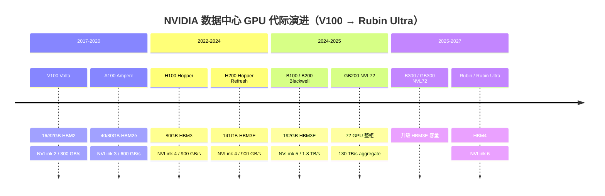
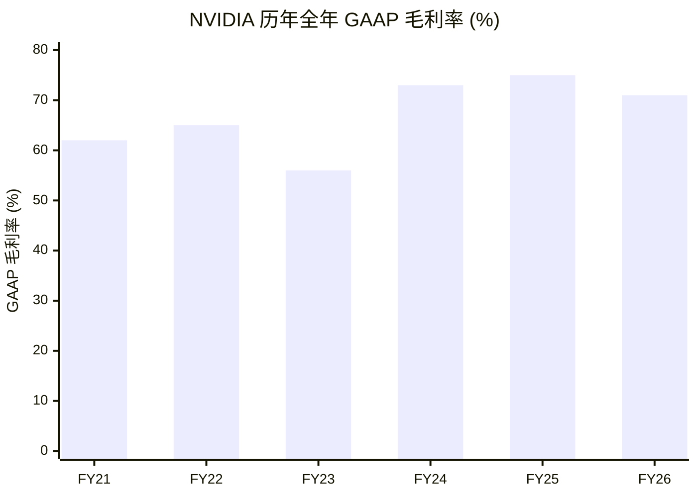
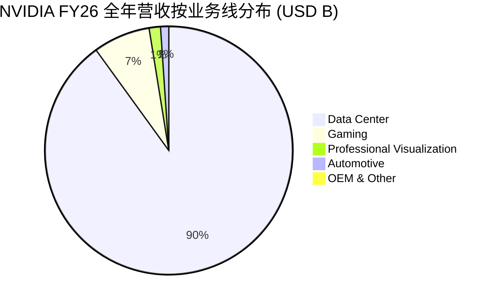
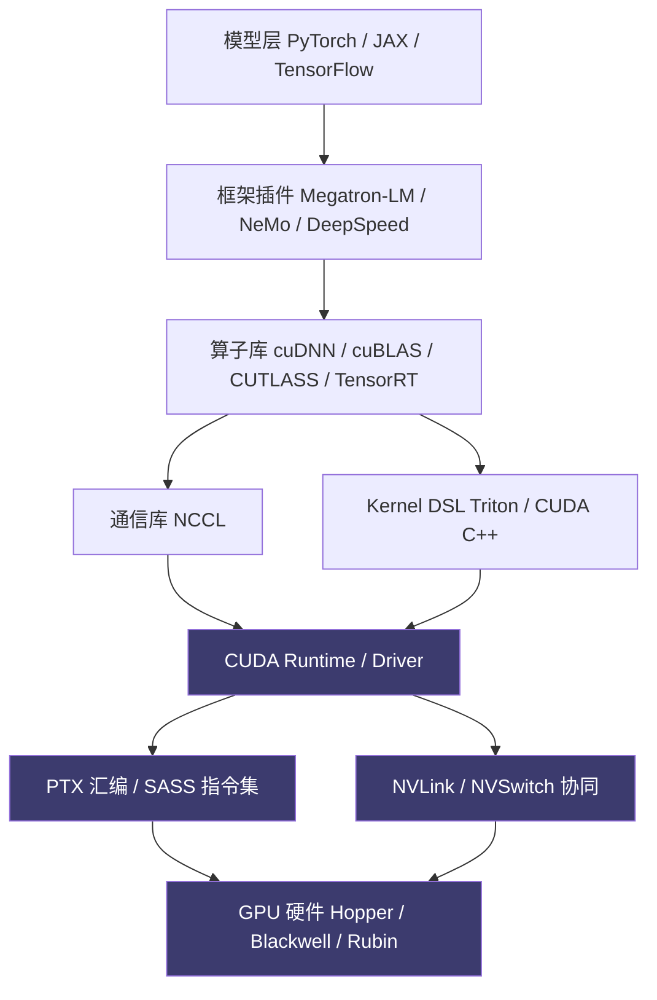
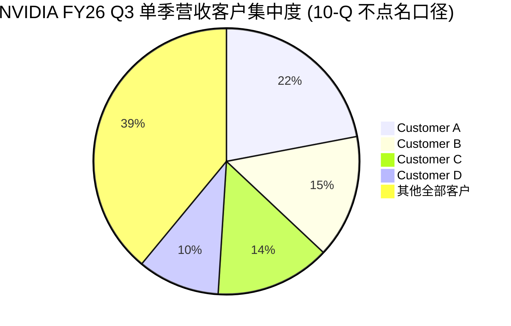
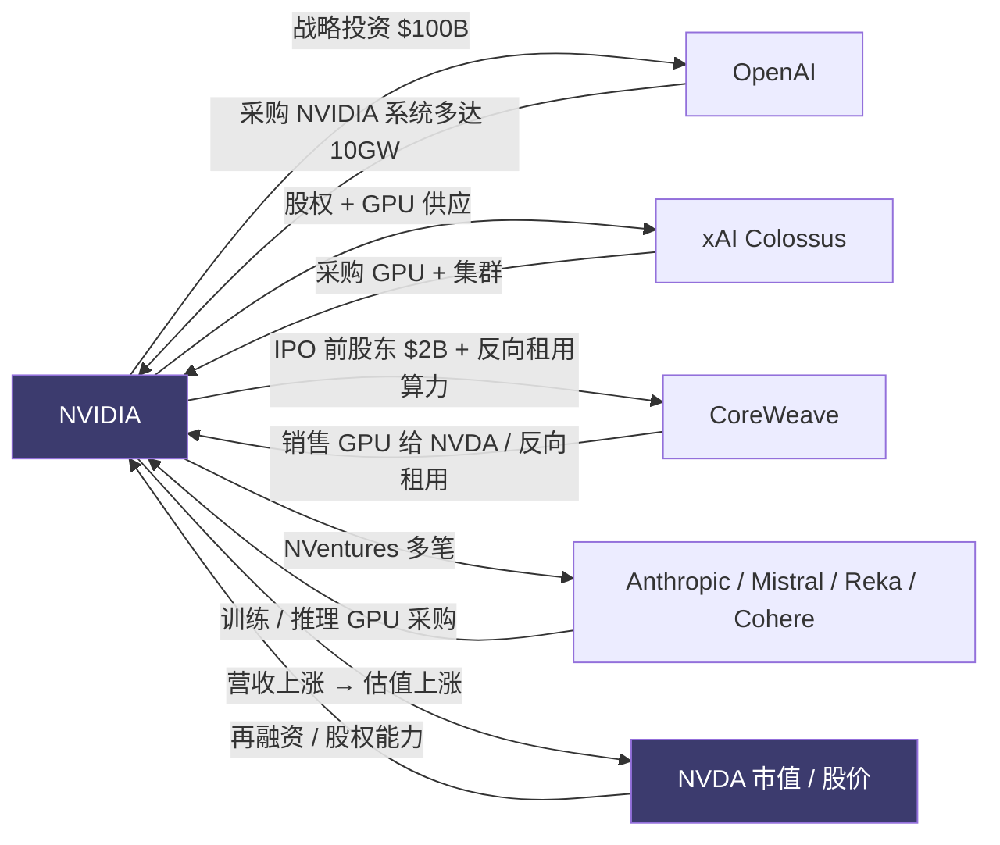
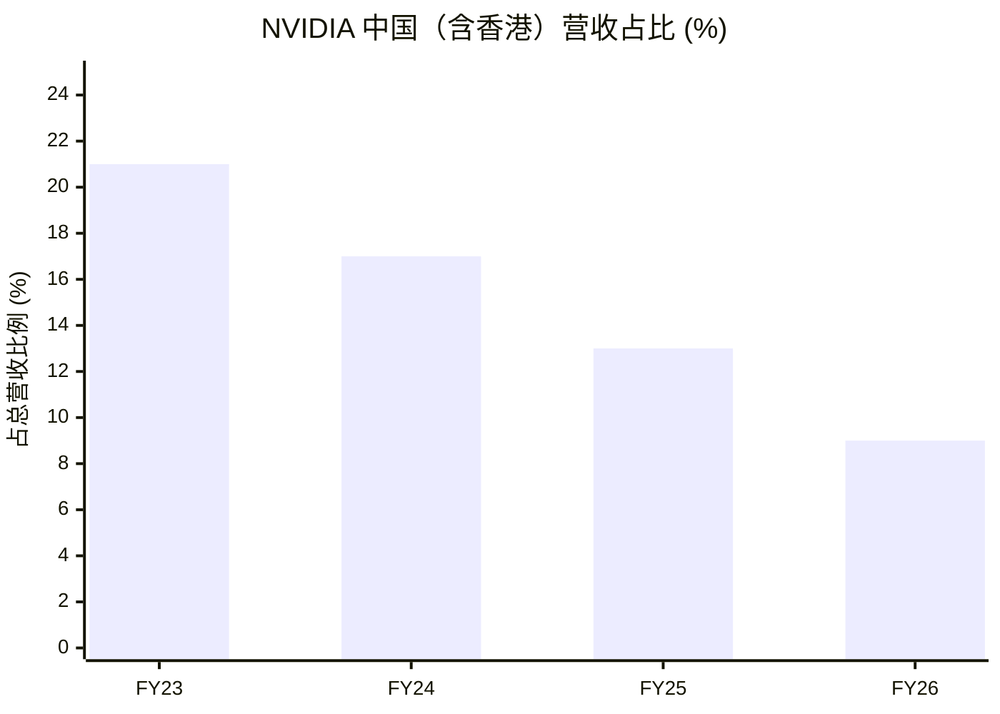

# 第 7 章 加速芯片：NVIDIA 75% 毛利率的护城河拆解

## 本章概览

[NVIDIA](https://www.nvidia.com/) FY26 全年（截至 2026-01-25）数据中心业务营收 \$193.7B，整体营收 \$215.9B，全年 GAAP 毛利率 71.1%、Q4 GAAP 毛利率 75.0%。从一张 H100 物理 BOM ~\$3,320 到整卡渠道售价 ~\$25,000-30,000，价差近 8 倍。

主流叙事把这 8 倍价差归结为「CUDA 生态强 + 黄仁勋远见」——一句话总结，对工程师与投资者都没用。本章把这条价差拆成五条可以独立计价的「税」：CUDA 软件税（库 / 编译器 / 框架默认值）、NVLink 系统税（scale-up 域内的双向 1.8TB/s 互连）、系统设计税（reference rack / DGX / NVL72 收回整柜定义权）、客户绑定税（Top 2 ~36% 营收（FY26 全年 10-K） / Q3 单季 Top 4 ~61% + 长协 + 关联投资）、供给紧缺税（CoWoS / HBM 双瓶颈转化为议价空间）。每条税都有定量区间与可证伪条件，每条税都对应一个 ASIC 竞品对照位（TPU v5p/v6、Trainium 2/3、MI350、Ascend 910C）。

对工程师读者，本章把「我们公司还在用 NVIDIA」翻译成五条可量化的工程 / 软件 / 系统决策成本；对投资者，本章给出「NVDA 75% 毛利率守在哪条税上、哪条税最先松动」的结构化拆解——估值结论留给第 30 章，本章只做机制位。

议题 4「ASIC 能否撼动 NVDA」在本章给出**客观展示**——分蛋糕但短期不替代，终答辩留第 31 章。反共识 #5「客户集中度是 NVDA 估值反身性核心」在本章把 NVIDIA 当成机制位来拆，估值含义留到后续章节展开。

7.6（客户集中度税）与 7.9（中国市场镜像）两段涉及具体公司财务结构与地缘判断，按本书 commentary-only 模式作段落级标注，章末汇总段落级免责清单。

## 7.1 75% 毛利率的财务事实

先把财务事实摊在桌上——下面所有讨论都从这张表开始。

| 指标 | FY26 全年 | Q4 FY26（CY26Q1） | YoY (全年) | YoY (Q4) |
|---|---:|---:|---:|---:|
| 总营收（USD B） | 215.9 | 68.1 | +65% | +73% |
| 数据中心营收（USD B） | 193.7 | 62.3 | +68% | +75% |
| 数据中心营收占比 | 89.7% | 91.5% | — | +6 pp |
| Gaming 营收（USD B） | 16.0 | 3.7 | — | — |
| Professional Visualization 营收（USD B） | 3.2 | 1.3 | — | — |
| Automotive 营收（USD B） | 2.3 | 0.6 | — | — |
| OEM & Other 营收（USD B） | 0.7 | 0.16 | — | — |
| GAAP 毛利率 | 71.1% | 75.0% | — | — |
| Non-GAAP 毛利率 | 71.3% | 75.2% | — | — |
| GAAP Operating Income（USD B） | 130.4 | — | — | — |
| GAAP Net Income（USD B） | 120.1 | — | — | — |
| GAAP EPS（diluted） | \$4.90 | — | — | — |

> 来源：NVIDIA FY26 Q4 财报新闻稿（nvidianews.nvidia.com，2026-02-25 披露；NVIDIA 财年截至 2026-01-25）+ FY26 10-K。Q4 总营收 \$68.1B（QoQ +20%、YoY +73%）由 DC \$62.3B + Gaming \$3.7B + Pro Viz \$1.32B + Automotive \$0.604B + OEM & Other \$0.161B 五个分部构成（加总 \$68.085B ≈ \$68.1B；来源：NVIDIA FY26 Q4 财报新闻稿 + ServeTheHome 分部明细），DC 占比 91.5%。YoY 列拆为「全年」「Q4」双口径：数据中心 YoY 全年 +68%、Q4 +75%，与第 30 章 §1 全年 +68% 口径一致。FY26 全年 GAAP 毛利率 71.1% 与 Q4 75.0% 之间的差距是「H20 库存计提 + Blackwell 爬坡期成本」两件事在 FY26 前半年的合并效果——FY26 Q1 NVIDIA 计提 \$4.5B H20 库存减值，单季 GAAP 毛利率压到 60.5%，随后逐季回升至 Q4 75.0%（业内汇编 NVIDIA 各季 8-K + Q1 FY26 财报会议表态）。Q1-Q3 数据中心营收单独披露需查 10-Q（按 FY26 全年 \$193.7B - Q4 \$62.3B = Q1-Q3 合计 \$131.4B 反推，公司本表不分季披露 DC 全年口径）。

两件事需要拎出来单独看。

**第一件，毛利率 75% 在全球大公司里是异常水位**。Apple 同期毛利率 ~46%、台积电整体毛利率 59.9%、SK Hynix FY25 全年营业利润率 49%。把 NVDA 跟历史半导体寡头对比，Intel 在 2000-2010 鼎盛期数据中心 CPU 业务的毛利率 60-65%、Texas Instruments（模拟芯片寡头）长期毛利率 64-66%、Analog Devices 整体毛利率 65-68%。NVDA 数据中心业务的毛利率，比这三家历史寡头都高 10 个百分点以上。

**第二件，毛利率 75% 不是「卖产品的毛利率」，是「卖系统 + 软件 + 供给的毛利率」**。Apple 卖的是单一终端设备 + 软件订阅，毛利率结构跟 NVDA 不可比；台积电卖的是按晶圆计价的代工服务，毛利率反映先进工艺溢价 + 良率；SK Hynix 卖的是按颗粒计价的存储颗粒，毛利率反映 HBM 客户认证墙 + 周期价。

NVDA 卖的是什么——单看 H100 / H200 / B200 / GB200 单卡，是芯片；单看 DGX / HGX / NVL72，是系统；单看 CUDA / NVAIE / Omniverse，是软件 + 工具链。NVDA 的财务披露把这三层全部合在一起报「Data Center」，分子是 \$193.7B，分母只有 ~\$62B 的成本（~\$62B 为 FY26 全公司 Cost of Revenue，即 \$215.9B × (1-71.1%) ≈ \$62.4B；NVDA 不分部披露 Data Center 成本，此处用全公司成本近似 — 这本身也是 NVDA 业务高度混合的一个体现）——所以毛利率高，但 75% 这个数字回答不了高在哪一层。

本章 7.2-7.7 的目标就是把这个 75% 拆开，回答高在哪一层。

NVIDIA 数据中心 GPU 历代产品的时间线，给读者建立后面所有讨论的代际坐标。

把同一家公司的全年 GAAP 毛利率拉一条曲线，可以看到 FY23 → FY24 跳档、FY26 维持高位的形态——这条曲线就是后面五税要解释的对象。

FY26 整体毛利率 71% 是全年口径——单看 Q4 已经回到 75%，FY26 前半年因 H20 库存计提把全年压低。FY23 跌到 56% 是加密寒冬 + 渠道库存调整的合并效果。

FY26 营收的业务线分布同样值得在拆五税前先看一眼——数据中心已经吃掉 ~90%，Gaming / Pro Viz / Auto / OEM 四块加起来 ~10%。

## 7.2 8 倍加价分拆框架：五税模型

从 BOM 到售价的 8 倍价差，是怎么形成的。把 H100 SXM5 整卡这条路径打开看。

| 项 | 金额（USD） | 占整卡售价 | 性质 | 详见小节 |
|---|---:|---:|---|---|
| 物理 BOM 合计 | \$3,320 | ~12% | 物理材料 + 制造 | 第 1 章 §2 |
| CUDA 软件税 | \$7,000-10,500 | 28-38% | 框架默认值 + 库生态 + 编译器锁定 | 7.3 |
| NVLink 系统税 | \$4,000-5,500 | 14-20% | scale-up 域双向 1.8TB/s 互连（每方向 0.9TB/s）| 7.4 |
| 系统设计税 | \$2,500-4,000 | 9-14% | reference rack + 整柜定义 | 7.5 |
| 客户绑定税 | \$2,500-4,000 | 9-14% | 长协 + 关联投资 + 5 客户结构 | 7.6 |
| 供给紧缺税 | \$4,000-7,000 | 14-25% | CoWoS / HBM 紧缺转化的溢价 | 7.7 |
| 五税合计 | \$20,000-31,000 | 80-90% | 折中口径 ~\$24,500 | — |
| **整卡渠道售价（业内估算）** | **\$25,000-30,000** | **100%** | — | 第 1 章 §2 |

> 来源：物理 BOM 引第 1 章 §2（Silicon Analysts 2026-04）；五税分拆是**作者推演**，基于 NVDA FY26 财报口径 + 第 3 章/04/05/06/08/09 的产业数据反推。每条税的占比区间是相加溢价的近似分解，不是公司层面披露口径——NVDA 不分品类披露，分拆口径属作者推演，五税之间存在 5-10% 的合并区间。整卡售价 \$25,000-30,000 取 IntuitionLabs 2024 价格指南 + Dell HGX H100 8-GPU 渠道报价 + SemiAnalysis 系列 teardown，NVIDIA 不官方披露单卡出厂价。

这张表有三件事需要先在脑子里把握住。

**第一件，五税不是物理 BOM 之外可以单独定价的项目，是 NVDA 在售价里嵌入的五条隐性收费**。客户买的是一张 H100，账单上只有一个数字 ~\$28K；NVDA 出厂时不会列出软件税 X 美元、互连税 Y 美元。

这五条税是把\$28K - \$3.3K = \$24.7K 的差额按性质归属拆开——客户买的不是物理芯片，是物理芯片 + 五种锁定的组合包。如果某条税在某代产品上被竞品打掉了（例如 ASIC 客户自己拥有软件栈），那条税就在那个客户身上消失，但 NVDA 在其他客户身上仍然拿得到。

**第二件，五条税之间有交叉**。比如客户绑定税里包含了长协预付让客户拿到优先 CoWoS 配额，这部分跟供给紧缺税重叠；CUDA 软件税里包含了 NCCL（NVIDIA Collective Communications Library，NVIDIA 集合通信库，用于多卡 GPU 的 all-reduce / all-gather 等通信原语）默认调 NVLink，这部分跟 NVLink 系统税重叠。重叠的部分本表按哪条税是定价主因归类，业内估算的占比区间已经考虑过这种重叠。

**第三件，五条税的弹性不一样**。CUDA 软件税最硬（迁移成本高 + 开发者惯性大）、NVLink 系统税次硬（scale-up 域内物理刚需）、系统设计税中（OEM 可以绕但客户认证 + 系统集成度差）、客户绑定税中（与客户结构反身性绑定）、供给紧缺税最软（瓶颈缓解后直接消失，详见第 12 章）。本章 7.10 给出五税中哪条最先松动的可证伪条件。

后面六节按 7.3-7.7 顺序逐条拆，每节回答三个问题：这条税的物理 / 商业基础是什么、定量区间是多少、ASIC 竞品在这条税上能撕开多大口子。

## 7.3 CUDA 软件税：开发者惯性 + 库生态 + 编译器锁定

CUDA 是 NVDA 五条税里最硬的一条。

> 术语：CUDA（Compute Unified Device Architecture）—— NVIDIA 2007 年推出的 GPU 并行编程框架，从早期的 C 语言扩展演化到当下覆盖编译器 / 运行时 / 数学库 / 通信库的完整软件栈。

CUDA 软件栈不是一个库，是分层结构。把它画成一张架构图，可以一眼看清为什么 ROCm 追赶 8 年仍有缺口——每一层都有独立的工程量级。

### 7.3.1 开发者数量与库生态规模

Jensen Huang 在 GTC 历次主题演讲中给出过 CUDA 开发者增长曲线：2020 年 ~200 万、2023 年 ~400 万，到 **GTC 2025 主题演讲明确自报 "six million developers in over 200 countries have used CUDA"（约 600 万开发者，覆盖 200 多个国家）**。这是 NVDA 官方口径的最近一次更新。

这个数字背后是 CUDA 库生态的累积：

| 库 / 工具 | 用途 | 替代品 / [AMD](https://www.amd.com/) 对应 | 关键差距 |
|---|---|---|---|
| cuBLAS | 稠密线性代数（GEMM 等） | rocBLAS（AMD） | 在 H100 / B200 上做了硬件特化的 Tensor Core 调度 |
| cuDNN | 深度神经网络原语（卷积 / 池化 / batchnorm） | MIOpen（AMD） | 多代 ResNet / Transformer 算子优化沉淀 |
| TensorRT | 推理优化 + 量化 | AMD: TensorRT-equivalent 较弱 | INT8 / FP8 / FP4 量化路径业界默认 |
| Triton | OpenAI 主导的 GPU kernel DSL | AMD 通过 ROCm-Triton 接入 | OpenAI 等模型公司默认在 NVDA 上调优 |
| NCCL | 多 GPU 通信原语（all-reduce 等） | RCCL（AMD） | 跟 NVLink / NVSwitch（NVIDIA 专属的 GPU-GPU 交换芯片，实现 NVLink 总线连接，GB200 NVL72 整柜内置多颗）硬件协同最深 |
| CUTLASS | GEMM 模板库（自定义算子） | AMD 较弱 | LLM 训练自定义算子的事实标准 |
| Megatron-LM / NeMo | 大模型训练框架（NVIDIA 维护） | DeepSpeed（兼容多平台） | 千亿 - 万亿参数训练默认栈 |

> 来源：NVIDIA Developer 官网 developer.nvidia.com（库 / 工具列表为公开披露）；AMD ROCm 文档（rocm.docs.amd.com）。差距描述综合 SemiAnalysis 2024-2025 关于 CUDA vs ROCm 的多篇深度、PyTorch 2.0-2.5 release notes、HuggingFace Transformers + Accelerate 后端支持矩阵。

这张表的纵向意义是——**CUDA 不是一个单一软件，是一个 17 年沉淀的库生态 + 编译器 + 运行时的复合体**。AMD ROCm（Radeon Open Compute，AMD 2016 年推出的 GPU 计算开源软件栈）从 2016 年开始追赶，到 2026 年仍然存在三类缺口：(1) 库覆盖度：cuDNN / TensorRT / CUTLASS 这三个库的 AMD 对应物在某些算子或量化路径上仍然滞后；(2) 框架默认：PyTorch / JAX / TensorFlow 上游对 ROCm 的支持迭代速度比 CUDA 慢 6-12 个月，主流模型仓库（HuggingFace / Megatron-LM）默认 CUDA；(3) 工具链：CUDA Profile（nsys / nsight）调试链在 ROCm 上不完整等价。Intel oneAPI（Intel 主导的跨厂商加速器编程框架，包含 SYCL 编译器）在 GPU 上的工程量级更小，2025-2026 主流模型公司没有把 oneAPI 作为生产路径。

### 7.3.2 迁移成本的工程量级

把 CUDA 切到 ROCm 翻译成工程量级。

业内多篇深度技术报道在 2024-2025 给过一致区间：模型代码从 CUDA 切到 ROCm 在单一项目尺度上需要 **6-18 个月工程时间** + **性能损失 10-30%**（**业内估算**，来源：SemiAnalysis MI300X 评测系列 2024-12 至 2025-08、theCUBE Research 2025-Q3 AMD AI 推理评测综合、Lamini AI / Together AI 2025 ROCm 部署 retrospective）。这个区间分两段：(1) 软件适配（PyTorch + 自定义算子 + 推理服务）约 2-6 个月；(2) 性能调优（kernel 重写、量化路径替换、通信原语适配）约 4-12 个月；(3) 客户认证 / 长尾兼容（HuggingFace 模型大全 / 第三方框架）持续；性能损失大头来自第三方算子库不达 cuDNN / TensorRT 同等量化精度 / 速度。

把这个工程量级翻成钱。按单个大模型公司 200 人工程团队、\$300K 全包年薪计算，单项目迁移成本业内估算 \$20-50M（不含机会成本：迁移期间产品迭代延后 6-12 个月对收入的影响）。这个数字解释了为什么 Anthropic / xAI / Mistral / OpenAI 等模型公司即便对 NVDA 议价权不满，也很少真正切平台——切平台的工程成本和机会成本远大于一年的 NVDA 议价空间。

对超大客户（超大规模云厂），切换不是单项目，是整个 fleet。Meta 自家 MTIA（Meta Training and Inference Accelerator，Meta 2023 年推出的自研推理加速器，2024-2025 进入第二代）从 2023 年立项到 2026 年仍未替代 Meta NVDA 训练 fleet 的主流位置，用了 3 年时间证明切平台不是工程问题，是规模 + 时间问题。

### 7.3.3 ASIC 在 CUDA 税上能撕开多大

按 ASIC 类型分类的撬动程度：

- **Google TPU**（GOOG 自研，2015 年起代际迭代到 TPU v5p / v6 Trillium）：Google 自己有 JAX + XLA + Pathways 完整软件栈，内部使用上完全不依赖 CUDA。但**对外**——Anthropic 等 Google Cloud TPU 客户仍然要从 PyTorch / Triton 上重新适配，迁移成本仍在。Google 用内部不付 CUDA 税 + 外部部分付的双轨结构压制 NVDA。
- **AWS Trainium**（AMZN 自研，Annapurna Labs 设计，Trainium 2 在 2024-12 量产、Trainium 3 在 2025-12 公布）：AWS Neuron SDK 作为软件栈，仍然在追赶——Anthropic 是早期主要 Trainium 客户，其内部 Claude 模型部分推理在 Trainium 2 上运行。
- **AMD MI300X / MI350**：ROCm 生态在 2025 年下半年到 2026 年随着 PyTorch 2.5/2.6 上游支持改善有一定追赶，但库覆盖与算子优化仍滞后 CUDA 6-12 个月。AMD FY25 数据中心业务全年营收 \$16.6B（Data Center segment revenue was a record \$16.6 billion, up 32% year-over-year，来源：AMD Q4 2025 earnings press release 2026-02-03，ir.amd.com；AMD FY25 财年与日历年一致，截至 2025-12-27），其中 MI300/MI325X 系列业内估算贡献 \$5-6B，MI350 在 FY26 Q3-Q4 爬坡。
- **华为 Ascend 910C**：用 CANN（Compute Architecture for Neural Networks，华为自研的 AI 软件栈，类似 ROCm 的角色）替代 CUDA，**国内市场内**算独立生态；对外不输出。
- **专用推理 ASIC**（Groq、Cerebras、SambaNova、Tenstorrent）：在窄场景（推理 / 低延迟）撕开口子，但通用训练栈仍依赖 CUDA。

合并判断：CUDA 软件税在超大规模云厂自研 ASIC（TPU / Trainium / MTIA）上**被部分对冲**（超大规模云厂自家内部不付），在外部模型公司与企业市场上**仍然有效**。**这条税是五税中最难松动的，可证伪条件最高**。

## 7.4 NVLink 系统税：scale-up 域的物理刚需

NVLink（NVIDIA 2014 年推出的 GPU-GPU 高带宽互连协议，第 5 代每 GPU 双向带宽 1.8TB/s，单向 0.9TB/s）是 NVDA 五条税里第二硬的一条。它的硬不来自软件惯性，来自 scale-up 域的物理刚需。

### 7.4.1 scale-up 与 scale-out 的边界

先把概念边界划清楚。多 GPU 集群在物理上分两层：

- **scale-up 域**：少数 GPU（典型 8-72 张）在一个机柜或一组相邻机柜内，通过高带宽低延迟互连组成一个逻辑 GPU。算子级别的张量并行、流水线并行在这一层完成。带宽要求：TB/s 级，延迟要求：ns 级。
- **scale-out 域**：scale-up 单元之间，通过网络层（InfiniBand / 以太网 RDMA over Converged Ethernet）组成万卡 - 10 万卡集群。数据并行的梯度同步、模型分发在这一层完成。带宽要求：百 GB/s 级，延迟要求：µs 级。

NVLink 在第一层（scale-up），InfiniBand / RoCE / Broadcom Tomahawk 在第二层（scale-out）。本章只讲第一层；scale-out 网络层是第 8 章的主菜（Broadcom 隐形 AI 红利）。这个边界很重要，因为五税里的 NVLink 系统税专指 scale-up 域 NVDA 不可替代，scale-out 域 NVDA 并非主导地位（Broadcom Tomahawk 等以太网交换芯片在超大规模云厂自建集群里大量替代 InfiniBand）。

### 7.4.2 NVL72 的物理参数

GB200 NVL72 整柜是 NVLink 系统税的最高浓度体现。规格：

| 参数 | GB200 NVL72 |
|---|---:|
| GPU 数量 | 72 张 B200 |
| CPU 数量 | 36 颗 Grace（NVIDIA 自研 Arm 服务器 CPU） |
| HBM 总容量 | 13.4 TB HBM3E |
| HBM 总带宽 | 576 TB/s |
| **NVLink 5 单 GPU 双向带宽** | **1.8 TB/s（每方向 0.9 TB/s）** |
| **NVLink 5 整柜 GPU-GPU 总带宽** | **130 TB/s** |
| FP4 推理算力 | 1,440 PFLOPS（sparse）/ 720 PFLOPS（dense） |
| 整柜液冷功率 | ~120 kW |

> 来源：NVIDIA GB200 NVL72 产品规格页（nvidia.com/en-us/data-center/gb200-nvl72/）；NVIDIA NVLink 产品页（nvidia.com/en-us/data-center/nvlink/）；NVIDIA Blackwell 架构 whitepaper 2024-03。NVLink 5 单 GPU 1.8 TB/s 为 bidirectional 双向总带宽（18 links × 50 GB/s per direction × 2 = 1.8 TB/s），单向约 0.9 TB/s——产品页 NVLink Bandwidth per GPU: 1,800 GB/s 即此双向口径，本书统一标双向数字以避免与早期文献的单向口径混淆。产品规格页 NVFP4 Tensor Core 一栏标注「1,440 | 720 PFLOPS」并注明「Specification in sparse | dense. Dense is one-half sparse spec shown.」——即 1,440 PFLOPS 为 sparse 口径、720 PFLOPS 为 dense 口径。本书涉及 FP4 算力对比时统一以 dense 口径（720 PFLOPS）作为主轴；引用 1,440 PFLOPS 时显式标 sparse。

这套参数的物理含义是——**72 张 B200 在一个机柜里通过 130 TB/s 总带宽互连，对模型并行（张量并行 + 流水线并行）等价于一颗超级 GPU**。同样 72 张 GPU 如果用 InfiniBand / RoCE 的 400 GbE 或 800 GbE 互连，每 GPU 双向带宽量级是 100-200 GB/s（NDR 400G + 双链路 GPUDirect 同口径换算），比 NVLink 5 的 1.8 TB/s 双向带宽低 9-18 倍。这个带宽差距对训练万亿参数模型的张量并行通信至关重要——通信耗时直接决定 GPU 利用率（model FLOPs utilization，MFU），NVLink 5 的整柜带宽让 MFU 在万亿模型上能跑到 40-50%，而纯 scale-out 互连的 MFU 通常在 20-30% 量级。

### 7.4.3 scale-up 互连的替代品

scale-up 域有没有 NVLink 的替代品。三种状态：

- **AMD Infinity Fabric**：AMD MI300X 单卡 NVL 替代物，跨 8 卡（OAM（OCP Accelerator Module，开放计算项目标准化 AI 加速器模块封装，AMD MI300 系列采用）设计），单向带宽 400-450 GB/s 量级。对比 NVLink 4（H100 用）单向 450 GB/s 在同代，但跨柜扩展能力 AMD 较弱——没有 NVL72 这种 72 卡级 scale-up 拓扑。
- **Intel Gaudi3**（Intel 2024 推出，2025-2026 在某些超大规模云厂上小规模部署）：用以太网 RoCE 做卡间通信，scale-up 性能不如 NVLink。
- **UALink**（Ultra Accelerator Link，AMD / Intel / Broadcom / Cisco / Meta / Microsoft / Google 2024 年联合推出的开放标准 scale-up 互连规范，目标对标 NVLink）：1.0 标准在 2025-04 发布，但**首颗 UALink 兼容产品 2026 年仍未量产**，最早 2027 年才有量产芯片。
- **Google TPU 自家互连**：TPU v4 / v5 / v6 用 OCS（Optical Circuit Switch，光路交换）+ ICI（Inter-Chip Interconnect）做内部 scale-up，是 Google 内部唯一不依赖 NVLink 的替代物。这套互连在 GCP 内部使用、对外通过 Google Cloud TPU 服务输出，但不卖芯片给第三方。
- **AWS Trainium 自家互连**：Trainium NeuronLink 用 PCIe + 以太网组合做 scale-up，性能介于 NVLink 与纯 scale-out 之间。AWS 自家产品独家使用。

合并判断：**scale-up 域目前没有任何开放标准的 NVLink 替代物**。最近的对照是 Google 自家 TPU OCS（自家用）和 UALink（2027+ 才有产品）。NVLink 系统税在 2026-05 时点上对外部客户是物理刚需，对外部超大规模云厂自家集群则不可避免（一旦客户用 NVDA GPU 做训练，scale-up 域必须用 NVLink，没有第二选择）。

这条税的弹性低于供给紧缺税，高于 CUDA 软件税。可证伪条件：**UALink 1.0 产品量产 + 主流超大规模云厂至少一家用 UALink 互连规模化部署 + 万亿模型 MFU 达到 NVL72 同水平**——业内最乐观判断 2027 下半年第一个里程碑，2028 量产规模化。

## 7.5 系统设计税：reference rack 收回整柜定义权

NVLink 系统税是卡之间的护城河，系统设计税是整柜之上的护城河。

### 7.5.1 从单卡到整柜：定义权的转移

2020 年之前，NVDA 卖的是单卡（PCIe）+ HGX baseboard（8 卡 SXM 模组）。客户从 NVDA 拿 8 卡 baseboard，再交给 Dell / HPE / Supermicro / Foxconn / Wiwynn / Quanta 等 OEM / ODM 组成 4U / 6U / 8U 整机，整机的电源 / 散热 / 机箱 / 网卡 / 存储设计权在 OEM 手里——OEM 拿走整机毛利的大头（业内估算 10-15%），NVDA 拿走 baseboard 那一层。

2022 年 NVDA 推出 DGX H100 / HGX H100 reference design，开始把整机层规范化；2024 年 GB200 NVL72 把整柜规范化——液冷管路、机柜尺寸、电源拓扑、机柜内 NVLink Switch 位置、散热风道全部由 NVIDIA reference 定义，OEM / ODM 仅做按图组装。

这个动作有三层含义：

- **第一层，整柜售价 NVDA 拿走更大份额**。GB200 NVL72 整柜售价业内估算 \$3M-3.7M，其中 72 张 B200 GPU 占 \$2.9-3.0M（按单 GPU \$40K 算），NVLink Switch + reference 设计 NVDA 拿走 \$200-400K，剩余 OEM / ODM 整机组装 + 液冷 + 网卡 + 机柜 + 测试拿到 \$200-400K。OEM 整机毛利率从 HGX 时代的 10-15% 压到 GB200 时代的 6-10%。
- **第二层，整柜部署的整体性能由 NVDA 控制**。reference rack 把 PUE（Power Usage Effectiveness，数据中心电力使用效率，定义为总耗电 / IT 设备耗电；越接近 1.0 越好）、液冷管路接口、整柜功率密度全部固定，客户没有用别家 OEM 优化的空间。客户的优化只能在整柜之外（数据中心层）做。
- **第三层，整柜测试 / 良率由 NVDA + Foxconn 等核心 ODM 把关**。NVDA 在 2024-2025 把整柜测试流程从 OEM 收回到 ODM 阶段，整柜出厂前 burn-in / 烧机由 ODM 完成，客户拿到的是开机即用的整柜。这个动作减少了客户的运维负担，但也让客户对整柜内部细节失去可视化。

### 7.5.2 系统设计税的定价机制

整柜方案相对单卡 + OEM 拼装的定价溢价，业内估算 10-15%——同样 72 张 B200 物理 GPU，按 reference rack 整柜采购单价比按单卡采购 + 自组整柜单价高约 \$200K-400K。这部分溢价就是系统设计税的浮现位。

对客户的诱因是什么。系统设计税虽然多付 10-15%，但换来三件事：(1) 整柜部署时间从 6-9 个月（自组）压到 2-3 个月（开箱即用）；(2) 整柜性能与 NVDA 公布 benchmark 一致（自组方案常有 10-20% 性能损失）；(3) NVDA 直接提供整柜支持（自组方案需要客户自己整合多家厂商支持）。这三件事对超大客户（超大规模云厂）的总拥有成本（TCO）有显著降低，因此即便 10-15% 溢价也愿意付。

### 7.5.3 ASIC 在系统设计税上能撕开多大

- **Google TPU**：Google 内部的整柜（TPU pod）设计完全在 Google 手里，不付任何 NVDA 系统设计税。对外通过 Google Cloud TPU 服务，TPU 客户也不付，但客户的产品迭代受限于 Google 的 pod 架构。
- **AWS Trainium**：AWS 自家 EC2 Trn1 / Trn2 实例的整柜设计在 AWS 手里。
- **AMD / 第三方 ASIC**：MI350 在超大规模云厂部署时仍需要 OEM 整机方案，AMD 没有 NVDA 整柜 reference 的整合度，整机 SI 的复杂度更高。

合并判断：**超大规模云厂自研 ASIC 路线完全不付系统设计税**——这是超大规模云厂选择自研最直接的财务动机。对外部模型公司（OpenAI / Anthropic / xAI / Mistral）与企业市场，系统设计税仍然有效。可证伪条件：** ASIC 出现 OEM 整柜方案的开放参考设计 + 至少一家模型公司部署该方案**——业内最乐观判断 2027+。

第 9 章详谈系统设计税的下游含义（OEM / ODM 商业模式分化、垂直 onshore），本章只做机制位。

## 7.6 客户绑定税：高客户集中度的反身性核心

> 本节涉及具体公司客户结构、关联投资与循环交易迹象，按本书 commentary-only 模式作段落级标注，**仅为产业机制分析，不构成投资建议**；估值含义与情景测算留给第 14 章 / 第 29 章 / 第 30 章。

NVDA 五税中最复杂的一条。

### 7.6.1 客户集中度的披露口径

NVDA 在 10-K 与 10-Q 中按 concentration of revenue 一项披露客户集中度。FY26 10-K 全年披露口径中仅两个直接客户超过 10% 阈值——Customer A 占总营收 22%、Customer B 占 14%，合计 36%。

**全年 10-K 口径与单季 10-Q 口径差异显著**——10-K 全年只披露超 10% 的客户，FY26 全年只有 2 家超过这个阈值；季度 10-Q 颗粒度更细，多个客户在单季会突破 10%：

- **FY26 Q2 单季**（截至 2025-07-27）：Customer A 占 23%、Customer B 占 16%，合计两个直接客户占 39%；另有四个客户分别占 14%、11%、11%、10%——Top 6 entities 合计占 Q2 营收 ~85%；FY26 H1 上半年 Top 2 客户合计占 35%。
- **FY26 Q3 单季**：四个直接客户分别占 22%、15%、14%、10%——Top 4 单季合计 ~61%。

季度峰值（Q3 Top 4 61% / Q2 Top 6 85%）显著高于全年 10-K 口径（Top 2 36%）的原因——单季披露阈值同为 10%，但全年口径中只有持续大客户才能整年保持在 10% 之上；季度颗粒度反映超大规模云厂资本支出节奏的脉冲式集中。

市场广泛推测这些客户是 Microsoft / Meta / Amazon / Google / Oracle，但 NVDA 官方从不点名。**严格用 NVDA 10-K / 10-Q 披露口径**——全年 Top 2 ~36% / Q2 单季 Top 2 39% / Q3 单季 Top 4 ~61% / Q2 Top 6 ~85%——不写死具体客户名。

NVDA FY26 Q3 单季营收按 Top 4 + 其他客户拆开看，结构如下。

这个集中度量级，跟其他大公司的对照：

| 公司 | Top 客户营收集中度 | 来源 |
|---|---:|---|
| NVIDIA FY26（全年 10-K）| Top 2 客户 ~36%（22% + 14%）| NVDA FY26 10-K |
| NVIDIA FY26（Q3 单季 10-Q）| Top 4 ~61%（22% + 15% + 14% + 10%）| NVDA FY26 Q3 10-Q |
| NVIDIA FY26（Q2 单季 10-Q）| Top 2 ~39% / Top 6 ~85% | NVDA FY26 Q2 10-Q |
| Apple | Top 客户单一披露口径 ~12-15%（运营商） | Apple FY25 10-K |
| 台积电 | Top 客户 Apple ~22%、NVIDIA ~15-18% | 台积电 FY25 6-K（地域披露反推）|
| SK Hynix | NVIDIA / Microsoft 等 Top 3 客户 ~40%+ | SK Hynix 业内估算 |
| Cisco（2000 顶峰，市值 ~\$555B） | Top 客户 < 20% | Cisco FY2000 10-K |
| Lucent（1999 顶峰，市值 ~\$258B） | Top 客户 < 25% | Lucent FY1999 10-K |

> 来源：各公司 10-K + 公开披露；台积电客户集中度按地域 + Apple / NVIDIA 反推为业内估算。Cisco 顶峰市值 \$555B 对应 2000-03-27 股价 \$80.06；Lucent 顶峰市值 \$258B 对应 1999 年底高点。

NVDA 全年 Top 2 ~36% 已是产业一流大公司里的**异常高水位**——比 Cisco / Lucent 在 1999-2000 telecom 顶峰时期两家的全年 Top 1 还要高 15-20 个百分点；季度 Top 4 ~61% / Top 6 ~85% 的颗粒度则把这个高水位再次放大（第 29 章 §29.3 维度 10 已建立对照口径）。这个数字单独不下估值判断，但它揭示了 NVDA 营收结构的一个关键事实：**几家超大规模云厂的资本支出节奏决定 NVDA 单季营收**。

### 7.6.2 长协 + 预付款机制

高客户集中度背后的合同结构。NVDA 在 FY26 10-K 披露 Remaining Performance Obligations（RPO，未来确认的合同营收）业内估算 \$90B+ 量级。这个 RPO 主要来自客户预付款 + 长协，反映超大规模云厂 / sovereign AI / 主流模型公司 2-5 年的算力锁定。

长协机制有两个直接含义：(1) NVDA 拿到客户预付现金，缓解自家对台积电 + SK Hynix 的 supply obligation 现金压力（NVDA 在 2023 年披露 long-term supply obligations \$6.9B，其中 \$1.64B 已预付绑定 CoWoS 产能，来源：SemiAnalysis 2022-2023 综合 + NVDA 10-Q）；(2) 客户拿到优先 CoWoS / HBM 配额，确保算力供给——这部分价值就是供给紧缺税与客户绑定税的交叉位。

### 7.6.3 关联投资 + 循环交易迹象

NVDA 在 FY26 10-K 关联交易 / 战略投资部分披露与多家客户存在投资关系：

- **CoreWeave**（NASDAQ: CRWV）：NVDA 是 IPO 前重要股东，2026-01 NVDA 以 \$87.20/share 认购 2,293.6 万股、合计约 \$2.0B。NVDA 既是 CoreWeave 的供应商（卖 GPU），又是股东，又是反向客户（NVDA 自研 cluster 部分用 CoreWeave 算力）。
- **OpenAI**：NVDA 在 2025-09-22 公告投资 OpenAI 多达 \$100B，对应 OpenAI 部署多达 10 GW 的 NVIDIA 系统，是 NVDA 单笔最大战略投资。
- **xAI**：NVDA 通过 Colossus / Colossus 2 集群（Memphis、Saudi Arabia）与 xAI 深度绑定，NVDA 是 xAI 的 GPU 供应商兼战略投资人。
- **Mistral / Anthropic / Reka / Cohere 等模型公司**：NVDA 通过 NVentures / 直接投资持有部分股份。

这个结构在产业研究里叫 vendor financing 复刻——1999 Lucent / Nortel 给 CLEC 客户提供 vendor financing 让客户买自家设备的剧本，在 2024-2026 由 NVDA 以战略投资 + 算力承诺的形式复现（第 18 章详谈完整机制 + 历史复盘）。

**循环交易迹象**：NVDA → 投资 OpenAI / xAI / CoreWeave → 它们用 NVDA 钱买 NVDA GPU → NVDA 营收上涨 → NVDA 估值上涨。这个回路本身不违法（每一段都是独立交易），但回路结构让 NVDA 营收的真实需求与自我推动需求难以拆分。**只描述机制位**，估值含义与情景测算留给第 18 章 + 第 29 章 §29.5 + 第 30 章。

### 7.6.4 客户绑定税的反身性逻辑

客户绑定税是五税里最反身性的一条。反身性（Soros 提出的金融市场理论框架——参与者认知影响市场，市场反过来影响参与者认知，形成正反馈或负反馈回路）在 NVDA 客户绑定上的体现：

1. NVDA 与 5 客户绑定深 → 5 客户资本支出增长 → NVDA 营收增长
2. NVDA 营收增长 → 估值上升 → NVDA 通过股权 / 现金做更多战略投资
3. 战略投资进一步绑定客户 → 长协与预付款增加 → 第 1 步加深

这个回路在正向阶段（2023-2026）放大 NVDA 营收 + 估值；但在负向阶段（任何一家超大规模云厂砍资本支出、模型公司商业化不达预期），同一个回路会反向放大估值压力。**§7.6 的客户集中度税正是反共识 #5 的核心机制位**——全年 Top 2 ~36% / 季度 Top 4 ~61% 的高集中度不是单纯的客户风险，是估值反身性的物理输入位。

> **段落级 disclaimer（commentary-only）**：本节关于 NVDA 客户结构、关联投资、循环交易的描述基于公司 10-K 披露 + 公开公告 + 业内综合分析，仅为产业机制层面的客观分析，**不构成对 NVDA 或本节涉及的任何公司的估值判断或投资建议**。具体客户名是市场推测，本书严格使用 NVDA 10-K 不点名口径。涉及的关联交易与循环交易回路是产业结构性描述，估值含义留给第 18 章、第 29 章、第 30 章集中处理。

### 7.6.5 客户绑定税的可证伪条件

弹性中等。可证伪条件：**任何一家 Top 5 客户单季资本支出同比 -20% 以上 + 长协终止 + 关联投资减计**——业内最敏感的监测信号是超大规模云厂季度资本支出指引 + NVDA 季度 RPO 增速。详见第 12 章 §12.4 与第 14 章 §14.2 的预警信号位。

## 7.7 供给紧缺税：CoWoS + HBM 双瓶颈的议价转化

五税中最软、也是 NVDA 估值模型里最被卖方测算的一条。

### 7.7.1 CoWoS / HBM 紧缺如何转化为 NVDA 议价空间

物理基础：台积电 CoWoS 月产能 2024 年 35K、2025 年 75K、2026 年目标 130K、台积电 2026 法说会指引 2027 年达 230K+；SK Hynix / Samsung / Micron 三家 HBM 总产能 2024-2026 增长 3-4 倍但仍紧（第 6 章 § 已建立）。

NVDA 是 CoWoS 与 HBM 紧缺的最大受益者，因为 NVDA 与 Google / AWS / AMD 合计吃掉 CoWoS 90%+ 配额。这意味着 NVDA 在客户面前对**整卡售价拥有不对称议价权**——当 NVDA 自己不开足产能时（受 CoWoS 月产能约束），客户只能接受 NVDA 的定价，因为没有第二供应商可选。

这种紧缺议价空间，从 H100 价格曲线可以观察：

| 时点 | H100 单卡渠道价区间（USD） | 备注 |
|---|---:|---|
| 2023 Q1（量产初期） | ~\$25,000-28,000 | NVDA 出厂价基准（业内估算）|
| 2023 Q4（紧缺顶峰） | \$40,000-50,000 | 渠道 / 二手市场加价 1.5-2x |
| 2024 Q2（紧缺顶峰持续） | \$35,000-45,000 | 一手客户仍紧缺 |
| 2025 Q2（供给改善） | \$25,000-30,000 | 回归出厂价基准 |
| 2026 Q1（H100 被 B200 替代）| \$20,000-25,000 | 二代效应 + 折旧 |

> 来源：IntuitionLabs NVIDIA GPU Pricing Guide（2023-2024）+ Silicon Data H100 Rental Index（2023-2026）+ SemiAnalysis 多份 teardown 综合；2026 Q1 H100 价格回落综合第 12 章 §12.2 双瓶颈缓解节奏。

H100 价格曲线呈现明显的紧缺溢价 → 缓解回落模式。同期 B200 / GB200 在 2024-2026 量产爬坡期，重复了 H100 的紧缺溢价路径——B200 单卡渠道价 2025 Q1 起步 \$40-45K、2026 Q1 仍维持 \$40K 量级。

这种紧缺议价空间转化为 NVDA 整体毛利率的支撑——FY26 Q4 毛利率 75.0%、Q1-Q3 受 H20 库存计提影响在 60-72% 区间。如果 CoWoS / HBM 充分供给（无紧缺溢价），业内估算 NVDA 数据中心毛利率会降到 60-65% 量级，但这只是反事实情景，2026-05 时点仍然紧缺。

### 7.7.2 供给紧缺税的弹性最高

五税里弹性最高的是供给紧缺税。原因有三：

- **物理紧缺是有时间窗口的**：CoWoS 月产能 2027 年达 230K 后，NVDA 主流产品供给约束消除；HBM4 在 2027 年三家同步量产后，HBM 紧缺缓解（第 12 章 §12.2 详谈缓解节奏）。
- **紧缺溢价直接进单卡售价**：CoWoS / HBM 充分供给后，紧缺溢价从单卡售价直接剔除（业内估算 H100 / B200 单卡可剥离 \$4,000-7,000 紧缺溢价），毛利率反向压缩 5-10 pp。
- **客户对紧缺溢价的容忍度有限**：客户对 CUDA / NVLink / 系统设计 / 客户绑定四条税的支付意愿基于长期切换成本太高，但对供给紧缺税的支付意愿仅基于短期没有第二供应商——一旦供给改善，客户立即减少为紧缺溢价付费。

可证伪条件最明确：**CoWoS 月产能 ≥200K + HBM4 三家厂稳定产能 + H100 / B200 / B300 渠道价回归出厂基准 + NVDA 季度毛利率压到 70% 以下**——业内最乐观判断 2027 Q3-Q4，最保守判断 2028 H1（第 12 章 §12.5 三个预警信号已建立）。这条税的松动是 NVDA 估值最早可监测的拐点。

## 7.8 ASIC 五税对照矩阵

把 7.3-7.7 五条税与 ASIC 竞品对照成一张矩阵，回答议题 4「ASIC 能否撼动 NVDA」。

| 竞品 | CUDA 软件税 | NVLink 系统税 | 系统设计税 | 客户绑定税 | 供给紧缺税 | 一句话注解 |
|---|:---:|:---:|:---:|:---:|:---:|---|
| Google TPU v5p / v6 Trillium | strong（内部）/ partial（对外） | strong（自家 OCS 互连） | strong（内部 pod） | strong（GCP 自家客户） | partial（自家产能受 Broadcom 设计代工约束） | 内部完全不付，对外通过 GCP 输出 |
| AWS Trainium 2 / Trainium 3 | partial（Neuron SDK 追赶中） | partial（NeuronLink 性能介于） | strong（AWS 自家 EC2） | partial（Anthropic 等少数客户） | partial | AWS 自家 fleet 部分替代 NVDA |
| Meta MTIA v2 / v3 | partial（Meta 自家栈） | none（仍依赖 RoCE） | strong（Meta 自家整柜） | strong（Meta 自家） | partial | 仅 Meta 内部推理，无外部输出 |
| AMD MI350 / MI400 | partial（ROCm 6-12 月滞后） | partial（Infinity Fabric 跨 8 卡） | none（依赖 OEM 整机） | none（需要从 NVDA 抢） | partial | 通用替代位最大，软件 + 系统短板明显 |
| 华为 Ascend 910C / 920 | strong（国内 CANN 独立生态） | partial（自家 HCCS（Huawei Cache Coherent System，华为自研 AI 加速器互连协议，类似 NVLink 角色）互连） | partial（自家整柜方案）| strong（国内市场） | strong（受 SMIC + 国产 HBM 自供产能约束）| 国内市场独立轨，对外不输出 |
| 通用专用推理 ASIC（Groq / Cerebras / SambaNova / Tenstorrent）| none（窄场景） | none | partial | none | none | 在窄场景撕开，通用训练栈不动 |

> 表注：strong = 该 ASIC 在该条税上**完全或大部分对冲** NVDA 收费；partial = 部分对冲，主要在特定场景或客户层；none = 对该条税几乎不构成挑战。判定口径基于 7.3-7.7 各小节定量分析综合。Google TPU strong（内部）/ partial（对外） 双栏表述是 Google 内部使用与 GCP 对外输出的二轨结构反映。
>
> 注：华为 Ascend 在供给紧缺税一栏 strong 含义是自身受供给约束较强（SMIC N+2 + 国产 HBM 自供产能有限），方向与 NVDA 通过紧缺向客户收溢价不同；此格表示华为对 NVDA 的替代能力受自身供给限制（即华为本身就缺货，外溢出去能挑战 NVDA 的供给量有限），而非华为能复制 NVDA 的紧缺议价。

这张矩阵把议题 4 拆成可验证的结构。三件事跳出来：

**第一件，超大规模云厂自研 ASIC 对五税的对冲集中在客户绑定税 + 系统设计税两条**——它们用自家自研拒付 NVDA 这两条税。但 CUDA 软件税与 NVLink 系统税在超大规模云厂内部仍部分付（自研 ASIC 的软件栈不完整，需要混合 NVDA 路径；自研 ASIC 的 scale-up 互连不如 NVLink）。供给紧缺税则跟 ASIC 自家产能瓶颈相关，部分对冲。

**第二件，外部模型公司与企业客户对五税的支付几乎完整**——除了 Google Cloud TPU 客户的部分例外，其他外部客户（OpenAI 在 Microsoft Azure / Oracle Cloud、Anthropic 在 Google Cloud + AWS、xAI 在自家 Colossus、Mistral 在自家集群）大部分仍用 NVDA GPU，五税完整付。

**第三件，华为 Ascend 是唯一的完全独立轨**——CANN 替代 CUDA、HCCS 替代 NVLink、自家整柜方案、国内市场客户、SMIC + 国产 HBM 自供。但这套独立轨**在国内市场内有效，对外不输出**（第 21 章 + 第 28 章详谈出口管制双向效应）。

### Anthropic-Google TPU 大单的伏笔

据 Google Cloud 官方新闻稿 2025-10-23（googlecloudpresscorner.com "Anthropic to Expand Use of Google Cloud TPUs and Services"），Anthropic 将获得 **up to one million TPU chips**（最多一百万颗 TPU）的多年使用权。这是 Google / Anthropic 官方一手披露的合同上限口径，不是媒体推算。这单合约的产业含义是——**Anthropic 这种规模的前沿模型公司，第一次把非 NVDA 作为主轴算力选项**。

但仔细看 Anthropic 的算力组合，仍然是 NVDA + TPU + Trainium 三轨并行：模型训练分布在 TPU 与 NVDA 之间、推理分布在 Trainium 与 NVDA / GCP 之间、研究探索仍用 NVDA。这种多供应商分散对 NVDA 的影响是**单一客户的边际配额减少**，不是客户跑掉。

Anthropic-Google 大单与 OpenAI-AMD 战略合作公告（2025-10 AMD 8-K 披露含 warrant 结构，业内估算合作金额数十亿美元量级，来源：AMD 8-K 2025-10 + 媒体综合）是 2025 下半年 ASIC 路线两个里程碑事件。它们的意义不是 ASIC 撼动 NVDA，是前沿模型公司开始把 NVDA 集中度从 90%+ 降到 60-70% 量级——这个变化在客户绑定税上撕开了第一道口子。

终答辩在第 31 章（议题 4 五段式可证伪条件）：本书倾向 ASIC 分蛋糕但短期（2-3 年）不替代 NVDA 通用训练栈，2027+ ASIC 整体市占可能从 2025 年的 ~15% 升到 30-40%，但 NVDA 仍是 50%+ 主导。这个判断的可证伪条件 + 监测信号留给第 31 章。

## 7.9 中国市场镜像：NVDA 中国营收下行 vs Ascend 出货上行

> 本节涉及中美算力地缘格局与具体公司中国营收结构判断，按本书 commentary-only 模式作段落级标注，**仅为产业机制描述，不构成出口管制效果评估或投资建议**；管制效果评估留给第 21 章 / 第 28 章。

### 7.9.1 NVDA 中国营收的镜像曲线

NVDA 按地域披露的中国（含香港）营收占比，FY24（截至 2024-01-28）到 FY26（截至 2026-01-25）呈下行：

| 财年 | 中国（含香港）营收占比 | 来源 |
|---|---:|---|
| FY23 | ~21% | NVIDIA FY23 10-K |
| FY24 | ~17% | NVIDIA FY24 10-K，业内综合 |
| FY25 | ~13% | NVIDIA FY25 10-K（\$17.11B / \$130.5B = 13.1%） |
| FY26 | ~9% | NVIDIA FY26 10-K 地域营收一手披露（\$19.68B / \$215.9B = 9.1%），2026-02-25 SEC EDGAR |

> 来源：NVIDIA 各年 10-K 地域营收披露 + Bernstein NVDA 季度更新（2025-2026）。FY25 ~13.1% 与 FY26 ~9.1% 来自 10-K 地域营收一手披露，反映 FY25 → FY26 单一财年间中国占比再降 4 个百分点。

FY24 → FY26 中国营收占比从 ~17% → ~13% → ~9% 三档下行，FY26 对应金额约 \$19-20B 区间（\$215.9B × 9.1% ≈ \$19.7B）。占比下行趋势明确，反映美国 BIS 出口管制（H100 / H200 / B200 等高性能 GPU 不可对华出口，仅对华定制版 H20 / H20E 等性能阉割版可出）的累积效应——FY25 → FY26 单一财年再降 4 个百分点，正是二次管制阈值收紧与 H20 库存计提的合并效果。

同期 NVDA H20 系列的中国市场轨迹：2024 H1 H20 销售强劲、2024 Q4 + 2025 H1 由于二次管制阈值收紧，H20 库存计提 + 销售骤降（NVDA FY26 Q1 计提 \$4.5B H20 库存减值）、2025 H2 略有恢复但未回到峰值。

### 7.9.2 华为 Ascend 出货上行

镜像的另一端：华为 Ascend 910B / 910C 在国内市场的出货上行。

- **Ascend 910B**：2023-2024 出货放量，业内估算 2024 年出货 20-30 万颗量级
- **Ascend 910C**：2024 Q4 量产，SMIC N+2 工艺（约 7nm equivalent，受 EUV 出口管制无法用更先进工艺）+ 国产 HBM（CXMT 等）+ HCCS 互连。2025 年出货双锚口径：(1) SemiAnalysis 2025-Q3 *Huawei Ascend Production Ramp* 预测全 Ascend 系列 805K、其中 910C 占 653K，HBM 约束悲观情景下 250-300K（受 CXMT 2025 全年 ~2M HBM stacks 自供产能限制）；(2) IDC 2026-04 *中国 AI 加速卡市场报告* 实际数据 812K 全 Ascend 出货，与 SemiAnalysis 预测吻合。本书取 910C 单型号 250-650K 区间表达（区间宽度反映 HBM 约束与全 Ascend 系列向 910C 集中的不确定性，**SemiAnalysis 一手 + IDC 一手双锚**）
- **Ascend 920 / 下一代**：业内估算 2026-2027 量产规划，性能目标对标 B200

国产 ASIC 整体格局：除华为外，寒武纪（A 股 688256.SS）、燧原（未上市）、海光（A 股 688041.SS）、摩尔线程、壁仞、天数智芯等 7-8 家厂商分蛋糕，2025 年合计出货业内估算 10-20 万颗量级（**业内估算 + 多家厂商均非透明披露**）。

NVDA 中国地域营收占比四年下行曲线如下。

### 7.9.3 镜像曲线的含义

把 NVDA 中国营收占比下行与华为 Ascend 出货上行画在同一张图上，是一组明显的镜像曲线。这组镜像的产业含义有三层：

- **第一层，中国 AI 算力市场出现国产替代窗口**——出口管制在客观上把中国市场让给了国产 ASIC 厂。
- **第二层，国产 ASIC 在国内市场内独立轨**——CANN 软件栈、HCCS 互连、国产 HBM、SMIC 制造，整条链与 CUDA / NVLink / SK Hynix / 台积电系平行。
- **第三层，NVDA 在中国市场的退出不等于全球营收损失**——FY26 NVDA 全球营收增长 65%（同比），中国营收下行被全球需求增长吸收。出口管制对 NVDA 的财务伤害有限，但对中国 AI 自研路径的促进效果明显。

但这组镜像不能简单读为出口管制成功了。出口管制的双向成本（中国算力自主路径加速、美国半导体设备厂中国营收下行、第三国合规复杂度上升）需要在第 21 章 + 第 28 章完整评估，这里只给镜像曲线作为伏笔。

> **段落级 disclaimer（commentary-only）**：本节关于 NVDA 中国营收结构、华为 Ascend 出货、出口管制效果的描述基于公司 10-K 披露 + 第三方研究综合，**华为 Ascend 出货数字均为业内估算，无法独立验证**。本节仅为产业格局层面的客观描述，不构成对 NVDA、华为或本节涉及任何公司的估值判断，也不构成对出口管制政策的效果评估。出口管制效果完整评估留给第 21 章（中国应对）与第 28 章（出口管制经济账）。

## 7.10 五税脆弱性排序与可证伪条件

最后一件事——五税中哪条最先松动，本书有明确主张。

### 7.10.1 五税弹性排序

按对外部冲击的脆弱度（从最脆弱到最稳）：

1. **供给紧缺税（最脆弱）**：物理紧缺有时间窗口，CoWoS / HBM 缓解后议价空间直接消失
2. **客户绑定税**：反身性回路在正向 / 负向两端不对称，超大规模云厂自研 ASIC 路径在 2027+ 形成边际配额转移
3. **系统设计税**：reference rack 整柜定义权在超大规模云厂自研路径上完全被绕开，外部市场仍稳
4. **NVLink 系统税**：scale-up 域物理刚需，UALink 等替代品 2027+ 才有产品
5. **CUDA 软件税（最稳）**：17 年生态沉淀 + 开发者惯性 + 库覆盖差距 + 框架默认值，可证伪条件最高

### 7.10.2 本书主张方向

**主张**：供给紧缺税 2027 Q3-Q4 最先松动（CoWoS 月产能达 200K+ + HBM4 三家稳定产能），紧缺溢价从单卡售价剔除 \$4,000-7,000，NVDA 数据中心毛利率从 75% 压到 65-70% 量级。CUDA 软件税 2028+ 仍稳。NVLink 系统税在 UALink 1.0 量产后 2028-2029 出现第一次缓解。客户绑定税在超大规模云厂 ASIC 配额上升至 30-40% 后（2027-2028）出现边际松动，但高客户集中度结构与反身性回路仍在。

**可证伪条件四件套**：

| 条件 | 基线（2026-05 时点） | 阈值（达成即证伪本主张） | 时间窗口 | 监测来源 |
|---|---|---|---|---|
| 供给紧缺税最先松动 | NVDA Q4 FY26 毛利率 75% | 任一季度毛利率 < 68% 且 H100 / B200 渠道价 < \$25K | 2027 Q3 - 2028 Q2 | NVDA 季报 + Silicon Data H100 Rental Index + SemiAnalysis ASP 跟踪 |
| CUDA 软件税最难松动 | 开发者 ~600 万（GTC 2025 自报）、库覆盖差距 6-12 月 | AMD ROCm / oneAPI 在 PyTorch 上游默认支持 + 主流模型公司主轴部署 | 2028+ | PyTorch 上游 backend 支持矩阵 + HuggingFace 默认 backend |
| ASIC 整体市占上行 | NVDA 数据中心 ~85% 市占（2025） | NVDA 市占 < 60% 且 Top 3 ASIC 合计 > 35% | 2027-2028 | TrendForce / Counterpoint AI 加速器月度市占 |
| 客户绑定税松动 | 全年 Top 2 ~36% 营收 / Q3 单季 Top 4 ~61% + RPO \$90B+ | 全年 Top 2 占比 < 25% 或单季 Top 4 < 40% 或 RPO 同比下降 | 2027-2028 | NVDA 季报 RPO + Customer 集中度披露 |

任一条件提前触发，本书五税脆弱性排序需修正。

### 7.10.3 承接第 8 章：NVLink 是单卡之外的护城河第一半

本章把单卡（CUDA 软件税）+ scale-up 互连（NVLink 系统税）拆完，剩下的两件事——**scale-out 网络层**与**整柜外的数据中心层**——分别留给第 8 章与第 9 章。

第 8 章拆 scale-out 网络层：Broadcom Tomahawk 系列以太网交换芯片、Marvell / Arista / Astera Labs 的产品分工、800G / 1.6T 以太网升级周期、InfiniBand vs RoCE 之争。这一层 NVDA 并非主导（NVDA 通过 Mellanox 收购拿到 InfiniBand，但超大规模云厂自建集群大量用 Broadcom 以太网替代）——所以第 8 章的标题是「Broadcom 的隐形 AI 红利」，对照本章的「NVIDIA 的护城河五税」。

第 9 章拆整柜外的服务器与数据中心层：OEM / ODM 商业模式分化（Supermicro / 工业富联 / Dell / Quanta / Wiwynn）、垂直 onshore、reference rack 对 OEM 毛利的压制。

本章与第 8、9 章合起来给出 NVDA 在算力链上护城河的完整拆解坐标——单卡之内（CUDA + NVLink + 系统设计）+ 单卡之外（客户绑定 + 供给紧缺）+ 网络层（Broadcom）+ 系统层（OEM/ODM 分化）。

## 小结

NVDA FY26 数据中心营收 \$193.7B、整体毛利率 71-75% 的财务事实背后是五条可拆解的隐性收费：CUDA 软件税、NVLink 系统税、系统设计税、客户绑定税、供给紧缺税。每条税都有定量区间（合计 \$20K-31K 占整卡售价 80-90%）、对应的物理 / 商业基础、ASIC 竞品对照位、可证伪条件。

议题 4「ASIC 能否撼动 NVDA」的本章答案：**分蛋糕但短期不替代**。超大规模云厂自研 ASIC 在客户绑定税 + 系统设计税上撕开口子（这是它们选择自研的财务动机），但 CUDA 软件税 + NVLink 系统税在 2027+ 仍稳。Anthropic-Google TPU 大单与 OpenAI-AMD 战略合作公告是 ASIC 路线 2025 下半年两个里程碑事件，意义是前沿模型公司开始把 NVDA 单一供应商集中度从 90%+ 降到 60-70%，不是客户跑掉。

反共识 #5「客户集中度是 NVDA 估值反身性核心」的本章机制位：全年 Top 2 ~36% / 季度 Top 4 ~61% 营收 + 长协 / 预付款 + 关联投资 + 战略投资回路构成正反馈环，正向阶段（2023-2026）放大营收与估值，负向阶段（任何一家超大规模云厂砍资本支出）反向放大估值压力。估值含义留给第 14 章、第 29 章、第 30 章。

本书对五税的脆弱性主张：供给紧缺税 2027 Q3-Q4 最先松动、客户绑定税 2027-2028 边际松动、系统设计税在超大规模云厂路径上已部分松动、NVLink 系统税 2028+ 松动、CUDA 软件税 2028+ 仍稳。四件套可证伪条件（基线 + 阈值 + 时间窗口 + 监测来源）见 7.10.2。

scale-up 域之外的护城河第二半——scale-out 网络层与系统外层——留给第 8 章「Broadcom 的隐形 AI 红利」与第 9 章「服务器与整柜：8-12% 毛利的脏活与 NVIDIA 的垂直 onshore」继续拆。

---

> **段落级 disclaimer 汇总**（commentary-only）：
>
> 7.6 客户绑定税与 7.9 中国市场镜像两节涉及具体公司客户结构、关联投资、循环交易迹象、中国营收结构与地缘格局判断。这些描述基于公司 10-K / 8-K 一手披露 + 公开公告 + 业内综合分析，仅为产业机制层面的客观描述，**不构成对 NVDA 或本章涉及的任何公司的估值判断或投资建议**。
>
> 本章使用的财务数据截至 2026-05（data_cutoff），公司基本面与市场环境可能在阅读时已发生变化。客户集中度具体客户名 NVDA 不点名披露，本章严格使用 FY26 10-K 全年 Top 2 ~36% + Q2 单季 Top 2 39% / Top 6 ~85% + Q3 单季 Top 4 ~61% 的不点名口径；华为 Ascend 910C 2025 出货以 SemiAnalysis 2025-Q3 *Huawei Ascend Production Ramp* + IDC 2026-04 中国 AI 加速卡市场报告双锚区间表达，仍属第三方推断；Anthropic-Google TPU 大单 100 万 TPU 量级来自 Google Cloud 2025-10-23 官方新闻稿一手披露；OpenAI-AMD 战略合作的合同金额与 chip 数为媒体综合 + 业内估算口径，warrant 结构细节来自 AMD 8-K 2025-10 一手。
>
> 出口管制效果完整评估留给第 21 章（中国应对）与第 28 章（出口管制经济账）；NVDA 估值情景与 base/bull/bear 模型留给第 30 章；ASIC 撼动 NVDA 议题 4 终答辩留给第 31 章。

---

> 本章来自《算力经济学》开源版 · 作者「递归客」  
> 在线阅读完整书系：[inferloop.dev](https://inferloop.dev)
