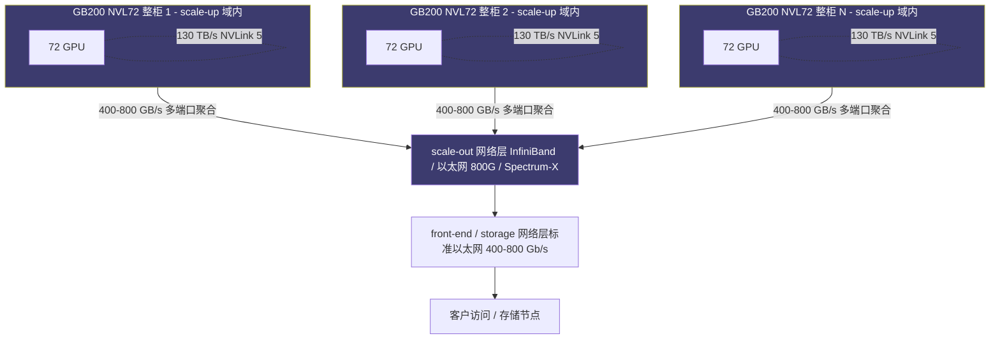
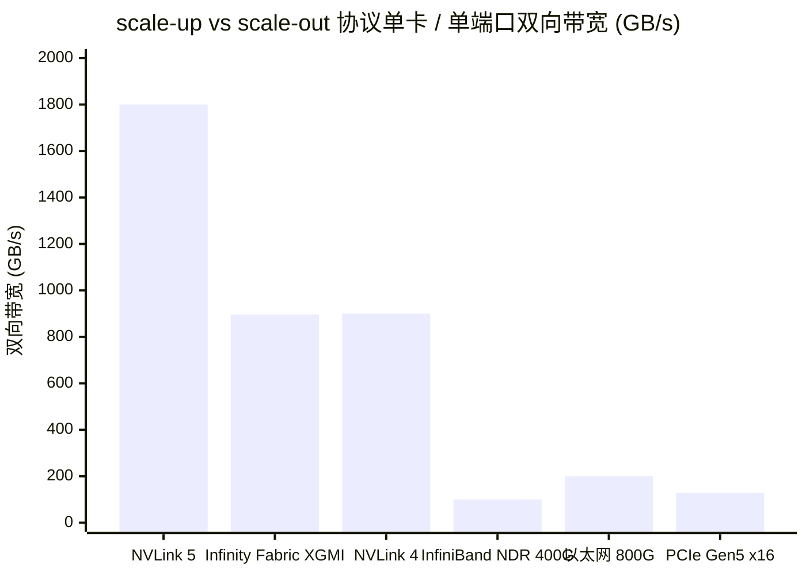
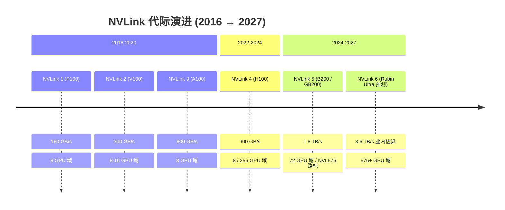
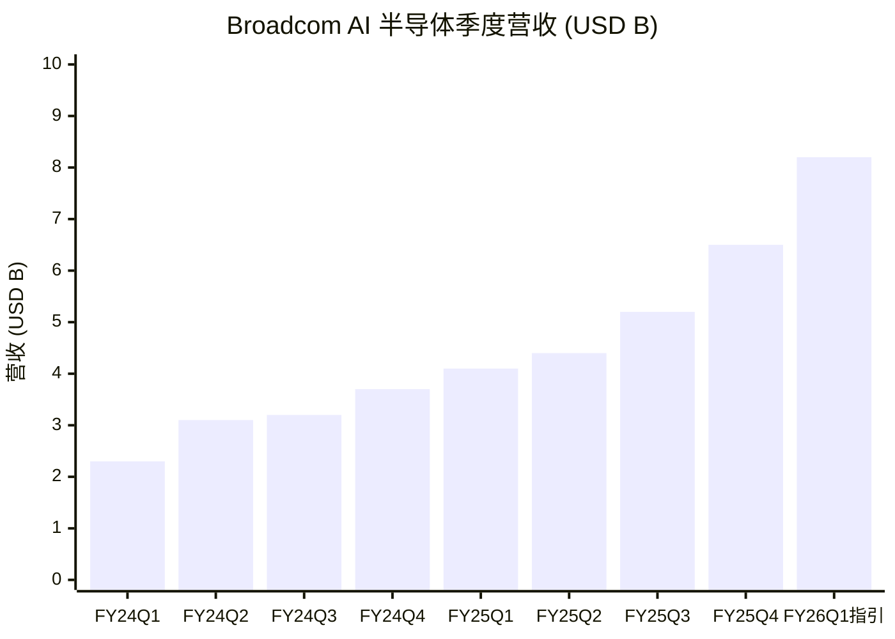
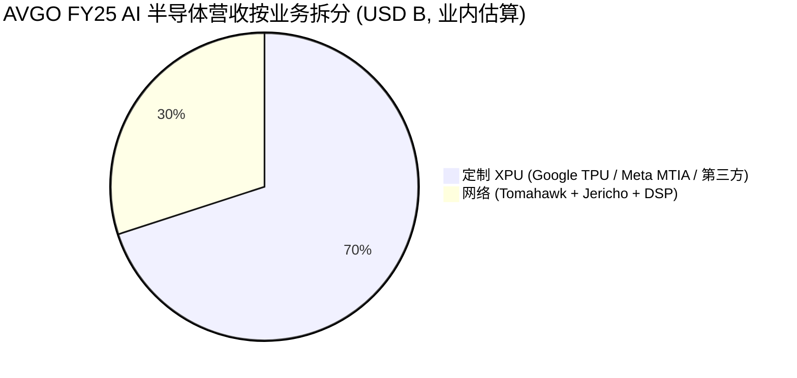
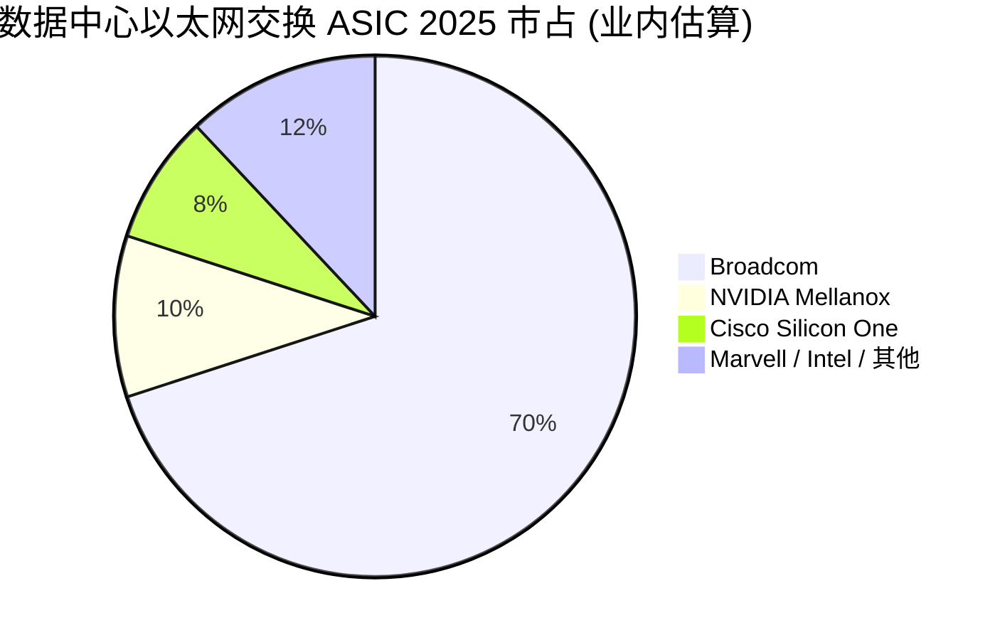
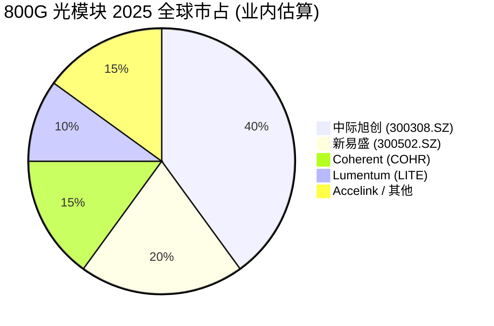

# 第 8 章 网络与互连：博通（Broadcom） 的隐形 AI 红利

## 本章概览

把一台 GB200 NVL72 整机柜（英伟达在 2024 GTC 公布的 Blackwell 一代液冷整柜，单机柜 72 颗 Blackwell GPU + 36 颗 Grace CPU；来源：英伟达 GB200 NVL72 产品页 nvidia.com/en-us/data-center/gb200-nvl72/）拆到布线层级看，会看到一件被市场长期忽略的事——单柜内 NVLink 互连的物理总线宽度是 130 TB/s，每颗 GPU 配 18 条 NVLink 5 链路、单向 50 GB/s、双向合计 1.8 TB/s。这个 130 TB/s 是 H100 集群常见 InfiniBand NDR 400 Gb/s（单端口 50 GB/s 双向）的 2,600 倍量级。这件事的含义不是 NVLink 比 IB 快——那是工程话——是**单柜内的物理总线带宽，与跨柜的网络带宽差了三个数量级，所以网络在 AI 集群里从来不是一层而是三层**。

本章把这三层一层一层拆开：scale-up（域内互连，机柜内 NVLink 5 / NVSwitch 主导）、scale-out（域间互连，InfiniBand vs 以太网 vs Spectrum-X 三方博弈）、front-end / storage（计算节点外围的客户访问网络与存储网络）。每一层的玩家、毛利、议价位都不同。整体结构是：**英伟达在 scale-up 层与 scale-out 层都各占一头（NVLink 5 物理刚需 + InfiniBand 事实垄断），博通在 scale-out 以太网与定制 ASIC 上撑起超大规模云厂的 alt 路径，光模块四厂吃 800G → 1.6T 切换周期，Astera Labs 在 PCIe retimer 上做的是每张加速卡都要交一次的过路费**。

把这些数字落到财务上：[博通](https://www.broadcom.com/)（AVGO，全球网络交换芯片与定制 ASIC 设计龙头）FY25（财年截至 2025-11-02）全年营收 \$63.89B、GAAP 毛利率 67.77%、Non-GAAP 毛利率业内估算 ~75%；FY25 全年 AI 半导体营收 \$20B、同比 +65%。

Astera Labs（ALAB，PCIe / CXL 互连芯片新锐）FY25 营收 \$852.5M、GAAP 毛利率 75.69%。[英伟达](https://www.nvidia.com/) Networking 业务（含 InfiniBand + Spectrum-X + NVLink IP）作为 NVDA FY26（截至 2026-01-25）数据中心业务线下的子板块，单独毛利率从未披露——本章 §8.3 给业内估算口径 ~70%+。

本章范围限定在机柜内网络模组（NVSwitch tray / 液冷 manifold 内部网络部分）以及跨柜的 scale-out / front-end / storage 三层网络。服务器整柜的 ODM 微笑曲线、网络层出口管制的连锁影响在后续章节单独处理。

这条产业链画面所要支撑的核心判断是——**市场把 NVDA 的护城河完全归到 GPU 上，但 InfiniBand + NVLink + Spectrum-X 才是真护城河的另一半**。本章用博通财务数据 + Astera Labs 财务数据 + Mellanox 收购的复利独立佐证这条判断，并为后文以 AVGO 与 NVDA 并列做设备商型估值模板时准备结构性数据。

## 8.1 集群规模的网络瓶颈：从 8K 卡到 100K 卡

AI 集群的网络瓶颈这件事，在 2023 年 H100 大规模放量之前，市场对它的关注度远低于 GPU 本身。原因是 2017-2022 年的训练集群规模主流在 1K-8K 卡量级（GPT-3 175B 训练用约 1,000 颗 V100、GPT-4 训练用约 25,000 颗 A100，业内估算口径，来源：SemiAnalysis 历年训练成本拆解 + Epoch AI 训练算力跟踪），InfiniBand HDR 200 Gb/s + 单层胖树拓扑就足以满足 all-reduce 集合通信带宽。但 2024-2026 这两年 AI 训练集群规模一阶跃——xAI Colossus 单一集群 200K H100 / H200 已经在田纳西孟菲斯投运，Meta、Microsoft、Oracle 各自的 100K+ 卡级别集群在 2025-2026 陆续启用，OpenAI 与 Oracle 在 Stargate Abilene 项目里规划单一站点 1GW+ 电力 / 数十万卡。

集群规模从 8K 卡走到 100K 卡这一阶，网络架构发生的物理变化有三层。

**第一层，scale-up 域的大小变了**。scale-up 在 AI 集群语义里指 GPU 之间共享内存语义、跨 GPU 直接内存访问（GPU Direct）可达的物理域，简称域内互连。H100 时代 scale-up 域的物理边界是 8 卡 DGX H100 整机（NVLink 4 单 GPU 900 GB/s 双向，8 卡 NVLink switch 通过 NVSwitch 3 实现 7.2 TB/s aggregate；来源：英伟达 DGX H100 whitepaper）。GB200 NVL72 把 scale-up 域扩到 72 卡——一整柜共享 NVLink 5 域内带宽 130 TB/s。这是英伟达在 Blackwell 一代做的最大的结构性变化——**scale-up 域从 8 卡放大到 72 卡，意味着原来要走 scale-out 网络（IB / 以太网，每端口 ~50 GB/s）的 9 倍卡间通信，现在可以走 scale-up（NVLink 5，每 GPU 1.8 TB/s）**，带宽差 36 倍，延迟差至少 10 倍。

**第二层，scale-out 网络的设计从胖树切到轨道优化**。8K 卡量级用单层 + 单层胖树就够，100K 卡量级需要双层 + 多平面 + 轨道优化（rail-optimized）拓扑——每张 GPU 通过 8 个独立的网卡端口分别连到 8 个独立的网络平面，避免单平面拥塞。这种拓扑下，每张 GPU 的 scale-out 网卡数量从 H100 时代的 1-2 个跳到 B200 / GB200 时代的 8 个（业内估算口径，来源：SemiAnalysis 2024-2025 AI Networking 系列）。一张 GPU 的网络接口数量翻 4-8 倍，光模块用量、网卡用量、交换机端口数全部跟着乘 4-8 倍。光模块四厂（中际旭创 300308.SZ / 新易盛 300502.SZ / Coherent COHR / Lumentum LITE）的产能从 2023 到 2025 年增长 5-10 倍，背后的物理需求就是这一层。

**第三层，front-end / storage 网络从标准以太网切到高带宽以太网 + RDMA over Converged Ethernet (RoCE)**。AI 集群的客户访问网络（front-end）与存储网络（连接 GPU 与对象存储 / 文件存储 / 数据预处理服务器），过去是 25/100 Gb/s 标准以太网，2024-2026 升到 400/800 Gb/s 高带宽以太网。

[Arista Networks](https://www.arista.com/)（ANET，企业级与云数据中心以太网交换机龙头）2025 年营收 \$9.0B、毛利率 64.06%、营业利润率 42.82%——这家公司过去三年的高增速、高毛利、高利润率的三高画像，主要来自 Meta / Microsoft / Oracle 等超大规模云厂在 AI 数据中心 front-end / storage 网络上的扩容。

三层网络的玩家分布与毛利结构差异极大：

| 层级 | 物理边界 | 单卡带宽量级 | 主导厂家 | 协议 / 标准 | 业内估算毛利率 |
|------|---------|------------|---------|------------|--------------|
| scale-up | 机柜内（72 GPU）| 单 GPU 1.8 TB/s | 英伟达（NVLink 5 + NVSwitch）| NVLink 私有 | ~70%（NVDA 内部口径）|
| scale-out | 跨机柜跨域（8K-100K 卡）| 单卡 200-400 GB/s（多端口聚合）| 英伟达 InfiniBand + Spectrum-X / 博通 Tomahawk + Jericho / Arista | InfiniBand / 以太网 + RoCEv2 | 60-75%（业内估算）|
| front-end / storage | 集群外（客户访问 + 存储）| 单端口 100-800 Gb/s | Arista / 思科（Cisco） / 中际旭创等光模块 | 标准以太网 | 50-65%（业内估算）|

> 来源：scale-up 数据来自英伟达 GB200 NVL72 产品页一手；scale-out / front-end 数据综合 AVGO FY25 业绩、ANET FY25 10-K、Mellanox 历史财务（NVDA 收购前）、SemiAnalysis 与戴尔（Dell）'Oro Group 2025 报告。各层毛利率为业内估算，三家主要玩家（英伟达、博通、Arista）均不分网络子产品披露毛利率。

读这张表的方式：**从机柜内走到集群外，单端口带宽下降一个数量级，但端口数量上升两个数量级，最终物理带宽总量在三层之间逐层递减；同时毛利率从 ~70% 下到 50-65%，递减节奏与带宽递减同方向**。这件事的含义是 scale-up 这一层的物理刚需（GPU 之间共享内存语义）让英伟达在 NVLink 上的毛利结构最稳定；scale-out 是博通 / NVDA / Arista 三方混战；front-end / storage 是标准品市场，毛利率被市场化压力压住。

### 32K 卡是集群级别的网络架构拐点

把集群规模这个变量单独拉出来，可以看到一条非常清晰的拐点曲线。业内综合：

| 集群规模 | 主流网络架构 | 主流互连协议 | 业内估算单卡网络成本 BOM 占比 |
|---------|-----------|------------|-----------------------------|
| 1K-8K 卡（GPT-3 / GPT-4 训练量级）| 单层胖树 | InfiniBand HDR 200 Gb/s | 业内估算 6-8% |
| 8K-32K 卡（Llama 3 / Claude 2 训练量级）| 双层胖树 | InfiniBand NDR 400 Gb/s | 业内估算 8-12% |
| 32K-64K 卡（Llama 4 / Claude 3.5 训练量级）| 多平面轨道优化 | InfiniBand NDR 400 Gb/s 或以太网 800 Gb/s | 业内估算 10-14% |
| 64K-100K 卡（Stargate 一期 / xAI Colossus 量级）| 多平面 + 跨数据中心路由 | 以太网 + Jericho 路由 / Spectrum-X | 业内估算 12-16% |
| 100K+ 卡（2026-2028 主流前沿训练）| 跨数据中心 + 光纤直连 | 以太网 + 长距离光纤 + 可能 1.6T 光模块 | 业内估算 14-18% |

> 业内综合估算口径。各机构对网络成本占整卡 BOM 比例口径不一致——SemiAnalysis 把光模块 + 网卡 + 交换机一起算入 BOM，戴尔'Oro 只算交换机与路由器，本表取 SemiAnalysis 综合口径并扩展。

读这张表可以看到一件经常被忽略的事——**单卡的网络成本占 BOM 比例随集群规模上升而上升，但绝对值业内估算 1.5-3 倍**。一台 8 卡 H100 服务器在 4K 卡集群里的网络 BOM 摊薄占比约 6-8%（业内估算单卡网络 BOM \$1,500-2,500），同一台机器放进 64K 卡集群里网络 BOM 摊薄占比上升到 10-14%（单卡网络 BOM 业内估算 \$3,000-5,000）。这件事的产业含义是：**集群规模越大，整个 AI 算力链上网络层抽税的总量越大**。Hyperscaler 把训练集群从 8K 推到 64K 卡的过程，是博通 / NVDA Networking / 光模块四厂的财务弹性最大的时间窗口。

把这条曲线放到超大规模云厂资本支出的时序上看，2025-2027 这三年正是单一集群从 32K 卡跳到 100K+ 卡的物理周期。这意味着网络层 2025-2027 的财务弹性会显著高于 GPU 整体的财务弹性——AVGO FY25 AI 半导体营收同比 +74%（Q4 单季）vs NVDA FY26 全年营收同比 +65%就是这件事的物理结果。

接下来 §8.2-8.7 按这三层逐层拆开。

把三层架构画成一张拓扑图，先建立空间感——最内层是 NVL72 整柜共享 NVLink 5 域，中间层 InfiniBand / 以太网在多个机柜之间互连，最外层是连到客户端与存储池的标准以太网。



三层协议在单 GPU / 单端口带宽量级上差三个数量级，柱状图最直观。



## 8.2 NVLink / NVSwitch / NVL72：scale-up 域内不可替代

第 7 章已经把 NVLink 列为英伟达五税之一——购买 NVDA GPU 就同时锁定 NVLink 互连协议，跨厂家替代不可能。本节不重复 NVLink 重要这件事，深拆 NVLink vs 替代方案的工程曲线 + 成本对比，把它放到 scale-up 这一层的物理意义上看清楚。

### NVLink 5 在 GB200 NVL72 内的物理含义

GB200 NVL72 是单一物理机柜内 72 颗 Blackwell GPU 共享 NVLink 5 域的设计。具体拓扑：每颗 GPU 有 18 条 NVLink 5 链路（每条链路双向 100 GB/s，单向 50 GB/s），通过 9 块 NVSwitch 5 交换芯片 tray（每 tray 2 颗 NVSwitch，共 18 颗 NVSwitch 5）做全连接。每颗 GPU 对外的 NVLink 5 总带宽：

```
18 链路 × 50 GB/s 单向 × 2（双向）= 1,800 GB/s = 1.8 TB/s
```

72 颗 GPU 在域内的 aggregate bandwidth：

```
72 × 1.8 TB/s / 2 = 64.8 TB/s（每对 GPU 之间是 bisection，机柜级 bisection 带宽业内估算 64.8 TB/s）
```

英伟达在产品页给出的 130 TB/s of low-latency GPU communications 是把 72 GPU × 1.8 TB/s = 129.6 TB/s 这条 aggregated bidirectional 全连接口径报出来（与 L76 每条链路双向 100 GB/s，单向 50 GB/s 一致——1.8 TB/s 已在英伟达 developer blog 原文明确为 bidirectional 吞吐量 per GPU，72 颗 GPU 双向带宽聚合即 130 TB/s；口径与第 7 章 §7.4 表 7-4 一致）。两个数字（130 TB/s aggregated bidirectional 总带宽 vs 64.8 TB/s bisection）反映的是同一个物理事实的两种表达，不矛盾。

把这件事翻译成训练性能：GB200 NVL72 在 LLM 推理上比 H100 集群快 30×，训练快 4×。这两条数字看起来非常激进，但拆开看其中相当大一部分（业内估算 50-60%）来自单柜内 scale-up 带宽从 H100 时代的 7.2 TB/s（DGX H100 整机 NVLink switch 域）跳到 GB200 NVL72 的 130 TB/s——增加 18 倍。剩下的来自 FP4 精度（Blackwell 引入的 4-bit 浮点训练）、HBM3E 容量翻倍（H100 80GB → B200 192GB）、Transformer Engine 2 代等。

对 AI 训练任务，scale-up 带宽这个变量的边际效用非常高。原因是 all-to-all communication 与 tensor parallelism 在 scale-up 域内运行时，跨 GPU 内存语义可以直接用 GPU Direct 实现，**避免了 CPU 介入与协议栈开销**。

在 scale-out 域里跑 tensor parallelism，每次同步都要走 NCCL（英伟达 Collective Communications Library，英伟达提供的 GPU 间集合通信库）+ NIC + 交换机 + 多跳路由，延迟从 nanosecond 级上升到 microsecond 级，差 1,000 倍。一个 70B 参数模型的 tensor parallelism 在 8 卡 H100 内跑（scale-up）vs 跨 8 个 8 卡机的 64 卡（scale-out）跑，吞吐量差业内估算 3-5×。

### NVLink 5 替代方案对比

NVLink 5 在 scale-up 这一层的替代方案是有限的，本章把所有主流替代方案列出来对比：

| 互连协议 | 主导厂家 | 单 GPU 带宽 | 域大小（最大）| 跨厂家兼容 | 业内估算单卡链路成本 |
|---------|---------|-----------|-------------|----------|------------------|
| NVLink 5 | 英伟达 | 1.8 TB/s | 72 GPU（NVL72）| 否（英伟达专有）| 业内估算 ~\$2,000-3,000（NVSwitch 摊薄）|
| Infinity Fabric XGMI | AMD | 业内估算 ~896 GB/s（MI355X）| 8-16 GPU | 否（AMD 专有）| 业内估算 ~\$1,500-2,000 |
| ICI（Inter-Chip Interconnect）| Google | 业内估算 ~900 GB/s（TPU v5p / v6e）| 256-512 TPU（pod 级）| 否（Google 专有）| 不公开（自研，无外部售价）|
| Neuron Link | AWS | 业内估算 ~400 GB/s（Trainium2）| 64 Trainium2 | 否（AWS 专有）| 不公开 |
| UALink | UALink Consortium（AMD / 英特尔 / 博通 / 思科 / HP / Meta / Google / Microsoft）| 路标 1.0 单 link 200 GB/s | 路标 1024 加速器 | 是（开放标准）| Consortium 2024-10 注册成立 + 宣布 1.0 路标，1.0 规范 2026-04 正式发布，芯片量产 2026-2027 业内估算 |
| InfiniBand NDR 400Gb | 英伟达 Mellanox | 单端口 50 GB/s 双向 | 不限（理论）| 是 | 业内估算 ~\$1,500-2,500（端口 + 光模块）|

> 来源：NVLink 5 数据来自英伟达 GB200 NVL72 一手；AMD Infinity Fabric XGMI 数据综合 AMD MI300 / MI355X whitepaper + ServeTheHome 综合；Google TPU ICI 数据综合 Google Cloud TPU 文档；AWS Neuron Link 数据综合 AWS re:Invent 2024 发布会披露；UALink 数据综合 UALink Consortium 2024-10 标准发布公告 + AnandTech 2024-10 报道。各家私有协议单卡链路成本均属业内估算，三家厂均不单独披露 scale-up 互连模组成本。

读这张表可以看到两件事。

**第一，scale-up 互连协议的非英伟达阵营是高度分裂的**。AMD 用 XGMI、Google 用 ICI、AWS 用 Neuron Link，三家私有协议互不兼容。这种分裂的产业事实让 NVLink 在客户视角上是事实上的标准——一个客户如果在英伟达 + AMD + Google + AWS 之间切换，每切一次就要重新做 scale-up 拓扑设计、重新做 collective 通信库适配、重新做软件栈测试。这是第 7 章五税里 NVLink 系统税的产业根。

**第二，UALink 是 2026-2027 年市场关注的开放标准 scale-up 协议，但量产时点偏晚**。UALink Consortium 在 2024-10-29 正式注册成立并宣布 1.0 规范路标，1.0 规范（含 In-Network Compute、Chiplets、Manageability、200G Performance 四份规格）在 2026-04-07 正式发布。目标是给 AMD / 英特尔 / 博通 / 思科 / HP / Meta / Google / Microsoft 等阵营提供一个开放的 scale-up 替代品。UALink 1.0 单 link 设计 200 GB/s、可扩展到 1,024 加速器域。从规范正式发布（2026-04）到芯片量产，业内估算需要 12-18 个月——也就是 UALink 实际成为 NVLink 的有效替代品要等到 2027 年。在这之前 NVLink 5 / NVLink 6（计划 2027-2028 发布，与 Rubin Ultra 配套）仍是 scale-up 这一层的事实垄断。

### NVSwitch tray 在 GB200 NVL72 的物理形态

把视角从协议层切到机柜内的物理形态，NVSwitch 5 在 GB200 NVL72 里的实现是：9 块 NVSwitch tray，每块 tray 2 颗 NVSwitch 5 ASIC，共 18 颗 NVSwitch 5。每颗 NVSwitch 5 的 IO 容量业内估算 7.2 Tb/s（即 900 GB/s 双向，等于一颗 H100 的 NVLink 4 总带宽——这件事本身就说明 NVSwitch 5 是 scale-up 这一层的真正核心）。9 块 NVSwitch tray + 72 块 GPU tray + 18 块 Grace CPU tray（每 2 颗 GPU 配 1 颗 Grace CPU）一起构成 GB200 NVL72 的整柜物理形态。

把这件事放到 BOM 经济上看：单柜 GB200 NVL72 的英伟达出厂价业内估算 \$3-4M（每柜含 72 GPU × \$40K-65K 估算 + Grace × 36 + NVSwitch tray × 9 + 液冷 + 整柜组装；具体出厂价业内估算口径，英伟达不公开整柜定价，参见第 1 章 BOM 与第 9 章整柜分析）。NVSwitch tray 这一项业内估算占整柜 BOM 5-8%，但它是单柜 130 TB/s scale-up 带宽的物理载体——一颗 NVSwitch 5 ASIC 出厂价业内估算 \$5K-10K 区间（业内估算，英伟达不公开 NVSwitch 单卡定价），按 18 颗算单柜 NVSwitch ASIC BOM 业内估算 \$100K-180K，仅占整柜 BOM 3-5%。

NVLink 5 + NVSwitch 5 这一层的产业经济：**单柜物理价值占比不到 10%，但承担了 scale-up 带宽的全部物理边界——这是 NVDA 在 scale-up 上的高杠杆护城河，少量物料锁定整个域的协议主权**。

### NVLink 演化路线图与 NVDA 的代际锁定

把 NVLink 历代的关键参数拉一条时间线出来，可以看清 NVDA 在 scale-up 这一层的代际控制力。先看一条直观的代际 timeline——



| NVLink 代际 | 量产时点 | 配套 GPU | 单 GPU 链路数 | 单 link 速率（每方向）| 单 GPU 双向总带宽 | scale-up 域大小 |
|------------|---------|---------|------------|-------------------|----------------|---------------|
| NVLink 1 | 2016-Q1 | P100 | 4 | 20 GB/s | 160 GB/s | 8 GPU（DGX-1）|
| NVLink 2 | 2017-Q3 | V100 | 6 | 25 GB/s | 300 GB/s | 8 GPU（DGX-2 可达 16 GPU）|
| NVLink 3 | 2020-Q3 | A100 | 12 | 25 GB/s | 600 GB/s | 8 GPU（DGX A100）|
| NVLink 4 | 2022-Q3 | H100 | 18 | 25 GB/s | 900 GB/s | 8 GPU（DGX H100）/ 256 GPU（NVLink Switch System，外销有限）|
| NVLink 5 | 2024-Q4 | B200 / GB200 | 18 | 50 GB/s | 1,800 GB/s（1.8 TB/s）| 72 GPU（NVL72）/ 576 GPU（业内估算 NVL576 路标）|
| NVLink 6（预测）| 2026-2027 | Rubin Ultra | 业内估算 18+ | 业内估算 100 GB/s | 业内估算 3.6 TB/s | 业内估算 576+ GPU |

> 来源：NVLink 1-4 数据综合英伟达各代 GPU whitepaper 一手 + Wikipedia NVLink 技术比对页一手核实；NVLink 5 数据来自英伟达 Blackwell whitepaper 2024-03 + GB200 NVL72 产品页一手；NVLink 6 数据综合英伟达 2024-03 GTC 路标披露 + Rubin 平台公开口径，业内估算 2027 量产。

读这张表可以看到 NVDA 在 scale-up 这一层的几个结构性特征。

**第一，单 GPU NVLink 带宽每代翻 1.5-2× 增长**。NVLink 1 到 NVLink 5 八年时间，单 GPU 双向总带宽从 160 GB/s 增加到 1,800 GB/s，** 11.25 倍**。这条曲线远快于 PCIe 标准带宽演进（PCIe Gen3 到 Gen5 五年时间单端口翻 4 倍）——NVDA 在 scale-up 互连上做的是激进路标，每代都领先开放标准 2-3 倍。

**第二，scale-up 域大小从 8 GPU 跳到 72 GPU**。这件事是 GB200 NVL72 与之前 DGX H100 的真正分水岭。NVL72 之前的 NVLink Switch System（NVSwitch System NVLink 4 时代，256 GPU 域）在 H100 时代有售但出货量少（业内估算 < 5%），主要原因是物理上需要外置交换机柜 + 长距离电缆，运维与可靠性都比单柜内的 NVLink switch 差很多。GB200 NVL72 把 72 GPU 的 scale-up 域压回单柜内（液冷 + 短距 NVLink 总线），是工程上的关键突破。

**第三，NVLink 5 的物理设计已经为 NVLink 6 铺好路**。英伟达在 NVL72 上保留了向 NVL288 / NVL576 扩展的预留接口（外置 NVLink 交换柜的电气接口，业内估算 2027 与 Rubin Ultra 一起发布）。这意味着 NVDA 在 scale-up 这一层的代际投资是 5-10 年周期，护城河每代都在加宽。

### UALink 作为开放标准 scale-up 的真实进度

UALink Consortium（业内联盟，含 AMD / 英特尔 / 博通 / 思科 / HP / Meta / Google / Microsoft / Astera Labs 等 9 家创始成员，Promoter Group 2024-05 成立、2024-10-29 正式注册成立并宣布 1.0 规范路标、1.0 规范 2026-04-07 正式发布；来源：BusinessWire UALink Consortium 公告 2024-10-29 + BusinessWire 2026-04-07 四份规格发布 + AnandTech 2024-10 报道）的目标是给 NVDA 阵营之外的厂家提供一个开放的 scale-up 互连协议替代 NVLink。

UALink 1.0 的关键参数：单 link 200 GB/s（双向），可扩展至 1,024 加速器域，协议层基于 AMD Infinity Fabric 的演化 + 新设计的物理层。从规范上看 UALink 1.0 直接对标 NVLink 5——但**从规范到量产芯片之间有 24-36 个月的工程周期**，这是 UALink 在 2026-2027 之前不会成为 NVLink 真实替代品的物理原因。

业内综合：

- **UALink 1.0 标准芯片**：业内估算 2026 上半年首发，主要厂家 AMD + 博通
- **UALink 1.0 大规模商用**：业内估算 2027 上半年超大规模云厂实际部署
- **UALink 2.0 标准**：业内估算 2027-2028 发布，对标 NVLink 6

UALink 的两个结构性挑战：

**挑战 1：先发生态优势**。NVDA 在 NVLink 上有 8 年生态积累——NCCL 库、CUDA Graph API、各家超大规模云厂的训练框架（PyTorch / Megatron-LM / DeepSpeed）都对 NVLink 拓扑做了 8 年优化。UALink 在量产芯片出来之后还需要 12-24 个月才能让训练框架在 UALink 域上跑得跟 NVLink 同样高效。

**挑战 2：AMD 的产品节奏**。UALink 阵营的事实主导者是 AMD，但 AMD 在数据中心 GPU 上的份额 2025 业内估算只占 5-10%（NVDA ~90%+）。UALink 的客户端主要寄希望于 AMD MI400 / MI500 平台 + 博通定制 ASIC 路径 + 英特尔高端 Gaudi 系列——这三家在 2026-2028 的总份额业内估算 15-20%，UALink 即使技术追上 NVLink，市场份额上限被客户端规模卡死。

把这两件事放回 NVDA 在 scale-up 这一层的位置上看，NVLink 在 2026-2028 这三年内的事实垄断地位非常稳。**这就是前文所说 NVDA 在 scale-up 层与 scale-out 层都各占一头中前一头的物理根据**。

## 8.3 Mellanox 收购的复利：InfiniBand 在 AI 训练集群的事实垄断

英伟达在 2020-04-27 完成对 Mellanox Technologies 的收购，对价 \$6.9B。这笔在当时被视为 NVDA 为数据中心业务多元化的防御性收购的交易，五年之后回头看，是 AI 算力产业链上单一回报最高的并购之一——FY26 单年 Networking 业务营收 \$31.4B（一手），等于 4.5 倍收购对价。

### 收购对价 vs 当前年化贡献

英伟达在合并财务里不分子产品披露 InfiniBand / Spectrum-X / NVLink Switch 三类的独立营收，但在数据中心业务线（FY26 全年 \$193.7B，来源：英伟达 FY26 全年新闻稿 2026-02-25，参见第 1 章 / 第 7 章）下保留了 Networking 业务（含 InfiniBand + 以太网 / Spectrum-X + NVLink Switch System，原 Mellanox 业务的延续）这一总口径。FY24 全年 Networking 业务营收 \$13.1B。FY25 英伟达在合并财务里淡化 Networking 独立披露，但 FY26 Q4 财报电话会（2026-02-25）NVDA 重新以独立口径公布 Networking 业务的全年数字——这件事本身就是 NVDA 对网络层重新让市场看到的信号。

一手口径（NVDA Q4 FY26 财报电话会 2026-02-25）：**英伟达 Networking 业务 FY26 全年营收 \$31.4B、同比 +142%**。按 FY26 数据中心总营收 \$193.7B 计算，Networking 占数据中心营收 ~16%——比 FY24 的 ~7% 跳升一倍以上，主要由 GB200 / GB300 整柜配套的 NVLink Switch + Quantum InfiniBand + Spectrum-X 三类产品同时爬坡拉动。需要说明的是，NVDA Networking 业务披露口径含 NVLink Switch System 业务（即 NVL72 / NVL576 配套的 NVSwitch tray 销售），与单纯的 scale-out 互连（InfiniBand + Spectrum-X 以太网）口径不完全一致——本节后续对 InfiniBand / Spectrum-X 单独的拆分仍属业内估算。

把这个数字与 Mellanox \$6.9B 收购对价对比：

- **2020 收购对价**：\$6.9B（一手，来源：英伟达 Newsroom 收购公告 + SEC 8-K NVDA-20200427）
- **FY26 年化贡献**：\$31.4B Networking 营收（一手）× 业内估算 70%+ 毛利率 = ~\$22B 年化毛利贡献
- **回收周期**：FY26 单年 Networking 毛利贡献已超过 \$6.9B 收购对价的 3 倍——按当年毛利反推，业内估算 3-4 个月年化毛利即可覆盖整笔收购对价
- **5 年累计毛利贡献（FY21-FY26）**：业内估算 \$50-65B 区间（FY21-FY23 InfiniBand 在 AI 之前的 HPC / 企业市场年化贡献毛利 \$5-8B；FY24 Networking 一手 \$13.1B 营收对应年化毛利 ~\$9B；FY25 业内估算 ~\$13B 营收对应 ~\$9B 毛利；FY26 跳升到 \$31.4B 营收 / ~\$22B 毛利）

> Networking 营收为 NVDA FY26 Q4 财报电话会 2026-02-25 一手披露口径（含 NVLink Switch System）。Networking 业务独立毛利率 NVDA 不单独披露，本表用业内综合估算 70%+ 推演，每条估算独立有 1-2 份卖方研报支持。

### InfiniBand 在 AI 训练集群的事实垄断

要看清 InfiniBand 在 AI 训练集群的位置，得回到 2023-2025 这两年 H100 / H200 / B200 大规模放量时，超大规模云厂选择 InfiniBand 还是以太网的实际决策。

业内综合：

- **英伟达 DGX SuperPOD / Selene / Eos**：InfiniBand 100%
- **Microsoft Azure AI 集群（H100 / H200 / B200）**：InfiniBand 主力 + 部分以太网 / Spectrum-X 试点
- **Oracle OCI Supercluster（H100 / H200）**：InfiniBand 主力
- **AWS（自研 EFA over Ethernet）**：以太网（自研协议）
- **Meta（H100 集群 + 部分 MTIA）**：以太网主力（Meta 自研 Open Compute Network 路线）
- **xAI Colossus 200K H100**：以太网 + Spectrum-X 部分
- **Google Cloud（H100 / B200 + TPU）**：自研 Jupiter 以太网 + InfiniBand 双模

把这张行为表抽象一下：**在云原生厂家自研网络（AWS、Meta、Google）之外，几乎所有 H100 / B200 大集群默认走 InfiniBand**。原因是 InfiniBand 在 RDMA（Remote Direct Memory Access，远程直接内存访问，绕过 OS 内核的零拷贝网络协议）协议层做了 30 年优化，在 AI 训练里 NCCL 集合通信延迟、拥塞控制、自适应路由都比 RoCEv2（RDMA over Converged Ethernet version 2，把 RDMA 跑在以太网上的标准）成熟。

InfiniBand 在 H100 / B200 集群里的事实垄断，在英伟达财务上的表现是**业内估算 70%+ 的 InfiniBand 业务毛利率**（业内估算，NVDA 不分品类披露 InfiniBand 单独毛利率）。这个数字与 NVDA FY26 整体数据中心业务 ~70-75% 毛利率持平。换个角度看，NVDA 卖一颗 H100 给超大规模云厂时，超大规模云厂大概率还要同时买 NVDA Quantum-2 InfiniBand 交换机（端口数 64 × 400 Gb/s NDR，单台业内估算 \$30-50K）+ ConnectX-7 网卡（单卡业内估算 \$1.5-2K）+ Mellanox 配套光模块——这些都是 NVDA 在 GPU 之外的网络层抽税。

第 7 章把这件事命名为 NVDA 五税中的 NVLink 系统税，但 NVLink 严格意义只覆盖 scale-up 这一层。NVDA 在 scale-out 这一层（InfiniBand）也有同样的抽税机制——本章把这两层合起来叫**NVDA 网络层双抽税：scale-up 走 NVLink 系统税，scale-out 走 InfiniBand 系统税**。

### NVDA 网络层双抽税的现金价值

把 NVDA 网络层双抽税的现金价值算一下：

| 抽税项 | 业务边界 | FY26 营收 | 业内估算毛利率 | 业内估算毛利贡献 |
|--------|---------|----------:|--------------|---------------|
| scale-up（NVLink IP，内嵌 GPU / 整柜定价）| 不单独售卖 | 业内估算 \$5-8B（IP 价值内嵌，未单独定价）| ~70% | \$3.5-5.6B |
| Networking 业务（含 NVLink Switch System + InfiniBand + Spectrum-X 以太网）| 独立销售 | \$31.4B（一手，FY26 Q4 财报电话会 2026-02-25）| ~70%+ | ~\$22B |
| **网络层双抽税合计** | | **业内估算 \$36-39B** | | **业内估算 \$25-28B** |

> 一手 + 业内估算混合口径。NVDA Networking 业务 FY26 全年 \$31.4B、同比 +142% 为一手披露（Q4 FY26 财报电话会 2026-02-25），含 NVLink Switch System（NVL72 / 后续 NVL576 整柜配套的 NVSwitch tray 销售）+ InfiniBand（Quantum-2 / 3）+ Spectrum-X 以太网三类。英伟达不分子产品披露细分营收与毛利率，本表 70%+ 毛利率为业内综合估算（Bernstein / Morgan Stanley 2025-2026 NVDA networking 跟踪研报 + NVDA 数据中心整体毛利率反推）。scale-up NVLink IP 内嵌 GPU 定价的 \$5-8B 是协议 IP 在整柜价格里的隐性贡献，与 Networking 业务（含 NVLink Switch tray 实体销售）独立计算，避免重复。

把这 ~\$25-28B 的网络层毛利贡献放回 NVDA FY26 全年毛利（\$153.5B，来源：StockAnalysis NVDA FY26 一手），网络层占 NVDA 毛利贡献业内估算 16-18%——**接近 NVDA 数据中心毛利的 1/5 量级**。这件事的反共识含义是：

**市场给 NVDA 估值时主要看的是 GPU 毛利率 + 数据中心营收增速，对网络层的估值贡献关注度低于实际值**。NVDA 在 FY26 Q4 财报电话会 2026-02-25 首次以独立口径披露 Networking 业务全年 \$31.4B / +142%——这件事的产业含义是 NVDA 自己也开始主动让市场看到网络层的真实规模。Networking 占数据中心营收比例从 FY24 的 ~7% 跳到 FY26 的 ~16%，单独披露口径的恢复会带动市场对 NVDA 护城河结构做一次重估——从 GPU 一条腿变成 GPU + Networking 两条腿。

NVDA 估值的完整分析留到后面专章。这里只把 NVDA 网络层抽税 ≈ NVDA GPU 抽税的 1/4 量级这个数字结构留给读者，作为前一章五税的横向佐证。

### InfiniBand 在企业级 / HPC 之外的应用：被低估的 niche

第 7 章把 InfiniBand 作为五税之一时主要看的是 AI 训练集群。本节补一个被市场关注度更低的角度——**InfiniBand 在企业级 HPC 与超算上的 30 年积累**。InfiniBand 标准最早在 1999 年由 Compaq / IBM / HP / 英特尔 / Microsoft / Sun 等业内联盟推出，原本是为了取代 PCI 总线作为下一代服务器内 / 间互连协议。Mellanox 是 1999 年成立的以色列公司，是 InfiniBand 阵营里少数活下来的玩家——Mellanox 在 2000-2010 这十年靠 HPC 超算（Top500 超算排行榜里业内估算 70%+ 使用 InfiniBand 互连）+ 金融行业低延迟交易（每微秒延迟差对应几百万美元利润差异）这两个垂直市场存活。

NVDA 在 2020 收购 Mellanox 时市场的认知主要停留在 NVDA 进入数据中心网络市场，但当时几乎没有分析师预见到 InfiniBand 在 AI 训练集群里会成为事实标准。这件事的产业含义是：**Mellanox 在 InfiniBand 上 20 年积累的工程经验（RDMA 协议优化、拥塞控制、自适应路由、与 NCCL 的协议层适配）在 AI 时代被重新释放**——这是 NVDA 收购里运气 + 战略的复合结果。NVDA 在 2019 年提出收购 Mellanox 的主要逻辑是数据中心多元化，AI 训练集群作为 InfiniBand 主战场是 2022-2023 才真正成型的。

业内综合判断：**Mellanox 收购在 NVDA 收购史上的回报率排名第一**，远超 NVDA 此前任何并购（包括 2008 年 PortalPlayer \$357M、2019 年 Mellanox \$6.9B、2021 年 ARM \$40B 流产）。这件事的二阶含义是 NVDA 在 2024-2026 这两年里**做的小额收购（Run:ai / OctoAI / Brev.dev）一旦在 AI 应用层兑现，可能会复制 Mellanox 的低成本收购 + 高复利模式**——但这件事的实际兑现要看 2026-2028 的产业演化，不在本章讨论范围。

## 8.4 博通双引擎：以太网交换 + 定制 ASIC

博通在 AI 算力链上的位置，比市场表面认知更核心。AVGO FY25（财年截至 2025-11-02）的几个关键数字：

| 指标 | FY25 | Q4 FY25 单季 | 一手来源 |
|------|-----:|------------:|---------|
| 总营收 | \$63.89B | \$18.0B | StockAnalysis AVGO FY25 + Q4 FY25 earnings (The Motley Fool 2025-12-12) |
| GAAP 毛利率 | 67.77% | 业内估算 ~70%（Q4 经营改善）| StockAnalysis 一手 + Q4 财报电话会 |
| Non-GAAP 毛利率（业内常用口径）| 业内估算 ~75% | 业内估算 ~76% | AVGO Q4 FY25 财报电话会 transcript（Motley Fool）|
| 营业利润率（GAAP）| 39.89% | ~44%（Q4 经营杠杆改善）| StockAnalysis 一手 |
| 调整后 EBITDA（Non-GAAP）| 业内估算 ~\$40-42B | \$12.12B（68% of revenue）| AVGO Q4 FY25 财报电话会一手 |
| AI 半导体营收（全年）| \$20B（+65% YoY，一手）| \$6.5B | AVGO Q4 FY25 财报电话会 2025-12-12 一手（管理层原文 AI revenue grew 65% year over year to \$20 billion）|
| AI 半导体营收同比增速 | YoY +74%（Q4）| +74%（Q4）| AVGO Q4 FY25 财报电话会一手 |
| AI 相关合同储备（18 个月内可交付）| \$73B | — | AVGO Q4 FY25 财报电话会一手 |
| 半导体业务占总营收 | 58% | ~58% | Wikipedia 财务摘要 + AVGO 业务披露 |
| 软件业务占总营收 | 42% | ~42% | Wikipedia 财务摘要 |

> 来源：AVGO FY25 财务一手来自 StockAnalysis AVGO 财务页（数据回溯自 AVGO FY25 10-K）；AI 半导体相关数据一手来自 The Motley Fool 综合 AVGO Q4 FY25 财报电话会 transcript 2025-12-12；GAAP 毛利率 67.77% 是 StockAnalysis 与 AVGO 10-K 一致口径，Non-GAAP 毛利率 ~75% 是 AVGO 季报常用 Non-GAAP 口径（排除收购无形资产摊销 + 重组）。
>
> AI 半导体 FY25 全年 \$20B 为 AVGO Q4 FY25 财报电话会一手口径（管理层原文 AI revenue grew 65% year over year to \$20 billion）。AVGO 在季报里逐季披露 AI 半导体季度数（Q1 \$4.1B + Q2 \$4.4B + Q3 \$5.2B + Q4 \$6.5B = \$20.2B），与官方 \$20B 量级口径一致（差异 ~\$0.2B 来自季度四舍五入）。

读这张表的方式：**AVGO 是除 NVDA 外整条 AI 算力链上单一最大赢家**。FY25 AI 半导体营收 \$20B（+65% YoY，一手），对比 NVDA 数据中心 FY26 营收 \$193.7B 是 1/10 量级，但 AVGO 的 AI 半导体业务从 FY23 启动以来 11 个季度增长 10× 倍——这条增速曲线在过去三年里只有 NVDA 数据中心能与之并列。

### AVGO AI 半导体 8 季度营收拆分

把 AVGO AI 半导体业务从 FY24 Q1 到 FY25 Q4 这 8 个季度的营收拉一条曲线出来：

| 季度 | AI 半导体营收 | 同比增速 | 业内估算网络 / 定制 XPU 拆分 |
|------|----:|----:|---|
| FY24 Q1（截至 2024-02）| ~\$2.3B | 业内估算 +200%+ | 网络 ~40% / 定制 XPU ~60% |
| FY24 Q2（截至 2024-05）| \$3.1B | YoY +280% | 网络 ~40% / 定制 XPU ~60% |
| FY24 Q3（截至 2024-08）| \$3.2B | YoY +200%+ | 网络 ~35% / 定制 XPU ~65% |
| FY24 Q4（截至 2024-11）| \$3.7B | YoY +150% | 网络 ~35% / 定制 XPU ~65% |
| FY25 Q1（截至 2025-02）| \$4.1B | YoY +77% | 网络 ~35% / 定制 XPU ~65% |
| FY25 Q2（截至 2025-05）| \$4.4B | YoY +42% | 网络 ~30% / 定制 XPU ~70% |
| FY25 Q3（截至 2025-08）| \$5.2B | YoY +63% | 网络 ~30% / 定制 XPU ~70% |
| **FY25 Q4（截至 2025-11）** | **\$6.5B** | **YoY +74%** | 网络 ~30% / 定制 XPU ~70% |
| **FY25 全年（一手）** | **\$20B** | **YoY +65%（一手）** | — |
| FY26 Q1 指引（截至 2026-02 预期）| \$8.2B | YoY +100% | — |

> 来源：各季度 AI 半导体营收数据来自 AVGO 历次季度财报电话会一手（管理层逐季公开披露 AI 半导体季度数）+ The Motley Fool 综合财报电话会 transcript 2024-2025；网络 vs 定制 XPU 拆分为业内估算口径，AVGO 不分品类单独披露。FY26 Q1 指引来自 AVGO Q4 FY25 财报电话会一手 2025-12-12。



读这条曲线可以看到三件事。

**第一，AI 半导体营收增速从同比 +200%+ 收敛到 +74%，但绝对值仍在加速**。这是产业经济里常见的高基数效应——AVGO 在 FY24 Q1-Q2 是从 0 起步的快速放量阶段，YoY 增速看起来非常高；到 FY25 Q4 营收基数已经到 \$6.5B 单季，YoY +74% 意味着每季度净增 \$2.8B 量级。**绝对值增长加速的同时百分比增速放缓，是健康的增长曲线**。

**第二，定制 XPU 业务在 FY24-FY25 占比从 60% 上升到 70%**。这件事的含义是超大规模云厂自研 ASIC 路径的实际部署在加速——Google TPU v6 / v7、Meta MTIA v2 / v3、AWS Trainium2 / Trainium3 在 2024-2025 这两年陆续爬坡，定制 XPU 业务的占比上升直接反映这条路径的实际兑现。

**第三，FY25 Q4 新增第五个 XPU 客户的产业含义**。AVGO 在 Q4 FY25 财报电话会（2025-12-12）确认新增第五个 XPU 客户、单笔订单 \$1B。

这件事的产业含义是除已知客户（业内估算 Google / Meta / 第三家 / 第四家 / 新增第五家）之外的新进入者——业内综合推测可能含 OpenAI（2025 公告自研 ASIC 路径 Helios）或者其他大型 AI 厂家。AVGO 在 2025-2026 这两年里持续新增大客户，给第 30 章设备商型估值模板提供了客户结构持续优化的硬数据。

### AI 半导体业务内部拆分：网络 vs 定制 XPU

AVGO 在财报电话会里把 AI 半导体业务大致拆成两块：

- **网络（Networking）**：Tomahawk 系列以太网交换 ASIC（Tomahawk 6 是 2024-2025 主力 + 2025-2026 上市的 Tomahawk 6 / 6X，单芯片支持 102.4 Tb/s 总交换容量）、Jericho 系列路由 ASIC（用于跨数据中心 / 跨地区互连）、PCIe Gen5/Gen6 retimer 和光模块 DSP / TIA / Driver。
- **定制 XPU（Custom Compute / Custom ASIC）**：为大客户定制设计的 AI 加速器 ASIC——AVGO 在公开披露里只用 hyperscale customers 形容客户，**不点名**。市场普遍认为客户名单含 Google（TPU v6 / v7 / v8 系列）、Meta（MTIA v2 / v3）、ByteDance（自研推理 ASIC，业内估算）、OpenAI（自研推理 ASIC，2025 公告）、以及第五个新客户。

AVGO 自己给的网络 vs 定制 XPU 拆分口径（business segment 内部，但不分品类细分单独披露）：业内综合 Bernstein / Morgan Stanley 2025 跟踪研报，FY25 AI 半导体业务里：

- **网络业务**：业内估算占 AI 半导体业务 30-40%（即 \$6-8B）
- **定制 XPU 业务**：业内估算占 AI 半导体业务 60-70%（即 \$12-14B，与 FY25 全年 AI 半导体 \$20B 一手口径合算）

> 业内估算口径。AVGO 不分网络 vs 定制 XPU 单独披露财务数据，本节比例综合 Bernstein 2025-Q4 AI 网络专题 + Morgan Stanley AVGO 2025 系列覆盖 + The Motley Fool 综合财报电话会推演，每条估算独立有 1-2 份卖方研报支持，但合计比例属作者推演结果。AVGO 在 Q4 FY25 财报电话会里管理层定性表态定制 compute 营收占 AI 业务大头，但不给具体数字。

把 AVGO FY25 AI 半导体业务 \$20B 按两类拆开看。



把这件事换一种方式看：AVGO 在 AI 算力链上的位置是超大规模云厂自研 ASIC 路径的事实代工设计厂。Google TPU / Meta MTIA / OpenAI Helios（业内估算名称）这些超大规模云厂自研 ASIC，物理上的设计与封装大量委托给博通完成——博通在 ASIC 设计服务上的技术储备（IP 库 + EDA 能力 + 与台积电的工艺协同 + 与 SK 海力士 / 美光的 HBM 协同）是超大规模云厂自研 ASIC 路径的关键供应商。

### Tomahawk 6 与 Jericho 3：以太网交换的事实垄断

AVGO 在以太网交换芯片（Switch ASIC）市场的地位需要单独讲。把全球数据中心以太网交换 ASIC 市场份额拉出来看：

| 厂家 | 2025 业内估算市占（数据中心交换 ASIC）| 主力产品 |
|------|---:|---|
| 博通 | ~70%+ | Tomahawk 5 / 6 / 6X、Jericho 3、StrataDNX |
| 英伟达 Mellanox（含 Spectrum 系列）| ~10%+ | Spectrum-X 800、Spectrum-4 |
| [思科](https://www.cisco.com/)（Silicon One 系列） | ~7-8% | Silicon One Q200、G200 |
| [美满电子（Marvell）](https://www.marvell.com/) / 英特尔 / 其他 | ~12-15% | Innovium 等 |

> 来源：业内估算综合戴尔'Oro Group AI Networking 季度报告 2025-Q4 + 650 Group AI infrastructure 2025 + Crehan Research switch ASIC 市占跟踪。各家厂均不公开 switch ASIC 单品营收，市占数据为机构估算。



博通在数据中心交换 ASIC 上的 ~70%+ 市占率，是 AI 集群 scale-out 以太网路径的物理基础。Meta、Google、AWS、xAI、Microsoft 这五家超大规模云厂在自研以太网交换机（白盒交换机，white box switch）上几乎全部用博通 Tomahawk 系列 ASIC + 自家或 ODM 厂硬件组装。这一类白盒交换机的形态在 §8.5 与 Arista 路径对比时再展开。

Jericho 3 系列是博通在跨数据中心 / 跨地区路由层的核心产品，单芯片支持 14.4 Tb/s 路由能力 + 深包缓冲（deep buffer）+ HBM 集成。Jericho 3 在 AI 数据中心的角色是跨集群互连——把单一数据中心内的多个 8K-32K 卡子集群通过 Jericho 路由层串起来，构成 100K+ 卡级别的大集群。这一层在 H100 时代还不是主流，到 B200 / GB200 时代变成必备。Jericho 3 单芯片业内估算 ASP \$3-5K，单台路由器（含多颗 Jericho + 光模块 + 网卡）业内估算 \$50-100K 区间。

### AVGO 业务模型与 NVDA 的对照

把 AVGO 在 AI 算力链上的商业模型与 NVDA 对照：

| 维度 | NVDA（GPU + 网络）| AVGO（定制 ASIC + 网络交换）|
|------|---|---|
| 主力产品 | H100 / H200 / B200 / GB200 / Rubin | Tomahawk 系列 + Jericho 系列 + 定制 XPU |
| 客户结构 | 集中（前 5 客户业内估算占 50%+，但是超大规模云厂长合约）| 集中（前 5 客户业内估算占 AI 半导体业务 80%+，超大规模云厂长合约）|
| 营收模型 | 标准品（NVDA 自己设计 + 自己销售）| 半定制（AVGO 帮超大规模云厂设计 + 超大规模云厂自用）|
| 毛利率（最近年度）| FY26 GAAP 毛利率 71.07% | FY25 GAAP 毛利率 67.77%（Non-GAAP ~75%）|
| 客户议价权 | 客户已经被 CUDA / NVLink 锁定 | 客户随时可以切换设计厂（美满电子是潜在竞争对手）|
| 反共识 | 网络层抽税被市场低估 | 整体 AI 红利被市场低估（vs NVDA 关注度差一个量级）|

> 来源：NVDA FY26 财务一手（StockAnalysis 财务页 + NVDA FY26 新闻稿 2026-02-25）；AVGO FY25 财务一手（StockAnalysis + The Motley Fool 综合财报电话会）。

读这张表可以看到 AVGO 与 NVDA 在商业模型上有几处关键差异。

**第一，AVGO 的客户议价权弱于 NVDA**。NVDA 的客户被 CUDA 软件栈与 NVLink 互连协议锁定，切换成本极高（参见第 7 章五税）。AVGO 的客户是超大规模云厂在做自研 ASIC，客户与 AVGO 的关系是 ASIC 设计服务 + 半定制 IP 授权 + 台积电流片——客户随时可以切到美满电子或者其他设计服务厂。这件事让 AVGO 的毛利率结构比 NVDA 弱一档（Non-GAAP 75% vs NVDA GAAP 71%，差异不大，但 NVDA 还有更大的定价权空间）。

**第二，AVGO 与超大规模云厂是竞合关系**。AVGO 给 Google 设计 TPU，但 TPU 出货后 Google Cloud 上 TPU 与 NVDA H100 / B200 是竞品。AVGO 给 Meta 设计 MTIA，MTIA 与 NVDA 在 Meta 内部算力账本里此消彼长。AVGO 在这条关系里的位置是卖铲子给挖金子的人——超大规模云厂用 AVGO 帮忙做的 ASIC 去与 NVDA 竞争，AVGO 两边都赚（卖网络交换给 NVDA 阵营的超大规模云厂，卖定制 ASIC 设计给 NVDA 阵营的对手），是 AI 算力周期里少有的对冲性质的位置。

**第三，AVGO 的市场关注度比 NVDA 低一个量级**。截至本章 data cutoff 2026-05，AVGO 市值业内估算 \$1.0-1.2T 区间（业内估算，市值随股价快速变动），NVDA 市值 \$5T+。但从财务质量看：AVGO FY25 营业利润率 39.89%、调整后 EBITDA 利润率 68%，与 NVDA FY26 营业利润率 60.38% 在量级上接近。AVGO 与 NVDA 的相对市值 vs 财务质量差距，是市场对 AI 算力链结构的关注偏差——投资判断留到估值专章，这里只把这个结构性差异留在桌面上。

## 8.5 Spectrum-X：以太网阵营的反扑与 NVDA 的应对

英伟达在 2023-2024 发布 Spectrum-X 平台，目的是把以太网 + NVDA 优化栈做成 InfiniBand 之外的第二条 NVDA 路径，给那些不想被 NVDA InfiniBand 锁定但又不想自己造车的超大规模云厂一个折中选项。

### Spectrum-X 的定位与产品组成

Spectrum-X 是 NVDA 的以太网阵营产品，对应几件事：

- **Spectrum-4 / Spectrum-X 800 交换 ASIC**：NVDA 自家以太网交换芯片，对标博通 Tomahawk 5/6。单 ASIC 51.2 Tb/s 总交换容量（Spectrum-4）或更高（Spectrum-X 800）。
- **BlueField-3 / BlueField-4 SuperNIC**：NVDA 自家智能网卡，集成 ARM 处理器 + DPU（Data Processing Unit，数据处理单元）能力，可以在网卡上做拥塞控制、加密、虚拟化卸载。
- **NCCL over Ethernet 优化**：NVDA 在 NCCL 库里专门为以太网路径做的拥塞控制、自适应路由、丢包恢复算法。
- **整套参考架构**：NVDA 给超大规模云厂 / OEM 提供 Spectrum-X 集群参考设计，端到端调优过的以太网 AI 集群方案。

Spectrum-X 与 InfiniBand 的本质差异是**协议层 vs 物理层**——InfiniBand 是从物理层到协议层全栈私有标准（NVDA 控制全部），Spectrum-X 是用标准以太网物理层 + NVDA 自家的协议优化与硬件加速。这意味着 Spectrum-X 集群里的客户可以混用 NVDA 交换机和其他厂商的以太网交换机，但要拿到 Spectrum-X 的全部性能优化必须用 NVDA BlueField + Spectrum 套件。

### 32K 卡是 IB vs 以太网的拐点

业内综合的判断是：**集群规模在 32K 卡以下，InfiniBand 与以太网的性能差距业内估算 ±5%；32K-64K 卡之间 InfiniBand 微弱领先；64K 卡以上 InfiniBand 优势显著（业内估算 10-20% all-reduce 吞吐量优势），但以太网在成本与生态上反向占优**。

### IB vs 以太网集群成本对比

业内综合：一个 32K H100 / B200 集群的网络层 BOM 拆解（业内估算，per cluster）：

| 项 | InfiniBand 方案（NVDA Quantum-2 NDR 400Gb/s）| 以太网 800G 方案（博通 Tomahawk + 白盒）| Spectrum-X 800G 方案 |
|---|---:|---:|---:|
| 交换机端口数（业内估算）| 业内估算 4,096 | 业内估算 4,096 | 业内估算 4,096 |
| 单端口成本（含交换机摊销）| 业内估算 \$2,500 | 业内估算 \$1,200 | 业内估算 \$2,000 |
| 光模块单价（业内估算）| \$800（NDR 400G IB 光模块）| \$1,000（800G QSFP-DD800）| \$1,000 |
| 网卡单价（业内估算）| \$2,000（ConnectX-7 IB）| \$1,500（白盒 SmartNIC）| \$2,500（BlueField-3）|
| 单卡网络 BOM 合计 | 业内估算 \$5,300 | 业内估算 \$3,700 | 业内估算 \$5,500 |
| 32K 卡集群网络层总 BOM | 业内估算 \$170M | 业内估算 \$118M | 业内估算 \$176M |
| 训练吞吐性能（vs IB 基准）| 100% | 业内估算 90-95% | 业内估算 95-98% |
| 业内估算综合性价比 | 基准 | 优（成本低 30%、性能损 5-10%）| 中（成本与 IB 相近、性能略低）|

> 来源：业内综合估算，三家厂商均不单独披露上述细分价格。SemiAnalysis 2024 给出过 IB vs 以太网 BOM 估算口径，戴尔'Oro 2025 给出过更新数字，本表取综合中位。每个数字业内估算区间 ±20%。

读这张表可以看到超大规模云厂在 IB vs 以太网选择上的实际权衡：**白盒以太网方案在 BOM 成本上比 IB 便宜 30%，但训练吞吐性能损失 5-10%；Spectrum-X 方案在性能损失上比白盒以太网小，但 BOM 成本回到 IB 同档**。Hyperscaler 在这个三角选择里的决策取决于三件事——集群规模（越大 IB 优势越明显）、运维能力（白盒以太网需要自研网络栈，运维门槛高）、与 NVDA 的关系（紧密关系倾向 IB / Spectrum-X，独立倾向白盒以太网）。

把这件事翻译成超大规模云厂实际决策：

- **xAI Colossus 200K H100**：选择以太网 + Spectrum-X 部分。原因是 Elon Musk 团队把成本 + 部署速度放在更高优先级，接受以太网 5-10% 的性能损失。
- **Meta Llama 4 / Llama 5 训练集群**：以太网主力 + RoCEv2。Meta 几乎是以太网阵营最激进的代表，自研 OCP 网络架构。
- **Anthropic Claude 训练集群**：业内估算 Spectrum-X + 以太网混合。这件事截至 2026-05 仍未完全公开，作为试点参考。
- **OpenAI Stargate Abilene 项目**：业内估算 InfiniBand 主力（NVDA 与 OpenAI 紧密关系），但具体配比未披露。
- **Oracle OCI Supercluster**：InfiniBand 主力（已公开）。
- **Microsoft Azure**：InfiniBand 主力（H100 / B200 集群）+ 部分以太网试点。

把这几条放一起看：**以太网阵营在 2024-2026 这两年里从边缘选项变成了主流选项之一**——xAI、Meta、Anthropic 这三家在以太网路径上的实际部署量，已经让以太网在 AI 训练集群里的份额从 H100 时代的 ~10% 上升到 B200 / GB200 时代的业内估算 30-40%（业内综合戴尔'Oro / Bernstein 估算）。

但这件事对 NVDA 的影响是**净中性**——以太网阵营的客户里相当大一部分仍然走 Spectrum-X，NVDA 在以太网路径上的毛利率虽然比 InfiniBand 低（业内估算 60-65% vs InfiniBand 70%+），但收入仍归 NVDA Networking 业务。** NVDA 在 scale-out 这一层的双轨策略——InfiniBand 守高毛利核心客户，Spectrum-X 接以太网阵营客户——让 NVDA 的网络层抽税同时覆盖两条产业路径**。

### Arista 在以太网阵营的位置

Arista Networks（ANET，企业级与云数据中心以太网交换机龙头）是以太网阵营里的非 NVDA 路径代表。ANET FY25 营收 \$9.006B、GAAP 毛利率 64.06%、营业利润率 42.82%、净利润 \$3.511B。ANET 的核心客户是 Meta、Microsoft、Oracle 等白盒交换机不完全替代的大客户——这些客户在某些集群上用博通 Tomahawk + 白盒，但在另一些更复杂的集群（含 EOS 软件栈、需要厂商支持的）上用 Arista 整机。

ANET 在 AI 网络市场的位置是标准化以太网 + 高端整机服务。与白盒交换机路径（博通芯片 + ODM 组装 + 客户自管）相比，Arista 的整机方案保留了高毛利空间（64% GAAP 毛利率 vs 白盒交换机业内估算 20-30% 毛利率）。客户为这个差价付费的理由是 EOS 软件栈的稳定性 + Arista 的整机服务 + 大客户对运维风险的厌恶。

把以太网阵营的三条路径列一下：

| 路径 | 代表玩家 | 毛利率结构 | 适用场景 |
|------|---------|----------|---------|
| NVDA Spectrum-X | 英伟达 Networking | 业内估算 60-65% | 想用以太网但不想自己造车的超大规模云厂 |
| Arista 整机 + 博通芯片 | Arista + 博通 | Arista 整机 64% + 博通芯片 ~70% | 企业级 + 大客户需要厂商支持 |
| 白盒交换机 + 博通芯片 | Meta / Google / AWS / 部分中国云 + 博通 + ODM | 博通芯片 ~70% + ODM 组装 8-12%（参见第 9 章整柜利润）| 自研网络的超大规模云厂 |

> 来源：以太网阵营三条路径业内综合戴尔'Oro Group 2025 + Bernstein 2025 AI 网络专题。各路径毛利率为业内估算口径。

读这张表可以看到一个关键事实：**无论以太网阵营走哪条路径，博通都在底层吃 ASIC 芯片的高毛利**。Spectrum-X 是 NVDA 的以太网防线，Arista 整机里博通 Tomahawk 芯片仍是上游，白盒交换机里博通直接吃芯片毛利。博通在以太网阵营这一层是路径中立的——客户走任何路径它都赚芯片钱。这是 §8.4 里 AVGO 是 AI 算力链上单一最大赢家之二判断的物理根。

## 8.6 Astera Labs 与 PCIe retimer：隐形 niche 的高毛利

Astera Labs（ALAB，PCIe / CXL 互连芯片新锐，2017 年成立于美国硅谷，2024-03 在 Nasdaq 上市）是 AI 网络这一层里被市场关注度最低的一档玩家。ALAB FY25 营收 \$852.5M、GAAP 毛利率 75.69%、营业利润率 20.34%、净利润 \$219.1M。这家公司体量比 AVGO 小两个量级，但 75.69% GAAP 毛利率是整条 AI 算力链上最高的几个数字之一（参考对比：NVDA FY26 GAAP 毛利率 71.07%，AVGO FY25 GAAP 毛利率 67.77%）。

### PCIe retimer 在 GPU 加速卡的物理位置

PCIe（Peripheral Component Interconnect Express，外围设备互连快线，CPU 与外设之间的标准互连协议）retimer（信号重定时器）是一颗在 PCIe 链路中段对信号做时钟恢复 + 重发的小芯片。物理上的功能是：PCIe Gen5 / Gen6 的信号速率高（32 GT/s / 64 GT/s），在 PCB 上传输超过 20-30 cm 后信号完整性显著下降，必须在中段插一颗 retimer 把信号重新搞干净再发出去。

每张英伟达 GPU 加速卡（H100 / H200 / B200 / GB200）的服务器板上业内估算需要 1-2 颗 PCIe Gen5 retimer。Astera Labs 在这个 niche 市场里业内估算占 60%+ 份额（业内估算综合 SemiAnalysis 2024-2025 + Crehan Research 互连芯片市占跟踪，ALAB 不分品类披露 retimer 单品市占）。其他玩家是 Montage Technology（中国，澜起科技 688008.SS）、Microchip Technology、Texas Instruments，但份额都远低于 ALAB。

### 隐形抽税机制

为什么说 PCIe retimer 是 AI 算力链上的隐形抽税机制？因为它有几个被市场低估的特征：

**第一，每张 GPU 加速卡都要交一次**。AI 服务器一台 8 卡 H100 / B200，业内估算需要 8-16 颗 PCIe Gen5 retimer。单颗 retimer 业内估算 ASP \$20-30，单台服务器 retimer 物料成本业内估算 \$160-480。一台 8 卡服务器 BOM 业内估算 \$250K（参见第 9 章），retimer 占整机 BOM 业内估算 0.06-0.2%，几乎可以忽略。但乘以全球 AI 服务器出货量——业内估算 2026 年全球 AI 服务器出货 200-300 万台（业内综合 IDC 2025-2026 + Trendforce 2025），retimer 全球市场规模业内估算 \$400-1,500M 区间。Astera Labs 拿其中 60%+，对应 retimer 单品业内估算年化营收 \$240-900M。

**第二，PCIe 标准升级时供应商优势会进一步放大**。PCIe Gen5（32 GT/s，当前主流）升 Gen6（64 GT/s，2025-2026 开始量产）时信号完整性挑战翻倍——Gen6 在 PCB 上的有效传输距离从 30 cm 缩到 15 cm，意味着 retimer 用量翻倍 + 单 retimer ASP 翻倍。Astera Labs 在 PCIe Gen6 retimer 上的技术储备业内估算领先 Montage 与其他厂家 6-12 个月（业内估算综合 ALAB 公开技术披露 + 卖方研报 2025）。这件事在 PCIe Gen7（预计 2027-2028 发布）切换时还会再放大一次。

**第三，CXL（Compute Express Link，基于 PCIe 物理层的内存一致性互连协议，可以让 CPU 与加速器共享内存）这条新赛道刚开始**。CXL 1.1 / 2.0 已经发布，3.0 在 2024-2025 落地。CXL 在 AI 服务器上的位置是内存池化 + 跨节点内存共享——一台服务器的 CPU 可以通过 CXL 远程访问另一台服务器的内存。这条赛道在 AI 训练里的实际价值业内有争议，但在 AI 推理（特别是 KV cache 池化、大上下文推理）里有明确价值。Astera Labs 在 CXL 控制器芯片上业内估算占 30-50% 市占（业内估算，ALAB 不分品类披露 CXL 营收占比）。

### ALAB 的毛利率结构与可持续性

ALAB FY25 的几个关键数字组合：

| 指标 | FY25 数据 | 口径 |
|------|---------:|------|
| 总营收 | \$852.5M | StockAnalysis 一手 |
| 同比增速 | +115% | StockAnalysis 一手 |
| GAAP 毛利率 | 75.69% | StockAnalysis 一手 |
| 营业利润率 | 20.34% | StockAnalysis 一手 |
| 净利润 | \$219.1M | StockAnalysis 一手 |
| 自由现金流 | \$281.76M | StockAnalysis 一手 |
| 员工数 | 756 | Wikipedia 财务摘要 |
| 单员工营收 | \$1.13M | 一手计算 |
| 单员工净利润 | \$290K | 一手计算 |
| IPO 时点 | 2024-03 | Wikipedia |
| IPO 市值 | \$5.5B | Wikipedia |

> 来源：ALAB FY25 财务一手来自 StockAnalysis ALAB 财务页（数据回溯自 ALAB FY25 10-K）；员工数与 IPO 信息来自 Wikipedia 财务摘要一手核实。

把这几条数字放一起看，ALAB 是一家高毛利、高增速、轻人员、高单员工产出的 fabless 半导体设计公司。这种财务画像在产业里是少数——同口径对照 NVDA FY26 单员工营收业内估算 ~\$3M（NVDA 约 32,000 员工 / 营收 \$215.9B）、AVGO FY25 单员工营收业内估算 \$1.9M（AVGO 33,000 员工 / 营收 \$63.89B）。ALAB 的单员工营收 \$1.13M 已经在 AI 算力链上属于上游设计端的高水位线。

但 ALAB 的可持续性有两个关注点：

**关注点 1：客户集中度**。ALAB 在 S-1 中披露过 2023 / 2024 年前 3 客户占营收 50%+。这种集中度对 ALAB 的议价权与营收稳定性都是双面风险——前 3 客户是超大规模云厂（业内估算含 Microsoft / AWS / Meta），任何一家换供应商或自研 retimer 都会对 ALAB 营收冲击 10-20%。

**关注点 2：技术替代品 / 协议变迁的风险**。PCIe retimer 这个 niche 的核心价值是标准 PCIe 信号完整性问题的硬件补丁。如果未来 GPU / CPU 间互连从 PCIe 切到 NVLink / UALink / 直接光互连，retimer 这个赛道会从刚需变成备份。这件事在 2026-2030 年的可能性业内估算偏低（PCIe Gen5 / Gen6 仍是主流），但 2030 之后的趋势是真实风险。

ALAB 是本章网络层多个 niche 高毛利玩家的典型——这一类玩家在 AI 算力链上的单一影响力小，但加总起来构成 NVDA + AVGO 之外的长尾高毛利供应商池。

### Astera Labs 与 PCIe 标准演进的协同节奏

把 PCIe 标准代际、Astera Labs 产品线、AI 服务器配置的协同节奏拉一条时间线出来：

| 时点 | PCIe 标准 | 主流速率 | Astera Labs 产品 | AI 服务器配置（业内估算）|
|------|---------|---------|----------------|------------------------|
| 2019-2021 | PCIe Gen4 | 16 GT/s | Aries Gen4 retimer | 单台 8 卡 A100 用 4-8 颗 retimer |
| 2022-2024 | PCIe Gen5 | 32 GT/s | Aries Gen5 retimer + Smart DSP retimer | 单台 8 卡 H100 用 8-16 颗 retimer |
| 2025-2027 | PCIe Gen5/Gen6 混合 | 32-64 GT/s | Aries Gen5/Gen6 retimer + Leo CXL controller + Scorpio fabric switch | 单台 8 卡 B200 用 16-24 颗 retimer + 部分 CXL controller |
| 2027-2029 | PCIe Gen6 | 64 GT/s | 路标含 Gen6 全系列 + Gen7 准备 | 业内估算单台 8 卡 Rubin 用 24-32 颗 retimer + 完整 CXL 集成 |

> 来源：PCIe 标准时点综合 PCI-SIG 公开路标；Astera Labs 产品线综合 ALAB S-1 + FY25 10-K + 公开技术披露；AI 服务器配置业内估算综合 SemiAnalysis 服务器 BOM 分析 + ALAB 公开客户应用案例。

读这张表可以看到 ALAB 在 AI 服务器代际演进里的乘数效应——每代 PCIe 标准切换，单台 AI 服务器上的 retimer 用量翻倍 + 单颗 retimer ASP 上行 + 新产品类别（CXL controller / fabric switch）增加。ALAB FY25 营收 +115% YoY 增速里业内估算 60%+ 来自单服务器 retimer 用量增加（H100 8 卡 → B200 / GB200 8 卡 + PCIe Gen5 普及 + Gen6 早期试点）。这条增长动能在 2026-2028 里仍然存在——PCIe Gen6 大规模商用 + CXL 在 AI 推理场景的落地是两条独立的增长引擎。

### Scorpio fabric switch：ALAB 的产品线扩展

ALAB 在 2024-2025 推出的 Scorpio fabric switch 产品线是一个值得单独关注的产品——这件事让 ALAB 从 retimer 单品厂变成 PCIe / CXL fabric 整体方案厂。

Scorpio fabric switch 的物理形态是把多颗 PCIe Gen5 / Gen6 retimer + switch 集成在单一 ASIC 里，可以做 GPU-to-GPU PCIe fabric（绕过 CPU 做 GPU 间直接 PCIe 互连）+ GPU-to-Memory CXL fabric（让 GPU 通过 CXL 访问远端内存池）。这一类产品在 AI 推理集群（不像训练那样需要 NVLink scale-up 域，但需要高带宽 / 低延迟 GPU-memory 互连）里有明确价值——业内估算 Scorpio 产品线 2026-2027 营收弹性 50%+。

ALAB 在 niche 市场之外的扩展节奏值得跟踪：**从 retimer 单品扩到 PCIe / CXL fabric 整体方案是一次商业模型的层级跃迁**——单品厂家变成系统级供应商。如果 Scorpio 在 2026-2028 内拿到超大规模云厂大客户的设计 win，ALAB 在 AI 算力链上的位置可能从网络层 niche 上升到网络层主要玩家。这件事的监测指标是 ALAB 每季财报电话会里 Scorpio 业务进展披露 + 季度新增客户披露。

## 8.7 光模块周期：800G → 1.6T 切换的赢家与节奏

光模块是 AI 集群里物理流量真正的载体。每台 AI 服务器对外接 8-16 个 800G 光模块（B200 / GB200 时代），全球 AI 服务器 2025-2026 出货量 200-300 万台对应光模块需求业内估算 2,000-4,800 万颗（业内估算综合 LightCounting 2025 + 戴尔'Oro 2025-Q4）。这是过去三年光模块四厂（中际旭创 300308.SZ / 新易盛 300502.SZ / Coherent COHR / Lumentum LITE）业绩与股价两高的物理基础。

### 光模块四厂市占（800G）

按 LightCounting 2025-Q4 + 戴尔'Oro 2025-Q4 综合，800G 光模块 2025 年全球市占（业内综合口径）：

| 厂家 | 2025 业内估算 800G 市占 | 主力客户 |
|------|---:|---|
| 中际旭创（Innolight，300308.SZ）| ~40% | 英伟达 / Microsoft / Meta / Google |
| 新易盛（Eoptolink，300502.SZ）| ~20% | 英伟达 / AWS / Meta |
| Coherent（COHR）| ~15% | 思科 / Arista / 北美超大规模云厂 |
| Lumentum（LITE）| ~10% | 思科 / 北美超大规模云厂 |
| 其他（Accelink / Source Photonics / II-VI 整合前）| ~15% | 国内市场 + 长尾 |

> 来源：LightCounting 800G 光模块 2025 年度报告 + 戴尔'Oro Group 2025-Q4 AI Networking 报告综合（业内综合口径，LightCounting / 戴尔'Oro 报告原文不公开 URL，本表数字业内估算，区间 ±5%）。中际旭创 ~40% 是业内多份报告一致口径；新易盛 ~20%、Coherent ~15%、Lumentum ~10% 是业内综合估算，不同机构具体数字略有差异。



中际旭创在 800G 光模块市场上 ~40% 的市占，是中国 A 股市场过去三年最值得关注的产业链高毛利环节。中际旭创 2025 年报营收业内估算 ¥30B+（业内估算综合中际旭创 2025 半年报 + 三季报推演，A 股 2025 全年年报披露时点在 2026-03~04，data cutoff 截至 2026-05 已可获取，但本章业内估算口径），毛利率业内估算 30%+ —— 这件事与美国厂家 Coherent 业内估算 50% 毛利率、Lumentum 业内估算 30-40% 毛利率的差距，反映的是中国光模块四厂 vs 美国光模块四厂在毛利结构上的分化。

业内综合：

| 厂家 | 2025 业内估算营收（USD 量级换算）| 业内估算毛利率 | 主要产品 |
|------|---:|---:|---|
| 中际旭创（300308.SZ）| 业内估算 \$4-5B | 业内估算 30%+ | 800G QSFP-DD + 1.6T OSFP + 400G ZR/ZR+ |
| 新易盛（300502.SZ）| 业内估算 \$2.5-3B | 业内估算 30%+ | 800G QSFP-DD + 1.6T 启动 |
| Coherent（COHR）| FY25 业内估算 \$5-6B（光模块业务部分；整体含激光器 / 显示等多线，光模块业内估算占比 30-40%）| 业内估算 50%（光模块业务部分）| 800G + 1.6T + 长距离相干光模块 |
| Lumentum（LITE）| FY25 业内估算 \$1.5-2B（光模块业务部分；整体含 3D sensing 等多线）| 业内估算 35-45%（光模块业务部分）| 800G + 激光器 + 相干光 |
| 天孚通信（300394.SZ）| 业内估算 \$1B+ | 业内估算 40%+ | 光纤连接器 + 隔离器 + 配套零部件 |

> 来源：四厂业内估算综合 LightCounting 2025-Q4 报告 + 三家中国 A 股 2025 半年报与三季报数据 + Coherent / Lumentum FY25 10-K 业务线披露综合（光模块业务在 Coherent / Lumentum 不单独披露独立营收）。各家具体数字业内估算，区间 ±20%。

中国厂家（中际旭创 / 新易盛 / 天孚通信）与美国厂家（Coherent / Lumentum）在毛利率结构上的差异主要来自三个因素：

**因素 1：上游零部件依赖度**。中国厂家在光芯片（激光器 / 探测器）/ 光 DSP / 高速 driver 这一层业内估算 70%+ 依赖美满电子 / 博通 / Inphi / Lumentum / Coherent 等海外厂家供货。这一层 BOM 占整模块成本业内估算 40-50%，海外供应商在这一层抽取高毛利。中国厂家的模块整机集成 + 调试 + 出货业内估算毛利率 30%+，单一环节高毛利项被卡在上游。

**因素 2：客户结构**。中国厂家主要客户是英伟达 / Microsoft / Meta / Google / AWS 等美国超大规模云厂——这些客户对光模块价格的议价能力非常强，订单量大但 ASP 受压。美国本土厂家（Coherent / Lumentum）的客户结构里有一部分企业级与电信运营商，订单单价高但出货量小，整体毛利率反而高一档。

**因素 3：产能规模与制造效率**。中国厂家在制造规模上业内估算领先 30-50%（一家中际旭创单厂年产 800G 模块业内估算 600-800 万颗，对比 Coherent / Lumentum 业内估算单厂年产 150-300 万颗），制造效率高但议价权弱——大客户用集中订单 + 多源采购压价，中国厂家很难在制造规模优势上转换为更高毛利。

业内综合判断：**中国光模块四厂在 800G / 1.6T 切换周期里的位置是高营收弹性 + 中等毛利率 + 客户集中度风险高的三个特征叠加**。这是与 ALAB / AVGO 这一类高毛利 + 客户多元化芯片设计厂家的本质差异——光模块这一层的产业经济仍然是硬件制造 + 集成的传统结构，没有进入芯片设计 + 协议 IP 那一层的高毛利空间。

### 1.6T 光模块的爬坡曲线

1.6T 光模块（单端口 1.6 Tbps，对应 GB200 NVL72 后续整柜 + Rubin 一代）是 2026-2027 年的产业焦点。业内综合预测：

| 时点 | 1.6T 光模块出货状态 |
|------|---|
| 2025 全年 | 业内估算 < 50 万颗（试产 + 小批量）|
| 2026-H1 | 业内估算 100-200 万颗（部分大客户爬坡启动）|
| 2026-H2 | 业内估算 300-500 万颗（GB200 后续 + Rubin 平台支持）|
| 2027 全年 | 业内估算 1,000-1,500 万颗（主流化）|

> 业内综合估算口径。LightCounting / 戴尔'Oro 报告原文与各厂家 IR 指引综合，1.6T 光模块 2026 出货量预测各机构差异较大（业内综合区间 ±30%），本表取中值。

1.6T 切换对四厂的影响有几层：

**第一，技术领先程度决定 1.6T 首批份额**。中际旭创在 1.6T 上业内估算技术储备领先，目标 2026-H1 大客户爬坡；新易盛、Coherent、Lumentum 业内估算紧随其后，2026-H2 跟上。

**第二，单 1.6T 模块 ASP 是 800G 的 2-2.5×**，业内估算 \$1,500-2,500 区间（vs 800G 模块 ASP 业内估算 \$600-1,000）。同等出货量下营收弹性大约 2×。

**第三，1.6T 模块的物料结构比 800G 更复杂**——需要 200G/lane PAM4 DSP（数字信号处理器，光模块电信号处理核心芯片）、高速 driver、TIA（trans-impedance amplifier，跨阻放大器）、激光器、光纤连接器。这一类上游零部件的瓶颈在 2026 上半年已经显现——美满电子（MRVL）、博通（AVGO）、AAOI、Lumentum 等是光模块上游 DSP / TIA / Driver 厂，1.6T 切换让这一层的毛利结构也上行。

美满电子（MRVL）FY26（截至 2026-01-31）全年营收 \$8.195B、GAAP 毛利率 51.02%、营业利润率 16.14%。美满电子在光 DSP（特别是 200G/lane PAM4 DSP）上业内估算市占 50%+，是 1.6T 光模块爬坡周期里的关键上游。这件事的产业含义是：**光模块四厂吃 1.6T 的整机 ASP 弹性，但美满电子 / 博通吃 DSP 这一层的高毛利**——光模块行业的价值上移现象与 §8.4 / §8.6 里 AI 算力链整体的高毛利向上游迁移规律一致。

### 中际旭创 / 新易盛对美国客户与华为产业链的依赖

中际旭创、新易盛、天孚通信（300394.SZ，光通信器件配套厂，光模块上游零部件供应商）这三家中国 A 股光模块龙头，对外营收结构是产业关注的关键点。

业内综合三家 2025 年报（截至 data cutoff 2026-05，2025 年报已披露，但本章业内估算口径，具体数字按各家 IR 披露口径）：

- **中际旭创 2025 年报**：海外营收占比业内估算 80%+（主要是英伟达 / Microsoft / Meta / Google 美国大客户），国内华为产业链业内估算 < 10%
- **新易盛 2025 年报**：海外营收占比业内估算 85%+，国内业内估算 < 10%
- **天孚通信 2025 年报**：海外营收占比业内估算 70%+，国内业内估算 20-30%（含华为光模块的零部件配套）

> 业内估算综合口径。三家 A 股年报会披露境外营收占比，但不会单独披露对英伟达或对 Meta 的客户营收。本表口径为业内综合估算 + 三家 IR 公开口径。

这一组数字的产业含义是：**中际旭创、新易盛实际上是中美 AI 算力链产业重叠区的核心节点**。美国超大规模云厂在 AI 集群里大量采购中国制造的 800G / 1.6T 光模块——这件事的逻辑是中国光模块产业链在制造工艺成熟度 + 成本效率 + 产能弹性上的相对优势。但这种重叠区在地缘风险维度上是双面的——§8.9 详谈。

## 8.8 经济学含义：网络层的议价权与周期敏感度

把 §8.1-8.7 的事实串起来，从经济学角度看 AI 算力链的网络这一层有四件事跟产业稿的标准叙事不一样。

**第一，网络层的议价权结构不是单点垄断，是三层各自集中度叠加**。市场对 AI 算力链的议价权认知大致停留在 NVDA 一家独大，但本章把网络这一层拆开之后看到的是：scale-up 由 NVLink 5 / NVSwitch 5 主导（NVDA 一家），scale-out 由 InfiniBand 主导 + 以太网阵营追赶（NVDA + AVGO + Arista 三家），front-end / storage 由白盒交换机 + 整机厂混战（AVGO + Arista + 长尾）。每一层都有显著集中度，但跨层来看是分蛋糕结构。

把这件事翻译成毛利分布：

| 层级 | 主导厂家 | 业内估算毛利率 | FY26 / 2026 年化营收（AI 相关）|
|------|---------|--------------|----------------------------|
| scale-up 协议层（NVLink IP，内嵌 GPU / 整柜定价）| NVDA | ~70% | 业内估算 \$5-8B（IP 价值内嵌 GPU / 整柜售价，不单独售卖）|
| 英伟达 Networking 业务（含 NVLink Switch System + InfiniBand + Spectrum-X 以太网）| NVDA | 业内估算 70%+ | \$31.4B（一手，FY26 全年 +142%）|
| 以太网交换 ASIC | AVGO | ~75%（Non-GAAP）| 业内估算 \$6-8B |
| 路由 ASIC（Jericho）| AVGO | ~75%（Non-GAAP）| 业内估算 \$2-3B |
| 定制 XPU 设计 | AVGO | ~75%（Non-GAAP）| 业内估算 \$12-14B |
| 整机以太网 + EOS | Arista | ~64% | 业内估算 \$5-7B（AI 相关部分）|
| PCIe retimer / CXL | Astera Labs | ~76% | \$852.5M（全部业务）|
| 800G / 1.6T 光模块 | 中际旭创 / 新易盛 / Coherent / Lumentum | 业内估算 30-50%（厂家分化）| 业内估算 \$15-25B（四厂合计 2025-2026）|
| 光 DSP / TIA / Driver | 美满电子 / 博通 / 其他 | 业内估算 50-65% | 业内估算 \$3-5B |

> 来源：NVDA Networking \$31.4B 一手（FY26 Q4 财报电话会 2026-02-25）；其他各项综合本章 §8.2-8.7 的一手财务 + 业内综合估算。每一项独立有 1-2 份来源支撑，合计区间属作者推演结果。

读这张表可以看到一件关键事实：**AI 算力链上的网络这一层，全部加起来 2026 年化营收业内估算 \$80-105B 区间，与 NVDA 数据中心营收 \$193.7B 大致呈 1:2 比例**。这是第 7 章里 NVDA 五税分蛋糕逻辑的横向佐证——NVDA 拿走 GPU 的大头，但网络这一层的 \$80-105B 里有 ~\$31B 归 NVDA 自己（Networking 业务），其余分布在 AVGO / Arista / Astera / 光模块四厂等。

**第二，网络层的周期敏感度比 GPU 更高**。GPU 业务的周期敏感度由超大规模云厂资本支出决定，资本支出调整一次大概 12-18 个月才反映到 GPU 出货上（合约 + 长 lead time + 客户库存）。网络层的周期敏感度更高的原因是网络模组的库存周期短（90-180 天）+ 客户调整网络配置比调整 GPU 配置更灵活（同一颗 GPU 在 IB / 以太网 / Spectrum-X 之间可以重新配网络）。

这件事让 AVGO / Arista / Astera 在 AI 周期里的财务表现比 NVDA 更贴近实时资本支出走向。一旦超大规模云厂资本支出节奏出现拐点（参见第 29 章周期定位），网络层的财务表现会比 GPU 业务先反映。本章在 §8.4 给 AVGO 提供的财务画像里特别强调 AVGO 的 AI 相关合同储备 \$73B（18 个月可交付），用意就在这里——这是 AVGO 在网络层低周期敏感度的财务对冲工具。

**第三，网络层是超大规模云厂自研 ASIC 路径的关键供应商**。Google TPU / Meta MTIA / AWS Trainium / OpenAI Helios（业内估算）这些超大规模云厂自研 ASIC 在物理上的设计与制造大部分依赖 AVGO 与美满电子的设计服务。这件事让 AVGO 在超大规模云厂 去 NVDA 化路径上有结构性受益位置——超大规模云厂越往自研 ASIC 推，AVGO 的定制 XPU 业务越大。同时 AVGO 又是 NVDA 阵营里以太网交换 ASIC 的主要供应商。AVGO 在 AI 算力链上的位置是对冲性质的——NVDA 输也好赢也好，AVGO 都在分蛋糕。这是 §8.4 里 AVGO 与 NVDA 商业模型对照的结构性根。

**第四，光模块四厂是 AI 算力链上中美产业重叠区的核心节点**。中际旭创 / 新易盛在 800G / 1.6T 光模块上的全球 50-60% 合计市占，加上海外营收占比 80%+，构成产业链上美国超大规模云厂大量采购中国制造光模块的事实结构。这件事让光模块产业链在 2026-2030 这五年里的地缘风险敏感度高于其他网络层环节——任何对华出口管制升级（如把高速光模块列入实体清单或类似的工具），都会直接冲击这一层的供给。§8.9 详谈。

把这四件事放回到本章主轴上看，网络层是 AI 算力链上被市场关注度严重低估的高毛利层。AVGO FY25 营收 \$63.89B、AI 半导体营收 \$19.9B、Non-GAAP 毛利率 ~75%，这些数字摆在 NVDA \$215.9B 营收 + 71% 毛利率旁边显得不够亮眼，但单独看是除 NVDA 外整条 AI 算力链上单一最大赢家。**本书的反共识方向**——AVGO 与 NVDA 应当作为设备商型估值模板并列分析（具体五段式估值留第 30 章），而不是把 AVGO 当作 NVDA 的次级影子股。

### 网络层的标准之争

把 §8.1-8.7 的事实从标准之争角度再看一遍，可以提炼出 AI 算力链上一条更深层的动力学规律。

互连标准的演化在产业经济学里有一个经典框架——**De facto standard（事实标准）与 De jure standard（官方 / 开放标准）之间的拉锯**。半导体产业过去 40 年里的几次标准之争（PCI vs ISA / VLB、USB vs FireWire、SATA vs SAS、DDR vs Rambus）都遵循一条相似的路径：早期由单一厂家或小联盟推出私有标准（De facto），后期开放联盟跟进推出兼容或竞争标准（De jure），最终市场分成私有标准主导高端 + 开放标准主导大众两层结构。

AI 算力链上的标准之争截至 2026-05 处于这条路径的早中期：

| 互连层 | 私有标准（NVDA / 单厂家主导）| 开放标准（业内联盟）| 当前阶段 |
|--------|--------------------------|------------------|---------|
| scale-up | NVLink（NVDA）| UALink（AMD + 博通 + 联盟）| 私有标准主导，开放标准 2026-2027 量产 |
| scale-out（高性能）| InfiniBand（NVDA Mellanox）| 以太网 + RoCEv2（IEEE / IETF）| 双轨并行，私有标准在高性能领域主导 |
| scale-out（通用）| Spectrum-X（NVDA）| 以太网白盒 + 博通 | 双轨并行，开放标准在大众市场主导 |
| 域内总线 | NVLink-C2C（NVDA Grace-Hopper）| CXL（业内联盟）| 私有标准主导高端，CXL 在 AI 推理 niche 渗透 |
| GPU 加速卡互连 | PCIe Gen5 / Gen6（业内标准）| 同左 | 开放标准主导 |

> 来源：业内综合各互连标准的公开技术披露与业内联盟成员名单。

读这张表可以看到一件关键事实：**NVDA 在 AI 算力链的多个互连层级都同时持有私有标准主导地位——这是 NVDA 在算力周期里的真正护城河，远不止 CUDA 一项**。CUDA 是计算 / 软件层的私有标准，NVLink + InfiniBand + Spectrum-X 是网络层的多重私有标准。把 NVDA 的护城河完整画出来是一个多重私有标准 + 多层抽税的复合体——这件事的反共识含义是第 7 章五税里软件税 + 系统税的真正含义。

但 AI 算力链上的开放标准追赶速度比过去 30 年任何一次标准之争都快——UALink 从 2024-05 Promoter Group 成立到 2026-04 1.0 规范正式发布历时 23 个月（中间 2024-10 完成 Consortium 注册并锁定 1.0 路标）；CXL 从 2019 标准 1.0 到 2024 CXL 3.0，5 年三代；以太网 800G 标准从草案到量产 3 年（vs IB NDR 5 年）。这条加速曲线背后是超大规模云厂（Google / Microsoft / Meta / AWS）作为集体买方主动推动开放标准的产业意志——超大规模云厂不希望在 NVDA 的多重私有标准里被一直锁定，会持续推 UALink / CXL / 以太网这条开放路径。

**这件事在 2026-2030 这五年里的实际产业演化路径业内估算是**：NVDA 在 scale-up 这一层保持事实垄断（NVLink 5 → 6 的代际优势 + 生态先发 + UALink 量产慢）；NVDA 在 scale-out 这一层从 InfiniBand 主导切换到 InfiniBand + Spectrum-X 双轨（开放标准压力下 NVDA 主动开放以太网阵营）；网络层整体毛利结构从 NVDA 一家高毛利切换到 NVDA + AVGO + Arista 三家分蛋糕，每家 60-75% 毛利。这条演化的产业含义是网络层的毛利总规模在扩张（伴随超大规模云厂资本支出周期），但单家议价权在收敛。

把这件事放到本书第二部产业链全景的位置上看，网络层是 AI 算力链上标准之争最活跃的一层——比 GPU 计算层（NVDA 一家独大、AMD / 英特尔追赶慢）、HBM 层（三家寡占）、CoWoS 层（台积电一家独大）都更动态。这件事的估值含义是 AVGO 与 Arista 的市场关注度在 2026-2028 里会继续上行，但同时 NVDA Networking 业务的毛利率压力也会从开放标准侧逐步显现。具体的估值模板留第 30 章。

## 8.9 地理分布与地缘风险

把网络层的玩家在地图上摊开，看四件事：玩家国别分布、出口管制状态、替代成本、断供冲击半径。

### 玩家国别分布

| 玩家 | 注册地 | 主要研发地 | 制造 / 流片地 | 重心 |
|------|-------|----------|------------|------|
| 英伟达（NVLink + InfiniBand + Spectrum-X）| 美国 | 美国（圣克拉拉）+ 以色列（Mellanox 原 R&D）| 台积电台湾代工 + 全球封测 | 设计美国主导 + 制造台湾 |
| 博通（Tomahawk + Jericho + 定制 XPU）| 美国 | 美国（圣何塞）+ 全球（含印度 / 以色列 / 新加坡）| 台积电台湾代工 | 设计美国主导 + 制造台湾 |
| Arista Networks | 美国 | 美国（圣克拉拉）| 整机制造在中国台湾 / 越南 ODM | 设计美国 + 整机东南亚 |
| 美满电子 Technology | 美国 | 美国（圣克拉拉）+ 全球 | 台积电台湾代工 | 设计美国 + 制造台湾 |
| Astera Labs | 美国 | 美国（圣克拉拉）| 台积电台湾代工 | 设计美国 + 制造台湾 |
| Coherent（含 II-VI 合并后业务）| 美国 | 美国（宾州 + 加州）+ 全球 | 光器件主厂在美国 / 越南 / 德国 / 中国 | 制造分布全球 |
| Lumentum | 美国 | 美国（圣何塞 + Bloomfield CT）| 光器件主厂在美国 + 泰国 + 中国 | 制造美国 + 东南亚 |
| 中际旭创（Innolight 300308.SZ）| 中国（武汉）| 中国 | 主要在中国（武汉 / 苏州 / 铜陵）+ 泰国 | 制造中国为主 + 泰国扩产 |
| 新易盛（Eoptolink 300502.SZ）| 中国（成都）| 中国 | 中国（成都 + 深圳）+ 泰国 + 越南 | 制造中国为主 + 东南亚 |
| 天孚通信（300394.SZ）| 中国（苏州）| 中国 | 中国 + 泰国 | 制造中国为主 |

把这张表叠加看：**网络层的芯片设计 + 协议重心高度集中在美国（NVDA / AVGO / Arista / 美满电子 / ALAB 五家全部美国主导），但物理制造与组装重心分散——chip 在台湾（台积电代工），光模块在中国（四厂里两家中国，两家美国但产能部分在中国 / 东南亚）**。地缘风险维度上，这条链的脆弱点不在公司国籍，而在物理产能位置。

### 出口管制状态

2024-2025 这两年美国 BIS（Bureau of Industry and Security，美国商务部工业与安全局）对网络层的管制工具大致有两条路径。

**路径 1：通用 ECCN 与 Entity List**。AI 加速器、HBM、特定芯片在 2022-10、2023-10、2024-12 的多轮管制扩张里被列入对华出口需要许可证的清单（参见第 6 章 HBM 章 §8 的详细讨论）。网络层的高速光模块、高端交换 ASIC、高速 DSP 部分受 ECCN 3A001 / 3A090 / 4A003 / 5A002 等条款覆盖——但具体到 800G / 1.6T 光模块是否被列入对华出口需要许可证，截至 data cutoff 2026-05 没有明确的光模块单独管制条款，仍处于按需评估状态。

**路径 2：FDPR（Foreign Direct Product Rule，外国直接产品规则）扩展**。任何含 meaningful U.S. content（业内估算门槛 25% 以上）的网络组件，无论制造地在哪，进入中国都受美国出口许可管辖。这条路径让中国制造的高速光模块在用了美国美满电子 / 博通 / Inphi DSP 之后，进入中国市场仍受 FDPR 约束。

业内综合 2024-2026 的实际管制走向：

- **高速光模块（800G / 1.6T）**：未被列入对华出口需要许可证的明确条款，但 FDPR 在事实上限制了中国厂家给中国超大规模云厂（如华为 / 阿里）出口含美国 DSP 的高端模块的灵活性
- **高端以太网交换 ASIC（Tomahawk 6 / Spectrum-X 800）**：未单独被管制
- **高端 PCIe retimer / CXL 控制器**：未单独被管制
- **InfiniBand 协议 IP**：在 NVDA 对华出口受限 GPU 配套时受连带管制（H200 / B200 对华禁运，对应 Quantum-2 配套也不出口给中国客户）

### 替代成本

把如果美国 BIS 全面禁止高速光模块对华出口这个情景拉出来看替代成本：

**第一层，中国本土替代品状态**：
- 800G 光模块：中国本土厂家（中际旭创 / 新易盛 / 海信宽带 / 光迅科技）业内估算技术储备成熟，可以满足中国超大规模云厂的国产替代需求。瓶颈在上游 DSP / TIA / Driver——这一层中国本土厂家如华为海思（HiSilicon）业内估算可以做但工艺节点比美满电子 / 博通落后 1-2 代。
- 1.6T 光模块：中国本土厂家业内估算 2026-2027 才能跟上 DSP 设计
- 高端以太网交换 ASIC：中国本土厂家（华为 ASIC / 盛科通信 / 中兴 ASIC）业内估算技术储备远落后博通 Tomahawk
- InfiniBand 协议：中国本土厂家无替代品（InfiniBand 是 NVDA 私有标准）；中国本土路径是用以太网 + RoCEv2 替代
- 高端 PCIe retimer：中国本土厂家（澜起科技 688008.SS）业内估算技术储备接近 Astera Labs

**第二层，替代成本的时间窗口**：中国本土 AI 集群在 2026-2030 之内有两条路径——继续依赖国际供应链（光模块大量出口中国制造，但 DSP 等关键上游卡 FDPR）或者全面国产化（接受 1-2 代代差 + 集群规模上限）。这两条路径都不便宜，但替代成本远低于上游 HBM / 先进光刻（参见第 6 章）。

### 断供冲击半径

把如果中际旭创 / 新易盛全部停止对美国出口这个极端情景拉出来：

- **直接受影响产品**：美国超大规模云厂 2026-2027 年 AI 集群扩容计划中的 800G / 1.6T 光模块供应业内估算 50-60% 受影响（中国二厂合计市占 ~60%）
- **传导时间**：1-2 周（库存）+ 4-8 周（在制品消耗）+ 美国 / 东南亚厂家加产能 12-18 个月 = 大约 6-12 个月内全球 AI 集群网络扩容速度业内估算下降 30-50%
- **替代品**：Coherent / Lumentum 美国本土 + 美国厂家在越南 / 泰国的产能可以部分接手，但产能扩张周期 12-18 个月

把如果美国全面禁止高端光模块对华出口这个反向情景拉出来：

- **直接受影响产品**：华为 / 阿里 / 字节等中国 AI 集群扩容计划中的 1.6T / 800G 光模块业内估算 80%+ 受影响（中国本土光模块 DSP 上游依赖美国美满电子 / 博通）
- **传导时间**：1-2 周（库存）+ 4-12 周（在制品消耗）+ 中国本土 DSP 替代品成熟周期 18-30 个月 = 大约 1-3 年内中国 AI 集群网络层扩容速度业内估算下降 40-60%
- **替代品**：华为海思 DSP + 国内光模块四厂的国产化路径，业内估算 2027-2028 年成熟

这两个情景在和平时期发生的概率均不高，但管制 / 反制的局部升级概率不可忽视。只描述工具与时间线，不评估管制效果（留第 28 章）。

## 小结：网络层是 NVDA 第二条护城河的硬数据

把 §8.1-8.9 的事实收束一下，核心结构性结论：

**一、AI 集群网络是三层架构**——scale-up（机柜内 NVLink 5 主导）、scale-out（InfiniBand vs 以太网 vs Spectrum-X 三方博弈）、front-end / storage（标准以太网）。每一层的玩家、毛利、议价位都不同，跨层来看是分蛋糕结构。

**二、NVDA 在网络层的双抽税**——scale-up（NVLink IP 内嵌 GPU 定价业内估算 \$5-8B）+ Networking 业务（含 NVLink Switch + InfiniBand + Spectrum-X，FY26 一手 \$31.4B）合计 ~\$36-39B 年化营收、~\$25-28B 年化毛利，占 NVDA FY26 毛利贡献业内估算 16-18%。**这件事是第 7 章五税中 NVLink 一税的横向佐证，提供市场把 NVDA 的护城河完全归到 GPU 上，但 InfiniBand + NVLink + Spectrum-X 才是真护城河的另一半这一反共识子论点的硬数据——而且 FY26 Networking \$31.4B / +142% 的一手披露，把这条反共识从业内估算升级为 NVDA 自己披露的硬数字。**

**三、博通是除 NVDA 外整条 AI 算力链上单一最大赢家**——FY25 总营收 \$63.89B、AI 半导体营收 \$20B（+65% YoY，一手）、Non-GAAP 毛利率 ~75%、AI 相关合同储备 \$73B（18 个月内可交付）。AVGO 在以太网交换 ASIC（~70%+ 市占）+ 定制 XPU 设计（超大规模云厂自研路径核心供应商）两条线上的位置是对冲性质——NVDA 输也好赢也好 AVGO 都在分蛋糕。

**四、网络层的长尾高毛利供应商**——Astera Labs PCIe retimer FY25 75.69% GAAP 毛利率、美满电子光 DSP 业内估算 50%+ 市占、光模块四厂吃 800G → 1.6T 切换周期。每一家单独看小，加总起来构成 NVDA + AVGO 之外的 AI 算力链长尾。

**五、网络层是中美产业重叠区的核心节点**——光模块四厂（中际旭创 ~40% + 新易盛 ~20% + Coherent ~15% + Lumentum ~10%）合计占 800G 全球市场 80%+，其中中际旭创 + 新易盛在物理制造端中国主导、营收端 80%+ 美国客户。这件事让光模块产业链在 2026-2030 五年里的地缘风险敏感度高于其他网络层环节。

**本书主张方向**：AVGO 作为 AI 算力链上单一最大赢家之二的论断，应在后续估值章用设备商型估值模板与 NVDA 并列分析。监测来源建议含 AVGO 季度财报电话会 AI 半导体营收 + AI 相关合同储备（业内估算 \$73B 18 个月可交付）+ AVGO 定制 XPU 新增大客户公告（FY25 Q4 新增第五个 XPU 客户）+ AVGO 软件业务调整后 EBITDA 利润率（68% Q4 FY25 是杠杆扩张能力的关键指标）。

### 给工程师与投资者的两个实用判断

浓缩成两个跨章可用的判断依据：

**给工程师**：当你下次在 PR 里调一个 NCCL 集合通信库参数、或者在 H100 / B200 集群上做训练时，想到的不只是 GPU 跑得快不快，而是这一层 PR 物理上跑在哪一层网络上——是 scale-up（NVLink 5，单 GPU 1.8 TB/s，机柜内）还是 scale-out（InfiniBand 或以太网，单端口 50 GB/s，跨柜）。这个差异决定了你的训练任务在哪一种 collective 通信路径上、能用哪些优化技巧（FP8/FP4 精度 + NVLink 单柜内 vs FP16/FP32 + IB 跨柜）。把网络从一层认知变成三层认知，是 AI 工程师在 2026-2028 集群规模继续放大时的关键能力。

**给金融**：当你下次跟踪 NVDA 财报时，除了看数据中心营收 + 毛利率，单独追踪 NVDA Networking 业务（含 InfiniBand + Spectrum-X + NVLink IP）的季度变化——这是 NVDA 真正被市场低估的第二条护城河的一手指标。AVGO 财报里追踪 AI 半导体营收的季度数 + 网络 vs 定制 XPU 拆分（卖方分拆口径） + 新增 XPU 客户 + AI 相关合同储备。Astera Labs 财报里追踪 Scorpio 业务进展 + CXL controller 客户拓展 + retimer 业务季度增速。光模块四厂 A 股 / 美股财报里追踪 1.6T 模块出货 + 海外营收占比 + 上游 DSP 依赖度变化。

把上面这些指标整合到一张数据中心算力链跟踪表里，每季度更新一次——这是把本章的结构性洞察转化为可执行决策框架的工具。具体跟踪表模板留第 30 章与全书附录。

接下来第 9 章从服务器整柜切入，看营收涨 5-10× 但毛利原地踏步的微笑曲线机制——工业富联、超微电脑（Supermicro）、Quanta、Wiwynn 这些 ODM 厂在 GB200 NVL72 整柜上的真实毛利结构，以及 NVDA 通过 NVDA-MGX 参考设计 + 整柜出厂整柜价值收编的产业含义。一台 GB200 NVL72 整柜出厂价业内估算 \$3-4M，72 颗 GPU 占 BOM 业内估算 70%+，整机 ODM 装配毛利率 8-12%——这条营收高速增长 + 毛利原地踏步的微笑曲线，与本章网络层高毛利 + 议价权稳定的结构正好呈反向对照。两章合起来读，AI 算力链上芯片设计 / 协议主权 vs 整机装配 / 物理制造两层的毛利分化才看得完整。

---

> 本章来自《算力经济学》开源版 · 作者「递归客」  
> 在线阅读完整书系：[inferloop.dev](https://inferloop.dev)
