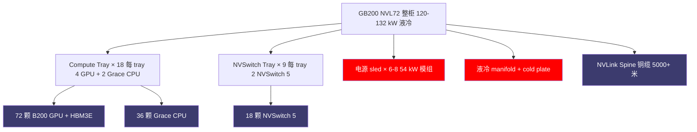
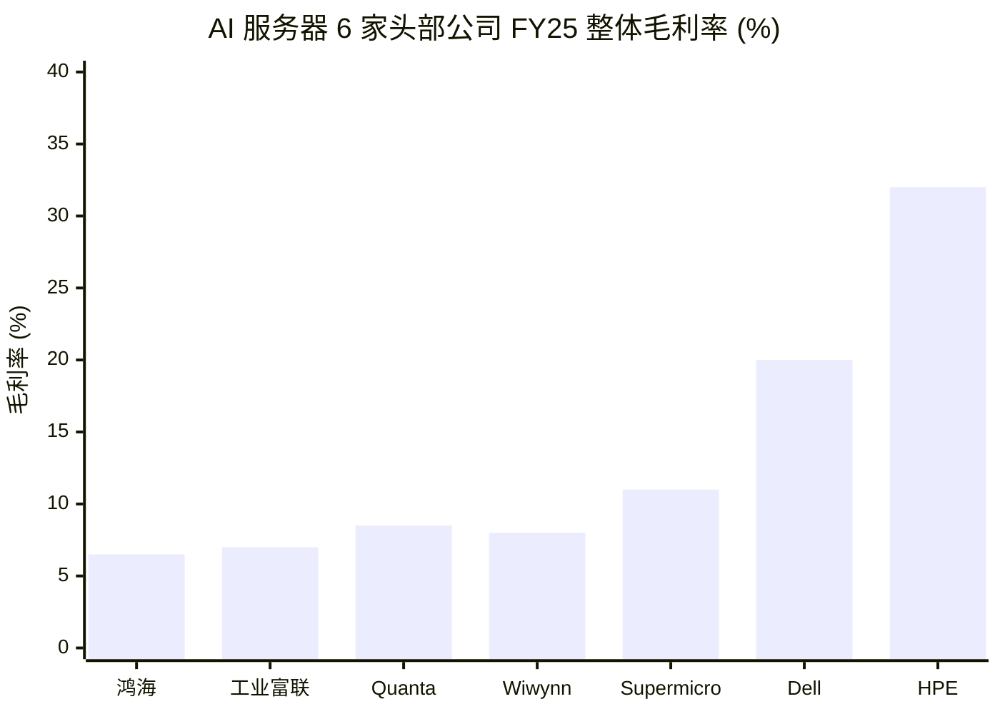
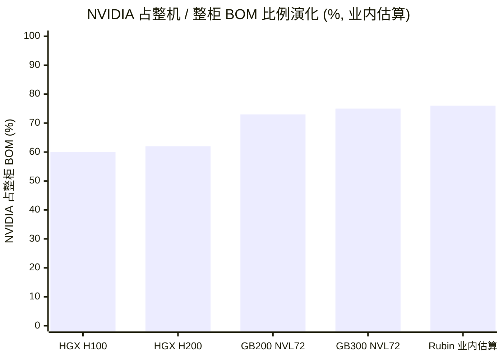
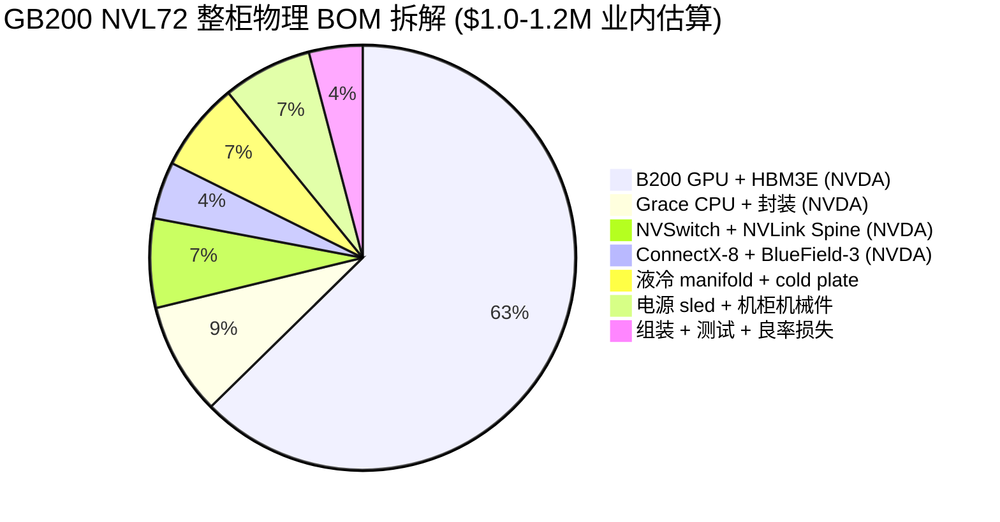
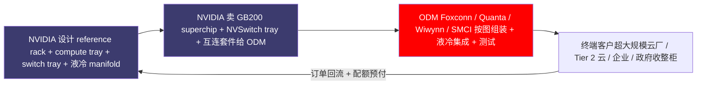
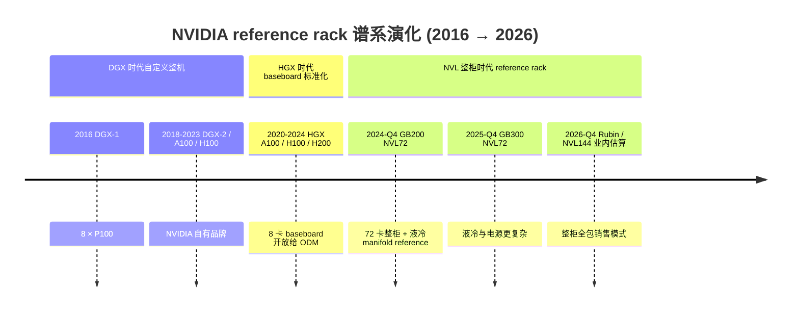
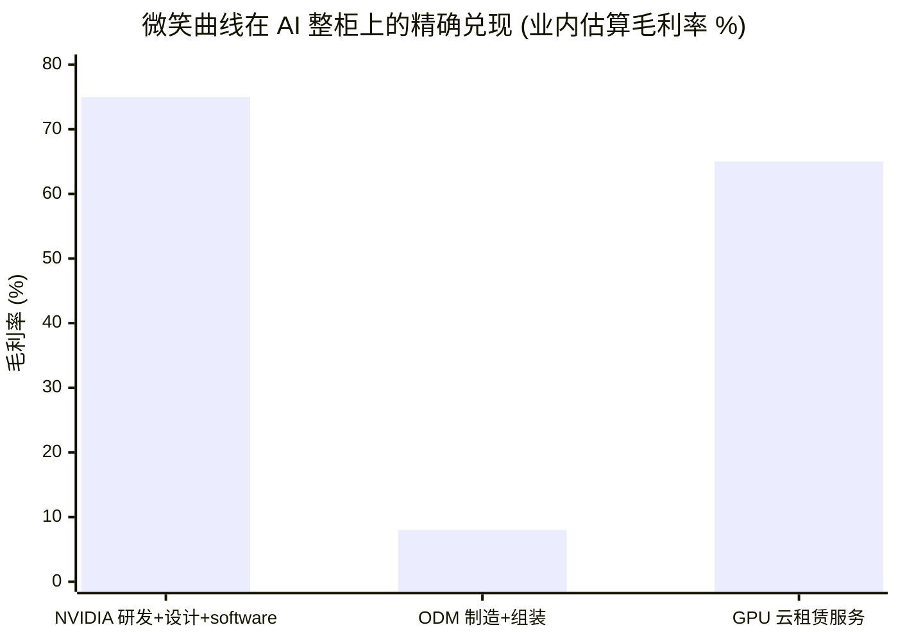

# 第 9 章 服务器与整柜：8-12% 毛利的脏活与英伟达的整柜价值收编

## 本章概览

把一台 GB200 NVL72 整柜搬上磅秤，整柜重量约 1.36 吨（约 3,000 lbs，来源：惠普企业 QuickSpecs GB200 NVL72 + 超微电脑 SuperCluster GB200 NVL72 datasheet + Sunbird DCIM 部署指南，业内多源一致），整柜标称功率 120 kW、实测满载 130-132 kW，整柜业内估算成交价 \$2.8-3.4M。

这么一台机器，从设计权到关键模组再到组装，几乎全部价值在 [英伟达](https://www.nvidia.com/) 手里——基于第 1 章的 BOM 推导，NVL72 整柜的物理 BOM 约 \$1.0-1.2M，其中英伟达自家模组（72 颗 B200 GPU + 18 颗 NVSwitch + 36 颗 Grace CPU + 9 个 NVLink Switch tray + HBM3E 转售收入）业内估算占 70-75%。

剩下 25-30% 的整柜 BOM 里，液冷 manifold（冷却液分配器）、cold plate（冷板）、铜缆、电源 sled、机柜机械件、组装人工分给 [富士康](https://www.honhai.com/) / [Quanta](https://www.quanta.com.tw/) / [Wiwynn](https://www.wiwynn.com/) / [超微电脑](https://www.supermicro.com/) 这些 ODM（Original Design Manufacturer，原始设计制造商）。组装环节拿到的加价空间业内估算 8-12 个百分点——这是本章题目里脏活毛利的物理来源。

超微电脑（SMCI，美国 AI 服务器整机品牌商）FY2025 财年（2024-07 至 2025-06）的财报把这件事讲得更清楚——全年营收 \$21.97B、同比 +46.6%，但 GAAP 毛利率从 FY2023 的 18.0% 一路下滑到 FY2025 的 11.1%。

[戴尔（Dell） Technologies](https://www.dell.com/)（DELL，美国老牌系统集成商）FY26 全年营收 \$113.54B、同比 +18.8%，整体毛利率 20.0%，比 FY25 的 22.2% 下滑 2.2 个百分点。两家公司在 AI 服务器营收高速增长的同时，毛利率持续下行——这是典型的营收爆发 vs 毛利原地现象。

但更值得拎出来的事情是结构性的——英伟达在 2023-2026 的三代产品演化里（HGX H100 → HGX H200 → GB200 NVL72 → GB300 NVL72），把整柜定义权从 ODM 手里收回。HGX H100 时代 ODM 还有 baseboard 设计自主权，到 GB200 NVL72 时代英伟达直接卖 reference rack——参考设计 + 关键模组（NVLink Switch tray + GPU compute tray + 液冷 manifold 设计）打包给客户，ODM 只剩按图组装 + 物流两件事。

本章把这一变化命名为 **英伟达的整柜价值收编**——英伟达把过去十年消费电子时代台积电 + 苹果 + 富士康模式中的组装利润再次压缩，把整柜里能拿的价值占有比从 H100 时代的 60% 推到 GB200 NVL72 时代的 70%+。这不是周期性现象，是结构性的价值再分配。

把一台 GB200 NVL72 整柜的物理结构画成一张图，可以看清后面 BOM 拆解的对象——72 GPU 分布在 18 个 compute tray 里、9 个 NVSwitch tray 提供域内全互连、liquid cooling manifold 统一回水。

本章对工程师，把为什么我们公司买整柜还要先问英伟达而不是先问富士康翻译成 reference rack、BOM 加价、配额分配的具体机制；对投资者，本章给出一个标准案例——营收高速增长但毛利率不增长甚至下行的 AI 算力玩家定价方法，以及如何在 ODM 三巨头与品牌 OEM 两条路线之间分配权重。

## 核心结论

读这一章前先看 8 句话——后面所有数据 / 案例都是在论证它们：

1. 6 家头部 ODM / OEM 的营收与毛利率横截面——营收爆发与毛利原地踏步同时发生
2. HGX H100 → GB200 NVL72 → Rubin 三代产品的权力位移——英伟达占有比从 60% 走到 70%+
3. GB200 NVL72 整柜的 BOM 拆解——~\$3M / 柜里 NVDA 占 70-75%、其他人分 25-30%
4. 英伟达的整柜价值收编——reference rack 谱系（DGX → HGX → NVL72）如何收回整柜定义权
5. ODM vs OEM 在 AI 时代的分化——四种商业模式
6. 液冷转向（GB200 / NVL72）对整柜价值分布的影响——脏活更脏，议价权更往英伟达偏
7. 经济学含义——微笑曲线在 AI 整柜上的精确兑现
8. 地理分布与地缘风险

## 9.1 营收爆发 vs 毛利原地：6 家头部 ODM / OEM 横截面

把 6 家在 AI 服务器整机 / 整柜上最活跃的公司放在一张表里，营收增速与毛利率走向一目了然。

| 公司 | 股票代码 | 业务定位 | FY2023 营收 | FY2025 营收 | 同期毛利率变化 | 一手来源 |
|------|----------|---------|------------:|------------:|---------------|---------|
| 超微电脑 | SMCI | 美国 AI 服务器整机品牌（贴牌 ODM + 自有品牌混合） | \$7.12B | \$21.97B | 18.01% → 11.06% | SMCI FY25 10-K |
| 戴尔 Technologies | DELL | 美国老牌系统集成商，ISG 含 AI 服务器 | \$102.3B（FY23） | \$113.5B（FY26） | 22.18% → 20.0% | 戴尔 FY26 10-K |
| [惠普企业](https://www.hpe.com/) | 惠普企业 | 美国老牌企业服务器商，含 Cray AI 业务 | \$29.1B（FY23） | 业内估算 \$32B+（FY25） | 35.1% → 业内估算 32% | 惠普企业 FY25 10-K |
| 鸿海精密 | 2317.TW | 全球最大电子代工厂，AI 服务器通过子公司工业富联与子集团承接 | NT\$6.16T | 业内估算 NT\$7T+（CY25） | ~6.5% → ~6.5% | 鸿海月度营收公告 |
| 工业富联 | 601138.SS | 鸿海 A 股上市子公司，云计算业务承接绝大部分 AI 服务器订单 | CNY 476B | CNY 902.9B（CY25 实际） | ~7.5% → ~7.0% | 工业富联 2025 年报（2026-03 披露） |
| Quanta Computer | 2382.TW | 台湾 ODM 大厂，AI 服务器是 2024-2025 月度营收增长主引擎 | NT\$1.10T | 业内估算 NT\$1.6T+（CY25） | ~8% → ~8.5% | Quanta 月度营收公告 |
| Wiwynn | 6669.TW | 台湾 ODM，主要服务超大规模云厂 OCP 整机柜 | NT\$273B | 业内估算 NT\$500B+（CY25） | ~7% → ~8% | Wiwynn 月度营收公告 |

> 来源：SMCI FY25 10-K 与戴尔 FY26 10-K 取自公司官方 IR 与 StockAnalysis 数据库 2026-04 snapshot；惠普企业 FY25 业内估算综合惠普企业 FY24 10-K 与 FY25 业绩报道（惠普企业 FY25 截至 2025-10）；鸿海 / 工业富联 / Quanta / Wiwynn 财年与日历年同步，CY25 月度营收均取自台交所与上交所的月度公告；CY25 全年数字部分为业内估算（截至 2026-05 部分公司年报尚未披露完整）。各家 AI 服务器营收口径差异在 9.5 节展开。

> 术语：超大规模云厂 —— 指 AWS / Microsoft Azure / Google Cloud / Meta 等运营超过 100,000 服务器的超大规模云服务商，下同。OCP（Open Compute Project）—— Meta 牵头的开源服务器架构联盟。ISG（Infrastructure Solutions Group）—— 戴尔的基础设施解决方案部门，含服务器与存储。Cray —— 惠普企业 2019 年收购的高性能计算品牌。

把这张表纵向看，三件事跳出来。

**第一件，超微电脑 FY23-FY25 营收涨 3.1 倍、毛利率从 18% 跌到 11%**。SMCI 是这张表里最纯粹的 AI 服务器纯股票——它没有戴尔那样大的传统企业市场托底、没有富士康那样的消费电子规模摊薄。

FY23 毛利率 18% 是它历史峰值（H100 配额紧缺、SMCI 的定制速度溢价被市场认账），FY25 跌到 11% 是产能跟上、客户议价权回归、英伟达直接参与整柜定义这三件事同时发生的结果。SMCI 在 FY25 10-K 里没有单独披露 AI GPU 整机分线毛利，但管理层在 FY25 法说会上多次提到 AI GPU 系统毛利率显著低于公司整体毛利率——公开口径业内推算 AI GPU 整机毛利率落在 8-10% 区间。

**第二件，戴尔 FY26 营收同比 +18.8%，但毛利率从 22.2% 下滑到 20.0%**。戴尔把 ISG 分部里的 AI server 拆出来看，FY26 全年 ISG 营收 \$60.8B（同比 +40%，创历史新高）、AI server（AI-Optimized Servers 分线）营收 \$24.7B 约占 ISG 的 41%。ISG 全年营业利润 \$7.1B、ISG 整体营业利润率约 11.7%（\$7.1B / \$60.8B，口径为 ISG 整体而非 AI server 单独分线）——比传统企业服务器 + 存储分线约 12-13% 的营业利润率低约 1 个百分点（业内估算）。戴尔在 FY26 Q4 法说会上披露 AI 服务器订单合同储备 \$43B（截至 2026-01 FY26 年末），全年累计 AI 订单超过 \$64B，创公司历史新高。但毛利率走向已经清楚地说明——AI 服务器是营收引擎，不是利润引擎。

**第三件，台湾 ODM 三巨头（鸿海 / Quanta / Wiwynn）月度营收同比增速曾达 50-100%+**。鸿海 2024 年 Q3 / Q4 月度营收同比增长 30-50%，2025 全年云计算 / AI 业务承担了绝大部分增量。Quanta 在 2024-Q4 单月营收同比 +80%、Wiwynn 在 2025-Q1 单月营收同比 +100%+。

三家月度增长曲线的共同特点是——增长高度集中在 2024-Q3 到 2025-Q4 这 15 个月窗口期，与英伟达 HGX H200 + GB200 NVL72 爬坡周期完全同步。这是 AI 算力周期对 ODM 营收结构的最直接物理表现。但毛利率方面，三家 CY24 / CY25 整体毛利率均稳定在 6-8% 区间，没有随营收同步上行——这是产业链微笑曲线的体现，营收爆发不传递给毛利。

把工程师视角接进来——一家公司从 SMCI 买 HGX H200 8 卡服务器，渠道价业内估算 \$250K-300K，里面英伟达的 8 张 H200 模组占 \$180-220K，SMCI 拿到的加价空间约 \$30-50K，但要扣减板卡 BOM、电源、散热、组装人工、库存周转损失、客户认证服务、保修计提，最终 SMCI 留给自己的毛利约 \$20-30K，毛利率 8-12%。这条物理路径正是 SMCI FY25 11% 毛利率的成因——不是管理不善，是产业链定价权决定的物理结果。

把 6 家 FY25 毛利率画成一张柱状图，营收爆发 vs 毛利原地的二极结构一目了然——左四家 ODM 个位数到低双位数，右两家 OEM 仍守 20-32% 高位。

### 一个对照：资本支出 / 营收比与 ODM 现金流压力

ODM / OEM 在 AI 服务器上的另一个被低估的成本是**营运资金占用**。买英伟达 GPU 模组要先付款（英伟达给的账期业内估算 30-60 天），但下游云厂或品牌商付款账期 60-120 天，中间 60 天的现金缺口要 ODM 自己垫资。SMCI 在 FY25 10-K 里披露应收账款 + 库存合计达 \$7.3B（占年营收 33%）；工业富联 2025 年报披露应收 + 库存合计业内估算 CNY 280B+（占年营收 40%）。这意味着 ODM 在 AI 服务器营收增长 30-50% 的同时，营运资金占用增长更快——这件事既是 SMCI 在 2024 年财报风波（见 9.5）的背景，也是 ODM 行业整体周期敏感度高的根源（见 9.7）。

## 9.2 三代产品的权力位移：HGX H100 → GB200 NVL72 → Rubin

把英伟达三代主力产品（HGX H100、GB200 NVL72、Rubin 整柜业内估算）放在一张表里，权力位移的轨迹就清楚了。

| 产品代际 | 量产时点 | 销售单位 | 整柜 / 整机 BOM 业内估算 | 英伟达模组占 BOM 业内估算 | ODM / OEM 自主权 |
|---------|---------|---------|------------------------:|--------------------------:|----------------|
| HGX H100 8-GPU 整机 | 2023-Q1 | 8 卡服务器 | ~\$30K | ~60% | ODM 可自定义板卡 / 机箱 / 散热 / 电源；英伟达卖 HGX baseboard 模组 |
| HGX H200 8-GPU 整机 | 2024-Q2 | 8 卡服务器 | ~\$32K | ~62% | 同 H100；H200 升级 HBM3E，整机设计沿用 H100 框架 |
| GB200 NVL72 整柜 | 2024-Q4 爬坡 / 2025-Q2 量产 | 72 卡整柜 | ~\$1.0-1.2M（BOM）/ ~\$2.8-3.4M（成交价） | ~70-75% | ODM 只剩组装 + 液冷部件 + 机柜机械件 + 电源 sled；英伟达卖 compute tray + switch tray + reference rack 设计 |
| GB300 NVL72 整柜 | 2025-Q4 爬坡 / 2026-Q1 量产 | 72 卡整柜 | 业内估算 ~\$1.1-1.3M（BOM）/ ~\$3.0-3.5M（成交价） | 业内估算 ~72-77% | 同 NVL72，但液冷 + 电源更复杂，ODM 自主权进一步收窄 |
| Rubin（R100 / RV100）整柜 | 2026-Q4 计划量产 | 72 / 144 卡整柜 | 业内估算 ~\$1.3-1.5M+（BOM） | 业内估算 ~75%+ | 业内推测英伟达在 Rubin 上把 reference rack 卖得更整——可能直接以整柜系统形式定价 |

> 来源：HGX H100 / H200 单机 BOM 与英伟达占比综合 SemiAnalysis 历年 teardown + 第 1 章 BOM 推导；GB200 NVL72 整柜 BOM \$1.0-1.2M 由第 1 章单卡 BOM × 72 + NVSwitch + HBM3E 模组化报价推算（业内估算）；NVL72 整柜成交价 \$2.8-3.4M 来自 SemiAnalysis 2024-07 NVL72 系统经济性 + The Information 2025-Q1 报道综合（业内估算）；GB300 与 Rubin 数据为业内估算 / 预测，data_cutoff 2026-05 之时 GB300 量产爬坡中、Rubin 尚未量产。各 BOM 估算区间 ±15%。

把这张表读下来，三个变化跳出来。

**第一，销售单位从8 卡服务器变成72 卡整柜——价值密度跳了 30 倍**。H100 单机售价 \$30K 量级，NVL72 整柜售价 \$3M 量级。英伟达在产品物理形态上做了一次规模化打包——把客户的最小采购单位从 8 卡推到 72 卡。这件事的影响是双向的：对客户，整柜采购降低了集成成本（不用自己拼网络拓扑、不用自己调液冷、不用自己做布线）；对英伟达，整柜销售提升了 ASP（Average Selling Price，平均售价）并把更多 NVDA 自家模组（NVLink Switch、NVLink cable、cold plate 设计）打包进售价。

**第二，英伟达模组占 BOM 比从 60% 推到 70-75%**。H100 时代 ODM 还能在板卡 / 机箱 / 散热 / 电源上拿到 40% 的 BOM 价值，到 NVL72 时代 ODM 只剩 25-30%。英伟达多拿的 10-15 个百分点，主要来自 NVLink Switch tray（72 张 GPU 共享一个 NVLink domain，需要 9 个 NVLink Switch tray，每个 switch tray 内含 2 颗 NVSwitch、业内估算英伟达单 switch tray 渠道价 \$20K+）+ NVLink 第五代 cable（铜缆，72 卡整柜内部铜缆总长 5,000 米+）+ 液冷 manifold reference 设计的管控权。

**第三，ODM 自主权窄化**。H100 时代 SMCI / 富士康 / Quanta 还能在板卡设计上拼速度、拼定制；NVL72 时代英伟达已经把 compute tray（含 2 颗 GB200 superchip）+ switch tray（含 NVSwitch + NVLink IO）+ rack-level 液冷 manifold 的物理参数完全锁定，ODM 只在机柜机械件、电源 sled 排布、铜缆走线这些低自主权环节有差异化空间。这一变化对 ODM 的财务表现是直接的——CY24-CY25 鸿海 / Quanta / Wiwynn 月度营收同比涨 50-100%，但毛利率没有同步上行，正是因为英伟达收走了差异化定价的物理基础。

英伟达在三代产品里把整机 / 整柜 BOM 占有比一阶一阶推高——这条曲线就是整柜价值收编的财务证据。

## 9.3 GB200 NVL72 整柜 BOM 拆解

把 GB200 NVL72 整柜的物理 BOM 摊到桌上，先把口径说清楚——产业链常见的两种 BOM 口径在同一张表里混着看会读出错误结论，所以本节拆成两张表，分别走成交价层（NVDA → ODM ASP）与物理 BOM 层（NVDA 自身制造成本）。

### 表 A：成交价口径（NVDA 卖给 ODM 的 ASP / wholesale price）

这一层回答的是 NVDA 在整柜里能从 ODM 那边收到多少钱——是 NVDA 营收口径，不是 NVDA 制造成本口径。

| 模组 | 数量 | 单模组 ASP 业内估算（USD） | 小计业内估算 | 价值归属 | 来源 |
|------|-----:|--------------------------:|------------:|---------|------|
| GB200 superchip（1 颗 Grace CPU + 2 颗 B200 GPU，含 HBM3E）| 36 | \$80K-90K | \$2,880K-3,240K | 英伟达 → ODM ASP | 英伟达 Blackwell whitepaper + SemiAnalysis 2024-07 反推 |
| NVLink Switch tray（含 2 颗 NVSwitch）| 9 | 业内估算 \$20K | \$180K | 英伟达 → ODM ASP | SemiAnalysis 2024-07 |
| ConnectX-8 800G 网卡 + BlueField-3 DPU + NVLink 5 铜缆 / NVSpine（NVDA 自家模组打包）| 整柜套件 | 业内估算 \$130K-260K | \$130K-260K | 英伟达 → ODM ASP | 英伟达 / Mellanox + SemiAnalysis 2024-07 |
| **NVDA 卖给 ODM 整柜模组合计（成交价口径）** | | | **~\$3.2-3.7M** | | |

> 口径说明：成交价口径 — NVDA 卖给 ODM 的 ASP / wholesale price。GB200 superchip ASP \$80-90K **已经包含** HBM3E 与 B200 裸片制造成本（NVDA 整体打包卖出），不可与下面表 B 的 B200 裸片、HBM3E 单独加总——表 A 与表 B 不在同一层级、不可对加。表 A 的合计 \$3.2-3.7M 略高于整柜成交价 \$2.8-3.4M，差额是 ODM 在 NVDA ASP 上的返点 / 配额绑定折让 + ODM 自身组装毛利空间——业内估算 5-10%，与 ODM 6-9% 整体毛利率匹配。

### 表 B：物理 BOM 口径（NVDA 自身制造成本，引第 1 章推算）

这一层回答的是 NVDA 在整柜里自身花了多少制造成本——是 NVDA 营业成本口径，用于反推 NVDA 整柜毛利率。

| 模组 | 数量 | 单价业内估算（USD） | 小计业内估算 | 价值归属 | 来源 |
|------|-----:|------------------:|------------:|---------|------|
| B200 GPU 裸片 + 同模组 HBM3E（第 1 章 BOM 已合并口径）| 72 | \$6.4K | \$461K | 英伟达制造成本 | Silicon Analysts 2026-04 + 第 1 章 §2 |
| Grace CPU 裸片 + 封装 | 36 | \$1.5K-2K | \$54K-72K | 英伟达制造成本 | 第 1 章 |
| NVSwitch 裸片（每 switch tray 2 颗）+ 封装 | 18 | 业内估算 \$1K-1.5K | \$18K-27K | 英伟达制造成本 | SemiAnalysis 2024-07 + 第 1 章 |
| 液冷 manifold + cold plate（GPU / CPU / NVSwitch）| 整柜套件 | 业内估算 \$40K-60K | \$40K-60K | Cooler Master / Auras / AVC | 拆机 + 卖方 |
| NVLink 5 铜缆 / NVSpine（5,000 米+）| 整柜套件 | 业内估算 \$30K-50K | \$30K-50K | 英伟达 / Amphenol 二供 | SemiAnalysis 2024-07 + Amphenol 8-K |
| ConnectX-8 + BlueField-3 物理 BOM（含 PHY / SerDes / RAM）| 整柜套件 | 业内估算 \$25K-40K | \$25K-40K | 英伟达制造成本 | 英伟达 / Mellanox + 第 1 章 |
| 电源 sled（54 kW 模组 × N）| 整柜 6-8 个 | 业内估算 \$5K-8K each | \$30K-64K | Delta / LiteOn / FSP | 公司 IR |
| 机柜机械件（铜母线 / busbar / 机壳）| 整柜套件 | 业内估算 \$20K-30K | \$20K-30K | 富士康 / Quanta | ODM 自报 |
| 组装人工 + 测试 + 良率损失 | 整柜 | 业内估算 \$20K-40K | \$20K-40K | ODM | ODM 自报 |
| **整柜物理 BOM 合计（基于第 1 章推算法）** | | | **~\$1.0-1.2M** | | |

> 口径说明：物理 BOM 口径 — NVDA 自身制造成本。**B200 裸片 \$6.4K 已经包含同模组 HBM3E**（参考第 1 章 §2 单卡 BOM 拆解），不可再单独加一行 HBM3E、避免重复计算。整柜物理 BOM 合计 \$1.0-1.2M 是第 1 章单卡 BOM × 72 + NVSwitch + 液冷 + 电源 + 机械件 + 组装的整柜推算法结果，与表 A 的逐行成交价不是同一层级，不可对加。

### 两张表的关系：整柜 NVDA 毛利反推

把两层口径合起来读，能算出 NVDA 在 NVL72 整柜上的毛利率画像——

- NVDA 卖给 ODM 整柜模组合计（表 A 成交价口径）业内估算 \$3.2-3.7M（含 superchip + switch tray + 互连套件）
- 但客户最终拿到的整柜成交价是 \$2.8-3.4M，差额是 ODM 在 NVDA ASP 上拿到的配额绑定折让 + ODM 自身组装毛利
- NVDA 在整柜里的自身制造成本（表 B 物理 BOM 中归属 NVDA 的部分）业内估算 \$600K-800K（B200 裸片 + Grace CPU + NVSwitch + 互连物理 BOM 合计）
- 由此反推 NVDA 在 NVL72 整柜业务上的整体毛利率业内估算 70-78%——与 NVDA FY26 公司整体毛利率 75%（详见第 1 章 §5）方向一致，物理上自洽

> 来源：整柜成交价 \$2.8-3.4M 综合 SemiAnalysis NVL72 系统经济性 2024-07 + The Information 2025-Q1 NVL72 据知情人士报道 + Trendforce 2025-Q1 服务器月度跟踪（业内估算 ±15%）；NVDA 在整柜里的 ASP 合计 \$3.2-3.7M 由 GB200 superchip 36 颗 × ASP \$80-90K = \$2.9-3.2M + NVSwitch tray + 互连套件反推（英伟达不分模组披露 ASP，业内估算）；物理 BOM 合计 \$1.0-1.2M 引第 1 章单卡 BOM × 72 推算法（业内估算口径）；HBM3E 价值在 B200 模组成本里合并计入（参考第 1 章 §2），不在物理 BOM 表里单列。

读这两张表的方式：先看表 A 找 NVDA 在整柜里收多少 ASP，再看表 B 找 NVDA 自身花多少制造成本，二者落差即 NVDA 整柜毛利率的物理来源。

把整柜 \$1.0-1.2M 物理 BOM 按主要科目摊到饼图上，能看到 GPU + HBM 一项就占近半——这是 NVDA 价值的物理锚定。

**表 A 主角：GB200 superchip 单模组业内估算 ASP \$80-90K**——这是一个反推的数字（英伟达不公开单 superchip 售价）。基于 NVL72 整柜成交价 \$2.8-3.4M 反推 36 颗 superchip 占价值 \$2.9-3.2M（业内估算英伟达占整柜 70-75%），单模组 ASP 落在 \$80-90K。

这个价钱里英伟达把 2 颗 B200 GPU + 1 颗 Grace CPU + 同模组 HBM3E + NVLink interconnect + 模组级液冷 cold plate 一起打包卖出。对照表 B 的物理 BOM（2 颗 B200 含 HBM3E \$12.8K + 1 颗 Grace \$1.5-2K + 模组互连与液冷部分 \$3-5K，合计单 superchip 制造成本业内估算 \$17-20K），英伟达在单 superchip 上的软件税 + 研发摊销 + 系统设计税加价倍数约 4-5 倍——这与第 1 章 H100 单卡 8 倍加价的物理规律方向一致，整柜层加价倍数略低于单卡层。

**HBM3E 在 NVL72 整柜里的价值流向**——整柜 13.4 TB HBM3E 业内估算价值 \$335K-400K（按 SK 海力士 FY25 单 GB 价 \$25-30 推算）。这部分价值在表 A 已经被合并进 GB200 superchip ASP（NVDA 整体打包卖给 ODM）、在表 B 也已经被合并进 B200 裸片 \$6.4K 制造成本（参考第 1 章 §2 BOM 拆解口径），所以两张表都没有单独列 HBM3E 行——避免与 B200 裸片重复计算。HBM 价值的财务意义是：流过英伟达但不留在英伟达（NVDA 财报里原材料成本的一个大头），最终落在 SK 海力士财报里，详见第 6 章。

**NVLink 域内互连套件——英伟达在 GPU compute 之外的互连税**。表 A 的 NVLink Switch tray \$180K + 互连套件 \$130-260K 合计业内估算 \$310-440K（占整柜 ASP 11-13%）；表 B 对应的 NVSwitch 裸片 + 铜缆 + 网卡 / DPU 物理 BOM 合计业内估算 \$73-117K——同样 4-5 倍加价。这部分价值在 H100 时代主要由 InfiniBand 网卡分担（英伟达通过 Mellanox 收购拿到），到 NVL72 时代英伟达把 NVLink 域内的 switch + 铜缆 + DPU 一起打包，互连价值在英伟达内部跨产品线汇总——详见第 8 章网络与互连。

**液冷 + 电源 + 机柜机械件 + 组装合计 \$140K-220K**——这是 ODM 真正能拿到手里的物理价值（表 B 下半段加总）。整柜成交价 \$2.8-3.4M 里 ODM 拿到 \$140-220K（占 5-8%），扣减 ODM 内部组装毛利 8-12 个百分点（详见 9.1），ODM 在 NVL72 整柜上的实际毛利落在 \$10-25K / 整柜——这是 9.1 节里所有 ODM 毛利率个位数到低双位数的物理来源。

把这张 BOM 与第 1 章的 H100 单卡 BOM 放在一起看，一条结构性变化清楚浮现：**英伟达在三代产品里持续扩大对整柜价值的占有比，ODM 的加价空间在物理上被压缩**。这是 9.4 节整柜价值收编论点的核心证据。

## 9.4 英伟达的整柜价值收编：reference rack 如何收回整柜定义权

把英伟达的整柜价值收编给一个明确定义——

> **英伟达的整柜价值收编**：指英伟达从 2022 年开始通过 reference architecture（参考架构）+ HGX baseboard 标准化 + GB200 NVL72 reference rack + GB300 rack-scale system 这一系列动作，把过去由 ODM / OEM 自主定义的服务器 / 整柜形态，逐步收回到英伟达自己手里——以卖参考设计 + 卖关键模组的形式，让 ODM / OEM 从产品定义者降级为按图组装的代工方，从而把整柜里的价值占有比从消费电子时代的 60% 推到 AI 时代的 70%+。

这一定义与本书第 7 章加速芯片章节里讨论的系统设计税形成镜像——加速芯片层面英伟达收 GPU + 软件栈的税，整柜层面英伟达再收 reference rack 设计 + 关键模组的税。两层税叠加，形成英伟达在 AI 算力产业链上独有的双重垂直整合。

### 英伟达 reference rack 谱系：从 DGX 到 NVL72

英伟达把 reference rack + 关键模组直接打包，ODM 只剩按图组装 + 物流——一张流程图把整柜价值收编的物理流转画清楚。

英伟达的 reference rack 演化分四代——

| 代际 | 时点 | 形态 | 英伟达自主权范围 | ODM 自主权范围 |
|------|------|------|-------------------|----------------|
| DGX-1 | 2016-Q2 | 8×P100 整机 | 自有品牌整机，英伟达自己设计 + 富士康 / Quanta 代工 | 仅组装 |
| DGX-2 / DGX A100 / DGX H100 | 2018-2023 | 自有品牌整机（8 卡 / 16 卡）| 同 DGX-1，英伟达直接卖给客户 | 仅组装 |
| HGX A100 / H100 / H200 baseboard | 2020-2024 | 8 卡 baseboard（含 GPU + NVLink Switch + NVSwitch tray） | 英伟达设计 baseboard + 关键 IC，开放给所有 ODM / OEM | 板卡（PCB）+ 机箱 + 散热 + 电源 + 网络 |
| GB200 NVL72 / GB300 NVL72 reference rack | 2024-Q4 - 2026 | 整柜（含 compute tray + switch tray + 液冷 manifold + 机柜机械件 reference 设计） | 英伟达设计 compute tray + switch tray + NVLink Spine + 液冷 manifold reference | 机柜机械件 + 电源 sled + 铜缆走线 + 组装人工 |

> 来源：DGX / HGX / NVL72 产品谱系综合英伟达历年 GTC 公开发布 + ServeTheHome 系列拆机 + Tom's Hardware reference rack 详解（2024-Q4 至 2025-Q3）。

DGX 系列是英伟达自有品牌的垂直整合——英伟达自己定义、自己卖、ODM 只负责代工。但 DGX 因为价格高、配额少，长期只占英伟达 AI 服务器出货量的小部分（业内估算 5-10%）。HGX 标准的出现是英伟达的策略转向——把整机定义权部分让出给 ODM / OEM，自己只卖 baseboard + GPU，借此把出货量做大。这是 2020-2024 年 H100 量产周期里 SMCI / 富士康 / Quanta / 戴尔 / 惠普企业 / 超微电脑集体受益的物理基础——HGX baseboard 让 ODM / OEM 在板卡 / 机箱 / 散热 / 电源四件事上有差异化空间。

GB200 NVL72 reference rack 的出现是另一次方向转向——英伟达把整柜级的定义权再收回。reference rack 里 compute tray、switch tray、NVLink Spine、液冷 manifold 已经全部由英伟达 reference 设计，ODM 在物理参数上没有自主调整空间，只能在机柜机械件、电源 sled 排布、铜缆走线这些边缘环节做差异化。这是 9.2 节英伟达模组占 BOM 70-75%的物理机制。

### 为什么英伟达现在能做这件事

把英伟达为什么能在 NVL72 时代收回整柜定义权拆成三个因果：

**因果 1：液冷转向把整柜变成系统工程问题**。H100 时代 8 卡服务器风冷为主、单机 6-8 kW，散热是可解决的机箱问题。NVL72 单柜 120 kW、液冷强制——液冷 manifold 的流量分配、cold plate 的接触压力、漏液应急策略涉及 GPU compute tray 的物理几何与 IC 内部温度感应。这些参数英伟达比 ODM 知道得多，自然让英伟达来定义 reference design。详见 9.6。

**因果 2：NVLink domain 跨越 72 卡，互连复杂度跳了一档**。H100 时代 NVLink 域只跨 8 卡（单机内部）；NVL72 时代 NVLink 域跨 72 卡（一整柜内部），用 9 个 NVLink Switch tray + 5,000+ 米 NVLink 铜缆构成 NVLink 5 domain。这个 domain 的拓扑、时序、信号完整性、铜缆长度优化全部是英伟达的 know-how，ODM 没有能力独立设计。

**因果 3：客户端的系统级 SLA 压力**。云厂客户买 NVL72 是按整柜 token 吞吐 / 整柜每月可用度评估的——一个 NVLink 铜缆松动、一个液冷漏液、一个 NVSwitch tray BGA 焊点失效，都直接打掉整柜可用度。客户为了避免 ODM 自主创新带来的不可控故障，更愿意接受英伟达锁死的 reference 设计——出问题大家都同一个锅，避免 ODM 之间互相甩责任。

这三层因果合起来，让英伟达 reference rack 在 2024-2026 周期里成为客户主动接受、ODM 被动跟进、英伟达主动定义的三方均衡。

### 整柜价值收编与消费电子时代的对照

消费电子时代有一个经典三方分工——

> Apple（设计 + 软件 + 品牌）+ 台积电（代工 SoC）+ 富士康（整机组装）

这个三方分工里，每一方各拿 30-40% 的整机价值，组装利润 5-8%、SoC 代工 35-40%、品牌 + 软件 + 设计 30-35%。富士康在这个分工里营收高速增长 15 年，但毛利率始终 6-8%。

AI 算力产业链对照看——

> 英伟达（设计 + 软件 + reference rack）+ 台积电（代工 GPU + CoWoS 封装）+ SK 海力士（HBM）+ 富士康 / Quanta / Wiwynn（整柜组装）

但价值分布发生了关键的偏移：英伟达在设计 + 软件 + reference rack 维度上不仅做 Apple 那块，还把互连域、液冷、整柜机械参数这些原本属于组装方的环节收回——结果是英伟达占整柜价值 70%+、台积电 + SK 海力士 + 基板厂分 20-25%、ODM 组装方只剩 4-7%。整柜价值收编的精确意义就在这里——把消费电子时代的组装利润 5-8%再次压缩到 AI 整柜组装利润 4-7%，英伟达自己向下吃。

这一变化对第 29 章周期定位章节有直接含义——AI 算力产业链与 telecom（2000 年代电信设备产业链）周期对照时，5 个差异里最大的一个是上游 NVDA 寡头垄断 vs telecom 三家分蛋糕。telecom 时代思科（Cisco） / Nortel / Lucent 三家分上游，没有任何一家能像 NVDA 这样把下游整柜价值占到 70%+。这是 AI 不是 telecom 2.0 的工程证据。

### Rubin 时代会更进一步

英伟达已经在多次法说会与 GTC 发布会上释放信号——Rubin 时代将进一步推进 rack-scale 销售模式，可能把 reference rack 卖得更全包。业内对 Rubin NVL144（144 卡整柜，业内估算 2026-Q4 爬坡）的预测是——英伟达直接卖整柜 + 控制软件 + 部署服务打包方案，ODM 在物理装配上的自主权进一步收窄。如果这个预测成立，英伟达在 Rubin 整柜上的价值占有比有望超过 75%，ODM 的加价空间进一步压缩到 5% 以下。

这件事在第 11 章 / 第 12 章 / 第 29 章三章会回引——英伟达持续扩大整柜价值占有比，意味着 AI 算力周期里的上游红利持续向英伟达倾斜，这是周期定位时不能忽略的结构性力量。

## 9.5 ODM vs OEM 分化：四种商业模式

把 6 家头部 ODM / OEM 的商业模式分成四类——

### 第一类：富士康（鸿海 2317.TW / 工业富联 601138.SS）——拼规模 + 资本能力

鸿海精密是全球最大的电子代工厂（CY24 营收业内估算 NT\$6.86T、合约 \$215B），通过子公司工业富联（601138.SS，A 股深市，鸿海 A 股上市的云计算 + 网络通信平台）承接绝大部分 AI 服务器订单。工业富联 2025 年营收 CNY 902.9B（约 \$125B，同比 +38%，来源：工业富联 2025 年年报，2026-03 披露），其中云计算业务（含 AI 服务器与传统服务器）业内估算占 50%+。

富士康在 AI 服务器上的核心竞争力是**资本规模 + 全球产能**——它在中国（郑州 / 深圳 / 重庆）+ 越南（北宁）+ 墨西哥（Ciudad Juárez）+ 美国（Wisconsin / Texas）+ 印度（钦奈）+ 巴西布有完整的服务器组装产线。这套地理网络让富士康能为超大规模云厂与品牌 OEM 客户提供近岸交付 + 多国分散产能服务，是英伟达 reference rack 全球出货的物理基础。

富士康的毛利率长期稳定在 6-7%（鸿海整体）/ 7-8%（工业富联云计算分线），AI 服务器营收增长不会显著拉高毛利率——这是拼规模商业模式的物理特征：营收做大、毛利率稳定、绝对利润随营收线性增长。工业富联 2025 年云计算业务利润贡献业内估算 CNY 35-45B（按云计算占营收 50%+、分线毛利率 7-8% 推算），是公司利润增长的最大引擎。

但富士康在英伟达 reference rack 上的议价权有限——客户买 NVL72 整柜是英伟达定 BOM、客户选 ODM，富士康作为 ODM 在配额竞争里靠的是产能确定性 + 资本能力，不是差异化设计。这是 9.4 节整柜价值收编的镜像——ODM 的差异化空间被压缩。

### 第二类：Quanta（2382.TW）+ Wiwynn（6669.TW）——拼台湾 ODM 速度

Quanta Computer（广达，台湾 ODM 大厂，CY24 营收业内估算 NT\$1.35T、合约 \$42B）与 Wiwynn（纬颖，台湾 ODM，2017 年从 Wistron 分拆独立、专注超大规模云厂整机柜，CY24 营收业内估算 NT\$370B、合约 \$11.6B）是台湾 ODM 在 AI 服务器上的两个主力。

两家的共同点是**速度 + 超大规模云厂紧密配合**。Quanta 与 Meta / Google / AWS 在 OCP（Open Compute Project）整机柜上有 10+ 年紧密合作，能在 6-9 个月内把英伟达 reference design 转化为可量产整柜。Wiwynn 在超大规模云厂整机柜的设计协同上更深，CY24-CY25 月度营收同比增长曾达 100%+，与英伟达 HGX H200 + GB200 NVL72 爬坡周期完全同步。

两家的毛利率长期在 7-9% 区间——比富士康略高（因为更小规模 + 更专精超大规模云厂直供），但仍是个位数到低双位数的脏活毛利。Quanta 2024-Q4 单月营收同比 +80%、Wiwynn 2025-Q1 单月营收同比 +100%+，但 CY24 / CY25 整体毛利率没有同步上行——这是 ODM 在英伟达 reference rack 下的物理结果。

### 第三类：超微电脑（SMCI）——拼定制速度 + 自有品牌

超微电脑是 6 家里最特别的一家——既不是纯 ODM、也不是纯 OEM，而是贴牌 ODM + 自有品牌混合。SMCI 在英伟达 HGX baseboard 上做的事情是：从英伟达拿 baseboard，自己设计板卡 + 机箱 + 散热 + 电源 + 整机，以"Supermicro AI GPU server"品牌直接卖给客户（含超大规模云厂、Tier 2 云、企业客户）。

SMCI 的核心竞争力是**定制速度**——它能在英伟达公布 reference design 后的 3-6 个月内推出 30+ 种产品 SKU（Stock Keeping Unit，产品配置规格码），覆盖从 8 卡服务器到液冷整柜的全产品矩阵。这种产品矩阵广 + 上市快的模式让 SMCI 在 FY22-FY23 营收从 \$5.2B 涨到 \$7.1B、毛利率从 15.4% 升到 18.0% 峰值（H100 配额稀缺、定制速度溢价被市场认账）。但 FY23-FY25 营收继续从 \$7.1B 涨到 \$22.0B（FY24 \$15.0B → FY25 \$22.0B），毛利率却一路从 18.0% 跌到 13.8% 再到 11.1%——这才是 SMCI 营收翻 4 倍但毛利率跌一半 的完整倒 V 形轨迹。

但 FY25 SMCI 毛利率跌到 11.06% 是结构性的——产能跟上、客户议价权回归、英伟达直接参与整柜定义这三件事同时发生，让 SMCI 的定制速度溢价不再被市场认账。SMCI 在 FY25 法说会上多次提到 AI GPU 系统毛利率显著低于公司整体毛利率——意味着 AI GPU 整机业务的毛利率比公司整体 11.06% 还低，业内推算 8-10% 区间。

SMCI 在 2024 年还经历了一次审计相关的风波——2024-08 Hindenburg Research 发布做空报告指控 SMCI 财务问题，2024-08 至 2024-10 SMCI 推迟提交 FY24 10-K，2024-10 SMCI 前任审计师 Ernst & Young 辞任，2024-11 SMCI 任命 BDO 为新审计师并最终在 2025-02 完成 FY24 10-K 提交。这一事件期间 SMCI 股价从 2024-08 高点 \$120+ 下跌至 2024-11 低点 \$18，市值蒸发约 80%。整个事件以未发现重大财务造假证据 + 内部控制需改进收尾——SMCI 在 FY25 10-K 中按要求披露 internal control material weakness 并落实补救方案。本章不对该事件下定性结论，按时点客观陈述。

### 第四类：戴尔（DELL）+ 惠普企业（惠普企业）——拼客户关系 + 系统集成

戴尔 Technologies 与惠普企业（Hewlett Packard Enterprise）是 6 家里仅有的两家全球品牌系统集成商。戴尔与惠普企业在 AI 服务器上的核心竞争力不是产品差异化（产品本身仍是基于英伟达 HGX baseboard 或 reference rack），而是**客户关系 + 集成服务 + 全球部署能力**。

戴尔在 FY26 全年 ISG 营收 \$60.8B（同比 +40%）、AI server 分线营收 \$24.7B（占 ISG 约 41%）、AI server 订单合同储备 \$43B（截至 2026-01，FY26 全年累计 AI 订单超 \$64B；来源：戴尔 FY26 8-K + Q4 财报电话会 2026-02）。戴尔的客户结构以 Tier 2 云（CoreWeave、Lambda、Crusoe 等独立 GPU 云，详见第 16 章）+ 企业 AI 客户（财富 500 强自建私有 AI 集群）+ 政府客户（美国国防 / 能源部超算）为主——这部分客户更看重全球部署 + 一站式服务 + 长期合作，愿意接受比 SMCI / Quanta 高 5-10% 的整机售价。

惠普企业在 FY25（截至 2025-10）全年营收业内估算 \$32B+，含 Cray AI 业务（Cray 是惠普企业 2019 年收购的高性能计算品牌，主要服务美国国家实验室与政府 HPC 客户）。惠普企业的优势是政府 / 国家实验室 / 大学超算客户的 30+ 年关系网络，AI 算力周期里这部分客户对英伟达 reference rack 与定制超算系统都有大额采购。

戴尔 + 惠普企业的整体毛利率（20-32%）显著高于 ODM 三巨头（6-9%）——这是全球品牌 + 服务集成模式的物理结果。但这两家在 FY24-FY26 周期里整体毛利率都在下滑（戴尔从 23.8% 跌到 20.0%、惠普企业从 35.1% 跌到业内估算 32%），原因是 AI 服务器业务（毛利率 12-15%）在营收占比上升，把整体毛利率拉低。

### 四类商业模式对照

| 类型 | 代表公司 | 毛利率区间 | 核心竞争力 | 周期敏感度 |
|------|---------|-----------|-----------|-----------|
| 拼规模 | 鸿海 / 工业富联 | 6-7% / 7-8% | 全球产能 + 资本能力 | 中（绝对利润随营收线性，但毛利率稳定）|
| 拼速度 | Quanta / Wiwynn | 7-9% | 产品上市速度 + 超大规模云厂紧密配合 | 高（营收高度依赖英伟达爬坡节奏）|
| 拼定制 | 超微电脑 | 11%（FY25）| 产品矩阵广 + 自有品牌 | 极高（FY23 毛利率 18% → FY25 11%）|
| 拼客户关系 | 戴尔 / 惠普企业 | 20-32% | 全球品牌 + 集成服务 + 客户关系 | 中（传统业务托底，AI 服务器拉低整体毛利率）|

> 来源：各家 FY25 财报与法说会综合，时点截至 2026-Q1。

读这张表的方式：四种商业模式各有合理性，没有哪一种是赢家的简单结论。富士康在规模与全球部署上占优，Quanta / Wiwynn 在超大规模云厂紧密配合上占优，超微电脑在定制速度上占优，戴尔 / 惠普企业在客户关系与品牌溢价上占优。但**所有四类都没有真正解决在英伟达整柜价值收编下毛利率天花板问题**——任何一家想突破 12-15% 毛利率天花板的路径，都要回到如何不依赖英伟达 reference rack，而这条路径目前看是不存在的（除非客户转向 ASIC，详见第 7 章）。

## 9.6 液冷转向的代价：GB200 NVL72 让脏活更脏

H100 时代 8 卡服务器单机 6-8 kW，风冷为主，整机散热是机箱设计 + 风扇优化的工程问题。GB200 NVL72 单柜 120 kW，液冷强制——风冷物理上不可能压住单柜 120 kW 的发热（详见第 10 章数据中心章节）。这一转向对 ODM / OEM 是一次结构性的脏活升级。

### 液冷 manifold 与 cold plate 的供应商集中度

NVL72 整柜的液冷系统包含两层——

**第一层：CDU（Coolant Distribution Unit，冷却液分配单元）**。CDU 把数据中心一次侧的冷却水转换为整柜二次侧的冷却液（去离子水或专用 dielectric fluid），调控压力、流量、温度。CDU 是整柜级别的设备，通常由 Vertiv（VRT）、Boyd Corporation、Cooler Master 等供应商提供。这部分价值在第 10 章数据中心章节展开。

**第二层：cold plate + manifold**。Cold plate 直接贴在 GPU 裸片、HBM stack、NVSwitch 上做直接液冷（direct-to-chip liquid cooling）；manifold 是整柜内部的冷却液分配总管。这部分价值落在整柜 BOM 内部（参见 9.3 表）——业内估算 \$40K-60K / 柜。

NVL72 cold plate + manifold 的关键供应商集中度较高，业内估算前三家——**Cooler Master（台湾 8499.TWO 上市的散热品牌）+ Auras Technology（华孚科技，台湾 3324.TWO）+ AVC（奇鋐科技，台湾 3017.TW）**——合计占整柜液冷套件供应业内估算 70-80%。这是一个被产业链外部低估的隐形大供应商集中度——三家台湾散热厂在 GB200 NVL72 爬坡周期里的月度营收同比涨幅业内估算 80-150%（综合各家月度营收公告）。

但液冷供应集中度高不意味着液冷供应商能拿到高议价权——英伟达在 reference rack 里锁定了 cold plate 与 manifold 的物理参数（接触压力、流道设计、流量曲线），三家散热厂在物理参数上没有自主调整空间，只能在制造工艺与单位成本上拼。三家在 NVL72 上的毛利率业内估算 15-25%——比 ODM 高，但仍远低于英伟达的 70%+ 整体毛利率。

### 液冷对 ODM 毛利率的复杂影响

液冷转向对 ODM 毛利率的影响在业内有两种不同说法——

**说法 1（涨毛利率）**：液冷整柜的物理复杂度比风冷高，ODM 在液冷部件集成、漏液应急、压力测试上的工程含量更高，理应拿到比风冷整柜更高的毛利率（业内估算多 1-3 个百分点）。这是产业链上一种偏乐观的预期，主要来自部分 ODM 公司在 2024-Q2 的法说会披露。

**说法 2（不变 / 下降）**：英伟达在 reference rack 里锁定了液冷参数，ODM 的工程含量在英伟达标准化框架下并未真正转化为差异化议价权；同时液冷部件供应商集中（Cooler Master / Auras / AVC 三家垄断）让 ODM 在采购端没有压价空间，反而被供应商分掉一部分整柜毛利。

这两种说法在 2026-05 这个时点都有部分证据——CY24-CY25 鸿海 / 工业富联 / Quanta / Wiwynn 整体毛利率没有显著上行（与说法 2 一致）；但部分 ODM 在 AI 服务器分线毛利率上较传统服务器有所提升（与说法 1 一致）。本章按业内说法分歧明示这一点，不下定性结论。

### 漏液 SLA 与组装方责任

液冷整柜还引入一个新的责任边界问题——漏液事故的责任归属。一台 NVL72 整柜在数据中心运行 5-7 年（折旧周期）期间，cold plate / manifold / 接头任何一个环节都有漏液风险。漏液一旦发生，可能导致整柜停机 + GPU 永久损坏（液体短路）。客户与 ODM 的合同里需要明确：

- 漏液责任归属 ODM 还是 cold plate 供应商？
- 漏液导致 GPU 损坏，谁赔偿？
- 漏液维修期间整柜停机的损失谁承担？

这些问题在 H100 风冷时代不存在或不重要，到 NVL72 时代成为合同条款的核心。ODM 在保险费、责任准备金、保修计提上的支出业内估算每柜多 1-2 个百分点的毛利——这是液冷转向给 ODM 带来的看不见的成本。这是 SMCI 在 FY25 10-K 中专门披露"warranty expense and product return reserves"科目大幅上行的物理原因之一。

把这一节压成一句话：**液冷转向把整柜从风冷机箱设计变成系统级液体工程问题，ODM 在物理上要承担更多工程含量但在议价权上没有同步获得溢价——脏活更脏，价值更往英伟达偏**。

## 9.7 经济学含义：微笑曲线在 AI 整柜上的精确兑现

把本章的所有数据合起来读，AI 整柜环节的经济学画像清楚浮现——

### 微笑曲线的标准位置

微笑曲线（Smile Curve）是 1992 年宏碁施振荣提出的产业链价值分布概念——价值在研发 / 设计端高、在制造 / 组装端低、在品牌 / 服务端高，形成两端高中间低的 U 形分布。AI 整柜环节恰好落在微笑曲线的中间最低点——

**研发 / 设计端高**：英伟达（GPU 设计 + 软件栈 + reference rack 设计）毛利率 70%+
**制造 / 组装端低**：ODM（富士康 / Quanta / Wiwynn）毛利率 6-9%
**品牌 / 服务端高**：Hyperscaler / GPU 云（CoreWeave / AWS）租赁毛利率业内估算 60-70%（详见第 16 章）

ODM 在这条曲线上承担了制造与组装的物理功能——把英伟达设计的产品物理实现并交付给云厂。这个功能不可替代（云厂自己不会建装配线、品牌商也没有 ODM 的产能），但议价权天然有限——上游英伟达寡占、下游云厂寡占，中间 ODM 只能拿加价空间。

把三段毛利率画成一条柱状图，微笑曲线在 AI 整柜上的形态非常清楚——两端高、中间低。

### 议价权的物理来源 + 物理上限

把 ODM 在 AI 整柜上的议价权拆开看——

**议价权来源 1：产能稀缺**。2024-Q3 至 2025-Q4 期间英伟达 GB200 NVL72 整柜出货需求远超 ODM 产能上限，ODM 拥有配额分配权——可以选择优先服务哪家客户。这一议价权在 2025-Q4 之后随着 ODM 扩产（鸿海越南 + 墨西哥新厂 / Quanta 美国 Wisconsin 厂 / Wiwynn 越南扩产）逐步消失。

**议价权来源 2：液冷 know-how**。液冷整柜的集成与测试是一种相对新的工程能力，2024-2025 周期里只有少数 ODM（鸿海 / Quanta / Wiwynn / SMCI）具备规模化液冷整柜量产能力。这一议价权在 2026 之后将随着竞争对手追上而消失。

**议价权来源 3：客户关系绑定**。鸿海与 Apple 30 年、Quanta 与 Meta / Google 10+ 年、Wiwynn 与 AWS 8 年的关系网络是 ODM 难以被替代的物理底座。这一议价权长期稳定，但不直接传递到 AI 整柜毛利率上。

把这三层议价权合起来，ODM 在 AI 整柜上的毛利率物理上限业内估算 12-15%——超过这个上限会触发客户重新议价或转向竞争对手。SMCI FY23 18% 毛利率在 FY25 跌到 11% 的物理机制就落在这里——18% 是周期早期的临时溢价，11% 才是稳态水平。

### 周期敏感度的差异化

四类商业模式的周期敏感度有显著差异——

- **拼定制（SMCI）**：周期敏感度最高，毛利率随周期波动可达 7 个百分点（FY23 18% → FY25 11%）
- **拼速度（Quanta / Wiwynn）**：周期敏感度中等，营收波动大但毛利率稳定 7-9%
- **拼规模（鸿海 / 工业富联）**：周期敏感度较低，营收随周期增长但毛利率稳定 6-8%
- **拼客户关系（戴尔 / 惠普企业）**：周期敏感度最低，传统业务托底，整体毛利率波动 2-3 个百分点

这一差异化对投资者的含义是——AI 服务器周期下行时，SMCI 类公司毛利率压力最大、鸿海类公司绝对利润最稳定、戴尔 / 惠普企业类公司受影响最小。这是在第 29 章周期定位章节做组合配置时需要考虑的一层差异化。

### 一个对照：消费电子 vs AI 整柜

把消费电子时代（2010-2020）的整机组装利润与 AI 时代的整柜组装利润放在一起——

| 指标 | 消费电子（iPhone 整机组装）| AI 整柜（NVL72 整柜组装）|
|------|--------------------------:|------------------------:|
| 整机价值 | \$700-1,200 | \$2,800,000-3,400,000 |
| ODM 加价空间 | \$5-15（业内估算）| \$130,000-200,000（业内估算）|
| ODM 加价比例 | 0.5-2% | 4-7% |
| 上游设计者价值占比 | 35-45%（Apple）| 70-75%（英伟达）|
| ODM 毛利率（行业平均）| 6-8% | 6-9% |

> 来源：消费电子组装利润综合富士康历年 10-K + Bernstein 卖方研报；AI 整柜数据见 9.3、9.5。业内估算口径。

读这张表的方式：**ODM 在 AI 整柜上的加价空间绝对值比消费电子大 4-5 个百分点，但毛利率水平接近——这是因为 AI 整柜的物理复杂度（液冷、互连、电源）远高于 iPhone 整机，工程含量更高 + 工程成本更高，最终毛利率没有显著上移**。这是消费电子时代到 AI 时代的组装利润再压缩的精确体现——英伟达通过 reference rack 把 ODM 在 AI 整柜上能拿的价值空间控制在与消费电子相近的水平，没有让 ODM 因为整柜复杂度而获得更高溢价。

## 9.8 地理分布与地缘风险

把 ODM / OEM 在 AI 服务器上的地理分布与地缘风险拆开看：产能在哪、美国政策怎么传导、台海风险敞口多大、断供能打多远。

### ODM 三巨头的产能地理分布

**鸿海 / 工业富联**：

- 中国（郑州 / 深圳 / 重庆 / 武汉）：传统主力，仍承担 50%+ 服务器产能
- 越南（北宁 Bac Ninh）：2020 年起扩产，2024-2025 加速建设
- 墨西哥（Ciudad Juárez / Tijuana）：服务美国市场近岸交付，CY24-CY25 鸿海宣布在 Mexico 大规模扩产
- 美国（Wisconsin Mt. Pleasant / Texas Houston）：2017 年 Wisconsin 厂启动、2024 Houston 厂启动，专做 AI 服务器与 GB200 NVL72 整柜
- 印度（钦奈）+ 巴西：服务对应区域市场

**Quanta Computer**：

- 台湾（桃园 / 林口）：传统主力，含 AI 服务器 R&D 中心
- 中国（上海 / 重庆）：传统服务器代工
- 越南：扩产中
- 美国（Tennessee Nashville + California Fremont）：服务美国市场
- 德国（Munich 周边）：服务欧洲市场

**Wiwynn**：

- 台湾（桃园 / 新竹）：R&D 与试产
- 中国（昆山 / 南京）：传统主力
- 越南（北宁 Vinh Phuc）：CY23 起加速扩产
- 美国（San Jose）：服务超大规模云厂北美市场
- 马来西亚（Selangor）：CY24 扩产

来源综合各家月度营收公告 + 公司公告 + Reuters / Bloomberg / DigiTimes 报道。

### 美国近岸 / onshore 政策对 ODM 的影响

CHIPS Act（美国 2022 年通过的芯片法案，主要针对芯片制造产能补贴）的直接对象是芯片制造（台积电 / 英特尔 / 美光 / 三星美国厂），不直接补贴服务器组装。但美国对 AI 算力的安全供应链政策意图通过两个间接机制传导到 ODM——

**间接机制 1：政府采购优先选择美国本土组装**。美国国防部、能源部、国家实验室对 AI 服务器的采购优先选择美国组装产品，鸿海 Wisconsin / Houston 厂、Quanta Tennessee 厂、戴尔 / 惠普企业本土产线在这一政策导向下持续受益。

**间接机制 2：tier 2 云客户对美国组装溢价付费**。CoreWeave、Lambda、Crusoe 等独立 GPU 云在 2025-2026 周期里对美国组装 AI 服务器有 5-10% 溢价付费意愿。这一意愿来源于客户的供应链可控诉求与未来潜在的关税成本规避。

这两个机制让 ODM 在美国本土的产能扩张速度显著快于其他区域——鸿海 Wisconsin / Houston、Quanta Tennessee、Wiwynn San Jose 是 CY24-CY26 周期里 ODM 扩产的主战场。

### 台海风险对 ODM 与 AI 服务器供应链的影响

ODM 三巨头总部均在台湾，R&D + 高端产能在台湾。一旦台海发生重大冲突，三家 ODM 的总部决策与 R&D 能力会同时受影响——这是 AI 服务器供应链的一个次级集中风险（一级风险是台积电台积电产能）。

但 ODM 的产能在地理上比台积电分散得多——鸿海在中国 / 越南 / 墨西哥 / 美国 / 印度 / 巴西都有产线，Quanta 在中国 / 越南 / 美国 / 德国都有产线，Wiwynn 在中国 / 越南 / 美国 / 马来西亚都有产线。即便台湾总部受影响，全球产能在 6-12 个月内可以由其他区域产线接管（虽然效率下降）。

这意味着——**AI 服务器的台海风险敞口主要在台积电（GPU / CoWoS 制造）+ HBM（SK 海力士韩国，间接受影响）+ ODM 三家的 R&D 与决策中心**，物理组装产能在台湾的份额业内估算只占 30-40%（综合三家公告），可以由其他区域接管。这与台积电 90%+ 先进节点产能在台湾的高集中度不同。详见第 20 章 / 第 22 章地缘章节。

### 替代成本与断供半径

把 如果 ODM 三巨头一家发生供应中断（含决策中断 / 重大产能事故 / 地缘事件）的替代路径拆开——

**替代路径 1（短期 0-6 个月）**：剩余两家 ODM + 超微电脑 + 戴尔 / 惠普企业内部产线接单。这一路径在 0-6 个月内可以接 50-60% 的中断产能，剩余 40-50% 缺口（主要是高端 AI 整柜）需要客户调整订单计划。

**替代路径 2（中期 6-18 个月）**：扩产 + 新进入者（[Inventec](https://www.inventec.com/) / Pegatron / ASUS / GIGABYTE / ASRock Rack 等台湾二线 ODM 加速进入 AI 服务器市场）。这一路径在 6-18 个月内可以填补剩余缺口，但英伟达 reference rack 的认证 + 量产爬坡需要时间。

**替代路径 3（长期 18-36 个月）**：完全替代 + 地理重新平衡。新增产能在美国 / 越南 / 墨西哥 / 印度建立，全球产能地理彻底重新平衡。

总的断供半径——**单家 ODM 中断的物理冲击是 6-12 个月的产能缺口、5-15% 的全球 AI 服务器整柜出货下降、客户端项目延期 3-6 个月**。这与台积电中断的全球 AI 算力急停 12-24 个月的冲击量级不同（参见第 4 章 + 第 20 章）。

ODM 在 AI 服务器供应链上不是瓶颈环节，是脏活承担方——脏活的不可替代性主要在产能与速度，不在 know-how 排他性。这是 AI 算力产业链上的一个被低估的事实——ODM 在地缘风险上的敞口比台积电 / SK 海力士小一档。

## 章末小结

压成几个结构性结论——

**结论 1：营收爆发 vs 毛利原地是 AI 服务器整柜环节的稳态画像**。SMCI FY23-FY25 营收涨 3.1 倍但毛利率从 18% 跌到 11%、戴尔 FY26 ISG 营收 \$60.8B / AI server \$24.7B 但 ISG 整体营业利润率仅 11.7% 且比传统服务器分线低约 1 个百分点、鸿海 / Quanta / Wiwynn 月度营收涨 50-100% 但整体毛利率稳定 6-9%——这些数据合起来证明 AI 服务器整柜是产业链微笑曲线的中间低点，营收增长不传递给毛利率。

**结论 2：英伟达的整柜价值收编是结构性而非周期性现象**。从 HGX H100（NVDA 占整机 BOM 60%）到 GB200 NVL72（NVDA 占整柜成交价 70-75%）到 Rubin（业内预期 75%+），英伟达通过 reference rack 持续扩大整柜价值占有比，把 ODM 的差异化定价基础物理上压缩。这一变化叠加在第 7 章加速芯片系统设计税上，形成英伟达在 AI 算力产业链上独有的双重垂直整合。

**结论 3：液冷转向让脏活更脏，但 ODM 没有获得对应的议价权**。NVL72 单柜 120 kW 强制液冷把整柜从机箱工程变成系统级液体工程，ODM 工程含量上升，但英伟达在 reference rack 里锁定液冷参数 + Cooler Master / Auras / AVC 三家供应集中——ODM 在液冷转向中承担了更多工程成本但没有同步获得溢价。

**结论 4：四类商业模式的毛利率与周期敏感度差异显著**。拼规模（富士康 6-7%、稳定）、拼速度（Quanta / Wiwynn 7-9%、营收波动大）、拼定制（SMCI 11%、毛利率波动 7 pp）、拼客户关系（戴尔 / 惠普企业 20-32%、传统业务托底）四类模式各有合理性，但所有四类都没有真正突破 AI 整柜毛利率 12-15% 物理上限。

**结论 5：ODM 在地缘风险上的敞口比台积电小一档**。ODM 三巨头总部 R&D 在台湾，但物理产能分散在中国 / 越南 / 墨西哥 / 美国 / 印度 / 马来西亚。单家 ODM 中断的全球冲击量级是 6-12 个月产能缺口，远小于台积电中断的 12-24 个月急停冲击。

把这条独门论点的位置摆清楚——**英伟达的整柜价值收编在首次集中论证，为第 29 章周期定位章节 AI 不是 telecom 2.05 差异中上游 NVDA 寡头垄断 vs telecom 三家分蛋糕准备工程证据**。telecom 时代思科 / Nortel / Lucent 三家分上游互连设备，没有任何一家能像 NVDA 这样把下游整柜价值占到 70%+；AI 时代 NVDA 一家把这一比例做到 70%+ 并仍在扩大。这是 AI 周期与 telecom 周期在产业结构上最大的差异，第 29 章会回引本章证据展开周期定位讨论。

把视线接到下一章——本章把服务器整柜内部拆完了，但 NVL72 整柜放进数据中心机房还要解决更外围的物理约束：电力、液冷一次侧、机房供电拓扑、PUE（Power Usage Effectiveness，能效指标）、土地与电力审批。第 10 章把视线从服务器机柜抬高到整个数据中心——钢筋水泥不是瓶颈，电力才是。从 NVL72 单柜 120 kW 到 100 MW AI 数据中心的电力需求，将是第 10 章的核心议题。

---

> 本章来自《算力经济学》开源版 · 作者「递归客」  
> 在线阅读完整书系：[inferloop.dev](https://inferloop.dev)
