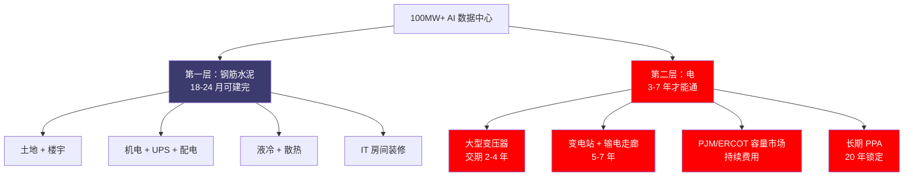
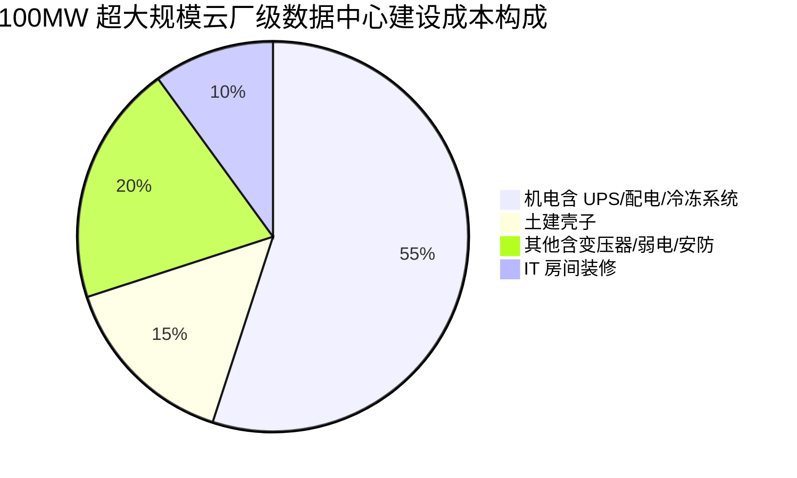
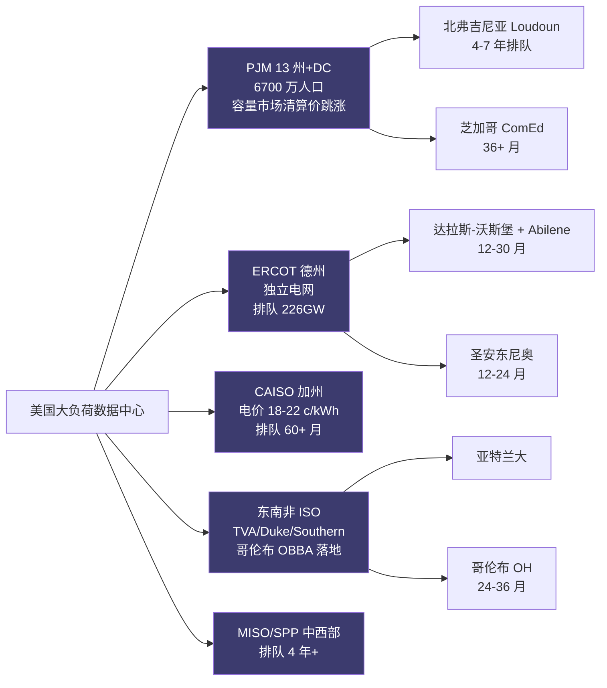
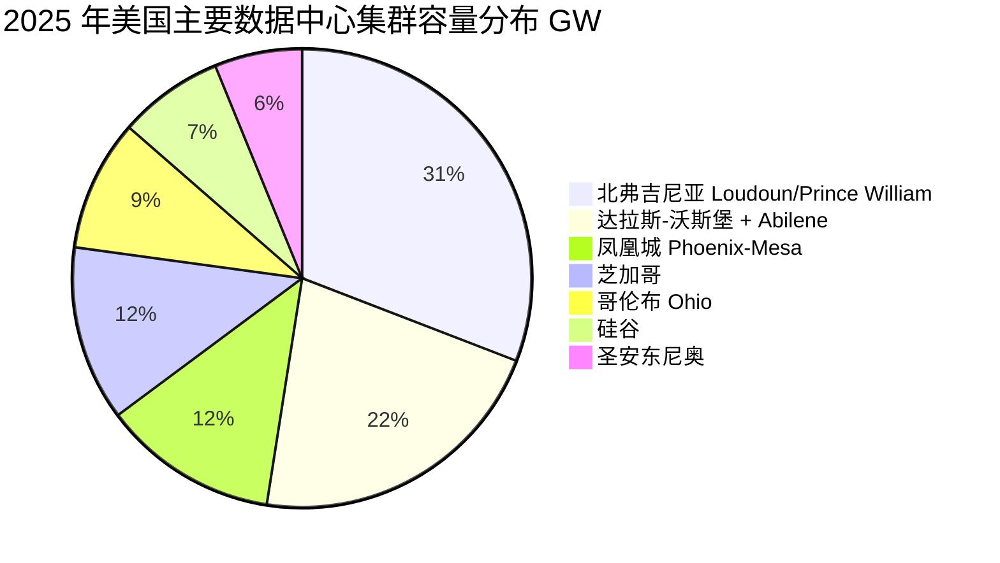
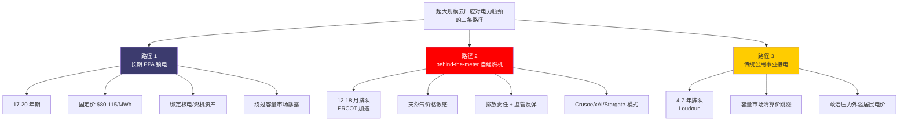
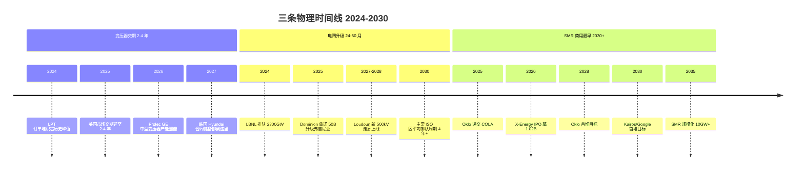
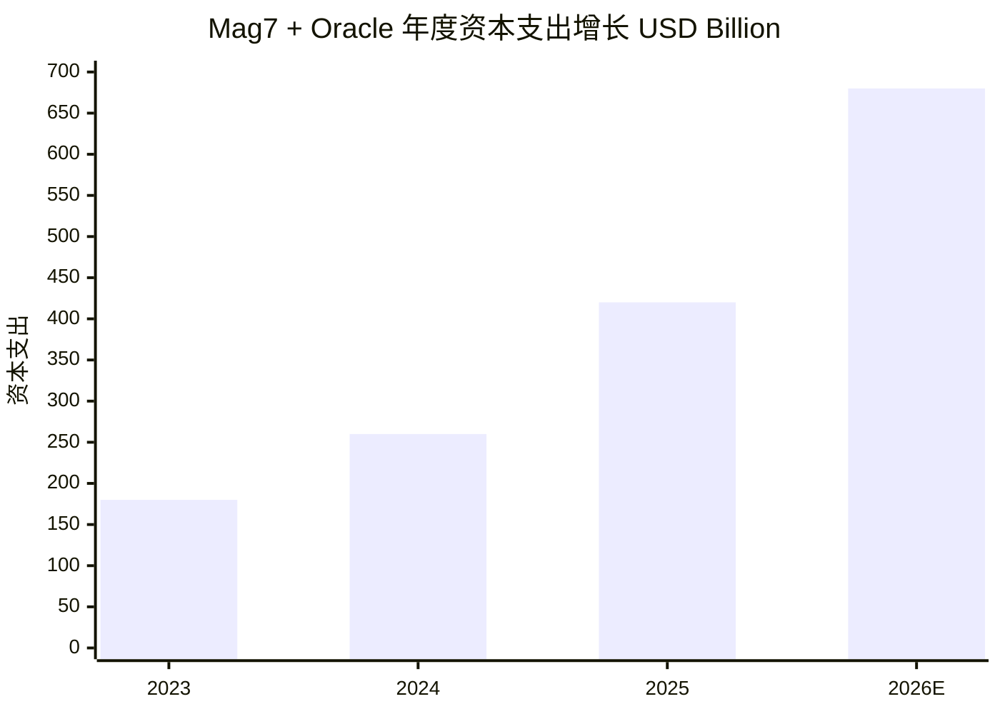

# 第 10 章 数据中心与电力：钢筋水泥不是瓶颈，电是

## 本章概览

钢筋水泥不是瓶颈，电是。**算力地理正在被电网重画——这是 2026-2030 最大的物理位移**。

外行的直觉是，数据中心就是机房——大一点的机房，多一点的服务器，本质跟过去 20 年互联网公司租的 IDC 没区别。

> IDC：Internet Data Center，互联网数据中心。

这个直觉在 2020 年之前基本成立。2024-2026 这一轮 AI 资本支出浪潮之后，它彻底错位了。三组数据可以把这个错位讲透。

第一组，PJM 2025/2026 自然年容量拍卖清算价 \$269.92/MW-day，比上一年 \$28.92/MW-day **一年涨近 10 倍（+833%）**；接着 2026/2027 自然年拍卖清算价直接触及 FERC 批准的价格上限 \$329.17/MW-day。两年累计——从 \$28.92 到 \$329.17——倍数是 11.4 倍。"一年 10 倍"与"两年 11 倍"是同一条曲线的两个截面，不是两个独立指标。

> PJM：Pennsylvania-Jersey-Maryland Interconnection，宾夕法尼亚-新泽西-马里兰州际互联，美国最大的区域电力市场运营商，覆盖 13 个州 + 哥伦比亚特区、约 6700 万人口。MW-day = megawatt per day，每兆瓦每天。FERC = Federal Energy Regulatory Commission，美国联邦能源监管委员会。

第二组，北弗吉尼亚 Loudoun 县——全球最大的数据中心集群——Dominion Energy（弗吉尼亚州主要电力公司）在 2024-08 公开承认，超过 100MW 的新数据中心从申请到通电的等待周期延长 1-3 年，总时间最长可达 7 年。

> MW = megawatt，兆瓦，1MW 约够一个中型 AI 训练集群运行。

Dominion 当前年均接入约 15 个数据中心、合计 1GW 负荷；排队中的还有约 50GW。50 个年度的存量，按当前接入速度排到 2070 年代。

第三组，[Crusoe](https://www.crusoeenergy.com/)（一家从挖比特币转型 AI 数据中心的私营公司）在德州 Abilene 建的旗舰项目，第一期 1.2GW 用了"behind-the-meter（电表后端）+ 燃机自建"的方案——约 360MW 来自现场 10 台 GE Vernova LM2500XPRESS 简单循环燃机，其余靠就近接电网。900MW 燃机现场发电、为单一数据中心服务，这种模式在 2022 年之前是工业园区都不会做的事。

这三组数据指向同一件事：**限制 AI 算力扩张的不是 IDC REIT 公司能盖出多少平方英尺，而是高压电缆能拉到哪里、变压器什么时候能交货、PJM / ERCOT 容量市场清算价愿意付多少钱**。

> IDC REIT：Real Estate Investment Trust，房地产投资信托。ERCOT = Electric Reliability Council of Texas，德州电力可靠性委员会，德州独立电网运营商。

本章是产业链全景部分的电力锚点章，承担三件事：

1. **议题 7（电力是不是真瓶颈）的物理基础位**。本章只给"是"的物理证据，主答辩留到第 27 章（宏观外溢），次生硬约束留到第 14 章（缓解之后的新约束）。
2. **数据中心物理拆解**。把"钢筋水泥"和"电"两层分清楚——楼宇 / UPS / 液冷一层、变压器 / 容量拍卖 / 长期 PPA 另一层——告诉读者真正卡脖子的是哪一层。
3. **三类玩家的财务锚**。IDC REIT（[Digital Realty](https://www.digitalrealty.com/) / [Equinix](https://www.equinix.com/)）、电力 IPP（Constellation / Vistra / GE Vernova）、自建派（Crusoe / [xAI](https://x.ai/) / Stargate）的毛利结构与估值切入点。

> PPA：Power Purchase Agreement，购电协议。IPP = Independent Power Producer，独立发电商。

对工程师，本章把"在 Loudoun 还是 Phoenix 选址"翻译成排队周期 + 电价 + PUE + 时延的可量化决策；对金融读者，本章给 IDC REIT 的 FFO / AFFO / lease-up rate（出租进度）+ 储备电力期权这几个跨行业读者陌生的指标。

> PUE：Power Usage Effectiveness，电源使用效率，数据中心总能耗 ÷ IT 设备能耗，越接近 1 越好；2024 年全球行业平均 PUE 1.47（Uptime Institute Global Data Center Survey 2024）；AI 数据中心目标 < 1.3。FFO = Funds from Operations，运营资金，REIT 行业核心盈利指标。AFFO = Adjusted Funds from Operations，调整后运营资金，扣除维护性资本支出。

读完这一章，对算力周期里的"地理"应该有新坐标——**至少在 2030 年前，决定哪家美国超大规模云厂能跑得最快的，不是 GPU 配额，而是它在四年前签了多少 GW 的长期 PPA**。

> 超大规模云厂：指 [AWS](https://aws.amazon.com/) / Microsoft Azure / [Google](https://cloud.google.com/) Cloud / [Meta](https://about.meta.com/) / [Oracle](https://www.oracle.com/) 等运营超过 100,000 服务器的超大规模云服务商，下同。

下图勾勒出本章关心的核心结构——数据中心由两层物理构成，电力侧才是真瓶颈：

## 1. 数据中心物理拆解：钢筋水泥 vs 电

在进入物理拆解之前，先把"美国 / 全球 AI 数据中心总耗电量"的三套主流口径并列一下，方便后文 50GW 增量、220GW 排队等数字 anchor 到总盘子。三套口径互相不完全可比，但都来自一手或准一手机构，差异主要在覆盖范围与时点：

- **LBNL（美国，已发生）**：2023 年美国数据中心耗电 ~176 TWh，占全美总用电 4.4%；2028 年区间高端 580 TWh、占比 ~12%。这是劳伦斯伯克利国家实验室提交给 DOE 的官方研究。
- **IEA（全球，2030 预测）**：全球数据中心 2030 年耗电 ~945 TWh，相比 2024 年 ~415 TWh 翻倍多；美国增量约 +240 TWh。
- **Goldman Sachs（美国，2030 预测）**：美国数据中心耗电 2024-2030 年增长 165%，2030 年到 ~750 TWh，对应装机 +122GW，电网升级资本支出 ~\$720B。

三套口径在"美国 2030 年数据中心总耗电"上落在 ~580-750 TWh 区间。本章后文的 PJM 50GW 增量、ERCOT 226GW 排队队列均要放在这个总量背景下看——单 ISO 区的瓶颈不会自动外推为全国电力危机，但单 ISO 区的清算价跳涨足以扭转超大规模云厂的选址决策。

把一个 100MW 级别的 AI 数据中心切开看，物理结构分两层。

**第一层：钢筋水泥**。这一层包括土地、楼宇、机柜、UPS、配电系统、液冷管路、消防、安防。一个 100MW 的超大规模云厂级数据中心（含液冷）的建设成本业内估算 \$10-13M/MW。

> UPS：Uninterruptible Power Supply，不间断电源。

成本构成大致如下：

如果按 1.2GW Abilene 这种规模做线性外推，单项目纯土建机电总投资 \$12-16B。这是真金白银，但不是瓶颈。原因有三个：

第一，土建工期是可压缩的。Crusoe Abilene 第一期 2 栋楼 2024 年开工、2025-09 投产；剩下 6 栋楼 2026 年中完工。1.2GW 规模 8 栋楼从动土到完工不到 24 个月，这个速度只有"项目融资 + 模块化建设"才能做到，但物理上没有不可逾越的障碍。

第二，建材供应链是分散的。混凝土、钢结构、HVAC（Heating Ventilation Air Conditioning，暖通空调）设备、UPS、液冷模块的全球供应链都有冗余，没有"一家独占 80% 产能"的瓶颈点。

第三，劳动力是可调度的。哪怕是德州 Abilene 这种小城（人口 12 万），通过外地工人调度，建设期峰值可以叠到数千人。

**第二层：电**。这一层包括 220kV/500kV 输电线、变电站、变压器、对接公用事业（utility）的 PPA、容量市场费用、电费。这一层就是瓶颈所在，原因也是三个：

第一，**变压器是真稀缺品**。大型电力变压器（LPT，>100MVA）2025 年美国市场的交付周期已经从 2020 年前的 12-18 个月延长到 2-4 年。

> LPT：Large Power Transformer，大型电力变压器。MVA = megavolt-ampere，兆伏安。

原因是美国本土 LPT 制造产能在过去 30 年被海外厂（韩国 Hyundai / 现代电气、日本 Hitachi Energy / Mitsubishi、瑞典 ABB、德国 [Siemens](https://www.siemens-energy.com/) Energy、墨西哥 Prolec GE）替代，本土厂只剩个位数家。一次 AI 资本支出周期下来，全球 LPT 订单堆积超过历史峰值。Prolec GE（Xignux + GE Vernova 合资）2025 年宣布把中型变压器产能翻倍——但新增产能要到 2026-2027 才能投产。

第二，**变电站审批与建设是单点串行**。变电站要拿土地、要做环评、要跟当地公用事业签互联协议、要从供应商订设备。任何一环卡住，整个项目跑不动。

第三，**输电线路一旦确定路径就难改**。Loudoun 县的电力瓶颈本质上是 Dominion 的输电网在 Ashburn 一带的高压走廊容量已经被 30GW 数据中心占满，新项目要等 Dominion 拉新的 500kV 走廊。新走廊从申请到投产至少 5-7 年，期间还要走环评、土地征收、社区听证。

把两层叠起来看，"钢筋水泥 18-24 个月可以盖完，但电要等 3-7 年才能通"是 2024-2026 北弗吉尼亚、北卡夏洛特、达拉斯-沃斯堡的普遍状态。这件事的产业含义是：**所谓 100MW+ 项目的真实工期，是 max(土建工期, 电力交付工期)，绝大多数情况下后者是约束**。

| 物理层 | 单 MW 投资估算 | 关键供应链 | 工期 | 是不是瓶颈 |
|---|---:|---|---:|---|
| 土地 + 楼宇（壳） | ~\$1.5-2M | 本地建筑承包商 | 6-12 月 | 否 |
| 机电 + UPS + 配电 | ~\$5-7M | Schneider / Eaton / Vertiv | 12-18 月 | 否（全球冗余） |
| 液冷 + 散热 | ~\$1-2M | Vertiv / Boyd / CoolIT | 6-12 月 | 否 |
| IT 房间装修 | ~\$0.8-1M | 本地装修 | 3-6 月 | 否 |
| **变压器 + 变电站** | ~\$0.5-1M | GE Vernova / Hitachi / Siemens / Prolec | **24-48 月** | **是** |
| **输电线路升级 + PPA** | 不在项目预算（公用事业资本支出） | 公用事业 + 监管 | **36-84 月** | **是** |
| **容量市场费用（持续）** | \$50-120/kW-year | PJM / ERCOT / MISO | 持续 | **是（价格层面）** |

> 来源：建设成本单价综合 CBRE / JLL / Cushman & Wakefield 2024-2025 数据中心建设成本基准、Data Center Frontier 项目成本追踪；变压器交付周期来自 GlobeNewswire 2025-08-25 行业研究报告 + GE Vernova FY2025 合同储备披露；输电升级与 PPA 周期来自 LBNL Queued Up 2025 报告（emp.lbl.gov）。所有单 MW 投资数字属业内估算区间，单项目实际成本受电压等级、PUE 目标、液冷比例、地理位置影响有 20-30% 波动。

这张表里两个"是"行——变压器交期与输电升级——是本章后续小节的物理底座。其余四行是"成本，但不是瓶颈"。把两者分开，是看清楚算力地理迁移的第一步。

## 2. PJM 容量市场清算价两年跳涨 11 倍

PJM 容量市场（Reliability Pricing Model，RPM，可靠性定价模型）的设计逻辑是：用户愿意为"系统有保留容量可用"这件事单独付一笔钱，跟实际发电量分开。容量拍卖每年举行一次（叫 Base Residual Auction，BRA，基础剩余容量拍卖），覆盖 3 年后那个交付年（delivery year）的容量义务。中标的发电资产承诺在交付年内随时可用，反过来拿到固定的 \$/MW-day 收入。

这套机制在 2007 年设计出来之后，长期清算价在 \$30-150/MW-day 之间波动。2020-2024 这五年里平均价格约 \$50/MW-day。然后两次拍卖直接把价格曲线竖起来。

| 拍卖批次 | 交付年（自然年） | 清算价（RTO，\$/MW-day） | 同比变化 | 中标容量（MW） |
|---|---|---:|---:|---:|
| 2024/25 BRA | 2024-06 至 2025-05 | \$28.92 | — | — |
| 2025/26 BRA（2024-07 拍卖） | 2025-06 至 2026-05 | **\$269.92** | **+833%** | 135,684 |
| 2026/27 BRA（2025-07 拍卖） | 2026-06 至 2027-05 | **\$329.17（FERC 批准的上限）** | +22%（且**触顶**） | 134,311 |
| 2027/28 BRA（2025-12 拍卖） | 2027-06 至 2028-05 | **\$333.44（新 FERC 上限，+1.3%）** | +1.3%（**触顶**） | 134,479 |

> 来源：PJM 2025/2026 Base Residual Auction Report（2024-07-30，pjm.com）；PJM 2026/2027 Base Residual Auction Report（2025-07-22，pjm.com）；PJM 2027/2028 BRA Report（2025-12-17）；PJM Inside Lines 新闻稿。Baltimore Gas & Electric（BGE）局部清算 \$466.36/MW-day，Dominion Energy（DOM）局部 \$444.26/MW-day（2025/26 拍卖结果，AmericaPower EVA Report 2024-08）。\$329.17/MW-day 折算 \$120,147/MW-year；若 PJM 同时模拟"无价格上限"情景，清算价会冲到 \$141,828/MW-year，比触顶高出 \$20,000+。

把这条曲线放在过去 18 年里看，从 2007 年 PJM 容量市场设立到 2024 年，从来没出现过任何一次清算价超过 \$200/MW-day。2025/26 拍卖跳涨 833% 之后，2026/27 拍卖直接撞到 FERC 批准的价格上限——后续两年（2027/28 和 2028/29）都将持续触顶。

**清算价的物理解释有四层**。

第一层，**退役机组**。煤电与老旧核电在过去十年集中退役，PJM 注册容量减少。但 2025/26 拍卖结果里"供给侧弹性"已经出现回应：2026/27 拍卖中新增了 2,669MW 来自新建发电——这是一个滞后但真实的反馈。

第二层，**容量市场设计变更**。PJM 2024 年对容量评估方法做了 reform：把容量计入考虑了气候极端事件（冬季 polar vortex、夏季 heat dome）下的实际可用容量，导致很多原本计为"100MW 名义容量"的资产被打折计为"60-70MW 有效容量"——名义产能与有效产能之间出现 30-40% 的折扣。这一项是清算价跳涨的最大单一因素，业内估算贡献 60-70%。

第三层，**AI 数据中心负荷的预期增长**。PJM 在 2024 年的 Load Forecast Report 把 2030 年的需求预测上调了 35GW（之前 165GW、上调到 200GW），其中绝大部分来自数据中心。预期需求增长 + 短期供给收紧 = 价格非线性上涨。

第四层，**容量市场价格上限**。FERC 批准的 2026/27 价格上限是 \$329.17/MW-day（折算 \$120,147/MW-year），2027/28 上限被上调到 \$333.44/MW-day（+1.3%）；如果没有这个上限，2026/27 拍卖的清算价业内模拟会到 \$141,828/MW-year——意味着市场出清价已经突破了监管允许的范围，价格上限本身正在压制需求侧愿付的真实水平。

清算价跳涨的政治后果同样显著。新泽西州 BPU（Board of Public Utilities，公用事业委员会）2025-07-23 公开声明"continued PJM reform needed"，原因是新泽西居民电费里"容量费"那一项 2025 年起单户每月多出 \$20-30——这笔钱是普通居民为数据中心容量需求买的单。马里兰、宾夕法尼亚也都出现了类似的政治压力。这一层后果——"算力资本支出通过容量市场外溢成居民电价上涨"——是第 27 章宏观外溢的主菜，本章只埋伏笔。

容量市场只是电力总成本的一部分。把它放在数据中心 TCO（Total Cost of Ownership，总持有成本）里量化：一个 100MW 数据中心 2026 自然年需付 \$329.17 × 100 × 365 = **\$12M/年的容量市场费用**——这部分不是电费，是"保留容量随时可用"的费用。叠加 PJM 平均工业用户电费 \$80-95/MWh 的能源费部分，一个 100MW 数据中心在 PJM 域内的年度电力总成本业内估算约 \$90-110M（含容量市场 + 能源 + 输电附加），相比之下 2023 年同样规模的项目年度电力支出约 \$55-65M。

**两年时间，电力运营支出在超大规模云厂单项目预算里翻了一倍**。这是 AI 算力的"通胀"——不在 GPU 价格上，而在电费上。

## 3. 算力地理：从城市机房到电网边缘

美国主要的区域电力市场结构如下，每个 ISO 区有自己的容量市场设计与排队周期：

数据中心选址在 2020 年之前服从一套"光纤近 + 客户近 + 人才近"的逻辑。北弗吉尼亚 Ashburn 之所以成为全球最大的数据中心集群——占全球互联网流量的 35-50%——核心原因是：(1) MAE-East 在 1992 年作为全球早期互联网骨干交换节点设在这里，光纤密度无可比拟；(2) 离 DC、纽约、亚特兰大都在 1-2 跳之内，时延适合东海岸互联网服务；(3) 弗吉尼亚州税务 + 监管对数据中心友好。

这套"光纤 + 客户"逻辑在 AI 时代被替换成"电 + 监管"逻辑。原因很物理：AI 训练对时延不敏感（一次训练任务跑数周，延迟 1ms 还是 50ms 不影响结果），但对功耗极敏感（一个 GB200 NVL72 rack 120-140kW，是 2020 年标准 rack 的 6-7 倍）。当单 rack 功率密度上涨 7 倍、单数据中心规模从 30MW 涨到 300-1200MW，"哪里有便宜电、哪里电网容量没排队"取代了"哪里光纤密、哪里离客户近"成为选址第一权重。

| 集群 | 主导玩家 | 2025 容量（GW） | 2030 预计（GW） | 工业电价（¢/kWh） | 新项目电力排队 | 政治环境 |
|---|---|---:|---:|---:|---|---|
| 北弗吉尼亚（Loudoun/Prince William）| Dominion + REITs | ~5.0 | ~10-12 | 8-10 | 4-7 年 | 紧张（地方反对） |
| 凤凰城（Phoenix-Mesa）| APS + Salt River | ~2.0 | ~5-6 | 7-9 | 18-24 月 | 友好 |
| 达拉斯-沃斯堡 + Abilene | Oncor + ERCOT | ~3.5 | ~8-10 | 6-8 | 12-30 月 | 友好（缺水成为新约束） |
| 哥伦布（Ohio）| AEP Ohio + AES | ~1.5 | ~4-5 | 7-8 | 24-36 月 | 友好（OBBA 拨款落地） |
| 芝加哥（Cook + DuPage）| ComEd | ~2.0 | ~3.5 | 9-11 | 36+ 月 | 紧张 |
| 圣安东尼奥 | CPS Energy + ERCOT | ~1.0 | ~3.0 | 6-8 | 12-24 月 | 友好 |
| 硅谷（Santa Clara/SJ）| PG&E + SVP | ~1.2 | ~1.8 | 18-22 | 60+ 月 | 紧张 |

> 来源：集群容量数据综合 CBRE Data Center Market Outlook 2024-2025、JLL Global Data Center Outlook 2025、Cushman & Wakefield 2025 美国数据中心市场报告；工业电价取自 EIA 2025 月度电力数据；排队周期为业内估算，来自 Dominion Energy IR + Loudoun County 经济发展披露 + ERCOT 大负荷接入流程 + Data Center Frontier 项目跟踪。所有 2030 容量为业内预测区间。

2025 年美国主要数据中心集群容量分布：

这张表把"算力地理被电网重画"翻译成了具体的迁移路径。

**北弗吉尼亚份额从增长变成横盘**。Loudoun 县在 2022-2024 年仍是全球第一大数据中心集群，但增量项目从 2024 年起开始外溢——往北到 Prince William 县（也属 Dominion 网区），往南到南弗吉尼亚（受地方电力公司限制更松），更远的迁往北卡夏洛特、亚特兰大、俄亥俄哥伦布。Loudoun 自身从"增长引擎"变成"存量优化"。

**德州 + 凤凰城 + 哥伦布是 2024-2026 的真正增长极**。这三个集群的共同特点是：(1) 电网容量有余裕；(2) 监管对大负荷友好；(3) 工业电价在 7-9 ¢/kWh（比硅谷低 50-60%）；(4) 土地便宜。德州 ERCOT 大负荷接入排队从 2024 年底的约 63GW（ERCOT 2024 large load report 公开口径）跳到 2025 年 11 月的 226GW，约一年时间增长 3.6 倍（近 4 倍），其中 77% 来自数据中心。

**硅谷被结构性挤出**。PG&E 加 Silicon Valley Power 的工业电价 18-22 ¢/kWh，相当于德州的 3 倍。新项目电力排队 60 个月以上，土地价格是全美最高之一。AI 训练数据中心几乎已经放弃硅谷选项，留在硅谷的主要是低密度推理节点和企业自用 IT。

**地理迁移的财务后果**。Digital Realty 与 Equinix 这两家美国头部 IDC REIT 的 2025 财报里，新签长期合约的地理分布与 5 年前完全不同。

Digital Realty 2025 年新签 bookings 主要来自亚特兰大、芝加哥、北弗吉尼亚的扩建，但北弗的项目从纯"扩张"变成"等电"——合同储备（已签合约但未开始交付的部分）在 2025 年末高达 \$817M annualized rental，其中相当部分项目商业化交付要排到 2027-2028 年。也就是说，**"算力地理被电网重画"对 IDC REIT 的影响是：合约赚到了，但收入确认推后**——因为电力交付不到，租户不能搬进来，租金不能开始计入。

把这条迁移逻辑往前推一格，会发现一个更深的结构变化：**超大规模云厂在 2024-2026 年开始绕开传统电力公司、直接跟 IPP 签 20 年长期 PPA**。[Microsoft](https://www.microsoft.com/)-Constellation Three Mile Island 重启、AWS-Talen Susquehanna 核电、Meta-Constellation Clinton 核电，三笔大单都是超大规模云厂 "把电从源头锁住" 的动作。下一节展开这条 PPA 锁电的物理与财务结构。

## 4. 长期 PPA：超大规模云厂把电从源头锁住

超大规模云厂应对电力瓶颈有三条路径，每条路径对应一种供电模式：

PPA 在 2020 年之前主要是企业为完成 RE100（100% 可再生能源承诺）做的"会计绿电"动作——签一份合同，每年从某个风电或太阳能项目买一定量绿色电力凭证，跟实际供电不绑定。

2024 年起，PPA 的性质变了。超大规模云厂开始签的是 17-20 年期、绑定特定发电资产、定价含照付不议（保底支付）条款的实物 PPA——目的是把那一块物理发电量从市场上拿走，自己用。

| PPA | 客户 | 发电资产 | 容量 / 时长 | 公告价格 | 公告时点 |
|---|---|---|---|---|---|
| TMI 重启 | Microsoft | Constellation Three Mile Island Unit 1（核电，PA）| 835MW × 20 年 | ~\$110-115/MWh（Jefferies 估算）| 2024-09 |
| Susquehanna 核电直购 | AWS | Talen Susquehanna 核电（PA）| 1,920MW × 17 年（至 2042，含选项延期）| 未披露（业内估算 \$80-100/MWh）| 2025（PPA 签订） |
| Clinton 核电延期 | Meta | Constellation Clinton（IL）| 1,121MW × 20 年（2027-2047）| 未披露 | 2025-06 |
| Calpine 燃机组合 | Constellation 收购 Calpine 后服务多家超大规模云厂 | 多机组燃机 + 部分核电 | 60GW 零 / 低碳容量 | — | 2026-01-07 收购完成 |
| Comanche Peak 核电 | "大型投资级公司"（业内推测 Microsoft / Meta） | Vistra Comanche Peak（TX）| 1,200MW × 20 年（2027-Q4 起送电）| 未披露 | 2025-Q3 |
| CyrusOne 长期供电 | CyrusOne（KKR 私有化后）| Constellation 燃机 + 核电组合 | 380MW × 长期 | 未披露 | 2025 |

> 来源：Microsoft-Constellation TMI 公告（Constellation 8-K 2024-09，Constellation 新闻稿 2024-09-20，Utility Dive 2024-09-20，DCD 2024-09，Jefferies 价格估算 Yahoo Finance 2024-09-23）；DOE \$1B 贷款给 TMI 重启（CNBC 2025-11-18）；AWS-Talen 收购 + PPA（Talen 8-K 2024-08，AWS-Talen 17 年 PPA 公告 2025，World Nuclear News 2025）；Meta-Constellation Clinton（Constellation 2025-06 公告 + Stocktitan 整理）；Constellation-Calpine 收购（2026-01-07 完成，Constellation 2026-01 新闻稿）；Vistra Comanche Peak（Vistra 8-K 2025-07，Power Engineering 2025-07）；CyrusOne 380MW（Constellation 2025 业绩报告）。具体 \$/MWh 价格仅 TMI 有 Jefferies 公开估算 \$110-115/MWh，其他大单均未披露价格。

这些 PPA 有三个共同结构特征。

**第一，期限拉长**。2020 年前企业级绿电 PPA 主流期限 5-10 年；2024 年起的核电 / 大型燃机 PPA 主流是 17-20 年。期限拉长的本质是：(a) 超大规模云厂愿意把电力支出当固定成本锁定，避免容量市场清算价继续上涨的暴露；(b) 发电方需要长期合约支撑核电重启或新建燃机的项目融资。

**第二，定价从浮动改为固定**。Constellation TMI 跟 Microsoft 的 PPA 业内估算固定价 \$110-115/MWh（Jefferies 估算），高于当下 PJM 市场平均电价（约 \$40-50/MWh 能源部分）的 2-3 倍。Microsoft 愿意付这个溢价的逻辑是：把 PJM 容量市场清算价跳涨的暴露替换成 20 年固定价格——按 2026/27 PJM 清算价 \$329/MW-day 折算每 MWh 含的"容量费"已经接近 \$40-50/MWh，加上能源 \$80/MWh，长期固定 \$110-115/MWh 反而是"今天看起来不贵的对冲"。

**第三，绑定特定资产**。新一代 PPA 不再是"虚拟绿电凭证"，而是实物绑定——AWS 的 Susquehanna PPA 干脆是"我把发电厂旁边的数据中心园区也买下来"（AWS 2024-03 用 \$650M 买下 Talen Cumulus 数据中心园区，搬到核电厂旁边走 behind-the-meter 直供）。这种 "co-located" 模式绕过了输电网，省下了输电费 + 容量费，但带来了"集中风险"——一旦核电厂检修或意外停机，没有备份。

**这些 PPA 的市场含义有三层**。

第一，**核电资产被重新定价**。Constellation 2025 财年 adjusted operating earnings \$9.39/share、收购 Calpine \$26.6B、合并后零碳 + 低碳容量达 60GW——核电资产的估值倍数从 2022 年前的 EV/EBITDA 5-6 倍重估到 2025 年的 12-15 倍。Vistra 的核电资产（Comanche Peak）在 2025-2026 年同样经历重估。

这是过去 30 年美国电力行业没出现过的事——核电从"维护成本高、政治阻力大、监管周期长"的"问题资产"变成"稀缺零碳长期容量"的"AI 配套资产"。

第二，**超大规模云厂把电力运营支出从一个浮动变量转换为一个固定项**。Microsoft 锁了 TMI 的 835MW × 20 年，AWS 锁了 Susquehanna 的 1920MW × 17 年，Meta 锁了 Clinton 的 1121MW × 20 年——三家相加锁了 ~3.9GW 的纯核电长期供给，约相当于 2025 年美国核电总容量（~95GW）的 4%。

这是"电力侧的照付不议"——跟 [NVIDIA](https://www.nvidia.com/) 在 GPU 侧用 RPO 锁产能是同一种工具。

> RPO：Remaining Performance Obligations，剩余履约义务。

第三，**电网公用事业的中间环节被绕过**。Microsoft / AWS 直接跟 IPP 签 PPA，省略了"先把电卖给公用事业、再由公用事业卖给数据中心"这一道。

这件事在监管层引起了大量争议——FERC 在 2024-11-01 投票否决了 AWS 在 Susquehanna 的 480MW 容量上调（从原 300MW），理由是"绕过输电网会让其他电网用户多付输电附加费"。这一争议直到 2025 年才以 17 年 PPA 形式重新构造解决，但它揭示了一个深层结构问题——**"超大规模云厂 co-located 模式"在挑战美国电力市场设计的根本边界**。这一项是第 27 章的主菜。

PPA 锁电只能解决"已有发电资产的归属"，不能解决"新增容量"。新增容量这件事在 2026-2030 年的关键变量是变压器和电网升级——下一节展开这条物理时间线。

## 5. 变压器、电网升级、SMR：三条物理时间线

把"为什么电力是真瓶颈"这个问题翻译成时间表，可以从三个长周期约束看。三条物理时间线交错决定 2026-2030 电力瓶颈节奏：

**约束 1：大型电力变压器交期 2-4 年**。LPT 是变电站的核心设备，单台重量 100-400 吨，电压等级 230kV-765kV。美国本土 LPT 产能在 1990-2010 年的全球化进程里几乎被完全替代——2024 年美国本土 LPT 产能只有 GE Vernova（俄亥俄、加州）、Prolec GE（墨西哥跨境）、Pennsylvania Transformer 等少数几家。2025 年美国年度 LPT 装机需求业内估算 ~1500-2000 台，本土产能 ~600-800 台/年。差额靠进口，但进口端同样紧——韩国 Hyundai Electric 与 HD Hyundai Electric 的 LPT 合同储备已经排到 2028 年。

GE Vernova 2025 年 Electrification 业务（含变压器、配电设备、电网软件）订单积压（合同储备）从年初 \$20B 上涨到 Q3 末的 \$26B，YTD 增量 +\$6.5B。这个积压增速本身是电力侧需求紧缺的最直接信号——比任何市场分析师的报告都直观。

变压器交期对项目工期的影响：100MW 级的数据中心需要 230kV/34.5kV 变电站，至少 2-3 台 100MVA 级变压器。从下订单到到货 24-48 个月。如果项目方在土建动工时同步订变压器，变压器还能跟上；如果土建已经完工再去找变压器，最多再等 48 个月。2024-2025 年北弗、达拉斯的超大规模云厂都在"提前下订单锁变压器"，原因就在这条交期约束上——把电力侧供应链对齐到 GPU 侧的"提前 12-24 个月签 RPO"逻辑。

**约束 2：电网升级 24-60 个月**。FERC 在 2023-07 发布 Order 2023 改革输电互联流程，目的是减少积压、提高确定性。但实际效果有限——LBNL Queued Up 2025 报告显示，2024 年并网项目的申请到投产中位时间是 5 年，2018-2024 平均是 4 年。截至 2024 年底全美电网互联排队总容量 2300GW，是当前并网装机的两倍。其中 SPP、NYISO、CAISO、ERCOT、MISO 这 5 个 ISO 加上"东南部非 ISO 集群"（Southeast non-ISO，含 Southern Company / TVA / Duke 服务区），合计 5 + 1 = 6 大区域，平均排队周期 4 年以上。

电网升级里最贵的部分是 230kV+ 高压输电线路。一条 100 英里的 500kV 走廊建设成本 \$1.5-3B，从申请到投产 5-10 年（要走联邦土地审批、环评、社区听证、土地征收）。Dominion 在 2024 年公开承诺 2024-2030 年投资 \$50B 升级弗吉尼亚电网，但 Loudoun 县那条已经满载的 500kV 走廊新增容量要等到 2027-2028 才能投产。

**约束 3：SMR 商用最早 2030+，2026-2030 内无意义**。SMR（Small Modular Reactor，小型模块化反应堆，单堆 50-300MW）是核电行业 2020 年代寄予厚望的新形态，工厂模块化制造、现场组装，理论上可以把建设周期从大堆 10-12 年压缩到 5-7 年。但实际进度比宣传慢得多。

- **Oklo**：2025 年向 NRC（Nuclear Regulatory Commission，核管会）递交 Combined License Application（COLA，组合许可证申请），首堆目标 2028 年。
- **Kairos Power**：2024 年获得 Hermes Two Demonstration Plant（田纳西橡树岭，2×35MW 熔盐反应堆）的 NRC 建设许可。Google 在 2024-10 与 Kairos 签 500MW 长期合约，首堆目标 2030 年。
- **X-Energy**：2026-04 完成 IPO 募资 \$1.02B。商用部署目标 2030-2032 年。

NRC 的反应堆设计认证流程平均 4-6 年，建设许可 2-3 年，建造 4-7 年。从 2025 年提交 COLA 算起，首批商用 SMR 最早要到 2030 年才能并网，规模化（10GW+ 装机）要到 2035 年之后。**SMR 这件事对 2026-2030 的电力瓶颈完全没有缓解作用——2030 年前 SMR 商用并网容量 < 1 GW**（与第 32 章 SMR 时间表预测一致）。这是本章的硬判断，议题 8（SMR 能否在 2030 前实质落地）的答辩位留给第 27 章和第 32 章。

把三条物理时间线叠起来看 2026 年立项的 100MW+ AI 数据中心的真实工期：

| 阶段 | 月份累计 | 备注 |
|---|---:|---|
| 选址 + 拿地 + 用电意向 | 0-6 | 包括 Dominion / ERCOT 的初步评估 |
| 用电申请进队列 + 排队 | 6-30 | Loudoun 4+ 年、Phoenix 18 月、Columbus 24 月 |
| 变压器订货 + 制造 | 6-42 | 与土建并行 |
| 土建 + 机电 | 12-30 | 模块化建造可压缩 |
| 变电站建设 + 调试 | 30-48 | 受变压器到货约束 |
| 输电线路升级（如需）| 36-84 | 受 PJM / ERCOT 走廊改造约束 |
| 通电 + 试运行 | 48-60（最快）/ 60-96（典型）| — |

> 来源：本章作者基于 Dominion Energy / Loudoun County 2024-2025 公开排队数据、LBNL Queued Up 2025、ERCOT 2025-12 大负荷接入流程文档、CBRE / JLL 2025 项目周期跟踪整理。具体项目时间高度依赖地理位置，存在 ±30% 波动。

这张表的意思是，**2026 年立项、要在 2028 年通电的 100MW+ AI 数据中心，物理上几乎不可能**——除非项目方早在 2023-2024 年就把用电申请进了 PJM / ERCOT 的队列，并提前订了变压器。这是超大规模云厂长期 PPA 大单密集出现的根本原因——锁电不是为了便宜，是为了"在 2027-2028 那个窗口里有电可用"。

## 6. IDC REIT 的金融剖面：FFO、AFFO、储备电力期权

把数据中心 REIT 当成普通房地产 REIT 看，会漏掉这一轮 AI 周期里最大的盈利结构变化。先把术语对齐：

- **FFO**：Funds from Operations，运营资金 = 净利润 + 折旧摊销 - 房地产处置利得。REIT 行业的核心盈利指标（GAAP 净利润扣除不能反映现金流的折旧）。
- **AFFO**：Adjusted Funds from Operations，调整后运营资金 = FFO - 维护性资本支出 - 直线租金调整。比 FFO 更接近"自由现金流"概念。
- **Lease-up rate**：出租进度，已签约容量占总建成容量的比例。
- **Backlog**：已签合约但未开始交付（仍在建或等电）的部分。

把 Digital Realty（DLR，全球最大数据中心 REIT 之一）和 Equinix（EQIX，全球最大互联网交换中心 REIT）2025 年的关键数据放一起：

| 指标 | Digital Realty | Equinix |
|---|---|---|
| FY2025 总营收（business estimate） | ~\$5.8B（业内估算） | ~\$9.2B（业内估算）|
| Core FFO / share FY2025 | \$7.39（同比 +10.1%，公司披露） | n/a（EQIX 主披露 AFFO 总额）|
| AFFO 总额 FY2025 | n/a（DLR 主披露 FFO/share） | \$3.731-3.811B（公司指引区间）|
| AFFO YoY 增速 | ~14%（业内估算）| 12%（公司指引）|
| Q4 2025 单季 bookings | \$400M annualized GAAP 租金（公司披露）| 持续增长（公司未披露季度数）|
| FY2025 年末 Backlog | \$817M annualized rental（公司披露）| n/a（EQIX 未单独披露合同储备金额）|
| 在建 major projects | 56 个（含 12 个 xScale）| 12 个 xScale 项目（hyperscale 子品牌）|
| Renewal cash pricing（续约现金调价）| Q4 2025 +6.1%（公司披露）| n/a |
| Interconnection 收入 YoY | n/a | +10%（公司披露）|

> 来源：Digital Realty Q4 2025 业绩报告（investor.digitalrealty.com 2026-02-05）+ Q3 2025 财报会 transcript（Motley Fool 2025-10-23）；Equinix 2025 年报（SEC Form ARS 2026 + Q3 2025 业绩报告 2025-10-29）。表内"业内估算"为研究机构整理，"公司披露 / 指引"为公司 8-K / 10-K 一手数据。DLR 与 EQIX 的 FFO / AFFO 口径不完全对齐——DLR 主披露 Core FFO/share，EQIX 主披露 AFFO 总额区间，因此同一行内若仅一家披露另一家标 n/a，避免把两个不同指标拉到同一行做横向比较。

把这张表的几个不寻常之处挑出来。

**第一个不寻常：合同储备与 lease-up rate 出现脱节**。Digital Realty 2025 年末合同储备 \$817M annualized——意味着已经签了合约但还没开始确认收入的部分。Q3 2025 财报指出 \$137M 已 commencements，但被新 bookings 抵消有余，其中 \$165M 预计在 Q4 commences，剩 \$555M 排到 2026 年全年陆续确认。这种"签得多、开始确认得慢"的特征，正是"电力不通"的财务体现——租户签合约时项目还在等电，电不到、租户不能进场、收入不能开始确认。

**第二个不寻常：储备电力期权（reserved power option）开始资本化**。Digital Realty 和 Equinix 在 2024-2025 财报里都开始单独披露"已签约但未开始交付的容量"（contracted MW 产能 not yet commenced），把这一项作为前瞻指标披露给投资人。这相当于 IDC REIT 的"未签订单"（类似 NVIDIA 的 RPO 概念）。Equinix 2025 年披露了在 Amsterdam、Chicago、Johannesburg、London、Toronto 五个市场的土地收购合计可支撑 900MW 容量——"储备电力期权"的资本化体现就在这条披露上。

**第三个不寻常：renewal pricing 大幅高于 historical**。Digital Realty 2025-Q4 续约租金 cash basis +6.1%，这是 IDC REIT 行业过去 10 年最高水平之一——意味着租户在续约时愿意接受 6.1% 的 cash 现金价格上调，无法外迁，因为外迁也找不到电。Equinix interconnection 业务（不是 colocation 主业，是企业 / 云之间的连接服务）YoY +10%，反映企业在 AI 训练 / 推理之间的网络流量结构性变化。

**估值含义**：Digital Realty 与 Equinix 在 2024-2026 年的市值表现远好于普通商业地产 REIT，但仍跑输给超大规模云厂与 IPP。原因在于"REIT 的杠杆"——IDC REIT 不能像超大规模云厂一样把租户的电力风险完全转嫁出去（REIT 通常负责 wholesale 电力采购），也不能像 IPP 一样直接拥有发电资产、享受电力涨价。IDC REIT 在 AI 周期里的位置是"两边夹中间"——上游电力涨价吃掉一部分利润，下游租户租金涨价补回一部分，**净结果是 cash AFFO 增长 12-14% 而不是 30-40%**。这跟 NVIDIA / Constellation / Vistra 的盈利曲线相比明显逊色——本章对应反共识 #1（REIT 模式在 AI 周期里位置尴尬）的物理证据。

第 30 章会把 IDC REIT 的估值模板单独展开，包括跟历史 REIT 行业基准的对照、跟 Vistra / Constellation 的 EV/EBITDA 倍数对比、以及储备电力期权应如何计入 NAV（Net Asset Value，净资产价值）。本章的任务是把"REIT 不是 IDC 这一轮真正的赢家"这件事用财务数字钉住。

## 7. Crusoe Abilene：bypass 电网的新选项

Crusoe Abilene 项目是 2024-2026 算力地理迁移里最具典型性的案例——它代表了"超大规模云厂 / AI 巨头放弃等电网，自己建电"这条新路径。

**项目结构**。Abilene 位于德州中西部，距离 Dallas-Fort Worth 约 240km，2020 年前 IT 行业完全不会考虑这里——光纤密度低、人才稀薄、客户远。但 Abilene 有两件事是其他集群没有的：(1) ERCOT 大负荷接入相对快（18-24 月），加上"behind-the-meter"自建发电进一步加速；(2) 当地土地极便宜，2024 年农地价格 \$2-5K/英亩；(3) 周边天然气管道密度高（Permian Basin 边缘）。Crusoe 2024 年开始在这里建第一阶段 200MW 数据中心，到 2025-09 完成 2 栋楼上线，2026 年中 8 栋楼全部完工、总容量 1.2GW。

**电力供给结构**。1.2GW 数据中心中，约 360MW 来自 behind-the-meter 自建发电——10 台 GE Vernova LM2500XPRESS 简单循环燃机（每台 ~36MW），剩余通过 ERCOT 电网接入。10 台燃机现场发电意味着：(a) 项目对 ERCOT 电网容量的依赖减半；(b) 项目可以在 ERCOT 排队期间用 behind-the-meter 发电先跑起来；(c) 项目方需要自己买天然气、运维燃机、消化排放责任。

**项目所有权与租赁结构**。Crusoe 是项目开发商 + 长期运营方，但项目本身的资金大部分来自外部——2024-2025 Crusoe 完成了多轮项目级别融资（包括 Blue Owl Capital + Primary Digital Infrastructure 共同主导的 \$3.4B 合资 JV，2024-10 公告；另有 Brookfield 单独提供 \$750M 信贷额度，来源：Crusoe 2024-10-15 公告；DCD 2025 Brookfield 信贷报道）。Oracle 是 Abilene 项目最大租户，跟 OpenAI 合作签了大单（OpenAI-Oracle Stargate 合作，未公开全部细节）。2026-03 Crusoe 宣布在 Abilene 旁边新建 900MW 园区，Microsoft 成为单一租户。

**TCO 与传统 colocation 模式的对比**。把 Crusoe Abilene 自建 vs Digital Realty / Equinix 北弗 colocation 做一个粗略对比（业内估算）：

| 维度 | Crusoe Abilene 自建（含 behind-the-meter）| 北弗 colocation（DLR / EQIX）|
|---|---|---|
| 单 MW 建设成本 | \$9-12M（含燃机 + 电气） | \$11-14M（不含电力主网建设）|
| 电力来源 | 自建燃机 + ERCOT | Dominion 电网（PJM 容量市场）|
| 单 MWh 电费 | 业内估算 \$60-80（天然气价格敏感）| 业内估算 \$90-110（含容量市场费用）|
| 排队周期 | 12-18 月（behind-the-meter 加速）| 4-7 年 |
| PUE 目标 | 1.2-1.3（液冷 + 干旱气候）| 1.3-1.5（PJM 地区气候 + 老旧设施 mix）|
| 客户结构 | 单租户 / 少租户大单（Oracle / Microsoft）| 多租户混合 |
| 时延敏感性 | 不敏感（AI 训练）| 敏感（互联网服务 + 推理）|
| 监管 / 政治风险 | ERCOT 自由市场低 | PJM 容量市场政治压力大 |

> 来源：Crusoe 公告与 Data Center Frontier 项目追踪 2025-2026；DLR / EQIX 2025 财报建设单价披露；电费估算综合 ERCOT 月度数据 + EIA 工业电价；TCO 数字属业内估算，受天然气价格、利用率、利率影响有 ±20% 波动。

**生态后果有两层**。

第一层，**项目融资结构改变了**。Crusoe Abilene 不是传统超大规模云厂自建（Microsoft / AWS 资产负债表上的资本支出），也不是传统 IDC REIT 长租（DLR / EQIX 服务模式），而是"第三方开发 + 长期租户 + 项目融资"。这个模式让 OpenAI、xAI、Anthropic 这类不上市的 AI 公司可以"租算力但不上资本支出表"。融资风险被推到 Crusoe + Blue Owl Capital / Primary Digital 主导的 JV 项目融资载体（Brookfield 另有 \$750M 信贷敞口），回报靠租户长期租约。这是一个新的 AI 算力金融工具，第 15 章（三种算力商业模式）会把它单独拆开。

第二层，**Behind-the-meter 燃机模式扩散**。Crusoe Abilene 之后，2025-2026 年陆续出现：xAI Memphis（2024-09 初装 VoltaGrid 移动燃机 35 台 / 合计 ~422MW、峰值 250MW，2025 末 Phase 2 + Solaris 微电网扩张到约 100 台，自建发电支持 200K+ H100 / H200 GPU，遭到地方环保团体起诉。来源：NAACP 公开信 2024-09 + The Guardian 2024-09 报道初装规模；后续扩张见 ch00 / ch27）；Stargate 在亚利桑那、新墨西哥、北达科他的多个站点；[CoreWeave](https://www.coreweave.com/) 与 Lancium 在德州的合作。这种 "AI 数据中心 + 自建燃机" 模式在 2024-2026 已成为美国电力新增装机里最主要的边际增量来源——根据 EIA 2025 月度数据，2025 年美国新增天然气燃机装机约 9-12GW，其中估算 30-40% 是为数据中心配套。

但 behind-the-meter 燃机也带来三重风险。第一，**天然气价格波动**。Crusoe Abilene 锁定的天然气合约期限在 5-10 年，远短于超大规模云厂的 10-15 年 GPU 折旧期。如果天然气价格在 2027-2030 反弹（取决于 Permian 产量与 LNG 出口），项目电力成本不可控。第二，**排放责任**。10 台 LM2500 单台 NOx 排放量与一个中型城市数十辆柴油卡车相当，地方环保压力大。xAI Memphis 已经被 NAACP 起诉。第三，**监管反弹**。ERCOT 2025-12 公开警告 "Strategic Organizational Changes to Support Grid Reliability"，对 behind-the-meter 大负荷的监管框架在讨论中。如果 ERCOT 后续把 behind-the-meter 发电纳入容量市场义务，TCO 优势会被部分蚀掉。

把 Abilene 模式放在算力地理大图里看，它跟 PPA 锁电是两条互补路径——PPA 锁电是超大规模云厂锁定**已有发电资产的归属**，behind-the-meter 燃机是**新增发电资产绕过电网公用事业**。两条路径在 2024-2026 年同时出现，本质都在做同一件事：**让算力资本绕过 21 世纪以来美国电力市场的中间环节**。这件事的宏观后果——电力市场结构松动、政治回压、公用事业商业模式重构——是第 27 章的主菜。

## 8. 经济学含义：算力地理被电网重画

把前七节的事实串起来，从经济学角度看数据中心 + 电力这条链上发生的事，有四件事跟主流叙事不一样。

下图给出 2023-2026 主要超大规模云厂合计资本支出的增长曲线（来源：四家年报 + Mag7 业绩指引综合）：

**第一，电力是真瓶颈的物理基础在容量与时间，不在装机总量**。讨论"美国电网能不能承载 AI 增长"时常见的反驳是"美国总装机 1300GW，AI 数据中心 2030 年也就增 50GW，占 4%，根本不是事"。这个逻辑只在"装机充裕、调度灵活、跨区域可调配"的假设下成立。

实际情况是：(a) AI 负荷高度集中在 PJM、ERCOT、CAISO 三个 ISO 区，不能跨 ISO 调度；(b) AI 负荷是 baseload（基础负荷，24×7 满载），不是 peakload（峰值负荷），需要长期容量保留；(c) 现有电网容量已经被消费 + 工业 + 商业占满，新增容量受变压器、输电线路、监管周期约束。所以"瓶颈"不是"总装机不够"，而是"特定地理 + 特定时间窗口 + 特定容量类型的可用容量"——这是 PJM / ERCOT 大负荷接入排队 50-220GW 的真实含义。

**第二，长期 PPA 是超大规模云厂资产负债表里的"看不见的资本"**。Microsoft、AWS、Meta 在 2024-2025 锁的 PPA 合计约 4-5GW × 20 年。按 \$100/MWh 固定价折算，每 GW × 20 年的 PPA 现金流义务约 \$17.5B。三家锁的 ~4GW 是约 \$70B 的照付不议义务。

这部分没有在资产负债表上反映（因为是合约运营支出不是资本租赁），但实质上是超大规模云厂已经承诺的电力资本支出。这件事对超大规模云厂的财务读图意味着：(a) 总资本支出数字被低估了 \$50-100B；(b) 超大规模云厂的折旧周期被实质拉长（电力承诺 20 年，远长于 GPU 6 年折旧）；(c) 退出 AI 业务的成本远高于"卖掉 GPU"——还要消化几十年的 PPA 义务。这一项在第 17 章（超大规模云厂算力账本）会被单独量化。

**第三，IDC REIT 的位置是"两边夹中间"，不是 AI 周期的纯赢家**。把 IDC REIT 跟超大规模云厂与 IPP 放在算力链上比较：

| 玩家 | 进入电力涨价的方式 | 退出电力涨价的方式 | 实际盈利变化（2023-2025）|
|---|---|---|---|
| IPP（Constellation / Vistra）| 拥有发电资产，享受 PPA 涨价 | 没有，长期 PPA 锁定 | EV/EBITDA 从 5-6 倍重估到 12-15 倍 |
| Hyperscaler（MSFT / AMZN / META）| 付高电费 | 签 PPA + 自建燃机 | AI 业务驱动资本支出翻倍，电力是固定运营支出 |
| IDC REIT（DLR / EQIX）| 既付电费，也涨房租 | 续约房租调价，但电力涨价吃掉一部分利润 | AFFO 增长 12-14%，跑输 IPP 与超大规模云厂 |

> 来源：本节为本书基于前文小节中的 IPP / 超大规模云厂 / IDC REIT 财务数字综合的横向对照分析。

这张表的含义是：**IDC REIT 在 AI 周期里赚到了，但赚得最少**。原因是 IDC REIT 处在"夹在中间"的位置——既不拥有发电资产（不能享受 PPA 涨价），又不是终端算力消费者（不能用算力商业化收回成本）。这是反共识 #1 的物理证据。Digital Realty 与 Equinix 在 2026-2028 年的盈利曲线可能继续增长，但增速结构性低于 IPP 与超大规模云厂。第 30 章估值模板对 IDC REIT 的处理会反映这一点。

**第四，"算力地理被电网重画"是 2026-2030 最大的物理位移**。北弗吉尼亚份额从增长变成横盘、德州 / 凤凰城 / 哥伦布成为增长极、硅谷被结构性挤出、Abilene 这种小城跻身全球前 10 大集群、核电厂旁边的小镇（Susquehanna 旁边的 Salem Township、Pennsylvania）变成超大规模云厂必争之地——这一系列地理迁移在 2026-2030 年的规模与速度，是过去 30 年互联网产业地理迁移最大的一次。

这个迁移的政治、经济、社会后果远超 IT 行业本身。受影响的包括：

- **地方居民电价**：PJM 容量市场清算价跳涨已经传导到新泽西、马里兰居民每月电费 +\$20-30；
- **地方土地价格 + 政治**：Loudoun 县居民对数据中心扩张的反对从 2022 年起持续上升，2025-2026 多个项目被地方议会否决；
- **环保 + 排放**：behind-the-meter 燃机大规模上线让 2024-2026 美国天然气燃烧排放在数据中心垂类小幅反弹；
- **就业 + 税收**：Abilene、Phoenix、Columbus 等中型城市获得显著的工业税基与就业增长；
- **电力市场结构**：长期 PPA + 自建燃机 + 容量市场冲突让 1990 年代美国电力市场化改革的基本框架开始松动。

后三层后果是第 27 章的主菜。本章把"算力地理被电网重画"这件事的物理基础铺好——变压器、电网、PPA、容量市场、自建燃机——以便后续章节用这一层物理基础解释市场结构与政治回压。

**这一章的反共识判断**：

> **2026-2030 年 AI 算力扩张的真实约束不在 GPU 配额、不在 HBM 良率、不在 CoWoS 产能，而在电力侧——具体是高压输电走廊、大型变压器、PJM / ERCOT 容量市场清算价、20 年长期 PPA 的供给数量。**

这条判断的可证伪条件三个：

1. **如果 PJM 2027/28 拍卖之后清算价从 \$329/MW-day 上限回落到 \$200/MW-day 以下**，意味着供给侧（新增燃机 / 重启核电）已经追上需求，电力瓶颈缓解早于预期。
2. **如果 2027 年 Q4 之前 Loudoun 县 100MW+ 项目排队周期缩短到 24 月以下**，意味着 Dominion 新走廊上线超预期，地理迁移压力释放。
3. **如果 SMR 在 2028 年之前出现 1GW+ 规模商用部署**（不是 demo），意味着新型容量补充早于本章判断。

三个信号的监测口径与数据源：PJM 公开的拍卖结果（每年 7 月与 12 月）；Loudoun County Economic Development 的排队披露；NRC 的 COLA 进度公告。这三个信号在第 14 章（缓解之后）会再次出现——本章是"电力主线 ch10 → ch14 → ch27"三段递进的起点。

## 小结

把这一章的事实拉一根线串起来：

1. **数据中心物理拆解：钢筋水泥不是瓶颈，电是**。土建机电 18-24 月可建完，但变压器交期 2-4 年、输电升级 24-60 月、核心集群电力排队 4-7 年。
2. **PJM 容量市场清算价两年涨 11 倍**——从 2024/25 的 \$28.92/MW-day 到 2026/27 的 \$329.17/MW-day（FERC 上限），2027/28 触新上限 \$333.44/MW-day（+1.3%）持续触顶。AI 资本支出的成本通胀首先在容量市场里反映出来。
3. **算力地理被电网重画**——北弗份额从增长变横盘、德州 + 凤凰城 + 哥伦布成为新增长极、硅谷结构性挤出、Abilene 等小城跻身全球前 10。
4. **长期 PPA 把电力运营支出锁成 17-20 年固定项**——Microsoft TMI、AWS Susquehanna、Meta Clinton、Vistra Comanche Peak 等大单合计锁了 ~4-5GW 核电长期供给。
5. **三条物理时间线决定电力瓶颈节奏**：大型变压器 2-4 年、电网升级 24-60 月、SMR 商用最早 2030+。2026-2030 SMR 对供给侧无意义。
6. **IDC REIT 是 AI 周期里的"两边夹中间"玩家**——AFFO 增长 12-14%，跑输 IPP 与超大规模云厂。储备电力期权开始资本化，但财务回报结构受限。
7. **Crusoe Abilene 模式（behind-the-meter 燃机 + 项目融资 + 单租户大单）成为新选项**——绕过传统电网公用事业 + 传统 IDC REIT 服务模式，2024-2026 已扩散到 xAI、Stargate、CoreWeave-Lancium 多个站点。

把这七件事放在一起，**主流叙事里"数据中心的瓶颈是钢筋水泥"这件事需要彻底翻过来**。瓶颈是电——具体是高压走廊、变压器、PJM 容量市场、20 年 PPA 的供给数量。这一层物理瓶颈，决定了 2026-2030 哪家超大规模云厂跑得最快、哪个 IDC 集群继续涨、哪些地方政府收到税基、哪些 IPP 估值倍数被重估。

**算力地理被电网重画——这是 2026-2030 最大的物理位移**。北弗份额横盘、德州凤凰城哥伦布扩张、硅谷挤出、小城跻身全球集群、核电厂旁出现超大规模云厂大单，这一切构成了 2024-2026 美国电力市场最大的结构变化。这个变化的后续——电力市场结构松动、政治回压、公用事业商业模式重构、居民电价外溢——是第 27 章宏观外溢章的主菜。

到 2027 年下半年，三件事会决定本章判断的对错：(1) PJM 2027/28 与 2028/29 拍卖能否走出价格上限；(2) Loudoun 县新走廊上线进度；(3) 第一家 SMR 是否进入 NRC 最终阶段。这三件事的进度比卖方研报里任何一份"AI 算力 TAM（Total Addressable Market，总可寻址市场）数字"都更能告诉我们这一轮算力周期的真实节奏。

电力主线在本书的递进结构是：本章给物理基础（当前状态），第 14 章写"芯片侧瓶颈缓解后电力成为新硬约束"，第 27 章写"电力外溢到市场结构与政治"。三章合起来回答议题 7（电力是不是真瓶颈）。本章的态度是"是，物理基础在这里"——下一章会把这条主线递接到 2027 拐点之后的电力新硬约束。

---

> 本章来自《算力经济学》开源版 · 作者「递归客」  
> 在线阅读完整书系：[inferloop.dev](https://inferloop.dev)
