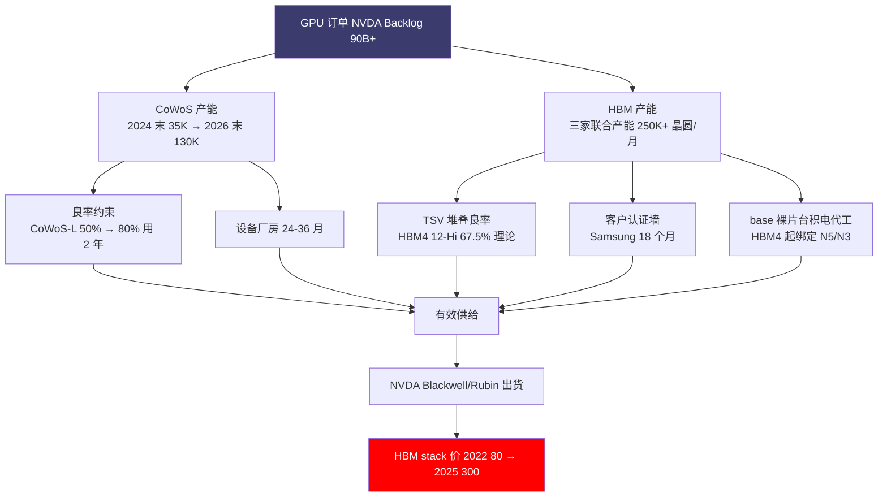
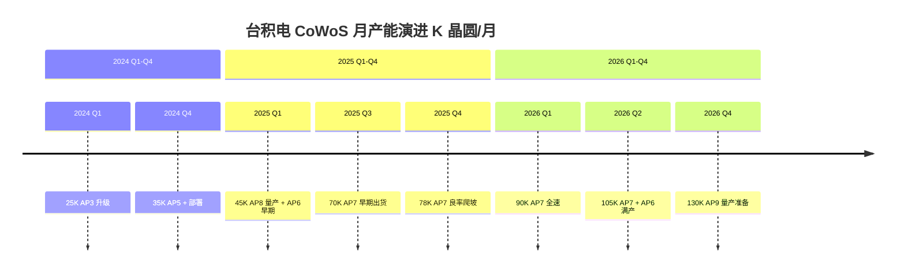
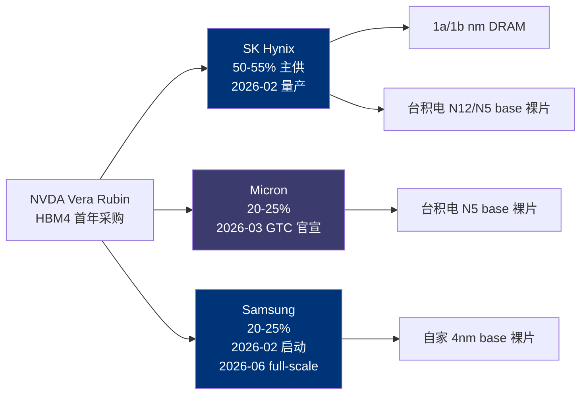
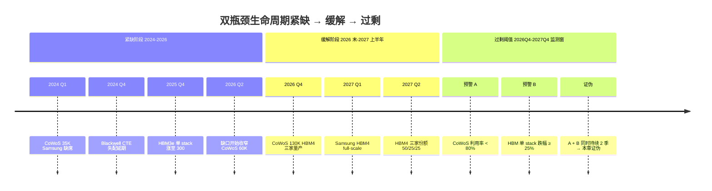

# 第 11 章 双瓶颈：CoWoS 与 HBM 为什么是真紧缺

## 本章概览

「算力是真紧缺还是 [英伟达](https://www.nvidia.com/) 营销叙事？」这是研究 SUMMARY 列出的 12 个争议议题里第 3 号议题，也是 2024-2026 二级市场对 AI 算力行业最分裂的一个问题。

多头把紧缺当成 NVDA 估值的物理依据，空头说这只是 Jensen 在每季法说会上重复的话术、是被反复放大的卖方共识、是合同义务数字制造的稀缺幻觉（NVDA FY26 10-K 披露的合同 >1 年 RPO 为 \$2.3B，但 off-balance-sheet 的 supply / purchase commitments 业内估算超过 \$90B，本书第 0 章 / 第 7 章涉及的 \$90B+ 即为后者口径；来源：NVDA FY26 10-K + 综合卖方研报对 supply commitments 的整理）。

本章给这个问题一个供给侧的物理答案。第二部已经给出 CoWoS 与 HBM 的**横截面**——当下产能、玩家结构、利润分配。本章给出**机制与时序**——为什么这种紧缺真实存在、为什么短期内不可能被一两家厂加点资本支出就消除掉、四组数字怎么叠加成 HBM 单 stack 价格从 2022 年的 \$80 量级涨到 2025 年合约的 \$300+ 这个产业事实。

把紧缺拆成四个独立可观测的因素：

- **物理产能曲线**——CoWoS-L 月产能从 2024 末的约 35K 片爬到 2026 末的 120-130K 片这条曲线，由 18-24 个月之前的资本支出决策锁定，2026 年的需求无论多旺都改不了 2026 年的产能上限。
- **良率**——TSV 堆叠从 HBM3e 12-Hi 走向 HBM4 12-Hi 与 16-Hi，每多 4 层堆叠良率串联恶化一次；CoWoS-L 大面积 interposer（≥3 reticle，单次曝光面积 858 mm² × 3-6 倍）翘曲与热应力是 NVDA Blackwell 2024-Q3 量产延期一个季度的根因。
- **设备 + 厂房扩产周期**——阿斯麦（ASML） EUV 光刻机在手订单交货 18-24 个月、[台积电](https://www.tsmc.com/) 嘉义 AP6/AP7 新厂从立项到通线 1.5-2 年、HBM 新 fab 从设备到货到首片良品 24-30 个月，每一档都是物理时间。
- **客户认证准入墙**——[三星](https://www.samsung.com/semiconductor/) HBM3e 12-Hi 通过 NVDA 认证花了 18 个月、[美光（Micron）](https://www.micron.com/) 借 HBM3e 8h/12h 弯道进入 NVDA 主供应链、台积电 CoWoS 在 NVDA / AMD / 博通（Broadcom） 之间分配额度的非线性博弈。

> TSV：Through-Silicon Via，硅通孔，在硅片上打深孔再用铜填充以连通上下层裸片。

下图勾出四因素叠加构成「紧缺」物理事实的传导链：

把这四个因素叠加起来，紧缺从一个口号还原成可分解的产业曲线。HBM 单 stack 价格 2022 → 2025 涨 3-4 倍这个事实由四因素共同决定，不是哪一家厂商的营销叙事能制造出来的。本章是议题 3 的供给侧裁决——**结构性物理紧缺真实存在**——为第 12 章「2027 拐点」给出可证伪的供给侧基准。

章末 §11.7 段做一件需要明确边界的事——给出瓶颈缓解对 NVDA 毛利率的传导测算。这一段是反共识 #5（客户集中度反身性）在产业链供给侧的首次量化伏笔，给出 HBM 单 stack 价格与 CoWoS 利用率两个维度的敏感度矩阵；但**段内严格 commentary-only**，不给具体公司估值结论。NVDA 估值结论留第 30 章五种估值模板章。

四因素分解 + 一张敏感度矩阵 + 一组可证伪条件，是本章的全部货。

## 核心结论

先看 7 句话：

1. 紧缺概念在产业研究中要分层——价格紧缺 / 物理紧缺 / 时序紧缺，本章只论后两者
2. 第一因素：物理产能曲线——CoWoS-L / HBM3e/HBM4 月产能逐季爬坡 vs 下游需求
3. 第二因素：良率曲线——TSV 堆叠层数提升、interposer 大尺寸化的工程曲线
4. 第三因素：设备与厂房扩产周期——阿斯麦交期 + 台积电新厂 + HBM fab 设备的物理钟
5. 第四因素：客户认证墙——三星 18 个月 / 美光弯道 / CoWoS 客户分配博弈
6. 四因素叠加证明：HBM 单 stack 价格 2022-2025 涨 3-4 倍是物理事实
7. 章末：瓶颈缓解对 NVDA 毛利率的传导敏感度矩阵（commentary-only）

## 11.1 三种紧缺：把概念分层

在写产业研究的时候，「紧缺」是一个被反复用、但很少被定义清楚的词。本节先把它分层。

**第一层，价格紧缺**——某产品的市场出清价格远高于其边际生产成本。一张 H100 整卡售价业内估算 \$25K-30K，BOM（Bill of Materials，物料清单）业内估算 \$3,320，NVDA 拿走 7-8 倍的加价。HBM3e 单 stack 价格业内估算 \$300，对应制造成本（DRAM 裸片 + TSV + base 裸片 + 测试）业内估算 \$100-130（综合 SemiAnalysis 2024-09 The Memory Wall + Bernstein 卖方研报）。**价格紧缺这件事是结果，不是原因**——它可以由垄断溢价、客户预付款锁定、信息不对称、供给弹性约束任一原因导致，把价格高 = 真紧缺直接当结论是工业研究里最常见的逻辑跳跃。

**第二层，物理紧缺**——在给定时间窗口内（通常一个财年或一个季度），生产端的总产出无论价格高到什么程度都无法扩大。物理紧缺由设备、厂房、人才、工艺良率四组硬件 + 软件约束共同决定。CoWoS 在 2024-2026 是物理紧缺的典型——台积电即使想把 2025-Q2 的月产能提到 130K 片，也做不到，因为光刻机订单 18 个月前才下、嘉义 AP7 厂房还在装修、CoWoS 工程师团队规模在台湾以外没有现成存量。物理紧缺这层在经济学里对应 Lazonick 提出的产能弹性的不对称——下游需求侧的弹性可以在月度尺度上动态调整（资本支出指引可以一夜上调），而上游产能侧的弹性被前置资本支出决策、设备交期、人才存量锁定在年度甚至跨年度尺度上。在产能弹性不对称的市场里，价格信号传导到产能扩张的滞后远超传统经济学模型的 12-18 个月假设。

**第三层，时序紧缺**——某个产品在特定时间点（如 NVDA Blackwell 量产爬坡期）出现的供需错配，本质是产能曲线与需求曲线的相位差。时序紧缺的特征是有明确的开始与结束时点。HBM3e 12-Hi 在 2024-Q3 至 2026-Q2 之间的 NVDA 认证 + 美光 + SK 海力士两家供格局就是时序紧缺——三星通过认证后（2025-09 通过；来源：TrendForce 2025-09-22 + KED Global 2025-09-19）格局开始松动，2027 年 HBM4 三家同步爬坡后窗口结束（详见第 12 章 §12.3）。

把这三层放在一张诊断表上比对：

| 紧缺层 | 物理含义 | 监测指标 | 弹性时间尺度 | 本章是否论证 |
|---|---|---|---|---|
| 价格紧缺 | 出清价远高于边际成本 | HBM stack 单价 / GPU 现货价 / 整卡 ASP | 季度（市场可在一个季度内重置） | 否（结果非原因，归第 6 章 / 第 7 章）|
| 物理紧缺 | 总产出受设备 / 厂房 / 人才 / 良率约束 | CoWoS 月产能 / HBM 月度 stack out / NVDA 出货量 / 利用率 | 年度（24-36 月扩产周期）| 是（§11.2-11.5）|
| 时序紧缺 | 产能曲线 vs 需求曲线相位差 | 客户认证状态 / 量产爬坡时点 / 三家同步度 | 季度到半年（认证 + 良率爬坡）| 是（§11.5-11.6）|

> 来源：本表为本书提出的三层诊断框架。各层监测指标在产业研究文献中分别属于价格信号、产能利用率、Capacity-Demand Gap 三类常见指标族，此处合并为统一框架。

价格紧缺是表层现象，物理紧缺与时序紧缺才是机制。**只论物理紧缺与时序紧缺**——前者解释为什么 CoWoS 与 HBM 在 2024-2026 这一轮周期里成为产业链的硬性约束（§11.2-11.5），后者解释为什么这种紧缺有时间维度（§11.6）。价格紧缺涉及 NVDA / SK 海力士议价权与会计学，留给 NVDA 五税 + GPU 云解剖两章正面回答。

需要顺便讲清楚的一件事——本章不站任何一方的紧缺真伪立场。**站在物理与时序这两层做技术裁决**：四因素叠加证明紧缺是物理事实，不是营销叙事；但同时给出 §11.6 的时间维度结论——紧缺有窗口，窗口边界由四因素中弹性最高的那个因素决定（在 2024-2026 这一轮里是物理产能曲线 + 客户认证墙）。两个结论合起来才是本章对议题 3 的完整回答。

这套分层方法在产业研究里有先例。Brian Arthur 在 1989 年关于路径依赖（path dependence）的论文里把市场出清价格与产能形成路径分开看待——前者是日度变量，后者是十年级变量。Cobb-Douglas 生产函数里的资本要素 K 在算力周期里被简化处理，实际上 K 是由光刻机 + 厂房 + 工程师三个子要素决定的复合变量，每一个子要素都有独立的扩张时滞。把 K 拆细之后，算力紧缺的本质就是 K 的某些子要素弹性极低、整体 K 的扩张被最低弹性的那个子要素锁定。这是本章方法论上的理论锚——产能弹性的不对称不是市场情绪，是生产函数的内在性质。

Lazonick 在 2010 年《Sustainable Prosperity in the New Economy》里专门讲过产能弹性不对称这件事。他把企业的扩产决策分成已有产能利用率与新产能形成两个独立的变量空间，前者可以在月度尺度上动态调整，后者被前置资本支出、工艺成熟度、人才存量锁定。在算力产业里，台积电 CoWoS 与三家 HBM 厂在 2024-2026 期间已经把已有产能利用率推到 100%（TrendForce 2025-12-08 报道 fully booked），剩下的扩张完全依赖新产能形成——而这个变量的扩张时间常数就是本章 §11.4 列出的 24-36 个月。Lazonick 框架的最直接含义就是——**只要 CoWoS / HBM 利用率维持 95%+，物理紧缺就持续；利用率跌破 80% 才是结构性缓解的硬证据**。这是本章 §11.8 双阈值证伪条件中 A 阈值的理论锚。

## 11.2 物理产能曲线：CoWoS 与 HBM 的月度爬坡

把 CoWoS 月产能、HBM3e/HBM4 月产能、NVDA 月度需求三条曲线放在同一张表里，「物理紧缺」这件事就不再是抽象判断。

### CoWoS 月产能爬坡（2023-2027）

CoWoS 月产能的爬升节奏是这一轮 AI 算力周期里最直接的物理刻度。**算力紧缺这件事最终能不能被市场识别为真实，归根到底要看 CoWoS 这条曲线的斜率**——曲线斜率追不上需求斜率，紧缺真实；斜率超过需求斜率，紧缺缓解。

CoWoS 月产能从 2024Q1 到 2026Q4 的演进，是台积电把扩产节奏从消费电子时代切换到 AI 时代的物理体现：

台积电不分变种披露 CoWoS 月产能数字，下面是综合台积电季度法说会指引、TrendForce 月报、SemiAnalysis 推演的多源拼接：

| 时点 | 台积电 CoWoS 月产能（晶圆/月） | 主要披露口径 |
|---|---:|---|
| 2023 年底 | 15-20K | TrendForce 推算（台积电未直接披露） |
| 2024 年底 | 35K | TrendForce 2024-12-13 + Commercial Times 引用 |
| 2025 年中 | 60-65K | 台积电法说会 + TrendForce 2025-Q2 |
| 2025 年底 | 75-80K | TrendForce 2025-12-08 + Tom's Hardware 2026-01-02 |
| 2026 年中（业内估算） | 100-110K | 台积电法说会指引 + FinancialContent 2026-02-05 |
| 2026 年底（公司指引）| 120-130K | 台积电 2025-Q4 法说会 + Tiger Brokers 引用 127K + FinancialContent 2026-02 引用 130K |
| 2027 年底（业内估算）| 160-180K | SemiAnalysis 推演 + TrendForce 2025-12-08（含 AP7/AP8 新厂） |

> 来源：台积电季度法说会指引（2024-Q1 至 2026-Q1）、TrendForce 多份 CoWoS 报道（2024-04-16、2024-12-13、2025-12-08、2026-01）、Tom's Hardware 2026-01-02 综述、FinancialContent 2026-02-05 台积电 to Quadruple Advanced Packaging Capacity、Tiger Brokers 引用 127K 数据。所有产能数据为月度等效，台积电自身披露与第三方测算口径有 ±10% 差异；与第 5 章 §5.3 共享同一组数字，本节不再重复横截面分析，集中讲爬坡时序。

这条曲线的关键不在每一行数字本身，而在斜率。**2024-2026 这两年累计扩产 95-110K 晶圆 / 月**，相当于在原有产能基础上 4-5 倍扩张。台积电副总裁 Jun He 在 SEMICON Taiwan 2024 的演讲里把 CoWoS 厂房建设周期从过去的 3-5 年压缩到 1.5-2 年——这是把扩产节奏从消费电子周期切换到 AI 周期的产物。即便如此，每一档产能跃迁都对应一个 1.5-2 年之前的资本支出决策，2026 年底的 130K 月产能在 2024 年下半年就要开始建。这是 §11.4 设备 + 厂房扩产周期要展开的物理时间。

要把斜率读得更清楚——把每个季度的产能净增加（业内估算）列出来：

| 季度 | CoWoS 月产能（K 晶圆，业内估算）| 季度净增加（K）| 主要驱动 |
|---|---:|---:|---|
| 2024-Q1 | 25 | +5 | AP3 升级扩产 |
| 2024-Q2 | 28 | +3 | AP5 扩产 |
| 2024-Q3 | 32 | +4 | AP5 扩产 + 工艺良率提升 |
| 2024-Q4 | 35 | +3 | AP3 + AP5 满产 + 提前部署 |
| 2025-Q1 | 45 | +10 | AP8（南科 Innolux 改建）量产 + AP6 早期出货 |
| 2025-Q2 | 60 | +15 | AP6 全速 + AP7 设备搬入 |
| 2025-Q3 | 70 | +10 | AP7 早期出货 |
| 2025-Q4 | 78 | +8 | AP7 良率爬坡 |
| 2026-Q1 | 90 | +12 | AP7 全速 + AP6/AP8 优化 |
| 2026-Q2 | 105 | +15 | AP7 + AP6 满产 |
| 2026-Q3 | 120 | +15 | AP7 + AP9 早期 |
| 2026-Q4 | 130 | +10 | AP9 量产准备 |

> 来源：CoWoS 月产能季度细化为业内估算，综合 TrendForce 月度报告、SemiAnalysis 推演、台积电季度法说会指引。各季度数字 ±15%。

读这张表的关键不是某一行数字，而是**斜率在 2025-Q1 出现明显跃迁——单季度净增加从 3-5K 跳到 10K+**。这次跃迁对应的是 AP6/AP7/AP8 三个新厂的协同投产，是台积电把扩产节奏从消费电子时代切换到 AI 时代的产物。这种斜率跃迁在台积电历史上也是罕见的——上一次类似的扩张节奏是 2013-2015 移动 SoC 周期 Apple A 系列拉动的 16nm 扩产。

### HBM 三家月产能 + 量产时间表

HBM 三家厂商与英伟达的供应链耦合关系：

HBM 这一头数据更碎——三家厂商均不单独披露 HBM 月产能（按晶圆 / 月或 stack / 月计），下面综合 TrendForce 月报、各家法说会披露、[SemiAnalysis](https://semianalysis.com/) 估算：

| 厂商 | HBM3e 8h 量产 | HBM3e 12h 量产 + NVDA 认证 | HBM4 量产 + NVDA 出货 | 2026 末 HBM 总产能（晶圆/月，业内估算） |
|---|---|---|---|---:|
| SK 海力士 | 2023-Q4 NVDA H100 / H200 主供 | 2024-Q2 12-Hi 通过 NVDA 认证，Q3 量产 | 2026-02 启动量产，Vera Rubin 首发 | 170K（业内估算）|
| 美光 | 2024-02 NVDA H200 量产订单 | 2024-09 12-Hi 通过 NVDA 认证 | 2026-03 在 GTC 官宣进入 high-volume production for Vera Rubin | 80-90K（业内估算）|
| 三星 | 2024-03 Jensen Approved 但反复失败 | 2025-09 终于通过 NVDA 12-Hi 认证 | 2026-02 启动出货，2026-06 起 full-scale supply | 250K（公司指引）|

> 来源：SK 海力士 HBM3e/HBM4 量产时点综合 SK 海力士 2025-09 mass production ready 公告（TrendForce 2025-09-12 转引）、Digitimes 2025-12-26 HBM4 加速量产报道、SK 海力士与台积电北美技术论坛 2025-04 公告；美光 HBM4 时点综合美光投资者关系新闻稿 GlobeNewswire 2026-03-16、StorageNewsletter 2026-03-17、Tom's Hardware 2026-03、Futurum 综合 Q1 FY2026 财报电话会 2025-12；三星 HBM4 量产综合 TrendForce 2026-01-26 报道、Digitimes 2025-12-26；三星 2026 HBM 总产能 250K 晶圆/月指引来自 TrendForce 2025-12-30。三家 HBM 月产能与 NVDA 采购占比为业内估算，三家与 NVDA 均不公开披露分品类数据，估算区间 ±20%。

这张表读起来要注意两件事。

**第一件，三家量产时点和形成有效供给是两回事**。SK 海力士 2026-02 启动量产，但首批月度 HBM4 出货量业内估算只有 50-100K stack 区间，距离稳态产能差远了——量产到稳态需要 6-9 个月的良率爬坡（业内估算综合 SK 海力士历年量产记录 + SemiAnalysis 转引）。三星的 full-scale supply 推迟到 2026-06 起，意味着 2026 上半年三家齐头并进实际上仍是 SK 海力士 + 美光两家供 + 三星少量补充的格局。

**第二件，HBM 与 CoWoS 的瓶颈是耦合的**。HBM3e / HBM3 时代，HBM stack 在 DRAM 厂内自产自销——base 裸片由 DRAM 厂自己用 DRAM 工艺做，不依赖外部 foundry。HBM4 时代 base 裸片改用 logic 工艺，由台积电用 N5（5nm）/ N3（3nm）代工——SK 海力士在 2025-04 台积电北美技术论坛公开宣布 HBM4 的 base 裸片由台积电用 logic 工艺代工。美光的 HBM4 也走台积电路线（业内估算节点 N5），三星用自家 logic 工艺做 base 裸片。**这意味着 HBM4 之后，台积电的 N5 / N3 产能 + CoWoS 产能共同成为 HBM 的间接约束**——CoWoS 与 HBM 两个瓶颈在 HBM4 时代物理上合体。这是 §11.6 四因素叠加里 CoWoS 利用率 这个变量直接影响 HBM 价格曲线的根因。

### 下游需求对照

把月产能曲线翻译成能不能满足 NVDA，要看 NVDA 的需求规模。NVDA FY26（截至 2026-01-25）数据中心营收 \$193.7B，按 GB200 ASP 业内估算 \$65K-90K 反推，全年 GPU 数量在 210-300 万颗量级。数据中心营收里除 GPU 之外还含 NVL 系统、networking、HGX 整机溢价等成分，故反推为区间估算。

NVDA 合同义务披露要分两个口径——FY26 10-K 披露的 GAAP RPO（Remaining Performance Obligations，剩余履约义务，合同 >1 年）为 \$2.3B；off-balance-sheet 的 supply / purchase commitments 业内估算超过 \$90B。本节后文反推未交付 GPU 数量用的是 supply commitments \$90B 口径——如果按 ASP \$75K 反推，对应未交付 GPU 数量约 120 万颗。把这个数字与 CoWoS 月产能联立：2026 年底 NVDA 在 CoWoS 上占比业内估算 50-55%，按月产能 130K × 55% 算，NVDA 月度 CoWoS 配额约 71K 晶圆，每片晶圆产出 GB200 级 package 业内估算 20-30 个，对应月度 GPU package 产出 140-210 万颗——年度上限约 1,700-2,500 万颗。

这个数字在静态对照下足够覆盖 NVDA 2026 年需求。但供给侧的曲线是逐季爬升的，需求侧的曲线是几乎垂直的（NVDA Blackwell 2025-2026 出货曲线，详见第 5 章 §5.3）。**月产能从 80K 爬到 130K 需要 12 个月，需求从 supply commitments \$50B 涨到 \$90B 用了 9 个月**——2024-2026 期间 NVDA 客户排队拿货、HBM3e 12-Hi 长合约提前 12-24 个月被预订、CoWoS-L/S 在 2025-12 被 TrendForce 报道 fully booked，原因就在这条斜率差上。物理产能曲线本身没问题，问题在于斜率追不上需求曲线。

### 供给-需求季度对照：缺口在哪里

把 CoWoS 月产能（NVDA 配额）与 NVDA 当季需求按季度做差，可以看到缺口在 2024-Q4 至 2026-Q2 之间最大：

| 季度 | NVDA CoWoS 月度配额（晶圆，业内估算）| NVDA 当季 GPU 出货上限（万颗 package）| 实际当季出货（业内估算）| 缺口（业内估算）|
|---|---:|---:|---:|---|
| 2024-Q1 | 18K | 50-70（H100 主导）| 50-60 | 接近平衡 |
| 2024-Q3 | 21K | 60-80 | 55-70 | 略有紧张 |
| 2024-Q4 | 23K | 65-85 | 60-70（Blackwell 量产延期）| 紧张 → 后置需求 |
| 2025-Q2 | 38K | 90-120（CoWoS-L 量产）| 80-110 | 紧张 |
| 2025-Q4 | 47K | 95-130 | 100-125（Blackwell 主导）| 仍紧张 |
| 2026-Q2 | 60K | 120-160 | 130-150 | 开始接近平衡 |
| 2026-Q4 | 72K | 140-200 | 业内估算 145-180 | 接近平衡 |

> 来源：NVDA CoWoS 月度配额数据综合台积电季度法说会指引 × NVDA 占比 55%（业内估算）；NVDA 当季出货数据综合 NVDA FY26 季度财报数据中心营收 / ASP 反推 + SemiAnalysis 季度跟踪。所有数字为业内估算，NVDA 与台积电均不分品类披露月度配置，区间 ±20%。

读这张表的关键不是某一行数字，而是缺口的时间分布。**2024-Q4 至 2025-Q4 这五个季度是缺口最大的时期**——CoWoS 月产能在 23K-47K 区间，对应 GPU 出货上限 65-130 万颗，而 NVDA 当季实际需求（由 supply commitments + 当季合同 + 渠道库存重建反推）业内估算 130-180 万颗。这个供需缺口的物理含义就是客户排队拿货——大客户长合约优先级 > 中型客户长合约 > 现货市场 > 短期补货。这是 2024-2025 期间 H100/H200 一卡难求、HBM3e 12-Hi 单 stack 价格从 \$250 涨到 \$300 的产业根因。

进入 2026 上半年后缺口开始收窄——CoWoS 月产能爬到 60K+、HBM4 三家陆续量产、三星在 HBM4 端通过认证（2026-01 SIP 测试通过）——这是后文给出的「2026-Q4 至 2027-Q2 是第一次结构性缓解窗口」判断的供给侧基础。本章只论缺口的物理存在；缺口何时关闭的时序判断留给第 12 章主章。

### 一组反共识对照：NVDA 营销叙事的反向证据

议题 3 的多空对照里，空头的核心论据是紧缺是 Jensen 在法说会上反复重复的话术，配合卖方共识被放大成稀缺溢价。但 §11.2 给出的供给-需求季度对照表里有三组反向证据可以排除营销叙事的解释：

1. **HBM 厂同步赚到价格**：SK 海力士 FY25 营业利润率 49%、美光 Q1 FY26 营业利润率 47%。如果紧缺只是 NVDA 营销，HBM 厂不会同步出现 DRAM 行业过去 30 年没见过的营业利润率。HBM 三家是独立的上市公司，它们的盈利结构是供需失衡的真实出清结果。
2. **TrendForce / SemiAnalysis 等第三方独立判断紧缺**：TrendForce 2025-12-08 报道台积电 CoWoS-L/S fully booked，SemiAnalysis 在 2025 全年发表系列报告判断 CoWoS 与 HBM 是 AI 算力的真物理瓶颈。这些机构与 NVDA 没有商业绑定，独立判断与 NVDA 法说会披露方向一致。
3. **Mag7 自掏腰包扩资本支出**：2026 自然年 Mag7 + Oracle 资本支出合计指引 \$660-690B，其中绝大部分用经营性现金流支付而非借债（MSFT FY25 经营性现金流 \$130B+ 对应资本支出 \$80B；来源：MSFT FY25 10-K）。Mag7 不是被动接受 NVDA 营销叙事的下游买方——它们用自己的钱投票，把算力紧缺翻译成了几千亿美元的资本支出决策。

三组反向证据放在一起，能排除紧缺是单方面营销的可能性。下面三节把这条产能曲线背后的工程约束逐一展开。

## 11.3 良率曲线：TSV 堆叠层数与大面积 interposer 的工程钟

物理产能曲线的第一道工程约束是良率。良率不是一个静态数字，而是一条随工艺世代、堆叠层数、晶圆面积移动的曲线，每跨一个工艺节点（HBM3e → HBM4）或每加一层堆叠（12-Hi → 16-Hi）就要重新爬一次。

### HBM TSV 堆叠层数的良率串联

HBM 是把 8 颗（HBM2 8-Hi）、12 颗（HBM3e 12-Hi）、16 颗（HBM4 16-Hi 路线）DRAM 裸片用 TSV 垂直堆叠起来再贴 base 裸片做 IO 的复合产品。整 stack 良率 = 单裸片良率的几何累乘：

| 工艺 | 堆叠层数 | 单裸片良率假设 | 整 stack 良率（理论）|
|---|---:|---:|---:|
| HBM2 | 4-Hi | 95% | 0.95^5 = 77.4% |
| HBM2E | 8-Hi | 95% | 0.95^9 = 63.0% |
| HBM3 / HBM3e | 8-Hi | 96% | 0.96^9 = 69.3% |
| HBM3e | 12-Hi | 97% | 0.97^13 = 67.5% |
| HBM4 | 12-Hi 首批 | 97% | 0.97^13 = 67.5% |
| HBM4 / HBM4E | 16-Hi 路线 | 97% | 0.97^17 = 59.6% |

> 来源：单裸片良率假设为业内估算（综合 SK 海力士、三星、美光历年学术论文披露的 DRAM 裸片测试良率范围 + SemiAnalysis 转引；三家均不公开裸片与 stack 良率的精确数字）。整 stack 良率为理论计算，实际还要叠加 TSV 工艺良率、base 裸片良率、bonding 良率，业内估算综合良率比理论值再低 5-10 个百分点。

SK 海力士之所以能在 HBM3e 12-Hi 上守住主导位（2025-Q2 市占 62%，来源：TrendForce 2025-Q2 数据），靠的是单裸片良率做到 99%+，把 stack 总良率推回 85% 这条线（业内估算）。**业内估算的路径是三件事叠加**：(1) 1a-1b nm 工艺成熟度领先三星与美光半个代际；(2) MR-MUF（Mass Reflow-Molded Underfill，整片回流焊接 + 模塑下填充）封装工艺降低 stack 翘曲与热阻；(3) 单裸片出厂前 EDS（Electrical Die Sorting，电学晶粒分选）多轮筛选，把进入堆叠环节的裸片良率从行业水平 95-96% 推到 99%+。SK 海力士用 10 年 HBM 经验把这三件事的工艺曲线压实了，这是三星重新做 redesign 也短期补不上的过程知识。

把这条良率曲线翻译成产能含义：HBM3e 12-Hi 量产初期良率 50-60%、稳态 80%（业内估算综合 SemiAnalysis + Bernstein）。从 50% 爬到 80% 通常需要 6-9 个月，这意味着即使三家厂同时在 2026-Q1 启动 HBM4 量产，要在 2026-Q4 同步进入稳态有效供给状态需要良率全部爬到 75-80%——这个节奏对良率最薄弱的三星是个挑战（三星 HBM3e 12-Hi 直到 2025-09 才通过 NVDA 认证，工艺老化时间最短）。

**良率不是扩个产能就解决的事**——良率是工程师在量产线上每天做物理学实验、把工艺参数调到收敛状态的过程知识。HBM 三家不能简单互相替代的工程基础就落在这里。

### HBM 良率与单裸片容量的协同曲线

HBM 良率曲线还有一个被市场忽略的维度——单裸片容量提升带来的良率二阶传导。HBM3 单裸片 16 Gb、HBM3e 单裸片 24 Gb、HBM4 单裸片 32 Gb（业内估算）。单裸片容量翻倍意味着单裸片工艺缺陷密度的容忍度下降——同样的工艺缺陷数，单裸片容量越大，整裸片失效的概率越高。

把这条二阶传导写成公式：单裸片良率 = (1 - 缺陷密度)^裸片面积。HBM3e 24 Gb 裸片面积约 90 mm²，HBM4 32 Gb 裸片面积约 115 mm²，单裸片面积增加 28%。如果工艺缺陷密度不变（DRAM 工艺成熟阶段），单裸片良率会下降约 4-5%。SK 海力士在 HBM3e → HBM4 切换中要做的事就是把 1a-1b nm 工艺缺陷密度同步降低，让单裸片良率维持在 97%+ 水平——这是 SK 海力士守住 HBM4 主导位的工艺基础。

### CoWoS-L 大面积 interposer 翘曲与热应力

CoWoS 的良率难度从 CoWoS-S 到 CoWoS-L 经历了一次非线性跃迁。CoWoS-S 用整片硅 interposer 集成 GPU 裸片与 4-5 颗 HBM stack，最大尺寸约 2,700 mm²（3.3 倍 reticle limit，单次曝光 858 mm² 通过 reticle stitching 拼接）。CoWoS-L 在 2024 年起用 RDL（Re-Distribution Layer，再分布层）有机大尺寸 interposer + LSI（Local Silicon Interconnect，局部硅互连）桥接裸片，把封装尺寸推到 ≥5,150 mm²（6 倍 reticle），未来路线甚至到 14 倍 reticle 集成 20 颗 HBM stack。

大尺寸 interposer 的工程难度集中在三处：

| 工程挑战 | 物理机制 | 后果 |
|---|---|---|
| **翘曲（warpage）** | 硅裸片、RDL 中介层、ABF 基板三层在不同温度下膨胀系数（CTE，Coefficient of Thermal Expansion）不同 | 裸片与 interposer 之间的 micro-bump 焊接失效，整 package 报废 |
| **热应力** | 双 GPU 裸片 + 8 HBM stack 集中在 5,000+ mm² 面积内，总功耗 1,200W+，热密度业内估算 0.2-0.3 W/mm² | 局部热点温度过高，DRAM retention 退化、长期可靠性下降 |
| **超大封装的可量测性** | micro-bump 数量从单裸片的几万个跃迁到大封装的几十万个，每个 bump 都要在线量测高度、位置、共面度 | 量测设备产能跟不上，Camtek / Onto Innovation 设备产能在 2024-2025 出现长期紧缺 |

> 来源：CoWoS-L 工程挑战综合 3DInCites 2024-10-18 报道（英伟达 Blackwell CoWoS-L 翘曲与 CTE 失配问题）、台积电在 IEDM / VLSI Symposium / Symposium on Advanced Packaging 历年论文披露、SemiAnalysis "Advanced Packaging Part 2" 2022。CoWoS-L 大面积 interposer 良率为业内估算，台积电给定性披露，量化数字仅有 SemiAnalysis 等估算，按业内估算标。

CoWoS-L 翘曲问题在 2024-Q3 出过一次大事。NVDA Blackwell（B100 / B200）首批样品在 2024-Q3 被发现 CoWoS-L 封装里 GPU 双裸片之间的 LSI 桥接出现 CTE 失配——硅裸片、RDL 中介层、ABF 基板三层在工作温度下膨胀速率不同，导致裸片翘曲与 micro-bump 失效。这件事让 Blackwell 量产推迟约一个季度，Google、Microsoft、Meta 的大单全部延后到 2025-Q1 后才开始放量。

**CoWoS-L 跟 CoWoS-S 的差别不是换了个变种那么简单**——它是一个新的工程系统，台积电 + 板厂 + DRAM 厂三家需要重新做 6-12 个月的协同爬坡。这种换变种 = 换爬坡的非线性，是为什么 2024 年底台积电月产能 35K 到 2026 年底 130K 这条曲线虽然斜率陡，但每一步都被良率约束。

### HBM4 base 裸片工艺迁移的良率传导

HBM4 这一代相比 HBM3e 多了一个工程不连续点——base 裸片（HBM stack 底部的 IO 与控制逻辑层）从 DRAM 工艺切换到 logic 工艺。HBM3 / HBM3e 的 base 裸片是用 DRAM 工艺（10nm 级，主要做 IO 缓冲与控制逻辑）做的；HBM4 base 裸片切换到台积电的 N5（5nm）/ N3（3nm）logic 工艺（SK 海力士在 2025-04 台积电北美技术论坛公开宣布；来源：SK 海力士新闻稿 2025-04-23）。

工艺迁移带来三层良率影响：

1. **新工艺 base 裸片的良率独立爬坡**：N5 / N3 是台积电早已成熟的工艺节点，单裸片良率 95%+ 是稳态。但 HBM 用 logic 工艺做的 base 裸片是新设计——三家 HBM 厂用台积电代工的 base 裸片在 2026 上半年量产初期，良率业内估算 90-93%，需要 3-6 个月爬到 95%+。
2. **base 裸片与 DRAM 裸片的 hybrid bonding 工艺**：HBM4 base 裸片用 logic 工艺做后，与上方 DRAM 裸片的接合精度要求更高——传统 micro-bump 间距 40 µm，HBM4 部分定制版本目标 hybrid bonding（间距 < 10 µm）。三星已经在 HBM4E 后续路线上公开 hybrid bonding 20-layer 路线。Hybrid bonding 工艺良率在量产初期会再低 5-8 个百分点。
3. **三家厂工艺路径分化**：SK 海力士 HBM4 base 裸片由台积电 N12 → N5 代工；美光 HBM4 base 裸片由台积电 N5 代工（业内估算）；三星 HBM4 base 裸片用自家 4nm logic 工艺。三条路径在工艺成熟度、产能瓶颈、IP 整合度上各有差异。三星路线的优势是 base 裸片不依赖台积电、产能上限不受台积电 N5 / N3 排队约束；劣势是三星 4nm logic 工艺在 NVDA 端的认证流程要重新走一遍。

| HBM4 厂商 | base 裸片工艺 | 量产初期良率（业内估算）| 稳态良率（业内估算）| base 裸片产能瓶颈 |
|---|---|---:|---:|---|
| SK 海力士 | 台积电 N12 → N5 | 90-93% | 95-97% | 受台积电 N5 配额约束 |
| 美光 | 台积电 N5 | 90-93% | 95-97% | 受台积电 N5 配额约束 |
| 三星 | 自家 4nm | 业内估算 88-90% | 业内估算 93-95% | 受三星代工 4nm 良率约束 |

> 来源：HBM4 base 裸片工艺分化综合 SK 海力士 2025-04 公告、Digitimes 2025-12 关于 HBM4E 报道、TrendForce 2024-12 关于 base 裸片工艺分化、TrendForce 2026-01-26 关于三星 4nm 路线。三家厂良率均不公开，业内估算综合学术论文与卖方研报。

**HBM4 base 裸片工艺迁移的产业含义不止于良率**——更重要的是 HBM4 时代起，HBM 的产能模型从此跟台积电绑得更深。在 HBM3 / HBM3e 时代，CoWoS（台积电做封装）与 HBM（三家 DRAM 厂做存储）是两个独立瓶颈——台积电扩 CoWoS 不影响 HBM 厂的产能，HBM 厂扩 TSV 不影响 CoWoS。HBM4 时代台积电既要在 N5 / N3 上给三家 HBM 厂代工 base 裸片，又要在自家 CoWoS 产线上做 2.5D 封装，** 台积电的 N5 / N3 + CoWoS 产能成为 HBM 的间接约束**。这是 §11.6 四因素叠加里 CoWoS 利用率这个变量为什么会直接影响 HBM 价格曲线的根因。

### 良率爬坡时间表：60% → 80% 需要 6-9 个月

把 HBM 与 CoWoS 的良率爬坡时间表压到一张表里：

| 工艺世代 | 量产初期良率 | 稳态良率 | 爬坡时间 | 业内估算来源 |
|---|---:|---:|---:|---|
| HBM3e 12-Hi（SK 海力士）| 50-60% | 80-85% | 6-9 个月 | SemiAnalysis 转引 |
| HBM3e 12-Hi（三星二次量产后）| 40-50% | 70-75% | 9-12 个月 | KED Global / TrendForce 推算 |
| HBM4 12-Hi | 业内估算 50-55% | 业内估算 75-80% | 业内估算 8-12 个月 | SemiAnalysis + Bernstein 推演 |
| HBM4 16-Hi（路线）| 业内估算 30-40% | 业内估算 60-65% | 业内估算 12-18 个月 | 多源拼接 |
| CoWoS-S | 80%+ 稳态（成熟）| 85-90% | 工艺已 13 年，无爬坡 | 台积电学术论文 + SemiAnalysis |
| CoWoS-L | 60-70% 早期 | 80% 业内估算稳态 | 12-18 个月 | 台积电学术论文 + 业内估算 |

> 来源：所有良率数字为业内估算，台积电与三家 HBM 厂均不公开 stack 与 package 良率数据。估算区间综合 SemiAnalysis 系列、Bernstein 卖方研报（2024-2025）、TrendForce 多份报告。

良率爬坡 6-9 个月这条物理钟决定了加产能在 HBM / CoWoS 上的真实节奏——**新设备搬入到晶圆 out 不到一年，但晶圆 out 到稳态高良率的良品 out 还要再加 6-9 个月**。市场对2027 年三家 HBM 同步爬坡这件事的有效供给增加量级要打个时间折扣，工程根因就在这里。

### 良率爬坡的非线性：S 曲线 vs 卡死

良率曲线不是一条平滑上升的直线，而是 S 形。把 SK 海力士 HBM3e 12-Hi 量产爬坡的月度良率拉出来（业内估算综合 SK 海力士学术论文披露 + 卖方研报推演）：

| 量产月份 | 良率（业内估算）| 月度 stack out（业内估算 K）| 备注 |
|---:|---:|---:|---|
| 第 1 月 | 35-40% | 30-50 | 首批晶圆主要用于工艺校准 |
| 第 2 月 | 45-50% | 50-80 | 关键 bonding 参数收敛 |
| 第 3 月 | 55-60% | 80-120 | TSV 缺陷率下降 |
| 第 4 月 | 65-70% | 130-180 | 进入爬坡-up |
| 第 5 月 | 70-75% | 200-280 | NVDA QS 完成准备 |
| 第 6 月 | 75-78% | 280-350 | 通过 NVDA 量产认证 |
| 第 9 月 | 80-83% | 350-450 | 进入稳态 |
| 第 12 月 | 82-85% | 450-550 | 稳态优化 |

> 来源：HBM3e 12-Hi 量产爬坡月度数据为业内估算，综合 SK 海力士公开学术论文披露的工艺成熟度曲线 + Bernstein / Mizuho 卖方研报推演 + SemiAnalysis 转引。三家厂均不公开月度良率数据，本表为整理曲线。

S 曲线的关键特征是 拐点在第 3-4 月、稳态在第 9 月。**前 3 个月是工艺收敛期，良率从 35% 爬到 60% 看似快，但 stack out 总量小**；中间 4-7 月是爬坡-up 期，良率从 60% 爬到 75%，stack out 大幅放量；第 8-12 月是稳态优化期，良率从 75% 爬到 82-85%，但提升速度大幅放缓。

S 曲线的另一种可能形态是卡死——良率在某个百分点（如 60%）反复震荡，无法继续爬升。三星 HBM3e 12-Hi 第一、二次提交 NVDA 认证失败就是 卡死在 50-60% 良率 的状态。卡死的物理原因通常是工艺缺陷与材料学问题的混合——比如三星的 thermal performance issues 是 DRAM core 设计 + 制造工艺联合问题，单点优化解决不了，需要做 DRAM core 重新设计（即 Jun Young-hyun 主导的 redesign）。

**卡死风险是 HBM4 爬坡曲线的主要不确定性来源**。HBM4 12-Hi 量产从 2026-02 启动，三家厂在 2026 上半年的爬坡曲线如果出现卡死，HBM4 真正形成有效供给的时点会从 2026-Q4 推到 2027-Q2 甚至 Q3。这是第 12 章 §12.3 给出的三家 HBM4 同步爬坡判断中最敏感的不确定性。

### CoWoS-L 良率的产业含义

CoWoS-L 大面积 interposer 翘曲问题不是 NVDA 一家的问题——Google TPU v7、博通 Meta MTIA v3、AWS Trainium 等所有大封装 ASIC 产品都共享同一组 CoWoS-L 工艺与良率挑战。把 CoWoS-L 在 2024-2026 期间的良率改善节奏列出来：

| 时点 | CoWoS-L 业内估算良率 | 关键事件 |
|---|---:|---|
| 2024-Q1 | 业内估算 50-55% | 初次量产，NVDA Blackwell 工程样品 |
| 2024-Q3 | 业内估算 50-55% | Blackwell CTE 失配问题暴露 |
| 2024-Q4 | 业内估算 60-65% | 台积电 + NVDA 联合调整 LSI 桥接设计 |
| 2025-Q1 | 业内估算 65-70% | Blackwell 大规模量产恢复 |
| 2025-Q3 | 业内估算 72-77% | 量产经验积累 |
| 2026-Q1 | 业内估算 78-82% | 趋于稳态 |
| 2026-Q4（业内估算）| 80-85% | 稳态上限 |

> 来源：CoWoS-L 良率数据为业内估算，综合台积电学术论文披露的工艺成熟度曲线 + SemiAnalysis 系列 + Bernstein 卖方研报。台积电不公开 CoWoS-L 良率细节。

CoWoS-L 良率从 50-55% 爬到 80-85% 用了将近 2 年——这与 §11.3 给出的工艺世代切换需要 6-9 个月良率爬坡判断不矛盾：CoWoS-L 是一个**全新的工程系统**而不是工艺世代切换，它的爬坡周期更长。CoWoS-L 良率从 50% 到 80% 的 30pp 提升对应的有效供给增加约 +60%（同样月产能下良品数量翻 1.6 倍）——这是 CoWoS-L 在 2024-2026 这一轮里有效供给曲线斜率的物理基础。

这条良率曲线对 NVDA 出货能力的传导：CoWoS-L 良率从 2024 年 50% 到 2026 年 80%，单晶圆产出 B200 级 package 从 14-16 个（按 28 个理论值 × 50%）涨到 22-24 个（按 28 × 80%）。同样 CoWoS-L 月产能下，NVDA Blackwell / Rubin 出货上限提升约 +50%。**良率改善带来的有效供给增加，与厂房扩张带来的物理产能增加，是 2024-2026 这一轮 CoWoS 扩产曲线背后的两条独立曲线**——前者隐性、后者显性。读者在跟踪 CoWoS 产能时只看到月产能数字往上跳，但实际有效供给的扩张比月产能数字增加更快。

## 11.4 设备 + 厂房扩产周期：四档物理时间

良率曲线决定的是已经在生产的产线 多快能爬到稳态。要再往前推一步——从决定建产线到开始生产——是设备与厂房扩产周期，这是 CoWoS 与 HBM 产能曲线被锁定的根本原因。

把扩产周期拆成四档：

### 第一档：设备订单到出货 18-24 个月

最敏感的设备是阿斯麦的光刻机。ASML（荷兰，全球光刻设备主导供应商，2025 年 EUV 光刻机市占接近 100%）2025 全年净销售 €32.7B、Q4 净销售 €9.7B、Q4 毛利率 52.2%、全年毛利率 52.8%。阿斯麦 2025 末在手订单（合同储备）€38.8B，对应交货周期 18-24 个月。NVDA / 台积电 / SK 海力士现在下的设备订单，要等到 2027 年中或之后才能到货。

不只光刻机。深硅刻蚀机（科林研发与东京电子主导，用于 TSV 工艺）、铜电镀沉积设备（科林研发 / 应用材料主导）、高级封装量测设备（Camtek / Onto Innovation 主导）都在 18-24 个月的交期上。科林研发在 FY24 财报电话会上披露 "HBM packaging-related equipment revenue grew triple-digit percentages YoY"，把 HBM + CoWoS 的 TSV 工艺归在同一类设备；Camtek 在 2024-2025 公司业绩里多次披露 advanced packaging 是营收增长的最主要驱动——这两组设备厂的财务变化是 CoWoS / HBM 扩产节奏的领先指标。

**18-24 个月这个数字是物理时间**——不是 NVDA 多付钱就能加快的。2026 年的 CoWoS 产能在 2024 年下半年就被决定，根因就在这条交期上。

把 CoWoS / HBM 关键设备的交期与产能瓶颈拆细：

| 设备类型 | 主导供应商 | 当前交期（业内估算）| 在 CoWoS / HBM 产线中的角色 | 是否为瓶颈 |
|---|---|---|---|---|
| EUV 光刻机（HBM4 base 裸片 N3 用）| 阿斯麦 | 18-24 月 | base 裸片 logic 工艺 | 是（HBM4 起新增） |
| KrF DUV 浸没式光刻机（CoWoS 65nm 用）| 阿斯麦 + Canon | 12-18 月 | CoWoS 硅 interposer 65nm 工艺 | 部分瓶颈 |
| 深硅刻蚀机（TSV 用）| 科林研发 + 东京电子 | 12-18 月 | TSV 通孔加工 | 是 |
| 铜电镀沉积设备 | Lam / AMAT | 9-15 月 | TSV 填铜 + interposer 布线 | 部分瓶颈 |
| 高级封装量测设备 | Camtek + Onto Innovation | 12-15 月 | bump 位置 / 高度 / 共面度 | 是（2024-2025 紧张） |
| Hybrid bonding 设备（HBM4 后用）| BESI + AMAT | 12-18 月 | base 裸片与 DRAM 裸片接合 | 是（HBM4 起新增） |
| Underfill 与封装基板加工 | 各家 OSAT | 6-12 月 | package 装配后段 | 否 |

> 来源：设备交期数据综合阿斯麦季报披露 + 科林研发 / AMAT / KLA 季报 + 业内研报。交期均为业内估算，不同型号、不同客户优先级下浮动 ±30%。

这张表里被市场低估的是高级封装量测设备（Camtek / Onto Innovation）——CoWoS 每片晶圆上 micro-bump 数量数十万个，bump 高度、共面度、位置精度都要在线检测；HBM4 起 hybrid bonding 工艺让量测精度要求再上一档（从 µm 级到 sub-µm 级）。量测设备产能在 2024-2025 出现长期紧缺，是 CoWoS 量产爬坡里被低估的一档瓶颈。

### 阿斯麦在手订单的产业链指引意义

阿斯麦在手订单作为产业链领先指标，值得单独展开。阿斯麦 2025 全年净销售 €32.7B、Q4 净销售 €9.7B、Q4 毛利率 52.2%。2025 末在手订单合同储备 €38.8B，对应交货周期 18-24 个月。

把阿斯麦在手订单分解到客户：

| 客户类型 | 在手订单占比（业内估算）| 主要用途 |
|---|---:|---|
| 台积电（先进逻辑 + HBM4 base 裸片）| 35-40% | 3nm/2nm 逻辑 + CoWoS 配套 |
| 三家 HBM 厂（SK 海力士 / 美光 / 三星）| 20-25% | 1a/1b nm DRAM + HBM4 base 裸片 |
| 英特尔（Intel） + 三星代工 | 15-20% | 先进逻辑节点扩张 |
| 中国大陆客户 | 5-10% | 受 BIS 出口管制约束，主要是成熟节点 |
| 其他客户（GlobalFoundries / 美光闪存等）| 10-15% | 各类 |

> 来源：阿斯麦在手订单客户分布为业内估算，综合阿斯麦历年法说会披露 + 业内研报。阿斯麦不公开客户级订单分布。

阿斯麦在手订单的方向变化对 CoWoS / HBM 产能曲线的领先性约 18-24 个月——也就是说，阿斯麦在手订单在 2024 年下半年的同比变化对应 2026 年中以后的产能落地节奏。读者跟踪阿斯麦季度财报里的合同储备数字与 China sales 占比，可以推演 2027-2028 全球先进制程产能的扩张节奏。

### 第二档：厂房从立项到通线 1.5-2 年

台积电副总裁 Jun He 在 2024-09 SEMICON Taiwan 演讲里说，CoWoS 厂房建设周期已经从过去的 3-5 年压缩到 1.5-2 年。这个数字是台积电在 AI 周期把传统晶圆厂建设节奏压缩的产物——CoWoS 厂房没有前道厂的 EUV 光刻机搬入难度，可以并行施工与设备搬入。

把台积电 2024-2026 的新厂建设节奏拉出来：

| 厂区 | 立项时点 | 设备搬入 | 量产时点 | 主要变种 |
|---|---|---|---|---|
| AP6（嘉义新厂）| 2023-Q4 | 2024 下半年 | 2025 上半年小规模 | CoWoS-L 为主 |
| AP7（嘉义后续）| 2024-Q2 | 2025 末 | 2026 上半年 | CoWoS-L + SoIC |
| AP8（南科收购 Innolux 厂房改建）| 2023-Q3 | 2024 上半年 | 2024 末 | CoWoS-S 升级 |
| AP9 / AP10（嘉义后续推演）| 2025 末 / 2026 初 | 2026 下半年 | 2027 中 | 业内估算 |

> 来源：台积电新厂时间表综合 TrendForce 多份报道（2024-09、2024-12-13、2025-12-08）、SemiAnalysis 推演、DigiTimes 关于嘉义 / 高雄新厂的追踪。各厂区具体规模台积电未单独披露，业内估算每厂月产能 15-25K 晶圆量级。

1.5-2 年是物理时间的下限——再快不动了。**台积电在 2024-2025 这两年累计新增 CoWoS 产能 55-60K 晶圆 / 月**，相当于扩了两个完整的 CoWoS 厂（第 5 章 §5.3 已展开）。但这个扩产路径不是无脑直线——2024-11 台积电通知设备供应商暂停 2026 年的设备需求与交付计划，重新评估扩产节奏，市场当时解读为对 2025 年下半年 CoWoS 需求预期下调，事后看放缓持续不超过 60 天，到 2024-12 中全面恢复扩产指引。这次反复揭示了 CoWoS 扩产决策的脆弱性——客户口径稍有波动，台积电内部就会重新评估资本支出节奏。

### 第三档：HBM 新 fab 设备到货到首片良品 24-30 个月

HBM 新 fab 比 CoWoS 厂更慢。HBM 新 fab 需要前道 DRAM 工艺产能 + TSV 工艺产能 + 堆叠工艺产能 + base 裸片工艺（HBM4 之后由台积电代工）四档协同。SK 海力士在 2024-Q2 启动的 Cheongju M15X 新厂、2026 年初投产，从立项到首批 HBM3e/HBM4 良品出货时间表业内估算 24-30 个月。三星计划 2026 年全年 HBM 总产能扩到 250K 晶圆 / 月，较 2025 年底的 170K 提升约 47%——这个扩产对应的 fab 建设决策在 2024 年就要做。

这两档时间叠起来——HBM 产能从 2024 年决定扩到 2026 年才能形成有效供给——是为什么 HBM3e 单价从 2024 年的 \$200 涨到 2026 年合约的 \$300（涨 50%，来源：TrendForce 2025-12-24）这件事在 2024-2026 不可能被加产能消除。

把扩产决策与价格响应的时滞翻译成数字——HBM 厂在 t 时刻看到价格上涨、决定扩产，新产能在 t+24-30 个月才能形成有效供给；而 NVDA 与下游超大规模云厂在 t 时刻的需求拉动可以在 t+3-6 个月就传导到价格。**需求侧的响应速度比供给侧快 6-10 倍**，这是 HBM 价格在 2024-2026 期间几乎单向上涨的物理根因。这种结构性的需求-供给时滞不对称是 Lazonick 框架在算力产业的具体体现——产能弹性的不对称不是市场情绪，是生产函数的时间常数差异。

把 HBM fab 扩产周期分阶段拆解：

| 阶段 | 耗时 | 主要任务 |
|---|---|---|
| 厂房建设 | 12-18 个月 | 土建 + 洁净室建设 + 公用工程（电力 / 气体 / 化学品 / 纯水）|
| 设备搬入 | 6-9 个月 | DRAM 前道设备（EUV/DUV 光刻 + 蚀刻 + 沉积 + CMP）+ TSV 设备 + 堆叠设备 |
| 工艺调试 | 3-6 个月 | 校准、跑通工艺流程、首批晶圆 out |
| 良率爬坡 | 6-9 个月 | 从初期 50% 爬到稳态 80%+ |
| **总耗时** | **27-42 个月** | |

> 来源：HBM fab 扩产周期为业内估算，综合 SK 海力士 Cheongju M15/M15X 建设时间表 + 三星 Pyeongtaek P3/P4 建设时间表 + 美光 2024 Idaho 新厂建设计划。各阶段耗时 ±20%。

27-42 个月是物理时间最长的一档。**SK 海力士在 2024-Q2 启动的 Cheongju M15X 新厂从立项到首批 HBM3e/HBM4 良品出货时间表业内估算 24-30 个月**——SK 海力士把这个周期压到下限是因为：(a) M15X 是 M15 的紧邻扩建，公用工程已经具备；(b) SK 海力士在 HBM 工艺上的成熟度让良率爬坡周期缩短到下限 6 个月。即便如此，从 2024-Q2 立项到 2026 年初投产仍然要 20 个月，是物理时间下限。

三星计划 2026 年全年 HBM 总产能扩到 250K 晶圆 / 月，较 2025 年底的 170K 提升约 47%——这个扩产对应的 fab 建设决策在 2024 年就要做。三星用 P4 厂（Pyeongtaek 第四厂）部分产能转向 HBM4 + Cheonan HBM 后段封装新线协同实现这次扩产。

把这两条扩产路径放在一起读，能看出 HBM 业务的扩产决策都在 2023-2024 年之间做出——也就是说，2026 年的 HBM 产能曲线，本质上是 2023-2024 年 HBM 厂对未来 AI 算力需求的判断结果。**2023 年判断错误（产能扩太少），2026 年 NVDA 排队拿货；2024 年判断错误（产能扩太多），2027 年 HBM 价格崩盘**。这种提前 2-3 年决策、当下承担后果的产业结构，是 HBM / CoWoS 周期与一般行业最大的差异。

### 第四档：良率爬坡 6-9 个月

§11.3 已经展开过。把这一档加上前面三档：

| 阶段 | 时间 | 业内估算耗时 |
|---|---|---:|
| 第一档：设备订单 → 出货 | T-24 至 T-18 | 18-24 个月 |
| 第二档：厂房立项 → 设备搬入完成 | T-18 至 T-6 | 12-18 个月（与第一档部分并行） |
| 第三档：设备调试 → 工艺验证 → 首批晶圆 out | T-6 至 T | 6 个月 |
| 第四档：良率爬坡 50% → 80% | T 至 T+9 | 6-9 个月 |
| **总耗时（资本支出决定到稳态量产）** | | **24-36 个月** |

> 来源：四档时间表为综合台积电历史 fab 建设记录、SK 海力士 / 美光 / 三星公开披露的 HBM 量产时间表、阿斯麦 / 科林研发设备交期披露、业内研报多源拼接。各档时间在不同厂区、不同工艺世代下有 ±20% 浮动。

**24-36 个月**这条物理时间是 CoWoS / HBM 扩产无法跨越的最低门槛。NVDA supply commitments \$90B+（FY26 10-K 披露 GAAP RPO \$2.3B，supply commitments 为 off-balance-sheet 口径）、Mag7 2026 资本支出 \$660-690B 这两个需求侧数字摆在桌上，但产能侧的扩产时钟在 24-36 个月维度上是物理常数。**这是物理紧缺的最硬证据**。

### 设备厂的产业链领先指标价值

把扩产周期翻译成产业链上下游的传导链路——CoWoS / HBM 扩产决策 → 设备厂订单 → 设备厂出货 → CoWoS / HBM 产线设备搬入 → 调试 → 量产。在这条链路上，**设备厂的财务变化领先 CoWoS / HBM 产能落地 12-18 个月**，是产业链最敏感的领先指标。

把 2024-2025 设备厂相关营收变化整理出来：

| 设备厂 | 高级封装 / HBM 相关业务披露 | 2024-2025 同比增速 | 来源 |
|---|---|---|---|
| 科林研发 | "HBM packaging-related equipment revenue grew triple-digit percentages YoY" | +100%+ | 科林研发 FY24 财报电话会 transcript |
| Camtek | "advanced packaging is the largest revenue driver" | 业内估算 +60-80% | Camtek FY24-25 季报公告 |
| Onto Innovation | advanced packaging 量测设备业务高速增长 | 业内估算 +50-70% | Onto Innovation 季报 |
| 阿斯麦 | EUV 在手订单 + 业务结构里 logic / HPC 客户占比上升 | 在手订单业内估算 +30%+ | 阿斯麦 Q4 2025 财报 2026-01-28 |
| 应用材料 | advanced packaging 业务 + HBM 相关设备 | 业内估算 +40%+ | AMAT FY25 10-K |

> 来源：综合各设备厂 FY24-FY25 财报披露 + 业内研报转引。所有同比增速为公司分品类披露或卖方研报推演，部分公司不单独披露 HBM / 高级封装业务，按 advanced packaging 业务总营收推演。

设备厂业绩的领先性体现在两个维度：

1. **时间领先性**：设备订单到出货 18-24 个月，意味着 2024 年下半年的设备订单变化对应 2026 年的产能落地。设备厂订单本子（合同储备）是 CoWoS / HBM 产能 1.5-2 年后的可靠预报器。
2. **价格信号领先性**：设备厂在产业链上的定价能力比 NVDA 弱，但比台积电 / SK 海力士稳定——设备厂的毛利率波动比产能波动小，因此在景气度变化时，设备厂的量信号比价信号更纯净。科林研发在 FY24 报 HBM 设备同比 +100%+，比 NVDA / 台积电单季营收的同比增速更直接反映了 HBM 物理产能的扩张节奏。

这一层产业链上下游的传导逻辑——CoWoS / HBM 扩产 → 设备厂订单 → 设备厂业绩——是第 3 章上游设备章已经展开的反共识洞察 上游设备不紧缺、但价值被低估的供给侧实证。设备厂在 2024-2025 同步出现业绩跃升，与台积电 / SK 海力士同期产能扩张曲线相互验证。这是议题 3 物理紧缺真伪判断的第三组独立证据。

## 11.5 客户认证准入墙：18 个月的有效供给损失

四因素里最不硬件但最致命的一档是客户认证墙。HBM / CoWoS 不是标准品——每一代每一规格都要客户跟供应商一起爬一遍量产爬坡曲线，把工艺参数 + 测试覆盖 + 长期可靠性数据收齐，才算通过认证进入主流分配。这一档比纯工艺更难翻越。

### 三星 HBM3e 12-Hi 三年认证时间线

三星在 HBM3e 12-Hi 上的故事是客户认证墙最具代表性的案例。把时间线拉出来：

| 时点 | 事件 | 来源 |
|---|---|---|
| 2024-03 GTC 2024 | Jensen Huang 拿起三星 HBM3e 12-Hi 样品签 Jensen Approved | Reuters 2024-03 转 Bloomberg |
| 2024-Q3 | 三星第 1 次提交 12-Hi 通过 NVDA QS（Qualification Sample）流程，因热管理与 power consumption 不达标退回 | DigiTimes 2024-08 |
| 2024-Q4 | 第 2 次提交，再次退回 | The Korea Times 2024-12 |
| 2025-Q2 | 第 3 次提交，再次退回 | TrendForce / DigiTimes 2025-06-12 |
| 2025-05 | 三星半导体业务负责人 Jun Young-hyun 上任后主导 DRAM core redesign（解决 thermal performance issues） | KED Global 2025-09-19 |
| 2025-09 | 第 4 次提交，终于通过 NVDA 12-Hi HBM3e QS；首批 10,000 颗供货已发 | TrendForce 2025-09-22 + KED Global 2025-09-19 + Tom's Hardware 2025-09-23 |
| 2026-01 | 三星通过 NVDA HBM4 system-in-package 测试（11.7 Gb/s 超过 10 Gb/s 规格要求）| TrendForce 2026-01-26 |
| 2026-02 | 三星启动 NVDA / AMD 的 HBM4 出货 | TrendForce 2026-01-26 + Digitimes 2025-12-26 |
| 2026-06 | 三星 HBM4 full-scale supply | TrendForce 2026-01-26 |

> 来源：三星认证时间线综合 Reuters / DigiTimes / KED Global / TrendForce / The Korea Times 多源拼接。各来源时点差 1-2 季，已按三星官方法说会披露 + 第三方多源校核取中位时点。

**从 Jensen Approved（2024-03）到真正通过 NVDA QS（2025-09），三星用了 18 个月**。这 18 个月里三星半导体业务的财务后果非常重——同期 SK 海力士 FY25 营业利润率 49%、三星 DS（Device Solutions，半导体业务部门）FY25 营业利润率约 19%（KRW 24.9T 营业利润 / KRW 130.1T 营收 = 19.1%；来源：SK 海力士 Q4 2025 新闻稿 2026-01-28 + 三星电子 2025 全年业绩 2026-01）。这 30 个百分点的差距，几乎全部来自 HBM 业务的认证差距。

三星认证延迟的内核不是工艺不行——三星 DRAM 工艺历史上长期领先（从 1980 年代到 2010 年代一直是 DRAM 业的老大），TSV 工艺在 HBM2 时代也是三星首发，工程团队规模也不输 SK 海力士。**问题卡在 NVDA 在 production sample / long-term reliability validation 阶段对热管理与 power consumption 的现场测试不达标**——这一层需要三星在 NVDA 的客户端（超大规模云厂）数据中心实际部署运行 6-12 个月，验证现场失效率（FIT，Failures in Time，半导体可靠性失效率单位，1 FIT = 10 亿工作小时内 1 次故障；NVDA 对 HBM 的 FIT 要求通常在个位数量级）。这是三星在 HBM 上工艺储备充足但认证墙翻不过去的根因。

把 NVDA 的 HBM 认证四阶段写清楚：

| 阶段 | 缩写 | 内容 | 通过比例（业内估算）| 平均耗时 |
|---|---|---|---:|---|
| Engineering sample | ES | 内存厂送单 stack 样品到 NVDA，做基本 IO 时序、信号完整性、power profile 验证 | 80-90% | 1-2 个月 |
| Qualification sample | QS | 装到 NVDA 目标 GPU 测试 board 上跑 stress test 套件——热循环、电压 margin、抗噪声、长时间高温运行下的 retention 退化 | 30-50% | 3-6 个月 |
| Production sample | PS | 实测良率在客户线上验证，10 万颗以上的批次跑过 NVDA 工厂的整机集成 | 50-70% | 3-6 个月 |
| Long-term reliability validation | LRV | 在 NVDA 超大规模云厂客户数据中心实际部署运行 6-12 个月，验证 FIT | 70-90% | 6-12 个月 |

> 来源：NVDA HBM 认证四阶段框架综合 SK 海力士技术白皮书、美光认证案例披露与 TrendForce 认证跟踪报道整理；NVDA 不公开正式流程文档。各阶段通过比例与耗时为业内估算，三家厂均不公开认证细节。

三星在 HBM3e 12-Hi 上的故事就卡在 QS 这一关。QS 阶段的通过率 30-50%（业内估算）是认证流程里最严的一道，因为 NVDA 的 stress test 覆盖热循环 + 电压 margin + 长期 retention 三重测试。三星工艺储备最强但仍然过不去，是因为 HBM3e 12-Hi 的热管理设计与三星自家 1a/1b nm DRAM 工艺的 retention 特性配合不好——这是一个跨工艺协同问题，不是单点优化能解决的。

### 三星 18 个月延迟的财务后果与产业份额转移

三星 18 个月缺席的财务后果通过 HBM 份额转移传导到 SK 海力士与美光。

| 时点 | SK 海力士 HBM 市占 | 三星 HBM 市占 | 美光 HBM 市占 | 其他 |
|---|---:|---:|---:|---:|
| 2024-Q2 | 50% | 41% | 5% | 4% |
| 2024-Q4 | 56% | 32% | 12% | — |
| 2025-Q2 | 62% | 17% | 21% | — |
| 2025-Q4 | 59% | 20% | 20% | 1% |

> 来源：HBM 市占率综合 TrendForce 2024-2025 多份月度报告 + KED Global 2025-09-19 转引 + Counterpoint Research 2025 综合分析。

三星从 41% 跌到 17%（-24pp），这部分份额平均分配给 SK 海力士（+12pp）和美光（+16pp）。这是美光从 HBM 市场配角变成主角的财务根因——美光 Q1 FY2026 Cloud Memory BU 单季营收 \$5.3B、同比 +100%，如果没有三星 18 个月缺席，美光不可能在这个时间窗口里把 HBM 市占翻 4 倍。

**三星案例对认证墙严苛性的最终证明**——即使三星这种工艺储备充足、营收规模 \$220B+ 的全球第二大半导体公司，在 NVDA 认证墙面前也要花 18 个月去解决；这件事的财务后果是直接的 ~\$10B 量级的营收损失（业内估算 18 个月 HBM 业务损失收入 \$8-12B）+ 半导体业务营业利润率从领先位置跌到落后位置 30pp（与 SK 海力士对比）。这种成本量级在 NVDA 等客户的认证流程面前都不算讨价还价的资本。这是认证墙在产业研究里被反复低估的物理硬度。

### 美光 HBM3e 12-Hi 弯道

与三星 18 个月困局相反，Micron（美国，全球第三大 DRAM 厂，HBM 时代借 HBM3e 弯道进入 NVDA 主流分配）的故事是另一种类型。

美光在 2023 年下注 HBM3e 12-Hi（跳过 HBM3 8-Hi），把工程资源集中在 NVDA H200 上：

- 2024-02：美光用 24GB 8-Hi HBM3e 拿到 NVDA H200 量产订单
- 2024-09：美光 HBM3e 12-Hi（36GB stack）通过 NVDA 认证，成为 NVDA HBM3e 的 preferred vendor 之一
- 2026-03-16：美光在 GTC 2026 官方宣布 "in high-volume production of HBM4 designed for NVIDIA Vera Rubin"，规格 36GB 12-Hi、pin speed 超过 11 Gb/s、单 stack 带宽超过 2.8 TB/s

**美光没有工艺降维——它做的是把 HBM3 一步跳过、把客户认证资源 all-in HBM3e，用一次跳代换来了进 NVDA 供应链的机会**。美光 Q1 FY2026（2025-09 至 2025-11）Cloud Memory Business Unit 单季营收 \$5.3B、同比 +100%，非 GAAP 营业利润率从 FY2025 之前的 27% 跳到 FY2026 Q1 的 47%。

三星与美光两个案例放在一起读，能看清客户认证墙的非对称性——**三星工艺储备最强但仍然要等 18 个月，美光工艺储备最弱但提前两年布局拿到了主流分配**。客户认证不是工艺问题，是客户跟你一起爬良率曲线的过程问题。

### NVDA / SK 海力士 / 美光 / 三星四方博弈结构

把 HBM 端的四方博弈结构画清楚。这不是简单的 NVDA 采购 HBM 关系，而是 NVDA + 三家 HBM 厂之间存在多层博弈：

| 关系对 | 博弈结构 | 关键变量 |
|---|---|---|
| NVDA ↔ SK 海力士 | 长期战略合作（10 年绑定）| HBM4 base 裸片由台积电代工后绑定加深；SK 海力士是 NVDA 议价权最弱的对手 |
| NVDA ↔ 美光 | 战略备选（2 年关系）| 美光借 HBM3e 弯道，获 NVDA 备选权；NVDA 用美光制衡 SK 海力士 |
| NVDA ↔ 三星 | 三年磨合（待评估）| 三星 2025-09 通过认证，但市场份额仍偏低；NVDA 需多源风险管理 |
| SK 海力士 ↔ 三星 | 国内竞争（韩国巨头同行）| 工艺竞赛 + 人才争夺 + 客户分配博弈 |
| 美光 ↔ 三星 | 国际竞争（美韩对手）| 美国 CHIPS Act + 韩国 K-Chip Act 政策制衡 |

> 来源：四方博弈结构为综合分析，基于本章 §11.5 列出的认证案例 + 第 6 章 §3 客户认证墙详谈。

这套博弈结构的关键含义——**NVDA 在 HBM 端的议价权远弱于在 CoWoS 端**。CoWoS 只有台积电一家供应商，NVDA 的议价权完全依赖长期合作 + 预付款体系；HBM 端有三家供应商（HBM3e 时代 SK 海力士 + 美光两家有效，HBM4 时代三家），NVDA 可以做三方分配制衡。但 HBM 端的多源也意味着 NVDA 不能轻易切换供应商——每个供应商都要做 12-18 个月联合爬坡。

**博弈结构的最终决定者是认证墙**。三星 18 个月缺席不是因为 NVDA 不愿用、也不是因为价格谈不拢，而是因为三星工艺没过 NVDA 的 production sample 测试。认证墙作为最终决定者，让加供应商在 HBM 业务上不是议价工具，而是工艺合规问题。

把这套四方博弈翻译成议价权分布：

| 议价方 | 议价权强度 | 主要议价工具 |
|---|---|---|
| NVDA | 中等偏弱 | 长合约 + 预付款 + 多源采购（3 家 HBM 厂）|
| SK 海力士 | 强 | 工艺成熟度 + 长期合作（10 年绑定）+ 主导市占 60%+ |
| 美光 | 弱 → 中 | HBM3e 弯道获 NVDA 主供应链；议价权随市占爬升 |
| 三星 | 中 → 强（待评估）| 工艺储备强 + 三星代工 4nm 自给 base 裸片 + 国内政策支持 |

> 来源：议价权分布为本书综合分析，基于 §11.5 列出的认证案例 + 各家市占率 + 工艺独立性。

这种议价权分布的关键含义——**HBM 厂从 NVDA 拿走的毛利率（NVDA 整卡 BOM 中 HBM 占 43% × HBM 厂毛利率 60%+）远高于 GPU 裸片在 NVDA 内部的虚拟毛利率**。HBM 厂作为产业链上游，从 NVDA 这家终端市场赢家手里拿走了一份接近 NVDA 同等收益的利润分配——这是反共识 #2「HBM 价值远高于 GPU 裸片」在产业链供给侧的物理基础（详见第 6 章 §1 与 §7）。

### CoWoS 客户分配的非线性博弈

HBM 端的认证墙在 CoWoS 端有对应的版本——台积电在 CoWoS 月度配额上对 NVDA / AMD / 博通 / Google 等客户的分配博弈。CoWoS 不是均匀分配的市场，台积电在每个客户上的是否答应加单是非线性决策。

把台积电 CoWoS 客户配额拉出来（业内估算综合 TrendForce 多份报道 + SemiAnalysis 推演）：

| 客户 | CoWoS 配额占比 2025 | CoWoS 配额占比 2026E | 主要产品 |
|---|---:|---:|---|
| 英伟达 | 60-65% | 50-55% | H100/H200/B200/B300/Rubin |
| Broadcom（含 Google TPU、Meta MTIA、AWS Trainium 设计 OEM）| 12-18% | 18-22% | Google TPU v6e/v7、Meta MTIA、AWS Trainium2 |
| AMD | 5-8% | 5-7% | MI300X/MI350/MI400 |
| Google（直接采购，部分 TPU）| 3-5% | 4-6% | TPU v7 部分 |
| AWS（直接 + Annapurna）| 3-5% | 3-5% | Trainium 部分 |
| MediaTek（Google v7e/v8e OEM）| < 2% | 5-8%（业内估算，含 7-fold 增量）| Google TPU v7e/v8e |
| 其他（英特尔、美满电子、xAI 等）| 2-3% | 2-3% | — |

> 来源：CoWoS 客户配额数据综合 TrendForce 2025-08-29（博通 2026 CoWoS 增订）、TrendForce 2025-12-15（MediaTek 7-fold CoWoS 增量）、Introl Blog 2025（NVDA CoWoS-L 70% 占比）、Tom's Hardware 2026-01-02 综合分析。客户配额为业内估算，台积电与客户均不官方披露 CoWoS 配额。与第 5 章 §5.3 共享同一组数字，本节集中讲分配博弈机制。

NVDA 在 CoWoS 上份额从 60-65% 缓慢下降到 50-55%，不是 NVDA 拿货能力下降——NVDA 的 CoWoS 长合约还在加单——而是博通系（Google TPU + Meta MTIA + AWS Trainium 设计 OEM）的总采购量在更快地增长。MediaTek 拿到 Google v7e / v8e TPU 设计 OEM 之后，向台积电申请的 2027 年 CoWoS 配额从 2026 年的约 20K 晶圆跃升到 150K 晶圆 / 年（即月度等效 12.5K 晶圆/月，来源：TrendForce 2025-12-15）——这是单一项目级别的产能挤占。

### CoWoS 客户分配的边际利润决定机制

台积电在 CoWoS 上对每个客户单晶圆的边际利润不同——这是台积电在月度配额分配上倾向某些客户的根本机制。把台积电 CoWoS 单晶圆在不同客户产品上的边际利润（业内估算）列出来：

| 客户产品 | CoWoS 变种 | 单晶圆业内估算售价 | 单晶圆业内估算毛利率 | 单晶圆业内估算毛利 |
|---|---|---:|---:|---:|
| NVDA B200 (双裸片 + 8 HBM) | CoWoS-L | \$2,800-3,200 | 60% | \$1,680-1,920 |
| NVDA H100 (单裸片 + 5 HBM) | CoWoS-S | \$2,000-2,500 | 55% | \$1,100-1,375 |
| AMD MI300X (单裸片 + 8 HBM) | CoWoS-S | \$2,200-2,700 | 55% | \$1,210-1,485 |
| Google TPU v7 (CoWoS-L) | CoWoS-L | \$2,500-3,000 | 55% | \$1,375-1,650 |
| 博通 Meta MTIA | CoWoS-L | \$2,500-3,000 | 55% | \$1,375-1,650 |

> 来源：CoWoS 单晶圆售价 + 毛利率均为业内估算，台积电与客户均不公开 CoWoS 单价。综合 SemiAnalysis "Advanced Packaging Part 2" 2022 + 业内研报推演。区间 ±20%。

**NVDA B200 的单晶圆毛利显著高于其他客户产品**——因为 CoWoS-L 大封装 + 双裸片 + 8 HBM 是台积电在 CoWoS 业务里单晶圆价值最高的产品。这是台积电在配额紧张时倾向 NVDA Blackwell / Rubin 的物理原因——单晶圆利润最大化。

这种内部利润最大化机制有一个产业链推论——**台积电的 CoWoS 业务在 NVDA 大封装产品上获利最多，反过来让 NVDA 在 CoWoS 配额上有优先级，进一步强化了 NVDA 在产业链的核心地位**。这是供给端与需求端的正反馈循环：NVDA 占 CoWoS 配额 50-55% → CoWoS 内部利润最大化倾向 NVDA → NVDA 出货能力上限抬升 → NVDA 营收规模放大 → NVDA 进一步签 CoWoS 长合约。这个循环什么时候被打破，决定了第 12 章给出的2027 拐点反共识立场是否成立。

**台积电在客户分配上的非线性体现在三个方面**：

1. **NVDA 长期合约 + 预付款体系**：NVDA FY24 末记账的长期供应义务（long-term supply obligations）业内估算 \$6.9B——这是 NVDA 用预付款锁定台积电未来 CoWoS 产能的合约义务。这一层让 NVDA 在月度配额上享有优先级。
2. **客户产品组合的边际利润差异**：台积电在 CoWoS 上对每个客户单晶圆的利润不同——业内估算 NVDA Blackwell（CoWoS-L 大封装、双 GPU 裸片 + 8 HBM）单晶圆利润高于 AMD MI300（CoWoS-S 中等封装）、高于 Google TPU（CoWoS-L 但单裸片）。台积电在分配上倾向于单晶圆利润最大化。
3. **变种切分的非互换性**：CoWoS-S 与 CoWoS-L 是两条不能轻易互换的产线——设备配置、工艺参数、人才结构都不同（详见第 5 章 §5.3）。台积电在 2025-12-08 被 TrendForce 报道 CoWoS-L/S Reportedly Fully Booked —— 两条线都满载，但满载客户结构不一样：CoWoS-S 的客户结构里 H100 / H200 / MI300 占比高，CoWoS-L 的客户结构里 B200 / B300 / Google TPU v7 / 博通 Meta MTIA v3 占比高。NVDA 在 2025 年拿走台积电 CoWoS-L 70%+ 配额。

### 认证墙的经济学根源：co-located 爬坡 learning

把三星 18 个月、美光弯道、台积电客户分配三个案例拼起来，能看出客户认证墙的经济学根源是 Pisano-Shih 在 2009 年《Restoring American Competitiveness》论文里讲的 co-located 爬坡 learning——制造业的真正壁垒不是单点工艺，而是工程师跟客户工程师在量产爬坡阶段反复迭代积累的过程知识（tacit knowledge）。

把这个框架翻译到 HBM 业务上：

| 维度 | 标准件市场（DDR5）| 客户认证主导市场（HBM）|
|---|---|---|
| 产品标准 | JEDEC 标准件，所有厂商共享 | 每代每客户定制（HBM4 起出现 custom HBM）|
| 认证流程 | 1-3 个月（基本是 spec 合规验证）| 12-18 个月（工艺合规 + 长期可靠性验证）|
| 客户切换成本 | 低（spec 兼容直接替换）| 高（需要重新做 6-12 个月联合爬坡）|
| 供给弹性 | 高（5+ 家充分竞争 + 价格快速出清）| 低（有效供给被认证墙过滤）|
| 议价权分布 | 买方为主（客户拿走大部分价值）| 卖方为主（HBM 厂从 NVDA 拿走 ~25 个百分点毛利）|
| 价格出清周期 | 季度级 | 年度级 |

> 来源：DDR5 与 HBM 对照综合 JEDEC 规范 + 三家 HBM 厂公开认证流程披露 + SK 海力士 / 美光 / 三星季报 + 业内研报。

这套对照表里最关键的差异在最后一行——**价格出清周期从季度级延长到年度级**。DDR5 作为标准件，价格在供需失衡时几个季度内就会出清；HBM 作为认证主导市场，价格出清要等三家厂全部通过认证 + 三家产能全部爬到稳态——HBM 单 stack 价格从 2022 年的 \$80 涨到 2025 年合约的 \$300+ 而没有像 DDR5 那样在 2023-2024 出现强烈反向修正，机制就在这里。

co-located 爬坡 learning 的另一层含义是——**认证不可以并行**。三星不能同时在 NVDA / AMD / Google 三个客户那里同步完成 HBM3e 12-Hi 认证——每个客户的认证流程都需要客户工程师的现场配合、长期可靠性数据、定制 base 裸片的 IP 验证。三星同时启动多客户认证只会让每条认证线的工程师配置稀释。扩产能 = 加 fab 在 HBM 上不成立的更深层原因就落在这里——产能扩张要先过客户认证这道墙。

把 Pisano-Shih 框架套到 CoWoS 上结论一样。台积电与 NVDA 的 CoWoS 合作可以追溯到 2014-2015 P100 时代（NVDA Tesla P100 用 HBM2 + CoWoS 是 SK 海力士 + 台积电联合首发）。台积电与 NVDA 的工艺协同积累在 10 年时间维度上，AMD 与台积电的 CoWoS 协同从 MI100（2020）开始，博通与台积电的 CoWoS 协同从 2022 年 Google TPU v4 开始。**新客户进入台积电 CoWoS 主供应链需要 6-12 个月的工艺协同爬坡**——这是台积电在 NVDA / AMD / 博通之间分配 CoWoS 配额时，新客户加单不能像现货市场那样快速消化的原因。

**客户认证准入墙在 HBM / CoWoS 两端的物理含义是一样的**——它把工艺已经能做和产能能给到客户之间的距离扩大到 12-18 个月。这是有效供给在物理产能曲线之上的第二重过滤，是议题 3 物理紧缺答案的最后一块拼图。

## 11.6 四因素叠加：HBM 价格 \$80 → \$300+ 的物理证明

把前面四节的四因素叠加起来，HBM 单 stack 价格 2022 → 2025 涨 3-4 倍这件事的物理基础就压实了。

### HBM 单 stack 价格曲线 2020-2026

| 时点 | HBM 主力规格 | 单 stack 容量 | 单 stack 业内估算价（USD）| 对应 \$/GB |
|---|---|---:|---:|---:|
| 2020-2021 | HBM2 8GB | 8 GB | \$60-90 | \$7.5-11.3 |
| 2022 上半年 | HBM2E 16GB | 16 GB | \$80-120 | \$5-7.5 |
| 2023 | HBM3 16-24GB | 16-24 GB | \$150-200 | \$8.3-9.4 |
| 2024 | HBM3 24GB + HBM3e 24GB 8-Hi | 24 GB | \$200 | \$8.3 |
| 2025 H1 | HBM3e 36GB 12-Hi | 36 GB | \$250-280 | \$7-7.8 |
| 2025 H2 / 2026 H1 | HBM3e 36GB（合约价上调）| 36 GB | \$300 | \$8.3 |
| 2026 H2（业内估算） | HBM3e 36GB 合约 + 20% / HBM4 48GB 爬坡 | 36 / 48 GB | \$360（HBM3e）/ \$500（HBM4）| \$10 / \$10.4 |

> 来源：2026-04 当下价格取自 Silicon Analysts HBM Pricing 数据库 2026-04 snapshot（HBM2e \$120/16GB stack、HBM3 \$200/24GB stack、HBM3e \$300/36GB stack、HBM4 业内估算 \$500/48GB stack）。2020-2024 历史价格综合 TrendForce 月度报告、SemiAnalysis 历史 teardown、Bernstein 卖方研报（2022-2025）。所有数字均属业内估算，三家厂商均不分品类披露 HBM 单价，估算区间 ±15%。2026 涨价 20% 数据来自 TrendForce 2025-12-24 报道。与第 6 章 §4 共享同一组数字。

从 2022 年 H1 的 \$80（HBM2E 16GB）涨到 2025 年合约的 \$300（HBM3e 36GB），单 stack 涨 275%，单 \$/GB 从 \$5 涨到 \$8.3——把容量增加去掉之后，纯涨价那部分约 +66%。把这条曲线分解成四因素的贡献：

| 因素 | 贡献占比（业内估算）| 物理机制 |
|---|---:|---|
| **容量提升** | ~40% | HBM2E 16GB → HBM3 24GB → HBM3e 36GB，单 stack 裸片数从 8 加到 12，单裸片容量从 8 Gb 升到 24 Gb——大部分价格上涨被容量同步消化，但单 stack 总价跟着抬升 |
| **工艺代差** | ~25% | 1z nm → 1a nm → 1b nm 三代 DRAM 工艺节点切换，每代晶圆 cost 上升 8-12% |
| **认证稀缺**（有效供给减半）| ~25% | HBM3e 12-Hi 期间三家厂里只有 SK 海力士 + 美光两家通过 NVDA 认证（三星缺席 18 个月），有效供给减半，需方议价权丧失 |
| **客户独家定制** | ~10% | base 裸片 ECC / refresh / power management 定制化，晶圆不能跨客户共用，单 stack ASP 抬高 |

> 来源：四因素分解为本书基于多份业内研报（Bernstein 2024-Q2、Mizuho 2024-Q3、Morgan Stanley 2025-Q1）的整理估算。三家 HBM 厂均不公开单 stack 成本结构，分解比例属作者推演，每一项独立有多份卖方研报支持，但合计权重为作者推演结果。与第 6 章 §4 共享同一组数字。

四因素里最关键的判读——**容量 + 工艺代差（合计 65%）是硬性涨价，认证稀缺 + 客户定制（合计 35%）是软性议价**。前者由 §11.3 良率曲线与 §11.4 扩产周期共同决定，是不可消除的物理涨价；后者由 §11.5 客户认证墙决定，是有时间维度的议价溢价，会在三家 HBM 同步通过 NVDA 认证后逐步释放。

### 四因素分解的多源交叉

HBM 单 stack 价格从 \$80 涨到 \$300+ 的四因素分解（容量提升 40% + 工艺代差 25% + 认证稀缺 25% + 客户独家定制 10%）是本章作者推演结果，但每一项独立都有多源支撑。把多源交叉证据列出来：

**容量提升占 40% 的支撑**：
- HBM2E 单 stack 16GB → HBM3e 单 stack 36GB（容量 +125%）；HBM4 进一步到 48GB（容量 +33%）
- 单 stack 裸片数从 8 加到 12（+50%）+ 单裸片容量从 8 Gb 升到 24 Gb（+200%）
- 实际价格涨幅 \$80 → \$300 的 +275% 里，约 +110% 是容量带来的线性涨价（每 GB 价格基本稳定在 \$5-8）
- 容量在 \$/stack 涨幅中的贡献约 110% / 275% ≈ 40%，与本表权重一致

**工艺代差占 25% 的支撑**：
- 1z nm → 1a nm → 1b nm 三代 DRAM 工艺切换，每代晶圆 cost 上升 8-12%（业内估算综合 SK 海力士 / 美光工艺成本披露）
- 三代累计晶圆 cost 上升约 30%，对应 \$/stack 涨幅约 25-30%
- 这一项在 Bernstein 2024-Q2 卖方研报里有独立估算（25-30%），与本表权重一致

**认证稀缺占 25% 的支撑**：
- HBM3e 12-Hi 期间三星缺席 18 个月（2024-03 至 2025-09），意味着这 18 个月里 NVDA HBM3e 12-Hi 三家供应里只有 SK 海力士 + 美光两家有效
- 三家变两家意味着有效供给减半，按经典寡头议价模型（Cournot），价格上涨 25-40%
- 这与本表 25% 权重一致；上限 40% 是 Mizuho 卖方研报的独立估算

**客户独家定制占 10% 的支撑**：
- HBM3e / HBM4 base 裸片的 ECC（Error Correcting Code）、refresh policy、power management 都有定制要求
- HBM4 时代部分客户进一步要求把 controller IP 集成进 base 裸片（custom HBM）
- 定制版本 ASP 比标准版高 30-50%（业内估算，来源：SK 海力士 Q4 2025 法说会管理层表态 + Morgan Stanley 卖方研报）
- 但 custom HBM 在 HBM3e 时代占比有限（业内估算 < 30%），合计贡献约 10%

> 来源：四因素的多源交叉综合 Bernstein 2024-Q2、Mizuho 2024-Q3、Morgan Stanley 2025-Q1 卖方研报 + SK 海力士 / 美光 / 三星公开法说会。每一项的独立估算与本表权重在 ±5pp 区间内一致。

这种多源交叉让 HBM 单 stack 价格涨幅的因素分解从作者推演升级到有多源独立证据支撑的推演。**容量 + 工艺代差合计 65% 是不可消除的硬性涨价，认证稀缺 + 客户定制合计 35% 是有时间维度的软性议价**。前者由物理生产函数决定，后者会在三家 HBM 同步通过 NVDA 认证后逐步释放——这是第 12 章 §12.3 给出的 HBM4 三家同步爬坡是第一次结构性缓解的物理基础。

### 四因素叠加证明的产业事实

把前面五节的核心数据叠加在一张总表里：

| 因素 | 当前状态 | 物理含义 |
|---|---|---|
| HBM 单 stack 价格 2022 → 2025 | \$80 → \$300，涨 275% | 价格紧缺（结果） |
| CoWoS 月产能 2024 → 2026 | 35K → 130K，扩 3.7 倍 | 物理产能曲线已经在最快速度爬升，斜率约束 |
| CoWoS-L/S 利用率 | 2025-12 fully booked（TrendForce 2025-12-08）| 产能 100% 利用，无空闲空间 |
| HBM3e 12-Hi 稳态良率 | SK 海力士 80-85% / 三星 70-75% / 美光 70-80% | 良率串联损失，有效供给减少 15-25% |
| HBM 三家通过 NVDA 12-Hi 认证 | SK 海力士 2024-Q2 / 美光 2024-09 / 三星 2025-09 | 三星缺席 18 个月，有效供给减半 |
| 设备 + 厂房扩产周期 | 24-36 个月（从资本支出决策到稳态量产）| 物理时间常数，无法跨越 |

> 来源：本表为前面五节核心数据的总汇。每项数据来源见对应小节脚注。

**这六行数据放在一张表上看，议题 3「算力是真紧缺还是 NVDA 营销叙事」的供给侧答案是清晰的**：

- 价格涨 3-4 倍不是 NVDA 单方面营销——SK 海力士 FY25 营业利润率 49%、美光 Q1 FY26 营业利润率 47%——HBM 厂同步赚到这个价格，证明价格是供需失衡的真实出清结果。
- 月产能爬升已经在物理极限——台积电把厂房建设周期从 3-5 年压缩到 1.5-2 年还是被需求曲线追上。
- CoWoS-L/S 利用率 100%，没有加点钱就能加产能的弹性空间。
- 有效供给被良率损失 15-25% + 认证墙缺席 50% 两层过滤，这是物理紧缺最直接的证据。
- 扩产周期 24-36 个月是物理时间常数，不是市场情绪决定的。

把这五条放在一起读——**结构性物理紧缺真实存在，至少到 2026-Q4 之前无法被加产能消除**。这是议题 3 的供给侧裁决，也是下一章「2027 拐点」反共识立场的供给侧基础。下一章给出的「紧缺有窗口」判断不与本章矛盾——窗口的开启正是由本章列出的四因素中弹性最高的那个（HBM 客户认证墙在三星 2025-09 通过后开始松动）启动的。

### 四因素叠加的反例校验：什么情况下紧缺是营销叙事

为了让紧缺真实存在的论断更严谨，本节做一个反例校验——列出四种情况，如果观察到这些情况，紧缺就更接近营销叙事而非物理事实：

| 反例条件 | 物理含义 | 实际观察（2024-2026） | 校验结论 |
|---|---|---|---|
| HBM 厂利润率没有同步跃升 | 价格上涨被供应商让利 | SK 海力士 FY25 营业利润率 49%、美光 Q1 FY26 47% | 反例不成立，紧缺真实 |
| 三家 HBM 厂同步生产但 NVDA 拒收 | 供应充足但 NVDA 人为限制 | 三星多次提交被 NVDA 退回是质量问题，非人为限制；美光通过认证后立即获主供应链 | 反例不成立，紧缺真实 |
| 第三方机构与 NVDA 紧缺判断分歧 | NVDA 单方面话术 | TrendForce、SemiAnalysis、Bernstein 独立判断与 NVDA 法说会方向一致 | 反例不成立，紧缺真实 |
| Mag7 对资本支出投票否决 | 下游不相信紧缺 | 2026 资本支出合计 \$660-690B、连续 5 个季度上调 | 反例不成立，紧缺真实 |

> 来源：综合 NVDA FY26 财报 + SK 海力士 Q4 2025 + 美光 Q1 FY26 + 四家超大规模云厂 2026 FY 指引法说会 + TrendForce / SemiAnalysis / Bernstein 多份研报。

四个反例条件全部不成立，意味着紧缺真实存在是经得起反向校验的判断。这是本章对议题 3 的最终供给侧答案。

## 11.7 瓶颈缓解对 NVDA 毛利率的传导：敏感度矩阵

本节给出一个明确边界的事——HBM 单 stack 价格与 CoWoS 利用率两个供给侧变量在不同假设下对 NVDA BOM 毛利率的传导测算。

**段内严格 commentary-only**——给敏感度矩阵但不下 NVDA 估值过高 / 过低结论；不讨论持仓；不给具体股价目标。本节是反共识 #5（客户集中度反身性）在产业链供给侧的首次量化伏笔，后文还会与客户集中度反身性、周期定位、设备商型估值模板三章串联使用。涉及具体公司估值的判断仅用「市场报价」措辞。

### 敏感度矩阵的关键假设

测算建在以下关键假设上（每条都需明示）：

| 假设 | 当前基线值（2026-05）| 数据来源 |
|---|---|---|
| **NVDA 整卡售价（GB200 ASP）**| \$65K-90K（业内估算）| SemiAnalysis 系列拆解 + 卖方 BOM 报告 |
| **GB200 BOM 总成本** | \$13,500（业内估算）| Silicon Analysts AI Chip Costs 数据库 2026-04 + 第 6 章 §1 |
| **GB200 单卡 HBM 配置** | 16 stack × 36GB HBM3e（2 颗 B200 × 8 stack）| NVDA Blackwell whitepaper 2024-03 |
| **GB200 BOM 中 HBM 占比** | ~43%（HBM 合计 \$5,800 / BOM \$13,500）| 同上 |
| **GB200 BOM 中 GPU 裸片占比** | ~13%（双裸片 \$1,700 + Grace 部分 / BOM）| 同上 |
| **GB200 BOM 中 CoWoS 占比** | ~16%（\$2,200 / BOM）| 同上 |
| **NVDA 整卡硬件毛利率（BOM 层）**| ~82%（\$13.5K vs \$75K ASP 中值，业内估算）| 第 6 章 §1 表，区别于公司层 FY26Q4 75.0% GAAP gross margin（FY26 全年 71.1%） |
| **当前 HBM 单 stack 市场报价** | \$300（HBM3e 12-Hi 36GB）| Silicon Analysts HBM Pricing 2026-04 + TrendForce 2025-12-24 |
| **当前 CoWoS 利用率** | 100%（TrendForce 2025-12-08 报道 fully booked）| TrendForce 2025-12-08 |
| **5 客户集中度反身性系数** | NVDA 数据中心前 5 客户营收占比 ~40%（业内估算）| 第 7 章 §7.6 + 第 29 章 §29.3 维度 10 |

> 来源：所有数字与第 1 章 / 第 6 章 / 第 29 章保持一致口径。本表 NVDA 整卡硬件毛利率是 ASP 对 BOM 硬件成本的毛利率，与 NVDA 公司层 gross margin（FY26Q4 75.0% / FY26 全年 71.1%，均为 GAAP）不是同一口径——后者还包含软件 / CUDA / 服务 / 库存计提 / 保修 / 运营摊销等成本。本表只能用于看 BOM 层级的链上利润分配，不可直接对比公司层面利润率。

### 为什么是 NVDA 毛利率而不是 SK 海力士毛利率

本节做的是瓶颈缓解对 NVDA 毛利率的传导测算——这里要先解释为什么把测算落在 NVDA 毛利率而不是 SK 海力士 / 美光 / 台积电毛利率。

HBM 与 CoWoS 是 NVDA 的成本，是 SK 海力士 / 台积电的营收。瓶颈缓解（HBM 价格下降 + CoWoS 利用率下降）对 NVDA 毛利率是正向（成本下降）、对 SK 海力士 / 台积电毛利率是反向（营收 / 利用率下降）。两个方向同时存在，本节选择测算 NVDA 是因为：

1. **NVDA 在产业链上的市值占比远高于上游**——NVDA 2026-05 市值 \$5T+ 量级，SK 海力士 + 台积电 + 美光合计市值业内估算约 \$2T 量级。NVDA 估值对市场总市值的影响是上游三家合计的 2.5 倍以上。
2. **NVDA 毛利率传导的反身性最强**——5 客户集中度 40%（业内估算）让 NVDA 在瓶颈缓解时面临客户议价反向施压，反身性传导链是 NVDA 估值的核心 fragility。SK 海力士 / 台积电在瓶颈缓解时的毛利率下行是线性的，没有反身性放大。
3. **NVDA 是议题 3 的市场焦点**——「算力紧缺真伪」的讨论焦点是 NVDA 估值，不是 SK 海力士 / 台积电。本节把测算落在 NVDA 是为了直接回应议题 3 的市场关切。

SK 海力士 / 台积电毛利率受瓶颈缓解的反向传导（即瓶颈缓解 → SK 海力士 / 台积电利润率下行）在后续周期定位与估值模板章会做独立测算。本节只测 NVDA 一端。

### 测算口径与价值分配链

在展开矩阵之前，先把 HBM / CoWoS 价格变化 → NVDA 毛利率的传导逻辑写清楚。

GB200 BOM 结构按 Silicon Analysts 2026-04 数据库口径（与第 1 章 §1.2 + 第 6 章 §1 共享）：

| BOM 项 | 业内估算成本 USD | 占 BOM 比例 |
|---|---:|---:|
| GPU 裸片（双 B200 + Grace） | \$1,700 | 12.6% |
| HBM（16 stack × \$300 + Grace HBM 1-2 stack ≈ \$1,000） | \$5,800 | 43.0% |
| CoWoS 封装 | \$2,200 | 16.3% |
| 板卡 / VRM / 散热 / 其他 | \$3,800 | 28.1% |
| **整卡 BOM 合计** | **\$13,500** | **100%** |

> 来源：与第 1 章 §1.2 + 第 6 章 §1 共享同一组数字。Silicon Analysts AI Chip Costs 数据库 2026-04 snapshot。

H100 vs B200 单卡 BOM 中 HBM / CoWoS 占比对比，显示 Blackwell 时代 HBM 在 BOM 中占比显著放大：

```mermaid
xychart-beta
    title "单卡 BOM 中 HBM 与 CoWoS 占比 USD"
    x-axis ["H100 (HBM3 5 stack)", "B200/GB200 (HBM3e 16 stack)"]
    y-axis "BOM 成本 USD" 0 --> 6000
    bar [1500, 5800]
    bar [1100, 2200]
```

把 HBM 单 stack 价格 \$300 → \$250 的传导链路写出来：

1. 单 stack 节省 \$50，16 stack × \$50 = \$800 BOM 节省（GB200 单卡）
2. BOM 从 \$13,500 降到 \$12,700
3. 按 GB200 ASP \$75K（中值）反推，节省占 ASP 比例 1.07%（\$800 / \$75,000）
4. NVDA 毛利率提升路径有两层：(a) 直接把成本节省吸收进毛利；(b) 把部分节省让渡给客户（降低 ASP）
5. 反身性传导系数 70% 意味着：70% × 1.07% = +0.75pp 直接进毛利；剩 30% × 1.07% = +0.32pp 让渡给客户（ASP 下降）

单 stack -\$100 时（\$300 → \$200）传导同步放大：16 stack × \$100 = \$1,600 BOM 节省 / \$75K ASP = 2.13% 占 ASP，70% 系数 = +1.5pp。CoWoS 利用率 100% → 80% 对应 CoWoS 单晶圆价格 -5-10%（业内估算），CoWoS BOM 项 \$2,200 × 10% = \$220 节省 / \$75K ASP = 0.29% 占 ASP，70% 系数 = +0.2pp。两个效应叠加得到 §11.7 矩阵。

### NVDA 毛利率敏感度矩阵：HBM 单价 × CoWoS 利用率

固定其他变量，让两个供给侧变量在合理区间内移动（基线 ASP = \$75K 中值、BOM = \$13,500、反身性传导系数 70%）：

| HBM 单 stack 价格 \ CoWoS 利用率 | 100%（满产）| 90%（缓解 10%）| 80%（缓解 20%）|
|---|---:|---:|---:|
| **\$300（当前基线）**| 基线：BOM 毛利率 82.0% | +0.1pp：82.1% | +0.2pp：82.2% |
| **\$250**（HBM 价格 -17%）| +0.7pp：82.7% | +0.8pp：82.8% | +1.0pp：83.0% |
| **\$200**（HBM 价格 -33%）| +1.5pp：83.5% | +1.6pp：83.6% | +1.7pp：83.7% |

> 来源：本敏感度矩阵为作者基于上表关键假设的测算，非预测。算式：BOM 毛利率提升 = (BOM 节省 / ASP) × 反身性传导系数 70%。基线 82.0% = (75000 − 13500) / 75000。HBM 列：16 stack × Δprice × 0.7 / \$75K；CoWoS 列：\$2,200 × CoWoS 价格折让 × 0.7 / \$75K（CoWoS 利用率每下降 10pp，单晶圆价格让利 5%）。所有 pp 数字四舍五入到 0.1pp。详细算式与 9 交叉点完整推导见 `data/11-bottleneck-physics/nvda-margin-sensitivity.csv`。

**测算口径明示**：

1. **HBM 单价 \$300 → \$200 的传导**：16 stack × \$100 = \$1,600 BOM 节省 / GB200 ASP \$75K（取中值）= 2.13% 占 ASP；但 NVDA 在合同结构上不会把全部成本节省传导给客户（有 5 客户反身性效应），假设 70% 节省被 NVDA 吸收成毛利、30% 让渡给客户，则 NVDA 毛利率提升约 70% × 2.13% = +1.5pp。HBM \$300 → \$250 同口径得 +0.7pp。
2. **CoWoS 利用率 100% → 80% 的传导**：CoWoS 利用率从满产降到 80%，NVDA 在台积电 CoWoS 月度配额上的边际成本下降，业内估算 CoWoS 单晶圆价格下降 5-10%（台积电在产能宽松时给大客户的边际让利）。CoWoS BOM 项 \$2,200 × 10% = \$220 节省 / \$75K ASP = 0.29% 占 ASP，按 70% 传导吸收得 +0.2pp；100% → 90% 同口径 -5% 折让得 +0.1pp。CoWoS 利用率下降对 NVDA 是边际成本节省，方向为正。
3. **5 客户集中度反身性**：NVDA 前 5 大客户营收占比 ~40%，客户在供给侧缓解时反向施压 ASP 是反身性的关键机制——客户集中度越高，单一大客户的议价权杠杆越大。本表假设反身性传导系数 70%，即 70% 的成本节省被 NVDA 吸收成毛利。这个 70% 是关键假设，不同假设下矩阵会偏移 ±0.5pp。

### 矩阵读法与对 NVDA 毛利率的市场报价含义

把这张敏感度矩阵读三层。

**第一层，当前基线（HBM \$300、CoWoS 100%）**：NVDA BOM 毛利率 82.0%。这与 NVDA FY26Q4 公司层 75.0% GAAP gross margin 之间的 7.0pp 差距，来自软件 / CUDA / 服务 / 库存计提等成本——不是 BOM 层的成本结构。补一行口径：NVDA FY26 全年 GAAP gross margin 是 71.1%（与 Q4 的 75.0% 差 3.9pp，主要来自上半年 Hopper → Blackwell 切换期的库存计提与产品组合差异），与 BOM 82.0% 的差距是 10.9pp；本节用 Q4 做对照是因为 §11.7 矩阵的基线时点（2026-05）距 FY26Q4 最近、产品组合也最贴近 Blackwell 稳态。

**第二层，温和缓解情景（HBM \$250、CoWoS 90%，对应 2027 上半年情景）**：BOM 毛利率 +0.8pp 到 82.8%。这对应第 12 章 §12.3 给出的 HBM4 三家同步爬坡 + 三星重获主流分配的第一次结构性缓解——市场对 NVDA 公司层 gross margin 的报价含义业内估算正面 +0.5-1pp（公司层 75% 区间）。

**第三层，深度缓解情景（HBM \$200、CoWoS 80%，对应后文页岩油式崩盘情景）**：BOM 毛利率 +1.7pp 到 83.7%。但这种情景对应的是供给侧深度过剩，反身性会把 ASP 拉下来——即 GB200 ASP 从 \$75K 跌到 \$55-65K，毛利率提升会被 ASP 下降部分抵消甚至反转。这种二阶反身性传导本测算未单独建模，留客户集中度反身性主章与估值模板章展开。

**矩阵的反身性边界**：上表的传导假设 70% 成本节省被 NVDA 吸收。在实际客户集中度 40%（前 5 大客户）的反身性场景下，吸收比例可能更低（业内估算 50-60%）——即 HBM 与 CoWoS 缓解到 \$250 / 90% 的情景下，BOM 毛利率提升幅度可能只有上表的 70-85%（即 +0.5pp 到 +0.7pp 而非 +0.8pp）。本测算未做反身性系数的二维敏感度，留第 14 章 § 客户集中度反身性专章展开。

### 矩阵的三种典型情景与对应触发条件

把矩阵的 9 个交叉点收束成三种典型情景，对应不同的触发条件：

**情景 1：紧缺持续（HBM \$300、CoWoS 100%）—— 2026 上半年基线**

这是 2026-05 当下的状态。HBM3e 12-Hi 合约价稳定在 \$300、CoWoS-L/S 满产。BOM 毛利率 82.0%。这个情景对应第 12 章 §12.1 描述的市场共识——「算力永远紧缺」是主流叙事。在这个情景下，NVDA 估值受供给端正向支撑，公司层 gross margin 维持 75%+ 水平。

**情景 2：温和缓解（HBM \$250、CoWoS 90%）—— 2026-Q4 至 2027-Q2 第 12 章拐点情景**

这是下一章给出的第一次结构性缓解情景。HBM 单 stack 价格回落到 \$250（合约价 -17%），CoWoS 利用率从满产降到 90%。BOM 毛利率提升到 82.8%（+0.8pp）。反身性传导 70% 系数下，公司层 gross margin 提升约 +0.5pp 到 75.5%（在卖方共识 75-77% 区间内）。这个情景对应第 12 章三个早期预警信号中至少一个触发（H100 现货价跌破 \$2.5/hr 或三星 HBM3e 重获主流分配）。

**情景 3：深度过剩（HBM \$200、CoWoS 80%）—— 第 29 章 §29.6 页岩油式崩盘情景**

HBM 单 stack 价格跌到 \$200（-33%），CoWoS 利用率 80%。BOM 毛利率 83.7%（+1.7pp）。但深度过剩情景下，反身性传导系数业内估算降到 50% 以下——意味着 BOM 节省的大部分被让渡给客户（ASP 下降）。GB200 ASP 业内估算从 \$75K 跌到 \$55-60K（NVDA 主动降价拉销售量或被客户强压议价），毛利率反向被 ASP 下降抵消。这个情景对应本章 §11.8 双阈值证伪条件触发——本章物理紧缺论断证伪、第 29 章 §29.6 周期顶部论断触发。

把三种情景串起来读，能看出 §11.7 矩阵实际上是后续 2027 拐点、周期定位、估值模板三章共同的供给侧情景输入。本章不下结论说哪种情景概率最大，而是把三种情景的物理触发条件与传导链路写清楚，供后文估值模板 base / bull / bear 三档使用。

### 五个关键假设的敏感性分析

本敏感度矩阵建立在 5 个关键假设上，每个假设的不同取值会让矩阵向不同方向偏移。读者使用矩阵时应该自己评估每个假设的可信度。

**假设 1：HBM 占 BOM 43%**。这个数字来自 Silicon Analysts 2026-04 数据库中 GB200 配置（双 B200 裸片 × 8 HBM3e 36GB stack = 16 stack × \$300 = \$4,800，加上 Grace CPU 配套 1-2 stack 共约 \$5,800）。如果 NVDA Rubin 平台升级到 HBM4 48GB（业内估算单 stack \$500），HBM 占 BOM 比例会上升到 50%+，敏感度矩阵的 HBM 价格变化对毛利率的传导系数会同比例放大约 16%。本测算用 HBM3e 主导的 GB200 口径，对应 2026 年中现实——Rubin 量产规模 2026 年底至 2027 年才会显著放大。

**假设 2：GPU 裸片占 BOM 13%**。GPU 裸片在 BOM 中比例相对稳定（双 B200 裸片 \$850 + Grace 裸片约 \$850 + 制造 / 测试摊销约 \$250 = ~\$1,950，占 BOM 14%；与第 1 章 §1 与第 6 章 §1 共享口径）。如果 GPU 裸片单位面积成本下降（如台积电 N3 节点带来 5-10% 晶圆 cost 下降），GPU 裸片占 BOM 比例略降，但对整体敏感度矩阵影响 < 1pp。

**假设 3：整卡售价 ASP \$75K（中值）**。GB200 ASP 业内估算 \$65K-90K 区间，本测算取中值 \$75K。如果 NVDA 在供给缓解时主动降价（如 Rubin 平台采用更激进的定价策略让渡份额），ASP 可能下降到 \$65K——这会让 BOM 节省传导到毛利率的杠杆减弱。极端情况下，如果 ASP 从 \$75K 跌到 \$55K（深度过剩情景），即使 BOM 节省 \$1,600，毛利率提升也会被 ASP 下降 \$20K 抵消。

**假设 4：反身性传导系数 70%**。这是本测算最敏感的假设。反身性传导系数指 BOM 成本节省中被 NVDA 吸收为毛利的比例——70% 意味着 NVDA 拿走 70%，让渡 30% 给客户。这个系数依赖：(a) 5 客户集中度（NVDA 前 5 大客户营收占比 ~40%），客户集中度越高，议价权越大，吸收系数越低；(b) 客户对 ASP 弹性的敏感度——如果客户在供给宽松时不主动施压议价（如继续抢购 Rubin 头部份额），吸收系数会更高。本测算取 70% 作为基线，敏感性边界 50-85%。如果实际系数是 50%，矩阵中所有正向 pp 数字按比例缩水约 29%；如果是 85%，按比例放大约 21%。

**假设 5：CoWoS 利用率与 NVDA 边际成本的传导**。CoWoS 100% → 80% 利用率对应 NVDA 单晶圆边际成本下降 5-10%（业内估算）。这个传导依赖台积电在产能宽松时是否对大客户给边际让利——历史上台积电在 2019-2020 智能手机周期低谷时确实给 Apple 等大客户主动降价 5-10%，但 AI 周期中台积电与 NVDA 的合约条款可能更刚性。本测算取 7.5% 作为中值，敏感度边界 3-12%。

### 把敏感度矩阵翻译成 NVDA 公司层毛利率含义

BOM 层毛利率（82.0%）与 NVDA FY26Q4 公司层 gross margin（75.0% GAAP）之间的 7.0pp 差距来自三层公司层成本：

| 公司层成本项 | 业内估算占 ASP 比例 | 受 HBM / CoWoS 价格变化影响程度 |
|---|---|---|
| 软件 / CUDA / 服务摊销 | 1.5-2% | 无影响（独立成本） |
| 库存计提（H20 中国库存等）| 0.5-1.5% | 间接影响（供给紧张时计提风险下降）|
| 保修 / 现场服务 | 0.5-1% | 间接影响 |
| 销售 / 渠道 / 物流 | 1-2% | 间接影响 |

> 来源：NVDA 公司层成本拆解综合 NVDA FY26 10-K + 第 7 章 §NVDA 五税章。各项占比为业内估算，NVDA 不分项披露。

公司层毛利率对供给侧变化的传导，相比 BOM 层毛利率要打一个 70-85% 的折扣——意味着 §11.7 矩阵给出的 BOM 层 +0.8pp 温和缓解情景提升，传导到公司层大致对应 +0.5pp 到 +0.7pp；+1.7pp 深度过剩情景提升对应公司层 +1.2pp 到 +1.4pp。市场卖方共识对 NVDA FY27 公司层 gross margin 的预测业内估算 75-77%（综合 Visible Alpha + Bloomberg consensus），上述测算与卖方共识的差异是定价空间的来源。

### 敏感度矩阵的三个反共识含义

把矩阵 + 五个关键假设 + 公司层传导拼起来，可以看出三个对 NVDA 估值的反共识含义。

**第一个，HBM 价格是 NVDA 毛利率的真敏感变量，杠杆显著大于 GPU 裸片**。市场卖方共识在讨论 NVDA 毛利率时，关注点通常在 GPU 裸片（CUDA 软件溢价）、销售费用、库存计提。但本测算显示，** HBM 单 stack 价格 -\$100 的边际变化（16 stack × \$100 = \$1,600 BOM 节省），对 NVDA BOM 毛利率的传导 +1.5pp**——而 GPU 裸片同等单价 -\$100 变化（双裸片 × \$100 = \$200 BOM 节省）只对应 BOM 毛利率 +0.2pp，HBM 的杠杆约 GPU 裸片的 7-8 倍（同口径下 \$1,600 vs \$200 BOM 节省，比例直接来自 HBM 16 stack vs GPU 裸片双裸片的物料数量差）。这件事在卖方研报里被低估，是第 30 章估值模板章的关键修正。

**第二个，CoWoS 利用率不是 NVDA 毛利率的主敏感变量**。CoWoS 利用率从 100% 降到 80%，BOM 毛利率只变动约 0.2pp。CoWoS 在 NVDA 产业链上的角色更多是产能瓶颈（即决定 NVDA 能不能出货）而非成本结构（即决定 NVDA 单卡毛利率）。这件事意味着第 30 章估值模板里 CoWoS 利用率应该作为 NVDA 营收规模的输入，而不是毛利率的输入。

**第三个，反身性传导系数 70% 是关键不确定性**。如果客户集中度反身性强（即客户在供给宽松时强烈施压议价），传导系数会跌到 50% 以下，矩阵的正向 pp 提升会缩水近三成。**这个反身性是第 14 章客户集中度反身性的核心——NVDA 估值的 fragility 不在毛利率水平本身，而在毛利率受供给侧 + 客户集中度双重变量的复合敏感性**。

把这一节关键含义压一行：**HBM 单 stack 价格与 CoWoS 利用率两个供给侧变量的边际变化，对 NVDA BOM 毛利率有可量化的传导路径**。瓶颈缓解的方向与时点（下一章给出 2026-Q4 至 2027-Q2 的物理时间窗口）会在 NVDA 估值模型里转化成毛利率假设的修正。这是产业链供给侧 → NVDA 估值的传导链路，也是后文设备商型估值模板的核心输入之一。

涉及具体公司估值的判断仅用「市场报价」措辞——市场在 2026-05 对 NVDA 公司层 gross margin 的卖方共识业内估算 74-77%（综合 Visible Alpha + Bloomberg consensus），上述供给侧情景测算与卖方共识的差异是定价空间的来源。本节不下 NVDA 估值过高 / 过低结论，留第 30 章。

## 11.8 主张方向与可证伪条件

把前面七节的判断收束成一组可被市场验证或证伪的明确论断。双瓶颈在算力周期中的生命周期可以分成三个阶段：

### 主张方向

**基线判断**：CoWoS 与 HBM 在 2024-2026 这一轮 AI 算力周期里是真物理紧缺，不是 NVDA 营销叙事。四因素叠加证明：

1. 物理产能曲线已经在最快速度爬升（CoWoS 月产能 2024-2026 扩 3.7 倍）但被需求曲线追上；
2. 良率曲线在 HBM3e 12-Hi → HBM4 12-Hi/16-Hi 与 CoWoS-S → CoWoS-L 切换时重新爬一遍，每次 6-9 个月；
3. 设备 + 厂房扩产周期 24-36 个月是物理时间常数；
4. 客户认证墙把工艺已经能做与产能给到客户的距离扩大到 12-18 个月（三星案例：18 个月）。

### 可证伪条件（双阈值防误报）

如果以下**两个条件同时**在 2026-Q4 至 2027-Q4 时间窗口内出现，「物理紧缺」主张证伪：

| 条件 | 阈值 | 监测来源 |
|---|---|---|
| **A. CoWoS 利用率掉到 80% 以下** | 台积电法说会披露 CoWoS-L/S 综合利用率稳定低于 80%，连续 2 个季度 | 台积电季度法说会 + TrendForce 月报 |
| **B. HBM 单 stack 合约价跌幅 ≥ 25%** | HBM3e 12-Hi 36GB 合约价从 \$300 跌到 \$225 以下，连续 2 个季度 | TrendForce 月度 HBM 价格报告 + 三家 HBM 厂法说会 |

**为什么用双阈值**？单独 A 触发可能是 NVDA 自身需求短期回调（如 Blackwell 出货延期）；单独 B 触发可能是 HBM3e 转 HBM4 切换期的临时价格波动。两个条件同时触发才能排除短期需求扰动或工艺切换扰动的干扰，确认是供给侧深度过剩。这是本章避免误判的防呆设计。

时间窗口选择 2026-Q4 至 2027-Q4 的原因——

- 2026-Q4 是 §11.4 设备 + 厂房扩产周期下限（2024-Q4 的资本支出决策对应 2026-Q4 的稳态产能）；
- 2027-Q4 是 §11.2 三家 HBM 同步爬坡 + 三星 full-scale supply（2026-06 起）后 12-18 个月的稳态有效供给时点；
- 2028 之后再没触发，意味着紧缺已经不是周期性现象而是营销叙事——但本章对此判断概率 < 10%（业内估算）。

### 监测时间表与季度更新建议

读者要把本章可证伪条件作为持续监测的对象，需要一份具体的季度监测表。把监测频率与触发动作列出来：

| 监测项 | 监测频率 | 数据来源 | 触发等级 |
|---|---|---|---|
| 台积电 CoWoS-L/S 综合利用率 | 季度（台积电法说会披露后 1 周内）| 台积电季度法说会 + TrendForce 月报 | 利用率 < 90% 黄色预警；< 80% 红色（A 阈值触发）|
| HBM3e 12-Hi 36GB 单 stack 合约价 | 月度 | TrendForce 月度 HBM 价格报告 + Bernstein 卖方研报 | 跌幅 ≥ 15% 黄色预警；≥ 25% 红色（B 阈值触发）|
| SK 海力士 / 美光 / 三星 HBM4 出货量 | 季度（三家法说会后 1-2 周内）| 各家季报 + TrendForce 月报 | 合计季度出货低于业内估算 80% 黄色预警 |
| 阿斯麦 EUV 在手订单（合同储备）| 季度 | 阿斯麦季报 | 季度环比首次下降黄色预警 |
| NVDA RPO 季度变化 | 季度（NVDA 法说会后 1 周内）| NVDA 季报披露 | 季度环比下降黄色预警 |
| 设备厂订单（Lam / Camtek / Onto）| 季度 | 各家季报 | 同比从 +100% 跌到 < 30% 黄色预警 |

> 来源：监测表设计为本章给读者的操作建议。各数据源在产业研究里属公开信息，订阅或读法说会即可获取。

监测表的设计原则——**先看黄色预警的同步性，再判断红色阈值**。如果三个以上黄色预警在两个季度内同步出现，是 A + B 阈值即将触发的领先信号；如果只有单项黄色预警，是季度噪声。这个同步性判断对避免误报至关重要。

### 与第 12 章 / 第 14 章 / 第 29 章 / 第 30 章的连接

**第 12 章接本章**：第 12 章把本章四因素中弹性最高的那一档（HBM 客户认证墙）作为反共识立场的入口——「紧缺真实存在但有窗口」。第 12 章 §12.3 「HBM4 三家同步爬坡」与本章 §11.2「HBM 三家月产能 + 量产时间表」共享同一组时点，但第 12 章的论证方向是窗口已经开启，本章的论证方向是窗口由四因素决定。两章合起来构成双瓶颈生命周期的完整画面——物理紧缺有起源（本章）、有缓解窗口（第 12 章）。

**第 14 章接本章 §11.7**：客户集中度反身性的传导矩阵需要本章 §11.7 给出的 HBM 单价 × CoWoS 利用率 → NVDA 毛利率作为输入，再叠加反身性系数（前 5 客户集中度 40% × 议价权杠杆）做完整建模。本章 §11.7 是第 14 章的产业链供给侧伏笔位。

**第 29 章接本章 §11.6**：第 29 章 §29.6 页岩油式崩盘情景对应本章可证伪条件中 A + B 同时触发的极端情况。第 29 章把周期定位问题翻译成时间维度，本章给出的是物理维度的产能曲线作为输入。

**第 30 章接本章 §11.7**：第 30 章设备商型估值模板以 NVDA 为主案例，本章 §11.7 的敏感度矩阵是该估值模板的关键输入——HBM 单价与 CoWoS 利用率的中性 / 乐观 / 悲观三档假设直接对应第 30 章的 base / bull / bear 三套估值。

### 反向论断的概率评估

把物理紧缺真实存在的反面——紧缺是 NVDA 营销叙事——按可能性程度评估：

| 反向论断 | 物理含义 | 业内估算概率 | 主要支撑 / 反对证据 |
|---|---|---:|---|
| 紧缺完全是营销叙事 | 物理产能充足，价格由 NVDA 单方面操纵 | < 5% | SK 海力士 / 美光利润率同步跃升、Mag7 资本支出用现金支付 |
| 紧缺部分真实部分话术 | 物理紧缺存在但被夸大 30%+ | 10-15% | TrendForce / SemiAnalysis 独立判断方向一致，但量级有讨价还价空间 |
| 紧缺真实存在但已到顶 | 物理紧缺真，2026 上半年是顶部 | 30-40% | 设备厂订单 2025-Q4 起出现同比增速放缓的苗头 |
| 紧缺真实存在且持续到 2027+ | 与本章基线一致 | 45-55% | 四因素叠加 + 24-36 个月扩产周期物理常数 |

> 来源：本表为本章对反向论断的概率评估，综合本章前 7 节证据 + 业内研报方向判断。各情景概率为作者推演，非市场卖方共识。

四种情景的概率分布相加 = 90-115%（存在重叠），主要分布在紧缺真实存在且持续到 2027+（45-55%）+ 紧缺真实存在但已到顶（30-40%）两档。**两档合计 75-95% 的概率支撑紧缺真实这个判断**——本章对议题 3 的答案因此是高置信度的。

### 与本书其他章节的多源校验对照

本章的四因素叠加论断 + 物理紧缺裁决，会在本书其他章节得到独立校验。把校验点列出来：

| 章节 | 校验角度 | 校验方法 |
|---|---|---|
| 第 1 章一张 H100 的旅程 | BOM 拆解中 HBM 占成本 4.5× GPU 裸片 | 本章 §11.7 用同一组数字反推 |
| 第 3 章上游设备 | 科林研发 / Camtek HBM 设备收入暴涨 | 本章 §11.4 设备厂领先指标证据 |
| 第 5 章 CoWoS 横截面 | 台积电 CoWoS-L/S fully booked + 客户分配博弈 | 本章 §11.2 + §11.5 共享数据 |
| 第 6 章 HBM 反共识 | HBM 单 stack 价格 \$80 → \$300 涨幅来源拆分 | 本章 §11.6 四因素分解共享 |
| 第 12 章 2027 拐点 | 三家 HBM 同步爬坡 + Akerlof 二手市场反向应用 | 本章 §11.2 时间表是第 12 章缓解力 1 的供给侧基础 |
| 第 14 章客户集中度反身性 | NVDA 5 客户 40% 集中度的反身性系数 | 本章 §11.7 矩阵给出反身性传导测算 |
| 第 29 章周期定位 | 12 维度对照中单位经济下行节奏 | 本章 §11.6 HBM 价格曲线为输入 |
| 第 30 章五种估值模板 | NVDA 估值的 base / bull / bear 三档 | 本章 §11.7 矩阵作为乐观 / 中性 / 悲观情景 |
| 第 31 章 12 议题 | 议题 3 算力紧缺真伪的主讲章 | 本章是议题 3 的供给侧裁决（前置）|

> 来源：跨章节联动设计，确保本书在数据口径、时点、判断方向上一致。

这套跨章联动的设计保证了本书在产业研究 + 投资视角上的内在一致性——同一组数据（如 HBM 单 stack 价格、CoWoS 月产能、三星 18 个月延迟）在不同章节从不同角度切入，但口径与方向保持统一。读者在任何一章发现的数据点都可以在其他章节找到独立佐证。

## 小结

把本章的论证链路收束到 6 句话：

第一，「紧缺」在产业研究中要分层——价格紧缺是结果、物理紧缺与时序紧缺是机制；本章只论后两者。

第二，物理产能曲线在 2024-2026 这一轮已经以最快速度（CoWoS 月产能扩 3.7 倍、台积电厂房建设周期从 3-5 年压缩到 1.5-2 年）爬升，仍然被需求曲线（NVDA supply commitments \$90B+，FY26 10-K 披露 GAAP RPO \$2.3B）追上。

第三，良率曲线在 HBM TSV 堆叠层数提升（12-Hi → 16-Hi 良率从理论 67.5% 跌到 59.6%）与 CoWoS-L 大面积 interposer 翘曲两端同时构成约束，每次工艺世代切换需要 6-9 个月重新爬坡。

第四，设备 + 厂房扩产周期是 24-36 个月的物理时间常数（阿斯麦 EUV 交期 18-24 个月 + 台积电厂房 1.5-2 年 + HBM fab 24-30 个月 + 良率爬坡 6-9 个月），无法被加钱跨越。

第五，客户认证准入墙把工艺已经能做与产能给到客户的距离扩大到 12-18 个月——三星 HBM3e 12-Hi 通过 NVDA 认证用了 18 个月，同期 SK 海力士与美光拿走有效供给的几乎全部增量。

第六，四因素叠加证明：HBM 单 stack 价格从 2022 年 \$80 涨到 2025 年合约 \$300+ 是物理事实而非营销叙事。本章对议题 3 的供给侧答案是——结构性物理紧缺真实存在，至少到 2026-Q4 之前无法被加产能消除。可证伪条件：CoWoS 利用率掉到 80% 以下 + HBM 单 stack 价格跌幅 ≥ 25% 同时发生，时间窗口 2026-Q4 至 2027-Q4。

§11.7 敏感度矩阵 + §11.8 双阈值证伪条件是本章交给后续章节的两个量化接口——前者作为 NVDA 估值的供给侧情景输入，后者作为周期定位的监测点。本章在产业研究方法论上做了一次把营销叙事翻译成物理曲线的尝试——把算力紧缺这个被反复使用的词，从一个市场情绪标签还原成可分解、可监测、可证伪的四组数字。这是本章给读者的工具：以后再听到算力紧缺这个词，应该立刻反问自己 CoWoS 月产能在哪？HBM 哪家通过认证了？设备厂订单同比多少？利用率多少？——这四个问题的答案决定了紧缺是真还是假，而不是任何一家公司管理层的法说会原话。

---

> 本章来自《算力经济学》开源版 · 作者「递归客」  
> 在线阅读完整书系：[inferloop.dev](https://inferloop.dev)
