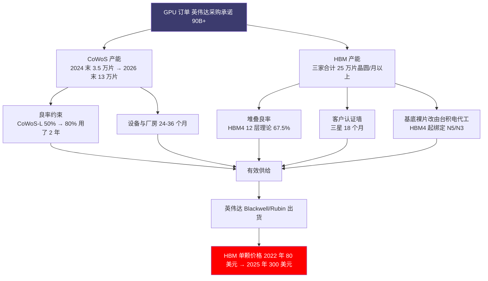
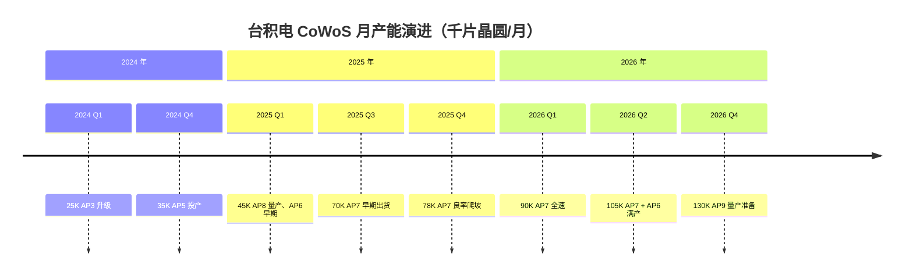
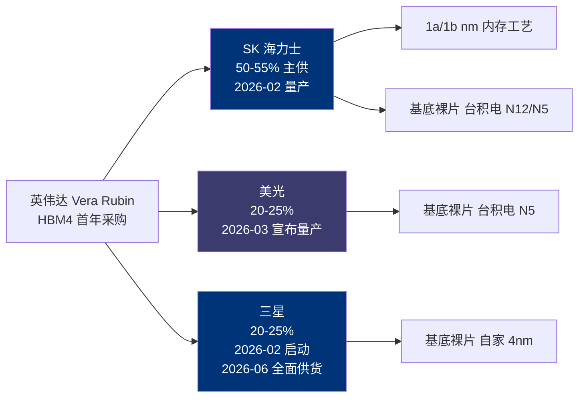
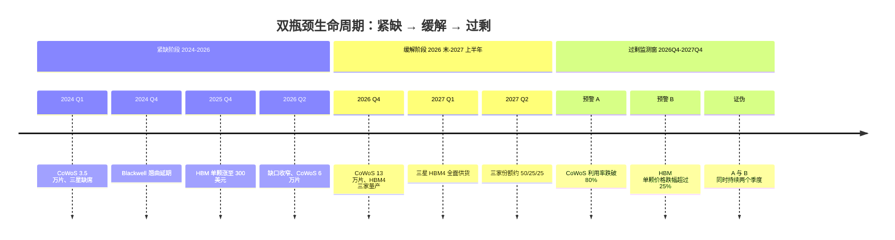

# 第 11 章 双瓶颈：CoWoS 与 HBM 为什么是真紧缺

## 本章概览

2025 年，一颗 HBM 的合约价是 300 美元。HBM 是高带宽内存（High Bandwidth Memory）——把十几颗内存裸片垂直叠成一摞、紧贴 GPU 放置，用来喂饱 GPU 的数据吞吐。2022 年上半年，同类产品是 80 美元。一台 GB200 服务器上要用 16 颗。

这三年里没有战争，没有断供。做 HBM 的三家公司——韩国的 [SK 海力士](https://www.skhynix.com/) 与 [三星](https://www.samsung.com/semiconductor/)、美国的 [美光](https://www.micron.com/)——都在拼命扩产。价格还是涨到了将近四倍。

公开股票市场为此吵了两年。看多的人说这就是算力真的不够用，是 [英伟达](https://www.nvidia.com/)（NVDA）估值的物理依据。看空的人说这是黄仁勋在每季度财报电话会上重复出来的话术——英伟达 FY26 年报（10-K）里期限超过一年的在手合同（剩余履约义务，RPO）只有 \$2.3B；被券商研究报告反复引用的 \$90B+，是另一套口径，指不计入资产负债表的采购承诺（supply / purchase commitments）。两个数字差 39 倍，各取一个就能得出完全相反的结论。

两边都在猜管理层的心思。这件事其实不用猜。芯片能不能造出来，不取决于谁在电话会上怎么说，取决于四条可以查证的曲线：

- **产能曲线**——CoWoS（台积电的先进封装工艺，把 GPU 裸片和 HBM 并排贴在同一块中介层上，封成一颗大芯片）的月产能要从 2024 年底的 3.5 万片晶圆爬到 2026 年底的 12-13 万片。这条曲线由 18-24 个月之前的资本支出决策锁定，2026 年需求无论多旺，都改不了 2026 年的产能上限。
- **良率曲线**——内存从叠 12 层走向叠 16 层，每多叠 4 层，整摞的成品率就要重新掉一次；封装面积越做越大，芯片受热时会翘曲，英伟达 Blackwell 在 2024 年三季度整整推迟一个季度量产，根子就在这里。
- **建厂时钟**——[阿斯麦](https://www.asml.com/)（ASML）的光刻机订了要等 18-24 个月，[台积电](https://www.tsmc.com/) 嘉义新厂从立项到通线 1.5-2 年，新建一座 HBM 晶圆厂从设备进场到产出第一批合格品 24-30 个月。每一档都是物理时间，加钱买不来。
- **客户认证墙**——三星的 12 层 HBM3e 从拿到黄仁勋当场签字背书，到真正通过英伟达认证，花了 18 个月。同一时期，美光靠跳过一代产品挤进了英伟达的主力供应链。

> TSV：Through-Silicon Via，硅通孔，在硅片上打深孔再用铜填充，用来连通上下层裸片。HBM 就是靠它把十几层内存裸片竖着连起来的。

这四条曲线怎么合并成一个「有效供给」、再把 HBM 价格顶上去，如图 11-1 所示。

```mermaid
graph TD
    A[GPU 订单 英伟达采购承诺 90B+] --> B[CoWoS 产能<br/>2024 末 3.5 万片 → 2026 末 13 万片]
    A --> C[HBM 产能<br/>三家合计 25 万片晶圆/月以上]

    B --> B1[良率约束<br/>CoWoS-L 50% → 80% 用了 2 年]
    B --> B2[设备与厂房 24-36 个月]
    C --> C1[堆叠良率<br/>HBM4 12 层理论 67.5%]
    C --> C2[客户认证墙<br/>三星 18 个月]
    C --> C3[基底裸片改由台积电代工<br/>HBM4 起绑定 N5/N3]

    B1 --> D[有效供给]
    B2 --> D
    C1 --> D
    C2 --> D
    C3 --> D

    D --> E[英伟达 Blackwell/Rubin 出货]
    E --> F[HBM 单颗价格 2022 年 80 美元 → 2025 年 300 美元]

    style A fill:#3C3B6E,color:#fff
    style F fill:#FE0000,color:#fff
```

**图 11-1：四条曲线如何叠成「紧缺」——从订单到有效供给，再到 HBM 价格**

四条曲线叠在一起，「紧缺」就不再是一个口号，而是一组能拆开、能跟踪、也能被推翻的数字。

## 11.1 三种紧缺：价格、物理、时序

「紧缺」这个词被用得太随意，几乎没人定义过它。为了把话说清楚，先把它分成三种。

**第一种，价格紧缺**——市场出清价格远高于边际生产成本。一张 H100 整卡售价业内估算 \$25K-30K，物料清单（BOM，Bill of Materials，一台设备上所有零部件的采购成本合计）\$3,320，英伟达拿走 7-8 倍的加价。HBM 单颗价格\$300，制造成本（内存裸片 + 硅通孔 + 基底裸片 + 测试）\$100-130（综合 SemiAnalysis 2024-09《The Memory Wall》+ Bernstein 券商研报）。

**价格高是结果，不是原因**。垄断溢价、客户预付款锁定、信息不对称、供给弹性受限，任何一条都能把价格顶上去。把「价格高」直接等同于「真紧缺」，是产业研究里最常见的逻辑跳跃。

**第二种，物理紧缺**——在一个财年或一个季度内，无论价格涨到多少，产出总量都扩不了。它由设备、厂房、工程师、工艺良率四样东西共同锁死。CoWoS 在 2024-2026 就是典型：台积电就算想把 2025 年二季度的月产能提到 13 万片，也做不到——光刻机订单 18 个月前才下，嘉义 AP7 厂房还在装修，会做 CoWoS 的工程师在台湾以外没有现成存量。

经济学家 William Lazonick（研究企业投资与产能形成）把这种现象叫「产能弹性的不对称」：需求这一侧调得极快，一份资本支出指引一夜之间就能上调；供给这一侧调得极慢，被三样东西锁死——几年前的投资决策、设备交期、能用的工程师数量。在这样的市场里，价格信号传导到产能扩张的滞后，远超经典模型假设的 12-18 个月。

**第三种，时序紧缺**——供需错配只发生在特定时间段，有明确的起点和终点，本质是产能曲线与需求曲线之间的相位差。2024 年三季度到 2026 年二季度，12 层 HBM3e 只有 SK 海力士和美光两家通过英伟达认证，就属于这一种。三星 2025-09 通过认证后格局开始松动（来源：TrendForce 2025-09-22 + KED Global 2025-09-19），2027 年三家同步爬坡后窗口关闭。

三种紧缺的差别落在监测指标和时间尺度上：

| 紧缺类型 | 含义 | 看什么指标 | 多久能变 |
|---|---|---|---|
| 价格紧缺 | 出清价远高于边际成本 | HBM 单颗价 / GPU 现货价 / 整卡平均售价 | 季度（一个季度就能重置）|
| 物理紧缺 | 产出受设备、厂房、工程师、良率约束 | CoWoS 月产能 / HBM 月产出 / 产能利用率 | 年度（扩产周期 24-36 个月）|
| 时序紧缺 | 产能曲线与需求曲线的相位差 | 客户认证进度 / 量产爬坡时点 / 三家同步度 | 半年到一年（认证 + 良率爬坡）|

> 来源：三层划分为本书为讨论方便所做的区分。三类监测指标在产业研究中分别对应价格信号、产能利用率、产能—需求缺口三类常见指标。

后面七节只谈物理紧缺和时序紧缺：前者解释 CoWoS 与 HBM 为什么在这一轮周期里成了硬约束，后者解释这种紧缺为什么有时间边界。价格紧缺牵扯议价权和会计口径，另有专章处理。

这样分层有理论依据。经济学教科书里的 Cobb-Douglas 生产函数把「资本投入」压缩成一个符号 K，默认它可以连续调整。放到算力产业，K 其实是三样东西的合成——光刻机、厂房、工程师，每一样都有各自的扩张时滞，而 K 的整体扩张速度由最慢的那一样决定。产能弹性的不对称不是市场情绪，是生产函数本身的性质。

Lazonick 在 2010 年的《Sustainable Prosperity in the New Economy》里把扩产决策拆成两件事：用满已有产能，和形成新产能。前者按月调整，后者被几年前的投资决策、工艺成熟度、人才存量锁死。2024-2026 年，台积电 CoWoS 和三家 HBM 厂已经把已有产能全部用满（TrendForce 2025-12-08 报道两条线均已订满，fully booked），剩下的扩张只能靠新产能——而新产能的时间常数是 24-36 个月。

这个框架给出一条可以直接用来跟踪的判据：**只要 CoWoS 和 HBM 的利用率维持在 95% 以上，物理紧缺就还在；利用率跌破 80%，才是结构性缓解的硬证据。**

## 11.2 产能爬坡：CoWoS 与 HBM 每月能多出多少

把 CoWoS 月产能、HBM 月产能、英伟达月度需求三条曲线放在一起，「物理紧缺」就从一句判断变成了可以核对的数字。

### CoWoS 月产能怎么爬上来的

CoWoS 月产能的爬升节奏，是这一轮周期里最直接的一把尺子。算力到底缺不缺，最后要看这条曲线爬得有多快——爬不过需求曲线，紧缺就是真的；爬过去了，紧缺就开始缓解。

2024 年一季度到 2026 年四季度的爬升过程如图 11-2 所示（AP3 至 AP9 是台积电各座先进封装厂的代号）。

```mermaid
timeline
    title 台积电 CoWoS 月产能演进（千片晶圆/月）
    section 2024 年
        2024 Q1 : 25K AP3 升级
        2024 Q4 : 35K AP5 投产
    section 2025 年
        2025 Q1 : 45K AP8 量产、AP6 早期
        2025 Q3 : 70K AP7 早期出货
        2025 Q4 : 78K AP7 良率爬坡
    section 2026 年
        2026 Q1 : 90K AP7 全速
        2026 Q2 : 105K AP7 + AP6 满产
        2026 Q4 : 130K AP9 量产准备
```

**图 11-2：台积电 CoWoS 月产能演进（2024-2026），单位为千片晶圆/月**

台积电不按封装变种披露产能数字，把季度净增加拆开来看，斜率的变化更清楚：

| 季度 | CoWoS 月产能（千片晶圆）| 季度净增加（千片）| 主要驱动 |
|---|---:|---:|---|
| 2024-Q1 | 25 | +5 | AP3 升级扩产 |
| 2024-Q2 | 28 | +3 | AP5 扩产 |
| 2024-Q3 | 32 | +4 | AP5 扩产 + 良率提升 |
| 2024-Q4 | 35 | +3 | AP3 + AP5 满产 |
| 2025-Q1 | 45 | +10 | AP8（南科 Innolux 厂房改建）量产 + AP6 早期出货 |
| 2025-Q2 | 60 | +15 | AP6 全速 + AP7 设备搬入 |
| 2025-Q3 | 70 | +10 | AP7 早期出货 |
| 2025-Q4 | 78 | +8 | AP7 良率爬坡 |
| 2026-Q1 | 90 | +12 | AP7 全速 + AP6/AP8 优化 |
| 2026-Q2 | 105 | +15 | AP7 + AP6 满产 |
| 2026-Q3 | 120 | +15 | AP7 + AP9 早期 |
| 2026-Q4 | 130 | +10 | AP9 量产准备 |

> 来源：综合台积电季度财报电话会指引（2024-Q1 至 2026-Q1）、TrendForce（台湾半导体市场研究机构）多份 CoWoS 报道（2024-04-16、2024-12-13、2025-12-08、2026-01）、Tom's Hardware 2026-01-02 综述、FinancialContent 2026-02-05、Tiger Brokers 引用的 127K 数据、SemiAnalysis（半导体产业独立研究机构）推演。其中 2026 年底 120-130K 为台积电公司指引，其余季度为业内估算，±15%。作为对照，2023 年底 CoWoS 月产能仅 15-20K，2027 年底业内估算 160-180K。

**两年扩产 9.5-11 万片晶圆／月，是原有产能的 4-5 倍**，而且斜率在 2025 年一季度出现明显跃迁——单季度净增加从 3-5 千片跳到 10 千片以上，对应 AP6、AP7、AP8 三座新厂协同投产。台积电历史上出现过类似的扩张节奏，上一次要追溯到 2013-2015 年苹果 A 系列拉动的 16nm 扩产。

即便如此，每一档产能跃迁都对应 1.5-2 年之前的一次资本支出决策：2026 年底那 13 万片，2024 年下半年就得动工。这条时间线在 §11.4 展开。

### HBM 三家的产能与量产时点

三家 HBM 厂各自绑定英伟达的方式不同，工艺路线也不同，如图 11-3 所示。

```mermaid
graph LR
    A[英伟达 Vera Rubin<br/>HBM4 首年采购] --> B[SK 海力士<br/>50-55% 主供<br/>2026-02 量产]
    A --> C[美光<br/>20-25%<br/>2026-03 宣布量产]
    A --> D[三星<br/>20-25%<br/>2026-02 启动<br/>2026-06 全面供货]

    B --> B1[1a/1b nm 内存工艺]
    B --> B2[基底裸片 台积电 N12/N5]
    C --> C1[基底裸片 台积电 N5]
    D --> D1[基底裸片 自家 4nm]

    style B fill:#003478,color:#fff
    style C fill:#3C3B6E,color:#fff
    style D fill:#003478,color:#fff
```

**图 11-3：HBM4 三家供应商与英伟达的绑定关系及各自的基底裸片工艺路线**

三家都不单独披露 HBM 月产能，下面是多源拼接的结果。表中「8 层 / 12 层」指一摞里叠了几颗内存裸片（业内写作 8-Hi / 12-Hi）：

| 厂商 | 8 层 HBM3e 量产 | 12 层 HBM3e 量产 + 通过认证 | HBM4 量产 + 向英伟达出货 | 2026 末 HBM 总产能（晶圆/月）|
|---|---|---|---|---:|
| SK 海力士 | 2023-Q4，H100 / H200 主供 | 2024-Q2 通过认证，Q3 量产 | 2026-02 启动量产，Vera Rubin 首发 | 17 万|
| 美光 | 2024-02 拿到 H200 量产订单 | 2024-09 通过认证 | 2026-03 宣布 HBM4 已为 Vera Rubin 进入大规模量产 | 8-9 万|
| 三星 | 2024-03 拿到黄仁勋签字背书，但送样反复被退 | 2025-09 通过认证 | 2026-02 启动出货，2026-06 起全面供货 | 25 万（公司指引）|

> 来源：SK 海力士时点综合其 2025-09 量产就绪公告（TrendForce 2025-09-12 转引）、Digitimes 2025-12-26、SK 海力士与台积电北美技术论坛 2025-04 公告；美光时点综合其投资者关系新闻稿 GlobeNewswire 2026-03-16、StorageNewsletter 2026-03-17、Tom's Hardware 2026-03、Futurum 综合其 FY2026 Q1 财报电话会 2025-12；三星时点综合 TrendForce 2026-01-26、Digitimes 2025-12-26；三星 25 万片指引来自 TrendForce 2025-12-30。三家均不公开分品类数据，月产能与采购占比为业内估算，±20%。

这张表有两件事容易被读漏。

**第一件，「开始量产」和「形成有效供给」不是一回事。** SK 海力士 2026 年 2 月启动量产，但首批月度出货业内估算只有 5-10 万颗，离稳态产能差得远——从量产走到稳态要 6-9 个月的良率爬坡（，综合 SK 海力士历年量产记录 + SemiAnalysis 转引）。三星的全面供货又推到 2026 年 6 月。也就是说，2026 上半年看似三家齐头并进，实际仍是 SK 海力士和美光两家供货、三星少量补充。

**第二件，HBM 和 CoWoS 这两个瓶颈正在合体。** HBM3 和 HBM3e 时代，一摞 HBM 完全在内存厂内部做完：最底下那层负责输入输出和控制的基底裸片（base die），内存厂自己用内存工艺就能做，不依赖外部代工。到了 HBM4，基底裸片改用逻辑工艺，交给台积电用 N5（5 纳米）或 N3（3 纳米）代工——SK 海力士在 2025 年 4 月的台积电北美技术论坛上公开宣布了这件事，美光同样走台积电路线（业内估算为 N5），只有三星用自家逻辑工艺自产。

结果是，**HBM4 之后，台积电的 N5 / N3 产能和 CoWoS 产能同时成了 HBM 的间接约束**。原本两个独立的瓶颈，从这一代开始物理上绑在了一起。后面 §11.6 讲 CoWoS 利用率为什么会直接影响 HBM 价格，根子就在这里。

### 英伟达一年要用掉多少

供给这边讲完，看需求这边。英伟达 FY26（截至 2026-01-25）数据中心营收 \$193.7B，按 GB200 平均售价（ASP）业内估算 \$65K-90K 反推，全年 GPU 数量在 210-300 万颗量级。这只能是个区间——数据中心营收里除 GPU 之外还含整机系统、网络设备、整机溢价等成分。

在手订单要分两个口径看，这也是多空双方各说各话的源头：

| 口径 | 金额 | 含义 |
|---|---:|---|
| 剩余履约义务（RPO）| \$2.3B | FY26 年报（10-K）披露，期限超过一年的已签约未确认收入，走美国通用会计准则表内口径 |
| 采购承诺 | \$90B+ | 不计入资产负债表，是英伟达向上游锁定产能的付款义务，|

按 \$90B、平均售价 \$75K 反推，对应未交付 GPU 约 120 万颗。把它和 CoWoS 产能对一下：2026 年底英伟达在 CoWoS 上占比业内估算 50-55%，按月产能 13 万片 × 55% 算，英伟达月度配额约 7.1 万片晶圆；一片晶圆能切出多少颗 GB200 级封装，受封装面积（5,150 平方毫米以上）和良率约束 8-10 颗——月度产出 57-71 万颗，年度上限 680-850 万颗。

静态看，这个上限盖得住 2026 年的需求。问题出在两条曲线的形状不一样：供给是逐季往上爬的台阶，需求几乎是垂直的。**月产能从 8 万片爬到 13 万片用了 12 个月，采购承诺从 \$50B 涨到 \$90B 只用了 9 个月。**

斜率差的后果全都能看到：客户排队拿货，12 层 HBM3e 的长约提前 12-24 个月被预订完，CoWoS 两条产线在 2025 年 12 月被 TrendForce 报道产能订满。产能曲线本身没有问题，问题是它追不上需求曲线。

### 缺口出现在哪几个季度

把英伟达每季度能拿到的 CoWoS 配额，和它当季实际出货放在一起做差：

| 季度 | 英伟达 CoWoS 月度配额（千片晶圆）| 当季 GPU 出货上限（万颗）| 实际当季出货（万颗）| 缺口 |
|---|---:|---:|---:|---|
| 2024-Q1 | 18 | 50-70（H100 主导）| 50-60 | 接近平衡 |
| 2024-Q3 | 21 | 60-80 | 55-70 | 略有紧张 |
| 2024-Q4 | 23 | 65-85 | 60-70（Blackwell 量产延期）| 紧张，需求后置 |
| 2025-Q2 | 38 | 90-120（CoWoS-L 量产）| 80-110 | 紧张 |
| 2025-Q4 | 47 | 95-130 | 100-125（Blackwell 主导）| 仍紧张 |
| 2026-Q2 | 60 | 120-160 | 130-150 | 开始接近平衡 |
| 2026-Q4 | 72 | 140-200 | 145-180 | 接近平衡 |

> 来源：配额数据综合台积电季度财报电话会指引 × 英伟达占比 55%；出货数据综合英伟达 FY26 季度财报的数据中心营收除以平均售价反推 + SemiAnalysis 季度跟踪。全表为业内估算，英伟达与台积电均不分品类披露月度配置，±20%。

要看的不是某一行数字，而是缺口的时间分布。**2024 年四季度到 2025 年四季度这五个季度缺口最大**：产能对应的出货上限是 65-130 万颗，而实际需求（由采购承诺、当季合同、渠道补库存反推）业内估算 130-180 万颗。

供不上货的直接后果是排队，而排队有优先级：大客户长约排在中型客户长约前面，长约排在现货前面，现货排在临时补货前面。2024-2025 年 H100 和 H200 一卡难求、12 层 HBM3e 单颗价格从 \$250 涨到 \$300，都是这条队伍的产物。

2026 上半年缺口开始收窄——CoWoS 月产能爬过 6 万片、HBM4 三家陆续量产、三星的 HBM4 在 2026 年 1 月通过了英伟达的系统级封装（SIP）测试。缺口具体什么时候关闭，是下一章的题目；这里只确认缺口在物理上真实存在过。

### 三组反向证据：紧缺不是英伟达一家说了算

空头的核心论据是：紧缺是黄仁勋在财报电话会上反复重复的话术，再被券商研报放大成稀缺溢价。这个解释有三处对不上。

**第一，上游三家同步赚到了这个价格。** SK 海力士 FY25 营业利润率 49%，美光 FY26 Q1 营业利润率 47%——内存行业过去 30 年没出现过这种利润率。如果紧缺只是英伟达的营销，这三家独立上市公司不会跟着一起赚到。

**第二，没有商业绑定的第三方判断一致。** TrendForce 在 2025-12-08 报道台积电两条 CoWoS 产线均已订满，SemiAnalysis 在 2025 年全年发表系列报告，判断 CoWoS 与 HBM 是 AI 算力的真实物理瓶颈。这两家与英伟达没有商业关系。

**第三，下游是自掏腰包在买。** 2026 自然年，美股七巨头（Mag7：苹果、微软、谷歌、亚马逊、英伟达、Meta、特斯拉）加甲骨文的资本支出合计指引 \$660-690B，其中绝大部分用经营性现金流支付而非借债（微软 FY25 经营性现金流 \$130B+ 对应资本支出 \$80B；来源：微软 FY25 10-K）。这几家不是被动接受叙事的买方，它们是用自己的现金流投了几千亿美元的票。

三条合起来，可以排除「紧缺纯属单方面营销」这个解释。下面三节拆产能曲线背后的三重工程约束。

## 11.3 良率：堆得越高、封装越大，废品越多

产能曲线的第一道工程约束是良率。良率不是一个固定数字，而是一条会随工艺世代、堆叠层数、封装面积移动的曲线——每换一代工艺、每多叠四层，都得重新爬一次。

### 堆 12 层为什么比堆 8 层难：良率是乘出来的

一摞 HBM 是把 8 颗、12 颗或 16 颗内存裸片用硅通孔垂直串起来，再在最底下贴一颗基底裸片负责数据进出。这里的关键是：只要其中任何一颗裸片是坏的，整摞就报废。所以整摞的良率不是平均，而是所有裸片良率连乘。

下表里的指数比层数多 1，多出来的那一层是最底下的基底裸片：

| 工艺 | 堆叠层数 | 单裸片良率假设 | 整摞良率（理论）|
|---|---:|---:|---:|
| HBM2 | 4 层 | 95% | 0.955 = 77.4% |
| HBM2E | 8 层 | 95% | 0.959 = 63.0% |
| HBM3 / HBM3e | 8 层 | 96% | 0.969 = 69.3% |
| HBM3e | 12 层 | 97% | 0.9713 = 67.5% |
| HBM4 | 12 层（首批）| 97% | 0.9713 = 67.5% |
| HBM4 / HBM4E | 16 层（路线）| 97% | 0.9717 = 59.6% |

> 来源：单裸片良率为业内估算，综合 SK 海力士、三星、美光历年学术论文披露的内存裸片测试良率范围 + SemiAnalysis 转引，三家均不公开精确数字。表中为理论值，实际还要再叠加硅通孔工艺良率、基底裸片良率、键合良率，业内估算比理论值再低 5-10 个百分点。

这张表解释了一件反直觉的事：**单裸片良率从 95% 提到 97%，看着只差两个百分点，落到 12 层堆叠上就是 63% 和 67.5% 的差别**——而这个差别，直接决定一家厂能不能拿到订单。

SK 海力士守住 12 层 HBM3e 主导位（2025 年二季度市占 62%，来源：TrendForce）的办法，就是把单裸片良率做到 99% 以上，把整摞良率推回 85% 这条线（业内估算）。它靠的是三件事叠加：

1. 1a-1b 纳米工艺成熟度领先三星和美光半个代际；
2. 用 MR-MUF 封装工艺（整片回流焊接加模塑下填充，一次性把整摞的缝隙填满并固化）压低翘曲和热阻；
3. 裸片进入堆叠环节之前多跑几轮电学分选（EDS），把入堆良率从行业水平的 95-96% 筛到 99% 以上。

这三条不是三个技术点，是十年时间在产线上磨出来的参数组合。三星就算把内存核心重新设计一遍，短期也补不上——**良率是工程师每天在量产线上做实验、把参数调到收敛的过程知识，不是买设备能买来的。**

翻译成产能含义：12 层 HBM3e 量产初期良率 50-60%，稳态 80%（业内估算，综合 SemiAnalysis + Bernstein），从 50% 爬到 80% 通常要 6-9 个月。这意味着，即使三家在 2026 年一季度同时启动 HBM4 量产，要在四季度同步形成稳态供给，良率就得全部爬到 75-80%——对工艺老化时间最短的三星（12 层 HBM3e 拖到 2025 年 9 月才过认证）来说，这个节奏很紧。

### 裸片做得越大，良率掉得越快

良率还有一个二阶效应容易被忽略：单裸片容量在同步变大。HBM3 单裸片 16 Gb，HBM3e 24 Gb，HBM4 32 Gb（业内估算）。容量翻倍意味着裸片面积变大，而同样的工艺缺陷密度下，面积越大，整颗裸片被打中缺陷的概率越高。

写成关系式就是：单裸片良率 =（1 − 缺陷密度）裸片面积。HBM3e 的 24 Gb 裸片面积约 90 平方毫米，HBM4 的 32 Gb 约 115 平方毫米，面积增加 28%。如果缺陷密度不变，单裸片良率会掉 4-5 个百分点——而这 4-5 个百分点，放到 12 层连乘上会被放大成十几个百分点。

所以 SK 海力士在 HBM3e 切到 HBM4 时必须做的事，是把 1a-1b 纳米的缺陷密度同步压下来，让单裸片良率守在 97% 以上。这是它能不能守住 HBM4 主导位的工艺基础。

### 大封装为什么会翘：CoWoS-L 的三道难题

CoWoS 的良率难度从 CoWoS-S 跨到 CoWoS-L 时，跳了一级。

先说这两个变种的差别。中介层是垫在 GPU 裸片和封装基板之间的那一层薄板，作用是把裸片密集的线路重新扇出、连到基板上。CoWoS-S 的中介层是一整片硅，把 GPU 裸片和 4-5 摞 HBM 集成在一起，最大面积约 2,700 平方毫米。这个尺寸已经超过光刻机一次曝光能画的最大画幅（858 平方毫米，业内叫一个 reticle），要靠多次曝光拼接才能做出来。CoWoS-L 从 2024 年起改用有机材料的再分布层（RDL）做大尺寸中介层，中间嵌一小块硅做局部互连桥（LSI）来连接两颗 GPU 裸片，封装面积推到 5,150 平方毫米以上（6 个画幅），路线图上还要做到 14 个画幅、集成 20 摞 HBM。

面积一大，三个问题同时冒出来：

| 问题 | 物理机制 | 后果 |
|---|---|---|
| **翘曲** | 硅裸片、RDL 中介层、ABF 基板（一种承载芯片的高端电路板材料）三层材料的受热膨胀系数（CTE）不同，升温时各涨各的 | 裸片和中介层之间的焊球（micro-bump）连接失效，整颗封装报废 |
| **热应力** | 两颗 GPU 裸片加 8 摞 HBM 挤在 5,000 平方毫米出头的面积里，总功耗超过 1,200 瓦，热密度0.2-0.3 瓦/平方毫米 | 局部热点温度过高，内存的数据保持时间变短，长期可靠性下降 |
| **测不过来** | 焊球数量从单裸片的几万个跳到大封装的几十万个，每一个都要在线量测高度、位置，还要保证全部处在同一平面上 | 量测设备产能跟不上，Camtek 与 Onto Innovation 的设备在 2024-2025 长期紧缺 |

> 来源：综合 3DInCites 2024-10-18 报道（英伟达 Blackwell 的 CoWoS-L 翘曲与膨胀系数失配问题）、台积电在 IEDM / VLSI / 先进封装研讨会历年论文、SemiAnalysis《Advanced Packaging Part 2》2022。良率量化数字台积电只做定性披露，此处为业内估算。

第一个问题在 2024 年三季度真出过事。英伟达 Blackwell（B100 / B200）首批样品被发现，两颗 GPU 裸片之间的局部互连桥出现膨胀系数失配——硅裸片、RDL 中介层、ABF 基板三层在工作温度下涨得不一样快，把裸片顶翘，焊球连接失效。结果是 Blackwell 量产推迟约一个季度，谷歌、微软、Meta 的大单全部延后到 2025 年一季度之后才开始放量。

**CoWoS-L 和 CoWoS-S 的关系，不是同一条产线上换个规格那么简单**，它是一套新的工程系统，台积电、基板厂、内存厂三方要重新做 6-9 个月的协同爬坡。这就是为什么 2024 年底 3.5 万片到 2026 年底 13 万片这条曲线虽然陡，每一步却都被良率拖着。

### HBM4 的新变数：基底裸片改由台积电代工

HBM4 相比 HBM3e 多了一个工程上的不连续点——基底裸片从内存工艺换成了逻辑工艺。

HBM3 和 HBM3e 的基底裸片是内存厂用自家 10 纳米级内存工艺做的，功能主要是数据缓冲和控制。HBM4 的基底裸片要塞进更多逻辑电路，改用台积电的 N5（5 纳米）或 N3（3 纳米）逻辑工艺代工（SK 海力士 2025 年 4 月在台积电北美技术论坛公开宣布；来源：SK 海力士新闻稿 2025-04-23）。

换工艺带来三层影响：

1. **新基底裸片的良率要单独爬一遍。** N5 和 N3 本身是台积电的成熟节点，稳态良率 95% 以上；但用逻辑工艺做 HBM 基底裸片是全新设计，2026 上半年量产初期良率业内估算 90-93%，要 3-6 个月才能爬到 95% 以上。
2. **基底裸片和内存裸片的接合方式要升级。** 传统焊球间距 40 微米，HBM4 部分定制版本目标改用混合键合（不用焊球，两片芯片直接贴合，间距做到 10 微米以下）。三星已经公开了后续 HBM4E 的 20 层混合键合路线。这道工艺在量产初期会再压低 5-8 个百分点良率。
3. **三家走上了三条不同的路。**

| 厂商 | 基底裸片工艺 | 量产初期良率 | 稳态良率 | 产能瓶颈在哪 |
|---|---|---:|---:|---|
| SK 海力士 | 台积电 N12 → N5 | 90-93% | 95-97% | 受台积电 N5 配额约束 |
| 美光 | 台积电 N5 | 90-93% | 95-97% | 受台积电 N5 配额约束 |
| 三星 | 自家 4nm | 88-90% | 93-95% | 受三星代工 4nm 良率约束 |

> 来源：综合 SK 海力士 2025-04 公告、Digitimes 2025-12 关于 HBM4E 的报道、TrendForce 2024-12 与 2026-01-26。三家均不公开良率，全表为业内估算。

三星这条路的好处是基底裸片不用排台积电的队，产能上限不受 N5 / N3 配额约束；坏处是自家 4 纳米工艺要在英伟达那边重新走一遍认证。

比良率更重要的是产能模型的变化。HBM3e 时代，CoWoS 和 HBM 是两个独立瓶颈——台积电扩 CoWoS 不影响内存厂，内存厂扩硅通孔产能也不占台积电的资源。HBM4 时代，台积电既要在 N5 / N3 上给三家代工基底裸片，又要在自家产线上做封装，**台积电的逻辑工艺产能和 CoWoS 产能同时成了 HBM 的间接约束**。两个瓶颈从这一代起绑在一起，后面 §11.6 讲 CoWoS 利用率为什么会传导到 HBM 价格，根子就在这里。

### 从量产到稳态，还要再等 6-9 个月

把 HBM 和 CoWoS 各世代的良率爬坡时间压到一张表：

| 工艺世代 | 量产初期良率 | 稳态良率 | 爬坡时间 |
|---|---:|---:|---:|
| 12 层 HBM3e（SK 海力士）| 50-60% | 80-85% | 6-9 个月 |
| 12 层 HBM3e（三星二次量产后）| 40-50% | 70-75% | 9-12 个月 |
| 12 层 HBM4 | 50-55% | 75-80% | 8-12 个月 |
| 16 层 HBM4（路线）| 30-40% | 60-65% | 12-18 个月 |
| CoWoS-S | 80%+（工艺已 13 年，无爬坡）| 85-90% | — |
| CoWoS-L | 60-70% | 80% | 12-18 个月 |

> 来源：全表为业内估算，台积电与三家 HBM 厂均不公开良率数据。估算区间综合 SemiAnalysis 系列、Bernstein 券商研报（2024-2025）、TrendForce 多份报告、KED Global。

这张表要读出的一句话是：**新设备搬进厂到产出第一片晶圆不到一年，但从产出第一片到能稳定产出合格品，还要再加 6-9 个月。** 所以听到「2027 年三家 HBM 同步爬坡」这种说法，有效供给的增量要按这个时间差打个折扣。

### 良率不是直线上升：S 曲线与卡死

良率曲线是 S 形的，不是斜线。把 SK 海力士 12 层 HBM3e 的月度爬坡拉出来：

| 量产月份 | 良率 | 月度成品产出（千颗）| 备注 |
|---:|---:|---:|---|
| 第 1 月 | 35-40% | 30-50 | 首批晶圆主要用来校准工艺 |
| 第 2 月 | 45-50% | 50-80 | 关键键合参数收敛 |
| 第 3 月 | 55-60% | 80-120 | 硅通孔缺陷率下降 |
| 第 4 月 | 65-70% | 130-180 | 进入放量期 |
| 第 5 月 | 70-75% | 200-280 | 准备送英伟达认证 |
| 第 6 月 | 75-78% | 280-350 | 通过量产认证 |
| 第 9 月 | 80-83% | 350-450 | 进入稳态 |
| 第 12 月 | 82-85% | 450-550 | 稳态优化 |

> 来源：业内估算，综合 SK 海力士公开学术论文披露的工艺成熟度曲线 + Bernstein / Mizuho 券商研报推演 + SemiAnalysis 转引。三家均不公开月度良率。

S 曲线有两个关键点：拐点在第 3-4 个月，第 9 个月进入稳态。前三个月良率从 35% 爬到 60% 看着很快，但基数小、总产出有限；第 4-7 个月良率从 60% 爬到 75%，产出才真正放量；第 8-12 个月良率再往上爬到 82-85%，速度明显放缓。

S 曲线还有另一种走法：**卡死**——良率在某个数字（比如 60%）上反复震荡，怎么调都上不去。三星 12 层 HBM3e 头两次送认证被退回，就是卡死在 50-60% 的状态。卡死通常不是单一工艺参数的问题，而是设计和制造混在一起：三星的散热不达标，出在内存核心的设计和制造工艺两头，调某一个参数没用，最后只能把内存核心整个重新设计一遍（由 2025 年 5 月上任的半导体业务负责人全永铉主导）。

**卡死风险是 HBM4 爬坡曲线最大的不确定性。** HBM4 从 2026 年 2 月起量产，如果三家在上半年任何一家卡住，HBM4 真正形成有效供给的时点就会从 2026 年四季度推到 2027 年二三季度。

### 良率从 50% 爬到 80%，等于凭空多出六成产能

CoWoS-L 的翘曲问题不是英伟达一家的问题。谷歌 TPU v7、博通给 Meta 做的 MTIA v3、亚马逊 Trainium，所有大封装的定制芯片都撞在同一组工艺挑战上。这三年的改善节奏是：

| 时点 | CoWoS-L 良率 | 关键事件 |
|---|---:|---|
| 2024-Q1 | 50-55% | 初次量产，Blackwell 工程样品 |
| 2024-Q3 | 50-55% | Blackwell 膨胀系数失配问题暴露 |
| 2024-Q4 | 60-65% | 台积电与英伟达联合调整互连桥设计 |
| 2025-Q1 | 65-70% | Blackwell 恢复大规模量产 |
| 2025-Q3 | 72-77% | 量产经验积累 |
| 2026-Q1 | 78-82% | 趋于稳态 |
| 2026-Q4 | 80-85% | 稳态上限 |

> 来源：业内估算，综合台积电学术论文披露的工艺成熟度曲线 + SemiAnalysis 系列 + Bernstein 券商研报。台积电不公开 CoWoS-L 良率细节。

从 50% 爬到 80% 用了将近两年，比前面说的「一代工艺 6-9 个月」长得多。原因是 CoWoS-L 不是换代，是一套全新的工程系统。

这 30 个百分点的意义在于：同样的月产能，良品数量翻了 1.6 倍。落到出货上，单片晶圆能切出的 B200 级封装从 6 颗（12 颗理论值 × 50%）涨到 9-10 颗（× 80%），英伟达的出货上限跟着抬了约 60%。

**所以 CoWoS 的有效供给其实是两条曲线在同时往上走**：一条是建厂扩产带来的月产能增加，看得见；一条是良率改善带来的良品率提升，看不见。只盯着月产能数字，会低估有效供给的扩张速度。

## 11.4 扩产要多久：从下单到量产的四段时间

良率决定的是已经建好的产线多快能爬到稳态。再往前推一步——从决定建产线到产出第一批合格品——是设备和厂房的扩产周期。这是 CoWoS 与 HBM 产能曲线被提前锁死的根本原因，可以拆成四段。

### 第一段：设备下单到出货，18-24 个月

最敏感的是光刻机。阿斯麦（荷兰，全球光刻设备的主导供应商，2025 年极紫外光刻机市占接近 100%）2025 年净销售 €32.7B、毛利率 52.8%，年末在手订单 €38.8B，对应交货周期 18-24 个月。**今天下单，2027 年中才能到货。**

不只是光刻机。做硅通孔要用的深硅刻蚀机（科林研发与东京电子主导）、往通孔里填铜的电镀沉积设备（科林研发与应用材料主导）、先进封装的量测设备（Camtek 与 Onto Innovation 主导），交期都在同一个量级：

| 设备类型 | 主导供应商 | 交期 | 在产线里干什么 | 是否瓶颈 |
|---|---|---|---|---|
| 极紫外（EUV）光刻机 | 阿斯麦 | 18-24 月 | HBM4 基底裸片的 N3 逻辑工艺 | 是（HBM4 起新增）|
| 深紫外（DUV）光刻机 | 阿斯麦 + 佳能 | 12-18 月 | CoWoS 硅中介层的 65nm 工艺 | 部分 |
| 深硅刻蚀机 | 科林研发 + 东京电子 | 12-18 月 | 在硅片上打通孔 | 是 |
| 铜电镀沉积设备 | 科林研发 / 应用材料 | 9-15 月 | 往通孔里填铜、中介层布线 | 部分 |
| 先进封装量测设备 | Camtek + Onto Innovation | 12-15 月 | 检测焊球的位置、高度、共面度 | 是（2024-2025 紧张）|
| 混合键合设备 | BESI + 应用材料 | 12-18 月 | 基底裸片与内存裸片直接贴合 | 是（HBM4 起新增）|
| 底填与基板加工 | 各家封装测试代工厂（OSAT）| 6-12 月 | 封装后段装配 | 否 |

> 来源：综合阿斯麦季报、科林研发 / 应用材料 / 科磊季报、业内研报。交期为业内估算，不同型号与客户优先级下浮动 ±30%。

**18-24 个月是物理时间，多付钱买不来。** 2026 年的 CoWoS 产能在 2024 年下半年就已经被这条交期决定了。

这张表里最容易被市场忽略的是量测设备。CoWoS 每片晶圆上有几十万个焊球，位置、高度、共面度都要在线检测；HBM4 换成混合键合之后，精度要求又从微米级跳到亚微米级。量测设备产能在 2024-2025 年长期紧缺，是产能爬坡里被低估的一档瓶颈。

### 阿斯麦的在手订单，是两年后产能的预报器

阿斯麦的在手订单值得单独拎出来看，因为它的交期就是产业链的时间提前量。把 €38.8B 的在手订单按客户拆开：

| 客户 | 在手订单占比 | 主要用途 |
|---|---:|---|
| 台积电 | 35-40% | 3nm/2nm 逻辑 + CoWoS 配套 |
| 三家 HBM 厂 | 20-25% | 1a/1b nm 内存 + HBM4 基底裸片 |
| 英特尔 + 三星代工 | 15-20% | 先进逻辑节点扩张 |
| 中国大陆客户 | 5-10% | 受美国商务部工业与安全局（BIS）出口管制约束，主要是成熟节点 |
| 其他（格芯、闪存厂等）| 10-15% | 各类 |

> 来源：业内估算，综合阿斯麦历年财报电话会披露 + 业内研报。阿斯麦不公开客户级订单分布。

**在手订单的变化，领先 CoWoS 与 HBM 产能落地 18-24 个月。** 2024 年下半年的订单同比变化，对应的是 2026 年中以后的产能。盯住阿斯麦季报里的在手订单和中国区收入占比，就能推演 2027-2028 年全球先进制程产能的扩张节奏。

### 第二段：厂房从立项到通线，1.5-2 年

台积电副总裁何军（Jun He）在 2024 年 9 月的 SEMICON Taiwan 演讲上说，CoWoS 厂房的建设周期已经从过去的 3-5 年压到 1.5-2 年。之所以能压这么短，是因为封装厂不像前道晶圆厂那样要处理极紫外光刻机的搬入难度，施工和设备进场可以并行。

台积电这三年的新厂节奏是：

| 厂区 | 立项 | 设备搬入 | 量产 | 主做哪个变种 |
|---|---|---|---|---|
| AP6（嘉义新厂）| 2023-Q4 | 2024 下半年 | 2025 上半年小规模 | CoWoS-L 为主 |
| AP7（嘉义后续）| 2024-Q2 | 2025 末 | 2026 上半年 | CoWoS-L + 3D 堆叠 |
| AP8（南科，收购群创厂房改建）| 2023-Q3 | 2024 上半年 | 2024 末 | CoWoS-S 升级 |
| AP9 / AP10（嘉义后续）| 2025 末 / 2026 初 | 2026 下半年 | 2027 中 | |

> 来源：综合 TrendForce 多份报道（2024-09、2024-12-13、2025-12-08）、SemiAnalysis 推演、DigiTimes 对嘉义与高雄新厂的追踪。各厂具体规模台积电未单独披露，业内估算每厂月产能 1.5-2.5 万片晶圆。

1.5-2 年已经是下限，再快不动了。这两年台积电累计新增 CoWoS 产能 5.5-6 万片晶圆／月，相当于凭空多建了两座完整的封装厂。

但这条扩产路径并不是一条直线。2024 年 11 月，台积电通知设备供应商暂停 2026 年的设备需求与交付计划，重新评估扩产节奏。市场当时读成是对 2025 年下半年需求的预期下调。事后看，这次放缓持续不到 60 天，到 12 月中就全面恢复了扩产指引。这段插曲说明的是：**客户口径稍有波动，台积电内部就会重新评估资本支出节奏**——扩产决策本身是脆弱的。

### 第三段：HBM 新厂从设备进场到首批合格品，24-30 个月

新建一座 HBM 工厂比建封装厂更慢，因为它要四样东西同时到位：内存前道产能、硅通孔产能、堆叠产能，还有基底裸片工艺（HBM4 之后这一档还要排台积电的队）。

完整拆开是这样：

| 阶段 | 耗时 | 主要任务 |
|---|---|---|
| 厂房建设 | 12-18 个月 | 土建、洁净室、公用工程（电力 / 气体 / 化学品 / 纯水）|
| 设备搬入 | 6-9 个月 | 内存前道设备（光刻、蚀刻、沉积、抛光）+ 硅通孔设备 + 堆叠设备 |
| 工艺调试 | 3-6 个月 | 校准、跑通流程、产出首片晶圆 |
| 良率爬坡 | 6-9 个月 | 从初期 50% 爬到稳态 80% 以上 |
| **合计** | **27-42 个月** | |

> 来源：业内估算，综合 SK 海力士清州 M15 / M15X、三星平泽 P3 / P4、美光 2024 年爱达荷新厂的建设时间表。各阶段 ±20%。

SK 海力士 2024 年二季度动工的清州 M15X 厂，把这个周期压到了下限——从立项到出第一批合格品业内估算 24-30 个月。它能压到下限有两个原因：一是 M15X 紧邻 M15 扩建，公用工程现成；二是它在 HBM 工艺上足够成熟，良率爬坡能缩到 6 个月。即便如此，从 2024 年二季度立项到 2026 年初投产，仍然用了 20 个月。

三星那边，2026 年 HBM 总产能要从 2025 年底的 17 万片扩到 25 万片晶圆／月（提升约 47%），靠的是平泽 P4 厂部分产能转向 HBM4，加上天安后段封装新线协同。**而这个 2026 年的产能，对应的建厂决策是 2024 年做的。**

把两条路径放在一起，会发现一件事：**2026 年的 HBM 产能曲线，本质上是 2023-2024 年内存厂对 AI 需求的判断结果。** 2023 年判断保守，2026 年客户就得排队；2024 年判断激进，2027 年价格就会崩。提前两三年下注、当下承担后果——这是 HBM 与 CoWoS 这门生意和一般制造业最大的差别。

这个时滞还有一个更直接的后果。内存厂在某个时点看到价格上涨、决定扩产，新产能要 24-30 个月后才能形成有效供给；而下游需求拉动只要 3-6 个月就能传导到价格上。**需求端的反应速度比供给端快 6-10 倍**——这就是 2024-2026 年 HBM 价格几乎单向上涨的原因，也是 12 层 HBM3e 单价从 2024 年的 \$200 涨到 2026 年合约 \$300（来源：TrendForce 2025-12-24）没法靠扩产消除的原因。

### 第四段：良率爬坡，6-9 个月

这一段前面已经展开过。把四段接起来看总账：

| 阶段 | 相对时点 | 耗时 |
|---|---|---:|
| 第一段：设备下单 → 出货 | T-24 至 T-18 | 18-24 个月 |
| 第二段：厂房立项 → 设备搬入完成 | T-18 至 T-6 | 12-18 个月（与第一段部分并行）|
| 第三段：调试 → 工艺验证 → 首片晶圆 | T-6 至 T | 6 个月 |
| 第四段：良率从 50% 爬到 80% | T 至 T+9 | 6-9 个月 |
| **从资本支出决策到稳态量产** | | **24-36 个月** |

> 来源：综合台积电历史建厂记录、SK 海力士 / 美光 / 三星公开披露的 HBM 量产时间表、阿斯麦与科林研发的设备交期披露、业内研报。各段在不同厂区、不同工艺世代下浮动 ±20%。

**24-36 个月是扩产跨不过去的最低门槛。** 需求侧的数字摆在桌上——英伟达采购承诺 \$90B+、七巨头 2026 年资本支出 \$660-690B——但供给侧的时钟是常数。这是物理紧缺最硬的一条证据。

### 先看设备厂的订单，比看台积电早一年半

把扩产周期翻译成一条传导链：扩产决策 → 设备厂订单 → 设备厂出货 → 产线设备搬入 → 调试 → 量产。链条最前端的设备厂财务变化，**领先产能落地 12-18 个月**，是这条产业链上最敏感的领先指标。

2024-2025 年这几家的业绩变化：

| 设备厂 | 相关业务披露 | 同比增速 |
|---|---|---|
| 科林研发 | HBM 封装相关设备营收同比增长三位数（FY24 财报电话会原话）| +100% 以上 |
| Camtek | 先进封装是营收增长的最大驱动（FY24-25 季报）| +60-80%|
| Onto Innovation | 先进封装量测设备高速增长（季报）| +50-70%|
| 阿斯麦 | 在手订单中逻辑与高性能计算客户占比上升（Q4 2025 财报，2026-01-28）| 在手订单 +30% 以上|
| 应用材料 | 先进封装与 HBM 相关设备（FY25 10-K）| +40% 以上|

> 来源：综合各设备厂 FY24-FY25 财报披露 + 业内研报转引。部分公司不单独披露 HBM / 先进封装业务，按先进封装总营收推演。

设备厂的领先性有两层。**一是时间上的**：设备订单到出货 18-24 个月，所以 2024 年下半年的订单变化对应的是 2026 年的产能落地，设备厂的在手订单是产能一年半后的可靠预报器。**二是信号纯净度上的**：设备厂的毛利率波动比产能波动小，景气度变化时，它的「量」信号比「价」信号干净。科林研发 FY24 报出的 HBM 设备同比翻倍，比英伟达或台积电的单季营收增速更直接地反映了物理产能的扩张节奏。

设备厂在 2024-2025 年同步出现业绩跃升，与台积电、SK 海力士同期的产能扩张曲线相互印证。这是判断紧缺真伪的第三组独立证据。

## 11.5 认证这道墙：做得出来不等于卖得出去

四个因素里，客户认证墙看上去最不像硬约束，实际上最难翻越。

HBM 和 CoWoS 都不是标准品。每一代、每一个规格，供应商都得和客户一起把量产爬坡曲线重走一遍：工艺参数、测试覆盖、长期可靠性数据全部收齐，才算通过认证、进入主流分配。这道墙比工艺本身更难过——下面这个案例足以说明。

### 三星的 18 个月：四次送样，四次才过

| 时点 | 事件 | 来源 |
|---|---|---|
| 2024-03 | 黄仁勋在 GTC 大会上拿起三星 12 层 HBM3e 样品，当场签字背书 | Reuters 2024-03 转 Bloomberg |
| 2024-Q3 | 第 1 次送认证样品，因散热与功耗不达标被退回 | DigiTimes 2024-08 |
| 2024-Q4 | 第 2 次送样，再次退回 | The Korea Times 2024-12 |
| 2025-Q2 | 第 3 次送样，再次退回 | TrendForce / DigiTimes 2025-06-12 |
| 2025-05 | 半导体业务负责人全永铉上任，主导内存核心重新设计 | KED Global 2025-09-19 |
| 2025-09 | 第 4 次送样通过认证，首批 1 万颗已发货 | TrendForce 2025-09-22 + KED Global 2025-09-19 + Tom's Hardware 2025-09-23 |
| 2026-01 | HBM4 通过英伟达系统级封装测试（11.7 Gb/s，超过 10 Gb/s 规格要求）| TrendForce 2026-01-26 |
| 2026-02 | 启动向英伟达与 AMD 出货 HBM4 | TrendForce 2026-01-26 + Digitimes 2025-12-26 |
| 2026-06 | HBM4 全面供货 | TrendForce 2026-01-26 |

> 来源：综合 Reuters / DigiTimes / KED Global / TrendForce / The Korea Times 多源拼接。各来源时点相差 1-2 个季度，已按三星官方财报电话会披露 + 第三方多源校核取中位时点。

**从黄仁勋当场签字（2024 年 3 月）到真正通过认证（2025 年 9 月），三星用了 18 个月。**

代价直接体现在利润表上。同期 SK 海力士 FY25 营业利润率 49%，三星半导体业务（DS 部门）FY25 营业利润率约 19%（营业利润 24.9 万亿韩元 ÷ 营收 130.1 万亿韩元；来源：SK 海力士 2026-01-28 新闻稿 + 三星电子 2026-01 全年业绩）。两家都是内存大厂，利润率差了 30 个百分点。需要说明的是，三星 DS 部门还包含代工和系统芯片业务，这两块长期拖累利润率，所以这 30 个百分点不能全部记在 HBM 头上——但 HBM 是同期唯一发生数量级变化的变量。

卡住三星的不是工艺水平。三星的内存工艺从 1980 年代到 2010 年代一直是行业第一，硅通孔工艺在 HBM2 时代还是它首发的，工程团队规模也不输 SK 海力士。**卡住它的是量产样品和长期可靠性验证这两关的现场测试——散热和功耗不达标。**

英伟达的 HBM 认证分四关，一关比一关难：

| 阶段 | 做什么 | 通过率 | 耗时 |
|---|---|---:|---|
| 工程样品（ES）| 送几颗样品做基本的信号时序、信号完整性、功耗曲线验证 | 80-90% | 1-2 个月 |
| 认证样品（QS）| 装到目标 GPU 测试板上跑压力测试：热循环、电压裕度、抗噪声、长时间高温下的数据保持能力 | 30-50% | 3-6 个月 |
| 量产样品（PS）| 十万颗以上的批次跑通英伟达工厂的整机集成，验证实测良率 | 50-70% | 3-6 个月 |
| 长期可靠性验证（LRV）| 在云厂的真实数据中心里跑 6-12 个月，验证现场失效率 | 70-90% | 6-12 个月 |

> 来源：四阶段框架综合 SK 海力士技术白皮书、美光认证案例披露、TrendForce 认证跟踪报道整理，英伟达不公开正式流程文档。通过率与耗时为业内估算。
>
> 现场失效率（FIT，Failures in Time）是半导体可靠性的计量单位：1 FIT 等于每 10 亿工作小时出现 1 次故障。英伟达对 HBM 的要求通常在个位数量级。

三星卡在第二关，也就是通过率只有 30-50% 的认证样品阶段——这一关最严，因为压力测试同时覆盖热循环、电压裕度和长期数据保持三重考验。它过不去的原因是 12 层 HBM3e 的散热设计和自家 1a/1b 纳米内存工艺的数据保持特性配合不好。这是一个跨工艺的协同问题，调单个参数解决不了。

### 三星缺席的代价：份额从 41% 掉到 17%

这 18 个月的空缺，被 SK 海力士和美光分掉了：

| 时点 | SK 海力士 | 三星 | 美光 | 其他 |
|---|---:|---:|---:|---:|
| 2024-Q2 | 50% | 41% | 5% | 4% |
| 2024-Q4 | 56% | 32% | 12% | — |
| 2025-Q2 | 62% | 17% | 21% | — |
| 2025-Q4 | 59% | 20% | 20% | 1% |

> 来源：综合 TrendForce 2024-2025 多份月度报告 + KED Global 2025-09-19 转引 + Counterpoint Research 2025 综合分析。

三星从 41% 掉到 17%，丢掉的 24 个百分点里，SK 海力士接走 12 个、美光接走 16 个（区间内有重叠，因两家爬升时点不同）。美光能从 HBM 市场的配角变成主角，这 18 个月是关键窗口——它的云存储事业部 FY2026 Q1 单季营收 \$5.3B、同比翻倍。

三星这个案例说明的是认证墙的硬度：**一家营收 \$220B+、工艺储备充足的全球第二大半导体公司，在认证面前也只能花 18 个月排队。** 代价是 HBM 业务损失营收业内估算 \$8-12B，加上半导体业务利润率被同行拉开 30 个百分点。这种量级的损失都换不来通融，认证墙的硬度在产业研究里被长期低估。

### 美光的另一条路：跳过一代，押注下一代

和三星的困局相反，美光（美国，全球第三大内存厂）走的是另一条路。

2023 年，美光做了一个决定：跳过 8 层 HBM3，把工程资源直接压到 HBM3e 上，全部对准英伟达 H200。

- 2024-02：用 24GB 8 层 HBM3e 拿到 H200 量产订单
- 2024-09：36GB 12 层 HBM3e 通过认证，成为英伟达 HBM3e 的优先供应商之一
- 2026-03：在 GTC 大会上宣布，为英伟达 Vera Rubin 设计的 HBM4 已进入大规模量产，规格为 36GB 12 层、引脚速率超过 11 Gb/s、单颗带宽超过 2.8 TB/s

**美光赢的不是工艺，是时间点。** 它把认证资源全部押在一代产品上，用一次跳代换来了进入主力供应链的机会。结果是云存储事业部 FY2026 Q1 单季营收 \$5.3B、同比翻倍，非美国通用会计准则口径的营业利润率从 FY2025 之前的 27% 跳到 47%。

两个案例放在一起，认证墙的不对称性就清楚了：**工艺储备最强的三星等了 18 个月，工艺储备最弱的美光靠提前两年下注拿到了主流分配。** 客户认证考的不是工艺水平，是你有没有和这个客户一起爬过一遍良率曲线。

### 四方议价：英伟达在 HBM 上没那么强势

英伟达和三家内存厂之间不是简单的采购关系，而是多层博弈：

| 关系 | 结构 | 关键变量 |
|---|---|---|
| 英伟达 ↔ SK 海力士 | 长期战略合作（十年绑定）| HBM4 基底裸片交台积电代工后绑定更深；英伟达对这家的议价权最弱 |
| 英伟达 ↔ 美光 | 战略备选（两年关系）| 美光跳代切入拿到备选权；英伟达用它制衡 SK 海力士 |
| 英伟达 ↔ 三星 | 磨合中 | 2025-09 通过认证但份额仍低；英伟达需要多一个供应商分散风险 |
| SK 海力士 ↔ 三星 | 韩国同行竞争 | 工艺竞赛 + 人才争夺 + 客户分配 |
| 美光 ↔ 三星 | 美韩对手 | 各自背后有美国 CHIPS 法案与韩国 K-Chip 法案（两国给本土建厂补贴的产业法案）|

> 来源：基于本节列出的认证案例综合分析。

这套结构的含义是：**英伟达在 HBM 端的议价权，明显弱于它在 CoWoS 端的议价权。** CoWoS 只有台积电一家供应商，英伟达靠的是长期合作加预付款；HBM 端有三家，理论上可以三方制衡。但多源不等于可以随时切换——换一家供应商就要重走 12-18 个月的联合爬坡。

| 议价方 | 议价权 | 手里的牌 |
|---|---|---|
| 英伟达 | 中等偏弱 | 长约 + 预付款 + 三家分散采购 |
| SK 海力士 | 强 | 工艺成熟度 + 十年绑定 + 市占 60% 以上 |
| 美光 | 弱 → 中 | 跳代切入拿到主供应链，议价权随市占爬升 |
| 三星 | 中 → 强（待观察）| 工艺储备强 + 基底裸片自给 + 本国政策支持 |

> 来源：本书综合分析，依据为本节的认证案例、各家市占率、工艺独立性。

**真正决定这套议价格局的是认证墙。** 三星缺席 18 个月，不是因为英伟达不想用，也不是价格谈不拢，而是它没过测试。在 HBM 这门生意上，「多找一家供应商」不是议价筹码，是一道工艺合规题。

这也解释了一个反直觉的利润分配结果：HBM 占 GB200 整卡物料成本的 43%，而三家内存厂的 HBM 毛利率在 60% 以上——**上游的内存厂，从终端赢家英伟达手里拿走了一份接近同等量级的利润分配**（详见第 6 章）。

### 台积电把 CoWoS 产能分给谁

认证墙在 CoWoS 这一端有个对应版本：台积电的月度配额怎么分。这不是按份额线性分配的市场——客户来加单，台积电答不答应，取决于几个不那么公开的因素。

先看配额结构：

| 客户 | 2025 年配额占比 | 2026 年（预估）| 主要产品 |
|---|---:|---:|---|
| 英伟达 | 60-65% | 50-55% | H100/H200/B200/B300/Rubin |
| 博通（代设计谷歌 TPU、Meta MTIA、亚马逊 Trainium）| 12-18% | 18-22% | TPU v6e/v7、MTIA、Trainium2 |
| AMD | 5-8% | 5-7% | MI300X/MI350/MI400 |
| 谷歌（直接采购部分）| 3-5% | 4-6% | TPU v7 部分 |
| 亚马逊（直接 + 自研芯片子公司 Annapurna）| 3-5% | 3-5% | Trainium 部分 |
| 联发科（代设计谷歌 v7e/v8e）| < 2% | 5-8% | TPU v7e/v8e |
| 其他（英特尔、美满电子、xAI 等）| 2-3% | 2-3% | — |

> 来源：综合 TrendForce 2025-08-29（博通 2026 年增订）、TrendForce 2025-12-15（联发科配额 7 倍增量）、Introl Blog 2025、Tom's Hardware 2026-01-02。台积电与客户均不官方披露配额，全表为业内估算。

英伟达份额从 60-65% 降到 50-55%，不是它拿货能力下降——它的长约还在加单——而是博通那一系（谷歌、Meta、亚马逊的自研芯片）总量增长更快。联发科拿到谷歌 v7e / v8e 的代设计之后，向台积电申请的 2027 年配额从 2026 年的约 2 万片晶圆跳到 15 万片／年（月度等效 1.25 万片，来源：TrendForce 2025-12-15）。单一项目就能挤掉这么多产能。

### 台积电按每片晶圆的利润排优先级

台积电怎么排优先级？答案朴素得多：看每片晶圆能赚多少。

| 客户产品 | CoWoS 变种 | 单晶圆售价 | 毛利率 | 单晶圆毛利 |
|---|---|---:|---:|---:|
| 英伟达 B200（双裸片 + 8 摞 HBM）| CoWoS-L | \$2,800-3,200 | 60% | \$1,680-1,920 |
| 英伟达 H100（单裸片 + 5 摞 HBM）| CoWoS-S | \$2,000-2,500 | 55% | \$1,100-1,375 |
| AMD MI300X（单裸片 + 8 摞 HBM）| CoWoS-S | \$2,200-2,700 | 55% | \$1,210-1,485 |
| 谷歌 TPU v7 | CoWoS-L | \$2,500-3,000 | 55% | \$1,375-1,650 |
| 博通 Meta MTIA | CoWoS-L | \$2,500-3,000 | 55% | \$1,375-1,650 |

> 来源：台积电与客户均不公开 CoWoS 单价，全表为业内估算，综合 SemiAnalysis《Advanced Packaging Part 2》2022 + 业内研报推演，±20%。

**英伟达 B200 的单晶圆毛利明显高于其他产品**，因为大封装加双裸片加 8 摞 HBM 是 CoWoS 业务里单片价值最高的组合。配额紧张时，台积电往 Blackwell 和 Rubin 倾斜，理由不复杂：单片利润最大化。

这里形成了一个自我强化的循环：英伟达占掉一半以上配额 → 台积电按单片利润排序，进一步向英伟达倾斜 → 英伟达出货上限抬升 → 营收规模放大 → 有更多现金签更长的 CoWoS 长约。这个循环什么时候被打破，是下一章要回答的问题。

除了单片利润，还有两个因素在起作用：

**预付款锁产能。** 英伟达 FY24 年末记账的长期供应义务业内估算 \$6.9B，本质是用预付款把台积电未来的产能提前锁掉，换来月度配额上的优先级。

**两条产线不能互换。** CoWoS-S 和 CoWoS-L 的设备配置、工艺参数、人才结构都不同，产能不能互相调剂。2025 年 12 月 TrendForce 报道两条线都已订满，但满载的客户结构不一样：CoWoS-S 上主要是 H100、H200、MI300，CoWoS-L 上主要是 B200、B300、谷歌 TPU v7、博通做的 Meta MTIA v3。英伟达在 2025 年拿走了 CoWoS-L 七成以上的配额。

### 认证墙为什么翻不过去：只能在产线上学到的东西

把三星的 18 个月、美光的跳代、台积电的配额分配三件事放在一起，背后是同一个机制。

Pisano 和 Shih 在 2009 年的论文《Restoring American Competitiveness》里提出过一个概念：制造业真正的壁垒不是某个单点工艺，而是工程师和客户工程师在量产爬坡阶段反复迭代积累下来的**过程知识**——它写不进文档，只能在同一条产线上、同一段时间里共同经历才能获得。

这个机制解释了 HBM 和普通内存的全部差别：

| 维度 | 标准件市场（DDR5）| 认证主导市场（HBM）|
|---|---|---|
| 产品标准 | JEDEC（国际内存标准组织）定的通用规格，所有厂商共享 | 每一代、每个客户单独定制，HBM4 起出现专供单一客户的定制版本 |
| 认证流程 | 1-3 个月，基本是规格合规验证 | 12-18 个月，工艺合规 + 长期可靠性验证 |
| 换供应商成本 | 低，规格兼容就能直接替换 | 高，要重走 6-12 个月联合爬坡 |
| 供给弹性 | 高，五家以上充分竞争，价格快速出清 | 低，有效供给被认证墙过滤掉一部分 |
| 议价权 | 买方为主 | 卖方为主，内存厂从英伟达手里拿走约 25 个百分点毛利 |
| 价格出清周期 | 季度级 | 年度级 |

> 来源：综合 JEDEC 规范、三家 HBM 厂公开的认证流程披露、SK 海力士 / 美光 / 三星季报、业内研报。

最关键的是最后一行：**价格出清周期从季度级拉长到年度级。** DDR5 是标准件，供需一失衡，几个季度就能出清；HBM 要等三家全部通过认证、产能全部爬到稳态才能出清。HBM 从 2022 年的 \$80 涨到 2025 年合约的 \$300 以上，中间没有出现 DDR5 在 2023-2024 年那种大幅回调，原因就在这里。

过程知识还有一个推论：**认证不能并行做。** 三星没法同时在英伟达、AMD、谷歌三家那里完成同一款产品的认证——每一家都要客户工程师现场配合、都要收集各自的长期可靠性数据、都要验证定制基底裸片。同时铺开只会稀释每条线上的工程师配置。在 HBM 上「要扩产就多建一座厂」这个等式不成立，更深的原因就在这里：产能要先过认证这道墙，才算数。

CoWoS 那边是同一个道理。台积电和英伟达的封装协同可以追溯到 2014-2015 年的 P100（Tesla P100 用 HBM2 加 CoWoS，是 SK 海力士与台积电联合首发），积累了十年；AMD 是从 2020 年的 MI100 开始，博通是从 2022 年的谷歌 TPU v4 开始。**新客户进入台积电的 CoWoS 主供应链，需要 6-12 个月的工艺协同爬坡**——这就是为什么新客户加单没法像现货市场那样立刻消化。

**认证墙在 HBM 和 CoWoS 两端做的是同一件事**：把「工艺上能做出来」和「产能能交到客户手里」之间的距离，拉开 12-18 个月。这是有效供给在产能曲线之上的第二重过滤。

## 11.6 四条曲线叠起来：HBM 价格从 80 美元涨到 300 美元

前面四节各拆一个因素。把它们叠在一起，HBM 三年涨近四倍这件事的物理基础就完整了。

### HBM 单颗价格曲线（2020-2026）

| 时点 | 主力规格 | 单颗容量 | 单颗价格 | 折合每 GB |
|---|---|---:|---:|---:|
| 2020-2021 | HBM2 8GB | 8 GB | \$60-90 | \$7.5-11.3 |
| 2022 上半年 | HBM2E 16GB | 16 GB | \$80-120 | \$5-7.5 |
| 2023 | HBM3 16-24GB | 16-24 GB | \$150-200 | \$8.3-9.4 |
| 2024 | HBM3 24GB + 8 层 HBM3e | 24 GB | \$200 | \$8.3 |
| 2025 上半年 | 12 层 HBM3e 36GB | 36 GB | \$250-280 | \$7-7.8 |
| 2025 下半年 / 2026 上半年 | 12 层 HBM3e（合约价上调）| 36 GB | \$300 | \$8.3 |
| 2026 下半年| HBM3e 合约再涨 20% / HBM4 48GB 爬坡 | 36 / 48 GB | \$360 / \$500 | \$10 / \$10.4 |

> 来源：2026-04 当期价格取自 Silicon Analysts（半导体成本数据商）HBM 价格数据库 2026-04 快照。2020-2024 历史价格综合 TrendForce 月度报告、SemiAnalysis 历史拆机分析、Bernstein 券商研报（2022-2025）。2026 年涨价 20% 来自 TrendForce 2025-12-24。三家厂商均不分品类披露单价，全表为业内估算，±15%。

从 2022 年上半年的 \$80 涨到 2025 年合约的 \$300，单颗涨 275%。但容量也从 16GB 变成 36GB，折合到每 GB，价格只从 \$5 涨到 \$8.3——**把容量因素剥掉，纯涨价那部分大约 66%**。

这 275% 拆开是四块：

| 因素 | 贡献占比 | 机制 |
|---|---:|---|
| **容量提升** | 约 40% | 从 16GB 到 36GB，裸片数从 8 颗加到 12 颗，单裸片容量从 8 Gb 升到 24 Gb。这部分涨价是买到了更多东西 |
| **工艺代差** | 约 25% | 1z → 1a → 1b 纳米三代切换，每代晶圆成本上升 8-12% |
| **认证稀缺** | 约 25% | 12 层 HBM3e 期间三家只有两家通过认证，有效供给对半砍，买方失去议价空间 |
| **客户定制** | 约 10% | 基底裸片的纠错码、刷新策略、电源管理都要按客户定制，晶圆不能跨客户共用，单价抬高 |

> 来源：分解比例为本书基于多份券商研报（Bernstein 2024-Q2、Mizuho 2024-Q3、Morgan Stanley 2025-Q1）的整理推演。三家厂商均不公开单颗成本结构，每一项单独有券商研报支持，合计权重属作者推演。

这个拆分给出了本章最重要的一条判读：**容量加工艺代差合计 65%，是消除不掉的硬性涨价；认证稀缺加客户定制合计 35%，是有时间边界的软性议价。** 前者由良率曲线和扩产周期决定，谁也改不了；后者由认证墙决定，会在三家同步通过认证后逐步释放。

### 四项拆分各自的旁证

上面那张四因素表是本书的推演结果，但每一项单独都有独立来源支撑。

**容量提升占 40%。** 单颗容量从 16GB 到 36GB（+125%），裸片数从 8 颗加到 12 颗（+50%），单裸片容量从 8 Gb 升到 24 Gb（+200%）。而每 GB 价格在整个区间里基本稳定在 \$5-8。把这两件事对上：\$80 涨到 \$300 的 275% 涨幅里，约 110 个百分点是容量带来的线性涨价，110 ÷ 275 ≈ 40%。

**工艺代差占 25%。** 1z → 1a → 1b 纳米三代切换，每代晶圆成本上升 8-12%（业内估算，综合 SK 海力士与美光的工艺成本披露），三代累计约 30%，对应单颗价格涨幅 25-30%。Bernstein 在 2024 年二季度的研报里有一个独立估算，也是 25-30%。

**认证稀缺占 25%。** 三星缺席 18 个月，意味着这段时间里 12 层 HBM3e 的合格供应商从三家变成两家，有效供给对半砍。按古诺（Cournot）寡头模型——该模型的结论是，可供货厂商数量减少时，均衡价格会相应上抬——三家变两家对应价格上涨 25-40%。Mizuho 的独立估算取的是这个区间的上限。

**客户定制占 10%。** 基底裸片的纠错码、刷新策略、电源管理都有客户定制要求；HBM4 时代部分客户进一步要求把内存控制器直接集成进基底裸片。定制版本单价比标准版高 30-50%（业内估算，来源：SK 海力士 2025 年四季度财报电话会管理层表态 + Morgan Stanley 研报），但定制版在 HBM3e 时代占比有限（低于 30%），合计贡献约 10%。

> 来源：综合 Bernstein 2024-Q2、Mizuho 2024-Q3、Morgan Stanley 2025-Q1 券商研报 + 三家厂商公开财报电话会。每一项的独立估算与上表权重在 5 个百分点的区间内一致。

### 六行数据放在一起看

把前面五节的核心数据汇到一张表：

| 观察项 | 当前状态 | 说明 |
|---|---|---|
| HBM 单颗价格 2022 → 2025 | \$80 → \$300，涨 275% | 这是结果 |
| CoWoS 月产能 2024 → 2026 | 3.5 万 → 13 万片，扩 3.7 倍 | 产能已在最快速度爬升，仍被需求追上 |
| CoWoS 两条产线利用率 | 2025-12 全部订满 | 没有可以挪用的空闲产能 |
| 12 层 HBM3e 稳态良率 | SK 海力士 80-85% / 三星 70-75% / 美光 70-80% | 良率连乘损失让有效供给少 15-25% |
| 三家通过认证的时点 | SK 海力士 2024-Q2 / 美光 2024-09 / 三星 2025-09 | 三星缺席 18 个月，有效供给对半砍 |
| 扩产周期 | 24-36 个月 | 物理时间常数 |

> 来源：本表为前面五节数据的汇总，各项来源见对应小节。

这六行合起来，「算力紧缺是真的还是英伟达的营销叙事」这个问题，供给侧的答案是清楚的：

- **价格不是英伟达单方面推上去的。** SK 海力士 FY25 营业利润率 49%、美光 FY26 Q1 47%，上游同步赚到了这个价格。
- **产能已经在物理极限上爬。** 台积电把建厂周期从 3-5 年压到 1.5-2 年，还是被需求曲线追上了。
- **没有弹性空间。** 两条产线利用率 100%，不存在"加点钱就能加产能"这回事。
- **有效供给被过滤了两遍。** 良率损失 15-25%，认证墙再砍掉一半供应商。
- **扩产时钟是常数。** 24-36 个月，不由市场情绪决定。

**结论：结构性的物理紧缺真实存在，至少到 2026 年四季度之前，加产能消除不掉。**

### 反过来验一遍：什么情况下才算营销叙事

上面这个结论是正着推出来的。为了让它更结实，倒过来问一句：如果紧缺真是营销叙事，我们应该看到什么？至少有四种迹象，一条都没有出现。

| 如果紧缺是营销，应该看到 | 含义 | 实际观察（2024-2026）|
|---|---|---|
| 上游利润率没有同步跃升 | 涨价被供应商让利吃掉了 | SK 海力士 FY25 营业利润率 49%、美光 FY26 Q1 47% |
| 三家都能供货但英伟达拒收 | 供应充足，是英伟达人为限量 | 三星被退回是质量问题；美光一通过认证立刻进主供应链 |
| 第三方机构与英伟达判断分歧 | 只有英伟达一家在喊缺 | TrendForce、SemiAnalysis、Bernstein 独立判断方向一致 |
| 下游用资本支出投反对票 | 买方自己不信 | 2026 年资本支出合计 \$660-690B，连续 5 个季度上调 |

> 来源：综合英伟达 FY26 财报、SK 海力士 2025 Q4、美光 FY26 Q1、四家云厂 2026 财年指引电话会、TrendForce / SemiAnalysis / Bernstein 多份研报。

四条迹象一条都不成立。正推和反验得到同一个结论。

## 11.7 瓶颈一旦缓解，英伟达毛利率会怎么变

前面六节讲的都是紧缺为什么真实。这一节反过来问：假设瓶颈开始松动，HBM 降价、CoWoS 不再满产，对英伟达的毛利率意味着什么？

先说清楚这一节的边界：**只给测算过程和结果，不给估值结论。** 不讨论股价，不讨论持仓，不判断贵还是便宜。

**测算落在英伟达而不是上游三家**，理由有两条。第一，HBM 和 CoWoS 是英伟达的成本、是上游的营收，瓶颈缓解对两端方向相反，而英伟达一家的市值（2026-05 在 \$5T 以上）就超过 SK 海力士、台积电、美光合计（业内估算 \$2T 量级）的两倍。第二，英伟达前五大客户贡献约 40% 营收，这个集中度意味着成本下降时客户会反过来压价，传导链条比上游复杂——上游那一端的毛利率下行基本是线性的，没有这层放大。上游那一端的测算留给周期定位和估值模板两章。

### 测算基于哪些假设

| 假设项 | 基线值（2026-05）| 来源 |
|---|---|---|
| GB200 整卡售价（ASP，平均售价）| \$65K-90K，取中值 \$75K | SemiAnalysis 系列拆解 + 券商物料成本报告 |
| GB200 物料成本合计 | \$13,500 | Silicon Analysts 芯片成本数据库 2026-04 |
| 单卡 HBM 配置 | 16 颗 × 36GB HBM3e（2 颗 B200 各配 8 颗）| 英伟达 Blackwell 白皮书 2024-03 |
| HBM 占物料成本 | 约 43%（\$5,800 / \$13,500）| 同上 |
| GPU 裸片占物料成本 | 约 13%（双裸片 \$1,700 + Grace 部分）| 同上 |
| CoWoS 封装占物料成本 | 约 16%（\$2,200）| 同上 |
| 物料层毛利率 | 约 82%（\$75K 售价对 \$13.5K 物料成本）| 见下方口径说明 |
| HBM 当前市场报价 | \$300（12 层 36GB HBM3e）| Silicon Analysts 2026-04 + TrendForce 2025-12-24 |
| CoWoS 当前利用率 | 100%（全部订满）| TrendForce 2025-12-08 |
| 前五大客户营收占比 | 约 40% | 业内估算 |

> **口径说明（重要）**：表中 82% 是「整卡售价对物料成本」算出来的毛利率，和英伟达财报上的公司毛利率不是一回事。公司毛利率还要扣掉软件、CUDA、服务、库存计提、保修、运营摊销等成本，FY26 四季度是 75.0%、全年 71.1%（均为美国通用会计准则口径）。**这两个数字不能直接比较**——物料层毛利率只能用来看产业链上的利润分配，不能用来判断公司盈利能力。

### 一颗 HBM 降 50 美元，怎么变成毛利率

先看一台 GB200 的成本是怎么构成的：

| 物料项 | 成本 | 占比 |
|---|---:|---:|
| GPU 裸片（双 B200 + Grace）| \$1,700 | 12.6% |
| HBM（16 颗 × \$300，加 Grace 配套 1-2 颗约 \$1,000）| \$5,800 | 43.0% |
| CoWoS 封装 | \$2,200 | 16.3% |
| 板卡 / 供电 / 散热 / 其他 | \$3,800 | 28.1% |
| **合计** | **\$13,500** | **100%** |

> 来源：Silicon Analysts 芯片成本数据库 2026-04 快照，与第 1 章、第 6 章同一口径。

这张成本表里最反直觉的一行是 HBM——**内存占了整卡物料成本的 43%，是 GPU 裸片的 3.4 倍**。而且这个比例是新出现的：H100 时代 5 颗 HBM 合计约 \$1,500，到 GB200 变成 16 颗、\$5,800（图 11-4）。

```mermaid
xychart-beta
    title "单卡物料成本：HBM 与 CoWoS 封装（美元）"
    x-axis ["H100（5 颗 HBM3）", "GB200（16 颗 HBM3e）"]
    y-axis "成本（美元）" 0 --> 6000
    bar [1500, 5800]
    bar [1100, 2200]
```

**图 11-4：单卡物料成本对比，前柱为 HBM、后柱为 CoWoS 封装——Blackwell 一代 HBM 成本占比大幅放大**

有了这张成本表，传导逻辑就是四步算术。以 HBM 单颗从 \$300 降到 \$250 为例：

1. 单颗省 \$50，一台整卡 16 颗，省 \$800；
2. 物料成本从 \$13,500 降到 \$12,700；
3. 按售价 \$75K 算，这 \$800 占售价的 1.07%；
4. 省下来的钱不会全进英伟达口袋——客户会要求分一部分。假设英伟达拿走 70%、让渡 30%，那么物料层毛利率提升 0.7 个百分点。

第 4 步那个 70% 是全篇最关键、也最不确定的一个假设，后面单独讨论。

CoWoS 这一侧的算法相同：利用率从满产降到 80%，台积电给大客户的单晶圆报价业内估算会让利 5-10%，对应 \$2,200 × 10% = \$220，占售价 0.29%，按 70% 吸收算，提升 0.2 个百分点。

### 敏感度矩阵：HBM 单价 × CoWoS 利用率

把这两个变量放在两个轴上，其他条件固定（售价 \$75K、物料成本 \$13,500、吸收系数 70%）：

| HBM 单颗价格 ＼ CoWoS 利用率 | 100%（满产）| 90% | 80% |
|---|---:|---:|---:|
| **\$300（当前）**| 82.0%（基线）| 82.1%（+0.1）| 82.2%（+0.2）|
| **\$250**（降 17%）| 82.7%（+0.7）| 82.8%（+0.8）| 83.0%（+1.0）|
| **\$200**（降 33%）| 83.5%（+1.5）| 83.6%（+1.6）| 83.7%（+1.7）|

> 来源：作者基于上述假设的测算，非预测。算式：毛利率提升 =（物料成本节省 ÷ 售价）× 吸收系数 70%。基线 82.0% =（75,000 − 13,500）÷ 75,000。HBM 一侧按 16 颗 × 降价额；CoWoS 一侧按利用率每降 10 个百分点、单晶圆让利 5%。九个交叉点的完整算式见随书数据目录。

### 这张表怎么读：三种情形

**当前状态（HBM \$300、CoWoS 满产）：物料层毛利率 82.0%。** 再提醒一次，这和财报上的公司毛利率不是一回事——FY26 四季度公司毛利率 75.0%，中间 7 个百分点的差距来自软件、服务、库存计提等公司层成本。

**温和缓解（HBM \$250、CoWoS 90%）：82.8%，提升 0.8 个百分点。** 这对应下一章讲的第一次结构性缓解——HBM4 三家同步爬坡、三星重获主流分配。传导到公司毛利率，业内估算是 0.5-0.7 个百分点。

**深度过剩（HBM \$200、CoWoS 80%）：83.7%，提升 1.7 个百分点——但这个数字会失效。** 因为深度过剩情景下，客户的议价能力会同步上升：整卡售价可能从 \$75K 跌到 \$55-65K。售价掉 \$10K 以上，成本省下的 \$1,600 完全不够抵。**这张表在这一格上不成立，二阶效应比一阶效应大得多。**

**吸收系数是这张表最脆弱的地方。** 70% 只是一个基线假设。英伟达前五大客户占营收约 40%，集中度这么高，供给一宽松，客户压价的杠杆就会显现。如果实际吸收系数只有 50-60%，上表所有正向数字要按比例缩水两三成——温和缓解那一格会从 +0.8 变成 +0.5 到 +0.7。

### 物料层毛利率和公司毛利率差在哪

物料层 82.0% 和 FY26 四季度公司毛利率 75.0% 之间那 7 个百分点，来自四类公司层成本：

| 成本项 | 占售价比例 | 会不会受 HBM / CoWoS 价格影响 |
|---|---|---|
| 软件、CUDA、服务摊销 | 1.5-2% | 不受影响 |
| 库存计提（如中国市场 H20 库存）| 0.5-1.5% | 间接：供给紧张时计提风险下降 |
| 保修与现场服务 | 0.5-1% | 间接 |
| 销售、渠道、物流 | 1-2% | 间接 |

> 来源：综合英伟达 FY26 年报（10-K）+ 第 7 章。英伟达不分项披露，各项占比为业内估算。

因为这几项基本不随物料成本变动，**物料层的毛利率变化传到公司层要打七到八五折**：物料层 +0.8 个百分点，公司层大致对应 +0.5 到 +0.7；物料层 +1.7，对应 +1.2 到 +1.4。

作为参照，市场对英伟达 FY27 公司毛利率的一致预期在 75-77%（综合 Visible Alpha、彭博的分析师一致预期，业内估算）。上面的测算结果与这个区间的差距，就是定价空间的来源。至于这个空间该怎么定价，本章不做判断。

### 三个和市场共识不同的推论

**第一，真正牵动毛利率的是 HBM，不是 GPU 裸片。** 市场讨论英伟达毛利率时，注意力通常在 GPU 裸片、CUDA 软件溢价、销售费用、库存计提上。但按上面的算式：HBM 单颗降 \$100，一台整卡 16 颗，省 \$1,600，物料层毛利率 +1.5 个百分点；GPU 裸片单颗同样降 \$100，一台整卡两颗，只省 \$200，毛利率 +0.2 个百分点。**杠杆差 8 倍**，差别直接来自物料数量——16 颗对 2 颗。

**第二，CoWoS 利用率影响的是出货量，不是毛利率。** 利用率从 100% 降到 80%，物料层毛利率只动 0.2 个百分点。CoWoS 在这条链上的角色是产能闸门（决定英伟达能出多少货），不是成本项（决定单卡赚多少）。做估值模型时，它应该进营收假设，而不是毛利率假设。

**第三，最大的不确定性不在毛利率水平，而在吸收系数。** 前五大客户占营收 40%，供给一宽松，客户压价的能力就会显现。吸收系数从 70% 掉到 50% 以下，上面所有正向数字要缩水近三成。**英伟达毛利率的脆弱点，不是它现在有多高，而是它同时受供给侧和客户集中度两个变量的复合影响。**

一句话收尾：**HBM 单价和 CoWoS 利用率这两个供给侧变量的变化，对英伟达毛利率有一条可以算出来的传导路径。** 瓶颈缓解的方向和时点会转化成估值模型里的毛利率假设修正——但具体怎么修正，本章不做判断。

## 11.8 结论，以及什么情况下本章判断作废

一个判断如果没法被证伪，就没有价值。这一节把前面七节收成一条明确的结论，再给出它作废的条件。

双瓶颈从紧缺走到过剩的完整生命周期如图 11-5 所示。

```mermaid
timeline
    title 双瓶颈生命周期：紧缺 → 缓解 → 过剩
    section 紧缺阶段 2024-2026
        2024 Q1 : CoWoS 3.5 万片、三星缺席
        2024 Q4 : Blackwell 翘曲延期
        2025 Q4 : HBM 单颗涨至 300 美元
        2026 Q2 : 缺口收窄、CoWoS 6 万片
    section 缓解阶段 2026 末-2027 上半年
        2026 Q4 : CoWoS 13 万片、HBM4 三家量产
        2027 Q1 : 三星 HBM4 全面供货
        2027 Q2 : 三家份额约 50/25/25
    section 过剩监测窗 2026Q4-2027Q4
        预警 A : CoWoS 利用率跌破 80%
        预警 B : HBM 单颗价格跌幅超过 25%
        证伪 : A 与 B 同时持续两个季度
```

**图 11-5：双瓶颈的三阶段生命周期与证伪监测窗**

### 基线判断

**CoWoS 与 HBM 在 2024-2026 这一轮周期里是真实的物理紧缺，不是营销叙事。** 四条曲线各自给出一段证据：

1. 产能已在最快速度爬升（月产能三年扩 3.7 倍），仍被需求曲线追上；
2. 良率在每次工艺切换时重新爬一遍，每次 6-9 个月，CoWoS-L 这种全新系统甚至用了两年；
3. 从资本支出决策到稳态量产是 24-36 个月的物理常数；
4. 客户认证墙把「工艺能做」和「产能能交货」之间拉开 12-18 个月，三星的案例正好是 18 个月。

### 证伪条件：两个阈值同时触发

如果 2026 年四季度到 2027 年四季度之间，下面两个条件**同时**出现，上面这个判断就作废：

| 条件 | 阈值 | 去哪里看 |
|---|---|---|
| **A. CoWoS 利用率跌破 80%** | 台积电披露的两条产线综合利用率稳定低于 80%，连续两个季度 | 台积电季度财报电话会 + TrendForce 月报 |
| **B. HBM 合约价跌幅超过 25%** | 12 层 36GB HBM3e 合约价从 \$300 跌到 \$225 以下，连续两个季度 | TrendForce 月度 HBM 价格报告 + 三家季报 |

**为什么要两个条件同时满足，而不是任意一个？** 因为单独一个都可能是噪声：只有 A 触发，可能是英伟达自己的出货节奏出了问题（比如某代产品延期）；只有 B 触发，可能是 HBM3e 向 HBM4 切换期的临时价格波动。两个同时出现，才能排除掉短期扰动，确认是供给侧真的过剩了。

时间窗口定在 2026 年四季度到 2027 年四季度，理由是：起点对应 2024 年四季度那批资本支出决策形成稳态产能的时点；终点对应三星 2026 年 6 月全面供货之后再加 12-18 个月的稳态时点。如果到 2028 年这两个条件都没同时出现过，说明紧缺不是周期现象——不过这种情况的可能性本书判断低于 10%。

### 跟踪清单：每季度盯这六个数

上面的证伪条件要持续跟踪才有意义。下面六项都是公开信息，读财报和行业月报就能拿到：

| 跟踪项 | 频率 | 数据源 | 预警线 |
|---|---|---|---|
| 台积电两条 CoWoS 产线综合利用率 | 季度（财报电话会后一周内）| 台积电季报 + TrendForce 月报 | 低于 90% 黄灯；低于 80% 红灯（条件 A）|
| 12 层 36GB HBM3e 合约价 | 月度 | TrendForce 月度价格报告 + Bernstein 研报 | 跌幅超 15% 黄灯；超 25% 红灯（条件 B）|
| 三家 HBM4 季度出货量 | 季度（财报后 1-2 周）| 各家季报 + TrendForce 月报 | 合计低于的 80% 黄灯 |
| 阿斯麦在手订单 | 季度 | 阿斯麦季报 | 环比首次下降黄灯 |
| 英伟达剩余履约义务（RPO）| 季度（财报后一周内）| 英伟达季报 | 环比下降黄灯 |
| 设备厂订单（科林研发 / Camtek / Onto）| 季度 | 各家季报 | 同比从 +100% 掉到 30% 以下黄灯 |

> 来源：本表为给读者的操作建议，所列数据源均为公开信息。

用法上有个要领：**先看黄灯有没有同步亮，再看红灯。** 三项以上黄灯在两个季度内同时亮起，是红线即将触发的领先信号；只有单项黄灯，基本是季度噪声。

### 反面情形的概率

把「紧缺是营销叙事」这个反面论断拆成四种程度，按可能性排：

| 反面论断 | 含义 | 可能性 | 支撑与反证 |
|---|---|---|---|
| 完全是营销叙事 | 产能充足，价格由英伟达单方面操纵 | 很低 | 上游利润率同步跃升、云厂用现金流支付资本支出，都不支持 |
| 部分真实、部分话术 | 紧缺存在但被夸大三成以上 | 较低 | 第三方判断方向一致，但量级确有讨论空间 |
| 真实存在，但 2026 上半年是顶部 | 紧缺为真，拐点已到 | 中等 | 设备厂订单从 2025 年四季度起出现增速放缓的苗头 |
| 真实存在，且延续到 2027 年之后 | 与本章基线一致 | 较高 | 四条曲线叠加 + 24-36 个月扩产周期是硬约束 |

> 来源：本表为作者基于前七节证据的判断，非市场一致预期。四种情形之间存在重叠，故不给具体百分比。

后两种情形合起来，构成本章判断的主要依据。真正需要跟踪的分歧不在「缺不缺」，而在「顶部是不是已经过了」——这正是下一章的题目。

## 小结

**第一，「紧缺」要分清三种。** 价格紧缺是结果，物理紧缺和时序紧缺才是机制。价格高本身证明不了任何事。

**第二，产能已经在物理极限上爬，还是被需求追上了。** CoWoS 月产能三年扩 3.7 倍，台积电把建厂周期从 3-5 年压到 1.5-2 年，仍然不够。

**第三，良率是隐形的第二条产能曲线。** 堆叠从 12 层走到 16 层，理论良率从 67.5% 掉到 59.6%；每次工艺切换要重爬 6-9 个月，CoWoS-L 这种全新系统爬了两年。反过来说，良率从 50% 爬到 80%，等于凭空多出六成产能——这一段增长在月产能数字上完全看不见。

**第四，从下决心扩产到稳定出货，是 24-36 个月。** 光刻机交期 18-24 个月，封装厂建设 1.5-2 年，内存新厂 24-30 个月，良率爬坡再加 6-9 个月。这是物理时间，加钱买不来。

**第五，做得出来不等于卖得出去。** 三星从拿到黄仁勋签字背书到真正通过认证，用了 18 个月，同期把 24 个百分点的市场份额让给了对手。认证墙把「工艺能做」和「产能能交货」拉开 12-18 个月，是有效供给之上的第二重过滤。

**第六，四条曲线叠起来，HBM 从 80 美元涨到 300 美元是物理事实。** 其中容量提升和工艺代差合计 65%，消除不掉；认证稀缺和客户定制合计 35%，会随三家同步通过认证而逐步释放。

所以，这一章真正想交给读者的不是「缺」或「不缺」这个结论，而是一套自己动手判断的方法。**下次再听到「算力紧缺」四个字，可以直接问四个问题：CoWoS 月产能现在多少？HBM 哪几家通过认证了？设备厂订单同比多少？产能利用率多少？** 这四个数字都是公开的，它们的答案决定了紧缺是真是假——而不是任何一位管理层在电话会上的说法。

---

> 本章来自《算力经济学》开源版 · 作者「递归客」  
> 在线阅读完整书系：[inferloop.dev](https://inferloop.dev)
