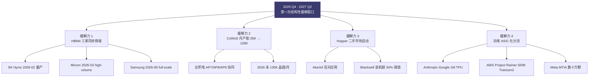
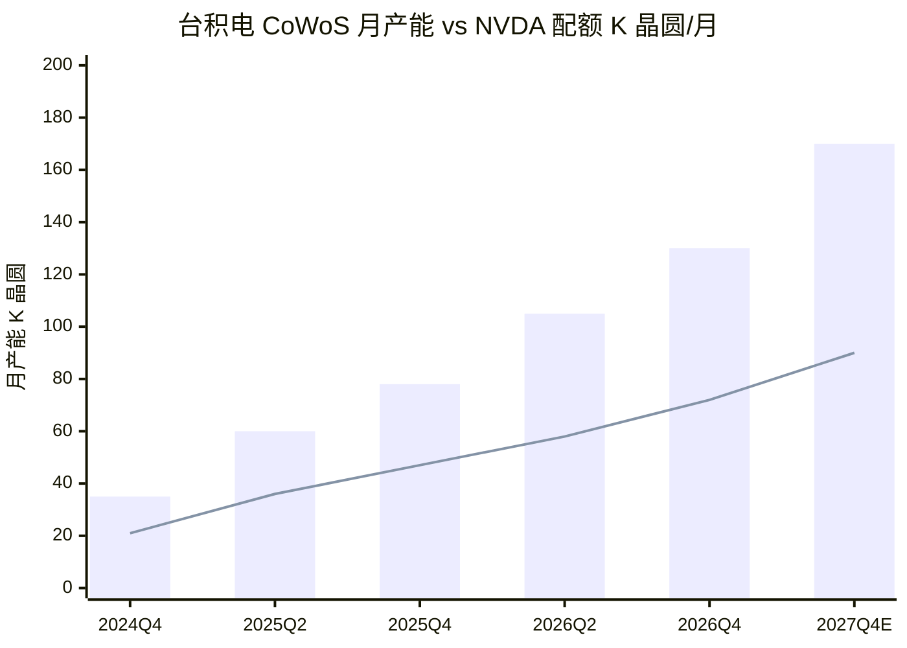
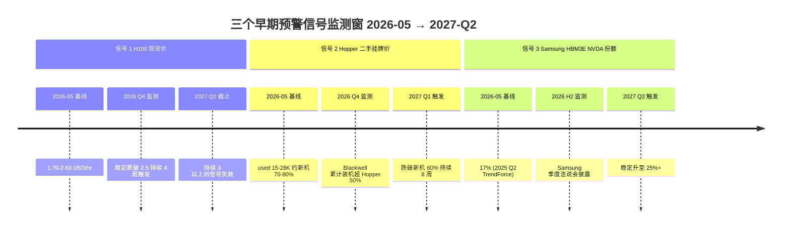

# 第 12 章 2027 拐点：双瓶颈缓解的节奏与三个预警信号

## 本章概览

这一章给一个反共识判断：**2026 年末到 2027 年上半年，是这一轮 AI 算力周期里双瓶颈第一次结构性缓解的拐点**。

主流叙事在 2024-2026 的稳定形态是「算力永远紧缺」——Jensen Huang 在每季财报会上重复 demand exceeds supply，Sam Altman 在多个公开场合说 compute 是当前 OpenAI 最稀缺的资源，Meta CFO Susan Li 在 Meta Q4 2025 财报会上说"demands for compute resources across the company have increased even faster than our supply"。

卖方研报与社交媒体把这种紧缺即永恒的叙事进一步放大成 AI 算力是新石油。

前一章已经从四因素（HBM 认证墙 / CoWoS 物理产能 / 电力交期 / 模型层杰文斯需求）证明 2024-2026 的物理紧缺真实存在，不是 [英伟达](https://www.nvidia.com/) 单方面的营销话术。承认紧缺的物理性之后，下一个问题是紧缺有没有窗口。

四股供给侧缓解力正在 2026 末-2027 上半年同步发生：(1) HBM4 三家（[SK 海力士](https://www.skhynix.com/) / [美光](https://www.micron.com/) / [三星](https://www.samsung.com/semiconductor/)）从一家独大切换到三家同步爬坡，2026 年内三家相继量产；(2) [台积电](https://www.tsmc.com/) CoWoS 月产能从 2024 年底的约 35K 片爬到 2026 年底的 120-130K 片，三年放大近 4 倍；(3) Blackwell 大规模出货之后，2024-2025 部署的 Hopper（H100 / H200）开始进入二手市场；(4) Anthropic / [Google](https://cloud.google.com/) / [AWS](https://aws.amazon.com/) 把部分训练负载从英伟达 GPU 切换到自研 ASIC（TPU / Trainium / MTIA），让英伟达队列里的需求出现结构性分流。

四股供给侧缓解力的同步落地是本章反共识立场的物理基础：



反共识判断是——**这是周期，不是结构**。卖方与媒体把算力永远紧缺当成长期叙事是错的：紧缺真实存在，但有窗口；窗口的边界由供给侧物理变量决定，不由叙事决定。

为了把这个反共识判断从宣告变成可被市场验证或证伪的论断，本章末尾给出三个可量化、可独立监测、可证伪的早期预警信号：(1) H100 现货价跌破 \$2.5/hr；(2) Hopper 二手挂牌价跌破新机 60%；(3) 三星 HBM3E 12-Hi 进入英伟达主流分配。

三个信号都基于公开数据源，监测频率周度到月度。章末立此存照段会明确写出：**如果 2027-Q2 截止前三个信号全部都没出现，则2027 拐点主张证伪**。

这是与卖方研报最大的姿态差别。卖方研报通常预测对了就拿出来表彰，预测错了就装作没说过；下面直接把预测的时间和阈值钉死在桌面上，让读者两年后回头能直接打分。

需要预先说明的口径限制：(1) Hopper 二手价格无公开统一交易所，采用 SemiAnalysis + Silicon Data + 渠道访谈的多源估算，三家口径差 10-15%；(2) HBM4 三家量产时点不同来源差 1-2 个季度，各家官方法说会与新闻稿口径并列呈现；(3) 三星 HBM3E 12-Hi 认证状态时点敏感，按 2026-05 最新公开信息整理。这些口径不影响反共识方向判断——四股缓解力同步落地这件事的物理基础足够厚。

## 12.1 「算力永远紧缺」的共识地图

要看清反共识立场的边界，先把当下市场的共识地图画清楚。这张共识地图由三方共同搭起来：卖方研报、模型公司管理层、社交媒体行业号。

**卖方研报这条线，主流口径在 2025 上半年成型**。Morgan Stanley、Goldman Sachs、Bank of America 在 2025 年的多份 AI 半导体研报里把"compute shortage through 2028"作为基础情景。主流卖方共识由具体数据支撑：AWS + Azure + Google + Meta 2026 自然年合计资本支出指引约 \$240-260B，同比 2025 年增长约 40%；NVDA FY26Q4 数据中心营收 \$62.3B + RPO 余额业内估算超过 \$90B。基础情景的论据链通常是：超大规模云厂资本支出五年指引连续上调 + NVDA 季报合同储备续创新高 + HBM 长合约提前 12-24 个月被预订 + 电力侧硬约束（变压器交期 2-4 年、电网升级 24 个月）+ 模型规模 + reasoning 推理对算力的非线性放大。每一条都有事实支撑，叠起来构成一张紧缺是长期常态的图。

**模型公司管理层这条线，自 2024 年起反复强化**。OpenAI 在 2024 年下半年开始把 compute-bound 作为口头禅，Sam Altman 在多个采访里说我们要的不是 1 万张卡，是 10 万张卡。Anthropic 在 2025 年与 Google 的 1M TPU 大单公告里直接写 securing the 产能 to train and serve the next generations of Claude models。Meta Q4 2025 财报会上 CFO Susan Li 的原话——"demands for compute resources across the company have increased even faster than our supply"——被多家媒体反复引用。这些表态形成一个闭环：用户相信 model lab 紧缺，model lab 因此能签长合约提前锁定供给，供给方看到长合约相信需求是真，于是继续扩产又被锁定。

**社交媒体行业号这条线，把上面两条线情绪化放大**。X / LinkedIn 上的 AI infra 号在 2024-2025 反复出现合同储备又破历史、H100 又涨价、机房又订满的标题。NVDA FY26Q1（截至 2025-04-27）数据中心营收 \$39.1B，FY26Q4（截至 2026-01-25）数据中心营收上到 \$62.3B 单季，每一次披露都是一次共识强化。

三方共识叠起来，结论是「未来 3-5 年算力仍然紧缺」。这个结论本身没问题——但把这个结论翻译成 NVDA 与 SK 海力士估值倍数应该长期享受紧缺溢价，就出现了第一个值得追问的点：**紧缺有没有窗口？**

紧缺有窗口和紧缺真实存在并不矛盾。1995-2000 telecom fiber buildout 的紧缺是真的，1996-1998 之间的光纤 / 路由器供应紧张也是真的，但 1999-2000 间供给侧爆发式爬坡之后，紧缺迅速变成过剩。算力周期会不会走同一条路？这是第 29 章（周期定位）的问题。本章只问比第 29 章早 2-3 年的那个问题：**如果紧缺有窗口，第一个结构性缓解出现在什么时候？**

本章的答案是——2026-Q4 至 2027-Q2。这个答案的物理基础是四股缓解力的同步落地。

## 12.2 反共识立场：2027 上半年是第一次结构性缓解

先把反共识立场写清楚，再往下展开论据。

**立场（一句话）**：双瓶颈是真紧缺，但紧缺有窗口——2026 末至 2027 上半年是这一轮 AI 算力周期中第一次结构性缓解的拐点。这是周期，不是结构。

**立场的三层结构**：

第一层（事实层）。截至 2026-05，四件事已是公开信息：(1) 三星已在 2025-09 通过英伟达 HBM3E 12-Hi 认证，首批 10,000 颗供货已发；(2) SK 海力士 HBM4 在 2025-09 完成开发并宣布 mass production ready，2026-02 实际启动量产；(3) 美光在英伟达 GTC 2026（2026-03）官方宣布 HBM4 进入 high-volume production for Vera Rubin；(4) 台积电在 2025-2026 多个法说会上确认 CoWoS 月产能 2026 年底目标 120-130K 片。这一层是 verifiable。

第二层（分析层）。把四件事的时点拼起来，2026-Q4 至 2027-Q2 是供给侧第一次出现多个瓶颈同步缓解的窗口。HBM4 三家同步出货意味着英伟达从 SK 海力士独家供应 + 美光二供变成三供同台，议价权从供方端略微回到英伟达端；CoWoS 月产能从 80K 爬到 130K（业内估算 2026 中到 2026 末）意味着英伟达出货的物理上限抬升约 60%；Hopper 二手市场在 Blackwell 大规模交付后（2025-Q4 起进入量产、2026 全年放量）开始释放有效供给；ASIC 分流（Anthropic 1GW+ TPU 已签、AWS Trainium2 集群上线、Meta MTIA 部署）让 NVDA 队列里的有效需求出现结构性分流。四件事任何一件单独发生都不构成结构性缓解，但四件事同步发生在 2026-Q4 至 2027-Q2，量级足够形成第一次可被市场识别的紧缺缓解。

第三层（预测层）。预测层有假设、有边界条件、有时间窗口。本章给出的预测——2027 上半年出现结构性缓解——明确假设：(1) HBM4 三家爬坡良率不会再延后 6 个月以上；(2) CoWoS 130K 月产能在 2026 年底落地（不是 2027-Q2 才落地）；(3) Blackwell 出货量在 2026 全年保持当前指引（不出现重大延期）；(4) ASIC 分流总量在 2026-2027 年达到 ~10-15% 的训练算力占比。任一假设不成立，缓解的时间窗口会推后。

这不等于预测算力将永久过剩。供给侧的缓解之后，需求侧弹性（杰文斯 / reasoning 推理 / 后训练 RL）会接住部分释放出来的产能。这里只论证供给侧的物理缓解：**2026 末-2027 上半年这个时间窗口里，HBM / CoWoS / Hopper 三个层面的有效供给都会有非线性的增加**。

这个反共识立场的反共识浓度有多高？把市场上对照看一眼。Morgan Stanley 在 2025 年的 AI infra 综述里把"compute shortage through 2028"作为 base case；Goldman Sachs 在多份 AI 资本周期报告里没有明确给出紧缺缓解窗口的时点；Dylan Patel 在 2025 年的访谈里给出2026 年瓶颈在 memory，2027+ 转到晶圆的判断，方向上与本章近似，但 SemiAnalysis 没有把2027 上半年第一次结构性缓解作为可证伪的明确判断写出来。本章把这个判断变成可证伪的命题，是与卖方研报和行业号在姿态上的真正分别。

## 12.3 缓解力 1：HBM4 三家同步爬坡

HBM4 是 2026-2027 供给侧缓解里最早、最确定、最重要的一股。

**SK 海力士**。SK 海力士在 2025-09 宣布"world's first HBM4 mass production ready"，2026-02 实际启动量产。规格上 SK 海力士 HBM4 首批是 12-Hi 36GB 配台积电 N12 logic base 裸片。带宽超过 2 TB/s 单 stack。英伟达 Vera Rubin 平台是首发客户。业内估算 SK 海力士在英伟达 HBM4 首年（2026 自然年）采购占比 50-55%，仍是主供，但份额已从 HBM3E 时代的 60%+ 略下移。

**美光**。美光在英伟达 GTC 2026（2026-03-17）官方宣布"in high-volume production of HBM4 designed for NVIDIA Vera Rubin"。规格上 HBM4 36GB 12-Hi、pin speed 超过 11 Gb/s、单 stack 带宽超过 2.8 TB/s。美光同时已经送出 16-Hi 48GB stack 的早期样品。业内估算美光在英伟达 HBM4 首年采购占比 20-25%。

**三星**。三星在 2026-01 末通过英伟达 HBM4 system-in-package 测试，data rate 11.7 Gb/s 超过英伟达与 AMD 的 10 Gb/s 规格要求。2026-02 启动英伟达 / AMD 的 HBM4 出货，full-scale supply 预计 2026-06 起。业内估算三星占英伟达 HBM4 首年采购 mid-20%。三星同时计划 2026 全年 HBM 总产能扩到 250K 晶圆 / 月，较 2025 年底的 170K 提升约 47%。

把三家拼起来：

| HBM4 厂商 | 量产时点 | 主要客户 | 首年英伟达占比（业内估算） | 关键里程碑 |
|---|---|---|---:|---|
| SK 海力士 | 2026-02 量产 | 英伟达 Vera Rubin 首发 | 50-55% | 2025-09 mass production ready 公告 + 2026-02 爬坡 |
| 美光 | 2026-03 进入 high-volume production | 英伟达 Vera Rubin | 20-25% | 2026-03-17 GTC 2026 官宣 + 16-Hi 早期样品已出 |
| 三星 | 2026-02 启动出货，6 月起 full-scale supply | 英伟达 / AMD | 20-25%（业内估算 mid-20%） | 2026-01 末通过英伟达 SIP 测试（11.7 Gb/s 超规格）|

> 来源：SK 海力士量产时点综合 TrendForce 2025-09-12、Digitimes 2025-12-26；美光量产综合美光投资者关系新闻稿 2026-03-17、StorageNewsletter 2026-03-17、Tom's Hardware 2026-03、TechPowerUp 2026-03；三星量产综合 TrendForce 2026-01-26、Digitimes 2025-12-26。英伟达首年采购占比为业内估算，三家与英伟达均不分品类披露 HBM4 采购量。

这张表的关键不在每一行的具体数字，而在三行排在一起意味着的事情。HBM3E 时代 SK 海力士在英伟达供应链里的份额是 60%+，美光是 20%，三星是 17%，三家差距很大且认证进度严重错位。HBM4 时代三家爬坡时点压缩到 4-6 个月之内——从 2026-02 SK 海力士 / 三星开始量产，到 2026-03 美光进入 high-volume production——历史上第一次出现三家同时进入英伟达主供应链的格局。

三家同步爬坡的市场含义有三层。

**第一层，英伟达议价权部分回归**。HBM3 / HBM3E 时代英伟达排队拿货，HBM3E 12-Hi 36GB stack 单价从 2024 上市的 \$250 涨到 2026 年合约的 \$300（涨价 20%，来源：TrendForce 2025-12-24 + 第 6 章 §4 价格曲线）。HBM4 三家同台之后，英伟达可以在三家之间分配订单，议价空间从几乎为零回到个位数百分点。

**第二层，HBM3E 的合约溢价开始回吐**。三家把产能从 HBM3E 切换到 HBM4 的过程中，市场普遍预期 HBM3E 单价在 2027 年开始回落——但前提是 HBM4 产能能跟上英伟达 Rubin / Hopper 全代际需求（不再让 HBM3E 承担老型号增量的角色）。本章的判断是：2027 年中之前，HBM3E 仍享受紧缺溢价，但 2027-Q4 之后将出现首次有意义的价格回落。这个判断的边界条件是 HBM4 三家产能爬坡不再延后。

**第三层，三星是这一轮份额再分配的最大获益方**。三星在 HBM3E 12-Hi 上落后 18 个月（2024-03 Jensen Approved 到 2025-09 真正通过英伟达认证），同期 HBM 市占从约 40%（业内数据在 39-41% 区间）跌到 17%。

HBM4 时代三星用 11.7 Gb/s 速率超过英伟达 10 Gb/s 规格要求，未经重新设计即通过英伟达认证。三星计划 2026 年 HBM 总产能扩 50% 到 250K 晶圆 / 月。

这意味着：到 2027 上半年，三星可能从 HBM3E 时代被边缘化的状态，重新回到 HBM 三家中前两名的格局。这件事对英伟达供应链是直接的供给增加，对三星半导体板块的估值是直接的修复。

但有一个时间差需要看清楚——三家爬坡的同时进入量产和同时形成有效供给不是一回事。三星的 full-scale supply 在 2026-06 起，美光的 high-volume production 从 2026-Q1 末才开始；从爬坡到稳定的良率 maturity 通常需要 6-9 个月。也就是说，三家爬坡形成的有效供给增加的最佳节点在 2026-Q4 至 2027-Q2 之间——这正是本章反共识立场里第一次结构性缓解窗口的物理基础。

把量级压一下。SK 海力士 2026-02 量产初期月度 HBM4 出货预计在 50-100K stack 区间（业内估算，来源：TrendForce × SemiAnalysis 综合，三家与英伟达均未单独披露 HBM4 出货量）；三家合计 2026 全年 HBM4 总产量业内估算 800K-1.2M stack。这个区间宽度反映出三家良率爬坡节奏与三星 full-scale supply 推迟到 2026-06 的不确定性。把这个数字与英伟达 Vera Rubin 2026 自然年量产规模放在一起看，是供给侧增加量级的最直接度量——Rubin 单 GPU 配 8 stack HBM4 起步，800K-1.2M stack 大致对应 100K-150K Rubin GPU 的 HBM 配套上限，与英伟达 Rubin 2026 首年规模指引（业内估算 Rubin 首年出货约 50-100K，2027 量级抬升）方向一致。

## 12.4 缓解力 2：台积电 CoWoS 月产能翻倍

CoWoS（Chip-on-Wafer-on-Substrate，台积电 2.5D 先进封装，把 GPU 与 HBM 集成在同一硅中介层；下同）是英伟达 AI 卡产能的物理瓶颈之一。第 5 章已经讲过 CoWoS 工艺、客户分配、产能爬坡的细节。本章只看 CoWoS 在 2026-2027 这个时间窗口里的产能曲线。

把台积电 CoWoS 月产能的时间序列拉出来：

| 时点 | 月产能（晶圆 / month）| 来源 |
|---|---:|---|
| 2023 年底 | 约 15-20K | 台积电法说会 + Trendforce |
| 2024 年底 | 约 35K | 台积电法说会 + Trendforce 2024-Q4 |
| 2025 年中 | 约 75-80K | 台积电法说会 + FinancialContent 2026-01 整理 |
| 2026 年中（业内估算） | 约 100K | 台积电法说会指引 + FinancialContent 2026-01-01 |
| 2026 年底（公司指引）| 120-130K | 台积电 2025-Q4 / 2026-Q1 法说会 + Tiger Brokers 引用 127K + FinancialContent 2026-02 引用 130K |
| 2027 年底（推演） | 业内估算 160-180K | SemiAnalysis 推演 + Trendforce 2026-Q1 |

> 来源：台积电月产能时间序列综合台积电季度法说会指引（2024-Q4 至 2026-Q1）、Trendforce 2025-12-08 CoWoS-L/S 报道、FinancialContent 台积电 to Quadruple Advanced Packaging Capacity 2026-02-05、Tiger Brokers 2025 引用 127K 数据、台积电 2026 资本支出报道。所有产能数据为月度等效，台积电自身披露与第三方测算口径有 ±10% 差异。

从 2024 年底的 35K 到 2026 年底的 130K，三年放大约 3.7 倍。台积电在 2024 年底仅有 35K 月产能，两年内扩张至 130K，年均增速约 90%——快于台积电同期 3nm / 5nm 前道晶圆厂主要节点的扩张速度。要把这个数字翻译成英伟达出货能力，需要看英伟达占用 CoWoS 的比例与单卡占用的晶圆数。

英伟达在台积电 CoWoS 产能里占比 50-55%（2026 业内估算，剩下博通 / AMD / 其他客户共占 45-50%，来源：业内研报综合 + Tiger Brokers 引用英伟达占比超过一半）。按 2026 年底 130K 月产能、英伟达占 55% 推演，英伟达在 CoWoS 上每月有 ~71K 晶圆可用。每片 CoWoS 晶圆大致能产出 30-50 颗 Blackwell / Rubin GPU package 当量（业内估算，与具体裸片尺寸、CoWoS-L 与 CoWoS-S 配比有关。300mm 晶圆有效面积约 70,000 mm²，GB200 GPU 裸片约 814 mm²，裸片良率业内估算 50-70%，理论每片可产出 40-60 个裸片。但 CoWoS-L 处理的是已 thinned 的 SoIC 模块 + interposer 集成，1 片 CoWoS 晶圆输出的最终 GPU package 数量取决于具体封装设计——GB200 单 package 含 2 个 B200 裸片，Rubin 配置不同，30-50 是综合不同 SKU 后的口径）。

把这个产能转换成年度 GPU 出货上限：71K × 12 × 30-50 / 折算到最终 package（业内估算综合折扣后年度上限约 250-400 万颗 GPU package）。这个数字与英伟达 2026 年 Blackwell 出货指引大致匹配。英伟达 FY26Q1（截至 2025-04-27）数据中心营收 \$39.1B，FY26Q4（截至 2026-01-25）数据中心营收 \$62.3B，FY26 全年数据中心营收合计 \$193.7B。按 GB200 ASP \$65K-90K（业内估算）反推，全年 GPU 数量在 210-300 万颗量级（数据中心营收里除 GPU 之外还含 NVL 系统、networking、HGX 整机溢价等成分，故反推为区间估算），与 CoWoS 产能推演的年度上限区间方向一致。

CoWoS 130K 月产能落地在 2026 年底这件事，对供给侧的意义不是瓶颈消失，是瓶颈位置发生迁移——从 CoWoS 的物理产能瓶颈，转向英伟达客户分配、HBM4 配套良率、电力 site 交付这些下游瓶颈。

前一章给出的四因素里，CoWoS 这一因素在 2026 末的紧迫度会从硬性约束降到松约束。这是四股缓解力里量级最大、时点最确定的一股。

把 CoWoS 月产能与 NVDA 占比对应的可用晶圆配额画出来，能直观看到 2026 末后供给端的释放节奏：



2027 年之后的 CoWoS 走向 160-180K 业内估算月产能，主要由台积电嘉义 AP7 复合体和 OSAT（Outsourced Semiconductor Assembly and Test，半导体封测外包服务商）合作（ASE 的 CoWoP（Chip-on-Wafer-on-Panel，ASE 用大尺寸面板替代圆片实现规模效应的 CoWoS 替代封装路线）路线，来源：Trendforce 2025-12-08）共同支撑。AP7 多期建设到 2027 年陆续上线。这一层是支撑本章反共识立场里2027 上半年第一次结构性缓解延伸到2027 全年缓解持续的物理依据。

值得单独标注的一个口径分歧：台积电自身在法说会上通常给出 CoWoS-L + CoWoS-S 合计产能指引，而 SemiAnalysis 与 Trendforce 在测算里有时只算 CoWoS-L（适配 Blackwell / Rubin 大裸片）。本章用台积电公开口径（合计 CoWoS-L + CoWoS-S）来表述 130K 这个数字，因为这是市场上引用最广的口径。如果只看 CoWoS-L，2026 年底产能约为合计的 60-70%，即 78-91K 晶圆 / 月。这个差异不影响本章的方向判断。

## 12.5 缓解力 3：Hopper 二手市场启动

这一节是本章方法论上最有意思的一节——用 Akerlof 二手车市场理论的反向应用，把 Hopper 二手市场作为周期早期信号。

2024-2025 部署的 Hopper（H100 / H200）GPU，会在什么时点进入二手流通？决定时点的不是 Hopper 本身的物理寿命，而是 Blackwell / Rubin 的供给速度。当 Blackwell 大规模交付后，超大规模云厂在新机房会优先部署 Blackwell（GB300 NVL72 系统 vs Hopper 吞吐 / 功率最高 50x，单位 token 成本最低降至 1/35，来源：英伟达 FY26Q4 财报电话会 2026-02-25 + 英伟达 Developer Blog 2026），存量 Hopper 的边际价值开始相对下降，一部分会进入二手市场。

**Akerlof 1970 二手车市场的反向应用**。Akerlof 在《The Market for Lemons》里说，二手车市场的信息不对称（卖方比买方更了解车况）让好车不进入流通、烂车占据市场——这是一个信息不对称的负面案例。GPU 二手市场刚好走相反的方向——卖方（超大规模云厂）非常清楚自己的 Hopper 状态（utilization、温度史、抗 ECC 错误率），买方（中小 GPU 云、推理初创、二线模型公司）愿意支付的价格远高于烂车价，因为 Hopper 在推理与中小训练场景下的剩余使用价值非常高。GPU 二手市场是卖方主导退市但买方主导定价的复合市场。

这种结构让 Hopper 二手价的变化对供给侧的信号意义比一般行业的二手价更强。**Hopper 二手价的变化曲线，是观测 NVDA 出货能力 vs 模型公司需求之间相对力量变化的一个高频信号**。

把 H100 现货 rental price（GPU 时租价）和 Hopper 整机二手挂牌价两个变量拉出来，可以看到 2024-2026 的曲线：

| 时点 | H100 现货价（\$/hr）| H100 整机挂牌价（业内估算 \$K，新机参考 \$25K-30K）| 数据来源 |
|---|---:|---:|---|
| 2023 年（GPU shortage 顶点）| \$7-10 | \$30-40K（一卡难求）| SemiAnalysis 2023、Silicon Data 2023 历史曲线 |
| 2024 年中 | \$5-7 | \$28-35K | SemiAnalysis、Silicon Data |
| 2025 年中 | \$3-4 | \$22-28K | Silicon Data 2025-H2 综合 |
| 2025-10 | \$1.70（1 年合约低点）| \$20-25K | SemiAnalysis 2026-03 引用 Silicon Data |
| 2026-03 | \$2.35（1 年合约）| \$20-25K（新机参考 \$25-30K）| SemiAnalysis 2026-03 H100 1-year contract index |
| 2026-05 | \$1.70-2.63（不同合约长度）；现货部分跌到 \$1.03-1.49（小厂商）| 业内估算 \$18-25K | Silicon Data + IntuitionLabs 2026 |

> 来源：H100 现货 rental 数据综合 Silicon Data H100 Rental Index、SemiAnalysis 2026-03 GPU Pricing Index、IntuitionLabs 2026 H100 Rental Prices Compared。整机挂牌价为业内估算，无公开统一交易所。Compute Exchange 2026 引用 H100 GPUs priced at \$15K-\$28K used, refurbished \$21K-\$34K 作为 2026 市场行情。

这张表里有两件事值得单独看。

**第一件，现货价已经在 2025-2026 进入波动下行通道，但下行被一年合约提价部分对冲**。2025-10 H100 一年合约价跌到 \$1.70/hr 是周期低点，2025-Q4 开始 1 年合约价回弹到 2026-03 的 \$2.35/hr（+38%，来源：SemiAnalysis 2026-03 GPU Pricing Index）。这次回弹的原因是超大规模云厂把 Hopper 用作推理主力（Blackwell 更贵且优先训练），同时 reasoning 推理对推理算力的拉升，让 Hopper 推理需求在 2025-Q4 至 2026-Q1 出现一次反弹。但现货端在 2026-05 又跌到 \$1.03-1.49/hr（小厂商如 Spheron / RunPod，来源：IntuitionLabs 2026），合约价与现货价的剪刀差扩大——这是供给侧分化（超大规模云厂端紧 + 小厂商端松）的典型信号。

**第二件，整机挂牌价相对稳定，但成交量上升**。Compute Exchange 2026 数据显示 H100 used 范围 \$15-28K（refurbished \$21-34K），相对 2024 年的 \$28-35K 已经下行 20-30%。整机挂牌价没有像现货价那样大幅波动，但成交量在 2025-Q4 开始上升——这是因为 Blackwell 大规模交付后，超大规模云厂释放出部分 Hopper 库存进入二手流通。SemiAnalysis 2026 估算 Blackwell 通用可用性 will exert 10-20% downward pressure on H100 secondary pricing once widely available，方向已经定调。

把这两件事拼起来：Hopper 二手市场在 2025-Q4 至 2026-Q2 之间正在从几乎无流通状态转向低流量但稳定流通状态。本章的判断是——这个市场会在 2026-Q4 至 2027-Q1 进入第一次显著放量。放量的物理触发条件是 Blackwell 出货 cumulative crossing 200 万颗（按英伟达 FY26 全年指引推演会在 2026-Q3 至 2026-Q4 达成）。当 Blackwell 累计装机量超过 Hopper 装机量的 50%，超大规模云厂的 fleet 管理策略会从满负荷使用 Hopper 转向主动释放 Hopper 到内部推理 / 二手市场。

为什么这一项被列入四股缓解力？因为 Hopper 进入二手流通直接增加了中小 model lab + 推理初创这一层的有效算力供给。这部分需求过去要排队拿英伟达新机（H100 / H200 / B200），现在可以用 Hopper 二手承接。这相当于在英伟达一手供应链之外开了一道泄洪闸。

Hopper 二手价的具体阈值会在 §12.7 三个预警信号里单独定义。

## 12.6 缓解力 4：训练 ASIC 化

第四股缓解力是结构上最微妙的——超大规模云厂与大型 model lab 把部分训练负载从英伟达 GPU 切换到自研 ASIC（专用集成电路）。这件事在 2025 下半年到 2026 上半年密集落地。

各家 ASIC 容量扩张的时间表：

```mermaid
timeline
    title 超大规模云厂 ASIC 扩张时间表 2025-2027
    section Anthropic-Google
        2025-10 : 1M TPU + 1GW 公告
        2026-04 : Broadcom-Google 3.5GW 后续大单
        2027 : multi-GW TPU 交付
    section AWS Trainium
        2025-11 re:Invent : Project Rainier 500K Trainium2
        2026 : Anthropic 训练 + 推理
        2027 : Trainium3 容量扩张
    section Meta MTIA
        2026-03 : 4 代 MTIA 路线图
        2026 H2 : MTIA 450 上市
        2027 : MTIA 500 上市
```

**Anthropic-Google 1M TPU 大单（2025-10-23 公告）**。Anthropic 与 Google Cloud 签约获得 up to 1 million TPU chips 与 well over 1 GW of 产能 coming online in 2026。合同总额按媒体估算 tens of billions USD。这是 ASIC 在大型 model lab 训练侧第一次拿到 1M-chip 量级的单一订单。

Anthropic 的选择理由是 price-performance and efficiency——这件事本身就是一个信号：Anthropic 既是一家被 [Amazon](https://aws.amazon.com/) 累计承诺投资约 \$33B（2025 年前 \$8B + 2026-04 追加 \$25B，来源：CNBC 2026-04-20）的 AWS Trainium 客户，也是一家被 Google 累计承诺投资 \$40B（2026-04-24 公告）的 TPU 客户，两家投资捆绑都到位的情况下，Anthropic 仍然把 NVDA 列为第三选项。这不是技术因素单独主导的选择，但它是 NVDA 队列里合同储备净分流的实证。

**Anthropic-博通-Google 3.5 GW 后续大单（2026-04-06 公告）**。Anthropic 与 Google / 博通签新约获得 multi-gigawatt next-generation TPU 产能，2027 年开始交付。SEC 文件披露 3.5 GW 总容量。Mizuho 估算博通从 Anthropic 在 2026 年获得 \$21B AI 收入、2027 年获得 \$42B。大部分新算力将在美国部署，对应 Anthropic 此前承诺的 \$50B 美国 AI 基础设施投入。这一笔单子让 2027 年的 ASIC 总量从 1 GW 量级抬升到 3+ GW 量级，是本章反共识立场中 ASIC 分流在 2027 年仍然加速的直接证据。

**AWS Project Rainier**。AWS 与 Anthropic 联合部署的 Trainium2 大集群 Project Rainier 在 2025 年底激活，规模接近 500,000 颗 Trainium2 芯片。AWS 在 re:Invent 2025（2025-12）上把 Project Rainier 作为旗舰发布。Anthropic 同时承担 Trainium2 集群训练 + 推理两用工作负载，比例上推理已超过训练。

**Meta MTIA 路线图**。Meta 在 2026-03-11 公布 4 代 MTIA（Meta Training and Inference Accelerator）路线图——MTIA 300 已量产用于推荐排序、MTIA 400 在为生成式 AI 推理做实验室验证、MTIA 450 与 MTIA 500 在 2026-H2 和 2027 上市。Meta 已经在生产环境部署 "hundreds of thousands of MTIA chips"，且 MTIA 与英伟达 H100/H200/B200 共存——前者承担推荐 + 推理，后者承担前沿训练 + 峰值推理。

**Google TPU 自身节奏**。TPU v6e (Trillium) committed-use 价格低至 \$0.39/chip-hour，4.7x perf/chip vs v5e，67% 推理功耗下降 vs 高端 NVDA GPU。

把四个数据拼起来，2026-2027 ASIC 在 AI 训练算力里的占比有一个粗略估算：

| ASIC 平台 | 2026 装机容量（GW，业内估算）| 2027 装机容量（GW，业内估算）| 主要用途 |
|---|---:|---:|---|
| Google TPU（Anthropic 单 + Google 内部）| 1.5-2 | 3-4 | 训练 + 推理 |
| AWS Trainium（Project Rainier + Anthropic + AWS 自用）| 1-1.5 | 2-3 | 训练 + 推理 |
| Meta MTIA | 0.5-1 | 1-2 | 推荐排序 + 推理 |
| 合计 ASIC | 3-4.5 | 6-9 | — |
| 英伟达 GPU（参照系，AWS/Azure/Google/Meta/Oracle 资本支出推演）| 25-30 | 35-45 | 训练 + 推理 |
| ASIC 占比（业内估算） | 10-15% | 15-20% | — |

> 来源：装机容量为业内估算，综合 Anthropic-Google 1 GW 公告 2025-10、Anthropic-博通 3.5 GW 公告 2026-04、AWS Project Rainier 500K Trainium2 公告 2025-11、Meta MTIA 公告 2026-03、Mag7 2026 资本支出 \$660-690B 推演。所有数字均为容量等效估算，电力 GW 转算力的口径在各 ASIC 厂商之间不完全统一。英伟达 GPU 参照系用 Mag7 + Oracle 2026 资本支出合计与英伟达 FY26 全年指引交叉推演。

这张表里的占比 10-15% / 15-20%是 ASIC 在训练算力的渗透率，不是在总算力（训练 + 推理）的渗透率。推理侧 ASIC 渗透率更高（Meta MTIA 推荐排序部分接近 100%、TPU 在 Google 内部推理占比 60%+），但训练侧仍是英伟达主导。

ASIC 训练算力占比 10-15% 的估算基于三个口径折算：(1) TPU v6e 每 MW 算力业内估算约 4-6 PFLOPS BF16（基于 Google 官方 perf/W 数据 + Trillium pod 配置反推）；(2) Trainium2 每 MW 业内估算约 3-5 PFLOPS BF16（基于 AWS re:Invent 2025 公开性能指标 + UltraServer 配置）；(3) Meta MTIA 每 MW 业内估算约 2-4 PFLOPS（不同代际差异大，MTIA 300 偏推理优化）。各厂商口径差异约 20-50%（FP16/BF16/FP8 不同精度等效、稀疏 vs 稠密、pod 级 vs 卡级），是这个估算区间的最大不确定性来源。英伟达参照系按 GB200 整柜 ~120 kW + 单柜 ~400 PFLOPS BF16 反推（H100 / B200 / GB200 不同，业内估算）。

ASIC 分流对英伟达队列的影响是什么？是把英伟达队列里必须用英伟达的需求挤出一部分。Anthropic 在 2025-Q3 之前是英伟达头部客户之一（通过 AWS），Anthropic-Google 1M TPU 大单意味着 Anthropic 此后 60-70% 的新增训练算力会跑在 TPU 上（业内估算，来源：Tom's Hardware 2026-04 / 多家媒体综合）；Meta 在推荐排序场景几乎完全 MTIA 化，节省下来的 GPU 配额回到 LLM 训练。这些分流不是英伟达失去客户，是英伟达客户的需求结构出现分层——前沿训练继续买英伟达，推荐 / 推理 / 部分非前沿训练转向 ASIC。

把四股缓解力（HBM4 三家 / CoWoS 130K / Hopper 二手 / 训练 ASIC 化）拼到一起，2026-Q4 至 2027-Q2 的供给侧画面是这样的：HBM 与 CoWoS 物理产能同时大幅抬升、Hopper 在二手市场释放出额外有效供给、ASIC 分流让英伟达队列里的合同储备净下降。这四件事任何一件单独发生不构成结构性缓解，四件事同时发生在一个 6 个月的时间窗口里，缓解的物理量级足够形成市场可识别的信号。

## 12.7 三个早期预警信号

本章反共识立场的可证伪性，最终落到三个早期预警信号上。每个信号都满足三个条件：(1) 基线值有公开数据源；(2) 触发阈值有具体数字；(3) 监测频率周度或月度，读者可以自己跟踪。

三个信号在 2026-05 至 2027-Q2 监测窗内的时间分布：



### 信号 1：H100 现货价跌破 \$2.5/hr

**基线（2026-05）**：Silicon Data H100 Rental Index 显示 2026-05 H100 现货价在 \$1.70-2.63/hr 区间波动，不同合约长度差异较大；SemiAnalysis 1 年合约价 2026-03 为 \$2.35/hr。

**触发阈值**：H100 现货价稳定跌破 \$2.5/hr，连续 4 周。

**监测来源**：Silicon Data H100 Rental Index（每周更新，覆盖 80%+ 全球 H100 租赁市场）+ SemiAnalysis GPU Pricing Index（每月更新，1 年合约价为主）。

**为什么这个阈值有意义**：\$2.5/hr 是英伟达 H100 over-the-life ROI 模型里中性的盈亏平衡线（业内估算，基于 H100 整机 \$25K-30K + 4 年折旧 + 数据中心运营成本）。

如果现货价长时间稳定低于 \$2.5/hr，意味着 GPU 云的实际盈利模型已经从紧缺溢价 + 高 ROI 切换到接近 marginal cost + 微利。在 GPU 一级市场紧缺仍真实存在的前提下，现货价持续下行只能解释为：要么 Hopper 二手释放量大于预期（缓解力 3 兑现），要么 ASIC 分流量大于预期（缓解力 4 兑现）。两者都直接对应本章反共识立场。

**反向条件**：如果 H100 现货价在 2027-Q2 之前仍然稳定在 \$3/hr 以上、且 1 年合约价从 \$2.35/hr 继续上行到 \$3/hr+，则信号 1 失效——意味着 Blackwell 出货不足以释放 Hopper 二手、或推理需求 reasoning 拉动远超预期，紧缺的窗口比本章预测的更长。

**2026-05 基线状态：接近触发（yellow zone）**。1 年合约价 \$2.35/hr 已位于阈值 \$2.5/hr 下方，小厂商现货价 \$1.03-1.49/hr 显著低于阈值，但 SemiAnalysis 1 年合约价 2025-Q4 至 2026-Q1 仍有从 \$1.70 反弹到 \$2.35 的过程，尚未稳定跌破阈值连续 4 周。这意味着信号 1 的观察期比其他两个信号更短，可能是供给侧缓解的早期先行指标。若 1 年合约价在 2026-Q4 至 2027-Q2 期间稳定跌破 \$2.0/hr 连续 4 周（即从 yellow 进入 red zone），则本章对2027 上半年第一次结构性缓解的判断获得第一个市场验证。

### 信号 2：Hopper 二手挂牌价跌破新机 60%

**基线（2026-05）**：Compute Exchange / Hashrate Index 2026 数据显示 H100 used 在 \$15-28K（refurbished \$21-34K），新机参考 \$25-30K。used 中位价相对新机中位价的比例约 70-80%（业内估算，无公开统一指数）。

**触发阈值**：H100 整机二手挂牌中位价跌破新机中位价 60%，连续 8 周。即 used 中位价跌破 \$15-18K。

**监测来源**：Compute Exchange 月度数据 + GPU 二手平台（vast.ai / RunPod 内部交易数据 + 业内渠道访谈月度均价）。这一项的监测困难度高于信号 1，因为没有公开统一交易所。本章推荐的监测方式是：用 Compute Exchange / Hashrate Index / IntuitionLabs 三家月度数据的均值。

**为什么这个阈值有意义**：本章将 60% 作为判断阈值——在 Akerlof 信息不对称框架的**类比**下，当二手价跌破新机 60%，超大规模云厂继续持有 Hopper 的机会成本开始超过部署 Blackwell 的置换成本，主动放出意愿将大幅提升。**这个 60% 阈值是本章作者基于 4 年线性折旧模型 + 残值估算推演的估算，并非来自 Akerlof 原始文献**。如果 Hopper 二手价跌破新机 60%，意味着超大规模云厂的边际持有意愿大幅下降——这只可能发生在 Blackwell 累计装机已经超过 Hopper 的关键节点之后。本章的判断是这个节点会在 2026-Q4 至 2027-Q1 出现。

**反向条件**：如果 Hopper 二手挂牌价在 2027-Q2 之前仍然稳定在新机 70%+，意味着 Blackwell 出货爬坡比预期慢、或 Hopper 在推理侧的剩余使用价值高于预期，紧缺的窗口比本章预测的更长。

### 信号 3：三星 HBM3E 12-Hi 进入英伟达主流分配

**基线（2026-05）**：三星已在 2025-09 通过英伟达 HBM3E 12-Hi 认证，首批 10,000 颗供货已发。但截至 2026-Q1，三星在英伟达 HBM3E 实际采购中的占比仍然偏低——KED Global 2025-10-30 报道三星 "sells out 2026 HBM supply"，但英伟达端 HBM3E 主流分配仍以 SK 海力士 + 美光为主。

**触发阈值**：三星在英伟达 HBM3E 12-Hi 月度采购量占比稳定升至 25%+，且 2026 年 H2 英伟达法说会 / SK 海力士 / 三星法说会披露的份额数据显示三家差距从 60% : 21% : 17%（2025-Q2 TrendForce）收敛到 50% : 25% : 25% 这个量级。

**监测来源**：三星法说会季度披露 + TrendForce 月度 HBM 市占报告 + KED Global 韩国本地媒体跟踪 + 英伟达法说会管理层表态。

**为什么这个阈值有意义**：三星重获英伟达主流分配，是 HBM 供应链从单源到双源到三源稳定切换中最难的一步。三星 18 个月缺席之后回到主流分配，意味着 HBM 议价权第一次出现实质性回归。这一项与缓解力 1（HBM4 三家同步爬坡）是同源信号——HBM3E 三家平衡发生在 HBM4 三家同步爬坡之前，是 HBM4 平衡格局的前置条件。

**反向条件**：如果三星在 2027-Q2 之前仍然没能在英伟达 HBM3E 12-Hi 采购里拿到 25%+ 份额、且 HBM4 首年采购占比也低于业内估算的 mid-20%，意味着三星的 HBM 业务恢复比预期慢、或英伟达主动维持双源策略以控制风险，HBM 议价权回归比本章预测的更慢。

### 三个信号的复合判断

三个信号在物理上的独立性中等——信号 2（Hopper 二手）与信号 1（H100 现货）有相关性（同一物理产品的两个价格维度），信号 3（三星份额）与信号 1 / 2 物理上独立（不同环节）。本章的可证伪条件不是三个信号同时触发，而是三个信号至少有一个在 2027-Q2 之前触发——只要供给侧有一处出现非线性缓解，就证明本章反共识立场方向正确；如果三个信号在 2027-Q2 之前全部都没触发，本章作废。

把三个信号的基线与阈值列在一张表里：

| 信号 | 基线（2026-05）| 触发阈值 | 监测来源 | 反向条件 |
|---|---|---|---|---|
| 1. H100 现货价 | \$1.70-2.63/hr（不同合约长度）| 稳定跌破 \$2.5/hr 4 周 | Silicon Data + SemiAnalysis | 持续 \$3/hr+ |
| 2. Hopper 二手挂牌价 | used 中位 \$15-28K，约新机 70-80% | 跌破新机 60% 持续 8 周 | Compute Exchange + Hashrate Index 月度均值 | 维持新机 70%+ |
| 3. 三星 HBM3E 12-Hi 英伟达份额 | 2025-Q2 17%，2025-Q3-Q4 缓慢回升中 | 稳定升至 25%+ | 三星法说会 + TrendForce 月报 | 维持 < 20% |

**信号相关度**：信号 1 与信号 2 高度相关——同一产品（Hopper）的两个价格维度（时租 vs 整机挂牌），同向触发概率大，两者本质上是 Hopper 边际持有价值下行在两个市场上的不同表达；信号 1/2 与信号 3 低相关——信号 3 是 HBM 端的认证状态，与 Hopper 的价格曲线独立，是两个不同物理环节的观察维度。读者监测时把信号 3 作为独立验证轴，比把三个信号当作同源指标的复合判断更稳健。

三个信号都在 2026-05 这个时点上有可查的基线值，都在 2027-Q2 这个时点上有明确的触发阈值。这是反共识立场可证伪的核心承诺。

## 12.8 立此存照：2027-Q2 证伪条件

把前面 12.2 立场、12.3-12.6 四股缓解力、12.7 三个信号收束到一段立此存照。

**立场（一句话再复述）**：双瓶颈是真紧缺，但紧缺有窗口——2026 末至 2027 上半年是这一轮 AI 算力周期中第一次结构性缓解的拐点。这是周期，不是结构。

**可证伪条件（章末立此存照）**：以下三个早期信号若在 2027-Q2 截止前**全部都没有出现**，则2027 拐点主张证伪。

1. **信号 1：H100 现货价跌破 \$2.5/hr**（监测：Silicon Data H100 Rental Index 周度 + SemiAnalysis GPU Pricing Index 月度）；
2. **信号 2：Hopper 二手挂牌价跌破新机 60%**（监测：Compute Exchange + Hashrate Index 月度均值）；
3. **信号 3：三星 HBM3E 12-Hi 重获 NVDA 主流分配**（监测：三星法说会 + TrendForce 月度市占报告）。

全部都没出现是宽松条件——三个信号里只要有一个在 2027-Q2 之前触发，本章立场方向正确。如果三个全部不触发，意味着供给侧四股缓解力在物理上都没有兑现到能被市场识别的程度，本章对周期定位与时点的判断是错的。

为什么全部都没出现才证伪、不是任何一个不出现？因为反共识立场是出现第一次结构性缓解，不是全部瓶颈同时消失。任何一个信号触发都对应至少一股缓解力落地——HBM4 三家平衡（信号 3）/ Hopper 二手放量（信号 1 与信号 2 的相关触发）/ ASIC 分流量大（信号 1 通过合同储备净降触发）。预测的是四股力同步发生，但读者要监测的不是四股力都验证，而是至少一股力被市场识别。这是把预测条件放到反共识立场的最低门槛。

为什么截止时点选 2027-Q2 而不是 2027-Q4 或 2028？本章对四股缓解力的物理时间表的判断是 2026-Q4 至 2027-Q2 集中落地。如果到 2027-Q2（公开数据 lag 1-2 个月，实际可观测到 2027-Q3）这个时间窗口里三个信号都没触发，意味着四股缓解力中至少 3 股出现了 6 个月以上的延后——这种程度的集体延后已经否定本章的方向判断。把截止时点放到 2027-Q4 或 2028，是把判断稀释成早晚总会发生的废话；本章拒绝这种姿态。

立此存照的另一层意义是：读者两年后回头能直接给本章打分。这本书 2026 年中发布，2027-Q2 后读者拉一遍 Silicon Data 周报 + TrendForce 月报 + Compute Exchange 数据，对照三个信号是否触发，可以直接判断本章方向对不对。这是与卖方研报 / 财经媒体最大的区别——卖方研报通常用模糊的时间窗口和宽泛的描述给自己留退路，本章把退路都封掉。

附录 D-2「可证伪条件操作手册」会把本章的 falsification-watch.csv 与全书其他章节的可证伪条件（共 12 处）汇总成一张读者可以季度更新的监测表。读者也可以自己用 Python 脚本拉 Silicon Data API + TrendForce 公开月报，做季度自动监测。

## 小结

把本章的论证链路收束到 6 句话：

第一，主流叙事「算力永远紧缺」在 2024-2026 是市场共识，由卖方 / 模型公司 / 社交媒体三方共同构建。

第二，紧缺真实存在（第 11 章已证），但紧缺有窗口——2026 末至 2027 上半年是这一轮算力周期里双瓶颈第一次结构性缓解的拐点。

第三，四股供给侧缓解力同步发生：HBM4 三家（SK / 美光 / 三星）2026 年内相继量产；台积电 CoWoS 月产能 2026 末抬到 130K；Hopper 在 Blackwell 大规模出货后进入二手流通；Anthropic / Google / AWS / Meta 把训练负载分流到 TPU / Trainium / MTIA。

第四，反共识立场的核心是「这是周期，不是结构」——卖方与媒体把算力永远紧缺当作长期叙事是错的，紧缺有可测量的窗口边界。

第五，三个早期预警信号都有 2026-05 基线值与 2027-Q2 触发阈值：(1) H100 现货价跌破 \$2.5/hr；(2) Hopper 二手挂牌价跌破新机 60%；(3) 三星 HBM3E 12-Hi 重获 NVDA 主流分配。

第六，立此存照——若三个信号在 2027-Q2 截止前全部都没出现，2027 拐点主张证伪。

四股缓解力 + 三个预警信号 + 一句可证伪承诺，是本章的全部货。读者两年后回头打分，本章的命门在三个信号是否触发。

---

> 本章来自《算力经济学》开源版 · 作者「递归客」  
> 在线阅读完整书系：[inferloop.dev](https://inferloop.dev)
