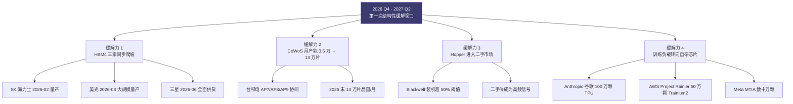
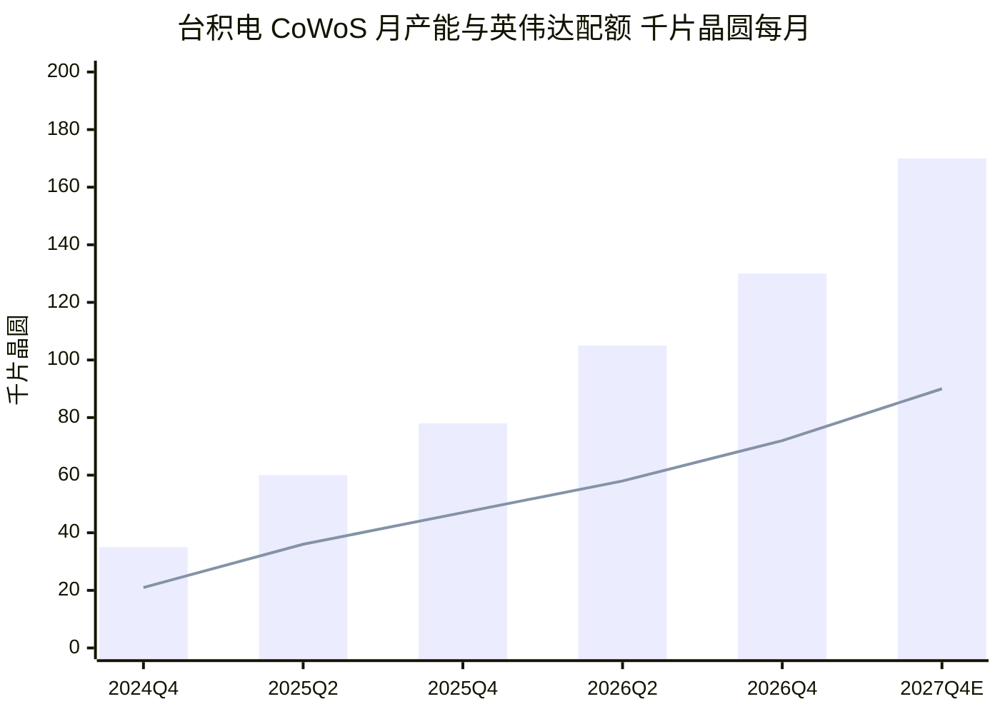
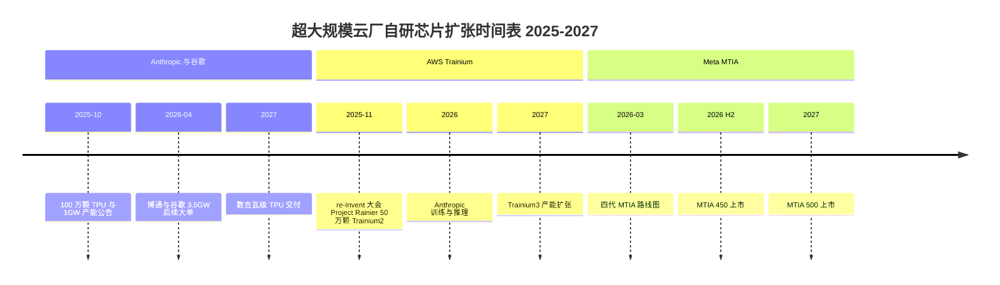
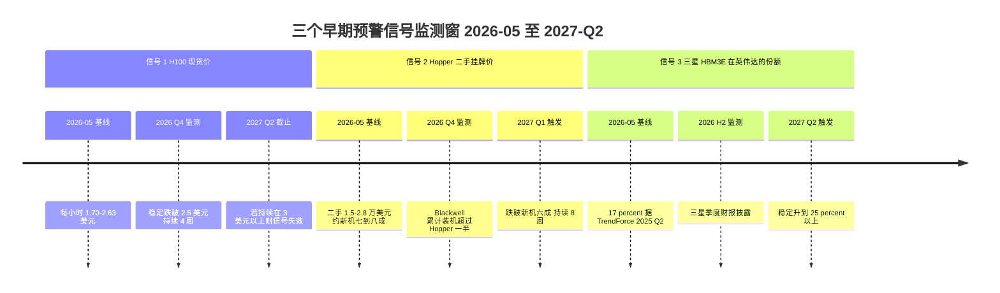

# 第 12 章 2027 拐点：双瓶颈缓解的节奏与三个预警信号

## 本章概览

2024 到 2026 年，市场对 AI 算力的共识只有一句话：永远不够用。

黄仁勋在每个季度的财报电话会上重复「需求超过供给」；Sam Altman 在多个场合说算力是 OpenAI 当前最稀缺的资源；Meta 的财务负责人 Susan Li 在 2025 年四季度财报会上说，公司内部对算力的需求增长得比供给还快。券商研报和社交媒体把这句话放大成了另一句话——算力是新的石油。

上一章证明了这种紧缺不是英伟达编出来的：产能曲线、良率曲线、建厂时钟、客户认证墙，四条曲线各自都是硬约束。承认了紧缺是真的，下一个问题才有意义：**它有没有头？**

本章的判断是有，而且第一次松动就在眼前——**2026 年末到 2027 年上半年**。

理由是四件事挤在同一个半年里发生：

1. **HBM4 三家同时量产**。[SK 海力士](https://www.skhynix.com/) 2026 年 2 月、[美光](https://www.micron.com/) 3 月、[三星](https://www.samsung.com/semiconductor/) 6 月起全面供货——历史上第一次三家同台。
2. **[台积电](https://www.tsmc.com/) CoWoS 月产能三年翻近四倍**，从 2024 年底的 3.5 万片爬到 2026 年底的 12-13 万片。
3. **上一代 Hopper 开始进二手市场**。Blackwell 大规模交付之后，2024-2025 年装的 H100、H200 会被逐步替换下来。
4. **一部分训练负载离开英伟达**。Anthropic、[谷歌](https://cloud.google.com/)、[亚马逊](https://aws.amazon.com/)、Meta 把训练和推理搬到自研芯片上（TPU / Trainium / MTIA），英伟达排队队列里的需求被分流。

```mermaid
graph TD
    A[2026 Q4 - 2027 Q2<br/>第一次结构性缓解窗口] --> B[缓解力 1<br/>HBM4 三家同步爬坡]
    A --> C[缓解力 2<br/>CoWoS 月产能 3.5 万 → 13 万片]
    A --> D[缓解力 3<br/>Hopper 进入二手市场]
    A --> E[缓解力 4<br/>训练负载转向自研芯片]

    B --> B1[SK 海力士 2026-02 量产]
    B --> B2[美光 2026-03 大规模量产]
    B --> B3[三星 2026-06 全面供货]

    C --> C1[台积电 AP7/AP8/AP9 协同]
    C --> C2[2026 末 13 万片晶圆/月]

    D --> D1[Blackwell 装机超 50% 阈值]
    D --> D2[二手价成为高频信号]

    E --> E1[Anthropic-谷歌 100 万颗 TPU]
    E --> E2[AWS Project Rainier 50 万颗 Trainium2]
    E --> E3[Meta MTIA 数十万颗]

    style A fill:#3C3B6E,color:#fff
```

四件事任何一件单独发生都不算结构性缓解，四件事挤在同一个六个月里，量级才够。

所以这一章的判断可以压成一句话：**这是周期，不是结构。** 紧缺是真的，但它有边界，而边界由供给侧的物理变量决定，不由叙事决定。

判断说完了，接下来是更重要的部分：**怎么证明这个判断是错的。** 章末给出三个可以自己动手跟踪的信号——H100 现货价跌破 \$2.5/hr、Hopper 二手挂牌价跌破新机六成、三星的 HBM3E 重新拿到英伟达的主流分配。到 2027 年二季度截止，三个信号一个都没出现，那就是本章判断错了。

三个信号用的都是公开数据源，更新频率从周到月，读者可以自己核。

## 12.1 市场为什么相信算力永远不够

「算力永远紧缺」这个共识不是凭空来的。它由三方合力搭起来：券商研报、模型公司管理层、社交媒体行业号。

**券商研报这条线，主流口径在 2025 上半年成型**。Morgan Stanley、Goldman Sachs、Bank of America 在 2025 年的多份 AI 半导体研报里把「算力短缺持续到 2028 年」作为基准情景。这个基准情景有具体数据撑着：AWS + Azure + Google + Meta 2026 自然年合计资本支出指引约 \$240-260B，同比 2025 年增长约 40%；英伟达 FY26 四季度数据中心营收 \$62.3B，向上游锁定的采购承诺业内估算超过 \$90B。论据链条大致是：超大规模云厂资本支出五年指引连续上调 + NVDA 季报合同储备续创新高 + HBM 长合约提前 12-24 个月被预订 + 电力侧硬约束（变压器交期 2-4 年、电网升级 24 个月）+ 模型规模扩大、以及带推理链的模型对算力的非线性放大。每一条都有事实支撑，叠起来构成一张紧缺是长期常态的图。

**模型公司管理层这条线，自 2024 年起反复强化**。OpenAI 在 2024 年下半年开始把「算力受限」挂在嘴边，Sam Altman 在多个采访里说我们要的不是 1 万张卡，是 10 万张卡。Anthropic 在 2025 年与谷歌的百万颗 TPU 大单公告里直接写明，这笔产能是为了训练和服务下一代 Claude 模型。Meta Q4 2025 财报会上 CFO Susan Li 的原话——"demands for compute resources across the company have increased even faster than our supply"——被多家媒体反复引用。这些表态形成一个闭环：用户相信模型公司缺算力，模型公司因此能签长约提前锁定供给，供给方看到长合约相信需求是真，于是继续扩产又被锁定。

**社交媒体行业号这条线，把上面两条线情绪化放大**。X 和 LinkedIn 上的 AI 基础设施账号在 2024-2025 反复出现合同储备又破历史、H100 又涨价、机房又订满的标题。NVDA FY26Q1（截至 2025-04-27）数据中心营收 \$39.1B，FY26Q4（截至 2026-01-25）数据中心营收上到 \$62.3B 单季，每一次披露都是一次共识强化。

三方共识叠起来，结论是「未来 3-5 年算力仍然紧缺」。这个结论本身没问题——但把它翻译成「英伟达和 SK 海力士的估值倍数应该长期享受紧缺溢价」，就有一个问题被跳过了：**紧缺有没有头？**

「有头」和「是真的」并不矛盾。1995-2000 年美国电信光纤建设潮里，紧缺是真的，1996-1998 年间光纤和路由器的供应紧张也是真的——但 1999-2000 年供给侧爆发式爬坡之后，紧缺迅速翻成了过剩。

算力会不会走同一条路，是周期定位那一章的题目。这里只回答一个早两三年的问题：**如果紧缺有头，第一次松动会出现在什么时候？**

答案是 2026 年四季度到 2027 年二季度，物理基础是下面四股力量同时落地。

## 12.2 判断：2027 上半年出现第一次结构性缓解

**一句话**：双瓶颈是真紧缺，但紧缺有头——2026 年末到 2027 上半年是这一轮周期里第一次结构性缓解的拐点。这是周期，不是结构。

这个判断分三层：哪些是已经发生的事实、哪些是从事实推出的分析、哪些是带假设的预测。三层可以分别检验。

### 第一层：已经发生的事实

截至 2026 年 5 月，下面四件事都是公开信息，可以逐条查证：

| 时点 | 事件 |
|---|---|
| 2025-09 | 三星通过英伟达 12 层 HBM3E 认证，首批 1 万颗已发货 |
| 2025-09 | SK 海力士完成 HBM4 开发并宣布量产就绪，2026-02 实际启动量产 |
| 2026-03 | 美光在英伟达 GTC 大会上宣布，为 Vera Rubin 设计的 HBM4 进入大规模量产 |
| 2025-2026 | 台积电在多次财报电话会上确认，CoWoS 月产能 2026 年底目标 12-13 万片 |

### 第二层：从时点推出的分析

把这四件事的时点拼起来，2026 年四季度到 2027 年二季度，是供给侧第一次出现多个瓶颈同步松动的窗口。每一件事松动的是哪一环：

| 松动的环节 | 具体变化 | 对供给的意义 |
|---|---|---|
| HBM | 三家同步出货，英伟达从「SK 海力士独家 + 美光二供」变成三家同台 | 议价权略微从供方回到英伟达一侧 |
| CoWoS | 月产能从 8 万片爬到 13 万片（2026 年中到年末，业内估算）| 英伟达出货的物理上限抬升约 60% |
| Hopper | Blackwell 2025 年四季度起量产、2026 全年放量，替换下来的 Hopper 进入二手流通 | 在一手供应链之外多出一块有效供给 |
| 自研芯片 | Anthropic 已签超过 1GW 的 TPU、AWS Trainium2 集群上线、Meta MTIA 部署 | 英伟达排队队列里的有效需求被分流 |

四件事任何一件单独发生都不构成结构性缓解。但它们同时发生在一个六个月的窗口里，量级才够形成第一次能被市场识别到的缓解。

### 第三层：预测，以及它建在哪些假设上

「2027 上半年出现结构性缓解」是预测，它建在四个假设上。任何一条不成立，窗口都会往后推：

1. HBM4 三家的爬坡良率不再延后 6 个月以上；
2. CoWoS 的 13 万片月产能在 2026 年底落地，而不是拖到 2027 年二季度；
3. Blackwell 2026 全年出货保持当前指引，不出现重大延期；
4. 自研芯片的分流总量在 2026-2027 年达到训练算力的 10-15%。

需要说清楚边界：**这不等于说算力会永久过剩。** 供给一松，需求侧的弹性会接住一部分释放出来的产能——杰文斯效应、带推理链的模型、强化学习后训练，都是接盘的力量。这里只论证供给侧的物理缓解：2026 年末到 2027 上半年这个窗口里，HBM、CoWoS、Hopper 三个层面的有效供给都会出现非线性增加。

### 这个判断和市场主流差多远

| 机构 / 人 | 口径 | 与本书的差别 |
|---|---|---|
| Morgan Stanley（2025 年综述）| 「短缺持续到 2028 年」当基准情景 | 不认为 2027 年有缓解窗口 |
| Goldman Sachs（多份资本周期报告）| 未给出缓解时点 | 回避了时点问题 |
| SemiAnalysis / Dylan Patel（2025 年访谈）| 2026 年瓶颈在内存，2027 年之后转到晶圆 | 方向接近，但没写成能被证伪的明确命题 |

## 12.3 缓解力 1：HBM4 三家同步爬坡

HBM4 是 2026-2027 供给侧缓解里最早、最确定、最重要的一股。

**SK 海力士**。SK 海力士在 2025 年 9 月宣布「全球首个 HBM4 量产就绪」，2026 年 2 月实际启动量产。首批规格是 12 层堆叠 36GB，底层的基底裸片由台积电用 N12 逻辑工艺代工，单颗带宽超过 2 TB/s。英伟达 Vera Rubin 平台是首发客户。业内估算 SK 海力士在英伟达 HBM4 首年（2026 自然年）采购占比 50-55%，仍是主供，但份额已从 HBM3E 时代的 60%+ 略下移。

**美光**。美光在 2026 年 3 月 17 日的英伟达 GTC 大会上宣布，为英伟达 Vera Rubin 设计的 HBM4 已进入大规模量产。规格是 36GB 12 层堆叠、引脚速率超过 11 Gb/s、单颗带宽超过 2.8 TB/s。同时已经送出 16 层 48GB 的早期样品。业内估算美光在英伟达 HBM4 首年采购占比 20-25%。

**三星**。三星在 2026-01 末通过英伟达的系统级封装测试，速率 11.7 Gb/s，超过英伟达与 AMD 要求的 10 Gb/s。2026 年 2 月启动向英伟达和 AMD 出货，全面供货预计从 2026 年 6 月起。业内估算三星占英伟达 HBM4 首年采购 mid-20%。三星同时计划 2026 全年 HBM 总产能扩到 250K 晶圆 / 月，较 2025 年底的 170K 提升约 47%。

把三家拼起来：

| HBM4 厂商 | 量产时点 | 主要客户 | 首年英伟达占比 | 关键里程碑 |
|---|---|---|---:|---|
| SK 海力士 | 2026-02 量产 | 英伟达 Vera Rubin 首发 | 50-55% | 2025-09 宣布量产就绪，2026-02 爬坡 |
| 美光 | 2026-03 进入大规模量产 | 英伟达 Vera Rubin | 20-25% | 2026-03-17 GTC 官宣，16 层早期样品已出 |
| 三星 | 2026-02 启动出货，6 月起全面供货 | 英伟达 / AMD | 20-25% | 2026-01 末通过英伟达系统级封装测试（11.7 Gb/s 超规格）|

> 来源：SK 海力士量产时点综合 TrendForce 2025-09-12、Digitimes 2025-12-26；美光量产综合美光投资者关系新闻稿 2026-03-17、StorageNewsletter 2026-03-17、Tom's Hardware 2026-03、TechPowerUp 2026-03；三星量产综合 TrendForce 2026-01-26、Digitimes 2025-12-26。英伟达首年采购占比为业内估算，三家与英伟达均不分品类披露 HBM4 采购量。

这张表的关键不在每一行的具体数字，而在三行排在一起意味着的事情。HBM3E 时代 SK 海力士在英伟达供应链里的份额是 60%+，美光是 20%，三星是 17%，三家差距很大且认证进度严重错位。HBM4 时代，三家的爬坡时点压缩到 4-6 个月之内——2026 年 2 月 SK 海力士和三星开始量产，3 月美光进入大规模量产——这是历史上第一次三家同时进入英伟达主供应链。

三家同步爬坡的市场含义有三层。

**第一层，英伟达议价权部分回归**。HBM3 / HBM3E 时代英伟达排队拿货，HBM3E 12-Hi 36GB stack 单价从 2024 上市的 \$250 涨到 2026 年合约的 \$300（涨价 20%，来源：TrendForce 2025-12-24 + 第 6 章 §4 价格曲线）。HBM4 三家同台之后，英伟达可以在三家之间分配订单，议价空间从几乎为零回到个位数百分点。

**第二层，HBM3E 的合约溢价开始回吐**。三家把产能从 HBM3E 切换到 HBM4 的过程中，市场普遍预期 HBM3E 单价在 2027 年开始回落——但前提是 HBM4 产能能跟上英伟达 Rubin / Hopper 全代际需求（不再让 HBM3E 承担老型号增量的角色）。本章的判断是：2027 年中之前，HBM3E 仍享受紧缺溢价，但 2027-Q4 之后将出现首次有意义的价格回落。这个判断的边界条件是 HBM4 三家产能爬坡不再延后。

**第三层，三星是这一轮份额再分配的最大获益方**。三星在 HBM3E 12-Hi 上落后 18 个月（2024-03 Jensen Approved 到 2025-09 真正通过英伟达认证），同期 HBM 市占从约 40%（业内数据在 39-41% 区间）跌到 17%。

HBM4 时代三星用 11.7 Gb/s 速率超过英伟达 10 Gb/s 规格要求，未经重新设计即通过英伟达认证。三星计划 2026 年 HBM 总产能扩 50% 到 250K 晶圆 / 月。

这意味着：到 2027 上半年，三星可能从 HBM3E 时代被边缘化的状态，重新回到 HBM 三家中前两名的格局。这件事对英伟达供应链是直接的供给增加，对三星半导体板块的估值是直接的修复。

但有一个时间差需要看清楚——「同时进入量产」和「同时形成有效供给」不是一回事。三星全面供货要到 2026 年 6 月，美光的大规模量产从 2026 年一季度末才开始；而从开始爬坡到良率稳定，通常还要 6-9 个月。也就是说，三家爬坡形成的有效供给增加的最佳节点在 2026-Q4 至 2027-Q2 之间——这正是「第一次结构性缓解」这个窗口的物理基础。

把量级压一下。SK 海力士 2026-02 量产初期月度 HBM4 出货预计在 50-100K stack 区间（业内估算，来源：TrendForce × SemiAnalysis 综合，三家与英伟达均未单独披露 HBM4 出货量）；三家合计 2026 全年 HBM4 总产量800K-1.2M stack。这个区间宽度反映出三家良率爬坡节奏与三星 full-scale supply 推迟到 2026-06 的不确定性。把这个数字与英伟达 Vera Rubin 2026 自然年量产规模放在一起看，是供给侧增加量级的最直接度量——Rubin 单 GPU 配 8 stack HBM4 起步，800K-1.2M stack 大致对应 100K-150K Rubin GPU 的 HBM 配套上限，与英伟达 Rubin 2026 首年规模指引（Rubin 首年出货约 50-100K，2027 量级抬升）方向一致。

## 12.4 缓解力 2：台积电 CoWoS 月产能翻倍

CoWoS 是台积电的先进封装工艺，把 GPU 裸片和 HBM 集成在同一块中介层上，是英伟达 AI 卡的物理瓶颈之一。工艺细节和客户分配第 5 章已经讲过，这里只看 2026-2027 这段时间的产能曲线。

把台积电 CoWoS 月产能的时间序列拉出来：

| 时点 | 月产能（片晶圆）| 来源 |
|---|---:|---|
| 2023 年底 | 1.5-2 万 | 台积电财报电话会 + TrendForce |
| 2024 年底 | 3.5 万 | 台积电财报电话会 + TrendForce 2024-Q4 |
| 2025 年中 | 7.5-8 万 | 台积电财报电话会 + FinancialContent 2026-01 |
| 2026 年中| 10 万 | 台积电财报电话会指引 + FinancialContent 2026-01-01 |
| 2026 年底（公司指引）| 12-13 万 | 台积电 2025-Q4 / 2026-Q1 财报电话会 + Tiger Brokers 引用 12.7 万 + FinancialContent 2026-02 引用 13 万 |
| 2027 年底（推演）| 16-18 万 | SemiAnalysis 推演 + TrendForce 2026-Q1 |

> 来源：台积电月产能时间序列综合台积电季度财报电话会指引（2024-Q4 至 2026-Q1）、Trendforce 2025-12-08 CoWoS-L/S 报道、FinancialContent 台积电 to Quadruple Advanced Packaging Capacity 2026-02-05、Tiger Brokers 2025 引用 127K 数据、台积电 2026 资本支出报道。所有产能数据为月度等效，台积电自身披露与第三方测算口径有 ±10% 差异。

从 2024 年底的 3.5 万片到 2026 年底的 13 万片，两年放大约 3.7 倍，年均增速约 90%——快于台积电同期 3nm / 5nm 前道晶圆厂主要节点的扩张速度。要把这个数字翻译成英伟达出货能力，需要看英伟达占用 CoWoS 的比例与单卡占用的晶圆数。

英伟达在台积电 CoWoS 产能里占比 50-55%（2026 年，剩下的 45-50% 由博通、AMD 等客户分掉；业内估算，来源：业内研报综合 + Tiger Brokers 引用）。按 2026 年底 13 万片月产能、英伟达占 55% 推演，英伟达每月大约有 7.1 万片晶圆可用。一片 CoWoS 晶圆最终能产出多少颗成品封装，取决于封装设计：一片 300mm 晶圆有效面积约 70,000 平方毫米，而一颗 GB200 封装含两颗 B200 裸片、外加 8 摞 HBM，整体面积远大于单裸片；再叠上良率损耗和不同型号的配置差异的区间很宽。

把月度配额折算成年度出货上限，业内估算在 250-400 万颗封装（已综合良率与型号折扣）。

这个区间可以用英伟达自己的财务数字反过来校验：

| 口径 | 数字 |
|---|---:|
| FY26 一季度数据中心营收（截至 2025-04-27）| \$39.1B |
| FY26 四季度数据中心营收（截至 2026-01-25）| \$62.3B |
| FY26 全年数据中心营收 | \$193.7B |
| GB200 平均售价（业内估算）| \$65K-90K |
| 按售价反推的全年 GPU 数量 | 210-300 万颗 |

反推只能给区间，因为数据中心营收里除 GPU 之外还含整机系统、网络设备和整机溢价。但方向上，它与 CoWoS 产能推出来的年度上限是一致的。

13 万片月产能在 2026 年底落地这件事，对供给侧的意义不是瓶颈消失，是瓶颈位置发生迁移——从 CoWoS 的物理产能瓶颈，转向英伟达客户分配、HBM4 配套良率、电力 site 交付这些下游瓶颈。

上一章那四条曲线里，CoWoS 这一条在 2026 年末的紧迫度会从硬约束降为松约束。这是四股缓解力里量级最大、时点最确定的一股。

把月产能和英伟达可用配额画在一起，2026 年末之后供给端的释放节奏就很直观。图中柱状为台积电总产能，折线为英伟达配额，单位都是千片晶圆每月：

```mermaid
xychart-beta
    title "台积电 CoWoS 月产能与英伟达配额 千片晶圆每月"
    x-axis ["2024Q4", "2025Q2", "2025Q4", "2026Q2", "2026Q4", "2027Q4E"]
    y-axis "千片晶圆" 0 --> 200
    bar [35, 60, 78, 105, 130, 170]
    line [21, 36, 47, 58, 72, 90]
```

2027 年之后的 CoWoS 走向 160-180K 业内估算月产能，主要靠两件事支撑：台积电嘉义 AP7 厂区多期建设在 2027 年陆续上线；以及封测代工厂日月光的 CoWoP 路线——用大尺寸面板替代圆形晶圆做封装基材，靠面积换规模效应（来源：TrendForce 2025-12-08）。这一层决定了缓解能不能从 2027 上半年延续到全年。

这里有个口径分歧值得单独标注：台积电自己在财报电话会上通常给出 CoWoS-L + CoWoS-S 合计产能指引，而 SemiAnalysis 与 Trendforce 在测算里有时只算 CoWoS-L（适配 Blackwell / Rubin 大裸片）。本书用台积电的公开口径（两者合计）来表述 13 万片这个数字，因为它在市场上引用最广。如果只算 CoWoS-L，2026 年底约为合计的 60-70%，即 7.8-9.1 万片／月。这个差异不改变方向判断。

## 12.5 缓解力 3：上一代 Hopper 开始进二手市场

这一节要用一个经济学经典模型的反面——阿克洛夫的二手车市场理论——来解释为什么 Hopper 的二手价格会成为观察周期的高频信号。

2024-2025 部署的 Hopper（H100 / H200）GPU，会在什么时点进入二手流通？决定时点的不是 Hopper 本身的物理寿命，而是 Blackwell / Rubin 的供给速度。当 Blackwell 大规模交付后，超大规模云厂在新机房会优先部署 Blackwell（GB300 NVL72 整机相对 Hopper，每瓦吞吐最高 50 倍，单位 token 成本最低降到 1/35，来源：英伟达 FY26Q4 财报电话会 2026-02-25 + 英伟达 Developer Blog 2026），存量 Hopper 的边际价值开始相对下降，一部分会进入二手市场。

**Akerlof 1970 二手车市场的反向应用**。Akerlof 在《The Market for Lemons》里说，二手车市场的信息不对称（卖方比买方更了解车况）让好车不进入流通、烂车占据市场——这是一个信息不对称的负面案例。GPU 二手市场刚好走相反的方向——卖方（超大规模云厂）非常清楚自己那批 Hopper 的状况——利用率、温度历史、显存纠错错误率——而买方（中小 GPU 云、推理创业公司、二线模型公司）愿意出的价格远高于「烂车价」，因为 Hopper 在推理与中小训练场景下的剩余使用价值非常高。GPU 二手市场是卖方主导退市但买方主导定价的复合市场。

这种结构让 Hopper 二手价的变化对供给侧的信号意义比一般行业的二手价更强。**Hopper 二手价的变化曲线，是观测 NVDA 出货能力 vs 模型公司需求之间相对力量变化的一个高频信号**。

把 H100 现货 rental price（按小时计的租用价）和 Hopper 整机二手挂牌价两个变量拉出来，可以看到 2024-2026 的曲线：

| 时点 | H100 现货价（\$/hr）| H100 整机二手挂牌价（新机参考 \$25-30K）| 数据来源 |
|---|---:|---:|---|
| 2023 年（缺卡最严重时）| \$7-10 | \$30-40K（一卡难求）| SemiAnalysis 2023、Silicon Data 2023 历史曲线 |
| 2024 年中 | \$5-7 | \$28-35K | SemiAnalysis、Silicon Data |
| 2025 年中 | \$3-4 | \$22-28K | Silicon Data 2025-H2 综合 |
| 2025-10 | \$1.70（1 年合约低点）| \$20-25K | SemiAnalysis 2026-03 引用 Silicon Data |
| 2026-03 | \$2.35（1 年合约）| \$20-25K（新机参考 \$25-30K）| SemiAnalysis 2026-03 H100 1-year contract index |
| 2026-05 | \$1.70-2.63（不同合约长度）；现货部分跌到 \$1.03-1.49（小厂商）| \$18-25K | Silicon Data + IntuitionLabs 2026 |

> 来源：H100 现货 rental 数据综合 Silicon Data H100 Rental Index、SemiAnalysis 2026-03 GPU Pricing Index、IntuitionLabs 2026 H100 Rental Prices Compared。整机挂牌价为业内估算，无公开统一交易所。Compute Exchange 2026 给出的市场行情是二手 \$15-28K、翻新 \$21-34K。

这张表里有两件事值得单独看。

**第一件，现货价已经在 2025-2026 进入波动下行通道，但下行被一年合约提价部分对冲**。2025-10 H100 一年合约价跌到 \$1.70/hr 是周期低点，2025-Q4 开始 1 年合约价回弹到 2026-03 的 \$2.35/hr（+38%，来源：SemiAnalysis 2026-03 GPU Pricing Index）。这次回弹的原因是超大规模云厂把 Hopper 用作推理主力（Blackwell 更贵且优先训练），同时带推理链的模型拉升了推理侧算力需求，让 Hopper 推理需求在 2025-Q4 至 2026-Q1 出现一次反弹。但现货端在 2026-05 又跌到 \$1.03-1.49/hr（小厂商如 Spheron / RunPod，来源：IntuitionLabs 2026），合约价与现货价的剪刀差扩大——这是供给侧分化（超大规模云厂端紧 + 小厂商端松）的典型信号。

**第二件，整机挂牌价相对稳定，但成交量上升**。Compute Exchange 2026 数据显示 二手 H100 在 \$15-28K 区间（翻新机 \$21-34K），相对 2024 年的 \$28-35K 已经下行 20-30%。整机挂牌价没有像现货价那样大幅波动，但成交量在 2025-Q4 开始上升——这是因为 Blackwell 大规模交付后，超大规模云厂释放出部分 Hopper 库存进入二手流通。SemiAnalysis 2026 年估算，Blackwell 一旦广泛可得，会对 H100 的二手价格形成 10-20% 的下行压力——方向已经定调。

把这两件事拼起来：Hopper 二手市场在 2025 年四季度到 2026 年二季度之间，正在从「几乎没有流通」转向「低流量但稳定流通」。判断是：这个市场会在 2026 年四季度到 2027 年一季度第一次显著放量。触发条件是 Blackwell 累计出货越过 200 万颗（按英伟达 FY26 全年指引推演，会在 2026 年三到四季度达成）。一旦 Blackwell 的累计装机超过 Hopper 装机量的一半，云厂管理机队的策略就会从「把 Hopper 用满」转向「主动把 Hopper 放到内部推理或二手市场」。

Hopper 进二手流通，直接增加了中小模型公司和推理创业公司这一层的有效算力供给。这部分需求过去只能排队买英伟达新机，现在可以用二手 Hopper 承接——相当于在英伟达的一手供应链之外开了一道泄洪闸。

## 12.6 缓解力 4：一部分训练负载离开英伟达

第四股缓解力是结构上最微妙的——超大规模云厂与大型 model lab 把部分训练负载从英伟达 GPU 切换到自研 ASIC（专用集成电路）。这件事在 2025 下半年到 2026 上半年密集落地。

各家 ASIC 容量扩张的时间表：

```mermaid
timeline
    title 超大规模云厂自研芯片扩张时间表 2025-2027
    section Anthropic 与谷歌
        2025-10 : 100 万颗 TPU 与 1GW 产能公告
        2026-04 : 博通与谷歌 3.5GW 后续大单
        2027 : 数吉瓦级 TPU 交付
    section AWS Trainium
        2025-11 : re-Invent 大会 Project Rainier 50 万颗 Trainium2
        2026 : Anthropic 训练与推理
        2027 : Trainium3 产能扩张
    section Meta MTIA
        2026-03 : 四代 MTIA 路线图
        2026 H2 : MTIA 450 上市
        2027 : MTIA 500 上市
```

**Anthropic-Google 1M TPU 大单（2025-10-23 公告）**。Anthropic 与谷歌云签约，获得最多 100 万颗 TPU、超过 1 GW 的产能，2026 年内陆续上线。合同总额按媒体估算在数百亿美元量级。这是 ASIC 在大型 model lab 训练侧第一次拿到 1M-chip 量级的单一订单。

Anthropic 给出的选择理由是性价比和能效——这件事本身就是一个信号：Anthropic 既是一家被 [Amazon](https://aws.amazon.com/) 累计承诺投资约 \$33B（2025 年前 \$8B + 2026-04 追加 \$25B，来源：CNBC 2026-04-20）的 AWS Trainium 客户，也是一家被 Google 累计承诺投资 \$40B（2026-04-24 公告）的 TPU 客户，两家投资捆绑都到位的情况下，Anthropic 仍然把 NVDA 列为第三选项。这不是技术因素单独主导的选择，但它是 NVDA 队列里合同储备净分流的实证。

**Anthropic-博通-Google 3.5 GW 后续大单（2026-04-06 公告）**。Anthropic 与谷歌、博通签新约，获得数吉瓦级的下一代 TPU 产能，2027 年开始交付。SEC 文件披露 3.5 GW 总容量。Mizuho 估算博通从 Anthropic 在 2026 年获得 \$21B AI 收入、2027 年获得 \$42B。大部分新算力将在美国部署，对应 Anthropic 此前承诺的 \$50B 美国 AI 基础设施投入。这一笔单子让 2027 年的 ASIC 总量从 1 GW 量级抬升到 3+ GW 量级，是「自研芯片分流在 2027 年仍在加速」的直接证据。

**AWS Project Rainier**。AWS 与 Anthropic 联合部署的 Trainium2 大集群 Project Rainier 在 2025 年底激活，规模接近 500,000 颗 Trainium2 芯片。AWS 在 re:Invent 2025（2025-12）上把 Project Rainier 作为旗舰发布。Anthropic 同时承担 Trainium2 集群训练 + 推理两用工作负载，比例上推理已超过训练。

**Meta MTIA 路线图**。Meta 在 2026-03-11 公布 4 代 MTIA（Meta Training and Inference Accelerator）路线图——MTIA 300 已量产用于推荐排序、MTIA 400 在为生成式 AI 推理做实验室验证、MTIA 450 与 MTIA 500 在 2026-H2 和 2027 上市。Meta 已经在生产环境部署 "hundreds of thousands of MTIA chips"，且 MTIA 与英伟达 H100/H200/B200 共存——前者承担推荐 + 推理，后者承担前沿训练 + 峰值推理。

**Google TPU 自身节奏**。TPU v6e (Trillium) committed-use 价格低至 \$0.39/chip-hour，4.7x perf/chip vs v5e，67% 推理功耗下降 vs 高端 NVDA GPU。

把四个数据拼起来，2026-2027 ASIC 在 AI 训练算力里的占比有一个粗略估算：

| ASIC 平台 | 2026 装机容量（GW）| 2027 装机容量（GW）| 主要用途 |
|---|---:|---:|---|
| Google TPU（Anthropic 单 + Google 内部）| 1.5-2 | 3-4 | 训练 + 推理 |
| AWS Trainium（Project Rainier + Anthropic + AWS 自用）| 1-1.5 | 2-3 | 训练 + 推理 |
| Meta MTIA | 0.5-1 | 1-2 | 推荐排序 + 推理 |
| 合计 ASIC | 3-4.5 | 6-9 | — |
| 英伟达 GPU（参照系，AWS/Azure/Google/Meta/Oracle 资本支出推演）| 25-30 | 35-45 | 训练 + 推理 |
| ASIC 占比 | 10-15% | 15-20% | — |

> 来源：装机容量为业内估算，综合 Anthropic-Google 1 GW 公告 2025-10、Anthropic-博通 3.5 GW 公告 2026-04、AWS Project Rainier 500K Trainium2 公告 2025-11、Meta MTIA 公告 2026-03、Mag7 2026 资本支出 \$660-690B 推演。所有数字均为容量等效估算，电力 GW 转算力的口径在各 ASIC 厂商之间不完全统一。英伟达 GPU 参照系用 Mag7 + Oracle 2026 资本支出合计与英伟达 FY26 全年指引交叉推演。

这张表里的占比 10-15% / 15-20%是 ASIC 在训练算力的渗透率，不是在总算力（训练 + 推理）的渗透率。推理侧 ASIC 渗透率更高（Meta MTIA 推荐排序部分接近 100%、TPU 在 Google 内部推理占比 60%+），但训练侧仍是英伟达主导。

「10-15%」这个占比是按每兆瓦电力能提供多少算力折算出来的。三家的折算系数不同：

| 平台 | 每兆瓦算力| 折算依据 |
|---|---|---|
| 谷歌 TPU v6e | 4-6 PFLOPS | 谷歌官方能效数据 + Trillium 机柜配置反推 |
| 亚马逊 Trainium2 | 3-5 PFLOPS | AWS 2025 年公开性能指标 + 服务器配置 |
| Meta MTIA | 2-4 PFLOPS | 代际差异大，MTIA 300 偏推理优化 |
| 英伟达 GB200（参照系）| 整柜约 120 kW，约 400 PFLOPS | 不同型号差异大 |

> 各厂商的口径差异在 20-50% 之间，这是整个估算区间最大的不确定性来源。差异来自三处：精度不同（FP16 / BF16 / FP8 的等效换算）、稀疏与稠密算力的口径、以及按机柜算还是按单卡算。

ASIC 分流对英伟达队列的影响是什么？是把英伟达队列里必须用英伟达的需求挤出一部分。Anthropic 在 2025 年三季度之前是英伟达的头部客户之一（通过 AWS），Anthropic-Google 1M TPU 大单意味着 Anthropic 此后 60-70% 的新增训练算力会跑在 TPU 上（业内估算，来源：Tom's Hardware 2026-04 / 多家媒体综合）；Meta 在推荐排序场景几乎完全 MTIA 化，节省下来的 GPU 配额回到 LLM 训练。这些分流不是英伟达失去客户，是客户的需求结构出现分层——前沿训练继续买英伟达，推荐系统、推理、部分非前沿训练转向自研芯片。

四股缓解力拼到一起，2026 年四季度到 2027 年二季度的供给侧画面是这样的：HBM 与 CoWoS 的物理产能同时大幅抬升，Hopper 在二手市场释放出额外的有效供给，自研芯片的分流让英伟达队列里的在手需求净下降。任何一件单独发生都不构成结构性缓解；四件挤在同一个六个月里，量级才够形成市场能识别到的信号。

## 12.7 三个早期预警信号

这个判断能不能被证伪，最终落在三个早期预警信号上。每个信号都满足三个条件：(1) 基线值有公开数据源；(2) 触发阈值有具体数字；(3) 监测频率周度或月度，读者可以自己跟踪。

三个信号在 2026-05 至 2027-Q2 监测窗内的时间分布：

```mermaid
timeline
    title 三个早期预警信号监测窗 2026-05 至 2027-Q2
    section 信号 1 H100 现货价
        2026-05 基线 : 每小时 1.70-2.63 美元
        2026 Q4 监测 : 稳定跌破 2.5 美元 持续 4 周
        2027 Q2 截止 : 若持续在 3 美元以上则信号失效
    section 信号 2 Hopper 二手挂牌价
        2026-05 基线 : 二手 1.5-2.8 万美元 约新机七到八成
        2026 Q4 监测 : Blackwell 累计装机超过 Hopper 一半
        2027 Q1 触发 : 跌破新机六成 持续 8 周
    section 信号 3 三星 HBM3E 在英伟达的份额
        2026-05 基线 : 17 percent 据 TrendForce 2025 Q2
        2026 H2 监测 : 三星季度财报披露
        2027 Q2 触发 : 稳定升到 25 percent 以上
```

### 信号 1：H100 现货价跌破 \$2.5/hr

**基线（2026-05）**：Silicon Data H100 Rental Index 显示 2026-05 H100 现货价在 \$1.70-2.63/hr 区间波动，不同合约长度差异较大；SemiAnalysis 1 年合约价 2026-03 为 \$2.35/hr。

**触发阈值**：H100 现货价稳定跌破 \$2.5/hr，连续 4 周。

**监测来源**：Silicon Data H100 Rental Index（每周更新，覆盖 80%+ 全球 H100 租赁市场）+ SemiAnalysis GPU Pricing Index（每月更新，1 年合约价为主）。

**为什么这个阈值有意义**：\$2.5/hr 是英伟达 H100 over-the-life ROI 模型里中性的盈亏平衡线（业内估算，基于 H100 整机 \$25K-30K + 4 年折旧 + 数据中心运营成本）。

如果现货价长时间稳定低于 \$2.5/hr，意味着 GPU 云的实际盈利模型已经从紧缺溢价 + 高 ROI 切换到「接近边际成本、只剩微利」。在 GPU 一级市场紧缺仍真实存在的前提下，现货价持续下行只能解释为：要么 Hopper 二手释放量大于预期（缓解力 3 兑现），要么 ASIC 分流量大于预期（缓解力 4 兑现）。两者都直接对应本章反共识立场。

**反向条件**：如果 H100 现货价在 2027-Q2 之前仍然稳定在 \$3/hr 以上、且 1 年合约价从 \$2.35/hr 继续上行到 \$3/hr+，则信号 1 失效——意味着 Blackwell 出货不足以释放 Hopper 二手、或者带推理链的模型把推理需求拉得远超预期，紧缺的窗口比本章预测的更长。

**2026-05 的状态：接近触发**。1 年合约价 \$2.35/hr 已位于阈值 \$2.5/hr 下方，小厂商现货价 \$1.03-1.49/hr 显著低于阈值，但 SemiAnalysis 1 年合约价 2025-Q4 至 2026-Q1 仍有从 \$1.70 反弹到 \$2.35 的过程，尚未稳定跌破阈值连续 4 周。这意味着信号 1 的观察期比其他两个信号更短，可能是供给侧缓解的早期先行指标。若 1 年合约价在 2026-Q4 至 2027-Q2 期间稳定跌破 \$2.0/hr 连续 4 周，「2027 上半年第一次结构性缓解」这个判断就拿到了第一个市场验证。

### 信号 2：Hopper 二手挂牌价跌破新机 60%

**基线（2026-05）**：Compute Exchange / Hashrate Index 2026 数据显示 H100 used 在 \$15-28K（refurbished \$21-34K），新机参考 \$25-30K。used 中位价相对新机中位价的比例约 70-80%（业内估算，无公开统一指数）。

**触发阈值**：H100 整机二手挂牌中位价跌破新机中位价 60%，连续 8 周。即 used 中位价跌破 \$15-18K。

**监测来源**：Compute Exchange 月度数据 + GPU 二手平台（vast.ai / RunPod 内部交易数据 + 业内渠道访谈月度均价）。这一项的监测困难度高于信号 1，因为没有公开统一交易所。本章推荐的监测方式是：用 Compute Exchange / Hashrate Index / IntuitionLabs 三家月度数据的均值。

**为什么是这个阈值**：60% 这条线的含义是——当二手价跌破新机 60%，超大规模云厂继续持有 Hopper 的机会成本开始超过部署 Blackwell 的置换成本，主动放出意愿将大幅提升。**需要说明：60% 这个数字是作者按 4 年直线折旧加残值估算推演出来的，不是来自阿克洛夫的原始文献。**如果 Hopper 二手价跌破新机 60%，意味着超大规模云厂的边际持有意愿大幅下降——这只可能发生在 Blackwell 累计装机已经超过 Hopper 的关键节点之后。这个节点判断会在 2026 年四季度到 2027 年一季度出现。

**反向条件**：如果 Hopper 二手挂牌价在 2027-Q2 之前仍然稳定在新机 70%+，意味着 Blackwell 出货爬坡比预期慢、或 Hopper 在推理侧的剩余使用价值高于预期，紧缺的窗口比本章预测的更长。

### 信号 3：三星 HBM3E 12-Hi 进入英伟达主流分配

**基线（2026-05）**：三星已在 2025-09 通过英伟达 HBM3E 12-Hi 认证，首批 10,000 颗供货已发。但截至 2026-Q1，三星在英伟达 HBM3E 实际采购中的占比仍然偏低——KED Global 2025-10-30 报道三星 "sells out 2026 HBM supply"，但英伟达端 HBM3E 主流分配仍以 SK 海力士 + 美光为主。

**触发阈值**：三星在英伟达 HBM3E 12-Hi 月度采购量占比稳定升至 25%+，且 2026 年 H2 英伟达财报电话会 / SK 海力士 / 三星财报电话会披露的份额数据显示三家差距从 60% : 21% : 17%（2025-Q2 TrendForce）收敛到 50% : 25% : 25% 这个量级。

**监测来源**：三星财报电话会季度披露 + TrendForce 月度 HBM 市占报告 + KED Global 韩国本地媒体跟踪 + 英伟达财报电话会管理层表态。

**为什么这个阈值有意义**：三星重获英伟达主流分配，是 HBM 供应链从单源到双源到三源稳定切换中最难的一步。三星 18 个月缺席之后回到主流分配，意味着 HBM 议价权第一次出现实质性回归。这一项和第一股缓解力是同源信号：HBM3E 上的三家平衡会先于 HBM4 发生，是 HBM4 格局的前置条件。

**反向条件**：如果三星在 2027-Q2 之前仍然没能在英伟达 HBM3E 12-Hi 采购里拿到 25%+ 份额、且 HBM4 首年采购占比也低于业内估算的 mid-20%，意味着三星的 HBM 业务恢复比预期慢、或英伟达主动维持双源策略以控制风险，HBM 议价权回归比本章预测的更慢。

### 三个信号该怎么合起来看

三个信号在物理上的独立性中等——信号 2（Hopper 二手）与信号 1（H100 现货）有相关性（同一物理产品的两个价格维度），信号 3（三星份额）与信号 1 / 2 物理上独立（不同环节）。证伪条件不是三个信号同时触发，而是至少有一个在 2027 年二季度之前触发——只要供给侧有一处出现非线性缓解，方向就是对的；三个全不触发，这一章的判断作废。

把三个信号的基线与阈值列在一张表里：

| 信号 | 基线（2026-05）| 触发阈值 | 监测来源 | 反向条件 |
|---|---|---|---|---|
| 1. H100 现货价 | \$1.70-2.63/hr（不同合约长度）| 稳定跌破 \$2.5/hr 4 周 | Silicon Data + SemiAnalysis | 持续 \$3/hr+ |
| 2. Hopper 二手挂牌价 | used 中位 \$15-28K，约新机 70-80% | 跌破新机 60% 持续 8 周 | Compute Exchange + Hashrate Index 月度均值 | 维持新机 70%+ |
| 3. 三星 HBM3E 12-Hi 英伟达份额 | 2025-Q2 17%，2025-Q3-Q4 缓慢回升中 | 稳定升至 25%+ | 三星财报电话会 + TrendForce 月报 | 维持 < 20% |

**信号相关度**：信号 1 与信号 2 高度相关——同一产品（Hopper）的两个价格维度（时租 vs 整机挂牌），同向触发概率大，两者本质上是 Hopper 边际持有价值下行在两个市场上的不同表达；信号 1/2 与信号 3 低相关——信号 3 是 HBM 端的认证状态，与 Hopper 的价格曲线独立，是两个不同物理环节的观察维度。读者监测时把信号 3 作为独立验证轴，比把三个信号当作同源指标的复合判断更稳健。

三个信号都在 2026-05 这个时点上有可查的基线值，都在 2027-Q2 这个时点上有明确的触发阈值。这是本章判断可被证伪的核心承诺。

## 12.8 把话说死：什么情况算判断错了

**判断**：双瓶颈是真紧缺，但紧缺有头——2026 年末到 2027 上半年是这一轮周期里第一次结构性缓解的拐点。这是周期，不是结构。

**证伪条件**：下面三个信号，如果到 2027 年二季度截止**一个都没出现**，上面这个判断就算错了。

1. **信号 1：H100 现货价跌破 \$2.5/hr**（监测：Silicon Data H100 Rental Index 周度 + SemiAnalysis GPU Pricing Index 月度）；
2. **信号 2：Hopper 二手挂牌价跌破新机 60%**（监测：Compute Exchange + Hashrate Index 月度均值）；
3. **信号 3：三星 HBM3E 12 层重新拿到英伟达的主流分配**（监测：三星财报电话会 + TrendForce 月度市占报告）。

「一个都没出现」是个宽松条件——三个里只要触发一个，方向就是对的。三个全不触发，说明四股缓解力在物理上都没有兑现到能被市场识别的程度，那么对时点的判断就是错的。

为什么要「一个都没出现」才算错，而不是「任一个没出现」就算错？因为判断的是「出现第一次结构性缓解」，不是「所有瓶颈同时消失」。任何一个信号触发，都对应至少一股缓解力真的落了地：信号 3 对应 HBM4 三家平衡，信号 1 和 2 一起触发对应 Hopper 二手放量，信号 1 单独触发也可能来自自研芯片的分流。预测的是四股力同步发生，但要监测的不是四股全部验证，而是至少一股被市场识别到。

为什么截止时点定在 2027 年二季度，而不是四季度或 2028 年？因为四股缓解力的物理时间表判断就是 2026 年四季度到 2027 年二季度集中落地。如果到 2027 年二季度（公开数据滞后 1-2 个月，实际可观测到三季度）这个窗口里三个信号都没触发，意味着四股缓解力中至少 3 股出现了 6 个月以上的延后——这种程度的集体延后，已经足以否定方向判断。把截止时点推到 2027 年底或 2028 年，等于把判断稀释成「早晚会发生」这种废话。

把话说死还有一层意义：两年之后，这一章可以被直接打分。2027 年二季度过后，拉一遍 Silicon Data 周报、TrendForce 月报和 Compute Exchange 的数据，对照三个信号是否触发，方向对不对一目了然。

读者也可以自己写个脚本，定期抓 Silicon Data 的周度指数和 TrendForce 的公开月报，把这三个信号做成季度自动监测。

## 小结

把这一章压成六句话：

第一，「算力永远紧缺」在 2024-2026 年是市场共识，由券商研报、模型公司管理层、社交媒体三方合力构建。

第二，紧缺是真实的（上一章已证），但它有头——2026 末至 2027 上半年是这一轮算力周期里双瓶颈第一次结构性缓解的拐点。

第三，四股供给侧缓解力同步发生：HBM4 三家在 2026 年内相继量产；台积电 CoWoS 月产能到 2026 年末抬到 13 万片；Hopper 在 Blackwell 大规模出货后进入二手流通；Anthropic、谷歌、亚马逊、Meta 把训练负载分流到自研芯片。

第四，核心判断是「这是周期，不是结构」——把算力永远紧缺当成长期叙事是错的，紧缺有可测量的边界。

第五，三个早期预警信号都有 2026 年 5 月的基线值和 2027 年二季度的触发阈值：(1) H100 现货价跌破 \$2.5/hr；(2) Hopper 二手挂牌价跌破新机 60%；(3) 三星 HBM3E 12-Hi 重获 NVDA 主流分配。

第六，把话说死——三个信号如果到 2027 年二季度一个都没出现，本章的判断作废。

这一章的命门就在这三个信号上。两年之后，它们触发了没有，答案是公开的、可查的、不需要作者自己解释的。

---

> 本章来自《算力经济学》开源版 · 作者「递归客」  
> 在线阅读完整书系：[inferloop.dev](https://inferloop.dev)
