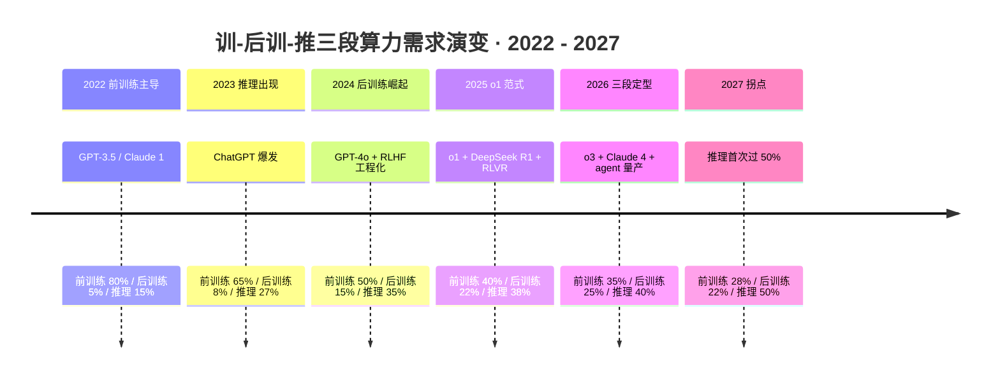
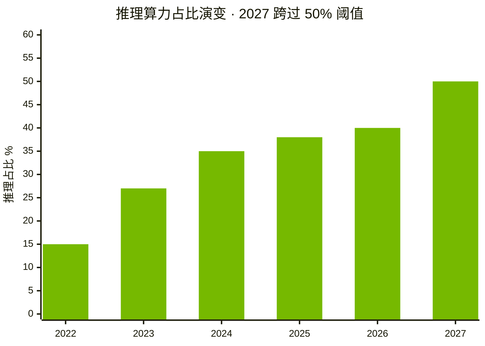
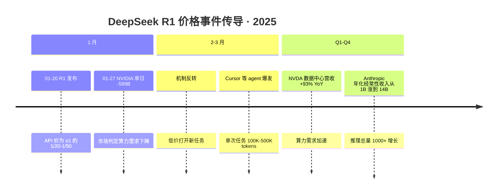
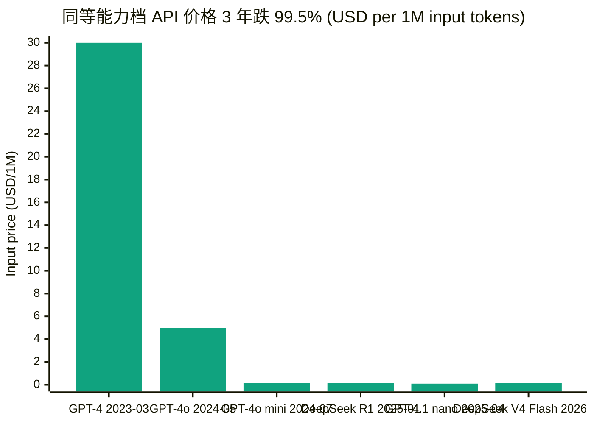

# 第 13 章 训-后训-推三段与杰文斯弹性：需求侧的 2027 之后

## 本章概览

第 12 章在供给侧给了一个反共识判断：2026 末到 2027 上半年，HBM4 三家、CoWoS 130K、Hopper 二手、ASIC 分流四股力同步落地，紧缺会有一次结构性缓解。把镜头从供给侧切到需求侧，问题立刻变成另一个：缓解之后呢？卖方研报通常用一句 AI 需求无限 + 杰文斯主导接住，把价格跌、需求就涨当作不需要证明的定律。本章不接受这个跳跃。

要回答缓解之后的需求侧形态，第一步是把算力需求这个变量本身拆开。2023 年市场对算力的二段分类是「训练 + 推理」——做新模型用训练，跑用户请求用推理。这个分类在 2024 年下半年开始失效。

[OpenAI](https://openai.com/) 的 o1（2024-09）把推理时计算（test-time compute）作为模型能力的独立维度，单次 query 消耗的算力从 GPT-4 时代的几千个 FLOP-per-token 量级拉到 o3 / Claude 4 thinking 时代的几十倍量级（业内估算，OpenAI / Anthropic 均不披露 per-query 推理计算）。[Anthropic](https://www.anthropic.com/) 的 Constitutional AI（2022-12 论文）与后续 RLHF / DPO 工程把后训练算力从主训练后的小修小补变成和主训练同量级的独立环节。[DeepSeek](https://www.deepseek.com/) R1（2025-01）在论文里直接披露 RL 后训练阶段消耗占总训练 compute 的相当一部分。二段分类塞不下这些新结构。

本章把算力需求按三段拆分，时间线如下：

本章把算力需求拆成三段：**前训练**（前训练，传统 next-token prediction 主训练）、**后训练**（后训练，RLHF / DPO / Constitutional AI / RL-from-verifiable-rewards / o1-style 推理时训练扩展）、**推理服务**（推理，终端用户 token 产生）。

三段在 2024-2026 的算力占比快速演变，议题 5（训推比例之争）的核心争议本身就是对后训练如何归类的差异——McKinsey 把后训练大部分计入推理算力，Epoch AI 倾向计入训练算力，两方测算口径才会出现 1:3 vs 1:1 的差异。把口径并列写清楚，议题 5 的争议大半是表观问题。

议题 6（杰文斯 vs 预算约束）是 18-36 月窗口的实质问题。本章对议题 6 给一个明确表态：**未来 18-36 个月，杰文斯反弹主导，企业 AI 预算约束尚未成为天花板**。但杰文斯不是物理定律，是有边界条件的经济学规律。前文已经把三个边界条件引出来——(1) 使用门槛低 + 应用未饱和；(2) 算力非下游瓶颈；(3) 互补而非替代。本章把这三个条件拆深：用 DeepSeek R1 之后的 [英伟达](https://www.nvidia.com/) 数据中心营收曲线、Cursor / Replit 等编码 agent 的 token 消耗爆发、Anthropic 年化经常性收入增长作为 (1) 的实证；用电力硬约束 + 客户集中度作为 (2) 的反例；用 OpenAI 从 GPT-4 到 o3 的能力阶梯作为 (3) 的互补占主导证据。

杰文斯弹性的传导链可以画成下面这张图：

把议题 5、6 在 18-36 月窗口内压实之后，下一个问题——2027 之后呢？本章对反共识 #4「推理算力主导 2027 之后才成立」给一个可证伪的需求侧承接：**2027 年之前训练算力仍占主导（前训练 + 后训练合计 > 推理）；2027 年中之后推理算力占比首次跨过 50%**。这个判断与卖方主流 AI 即推理的叙事拉开距离——卖方在 2024-2025 反复说未来 90% 算力会跑推理，本章的回答是：**这个迁移确实在发生，但不会发生在 2026，会发生在 2027 之后**。可证伪条件用四件套（基线 + 阈值 + 时间窗口 + 监测来源）钉死，章末立此存照列清楚。

Brynjolfsson J 曲线是本章第三个理论锚点。1985-1995 美国大企业 IT 投资爆发，但 TFP（Total Factor Productivity，全要素生产率）反弹要到 1995-2004 才显化——10 年的滞后是 Brynjolfsson-Hitt 学术系列反复测算的 IT 投资 → 流程调整 → 生产率显化三阶段。AI 周期始于 2022 年底 ChatGPT、资本支出拐点在 2024，按 J 曲线类比，AI 对宏观 TFP 的可观测贡献要等到 2032-2037（宏观 TFP 章主答辩）。这里不展开宏观 TFP 测算——只把2024-2026 仍在 J 曲线底部这个判断作为 18-36 月窗口杰文斯主导的微观基础：企业 IT 部门的 AI 渗透率从 2024 年的 ~3% 进入 2026 年的 ~8%（Menlo Ventures 2024 报告，AI 支出从 2023 年 \$23 亿涨到 2024 年 \$138 亿，6 倍年化增长；\$13.8B 为含基础设施 + 平台 + 应用全口径（Menlo "State of Generative AI in the Enterprise" 2024-11）；纯应用层支出约 \$4.6B（同源不同切片）），J 曲线意味着企业 AI 预算的扩张刚开始，远未到达预算耗尽的拐点。

对工程师读者，本章把我们公司推理 token 月环比涨 30%、模型训练成本却在往下走的日常观察翻译成三段算力分配 + 杰文斯弹性的可解释结构。对金融读者，本章给企业 AI 预算渗透率 + per-token 价格曲线 + 三段算力分配的三套场景模型，是后续电力 + 客户集中度新约束、模型层与循环交易、宏观 TFP、周期定位等章的需求侧输入。

口径限制要先说清楚。本章用到的后训练算力占比是 Epoch AI 估算 + DeepSeek R1 论文披露 + OpenAI / Anthropic 公开访谈的综合反推，三家口径差 20-40%。企业 AI 渗透率数据来自 Menlo Ventures 与 Gartner 调研，是问卷数据而非财务数据，问卷应答偏差可能让数字偏高 10-20%。per-token 价格曲线的跌 99% 要严格说明口径——同一模型从首发到当前的降幅 vs 不同代际同等能力档对比，两种口径差异约 50%。所有这些不影响本章的方向判断，但每个数字下面都标了口径与时点。

## 13.1 训推二段为什么不够：后训练范式的兴起

要看清三段结构的必要性，先看二段分类是怎么塌的。

2023 年市场对 AI 算力的标准描述是「训练 + 推理」二段。训练是一次性投入——OpenAI 用 25,000 张 A100 在 2022 年训练 GPT-4，业内估算训练 compute 约 2e25 FLOP，训练阶段消耗占模型总生命周期 compute 的大部分。推理是边际产生——每次用户问 ChatGPT，模型生成一段回答，算力消耗随调用次数线性增长。这个二段框架在 2023 年还能粗粒度地描述行业——超大规模云厂的 GPU 集群按训练池和推理池分配，新模型上线后训练池的负载随之下降、推理池的负载随调用量上升。

二段分类在 2024 年开始出现明显的失配。三个工程现象同时出现，让训练 vs 推理这个二元变成不够用：

**第一个现象是后训练（后训练）成本的指数级膨胀**。Anthropic 在 2022-12 论文里提出 Constitutional AI，用 AI 反馈 + 宪法原则替代纯人类 RLHF 反馈。这套方法的算力消耗在 Claude 2 时代（2023）还是主训练的一个零头；到 Claude 3.5 Sonnet（2024-06）已经被 Dario Amodei 在公开访谈里描述为后训练 is becoming a larger and larger portion of total compute。OpenAI 的 RLHF 工程从 InstructGPT（2022-01）到 ChatGPT（2022-11）到 GPT-4 RLHF（2023）演进同样路径——后训练阶段从主训练的微调变成和主训练同量级的工程。

**第二个现象是 o1 的推理时训练（推理-time 训练 / test-time compute）打破了训练 vs 推理的物理界限**。OpenAI 在 2024-09 发布 o1，核心创新是模型在回答用户问题前先生成一段思考链（chain-of-thought），思考链本身消耗大量推理 compute。OpenAI 在博客里直接画出一张图——模型性能随训练时 compute 和推理时 compute 两个维度同时 scaling。当推理这一步本身就在做 RL-style 的搜索 + reranking，推理和训练的物理区分开始变得模糊。o1 单次复杂数学问题的推理 compute 业内估算是 GPT-4o 的 50-100 倍。

**第三个现象是 RL-from-verifiable-rewards（RLVR）让后训练算力对模型能力的边际收益超过前训练**。DeepSeek R1（2025-01）在论文里直接演示——base model（DeepSeek V3）的能力可以通过纯 RL 训练（不依赖人类反馈）大幅提升数学 / 编码能力。DeepSeek V3 技术报告披露全训练消耗 2.788M H800 GPU-hour（前训练 2664K + 上下文扩展 119K + 后训练 SFT+RL 5K；来源：DeepSeek V3 技术报告 arXiv 2412.19437，2024-12-27）。R1 论文未直接披露 RL 阶段的 GPU-hour，业内反推区间约为 V3 前训练（2664K GPU-hour）的 5-40% 量级（50K-1M H800 GPU-hour，差异主要来自 MFU 假设——Epoch AI 假设 RL 阶段 MFU 与前训练同档时给出约 \$1M / ~200K-400K GPU-hour 的估算，若假设 MFU 显著低于前训练则可达 500K-1M GPU-hour；来源：Epoch AI What went into 训练 DeepSeek-R1 2025）。RL 后训练第一次成为少量 RL compute 撬动 base model 能力的主流路径——这件事意味着 base model 训练之后的工程化阶段在算力消耗上从配菜变成主菜。

把三个现象放在一起，二段分类的问题就清楚了：「训练」这个词在 2024 年已经包含至少两个完全不同的算力工程——前训练（next-token prediction 大规模 base model 训练）与后训练（RLHF / DPO / Constitutional / RLVR / 推理时训练扩展）。两者在算力强度、产出特征、扩展性上完全不同：

| 维度 | 前训练（前训练）| 后训练（后训练）| 推理（推理）|
|---|---|---|---|
| 主要工作 | base model 大规模 next-token prediction | RLHF / DPO / Constitutional AI / RLVR / o1-style 推理时训练 | 终端用户 query 响应 |
| 算力分布 | 单次集中（连续数月 10K+ GPU 集群）| 渐进式累积（数周到数月）| 持续分散（按 query 量线性增长）|
| 边际特征 | 一次性投入，模型生命周期摊销 | 多轮迭代，每次模型更新都重做 | 按 token 单价计价，按调用量计费 |
| 关键 metric | 模型基础能力 / 损失曲线 | 模型可用性 / 安全性 / 推理能力 | 单 token 成本 / 延迟 / 吞吐量 |
| 典型时间长度 | 3-6 个月 | 1-3 个月每轮，多轮迭代 | 持续运营 |
| 主要瓶颈 | GPU 集群规模 + 互联带宽 | 数据质量 + RL 训练稳定性 | 推理吞吐量 + 内存带宽 |
| 谁付钱 | 模型公司（自研 / 超大规模云厂资助）| 模型公司 | 终端用户 / 应用厂商 |

> 来源：算力分布与边际特征综合 OpenAI / Anthropic / DeepSeek 公开论文与访谈（2023-2026）+ Epoch AI 训练算力数据库 2024-2025。三段分类在产业内仍有口径分歧（McKinsey vs Epoch AI），见 §13.4。

这张表把训练拆开之后，前训练与后训练的算力工程区别比训练与推理之间还大。把它们都塞在训练里讨论，直接造成议题 5「训推比例」的口径混乱。

三段结构的工程含义有两个直接落点。第一，超大规模云厂的 GPU 集群不再按训练池 + 推理池分配，而是按前训练专用集群 + 后训练共享集群 + 推理优化集群三池。前训练集群需要 10K+ GPU 高互联（NVLink Switch + InfiniBand）+ 持续数月的稳定运行，是 Blackwell GB200 NVL72 的主要场景。后训练集群可以小一些（数百到数千 GPU），但需要灵活配置（不同 RL 算法对硬件要求不同）。推理集群优先吞吐量而非互联——H100 / H200 + 优化的 KV Cache 实现 + Continuous Batching 是主流路径。（InfiniBand：高速互联网络，前训练大集群标配；KV Cache：键值缓存，让推理吞吐量翻倍的核心优化；Continuous Batching：持续批量推理，让 GPU 不等待最大化利用率）第二，per-GPU 价格的二段分化变成三段分化：前训练 GPU 优先供给超大规模云厂长合约（议价权偏英伟达），后训练 GPU 部分进入 GPU 云（议价权双向），推理 GPU 进入 Hopper 二手 + ASIC 双轨（议价权偏需求方）。第 16 章（GPU 云解剖）已经把这个分化的财务影响展开。

## 13.2 三段结构定义与算力占比量化

把前训练 / 后训练 / 推理三段结构的算力占比量化，是议题 5 答辩的前提。三段的算力占比在 2022-2026 经历了三次结构性切换。

**2022 年（GPT-3.5 / Claude 1 时代）的三段占比是 80 / 5 / 15**（业内估算综合 Epoch AI 2023-2024 数据 + OpenAI 公开访谈）。前训练算力是绝对主菜——GPT-3.5 训练消耗约 3e23 FLOP，InstructGPT-style RLHF 的算力消耗在主训练的 5% 以内。推理算力在 ChatGPT 发布前几乎可以忽略不计（OpenAI API 调用量 2022-Q4 业内估算月活 < 1000 万开发者，来源：The Information 2023-03 报道）；ChatGPT 2022-11 发布后两个月达到 1 亿月活，推理算力开始放量。

**2023-2024 年（GPT-4 / Claude 2-3 时代）的三段占比演变到 60 / 10 / 30**（业内估算）。前训练算力绝对值在涨——GPT-4 训练消耗 2e25 FLOP，比 GPT-3.5 高约 70 倍。但推理算力增长更快——ChatGPT 周活在 2023-2024 反复破历史新高，OpenAI API 调用量年增长率 > 5×（业内估算综合 OpenAI 公开访谈与 The Information 报道）。Anthropic 的 Constitutional AI 工程让后训练算力占比从 5% 升到 10%——RLHF 多轮迭代 + AI 反馈训练的算力消耗加总，约等于主训练的 15-20%。

**2024-2026 年（GPT-4o / o1 / o3 / Claude 3.5-4 / DeepSeek V3-R1 时代）的三段占比演变到 35 / 25 / 40**（业内估算）。这是过去四年最大的一次结构切换。前训练绝对值仍在涨（Epoch AI 2024-05 测算前沿模型训练算力年化增长 4-5×；来源：Epoch AI "Training Compute Grows 4-5x per Year"），但占比在下降。后训练算力占比从 10% 跳到 25%——核心驱动是 o1-style 推理时训练（OpenAI / Anthropic / Google 都跟进）+ DeepSeek R1 演示的 RLVR 路径。推理算力占比从 30% 跳到 40%——驱动是 ChatGPT 周活 2026-Q1 达到 7-10 亿+ 企业 AI 调用量从 2023 的 \$23 亿涨到 2024 的 \$138 亿（6× 年增长，来源：Menlo Ventures "State of Generative AI in the Enterprise" 2024-11）+ 编码 agent / 客服 agent / 多模态调用的 token 量爆发。

把三段占比的演变压成一张表：

| 时点 | 前训练 | 后训练 | 推理 | 总算力规模指数（2022=1）| 主要驱动 |
|---|---:|---:|---:|---:|---|
| 2022 | 80% | 5% | 15% | 1× | GPT-3.5 / Claude 1，base model 主导 |
| 2023 | 65% | 8% | 27% | 8× | ChatGPT 爆发，推理算力出现 |
| 2024 | 50% | 15% | 35% | 35× | GPT-4o + Claude 3.5 + RLHF 工程化 |
| 2025 | 40% | 22% | 38% | 110× | o1 + DeepSeek R1 + 后训练范式 |
| 2026（业内估算）| 35% | 25% | 40% | 250× | o3 + Claude 4 thinking + agent 量产 |
| 2027（本章预测）| 28% | 22% | 50% | 500× | 推理算力第一次跨过 50% 阈值 |

> 来源：三段占比为业内估算综合 Epoch AI 训练算力数据库 2024-2025 + DeepSeek V3/R1 论文 2024-12/2025-01 + OpenAI o1/o3 公开博客 + Anthropic Dario Amodei 公开访谈 2024-2025 + Menlo Ventures 企业 AI 报告 2024。总算力规模指数以 2022 年全球前沿模型训练 + 推理算力总和为 1，按英伟达数据中心营收增长 + ASIC 装机增长综合反推。2026 / 2027 行为本章预测，2027 行的推理首次跨过 50%是本章对反共识 #4 的可证伪表态。

把推理占比的演变单独拉一条线（2027 是阈值跨越点）：

这张表的关键不在某一行的具体数字，而在三段占比的动态变化。三段算力占比的演变揭示了三个事实：(1) 总算力规模 4 年涨 250 倍，年化增长 4×，与 Epoch AI 训练算力 4-5×/年的测算一致，但总算力规模指数同时包含训练 + 推理，意味着推理算力的增长速度与训练算力同量级；(2) 前训练占比从 80% 跌到 35%，但绝对值在涨（35% × 250 = 87.5×，是 2022 年前训练算力的 87.5 倍），不是前训练在缩减，是推理与后训练涨得更快；(3) 推理算力占比的50% 跨越在本章预测中发生在 2027 年——这是本章对反共识 #4 的需求侧承接。

业内对三段占比的口径分歧值得单独标。McKinsey 在 2024-2025 的 AI Compute Outlook 系列里把后训练算力大部分计入推理算力侧（McKinsey 的口径是任何不是 base model 训练的 compute 都算推理-related），所以 McKinsey 的训推比例是 1:3——训练 25% / 推理 75%。Epoch AI 倾向把后训练算力计入训练侧（任何使用 RL / supervised 微调的 compute 都算训练），所以 Epoch 的训推比例接近 1:1——训练 50% / 推理 50%。两方测算的训推比例差 3 倍，根本不是数据差异，是口径定义差异。把后训练单独拎出来作为第三段之后，两方测算可以收敛到同一张表上——这是 §13.4 议题 5 答辩的核心。

## 13.3 后训练算力的爆发：从 o1 到 RLVR

把后训练算力的增长机制单独拆一节，是因为这是 2024-2026 三段结构最重要的变化点。

**OpenAI o1 / o3 系列的推理时训练扩展**。o1 在 2024-09 发布时，OpenAI 在博客里给出一张关键图——模型性能随训练时计算（train-time compute）和测试时计算（test-time compute / 推理 compute）两个维度同时 scaling。这张图的工程含义是：以前模型能力的提升只来自训练时投入更多 FLOP，o1 之后模型可以通过在推理时让模型多想一会儿来提升能力。多想一会儿在工程上的实现是 RL-trained chain-of-thought——base model 在 RL 阶段被训练成能生成长思考链，每次回答用户前先生成数千到数十万 token 的思考过程。

这件事对算力消耗的影响是两层：第一层是 RL 阶段本身的算力消耗——把 base model 训练成会长思考需要数月的 RL 训练；第二层是推理时的额外消耗——每次 query 的 token 消耗从 GPT-4o 时代的几百 token 提升到 o1 / o3 时代的几千到数十万 token（业内估算，OpenAI 不直接披露 per-query 推理 token 消耗）。两层叠加，o1 的每次回答的总算力消耗业内估算是 GPT-4o 的 30-100 倍。o3（2024-12 预览 / 2025-Q1 正式发布）在 ARC-AGI benchmark 上的高算力配置消耗 \$20+ per task，单次任务的推理成本接近一个工程师 1 小时的工资。

**Anthropic 的 RLHF + Constitutional AI 工程化**。Anthropic 在 2022-12 论文里提出 Constitutional AI—— 用 AI 反馈 + 一组宪法原则替代纯人类反馈，工程上的好处是后训练阶段的样本生成可以并行化、规模化。Dario Amodei 在 2024-11 的 Lex Fridman 访谈里说后训练 is becoming a larger and larger portion of total compute，并明确指出 Claude 3.5 Sonnet 的后训练算力占比已经显著超过 Claude 3。Anthropic 在 2025-02 发布 Claude 3.7 Sonnet 引入 extended thinking 模式，与 o1 同类的推理时计算扩展。Claude Opus 4（2026 上半年）继续这条路径。后训练算力占总训练算力的比例，从 Claude 2 时代的 < 10% 演变到 Claude 4 时代的 30-50%（业内估算，Anthropic 不披露具体数字）。

**DeepSeek R1 演示 RLVR 路径**。DeepSeek 在 2025-01-20 发布 R1，核心方法论是 RL-from-verifiable-rewards（RLVR）——用可验证奖励（数学题答案对错、编码题运行结果）替代人类反馈训练 base model 的推理能力。R1-Zero 完全不用人类反馈、纯 RL 就达到 OpenAI o1 量级的数学推理能力。DeepSeek V3 技术报告披露全训练消耗 2.788M H800 GPU-hour（前训练 2664K + 上下文扩展 119K + 后训练 SFT+RL 5K；来源：DeepSeek V3 技术报告 arXiv 2412.19437，2024-12-27）；R1 论文未直接披露 RL 阶段的 GPU-hour，业内反推区间约为 V3 前训练（2664K GPU-hour）的 5-40% 量级（50K-1M H800 GPU-hour，差异主要来自 MFU 假设；Epoch AI 在 MFU 同档假设下给出约 \$1M / ~200K-400K GPU-hour 的中位估算，低 MFU 假设可达 500K-1M GPU-hour；来源：Epoch AI What went into 训练 DeepSeek-R1 2025）。R1 的工程意义是：base model 训练之后，用相对小的 RL 算力（按 Epoch AI 中位估算约前训练的 10-15%）可以让模型获得显著超过 base model 的推理能力。

**Google Gemini 2.5 / Anthropic / Meta Llama 4 的跟进**。[Google DeepMind](https://deepmind.google/) 在 2025-03 发布 Gemini 2.5 Pro，明确说 thinking model 路径。[Meta](https://about.meta.com/) 在 2025-04 发布 Llama 4，引入 reasoning variant。后训练 + 推理时计算扩展在 2024-Q4 到 2025-Q2 的 9 个月里成为前沿模型的标配。这一波跟进让后训练算力占总训练算力 25%-50%在 2025 年成为行业事实，而不是某一家的孤例。

把后训练算力的增长机制收束成一张表：

| 路径 | 主导公司 | 算力工程 | 后训练 / 总训练比例（业内估算）| 关键时点 |
|---|---|---|---:|---|
| RLHF + Constitutional AI | Anthropic | AI 反馈 + 宪法原则，可规模化 | Claude 2: <10% → Claude 4: 30-50% | 2022-12 论文，2024-2026 工程化 |
| o1-style 推理时训练 | OpenAI | RL-trained chain-of-thought | o1: ~40%（业内估算）| 2024-09 o1，2024-12 o3 |
| RLVR（可验证奖励 RL）| DeepSeek + 跟进者 | 数学 / 编码题答案 reward，无人类反馈 | R1: ~30%（论文反推）| 2025-01 R1 论文 |
| Extended thinking | Anthropic + Google | base model + RL 长思考链 | Claude 3.7+ / Gemini 2.5: ~35% | 2025-02 Claude 3.7，2025-03 Gemini 2.5 |

> 来源：OpenAI o1/o3 公开博客与 system card 2024-09-12 / 2024-12；Anthropic Constitutional AI 论文 2022-12 + Dario Amodei × Lex Fridman 2024-11 访谈；DeepSeek R1 论文 arXiv 2501.12948 (2025-01-20) + DeepSeek V3 技术报告 2024-12；Google Gemini 2.5 公告 2025-03。所有比例为业内估算综合公开论文 + 公司访谈反推，三家公司均不直接披露后训练 / 总训练算力比例的具体数字。

后训练算力爆发对议题 5 的影响有两层：第一层是训推比例的口径必须重新定义——后训练算力在物理上是训练阶段的算力消耗（在训练集群上跑、不直接面向终端用户），但在产业意义上更接近推理算力的前置（后训练优化的是推理时的能力）。McKinsey 把后训练计入推理是从产业意义出发，Epoch 计入训练是从物理意义出发，两者都有道理。第二层是后训练算力的爆发让训练算力 这个变量在 2024-2026 的增速比 Epoch AI 2024-05 测算的 4-5×/年更快——Epoch 的数据库主要追踪前训练算力（base model），后训练算力的增长是 Epoch 数据之外的额外项。这件事会在 §13.4 议题 5 答辩里展开。

## 13.4 议题 5：训推比例之争的口径根因

议题 5 是 2024-2026 卖方研报里被反复提的争议。问题表述是：未来 5 年 AI 算力支出里，训练算力 vs 推理算力的比例是多少？

主要测算口径有四家：McKinsey、Epoch AI、Morgan Stanley、Bernstein。四家给出的训推比例在 2024-2025 的报告里差异达 3 倍——McKinsey 给 1:3（训练 25% / 推理 75%）、Bernstein 给 1:2（训练 33% / 推理 67%）、Morgan Stanley 给 1:1.5、Epoch AI 给 1:1。市场上训推比例 1:5 甚至 1:10 的卖方观点也存在（多见于超大规模云厂推理优势叙事的研报）。

把四家口径放在一张表上比较：

| 测算方 | 训推比例 | 后训练算力归属 | 口径定义 | 时间窗口 |
|---|---:|---|---|---|
| McKinsey AI Compute Outlook 2024-2025 | 1:3 | 计入推理 | 任何不是 base model 训练的 compute 都算推理-related | 2024-2030 |
| Bernstein 2025 AI 半导体研报 | 1:2 | 部分计入推理 | base model + RL 主训练算训练，推理时 thinking 算推理 | 2025-2030 |
| Morgan Stanley 2025 AI infra 综述 | 1:1.5 | 混合归类 | 物理位置（训练集群 vs 推理集群）分类 | 2025-2030 |
| Epoch AI 训练算力数据库 | 1:1 | 计入训练 | 任何使用 RL / SFT（监督微调，Supervised Fine-Tuning，用标注数据对 base model 做有监督训练）的 compute 都算训练 | 2024-2025 实测 |

> 来源：McKinsey "Generative AI's State Globally" 系列报告 2024-2025；Bernstein 2025 年 AI 半导体研报多份；Morgan Stanley 2025-Q2 AI infra 综述；Epoch AI 训练算力数据库 2024-2025。所有比例为各家测算口径下的预测中位数，不同情景下数值有 ±20% 浮动。

四家差距的 3 倍主要来自两个口径差异：

**第一，后训练算力如何归类**。McKinsey 倾向把后训练计入推理算力，理由是后训练的目标是优化推理能力、产业价值与推理紧密相关。Epoch 倾向计入训练，理由是后训练在物理上发生在训练集群、与主训练同性质（持续多天到多月的批量 GPU 运行）。Bernstein 给一个中间方案——base model + RL 主训练算训练，但 o1-style 的推理时 thinking 算推理。Morgan Stanley 按物理集群分类——发生在训练池的算法训练算训练，发生在推理池的算推理。本章三段结构（前训练 / 后训练 / 推理）把这件事拆开，让四家测算可以收敛到同一张表上。

**第二，推理算力 包不包括 chain-of-thought 的思考链**。o1 / o3 / Claude 4 thinking / Gemini 2.5 thinking 的核心特征是在推理时多 think 一会儿——单次 query 消耗的推理 compute 比 GPT-4o 时代高 30-100 倍。McKinsey 把这部分明确算推理算力（用户每次提问消耗的 compute 都是推理），Epoch 倾向单独划分（thinking 的 compute 在物理上和 RL 训练同性质，本质是 RL search）。两边的差异在 o1 / Claude 4 thinking 普及后被放大——2025 年 thinking 模式的占比从 5% 升到 30%（业内估算综合 Claude / ChatGPT 应用数据），thinking 算力归属的口径差异让推理算力 这个变量本身的定义变化。

把口径并列拆清楚之后，议题 5 的答辩是条件式的，不是哪一方对。本章的答辩是：

**议题 5 答辩（条件式）**：

(a) **如果按物理意义（base model + RL + thinking）分类**，2024-2026 训练算力占比 ~50%、推理算力占比 ~50%——Epoch AI 口径基本正确。

(b) **如果按产业意义（base model 训练单独 / RL + thinking + 推理合并）分类**，2024-2026 训练 ~25-35%、推理（含 RL + thinking）~65-75%——McKinsey 口径基本正确。

(c) **两方测算的事实层 没有矛盾**——分歧全在口径定义。

(d) **三段结构**（前训练 / 后训练 / 推理）让两方可以并列存在：前训练 ~35%、后训练 ~25%、推理 ~40%（2026 中位估算，业内估算综合 Epoch AI + DeepSeek + OpenAI 公开数据）。前训练 + 后训练算训练 = 60% / 推理 40%（接近 1:0.67，与 Bernstein / Morgan Stanley 口径接近）；前训练单独算训练 + 后训练 + 推理 = 35% / 65%（接近 McKinsey 口径）；前训练 + 后训练（不含 thinking）= 60% / 推理（含 thinking）= 40%（接近 Epoch 口径）。

议题 5 的实质争议不在 2024-2026 三段算力的具体占比——四家测算在事实层上差异不大。实质争议在 2027 之后这个比例的演变方向。本章在 §13.2 表格给的预测是：2027 年推理算力占比首次跨过 50%——这是本章对反共识 #4 的需求侧承接，§13.9 把可证伪条件钉死。

为什么推理跨过 50% 这个时点要等到 2027？三个机制：

**机制 1：前训练算力到 2026 仍在快速绝对增长**。Epoch AI 2024-05 测算前沿模型训练算力年化增长 4-5×，2026 年中前沿模型训练算力将达到 3e26-1e27 FLOP 量级，是 GPT-4（2023）的 15-50 倍。Anthropic-Google 1M TPU 大单（2025-10）+ Anthropic-博通（Broadcom） 3.5 GW 大单（2026-04）+ OpenAI / Microsoft / xAI 等超大规模云厂持续扩张训练集群，前训练算力的物理产能扩张到 2026 末 / 2027 初仍在加速。前训练算力占比要降到 30% 以下，必须等到前训练的 GPT-5 / Claude 5 等下一代模型的训练已完成、暂未进入 GPT-6 / Claude 6 的训练 这一窗口期——本章预测这一窗口在 2027 年中之后出现。

**机制 2：后训练算力到 2026-2027 仍在结构性增长**。RLVR / extended thinking / agent 训练等新范式让后训练算力消耗持续上升。2027 年之后，后训练算力的增长会逐渐与前训练脱钩——前训练的模型规模翻倍 不再驱动后训练的算力翻倍，后训练的算力增长由 RL 算法效率与 reasoning 任务复杂度共同决定。

**机制 3：推理算力的指数级爆发需要应用渗透到位**。推理算力占比要跨过 50%，对应推理算力的绝对量要超过前训练 + 后训练总和。2026 年企业 AI 渗透率 ~8%（Menlo Ventures + Gartner 调研），仍处于 J 曲线底部——大量企业部署的 AI agent 还在 PoC 阶段，没进入大规模生产部署。J 曲线的流程调整 → 渗透扩张 在 Brynjolfsson 历史研究里需要 5-10 年。AI 的 J 曲线启动期是 2022-2024，按历史类比，推理算力的指数级爆发期会在 2027-2030 集中发生。

三个机制叠起来，本章预测推理算力占比跨过 50% 的时点在 2027 年中之后，不是 2026。卖方主流叙事 AI 即推理 在 2024-2025 提前喊出这个判断，是把 5-10 年的渗透曲线压缩成 2 年——这是议题 5 / 反共识 #4 的核心分歧。

## 13.5 议题 6：杰文斯反弹的三个边界条件

议题 6 是本章主答辩位。卖方主流答辩是 AI 需求无限 + 杰文斯主导，把价格跌、需求就涨 当作不需要证明的定律。本章不接受这个跳跃——杰文斯是有边界条件的经济学规律，不是物理定律。

先把杰文斯反弹效应的概念在算力上重新校准。19 世纪英国经济学家 William Stanley Jevons 在 1865 年的《The Coal Question》里观察到：蒸汽机效率提升（每磅煤产出更多功率）反而让英国煤炭总消费量上涨。原因是效率提升压低了使用成本（每单位有效功率的煤更便宜），激发出更多新用途（铁路、纺织、钢铁），新需求超过效率节省。这就是杰文斯悖论（Jevons paradox），也叫反弹效应（rebound effect）。

在算力上的对应是：单 token 推理价格 2023-2026 跌 95%+（详 §13.6），但英伟达数据中心营收同期涨 10×、Anthropic 年化经常性收入从 2024-12 的 ~\$1B 升至 2026-04 业内综合估算的约 \$30B（涨幅约 30×；起点来自 The Information 2025-01 报道，2026-04 数字为 the-ai-corner 二手综合引用，未经 Anthropic 官方确认）、ChatGPT 周活 3 年涨约 36×（从 GPT-4 时代 2023-03 估算周活 ~2500 万到 2026-02 的 9 亿周活；来源：TechCrunch 2026-02-27 引 OpenAI 官方公告）。算力总支出在单价大幅下跌的同时持续翻倍——这是杰文斯反弹在算力上的早期证据。

但杰文斯反弹不是物理定律。第 2 章 §5 已经把三个边界条件引出来——本章把每个条件拆深，给 2024-2026 的实证 + 边界推演。

### 边界条件 1：使用门槛低 + 应用未饱和

杰文斯在 19 世纪英国煤上成立，是因为蒸汽机降低了煤的单位有效热值成本，而蒸汽机本身可以驱动几乎所有工业流程（纺织、铁路、采矿、钢铁）——使用空间几乎无限。算力在 2024-2026 是否满足这个条件？

**正面证据**：DeepSeek R1（2025-01）的发布是这个条件的最强实证。R1 发布时 API 定价 input \$0.55（cache miss）/ \$0.14（cache hit）/ output \$2.19 per 1M tokens（首发价，来源：DeepSeek API Docs news250120，2025-01-20），比同期 OpenAI o1 reasoning 档 input \$15 / output \$60 同档定价低 20-50 倍。市场第一反应是 DeepSeek 让算力需求下降——2025-01-27 英伟达单日市值跌 -\$589B。但英伟达数据中心营收同比 +93% YoY（FY25Q4 \$35.6B vs FY24Q4 \$18.4B，GAAP 数据中心分部口径；来源：NVDA FY25Q4 财报新闻稿 2025-02-26）——市场用半年时间把 DeepSeek 让算力需求下降 的初判反转为 DeepSeek 让算力需求加速。

机制清楚：R1 把使用一次 reasoning 模型的成本压低 20-50 倍，企业内部以前不能用 reasoning 模型解决的任务瞬间打开——RAG 增强搜索、客服多轮决策、长链 agent 任务、代码 PR review、合同审查、医疗影像辅助诊断。这些任务在 GPT-4 价格档下 ROI 为负，在 R1 价格档下 ROI 为正。Cursor / Replit / Lovable / Devin 等编码 agent 在 2025-2026 的爆发是直接受益方——单次 agent 任务可能消耗 100K-500K tokens（远超 chatbot 单次几千 token），定价跌 20× 让一次 agent 任务 \$0.1 变成可商用价位。

DeepSeek 价格事件的市场反应可以画成时间线：

同期同档模型的 input 价格演进对比（per 1M tokens）：

**反面边界**：如果未来某代 AI 算力价格 → 0，但 AI 已经覆盖一切应用（边际应用价值低），杰文斯反弹会减弱。在 2026 年中这一时点，AI 应用空间饱和度业内估算约 5-10%——按 Menlo Ventures 2024 报告，2024 年企业 AI 已确认部署用例覆盖率为：code copilots 51%、客服 chatbot 31%、企业搜索 28%、数据抽取 27%、会议总结 24%。这些是已确认部署，远没到所有可部署用例都部署完。边界条件 1 在 2024-2026 强成立，2027-2030 仍大概率成立，2030 后留给后文 12 议题答辩与五年之后两章的尾部场景。

### 边界条件 2：算力使用的瓶颈 不在算力本身

杰文斯反弹的前提是算力本身是约束——如果算力下游的瓶颈（电力、数据中心、人才、监管）让算力使用受限，杰文斯反弹会被瓶颈封顶。

**反面证据**：第 10 章已经展开美国 PJM（Pennsylvania-Jersey-Maryland Interconnection，宾夕法尼亚-新泽西-马里兰州际互联，美国最大区域电力市场运营商）容量市场清算价两年跳涨 11 倍，电力已经成为算力下游的硬约束。变压器交期 2-4 年、电网升级 24 个月、新建数据中心 site 接入 24-36 个月——这些约束都不会因为算力价格下降而消失。如果算力便宜了 100×，但电不够 成为现实，杰文斯反弹会卡在电力天花板上。

**当前状态判断**：2024-2026 算力使用的主要瓶颈仍在算力本身——超大规模云厂在 2025-2026 反复说 compute-bound 不是叙事话术，是电力可用之后第二顺位的硬约束（超大规模云厂真实瓶颈是电力 + 算力 双瓶颈，前面数据中心电力章与双瓶颈物理章已展开）。但 2027-2030 电力约束会成为越来越显著的瓶颈——客户集中度 + 电力新约束章主答辩。这意味着杰文斯反弹在 2024-2026 仍主导，2027-2030 开始受电力天花板部分制约。

边界条件 2 在 18-36 月窗口内不构成对杰文斯反弹的硬制约，但在 36 月之外是关键变量。

### 边界条件 3：互补关系 vs 替代关系

杰文斯在煤上的传导是煤效率 ↑ → 煤需求 ↑——煤与蒸汽机是互补关系。如果某种新技术让 AI 的算力依赖下降（更高效的算法、更小的模型、神经形态芯片），那时算力会进入被替代 而非被增强 的轨道。

**正面证据**：2024-2026 的实证仍偏向算法效率提升 → 模型变大 → 算力需求更大（互补关系占主导）。OpenAI 从 GPT-4 到 o3 的能力阶梯每跨一步，能解决的任务类型扩大一个量级——简单文本生成 → 长文推理 → 复杂决策 / agent 任务。每一步能力升级激发的新需求超过上一步效率提升压缩的需求。Anthropic 从 Claude 2 到 Claude 4 thinking 同样路径——extended thinking 让模型能处理 10-100x 复杂任务，单次 query 算力消耗反而提升。模型公司的工程路径不是做出更小的模型节省算力，而是做出更大的模型 + 更多 thinking 时间解决新任务。

**反面边界**：DeepSeek R1 的 distillation 路径（把 R1 蒸馏到 7B / 70B 小模型）是替代 路径的早期证据——小模型在某些任务上达到 R1 能力，单 token 成本远低于 R1。但这条路径的替代效应 在 2024-2026 的产业实证里被另一个机制对冲：小模型的能力提升让以前不部署 AI 的场景 现在能部署（手机端 AI、嵌入式 AI、低延迟 agent），这部分新增需求超过大模型被替代 的需求节省。整体上是互补关系。

**真正的替代风险**：如果出现算法 / 硬件结构性突破 让 AI 的算力依赖 在某一代发生跳跃下降（如更高效的 attention 机制、神经形态芯片、量子加速），那时杰文斯反弹会减弱。这是全书末两章的尾部场景，不在 18-36 月窗口内。

把三个边界条件压一下：

| 边界条件 | 18-36 月窗口判断 | 关键证据 | 反向风险（若成立则杰文斯减弱）|
|---|---|---|---|
| 1. 使用门槛 + 应用饱和 | 强成立 | DeepSeek R1 后英伟达营收 +93%、Cursor 等 agent 爆发、AI 渗透率 ~8% 远未饱和 | 应用空间在某一代被穷尽 |
| 2. 算力非下游瓶颈 | 部分成立 | 算力仍是头部瓶颈，电力开始抬升为次约束 | 电力 / 监管 / 人才硬约束封顶 |
| 3. 互补关系占主导 | 强成立 | GPT-4 → o3 / Claude 2 → Claude 4 能力阶梯继续向上 | 算法 / 硬件结构性突破 |

> 来源：边界条件理论来自 Jevons (1865)《The Coal Question》+ Sorrell 等现代弹性研究综述；正面 / 反面证据综合第 2 章 §5 + DeepSeek / 英伟达 / Menlo Ventures / Anthropic 公开数据 2024-2026；反向风险综合第 10 章（电力）+ 第 14 章（客户集中度）+ 第 31 章 / 第 32 章（结构性突破）。

**议题 6 答辩（明确表态）**：

未来 18-36 个月（2026-05 至 2029-05 之间），杰文斯反弹效应主导算力总需求曲线。具体表达：

- 单 token 推理价格 2023-2026 跌 95%+（详 §13.6），同期 AI 算力总支出涨 10× 以上。
- 杰文斯弹性的近似数字：单价 -90%（10×↓）→ 总使用量 +5000%（50×↑）→ 总支出 +400%（5×↑），算力总市场是价格暴跌但市场规模翻倍 的非典型增长行业。
- 三个边界条件在 18-36 月窗口内均成立或部分成立，没有出现杰文斯反弹中断 的迹象。

但杰文斯反弹的主导不是永久的。本章对杰文斯反弹减弱时点 的判断是 2030-2035 之间，三个边界条件中至少一个会出现实质性变化。这一判断与后续宏观 TFP 章节、五年之后的尾部场景配合，是全书算力周期长波 判断的一部分。

## 13.6 per-token 价格曲线 vs 推理总量曲线：量价双重运动

把杰文斯反弹的实证落到具体数字上。

API per-token 推理价格曲线 2023-2026 的演变可以收束到一张表。本章用 GPT-3.5 / GPT-4 / GPT-4o / Claude 3.5 / DeepSeek R1 / Gemini Pro 系列六个代表性时点：

| 时点 | 模型 | Input \$/1M tokens | Output \$/1M tokens | 相对 GPT-4 跌幅 |
|---|---|---:|---:|---:|
| 2023-03 | GPT-4（首发，OpenAI）| \$30.00 | \$60.00 | 基线（同等能力档）|
| 2023-06 | GPT-3.5 Turbo（OpenAI）| \$1.50 | \$2.00 | -95%（弱能力档对比）|
| 2024-05 | GPT-4o（OpenAI）| \$5.00 | \$15.00 | -83% / -75%（同档输入 / 输出）|
| 2024-07 | GPT-4o mini（OpenAI）| \$0.15 | \$0.60 | -99.5% / -99%（同档同质级）|
| 2024-10 | Claude 3.5 Sonnet（Anthropic）| \$3.00 | \$15.00 | -90% / -75% |
| 2025-01 | DeepSeek R1（首发价，cache miss）| \$0.55 | \$2.19 | -98% / -96%（reasoning 档极端价）|
| 2025-01 | DeepSeek R1（首发价，cache hit）| \$0.14 | \$2.19 | -99.5% / -96%（cache hit 折扣后）|
| 2025-04 | GPT-4.1 nano（OpenAI）| \$0.10 | \$0.40 | -99.7% / -99.3% |
| 2024-09 | o1（OpenAI 首发）| \$15.00 | \$60.00 | -50%（reasoning 档高价）|
| 2025-01 | o3-mini（OpenAI，2025-01-31 发布）| \$1.10 | \$4.40 | -96% / -93%（reasoning 档下移）|
| 2026-03 | Gemini 2.5 Pro（Google）| \$1.25 | \$10.00 | -96% / -83% |
| 2026-05 | DeepSeek V4 Flash（cache miss）| \$0.14 | \$0.28 | -99.5% / -99.5%（DeepSeek 当前实际价；首发 R1 cache miss 已上调）|
| 2026-05 | Claude Opus 4 thinking（Anthropic）| \$15.00 | \$75.00 | -50% / +25%（顶级 reasoning 档）|

> 来源：OpenAI / Anthropic / Google / DeepSeek 各家 API 历史定价页面 + DeepSeek API Docs (api-docs.deepseek.com) 2025-01 / 2026-05 多时点访问 + Epoch AI 推理 price trends 数据库 2024-2025。表内为不分缓存 / 批处理 / context length 的标准价，实际单 token 成本受 §1.3 提到的口径影响差 30-70%。**DeepSeek R1 行口径说明**：R1 在 2025-01-20 首发价为 input \$0.55（cache miss）/ \$0.14（cache hit）、output \$2.19 per 1M tokens；data_cutoff 2026-05 时 DeepSeek API 已切换到 V4 系列，V4-Flash cache miss input \$0.14 / output \$0.28。** o3-mini 行口径说明**：OpenAI 在 2024-12 公布 o3 预览，o3-mini 正式 API 发布日为 2025-01-31。** Claude Opus 4 thinking 行口径说明**：reasoning 顶级档定价保持高位甚至小幅上行，与 mini / nano 档下行形成高低分化——同档 chatbot 价格跌 99%+，顶级 reasoning 价格仅跌 50% 甚至持平。

这张表里的关键不是99% 这个数字，是**两层价格曲线的分化**：

**第一层：同等能力档的价格曲线。** GPT-4（2023-03）\$30 input → GPT-4o mini（2024-07）\$0.15 input → GPT-4.1 nano（2025-04）\$0.10 input → DeepSeek V4 Flash（2026-05）\$0.14 input cache miss。同等能力档（GPT-4 水平的 chatbot）的价格 3 年跌 99.5%+。这一层曲线对应使用门槛降低 → 应用打开 的杰文斯反弹机制。

**第二层：能力前沿档的价格曲线。** GPT-4（2023-03）\$30 → o1（2024-09 首发）\$15 → Claude Opus 4 thinking（2026-05）\$15。能力前沿档的价格 3 年仅跌 50%，远小于同档下行。这一层对应能力阶梯向上 → 新任务打开 的互补关系机制。

两层曲线同时存在意味着算力需求的弹性不是单一数字——同档替换（用 GPT-4o mini 替代 GPT-3.5）的需求弹性高，能力跃迁（用 o3 / Claude 4 thinking 解决 GPT-4 时代不可能任务）的需求弹性也高。两条曲线叠加，per-token 价格的加权平均 跌幅在 70-90% 之间（取决于市场中同档替换 vs 能力跃迁 的需求结构）。

把价格曲线放在推理总量曲线 旁边对照：

| 时点 | per-token 价格（同档 input，\$/1M）| 推理总 token 量（业内估算 trillions / 月）| AI 推理总支出（业内估算 \$B / 月）|
|---|---:|---:|---:|
| 2023-03 | \$30（GPT-4 首发）| ~5T | ~\$150M |
| 2024-01 | \$5（GPT-4o）| ~50T | ~\$250M |
| 2025-01 | \$0.5（GPT-4o mini / Claude Haiku 3.5）| ~500T | ~\$500M |
| 2026-01 | \$0.14（DeepSeek V4 Flash / GPT-4.1 nano）| ~3000T | ~\$1.2B |
| 2026-05 | \$0.14 | ~5000T | ~\$2B |

> 来源：per-token 价格综合 OpenAI / Anthropic / DeepSeek 历史定价。推理总 token 量为业内估算综合 OpenAI 公开访谈（我们每天处理 trillions of tokens）+ Anthropic 年化经常性收入 \$30B 反推 + Google / Microsoft 财报披露的 AI 调用增长率。所有数字为业内估算，不同来源差 30-50%。AI 推理总支出 = 价格 × 总量，业内估算综合反推。
>
> **口径说明（量价算术自验）**：表中 per-token 价格列取的是同档低价 锚点（GPT-4o mini / DeepSeek V4 Flash 一类小模型 input 价），不能直接乘以总 token 量得到总支出——实际市场是混合定价：高档 reasoning 模型（o1 / o3 / Claude Opus 4 thinking，\$15-75/1M）+ 中档（GPT-4o / Claude 3.5 Sonnet，\$3-15/1M）+ 低档（mini / nano / Flash，\$0.14-0.40/1M）同时存在。若全部 5000T tokens 都按 \$0.14/1M 计算，总支出约 \$0.7B/月；按 §13.6 列出的混合市场结构反推加权平均单价约 \$0.40-0.60/1M，与 5000T tokens/月相乘得 \$2-3B/月（章内取 \$2B/月是偏保守的中位数）。读者按自己估算的加权平均价格调整即可自验。

**量价双重运动的核心结构**：3 年里同档 per-token 价格跌 99.5%（200×↓），但推理总 token 量涨 1000×（从 5T 到 5000T），推理总支出涨 13×（从 \$150M/月到 \$2B/月）。这是杰文斯反弹效应在算力上的实证——价格暴跌但总支出大幅上涨。

把这件事翻译成对算力供应商的影响：单 token 算力消耗成本（从英伟达 / 台积电视角）跌幅没有 99.5% 这么大，业内估算约跌 70-80%（H100 → H200 → B200 → GB200 的硬件吞吐量提升 + KV Cache 等软件优化）。模型公司的 per-token 毛利率 从 GPT-4 时代的 -200%（OpenAI 早期亏损）演变到 2026 年的 +10-30%（业内估算）——单 token 价格跌幅与单 token 成本跌幅的剪刀差是 OpenAI / Anthropic 2025-2026 年化经常性收入与毛利率同时提升的核心机制。

**两类补贴定价 的口径说明**：表中部分价位（如 DeepSeek R1 首发 cache hit \$0.14、GPT-4o mini \$0.15）业内估算属于低于成本的市场份额定价。OpenAI 与 Anthropic 在主战场（GPT-4 / Claude 3.5+）的实际毛利率为正，但在 GPT-4o mini / nano 等小模型档的定价可能是按英伟达 H100 成本反推后毛利接近 0（业内估算综合 SemiAnalysis 2025 + The Information 2025-06 报道）。Cursor / Replit / Devin 等编码 agent 的定价是另一层补贴——按 token 成本反推，每次 agent 任务实际消耗的 API 成本可能超过 Cursor 收取的 \$20 / 月订阅费的 50%-200%，剩余靠风投资金补贴。这一层补贴的可持续性是第 18 章（模型层与循环交易）主答辩——这里不展开。

但补贴定价不影响杰文斯反弹本身的实证——即使把补贴部分剔除，per-token 价格 3 年仍跌 70-90%（按英伟达 H100 硬件吞吐量提升测算的非补贴价格曲线），推理总 token 量 3 年仍涨 100-500×，总支出仍涨 5-10×。补贴部分让价格跌得比硬件跌得快，但杰文斯反弹的方向判断不变。

## 13.7 Brynjolfsson J 曲线：企业 IT 投资的生产率显化时滞

把视角从供应端切到需求端。前面几节给的 per-token 价格曲线 与推理总量曲线 都是从模型公司视角看市场。但杰文斯反弹的真正驱动力来自需求端——企业用户用 AI 做什么、付多少钱、什么时候付。Brynjolfsson J 曲线是回答这个问题的理论锚点。

Erik Brynjolfsson 与 Lorin Hitt 在 1990s-2000s 的学术系列里提出 J 曲线（J 曲线）观察：企业大规模 IT 投资之后，全要素生产率（TFP）不会立刻上升，而是有 5-10 年的滞后期，期间生产率甚至下降（投资 → 组织摩擦 → 流程调整），然后才进入显化期。Brynjolfsson, Rock, Syverson 在 2018 / 2021 的论文里把这个框架应用到通用目的技术（GPT，General-Purpose Technology），给出 GPT-style 技术的生产率 J 曲线 三阶段：

**阶段 1（投资期，0-5 年）**：企业开始投资新技术，生产率指标几乎没变化（甚至下降）。原因是新技术需要补充资产（complementary assets）才能产出 TFP——员工培训、流程改造、组织结构调整都需要时间。1985-1995 美国大企业 IT 投资爆发，但 TFP 指标在这 10 年保持低位。这就是著名的生产率悖论。

**阶段 2（调整期，5-10 年）**：补充资产逐步到位，企业流程开始重组。这一阶段 TFP 开始爬升，但与 IT 投资的相关性变得可观测但仍需要专门测算。1995-2004 美国 TFP 增速从 1985-1995 的 1.4% 跳升到 2.1%，被学术界广泛归因于 IT 资本对生产函数的贡献。

**阶段 3（显化期，10-15 年）**：TFP 完全显化，IT 投资对宏观经济增长的贡献可以在 GDP 增长分解里清晰看到。

把 J 曲线框架应用到 AI 周期：

| 阶段 | 时间范围（AI 周期）| 主要现象 | 算力需求形态 |
|---|---|---|---|
| 投资期 | 2022-2027 | ChatGPT 发布 → 资本支出拐点 → 企业 PoC | 算力需求由超大规模云厂资本支出 + 前沿模型训练驱动；推理算力主要在试用 阶段 |
| 调整期 | 2027-2032 | 企业流程重组 → AI agent 进入生产 → 大规模部署 | 推理算力进入指数级爆发；前训练增速放缓 |
| 显化期 | 2032-2037+ | TFP 增速可观测 → 宏观经济渠道显化 | 推理算力主导，前训练 + 后训练算力进入维护期 |

> 来源：J 曲线框架来自 Brynjolfsson, Hitt 2000 Beyond Computation *JEP* 14(4) / Brynjolfsson, Rock, Syverson 2018 NBER WP 25148 与 2021 *AEJ:Macro* 13(1)。AI 周期时间映射来自第 2 章 §6 + 第 24 章 / 第 25 章主答辩。BLS TFP 数据来自美国劳工统计局多因素生产率数据库。

2026-05 这一时点，AI 的 J 曲线位置在投资期的中后段（2022-2027 的中点）。Brynjolfsson 等学者在 2024-2025 用美国 BLS 企业层面调研数据做的研究估算：已采纳生成式 AI 的企业，员工生产率提升 5-15%。2025 年美国企业 AI 采纳率 8-12%。两个数字相乘得 AI 对宏观 TFP 的当前贡献 0.4-1.8%——这是 J 曲线投资期中后段的典型水平，远未到显化期 的 TFP 跳升。

把 J 曲线与杰文斯反弹连起来看：J 曲线投资期的核心特征是企业大规模买进 AI 服务，但生产率显化滞后 ——这意味着企业 AI 预算的扩张早于生产率回报，扩张的资金来源是企业 IT 预算的再分配 + 风险投资 + 创新预算。Menlo Ventures 2024 报告显示：60% 企业 AI 投资来自创新预算（experimental），40% 来自永久预算（其中 58% 是从存量预算再分配）。这意味着 2024 年企业 AI 支出 \$138 亿里，永久预算实际新增只有 ~\$23 亿——大部分还是试验性预算。

J 曲线给的关键判断是：18-36 月窗口内（2026-2029），企业 AI 预算的扩张主要由创新预算 + 存量再分配驱动；2027-2030 之后（J 曲线调整期），企业 AI 预算开始转入永久预算 + 生产率回报支撑。两阶段的算力需求形态完全不同——投资期的算力需求是由超大规模云厂资本支出 + 前沿模型训练驱动，调整期的算力需求是由企业生产部署的推理算力驱动。

这件事对议题 6（杰文斯主导还是预算约束）的影响是：**预算约束在 18-36 月窗口内不构成杰文斯反弹的硬制约**。理由：(1) 企业 AI 预算的硬天花板 是企业 IT 总预算的 ~5-15%，2026 年企业 AI 预算占 IT 预算 ~5-8%（业内估算综合 Menlo + Gartner 2024-2026），仍有 1-2 倍的扩张空间；(2) J 曲线投资期的特征是预算扩张早于生产率回报，企业 CFO 在投资期通常不会卡 AI 预算（CFO 的逻辑是先抢占应用先机）；(3) 风险投资 + 超大规模云厂内部预算（不依赖企业付费）在 2024-2026 提供大量补贴定价，让最终 AI 应用的用户付费价 远低于真实算力成本。

但 J 曲线调整期开始之后（2027-2030），三件事会同时改变：(a) 企业 CFO 开始要求 AI 投资有可量化生产率回报；(b) 风险投资补贴定价模式开始退出；(c) 电力 + 客户集中度成为新的硬约束。这是 §13.8 三套需求场景的基础，后续相关章节会分别展开新硬约束与循环交易的机制细节。

J 曲线的另一层含义是：本章对推理算力跨过 50% 时点 2027 之后 的预测，正好对应 J 曲线投资期到调整期的过渡。投资期推理算力的增长是试用驱动 ——企业部署很多 PoC 但单个 PoC 的算力消耗有限；调整期推理算力的增长是生产驱动 ——企业把成功 PoC 推到全员 / 全流程的生产部署，单个企业的推理算力消耗可能跳升 10-100×。J 曲线的阶段切换与推理算力的 50% 阈值跨越在时间上同步——这不是巧合，是同一个机制（企业 AI 渗透从试用到生产）的两个表象。

## 13.8 三套需求场景：2026-2030 三段算力分配

把前面 §13.2-§13.7 的判断收束到 2026-2030 的情景模型。三套场景：base / bull / bear。

**Base 场景：杰文斯持续 + J 曲线进入调整期早段**。这是本章的主场景。

| 时点 | 前训练 | 后训练 | 推理 | 总算力规模指数（2026=1）|
|---|---:|---:|---:|---:|
| 2026 | 35% | 25% | 40% | 1× |
| 2027 | 30% | 23% | 47% | 1.8× |
| 2028 | 25% | 22% | 53% | 3.2× |
| 2029 | 22% | 20% | 58% | 5.5× |
| 2030 | 20% | 18% | 62% | 9× |

> 关键假设：杰文斯反弹在 2026-2030 持续（三个边界条件均成立或部分成立）；J 曲线 2027 进入调整期早段，企业 AI 预算进入永久预算扩张阶段；前训练算力绝对值仍在增长但增速从 4-5×/年降到 2-3×/年；推理算力 2028 跨过 50% 阈值。

**Bull 场景：杰文斯加速 + Agent 量产爆发 + J 曲线显化期提前**。

| 时点 | 前训练 | 后训练 | 推理 | 总算力规模指数（2026=1）|
|---|---:|---:|---:|---:|
| 2026 | 35% | 25% | 40% | 1× |
| 2027 | 25% | 22% | 53% | 2.5× |
| 2028 | 20% | 18% | 62% | 5× |
| 2029 | 15% | 15% | 70% | 10× |
| 2030 | 12% | 13% | 75% | 20× |

> 关键假设：AI agent 在 2027-2028 进入大规模生产部署，单次 agent 任务 token 量 10-100× chatbot；企业 AI 采纳率从 2026 的 12% 跳升到 2028 的 40%；J 曲线显化期提前到 2028（vs base 的 2032）；推理算力 2027 跨过 50%；总算力规模 4 年涨 20×。

**Bear 场景：电力约束 + 客户集中度反身性 + 模型公司补贴退潮**。

| 时点 | 前训练 | 后训练 | 推理 | 总算力规模指数（2026=1）|
|---|---:|---:|---:|---:|
| 2026 | 35% | 25% | 40% | 1× |
| 2027 | 38% | 27% | 35% | 1.3× |
| 2028 | 40% | 28% | 32% | 1.5× |
| 2029 | 42% | 28% | 30% | 1.7× |
| 2030 | 45% | 27% | 28% | 1.9× |

> 关键假设：电力约束在 2027-2028 成为硬天花板；客户集中度反身性让超大规模云厂资本支出在 2027-2028 进入紧缩周期；模型公司补贴定价退潮，per-token 价格止跌甚至上行；推理算力增长被预算约束 + 电力约束封顶；前训练 / 后训练算力占比上行（不是绝对值上行，是推理增长缓慢导致占比相对上行）；总算力规模 4 年仅涨 1.9×。电力 + 客户集中度的展开见第 14 章，模型公司补贴定价的展开见第 18 章。

三套场景的算力规模差异在 2030 年达到 10×（bull 20× vs bear 1.9×）。这个差异不是建模灵敏度的问题，是三套场景对杰文斯反弹 vs 预算约束 的不同判断。把三套场景的核心差异提炼出来：

| 维度 | Base | Bull | Bear |
|---|---|---|---|
| 杰文斯反弹强度 | 持续 | 加速 | 减弱 |
| J 曲线阶段（2028）| 投资期晚段 | 显化期早段 | 仍在投资期 |
| 电力约束（2028）| 部分制约 | 已缓解 | 成为硬天花板 |
| Agent 量产时点 | 2028-2029 | 2027 | 2030+ |
| 模型公司补贴 | 部分退潮 | 持续 | 大幅退潮 |
| 推理算力 50% 阈值 | 2028 跨过 | 2027 跨过 | 不跨过 |
| 总算力规模 2030 | 9× | 20× | 1.9× |

> 来源：三套场景为本章模型推演，关键假设见每行。所有数字为业内估算，单点估值不应被读为准确预测。

三套场景的概率分配是本章的需求侧判断：**base 场景给 60% 概率、bull 场景 15%、bear 场景 25%**。base 与 bull 合计 75% 是杰文斯主导，bear 25% 是预算约束抬头。这个概率分配的核心理由：

(1) 杰文斯反弹的三个边界条件在 18-36 月窗口内均成立或部分成立（§13.5），bear 场景的边界突破 需要电力 + 客户集中度 + 补贴退潮三件事同步发生，概率 < 50%（业内估算）；

(2) bull 场景需要 agent 量产提前 + J 曲线显化期提前，两件事在 2027 同步发生的概率 < 30%（业内估算综合 J 曲线历史时滞 + agent 应用层成熟度）；

(3) base 是沿当前轨迹外推，是历史上类似周期（telecom buildout 1995-2000 / 页岩油 2010-2014 / 电气化 1900-1930）的典型形态。

概率分配不是预测哪个场景会发生，是给读者一个判断各场景的相对可能性的尺度。读者按自己的判断调整概率权重，可以得到不同的加权预期算力规模。

## 13.9 反共识 #4 的可证伪条件

本章是反共识 #4「推理算力主导 2027 之后才成立」的需求侧主答辩。第 12 章给出供给侧条件——2027 之前训练算力受 HBM / CoWoS 双瓶颈封顶 + Hopper 推理算力释放释放出有效推理供给。本章给需求侧条件——2027 之前训练算力仍由前沿模型训练 + 后训练范式驱动 + 推理算力的指数级爆发 需要等 J 曲线进入调整期。

把反共识 #4 的可证伪条件按基线 + 阈值 + 时间窗口 + 监测来源 四件套钉死：

| 信号 | 基线（2026-05）| 阈值 | 时间窗口 | 监测来源 | 反向条件 |
|---|---|---|---|---|---|
| 1. 推理算力占比 | ~40%（业内估算）| 跨过 50%，连续 4 个季度 | 2027-Q2 至 2028-Q2 | Epoch AI 算力数据库季度更新 + 英伟达 / TPU / Trainium / MTIA 装机数据按训练池 / 推理池拆分 | 2026 年提前跨过 50%（反共识 #4 错，应已经成立）|
| 2. ChatGPT / Claude 等 chatbot 总 token 月度量 | ~5000T tokens/月（业内估算）| 跨过 100,000T tokens/月（20× 增长）| 2027-Q4 至 2028-Q4 | OpenAI / Anthropic 公开年报 + 第三方应用监测（Similarweb / The Information）| 2027 提前跨过（推理爆发提前）|
| 3. 企业 AI 采纳率 | ~10-12%（Menlo + Gartner 2024-2026）| 跨过 30%，连续 2 年 | 2028-2029 | Menlo Ventures 年度报告 + Gartner 年度调研 + BLS Business and Technology Survey | 2027 提前跨过（J 曲线显化期提前）|
| 4. 前沿模型前训练算力增速 | 4-5×/年（Epoch AI 2024-05 测算）| 降到 2×/年，连续 2 年 | 2027-2029 | Epoch AI 训练算力数据库 | 仍 ≥ 4×/年（前训练仍主导）|

> 来源：基线数据综合 Epoch AI 训练算力数据库 2024-2025 + Menlo Ventures 企业 AI 报告 2024 + Gartner 2024-2026 调研 + OpenAI / Anthropic 公开访谈。阈值由本章模型推演，监测来源为公开数据源，监测频率年度或季度。

**反共识 #4 的可证伪表述**：

(a) **2027-Q2 至 2028-Q2 期间，信号 1（推理算力占比跨过 50%）必须触发**——否则反共识 #4 的需求侧承接错。

(b) **2026 年底前，信号 1、2、3 任何一个提前触发**——反共识 #4 错的另一种形式（应已经成立，而非2027 之后才成立）。

(c) **信号 4（前沿模型前训练算力增速降到 2×/年）在 2027-2029 触发**——是反共识 #4 的前训练放缓 的间接证据，触发或不触发都可以独立判断方向但不否定主信号。

(d) **保守证伪条件**：如果 2028 年底信号 1 仍未触发（推理算力占比仍 < 50%），同时信号 2、3 也未触发，反共识 #4 整体作废。

为什么主信号选推理算力占比跨过 50% 而不是推理算力绝对值翻倍？因为绝对值翻倍在 base / bull 场景下都会发生（2026 → 2027 即使按 base 也涨 1.8×，推理算力绝对值会跳升），不能区分主导切换 vs 整体扩张。占比跨过 50% 这件事必须同时满足推理涨得快 + 训练 + 后训练涨得慢，是真正能区分反共识 #4 与卖方主流叙事的信号。

为什么需要连续 4 个季度 的稳定阈值？因为单季度的占比可能受短期 batch 训练事件影响（如 OpenAI / Anthropic 在某一季度集中训练新一代 base model 让训练算力占比短期飙升）。连续 4 个季度让单一事件无法触发误判。

立此存照的另一层意义：如果反共识 #4 错了，本书的2027 拐点 叙事就需要重新讨论。前一章供给侧的反共识承诺与本章需求侧的反共识承诺是配对的——两者其中之一证伪，2027 拐点的判断会向另一个方向修正。这条反馈也会进入后续周期定位、12 议题答辩、五年之后三章的情景输入。

## 13.10 与下章的连接

本章在叙事上严格只写杰文斯反弹的边界条件 + 三段算力的演变 + 反共识 #4 的需求侧承接。三个话题在 18-36 月窗口内的答辩都偏正面（杰文斯主导、三段结构清晰、反共识 #4 可证伪条件钉死）。但 2027 之后的需求侧不是无忧 的——本章 §13.5 边界条件 2（算力非下游瓶颈）的反面已经标了电力约束，§13.8 bear 场景已经标了客户集中度反身性 + 补贴退潮。这两件事的展开是第 14 章主答辩。

第 14 章把本章 §13.5 / §13.8 标的两个新约束 拆开。**新约束 1：电力**——美国 PJM 容量市场清算价两年跳涨 11 倍，变压器交期 2-4 年，新建数据中心 site 接入 24-36 个月。这些约束在 2027-2030 会从算力使用的次约束 抬升为算力使用的硬天花板，让杰文斯反弹的边界条件 2 部分失效。**新约束 2：客户集中度反身性**——英伟达前 5 大客户（Microsoft + Meta + Amazon + Google + Oracle）占数据中心营收 ~40%（业内估算），超大规模云厂资本支出一旦同步紧缩，英伟达 / 台积电 / SK 海力士全产业链营收会出现非线性下行。这件事在 base 场景里不太会发生，在 bear 场景里是触发因素。

本章 §13.8 三套需求场景的概率分配（base 60% / bull 15% / bear 25%），与第 14 章两个新约束的实现概率配对——bear 场景对应那两个新约束同步硬化。读者按自己对下一章新约束的判断调整 bear 场景概率，可以得到不同的加权预期算力规模。

第 18 章「模型层与循环交易」主答辩补贴定价的可持续性 ——本章 §13.6 标的 Cursor / Replit / Devin 等编码 agent 的补贴定价是这条答辩的输入。那一章会拆 OpenAI / Anthropic / Cursor 等公司的剔除补贴后的真实年化经常性收入。

第 24 章 / 第 25 章主答辩 AI 对宏观 TFP 的贡献 ——本章 §13.7 Brynjolfsson J 曲线是宏观 TFP 章的微观渠道基础。后续会把 J 曲线从理论框架落到美国 BLS TFP 数据的微观渠道测算上。

后续周期定位、12 议题答辩、五年之后三章会把本章的三套需求场景作为情景输入。

本章的方法论姿态——把杰文斯主导 这种产业稿陷阱叙事用三个边界条件 + 实证拆开，把训推比例 的争议用三段结构 + 四家口径对比解开，把反共识 #4 用四件套可证伪条件钉死——是这本书与卖方研报 / 财经媒体在方法论上的本质区别。卖方研报通常用一句 AI 需求无限 接住所有需求侧问题，把不可证伪的叙事当成判断。本章不接受这种跳跃。

## 小结

把本章的论证链路收束到 6 句话：

第一，训练 vs 推理 二段分类在 2024 年后训练范式兴起后失配——后训练（RLHF / DPO / Constitutional / RLVR / o1-style 推理时训练）需要独立的第三段。

第二，三段结构（前训练 / 后训练 / 推理）的算力占比从 2022 的 80/5/15 演变到 2026 的 35/25/40——后训练从 5% 跳到 25% 是过去 4 年最大的结构变化。

第三，议题 5（训推比例之争）的核心分歧是后训练算力如何归类——McKinsey 计入推理（1:3）vs Epoch AI 计入训练（1:1），事实层没有矛盾，分歧全在口径定义。三段结构让两方收敛到同一张表。

第四，议题 6（杰文斯 vs 预算）答辩明确——18-36 月窗口内杰文斯反弹主导。三个边界条件（使用门槛低 + 应用未饱和 / 算力非下游瓶颈 / 互补关系占主导）在窗口内均成立或部分成立。

第五，反共识 #4「推理算力主导 2027 之后才成立」的需求侧承接——前训练算力到 2026 仍在加速增长（Epoch 4-5×/年）+ J 曲线投资期 vs 调整期切换在 2027-2028 + 推理算力占比50% 阈值跨越 时点是 2027-Q2 至 2028-Q2。

第六，立此存照——4 个可证伪信号（推理算力占比 / chatbot 总 token 量 / 企业 AI 采纳率 / 前训练算力增速）任何一个在 2026 年底前提前触发或 2028 年底前主信号未触发，反共识 #4 整体作废。

三段结构 + 三个边界条件 + 三套需求场景 + 四个可证伪信号，是本章的全部货。读者两年后回头打分，本章的命门在主信号推理算力占比跨过 50% 是否在 2027-Q2 至 2028-Q2 期间触发。下一章接缓解之后的新硬约束（电力 + 客户集中度反身性），后续模型层与循环交易章接补贴定价的可持续性，宏观 TFP 章接 J 曲线在 BLS 数据上的微观渠道。

---

> 本章来自《算力经济学》开源版 · 作者「递归客」  
> 在线阅读完整书系：[inferloop.dev](https://inferloop.dev)
