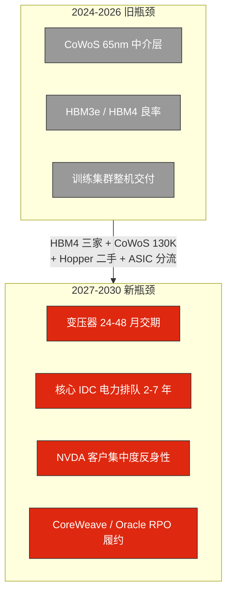
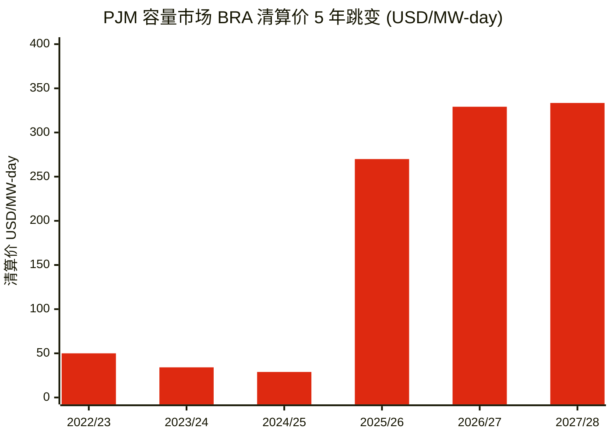
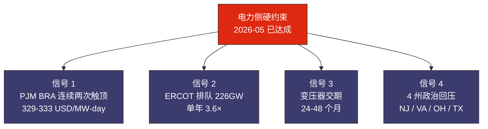
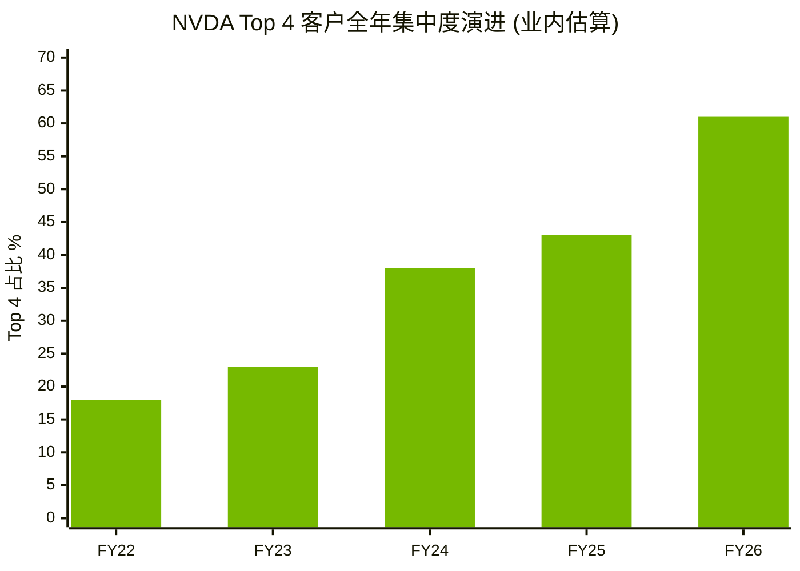
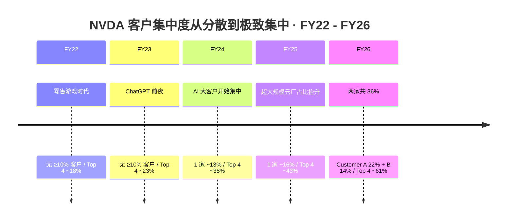
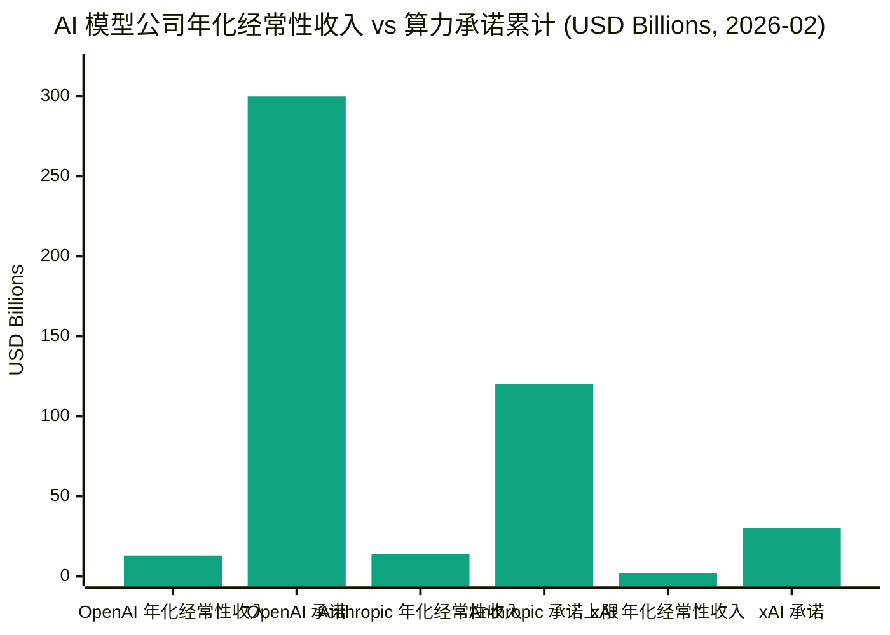

# 第 14 章 缓解之后：电力与客户集中度成为新硬约束

## 本章概览

ch11 给出双瓶颈的物理证据，ch12 给出双瓶颈在 2026 末-2027 上半年第一次结构性缓解的时间窗口与可证伪条件，ch13 给出需求侧弹性能不能接住缓解后的供给。三章拼起来得到一个不太舒服的结论：**紧缺转移而非消失**。

转去哪里？转到两处。一处是电力，一处是客户集中度。本章把这两处的物理与财务结构讲清楚。

缓解前后瓶颈位置的位移可以一图概括：



电力侧的故事在 ch10 与 ch27 已经各讲一遍——ch10 是产业链画面里的"变压器 + PJM + 长期 PPA"，ch27 是宏观外溢里的"算力 vs 居民电费 vs 政治回压"。本章不重复那两章的市场结构，只回答一个问题：**HBM4 三家爬坡 + CoWoS 130K 月产能落地 + Hopper 二手放量 + 训练 ASIC 化这四股缓解力兑现之后，剩下的硬约束是哪几条**。答案是变压器 24-48 个月交期、核心 IDC 集群电力排队 2-7 年、PJM 与 ERCOT 容量市场出现政治回压、SMR 2030 前对算力供电几乎无意义。这四条在 2026-05 已经全部进入"价格信号已发出但物理产能还没追上"的状态。

客户集中度的故事此前在书里只是侧面伏笔。本章把它推到台面：NVDA 在 FY26 10-K 里披露两个直接客户合计约 36% 的营收（Customer A 22% + Customer B 14%，按 FY26 全年 10-K 直接披露口径；扩到 Top 4 业内估算约 61%，详见 §14.4 与 ch07 §7.6 已立锚口径），[CoreWeave](https://www.coreweave.com/) 单一客户 [Microsoft](https://www.microsoft.com/) 在 IPO 招股书披露占 2024 全年营收 62%、2025 年加上 [OpenAI](https://openai.com/) 的三笔合计 \$22.4B 五年大单后两家合计占 RPO 60%+（业内估算）。

OpenAI 2026 年初年化经常性收入业内估算 \$13B 量级、[Anthropic](https://www.anthropic.com/) 2026-02 年化经常性收入 \$14B（SaaStr 2026-02 + 多家公开报道）——两家加起来约 \$27B，但 OpenAI 单家公开承诺的多年期算力合约累计业内估算已 > \$300B（[Oracle](https://www.oracle.com/) 2025-09 \$300B/5 年 + Microsoft 累计 \$40B+ + CoreWeave 三笔合计 \$22.4B + Stargate OpenAI 分摊部分），加上 Anthropic 上限业内估算 \$80-120B（[Google DeepMind](https://deepmind.google/) / [AWS](https://aws.amazon.com/) / Broadcom 累计）、[xAI](https://x.ai/) 业内估算 \$20-30B、Google-Anthropic 2026-04 multi-gigawatt 后续大单等，整链合计已经超过 \$400B（加总链详见 §14.4 表 14-8 + 后续段落）。

**这是反共识 #5（客户集中度是 [NVIDIA](https://www.nvidia.com/) 估值反身性核心）第一次正式在书里露面**。本章只立机制不下结论，主答辩留 ch30，复回 ch29。

第三部到此收尾。读完应该形成以下认知：紧缺的本质是"哪个环节弹性最差"。2024-2026 是芯片侧（ch11），2026 末-2027 上半年看到第一次缓解（ch12），缓解的后果不是过剩而是紧缺位移——2027 之后弹性最差的环节是电力（核心区域）和客户集中度（资本端）。这两条新硬约束的形成机制、量化基线、可证伪条件，是本章要交付的东西。

ch15-18（第四部商业模式：CoreWeave / Stargate / OpenAI 财务 / 模型层循环交易）会从单家公司案例的角度反复回到本章的两条新约束。本章是这些案例章的机制基底。

## 14.1 紧缺转移而非消失：四组瓶颈循环

把第三部前三章的论证链路一句话压缩：双瓶颈是物理紧缺（ch11），物理紧缺有窗口（ch12），窗口之内需求侧弹性能不能接住决定后续叙事走向（ch13）。

但这三章合起来没有回答一个问题：**当 HBM4 三家爬坡、CoWoS 月产能从 130K 抬到 2027 末业内估算的 160-180K、Hopper 二手开始放量、训练 ASIC 在 NVIDIA 队列里挤出 10-15% 之后，下一个紧缺出现在哪里**？

一种可能是没有下一个紧缺——供给追上需求，价格回归边际成本，算力变成商品。这是 telecom 1999 之后的故事（详见 ch29 周期定位的对照）。另一种可能是紧缺位置发生迁移——某一环松开后，下一个最弹性差的环节顶上来。

本章选第二种。理由不是"算力永远紧缺"那种叙事化的宣告，而是把 2026-05 已经能观察到的物理信号摊开。把四组瓶颈循环列出来：

**循环 1：芯片侧（ch11 主战场）**。HBM、CoWoS、晶圆产能、雷达式认证墙。物理时间表 6-18 个月，2026 末-2027 上半年是第一次缓解窗口（ch12）。**循环 1 在 2027 之后从硬约束降为软约束**。

**循环 2：电力侧**。变压器 24-48 个月交期、核心 IDC 集群电力排队 2-7 年、PJM 容量市场连续两次触顶 FERC 批准的临时价格上限（2026/27 BRA 触顶 \$329.17/MW-day，2027/28 BRA 触顶 \$333.44/MW-day——上限本身在两次拍卖之间被 FERC 上调约 1.3%，两次拍卖均清算在上限，来源：PJM 公开拍卖结果 + RTO Insider 2025-07-22 + Power Engineering 2025-12 + EnergyChoiceMatters 2025-12-17）、ERCOT 大负荷接入排队从 2024 年底的 63GW 跳到 2025 年 11 月的 226GW。物理时间表 24-84 个月。**循环 2 在 2027 之后从软约束升为硬约束**——这是本章 §14.2 的主战场。

**循环 3：客户集中度侧**。NVDA 两个直接客户合计 36% 营收（FY26 10-K 全年直接披露口径：Customer A 22% + Customer B 14%）、Top 4 业内估算 ~61%（与 ch07 §7.6 已立锚口径一致；Q2 FY26 单季 Top 2 业内估算抬到 39%），CoreWeave 在 2024 年单一客户占 62% 营收（S-1），2025-2026 年加上 OpenAI 后两家合计占 RPO 60%+（业内估算）。模型层 OpenAI / Anthropic / xAI 三家承担超大体量算力承诺，三家自身的年化经常性收入在 2026-02 时点合计约 \$30B（OpenAI 业内估算 \$13B + Anthropic 公开披露 \$14B + xAI 业内估算 \$1-2B），相对其多年期算力承诺累计仍存在数量级差。这层结构形成了一个"NVDA → CoreWeave / Oracle → OpenAI / Anthropic / xAI → 终端订阅用户 + 企业 API"的细长价值链，链条任何一环松动都会向上传导。**循环 3 在 2027 之后是被市场系统性低估的硬约束**——这是本章 §14.4 与 §14.5 的主战场，也是本书反共识 #5 的机制位。

**循环 4：资本侧**。这里需要先把三层口径区分清楚，避免混用：(a) **超大规模云厂 4 家**（Microsoft / Meta / Google / Amazon）——这是 ch15 / ch29 立的锚口径，纯云基础设施的核心资本支出来源；(b) **5 家 AI 资本支出主力**——在 4 家基础上加 Oracle（OpenAI / Stargate 的核心算力提供方，从 2025 年起资本支出增速进入超大规模云厂级别）；(c) **本书 Mag7 复合口径 7 家**——在 5 家基础上加 Apple 与 NVIDIA（Apple AI 自研资本支出 + NVIDIA 自有数据中心 + 战略投资），用于宏观市值与 AI 资本支出全景。

2026 自然年资本支出数字按三层分别给出，且**需先标清时点**——这一组数字在 2025-Q4 / 2026-Q1 之间被各家连续上修，章内取两个口径并列。

**(i) 2025 年底初始指引口径**（即各家 Q1 2026 法说会前的最早公开数字）——5 家 AI 资本支出主力（MSFT / Meta / GOOG / AMZN / ORCL）合计 \$341B = Microsoft FY26 ~\$80B + Meta ~\$65B + Google ~\$75B + Amazon ~\$105B + Oracle ~\$16B。

**(ii) 截至 2026-05 已大幅上修口径**——Meta 2026 资本支出指引上调至 \$125-145B、Amazon 上调至约 \$200B、Google 上调至 \$175-190B、Microsoft FY26 实际轨迹推到 \$100-120B+、Oracle 业内估算抬到 \$35-45B 区间，**五家合计已超过 \$700B**；含 Apple 与 NVDA 的 Mag7 7 家更宽口径业内估算同步上修至 \$750B+（Apple / NVDA 部分为业内估算，无单家一手指引）；2026 年同比 2025 年实际增速业内估算抬到 60-80%。资本支出增速持续超过营收增速的窗口可能在 2027-2028 触及自由现金流转负的边界（业内估算，详见 ch29 周期定位与 ch16 CoreWeave 解剖）。**循环 4 是资本市场对前三个循环的反馈回路**，与循环 3 通过"客户集中度反身性"绑定。

四组循环的相对约束强度，在 2026-05 这个时点的状态如下：

| 循环 | 2024-2026 状态 | 2027-2030 状态预测 | 物理时间表 | 章节归属 |
|---|---|---|---|---|
| 1 芯片侧 | 硬约束（双瓶颈，ch11）| 软约束（缓解兑现，ch12） | 6-18 月 | ch11 / ch12 |
| 2 电力侧 | 软约束（成本上行，ch10）| **硬约束（核心区域排队 + 容量市场触顶）** | 24-84 月 | 本章 §14.2 + §14.3 |
| 3 客户集中度 | 隐性约束（NVDA FY26 全年 Top 2 = 36% / Top 4 业内估算 ~61%）| **硬约束（反身性 + 反向回路触发）** | 0-24 月（财务季度级） | 本章 §14.4 + §14.5 + §14.7 |
| 4 资本侧 | 隐性约束（资本支出增速 vs 自由现金流）| 视循环 3 状态而定 | 6-36 月（季报级）| ch29 主章 + 本章 §14.6 伏笔 |

这张表里循环 1 的状态切换由 ch12 已经论证完毕——四股缓解力同步发生在 2026-Q4 至 2027-Q2 的物理窗口，三个可证伪信号在 ch12 立此存照。循环 2 与循环 3 的状态切换是本章接下来要论证的两件主事。循环 4 主章是 ch29 周期定位，本章只在 §14.6 给"次生风险"的三种类型伏笔。

值得单独标注一件方法论上的事。**这四组循环不是孤立的，是相互传导的**。芯片侧缓解后，需求会迁移到电力侧（更多 GPU 需要更多电），电力侧紧缺会让算力 ASP 维持高位，高 ASP 又让客户集中度的财务暴露放大，客户集中度风险又通过反身性影响资本侧资本支出节奏。这种串联结构在 ch11 章末"双瓶颈生命周期"已经有过铺垫，本章把它推到收尾。

下面 §14.2 接电力，§14.4 接客户集中度。两块单独讲完之后，§14.5 是客户集中度反身性的机制描述，§14.6 是三种次生风险，§14.7 是 NVDA 估值反身性量化伏笔（不下结论，留 ch30），§14.8 接第四部。

## 14.2 电力新硬约束：四个量化信号同步触发

电力作为软约束的状态在 2020-2023 年是稳定的。算力资本支出周期把这个状态打破。把 2024-2026 之间电力市场的四个量化信号摊开看，会发现它们指向同一个判断：**电力侧从"成本上行"变成"实际接不上"，时间窗口在 2027-2030**。

**信号一：PJM 容量市场两次拍卖连续触顶**。PJM（Pennsylvania-Jersey-Maryland Interconnection，宾夕法尼亚-新泽西-马里兰州际互联，美国最大区域电力市场运营商，覆盖 13 州 + 哥伦比亚特区、年负荷峰值约 165GW）容量市场（Reliability Pricing Model，RPM）每年通过 Base Residual Auction（BRA，基础剩余容量拍卖）为 3 年后的 delivery year（容量交付年度，每年从 6 月 1 日到次年 5 月 31 日）锁定容量。把 5 个 delivery year 的 BRA 清算价拉出来（数据沿用 ch10 与 ch27）：

| Delivery Year | 拍卖时点 | RTO-wide 清算价（\$/MW-day）| 同比 |
|---|---|---:|---:|
| 2022/23 | 2021-05 | \$50.00 | — |
| 2023/24 | 2022-06 | \$34.13 | -32% |
| 2024/25 | 2023-06 | \$28.92 | -15% |
| 2025/26 | 2024-07 | \$269.92 | +833% |
| 2026/27 | 2025-07 | **\$329.17（FERC 临时上限）**| +22% |
| 2027/28 | 2025-12 | **\$333.44（再次触顶，FERC 临时上限上调）**| +1.3% |

> 来源：PJM 各 BRA 官方报告（PJM Markets and Operations / RPM 公开数据）；RTO Insider 2025-07-22 / 2025-12-17 报道；S&P Global Commodity Insights 2024-07-30 / 2025-07-22。2027/28 BRA 触顶价格来源 PJM Inside Lines 2025-12-17 "PJM Auction Procures 134,479 MW of Generation Resources" + Power Engineering 2025-12 "PJM 产能 auction hits price cap again" + EnergyChoiceMatters 2025-12-17。**口径说明**：FERC 批准的临时价格上限本身在两次拍卖之间从 \$329.17/MW-day 上调至 \$333.44/MW-day（约 +1.3%），两次拍卖均清算在当时的上限——表面上"价格继续上升"，本质是"上限被上调了，市场仍触顶"。

把 PJM BRA 清算价 5 年的跳变画出来：



两次拍卖连续触顶（hit the cap）的市场含义有两层。第一层，价格信号已经超出 FERC（Federal Energy Regulatory Commission，美国联邦能源监管委员会）批准的价格上限——意味着市场出清价低于市场需要的价格。PJM Independent Market Monitor（IMM，独立市场监督员，由 Monitoring Analytics 担任）在 2025-08 报告里直接写"the auction did not produce a market-clearing outcome consistent with competitive pricing"——这是 IMM 第一次在年度报告里使用"the market is not clearing"的表述。第二层，价格上限本身被压制了至少 \$20K/MW-year——PJM 同时模拟的"无价格上限"情景清算价为 \$141,828/MW-year，比触顶的 \$120,147/MW-year 高出约 \$21K。

价格信号被行政上限压制 + 实际稀缺仍在外溢，这是电力市场过去 18 年从未出现过的状态。

**信号二：ERCOT 大负荷接入排队单年翻 3.6 倍**。ERCOT（Electric Reliability Council of Texas，德州独立电网运营商）大负荷接入排队（large load interconnection queue）总容量从 2024 年底的 63GW 跳到 2025 年 11 月的 226GW，单年翻了近 3.6 倍。这 226GW 里 77% 来自数据中心。

226GW 是什么概念？ERCOT 2025 年峰值负荷约 86GW，226GW 的待接入大负荷是峰值的 2.6 倍。哪怕只有 30% 在 2028 年前真正落地（业内估算考虑取消率与延后），新增负荷也接近 ERCOT 现有总装机的 80%。德州 PUC（Public Utility Commission of Texas，德州公用事业委员会）2025 年中通过 SB6 把大负荷接入流程做了硬性约束：>75MW 大负荷新增必须接受 ERCOT 拒载（curtailment）条款 + 灵活性合规。这是德州自 ERCOT 设立以来第一次对单类用户做特别规则。

**信号三：变压器合同储备持续抬升**。大型电力变压器（Large Power Transformer，LPT，>100MVA，megavolt-ampere，兆伏安）2025 年美国市场交付周期从 2020 年前的 12-18 个月延长到 24-48 个月。GE Vernova 2025 财年 Electrification 业务（含变压器、配电、网格软件）订单积压（合同储备）从年初 \$20B 上涨到 Q3 末 \$26B，单年增 \$6.5B。Hitachi Energy 2024 财报合同储备约 \$30B。

变压器合同储备抬升的物理本质是：美国本土 LPT 产能在 1990-2010 年的全球化进程里被海外厂（韩国 Hyundai / 现代电气、日本 Hitachi / Mitsubishi、瑞典 ABB、德国 Siemens Energy、墨西哥 Prolec GE）替代，2024 年本土厂只剩 GE Vernova（俄亥俄、加州）、Prolec GE（墨西哥跨境）、Pennsylvania Transformer 等少数家。2025 年美国年度 LPT 装机需求业内估算 1,500-2,000 台，本土产能 600-800 台/年。差额靠进口，但进口端同样紧——韩国 Hyundai Electric 与 HD Hyundai Electric 的 LPT 合同储备已经排到 2028 年。

变压器扩产周期 2-3 年，再加上电工钢（grain-oriented electrical steel，GOES，变压器铁心专用钢，全球产能集中在 JFE / 新日铁 / POSCO / 宝武 / thyssenkrupp Electrical Steel 等少数厂商）扩产周期 3-5 年——**变压器侧的扩产传导链跑不过算力资本支出的扩张速度**。这是物理硬约束的来源。

**信号四：4 州出现政治回压**。这一条比前三条更微妙。把 4 州数据并列：

| 州 / 行政区 | 触发事件 | 时点 | 性质 |
|---|---|---|---|
| 新泽西 | BPU 公开声明 PJM 容量市场需要 reform，居民电费每月多付 \$20-30 | 2025-07 | 立法 + 行政压力 |
| 弗吉尼亚 | 州议会通过法案要求新数据中心 cost allocation 单独计费 | 2025 春 + 2026 春 | 立法 |
| 俄亥俄 | AEP Ohio 申请把数据中心负荷归入单独 rate class | 2024 | 行政（FERC 已批） |
| 德州 | PUC 实施 SB6，大负荷接受 curtailment + 灵活性合规 | 2025-09 实施 | 立法 + 行政 |

> 来源：NJBPU 2025-07-23 新闻稿；Virginia General Assembly 2025-2026 legislative session 数据中心相关法案记录（HB 1601 / SB 1449 等）；AEP Ohio rate case 2024 + FERC 批准记录；Texas SB 6 立法记录 2025 + PUCT 实施细则 2025-09。

4 州政治回压的共同特征：把算力资本支出推高电费这件事从"产业话题"升级为"居民账单"。这一升级有两个反馈效应：第一，新建大型数据中心的州级审批难度上升，地方 NIMBY（Not In My Backyard，本地反对）情绪从弗吉尼亚 Loudoun 县扩散到俄亥俄、德州；第二，超大规模云厂与 IDC REIT（Real Estate Investment Trust，数据中心房地产投资信托，如 Equinix / Digital Realty）的项目工期需要在原物理交付周期之外，额外预留 6-18 个月的政治协调周期。这一项是 ch27 政治回压的主菜，本章只把"政治回压形成第四个量化信号"这件事单独标注。

四个信号叠起来，电力侧已经满足"价格、产能、政治"三层同步紧缺的条件。这是循环 2 在 2026-05 进入"硬约束"状态的物理基础。

把四个信号的状态写入"电力新硬约束量化矩阵"：

| 信号 | 2024 基线 | 2026-05 状态 | 触发为"硬约束"的阈值 | 当前状态 |
|---|---|---|---|---|
| 1. PJM BRA 清算价 | \$28.92/MW-day | \$329.17（2026/27 触顶）+ \$333.44（2027/28 触顶，FERC 临时上限上调约 1.3%）| 连续 ≥2 年触顶 | **已触发** |
| 2. ERCOT 大负荷排队 | 63GW（2024 末）| 226GW（2025-11）| >150GW 且年增 >50GW | **已触发** |
| 3. 变压器交期 | 12-18 个月 | 24-48 个月 | >24 个月 | **已触发** |
| 4. 州级政治回压 | 0 州有立法行动 | 4 州（NJ / VA / OH / TX）| ≥3 州 | **已触发** |

把四个信号的同步触发画成一张图：



四个信号在 2026-05 全部触发，意味着电力侧从软约束切换到硬约束的物理证据链已经齐全。剩下的问题不是"会不会成为硬约束"，是"硬约束的持续时长有多远"。

§14.3 单独讨论一个流行的反驳——SMR（Small Modular Reactor，小型模块化反应堆）。

## 14.3 SMR 2030 前对算力供电几乎无意义

电力新硬约束论调的最常见反驳是 SMR——"AI 巨头已经签了一堆 SMR 长期合约，2030 年之后核电小堆能解决电力问题"。本章对这个反驳的回答是：**2030 年之前 SMR 对算力供电几乎无意义**。这是议题 7 答辩里硬度最高的一段，因为它直接对冲了一个 2024-2026 期间反复出现的市场叙事。

先把已签的 SMR 主要合约列出来：

| 合约 | 客户 | 卖方 | 容量（MW）| 首堆并网目标 | 公告时点 |
|---|---|---|---:|---|---|
| Google-Kairos SMR 多座 | Google | Kairos Power | 最高 500 | 2030 年首堆 50MW，2035 年 500MW 全量 | 2024-10-14 |
| Amazon-X-energy Xe-100 多座 | Amazon | X-energy | 最高 320 | 2030 年代中期 | 2024-10 |
| Microsoft-TMI Unit 1 重启 | Microsoft | Constellation | 835 | 2028（既有反应堆重启，非 SMR）| 2024-09-20 |
| Meta-Constellation Clinton | Meta | Constellation | ~1,100 | 2027-06 起（既有大堆，非 SMR）| 2025-06 |
| Vistra Comanche Peak | "大型投资级公司"业内推测 | Vistra | 1,200 | 2027-Q4（既有大堆，非 SMR）| 2025-Q3 |
| Oklo COLA 申请 | TBD | Oklo（Aurora 设计）| 各项目分别 | 2028+（首堆目标，但 COLA 仍在审）| 2025 提交 |

> 来源：Google "Google signs world's first corporate agreement to purchase nuclear energy from multiple small modular reactors" 2024-10-14；Kairos Power NRC Hermes 建设许可 2023-12；Amazon-X-energy 2024-10 公告；Microsoft-Constellation TMI 公告 2024-09-20；Meta-Constellation Clinton 2025-06 公告；Vistra Comanche Peak 2025-Q3 8-K；Oklo NRC 申请进度 2025。

这张表里有两件事需要单独划清楚。

**第一件，"SMR 合约"与"既有大堆 PPA"是两类不同的资产**。Microsoft-TMI、Meta-Clinton、Vistra Comanche Peak 三笔都是既有的大型轻水反应堆（Three Mile Island Unit 1、Clinton Energy Center、Comanche Peak Units 1&2）——这些反应堆已经运行多年（Clinton 1987 年并网、Comanche Peak 1990 年并网、TMI Unit 1 1974 年并网至 2019 年因经济原因关闭），新合约只是 PPA 期限延长 + Big Tech 包销。这些反应堆不是 SMR。**真正的 SMR 合约是 Google-Kairos 与 Amazon-X-energy**，两笔合约的首堆目标均在 2030 年之后，2035 年才能到达公告承诺的全量容量。

**第二件，NRC 审批 → 首堆通电 → 实际并网三个时点差距很大**。NRC（Nuclear Regulatory Commission，美国核管会）的反应堆审批流程分两条路径：(a) 设计认证（Design Certification，DC）+ 建设许可（Construction Permit，CP）+ 运营许可（Operating License，OL）三段式；(b) 组合许可证（Combined License Application，COLA）一段式。SMR 各家公司选择的路径不同：

- **Kairos Power**：Hermes 示范堆（35MWe 熔盐反应堆）2023-12 获 NRC 建设许可，目前在田纳西 Oak Ridge 建设。Hermes 是技术示范堆，**不并网商业供电**。第一座并网的 Kairos 商业 SMR 计划 2030 年。
- **X-energy**：Xe-100（80MWe 高温气冷堆）。2024-10 与 Amazon 签 PPA。NRC COLA 仍在审议中，首堆商用目标 2030 年代中期。
- **Oklo**：Aurora（15-50MWe 钠冷快堆）。2024 因美国"环境影响声明不充分"被 NRC 退回 COLA，2025 重新提交。首堆目标 2028 年（业内估算，受 NRC 审批进度影响显著）。
- **TerraPower**：Natrium（345MWe 钠冷快堆带储热）。怀俄明 Kemmerer 项目 2024 年开工（非核岛部分），NRC 建设许可 2024 获批，首堆目标 2030 年。
- **NuScale**：原本 2030 年前最有希望的小堆候选，2023 年 UAMPS（Utah Associated Municipal Power Systems，犹他州联合市政电力系统）项目被取消后基本退出商业 SMR 第一梯队。

把所有家拼起来看 2026-2030 年的实际 SMR 装机量：业内估算 2026-2029 年商业 SMR 累计并网容量 **不到 200MW**，其中 Kairos Hermes 示范堆 35MWe 还不并网商用、TerraPower Natrium 单堆 345MWe 首堆目标 2030 年。即便所有 SMR 项目都按公告时间表推进——2030 年累计装机业内估算不超过 1.5GW，2035 年累计装机业内估算不超过 8GW。这两个数字与同期 AI 数据中心新增电力需求量级（IEA 2025 估算全球数据中心 2030 年比 2024 年新增 ~530TWh、对应平均功率 60-70GW，来源：IEA Energy and AI Report 2025-04）完全不在一个量级。

**这意味着 SMR 在 2026-2029 这一轮算力资本支出周期里，对电力供给的贡献接近零**。Google 在 2024-10 与 Kairos 签的 500MW，2030 年只有 50MW 真正能并网，占 Google 同期数据中心总电力需求（业内估算 5-8GW）的 0.6-1%。Amazon-X-energy 的 320MW 在 2030 年代中期才到位。这两笔合约的真实意义是 2032-2040 年时间段的 hedge，不是 2026-2029 周期的供给。

为什么 SMR 不能加速？三个物理约束：

**约束 a：NRC 审批周期 4-7 年**。反应堆设计认证（含 environmental review、PSAR、FSAR 等多轮）平均 4-6 年，建设许可与运营许可平均 2-3 年。即便 NRC 在 2024 年的 ADVANCE Act改革下加速了部分小堆审批流程，物理审批时间仍然在 3-5 年区间。

**约束 b：首堆建造 4-7 年**。SMR 的工厂模块化承诺在 first-of-a-kind（FOAK，首座同型号反应堆）阶段几乎兑现不了——首堆仍需现场组装、调试、试运行。Kairos Hermes 示范堆 2023-12 拿到建设许可，预计 2027-2028 才能完成调试投运。第一座商业 SMR 从拿到 OL 到并网，业内估算 4-6 年。

**约束 c：核燃料供应链短板**。Kairos 与 X-energy 的设计都用 HALEU（High-Assay Low-Enriched Uranium，高浓度低富集铀，富集度 5-20%）。美国本土 HALEU 产能 2026-2030 年业内估算每年只有 5-10 吨级，按每座 SMR 首装料约 1-3 吨 HALEU 推算，HALEU 供应链支撑不了大规模 SMR 部署。Centrus Energy 与 GLE 是美国本土两家主要 HALEU 厂商，扩产周期 3-5 年。

把三个约束叠起来，2030 年之前 SMR 对算力供电的边际贡献接近零。这是议题 7（电力是不是真瓶颈）答辩里最硬的一段——SMR 是市场叙事里出现频率最高的"长期解决方案"，但拆开看物理时间表，2026-2030 周期里它解决不了任何瓶颈。

不写"SMR 没用"，也不写"SMR 是骗局"。SMR 在 2032-2040 年的能源转型里有真实意义，但本章讨论的算力资本支出周期窗口是 2026-2029。窗口内的电力供给主要来自三个老办法：天然气燃机（含 Crusoe Abilene 模式的 behind-the-meter 自建）、既有核电延寿与重启（Microsoft-TMI / Meta-Clinton / AWS-Susquehanna）、风光储基荷化（Big Tech 在签的 Brookfield / Invenergy 多家组合 PPA）。SMR 不在 2026-2029 的窗口内。

电力新硬约束在这一节收尾。下面 §14.4 切换到客户集中度。

## 14.4 客户集中度的当下数字

电力是物理瓶颈，客户集中度是财务结构瓶颈。两者在 2026-05 同步进入硬约束，但形成机制完全不同。

客户集中度风险在传统财务分析里是一个标准的 10-K 披露条款（Item 1A Risk Factors 与 Item 8 Financial Statements 里的 concentration of credit risk）。在 AI 算力产业链里，这件事的特殊性来自两层：(a) 算力 ASP 处于历史高位且供给端有结构性紧缺（ch11），让客户集中度的风险被"紧缺溢价"暂时压制；(b) 价值链上下游的财务暴露通过长期合约（NVDA RPO / CoreWeave RPO / 超大规模云厂资本支出指引）相互绑定，链条上任何一环的预期下调都会向上下游同步传导。

把 2026-05 这个时点公开可查的客户集中度数字摊开。

**NVIDIA**。FY26 10-K（财年截至 2026-01-25，提交时点 2026-02 末）Item 1A 与 financial statements 注释披露：FY26 全年两个直接客户超过 10% 占比，分别为 Customer A 22%、Customer B 14%，合计 **36%**（"two direct customers, each accounting for 10% or more of total revenue"，来源：NVIDIA FY26 10-K，SEC EDGAR 2026-02 提交版）。

扩到 Top 4 的全年口径业内估算 ~61%（卖方研报按 FY26 Q1-Q4 各季度 10-Q 单季披露 + 全年 10-K 综合推演的常用口径，详见 ch07 §7.6 已立锚），季度内单季集中度更高——Q2 FY26 10-Q 单季披露 Top 2 = Customer A 23% + Customer B 16% = 39%，Top 6 entities = 85%。

NVIDIA 不点客户名，但市场推测主要是超大规模云厂的代工伙伴或 ODM（Original Design Manufacturer，原始设计制造商，如 Foxconn / Quanta / Wistron / Inventec / Supermicro）——直接客户是 ODM，最终用户是超大规模云厂。把"直接客户"换算成"最终用户口径"：NVIDIA FY26 数据中心营收 \$193.7B里，Microsoft Azure / Amazon AWS / Meta / Google Cloud / Oracle 五家超大规模云厂业内估算合计占 50-55%。

历史趋势看，NVDA 客户集中度从 FY22 到 FY26 变化方向（业内整理 NVDA 历年 10-K Item 1A 披露 + 卖方研报口径整理）：

| 财年 | 全年 10-K 直接披露 ≥10% 客户合计（口径 1）| Top 4 全年业内估算（口径 2）| 主要驱动 |
|---|---:|---:|---|
| FY22（2022-01 财年终） | 无 ≥10% 客户 | 业内估算 15-20% | 游戏 + 数据中心均衡 |
| FY23（2023-01 财年终） | 无 ≥10% 客户 | 业内估算 20-25% | ChatGPT 前夜 |
| FY24（2024-01 财年终） | 1 家 ~13%（业内估算）| 业内估算 35-40% | AI 大客户开始集中 |
| FY25（2025-01 财年终） | 1 家 ~16%（业内估算）| 业内估算 40-45% | 超大规模云厂占比抬升 |
| FY26（2026-01 财年终） | **Top 2 = 22% + 14% = 36%**（10-K 一手）| **业内估算 ~61%** | 两家 ≥10% 客户，Top 4 集中度抬到新高 |

> 来源：NVIDIA FY22-FY26 各 10-K Item 1A Risk Factors + concentration of credit risk 注释；FY26 Top 2 = 36% 为 10-K 全年直接披露口径（一手）；Top 4 业内估算 ~61% 综合 FY26 Q1-Q4 各季度 10-Q 单季披露 + 全年 10-K 推演（与 ch07 §7.6 已立锚一致）；FY22-FY25 口径 1 按各财年 10-K 披露原文，口径 2 为 Bloomberg / Morgan Stanley / Bernstein 历年 NVDA 10-K 整理研报综合。NVIDIA 不点客户名，本表严格按 10-K 直接客户口径，不做名字猜测。本表与 ch07 §7.6 / ch29 §29.3 维度 10 已立锚口径一致。

NVDA 客户集中度 5 年演进的视觉对比：



NVDA 客户集中度 5 年演进的时间线：



5 年时间里 NVIDIA 直接客户集中度（Top 4 全年口径）从业内估算 ~20% 抬到业内估算 ~61%；10-K 一手披露的 ≥10% 客户合计也从 0 抬到 FY26 的两家共 36%。这是 AI 时代之前 NVIDIA 历史上没出现过的状态——游戏卡时代客户分散在 Best Buy / Newegg / [Amazon](https://aws.amazon.com/) 等无数零售商，2016-2022 数据中心起步阶段客户分散在数百家 OEM 与中小云厂商，2023-2026 客户集中到 5 个超大规模云厂的代工合作伙伴。

**CoreWeave**。CoreWeave S-1（2025-03 提交，IPO 时点 2025-03-28）披露 2024 年单一客户 Microsoft 占总营收 62%。S-1 同时披露剩余主要客户名单包括 Meta（公开报道有合作但 S-1 未单独点比例）、NVIDIA（CoreWeave 的股东 + 客户，S-1 标"related party"）、几家 AI 实验室。

2025 年 3 月 10 日 CoreWeave 与 OpenAI 公告 5 年期 \$11.9B 算力合约——时点是 CoreWeave IPO（2025-03-28）前 18 天，与 S-1 / S-1A 同步对外披露。2025 年 5 月 CoreWeave 又追加 \$4B 扩展合约。2025 年 9 月 25 日 CoreWeave 再追加 \$6.5B 扩展合约。三笔合计 **\$22.4B**（\$11.9B + \$4B + \$6.5B，来源：Bloomberg "CoreWeave Expands Deals With OpenAI to as Much as \$22.4 Billion" 2025-09-25 + Tom's Hardware 2025-09 报道整理）。叠加之后 OpenAI 在 CoreWeave 的 RPO（Remaining Performance Obligations，剩余履约义务，未来需要交付的合约规模）里业内估算占比抬到 35-40%。

把 CoreWeave 2024 年与 2025 年末两个时点的客户集中度对照：

| CoreWeave 客户集中度 | 2024 年（S-1 披露） | 2025 年末（业内估算） |
|---|---:|---:|
| Microsoft 占比 | 62% 营收 | 业内估算 30-40% RPO（被 OpenAI 稀释）|
| OpenAI 占比 | 0% | 业内估算 35-40% RPO（三笔一手合计 \$22.4B：\$11.9B 2025-03-10 IPO 同步 + \$4B 2025-05 扩展 + \$6.5B 2025-09-25 8-K）|
| 两家合计 | 62% | **业内估算 65-75% RPO** |
| 其余客户 | 38% | 25-35% |

> 来源：CoreWeave S-1 2025-03、CoreWeave 8-K 2025-Q3、Bloomberg / Reuters / CNBC 2025-09/10 报道整理。2025 年末两家合计的 RPO 占比为业内估算，CoreWeave 官方未单独披露 RPO 客户分布。CoreWeave 招股书引用的 2024 年 Microsoft 占比 62% 是营收口径（实际交付），与 RPO（未交付合约）口径不同。

**CoreWeave 是 2026 年公开市场上客户集中度最高的大型 AI 基础设施公司**。Microsoft 加 OpenAI 两家合计占 RPO 60%+，意味着任何一家的合约变更、需求下调、付款延期，都会直接冲击 CoreWeave 的现金流与债务覆盖能力。这一条在 ch16 CoreWeave 完整 DCF 解剖里是核心输入，本章只立机制。

**OpenAI**。OpenAI 不是上市公司，没有 10-K 披露。但 2026 年初公开报道里给出的年化经常性收入（Annualized Recurring Revenue，年化经常性收入）业内估算约 \$13B。这个数字本身是 2024 年同期的 4-5 倍，是行业里增长最快的大型 SaaS 营收曲线之一。

但 OpenAI 公开承诺的多年期算力合约总额业内估算合计已经超过 \$300B：

- Microsoft：原 OpenAI 主要算力提供方，2023-2026 累计 commitment 业内估算 \$40B+。2025 年因 Stargate 项目 OpenAI 与 Microsoft 关系结构性变更，但 Azure 仍是优先算力供应方。
- Oracle：2025-09 公告 5 年 \$300B 算力合约。这是单一最大公开算力合约。Oracle 把 OpenAI 列为其新增 RPO 的核心驱动。
- CoreWeave：三笔一手合计 \$22.4B（\$11.9B 2025-03-10 IPO 同步 + \$4B 2025-05 扩展 + \$6.5B 2025-09-25 8-K，来源：CoreWeave 新闻稿 / 8-K + Bloomberg 2025-09-25 整理）。
- Stargate（OpenAI + SoftBank + Oracle 合资项目）：2025-01 公告 4 年 \$500B 总投资，OpenAI 是核心算力消费方。
- Anthropic-Google：参考用，Anthropic 与 OpenAI 不直接合作但市场并列。

> 来源：各家公司公告与法说会口径综合。\$300B+ 是 OpenAI 在不同算力提供方处签订的多年期合约规模之和，**不等于** OpenAI 同期实际需要支付的现金。合约里大部分是"按需扣减"或"分阶段付款"结构，2026-2027 年实际付现规模业内估算 \$30-50B/年量级，与年化经常性收入 \$13B 之间仍有数倍差距。

数字之间的不对称已经写在表面上。**\$13B 年化经常性收入 vs \$300B+ 多年期算力承诺**——OpenAI 在 2026-05 这个时点上的资产负债结构，与传统软件公司的年化经常性收入 vs RPO 比例差几个量级。Microsoft 在 OpenAI 持股 + 算力承诺 + 收入分成的复合结构让这个不对称暂时可承受，但任何对 OpenAI 年化经常性收入增速的预期下调都会通过 Microsoft 与 Oracle 的 RPO 兑现假设向上传导（详见 §14.5 反身性）。

**Anthropic**。同样未上市，2026-02 年化经常性收入公开披露 \$14B——从 2024-12 的 \$1B 到 2026-02 的 \$14B，14 个月内 14 倍。Anthropic 公开的多年期算力承诺：

- Google：2025-10-23 公告"up to 1 million TPU（Tensor Processing Unit，谷歌自研 AI 芯片）chips" + "well over 1 GW 产能 coming online in 2026"，2026-04-06 追加 multi-gigawatt 后续大单（业内估算 3.5GW 容量），Mizuho 估算 Broadcom 在 Anthropic 2027 年收入 \$42B。
- Amazon AWS：Project Rainier 500K Trainium2 集群。AWS 累计投资 Anthropic \$40B（2023-09 \$4B + 2024-11 \$4B + 2025 系列追加，来源：Amazon 与 Anthropic 联合公告 2023-2025）。
- 其他：CoreWeave 业内传闻有合作但未公开披露规模。

Anthropic 的客户集中度对其上游（Google / AWS / Broadcom）形成倒挂——上游对 Anthropic 的算力供给承诺远超 Anthropic 自身年化经常性收入量级，这与 OpenAI vs Microsoft / Oracle 的结构同构。

**xAI**。Memphis Colossus 1 期约 200K H100/H200 GPU（2024-07-22 首阶段 100K H100 上线、122 天建成，2025-12 扩到约 200K，来源：xAI 官网 "Colossus: The World's Largest AI Supercomputer" + Introl Blog "xAI's Memphis Colossus" + Memphis Chamber 经济发展披露 + Bloomberg 2024-2025 多篇报道）。Colossus 2 计划扩到 1M GPU 量级（公开宣传口径，业内估算实际部署在 2026-2028 年）。xAI 2026-02 年化经常性收入业内估算 \$1-2B，相对 Colossus 部署规模业内估算 \$20-30B+ 资本投入，财务暴露比 OpenAI 与 Anthropic 更严重。xAI 客户结构主要是 X 平台 + Grok 订阅，单一客户依赖 Elon Musk 旗下生态。

把四家 NVDA 大客户的"算力承诺 vs 年化经常性收入"对照：

| 客户 | 2026-02 年化经常性收入 | 已签多年期算力承诺累计（业内估算）| 比例 |
|---|---:|---:|---:|
| OpenAI | \$13B（业内估算）| \$300B+（5-7 年期） | 23x |
| Anthropic | \$14B（公开披露 2026-02）| 业内估算 \$80-120B（5-7 年期，含 Google / AWS / Broadcom）| 6-9x |
| xAI | \$1-2B | 业内估算 \$20-30B（Colossus 1+2 部署） | 15-20x |
| Stargate（OpenAI / SoftBank / Oracle 合资 SPV）| — | \$500B 总投资（4 年期，OpenAI 是核心算力消费方，其中 OpenAI-Oracle \$300B 部分已计入上一行 OpenAI 累计） | — |

> 来源：年化经常性收入数据来自 The Information / Reuters 2026-01/02 综合报道，公司均未官方披露年化经常性收入；算力承诺为各家公司公告之合计（详见上文各段落）；倍数比例按报道时点截面，不等于经济意义上的"承诺 ÷ 当期营收"严格定义。**口径说明：章首 "\$400B+" 整链加总 = OpenAI 单家 \$300B+（Oracle \$300B + Microsoft \$40B+ + CoreWeave 三笔合计 \$22.4B，已扣 Stargate-Oracle 重叠）+ Anthropic \$80-120B 上限 + xAI \$20-30B + Google-Anthropic 2026-04 multi-gigawatt 后续大单；Stargate 整体 \$500B 不再单独相加以避免与 OpenAI-Oracle 重复计算。**

把三家年化经常性收入 vs 算力承诺差距画一张柱状图：



把这张表与 NVDA / CoreWeave 客户集中度对照起来看，整个 AI 算力产业链的财务结构是细长形的：

- **NVDA**：FY26 全年 10-K Top 2 = 36%（一手）/ Top 4 业内估算 ~61%；终端 5 家超大规模云厂 ~50-55%；
- **CoreWeave**：2 个客户 ~65-75% RPO（Microsoft + OpenAI）；
- **Oracle**：OpenAI 业内估算占 Oracle 新增 RPO 60%+；
- **OpenAI / Anthropic / xAI**：自身年化经常性收入与算力承诺存在 6-23x 倍数差（Anthropic 6-9x、OpenAI ~23x、xAI 15-20x）。

整条价值链在 2026-05 这个时点呈现一个特殊的状态：**财务暴露在每一环都向上端集中，但每一环的"集中点"是上一环的"客户"，链条没有自然的稀释机制**。当链条任一环的需求假设修正，所有上游环节的 RPO 与估值假设都需要重新计算。这是循环 3 在 2027-2030 进入硬约束的本质——不是某一家公司的财务问题，是整条链上财务暴露的同步性。

§14.5 单独讨论这种同步性如何通过反身性机制放大。

## 14.5 反身性机制：客户集中度如何放大估值波动

George Soros 在 1987 年《The Alchemy of Finance》里描述的反身性（reflexivity）是市场参与者的认知与市场基本面之间双向反馈的过程。市场参与者基于不完全的认知做决策，决策反过来改变基本面，被改变的基本面又重新塑造认知。两个方向同时作用时市场出现非均衡（disequilibrium）。Soros 反身性不是"自我实现的预言"那种单向叙事，而是双向回路（two-way feedback loop）。

客户集中度的反身性体现在三个方向：

**方向一：订单聚集放大估值上行**。NVDA 客户集中度（Top 4 全年业内估算口径）从 FY22 的 ~20% 抬到 FY26 的 ~61%，10-K 一手披露的 ≥10% 客户合计从 0 抬到 FY26 的两家共 36%，期间 NVDA 股价上涨了多少倍？数据中心营收从 FY22 的 \$10.6B 抬到 FY26 的 \$193.7B，约 18 倍量级。这两条曲线同步上行不是巧合——超大规模云厂资本支出集中流向 NVDA 的过程，本身就在制造"NVDA 是 AI 算力唯一受益方"的认知，认知反过来又强化超大规模云厂把更多资本支出配置到 NVDA 的决策。

反身性的关键在"双向"而非"单向"。**超大规模云厂选择 NVDA 的部分理由是市场已经认为 NVDA 是赢家**（路径依赖 + 软件生态锁定 + 招聘端 CUDA（NVIDIA 自研 GPU 并行计算平台，AI 主流开发环境）工程师便利），市场认为 NVDA 是赢家的部分理由是超大规模云厂选择 NVDA。这种回路在 2024-2026 期间是正反馈（积极循环），让 NVDA 估值倍数被支撑在历史高位。

**方向二：单一客户预期修正向上传导**。把方向反过来。任意一家 OpenAI / Anthropic / xAI 的年化经常性收入增速一旦不达预期，反身性回路开始反向运行。具体路径：

1. OpenAI 年化经常性收入 2027 年某季度同比增速从 +200% 放缓到 +80%（虚构情景，仅做机制描述）；
2. 市场重新估算 OpenAI 2030 年年化经常性收入中位预测，从 \$200B 下调到 \$120B；
3. 修正后的年化经常性收入预测使 OpenAI 实际能够履约的"未来 5 年 \$300B+ 算力承诺"的可信度下降；
4. 上游 Microsoft / Oracle / CoreWeave 的 RPO 估值需要重新折扣——Oracle \$300B RPO 里如果有 25% 兑现概率下调，Oracle 估值倍数面临修正；
5. Oracle 估值修正进一步触发 NVDA 对 Oracle 的应收账款风险评估；
6. NVDA 的 forward growth 假设需要扣除 OpenAI 链条的部分需求；
7. NVDA 估值倍数面临修正。

这条链路从单一终端客户的年化经常性收入增速修正，传导到 NVDA 估值，中间经过 5 个环节。链路上的每一环都通过财务合约（RPO / 长期 PPA / 应收账款）相互绑定，但市场对每一环的估值假设不一定同步调整。当某一环的预期下调时，反身性让其他环节同步、非线性地下调。

**方向三：交易结构形成的反身性闭环**。NVDA 在 2024-2026 期间对 CoreWeave、OpenAI、xAI 等下游客户做了一系列战略投资与合作：

- NVDA 投资 CoreWeave（IPO 前持股，IPO 后仍持有显著份额，来源：NVIDIA FY26 10-K 关联交易披露 + CoreWeave S-1）；
- NVDA 与 OpenAI 公告"最高 1000 亿美元（up to \$100 billion）投资 + 至少 10GW 算力部署"计划——公告原文 "up to" 而非 "at least"；
- NVDA 与 xAI 通过 GPU 大客户折扣 + 早期部署协议形成准战略关系。

这些交易在公开披露口径里都是"战略投资 + 客户关系"。市场更宽松的描述是"循环交易"（circular transaction）——NVDA 把利润的一部分通过投资形式返还给客户，客户用这部分资金继续向 NVDA 采购更多 GPU。这种结构在反身性视角下放大了估值上行——NVDA 的收入与投资同步增长，资产负债表两端都被"AI 故事"涵盖。

但**这种结构也在反向情景下放大估值下行**。一旦下游客户的财务状况恶化，NVDA 持有的战略投资面临减值，应收账款回收率下降，循环交易的现金流断裂。NVDA FY26 10-K 已经在 Item 1A Risk Factors 里把"customer concentration" + "concentration of credit risk" + "investments in pre-IPO companies" 三件事分别列为重要风险。这是市场最常忽视的一段——招股书与 10-K 的"风险"段通常被认为是 boilerplate（套话），但当循环 3 进入硬约束阶段时，这一段会被重新审读。

**反身性矩阵**：把上行与下行两个方向、三种触发机制写成 2×3 的对照表：

| 触发机制 | 上行情景（2023-2026 兑现）| 下行情景（2027+ 可能触发）|
|---|---|---|
| 订单聚集 | 超大规模云厂资本支出集中到 NVDA → 估值上行 → 强化"NVDA 唯一赢家"认知 → 更多订单 | 任一超大规模云厂资本支出增速放缓 → NVDA RPO 折扣 → 估值修正 → 其他超大规模云厂重新评估 |
| 单客户预期 | OpenAI 年化经常性收入加速 → Microsoft / Oracle / CoreWeave RPO 兑现概率上升 → 上游估值上行 → NVDA 估值上行 | OpenAI 年化经常性收入减速 → 上游 RPO 折扣 → CoreWeave 现金流压力 → NVDA 应收风险 |
| 循环交易 | NVDA 投资 CoreWeave / OpenAI / xAI → 客户算力购买力上升 → 收入回到 NVDA → 资产负债表两端膨胀 | 客户财务恶化 → NVDA 投资减值 → 应收账款回收率下降 → 循环现金流断裂 |

这张表的左列在 2023-2026 是真实发生的（每一行都有公开数据支撑），右列在 2026-05 还没触发，是反身性回路反向运行时可能出现的情景。Soros 反身性的核心观察是——**上行情景与下行情景共用同一个机制**。回路不是单向的，方向取决于市场参与者的认知与基本面之间的"哪一端先变化"。

需要单独标注两件事。

第一，**反身性不等于预言**。本章不是在预测"NVDA 估值即将反转"。反身性是机制，不是时间表。回路何时反向、反向幅度多大，取决于一组外生变量（终端客户年化经常性收入实际增速、超大规模云厂资本支出节奏、宏观利率、竞争对手 ASIC 渗透速度），任何一项都难以单独预测。本章的工作是把机制写清楚，把可观察的反身性早期信号留给 ch29 周期定位，把估值含义留给 ch30 五估值模板。

第二，**反身性的不对称放大**。Soros 在《Alchemy》里特别强调上行与下行的不对称——上行回路通常持续多年、积累温和；下行回路一旦启动通常在数月内完成。原因在于杠杆与流动性：上行期市场参与者持仓增加、衍生品敞口扩大、信贷条件放松，这些"宽信用"基础在下行期反向调整时速度更快。客户集中度反身性的下行情景一旦触发，传导速度业内估算在 1-3 个季度区间——比上行回路的 5 年（FY22→FY26）短一个数量级。

§14.6 把这种下行情景的具体形态拆解为三种次生风险。

## 14.6 三种次生风险

ch16（CoreWeave 解剖）会给完整 DCF + 折旧应力测试，ch29（周期定位）会给 telecom 1999 完整对照，ch18（模型层与循环交易）会给关联交易机制描述。本章不抢三个主章的位置，只把"客户集中度反身性反向运行时"会出现的三种次生风险写出来作为伏笔。

**风险一：单价崩塌（telecom 1999 类比）**。1996-2000 年美国 telecom 长途光纤建设泡沫期间，长途光纤每 Mbps 价格从 1995 年的约 \$3,000-5,000/月跌到 2001 年的约 \$50-100/月，5-6 年内跌幅 95%+。具体数据缺口大——1996-2000 年没有统一的 per-Mbps 价格指数，本章引用的数字综合了 Pritchett 学术整理与多家行业回顾，三家口径差异 20-40%。

这条曲线对应的物理机制：1996-1999 年大量 telecom 公司用债务融资铺设光纤（Global Crossing、WorldCom、Qwest、Level 3、Williams Communications），假设带宽需求会按互联网用户增速持续上行。实际 1999-2001 年公司用户数与流量增长追不上铺设容量——单 fiber 利用率长期低于 5%。当债务利息开始压垮现金流，价格被迫从"折旧导向"切换到"边际成本导向"，跌幅在 18-24 个月内完成。

算力侧的对应机制：H100 / H200 / B200 在 2024-2026 年的现货价已经显现下行趋势（ch12 §12.5 给的现货价从 \$7-10/hr 跌到 \$1.7-2.6/hr，2025-10 一年合约价低点 \$1.70，2026-05 仍在 \$1.70-2.63 区间，来源：Silicon Data + SemiAnalysis 多源整理）。GPU 单价崩塌的触发条件是：(a) 供给侧 ASIC 分流让 NVDA 队列里的需求结构性下降；(b) 客户集中度反身性触发超大规模云厂资本支出节奏放缓；(c) Hopper 二手放量让中小厂商有 H100 廉价供给。三个条件在 2027-2028 期间业内估算有同步触发的概率，但具体时点取决于反身性回路何时反向。

**单价崩塌不是 NVDA 整体收入崩塌**——telecom 1999 之后的 fiber 价格跌 95% 不等于 telecom 公司收入跌 95%，但确实意味着资产负债表上的折旧假设需要重新计算。NVDA 与超大规模云厂都在按 6-7 年线性折旧 GPU，如果 GPU 二手价跌幅超过 50%（折旧路径之外的额外贬值），意味着资产负债表上的"未折旧账面价值"高于"市场公允价值"，会触发 impairment（减值损失）。CoreWeave 2024 财报与 ch16 的折旧应力测试将这件事做完整模型。

**风险二：二手 H100/H200 踩踏**。这是风险一的市场表象。ch12 §12.5 已经给 Hopper 二手价的 2024-2026 时间序列。本章把"踩踏"具体定义出来。

踩踏（cascade）的触发机制：当 Blackwell 累计装机超过 Hopper 装机 50%（业内估算 2026-Q4 至 2027-Q1，按 NVDA Blackwell 全年指引推演），超大规模云厂的 fleet 管理策略会从"满负荷使用 Hopper"切换到"主动释放 Hopper"。释放节奏取决于：(a) Blackwell 推理 ROI 优势（5x 推理性能，业内估算单位 token 成本降 80%）；(b) 折旧政策（线性 vs 加速）；(c) 二手市场容量。

如果三个条件同步触发——Blackwell 推理优势确实兑现 + 超大规模云厂加速折旧（如从 6 年改 5 年）+ 二手市场容量不足以吸纳放量——会出现"踩踏"：所有超大规模云厂同时释放 Hopper，二手价跌破"维持成本"（业内估算约 \$10-12K/卡，包括运输 + 测试 + 重新部署的边际成本），CoreWeave 等高杠杆云的资产负债表面临双重冲击（账面价值减值 + 出租率下降）。

二手 H100 跌 50%+ 是 ch29 三个泡沫顶部预警指标之一，本章给伏笔位。具体监测频率与触发阈值在 ch29 主章定义。

**风险三：CoreWeave 等高杠杆云的折旧应力**。CoreWeave 2024 年财报（在 S-1 中披露）折旧政策为 GPU 6 年线性折旧，残值假设 0。这个假设的隐含条件是：6 年后 GPU 仍能产生足够现金流覆盖运营成本，残值无需作为额外缓冲。

在反共识情景下，6 年线性折旧 + 0 残值的假设面临两层质询：

- **质询一**：GPU 实际使用寿命是不是 6 年？业内对此的判断分歧：保守口径（业内估算）认为 GPU 在数据中心环境下连续运行 4-5 年后性能与可靠性显著下降，激进口径认为可达 8-10 年（参考 Hopper 之前的 V100 / A100 仍在大规模服役）；
- **质询二**：折旧之外的"市场公允价值"如何处理？如果二手价跌幅超过折旧路径，账面价值与公允价值之间出现差额，IFRS（International Financial Reporting Standards，国际财务报告准则）/ US GAAP 都要求做 impairment test。

CoreWeave 的折旧应力测试敏感度（ch16 完整模型给详尽推演）：把 GPU 折旧周期从 6 年改 5 年，CoreWeave 2027 EBITDA 业内估算下降 15-20%；改 4 年，下降 30-35%；改 4 年 + 残值假设从 0 改为 -10%（即触发减值），下降 50%+。这些敏感度数字在本章只做框架性描述，详细模型留 ch16。

**三种次生风险的关联**：单价崩塌（风险一）通过二手踩踏（风险二）实现传导，二手踩踏通过 CoreWeave 折旧应力（风险三）实现资产负债表冲击。三者是同一个机制（紧缺缓解 + 反身性回路反向）在三个不同观察层面（市场价格 / 二手流通 / 财务报表）上的表达。

把三种风险与 §14.5 反身性矩阵的下行情景对应起来：

| 反身性下行触发 | 次生风险表达 | 主章 | 关键观测指标 |
|---|---|---|---|
| 订单聚集反转 | 风险一：单价崩塌 | ch29（周期定位） | NVDA 单季 DC 营收环比下降 + ASP 同比下降 |
| 单客户预期下调 | 风险二：二手踩踏 | ch29（伏笔本章） | Hopper 二手挂牌价跌破新机 60% |
| 循环交易现金流断裂 | 风险三：CoreWeave 折旧应力 | ch16（CoreWeave 解剖）| CoreWeave EBITDA / 利息覆盖比 |

三种风险在 2026-05 都没有触发——本章不是在说"已经发生"，而是把"反身性反向时的具体形态"写出来。本章方法论上的承诺是：把机制写清楚 + 把触发阈值留给主章。

§14.7 把这套机制的量化敏感度伏笔正式写出来。

## 14.7 NVDA 估值反身性的量化伏笔

本节是本章 spine 位上的关键一段。要把客户集中度反身性的"估值含义"做量化伏笔，但不下估值结论——完整模型留 ch30 五估值模板，本节只给框架与敏感度。

NVDA FY26Q4 财报截至 2026-01-25：年度营收 \$215.9B、数据中心营收 \$193.7B。FY26Q4 截至时点 NVDA forward P/E 历史分位见 ch29 完整分析，本节只引用一个截面数字：截至 2026-05 的 forward P/E 业内估算 ~25x（与 ch29 §29.10 主答辩位锚口径一致，来源：Bloomberg / Damodaran，具体口径见 ch29 §29.10）。

把"客户集中度上升 → 估值压缩"做一个条件式量化敏感度。**这不是估值结论**，是机制式的"如果 X 发生 Y 幅度压缩"。

**情景假设（仅做机制描述，非预测）**：

设当前 NVDA 估值倍数受三个因素支撑：(a) 收入增速 forward growth；(b) 毛利率结构；(c) 客户结构（集中度溢价 / 折扣）。把客户集中度对 (c) 的影响做一个简化的线性敏感度模型：

```
Δ(NVDA forward P/E) = -k × Δ(客户集中度风险溢价)
```

其中：

- 客户集中度风险溢价 = f(直接客户 Top-4 占比, 终端超大规模云厂占比, 价值链下游年化经常性收入不对称度)；
- k 为系数，业内估算 0.5-1.5x（基于卖方研报对客户集中度敏感度的中位推演，具体口径见 ch30）。

**敏感度伏笔表**：

| 触发情景 | 客户集中度变化 | NVDA forward P/E 压缩幅度（%）| 主章 |
|---|---|---:|---|
| Top 2 全年口径从 36% 升至 45%（对应 ch30 反共识 #5 拐点，距当前 9 个百分点）| +9 个百分点 | -6% 到 -10% | ch30 |
| 任一终端超大规模云厂 2027 资本支出增速腰斩（从 +30% 到 +15%） | 风险溢价上调 | -8% 到 -13% | ch29 + ch30 |
| OpenAI 年化经常性收入增速降至 50% 以下（从 +200% 到 +50%） | 风险溢价大幅上调 | -15% 到 -21% | ch30 |
| NVDA 单季 DC 营收环比下降（首次自 2023 以来）| 趋势确认 | -17% 到 -25% | ch30 |

> 来源：敏感度系数 0.5-1.5x 为业内估算综合区间（Morgan Stanley / Bernstein / Mizuho 2024-2026 多份 NVDA 估值研报给的客户集中度敏感度中位口径）。基线 forward P/E ~25x 与 ch29 §29.10 主答辩位锚一致；客户集中度基线锚口径（FY26 全年 Top 2 = 36% / Top 4 业内估算 ~61%）与 ch07 §7.6 已立锚一致；"Top 2 从 36% 升至 45%" 对应 ch30 反共识 #5 拐点（详见 ch30 量化模板与附录 D-2 可证伪条件）。具体 -6% 到 -25% 的压缩幅度为本章作者基于 §14.5 反身性矩阵的机制推演得出，不等于估值预测。所有数字仅做条件式量化框架，不构成投资建议。完整 NVDA 估值模型留 ch30。

这张表的方法论意义有三层。

第一，**把"客户集中度"从一句话风险因子变成可量化的输入**。卖方研报通常把客户集中度作为"风险段套话"列出，不做敏感度。本章给一个粗糙的线性框架，把"客户结构变化"翻译成"forward P/E 变化"，让读者两年后回头能直接对照。

第二，**敏感度方向是明确的，幅度是区间的**。Top-4 占比上升、终端超大规模云厂资本支出放缓、单客户年化经常性收入减速、NVDA DC 营收环比下降——四种触发情景都对应 NVDA 估值压缩。但具体压缩幅度受 k 系数（业内估算 0.5-1.5x）的宽区间影响，加上其他变量（毛利率结构、forward growth、宏观利率）共同作用，实际幅度区间宽。

第三，**这是机制式伏笔，不是估值结论**。完整 NVDA 估值模型在 ch30 给出。ch30 会用至少三种方法（DCF / forward EV/EBITDA 历史分位 / 反身性情景压力测试）做交叉对照，本节只给压力测试的输入维度。

**章末"可证伪条件"**：

按本书统一的可证伪条件操作（参见 ch12 §12.8 立此存照、附录 D-2），本章给出两组可证伪条件：

**电力新硬约束的可证伪条件**：

- 基线触发：在 2027-Q2 截止前，PJM BRA 不再创新高（即 2028/29 BRA 清算价低于 \$333.44/MW-day——2027/28 触顶值，或对应时点 FERC 上限）+ ERCOT 大负荷接入排队不再增加（即 2027 年某季度净增量为负）。
- 反向条件：两个信号同时不触发，则"电力新硬约束在 2027-2030 持续"的判断证伪。

**客户集中度新硬约束的可证伪条件**：

- 基线触发：在 2027-Q4 截止前，至少出现以下两件事之一——(a) 任一头部 AI 客户（OpenAI / Anthropic / xAI）年化经常性收入增速降至 50% 以下连续 2 个季度；或 (b) NVDA 单季 DC 营收环比下降。
- 反向条件：两个信号都不触发到 2027-Q4，则"客户集中度反身性反向运行"的判断证伪。

两组可证伪条件不是"二者必择其一"的预测，是"机制何时进入实证检验阶段"的时间界标。读者两年后回头打分，本章的命门在这四个监测指标。

§14.8 接第四部。

## 14.8 衔接第四部商业模式

第四部（ch15-18）从单家公司案例的角度展开本章两条新硬约束的实证。把四章的位置标出来：

- **ch15 超大规模云厂五家解剖**（Microsoft / Meta / Google / Amazon / Oracle）：从超大规模云厂的资本支出节奏 + 长期 PPA 锁电策略 + 关联模型层投资三个维度，回答"客户集中度反身性在超大规模云厂端的形态"。
- **ch16 CoreWeave 解剖**：把本章 §14.6 风险三的折旧应力做完整 DCF 模型 + 利息覆盖比敏感度。这是高杠杆 neocloud 在客户集中度反身性反向运行时的最直接案例。
- **ch17 Stargate / xAI 自建派**：从 1GW+ 自建数据中心的角度，回答"电力新硬约束如何改变 AI 巨头的算力获取路径"。
- **ch18 模型层与循环交易**：把 §14.5 反身性矩阵的第三行（循环交易）做完整机制描述。Anthropic-Google / OpenAI-Microsoft / NVDA 战略投资三个案例的关联结构与监管视角。

第四部对本章的反馈机制：每一章都会给出"本章假设在该公司案例上是否兑现"的实证检验，作为 ch29 周期定位与 ch30 估值模型的基础输入。

衔接 ch15 第一节会从 Microsoft 开始——Microsoft 是反身性回路里上下游同时绑定 OpenAI 与 NVDA 的关键节点，也是本章 §14.5 反身性矩阵在单家公司层面最完整的展现。

## 本章小结

把本章的论证链路收束到 7 句话。

第一，第三部前三章（ch11 双瓶颈物理 + ch12 2027 拐点 + ch13 需求侧弹性）共同得出"紧缺转移而非消失"。2026 末-2027 上半年芯片侧第一次结构性缓解，紧缺位置迁移到电力与客户集中度。

第二，电力新硬约束在 2026-05 已经有四个量化信号同步触发：PJM BRA 连续两次触顶 FERC 临时上限（2026/27 触顶 \$329.17/MW-day、2027/28 触顶 \$333.44/MW-day，上限本身在两次拍卖间被上调）、ERCOT 大负荷排队 226GW（年增 3.6 倍）、变压器交期 24-48 个月、4 州出现政治回压。

第三，SMR 在 2030 年前对算力供电几乎无意义。已签 Google-Kairos 500MW、Amazon-X-energy 320MW 的首堆并网目标都在 2030 年代中期，2026-2029 周期内 SMR 装机不到 200MW。

第四，客户集中度的当下数字：NVDA FY26 全年 10-K 两个直接客户合计 36% 营收（Customer A 22% + Customer B 14%，一手）、Top 4 业内估算 ~61%（口径与 ch07 §7.6 立锚一致）；CoreWeave 单一客户 Microsoft 占 2024 全年营收 62%（S-1）、2025-2026 年加 OpenAI 三笔合计 \$22.4B 后两家合计占 RPO 60%+。OpenAI / Anthropic / xAI 三家年化经常性收入与算力承诺存在 6-23x 量级差（Anthropic 6-9x、OpenAI ~23x、xAI 15-20x）。

第五，客户集中度通过反身性机制（Soros 双向反馈）在上行期放大估值上行、在下行期放大估值下行。下行情景的传导速度业内估算在 1-3 个季度区间——比上行回路的 5 年（FY22→FY26）短一个数量级。

第六，三种次生风险作为反身性反向情景的具体形态：(a) 单价崩塌（telecom 1999 类比，主章 ch29）；(b) 二手 H100/H200 踩踏（伏笔本章，主章 ch29）；(c) CoreWeave 折旧应力（主章 ch16）。

第七，可证伪条件：电力新硬约束在 2027-Q2 之前 PJM BRA 不再创新高 + ERCOT 排队不再增加，两者同时不触发则证伪；客户集中度反身性在 2027-Q4 之前任一头部 AI 客户年化经常性收入增速降至 50% 以下或 NVDA 单季 DC 营收环比下降，两者都不触发则证伪。

第三部到此收束。下一部（ch15-18）从单家公司案例的角度做这两条新约束的实证检验。读者读完应该形成清晰认知：算力周期里紧缺的本质是"哪个环节弹性最差"，2026-2027 看的是芯片侧（ch11），2027-2030 看的是电力侧 + 客户集中度侧（本章）。两条新约束的可证伪条件已经钉在桌面上，两年后回头打分。

---

> 本章来自《算力经济学》开源版 · 作者「递归客」  
> 在线阅读完整书系：[inferloop.dev](https://inferloop.dev)
