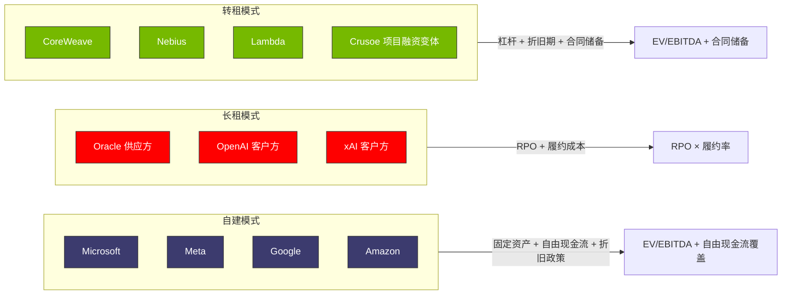
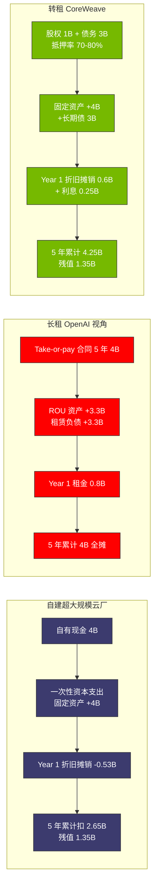
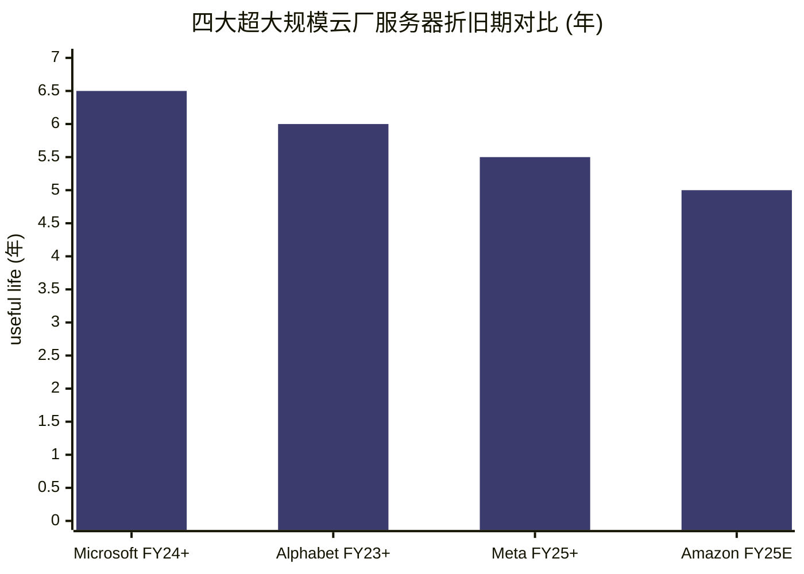
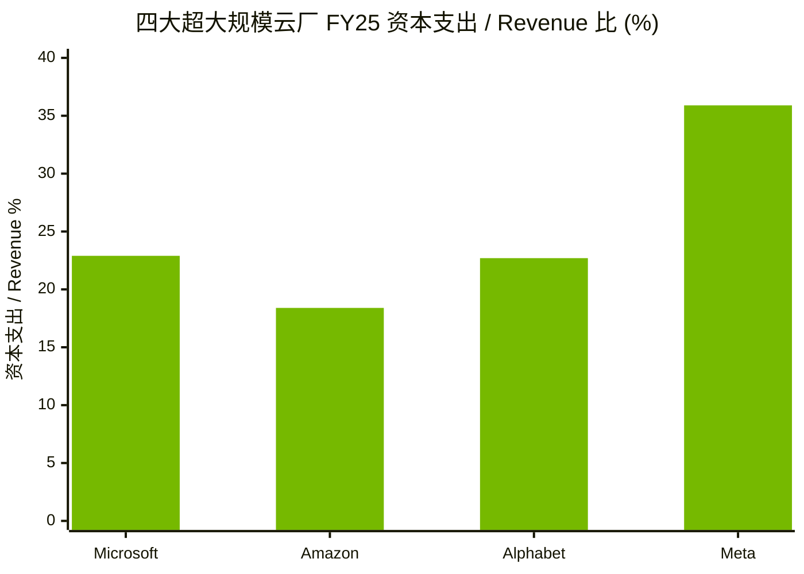
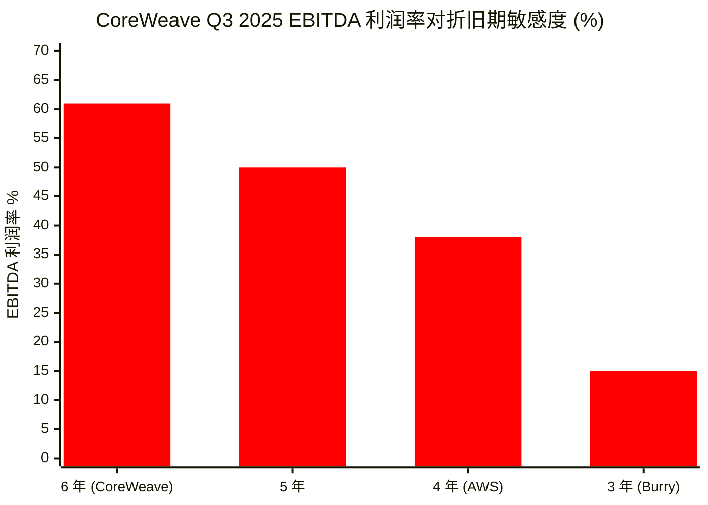
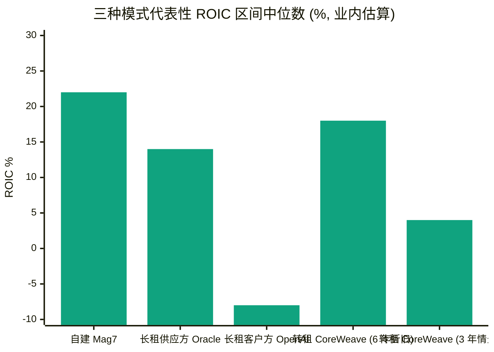

# 第 15 章 三种算力商业模式：自建、长租、转租的会计分野

## 本章概览

第四部的入口，回答一个看似细节、实则决定整条产业链估值分歧的问题：同样 100K 张 H100、同样 \$4B 的算力支出，落到三种主体的财务报表上长得完全不同。

[Microsoft](https://www.microsoft.com/) 自建 Azure 数据中心买 H100，这笔钱进 property, plant & equipment（固定资产，固定资产）按 6 年直线折旧，每季度折旧摊销（Depreciation & Amortization，折旧摊销）从经营利润里扣 \$4B / (6 × 4) = \$167M。

[CoreWeave](https://www.coreweave.com/)（NASDAQ: CRWV，全球最大独立 GPU 云）把同样的 H100 进 technology equipment、按 6 年直线折旧，但同时把这批卡作为 senior secured term loan（高级担保定期贷款）的抵押物借出 70-80% 的钱再买更多卡——同一份资产同时出现在固定资产和 collateral schedule 两张表上。

[Oracle](https://www.oracle.com/) 与 [OpenAI](https://openai.com/) 签 Stargate 5 年 \$300B 长租合同，OpenAI 这边把承诺写成长期合同负债（contract liability）+ 经营租赁，Oracle 这边把承诺写成 remaining performance obligation（RPO，剩余履约义务）+ 巨额前置资本支出。

[Crusoe](https://www.crusoeenergy.com/) Energy 在 Abilene 把同样的算力组装成 PPA + colocation + 整机租赁三层堆栈，给 OpenAI 提供算力服务——这笔钱在 Crusoe 表上是项目融资 SPV（special purpose vehicle，特殊目的载体）的资产 + 银团贷款。

四套科目映射决定四类公司的盈利曲线、现金流节奏、债务约束、估值方法全不相同。读完这一章，看到一家与算力相关的公司财报，要先识别它属于哪种商业模式，再判断该用哪一套估值方法。

三种主流模式与公司代表可以一图概括：

本章承前启后：前承第三部第 11 章-14 物理瓶颈与缓解节奏——产能松动、HBM 解锁、电力到位之后，谁赚到这笔钱的问题就摆上桌；后启第 16 章 GPU 云解剖（CoreWeave 60% EBITDA 的细颗粒拆解）、第 17 章三大云算力账本（Mag7 自建模式的盈利结构）、第 18 章模型层与循环交易（OpenAI / [Anthropic](https://www.anthropic.com/) 长租侧的现金流闭环）。本章给的是坐标系，不是判断。

对工程师读者，本章的价值是把 GPU-hour 多少钱翻译成三种主体不同的成本结构，看懂自己的工作所处的产业位置。对投资者读者，本章给出三类主体估值方法的初步分野——为什么 [NVIDIA](https://www.nvidia.com/) 用 P/E、CoreWeave 用 EV/EBITDA + 合同储备、Mag7 用 sum-of-the-parts + 自由现金流覆盖度，没有一套统一范式能套住三类公司。

本章不下任何投资判断。涉及具体公司估值评论的段落，按 commentary-only 处理。

## 1. 同一笔 100K H100 支出的三种走法

把问题从抽象拉到具体：现在有一笔 100,000 张 H100 SXM5 的算力支出，按第 1 章的 BOM 颗粒度推，单卡含服务器、网络、机架的分摊采购成本约 \$32,000，总资本支出约 \$3.2B。再加配套的 data center shell（数据中心物理建筑 + 配电 + 冷却，按 CBRE 2024-2025 基准 \$10-13M/MW，100K H100 对应约 80MW 计 ~\$0.8B），整笔支出大致 \$4.0B 量级。

这 \$4B 落到三种主体的财报上，是三套完全不同的科目映射。

**自建（Microsoft / Meta / Google / Amazon 等超大规模云厂）**：\$4B 一次性进固定资产、按服务器 6 年直线折旧 + 建筑 25 年折旧。损益表上 Year 1 的折旧摊销大约是 \$0.53B（GPU \$3.2B / 6 + shell \$0.8B / 25），按 6.5 年折旧（Microsoft FY24 起的口径）会再低一点。现金流量表上 \$4B 进 "Additions to property and equipment"（投资性现金流出）。资产负债表上同步增加 \$4B 的固定资产净值（年度按折旧递减）。

**长租（OpenAI-Oracle Stargate / xAI-Oracle 长合同模式）**：客户（如 OpenAI）不直接拥有这 \$4B 的硬件，而是签一份 5 年照付不议（照付不议）合同，按合同期摊到 60 个月。客户损益表上 Year 1 算 \$0.8B 经营租赁费用（经营租赁 expense，按 ASC 842 摊销）。资产负债表上同步增加约 \$3.3B 的 right-of-use asset（使用权资产）和等额的 lease liability（租赁负债）。供应商（如 Oracle）这边，\$4B 进自己固定资产 + 同时增加 \$20B 的 RPO（5 年 × \$4B），RPO 是 commitments and contingencies 附注里的准订单簿。

**转租（CoreWeave / Nebius / [Lambda](https://lambdalabs.com/) / Crusoe）**：转租玩家自己买 H100，进 technology equipment 按 6 年折旧。但同时把这批资产作为抵押物借 70-80% 的钱（典型 delayed-draw term loan + senior secured notes），让 100K 卡的实际股权出资降到 \$1B 量级，杠杆撬到 4-5×。然后转手再签照付不议长合同给超大规模云厂 / 模型公司，把利用率风险再转一道给客户。损益表上 Year 1 折旧摊销 \$0.6B + interest expense \$0.25B（按 \$3B 债务 × 8% 综合利率）。

**项目融资变体（Crusoe Abilene 模式）**：把数据中心 + 电力 + 设备装进一个 SPV，由 SPV 发债 + 拿到客户（如 Oracle / OpenAI）的照付不议合同抵押，母公司股权出资比例更低（业内估算 15-25%）。这种基础设施级项目融资是 Crusoe 在 Abilene 累计为 Stargate 项目融资 \$15B 量级的核心机制。

把四种走法摊到一张表上对照（这是本章的主表，后续每个小节都以它为锚）：

| 项目 | 自建（超大规模云厂） | 长租（客户视角，OpenAI） | 长租（供应商视角，Oracle）| 转租（CoreWeave） | 项目融资（Crusoe）|
|---|---|---|---|---|---|
| 资产负债表（资产侧）| +\$4.0B 固定资产 | +\$3.3B right-of-use asset | +\$4.0B 固定资产 | +\$4.0B 固定资产（按 6 年折旧） | SPV +\$4.0B 资产，并表/不并表视股权比例 |
| 资产负债表（负债侧）| 留存收益 / 长期债 | +\$3.3B lease liability | +\$20B RPO（附注披露）| +\$3.0-3.2B 长期债 + 抵押义务 | +\$3.0-3.4B 项目层债务 |
| 损益表（Year 1）| -\$0.53B 折旧摊销 | -\$0.8B 经营租赁 expense | +\$4B revenue × 客户履约 - \$0.5B 自有折旧摊销 | -\$0.6B 折旧摊销 - \$0.25B interest expense | -\$0.6B 折旧摊销 - \$0.25B interest expense |
| 现金流量表（投资）| -\$4.0B 资本支出 | 不直接显示 | -\$4.0B 资本支出 | -\$0.8-1.0B 股权出资部分 + 债务募集 | -\$0.6-1.0B 股权部分 |
| 现金流量表（经营）| -\$0.53B（折旧 add back）| +\$0.8B 租金现金流出 | +\$4B 客户预收 / 分期 | +\$0.8B 客户预收 - 利息 | +\$0.8B 客户预收 - 利息 |
| 估值锚 | EV/EBITDA + 自由现金流覆盖度 | 长期合同负债折现 | RPO × 履约率 × 单合同毛利 | EV/EBITDA + 合同储备 × 折旧期假设 | DCF 项目层 + 平台层估值 |
| 风险敞口 | 资产减值、技术迭代 | 合同价格锁定后市场反向 | 客户违约 + 履约成本超支 | 客户集中度 + 利率 + 折旧政策 | 项目融资契约违约 + 单项目客户违约 |

> 注：上表为单笔 100K H100 / \$4B 资本支出的会计映射简化模型，**所有数字为业内估算口径，用作三类主体差异说明，不对应任何具体公司的真实账面**。资本支出拆分按 GPU 整机 80% / shell 20%业内综合；杠杆率按 CoreWeave S-1 + 2025 8-K 披露的 delayed-draw term loan 结构推算；项目融资股权比例按 Crusoe Abilene 项目融资公开披露反推。

把同一笔 \$4B 在三种模式下的现金流路径并列：

读这张表的方式：竖着看，每一栏是一种商业模式的完整会计画像；横着看，每一行是同一笔 \$4B 支出在不同主体里长成的不同样子。这本身就是后续每章估值差异的源头。

举一个具体的例子。Year 1 同一笔 \$4B 支出，自建模式损益表只扣 \$0.53B、长租客户损益表只扣 \$0.8B、转租玩家损益表扣 \$0.85B（折旧摊销 + 利息）——三个数字看起来差不太多。但拉到 5 年累计：自建累计扣 \$2.65B（折旧完了固定资产净值剩 \$1.35B）、长租客户累计扣 \$4B（合同费用全摊完）、转租玩家累计扣 \$4.25B（折旧完了 + 利息累计 \$1.25B 但固定资产净值剩 \$1.35B 可以作残值或二手卖）。三套口径下这 \$4B 算力到底花了多少钱的答案差 60%。**这种差异不是会计错误，是会计选择——同一笔资产因为持有方式不同，账面利润、税基、估值倍数全不一样**。

再举一个税务维度的例子。同一笔 \$4B 算力支出，自建模式按 6.5 年折旧的 Year 1 税收抵扣是 \$0.53B、Year 1-5 累计抵扣 \$2.65B；按 IRS bonus 折旧（美国《减税与就业法案》允许某些资本支出在第一年加速折旧）规则，部分服务器可以走 100% Year 1 bonus 折旧（2023 年起逐年递减，2025-2026 已降到 60-40%），把 Year 1 税收抵扣推到 \$1.6-2.4B。

这是 Mag7 自建优势的第三层杠杆——**会计折旧期与税收折旧期可以不一致**，公司在财报上按 6.5 年慢慢折旧让 EPS 漂亮，税务上按加速折旧让现金税负降低。转租模式同样能用 bonus 折旧，但因为净亏损本身就抵消了应税收入，bonus 折旧的现金价值打折。长租客户模式（OpenAI 这边）的合同费用是经营性支出，每年线性抵扣应税收入，没有 bonus 折旧这种前置现金税收优惠。

把这件事 5 年累计的现金税负差（按 21% 联邦税率 + bonus 折旧加速）摊到 \$4B 支出：

- 自建（按 60% bonus + 6.5 年）：Year 1 现金税收节省 ~\$340M，5 年累计 ~\$500M
- 长租客户：5 年累计现金税收节省 ~\$170M（按 \$0.8B/年 × 21% × 5 = \$840M，但与租金现金流出冲销后净效益小）
- 转租玩家（净亏损状态）：bonus 折旧净现金价值 ~\$0（净亏损覆盖应税收入，结转 NOL 未来抵扣）

这三套现金税负差是第 17 章三大云算力账本里为什么 Mag7 实际现金税率长期低于 15%的核心机制。这里不展开，只立坐标位——**会计折旧 + 税收折旧两套规则的叠加，是自建模式的第二层杠杆**。第一层是会计折旧期延长拉高账面利润，第二层是 bonus 折旧加速折旧降低现金税负，两层合起来让 Mag7 自建模式的真实经济回报远高于6.5 年线性折旧看起来的样子。

## 2. 自建模式：会计与估值

### 2.1 主体画像

自建模式的代表是 Mag7（Microsoft / Meta / Alphabet / Amazon / Apple / NVIDIA / Tesla，市场上市值最大的七家美股科技公司，本书在第 29 章 / 30 反复引用）里的前四家——MSFT / META / GOOG / AMZN，它们是超大规模云厂主体，自己买 GPU、自己建数据中心、自己用算力训模型 + 卖云服务。

四家公司 FY25 资本支出数字摆出来非常直观：

- Microsoft FY25（截至 2025-06-30）资本支出 ~\$64.55B
- Meta FY25 资本支出 \$72.22B（含融资租赁 payments；来源：Meta Q4 2025 press release，investor.atmeta.com 2026-01-28）
- Alphabet FY25 资本支出 \$91.4B
- Amazon FY25 资本支出 \$131.82B

四家加起来 FY25 资本支出合计 ~\$360B（\$64.6 + \$72.2 + \$91.4 + \$131.8），绝大部分进 AI 基础设施。

### 2.2 折旧政策：自建巨头的会计开关

自建模式最关键的会计选择是**服务器与网络设备的 useful life**（使用年限）。这件事不只是技术细节，是 EPS（每股收益）杠杆。

把过去 6 年四家公司的服务器 / 网络设备折旧期变动拉一根线：

| 公司 | 调整时点 | 服务器 useful life 变动 | 当年披露的 EPS / Operating income 影响 |
|---|---|---|---|
| Microsoft | FY23 起（2022-07）| 4 年 → 6 年 | FY23 全年 Operating income 增加 ~\$3.7B |
| Microsoft | FY24 第二次延（2024 财年）| 6 年 → 6.5 年（部分服务器）| 业内估算年化 EPS 增厚低个位数百分比 |
| Alphabet | FY23（2023-01）| 4 年 → 6 年 | FY23 折旧摊销节省 ~\$3.4B |
| Meta | FY23（2023-01）| 4-5 年 → 5 年 | FY23 折旧摊销节省 ~\$1.4B |
| Meta | FY25（2025-01）| 部分服务器 4-5 年 → 5.5 年 | 业内估算 FY25 折旧摊销节省 \$1-2B |
| Amazon | FY25E（2025-01-01 生效，2025-02-06 Q4 2024 财报会公告）| 6 年 → 5 年（反向调整）| FY25E Operating income -\$700M（useful life 变更）+ -\$600M（早退役加速折旧）= 合计 -\$1.3B |

> 来源：各公司 10-K M 折旧摊销与会计政策附注披露，2022-2025；表中业内估算指公司未明确披露的部分按折旧摊销 / 固定资产净值反推。

四家里有三家在 2022-2025 之间把服务器 useful life 从 4-5 年拉长到 5-6.5 年，只有 [Amazon](https://aws.amazon.com/) 在 2025 年（2025-01-01 生效，2025-02-06 公告）反向缩短了 1 年（市场解读为 Amazon 评估 AI 工作负载下 GPU 实际更新节奏比原 6 年假设更快；来源：Amazon Q4 2024 财报会 transcript 2025-02-06 + AMZN FY24 10-K 会计政策附注）。

把四家公司 2026 年生效的服务器折旧期画一张对照柱状图：

这是第 2 章已经提过的折旧政策这件事是 EPS 杠杆的具体表达。折旧期从 4 年改到 6 年，单卡年折旧从 \$8,000 降到 \$5,333，下降 33%——这 33% 全部直接落到 Operating income 那一行，再按 ~25% 有效税率折到 EPS 上。Microsoft FY23 单这一项就贡献了 ~\$3.7B Operating income 增加，相当于 FY23 全年 Operating income \$109B 的 3.4%。

### 2.3 Burry 反情景：2-3 年折旧的压力测试

Michael Burry（大空头原型，Scion Asset Management 创始人，2025-11-24 在 Substack 发布 *Cassandra Unchained* newsletter；来源：Burry 2025-11 公开披露 + Wikipedia: Michael Burry）在 2025-11 发起的超大规模云厂折旧攻击，核心论点是：**前沿训练用的 GPU 实际经济寿命远低于会计折旧期 5-6 年，应该按 2-3 年折旧**。

把 Burry 反情景应用到 Microsoft FY25 \$64.55B 资本支出上（假设其中 80% 即 \$51.6B 是 GPU + 服务器、20% 是 shell）：

| 情景 | 服务器 useful life | FY25 当年折旧摊销（GPU 部分增量）| 对当年 Operating income 影响 |
|---|---|---:|---|
| 当前（MSFT 6.5 年）| 6.5 年 | ~\$7.9B | 基准 |
| 旧（4 年）| 4 年 | ~\$12.9B | 减少 \$5.0B Operating income |
| Burry 反（3 年）| 3 年 | ~\$17.2B | 减少 \$9.3B Operating income |
| Burry 极端（2 年）| 2 年 | ~\$25.8B | 减少 \$17.9B Operating income |

> 注：折旧摊销数字仅含 GPU + 服务器折旧增量，未计 shell 部分；按直线折旧 + 残值假设 12.5%。Burry 反情景按 Cassandra Unchained 2025-11 公开论述推算。

按 6.5 年折旧的 MSFT FY25 GAAP Operating income \$128.5B。如果按 Burry 主张的 3 年折旧，FY25 Operating income 会从 \$128.5B 跌到 ~\$119.2B，跌幅 7.2%。如果按极端的 2 年折旧，会跌到 ~\$110.6B，跌幅 14%。

这个数字看起来不大，但其反身性效应非常大：Burry 反情景一旦被市场广泛接受，超大规模云厂的 P/E 重新计算就会立刻把 AI 资本支出高峰期的会计利润盲点暴露出来。第 29 章把 Burry 折旧攻击列为 AI 周期反共识 #2，原因就在这里——它本身不是预测，是把会计选择转化为压力测试的工具。

### 2.4 自建模式的隐性融资：Finance Lease

自建模式还有一个被市场系统性忽视的会计科目：**融资租赁**（融资租赁）。按 ASC 842（2019 年起美国会计准则租赁标准，要求把符合实质购买特征的长期租赁纳入资产负债表），超大规模云厂长期租用数据中心（如向 Digital Realty / Equinix / Crusoe 租 colocation，签 10-15 年长合同）的部分按融资租赁入表，类似于分期付款买。

这件事的核心是：**融资租赁在现金流量表上不计入资本支出那一行**。市场看超大规模云厂 资本支出 / Revenue 比时，标准做法是只看 cash flow statement 的 "additions to property and equipment"——这个口径漏掉了融资租赁这块经济实质上是资本支出的支出。

把 Microsoft FY24 / FY25 的融资租赁余额拉出来看：

先从经营租赁的规模作为基准——MSFT FY24 / FY25 经营租赁 right-of-use assets 分别为 \$18.96B 和 \$24.82B，单年增量 ~\$5.86B。但需要做一个语义校准：Microsoft 在 10-K 里把租赁分为 **经营租赁**（经营租赁，相对短期、不入资产摊销资本支出池）和 **融资租赁**（融资租赁，长期、入资产 + 入负债，经济实质等同于分期购买）两类——AI 基础设施相关的长期数据中心租赁绝大部分进融资租赁而非经营租赁。MSFT FY25 期末融资租赁 ROU 余额业内估算已达 \$32B+ 量级，单年新增约 \$12-15B 流入资本支出隐藏池。该数字不在 MSFT FY25 10-K 作为单独行项目披露，本章使用 SemiAnalysis 2025 综合估算（精确金额请查阅 MSFT FY25 10-K 租赁附注交叉测算）。

按 SemiAnalysis 2025 综合分析，三大云（MSFT / META / GOOG）2024-2026 合计融资租赁余额业内综合估算已经是表内资本支出的 30-40%——但传统资本支出跟踪报告里不计这一块。

按经济实质资本支出 = 报表资本支出 + 新增融资租赁重新口径后，超大规模云厂真实 AI 基础设施投入要比表面数字高 30-40%。这件事在第 29 章周期判断的维度 2 资本支出 / 营收比是否超警戒线里直接影响校准点：

- 表面资本支出：MSFT FY25 \$64.55B / Revenue \$281.7B = 22.9%
- 经济实质资本支出（业内估算加入融资租赁新增约 \$12-15B）：~\$77-80B / \$281.7B ≈ 28%

22.9% 跟 ~28% 这两个数字，在第 29 章 12 维度比对里是否超过 1997 末 telecom 资本支出 / 营收 25% 警戒线的答案不同。**这是市场误读位之一**。

### 2.5 自建模式的折旧期 vs GPU 经济寿命二阶问题

把折旧政策这件事再推一层，会引出一个被市场低估的二阶问题：**会计折旧期 vs GPU 真实经济寿命**。

会计折旧期是公司选择的，6.5 年是按服务器整机平均使用年限做的会计判断。GPU 真实经济寿命取决于三件事：

- **物理寿命**：GPU 硬件本身的物理耐用度（按 NVIDIA H100 的官方寿命设计，正常工作负载下 7-10 年）
- **前沿训练经济寿命**：用作前沿大模型训练的有用周期。H100 2023 年发布、2024 年 Blackwell（B100/B200）发布、2025 年 Blackwell Ultra（B300）发布、2026 年 Rubin 代发布——以训前沿大模型不亏单卡每小时成本为标准的经济寿命业内估算 3-4 年
- **二手 / 推理 / 内部用经济寿命**：从前沿训练降级到推理、再降级到内部 / 边缘负载、最后二手出售的全周期业内估算 6-8 年

这三个数字摆出来看，**Burry 主张的2-3 年折旧 对应前沿训练经济寿命**，超大规模云厂实际使用的6-6.5 年折旧对应二手 / 推理 / 内部用全周期经济寿命。两个数字都不错，只是看的经济寿命维度不同。

这件事的产业意义是：超大规模云厂把 GPU 从前沿训练降级到推理 / 内部用是真实在发生的工程实践——Meta 2024-2025 把部分 A100 从训练降到推理 / Reels 推荐、Google 把部分 TPU v4 从训练降到 search index 推理。降级路径有用的前提是 GPU 还能跑得动当时的工作负载。这个降级链在 H100 上能不能完整跑通，是第 11 章 / 12 / 13 讨论的 GPU 二手市场流动性的核心。

如果降级链断了（比如推理也开始要 Blackwell 才跑得动、H100 降到内部用也没人要），超大规模云厂的 6 年折旧期假设就站不住——这是 Burry 反情景里隐含的、但他没明确写的论点。

### 2.6 自建模式的估值锚

自建模式的估值锚是 EV/EBITDA + 自由现金流（Free Cash Flow，自由现金流 = 经营现金流 - 资本支出）覆盖度。EV/EBITDA 反映业务赚现金毛利的能力，自由现金流覆盖度反映投资周期是否可持续。

四家自建巨头 FY25 大致画像：

| 公司 | FY25 Revenue | FY25 Operating margin | FY25 资本支出 / Revenue | FY25 自由现金流覆盖度（经营现金流 / 资本支出）|
|---|---:|---:|---:|---:|
| Microsoft | \$281.7B | 45.6% | 22.9% | ~2.1× |
| Alphabet | \$402.84B（FY25，Alphabet FY25 10-K 一手）| ~32% | ~23%（\$91.4B/\$402.84B）| ~1.7× |
| Meta | \$200.97B（FY25，Meta Q4 2025 press release 2026-01-28）| 41% | ~36%（\$72.2B/\$200.97B）| ~1.7× |
| Amazon | \$716.92B（FY25，Amazon FY25 Annual Report）| ~10% | ~18%（\$131.8B/\$716.92B）| ~2.4× |

> 来源：MSFT FY25 10-K（sec.gov 2025-07）；Alphabet FY25 10-K（goog-20251231.htm，SEC EDGAR 2026-02 披露）；Meta Q4 2025 press release（investor.atmeta.com 2026-01-28）；Amazon FY25 Annual Report（s2.q4cdn.com 2026 披露）。MSFT 财年 7 月-6 月，FY25 = 2024-07 至 2025-06；其余三家财年与日历年一致。自由现金流覆盖度 = 经营现金流 / 资本支出，按各家 FY25 现金流量表披露口径估算（区间 ±10%）。

把四家资本支出 / Revenue 与自由现金流覆盖度并列：

四家平均自由现金流覆盖度约 2×——经营现金流仍足以覆盖资本支出，当前不依赖再融资。这是第 29 章给出巨头净现金 \$300B + Mag7 周期抗压能力强判断的底层数字。但 Alphabet 与 Meta 的覆盖度已降至 ~1.7×、Amazon 在 FY26 出现单季自由现金流转负（详见第 17 章 §1）——若 AI 周期再走深一年、Meta 资本支出/Revenue 突破 45%，整体覆盖度有进一步下行风险。

但 Meta 的 36% 资本支出 / Revenue 比是一个尾部信号。如果 AI 周期再走深一年，Meta 的资本支出 / Revenue 突破 45%、自由现金流覆盖度跌破 1.0× 是第 29 章.5 三个量化预警之一——届时自建模式的自掏腰包叙事就开始有裂痕。

自建模式涉及估值含义的产业评论，留给第 17 章（三大云算力账本）+ 第 30 章（NVDA 估值与寡头反身性）展开。本章只立这一节的方法论：**EV/EBITDA + 自由现金流覆盖度 + 折旧政策敏感性**三件套，是看超大规模云厂估值的硬框架。

> 本节涉及 MSFT / META / GOOG / AMZN 折旧政策与资本支出数字的描述为会计描述与产业类比，不构成对上述公司股价走向的预测或交易建议。Burry 反情景测算是用作分析的尺子，不是估值结论。

## 3. 长租模式：会计与估值

### 3.1 主体画像

长租模式是 2024-2025 算力商业模式的一个新变种——不是租 GPU-hour 现货，是签 5-10 年照付不议长合同把算力锁死。这种模式的典型主体是 OpenAI / xAI / Anthropic 这类模型公司作为客户，Oracle / CoreWeave / Crusoe 这类基础设施公司作为供应商。

最大的两份长租合同：

- **OpenAI-Oracle Stargate \$300B / 5 年**（市场综合披露 2025-09 签订，单年承诺 ~\$60B；来源：CNBC / Bloomberg 2025-09 综合报道 + Wikipedia: Stargate LLC，本书已对照 Oracle FY26 Q1 / Q2 10-Q 与电话会披露的 RPO 增量）。Stargate 项目本身是 OpenAI / SoftBank / Oracle / MGX 联合发起的 AI 基础设施投资联盟，2025-01-21 启动时承诺 4 年 \$500B 总投资，OpenAI 与 SoftBank 各占 40% 股权、Oracle 与 MGX 各 7%。
- **OpenAI-CoreWeave \$22.4B / 5 年**（分三批签订：2025-03 初签 \$11.9B、2025-05 扩 \$4B、2025-09 再扩 \$6.5B；来源：CNBC 2025-03-10 + CoreWeave 2025-09-25 8-K）

加上 xAI 与 Oracle 的长租安排（业内综合报道 xAI 在 Colossus 之外通过 Oracle 与第三方签 \$10B+ 量级长租，公司未单独披露）、Anthropic 与 Google / AWS 的长租，长租合同总盘已经是 \$400B+ 量级。

### 3.2 照付不议结构

长租合同的核心是 **照付不议**（照付不议）——客户按合同期付款，不管实际使用量是否达到合同约定算力。这是从 1970-80 年代石油天然气长输管道合同里学来的结构。

照付不议合同的三个关键变量：

- **承诺总量（committed 产能）**：合同期内必须支付的累计算力 / 累计金额
- **floor / ceiling**：每年最低和最高支付额度
- **shortfall payment**：客户使用量不到 floor 时仍需支付 floor，差额作为未来抵扣或直接损失

把 OpenAI-Oracle \$300B / 5 年合同按照付不议拆分（按公开披露 + 业内估算）：

- 年度承诺均值 ~\$60B（按 5 年均摊）
- 实际现金流前低后高（Year 1-2 数据中心建设期、Year 3-5 算力上线后才达到 \$60B 量级；业内估算）
- floor 业内综合估算 ~50% 即 \$30B/年

这种结构对客户（OpenAI）的含义：**未来 5 年至少 \$150B 的硬支出已经锁定**——即使 OpenAI 自身的算力需求增长不及预期、即使年化经常性收入增长曲线放缓，这笔钱都得付。OpenAI 2025 年年化经常性收入业内估算 \$13B 量级，长租合同的承诺总盘是当前年化经常性收入的 20-30 倍。

对供应商（Oracle）的含义：**\$300B 的 RPO 是会计意义上的准订单簿**。但 RPO 不是收入，要等到实际履约（即客户真正用算力）才确认。RPO 入表的方式是 commitments and contingencies 附注披露，不直接进损益表。

### 3.3 RPO 作为准订单簿的估值意义

Oracle FY26 Q1（2025-09 季度）业绩披露 RPO 跳升至 \$455B 量级，单季度增量 \$317B——绝大部分增量来自 OpenAI Stargate 合同入表。这件事让 Oracle 股价在 2025-09-10 当天涨 36%，市值跳升 \$250B+。

RPO 估值机制：

- **乐观读法**：RPO 是 5 年合同总额，相当于未来 5 年年化经常性收入 ≥ RPO / 5——按 \$455B RPO / 5 = \$91B/年年化经常性收入，对应 Oracle 当前 ~\$60B 营收的 50%+ 增量
- **悲观读法**：RPO 履约取决于客户违约风险 + 履约成本 + 利率折现——OpenAI 自身的年化经常性收入 / 现金流能否支撑 \$60B/年的算力开支是核心不确定性

RPO 不等于未来现金流的核心原因是**履约成本**。Oracle 要交付 \$300B 的算力，自己必须先资本支出投入 \$200B+ 量级（业内估算按 RPO 的 65-70% 反推自建成本）。Oracle FY26 全年资本支出指引已从 FY25 实际的 \$21.2B（FY ending May 31 2025，Oracle FY25 10-K 现金流量表）跳升至 FY26 的 \$35B+ 量级，全年 \$50B+ 的资本支出在 FY27-FY28 都还在攀升。Oracle 自己的自由现金流覆盖度从 FY25 的 ~1.5× 跌到 FY26 业内估算 ~0.8×——Oracle 已经进入经营现金流不足以支付资本支出的状态，要靠债务和未来 RPO 兑现来抹平。

这个履约成本超支的下行风险，是长租模式估值最大的隐藏开关。RPO 数字漂亮但履约成本失控，等于订单很多但每一单都亏钱的极端状态。

### 3.4 长租模式的隐藏条款：履约违约的法律边界

长租合同里还有一个被市场极度低估的法律边界问题——**违约的具体后果**。

按照付不议合同的常见结构：

- 客户违约的软处罚：将未消化算力推迟到合同后期使用（make-up rights）。这是石油天然气照付不议借来的机制
- 客户违约的硬处罚：触发提前终止条款（acceleration clause），剩余合同期内未付款一次性到期 + 抵押物清算
- 供应商违约：交付不到位时客户有权按现货市场价补差额，损失记在供应商损益表

OpenAI-Oracle Stargate 5 年 \$300B 合同的违约条款没有公开披露，业内综合判断是以履约保证金 + make-up rights 为主、acceleration clause 为辅的混合结构。这种结构对供应商（Oracle）相对友好——客户即使经营不善，也能通过 make-up 把延期算力消化掉。

但 make-up rights 的隐藏代价是**供应商必须把预留产能留出 5+ 年**。Oracle 为 OpenAI 建的 Stargate 数据中心，即使 OpenAI 当期算力消化不到 60%，Oracle 也得保留产能给 OpenAI——这部分预留但未消化的产能不能转卖给其他客户。

这件事让长租模式的产能利用率问题在合同期内长期是一笔糊涂账：账面利用率 100%（照付不议锁定）+ 实际利用率可能 50-80%（依客户当期使用强度）= 真实经济利用率通常低于账面利用率。

### 3.5 长租模式的客户：现金流闭环问题

长租模式还有一个跨章节的问题——**循环交易**。NVDA 2025-09 向 OpenAI 战略投资 \$100B 量级+ NVDA 2026-01 向 CoreWeave 认购 \$2B 股权+ Oracle 给 OpenAI 提供长租算力 + OpenAI 给 CoreWeave / Oracle / Crusoe 反过来下长单——这些钱在同一个生态系统里转圈。

这件事在第 18 章（模型层与循环交易）会完整展开，本章只立坐标系：**长租模式的现金流闭环是估值反身性的核心传导路径**。一旦 OpenAI 年化经常性收入增速放缓、或者 NVDA 战略投资节奏放缓、或者一个客户违约，整个闭环就会反向收缩。

### 3.6 长租模式的估值锚

长租模式的估值锚是 **RPO + 履约成本 + 客户违约风险**。

- **RPO**：作为未来 5 年准订单簿的乐观锚，按行业常见折现 7-10% 折成现值
- **履约成本**：按 RPO 的 60-75% 反推自建资本支出（业内估算），扣掉后是净 RPO 价值
- **客户违约风险**：单大客户占 RPO 比例 + 客户自身现金流覆盖度

Oracle FY26 估值的核心争议就在这三个变量之间。市场乐观读法把 \$455B RPO 直接折到 Oracle 市值上，悲观读法把履约成本可能超过 75%和 OpenAI 现金流违约风险扣进去——两种读法对 Oracle 公允估值的差距是 30-40%。按乐观口径 EV/Sales 估值，\$455B RPO / 5 年 = \$91B/年 forward × 10× EV/Sales = ~\$910B EV；按悲观口径净 RPO（扣 25% 履约成本余 \$341B、再按违约调整折至 \$273B）/ 5 年 × 10× = ~\$546B EV——差距约 \$364B 占乐观值约 40%。

> 本节涉及 Oracle / OpenAI / Anthropic 估值含义的内容为产业类比与会计描述，不构成对上述公司股价走向的预测或交易建议。Oracle 公允估值的差距区间是估值方法学的描述，不是估值结论。具体估值分析详见第 30 章。

## 4. 转租模式：会计与估值

### 4.1 主体画像

转租模式的代表是 CoreWeave / Nebius / Lambda / Crusoe / Together AI 这类 GPU 云原生公司。**它们自己买 GPU + 自己建（或租）数据中心 + 转手卖给超大规模云厂与模型公司**——是产业链的中间商。

四家公司 2025 大致画像：

- **CoreWeave**：IPO 2025-03，NASDAQ: CRWV。FY25 Revenue \$5.13B、净亏损 \$1.2B、总资产 \$49.3B、Microsoft 占 2024 年营收 62%
- **Nebius Group**（NASDAQ: NBIS，原 Yandex 国际业务分拆）：FY25 Revenue \$529.8M、Operating income \$29M、净亏损 \$446.7M、总资产 \$12.4B。2026 Q1 营收 \$399M（YoY +684%）、AI 年化经常性收入 \$1.9B
- **Crusoe Energy**：2024-12 D 轮 \$600M / 估值 \$2.8B、2025-03 拿下 Stargate Abilene 项目核心物业开发权
- **Lambda**：2025-02 D 轮 \$480M、估值 \$4B

这四家在公开市场被统称为「neocloud」或「GPU 云原生厂商」，但商业模式细节差异巨大——折旧期、客户结构、债务结构、地产模型四个变量上分化彻底。本章只立转租模式的会计与估值框架，第 16 章单独深拆 CoreWeave 60% EBITDA。

### 4.2 转租模式的杠杆来源

转租模式跟自建模式比最大的不同是 **GPU 作为抵押品**。CoreWeave 的核心融资工具是 delayed-draw term loan（延迟提款定期贷款，允许借款人在一定期限内分批提取贷款额度）：

- 2023-08：\$2.3B 设施
- 2024-10：\$650M 信贷额度
- 2025-03（IPO 同期）：\$7.9B 总债务
- 2025-09：总债务跳升至 \$14B 量级
- 2026-02：再融资 \$8.5B（以 Meta AI 合同为抵押，部分置换到期债务，总债务维持在 \$14B 量级；来源：Wikipedia: CoreWeave）

CoreWeave 2025 全年净亏损 \$1.2B / Revenue \$5.13B 的局面下，债务从 \$7.9B 一年内涨到 \$14B、再到 \$8.5B 新增融资——杠杆倍数与债务节奏远超过传统云服务商。

这种债务结构是转租模式的灵魂：**用 GPU 当抵押物借出 70-80% 的钱，让股权出资比例降到 20-30%，杠杆撬到 4-5×**。但代价是：

1. **利息支出快速上升**：Q3 2025 单季利息支出 \$310.6M，YoY +200%，全年化约 \$1.2B+ 利息支出（占营收 24%）。这是 GAAP 净亏损的核心来源
2. **债务到期墙**：CoreWeave Q3 2025 短期债务（current portion of long-term debt）~\$3.71B、流动负债合计（含短期债务 + 1 年内到期经营租赁 + 应付账款）~\$9.71B。一年内偿债压力比当年净现金流（甚至 EBITDA）大得多，必须靠不断再融资滚动
3. **抵押资产价值依赖二手 H100 市场**：如果 H100 二手价 2026-2027 大幅下行（这件事在第 11 章 / 12 / 13 已经讨论过 GPU 二手市场的脆弱性），抵押资产价值跌穿贷款契约里的 LTV（loan-to-value，贷款价值比）门槛，触发追加保证金或提前到期条款

### 4.3 转租模式的盈利结构：60% EBITDA + 持续 GAAP 亏损

CoreWeave Q3 2025 是观察转租模式最干净的样本：

- Revenue \$1,364.7M（YoY +134%）
- 调整后 EBITDA \$838.1M（margin 61.4%）
- GAAP Operating income \$51.9M（margin 3.8%）
- Interest expense \$310.6M
- GAAP 净亏损 \$110.1M
- Revenue Backlog \$55.6B

61% EBITDA + 3.8% Operating margin + GAAP 净亏损 + 短期债务 \$3.71B（流动负债合计 \$9.71B）这五个数字摆在同一张表上，是 CoreWeave 商业模型的全部画像。

这件事的成因和会计选择含义是第 16 章主菜，本章只立一个对照位：**转租模式的会计杠杆是 6 年折旧 + 高杠杆 + 长合同三层叠加**。这三层只要任何一层动摇，60% EBITDA 立刻塌。

把 CoreWeave 6 年折旧政策跟 Burry 反情景做一次压力测试：

| 折旧期假设 | CoreWeave Q3 2025 折旧摊销（业内估算）| 调整后 EBITDA 调整后 | EBITDA 利润率调整后 |
|---|---:|---:|---:|
| 当前（6 年）| \$630M | \$838M | 61% |
| 4 年 | ~\$945M | ~\$523M | 38% |
| 3 年 | ~\$1,260M | ~\$208M | 15% |

> 测算说明：把折旧摊销按年折旧 = 原始折旧摊销 × (6/4) 或 (6/3) 比例放大，假设其余收支不变。详细 EBITDA 严格定义下的差异分析见第 16 章 §2.2。

不同折旧期下 EBITDA 利润率跳变的视觉对比：

折旧期从 6 年降到 3 年，CoreWeave Q3 2025 EBITDA 利润率立刻从 61% 跌到 15%。这是转租模式估值的核心反身性传导路径——**6 年折旧期假设是会计选择，但它直接决定 CoreWeave 的估值倍数**。

### 4.4 利用率博弈

转租模式还有一个隐藏开关：**利用率假设**。CoreWeave S-1 与 IPO 招股书里默认的盈利模型假设单卡年化利用率 90%+。这个数字成立的前提是照付不议长合同——只要客户签了照付不议，利用率账面上自动 100%（不管实际使用量如何）。

但 H100 现货价格 2025-2026 已经下行 60%（业内综合，详第 12 章 / 13）。如果 Microsoft / OpenAI 在合同到期或单价重谈时把每 GPU-hour 的合同价从 \$2.5/h 谈到 \$1.5/h，CoreWeave 即使利用率仍然账面 100%，单卡毛利会从 ~\$15,000/年跌到 ~\$7,000/年。

这件事的量化在第 16 章三种利用率情景的稳态毛利率敏感性表里详细展开。本章只立一个反向的小提醒：**90% 利用率 + 6 年折旧两个假设是 GPU 云招股书里的双稳定剂，但二者都是有时效的——照付不议合同到期后市场重新定价、6 年折旧政策被市场质疑后估值倍数重计**。

### 4.5 客户集中度反身性

CoreWeave 2024 年来自 Microsoft 一家的营收占 62%。Top 2 客户合计占 77%。这种客户集中度在 SaaS / 云行业里高得异常。

对照来看，xAI 长租 Oracle 占 Oracle RPO 大头、Anthropic 长租 Google + AWS 占两家 AI 营收的相当部分、CoreWeave 客户集中度 62%——**转租模式 + 长租模式两条链上，客户集中度都是 50%+**。

这件事对 CoreWeave 估值的反身性传导是：**Microsoft 任何重新平衡云算力供应商的决策都会瞬间冲击 CoreWeave 的运营杠杆**。Microsoft 在 2025-2026 已经开始执行算力供应多元化策略（一边继续向 CoreWeave 长租，一边自建 Azure AI 数据中心），CoreWeave 2026 营收增长曲线是否能延续 +134% YoY 取决于 Microsoft 续约 + 加单的节奏。

CoreWeave 自己把客户集中度列为 S-1 风险因素第一项。这件事是第 30 章估值的核心变量，本章只立坐标系。

### 4.6 项目融资变体：Crusoe Abilene 模式

Crusoe Energy 不是典型的转租玩家——它更像是项目融资 + 物业开发 + 算力服务的三合一。把 Crusoe 跟 CoreWeave 对照能看清转租模式内部的两种细分亚型。

Crusoe Abilene 项目的结构：

- Crusoe 拿到 Abilene 1.2GW 数据中心的核心物业开发权（2025-03 披露）
- 通过 SPV 层项目融资融到累计 \$15B 量级
- SPV 把数据中心租给 Oracle（作为 Stargate 长租平台）
- Oracle 再把算力转租给 OpenAI

这个四层堆栈让 Crusoe 的商业模式从典型转租变成基础设施 REIT + 项目层 GP 的混合体：

- Crusoe 母公司只出股权小头（业内估算 15-25%），其余靠项目层债务
- 项目层债务以 Oracle 长约 + Abilene 物业为抵押
- Crusoe 母公司收项目管理费 + 资产管理费两层服务费
- 数据中心运营完后，等长约到期，物业继续保留作为下一轮长约或转售标的

这种结构跟传统转租（CoreWeave 自己买卡 + 自己借债 + 自己接单）相比，**杠杆更深、母公司风险敞口更小、单项目客户违约的传染性更弱**。如果 Oracle 与 OpenAI 的合同在某个时点出问题，Crusoe Abilene 项目层会受损，但 Crusoe 母公司其他项目不受牵连。

Crusoe 估值的方法学也不一样——不能用 CoreWeave 的 EV/EBITDA，要分两层估：

- **项目层 DCF**：每个 SPV 单独按 5-7 年长约 + 残值做 DCF
- **平台层估值**：Crusoe 母公司作为 GP + 资产管理人按 AUM × 管理费率 + carry 估

Crusoe 2024-12 D 轮估值 \$2.8B，对应母公司股权层；Abilene 项目层累计融资 \$15B+，按项目融资典型 8-10x EBITDA 倍数推算项目层资产价值 \$20B+。**两层估值不能简单加总**，因为 Crusoe 母公司只拥有项目层的小头股权。

把 Crusoe 与 CoreWeave 放在同一张表上对照：

| 维度 | CoreWeave（传统转租）| Crusoe（项目融资变体）|
|---|---|---|
| 资产所有权 | 母公司直接持有 GPU + 服务器 | SPV 层持有，母公司持小头股权 |
| 债务结构 | 母公司层 senior secured | SPV 层项目贷款，母公司部分担保 |
| 客户结构 | Microsoft / OpenAI 两核 + 多客户 | 单项目对应单客户（Abilene-Oracle）|
| 杠杆深度 | 4-5×（母公司层）| 5-7×（项目层）|
| 单项目违约传染性 | 全公司层受冲击 | 项目层隔离 |
| 估值方法 | EV/EBITDA + 合同储备 | 项目层 DCF + 平台层 GP 估值 |
| 评级 | B+（CoreWeave 一手）| 项目层未公开评级 |

> 来源：CoreWeave S-1 + 2025 8-K + 综合财务披露；Crusoe 项目融资综合公开报道（Yahoo Finance / Bloomberg 2025）。

这张表的核心信号是：**项目融资变体把转租模式的高 EBITDA + 高杠杆特点进一步推到极致**——母公司股权出资比例更低、杠杆更深、单项目隔离性更强。但代价是项目层风险更大、估值更难、不适合公开市场短期估值。

Crusoe 在第 16 章详细分析时会作为四种 GPU 云亚型中的一种单独画像，本章只立这一个对照位。

### 4.7 转租模式的估值锚

转租模式的估值锚是 **EV/EBITDA + Backlog × 折旧期假设 × 客户集中度敏感性**。

CoreWeave 当前 EV/EBITDA 业内综合估算 ~10-12× forward（按 2026E EBITDA ~\$3.5-4B 估算），跟传统云服务商 AWS / Azure 的 EV/EBITDA 倍数比偏低（超大规模云厂综合 15-20×），但跟 SaaS 行业典型成长股比偏高。

如果按 Burry 反情景（4 年折旧）重算 CoreWeave EBITDA，EV/EBITDA 隐含倍数立刻翻 60% 到 16-20×。两个数字摆在一起看，CoreWeave 的合理估值倍数完全取决于市场接受哪一个折旧期假设。

转租模式涉及估值含义的产业评论，留给第 16 章完整展开。本章只立 EV/EBITDA + 合同储备 + 折旧期 + 客户集中度四件套作为估值方法学。

> 本节涉及 CoreWeave / Nebius / Crusoe / Lambda 折旧政策与估值含义的描述为会计描述与产业类比，不构成对上述公司股价走向的预测或交易建议。Burry 反情景测算与 EV/EBITDA 倍数比较是用作分析的尺子，不是估值结论。具体估值分析详见第 30 章。

## 5. TCO 拆解：每 H100-hour 等价成本

三种模式各自的每 H100-hour 等价成本是把三种模式拉到同一可比口径的最朴素方法。Total Cost of Ownership（TCO，持有总成本）的拆解可以让自建到底贵不贵 / 转租到底赚不赚这件事有一个量化答案。

按第 1 章 BOM + 第 2 章单位换算 + 第 15 章三种模式会计映射，把每 H100-hour 的等价成本拆成五项：

| 成本项 | 自建（超大规模云厂）| 长租（客户视角）| 转租（CoreWeave）|
|---|---:|---:|---:|
| 单卡折旧（按 6 年）| \$0.86/h | n.a.（不持有资产）| \$0.86/h（同口径）|
| 单卡折旧（按 4 年）| \$1.30/h | n.a. | \$1.30/h |
| 单卡电力（按 PUE 1.15 + 电价 \$50/MWh）| \$0.04/h | \$0.04/h（含在租金里）| \$0.04/h |
| 单卡冷却 / 网络 / 运维 | \$0.20-0.35/h | 含在租金里 | \$0.20-0.35/h |
| 单卡利息（按 80% 杠杆 × 8%）| 无 | 无 | \$0.29/h |
| 单卡客户毛利 / 中间商加价 | 无 | \$0.40-0.80/h | 无（自己赚这一部分）|
| **每 GPU-hour 总成本** | **\$1.10-1.25/h** | **\$1.50-1.90/h** | **\$1.39-1.55/h（含利息）**|

> 注：所有数字为业内估算口径，按以下假设：单卡含整机分摊采购成本 \$32,000、单卡满载 0.7kW × PUE 1.15 = 0.8kW、利用率 85%（自建 / 转租）或 100%（长租照付不议）、电价 \$50/MWh、冷却 / 网络 / 运维费按 SemiAnalysis 综合数据。区间 ±15%。**本表用作 TCO 量级翻译，不可逐格作为投资测算输入**。

把三种模式的总成本摆出来看，**自建模式单 GPU-hour 总成本最低（\$1.10-1.25/h），转租模式中等（\$1.39-1.55/h），长租客户视角最贵（\$1.50-1.90/h）**。

这个排序符合常识——长租客户付的钱里包含了转租 / 长租供应商的毛利。但更关键的洞察是：**自建模式与转租模式的成本差距只有 ~\$0.2-0.4/h**（按 4 年折旧情景，差距进一步缩窄甚至消失）。这意味着超大规模云厂自建虽然成本最低，但杠杆相对较弱、单位算力的账面利润反而不如转租模式的高毛利率叙事。

把这件事在 H100 现货 / 长合约价的基准下回看：

- Silicon Data（AI 算力现货 / 长约价格跟踪指数平台，被多家卖方引用为价格参照）2026-Q1 H100 长期合约价 \$2.35/h
- H100 现货价 \$2-3.5/h（业内综合 2025-2026）

按 \$2.35/h 长合约价 vs 三种模式的总成本：

- 自建模式毛利率：(\$2.35 - \$1.17) / \$2.35 = 50%
- 转租模式毛利率（含利息）：(\$2.35 - \$1.47) / \$2.35 = 37%
- 长租客户的反向毛利：客户付 \$1.70/h（长租均价业内估算）给 Oracle，Oracle 的真实成本 \$1.47/h（按转租模式同口径推），单 GPU-hour 净赚 \$0.23（毛利率 14%）

这三个数字解释了为什么 CoreWeave 报 60% EBITDA 利润率而 Oracle Stargate 业务报告毛利率会偏低——会计上 CoreWeave 把利息支出从 EBITDA 之外扣（+利息在 EBITDA 定义里被加回），让 EBITDA 利润率看起来漂亮；而 Oracle 自己披露的 Stargate 业务利润率（公司层面综合披露）扣进真实运营成本后，毛利率没有那么夸张。

**这是会计选择的力量——把同一笔 \$1.17/h 的真实成本，按 EBITDA 口径报可以做出 60% margin，按 GAAP Operating margin 口径报只有 3.8%**。

## 6. 三种模式的资本结构对照

把 8 家代表公司的资本结构摆在同一张表上对照：

| 公司 | 模式 | 主要债务工具 | 加权利率 | 加权期限 | 信用评级 | 估值锚 |
|---|---|---|---:|---:|---|---|
| Microsoft | 自建 | senior unsecured notes | ~4-5% | 12-15 年 | AAA | EV/EBITDA + 自由现金流覆盖 |
| Alphabet | 自建 | senior unsecured notes | ~4-5% | 10-15 年 | AA+ | EV/EBITDA + 自由现金流覆盖 |
| Meta | 自建 | senior unsecured notes | ~5-6% | 10-15 年 | AA- | EV/EBITDA + 自由现金流覆盖 |
| Amazon | 自建 + 部分长租 | senior unsecured notes + 经营租赁 | ~4-5% | 8-12 年 | AA | EV/EBITDA + 自由现金流覆盖 |
| Oracle | 长租供应商 | senior unsecured + 数据中心专项债 | ~5-6% | 8-10 年 | BBB+ | RPO + 履约成本 + DCF |
| CoreWeave | 转租 | delayed-draw term loan + senior secured notes | ~8-9% | 3-5 年 | B+ | EV/EBITDA + 合同储备 × 折旧假设 |
| Nebius | 转租 | senior secured + 部分母公司支持 | ~7-8% | 3-5 年 | 未评级 | EV/EBITDA + 年化经常性收入 × 增长率 |
| Crusoe | 项目融资 | SPV 层项目贷款 + 母公司股权 | ~9-10%（项目层）| 5-7 年 | 未公开评级 | 项目层 DCF + 平台估值 |
| Digital Realty | colocation 中间态 | REIT 优先股 + 绿色债 + senior notes | ~5% | 10-15 年 | BBB | NAV + AFFO × cap rate |

> 来源：各公司 10-K + S&P / Moody's 评级报告（部分待对照原文）+ 公开债券发行公告综合。Crusoe 评级未公开披露。

这张表的核心信号是**信用评级与利率的两极分化**：

- 自建模式（Mag7）评级 AAA / AA+ / AA-，加权利率 4-5%，债务期限 10-15 年——能拿到最便宜的资金成本，因为大宗经营现金流是天然的偿付保障
- 转租模式（CoreWeave / Nebius / Crusoe）评级 B+ 或未评级，加权利率 8-10%，债务期限 3-5 年——融资成本是自建模式的 1.6-2.0 倍、期限只有自建的 1/3

把这件事翻译成商业模式的实质：**转租模式的高 EBITDA + 高杠杆是融资成本与债务期限错配的产物**——CoreWeave 借的是 3-5 年到期、8-9% 利率的钱，买的是预期 6 年折旧的资产，签的是 5 年长合同。三个期限不对齐：债务期 5 年、折旧期 6 年、合同期 5 年——一旦合同期与债务到期之间有 6-18 个月的空窗、或者折旧期被市场重计（Burry 反情景），转租模式的偿债节奏会立刻拉紧。

自建模式没有这个错配——Microsoft 借的钱期限 12-15 年、利率 4-5%、买的资产折旧期 6.5 年。债务期长过资产折旧期一倍，正常经营状态下不会出现还债压力大于折旧能产生现金流的局面。

### 6.1 NVDA 的准 VC 角色

NVDA 在三种模式资本结构里扮演一个特殊角色：**既是 GPU 供应商、又是 OpenAI / CoreWeave 的股权投资者**。

- 2025-09：NVDA 向 OpenAI 战略投资 \$100B 量级
- 2026-01：NVDA 向 CoreWeave 以 \$87.20/share 认购 22.94M 股、合计 \$2B

NVDA 通过股权投资把芯片销售+ 投资回报两条曲线绑在一起——OpenAI / CoreWeave 从 NVDA 买卡的钱，部分来自 NVDA 自己的股权投资。这件事的循环交易含义在第 18 章详细展开，本章只立坐标位：**NVDA 的准 VC 角色让 GPU 销售周期与 GPU 云生态周期之间出现强反身性**。一旦 OpenAI / CoreWeave 收入增速放缓、NVDA 战略投资减速，整个生态的资金循环也会放缓。

## 7. 三种模式之间不是替代关系，是产业链分工

到这里读者可能会问：自建、长租、转租三种模式之间是不是互相替代的？超大规模云厂既然自己能建为什么还要长租 Oracle / 转租 CoreWeave？

答案是：**三种模式之间不是替代关系，是产业链分工**。

把这件事按产业链分工逻辑拆开：

| 模式 | 谁用 | 用来做什么 | 为什么 |
|---|---|---|---|
| 自建 | 超大规模云厂自己的核心业务 | 长期、可预测、自用算力（Azure / GCP / AWS 的主要负载）| 折旧期长 + 利率低 + 战略资产 |
| 长租 | 超大规模云厂自己用不完的算力 + 模型公司 OpenAI / xAI / Anthropic 锁尾部算力 | 5-10 年大单照付不议 | 短期需求爆发 + 自建赶不上 |
| 转租 | 中尾部客户 + 超大规模云厂临时弹性 + 模型公司补充算力 | 短期 / 弹性 / 多区域 | 不愿意自建 + 不愿意签 10 年长租 |

举三个产业链分工的具体案例：

**Microsoft 自建 Azure + 长租 Oracle + 转租 CoreWeave**。Microsoft 自己的核心负载（Azure OpenAI / GPT-4o 服务 / Copilot 推理）跑在自建 Azure 上；溢出的或者 region 没覆盖到的负载（部分东南亚 / 拉美客户）签 Oracle 长租；客户对延迟敏感、单价不敏感的负载（推理峰值缓冲、批量训练）转给 CoreWeave。三种模式构成 Microsoft 算力供给的金字塔。

**OpenAI 长租 Oracle + 长租 CoreWeave**。OpenAI 自己不自建（除了部分研究用算力），全部走长租。长租 Oracle 是基础容量，长租 CoreWeave 是弹性容量 + 多供应商分散。两边加起来 ~\$320B（\$300B + \$22.4B）的合同总盘是 OpenAI 2025-2030 的算力底座。

**xAI 自建 Colossus + 长租 Oracle**。xAI 自建了 Memphis Colossus（150K H100 + 50K H200 + 30K GB200，规模 230K GPU 量级，250MW 功率；来源：Wikipedia: Colossus 综合 2025-06 披露），但也通过 Oracle 长租补充弹性算力。

三个案例说明，**三种模式各有所长，没有任何一家公司只用一种模式**。自建解决长期规模 + 战略可控，长租解决短期容量 + 供应商分散，转租解决弹性 + 多区域。三种模式构成 AI 算力供给的产业链分工。

这件事的估值含义是：**三种模式都有自己的最优主体**——自建模式的最优主体是 Mag7（资金成本最低 + 自用规模最大）、长租模式的最优主体是模型公司 OpenAI / [xAI](https://x.ai/)（垂直整合算力供给 + 不需要承担自建运营复杂度）、转租模式的最优主体是 CoreWeave / Nebius 这类专精化玩家（专注 GPU 云运营 + 用杠杆撬动单卡经济）。

不同模式之间的估值不能直接对比——拿 CoreWeave 的 EV/EBITDA 倍数跟 Microsoft 比是错位对照，因为两家公司的杠杆结构、客户结构、债务期限完全不同。

把三种模式的代表性 ROIC 区间画出来作为参考：

> 注：ROIC 数字为业内估算综合区间中位数，按 GAAP 口径 + 当前折旧政策 + 2025-2026 数据测算。转租模式 3 年折旧情景按 Burry 反情景假设。所有数字仅做模式对照，不构成估值结论。

## 8. 市场误读位汇总

把本章前 7 节涉及的市场系统性误读四个位汇总在一张表上：

| 误读位 | 误读内容 | 重新口径后 | 跨章节伏笔 |
|---|---|---|---|
| 误读 1 — 融资租赁 | 表面资本支出漏掉融资租赁 | 经济实质资本支出比表面高 30-40% | 第 29 章周期定位维度 2 校准 |
| 误读 2 — 折旧政策 | 超大规模云厂 6.5 年 / CoreWeave 6 年是行业标准 | Burry 反情景压力测试 EPS / EBITDA 减 5-15% | 第 16 章 / 第 30 章估值压力测试 |
| 误读 3 — 利用率 | 转租玩家招股书 90% 利用率假设 | H100 单价下行 60% 后实际经济利用率可能不到 70% | 第 16 章三情景敏感性 |
| 误读 4 — RPO | \$300B+ RPO = \$300B+ 未来现金流 | 履约成本 60-75% 后净 RPO 现值大幅缩水 | 第 30 章 Oracle 估值压力测试 |

四个误读位的共同点是：**它们都不是单一数据点的错，是市场习惯性套用单一估值范式的结果**。

- 把转租模式套到自建估值倍数上 → 误读 EBITDA 利润率含义
- 把长租 RPO 套到当期收入上 → 误读现金流
- 把会计折旧期套到经济折旧期上 → 误读真实成本
- 把表面资本支出套到经济实质资本支出上 → 误读投资周期

这四件事在第 16 章 / 第 17 章 / 第 18 章 / 第 30 章会作为各章节的核心张力分别展开。本章的工作是**先把为什么这四件事是误读的会计基础讲清楚**。

## 9. 章末小结

本章把 100K H100 / \$4B 算力支出在三种主体上的会计映射逐条拆开，得到 7 条结论：

1. **同一笔 \$4B 算力支出，自建 / 长租 / 转租 / 项目融资四种走法的会计科目映射完全不同**。损益表、资产负债表、现金流量表、估值锚四件事都不同——这是后续每章估值差异的源头。

2. **自建模式的核心会计杠杆是折旧政策**。Microsoft / Alphabet / Meta / Amazon 在 2022-2025 之间反复调整服务器 useful life（4 → 6 → 6.5 年），单这一项给超大规模云厂巨头年化贡献 \$3-5B 的 Operating income。Burry 反情景把折旧期降到 2-3 年，MSFT FY25 Operating income 减少 7-14%。

3. **自建模式的隐性融资融资租赁被市场系统性低估**。MSFT FY25 期末融资租赁余额业内估算已达 \$32B+ 量级（与第 17 章 §1 一手对照口径一致；具体行项目未单独披露于 MSFT FY25 10-K，本章使用 SemiAnalysis 2025 综合估算）——按经济实质资本支出 = 报表资本支出 + 新增融资租赁重新口径后，MSFT FY25 资本支出 / Revenue 比从 22.9% 调到约 28%，跨越第 29 章周期定位的 25% 警戒线。

4. **长租模式的核心估值锚是 RPO + 履约成本 + 客户违约风险**。Oracle FY26 Q1 RPO 跳升至 \$455B，乐观读法是5 年准订单簿，悲观读法是履约成本 60-75% 后净现值大幅缩水 + 客户违约风险叠加。两种读法对 Oracle 公允估值的差距是 30-40%。

5. **转租模式的核心结构是 GPU 抵押 + 长合同 + 6 年折旧三层叠加**。CoreWeave 2024 年从 Microsoft 一家拿到 62% 营收 + 总债务 \$14B + 调整后 EBITDA 61% + GAAP 净亏损——四件事在同一张表上的共存只有靠这三层叠加才能解释。任何一层动摇，60% EBITDA 立刻塌。

6. **三种模式的资本结构对照表显示信用评级与利率的两极分化**。自建模式 AAA / 4-5% 利率 / 10-15 年期限，转租模式 B+ 或未评级 / 8-10% 利率 / 3-5 年期限——融资成本与债务期限错配是转租模式的固有风险。

7. **三种模式之间不是替代关系，是产业链分工**。Microsoft 同时自建 + 长租 + 转租，OpenAI 同时长租 Oracle + 长租 CoreWeave，xAI 同时自建 + 长租。每种模式有自己的最优主体与最优用途，不能用同一套估值范式跨模式比较。

把这 7 条结论合在一起，本章的核心价值是给读者一把**识别商业模式的尺子**：拿到一家与算力相关的公司财报，先识别它属于自建 / 长租 / 转租 / 项目融资中的哪一种（或哪几种的组合），再决定用 EV/EBITDA + 自由现金流覆盖度、RPO × 履约率、EV/EBITDA + 折旧期假设、项目层 DCF 中的哪一套估值方法。

下一章第 16 章把 CoreWeave Q3 2025 8-K 当显微镜，从营收线一直向下走到 GAAP 净亏损，把这中间所有会计与杠杆的取舍逐条拆开到单卡 economics 层面的颗粒度，回答 60% EBITDA 是怎么算出来的、能否持续 这件事的全部细节。第 17 章把 Mag7 的自建账本逐条拆解，回答 自建模式真实的盈利结构是什么样 的问题。第 18 章把模型层与循环交易的现金流闭环画出来，回答 OpenAI / xAI / Anthropic 长租侧的资金流是不是闭环 的问题。

本章给的是坐标系，三种模式的会计分野立扎实之后，后续每一章的估值争议都能落到具体的会计科目上去——而不是停留在 AI 是不是泡沫这种抽象判断。

---

> **免责声明**
>
> 本章涉及 Microsoft、Alphabet、Meta、Amazon、Oracle、NVIDIA、CoreWeave、Nebius、Crusoe、Lambda、Digital Realty、OpenAI、xAI、Anthropic 等具体公司的财务披露描述、会计政策评论、商业模式对照与估值方法学讨论，仅为作者基于公开信息（SEC 财报、10-K / 10-Q / 8-K、公司新闻稿、卖方研报、媒体报道）做出的产业研究与会计分析，**不构成任何投资建议**，也不构成对任何公司股价走向的预测、对任何公司估值高低的判断、或建议读者买卖任何证券。市场有风险，投资决策应基于读者自身的独立判断和专业咨询。
>
> 本章对 Michael Burry 公开发表的折旧攻击论点做了完整复述与会计意义上的压力测试，是一种学术性的论证审视，不代表作者对 Burry 论点的支持或反对，也不代表作者对 Microsoft / Alphabet / Meta / Amazon / CoreWeave / Nebius / Oracle 等任何公司折旧政策合规性的法律判断。Burry 反情景测算是用作分析的尺子，不是估值结论。本章中经济实质资本支出 重口径、长租 RPO 履约成本、转租 EV/EBITDA 折旧敏感性等分析框架是会计与估值方法学的描述，不是任何公司的目标价或估值结论；具体公司估值压力测试与情景分析详见第 30 章。
>
> 本章使用的财务数据截至 2026-05，公司基本面、市场环境、利率水平、AI 产业周期、合同条款可能在阅读时已发生显著变化。本章中提到的公司股票、市值、合同金额、债务规模、估值倍数等信息均为分析素材，作者不对其准确性、完整性或时效性作任何承诺。本章涉及多处业内估算、区间估计——是因为相关一手数据（CoreWeave 与 OpenAI 协议年度现金流分布、Oracle Stargate 合同 floor / ceiling、xAI 长租 Oracle 的具体金额、Crusoe 项目融资 SPV 层债务条款等）非公开，作者明确标注估算区间而非点估计，避免读者误读为精确数据。

---

> 本章来自《算力经济学》开源版 · 作者「递归客」  
> 在线阅读完整书系：[inferloop.dev](https://inferloop.dev)
