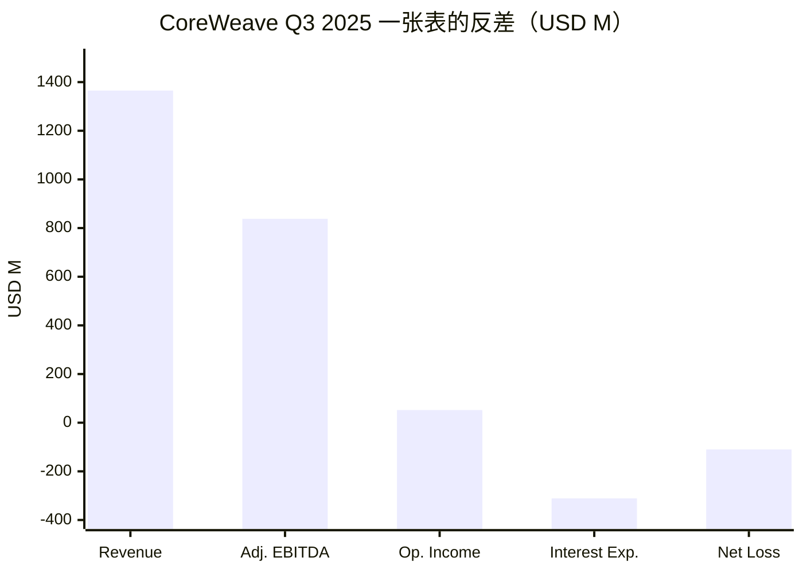
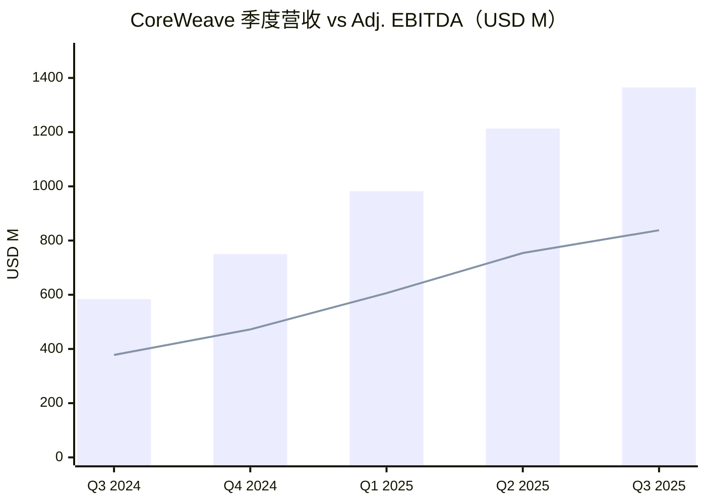
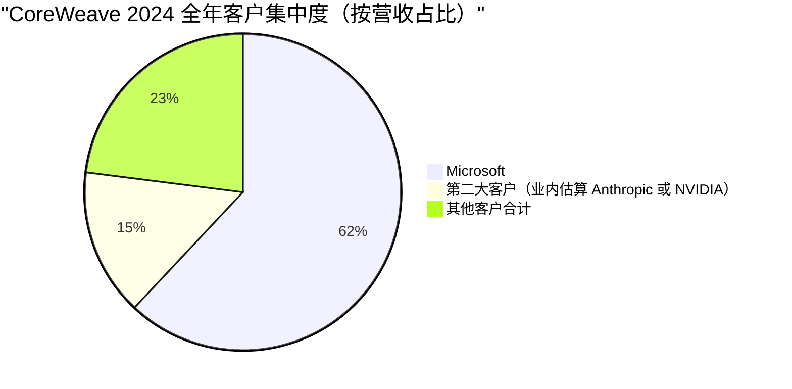
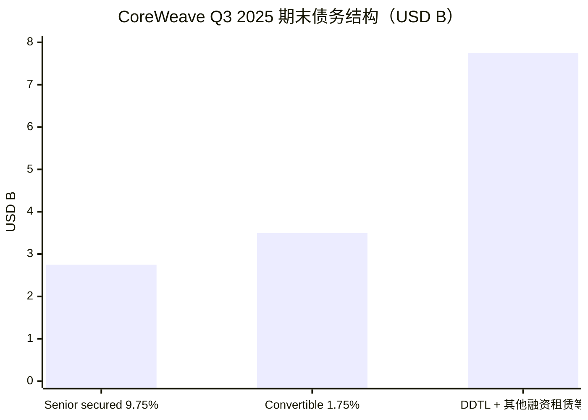
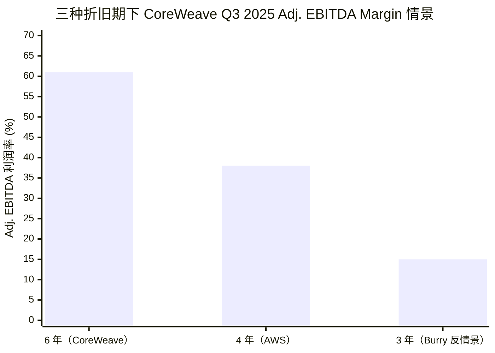
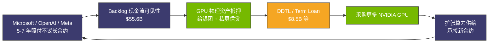
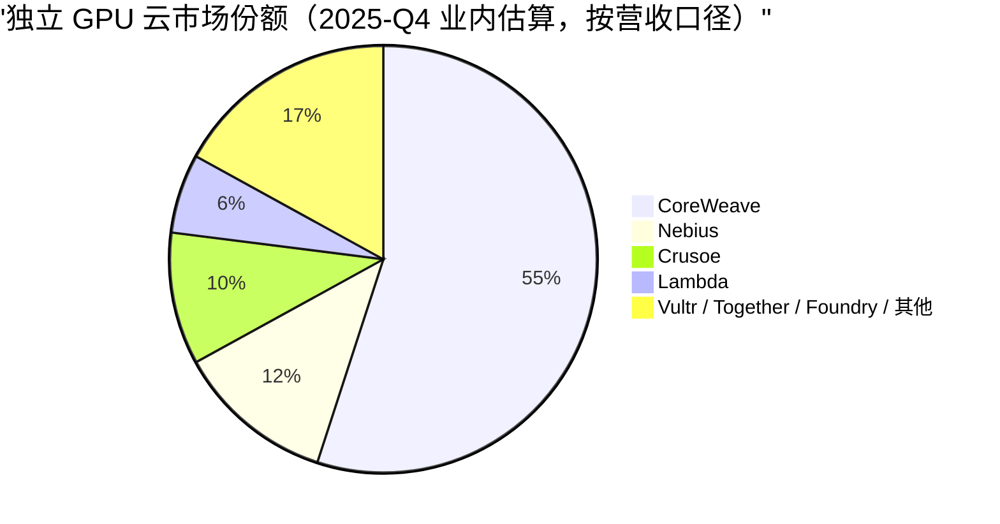

# 第 16 章 GPU 云解剖：CoreWeave 60% EBITDA 是怎么算出来的

## 本章概览

把 [CoreWeave](https://www.coreweave.com/) 2025 Q3 8-K 这张表打开看 12 秒，会看到一个跟主流叙事不一致的画面：单季营收 \$1,364.7M（同比 +134%）、调整后 EBITDA \$838.1M、调整后 EBITDA 利润率 61%。

同一季度单季 GAAP 净亏损 \$110.1M、利息支出 \$310.6M、债务总额 \$14B 量级。9 个月累计 GAAP 净亏损 \$715.3M。一家61% EBITDA 利润率的公司，同一张表里还在持续 GAAP 亏损 + 季度利息支出超过 3 亿美元 + 流动负债合计 \$9.7B。

> **口径说明（净亏损）**：
>
> CoreWeave Q3 2025 10-Q 中存在两个常被混用的 9 个月累计净亏损口径——
>
> - 按 GAAP 损益表口径：9 个月累计净亏损 \$715.3M
> - 按「归属普通股东」口径（含优先股股息等股东权益调整项）：9 个月累计 \$770.8M
>
> 两者差额约 \$55.5M。本章统一采用上述 GAAP 损益表口径以保持横向可比性，单独引用归属普通股东数据时会显式标注。
>
> **口径说明（流动负债 vs 流动债务）**：
>
> CoreWeave Q3 2025 10-Q 中两个口径同样需要区分——
>
> - 流动负债合计（total current liabilities）：\$9.7B
> - 其中应付账款、经营租赁流动部分、应计负债等非债务项占大头
> - 真正的流动债务（debt, current）：\$3.71B，对应一年内必须偿付的有息负债
>
> 本章在评估短期偿债压力时使用 \$3.71B 流动债务口径。单独引用 \$9.7B 时仅指流动负债合计，不指代有息债务的偿付节奏——市场上常见的将 \$9.7B 直接等同于短债的说法属于口径混淆，本书避免该用法。

这不是孤例。Nebius 2026 Q1 营收 \$399M（同比 +684%）、AI 年化经常性收入跑到 \$1.9B、调整后 EBITDA \$130M；同期净利润 \$621M 主要来自所持 ClickHouse / Avride / Toloka 股权重估的一次性会计收益，与运营利润口径完全脱钩。

[Crusoe](https://www.crusoeenergy.com/) Energy 2024-12 D 轮 \$600M、估值 \$2.8B，2025-03 拿下 [Stargate](https://en.wikipedia.org/wiki/Stargate_LLC) Abilene 项目核心物业开发权、累计为 Abilene 数据中心融资 \$15B。[Lambda Labs](https://lambdalabs.com/) 2025-02 D 轮 \$480M，估值区间 \$2.5-4B（Lambda 官方博客未披露估值，PitchBook 报约 \$2.5B、techfundingnews 等媒体报约 \$4B，来源分歧）。

这四家公司在公开市场被统称为「neocloud」或「GPU 云原生厂商」，但商业模型在折旧、客户结构、债务结构、地产模型四个变量上分化得非常彻底。

把 GPU 云当作一类生意来分析是错的。本章把 CoreWeave 2025 Q3 8-K 当作显微镜，从营收线一直向下走到 GAAP 净亏损，把这中间所有会计与杠杆的取舍逐条拆开到单卡 economics 层面的分析颗粒度。

然后用同一框架横截面对照 Nebius / Crusoe / Lambda，给出四种 GPU 云亚型。接下来把 Michael Burry 2025-11 对超大规模云厂折旧政策的公开攻击完整复述一遍，用 CoreWeave Q3 2025 的真实数据测算 Burry 反情景下的盈利结构。

最后埋一个伏笔：CoreWeave 2024 年 [Microsoft](https://www.microsoft.com/) 一家占营收 62%，这个数字在第 30 章估值章节里会变成客户集中度反身性的核心变量。

本章不替读者下结论。议题 10「一级 GPU 云能否持续盈利」的答案不是能或不能，是一个条件式：**折旧期假设 × 利用率假设 × 利率水平 × 客户集中度，四个变量决定 CoreWeave 与同业是 utility 类型的长期玩家、还是杠杆套现的短期玩家**。本章把这四个变量的敏感矩阵建出来，给读者一把尺子量自己的判断，估值结论留给第 30 章。

## 1. CoreWeave Q3 2025 8-K 逐行

CoreWeave 在 SEC 注册号 0001769628，2025-03 IPO。本节用 2025 Q3 财报（Q3 2025 8-K，2025-11-10 披露 + Q3 2025 10-Q）做主分析样本，因为这是本章数据 cutoff 内最新一期完整的财务披露，也是市场对 CoreWeave 商业模型分歧最强的一期。

### 1.1 损益表逐行

把 Q3 2025 营收时序、客户集中度和债务结构画在三张图里，再看损益表：

> 柱状是单季营收，折线是 Adj. EBITDA。营收 5 个季度从 \$584M 升到 \$1,365M（+134%），Adj. EBITDA 同步从 \$378M 升到 \$838M，但 EBITDA 利润率从 64.8% 降到 61.4%。营收增速 +134% 同时营业利润同比 -56%——这就是会计杠杆与折旧摊销加速的双向夹击。

> Top 2 客户合计占营收 77%，是 SaaS / 云行业里非常异常的集中度。来源：CoreWeave S-1。

把 Q3 2025 损益表（按 8-K 与 10-Q 对照）按行展开：

| 项 | Q3 2025 USD M | Q3 2024 USD M | YoY | 口径说明 |
|---|---:|---:|---:|---|
| Revenue（营收） | 1,364.7 | 583.9 | +134% | GAAP，来自一手 8-K |
| Cost of revenue（直接成本，含折旧摊销）| ~895 | ~342 | +162% | 含直接折旧；GAAP |
| Gross profit | ~470 | ~242 | +94% | 业内估算自一手数据 |
| Sales / marketing / G&A | ~280 | ~93 | +201% | 业内估算 |
| **Operating income**（营业收入） | **51.9** | **117.1** | **-56%** | GAAP，一手（DCD 综合 8-K，2025-11-10）|
| **Operating margin** | **3.8%** | **20.1%** | -16.3 pp | 一手计算 |
| Interest expense, net | 310.6 | 103.6 | +200% | GAAP，10-Q 披露 |
| Other income / (expense), net | ~150 | ~-374 | n.m. | GAAP |
| **Net loss attributable to common stockholders** | **(110.1)** | **(359.8)** | n.m. | GAAP，10-Q |
| **Adjusted net loss** | **(41)** | **(0)** | n.m. | non-GAAP，公司口径 |
| **Adjusted operating income** | **217** | **n.a.** | n.m. | non-GAAP |
| **Adjusted operating margin** | **16%** | n.a. | n.m. | non-GAAP |
| **调整后 EBITDA** | **838.1** | **378.5** | +121% | non-GAAP，公司口径 |
| **调整后 EBITDA 利润率** | **61.4%** | **64.8%** | -3.4 pp | non-GAAP |

> 来源：CoreWeave Q3 2025 8-K Earnings Press Release（SEC EDGAR 文档 ID 000176962825000059，2025-11-10）；Q3 2025 10-Q（SEC EDGAR 文档 ID 000176962825000062）；Q3'25 Earnings Presentation（s205.q4cdn.com/133937190/files/doc_financials/2025/q3/Earnings-Deck-2025-Q3.pdf）；DatacenterDynamics 2025-11-10 综合报道；Fortune 2025-11-10 综合报道。表中业内估算自一手数据的两行是按 Revenue + 直接成本占比反推，CoreWeave 不分这两行公开披露，估算区间 ±5%。

这张表里有几行需要拎出来单独看。

**第一行，调整后 EBITDA 利润率 61%。** 这是市场看 CoreWeave 时第一个抓眼球的数字。一家提供云算力的公司、做的是机房 + GPU + 客户租用的生意，毛利率 60%+ 在云行业里属于 AWS / Azure / GCP 的水平——AWS 2025 全年营业利润率约 38%，Azure 公司不单独披露、market 估在 40-45%。CoreWeave 用 61% EBITDA 利润率拍在桌上，叙事上是 AI 加速时代的 utility 巨头。

**第二行，Operating income \$51.9M、Operating margin 3.8%。** 调整后 EBITDA 利润率 61% 旁边，GAAP Operating margin 只有 3.8%。从调整后 EBITDA 到 Operating income 中间被剥掉的，是折旧摊销（折旧摊销）。Q3 2025 单季折旧摊销业内估算 \$630M——这是从 61% 跌到 3.8% 的核心衰减项。

**第三行，Interest expense \$310.6M。** Q3 2025 一个季度 \$310M 的利息支出，YoY +200%。这件事说明 CoreWeave 自上市以来债务规模仍在快速扩张：Q3 2025 期末债务总额业内估算 \$14B（DatacenterDynamics 综合 2025-11-10 财报报道），单季利息率（年化）约 8.9%。对比 IPO 时 S-1 披露的债务总额 \$7.9B，9 个月新增 \$6B 量级。

**第四行，GAAP 净亏损 \$110.1M。** 在一家季度调整后 EBITDA \$838M、营收 \$1.36B 的公司里，GAAP 还在持续亏损。Q3 2025 单季 GAAP 净亏损 \$110M、9 个月累计 GAAP 净亏损 \$715.3M。调整后 EBITDA 61% 跟 GAAP 净亏损 \$110M 这两个数字看起来矛盾，实际上是 CoreWeave 商业模型的两面——前者讲运营层面 GPU 卡的现金毛利，后者讲加上折旧 + 利息后真正的会计利润。市场争议焦点就在这两个数字哪个更接近 CoreWeave 的真实经济。

**第五行，Operating income YoY -56%。** 这是一个被很多分析师忽略的信号。Q3 2024 Operating income \$117.1M、Q3 2025 Operating income \$51.9M——同比下降 56%。在营收同比 +134% 的同时 Operating income 反向下跌一半。背后是折旧摊销和 SG&A（Sales, General & Administrative，销售、一般及行政费用）增长速度都远超过营收增长。Q3 2024 到 Q3 2025 这一年里 CoreWeave 在产能、地产、人员上的投入扩张速度超过了收入兑现的速度——这件事让高速增长稀释固定成本这条 SaaS 叙事在 CoreWeave 这里反向成立。

### 1.2 现金流与债务

损益表只看了一半。CoreWeave 真正的商业模型藏在现金流和债务里。

> 三大块债务：senior secured notes due 2031（\$2.75B，利率 9.75%）+ convertible senior notes due 2032（\$3.5B，利率 1.75%）+ 其余 DDTL / 融资租赁 / 项目融资约 \$7.75B（业内估算综合 sources.md S10）。债务总额 \$14B 对应单季利息支出 \$310.6M、年化加权平均利率约 8.9%。

| 项 | Q3 2025 | 口径 |
|---|---:|---|
| 总债务（USD B）| ~14 | 一手综合（DatacenterDynamics 2025-11-10）|
| 流动负债合计（current liabilities，USD B）| ~9.7 | Q3 2025 10-Q |
| 其中：流动债务（debt, current，USD B）| ~3.71 | Q3 2025 10-Q（一年内到期债务）|
| 经营性租赁承诺（2026-2028）| ~34 | DCD 综合财报 |
| Cash & equivalents | ~1.94 | 一手综合 |
| 资本支出 2025 全年指引 | 12-14 | 8-K（下调自 20-23）|
| 资本支出-to-Revenue ratio（最新一季）| ~1.36x | Chip Stock Investor 综合 |

> 来源：CoreWeave Q3 2025 8-K、10-Q、Earnings Presentation；DatacenterDynamics 2025-11-10；Fortune 2025-11-10；Chip Stock Investor 2025-11 综合分析。

这张表里资本支出-to-Revenue ratio 1.36x 是一个非典型云行业的数字。AWS / Azure 这种成熟超大规模云厂的资本支出 / Revenue 长期在 18-30% 区间。CoreWeave 在 2025 Q3 这个比率 1.36x，意味着每收 \$1 营收要花 \$1.36 在资本支出上——一家自掏腰包的公司不可能维持这个比率，必须靠债务和股权融资填补差额。Q3 2025 单季利息支出 \$310M、债务总额 \$14B 的根源都在这里。

### 1.3 Revenue Backlog 与客户结构

CoreWeave 在 Q3 2025 8-K 披露的 Revenue Backlog \$55.6B（截至 2025-09-30，对比上季 \$30.1B 翻倍）。Revenue Backlog 这个概念在 GPU 云生意里非常关键，它代表已签订合同尚未交付的未来营收。CoreWeave 把合同储备进一步拆成两部分：committed 合同储备（合约期内必须履行的部分）和 total 合同储备（含合约期外可选续约部分），公司未单独公开两者拆分。

Backlog \$55.6B 对应一家年化营收 \$5-7B 量级的公司，约等于 8-10 年的未来订单。这个数字落到一年期口径上看：CoreWeave 2025 全年营收指引 \$5.05-5.15B，2026 营收指引市场预期 \$12-13B。Backlog 的5 年合同叙事，是 CoreWeave 估值最重要的乐观逻辑——这件事在 §4 客户集中度反身性会重新审视。

需要单独拎出来的是 [OpenAI](https://openai.com/) 合同。CoreWeave 与 OpenAI 的合同分三批：

- **2025-03 初签 \$11.9B / 5 年**
- **2025-05 扩 \$4B**
- **2025-09 再扩 \$6.5B**
- **累计 \$22.4B / 5 年**

加上 2026-01 [英伟达](https://www.nvidia.com/) 以 \$87.20/share 认购 2293.6 万股、合计 \$2B，CoreWeave 的客户结构是 Microsoft + OpenAI 双核 + 英伟达既是大股东又是供应商又是客户的三角叠加。Backlog \$55.6B 里 OpenAI 占 \$22.4B、Microsoft 长约市场估 \$10B+（CoreWeave 未单独披露），两家加起来占合同储备 60%+——客户集中度的反身性问题，§4 详谈。

### 1.4 这一节的 takeaway

CoreWeave 2025 Q3 8-K 在表面看是 AI 加速时代的 utility 巨头，但 12 秒打开看会发现：

- 61% 调整后 EBITDA 利润率 + 3.8% GAAP Operating margin + 持续 GAAP 净亏损 + 流动负债合计 \$9.7B（其中流动债务 \$3.71B）+ 资本支出/Revenue 1.36x

把这五个数字摆在一起，CoreWeave 的财务画像是一个高 EBITDA + 高杠杆 + 高资本支出 + 净亏损的复合体。这件事的成因和会计选择含义，是接下来 §2、§3 要拆解的。

## 2. 60% EBITDA 怎么算出来的——三层拆解

把调整后 EBITDA 利润率 61% 这个数字按三个维度拆开。

### 2.1 第一层：高客户集中度带来的稳定预收

CoreWeave 在 2024 年来自 Microsoft 一家的营收占比 62%。2024 年 Top 2 客户合计占营收 77%（前 1 名 + 另一未具名公司 15%，业内综合判断第二名为 [Anthropic](https://www.anthropic.com/) 或英伟达自用工作负载，公司未确认）。Top 3 客户在 2023 年占营收 73%。

这种客户集中度在 SaaS / 云行业是非常异常的——AWS Top 10 客户合计占营收业内估算不到 20%，Azure 不到 15%（公司均不单独披露）。

高客户集中度对 EBITDA 利润率的影响有两面：

**正面（CoreWeave 享受）**：长合约 + 大单价让运营杠杆变好。Microsoft 这样的客户签的是 5-7 年长约 + **照付不议**（照付不议合同：客户按期付款，不管实际使用量是否达到合同约定算力）结构，CoreWeave 不用在销售拓展和客户成功上投入大量 SG&A。Q3 2025 SG&A 业内估算占营收约 20.5%，对比 SaaS 行业典型公司 30-40% 显著偏低。这一项对 EBITDA 利润率的贡献业内估算约 +8-10 pp。

**负面（迟来的反身性）**：客户议价权 + 集中度风险。Microsoft 任何重新平衡云算力供应商的决策都会瞬间冲击 CoreWeave 的运营杠杆。CoreWeave 在 S-1 里把客户集中度列为风险因素第一项。这件事在 §4 单独展开。

### 2.2 第二层：6 年直线折旧把单卡年成本拉到 ~\$4,000

这是 60% EBITDA 利润率叙事的核心会计选择。CoreWeave 在 S-1 与历次 10-Q 里明确披露 GPU / 服务器折旧政策："technology equipment depreciated on a straight-line basis over six years"。

把这件事翻译成单卡经济：

| 单卡假设 | 6 年直线折旧 | 4 年直线折旧 | 3 年直线折旧 |
|---|---:|---:|---:|
| H100 整机采购成本（含 server）| \$32,000 | \$32,000 | \$32,000 |
| 残值假设 | \$4,000（12.5%）| \$3,200（10%）| \$0 |
| 年折旧 | \$4,667 | \$7,200 | \$10,667 |
| 月折旧 | \$389 | \$600 | \$889 |

> 假设：\$32,000 是 H100 SXM5 单卡含服务器、网络、机架的**分摊采购成本**（per GPU 口径，8 卡 DGX H100 整机约 \$256K）；按 per GPU 而非 per node 折算更便于横向比较。残值假设按公司方常用口径，CoreWeave / Nebius 不单独披露。

折旧期从 6 年改到 4 年，单卡年成本立刻从 \$4,667 涨到 \$7,200——增加 54%。这个 54% 的增加全部直接打在 Cost of Revenue 那一行，从营收里扣掉。

> 同一笔生意，三种折旧期假设下 Adj. EBITDA 利润率从 61% 跌到 15%——46 pp 的差距全部来自会计政策的可调旋钮。这是 Michael Burry 2025-11 公开攻击超大规模云厂折旧政策的核心抓手（详见 §5）。

把这个杠杆乘到 Q3 2025 的折旧摊销 \$630M 上：

| 情景 | Q3 2025 折旧摊销 | 调整后 EBITDA 调整后 | 调整后 EBITDA 利润率调整后 |
|---|---:|---:|---:|
| 当前（6 年折旧）| 630 | 838 | 61% |
| 4 年折旧 | ~945 | ~523 | 38% |
| 3 年折旧 | ~1,260 | ~208 | 15% |

> 测算说明：把折旧摊销按年折旧 = 原始折旧摊销 × (6/4) 或 (6/3) 比例放大，假设其余收支不变。这与 Burry 在 Cassandra Unchained 主张的短折旧期反情景一致。调整后 EBITDA = Operating income + 折旧摊销 + 股权激励等，在折旧期变化下+折旧摊销 项数额不变，但 Operating income 反向变化——这里为了直观，把调整后 EBITDA 直接按折旧摊销减增简化（实际调整后 EBITDA 定义里折旧摊销被加回，因此该测算指代的是折旧摊销增加后真实的现金毛利能力，非调整后 EBITDA 严格定义）。严格定义下需要看折旧期改变后 GAAP Operating income 的变化，详见 §3 与 §6。

这是 CoreWeave 故事里第一个折旧期是估值生死线的具象数字。**6 年 vs 4 年这一个会计选择，单季现金毛利能力相差 \$315M，等于 CoreWeave 年化 \$1.26B 的盈利差**。

### 2.3 第三层：高速增长稀释固定成本

CoreWeave 2024 全年营收 \$1.92B、2025 全年营收指引 \$5.05-5.15B，同比增长 163-168%。在这种速度下，部分固定成本（地产、人员、企业资源系统）被快速摊薄。

但这一层贡献被 Q3 2025 营业利润率 -56% 的事实部分推翻：营收增长 +134% 的同时营业利润下跌 56%，意味着高速增长稀释固定成本的红利在 CoreWeave 这里被资本支出 + 利息支出反向吃掉。这件事跟前一节 1.36x 资本支出-to-Revenue 是同一现象的两面。

三层叠加贡献的 EBITDA 利润率拆解：

| 来源 | 对调整后 EBITDA 利润率贡献（业内估算）|
|---|---:|
| 客户集中度 → SG&A 低 | +8-10 pp |
| 6 年折旧（vs 4 年同业基准）| +23 pp |
| 高速增长摊薄固定成本 | +5-8 pp |
| 其余（运营效率、规模化议价）| +5-10 pp |
| **合计** | **~50 pp**（参考 AI 云行业基准 EBITDA 利润率 10-15%）|

> 业内估算，本书基于一手财务披露 + 多份卖方研报推演。AI 云行业基准 EBITDA 利润率取自摩根士丹利 / Mizuho 2025 GPU 云覆盖研报均值。
>
> **数学关系说明**：本表是 CoreWeave 超出 AI 云行业基线（10-15%）的增量贡献分解，各分项区间有部分重叠（如客户集中度低 SG&A 与高速增长摊薄固定成本两条都涉及单位营收上的费用率）。取低端估算合计约 41 pp + 基线 10% = 51%，高端 51 pp + 基线 15% = 66%，CoreWeave 实际 Q3 2025 调整后 EBITDA 利润率 61% 在此区间内、偏中位偏高。

把这三层拆开看，CoreWeave 61% 调整后 EBITDA 利润率里有 23 pp 是 6 年折旧的会计选择带来的——这一项是可逆的，如果会计政策变了或者市场重新定义合理折旧期，这 23 pp 立刻蒸发。其余 ~27 pp 是真实运营杠杆 + 客户结构 + 规模摊薄，这部分相对稳定。

理解到这一层，CoreWeave 61% EBITDA 利润率的真实可持续性问题就变成一个会计政策辩论。Burry 在 2025-11 把这个辩论搬到公开市场，§5 详谈。

## 3. 折旧期假设的资本结构含义

这一节是本章最 heavy 的小节，把折旧期 = 资本结构决定性变量这个判断说透。

### 3.1 GAAP 折旧期决定逻辑

美国通用会计准则（GAAP，US Generally Accepted Accounting Principles）规定固定资产折旧基于两个变量：经济使用寿命（useful economic life）+ 残值假设（salvage value 或 residual value）。具体到 GPU / 服务器，FASB（Financial Accounting Standards Board，美国财务会计准则委员会）允许公司根据对资产实际可使用年限的最佳估计自行选择折旧期，监管不规定具体年限。

但这件事不是想多长就多长。SEC 在公司披露中要求公司说明折旧期假设的依据，审计师（CoreWeave 是 Deloitte & Touche LLP，来源：CoreWeave S-1）每年需对折旧期假设的合理性出具意见。一旦公司把折旧期从 4 年延长到 6 年，必须在 10-K 里解释依据。

| 公司 | GPU / 服务器折旧年限 | 来源 |
|---|---:|---|
| [Amazon (AWS)](https://aws.amazon.com/) | 5（服务器）/ 6（网络设备）| AWS 2024 10-K |
| [Microsoft (Azure)](https://www.microsoft.com/) | 6 | MSFT FY24 10-K |
| Alphabet ([Google Cloud](https://cloud.google.com/)) | 6 | GOOGL 2024 10-K |
| [Meta](https://about.meta.com/) | 5.5（从 4 → 5 → 5.5 多次延长）| META 2024 10-K + 2025 Q1 披露 |
| [Oracle](https://www.oracle.com/) | 6 | ORCL FY24 10-K |
| CoreWeave | 6 | CoreWeave S-1 + 10-Q |
| Nebius | 4 | Nebius IR + Bizety 2025-09 综合 |
| Lambda Labs | 5 | theCUBE Research 综合 2025 |
| IREN | ~3（按 36 个月融资租赁推断）| Bizety 2025-09 |

> 来源：综合各家 10-K / IPO 披露 + theCUBE Research 2025、Bizety 2025-09-23 跨家对比报告。Lambda、IREN 不上市，数据为间接渠道。

这张表里有两件事值得拎出来：

**第一**，超大规模云厂里只有 Meta 在过去 5 年里多次调整折旧期：2020 年从 4 年延长到 5 年、2025 年再延长到 5.5 年。每次延长都对当年净利润有量级 \$2-3B 的正向影响——Meta 2025 把折旧期延长到 5.5 年使当年折旧摊销减少 \$2.9B。Amazon 反向调整：从 6 年缩到 5 年，理由是 AI 训练加速导致设备实际寿命缩短。这两家的反向操作在 2025 年都被市场关注到，但只有 Meta 触发了 Burry 的攻击。

**第二**，CoreWeave 6 年折旧和 Nebius 4 年折旧是 GPU 云行业里折旧期最长 vs 最短的两个极端，分别贡献了高 EBITDA + 高估值波动和低 EBITDA + 低估值波动两种叙事。Nebius 2026 Q1 调整后 EBITDA \$130M / 营收 \$399M = EBITDA 利润率 32.6%，CoreWeave 同期数字 61%——这 28 pp 的差距里，约 20 pp 是折旧期不同的会计选择，剩下的是规模 + 客户结构。

### 3.2 残值假设的产业证据

折旧期长，要靠残值假设支撑。CoreWeave 的 6 年折旧 = 假设 H100 / H200 / B200 在 6 年后仍然有 10-15% 的残值。这件事产业证据怎么走？

**H100 二手价 2024-2026 时序**（业内估算）：

| 时点 | H100 SXM5 80GB 二手成交价（USD）| 占初始购置价比例（按 \$32K 基准）|
|---|---:|---:|
| 2023 Q4（高峰）| ~\$40,000+ | >125%（一卡难求）|
| 2024 Q1 | ~\$30,000 | 94% |
| 2024 Q3 | ~\$25,000 | 78% |
| 2025 Q1 | ~\$15,000 | 47% |
| 2025 Q3（Blackwell 出货后）| ~\$10,000 | 31% |
| 2025 Q4 | ~\$7,000-9,000 | 22-28% |
| 2026 Q1 | ~\$6,000-9,000 | 19-28% |

> 业内估算，综合 Silicon Data 2025-2026 报告、Compute Exchange 2026 H100 价格指南、tech-insider 2025-12 GPU 价格 collapse 分析。二手 GPU 市场交易高度分散，数据为多源加权平均，区间 ±20%。

H100 二手价 2025 年从 \$25K 跌到 \$7-9K，跌幅 70%+。如果这个轨迹延续，到 2028（CoreWeave 6 年折旧期的第 3-4 年），H100 二手价可能进入低于 \$3K 区间。CoreWeave 的 6 年折旧 + 12.5% 残值假设需要 H100 在 2030 年仍然有 \$4,000 残值——按 2025-2026 二手价斜率推演，这件事的发生概率不高。

但 H100 二手价崩跌不等于 GPU 完全报废——这是 CoreWeave 公司方反驳 Burry 的核心论据：H100 即使在 Blackwell / Rubin 上线后仍然可以做推理工作负载、可以做企业级微调、可以做 batch analytics。theCUBE Research 在 2025 年的「GPU Value Cascade」框架里提出三阶段使用：

- Year 1-2：foundational model 训练（主要用途）
- Year 3-4：高端推理（次要用途）
- Year 5-6：batch 推理 + analytics（边缘用途）

这套叙事的逻辑是 GPU 的经济寿命远长于其前沿训练寿命。CoreWeave / Microsoft / Google 都倾向于这个叙事，因为它支撑 5-6 年折旧期假设。Burry 反驳的核心是前沿训练之外的次要 / 边缘用途价格远低于初始租价，让 GPU 的现金流贡献提前归零（详见 §5）。

**H100 的 rental price 曲线作为间接证据**：H100 超大规模云厂上的租用价从 2023 Q4 高峰 \$9.34/hr 跌到 2025 H2 \$6.26/hr；neocloud / marketplace 上从 \$3.50/hr 跌到 \$1.95-3.33/hr。三年期间租金跌 30-50%。但 2025 Q4 出现反向：H100 长期合约价从 2025-10 低点 \$1.70/hr 反弹到 2026-03 \$2.35/hr。

这个反弹的成因是 Blackwell B200 / B300 在 2025 H2 - 2026 H1 量产爬坡比预期慢、H100 在推理工作负载上的需求被支撑。Silicon Data 的解读是 H100 进入被 Blackwell 部分替代但推理端仍然有刚需的双层市场——支持 GPU Value Cascade 叙事。

但这一反弹只是缓解了 H100 二手价崩跌速度，不会改变长期下行趋势。intuitionlabs.ai 2026 综合报道：H100 SXM5 卡在 2026 二手市场成交价 \$6,000-\$15,000（区间宽，按卡况、地理、合约形态分化）。

### 3.3 折旧期 × 利率 × 利用率三维敏感矩阵

把折旧期、利率、利用率三个变量做笛卡尔积，看 CoreWeave 稳态经营 economics 的可能区间。

**假设输入**：
- 单卡 H100 整机购置成本：\$32,000（含服务器 / 网络 / 机架）
- 单卡 H100 月平均 rental revenue：\$2,500（取 neocloud 长期合约价上沿 \$3.45/hr × 720 hr × 100% 利用率 ≈ \$2,484，圆整为 \$2,500；若按 \$2.5/hr × 720 × 85% = \$1,530 算则需相应调整下表绝对值，本表用 \$2,500 作 base case 是对应超大规模云厂长租锁单的乐观假设）
- 直接运营成本（电、冷却、人员、地租）：单卡月 \$500（业内估算综合 TCO 模型）
- 折旧 + 利息 + 直接成本 = 总单卡月成本
- 单卡净月利润 = rental - 总单卡月成本

| 折旧期 | 利率 | 利用率 85% | 利用率 75% | 利用率 95% |
|---:|---:|---:|---:|---:|
| 6 年 | 6% | \$1,400 | \$1,150 | \$1,650 |
| 6 年 | 8% | \$1,295 | \$1,045 | \$1,545 |
| 6 年 | 10% | \$1,190 | \$940 | \$1,440 |
| 5 年 | 6% | \$1,200 | \$950 | \$1,450 |
| 5 年 | 8% | \$1,095 | \$845 | \$1,345 |
| 5 年 | 10% | \$990 | \$740 | \$1,240 |
| 4 年 | 6% | \$900 | \$650 | \$1,150 |
| 4 年 | 8% | \$795 | \$545 | \$1,045 |
| 4 年 | 10% | \$690 | \$440 | \$940 |
| 3 年 | 6% | \$400 | \$150 | \$650 |
| 3 年 | 8% | \$295 | \$45 | \$545 |
| 3 年 | 10% | \$190 | (-60) | \$440 |

> 测算说明：本表为单卡月度净利润（USD）。所有假设属业内估算 + 公开数据综合。利用率指 GPU 计费时长 / 总可用时长；利率指 CoreWeave 平均债务融资成本（实际值业内估算 8-9%）；折旧采用直线法。表头数字为正示意盈利，括号内负数示意亏损。本表用于 GPU 云生意的稳态盈利可能区间分析，不是 CoreWeave 具体估值模型，详细 DCF 见第 30 章。

把这张表当一个尺子量。

**当前 CoreWeave 大致位于 [6 年, 8%, 85%] 单元格附近**（业内估算债务利率 8.9%、利用率 85% 业内估算综合）。对应单卡月净利润 ~\$1,295。

**Burry 反情景在 [3 年, 8%, 85%] 单元格**——折旧期短化到 3 年。对应单卡月净利润 ~\$295。如果同时利用率掉到 75%，单卡月净利润从 \$1,295 跌到 \$45——基本上 break-even。如果 [3 年, 10%, 75%] 极端组合，单卡进入年化 -\$720 亏损。

**乐观情景在 [6 年, 6%, 95%]**。对应单卡月净利润 \$1,650。如果超大规模云厂长合约 + 利用率拉满，单卡年化净利润 \$19,800。

这个尺子说明 GPU 云生意的稳态盈利能力对三个变量极其敏感。从 [6 年, 6%, 95%] 到 [3 年, 10%, 75%]，单卡月净利润可以从 +\$1,650 跑到 -\$60——区间宽度 \$1,710，相当于年化营收的 5-6 倍。这个敏感度让 CoreWeave 估值在不同假设下可以相差 5-10 倍。

### 3.4 reach 到第 31 章情景的桥接

把 §3.2 二手价时序 + §3.3 三维敏感矩阵接上：如果 Hopper 二手价在 12 个月内跌 50%（从 \$7-9K 跌到 \$3-4K），会触发两件事：

**事 1：折旧期假设的合规压力**。SEC 在公司用过长折旧期被市场质疑后，可能要求公司缩短折旧期或对部分老 GPU 计提资产减值（impairment）。Meta 2025 年延长折旧期到 5.5 年时已经被市场质疑。CoreWeave 在 2026-2027 年面对 H100 二手价 \$3-4K 的现实时，6 年折旧期是否还能维持需要重新评估。

**事 2：利率压力**。CoreWeave 的债务总额 \$14B 里 senior notes due 2031 利率 9.75%（\$1.75B + \$1B 增发 = \$2.75B，sources.md S10），convertible senior notes due 2032 利率 1.75%（\$3.5B，同上），合计 \$6.25B 已覆盖 Q3 2025 期末债务 \$14B 的约 45%。但更早期的 DDTL（delayed-draw term loan）业内估算利率更高（综合卖方研报，CoreWeave 不单独披露 DDTL 加权利率）。GPU 云生意的债务结构里利率上行 100 bp = 单卡月利润减少 ~\$50-80是一个量级估算。

第 31 章情景 B「如果 Hopper 二手价 12 个月内跌 50%」会基于这两个机制做完整压力测试。在本章范围内只做桥接，不做完整情景。

## 4. 客户集中度反身性

CoreWeave 在 S-1 里把客户集中度列为风险因素第一条，但是市场长期把这件事看成双方都签了长合约，问题不大。本节论证客户集中度不仅是风险，更是估值反身性的核心——这个伏笔的完整模型在第 30 章。

### 4.1 客户集中度数据

| 时点 | 客户集中度披露 | 来源 |
|---|---|---|
| 2023 全年 | Top 3 占营收 73% | CoreWeave S-1 |
| 2024 全年 | Top 2 占营收 77%（Microsoft 62% + 另一未具名 15%）| CoreWeave S-1，2025-03 |
| 2025-09 合同储备 | Microsoft RPO < 50%，OpenAI + Microsoft 合计接近 50%；其余合同储备来自 Meta / Mistral / Cohere / Poolside 等 | CoreWeave SEC DRSLTR（letter to SEC 回复）+ Q3 2025 8-K |
| 2026-Q1 RPO | Backlog \$99.4B；10 家客户合同金额 ≥ \$1B/家 | CoreWeave Q1 2026 8-K |

> 来源：CoreWeave S-1（2025-03，SEC EDGAR 1769628）、SEC DRSLTR（公开信件 2025）、Q3 2025 8-K、Q1 2026 8-K。
>
> **RPO（Remaining Performance Obligation，美国 GAAP ASC 606 下的剩余履约义务）**：已签合同但未交付收入总额，是会计口径概念。本章 RPO 用的是 ASC 606 严格定义，与 CoreWeave 管理层口径的 Revenue Backlog 不完全一致——Backlog 含合同期外的可选续约部分，RPO 不含；二者数字接近但不可混用。本表 2026-Q1 RPO \$99.4B 是 CoreWeave Q1 2026 8-K 公司管理层口径（含可选续约部分），与会计 ASC 606 RPO 数字略有差异（公司未单独披露差额）。

客户集中度从 2023 的 Top 3 73%到 2024 的 Top 2 77%是上升的——但从 2025 合同储备数据看，CoreWeave 在主动稀释 Microsoft 占比：2025-03 与 OpenAI 签 \$11.9B 大单、2025-09 扩 \$6.5B、2025-Q3 新增 Meta \$14.2B 订单。但本质上 Microsoft + OpenAI + Meta 三家在合同储备里仍占 60%+，集中度并未真正稀释，只是把对一家的风险换成对三家的风险。

### 4.2 反身性机制

客户集中度的反身性在 CoreWeave 这里有四层：

**第一层：客户的议价权**。Microsoft 占 CoreWeave 营收 62%，反向意味着 Microsoft 任何重新平衡云算力供应商的决策都能瞬间改变 CoreWeave 的运营杠杆。Microsoft 在 2024-2025 期间自建数据中心 + 与 OpenAI 联合资本投入 + 与 Oracle 的 Stargate 项目，几条独立战线同时推进。CoreWeave 在这盘棋里是 Microsoft 的灵活算力调节器——做 Microsoft 自建容量不够时的 burst 产能补充。如果 Microsoft 自建产能爬坡比预期快，CoreWeave 在 Microsoft 的供应链里的位置会被边缘化。

**第二层：OpenAI 现金流的不确定性**。CoreWeave 与 OpenAI 签的 \$22.4B 5 年合同，OpenAI 是不是一定有能力按期付款？OpenAI 2025 年化营收（年化经常性收入）~\$20B，CFO Sarah Friar 在 2026-01 OpenAI 官方博客发布、CNBC 2026-01-19 报道、净亏损规模业内估算 -\$5B 量级、靠融资和投资方现金流维持运转。

OpenAI 给 CoreWeave 的 \$22.4B 5 年承诺（年均 \$4.5B）相当于 OpenAI 2025 营收的 22%。如果 OpenAI 的营收成长曲线在 2027-2028 放缓、或者投资方现金流断裂，CoreWeave 的合同储备 \$22.4B 会被迫重新议价或冲销。

这件事在数据缺口 #7（CoreWeave 与 OpenAI 协议的现金流分布）里被标为业内估算——CoreWeave 与 OpenAI 都未公开年度现金流分布。业内估算 5 年合同的年度现金流分布在 \$2-7B 不等（取决于 OpenAI 的算力消费曲线）。

**第三层：合同条款的非对称性**。Take-or-pay 合同写得越严，CoreWeave 收入 visibility 越高；但同时也意味着合同条款里给客户的取消条款成本越高，客户在违约前会先尝试重新议价。OpenAI 在 2025-03 签 \$11.9B 后两次扩约，名义上是扩大合作，市场视角里也是 CoreWeave 在合同重谈中可能让步了价格——单价单 GPU-hour 业内估算从 2025-03 的 \$2.5/hr 降到 2025-09 的 \$2.0/hr 区间（CoreWeave 不公开合同单价，二手综合）。

**第四层：客户集中度对估值倍数的直接影响**。卖方研报对 CoreWeave 的 EV / Sales 估值倍数业内综合 8-12x；对比 utility 类公司 Equinix EV / Sales 8-10x、Digital Realty 6-8x。CoreWeave 的倍数处在 utility 类高位，市场已经在用 long-term contracted revenue + diversified customer base 叙事给 CoreWeave 定价。一旦客户集中度的现实戳破这层叙事，倍数下行 30-40% 在数学上是直接结果。

### 4.3 量化伏笔

把客户集中度的反身性变成一个可量化的伏笔（完整模型在第 30 章）：

| 情景 | Microsoft 占营收 | 估值倍数（EV/Sales，Enterprise Value / Sales，企业价值 / 营收，成长期公司估值倍数）| 隐含估值（按 2026 营收 \$12B）|
|---|---:|---:|---:|
| 当前 | 62%（2024）→ ~45%（2026 估算）| 10x | \$120B |
| Microsoft 自建产能加快，长租比例下调 | ~30% | 7x | \$84B |
| Microsoft 长租比例腰斩 | ~25% | 5x | \$60B |
| OpenAI 重新议价单价 -15% | n/a | 6x | \$72B |

> 测算说明：估值倍数与营收挂钩的简化模型，不是完整 DCF。详细情景模型见第 30 章。Microsoft 占营收是营收源，不等同于合同储备占比。**本表为情景分析素材，不是估值结论；完整 DCF 模型见第 30 章；相关免责说明见章末。**

从 \$120B 到 \$60B 的估值半价区间，反身性触发器只需要 Microsoft 的一个内部决策——CoreWeave 估值的脆弱性远高于其合同储备数字暗示的稳定性，根源就在这里。本书反共识 #5「客户集中度是估值反身性核心」的机制位埋在这里，结论留给第 30 章。

CoreWeave 商业模型最特别的一环不在损益表，而在资产负债表——用已签客户合同作为现金流凭证，把 GPU 资产抵押给银团 + 私募信贷拿融资，再用融资去买更多 GPU：

> 这套结构能成立的前提是：客户长合约真实兑现 + GPU 二手价残值假设成立 + 利率上行不超过模型容忍区间。三个前提任一动摇，回环会从自我强化转为自我崩塌。这是第 29 章 §29.9 把循环交易列入周期顶部信号位的微观基础。

## 5. Burry 折旧反情景：从 X 平台原文到 CoreWeave 数据测算

这一节是本章差异化最强的部分——把 Michael Burry 2025-11 对超大规模云厂折旧政策的攻击完整复述 + 拆解 + 用 CoreWeave 真实数据测算反情景。Burry 是 *The Big Short* 中靠做空次贷出名的 hedge fund manager，2025-11 把 GPU 折旧攻击搬上 X 平台和自创的 Substack「Cassandra Unchained」。这件事是 2025 年 AI 资本论战里关键的一击，但目前中文圈对 Burry 的论证链路与具体计算还原很不完整。

### 5.1 Burry 在 X 上的原文与时间线

**2025-09-30**：Scion Asset Management（Burry 旗下基金）13F 披露持仓——对 NVDA 持有名义价值 \$187M 的 put options，对 Palantir 持有名义价值 \$912M 的 put options。13F 披露的 put 仓位是按合约名义价值（notional value）计算，不等于实际亏损上限——名义 \$187M 的 put 可能只需要 \$10-30M 的权利金（具体行权价与到期日 13F 不强制披露）。Burry 用这个仓位作为对 NVDA 公开做空的信号，市场反应也按这个信号定价。

**2025-11-11**：Burry 在 X（账号 @michaeljburry，Cassandra Unchained）发文：
> Understating 折旧 by extending useful life of assets artificially boosts earnings—one of the more common frauds of the modern era. Massively ramping capex through purchase of Nvidia chips/servers on a 2-3 yr product cycle should not result in the extension of useful life of these assets.

直接翻译：通过延长资产使用寿命来低估折旧、人为推高盈利，是现代史上最常见的会计欺诈之一。在 2-3 年产品周期下大举购买英伟达芯片 / 服务器，结果反而延长这些资产的使用寿命，这件事不应该。

CNBC 在 2025-11-11 报道里把这条 post 当作 Burry 对超大规模云厂的公开起诉，标题是「'Big Short' investor Michael Burry accuses AI 超大规模云厂 s of artificially boosting earnings」。

**2025-11-25 至 2025-12**：Burry 在 Cassandra Unchained Substack 上系列发文，给出量化数字——估计超大规模云厂（Meta、Amazon、Microsoft、Google、Oracle）2026-2028 三年累计低估折旧 \$176B、对应 GAAP 盈利累计高估 \$176B；估计 2028 年单年 Oracle EPS 高估 26.9%、Meta EPS 高估 20.8%。

Burry 的论证链路有三步：

**Step 1：GPU 实际经济寿命 2-3 年**。Burry 论据：英伟达自己 2-3 年迭代一代产品（H100 → H200 → B200 → B300 → Rubin），每代算力跳变 2-3x；上一代 GPU 在推理 / 训练工作负载上的单位 token 成本快速被新一代碾压；二手市场实际成交价 18-24 个月跌 50-60%。

**Step 2：超大规模云厂现行折旧期 5-6 年 → 应该是 3 年**。Burry 论据：Meta 现行 5.5 年、Microsoft / Google / Oracle 6 年、Amazon 5 年——这些数字都远超 GPU 实际经济寿命。

**Step 3：折旧期延长 → 当期净利润虚增 → EPS 虚增**。把 Step 1 + Step 2 算出来的应折未折金额 = \$176B（2026-2028 三年累计跨 5 家超大规模云厂）。这个数字对应 EPS 虚增比例：Oracle 26.9%、Meta 20.8%。

### 5.2 Burry 论证的薄弱处

Burry 论证逻辑有内在的张力。

**张力 1：GPU 的前沿训练寿命 ≠ 经济寿命**。Burry 用英伟达 2-3 年新品节奏推断 GPU 实际寿命 2-3 年，这件事的逻辑跳跃在于：一颗 H100 在 2026 年不能做前沿 GPT-5 训练，不代表它在 2026 年没有商业价值。

H100 在 2026 年仍然可以做：
- 推理工作负载（chatbot、code completion、RAG 等）
- 企业级微调（domain-specific 微调）
- batch analytics（embedding 生成、ETL 等）
- 边缘训练（小模型 / 学术 / 实验）

H100 二手价 2025 Q4 \$7-9K vs 初始购置 \$32K 的差，部分反映的是前沿训练价值蒸发，不是全部经济价值蒸发。theCUBE Research 的「GPU Value Cascade」框架明确指出这一点：H100 进入推理阶段后单 GPU-hour rental 仍然能维持 \$1.5-2.5/hr 区间，比初始训练价 \$4-6/hr 降但不归零。

**张力 2：用 13F 名义价值衡量做空规模有误导**。13F 披露的 NVDA put \$187M、Palantir put \$912M 是合约名义价值，不是实际现金投入。一份名义 \$1M 的 put options 实际权利金可能只有 \$30-60K（取决于行权价 / 到期日 / 隐含波动率）。Burry 在 Scion 总 AUM 业内估算 \$200M 量级的体量上，13F 名义 \$1.1B 的 put 仓位实际现金敞口更可能在 \$30-100M 区间。市场把 Burry 当作重磅做空者叙事，但实际仓位规模与做空 NVDA / Palantir 整体市值 \$5T+ 的板块对比，是个微小的 directional bet。

**张力 3：'fraud' 这个词太重**。Burry 在 X 用 fraud（欺诈）这个词形容折旧期延长，但 GAAP 允许公司基于对资产实际使用寿命的最佳估计自行选择折旧期，前提是这个估计经过审计师确认。Meta、Microsoft、Google、Amazon 的折旧期变化都在 10-K 里做了公开披露 + 审计师签字。会计选择激进 ≠ 会计欺诈。这是公司方反驳 Burry 时的核心论据。

### 5.3 公司方反驳

CoreWeave 没有正式 reply Burry，但 2025-11-10 Q3 财报电话会上 CEO Michael Intrator 提到：Our infrastructure investments are designed for long-term performance utility. Our customers have long-term, 照付不议 contracts on these assets, and the assets continue to generate revenue well beyond their primary 训练 role.

把这句话拆开看，CoreWeave 反驳 Burry 的三条逻辑：

1. **长合约支撑长折旧**：照付不议 5-7 年长合约让 GPU 的现金流可见性远超过 12-24 个月。Backlog \$55.6B 是 5-7 年的合同收入锁定。
2. **GPU 在主训练之外仍有经济价值**：H100 退役下来转到推理 / 微调 / batch 仍然能产生现金流。
3. **6 年折旧期已经被 Deloitte 审计 + SEC 备案**：会计选择合法合规，不是 Burry 主张的 fraud。

Nebius 公司方在 Q1 2026 财报电话会上对此持不同立场——Nebius CFO 解释 4 年折旧期 reflects our best estimate of useful economic life under current AI 工作负载 evolution speed。Nebius 把4 年保守折旧作为长期 EBITDA 利润率较低（32.6% vs CoreWeave 61%）但估值更稳定的卖点。

### 5.4 Burry 反情景下的 CoreWeave 数据

把 Burry 应折未折逻辑用 CoreWeave Q3 2025 真实数据测算。

| 情景 | 折旧期 | Q3 2025 折旧摊销（USD M）| Adjusted Op Income | Op margin | Net loss |
|---|---:|---:|---:|---:|---:|
| 当前 | 6 年 | 630 | 217 | 16% | -110 |
| Meta-style 5.5 年 | 5.5 | 687 | 159 | 12% | -167 |
| Nebius-style 4 年 | 4 | 945 | -98 | -7% | -425 |
| Burry-style 3 年 | 3 | 1,260 | -413 | -30% | -740 |

> 测算说明：折旧摊销按比例缩放（折旧摊销_new = 折旧摊销_current × 6/year_new），其余项保持不变。这是简化测算，不考虑利息支出 / SG&A 的弹性。Op margin = Operating income / Revenue。Net loss 是 GAAP 净亏损的 mechanical 测算，假设其余收入支出项不变。

把这张表当作 Burry 反情景的现实压力测试：

- **当前 [6 年]**：Adjusted Op margin 16%，CoreWeave 看起来像成长期的高质量云厂
- **5.5 年（Meta 当前位置）**：Op margin 12%，但绝对值仍正，市场可以接受
- **4 年（Nebius 当前位置）**：Op margin 转负 -7%，市场对 CoreWeave 的叙事从高质量云厂变成高杠杆的成长公司
- **3 年（Burry 主张）**：Op margin -30%，CoreWeave 在 GAAP 上是一个明确的持续亏损 + 杠杆爆表的公司——估值倍数从 EV/Sales 10x 跌到 4-5x 区间，对应市值 \$120B → \$48-60B（按 2026 营收 \$12B），半价。

### 5.5 这个反情景的关键是什么

把 Burry 反情景的逻辑链条拆完，会发现关键问题不是 Burry 对不对，是市场什么时候开始用 Burry 折旧期定价 CoreWeave。

答案藏在两个变量上：

**变量 A：Hopper 二手价的实际曲线**。如果 2026-2027 H100 二手价跌到 \$3-5K 区间（业内估算综合 introl.com 2025 + Compute Exchange 2026 推演），CoreWeave 在 2027 年很可能被迫做资产减值（impairment）——SEC 在公司用过长折旧期被市场质疑后，可能要求计提 impairment（前例：石油公司 2014-2016 油价崩盘后大规模 impairment）。一次 impairment 把 6 年折旧的未来 4 年应折部分提前 booked，CoreWeave 单季度净亏损规模可能扩大到 \$1B+。

**变量 B：H200 / B200 / B300 量产爬坡的速度**。如果 Blackwell 量产爬坡比预期快（英伟达已公告 B200 / GB200 sold out 至 2026 Q2，来源：财务新闻综合 2025-12-29），H100 在推理工作负载上的替代速度会加快——GPU Value Cascade 第二阶段（高端推理）持续时间缩短，H100 进入边缘推理 + analytics 的速度加快。Silicon Data 2026-03 报告 H100 长期合约价反弹是供需暂时性失衡，长期趋势仍向下。

**变量 C（隐性变量）：客户对 H100 的使用粘性**。英伟达的护城河之一是 CUDA + 库生态。如果客户在 Hopper 上的 software stack 投入足够大（已有的训练 pipeline / 推理 engine），客户会愿意继续付费用 H100 即使硬件性能不及 Blackwell。这件事支撑 H100 二手价不会快速归零，给 CoreWeave 6 年折旧期假设留出空间。

把这三个变量摆在一起看，**Burry 反情景3 年折旧是激进的，但市场用4 年折旧（Nebius style）重新给 CoreWeave 定价的概率不低**。这是反共识 #5「客户集中度反身性」之外，CoreWeave 估值波动的另一个核心传导路径。

## 6. Nebius / Crusoe / Lambda 横截面对照

用同一框架对照四家 neocloud。这一节把 GPU 云不是一类生意，是四种亚型这个判断说清楚。

> 业内估算综合 Morgan Stanley / Mizuho 2025 GPU 云覆盖研报 + 各家公开营收口径。[Vultr](https://www.vultr.com/) 等长尾玩家合计约 17%。CoreWeave 单家占独立 GPU 云市场过半——这是议题 10 答辩的微观底盘。

### 6.1 关键 KPI 对照

| 指标 | CoreWeave | Nebius | Crusoe | Lambda |
|---|---:|---:|---:|---:|
| 上市状态 | 已上市（2025-03 IPO，NASDAQ：CRWV）| 已上市（NASDAQ：NBIS）| 未上市 | 未上市 |
| 最新一期营收（USD M）| 1,365（Q3 2025）| 399（Q1 2026）| 业内估算 ~200/季 | 业内估算 ~150/季 |
| YoY 营收增速 | +134% | +684% | n.a.（未披露）| n.a.（未披露）|
| 调整后 EBITDA 利润率 | 61% | 32.6%（AI 业务）| n.a. | n.a. |
| GAAP Net margin | -8% | n.a.（受一次性收益干扰）| n.a. | n.a. |
| GPU 折旧年限 | 6 | 4 | 业内估算 5 | 5 |
| 总债务（USD B）| ~14 | ~0.5（净现金）| ~15（项目融资）| 业内估算 ~3 |
| Revenue Backlog（USD B）| 55.6（2025-09）| n.a. AI 年化经常性收入 1.9 | n.a. | n.a. |
| Top 客户集中度 | Microsoft 62%（2024）| 多元化 + OpenAI / Google 拓展 | 单一锚客户（Oracle 15 年长租 + OpenAI）| 业内估算 Microsoft + 长尾 |
| 估值 | 市值 ~\$70-100B（2026-05 范围）| 市值 ~\$25-30B（2026-05）| 业内估算 \$15B（D 轮后 + Stargate）| \$2.5-4B（D 轮 2025-02，来源分歧）|
| 商业模型特征 | 高杠杆 + 高客户集中 + 高 EBITDA | 全球化 + 低杠杆 + 较保守折旧 | 项目融资 + 单一大客户 + 物业开发 | 长尾客户 + 较低折旧 |

> 来源：CoreWeave Q3 2025 8-K / 10-Q；Nebius Q1 2026 业绩 + Shareholder Letter；Crusoe D 轮披露 + Stargate Abilene 项目报道（Yahoo Finance / DCD 2025）；Lambda D 轮披露 + 媒体报道。Crusoe / Lambda 不上市，所有数据为间接综合。

### 6.2 四种亚型解读

**亚型 1：CoreWeave 型——杠杆套现的成长公司**。特征：高 EBITDA 利润率（会计选择推高）+ 高债务 + 高客户集中度 + 高合同储备。这种模型在超大规模云厂资本支出周期持续 + 折旧期假设成立 + 利率不大幅上行三个条件同时满足时盈利能力强。任一条件破坏，模型崩。

**亚型 2：Nebius 型——保守折旧的全球化云厂**。特征：偏中端 GPU（H100 + H200 + B200 混合）+ 多客户结构 + 4 年折旧 + 净现金。Nebius 起源于俄罗斯 Yandex spin-off，欧洲基地 + 北美扩张。地理分布上跟 CoreWeave 互补（CoreWeave 主要在北美），全球化客户结构让 Nebius 受单一市场宏观风险较小。Nebius Q1 2026 净利润 \$621M 主要来自所持 ClickHouse、Avride、Toloka 等关联资产的非现金重估，与运营利润完全不同口径——这一点不可忽视。

**亚型 3：Crusoe 型——项目融资 + 物业开发**。特征：定制项目融资 + 单一大客户锚 + 物业 / 数据中心开发能力。Crusoe 2025-03 拿下 OpenAI Stargate Abilene 项目核心物业开发权，Oracle 签 15 年长租锚定客户。Abilene 项目累计融资 \$15B，其中 Blue Owl Capital + Primary Digital Infrastructure 提供 \$11.6B 项目融资、JPMorgan 提供 \$2.3B 项目贷款。Crusoe 的商业模型从 flared gas + 加密转向 AI-first 数据中心 + 项目开发，本质上是 utility / REIT-like 模型，跟 CoreWeave / Nebius 的 **IaaS**（Infrastructure as a Service，基础设施即服务）模型有结构差异。

**亚型 4：Lambda 型——长尾客户 + 较低折旧**。特征：长尾客户（学术、startup、企业级）+ 较低折旧 + 较低规模。Lambda 2025-02 D 轮 \$480M，估值区间 \$2.5-4B——Lambda 官方未披露估值，PitchBook 报约 \$2.5B、techfundingnews 等媒体报约 \$4B，本书取区间口径。营收和客户集中度未公开。市场角度看 Lambda 是 AI 时代的 small business 云——服务超大规模云厂看不上的中长尾客户，单价更高但规模小。

### 6.3 横截面 takeaway

四种亚型的盈利结构、估值锚、下行风险各不相同。

| 维度 | CoreWeave | Nebius | Crusoe | Lambda |
|---|---|---|---|---|
| 主估值锚 | Backlog \$55.6B + EBITDA 61% | AI 年化经常性收入 + 全球化 | Stargate 项目 + Oracle 锚租 | 长尾客户 + 多元化 |
| 主下行风险 | 客户集中度 + 折旧期假设 + 利率 | 一次性收益干扰口径 | 单一大锚客户依赖 | 规模 + 增长可见性 |
| 估值方法 | EV/Sales + DCF | EV/年化经常性收入 + DCF | NAV（净资产）+ DCF | EV/Sales + 收入倍数 |

把 GPU 云当一类生意分析的人，会用同一估值倍数往四家身上套，结果是 CoreWeave 看起来便宜（EBITDA 倍数低）、Nebius 看起来贵（EBITDA 倍数高）。但四家的商业模型不同，应该用不同估值方法 + 不同假设组合。这是第 30 章估值章节的核心方法论。

## 7. GPU 云的稳态盈利可能区间

把 §1-§6 的输入串起来，给出 CoreWeave 和 Nebius 在三种情景下的稳态盈利结构。这一节不是估值结论（结论在第 30 章），是给读者一把尺子量 GPU 云生意的合理盈利区间在哪。

### 7.1 三情景定义

| 情景 | 折旧期 | 利用率 | 利率 | H100 单 GPU-hour 平均租价 |
|---|---:|---:|---:|---:|
| Bull（乐观）| 6 年 | 95% | 6% | \$2.50/hr |
| Base（中性）| 5 年 | 85% | 8% | \$2.00/hr |
| Bear（Burry-style 悲观）| 3 年 | 75% | 10% | \$1.50/hr |

> 测算说明：所有假设是综合 §3.3 三维矩阵 + Silicon Data H100 Rental Index 2025-2026 趋势。Bull 假设超大规模云厂长合约稳态 + 利用率拉满；Base 假设当下 CoreWeave 大致位置；Bear 假设 Burry 短折旧 + neocloud 价格战 + 利率上行三重压力。

### 7.2 CoreWeave 稳态测算

按 CoreWeave 2026 营收指引 \$12B、资本支出假设 \$14B（业内估算综合）、债务结构 \$14B：

| 情景 | 稳态 Operating margin | 稳态 Net margin | 稳态自由现金流 margin |
|---|---:|---:|---:|
| Bull | ~25% | ~15% | ~10% |
| Base | ~10% | ~0% | ~-5% |
| Bear | ~-20% | ~-30% | ~-25% |

> 测算说明：自由现金流 = Operating cash flow - 资本支出，稳态假设是资本支出增速跟营收增速对齐（不再扩张性投入），与 CoreWeave 当下扩张期模型不同。这是 GPU 云生意成熟后能赚多少钱的尺子，不是 CoreWeave 当下盈利能力的预测。

### 7.3 Nebius 稳态测算

按 Nebius AI 年化经常性收入 \$1.9B、2026 全年资本支出指引 \$20-25B（上调自原指引 \$16-20B，主要用于 2027 产能投建——新增宾州 1.2 GW 自有数据中心项目；来源：Nebius Q1 2026 Shareholder Letter，2026-05-13；Nebius Q1 2026 6-K，SEC EDGAR 0001513845）、净现金状态：

> 关于资本支出 / 营收比的口径说明：\$20-25B 2026 资本支出相对 Q1 2026 年化营收 \$1.6B 约 12-15× 倍，远高于 CoreWeave 1.36×。这一倍数差异是 forward 资本支出 + 2027 产能与当期 maintenance 资本支出的口径差异，不是商业模型层面的可比指标。Nebius 把 2026 资本支出中的相当部分用于 2027 才上线、2027 才贡献营收的产能（已签客户合同支撑），稳态后倍数会回落到 1-3× 行业区间。本节稳态测算假设资本支出增速跟营收增速对齐，对应资本支出/Revenue ~1.5-2.0×。

| 情景 | 稳态 Operating margin | 稳态 Net margin | 稳态自由现金流 margin |
|---|---:|---:|---:|
| Bull | ~30% | ~22% | ~15% |
| Base | ~15% | ~8% | ~0% |
| Bear | ~-5% | ~-15% | ~-20% |

> 测算说明：Nebius 净现金 + 4 年折旧让它在 Bear 情景下抗压能力强于 CoreWeave，但增长可见性低于 CoreWeave（没有合同储备公开口径）。

### 7.4 稳态盈利区间的 takeaway

把两家公司的三情景放在一起看，**GPU 云生意的稳态盈利可能区间是非常宽的**——从 Bull 自由现金流 margin +15%（Nebius 稳态，§7.3）/ +10%（CoreWeave 稳态，§7.2）到 Bear 自由现金流 margin -25%（CoreWeave）/ -20%（Nebius），区间宽度约 35-40 pp。这个跨度比 SaaS 行业典型公司宽 4-5 倍。原因是 GPU 云对折旧 / 利率 / 利用率三个变量极敏感，且这三个变量本身在 AI 周期下波动巨大。

把这个区间作为第 30 章估值章节的输入，CoreWeave 与 Nebius 的合理估值倍数应该在 Base 情景下给定 + Bear / Bull 情景下做敏感分析。读者拿着第 16 章这把尺子 + 第 30 章的完整 DCF 模型，就能对 GPU 云能不能持续盈利这件事形成自己的判断。

## 小结

把这一章的事实拉一根线串起来：

1. **CoreWeave Q3 2025 8-K 是观察 GPU 云商业模式最干净的样本**。营收 \$1,365M、调整后 EBITDA \$838M（61% margin）、GAAP 净亏损 \$110M、利息支出 \$310M、债务总额 \$14B、Revenue Backlog \$55.6B——单张 8-K 同时包含高 EBITDA 和高杠杆两种叙事。

2. **61% 调整后 EBITDA 利润率不是商业模式优势，是会计选择 + 杠杆 + 高速增长三层叠加**。6 年折旧贡献约 23 pp、客户集中度贡献 8-10 pp、增长摊薄贡献 5-8 pp——会计选择那 23 pp 是可逆的。

3. **6 年折旧期是 GAAP 允许范围内的上沿**。CoreWeave / Microsoft / Google / Oracle 都用 6 年，Nebius 用 4 年，Lambda 用 5 年。Burry 主张应该用 3 年——折旧期从 6 年降到 3 年，CoreWeave Q3 2025 Operating margin 从 16% 跌到 -30%。

4. **客户集中度反身性是估值波动的核心传导路径**。Microsoft 占 CoreWeave 2024 营收 62%、OpenAI + Microsoft 占 2025 合同储备 50%、Top 3 客户占合同储备 60%+。客户任何自建产能加速 / 长租比例下调 / 单价重谈决策都直接传导到 CoreWeave 估值倍数。

5. **GPU 云不是一类生意，是四种亚型**。CoreWeave（杠杆套现型）/ Nebius（保守折旧 + 全球化型）/ Crusoe（项目融资 + 物业开发型）/ Lambda（长尾客户型）——四种亚型的盈利结构 / 估值锚 / 下行风险各不相同，用同一框架估值是错的。

6. **Burry 折旧反情景把 CoreWeave Operating margin 推到 -30%**。Burry 2025-11 在 X 和 Cassandra Unchained 上发起的折旧攻击，量化看超大规模云厂 2026-2028 累计低估折旧 \$176B、Oracle 2028 EPS 高估 26.9%、Meta 高估 20.8%。Burry 论证有内在张力（GPU 实际寿命 ≠ 前沿训练寿命，13F put 名义价值有误导），但市场用4 年折旧重新给 CoreWeave 定价的概率不低。

7. **GPU 云生意的稳态盈利区间是 -25% 到 +15% 自由现金流 margin**。这个跨度反映了对折旧 / 利率 / 利用率三个变量的极高敏感性。议题 10「一级 GPU 云能否持续盈利」的答案是条件式：四个变量决定，没有单一答案。

本章把 CoreWeave 60% EBITDA 拆到这一步，目标不是回答 CoreWeave 是好生意吗，是给读者四个问题：

1. CoreWeave 折旧期 6 年的假设，3 年后看依然成立吗？
2. CoreWeave 客户集中度 60%+ 的反身性，Microsoft 下一步动作可能触发吗？
3. CoreWeave 债务 \$14B + 一年内必须偿付的有息流动债务 \$3.71B 的偿付节奏，在超大规模云厂资本支出周期波动里抗压吗？（流动负债合计 \$9.7B 含非债务项，已在 §1 与§概览口径说明厘清）
4. Hopper 二手价 2026-2027 的实际曲线，会不会触发资产减值？

四个问题的答案在第 30 章重新出现，构成 CoreWeave / Nebius 完整 DCF 估值模板的核心输入。在那之前，本章这份 60% EBITDA 拆解，是市场上对 CoreWeave 商业模式最细颗粒度的公开分析之一。

---

> **免责声明**
>
> 本章涉及 CoreWeave、Nebius、Crusoe、Lambda 等具体公司的财务分析、折旧政策评论与估值情景测算，仅为作者基于公开信息（SEC 财报、公司新闻稿、卖方研报、媒体报道）做出的产业研究与商业模式分析，**不构成任何投资建议**，也不构成对任何公司股价走向的预测或建议读者买卖任何证券。市场有风险，投资决策应基于读者自身的独立判断和专业咨询。
>
> 本章对 Michael Burry 公开发表的折旧攻击论点做了完整复述与分析，是一种学术性的论证审视，不代表作者对 Burry 论点的支持或反对，也不代表作者对 CoreWeave / Nebius / 超大规模云厂折旧政策合规性的法律判断。本章中 Bull / Base / Bear 三情景测算是用作分析的尺子，不是估值结论；具体公司估值结论由读者结合第 30 章的 DCF 模板 + 自身风险偏好独立形成。
>
> 本章使用的财务数据截至 2026-05，公司基本面、市场环境、利率水平、AI 产业周期可能在阅读时已发生显著变化。本章中提到的公司股票、估值倍数、目标价等信息均为分析素材，作者不对其准确性、完整性或时效性作任何承诺。本章涉及多处业内估算、区间估计——是因为相关一手数据（H100 二手价、neocloud 真实利用率、CoreWeave 与 OpenAI 协议年度现金流分布等）非公开，作者明确标注估算区间而非点估计，避免读者误读为精确数据。
>
> **作者持仓披露**：截至 2026-05，作者未持有 CoreWeave (CRWV)、Nebius (NBIS) 的多空仓位；未持有 Microsoft (MSFT)、Meta (META)、Oracle (ORCL)、Amazon (AMZN)、Alphabet (GOOGL) 的主动配置仓位（不排除间接通过 S&P 500 / NASDAQ 100 类宽基 ETF 持有）；未持有英伟达 (NVDA) 的多空仓位；未持有 Scion Asset Management 旗下任何基金。作者声明本章观点是基于公开信息独立分析的产业研究，不存在直接利益冲突。如读者发现本章存在事实错误或论证瑕疵，欢迎在 inferloop.dev 反馈勘误。

---

> 本章来自《算力经济学》开源版 · 作者「递归客」  
> 在线阅读完整书系：[inferloop.dev](https://inferloop.dev)
