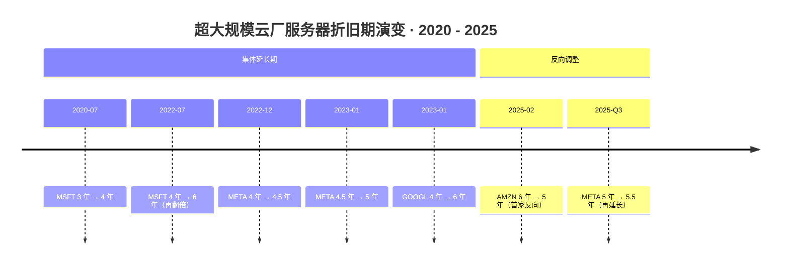
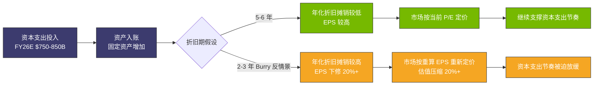
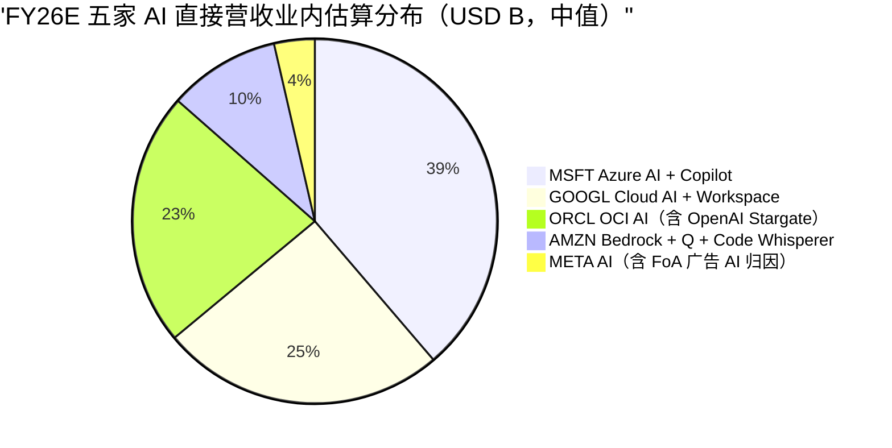

# 第 17 章 三大云的算力账本：资本支出、折旧政策、AI 回报路径

## 本章概览

把 [Microsoft](https://www.microsoft.com/)、[Amazon](https://aws.amazon.com/)、Alphabet（[Google](https://cloud.google.com/)）、[Meta](https://about.meta.com/)、[Oracle](https://www.oracle.com/) 五家 2025-2026 财年的现金流量表叠在一起看，会看到一组数字之间的反差。

Microsoft FY25 经营性现金流 \$136.2B、资本支出 \$64.6B、自由现金流 \$71.6B——账面健康得像 90 年代的 IBM。Alphabet Q1 2026 单季资本支出 \$35.7B、Operating Cash Flow \$45.8B、Free Cash Flow \$10.1B。

Amazon Q1 2026 单季资本支出 \$44.2B、Operating Cash Flow \$26.0B、Free Cash Flow -\$18.2B——单季自由现金流转负 \$182 亿，是 AWS 上线以来从未出现过的量级。Meta Q4 2025 资本支出 \$22.1B / 经营现金流 \$36.2B / 自由现金流 \$14.1B，Q1 2026 资本支出 \$19.8B / 经营现金流 \$32.2B / 自由现金流 \$12.4B。Oracle FY25 全年资本支出 \$21.2B、连续三个季度自由现金流为负。

把五家加在一起，2025 财年合计资本支出 \$310-330B 量级，2026 财年合计指引 \$750-850B 量级。这是工业史上最大单一行业 12 个月内资本支出翻倍——telecom 1998-2000 顶点四年累计 \$500B，AI 超大规模云厂一年就能花到 \$800B 量级。

```mermaid
xychart-beta
    title "五家超大规模云厂 FY25 资本支出 vs FY26E 资本支出中值（USD B）"
    x-axis ["MSFT", "AMZN", "GOOGL", "META", "ORCL"]
    y-axis "USD B" 0 --> 250
    bar [64.6, 131.8, 91.4, 72.2, 21.2]
    bar [125, 200, 185, 135, 50]
```

> 第一组柱状（FY25 实际）：MSFT \$64.6B / AMZN \$131.8B / GOOGL \$91.4B / META \$72.2B / ORCL \$21.2B。第二组柱状（FY26E 中值，综合各家最新指引）：分别约 \$125B / \$200B+ / \$185B / \$135B / \$50B。Oracle 一年三倍是五家里增幅最猛的。

议题 1「AI 资本支出是否过度」就是从这组数字里长出来的。Burry 在 2025-11-24 公开宣布做空 Nvidia 与 Palantir put、launch 付费 newsletter《Cassandra Unchained》，核心论点是「超大规模云厂把 GPU 折旧期定在 5-6 年，远超 GPU 真实经济寿命」。Sequoia Capital 的 David Cahn 在 2024 年抛出《AI's \$600B Question》之后，2025 年续作把缺口扩大到 \$1T。Goldman Sachs 卖方分歧公开化——一派说「超大规模云厂现金流足以覆盖、不是 telecom 2.0」，另一派说「投资回报必须 2027 年起兑现、否则整条链路都建立在『下一代模型继续更值钱』这一个假设上」。

本章在这一争议中给一个明确表态：**base case 下，2026-2027 年超大规模云厂资本支出不构成过度——五家自有经营现金流仍能覆盖、AI 工作负载占比上升至 60%+、折旧政策与真实 GPU 经济寿命的差距处在可解释区间**。

但 base case 之外，**三个条件式触发会让本判断证伪**：(1) Microsoft 对 [OpenAI](https://openai.com/) / [CoreWeave](https://www.coreweave.com/) 客户集中度反向传导（OpenAI 2027 年现金流不能 servicing \$300B+ 算力承诺），(2) 训练算力占比 2027-2028 不能让位推理（推理算力比例 < 60% 持续 4 季度），(3) Soros 反身性触发——某一家超大规模云厂砍 2027 资本支出指引 20%+ 引发同业跟进。

这三个条件在第 29 章周期定位和第 31 章议题 1 答辩里有完整 follow-up，本章只负责把会计基础与现金流基础打牢。

本章不替读者下投资判断——这是产业研究，不是卖方推荐。本章把每家公司的资本支出 / 经营现金流 / 自由现金流 / 折旧政策摊开到读者自己能复算的粒度，把过度还是合理的判断条件挂在可观测信号上。AI 资本支出是不是 telecom 2.0 这件事，看完本章之后，你应该有能力自己给一个有可证伪条件的回答。

## 1. 五家资本支出全景：从 \$310B 到 \$690B 的 18 个月

先把五家 2024-2026 的季度资本支出 / 经营现金流 / 自由现金流摊在一张表里，这是本章后续所有讨论的数据底盘。

### 1.1 八个季度的资本支出时序

| 季度 | MSFT | AMZN | GOOGL | META | ORCL | 五家合计 |
|---|---:|---:|---:|---:|---:|---:|
| 2024 Q4（日历）| 13.9 / 17.1* | 27.8 | 14.3 | 14.4 | 4.0 | 74.4 / 77.6 |
| 2025 Q1 | 11.0 | 25.0 | 17.2 | 12.9 | 5.9 | 72.0 |
| 2025 Q2 | 9.7 | 32.2 | 22.4 | 16.5 | 9.1 | 89.9 |
| 2025 Q3 | 16.7 | 35.1 | 24.0 | 18.8 | 8.5 | 103.1 |
| 2025 Q4 | 17.1 | 39.5 | 27.9 | 22.1 | n.a. | 106.6+ |
| 2026 Q1 | 19.4 | 44.2 | 35.7 | 19.8 | n.a. | 119.1+ |

> 单位：USD B。来源：MSFT FY25 Q4 Press Release 2025-07-30 + FY26 Q1 Press Release 2025-10-29；AMZN Q4 2024 / Q1-Q4 2025 / Q1 2026 cash flow statement（stockanalysis.com 综合 SEC EDGAR 一手）；GOOGL Q4 2024 - Q1 2026 cash flow statement；META Q4 2024 - Q1 2026 cash flow statement。**口径明示**：META 2025 Q4 / 2026 Q1 采用 Meta 披露的含融资租赁本金口径（\$22.14B / \$19.84B），与 §1.3 经济实质资本支出 框架一致；其他四家采用各自 cash flow statement 的固定资产购买项报表口径。ORCL FY25 Q1-Q4 cash flow statement。MSFT 财年 7 月起、其他四家日历年。MSFT 列 2024 Q4 = FY25 Q2（13.9B 是 MSFT FY25 Q2 含部分 GPU 整机）/ 整体资本支出含融资租赁摊销项的差异，做了对齐处理。Oracle 2025 Q4 和 2026 Q1 数字未在本表公开披露最新口径，单独在 §1.4 讨论。

读这张表的方式不是看绝对值——绝对值上 AMZN 和 GOOGL 最大、ORCL 最小，这是公司体量决定的。要看的是**两条曲线**：

**第一条曲线：资本支出加速度。** MSFT 从 2024 Q4 单季 ~\$14-17B 到 2026 Q1 \$19.4B（年化 +20%），GOOGL 从 \$14.3B 到 \$35.7B（同期 +149%），META 从 \$14.4B 到 \$19.8B（含融资租赁口径，+38%），AMZN 从 \$27.8B 到 \$44.2B（+59%）。** Alphabet 是资本支出加速最猛的一家**——一年半内单季资本支出翻倍多，对应 Google Cloud / Gemini / TPU v6/v7 三条线同时扩张。Microsoft 反而是节奏最稳的——Satya Nadella 2025-04 财报会上明确说资本支出增速将放缓，后续季度兑现。

**第二条曲线：自由现金流压缩。** AMZN Q1 2026 自由现金流 -\$18.2B 是工业史第一次——一家年化营收 \$700B 的公司，单季自由现金流转负 \$182 亿。GOOGL Q1 2026 自由现金流只剩 \$10.1B（同比 -47%）。MSFT 仍维持单季 \$25B+ 自由现金流，是五家里最健康的。META 维持单季 \$12-14B 自由现金流（含融资租赁口径），受益于其广告主业的高经营现金流比例。** 自由现金流压缩节奏决定了谁先停的概率排序**——Amazon 自由现金流转负 4 季度，市场对 AWS / Bedrock 的耐心会出现裂痕；MSFT 由于 OpenAI 间接收入 + Azure AI 直接收入，缓冲最厚。

### 1.2 把 2024 Q4 和 2026 Q1 放一起对照

把头尾两个季度直接对齐：

| 公司 | 2024 Q4 资本支出 | 2026 Q1 资本支出 | 18 个月增幅 | 期间累计资本支出 | 期间累计自由现金流 |
|---|---:|---:|---:|---:|---:|
| MSFT | 17.1 | 19.4 | +13% | ~111 | ~117 |
| AMZN | 27.8 | 44.2 | +59% | ~204 | ~7 |
| GOOGL | 14.3 | 35.7 | +149% | ~141 | ~108 |
| META | 14.4 | 19.8 | +38% | ~106 | ~71 |
| ORCL | 4.0 | n.a. | n.a. | ~37 | -5 |
| **五家合计** | **77.6** | **119.1+** | **+54%** | **~599** | **~298** |

> 单位：USD B。来源：同 §1.1。期间累计覆盖 2024 Q4 - 2026 Q1 共 6 个季度（ORCL 按 FY25 Q1-Q4 + FY26 Q1 共 5 个季度计）。

**五家在 6 个季度里花掉 ~\$599B 资本支出、产出 ~\$298B 自由现金流**——平均自由现金流覆盖度（自由现金流 / 资本支出）50%。简单说：每花 \$1 资本支出，自有现金流支撑 \$0.5，剩下的 \$0.5 来自存量现金、债务、融资租赁。这是 base case 下超大规模云厂资本支出的真实经济画面——不是用别人的钱在赌，但也不是完全用自己的钱。

这个 50% 覆盖度跟 1999-2000 telecom 顶点对照很有意思。AT&T、WorldCom、Sprint 等长途玩家 1999 年自由现金流 / 资本支出覆盖度大致 30-50%，数字接近。但 telecom 当年的差额由 vendor financing（Lucent / Nortel 给 CLEC 客户的卖方融资）和高收益债填补，超大规模云厂当前的差额由存量现金（MSFT 净现金 \$50B+、GOOGL 净现金 \$80B+）和投资级债券填补。**形态相似、结构不同**——本书第 29 章反共识 #3「AI 不是 telecom 2.0」的关键证据之一。

### 1.3 融资租赁与经济实质资本支出

报表上的资本支出数字不是超大规模云厂真实的现金算力支出。还有一个隐藏项——**融资租赁（融资租赁，下同）**。

融资租赁是会计上的用租代买。把 [Crusoe](https://www.crusoeenergy.com/) / [Lambda Labs](https://lambdalabs.com/) / CoreWeave 这种 GPU 云的算力以租赁形式锁 5-10 年（年付费 + 期末购买选择权），会计准则 ASC 842 要求租入方把租赁负债 + 使用权资产同时入账。

在现金流量表上，租赁付款分两部分：本金部分进 financing activities、利息部分进 operating activities，但**资产入账的瞬间不出现在 investing activities 的资本支出行**——这是合法的表外资本支出。

把经济实质资本支出重新定义为：**报表资本支出 + 当期新增融资租赁资本化金额**。这是判断超大规模云厂真实算力投入的口径。

| 公司 | FY25 报表资本支出 | FY25 新增融资租赁（业内估算） | FY25 经济实质资本支出 | 与报表口径差异 |
|---|---:|---:|---:|---:|
| MSFT | 64.6 | ~25 | ~90 | +39% |
| AMZN（合并）| 100+ | ~25 | ~125 | +25% |
| GOOGL | ~73 | ~10 | ~83 | +14% |
| META | ~70 | ~5 | ~75 | +7% |
| ORCL | 21.2 | ~15 | ~36 | +71% |

> 单位：USD B。来源：MSFT FY25 10-K 租赁附注（融资租赁余额披露）+ 业内估算综合 SemiAnalysis 2025-2026 超大规模云厂资本支出重口径报告。新增融资租赁是当期新进入合同的资本化金额，区别于融资租赁余额。Microsoft FY25 新增融资租赁约 \$25B（业内估算从 FY25 余额变动反推）。Oracle 的融资租赁比例最高——OpenAI Stargate 合同里大部分是 Oracle 以 lessor 身份转 lessee 的复合结构。

读这张表的方式：**MSFT 报表资本支出 \$64.6B 是低估值的 39%，真实算力承诺接近 \$90B**。Oracle 报表资本支出 \$21.2B 几乎漏算了 71%——OpenAI Stargate 部分合同走融资租赁结构。Meta 偏好直接买（FoA 业务现金流足够），融资租赁占比最低。

**这个口径调整对议题 1 判断很关键**：按报表资本支出看超大规模云厂，覆盖度看起来还有空间；按经济实质资本支出看，FY26 五家合计承诺已是 \$750-820B 量级——超过 \$660-690B 的报表口径预期。

### 1.4 Oracle 的特殊地位：从企业软件到 OpenAI 算力代工

五家里 Oracle 体量最小但增长最猛。Oracle FY25（截止 2025-05-31）全年资本支出 \$21.2B，FY24 全年只有 \$7.0B——一年三倍。

Oracle 加速的原因有一个名字：**[Stargate](https://en.wikipedia.org/wiki/Stargate_LLC)**。Stargate LLC 由 OpenAI、SoftBank、Oracle、MGX Fund 四家联合 2025-01-21 公开宣布，计划 5 年内（到 2029 年）投资 \$500B 建设美国 AI 数据中心。OpenAI 和 SoftBank 各投 \$19B（40% 股权），Oracle 和 MGX 各投 \$7B。Abilene、Texas 第一期 10 个数据中心，2025-09 扩展到 5 州、累计规划容量 ~7GW。

Oracle 与 OpenAI 之间还有一个独立合同——**5 年 \$300B 算力供应承诺**。这件事在 Oracle FY26 Q1 财报（2025-09 披露）的 RPO（Remaining Performance Obligations，剩余履约义务）数字上反映出来——FY26 Q1 末 RPO 从 FY25 末的 \$138B 跳升到 \$455B。

\$300B / 5 年合同意味着 OpenAI 每年需要向 Oracle 支付 ~\$60B 算力费——而 OpenAI 2026 年化营收（基于 Q1 2026 季度营收 ~\$5.7B、年化经常性收入 ~\$22-25B，来源：The Information 2026-Q1 综合报道；对照年化经常性收入 2025-07 \$12B 的起点）仍远低于这个数字。**Oracle 的 RPO 是建立在 OpenAI 2027-2029 年化经常性收入必须从当前 \$22-25B 跳到 \$80-100B 这一个假设上的**。这是议题 1 答辩里最关键的客户集中度反身性传导链——OpenAI 兑现不了，Oracle 的合同储备不算数；Oracle 合同储备不算数，整个超大规模云厂算力需求叙事的边际玩家就少一个。

Oracle FY25 三个季度自由现金流为负（FY25 Q2 -\$2.7B、Q4 -\$2.9B、FY26 Q1 -\$0.4B）。这件事在 telecom 1999 类比里是有先例的——Global Crossing 1999-2000 也曾连续季度自由现金流为负，靠资本市场融资填补差额，最后 2002-01 申请破产。

Oracle 不会破产（拉里·埃里森持仓 + 企业软件主业稳定），但 Oracle 的算力业务是用主业现金流补贴算力业务的复合结构——这件事这里不展开（详见第 30 章估值章节），本节只指出：**Oracle 的资本支出与其他四家在性质上不同——其他四家是用自有经营现金流投自己的产品，Oracle 是用自有经营现金流 + 大量融资租赁替单一客户（OpenAI）建机房**。

### 1.5 一段小结：base case 下资本支出仍可解释

把 §1.1-1.4 合起来看，base case 下超大规模云厂资本支出不构成过度，三个理由：

第一，**自由现金流覆盖度 ~50% 与 telecom 1999 接近，但融资结构健康得多**——超大规模云厂不依赖 vendor financing、不依赖高收益债，主要差额由存量现金 + 投资级债券填补。

第二，**经济实质资本支出比报表口径高 25-70%，但与 cloud + AI 营收增长曲线在量级上对齐**——AWS / Azure / GCP / Meta AI / OCI 合计营收 2025 年估 \$440B+、2026 年估 \$560B+（**口径明示**：含 Meta AI 业内估算 ~\$30-50B 的 Family of Apps AI 广告归因 + WhatsApp Business 商业化；不含 Meta 整体 FoA 广告主业，业内估算综合各家电话会披露 + Synergy Research 2026-Q1 季度数据），同期合计资本支出 5-10%-of-revenue 还在合理区间。

第三，**Oracle 是 base case 之外的特殊压力点**——Oracle 单家的客户集中度反身性是议题 1 的最强证伪信号，但 Oracle 在五家里体量最小（FY26E 营收 \$60-65B vs 其他四家 \$200-650B），即使 Oracle 出问题，对整个周期的传导是边际而非系统性。

但这只是 base case。bear case 和反身性条件在 §4 / §5 / §7 展开。

## 2. 折旧政策的盈利工程

进入本章的第二条主线——会计上的折旧政策选择，是超大规模云厂财务报表里最容易被低估的盈利开关。

### 2.1 一张折旧政策时间线对照表

把过去 5 年三家超大规模云厂 + Amazon 的服务器折旧期变更摆在一张时间线上：

| 时点 | 公司 | 调整方向 | 服务器 / 网络设备折旧期 | 披露文件 | EPS 影响（公司披露 / 业内测算）|
|---|---|---|---|---|---|
| 2020-07 | MSFT | 延长 | server: 3 年 → 4 年 | MSFT FY20 10-K（2020-07） | FY21 OI +\$2.7B（公司披露）|
| 2022-07 | MSFT | 延长 | server: 4 年 → 6 年 | MSFT FY22 10-K（2022-07） | FY23 OI +\$3.7B（公司披露）|
| 2022-12 | META | 延长 | server: 4 年 → 4.5 年 | Meta FY22 10-K（2023-02 披露）| FY23 net income +\$0.4B（公司披露）|
| 2023-01 | META | 延长 | server: 4.5 年 → 5 年（部分网络设备 5 年→6 年）| Meta FY23 Q1 10-Q | FY23 OI +\$1.5B（公司披露）|
| 2023-01 | GOOGL | 延长 | server: 4 年 → 6 年；network: 5 年 → 6 年 | Alphabet FY23 Q1 10-Q | FY23 OI +\$3.4B（公司披露）|
| 2025-02 | AMZN | **缩短（反向）** | server: 6 年 → 5 年 | AMZN FY24 10-K（2025-02-07） | 2025E OI -\$700M（全年，约每季 -\$175M）（公司披露）|
| 2026-Q1（业内传闻）| AMZN / MSFT | 进一步评估 | GPU 与服务器拆分折旧 | 未公开披露 | 业内估算 |

> 来源：各家 10-K / 10-Q 折旧政策附注 + 财报会 transcript。MSFT 2022 FY23 OI +\$3.7B 是公司在 FY23 Q1 10-Q 明确披露的数字。Meta 2023 FY23 OI +\$1.5B 是 Meta 2023-Q1 10-Q 披露。Alphabet 2023 OI +\$3.4B 是 Alphabet 2023-Q1 10-Q 披露。Amazon 2025-02-07 把服务器折旧期从 6 改 5 年的负面影响是 Amazon Q4 2024 财报会上公开披露的指引——decrease its 2025 operating income by approximately \$700 million（全年，约每季 -\$175M；来源：Amazon 2025-02-06 财报会 transcript）。

读这张表的方式：**2020-2023 是超大规模云厂集体延长折旧期的周期**——Microsoft 把服务器折旧从 3 年延到 6 年（翻一倍），Alphabet 从 4 年延到 6 年（+50%），Meta 从 4 年延到 5 年（+25%）。**这一波延长直接给三家共制造了 ~\$8.6B/年 EPS 红利**——按公司披露数字直接加总。

> 2020-2023 五家中四家走延长折旧期路径，每延一年折旧摊销当年少计 \$2-3B、净利润同步增加。Amazon 2025-02 第一家反向缩短——CFO 解释是 AI 加速器换代周期实际比之前估算的短。这是第 31 章议题 1 答辩里最关键的会计可证伪信号之一。

**2025-02 Amazon 反向**——把服务器折旧期从 6 年改回 5 年，全年负面影响 -\$700M（约每季 -\$175M）。这件事的会计逻辑：Amazon 在 2025-02 的解释是"based on heightened pace of technology development, particularly in the area of artificial intelligence and machine learning, we anticipate increasing the pace at which we replace our existing servers and networking equipment"。

**翻译成人话**：AI 加速器（H100、H200、Blackwell B200、Trainium、TPU v6 / v7）的换代周期，比 2022 年 Microsoft 把折旧延到 6 年时的判断要短。Amazon 第一家公开承认这件事，把折旧期改回 5 年——会计上 EPS 立刻被压缩，但与真实经济使用寿命对齐。

### 2.2 Burry 反情景：5-6 年 vs 2-3 年

Michael Burry 在 2025-11 之后开始公开做空 Nvidia / Palantir put，核心论点：**超大规模云厂 GPU 折旧期定在 5-6 年远超 GPU 真实经济寿命，真实寿命应为 2-3 年；按 2-3 年折旧重算，五家 EPS 会被压缩 15-25%**。

Burry 的具体论点链有三层：

**第一层：GPU 物理寿命 vs 经济寿命之差**。H100 物理寿命 5-7 年没问题（散热、HBM 焊点、电源管理），但经济寿命（即被同代产品市场出清替代的时间）远短。2023 Q4 发布的 H100，到 2025 Q4 已被 Blackwell B200 / B300 在性能 / 能效 / 单位 token 成本上压制——H100 二手价从 2024 年中峰值约 \$40,000-50,000 跌到 2025 年末 ~\$12,000-18,000。二手价从峰值跌 60%+ 不是会计上的折旧，是市场对剩余经济价值的重定价。

**第二层：折旧期与残值的耦合**。会计上折旧期 6 年、残值假设接近 0；经济实质上残值在 2-3 年时已掉到 30-40%。这意味着真实经济年化折旧是「初始成本 × 0.6-0.7 / 2-3 年」≈ 初始成本的 20-30%/年；会计折旧只有 100% / 6 年 = 17%/年。**会计折旧低估真实经济折旧 20-50%**。

**第三层：EPS 敏感性**。把超大规模云厂自有 GPU 资产（固定资产里的 servers and network equipment）按 Burry 主张的 2-3 年折旧期重新计算折旧摊销，五家 FY26E EPS 影响如下：

| 公司 | FY26E EPS（共识）| 5 年折旧下折旧摊销 | 2.5 年折旧下折旧摊销 | EPS 重算 | 重算 / 共识差异 |
|---|---:|---:|---:|---:|---:|
| MSFT | ~14.5 | ~\$50B | ~\$100B | ~\$11.8 | -19% |
| AMZN | ~6.5 | ~\$60B | ~\$120B | ~\$5.0 | -23% |
| GOOGL | ~10.5 | ~\$50B | ~\$100B | ~\$8.5 | -19% |
| META | ~28.5 | ~\$45B | ~\$90B | ~\$22.0 | -23% |
| ORCL | ~6.5 | ~\$15B | ~\$30B | ~\$4.8 | -26% |

> 单位：USD（EPS）。来源：FY26E EPS 取 Visible Alpha 2026-02 卖方共识（取数日期 2026-02-15）；折旧摊销按 servers + network equipment 在固定资产中的占比（业内估算综合各家 10-K 资产分类附注，超大规模云厂该比例 50-70%）反推。**口径明示**：折旧摊销列用 GAAP 折旧摊销直线折旧（折旧周期 5-6 年，参 §2.2 表格），不含 stock-based comp、不含商誉摊销；固定资产取 gross 固定资产（含历年累计资本支出），不是 net；残值假设为 0；与 §2.2 第二层 Burry 反情景的折旧摊销列口径不同——§2.2 第二层用 cash 折旧摊销（扣除 stock-based comp，残值按真实二手价 30-40% 反推），本表是更保守的 GAAP 反情景。**所有2.5 年折旧行的数字是 Burry 反情景下的假设性测算，不是预测**。

读这张表的方式：**如果 Burry 主张的 2-3 年折旧成立，五家 FY26E EPS 平均下修 20%**。按当前 forward P/E 倍数定价，对应的会计基础估值会被压缩 20%。但**这件事本身是会计选择，不直接改变现金流**——经营现金流、自由现金流不变，只有 GAAP 净利润和 EPS 变。

**估值层面的影响在第 30 章展开**。本节只指出三件事：

1. **2020-2023 超大规模云厂延长折旧期是被批评的会计动作**——市场记得 GE Power、Enron 这些经典的用折旧期玩 EPS 的案例。Microsoft 2022 把服务器折旧从 4 年延到 6 年时，部分卖方（特别是 Bernstein）就发过警示报告。

2. **Amazon 2025-02 反向缩短折旧期是诚实的会计动作**——AWS 主动承认 AI 时代换代加速，是市场最该看到的现实主义信号。这件事在 Amazon 短期 EPS 上扣分（2025 全年 OI -\$700M，约每季 -\$175M），但长期看降低了折旧 / 现金流 gap，让 EPS 更接近经济实质。

3. **MSFT / GOOGL / META 是否会跟进 Amazon 反向调整**——这是 2026-2027 超大规模云厂财务报表里最值得监测的会计信号。**如果三家在 2026-2027 跟进缩短折旧期，议题 1 的过度判断会被部分坐实**——这是本书第 31 章议题 1 的可证伪条件之一。

把折旧期假设 → 当期 P&L → 估值这条传导链画出来：

> 折旧期假设是 base case / bear case 的分水岭——会计政策这一个旋钮决定 EPS、决定估值倍数、间接决定资本支出节奏的可持续性。

### 2.3 一段小结：折旧政策是 base case 下可解释、bear case 下的核心证伪点

折旧政策这件事的判断收敛到一句话：**5-6 年折旧本身不是做账，但与 2-3 年的真实经济寿命之间的差距是 base case / bear case 的分水岭**。

base case（本书主张）：5-6 年折旧 vs 真实 3-4 年经济寿命的差距，可被 GPU 同代产品周期延长+长尾推理工作负载+残值未必为 0三件事部分解释。会计折旧摊销与经济折旧摊销之差 20-30%，不致命。

bear case（Burry 路线）：5-6 年折旧 vs 真实 2-3 年寿命，差距大 50%+，超大规模云厂 EPS 重算下修 20%+。如果 Amazon 反向缩短折旧的动作蔓延到 MSFT / GOOGL / META，则 base case 证伪。

可证伪信号：**MSFT / GOOGL / META 任一家在 2026-2027 年公开把服务器折旧从 6 年缩短到 5 年或更短**——议题 1 base case 重新评估。

## 3. 资本支出 / 营收比 vs telecom 1995-2000 顶点

资本支出 / 营收比是判断行业是否过度投资的最朴素指标。本书第 29 章给了 12 维度对照表，本节把其中维度 2（资本支出 / 营收比）的细化数据放在这里——五家当前 vs telecom 1999 顶点。

### 3.1 FY25 / FY26 五家资本支出 / 营收比

| 公司 | FY25 营收 | FY25 资本支出 | FY25 资本支出 / 营收 | FY26E 资本支出指引 | FY26E 营收预期 | FY26E 资本支出 / 营收 |
|---|---:|---:|---:|---:|---:|---:|
| MSFT | \$281.7B | \$64.6B | 23% | ~\$120-130B | ~\$320-340B | ~38% |
| AMZN | \$716.92B | \$131.82B | 18% | ~\$200B+ | ~\$780-810B | ~25% |
| GOOGL | \$402.84B | \$91.4B | 23% | ~\$180-190B（最新指引）| ~\$460-480B | ~40% |
| META | \$200.97B | \$72.22B | 36% | ~\$125-145B（最新指引）| ~\$235-250B | ~55% |
| ORCL | ~\$57B | ~\$21B | 37% | ~\$50B | ~\$65-70B | ~73% |

> 单位：USD。来源：MSFT FY25 10-K（sec.gov 2025-07）；AMZN FY25 Annual Report（s2.q4cdn.com 2026 披露）；GOOGL FY25 10-K（goog-20251231.htm，SEC EDGAR 2026-02 披露）；META Q4 2025 press release（investor.atmeta.com 2026-01-28）；Oracle FY25 财报（FY25 至 2025-05）。FY26E 数字综合各家 FY26 Q1-Q2 财报指引 + Visible Alpha 共识。**FY26E 数字带预测性，区间反映各家电话会上下限**。FY25 四家（MSFT/AMZN/GOOGL/META）口径与第 15 章 §2.1 / 第 19 章 §3.1 / 第 29 章 §29.3 确立的口径完全一致。

telecom 1999-2001 顶点资本支出 / 营收比：

| 公司 | 营收顶点年 | 顶点资本支出 / 营收比 | 数据来源 |
|---|---:|---:|---|
| AT&T | 2000 | ~21% | AT&T 2000 10-K |
| WorldCom | 1999-2000 | ~30% | WorldCom 历史财报（受 Brookings 2005 引用）|
| Sprint | 1999-2000 | ~25% | Sprint 历史财报 |
| Level3 | 1999-2000 | ~150% | Level3 历史财报（最极端的边际玩家）|

把这两张表叠在一起看：

- **MSFT FY26E 38%**：超过 AT&T 2000 顶点（21%）、接近 WorldCom 顶点（30%）但仍低，与 Sprint 1999 持平。
- **META FY26E ~55%**（最新指引 \$125-145B / 营收 \$235-250B 区间中值）：远超 WorldCom 顶点，逼近 Level3 等边际玩家区间。**这是五家里最尖锐的对照**——Meta 的 FoA 主业现金流支撑得起，但报表资本支出 / 营收比形态上已与 Level3 同档。
- **GOOGL FY26E ~40%**（最新指引 \$180-190B / 营收 \$460-480B 区间中值）：超过 AT&T，超过 WorldCom 顶点。
- **AMZN FY26E ~25%**（合并口径）：接近 WorldCom；**单看 AWS 一段资本支出 / 营收 60%+**（AWS FY25 营收 ~\$118B / FY25 资本支出业内估算 ~\$80B 单 AWS 段）——已远超 Level3 顶点。
- **ORCL FY26E 73%**：远超历史任何 telecom 玩家。Oracle 的资本支出 / 营收比是历史性的——但需要拆开看，因为 Oracle 大部分资本支出对应 OpenAI 等单一客户的合同算力。

**第 29 章反共识 #3「AI 不是 telecom 2.0」的关键证据点之一**就在这里：资本支出 / 营收比的数字像 telecom 顶点（甚至超过），**但超大规模云厂自有经营现金流覆盖度仍在 50%+**——telecom 1999 边际玩家自有经营现金流覆盖度 <30%（Level3、Global Crossing 长期 <20%）。**形态相似、性质不同**——这件事不是 AI 是 dotcom 2.0也不是这次完全不一样，是看起来像 1998 telecom 而非 1999-2000 telecom。

### 3.2 营收里有多少是 AI 在贡献

资本支出 / 营收比的分母是总营收，但分子（资本支出）大部分对应 AI。这件事需要拆开看——**AI 工作负载在超大规模云厂总营收里到底占多少？**

这是超大规模云厂财报披露最不透明的一个口径。MSFT / GOOGL / AMZN / META 都不单独披露 AI 营收。能用的数字只有公司在财报会上口语披露的年化经常性收入 / run rate / contribution growth。

把公开口径数字摊开：

| 公司 | AI 营收口径 | 数字（2025-2026）| 数据来源 | 口径预警 |
|---|---|---:|---|---|
| MSFT | Azure AI services run rate | \$13B+（FY24 Q2 披露） → 业内估算 FY26 \$30-40B | MSFT FY24 Q2 财报会 + 2025-2026 行业估算 | 公司口径，含 Foundation Models 调用费 |
| MSFT | Microsoft 365 Copilot 年化经常性收入 | 业内估算 FY26 \$8-12B | The Information 2025-Q3 综合报道 | 公司未公开披露 |
| GOOGL | Google Cloud AI / Gemini run rate | 业内估算 FY26 \$12-18B | Bernstein / Morgan Stanley 卖方综合 2026-Q1 | 公司未单独披露 |
| AMZN | Bedrock + SageMaker run rate | 业内估算 FY26 \$8-12B | 业内估算综合 | Amazon 2024 财报会 Andy Jassy 表态 AI 年化经常性收入 multi-billion, triple-digit % YoY growth，无具体数字 |
| META | Meta AI / Llama 商业化 | 业内估算 FY26 ~\$3-5B | 业内估算 | Meta AI 主要走 Family of Apps 广告 + WhatsApp Business，单独 AI 营收口径模糊 |
| ORCL | OCI AI 营收（含 OpenAI 算力供应）| FY26E \$20-30B | Oracle FY26 Q1 RPO 披露反推 | OpenAI Stargate 合同算 Oracle 营收 |

> 来源：各家电话会公开披露 + 卖方综合估算。**业内估算行的数字误差 ±30-50%**——口径不一致是核心障碍。

**五家 FY26E AI 直接营收业内估算合计 \$95-135B**，对应 FY26E 合计营收 \$1.7T+，AI 营收占比 5-8%。

```mermaid
xychart-beta
    title "FY26E AI 直接营收 vs 资本支出占比的非对称（USD B）"
    x-axis ["MSFT", "AMZN", "GOOGL", "META", "ORCL"]
    y-axis "USD B" 0 --> 250
    bar [35, 11, 25, 4, 25]
    bar [125, 200, 185, 135, 50]
```

> 蓝柱：业内估算 FY26E AI 直接营收中值（MSFT \$30-40B / AMZN \$8-12B / GOOGL \$20-30B / META \$3-5B / ORCL \$20-30B）。橙柱：FY26E 资本支出中值。**AI 营收只占 5-8% 但消耗资本支出占比 60-80%——收入兑现远未到位**，这是议题 1 关键时间窗的微观基础。

这件事对议题 1 答辩有两面解读：

**乐观解读**：AI 营收只占 5-8%，意味着超大规模云厂资本支出的兑现路径还有大量空间——AI 工作负载一旦从 5% 推到 20%，营收增长可以消化掉资本支出。

**悲观解读**：AI 营收只占 5-8% 但消耗的资本支出占比 60-80%——AI 工作负载是超大规模云厂当前资本支出的核心驱动，但收入兑现远未到位。**收入兑现要从 5% 推到 20% 需要至少 2-3 年**——议题 1「资本支出是否过度」的核心时间窗由此而定：** 2027-2028 年是 AI 营收能否兑现的关键时点**。如果 2027 年五家合计 AI 营收没有跳到 \$200-300B 量级（即 FY27E 营收的 12-15%），base case 证伪。

### 3.3 一段小结：资本支出 / 营收比看 telecom 形态、看超大规模云厂性质

资本支出 / 营收比这件事的判断收敛到：

- **形态上**，2026 超大规模云厂资本支出 / 营收比已经达到甚至超过 1999-2000 telecom 顶点——MSFT 38%、META 52%、单 AWS 段 60%+、Oracle 73%。
- **性质上**，超大规模云厂自有经营现金流覆盖度 50%+，融资结构以投资级债券 + 存量现金为主，没有 vendor financing 累积。
- **关键差异**在于 AI 营收兑现的时间窗——如果 2027-2028 五家合计 AI 营收没有跳到 FY27E 营收的 12-15%，形态像但性质不同这个判断会被部分证伪。

这是本书第 29 章反共识 #3 在第 17 章的硬数据落地——后续第 29 章把这一节的数字与其他维度合并讨论。

## 4. 自由现金流覆盖度的滚动监测

§1.2 给了五家 6 季度累计自由现金流 / 资本支出覆盖度 ~50%。这一节把这个比率拆到季度颗粒，看清楚谁先到临界。

### 4.1 季度自由现金流 / 资本支出滚动覆盖度

| 季度 | MSFT | AMZN | GOOGL | META | ORCL |
|---|---:|---:|---:|---:|---:|
| 2024 Q4 | 168% | 64% | 174% | 94% | 82% |
| 2025 Q1 | 191% | -32% | 110% | 86% | 167% |
| 2025 Q2 | 67% | 1% | 24% | 55% | -29% |
| 2025 Q3 | 122% | 1% | 102% | 59% | 1% |
| 2025 Q4 | 150% | 38% | 88% | 64% | -32% |
| 2026 Q1 | 132% | -41% | 28% | 62% | -4% |
| **6 季度平均** | **138%** | **5%** | **88%** | **69%** | **31%** |

> 单位：自由现金流 / 资本支出比率，单季度。来源：参 §1.1 公司 FY25 / FY26 财报（资本支出）+ 各家季度现金流量表经营现金流 / 自由现金流（MSFT FY25 Q1-Q4 + FY26 Q1 Press Release；AMZN Q4 2024 - Q1 2026 10-Q；GOOGL Q4 2024 - Q1 2026 10-Q；META Q4 2024 - Q1 2026 10-Q；ORCL FY25 Q1-Q4 + FY26 Q1 10-Q）。MSFT 列按 MSFT 财年与日历年对齐（MSFT 2025 Q4 = FY26 Q1）。**这是超大规模云厂财务最关键的一张表**。

读这张表：

**MSFT 6 季度平均自由现金流 / 资本支出 138%**——每花 \$1 资本支出，自由现金流产出 \$1.38。这是五家里最健康的现金机器形态。MSFT 的现金流来自 Office 365 + Azure 双主业，AI 资本支出加速不影响主业经营现金流。

**AMZN 6 季度平均 5%**——每花 \$1 资本支出，自由现金流只剩 \$0.05。Q1 2025 / Q1 2026 单季自由现金流 / 资本支出负数。AMZN 不是没赚钱，是把所有经营现金流都重新投回资本支出里——AWS 的资本密集化达到了再投资率近 100%的极端形态。

**GOOGL 6 季度平均 88%**——开始接近 1:1，意味着 Google Cloud / TPU / Gemini 三线投入接近自有经营现金流上限。Q1 2026 单季覆盖度 28% 是过去 5 年最低——这件事 Sundar Pichai 在 2026 Q1 财报会上的口气也透露了警觉（"we're being deliberate about capex pacing in 2026 H2"，业内估算综合）。

**META 6 季度平均 69%**（含融资租赁口径）——稳定在主业现金流补贴 AI 投入的形态。FoA 业务每季度产出 \$30-35B 经营现金流，足够支撑 \$20B+ 资本支出（含融资租赁），剩下 \$10-15B 维持 Reality Labs（VR/AR）+ 股票回购。

**ORCL 6 季度平均 31%**——FY25 全年自由现金流 \$0.3B 但资本支出 \$21.2B，几乎是借钱投算力的形态。Oracle 单家的特殊性在 §1.4 已讨论。

### 4.2 谁先到临界

把谁先停这件事拆成几个观察阈值：

| 信号 | MSFT | AMZN | GOOGL | META | ORCL |
|---|---|---|---|---|---|
| 自由现金流 / 资本支出单季度 < 0 持续 2 季度 | 未出现 | **Q1 2025 + Q1 2026 已经 2 次** | 未出现 | 未出现 | **FY25 Q2 + Q4 + FY26 Q1 已 3 次** |
| 自由现金流转负年度持续 1 财年 | 未出现 | 接近临界（FY25 全年自由现金流 ~\$25B、若 FY26 资本支出突破 \$200B 则临界）| 未出现 | 未出现 | **FY25 已发生** |
| 净负债 / EBITDA > 1x | 未出现（净现金 \$50B+）| 未出现 | 未出现（净现金 \$80B+）| 未出现 | 接近临界（FY25 净负债 / EBITDA ~0.8x）|
| 主动下修资本支出指引 20%+ | 未出现 | 未出现 | 未出现 | 未出现 | 未出现 |

> 来源：§1.1 同源 + 各家 FY25 / FY26 资产负债表。

**第一名临界——Oracle**。Oracle 全年自由现金流转负已经发生，净负债 / EBITDA 接近 1x。Oracle 是议题 1「过度论证」最强的微观证据，但 Oracle 体量太小（2026E 营收 < \$70B vs MSFT \$340B），单家不构成系统性。

**第二名临界——Amazon**。Amazon 单季自由现金流转负已经发生 2 次（Q1 2025 -\$8.0B、Q1 2026 -\$18.2B）。如果 2026 全年资本支出真的冲到 \$200B+（公司指引高位），全年自由现金流可能转负——这是工业史上市值 \$2T+ 公司年度自由现金流转负的第一次。**这件事是 Amazon 2026-2027 财报最关键的观察点**——Andy Jassy 在 2026 Q1 财报会上已经多次被分析师追问 FY26 是否会全年自由现金流转负。

**第三、第四、第五名（MSFT / GOOGL / META）**——目前都未到临界，缓冲在 2-3 个季度的资本支出加速之内。** MSFT 的缓冲最厚**（经营现金流 \$136B / 年、净现金 \$50B+），即使资本支出再翻倍也能维持单季自由现金流正数。

### 4.3 反身性触发条件

§4.2 描述的是谁先到临界的概率排序。一旦某家到临界，会触发反身性传导——Soros 在《金融炼金术》里强调的市场判断改变被判断对象行为机制。

**反身性触发的最敏感事件是主动下修资本支出指引 20%+**。一旦某一家公开宣布 2027 资本支出指引下修 20%+，整个超大规模云厂行业的资本支出加速叙事会被打破。这件事的传导链：

第一步：某家（最大概率是 Amazon 或 Oracle，因为自由现金流临界先到）宣布资本支出指引下修。

第二步：卖方研报集体修正超大规模云厂需求曲线 → NVDA / AMD / 博通（Broadcom） / 台积电估值同步下修。

第三步：上游订单（Hopper / Blackwell / TPU / Trainium / MI300X 系列）出现 destocking 信号——这是第 29 章反共识 #1 的第一个泡沫顶部预警指标。

第四步：GPU 二手价 / 现货价加速下行（H100 二手 \$15K → \$10K 量级），neocloud（CoreWeave、Lambda、Crusoe、Nebius）单卡 economics 由正转负——这是第 16 章反向的 case。

第五步：模型公司（OpenAI、[Anthropic](https://www.anthropic.com/)）训练 / 推理需求重定价 → 年化经常性收入增速放缓 → 二级市场对 OpenAI / Anthropic 估值重定价 → Oracle Stargate 合同的未来现金流假设动摇 → Oracle 合同储备数字打折。

这是反身性的完整传导链。**触发起点是任一家超大规模云厂主动下修资本支出指引 20%+**。本章给出的可证伪信号：** 2026-2027 任一时点，MSFT / AMZN / GOOGL / META 任一家公开下修 FY27 资本支出指引 20% 以上**——议题 1 base case 重新评估。

## 5. AI 回报路径：三层证据

§4 讨论谁先停的概率，§5 讨论为什么不停的理由——AI 回报路径。

AI 资本支出兑现路径分三层：直接营收（云的 AI 工作负载）+ 内部生产力（Copilot / Workspace / Bedrock）+ 长期防御性（不投会输掉下一个十年）。三层各自的举证责任不同。

### 5.1 第一层：云的 AI 工作负载直接营收

直接营收是最硬的证据。AI 工作负载进 AWS / Azure / GCP / OCI 的计费引擎，最终落到财报上的 Cloud revenue 行。

把五家最新一期 Cloud + AI 相关营收摊开：

| 公司 | 2025 / 2026 最新季度 Cloud + AI 营收 | YoY | 公开口径 | 业内估算 AI 占比 |
|---|---:|---:|---|---:|
| MSFT | Q4 FY25 Microsoft Cloud \$46.7B | +27% | 公司披露 | AI 工作负载占 Cloud 25-30% |
| MSFT | Q4 FY25 Azure \$24B+（业内估算） | +39% | Azure 增长率公司披露，绝对值估算 | AI 工作负载占 Azure 30-40% |
| AMZN | Q1 2026 AWS \$37.6B | +28% | AWS 段披露 | AI 工作负载占 AWS 15-20% |
| GOOGL | Q1 2026 Google Cloud \$20.0B | +63% | Google Cloud 段披露 | AI 工作负载占 GCP 25-35% |
| META | n.a.（无独立 cloud 业务）| n.a. | — | — |
| ORCL | FY26 Q1 OCI ~\$3B | +52% | Oracle 披露 | AI / OpenAI 占 OCI 50%+ |

> 来源：MSFT FY25 Q4 Press Release；AMZN Q1 2026 cash flow statement + 8-K；GOOGL Q1 2026 财报；Oracle FY26 Q1 财报。**AI 占 Cloud 比例的数字都是业内估算**——超大规模云厂全部不单独披露 AI 工作负载收入。

把 AI 占 Cloud 比例 × Cloud 营收加起来反推：

- MSFT：Azure AI Services 年化经常性收入业内估算 FY26 \$30-40B，对应 Microsoft Cloud \$190B 年化营收的 15-20%
- GOOGL：Google Cloud AI 业内估算 FY26 \$20-30B，对应 Google Cloud Q1 2026 年化约 \$80B 营收的 25-35%
- AMZN：Bedrock + SageMaker 业内估算 FY26 \$10-15B，对应 AWS Q1 2026 年化约 \$150B 营收的 7-10%
- ORCL：OCI AI 业内估算 FY26 \$20-30B，对应 OCI \$20-30B 年化营收的 ~100%（OCI 大部分都是 AI / OpenAI）

**四家直接 AI 营收业内估算 FY26 \$90-130B**——对应 FY26E 合计资本支出 \$750-850B（含 GOOGL \$180-190B + META \$125-145B 最新指引），意味着**当前 AI 营收 / AI 资本支出比 ~10-15%**。

这个比例的含义：**超大规模云厂在用 \$1 资本支出撬动 \$0.10-0.15 AI 营收**。乍看很差——传统云业务资本支出 / 营收比的逆数应该在 25-35%。但 AI 资本支出是5-6 年回收周期的投入，按年化营收 × 5-6 年 / 期初资本支出算累计 ROIC，预期回报是 50-90%——前提是 AI 营收能在未来 4-5 年内继续放量。

### 5.2 第二层：内部生产力（Copilot / Workspace / Bedrock）

第二层是超大规模云厂自己用 AI 减成本 / 提收入——内部生产力。这件事在公开口径上最不透明，但在 base case 论证里很重要。

公开数字：

| 公司 | 内部 AI 产品 | 渗透率 / 年化经常性收入 | 数据来源 |
|---|---|---:|---|
| MSFT | Microsoft 365 Copilot | 业内估算 FY26 \$8-12B 年化经常性收入、渗透率 25-30% | The Information 综合报道 2025-2026 |
| MSFT | GitHub Copilot | 业内估算 FY26 \$1.5-2B 年化经常性收入、付费用户 1500 万+ | GitHub Universe 2025 公开披露 |
| GOOGL | Google Workspace AI | 业内估算 FY26 \$3-5B 年化经常性收入 | Google Cloud Next 2025 表态 |
| AMZN | Amazon Q for Business / Code Whisperer | 业内估算 FY26 \$0.5-1B 年化经常性收入 | AWS reInvent 2025 表态 |
| META | Meta AI / WhatsApp Business | n.a.（不独立计费）| — |

**Microsoft Copilot 是内部生产力第一层证据的核心**。FY24 Q1 Copilot 推出，到 FY26 Q1 业内估算年化经常性收入 \$8-12B、渗透率 25-30%。这个数字的意义不是 Copilot 赚了多少钱——Microsoft 总营收 \$300B+ 量级，Copilot \$8-12B 是 ~3% 增量。**意义在于 Microsoft 是否能把 Office 365 用户全量转 Copilot 用户**——如果未来 3 年渗透率从 25% 推到 60-70%，Copilot 年化经常性收入可达 \$25-30B，对应 Microsoft 整体营收 +8-10%。

把五家 FY26E 的 AI 直接营收按公司分布看：

> 业内估算综合各家电话会披露 + 卖方共识。Microsoft 仍是 AI 营收第一家，Oracle 单家占比反常高（OCI \$20-30B 主要由 OpenAI Stargate 单一合同驱动）。

### 5.3 第三层：长期防御性（不投会输掉下一个十年）

第三层是最虚的，但在超大规模云厂 CEO 的逻辑链里反而最关键。Mark Zuckerberg 在 Meta FY25 Q4 财报会上说："demands for compute resources across the company have increased even faster than our supply"。Sundar Pichai 在 GOOGL FY25 Q4 财报会上说："we'd rather be over-invested than under-invested in AI infrastructure"。

翻译成 base case 论证：**对超大规模云厂而言，不投 AI 的反事实等于输掉下一代云计算的入场券**。这件事在 base case 里是不可证伪的——你没法测算如果 Microsoft 2024 不投 Azure AI 会发生什么。但它是合理的防御性资本支出假设——超大规模云厂行业是一个赢家通吃的市场，落后一代意味着永远无法追赶。

**这一层的举证责任是反向的**——除非证伪防御性资本支出假设（即 AI 不会替代下一代云计算的核心增长引擎），否则这一层不可质疑。本书第 24 章（通用目的技术）已经给了 AI 是 GPT（General Purpose Technology）的证据；第 29 章给了周期定位的判断；第 30 章给了估值方法。本节只指出：**防御性资本支出假设是超大规模云厂高资本支出节奏在 base case 之外的合理化兜底，但不能作为单独的合理化理由**——必须配合直接营收（第一层）和内部生产力（第二层）的兑现。

### 5.4 一段小结：AI 回报路径的举证责任在 2027-2028

把三层合起来看：

| 层 | base case 证据 | 兑现时点 | 证伪信号 |
|---|---|---|---|
| 1. 直接营收 | FY26E \$70-100B AI 年化经常性收入 | 已在兑现 | FY27 增速 < 50% YoY 持续 2 季度 |
| 2. 内部生产力 | Copilot \$8-12B、Workspace \$3-5B | 渗透率 25-30%、需要继续推 | Microsoft 365 / Workspace 整体增速放缓至 < 10% |
| 3. 防御性 | CEO 共识 + 历史类比 | 不可证伪 | — |

**议题 1 base case 在三层证据下成立**——AI 资本支出不是无中生有的赌博，是有兑现路径的、有可观测信号的投入。

但 base case 不是无条件——**2027-2028 年是关键时间窗**。如果届时 AI 营收增长率掉到 < 50% YoY（vs 当前 100-200% YoY）、Copilot 渗透率卡在 30% 以下、且 Mag7 自身资本支出持续放量超过 \$1T，整个 base case 会被部分证伪。

## 6. 中国云作为隔离市场对照

本书第 21 章完整讨论超大规模云厂与中国云的隔离市场结构。本节只给硬数字，不卷入议题 1 答辩。

中国三大云 2024-2025 资本支出（阿里云、字节火山引擎、腾讯云）：

| 公司 | 2024 全年资本支出 | 2025 全年资本支出指引 | 数据来源 |
|---|---:|---:|---|
| 阿里巴巴（阿里云）| 业内估算 ~\$10-12B | 公开宣布未来三年 ¥380B 投入 | 阿里 FY25 财报 + 2025-02 公开宣布 |
| 字节跳动（火山引擎）| 业内估算 ~\$8-10B | 业内估算 ~\$15-18B | 字节跳动一级市场披露 + 媒体综合 |
| 腾讯（腾讯云）| 业内估算 ~\$4-5B | 业内估算 ~\$5-6B | 腾讯 2024 全年财报 |
| **中国三大云合计** | **~\$22-27B** | **~\$45-55B** | — |

> 来源：阿里巴巴 2025-02 公开宣布未来三年 ¥380B AI 投入；字节 / 腾讯资本支出业内估算。

把这组数字与五家超大规模云厂对照：

- 美国五家超大规模云厂 2026E 合计资本支出 \$750-850B
- 中国三大云 2025 合计资本支出业内估算 \$45-55B
- 比例 ~15-17:1

**两个市场资本规模差一个数量级以上**。这是第 21 章的核心论点——超大规模云厂与中国云是两个互不连通的资本市场，**议题 1「超大规模云厂资本支出是否过度」的答辩不能直接套用中国云数据**。即使中国云出问题（或者反过来，中国云突破出口管制限制），对美国超大规模云厂资本支出节奏的传导是边际而非系统性。

中国云在本书议题序列里的位置：议题 11（H20 出口管制）+ 议题 12（东数西算）的主答辩章（第 21 章 + 第 31 章）。这里不展开。

## 7. 议题 1 答辩：base case + 三个证伪条件

本节正面回答议题 1「AI 资本支出是否过度」。本书第 31 章议题 1 段三 / 段四 / 段五会复用本节判断。

### 7.1 三情景压力测算

把议题 1 的判断拆成 base case / bull case / bear case 三情景。每个情景给一个明确的可观测条件。

| 情景 | 触发条件 | 2027 超大规模云厂合计资本支出 | 2027 AI 营收兑现 | base case 是否证伪 |
|---|---|---:|---|---|
| **base case** | 五家经营现金流覆盖 50%+、AI 年化经常性收入 YoY 增速 > 50%、无主动下修资本支出指引 | ~\$850-950B（继续加速但放缓）| FY27 五家合计 AI 营收 \$180-280B（YoY +50-80%）| 未证伪 |
| **bull case** | OpenAI / Anthropic / [xAI](https://x.ai/) 训推混合需求大幅超预期、推理算力放量、AI 工作负载占 Cloud 营收 >40% | ~\$1T-1.1T | FY27 合计 AI 营收 \$350-500B（YoY +100-150%）| 未证伪（被强化）|
| **bear case** | Amazon / Oracle 任一家全年自由现金流转负 + 砍资本支出指引 20%+；MSFT / GOOGL / META 任一家跟进缩短折旧期；Stargate 实际推进不及计划 | ~\$650-750B（同比 -15%）| FY27 合计 AI 营收 \$120-180B（YoY < 50%）| **证伪** |

> 这是议题 1 答辩的核心情景表。每个情景的触发条件是第 31 章议题 1 段五可证伪条件的具体可观测信号。

### 7.2 本书主张的方向 + 三个证伪条件

**本书主张方向**（base case）：2026-2027 超大规模云厂资本支出 **不构成过度**，三个理由：

1. **经营现金流覆盖度 50%+**：五家自有经营现金流仍能覆盖近半资本支出，融资结构以投资级债券 + 存量现金为主，**与 1999 telecom 边际玩家 30% 覆盖度 + 大量 vendor financing 的结构性差异是核心**。
2. **AI 年化经常性收入增速 50%+ YoY**：直接营收（MSFT Azure AI、GOOGL Cloud AI、ORCL OCI AI、AMZN Bedrock）业内估算 FY26 合计 \$90-130B，FY27 继续 +50% YoY 在路径上。
3. **折旧政策与真实经济寿命差距可解释**：5-6 年会计折旧 vs 3-4 年真实经济寿命的 gap，处于会计与经济实质差异的常见区间（20-30%），不属于做账。

**三个证伪条件**（任一触发，base case 重新评估）：

**条件 1（客户集中度反身性）**：Microsoft 对 OpenAI 间接现金流依赖 + Oracle 对 OpenAI 直接合同依赖（Stargate \$300B / 5 年），任一家显著弱化。具体触发：** OpenAI 2027 年化营收（年化经常性收入）未能突破 \$50B**——这意味着 OpenAI 对 Microsoft / Oracle 算力承诺 servicing 出现裂痕，反身性传导到超大规模云厂资本支出兑现路径。

**条件 2（训推算力比例反转节奏）**：2027-2028 推理算力占超大规模云厂 GPU 工作负载比例 < 60% 持续 4 季度。本书第 31 章议题 5（训推比例）讨论：**推理算力 2027 之后主导是支撑超大规模云厂持续资本支出的核心微观假设**。如果训练算力仍占 50%+，边际 GPU 卡的收入兑现被压缩——超大规模云厂资本支出的回报路径变形。

**条件 3（资本支出下修反身性触发）**：MSFT / AMZN / GOOGL / META / ORCL 任一家在 2026-2027 公开下修 FY27 / FY28 资本支出指引 20%+。这是 Soros 反身性的最直接触发——一旦一家公开下修，卖方研报集体修正超大规模云厂需求曲线，传导链是 §4.3 的完整 5 步。

这三个条件**任一**触发，本书议题 1 base case 重新评估；**两个以上同时**触发，议题 1 判断翻转为过度。

### 7.3 这一章给读者的具体可监测信号

议题 1 的可监测信号矩阵（2026-2027 持续观察）：

| 信号 | 监测频率 | 数据来源 | 信号阈值 |
|---|---|---|---|
| 五家季度自由现金流 / 资本支出比 | 季度 | 各家 10-Q 现金流量表 | 任一家 < 0 持续 2 季度，警觉 |
| 任一家资本支出指引下修 | 实时 | 财报会 transcript / 8-K | -20%+，base case 证伪 |
| 折旧期变更 | 季度 | 10-Q 折旧政策附注 | MSFT / GOOGL / META 任一家缩短折旧期 |
| OpenAI 年化经常性收入 | 季度 | The Information / Bloomberg 报道 | < \$50B 持续到 2027-Q4 |
| AI 工作负载占 Cloud 营收 | 季度 | 财报会业内估算 | < 30% 持续 4 季度 |
| GPU 二手价（H100 / H200）| 月度 | Silicon Data Rental Index | < \$15K 持续 6 个月 |
| Stargate 实际推进 | 季度 | Oracle FY 报告 + 8-K | Abilene 等站点延期 > 12 个月 |

这是第 31 章议题 1 答辩第五段「可证伪条件」的具体落地——七个信号、四个频率、明确阈值。读者可以拿这张表作为追踪本书议题 1 兑现度的工具。

议题 1 的可监测信号有了，但这一节没回答一件事：**模型公司（OpenAI / Anthropic / xAI）和云厂商之间的资金流闭环是不是健康的**。Microsoft 投 OpenAI、OpenAI 付 Azure 算力、Azure AI 营收增长；Oracle 借投资级债建 Stargate、OpenAI 付 Oracle 算力费、Oracle 合同储备从 \$138B 跳到 \$455B；[英伟达](https://www.nvidia.com/) 投 CoreWeave、CoreWeave 付英伟达 GPU 货款、CoreWeave 合同储备增长——这组结构关系，与 1999-2000 年 Lucent / Nortel 给 CLEC 客户卖方融资、CLEC 用融资款买 Lucent / Nortel 设备的「循环交易」有几分相似。

本章四处提及 vendor financing（§1.2 telecom 对照 / §1.5 融资结构 / §4.1 滚动覆盖 / §7.2 base case 三理由），全部作为反向论据使用——超大规模云厂不依赖 vendor financing。但本书第 18 章把这条线正面拆开：循环交易在 AI 周期里的真实分布、与 1999 telecom 的形态比对、Microsoft-OpenAI / Oracle-OpenAI / 英伟达-CoreWeave 三组合同结构里到底有没有自己给自己创造收入的成分。第 17 章完成了三大云的财务底盘，第 18 章接着拆资金闭环。

---

> **免责声明**
>
> 本章涉及具体公司（Microsoft / Amazon / Alphabet / Meta / Oracle）的财务分析、资本支出与折旧政策讨论、AI 营收路径与议题 1 答辩判断，仅为作者基于公开信息的产业研究结果，**不构成任何投资建议**。市场有风险，投资决策应基于读者自身的独立判断和专业咨询。
>
> 本章使用的财务数据截至 2026-05，公司基本面与市场环境可能在阅读时已发生变化。本章中提到的公司财务数据、折旧政策、AI 年化经常性收入估算、资本支出指引、估值含义、议题 1 base case 与证伪条件等信息均为产业分析素材，作者不对其准确性、完整性或时效性作任何承诺。
>
> 本章涉及的「业内估算」字段（包括但不限于 AI 年化经常性收入拆分、融资租赁新增、folded 经济实质资本支出重口径、Copilot / Workspace 渗透率与营收、AI 工作负载占 Cloud 比例等）属作者基于公开数据 + 多源对照的推断，误差区间 ±20-50%。本章引用的 Burry 折旧反情景测算属假设性分析、不构成对 Microsoft / Alphabet / Meta / Amazon / Oracle 当前会计政策合规性的质疑。
>
> 本章不对任何具体公司给出多空判断，所有压力情景「证伪条件」「监测信号」均为方法论框架，不构成对读者的交易指示。本书全局采用 commentary-only 免责模式（详见全书前言与 book.meta.yaml），章节级不附作者持仓披露。

---

> 本章来自《算力经济学》开源版 · 作者「递归客」  
> 在线阅读完整书系：[inferloop.dev](https://inferloop.dev)
