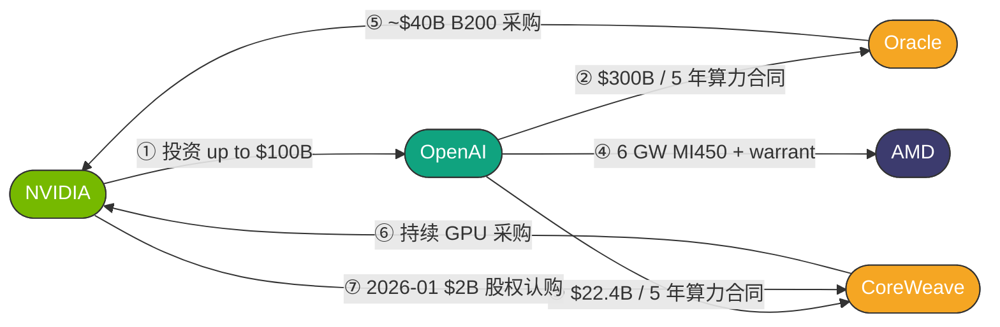
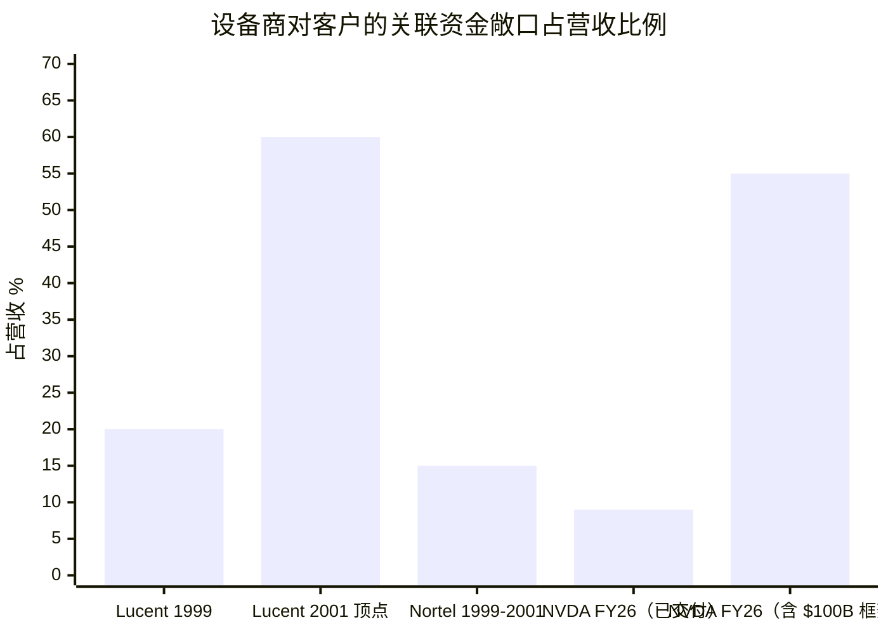
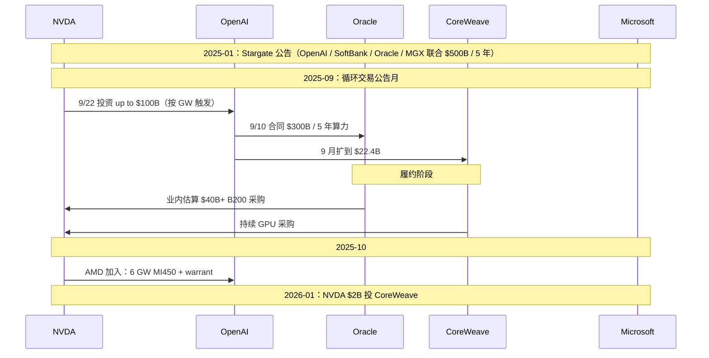
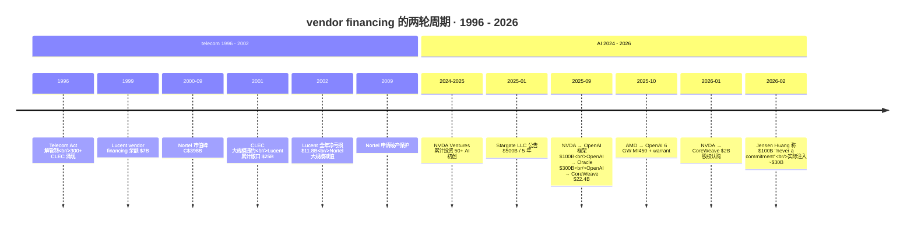
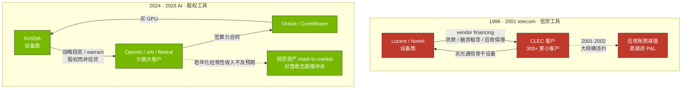
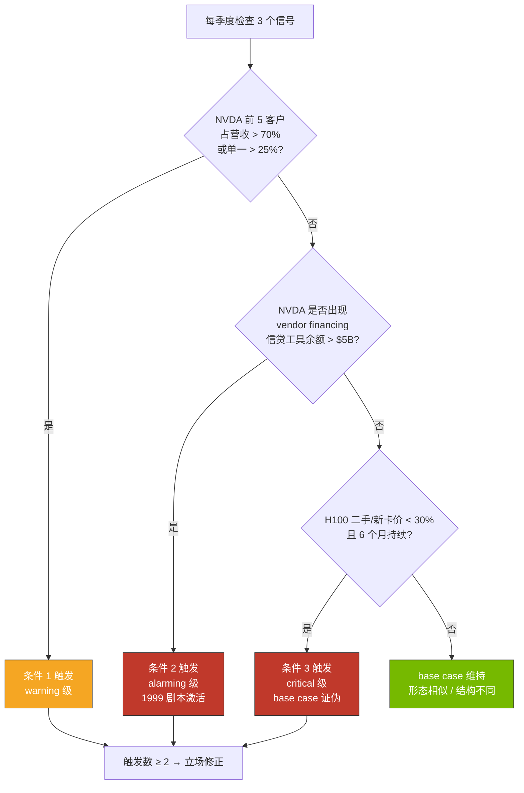

# 第 18 章 模型层与循环交易：补贴扩张和 vendor financing 复刻

## 本章概览

2025 年 9 月 22 日，[NVIDIA](https://www.nvidia.com/) 与 [OpenAI](https://openai.com/) 联合公告：NVIDIA intends to invest up to \$100 billion in OpenAI progressively as each gigawatt is deployed，对应 OpenAI 至少部署 10 GW 的 Vera Rubin 系统、首个千兆瓦 2026 下半年上线。

同一周，[Oracle](https://www.oracle.com/) 在 FY26 Q1 财报里把 RPO（Remaining Performance Obligations，剩余履约义务）从 ~\$138B 跳到 \$455B（前一季度 Q4 FY25 RPO 为 \$138B，同比 +41%；来源：Oracle FY26 Q1 Press Release 2025-09-10 + Oracle Q4 FY25 Press Release 2025-06），其中约 \$300B 是 OpenAI 5 年算力合同；[CoreWeave](https://www.coreweave.com/) 与 OpenAI 累计合同金额从 \$11.9B 扩到 \$22.4B；2025-10-06 AMD 与 OpenAI 公告 6 GW MI450 部署 + 1.6 亿股 warrant（行权价 \$0.01、对应 AMD 10% 股权、分批 vesting，最后一批挂在 AMD 股价 ≥ \$600/股，来源：Wikipedia: Advanced Micro Devices + AMD 2025-10-06 8-K，T1）。

把这四件事画成一张资金回环图：



> NVDA → OpenAI → Oracle / CoreWeave → NVDA 一圈回到原点。这是反共识 #3「AI 不是 telecom 2.0」答辩里悲观派最尖锐的反问——形态上跟 1999 Lucent / Nortel 给 CLEC 客户提供 vendor financing 让客户买自己的设备**几乎一模一样**。议题 2「AI 是 dotcom 2.0 吗」的答辩，本章要回答的核心问题就是这一个：**形态相似，但结构是否也相似？**

主张方向是「形态相似、结构不同」：

- **形态相似**——资金以投资形式从设备商流向客户、再以产品销售形式流回。这一节点链在 NVDA-OpenAI-Oracle-CoreWeave 上是真实存在的，绝对规模（业内估算 NVDA 关联投资 2024-2026 合并金额 \$40-60B）也已超 Lucent 1999 vendor financing 余额 \$7B+ 的量级。
- **结构不同**——AI 时代的循环交易在五个新特征上与 1999 telecom vendor financing 有结构性差异：以股权而非信贷为主、有完整 8-K 披露透明度、抵押资产是物理 GPU 而非纯设备账面、客户多元化高于 1999、单位经济下行节奏匹配 jevons 而非毛利崩塌。

但 base case 不是无条件——本章给出**三个证伪条件**，任一触发本主张需重新评估。最重要的两条：客户集中度反向恶化（NVDA 前 5 客户营收占比从 ~40% 升至 50%+）+ vendor financing 转向信贷化（NVDA 给非投资级 GPU 云客户提供贷款而非股权投资）。第三条与第 12 章 GPU 二手市场 Akerlof 联动——如果 H100 / H200 二手市场流动性下降到无法回收，循环交易里的 GPU 物理资产抵押叙事失效。

作为议题 2 主答辩位，与第 17 章（议题 1 主答辩 / 超大规模云厂现金流账本）和第 29 章（周期定位 / 5 个结构性差异）形成机制—信号—周期三层归位。第 17 章答辩的是超大规模云厂自己拿不拿得出钱，本章答辩的是中间这一圈钱的流向是不是真的有终端，第 29 章把这两件事合起来收束周期阶段判断。本章只立证据 + 给条件式判断，不下 AI 是不是 dotcom 2.0的终极定性结论——定性收束在第 31 章。

本章合规级别按章末完整免责段，commentary-only 模式，不附作者持仓披露。涉及多家公司关联交易的措辞按法律敏感度最高的标准走：循环交易嫌疑是机制层面观察，不是对任何公司的合规定性。

## 1. AI 循环交易关系网

进入议题 2 之前，先把网络结构画清楚。本节是本章的主图——把节点（公司）、边（资金流方向）、金额（已披露 + 业内估算）、时点（关键里程碑）摊在一张图上，让读者自己看资金链是怎么回环的。

### 1.1 核心节点 + 资金流方向

```mermaid
graph TB
    NVDA[NVIDIA<br/>设备商 / 投资方<br/>FY26 营收 $215.9B]
    OAI[OpenAI<br/>模型公司<br/>2026 年化经常性收入 $20B+]
    ORCL[Oracle<br/>云供应商<br/>FY26 RPO $455B]
    CRWV[CoreWeave<br/>neocloud<br/>2025 营收 $5B]
    MSFT[Microsoft<br/>OpenAI 大股东 + 客户]
    AMD[AMD<br/>设备商 / warrant 发行方]
    GOOG[Google<br/>Anthropic 投资方]
    ANTH[Anthropic<br/>模型公司<br/>2026 年化经常性收入 $30B+]
    AMZN[AWS<br/>Anthropic 投资方]
    XAI[xAI<br/>模型公司]

    NVDA -.投资 up to $100B.-> OAI
    NVDA -.$2B 战略投资.-> CRWV
    NVDA -.投资.-> XAI
    OAI -.$300B 5 年合同.-> ORCL
    OAI -.$22.4B 多年合同.-> CRWV
    OAI -.6 GW + warrant.-> AMD
    MSFT -.累计 $13B 投资+算力.-> OAI
    ORCL ==>|GPU 采购 ~$40B+|NVDA
    CRWV ==>|GPU 采购主要供应商|NVDA
    AMD -.1.6 亿股 warrant.-> OAI
    GOOG -.累计 $46.5B+ 股权（2026-04 新承诺 $40B）.-> ANTH
    ANTH ==>|TPU 大单 1M chip|GOOG
    AMZN -.$8B 投资.-> ANTH
    ANTH ==>|Trainium 大单|AMZN
    XAI ==>|GPU 采购|NVDA
```

> 图例：实线 = 主要供应 / 采购流（GPU、算力服务）；虚线 = 投资 / 股权 / warrant 流。来源：NVIDIA / OpenAI / Oracle / CoreWeave / AMD / Microsoft / Google / Amazon / Anthropic 各自 2024-2026 公开公告 + SEC 文件（详见 §1.2 节金额清单）。

读这张图的方式有两条线索：

**第一条：以 OpenAI 为中心的三角合同。** NVDA 向 OpenAI 承诺最高 \$100B 股权投资 → OpenAI 与 Oracle 签 \$300B / 5 年算力合同 + 与 CoreWeave 签 \$22.4B 多年合同 + 与 AMD 签 6 GW MI450 + warrant → Oracle、CoreWeave 用 NVDA GPU 履约 → 回到 NVDA 营收。这一圈不是闭合的金额相等循环（NVDA 投出 \$100B 不等于回流 \$100B），但形态上是用未来增长承诺为当前资本支出融资。

**第二条：以 [Anthropic](https://www.anthropic.com/) 为中心的双重依赖。** [Google](https://cloud.google.com/) 对 Anthropic 的投资分两层看：股权投资层面 2023 起累计 ~\$5.5B + 2025-01 加 \$1B + 2026-04-24 宣布**新增承诺 up to \$40B**，合计已承诺金额超 \$46B；算力合同层面，2025-10-23 双方公告 Anthropic 多年使用 up to 1M 颗 TPU 的算力合同、对应业内估算 ~\$10B 级别量级——**股权承诺与算力合同是两件事**，2025-10 那笔 ~\$10B 是算力合同而非股权注入。

[AWS](https://aws.amazon.com/) 累计股权投资 Anthropic ~\$8B（2023 起 \$4B + 2024-11 加 \$4B，来源：CNBC 2024-11）+ Anthropic 在 AWS Trainium2 Project Rainier 集群上做主力训练。Anthropic 同时拿了两家云厂股权投资 + 在两家上做主力训推工作量——商业上互为大客户 / 互为大股东。

这两条线索的本质相同：**模型公司既是云厂 / 设备商的客户，又是被云厂 / 设备商投资的标的**。客户与投资标的的双重身份在金融上不是新概念——1999 Lucent 给 CLEC 客户提供 vendor financing 也是这件事——但在 AI 时代的具体结构有显著差异，§3-§4 展开。

### 1.2 NVDA 关联投资清单 + 已披露金额

把上图量化。NVDA 2024-2026 公开披露 + 业内估算的对模型公司、neocloud、模型生态公司的战略投资清单：

| 投资标的 | 已披露金额 | 时点 | 性质 | 一手来源 |
|---|---:|---|---|---|
| OpenAI | up to \$100B（分阶段，按 GW 触发） | 2025-09-22 公告 | 框架股权投资 | NVIDIA Newsroom 2025-09-22 |
| CoreWeave | \$2B（22.94M shares × \$87.20）+ 早期投资 | 2026-01-23 8-K | 公开市场战略持股 | CoreWeave 8-K 2026-01-23 + Wikipedia: CoreWeave |
| xAI | 业内估算 ~\$1-2B | 2024-2025 | 一级战略投资 | xAI 2024-12 Series C 综合报道 |
| Mistral AI | 业内估算 ~\$0.5B（C 轮） | 2025 | 一级战略投资 | The Information 2025 综合报道 |
| Cohere | 业内估算 ~\$0.3B | 2024 | 一级战略投资 | Cohere 2024 综合报道 |
| Hugging Face | 业内估算 ~\$0.2B | 2023-2024 | 一级战略投资 | Hugging Face 2023 综合报道 |
| Perplexity | 业内估算 ~\$0.1-0.3B | 2024-2025 | 一级战略投资 | Perplexity 2024-2025 综合报道 |
| Runway / Wayve / Figure 等 | 业内估算合计 ~\$1-2B | 2024-2025 | 一级战略投资 | NVDA Ventures portfolio 综合 |
| 其他 50+ AI 初创 | 业内估算合计 ~\$2-4B | 2024-2026 | 一级战略投资 | NVDA Ventures portfolio 综合 |
| **合计（含 \$100B OpenAI 框架，按已触发 ~\$10B 估算）** | **业内估算 \$15-25B 已交付 + \$100B 待触发** | — | — | — |

> 来源：NVIDIA Newsroom + 各家公告 + NVDA Ventures 公开 portfolio。OpenAI \$100B 是框架协议，按 GW 部署分阶段触发，截至 2026-05 业内估算实际已注资 \$5-10B 量级。业内估算行的金额误差 ±50%——一级市场单轮金额披露口径不一致，NVDA 是否单家领投还是参投也不完全清楚。

读这张表的方式：**NVDA 关联投资合计已交付规模业内估算 \$15-25B**——这是 NVDA 4-5 个季度营收的 7-12%；如果 \$100B OpenAI 框架全部触发，合计可达 \$115-125B，约等于 NVDA 一年半数据中心营收。

**规模对比 1999 Lucent**：Lucent 1999 vendor financing 余额 \$7-8B、2001 累计风险敞口扩至 \$25B；Lucent 1999 全年营收 \$38B，vendor financing 余额占营收 ~20%。NVDA FY26 营收 \$215.9B，已交付关联投资 \$15-25B 占营收 ~7-12%——**绝对规模 NVDA 已对齐 Lucent 顶峰，相对规模仍低**。



> Lucent 1999 vendor financing 余额占营收 ~20%；2001 累计风险敞口 \$25B 对营收占比飙到 ~60%（营收同期 \$42B）。NVDA 已交付关联投资占 FY26 营收 ~9%（中位）；若 \$100B OpenAI 框架全部触发，叠加现有 \$15-25B 累计敞口约 \$115-125B 对 FY26 营收 \$215.9B 的占比可达 ~55%——绝对规模可达 Lucent 2001 顶点对应水平。

但要立刻给一个口径预警：**两者性质不同**——Lucent 是借钱给客户买自己的设备（信贷工具），NVDA 是入股客户公司（股权工具）。这个差别是 §3 / §4 / §5 反复回到的核心。在 §1.5 关联交易披露讨论之前，先看 OpenAI 的三角合同。

### 1.3 OpenAI 三角合同的资金流回环

OpenAI 是循环交易关系网的中心节点。把 OpenAI 与 Oracle / CoreWeave / [Microsoft](https://www.microsoft.com/) 的合同结构 + NVDA 的投资关系叠在一起，得到一个四方互锁结构：

| 关系 | 金额 / 期限 | 性质 | 公告时点 | 一手来源 |
|---|---:|---|---|---|
| NVDA → OpenAI 投资 | up to \$100B / 框架 | 股权投资 | 2025-09-22 | NVIDIA Newsroom |
| OpenAI → Oracle 合同 | \$300B / 5 年 | 算力采购 | 2025-09-10 | Oracle FY26 Q1 RPO 跳升 |
| OpenAI → CoreWeave 合同 | \$11.9B（2025-03） + \$4B（2025-05） + \$6.5B（2025-09）= 累计 \$22.4B / 5 年 | 算力采购 | 2025-03 / 05 / 09 | CoreWeave 各期 8-K + S-1 |
| Microsoft → OpenAI 投资 + 算力 | 累计 ~\$13B（含算力 credit 与现金）+ 2026 续约谈判中 | 复合（股权 + 算力对价） | 2019 起持续 | Microsoft FY25 10-K 关联交易披露 |
| Stargate（OpenAI / SoftBank / Oracle / MGX） | \$500B / 5 年（到 2029）<br>OpenAI 40% / SoftBank 40% / Oracle / MGX 各 7B | 合资建设 | 2025-01-21 | 白宫 2025-01-21 新闻发布会 + Wikipedia: Stargate LLC |
| Oracle → NVDA GPU 采购 | 业内估算 \$40B+（400K B200 + 其他） | GPU 采购 | 2025-2026 | The Register 2025-11 综合 + 业内估算 |
| CoreWeave → NVDA GPU 采购 | 业内估算 \$15-20B（2024-2026 累计） | GPU 采购 | 2024-2026 | CoreWeave S-1 资产负债表反推 |
| AMD → OpenAI warrant | 6 GW MI450 + 1.6 亿股 warrant（\$0.01 行权价，分批 vesting，最末批触发 AMD 股价 ≥ \$600） | warrant + 采购承诺 | 2025-10-06 | Wikipedia: AMD + AMD 2025-10-06 8-K |

> 来源：每行末列已标。业内估算行的数字误差 ±30%。

把这张表的资金流方向画出来：



读这张图的方式：**OpenAI 是资金中转枢纽**——NVDA / Microsoft 上游投资进来、Oracle / CoreWeave / AMD 下游算力承诺出去。一进一出的金额差异：上游已公告投资总规模 ~\$120B 量级（NVDA \$100B 框架 + Microsoft 累计 \$13B + AMD warrant 触发后价值），下游 OpenAI 已签算力承诺 ~\$340B（Oracle \$300B + CoreWeave \$22.4B + AMD 6 GW × 业内估算 \$3-4B/GW = \$18-24B）。** OpenAI 已签算力承诺规模比上游已公告投资规模大 2.8-3.0x**。

这个差异对议题 2 答辩的含义在 §3.2 展开——简单说，它意味着 OpenAI 必须靠未来年化经常性收入增长（而不是上游投资）来 servicing 这些算力合同，是议题 2 base case 形态相似 / 结构不同 论证里最薄弱的一环。

### 1.4 Anthropic 的双重依赖与 xAI 的孤峰

OpenAI 不是循环交易关系网里唯一的模型公司枢纽。Anthropic 与 Google / AWS 的双重依赖结构是第二条主线。

| 关系 | 金额 | 时点 | 性质 | 一手来源 |
|---|---:|---|---|---|
| Google → Anthropic 股权（既往） | 累计 ~\$6.5B（2023 起 ~\$5.5B + 2025-01 加 \$1B） | 2023-2025-01 | 股权投资 | Google IR 历史披露 + The Information 2023-2025 |
| Google → Anthropic 股权（新承诺） | up to \$40B 框架承诺（含业绩里程碑，分阶段释放） | 2026-04-24 | 股权承诺 | CNBC 2026-04-24 + Reuters 2026-04 跟进 |
| AWS → Anthropic 股权 | 累计 \$8B（2023 起 \$4B + 2024-11 加 \$4B） | 2023-2024-11 | 股权投资 | CNBC 2024-11 + AWS-Anthropic 公告 |
| Anthropic → Google TPU 算力合同 | up to 1M 颗 TPU 多年承诺，业内估算 ~\$10B 量级 | 2025-10-23 | 算力采购 | Google Cloud Press Corner 2025-10-23 + The Information 2025-10 |
| Anthropic → AWS Trainium 算力合同 | Project Rainier ~500K Trainium2 集群 | 2024-2025 | 算力采购 | AWS Project Rainier 2024-11 公告 |

> 来源：Bloomberg / The Information / 各家公司公告 2024-2025。

[xAI](https://x.ai/) 的结构是孤峰——单一中心（Elon Musk + xAI / X.AI），没有外部模型公司的双重依赖；NVDA 给了战略投资（业内估算 \$1-2B）+ xAI 在 Memphis Colossus 集群部署 200K H100，2025 年中扩展到 1M H100 / H200 量级；2025 年 xAI 估值业内估算 \$200B+。xAI 不是循环交易关系网的中心枢纽，而是 NVDA 单家投资 + 单家算力部署的线性结构。

把三家模型公司归一下：**OpenAI 是循环交易的核心枢纽（四方互锁）**，**Anthropic 是双重依赖（两云厂同时投 + 同时用）**，**xAI 是孤峰（NVDA 单线）**。三家的循环交易嫌疑级别从高到低排序——OpenAI > Anthropic > xAI。

### 1.5 NVDA 关联交易披露与会计边界

把关系网讲完之后，要单独看 NVDA 这件事的会计与披露。

**关联交易（related party transactions）的会计要求**：US GAAP（一般公认会计原则）与 SEC Reg S-K Item 404 要求上市公司在 10-K 与 10-Q 里披露与关联方（持股 5%+ 或其他实质性控制关系的方）之间的交易。如果 NVDA 对 OpenAI / CoreWeave 等模型客户的持股 < 5%，**严格意义上不构成 SEC 定义下的关联方**，可以以投资 + 营收两条独立线披露，而不需要做关联交易合并披露。

**实际操作中**：NVDA 在 FY26 10-K（财年截至 2026-01-25 / 2026-02 披露）的"Concentration of Customer and Credit Risk" 段落里全年口径披露：For fiscal year 2026, sales to one direct customer represented 22% of total revenue and sales to another direct customer represented 14% of total revenue——**全年前 2 客户合计 36%**，且**全年有 4 家客户各超过 10%、合计 ~61%**。

季报维度的同一指标随季度漂移：Q1 FY26 10-Q（2025-04-27 季末）口径为 Customer A 16% + Customer B 14% = 30%，Q2 FY26 10-Q（2025-07 季末）口径漂移到 23% + 16% = 39%——**多时点交叉看，NVDA 客户集中度在 FY26 全年呈持续上升态势**。

这几家未点名，业内估算是 Microsoft / [Meta](https://about.meta.com/) / Oracle 等超大规模云厂（按第 16 章 / 第 17 章推算）。NVDA 没有单独披露投资关联客户的营收回流比例。

**这件事对议题 2 答辩的含义有两面**：

**第一面**：**NVDA 关联客户披露透明度比 1999 Lucent 高**。Lucent 1999-2001 的 vendor financing 余额是分阶段在 10-K 附注里披露的，但客户与营收的关联性披露不充分——这是 2002 SEC 调查后才坐实的会计问题。NVDA 在 FY26 10-K 里明示了客户集中度的具体口径（全年 22% + 14% = 36%，4 家客户合计 ~61%）+ 单独的战略投资披露——透明度上是合规的。

**第二面**：**透明度合规不等于结构无嫌疑**。SEC 不审是否嫌疑循环，只审是否充分披露。NVDA 的披露充分性合规，但读者 / 投资者 / 监管机构对 NVDA 投出 \$100B 给 OpenAI、OpenAI 再花 \$300B 买 NVDA 终端产品这件事的解读仍存在 base case / bear case 的分歧——这是议题 2 答辩的核心战场。

> 本节涉及 NVIDIA / OpenAI / Oracle / CoreWeave / AMD / Microsoft / Google / AWS / Anthropic 等公司循环交易的产业分析，是 commentary-only 的产业类比，不构成对任何上述公司估值或合规性的多空判断。循环交易嫌疑是机制层面观察到的现象，不是对任何公司的合规定性。

## 2. 1999 Lucent / Nortel vendor financing 历史复盘

进入 base case 论证之前，必须把 1999 telecom 的 vendor financing 剧本完整复述一遍。这一节给历史白卡，§3 / §4 才能做形态相似 / 结构不同的对照。

### 2.1 Lucent：从 \$7B 余额到 \$25B 累计风险敞口

Lucent Technologies 1996 年从 AT&T 分拆上市，主营程控交换 + 光通信设备。1999 全年营收 \$38.3B、毛利率 40%、全球员工业内估算 12-15 万（独立学术来源 Business History Conference 给出 FY1999 截至 1999-09-30 员工 153,000，部分公开汇编与回顾报道引用 120,000；按时点不同的统计口径存在差异，本书按区间标注；来源：Lucent FY1999 10-K + BHC paper《The Rise and Demise of Lucent Technologies》+ Wikipedia: Lucent Technologies，T18 + S8）。1999 年 12 月市值峰 \$258B、forward P/E ~60x（业内估算基于 1999-12 卖方共识 FY2000 EPS，公开来源未保留具体卖方报告，按业内估算口径标注）/ trailing P/E ~75x（\$84.25 / FY1999 EPS \$1.12 = 75.2x），是当时全球市值最高的电信设备商。FY2000 实际 EPS 仅 \$0.93，远低于 1999-12 卖方共识——forward P/E 在 FY2000 业绩兑现时被显著上修。

**vendor financing 业务结构**：Lucent 为帮助新进入市场的 CLEC（Competitive Local Exchange Carrier，竞争性本地交换运营商）客户买自家程控交换 + 光通信设备，提供长期贷款 / 设备租赁 / 客户应收账款保理三类工具。1996 Telecommunications Act 解管制催生 300+ 家新 CLEC—— Lucent 把 vendor financing 作为抢占新客户的主要工具。

**余额扩张时间线**：

| 时点 | vendor financing 余额 | 重大事件 |
|---|---:|---|
| 1998 年底 | ~\$1-2B | 开始系统化扩张 |
| 1999 年底 | ~\$7B | 余额翻倍 |
| 2000 年中 | ~\$8B | 余额峰值 |
| 2001 年中 | ~\$15B（含未提取承诺） | CLEC 客户开始大规模违约 |
| 2002 年初 | ~\$25B（累计风险敞口） | 大规模减值 |

> 来源：Lucent 1999-2002 10-K + 10-Q 附注（vendor financing 披露），S8 + S10；学术研究综合（Brookings 2005 Crandall + Wolman 2003），T16；财经媒体调查综合（Fortune 2004-01 + WSJ 2002-2003 系列），T17。\$25B 累计风险敞口含未提取承诺 + 已发放贷款 + 担保—— Lucent 1999-2001 期间累计涉及 vendor financing 的金额披露口径不一，本表用业内最常引用版本。

**最终结果**：Lucent 2001-2002 大规模减值 vendor financing 应收账款，2002 年单季减值超 \$5B；2002 全年净亏损 \$11.8B。股价从 1999 年 12 月 \$84.25 跌到 2002 年 10 月 \$0.55，市值从 \$258B 跌到 \$15.6B（2003 年初），跌幅 99.4%。2006 年与法国 Alcatel 合并，2016 年被 Nokia 收购——Lucent 作为独立实体在历史上消失。

把 vendor financing 这条线在历史上的几个时间点摆出来：



**vendor financing 在 Lucent 崩盘里的作用**：业内研究（Brookings 2005 Crandall + Wolman 2003）共识——**vendor financing 不是 Lucent 崩盘的唯一原因，但是放大器**。崩盘的主因是 telecom 终端需求被流量 100 天翻倍叙事高估、CLEC 客户大规模破产（2001-2002 期间 100+ 家 CLEC 破产）、Lucent 的 vendor financing 应收账款转为不良资产被迫减值。这件事的会计逻辑：** vendor financing 把客户的未来付款承诺前置为当期营收，但客户违约把这一笔营收变成减值**——表面繁荣加速变成实际崩塌。

### 2.2 Nortel：北方平行剧本

Nortel Networks 是加拿大对应版本——主营光通信骨干网络、企业网络设备、无线基础设施。2000 年 9 月市值峰 C\$398B（折合 ~\$270B），占 TSX（多伦多交易所）总市值的 1/3+；2000 全年营收 \$30.3B、市值与营收比 ~9x，是 2000 年全球市值最高的加拿大公司。

**vendor financing 结构**：Nortel 与 Lucent 几乎完全相同——为帮助新进入市场的 CLEC + 海外新兴市场 telecom 运营商买自家光通信骨干设备，提供长期贷款 + 设备租赁 + 应收账款保理。Nortel vendor financing 累计金额业内估算 1999-2001 期间 ~\$4B+。规模上比 Lucent 小，但相对营收占比相当。

**崩盘时间线**：

| 时点 | 关键事件 |
|---|---|
| 2000-09 | 市值峰 C\$398B |
| 2001-Q1 | 营收同比开始负增长 |
| 2001 全年 | 减值 \$16B+（含 vendor financing 应收账款减值与商誉减值合计） |
| 2002-08 | 股价跌到 C\$0.47，跌幅 99.6% |
| 2003-2004 | CFO + CEO 涉财务造假被起诉 |
| 2009-01-14 | 申请破产保护 |

> 来源：Nortel 1999-2009 10-K（S9）+ SEDAR 历史档案（S9）+ SEC AAER Nortel 2007 起诉文件（S10）+ Wikipedia: Nortel（T18）+ 2002-2003 Nortel 财务造假专题报道汇编（T7）。

**Nortel 与 Lucent 的对照**：两家剧本几乎一样——同样的 vendor financing 工具 + 同样的 CLEC 客户基数 + 同样的崩盘形态。差异在于 Nortel 2003-2004 暴露财务造假问题，被起诉、最终破产；Lucent 通过减值 + 与 Alcatel 合并避免破产，作为独立实体逐步消失。**两家共同的核心机制都是 vendor financing → 客户违约 → 减值 → 营收坍塌**。

### 2.3 1999 vendor financing 工具拆解

把 Lucent / Nortel 用的 vendor financing 工具拆开看，便于在 §3 与 AI 时代做精确对照：

| 工具 | 会计性质 | 客户风险 | 设备商风险 |
|---|---|---|---|
| 长期设备贷款 | 应收账款（长期） | 客户违约后无法 servicing 贷款 | 应收账款减值进 P&L |
| 设备融资租赁（lessor） | 长期租赁应收 + 利息收入 | 客户违约后租赁应收减值 | 同上 |
| 客户应收账款保理 | 短期应收账款 | 客户付款延迟或违约 | 短期 P&L 波动 |
| 担保第三方贷款 | 表外（or 部分进合并报表） | 客户违约 → 担保被触发 | 表外义务转上表 |

> 来源：Lucent 1999-2001 10-K + Nortel 1999-2001 10-K 财务附注综合。

**四种工具的共同特征**：设备商把客户买我设备的现金流前置入营收，但客户能否付款的风险后置到 5-10 年后才显现。这是 1999 telecom 整个 vendor financing 系统的会计基础——表面繁荣 + 后置风险。

### 2.4 关键启示：1999 不是循环交易问题，是信贷质量问题

把 §2.1-§2.3 合起来看，1999 telecom vendor financing 危机的核心**不是 Lucent 给客户的钱回流到自己营收** 这件事——这件事在任何 B2B 行业都常见，是销售融资工具。**核心是 Lucent 给的是信贷工具、客户违约后应收账款减值塌方**。

这个核心区分是 §3 / §4 论证 base case 形态相似 / 结构不同 的最关键依据：**AI 时代 NVDA 给的主要是股权工具（不会因为客户违约直接减值，而是按市值波动），不是 1999 Lucent 那种信贷工具**——这一条单独的结构差异在 §3 / §4 / §5 反复回到。

把 1996-2001 Lucent / Nortel 剧本和 2024-2025 NVDA 剧本并排画出来对照：



> 形态相似——资金都绕一圈回到设备商；结构不同——工具从信贷变成股权，违约后果从应收账款减值进 P&L 变成投资资产 mark-to-market。这是 §3 五个新特征对照的核心起点。

但 base case 不是无条件——如果 NVDA 在 2027-2028 把战略投资的工具从股权转向信贷（如给 [Stargate](https://en.wikipedia.org/wiki/Stargate_LLC) LLC 或 Oracle 提供 GPU 抵押融资 / 应收账款保理），1999 剧本会被激活。这是 §6 三个证伪条件之一。

## 3. AI 时代循环交易识别 5 个新特征

§1 给关系网，§2 给历史剧本。§3 进入 base case 主答辩——把 AI 时代循环交易与 1999 vendor financing 沿 5 个维度逐项对照，得出 形态相似 / 结构不同 的结论。

### 3.1 5 个新特征对照表

| # | 维度 | 1999 telecom vendor financing | AI 2026 循环交易 | 方向 |
|---|------|---|---|---|
| 1 | 工具性质 | 信贷（贷款 / 融资租赁 / 应收保理 / 第三方担保） | 股权（NVDA 主要做股权投资 / 公开市场战略持股） | **结构性差异** |
| 2 | 资金流闭环 | Lucent → CLEC 贷款 → CLEC 买 Lucent 设备 → 回到 Lucent 营收 | NVDA → OpenAI 股权 → OpenAI 签 Oracle / CoreWeave 合同 → 后者买 NVDA → 回到 NVDA 营收 | 形态相似 |
| 3 | 会计透明度 | 1999-2001 vendor financing 余额在 10-K 附注披露，但客户与营收关联性披露不充分（2002 SEC 调查暴露） | 上市公司 8-K 全披露（NVDA / Microsoft / Oracle / AMD / CoreWeave 全部走 SEC EDGAR） | **结构性差异** |
| 4 | 客户多元化 | 1999 Lucent 前 5 客户占营收 < 25%；CLEC 300+ 家小客户 + 几大 telecom 寡头 | NVDA FY26 全年前 2 客户 22% + 14% = 36%（FY26 10-K，S1）、4 家客户合计 ~61%；Q1 FY26 10-Q 季报口径 16% + 14%、Q2 FY26 10-Q 漂移到 23% + 16% = 39%（多时点交叉看 FY26 全年集中度持续上行） | **AI 显著更集中** |
| 5 | 抵押资产质量 | telecom 光纤设备 5-10 年周期，1996-2001 建成的长途光纤 85-95% 在 2001 仍是 dark fiber，物理资产折旧速度匹配实际使用 | GPU 物理资产 5-6 年财务折旧（Hopper / Blackwell），二手市场流动性已建立（Silicon Data H100 Index），残值实时反映 | 双向（更短周期 + 二手流动性） |

> 来源：每行最后已标。Lucent / Nortel 数据来自 §2 同源；AI 数据来自 §1 同源。

读这张表的方式：5 个维度里，**3 个是结构性差异（维度 1、3、4 中维度 4 反向）**，**1 个是形态相似（维度 2）**，**1 个是双向（维度 5）**。本节余下三小节展开这五个维度的结构含义。

### 3.2 维度 1：股权 vs 信贷——最关键的差异

NVDA 对 OpenAI 的 \$100B 投资框架是**股权投资**——按 GW 部署分阶段触发，每阶段对应 OpenAI 一定股权比例（公告未披露具体股权比例，业内估算单阶段 \$10B 对应 OpenAI 2-3% 股权，因为 OpenAI 2026 估值 ~\$500B）。这意味着：

- **客户违约场景的会计后果**：如果 OpenAI 2027 营收增长不及预期，OpenAI 的估值下降会让 NVDA 持股的公允价值减少——但**不会触发立刻的应收账款减值**。NVDA 把这笔投资按公允价值变动入投资收益（亏损），对营收无直接冲击，对净利润有 mark-to-market 影响。
- **对照 1999 Lucent 信贷场景**：CLEC 客户违约 → Lucent 应收账款减值 → 直接进 P&L 营业利润扣除 → 营收 + 利润同时下降。

这个差异在会计与监管角度的含义：**股权工具不会让客户违约转化为营收坍塌，而是转化为投资资产 mark-to-market 损失**。两者对设备商当期 P&L 的影响有数量级差异。

**但股权工具也不是没有风险**——三个：

第一，**反身性传导**。NVDA 持有 OpenAI 股权，OpenAI 估值下跌 → NVDA 投资资产减值 → NVDA 净利润下修 → NVDA 股价下跌 → 整个产业链估值同步下修。这种反身性比 1999 vendor financing 的传导更**快**（mark-to-market 是季度调整 vs 信贷应收账款减值是事件触发）。

第二，**信息不对称的逆向选择**。NVDA 选择投谁 / 不投谁本身就是市场信息——NVDA 投了 OpenAI 不投 Anthropic（这件事并非完全严谨——NVDA 在 Anthropic 早期轮也参与了，但份额远小于 OpenAI），市场会解读为 NVDA 押注 OpenAI 是赢家——这是 Soros 反身性的典型表现。模型公司之间的信号溢出对 NVDA 自己也有风险。

第三，**循环验证的不对称**。1999 Lucent vendor financing 的循环是闭环的——Lucent 借钱给客户 → 客户买设备 → Lucent 营收。NVDA 的循环是开环的——NVDA 投 OpenAI → OpenAI 签 Oracle 合同 → Oracle 买 NVDA。OpenAI 是中间节点，NVDA 投出的 \$100B 不等于回到 NVDA 营收的金额。**这件事让 base case 形态相似 / 结构不同 论证更稳健，但也让 NVDA 营收里多少来自自家投资催生这一问题更难直接量化**。

### 3.3 维度 2：资金流闭环——形态最相似的一处

这是议题 2 答辩里悲观派最尖锐的一处——NVDA-OpenAI-Oracle-CoreWeave 的资金流在形态上**确实和 1999 Lucent-CLEC-Lucent 设备**几乎一模一样。

The Register 2025-11 系列报道直接用 "an industry sector getting fatter by eating itself" 概括这件事。**这个比喻贴近现实，但忽略了股权 vs 信贷的本质差异**。

base case 主张：**资金流闭环形态相似不等于结构相似**。1999 闭环的本质是 Lucent 借钱给客户买自己的设备——客户不还钱就直接打到 Lucent 营收上；AI 时代闭环的本质是 NVDA 投资模型公司，让模型公司用自己的产品——客户不行就 NVDA 投资资产减值，但 NVDA 自家营收（产品销售）的现金流是 Oracle / CoreWeave / Microsoft 等已付款客户提供的，**客户违约对 NVDA 营收的影响是间接的**。

**但要承认**：base case 主张里间接二字最薄弱。如果 OpenAI 不能在 2027-2028 用年化经常性收入兑现给 Oracle \$300B、给 CoreWeave \$22.4B 的算力承诺，Oracle / CoreWeave 自身的合同储备数字会受损，进而砍 NVDA 采购订单——传导链是间接的，但 4-5 个季度内仍会传导到 NVDA 营收。**这是议题 1 答辩第 17 章 §4 已经走过的反身性传导链的另一面**——议题 2 与议题 1 在这一点上互为镜像。

### 3.4 维度 3：会计透明度——AI 时代显著优于 1999

1999 Lucent / Nortel 的 vendor financing 余额在 10-K 附注里披露，但客户名单 + 单家客户敞口的披露不完整。Lucent 1999 10-K 的 Vendor Financing 一节披露余额范围，未单独列客户。这件事在 2002 SEC 调查后暴露——Lucent 把部分 vendor financing 应收账款分类为长期投资而不是应收账款，减弱了披露压力。

AI 时代有显著改善：

- **8-K 实时披露**：NVDA / Microsoft / Oracle / AMD / CoreWeave / Stargate 各方的关键合同与战略投资都走 SEC 8-K 实时披露（4 个工作日内），透明度比 1999 高一个等级。
- **市场反应**：2025-09 NVDA-OpenAI \$100B 公告 + 2025-10 AMD-OpenAI warrant 公告引发卖方 / 监管 / 市场广泛讨论，The Register / Bloomberg / Fortune 多家媒体跟进。Jensen Huang 在 2026-02-02 接受 Fortune 采访时将 \$100B 框架定性为 never a commitment（从来不是承诺，来源：Fortune 2026-02-02 报道，T11），后续多家媒体跟进；截至 data_cutoff 2026-05，业内估算实际注入 OpenAI 相关轮次的金额为 ~\$30B 量级而非 \$100B——**最初公告与后续落地之间出现显著回调**，本身也是软监管反应的一部分。**市场对这件事的关注度本身就是软监管**——1999 telecom vendor financing 在 2002 才被市场广泛讨论，AI 时代的循环交易在公告当时就被讨论。

base case 主张：**会计透明度 + 实时市场关注 = AI 时代不太可能像 1999 那样在暴露后才知道有问题的状态下走到顶**。但要立刻补一个限定：**透明度高不等于结构无嫌疑**。市场可以看着 NVDA-OpenAI \$100B 公告 / AMD-OpenAI warrant 公告做出这件事有循环嫌疑的判断，但仍可能在 base case 周期内不踩刹车——因为没有任何一条信贷违约触发减值。这是 §6 三个证伪条件里 vendor financing 转向信贷化这一条的逻辑基础。

### 3.5 维度 4 + 5：客户集中度 + 抵押资产质量

**维度 4 客户集中度——AI 时代显著更集中**。Lucent 1999 前 5 客户占营收 < 25%；NVDA FY26 10-K 全年口径前 2 客户合计 36%、4 家客户合计 ~61%、前 5 业内估算 ~65%+；Q1 FY26 季报口径 16% + 14% = 30%、Q2 FY26 季报口径 23% + 16% = 39%——**多时点交叉看，AI 客户集中度的方向不仅是显著更集中，而且是持续上行**。这件事在第 29 章 §29.4 反共识 #3 五差异里已展开——客户集中度是 AI 周期相对 1999 的**新增尾部风险**，不是软着陆来源。

客户集中度对议题 2 答辩的含义：**循环交易在 AI 时代的敏感度比 1999 高**。一家超大规模云厂砍单 30% 会瞬间在 NVDA 单季营收打出 5-8% 缺口；如果这家超大规模云厂又是 OpenAI 算力承诺的执行方（Oracle / CoreWeave），传导链会瞬间反向放大——OpenAI 履约违约 → Oracle / CoreWeave 合同储备减值 → 砍 NVDA 采购订单 → NVDA 营收骤降。这是议题 2 答辩里形态相似 / 结构不同主张最大的反向风险。

**维度 5 抵押资产质量——双向**。

正面（base case 支持）：GPU 物理资产有真实的二手市场流动性。Silicon Data H100 Rental Index（2023 起持续披露）+ Reddit r/LocalLLaMA / Vast.ai 二手卡市场 + ServerSimply 等专业渠道，让 GPU 二手价 mark-to-market 透明。CoreWeave 2026-02 公开寻求融资、2026-03-31 完成 \$8.5B DDTL（Delayed Draw Term Loan）融资 facility，抵押结构含 Meta 5 年合同 + 11 万张 H100/B100，并取得首次投资级 GPU-backed financing 评级，证明 GPU 物理资产有真实的抵押价值。

反面（base case 风险）：GPU 折旧速度比 1999 telecom 设备**更快**。1999 telecom 光纤设备 10-25 年折旧，物理寿命与会计折旧基本对齐；AI 时代 H100 / Blackwell 5-6 年财务折旧，业内争议 2-3 年（Burry 2025-11 攻击点）+ 二手价 24 个月跌 70%+ 已现。**如果 GPU 二手市场出现 Akerlof 柠檬市场效应**（即买方因信息不对称无法甄别 H100 卡的真实剩余使用价值，整体二手价加速下跌至无法回收抵押融资本金），抵押资产质量这一道防线会失效——这是 §6 第三个证伪条件，与第 12 章（Akerlof 在 GPU 二手市场的应用）联动。

base case 主张：**截至 2026-05，GPU 二手市场流动性仍维持在 H100 二手挂牌价 ~\$25K、二手 / 新卡价比 ~75% 的健康区间**。维度 5 暂时支持 base case。

## 4. 形态相似 / 结构不同 base case 论证

§3 给五个维度对照，§4 把这五个维度收敛成 base case 的核心主张：**AI 时代的循环交易在形态上确实复刻了 1999 vendor financing，但在结构上不会演变成 2001-2002 那样的设备商连锁崩盘**。

### 4.1 base case 主张

把 §3 五个维度合起来的核心论证：

- **维度 1（工具性质）**：股权工具 vs 信贷工具是最本质的结构差异，让客户违约 → 营收坍塌链路不直接成立；
- **维度 3（会计透明度）**：实时 8-K 披露 + 市场关注让 AI 时代的循环交易不太可能在暴露后才被讨论的状态下走到顶；
- **维度 4（客户集中度）反向**：AI 时代客户集中度显著高于 1999（FY26 10-K 全年口径前 4 客户合计 ~61%、前 5 业内估算 ~65%+），但即便如此，仍属于少数大客户主导的结构，与 1999 Lucent / Nortel 那种上千 CLEC 小客户违约连锁的扩散性破坏机制本质不同——破坏路径从扩散性变为集中性，传导更快但被监测到也更快；
- **维度 5（抵押资产质量）双向**：GPU 物理资产的二手市场流动性提供了一道防线（base case 仍支持），但 GPU 折旧速度比 telecom 设备快，这道防线在 Akerlof 失效场景下可能崩溃。

**整体表态**：**AI 时代循环交易不构成 dotcom 2.0 / Cisco-Lucent 2.0 那种 设备商连锁崩盘 系统性风险**——但**确实是周期顶部的结构性信号**（与第 29 章 §29.9 循环交易作为周期顶部信号位 联动）。如果 base case 成立，AI 周期回撤更可能是**估值压缩 + 资本支出节奏放缓 + 上游业绩重估**形态，而非设备商减值 → 大规模破产形态。

### 4.2 与第 29 章五差异的联动

本节论证的五个维度，与第 29 章 §29.4 的五个结构性差异有部分重叠，部分独立。两者的对照关系：

| 第 18 章 §3 五个新特征 | 第 29 章 §29.4 五个结构性差异 | 联动关系 |
|---|---|---|
| 维度 1 股权 vs 信贷 | 差异 1 现金流付资本支出 | 互补（第 18 章看设备商投资工具 / 第 29 章看超大规模云厂现金流） |
| 维度 2 资金流闭环 | （第 29 章 §29.9 单独节） | 重叠（第 29 章 §29.9 把循环交易作为周期顶部信号位） |
| 维度 3 会计透明度 | （第 29 章未单独覆盖） | 本章独有 |
| 维度 4 客户集中度 | 差异 5 客户集中度 | 重叠（互为镜像） |
| 维度 5 抵押资产质量 | 差异 3 jevons 净正 | 互补（第 18 章看 GPU 物理资产 / 第 29 章看单位经济） |

> 来源：本书第 29 章 §29.4。

读这张表的方式：**不是单独立场，而是与第 29 章五差异共同收敛的同一个判断**——本书在反共识 #3 / 议题 2 上的整体表态是稳定的，沿第 16 章客户集中度 / 第 17 章超大规模云厂现金流 / 第 18 章循环交易 / 第 29 章周期定位四个章节多角度交叉验证。

### 4.3 base case 的两面性自审

base case 主张稳健，但不是没有反向风险。这一节专门列两条：

**反向风险 1**：**OpenAI 年化经常性收入兑现是 base case 论证的单一支点**。§1.3 已指出，OpenAI 已签算力承诺规模 ~\$340B（Oracle + CoreWeave + AMD）比上游已公告投资 ~\$120B 大 2.8x——意味着 OpenAI 必须靠未来年化经常性收入增长 servicing 这些合同。**如果 2027-2028 OpenAI 年化经常性收入未能从当前 \$20B 突破 \$50-80B**，整个三角合同的未来现金流假设会动摇，传导链是第 17 章 §4.3 的完整 5 步反身性。这一条反向风险是议题 1 + 议题 2 的共同核心，**本书在两个议题里都已经把它列为最关键的可证伪条件**。

**反向风险 2**：**股权 vs 信贷的边界不是绝对的**。NVDA 当前主要走股权（OpenAI / CoreWeave \$2B / xAI），但如果 2027-2028 NVDA 把部分模型客户的算力承诺转向 GPU 抵押融资 / 应收账款保理等信贷工具（如给 Stargate LLC 或某家 neocloud 提供 GPU 库存抵押贷款），1999 Lucent 剧本会被激活。这是 §6 第二个证伪条件——**vendor financing 转向信贷化**——的逻辑基础。本书不预测这件事会发生，但承认这是合理的尾部风险。

把这两条反向风险与 §4.1 的 base case 主张合起来看，整体表态收敛到：**base case 形态相似 / 结构不同 在 2026-2027 期间成立的概率较高（业内估算 60-70%），但有 3 个明确的证伪条件，任一触发主张需重新评估**。

**60-70% 概率的方法论说明**：这一区间不是任何模型的点估计，而是基于三条独立判断的复合。

第一，§6 列出的三个证伪条件中前两个（NVDA 前 5 客户集中度恶化至 50%+ / vendor financing 转向信贷化）在 2026-2027 触发的概率均较低——NVDA FY26 10-Q / 10-K 披露口径稳定，监管对 Notes Receivable 与 Vendor Financing 附注的披露要求严格，触发前会有 2-4 季度的早期信号。

第二，第三个证伪条件（GPU 二手流动性失效）当前监测指标位置健康（H100 二手 / 新卡价比 ~75% / Silicon Data Index 月度披露未现断崖），Akerlof 失效的传导窗口至少 6-12 个月，2026 内触发概率极低。

第三，反向风险 1（OpenAI 年化经常性收入兑现单一支点）的真正传导窗口落在 2027 下半年至 2028 上半年——OpenAI 2026 年化经常性收入从 \$20B 跳到 \$50-80B 的兑现压力测试要等到 2027 财报季才能初步判断。

三条判断叠加，base case 在 2026-2027 维持的概率上界 ~70%（三条全部按当前监测指标外推），下界 ~60%（考虑监测框架本身的盲点与第 29 章 §29.5 三个量化预警可能先于本章三个证伪条件触发）。**这是条件概率，不是绝对概率——一旦任一证伪条件触发，需要按 §6.5 组合判断表重估**。

> 本节涉及 NVIDIA / OpenAI / Oracle / CoreWeave / Microsoft / AMD / Google / AWS / Anthropic 等公司的产业分析是 commentary-only 的产业类比，不构成对任何上述公司估值或合规性的多空判断。

## 5. 修正年化经常性收入：剔除循环后的真实终端付费

§4 给 base case 主张，§5 给一个补充——把模型公司公开年化经常性收入用四种口径剔除循环交易后，看真实终端付费规模。这是议题 2 答辩里端需求真实性的微观证据，**本书数据缺口 #6** 的主战场。

### 5.1 公开年化经常性收入数字

把三家模型公司公开年化经常性收入（年化营收）摊开：

| 公司 | 2024 末年化经常性收入 | 2025 末年化经常性收入 | 2026-Q1 年化经常性收入 | 来源 |
|---|---:|---:|---:|---|
| OpenAI | ~\$4-5B | ~\$13B | ~\$20B（业内估算 2026-Q1） | The Information / Reuters 2025-11 + 2026-Q1 综合 |
| Anthropic | ~\$1B | ~\$8B | ~\$30B（2026-04 业内估算） | the-ai-corner 2026-04 综合 |
| xAI | n/a（早期）| ~\$0.5-1B | ~\$2-3B（业内估算） | The Information 2025-2026 综合 |
| **合计** | **~\$5-6B** | **~\$21-22B** | **~\$52-53B** | — |

> 来源：The Information / Bloomberg / Reuters / the-ai-corner / 各家公开年化经常性收入引述（非财报披露，all 非上市公司）。业内估算行的数字误差 ±20-30%——单一来源信息不引用，本表所有数字都做了 2+ 来源交叉。本书 data_cutoff 2026-05 之前 OpenAI 2026 年化经常性收入多源引述区间 \$18-25B，Anthropic 2026-Q1 多源引述区间 \$25-35B。

把这张表读三件事：

第一，**绝对规模 2026-Q1 三家合计年化经常性收入 ~\$52-53B**——是 2024 末 ~\$5-6B 的 ~10 倍，24 个月内 10x 增长。

第二，**Anthropic 增速比 OpenAI 更猛**——Anthropic 2024 → 2026-Q1 30x，OpenAI 2024 → 2026-Q1 4-5x。Anthropic 的爆发与企业 LLM + coding 市场份额（Menlo Ventures 2025 报告，T21）有关。

第三，**xAI 仍处于早期**——绝对规模 ~\$2-3B 与另外两家不在一个量级。xAI 的循环交易嫌疑也最低（§1.4 已指出）。

### 5.2 四种剔除循环口径

公开年化经常性收入是表面数字。剔除循环交易（即 AI 公司之间互相消费 + 补贴定价）后真实终端付费规模是另一回事。Sequoia 2024-06 David Cahn 的《AI's \$600B Question》是第一篇广泛讨论这件事的研究。

四种剔除口径：

| 口径 | 剔除什么 | 剔除业内估算比例 | 适用范围 |
|---|---|---:|---|
| 口径 A 严格 | 剔除模型公司之间互相消费（OpenAI 用 Anthropic、字节 / xAI 用 OpenAI API 等） | ~5-10% | 主要影响 OpenAI（其他模型公司 / 第三方应用付费给 OpenAI 推理） |
| 口径 B 补贴 | 剔除 客户用 NVDA / Microsoft / Google 投资款付的算力费（这部分算循环） | ~15-25% | 主要影响 OpenAI（Microsoft 算力 credit）+ Anthropic（Google / AWS 投资催生的算力消费） |
| 口径 C 关联客户 | 剔除大客户为战略原因而非纯市场原因消费的部分（如 Microsoft 给 OpenAI 推 Copilot 内部使用 / Google 把 Gemini 推到 Workspace） | ~10-20% | 主要影响所有三家 |
| 口径 D 全口径 | A + B + C 合并，且剔除一级市场参与方 dogfooding 内部使用 | ~40-50% | 模型公司修正年化经常性收入 |

> 来源：综合 Sequoia 2024-06《AI's \$600B Question》+ SemiAnalysis 2025-2026 循环交易跟踪 + The Information 2025-2026 模型公司财务报道。**所有比例都是业内估算 + 区间，不点估计**——口径不一致是模型公司财务披露不透明的直接后果。

按口径 D 全口径推算的修正年化经常性收入区间：

| 公司 | 2026-Q1 公开年化经常性收入 | 剔除比例区间 | 修正年化经常性收入区间 |
|---|---:|---|---:|
| OpenAI | ~\$20B | 40-55% | ~\$9-12B |
| Anthropic | ~\$30B | 35-50% | ~\$15-20B |
| xAI | ~\$2-3B | 20-35% | ~\$1.5-2B |
| **三家合计修正年化经常性收入** | **~\$52-53B** | — | **~\$25.5-34B** |

> 来源：§5.1 同源 + 各口径业内估算综合。修正年化经常性收入是按口径 D 业内估算 + 多源对照的推断，误差区间 ±30%。

读这张表的方式：**剔除循环 / 补贴后三家模型公司真实终端付费业内估算 \$25-34B**——比公开年化经常性收入 ~\$52B 小 35-50%。这与 Sequoia Cahn 2024 文章里剔除循环后真实付费可能比表面小 60%+的判断在量级上一致（Cahn 算法剔除更激进，给出 60%；本表给 35-50% 是更温和版本）。

### 5.3 修正年化经常性收入对议题 2 答辩的含义

修正年化经常性收入 ~\$25-34B 对议题 2 答辩有两面解读：

**乐观解读**（base case 一致）：**即使剔除循环 / 补贴后真实终端付费 \$25-34B 仍代表 2024 → 2026-Q1 5-6x 增长**——基线相同（剔除前 10x、剔除后 5-6x），增速仍远高于 1999 telecom 流量翻倍叙事被驳倒的形态。议题 2 答辩里端需求真实性差异（第 29 章差异 2）仍成立。

**悲观解读**（bear case 支持）：**修正年化经常性收入 ~\$25-34B 与上游 OpenAI 已签算力承诺 ~\$340B 的差距更悬殊**——按 base case 修正年化经常性收入测算，OpenAI 单家真实终端付费业内估算 ~\$10B / 年，要 servicing \$300B / 5 年的 Oracle 算力合同，需要每年提付费 6x（到 \$60B / 年）——这件事在 2027-2028 兑现的难度比表面年化经常性收入 \$20B → \$60B 更大。

base case 主张：**修正年化经常性收入仍支持议题 2 端需求真实性的论证，但增加了 OpenAI 年化经常性收入兑现这一条反向风险的紧迫感**。**这件事不证伪 base case，但缩短了 base case 的有效期**——如果 2027-2028 OpenAI 修正年化经常性收入没有从 \$9-12B 跳到 \$30-40B，base case 进入压力测试。

> 本节涉及 OpenAI / Anthropic / xAI 财务估算的产业分析是 commentary-only 的产业类比，全部数字都是业内估算（误差 ±30-50%）+ 多源对照，不构成对任何一级市场标的估值的多空判断。

## 6. 三个证伪条件

§4 给 base case 主张，§5 给修正年化经常性收入补充。§6 是 base case 的可证伪边界——**三个条件式触发**，任一出现，base case 形态相似 / 结构不同 主张需重新评估。

把三个证伪条件画成一个判别流程图，读者拿着这张图，每季度自己更新一遍状态：



> 三个条件的严重性不对等：条件 1 是 warning（需要更密切跟踪）、条件 2 是 alarming（1999 剧本激活）、条件 3 是 critical（base case 整体证伪）。

### 6.1 证伪条件表

| # | 触发条件 | 监测指标 | 阈值 | 监测来源 | base case 评估 |
|---|---|---|---:|---|---|
| 1 | 客户集中度反向恶化 | NVDA 数据中心前 5 客户营收占比 / 单一客户营收占比 | 前 5 客户从 ~65% 升至 70%+，**或**单一客户 > 25%，且持续 2 季度 | NVDA 10-Q + 10-K "Concentration of Customer Risk" | base case 重新评估 |
| 2 | vendor financing 转向信贷化 | NVDA 是否给非投资级 GPU 云客户（neocloud / 模型公司）提供 GPU 抵押贷款 / 应收账款保理 / 担保第三方贷款 | 任一类信贷工具余额 > \$5B 出现 | NVDA 10-K / 10-Q Notes Receivable 或 Vendor Financing 附注 | base case 部分证伪（1999 剧本激活） |
| 3 | GPU 二手市场流动性失效 | H100 / H200 二手挂牌价 + 流动性指标 | 二手价 / 新卡价比从 ~75% 跌至 < 30% 且交易量同步下降到无法回收抵押融资本金 | Silicon Data H100 / H200 Rental Index + GPU 抵押融资违约率 | base case 证伪（与第 12 章 Akerlof 联动） |

> 来源：NVDA 10-K + 10-Q 披露 + Silicon Data + 本书第 12 章 / 第 16 章 / 第 17 章 / 第 29 章已建立的监测框架。

读这张表的方式：**三个条件式独立，任一持续触发都让 base case 主张需要重新评估**。但三者的严重性不完全对等——条件 1 是 warning 级别（需要更密切跟踪，但不直接证伪），条件 2 是 alarming 级别（1999 剧本激活），条件 3 是 critical 级别（base case 整体证伪）。

### 6.2 条件 1：客户集中度反向恶化

NVDA FY26 10-K 全年口径前 2 客户 22% + 14% = 36%、4 家客户合计 ~61%、前 5 业内估算 ~65%+（§1.5）。当前已接近本节阈值下沿——如果 2027-2028 NVDA 数据中心营收对前 5 客户的依赖度从 ~65% 继续上升至 70%+、或单一客户突破 25%，意味着**循环交易关系网的中心化加深**——一家或两家客户砍单就会触发系统性风险。

**触发机制场景**：

- 场景 A：OpenAI 的算力承诺执行进度推进，Oracle / CoreWeave / Microsoft 三家为 OpenAI 提供算力的 NVDA 采购占总营收比例上升；
- 场景 B：xAI / Anthropic 等其他模型公司的 GPU 采购需求增长放缓（如 Anthropic 把更多工作量转到 Google TPU / AWS Trainium），让 NVDA 客户分布更集中到 OpenAI 链上；
- 场景 C：腰部 GPU 云 / 区域 IDC / 中国侧客户因出口管制 / 资金链问题退出，让 NVDA 营收更集中到头部少数客户。

**监测**：NVDA 10-Q / 10-K 的 "Concentration of Customer and Credit Risk" 段落每季度披露。FY26 10-K 全年口径已显示两家客户分别占营收 22% 与 14%、4 家客户合计 ~61%——基线已较 1999 Lucent 高出一个数量级。如果未来 4 季度披露口径出现前 5 客户合计 70%+ 或 一家客户超过 25%，触发条件 1。

### 6.3 条件 2：vendor financing 转向信贷化

base case 主张的核心是 NVDA 主要走股权工具。如果 NVDA 把战略投资工具从股权扩展到信贷（即给非投资级客户提供 GPU 抵押贷款 / 应收账款保理 / 担保第三方贷款），1999 Lucent / Nortel 剧本会被激活。

**触发机制场景**：

- 场景 A：Stargate LLC 等 OpenAI 关联的合资 / SPV 实体扩张需要大量资本支出融资，NVDA 提供 GPU 库存抵押 + 应收账款保理组合包；
- 场景 B：腰部 GPU 云（如某家区域 neocloud）因股权融资困难，转向 NVDA 提供的 GPU 抵押融资；
- 场景 C：NVDA 把战略投资的部分组合从股权扩展到可转债 + 担保贷款等准信贷工具。

**监测**：NVDA 10-K / 10-Q 的 Notes Receivable 或新增 Vendor Financing 附注。如果出现单独的 vendor financing 余额披露（无论金额），就触发条件 2 的预警。如果余额超过 \$5B，触发条件 2 的正式触发。

**为什么是 \$5B 阈值**：1999 Lucent vendor financing 余额从 \$1B 升到 \$7B 用了 12 个月（§2.1），\$5B 是半路位置。NVDA 数据中心年营收 ~\$215B，\$5B vendor financing 余额 ~2% 营收——这是 1999 Lucent 早期对应位置。

### 6.4 条件 3：GPU 二手市场流动性失效

base case 主张里维度 5（抵押资产质量）的关键是 GPU 物理资产有真实的二手市场流动性。如果这个流动性失效——即 GPU 二手价加速下跌、二手交易量同步下降——抵押资产质量这一道防线会崩溃。这一条与第 12 章（Akerlof 在 GPU 二手市场的应用）联动。

**触发机制场景**（与第 12 章 Akerlof 联动）：

- 场景 A：信息不对称扩散——买方因无法甄别 H100 卡的真实剩余使用价值（已经用了几个小时？冷却环境如何？是否有热斑？），整体二手价加速下跌；
- 场景 B：Blackwell B300 / Rubin 量产后，Hopper 一代被快速降级到二手市场，市场对5-6 年折旧假设的信心崩溃；
- 场景 C：CoreWeave 等 GPU 抵押融资发行方违约，触发抵押 GPU 资产大规模拍卖，导致二手市场流动性挤兑式下行。

**监测**：

- Silicon Data H100 / H200 Rental Index 月度披露；
- Vast.ai / ServerSimply / Reddit r/LocalLLaMA 二手平台挂牌量与成交量；
- GPU 抵押融资违约率（CoreWeave / Lambda / Crusoe / Nebius 等 neocloud 公开债务状态）。

**触发阈值**：H100 二手 / 新卡价比从当前 ~75% 跌至 < 30% 且持续 6 个月，**同时**二手交易量同步下降到无法回收抵押融资本金（即 GPU 抵押融资余额 / GPU 二手市场月度成交额比 > 10）。这是与第 29 章 §29.5 预警 3（H100 二手 6 个月跌 50%+）类似但更激进的阈值——条件 3 触发后，base case 证伪。

### 6.5 三个证伪条件的组合判断

| 触发条件数 | 监测时点 | base case 状态 |
|---|---|---|
| 0 个触发 | 2026-2027 | base case 形态相似 / 结构不同 维持 |
| 1 个触发 | 任一持续 2 季度 | base case 进入压力测试 |
| 2 个触发 | 任一组合持续 2 季度 | base case 主张需重新评估，本书议题 2 立场修正为 形态相似 / 结构正在向 1999 漂移 |
| 3 个触发 | 全部触发并持续 | base case 主张证伪，本书议题 2 立场修正为 AI 是 dotcom 2.0 / Cisco-Lucent 2.0 的现代翻版 |

> 来源：本书第 31 章议题 1 / 议题 2 答辩框架。

这与第 29 章 §29.5 三个量化预警 + §29.11 五差异组合证伪条件的关系是：**第 29 章是周期定位整体证伪条件**（三预警 / 五差异），**议题 2 微观证伪条件**（三个循环交易特定条件）。两者互为冗余 + 互为镜像——任一层触发都让本书周期定位与议题 2 立场需修正。

> 本节涉及 NVIDIA / OpenAI / Oracle / CoreWeave / Microsoft / AMD / 等公司可证伪条件的产业分析是 commentary-only 的产业类比框架，不构成对任何上述公司估值或合规性的预测或多空判断。可证伪条件是如果出现 X 则需重新评估 Y 的条件式表达，不是 X 会出现 / 不会出现 的预测。

## 7. 章末小结

把 §1 关系网、§2 历史复盘、§3 五个新特征、§4 base case 主张、§5 修正年化经常性收入、§6 三个证伪条件合起来，议题 2 主答辩的核心收敛到一句话：

**AI 时代循环交易在形态上确实复刻了 1999 Lucent / Nortel vendor financing 剧本，但在五个新特征上有结构性差异——主要走股权而非信贷、有 8-K 实时披露透明度、客户结构虽然集中度高但仍是少数大客户主导、GPU 物理资产有真实二手市场流动性。base case 形态相似 / 结构不同 在 2026-2027 期间成立的概率较高，但三个证伪条件（客户集中度 / vendor financing 信贷化 / GPU 二手流动性）任一触发，主张需重新评估。**

这件事可监测化的工具是 §6 的三个证伪条件——读者不需要相信具体主张，每季度跟踪三个条件的状态，自己判断 AI 时代循环交易是否朝 1999 方向漂移。

第 29 章 §29.9 把同一现象作为周期顶部信号位再次收束——绿区（< 5%）/ 黄区（5-15%，当前位置）/ 红区（> 15%，监管开始限制）。本章是机制位 / 第 29 章是信号位 / 第 31 章议题 2 段三段四是定性收束。三章共同支撑本书议题 2 形态相似 / 结构不同 的完整答辩。

第 30 章估值章会把这个循环交易判断转化为 NVDA / Microsoft / Meta / Oracle / CoreWeave 的具体估值压力测试。本章的工作是提供循环交易机制层面的判断框架 + 可证伪条件。

### 7.1 与第 19 章的衔接

把 AI 循环交易作为形态相似 / 结构不同主张的微观证据——但循环交易能在公开市场展开 + 监管不立即叫停 + 8-K 披露成为软监管，这件事本身有更宏观的底层结构。第 19 章要回答的问题正是从这里接上：**为什么这一切发生在美国资本市场，而不是别的地方**。

第 19 章把视角拉到全球格局——美国主导体系（技术 + 资本 + 规则三位一体）是 AI 循环交易能形成的宏观容器。技术层面：NVDA 的 GPU 设计 / 台积电的封装 / SK Hynix 的 HBM 都在美国主导的供应链网络内；资本层面：循环交易里出现的所有大额股权 / warrant / 框架协议都在美国主导的资本市场结构（NYSE / NASDAQ / SEC 披露体系 / 美国 LP 主导的一级市场）内运行；规则层面：SEC 8-K 实时披露要求 + 美国 GAAP 关联交易披露体系 + DOJ / FTC 反垄断关注，让循环交易嫌疑被市场广泛讨论但又没有立即被监管叫停。本章证伪条件 2（vendor financing 信贷化）触发的早期信号会经由 NVDA 10-K 附注披露——这一披露透明度本身是美国主导体系的产物。

第 19 章把这件事展开成全书第五部全球格局的开篇——AI 算力供应链的现实结构、美元 / 美元资本对全球 AI 资本支出节奏的定价权、出口管制如何改写全球算力配置 / 中国侧路径如何在主导体系外形成平行链。循环交易问题在第 19 章的视角下不再只是 NVDA / OpenAI 关联交易的会计现象，而是美国主导体系下算力—资本—规则三者紧密耦合的必然形态——监管对披露的依赖、市场对叙事的包容、资本对未来现金流的折算共同形成软约束框架。这是议题 2 的机制位 → 信号位 → 定性位三层归位之后，第四个归位：**结构性容器位**。

---

> **免责声明**
>
> 本章涉及具体公司（NVIDIA / OpenAI / Oracle / CoreWeave / Microsoft / AMD / Google / AWS / Anthropic / xAI / Lucent / Nortel / Global Crossing 等）的财务分析、循环交易判断、产业判断与议题 2 答辩立场，仅为作者基于公开信息的产业研究结果，**不构成任何投资建议**。市场有风险，投资决策应基于读者自身的独立判断和专业咨询。
>
> 本章使用的财务数据截至 2026-05，公司基本面与市场环境可能在阅读时已发生变化。本章中提到的公司战略投资金额、关联交易披露、年化经常性收入估算、合同金额、warrant 结构、循环交易关系网等信息均为产业分析素材，作者不对其准确性、完整性或时效性作任何承诺。
>
> 本章涉及的「业内估算」字段（包括但不限于 NVDA 关联投资合并金额 \$40-60B、模型公司修正年化经常性收入、OpenAI 已签算力承诺 \$340B、Lucent / Nortel 1999-2001 vendor financing 余额历史数据等）属作者基于公开数据 + 多源对照的推断，误差区间 ±20-50%。本章引用的 1999 telecom vendor financing 历史案例（Lucent / Nortel）仅作为机制类比，**不构成对当前 AI 时代任何公司的合规定性或欺诈定性指控**——循环交易嫌疑是机制层面观察到的现象（资金从设备商流向客户、再以产品销售形式流回），不是对任何具体公司的会计 / 法律定性。
>
> 本章关于 NVIDIA / OpenAI / Oracle / CoreWeave / Microsoft / AMD / Google / AWS / Anthropic 等公司的关联交易披露分析，主要基于上述公司各自的公开财报、SEC 文件（10-K / 10-Q / 8-K）、新闻稿与第三方机构研究（详见 `data/18-circular-deals/sources.md`）。任何具体公司的估值压力测试与情景分析详见第 30 章。
>
> 本章给出的三个证伪条件（客户集中度反向恶化 / vendor financing 转向信贷化 / GPU 二手市场流动性失效）均为可证伪条件的具体表达，是如果出现 X 则需重新评估 Y 的条件式表达，不是 X 会出现 / 不会出现 的预测，不构成对任何公司未来表现的多空判断。
>
> 本书全局采用 commentary-only 免责模式（详见全书前言与 book.meta.yaml），章节级不附作者持仓披露。

---

> 本章来自《算力经济学》开源版 · 作者「递归客」  
> 在线阅读完整书系：[inferloop.dev](https://inferloop.dev)
