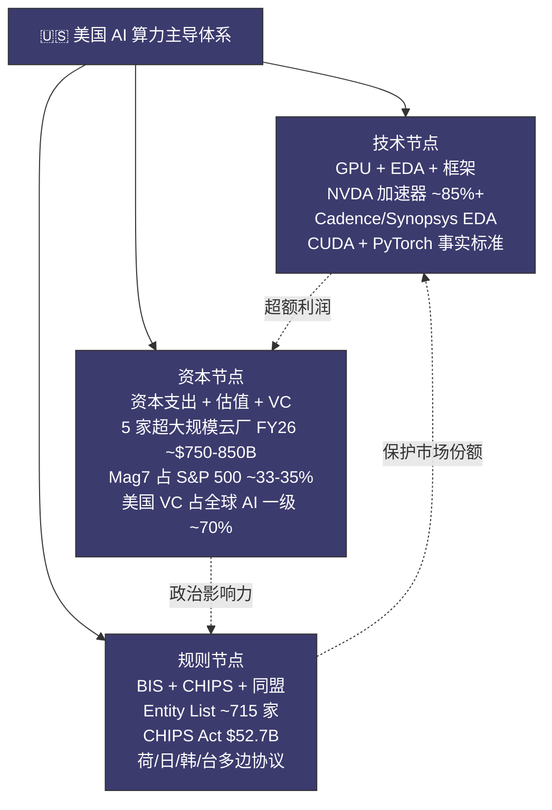
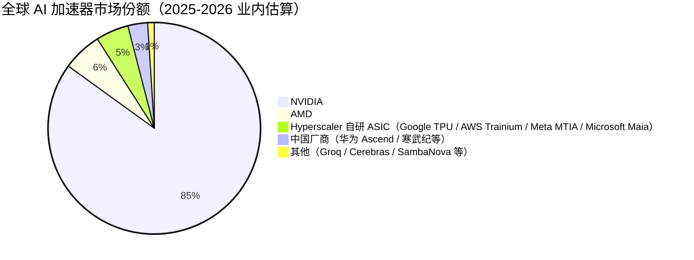
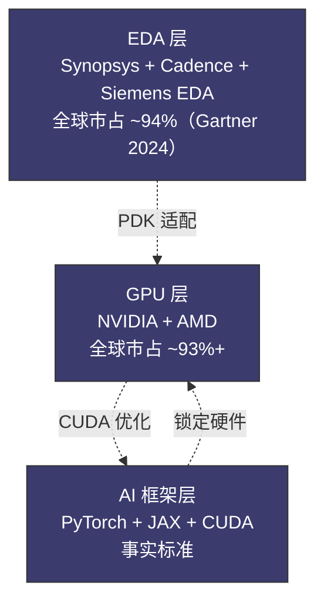
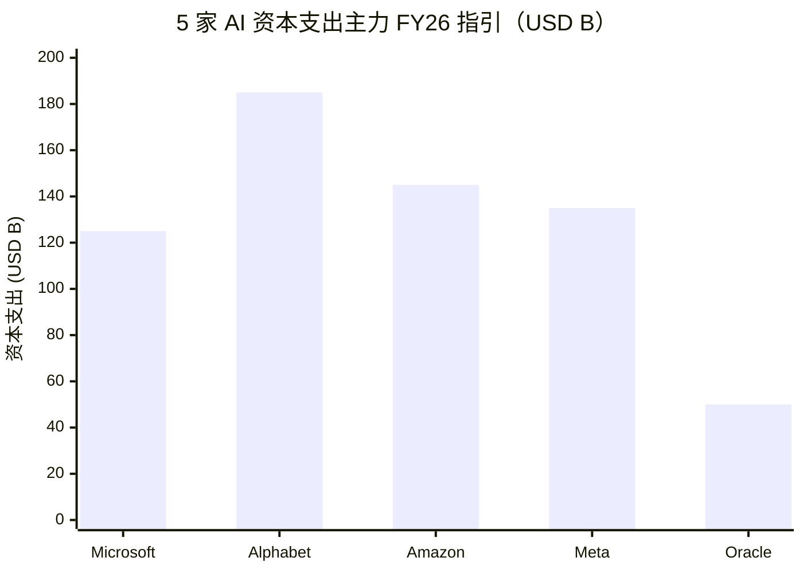
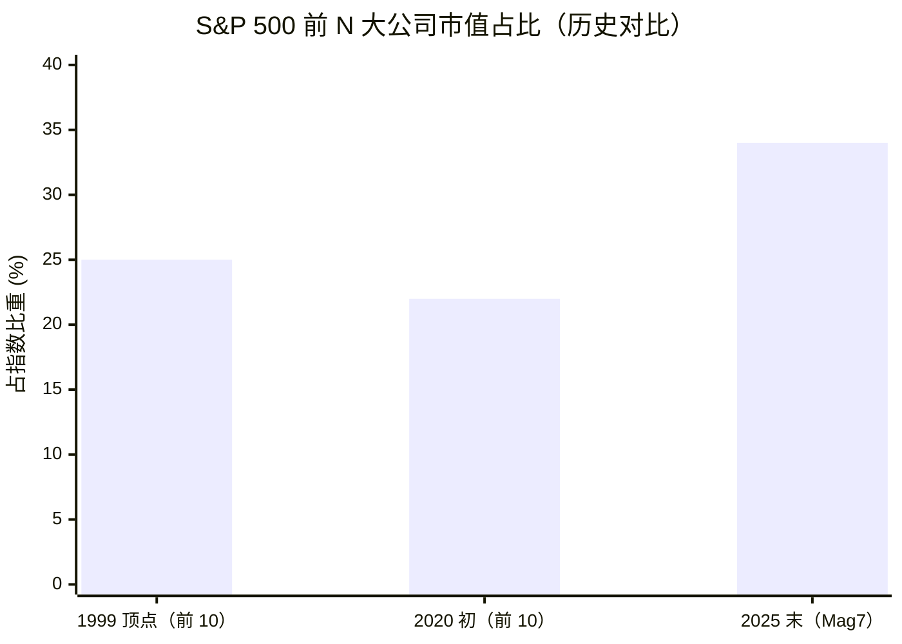
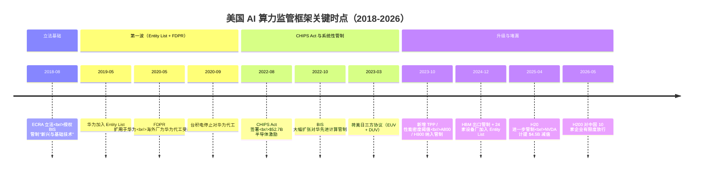

# 第 19 章 美国主导体系：技术、资本、规则的三位一体

## 本章概览

第五部要回答的核心问题是——「全球 AI 算力产业的权力结构是什么样的」。这一问题在过去 3 年里被讨论得越来越多，但市面上的回答多半停留在两类极端叙事之间：一类讲「美国一家独大」，把所有节点都压成「NVDA 卡脖子 + 出口管制」；一类讲「中美脱钩 + 国产替代」，把所有问题都压成意志与时间的故事。这两类叙事对工程师与投资者都不够用——它们既无法解释为什么美国能同时压住芯片、资本和规则三件事，也无法解释为什么美国体系内部并不是铁板一块。

本章是第五部的入口章，回答第一个问题——「美国在算力产业中的位置到底是什么」。本章给出的回答不是「占有最多 GPU」那么简单。更精准的描述是同时控制三个节点：技术节点（NVDA + 楷登电子 / 新思科技 + CUDA / PyTorch 的垂直一致）、资本节点（超大规模云厂资本支出量级 + 二级估值锚定 + 一级 VC 集中度）、规则节点（BIS 出口管制 + CHIPS Act 补贴 + 同盟外交）。三个节点叠加，使任何一国想替代美国在算力产业中的位置，都至少要解决其中两个。本章在结构上与下一章配对——19 写「美国体系是什么」，20 写「美国如何守住中心节点」。19 立框架，20 拆工具。

章末必有「三位一体的内部矛盾」节——商务部 / 国安会 / 财政部对管制力度的分歧、Mag7 与白宫对管制范围的博弈、盟友实际配合 vs 表面承诺。这一节是本章相对外部叙事最具差异化的部分。中文读者长期接触的美国叙事是单一意志体的形象，而美国体系的真实运作模式恰恰相反——多部门博弈 + 行政—立法—企业三重张力 + 同盟内部利益分歧，是这套体系既强韧也脆弱的根源。把这一节写清楚，下一章谈「美国如何守」才不至于落到「卡脖子 vs 反卡脖子」的口号化对立里。

语调严格中立——不替任何一方背书，也不做政治判断；只描述权力结构与其内部张力。

## 19.1 三位一体框架：技术、资本、规则的相互锁定

把美国主导算力产业这件事拆开看，能拆出三个相互独立又相互锁定的节点。

> 三位一体的相互锁定：技术节点产生超额利润 → 喂养资本市场估值 → 支撑产业政治影响力 → 立法保护技术节点市场份额。闭环每一环都强化下一环。

| 节点 | 内涵 | 美国当前位置 | 替代难度 |
|------|------|------------|---------|
| 技术节点 | GPU 设计 + EDA + AI 框架 / 操作系统 | NVDA 占 AI 加速器市场 ~85%+（业内估算，TrendForce / Counterpoint 2025-2026）；楷登电子 + 新思科技在 EDA 双寡头；CUDA + PyTorch 是事实标准 | 单环节追赶可行；三环节同步追赶罕见 |
| 资本节点 | 超大规模云厂资本支出 + 二级估值锚 + 一级 VC | Mag7（Magnificent Seven，指 Microsoft / Apple / Alphabet / Amazon / Meta / 英伟达 / Tesla 七家美国科技巨头，市场分组标签）+ Oracle 五家 AI 资本支出主力 FY26 指引合计 ~\$750-850B（与第 17 章 §1.3 共享底表）；NVDA 2025-10-29 盘中首破 \$5T、2025-10-30 首次收盘站稳 \$5T；美国 VC 在 AI 一级市场集中度 70%+ | 量级与定价权两层壁垒 |
| 规则节点 | 出口管制 + 产业政策 + 同盟外交 | BIS Entity List 截至 2024-07 含约 715 家中国主体；CHIPS Act \$52.7B 半导体激励；荷 / 日 / 韩多边协议 | 规则制定权由制度路径依赖支撑 |

> 来源：每行末已标。三层节点的叠加锁定是本章核心论点——任何一国想替代美国，单环节追赶不够，至少要同时解决其中两个。

三个节点不是孤立。**技术节点产生资本节点**——NVDA 一家市值从 2023-05-30 首破 \$1T 涨到 2025-10-30 首次收盘站稳 \$5T（2025-10-29 已盘中破 \$5T；来源：FT 2023-05-30 "Nvidia Joins Trillion-Dollar Club" + Yahoo Finance / CBS News 2025-10-30 综合 + Bloomberg 实时市值数据），背后是技术垄断转化为定价权再转化为二级估值锚；Mag7（含 NVDA）合计市值占 S&P 500 的 ~33-35%（详 19.3.2 节）；其中 NVDA 一家在 2025 年占 ~6-7%，这种少数赢家拿走绝大部分估值的格局，本身就是技术节点直接喂养出来的。

**资本节点强化规则节点**——CHIPS Act \$52.7B 半导体激励之所以能在 2022 年通过国会，背后是产业利益（[英特尔](https://www.intel.com/)、美光、应用材料等公司游说）+ 安全利益（DoD 供应链审查）+ 选举政治（美国制造的两党共识）三重力量合流；离开了二级市场对半导体板块的高估值锚定，CHIPS Act 的政治支持基础会弱很多。

**规则节点反过来保护技术节点**——BIS 2022 年 10 月、2023 年 10 月、2024 年 12 月连续三轮对华出口管制，把技术节点的市场份额从商业护城河升级为被规则强制保护的市场切片——NVDA 不能卖 H100 给中国客户，事实上就是美国规则把这部分需求从中国本土供应商手里夺走。

三个节点的相互锁定形态可以用一句话概括——**技术节点产生超额利润 → 超额利润喂养资本市场估值 → 资本市场估值支撑产业政治影响力 → 产业政治影响力立法保护技术节点的市场份额**。这是一个闭环，每一环都能强化下一环，外部主体想从任何单一环切入都会撞到另外两环的反作用。

但这个闭环并不是无懈可击。三个节点之间也存在内部张力——例如规则节点的某些动作（出口管制）会损害技术节点的部分商业利益（NVDA 失去中国市场），这种张力在某些时点会让美国体系做出自我后撤的调整（H20 出口路径在 2024-2026 多轮调整）。19.5 单独展开这种内部矛盾。

## 19.2 技术节点：GPU + EDA + 框架的垂直一致

### 19.2.1 GPU 层：NVDA 一家拿走 ~85%+ 加速器市场

[英伟达](https://www.nvidia.com/) FY26 全年（截至 2026-01-25）总营收 \$215.9B，数据中心营收 \$193.7B，GAAP 毛利率 71.1%、Q4 GAAP 毛利率 75.0%。这两个数字第 7 章已经在「五税护城河」章节做过完整拆解——CUDA 软件税、NVLink 系统税、系统设计税、客户绑定税、供给紧缺税，五条税合并解释了从 BOM ~\$3,320 到整卡 ~\$25,000-30,000 的 8 倍价差。

第 7 章关心的问题是「为什么 NVDA 单卡毛利率 75%」。本章关心的问题是「为什么这件事是美国体系的技术节点而不是单一公司的故事」。

把视野从 NVDA 一家拉到整个 AI 加速器市场看——NVDA 占 ~85%+，[AMD](https://www.amd.com/) 占 ~5-8%（Instinct MI300 / MI325X / MI350 系列），其余被超大规模云厂自研 ASIC（Google TPU、AWS Trainium、Meta MTIA、Microsoft Maia）+ 创业公司（Groq、Cerebras、SambaNova）+ 中国厂商（[华为](https://www.huawei.com/) Ascend、[寒武纪](https://www.cambricon.com/)、燧原）瓜分（市占口径综合 TrendForce / Counterpoint 2025-2026 + 业内估算）。

这张图里有一件事容易被忽略——**前 95% 加速器市场全部由美国公司或在美注册的公司主导**。AMD 总部加州、Google TPU 由 Alphabet 自研、Trainium 由 AWS（Annapurna Labs）自研、MTIA 由 Meta 自研、Maia 由 Microsoft 自研。

单从加速器市场份额看，非美国阵营在 2026 年初占的份额估算不超过 5-7%。

这个数字本身不是结论，是技术节点定义的起点。美国主导在加速器层不是美国公司占多数，是美国公司占绝大多数 + 替代者增长缓慢 + 增长曲线与美国出口管制反向叠加。

### 19.2.2 EDA 层：楷登电子 + 新思科技双寡头

往上游再拆一层——EDA。

> 术语：EDA（Electronic Design Automation，电子设计自动化）——芯片设计的核心软件工具链，覆盖从前端 RTL 设计、综合、布局布线到后端验证的全流程。

EDA 是被很多读者忽略的环节，原因是 EDA 厂商市值远小于 NVDA 或台积电，但 EDA 在产业链中的位置非常关键——任何想做 5nm / 3nm / 2nm 先进节点芯片的公司，几乎必须使用 Cadence（美国，纳斯达克 CDNS）或 Synopsys（美国，纳斯达克 SNPS）的 EDA 工具链，外加 Mentor Graphics（被 Siemens 收购，但工具链根仍在美国）的辅助。

EDA 市场在全球范围内的格局：

| 厂商 | 总部 | 主要工具 | 全球市占 |
|------|------|---------|---------|
| 新思科技 | 美国 | Fusion Design Platform、IC Compiler、PrimeTime | ~46% |
| 楷登电子 | 美国 | Innovus、Genus、Virtuoso | ~35% |
| Siemens EDA（原 Mentor Graphics） | 德国 / 总部美国 | Calibre、Tessent | ~13% |
| 三家合计 | — | — | ~94% |
| 其他（含国产 EDA：华大九天、概伦电子、芯华章等） | 多家 | 部分点工具 | ~6% |

> 来源：Gartner "Market Share Analysis: EDA Software, Worldwide" 2024 年度（新思科技 ~46.0% / 楷登电子 ~35.1% / Siemens EDA ~13%，二手汇编经 matrixbcg.com 引用）+ 三家上市公司 10-K（CDNS FY24 / SNPS FY24 / Siemens AG FY24 Annual Report EDA 分部）+ 中国半导体行业协会 EDA 分会 2024 年度报告。Gartner 2024 口径反映系统级 EDA 全口径，2023 及更早年度因口径不同曾给出新思科技 ~32% / 楷登电子 ~28% / 三家合计 ~73% 的数据，本表用 2024 最新口径。中国国产 EDA 在模拟仿真、版图分析等点工具上有所突破，但**全流程 EDA 工具链 + 3nm/2nm 节点完整支持仍由美国双寡头主导**。

EDA 的关键不只在市占比例本身——双寡头加起来 80%+，已经是极端集中。关键还在三件事。

第一，**先进节点（≤7nm）的全流程 EDA 工具链几乎是楷登电子 + 新思科技二选一**——任何想流片 5nm / 3nm 的设计公司，必须使用其中一家的完整工具链（业内表述称 Pareto-dominant 工具组合）。

第二，**EDA 工具与代工厂 PDK 深度耦合**——台积电在 N3 / N2 节点的 PDK 只对楷登电子 + 新思科技工具链做完整认证，其他 EDA 必须通过转换层才能用，性能与可预测性下降。

> 术语：PDK（Process Design Kit，工艺设计套件）——代工厂提供给设计公司的工艺参数与工具适配包。

第三，**EDA 是美国出口管制的关键执行点**——BIS 在 2022 年 8 月将3nm 及以下节点设计所需的特定 EDA 工具纳入出口管制清单，这是出口管制工具箱中上游卡位的代表性条款。

EDA 这一层在技术节点的意义——它把技术节点从芯片产品延伸到芯片设计工具。即便中国能造出自己的 GPU，只要 EDA 工具链上游有美国管制，设计周期、节点支持、PDK 适配三件事都会被限制。这是 NVDA / 楷登电子 / 新思科技的垂直一致——三家公司在产业链上下游分工，但战略立场高度一致：保住美国在芯片设计 + EDA + 制造工艺的全栈领导。

### 19.2.3 框架 / 操作系统层：CUDA + PyTorch 的事实标准

第三层是软件 / 框架。这一层第 7 章在「CUDA 软件税」中已做完整拆解。本节从美国体系的角度补充几点。

CUDA 是 NVDA 2007 年推出的 GPU 并行编程框架，到 2026 年 CUDA 开发者数量按英伟达自报口径约 600 万量级。PyTorch 是 Meta 在 2016 年开源的深度学习框架，2022 年 9 月转入 Linux 基金会下属的 PyTorch Foundation 治理。这两个项目都来自美国公司，主要维护者也都在美国——这件事在底层基础设施层面构成了事实标准的位置。

把事实标准这件事翻译成产业含义：

- **训练栈的默认路径是 PyTorch + CUDA**——任何大模型公司从 RTL 到生产环境的工程链路，默认在 PyTorch 上写、在 NVDA GPU 上训。第三方（AMD ROCm、华为 CANN、英特尔 oneAPI）做的事是兼容 PyTorch + 提供等价 CUDA 替代，本质是追赶而不是另起炉灶。
- **推理栈的默认路径是 TensorRT + Triton + ONNX**——三个工具链有不同的厂商主导，但全部由美国公司主导（TensorRT 是 NVDA 自家、Triton 是 OpenAI 主导、ONNX 由 Microsoft + Facebook 联合发起 2017）。
- **AI 框架的全球开发者生态高度集中在美国主导项目**——基于 GitHub 公开贡献者档案的人工抽样（N=50 per project，非系统性统计），PyTorch + TensorFlow + JAX + Hugging Face Transformers 四个项目前 50 名核心维护者中，明确隶属美国公司 / 大学的占多数。

框架层与 GPU 层是相互锁定的——CUDA 锁定 NVDA 硬件、PyTorch 在 CUDA 上做了最深的优化、模型公司的工程默认值就是这两者的组合。任何想替代 NVDA 硬件的公司，都要先回答 PyTorch + 我的硬件的优化路径是什么这个问题——这是 AMD ROCm / 华为 CANN / 英特尔 oneAPI 在 2025-2026 年仍然在追赶的位置。

### 19.2.4 三层垂直一致的合力

把 GPU + EDA + 框架三层叠加，技术节点的垂直一致形态可以这样总结：

> 三层互相锁定：EDA 工具链与 GPU 设计深度耦合 → GPU 硬件与 CUDA / PyTorch 框架深度优化 → 框架反过来锁定 GPU 硬件。任何一层的替代都要回答另外两层的接口问题。

| 层次 | 美国主导玩家 | 全球市占 | 替代者 |
|------|-------------|---------|-------|
| GPU 设计 | NVDA + AMD | ~93%+ | 自研 ASIC（Google / AWS / Meta / Microsoft，主要内部使用）+ 华为 Ascend（中国本土） |
| EDA 工具 | 新思科技 + 楷登电子 + Siemens EDA | ~94%（Gartner 2024） | 国产 EDA（中国本土，点工具突破） |
| AI 框架 | PyTorch（Meta 主导）+ JAX（Google）+ CUDA（NVDA） | 事实标准 | MindSpore（华为，中国本土）+ PaddlePaddle（百度，中国本土） |

> 三层之间是相互锁定关系，不是简单叠加。

替代任何一层都是巨大工程量；同时替代三层，目前没有任何一个非美国主体能做到——欧盟在所有三层都缺主导玩家；日本在 EDA + 框架层完全缺位，GPU 层只有索尼图像传感器之类的边缘存在；中国在三层都有本土玩家但全部处于追赶位置；中东 / 东南亚 / 拉美几乎完全缺席。技术节点垂直一致的真实含义就落在这一层。

## 19.3 资本节点：资本支出量级 + 估值锚定 + 一级 VC 集中度

技术节点是美国主导算力产业的第一层基础。第二层是资本节点——这一层往往被技术叙事掩盖，但在产业演化的具体节奏上，资本节点的作用甚至比技术节点更直接。

资本节点有三个子维度：资本支出量级、二级估值定价权、一级 VC 集中度。

### 19.3.1 5 家 AI 资本支出主力（Microsoft / Meta / Alphabet / Amazon / Oracle）FY26 资本支出合计 ~\$750-850B

把美国资本节点翻译成最直白的数字——五家美国公司（Microsoft、Alphabet、Amazon、Meta、Oracle，Mag7 中 AI 资本支出主力四家 + Oracle，排除 Apple / Tesla / NVDA）FY25 合计报表资本支出约 \$381B、FY26 合计指引约 \$750-850B。

> FY26 指引取区间中值（MSFT ~$120-130B / GOOGL ~$180-190B / AMZN ~$140-150B / META ~$125-145B / ORCL ~$50B）。五家合计 ~$640B 量级（中值），区间上沿可到 ~$750B+。

| 公司 | FY25 实际资本支出（报表口径） | FY26 指引资本支出 | 资本支出 / 营收 |
|------|----------------|----------------|--------------|
| Microsoft | \$64.6B（FY25，报表）/ 经济实质 ~\$90B（含融资租赁） | ~\$120-130B（FY26 指引） | 23% → 38% |
| Alphabet | \$91.4B（FY25 10-K 一手） | ~\$180-190B（FY26 指引） | 23% → 38% |
| Amazon | \$131.8B（FY25 一手） | ~\$140-150B（FY26 指引） | 21% → 22% |
| Meta | \$72.2B（FY25 一手） | ~\$125-145B（FY26 指引） | 36% → 45%+ |
| Oracle | \$21.2B（FY25，报表）/ 经济实质 ~\$73B（含融资租赁） | ~\$50B（FY26 指引）| — |
| 五家合计（报表口径）| ~\$381B（\$64.6 + \$91.4 + \$131.8 + \$72.2 + \$21.2，FY25 一手汇总） | ~\$750-850B（FY26E） | — |

> 来源：MSFT FY25 Q4 Press Release 2025-07-30 一手（报表资本支出 \$64.6B；经济实质 ~\$90B 含融资租赁，与第 17 章 §1.3 双口径一致）；Alphabet FY25 10-K（goog-20251231.htm）一手 \$91.4B；Amazon FY25 annual report 一手 \$131.82B；Meta FY25 Full Year Results press release 一手 \$72.22B（含融资租赁 principal）；Oracle FY25 现金流量表（报表资本支出 \$21.2B，经济实质口径见第 17 章 §1.3）；五家 Q4 FY26 业绩 + 2026 财年指引；与第 17 章「资本支出周期」共享底表（FY25 合计 ~\$381B、FY26E \$750-850B 取第 17 章 §1.3 R2 修复后口径）。Amazon 资本支出含部分非 AI（零售物流、电力），Meta 几乎全为 AI。

这是一个非常重的数字。把五家美国公司一年 ~\$750-850B 资本支出放在历史与全球语境里看：

- **占美国 2025 GDP 的比重**：美国 2025 GDP ~\$29T，五家 FY26E 资本支出占 ~2.8%。这个比例在 2010-2020 是 0.5-0.8% 量级——14 年涨了 4-5 倍。
- **占全球数据中心资本支出的比重**：2026 全球数据中心资本支出业内估算 ~\$900B-1T（综合 Synergy Research + 戴尔'Oro 2026 数据），美国五家占 ~80%+。
- **与中国全栈对比**：中国 2026 数据中心 + AI 算力资本支出业内估算 ~\$120-150B（综合 IDC / 信通院 2025-2026 报告 + 业内估算），五家美国公司单年资本支出是中国全栈合计的 5-6 倍量级。

这种 5-6 倍量级的差距，是技术节点能持续存在的物质基础——技术领先需要持续的工程投入，而工程投入的规模取决于客户的购买能力。NVDA 卖 GPU 的最大客户群（Microsoft + Meta + Amazon + Google + Oracle）合计每年向 NVDA 输送 \$193.7B 数据中心营收。按 NVDA FY26 10-K 全年披露口径，**Top 2 直接客户占总营收 36%（22% + 14%）、FY26 全年共 4 家客户各超 10% 阈值合计 ~61%**。这条客户结构本身就是资本节点对技术节点的喂养——五家美国公司用自己的资本支出现金流，把 NVDA 顶到 \$5T 市值，把 NVDA 的研发投入维持在能跑通下一代架构的水平。

这条资本支出曲线**是美国资本节点的强度，也是美国资本节点的脆弱性**。1999 年美国主要电信运营商平均资本支出 / Revenue ~35-45%（来源：第 29 章测算），Meta FY26 预计 ~45%+，形态相近——一家公司用 35% 以上营收做资本支出，意味着自由现金流被严重压缩，任何低于完美的需求兑现都会触发剧烈估值重估。资本支出是否过度的完整答辩在超大规模云厂账本与周期定位两章。

### 19.3.2 二级估值定价权：S&P 500 的 AI 板块占比

资本节点的第二个维度是二级市场估值定价权。

到 2025 年底，Mag7（Microsoft、Apple、Alphabet、Amazon、Meta、Nvidia、Tesla）合计市值占 S&P 500 的 ~33-35%。

这个集中度是 S&P 500 历史上少见的——1999 年互联网泡沫顶点，前 10 大公司占指数比重 ~25%；2020 年初疫情前 ~22%。2025 年 Mag7 占指数 33-35% 是过去 50 年的最高水位。

这种集中度的意义不在数字本身，在两件事：

**第一件，估值锚定全球同类公司**。NVDA P/E（forward）在 2025-2026 区间是 35-45x，AMD 30-40x，Microsoft / Google / Meta 25-30x。这些数字一旦在美股二级市场形成共识，会通过全球可比公司估值法传导到日本（信越、东京电子）、欧洲（[阿斯麦](https://www.asml.com/)）、韩国（SK 海力士、[三星](https://www.samsung.com/semiconductor/)）、台湾（台积电）、中国（[中芯国际](https://www.smics.com/)、寒武纪、[海光信息](https://www.hygon.cn/)）的二级市场——任何主流卖方在给非美国半导体公司做 SOTP（Sum-of-the-Parts，分部估值法）或 P/E 估值时，都会引用美股可比公司的估值倍数作为参照。换句话说，**美股是全球半导体估值的价格发现市场**。

**第二件，美股深度决定融资能力**。CoreWeave 2025-03 IPO 募 \$1.5B，2026-01 NVDA 以 \$87.20/share 认购 2293.6 万股、合计 \$2B。Crusoe 2024-12 D 轮 \$600M 估值 \$2.8B。这些一级市场的估值不是单纯由产品业绩决定的——CoreWeave Q3 2025 GAAP 净亏损 \$110M 但二级市场仍然给出5 年合同储备 \$55B 的估值结构——背后是美股对 AI 基础设施板块的整体高估值锚定。离开美股深度，CoreWeave / Crusoe / Lambda 这类一级 GPU 云无法用同样的估值倍数融资。

### 19.3.3 一级 VC 集中度：美国 VC 在 AI 一级市场的份额

资本节点的第三个维度是一级 VC 集中度。

按 PitchBook + Crunchbase 2024-2025 公开数据综合，全球 AI 一级市场（生成式 AI + 基础模型 + AI 基础设施合计）2024 年融资总额 ~\$120B，2025 年估 ~\$200B。这个市场里美国主体（投资方注册地或主要 GP 在美国）占 ~70-75%。

其中几个关键数字：

- **OpenAI 累计融资 / 估值**：2024-10 估值 \$157B，2025-09 NVDA 投资最高 \$100B + 估值上调。OpenAI 主要投资方包括微软（累计 \$13B+）、Thrive Capital、Sequoia、a16z 等，全部美国主体。
- **Anthropic 累计融资**：2026-Q1 年化经常性收入业内综合口径 \$30B，主要投资方 Google（累计 \$3B+）、Amazon（\$8B 累计，来源：Anthropic-AWS 2024-11 公告）、Spark Capital、Lightspeed 等，全部美国主体。
- **xAI 累计融资**：2025 年下半年至 2025 末业内综合估值区间 \$50-200B（区间宽度反映 2025 年 G 轮前后多轮融资的快速跳升与不同时点口径差异；来源：The Information / Bloomberg 2025-2026 多次报道综合 + xAI 2025-12 G 轮融资公开报道；与第 18 章 §1.4 R2 一致），主要投资方包括 Sequoia、a16z、Lightspeed 等美国 VC，加上中东主权基金的少量参与。
- **Stargate 项目**：2025-01-21 由 OpenAI、SoftBank、Oracle、MGX 联合宣布，承诺投资上限 \$500B、初始投资 \$100B、首个站点位于得克萨斯州 Abilene。**持股结构：OpenAI 与 SoftBank 各 40%（各投 \$19B）、Oracle 与 MGX 各投 \$7B（按白宫 2025-01-21 公告对应初始投资 \$100B 的 7% 股权口径）、其他 6%**——这是少数有日本资本与中东主权基金深度参与的项目，但治理结构仍然美国主导（孙正义任 chairman、Sam Altman 主导技术决策）。

把这三个数字叠加——OpenAI + Anthropic + xAI 三家美国基础模型公司，2025 年累计融资额接近 \$200B 量级，占当年全球 AI 一级融资的 ~80-90%。Stargate \$500B 上限的承诺再加一层。这种集中度的意义在于——**全球 AI 一级市场的主角几乎全部在美国注册，主要投资方也几乎全部是美国主体**。中东主权基金（沙特 PIF、阿联酋 MGX）、日本 SoftBank 等非美国资本的参与，往往是以跟投美国主导项目的形式进行，而不是另起炉灶。这与传统能源行业 OPEC 主导、传统制造业中日韩主导的局面对照，反差非常明显。

资本节点的三个维度（资本支出量级 + 二级估值 + 一级 VC）合在一起，构成了美国体系的资本厚度。这个厚度不是单一资金量级，而是一二级市场打通 + 全球可比估值锚 + 全球主权资本绕道美国三层结构。

## 19.4 规则节点：BIS 出口管制 + CHIPS Act + 同盟外交

技术节点 + 资本节点是美国主导的内生力量——市场力量、产业惯性、资本厚度。规则节点是外生工具——通过国家行政机器，把市场力量与产业惯性锁住，让追赶者更难赶上。本节梳理三个主要工具：BIS 出口管制、CHIPS Act 补贴、同盟外交，先立框架，工具细节留给下一章。

### 19.4.1 BIS 出口管制：清单 + FDPR + Entity List

BIS（Bureau of Industry and Security，美国商务部工业与安全局）是负责美国双用途技术出口管制的主管机构。BIS 对中国 AI 算力产业链的管制工具箱主要有三件：

| 工具 | 内涵 | 关键启用时点 | 当前覆盖范围 |
|------|------|------------|------------|
| 商品控制清单（CCL） | 受管制物项的产品清单 | 长期存在；2022-10 大幅扩充 | 含 H100 / A100 等先进 AI 加速器 + 部分先进逻辑 / 存储工艺设备 |
| 外国直接产品规则（FDPR） | 海外生产但使用美国技术 / 软件的物品，仍受美国管制 | 2020-05 首次扩用于华为；2022-10 中国全境适用 | 几乎所有先进半导体 + AI 算力供应链 |
| Entity List | 受管制实体清单，向其出口需许可证 | 1997 设立；2018 起对华大幅扩用 | 截至 2024-07 含约 715 家中国主体 |

> 来源：各工具的法律基础在 50 U.S. Code 第 4801-4852 节（Export Control Reform Act of 2018）+ 15 CFR Parts 730-774（Export Administration Regulations）。

把这三件工具的时间线串起来看，BIS 对中国 AI 算力产业链的管制是一个**递进式收紧**的过程：

| 时点 | 关键事件 | 性质 |
|------|---------|------|
| 2018-08 | ECRA 立法，授权 BIS 管制新兴与基础技术 | 立法基础 |
| 2019-05 | 华为被加入 Entity List | Entity List 工具首次对头部中企使用 |
| 2020-05 | FDPR 扩用于华为：海外厂为华为制造的芯片也受美国管制 | FDPR 工具的产业级扩用 |
| 2022-08 | 部分先进 EDA 工具（3nm 及以下节点设计相关）纳入出口管制 | 上游工具锁定 |
| 2022-10-07 | 大幅扩张对华先进计算 + 半导体设备出口管制 | 系统性管制框架确立 |
| 2023-10-17 | 更新先进计算管制：新增 TPP（Total Processing Performance，总处理性能）+ 性能密度阈值；A800 / H800 被纳入管制 | 闭合低配版规避漏洞 |
| 2024-12 | 进一步扩张：HBM 出口管制 + 24 家半导体设备厂被加入 Entity List | 上游瓶颈环节卡位 |
| 2025-2026 | H20 出口政策多轮调整（部分管制 + 部分允许）+ H200 对中国 10 家公司有限度放行（2026-05，来源：Wikipedia: Hopper Microarchitecture 综合） | 管制 - 放松交替 |

> 来源：每行末已注明。2022-10、2023-10、2024-12 三轮的 Federal Register 原文是 BIS 出口管制最核心的一手来源，这里不展开条款细节，第 20 章详谈。

这张表里有几件事值得读者抓住：

**第一件，递进式收紧的内在节奏**。每一轮新管制都试图闭合上一轮的漏洞——2022-10 主管制 H100、A100；NVDA 推出 H800 / A800 规避（降低互连带宽以避开管制阈值）；2023-10 把 H800 / A800 也纳入管制；NVDA 推出更低规格的 H20；H20 在 2024-2026 又经历多轮政策调整。这种猫鼠循环是出口管制工具的常态——管制方与被管制方都在不断调整。

**第二件，FDPR 是真正的长臂工具**。FDPR 让美国得以管制在海外、由非美企业、使用美国技术 / 软件制造的物项。这意味着台积电在台湾生产的芯片，只要使用了美国 EDA 工具或 IP，就在美国管制范围内。这条规则是美国规则节点能输出到全球供应链的关键——美国不需要管台积电，只需要管使用台积电的人。

**第三件，Entity List 已经从工具变成体系**。截至 2024-07 约 715 家中国主体被加入 Entity List；从 2018 年大幅扩用到 2024 年的累积增量约 500+ 家。Entity List 的扩张速度本身就是规则节点强度的指标。

### 19.4.2 CHIPS Act：\$52.7B 补贴的分布

如果说 BIS 是规则节点的防守工具（阻止技术外流），CHIPS Act 是规则节点的进攻工具（吸引产业内流）。

CHIPS and Science Act 于 2022 年 8 月签署生效，其中半导体制造激励部分（俗称 CHIPS Act 核心）总规模 \$52.7B。具体分项：

| 用途 | 金额（USD B） | 占比 |
|------|--------------|------|
| 半导体制造激励（grants + loans） | 39.0 | 74% |
| 半导体研发（含 NSTC / NAPMP / Manufacturing USA \$11B + DoD 微电子研究 \$2B） | 13.2 | 25% |
| 国际技术安全与创新基金 | 0.5 | 1% |
| 合计 | 52.7 | 100% |
| 投资税收抵免 25%（先进半导体制造投资抵免，IRC Section 48D）| 单独条款 | 与 \$52.7B 互补 |

> 来源：CHIPS and Science Act of 2022（Public Law 117-167，2022-08-09 签署，congress.gov 一手）+ 商务部 CHIPS Office 公开 Award 追踪（nist.gov/chips）+ IRC Section 48D（投资税收抵免 25% 法律条款）。表中 \$39B 半导体制造激励是 CHIPS Act 中规模最大的单一项，向具体企业发放的拨款都从这里出。\$13.2B R&D 行包含 \$11B NSTC / NAPMP / Manufacturing USA + \$2B DoD 微电子研究，两者按 CHIPS Act 法案文本归在同一研发科目下；\$39 + \$13.2 + \$0.5 = \$52.7B 与总规模一致。

CHIPS Act 已公布的四个旗舰项目（截至 2024-04 与 2024-11 之间陆续公告）：

| 公司 | 项目位置 | 联邦拨款（grants） | 总投资承诺 | 公告时点 |
|------|---------|---|---|---|
| 台积电 | Arizona Fab 21（4nm / 2nm / 1.6nm 三期） | \$6.6B | \$40B → 2025-03 扩至 \$165B 累计 | 拨款 2024-04，扩资 2025-03 |
| 英特尔 | Arizona + Ohio + Oregon + New Mexico 多 fab | \$8.5B 初始 → 2024-11 最终 \$7.86B | \$100B 量级（多年多 fab） | 2024-03 |
| 三星 | Taylor, Texas（4nm / 2nm） | \$6.4B | \$44B（含 Taylor + Austin 扩产） | 2024-04 |
| 美光 | Clay, New York + Boise, Idaho（先进 DRAM / HBM） | \$6.1B | \$50B（Clay）+ \$25B（Boise） | 2024-04 |

> 来源：Wikipedia: CHIPS and Science Act 综合 + 商务部 CHIPS Office 公开 Award 追踪 + 各项目独立公告。表中拨款数字为联邦直接拨款（grants）；CHIPS Act 还可提供同等量级的贷款，每个项目的实际政府资金支持通常是 grants × 2 左右。英特尔 2024-11 最终拨款从 \$8.5B 下调到 \$7.86B 是英特尔项目延期后的调整。

四个项目的拨款合计 \$27.0B，占 \$39B 半导体制造激励的 ~70%。这个集中度本身是规则节点设计的一部分——CHIPS Act 不是普惠政策，是集中扶持四家有先进节点能力或战略意义的厂商的产业政策。

四个项目的产业含义可以分三层：

- **台积电 Arizona**：把世界最先进的代工产能（4nm / 2nm / 1.6nm）导入美国本土。Arizona Fab 21 一期 4nm 已 2024 年量产、二期 2nm 计划 2028-2029 量产、三期 A16（1.6nm）规划 2030+。台积电 Arizona 单位成本溢价业内估算 30%+（详见第 4 章），但台积电不会用这笔账给客户打折，而是通过先进节点议价权 + CHIPS Act 补贴对冲。
- **英特尔 + 三星多 fab**：是 CHIPS Act 的次主力——英特尔作为本土巨头，三星作为同盟国巨头，共同填补非台湾先进制程的产能。英特尔 18A 节点（2nm 等效）在 2025-2026 进入量产爬坡阶段，是规则节点的关键变量。
- **美光 Clay**：把先进 DRAM / HBM 的产能导入美国本土，回应第 6 章讲过的 HBM 被三家亚洲厂商主导（SK 海力士 / 三星 / 美光）的结构。

总投资承诺 \$40-165B 这种数字看起来巨大，但要注意——**这是 5-10 年的多期累计承诺，不是当年支出**。台积电 Arizona \$165B 是 2025-2030 累计，年化约 \$20-30B；同期台积电全球资本支出年化 \$40B+，Arizona 占比约 50-60%。CHIPS Act 拨款的杠杆比（联邦拨款 / 总投资承诺）大约 5-8%，主要的实际投资仍然来自企业自身现金流与债务融资——这是产业政策的常态，国家补贴是杠杆不是主体。

### 19.4.3 同盟外交：荷 / 日 / 韩 / 台的多边技术控制

规则节点的第三件工具是同盟外交。BIS 出口管制 + CHIPS Act 补贴是美国单边政策，要让规则真正发挥作用，必须把技术控制扩展为多边——任何一个供应链关键环节如果可以通过非美国渠道绕过，单边管制就会失效。

主要同盟伙伴在算力产业链中的位置：

| 伙伴 | 关键产业链位置 | 美国合作 / 协调机制 |
|------|---------------|-------------------|
| 荷兰 | 阿斯麦（EUV 光刻机全球唯一供应商，DUV 主要供应商） | 2023-03 荷美日三方协议：限制阿斯麦部分先进 DUV + 全部 EUV 对华出口 |
| 日本 | 东京电子（TEL，干法刻蚀 / 涂胶机）、信越 / SUMCO（硅晶圆）、Disco（晶圆切割）、JSR（光刻胶）等 | 2023-03 三方协议；2023-07 日本经产省单独出台 23 项设备出口管制 |
| 韩国 | 三星（存储 + 代工）、SK 海力士（HBM）、SK Telecom（基础设施）等 | 双边技术联盟；非正式协调（韩国对中国大陆出口管制态度较模糊） |
| 中国台湾 | 台积电（先进代工 90%+ 市占）、联电（成熟工艺）、日月光（封测） | 双边深度绑定（台积电 Arizona、CHIPS Act 补贴、台湾安全合作） |

> 来源：荷美日三方协议的具体条款部分保密，业内综合 Reuters 2023-03 / FT 2023-03 / 日本经产省 2023-07 公开公告。各伙伴的产业链位置综合各公司 IR + 行业报告。

把这张表压扁看，规则节点的同盟覆盖了算力产业链上游的几乎所有关键瓶颈：光刻机（荷）+ 干法刻蚀 / 硅片 / 光刻胶（日）+ 存储 / HBM（韩）+ 先进代工（台）。美国一国可能不能直接管理所有这些环节，但通过多边协调，能把技术控制扩展到这些环节。

但多边协调不是无缝衔接的。这就引出 19.5 要谈的内部矛盾——盟友的表面承诺与实际配合之间存在落差，部分管制条款会被绕过、延迟、或选择性执行。

## 19.5 三位一体的内部矛盾

到这里为止，本章描述的是美国体系的强项——技术 + 资本 + 规则三层叠加，构成全球算力产业的中心节点。但任何复杂权力结构都有内部矛盾，美国体系也不例外。**「三位一体」内部矛盾的存在，正是这套体系的真实运作模式**——它不是单一意志体，是多部门博弈 + 行政-立法-企业三重张力 + 同盟内部利益分歧。

本节按三类矛盾展开：技术与规则的张力（节点间）、资本与规则的张力（节点间）、规则节点的国际摩擦（节点内）；前两类是节点间张力，第三类是规则节点内部的多边执行摩擦。

### 19.5.1 矛盾 A：技术与规则——Mag7 / NVDA 与白宫的博弈

最显眼的内部矛盾是技术节点（产业利益）与规则节点（国家安全）的张力。

NVDA 按地域披露的中国（含香港）营收占总营收比重，FY24 → FY25 → FY26 三档下行：FY24 ~17%、FY25 ~13.1%（\$17.11B / \$130.5B）、FY26 ~9.1%（\$19.68B / \$215.9B，10-K 一手地域披露口径）。2022-10 BIS 大幅扩张对华出口管制后，NVDA 推出 H800 / A800 规避；2023-10 BIS 更新管制后，NVDA 推出 H20；2025-04 H20 被进一步管制（部分客户限制 + 库存计提），NVDA FY26 Q1 计提 \$4.5B 库存减值。FY25 → FY26 单一财年内中国占比再降 4 个百分点（13.1% → 9.1%），对应 NVDA 失去的中国营收年化下行约 \$5-7B 量级。

NVDA 的应对不是被动接受，而是积极游说。Jensen Huang 在 2024-2025 多次公开发言中表达对出口管制的反对——核心论点是：对中国卡得太死会让中国加速自研，长期削弱 NVDA 的全球市场份额。Microsoft、Meta、Google 等超大规模云厂在出口管制范围上也有不同程度的公开游说——主要焦点不是取消管制，而是调整管制范围，避免误伤合理商业活动。

| 议题 | Mag7 / NVDA 立场 | 白宫 / 国安会立场 | 实际管制走向 |
|------|----------------|-----------------|------------|
| H100 / A100 对华出口（2022-10 起） | 反对（损害营收） | 支持（国家安全） | 完全管制 |
| H800 / A800 规避路径（2023-10 起） | 维持 | 关闭（堵漏） | 2023-10 纳入管制 |
| H20 部分管制（2025-04 起） | 反对（已计提 \$4.5B 减值） | 部分支持（精细化管制） | 部分管制 + 部分调整 |
| H200 对中国部分企业放行（2026-05） | 支持 | 部分支持（双边外交协调） | 对 10 家中国企业有限度放行 |
| HBM 出口管制（2024-12） | 部分反对 | 支持 | 全面管制 |

> 来源：每行末已注明。实际管制走向反映规则节点最终落地形态，不一定与任何一方的初始立场完全一致。

这张表里可以读出几件事：

**第一件，规则节点不是 Mag7 / NVDA 的单向被动接受**。Mag7 / NVDA 通过游说在管制范围、时点、技术细则上参与了决策。2026-05 H200 对中国 10 家企业有限度放行，是规则节点在双边外交压力下做出的局部调整——这种调整体现了规则节点服从政治外交的优先级。

**第二件，规则节点的自我后撤是有边界的**。核心架构（H100 / A100 / B200 / B100 等无规避空间的核心 AI 加速器）从未对华完全放开。Mag7 / NVDA 的游说能影响边缘条款，但不能改变主线。这是规则节点对内部矛盾的消化机制——给企业留出部分商业空间，但不让步在战略核心上。

**第三件，猫鼠循环本身是规则节点的常态**。H100 → H800 → 管制 → H20 → 部分管制 → H200 部分放行，这种循环并不意味着规则节点失效——它意味着规则节点是动态调整 + 持续修订的过程，而不是一次性立法。

### 19.5.2 矛盾 B：资本与规则——商务部 / 国安会 / 财政部的分歧

第二类矛盾在政府内部——不同部委对管制力度的判断不同。

美国对算力产业的政策由多个部门共同负责：

| 部门 | 主要关切 | 政策倾向 |
|------|---------|---------|
| 商务部（DOC / BIS） | 产业出口利益 + 国家安全 | 倾向精细化管制（既保产业利益又保安全） |
| 国家安全委员会（NSC） | 国家安全（中美竞争 + 军事用途） | 倾向广覆盖管制（宁可误伤合理商业） |
| 财政部（Treasury） | 市场稳定 + 资本流动 | 倾向克制管制（避免影响美股 + 全球资本流动） |
| 国防部（DoD） | 军事供应链 | 倾向绝对禁运（核心军事关键品全禁） |
| 总统 / 白宫 | 政治平衡 + 选举考量 | 跨部门协调 + 最终决策 |

> 来源：各部门的关切与政策倾向综合 CSIS / RAND / Brookings 报告 + 公开新闻报道 + 国会听证 transcript。

这种部门分歧在 2023-2026 年间在多个时点显现：

- **2023-08 财政部对华投资限制规则**（Executive Order 14105，2023-08-09 签署，对华半导体 / 量子 / AI 直接投资限制，Federal Register 2024-06 最终规则）：财政部主导的对华投资限制规则（针对半导体、量子计算、AI 等领域美国资本对华股权投资）从 2022 年讨论到 2023-08 才出台，比 BIS 出口管制晚一年。延迟反映财政部对市场冲击的关切——出口管制限制货物流动相对单纯，投资管制则会影响整个跨境资本市场结构。
- **2024-12 HBM 出口管制**：BIS 推动 HBM 管制时，部分超大规模云厂与韩国三星 / SK 海力士都有反对意见——HBM 是 AI 训练的关键瓶颈，限制 HBM 对华出口会反过来影响美国 AI 公司在国际市场的竞争力。规则最终落地，但实施细则在 2024-12 与 2025 上半年多次调整。
- **2025-2026 H20 政策反复**：2025-04 H20 被纳入更严格管制，NVDA 计提 \$4.5B 库存减值；2026-05 H200 对中国 10 家企业有限度放行。这种先紧后松反映的是部门间博弈的阶段性结果——商务部 + 国安会主导紧的方向，外交 / 财政部 / 企业利益游说推动松的回调。

部门分歧的存在不是制度缺陷，而是民主制衡机制的常态。但它的产业含义对中文读者很重要——**美国规则节点不是单一意志体，规则的实际力度与节奏由多部门博弈决定**。任何美国必然加码 / 必然放松的预测都会落空，真实的演化是在多部门博弈中震荡。

### 19.5.3 矛盾 C：规则节点的国际摩擦——盟友表面承诺 vs 实际配合

第三类矛盾在国际层面——美国与盟友之间的表面承诺与实际配合之间存在落差。

具体表现：

| 盟友 | 表面承诺（多边协议） | 实际配合落差 |
|------|-------------------|------------|
| 荷兰 | 2023-03 三方协议：限阿斯麦部分先进 DUV + 全部 EUV 对华 | 阿斯麦中国营收占总营收三段式：**FY24 ~36-37%（一手，2022-2023 积压订单消化）**；**FY25 ~29% / €9.5B（阿斯麦一手，总销售口径）**；**FY26E ~20%（阿斯麦 Q4 2025 财报指引，2026-01-28）**——曲线先高后低，部分 DUV 设备在 2023-09 管制正式实施前加速发货中国客户。来源：阿斯麦 2024 / 2025 Annual Report Revenue by Region 一手 + 阿斯麦 Q4 2025 财报电话会 2026-01-28 + CNBC 2026-01-28 报道；与第 28 章 §28.5 共享底表 |
| 日本 | 2023-03 三方协议 + 2023-07 经产省单独 23 项管制 | 部分日本企业（光刻胶、晶圆切割）对华出口仅部分管制，许可证审批仍发放 |
| 韩国 | 双边技术联盟（无正式多边协议） | 三星 / SK 海力士在中国大陆有重要 fab（西安、无锡），管制实施有个案豁免机制 |
| 中国台湾 | 紧密绑定美国（台积电 Arizona、CHIPS Act） | 台积电在中国大陆有南京 fab（28nm / 16nm），成熟工艺仍对华出货 |
| 欧盟（除荷） | 公开支持美国管制框架 | 法德意等国在 5G + AI 基础设施上态度不完全一致 |

> 来源：每行末已注明。实际配合落差是公开报道与业内估算综合，不是阴谋论解读——多边协议总会有灰色地带，这是国际协调的常态。

落差的几个典型机制：

**第一种，加速发货现象**。2022-10 BIS 管制公布后到 2022-12 实施前的 2 个月内，许多设备厂商对中国客户的发货速度明显加快——这是合法的管制窗口期操作，但客观效果是部分先进设备在管制生效前已完成交付。

**第二种，许可证机制的执行差异**。出口管制不是完全禁运，多数情况下是许可证审批。许可证审批的具体口径在不同盟友、不同时点有差异——荷兰对阿斯麦的部分 DUV 设备许可证审批在 2023-2024 期间是个案审批 + 部分发放，而不是全部不发。

**第三种，成熟工艺与先进工艺的边界灵活性**。多边管制主要瞄准先进工艺（7nm 以下）。成熟工艺（28nm / 14nm 等）大体不受管制。这条边界给了台积电南京 fab、三星西安 fab、SK 海力士无锡 fab 等亚洲半导体大本营继续在中国大陆运营的空间——业务量在不断切换调整，但 fab 并未关闭。

**第四种，个案豁免机制**。三星 / SK 海力士在中国大陆的 fab 因为有大量已沉没投资，2022-2023 期间获得了 BIS 的临时一般许可证豁免（Temporary General License，临时一般许可证，允许特定企业在过渡期内继续运营），多次延期。这是美国对盟友 - 企业利益的个案处理——既维持管制框架，又不让盟友企业承担过大损失。

这三层落差不是规则节点失败的证明，而是规则节点的弹性运行模式。任何复杂多边协议都会有灰色地带，关键是这些灰色地带不动摇核心框架。但灰色地带的存在意味着——**外部观察者（包括中国 + 欧洲 + 中东等其他主体）对美国规则节点的真实力度的判断，不能基于协议文本，必须基于实际执行**。

### 19.5.4 内部矛盾对未来 3-5 年的影响

把三类内部矛盾整理为一张矩阵：

| 矛盾类型 | 主要张力 | 当前状态 | 对未来 3-5 年的潜在影响 |
|---------|---------|---------|----------------------|
| A. 技术与规则 | Mag7 / NVDA vs 白宫 / 国安会 | 管制为主线，企业游说影响边缘条款 | 核心管制保持，边缘条款（H20 / H200 / 出口范围）持续调整 |
| B. 资本与规则 | 商务部 / 国安会 / 财政部 / 国防部 | 多部门博弈，决策节奏被博弈延缓 | 管制力度震荡，可能阶段性收紧或放松 |
| C. 规则节点的国际摩擦 | 盟友表面承诺 vs 实际配合 | 灰色地带存在，但不动摇核心框架 | 灰色地带可能扩大或收窄，取决于双边外交进展 |

> 矩阵基于本节前述事实归纳。每条潜在影响是基于历史模式的趋势判断，不是预测。

这张矩阵的产业含义可以总结为三句话：

第一句，**美国体系不是铁板一块**。任何把美国必然加码 / 必然放松作为单一预测的判断，都会被三类内部矛盾的复杂博弈打脸。

第二句，**美国体系的震荡运行是常态**。每一轮管制收紧 → 企业游说 → 部分回调 → 新管制收紧是规则节点的真实节奏，不是异常现象。

第三句，**核心架构的稳定性远高于边缘条款**。三类内部矛盾会影响边缘条款（H20 是否管制、HBM 是否完全禁运、台积电南京 fab 是否豁免），但不会动摇核心框架（H100 / B200 等先进 AI 加速器对华禁运 + 先进 EDA 对华禁运 + 先进光刻机对华禁运）。

## 19.6 小结：美国体系强在何处，何处可被读到

把本章前五节合在一起，美国主导算力产业的真实结构可以用三句话总结：

第一句，**美国主导算力不是单一维度，是技术 + 资本 + 规则三层叠加**。任何一国想替代美国在算力产业中的位置，单环节追赶不够，至少要同时解决其中两层。这是美国体系的复合护城河——比单一技术领先或单一资本厚度更难突破。

第二句，**三层节点是相互锁定的闭环**——技术节点产生超额利润 → 超额利润喂养二级市场估值 → 二级市场估值支撑产业政治影响力 → 产业政治影响力立法保护技术节点市场份额。这个闭环让美国体系不仅是当前最强，更是自我强化。外部主体想从任何单一环节切入，都会撞到另外两环的反作用。

第三句，**三层节点之间存在内部矛盾**——技术与规则的张力（Mag7 / NVDA vs 白宫）、资本与规则的张力（商务部 / 国安会 / 财政部 / 国防部分歧）、规则节点的国际摩擦（盟友表面承诺 vs 实际配合）。这些矛盾使得美国体系在外部观察者眼中并非铁板一块。理解这些矛盾，对于任何想跟美国体系打交道的主体（中国 / 欧盟 / 中东 / 日韩台）都很关键——把美国当作单一意志体的判断，会持续被现实修正。

把这三句话拍在一起——**美国体系强在三位一体，可被读到的脆弱在三位一体的内部矛盾**。第 20 章接着拆美国如何守住中心节点，从 BIS 工具箱 + CHIPS Act 实施细节 + 同盟外交机制三个角度展开 chokepoint 经济学。这套框架是第 20 章拆解的入口。

第五部其余章节（21-23）会从其他主体（中国 / 欧盟 + 中东 / 东南亚 + 拉美）的视角看同一个问题——他们如何应对美国主导的算力产业格局。这些章节都以本章 19.5 的内部矛盾作为参照——他们能从中找到的空间，恰恰是三类矛盾产生的灰色地带。

---

## 本章主要数据来源

- **NVDA / 财务**：NVDA FY26 10-K + Q4 FY26 财报新闻稿（nvidianews.nvidia.com，2026-02-25 披露），SEC EDGAR；NVDA 市值时点 FT 2023-05-30 "Nvidia Joins Trillion-Dollar Club" + FT 2025-10-29 Nvidia Becomes First \$5tn Company + Bloomberg 实时市值数据
- **CHIPS Act**：商务部 CHIPS Office 公开 Award 追踪（nist.gov/chips）+ 各项目独立公告（2024-03 至 2024-11）+ CSIS《CHIPS Act 实施》报告系列 2024-2025
- **BIS 出口管制**：Federal Register 2022-10-07（87 FR 62186）、2023-10-17（88 FR 73458）、2024-12-02（89 FR 96792）BIS 公告原文 + Reuters / FT BIS 深度报道 2022-2025
- **Entity List**：BIS Supplement No. 4 to Part 744 of the EAR 一手清单 + Reuters / FT 季度追踪报道
- **Stargate**：白宫 2025-01-21 "Announcing The Stargate Project" 新闻发布会一手 + OpenAI / SoftBank / Oracle / MGX 各方声明 + 第 17 章 §1.2 共享底表
- **Mag7 + Oracle 资本支出**：MSFT FY25 Q4 Press Release 2025-07-30（资本支出 \$64.6B）+ Oracle FY25 现金流量表 + GOOG / META / AMZN FY25 10-K + 季度指引；与第 17 章 §1.3 R2 修复后共享底表
- **EDA 市占**：Gartner "Market Share Analysis: EDA Software, Worldwide" 系列报告（2023-2024 年度）+ 三家上市公司 10-K（CDNS / SNPS）2024-2025
- **二级估值 / VC 集中度**：PitchBook 2025 Q4 AI Investment Report + Crunchbase Global AI Funding 2025 报告 + S&P Dow Jones Indices S&P 500 Index Constituents and Weights 月度报告 2025-12 + Morgan Stanley Research Mega-Cap Concentration in S&P 500 2024-06

完整 sources 见 `data/19-us-trinity/sources.md`。

---

> 本章来自《算力经济学》开源版 · 作者「递归客」  
> 在线阅读完整书系：[inferloop.dev](https://inferloop.dev)
