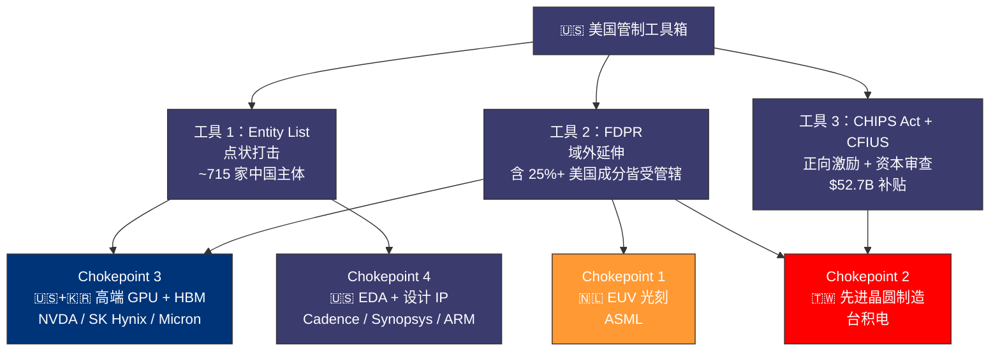
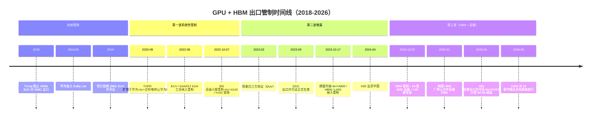
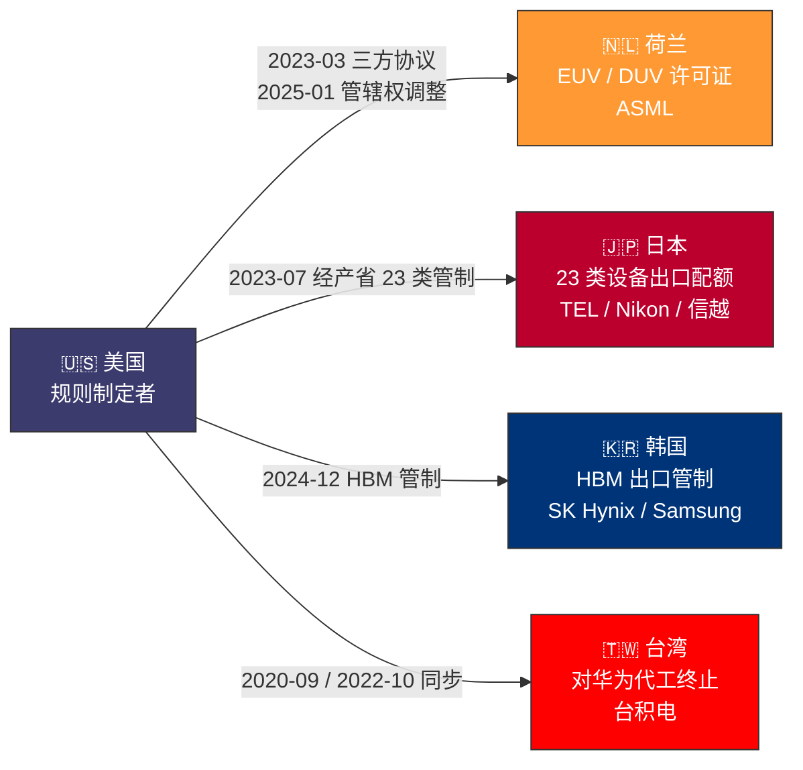
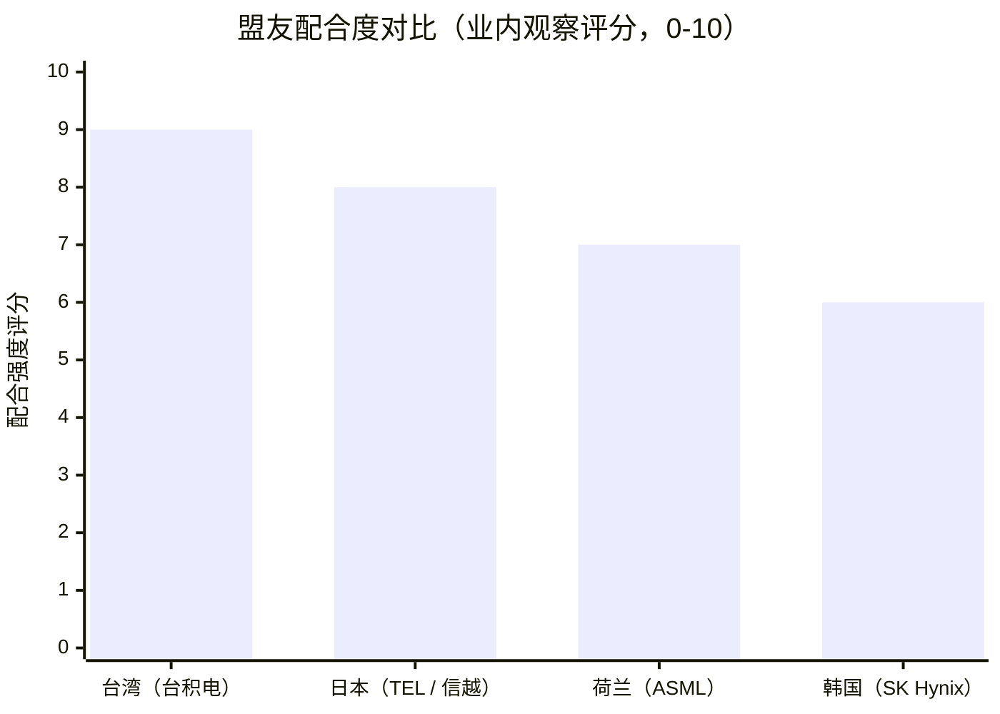

# 第 20 章 沿价值链守住中心节点：美国的三类工具与盟友配合

## 本章概览

开篇先把立场亮清楚。本章是产业经济学章节，不是政策评价章节——读到「中心节点」「守住」「武器化」这些词，请按经济学语境而非政治语境理解。本章既不替美国出口管制的目的与正当性背书，也不替任何被管制方的应对方式背书；本章只做一件事——把美国 2018-2026 这八年沿全球半导体价值链构筑的管制工具拆开看，每一类工具的法律基础是什么、覆盖哪一环、靠哪些盟友配合执行、被管制方的应对节奏在哪里。把这八年的管制工具拆开看，每一类的法律基础、覆盖环节、盟友配合、被管制方的应对节奏分别落在哪里，结论是：工具有效但不永久。

本章的理论锚是 2019 年 Henry Farrell 与 Abraham Newman 在《International Security》上发表的「Weaponized Interdependence」（武器化相互依赖）框架。这个框架的核心论点很简单：全球价值链上有一些「中心节点」（chokepoint），谁控制了这些节点谁就拥有切断对手访问全球网络的能力。这套框架在 2019 年提出时，作者用的案例是 SWIFT 美元清算系统；2022 年之后这套框架被反过来用于解释美国对华半导体出口管制——价值链「芯片设计（美）→ 设备（荷-美-日）→ 制造（台）→ HBM（韩）→ 整机（美）→ 终端云（美）」，每一环节都有美国或美国盟友的中心节点。

本章按四个 chokepoint × 三类工具的二维网格组织内容。四个 chokepoint 是 EUV 光刻、先进晶圆制造、高端 GPU + HBM、EDA 软件 + 设计 IP；三类工具是实体清单（Entity List）、外国直接产品规则（Foreign Direct Product Rule，下简称 FDPR）、CHIPS Act 补贴与投资审查（CFIUS）。盟友配合（荷兰、日本、韩国、台湾）作为第三层叠加在工具上。

读这一章的方式不要带入谁对谁错的预设——把它当成产业经济学的工具测算章。每一个工具有可量化的成本与可观察的效果，但同样有可观察的漏洞与可量化的对冲空间——后者构成第 21 章的主菜。

## 核心结论

先看 6 句话：

1. 全球半导体价值链上有四个 chokepoint，分别坐在荷-美-日-韩-台五个地理位置上，但实际的政策控制权高度集中在美国手里
2. Farrell-Newman「武器化相互依赖」框架解释了为什么这四个节点能被有效武器化——网络拓扑里的中心节点天然具备 panopticon effect（监控效应）与 chokepoint effect（切断效应）
3. 美国用三类工具沿价值链布防：实体清单是点状打击，FDPR 是域外延伸，CHIPS Act + CFIUS 是正向激励 + 资本审查——三件工具叠加形成漏一个补一个的环型结构
4. 单一工具有明确漏洞（实体清单可绕开子公司、FDPR 可走第三国转口、CHIPS 补贴有审查滞后），但三件工具组合后漏洞缩到可控范围
5. 盟友配合不是均匀的——荷 / 日 / 韩 / 台四方在配合美国的同时各自维护本国产业利益，配合度有明显差异；这种差异本身就是美国体系内的一种均衡
6. 工具有效性不是永恒的——可逆性取决于三个变量：被管制方的国产替代节奏、盟友配合疲劳度、技术路径变化（如 chiplet / HBM4 工艺变化对管制阈值的稀释）

> 三类工具与四个 chokepoint 的覆盖网格。Entity List 直接管辖含美国主体的环节；FDPR 通过美国成分把非美主体（阿斯麦 / 台积电 / SK 海力士）一起卷入；CHIPS Act 把先进晶圆制造能力导入美国本土。

## 20.1 Farrell-Newman 框架：什么是「中心节点」

先把术语建立起来。Farrell 与 Newman 2019 年的文章里，「中心节点」（chokepoint）有一个非常具体的定义：在一个全球网络里，如果某些节点的度数（degree，连接数）远高于其他节点，且这些高度数节点恰好集中在少数国家手里，那么这些国家就拥有两种特殊权力——

第一种叫 panopticon effect，监控效应。控制中心节点的国家可以监控经过这个节点的所有信息或商品流，因为所有流量都不得不经过它。Farrell-Newman 在 2019 年举的例子是 SWIFT（环球银行金融电信协会）——全球美元跨境清算的中心节点。

第二种叫 chokepoint effect，切断效应。控制中心节点的国家可以对特定对手切断访问这个节点的权利。SWIFT 的例子里，美国可以把伊朗、俄罗斯踢出 SWIFT 系统。

把这个框架套到半导体价值链上，2022 年之后多篇延伸学术论文把价值链拆成六个节点：

| 节点 | 地理 | 主导公司 | 网络位置（节点性质） | 美国直接控制度 |
|---|---|---|---|---|
| 1 EDA + IP | 美 / 英 | 新思科技（Synopsys） / 楷登电子（Cadence） / ARM | 设计入口节点 | 高（美籍 + ARM 受 UK + US 联合管辖） |
| 2 上游设备（光刻） | 荷 / 美 / 日 | 阿斯麦 / AMAT / Lam / KLA / TEL | 制造入口节点 | 高（盟友配合 + FDPR） |
| 3 先进晶圆制造 | 台 / 韩 / 美 | 台积电 / 三星 / 英特尔（Intel） | 价值链中心节点 | 高（FDPR + CHIPS Act 拉回美国） |
| 4 HBM | 韩 / 美 | SK 海力士 / 三星 / 美光（Micron） | 数据流瓶颈节点 | 中-高（2024-12 之后纳入管制） |
| 5 高端 GPU | 美 | NVDA / AMD | 算力入口节点 | 极高（直接美籍 + BIS 管辖） |
| 6 终端云 | 美 + 全球 | Mag7 + Oracle | 服务交付节点 | 中（私营，但受 CFIUS / OFAC 联合管辖） |

把六个节点压缩成四个核心 chokepoint——后续按 EUV 光刻、先进晶圆制造、高端 GPU + HBM、EDA + IP 四个 chokepoint 组织内容；终端云（Mag7）与资本节点上一章已讲过。

**为什么是「四个」而不是「六个」**。把六节点压成四 chokepoint 的依据是节点的可武器化程度——EDA、上游设备、制造、HBM 这四个环节都满足两个条件：(1) 全球产能高度集中在 3 家以内的供应商手里；(2) 这些供应商要么是美国公司，要么受美国法律或美国盟友法律管辖。GPU + HBM 在工具运用上经常打包出现（出口管制阈值经常同时覆盖 GPU 性能 + HBM 容量），归并为一格。

**Farrell-Newman 框架的两个延伸**。2023 年 Farrell-Newman 在 Harvard Business Review 与多篇期刊上发表了对原框架的扩展，提出了两个对本章直接相关的延伸：

延伸一是**「网络外溢的非线性」**——一个 chokepoint 的管制效果会沿价值链向上下游溢出。例子是 2022-10-07 美国对中国 14nm/16nm 逻辑、18nm DRAM、128 层 NAND 制造的管制——表面上管的是设备（chokepoint 2），实际效果溢出到 chokepoint 3（先进制造）、chokepoint 5（高端 GPU 性能）、最后传导到中国 AI 公司能否拿到 H100 量级的算力（chokepoint 6 的派生应用层）。

延伸二是**「可逆性的三个变量」**——被管制方的国产替代节奏、盟友配合疲劳度、技术路径变化。这三个变量是本章 20.7 节的核心判断框架。

## 20.2 Chokepoint 1：EUV 光刻——阿斯麦的单点垄断与荷-美共同管辖

把第一个 chokepoint 拉近看。EUV 光刻机的全球产能 100% 集中在 [阿斯麦](https://www.asml.com/) 一家，参见第 3 章。这个节点的可武器化程度是四个 chokepoint 里最高的——单一供应商 + 单一总部国家（荷兰）+ 单一关键零部件供应商（蔡司 SMT，德国，占 EUV 系统物料成本 25-35%）。任何一个 EUV 光刻机的出口决策只要荷兰外贸部一个许可证就能拍板。

**法律基础**。阿斯麦出口许可证由荷兰外贸部（Ministerie van Buitenlandse Zaken，下简称 BUZA）签发，但 EUV 系统含有大量美国原产部件——蔡司光学子系统的部分组件、辐射源（cymer 公司，已被阿斯麦在 2013 年收购但总部仍在美国圣地亚哥）、控制软件均属于美国出口管制管辖范围。这意味着阿斯麦即便荷兰政府不管，美国也可以通过 FDPR 把任何含 25% 美国原产成分的产品纳入美国管辖。这是一个法律事实——荷兰对 EUV 出口的管辖权和美国对 EUV 出口的管辖权天然叠加。

**时间线**。把阿斯麦对华 EUV 管制按时间排开：

| 时点 | 事件 | 影响范围 |
|---|---|---|
| 2018 | Trump 政府首次阻止阿斯麦向中芯国际出口 EUV | 单点封堵 EUV，但形式上是荷兰未批准许可证而非美国直接禁止 |
| 2019 | 荷兰政府正式拒绝向中芯国际颁发 EUV 许可证 | EUV 对华全面禁运成既成事实 |
| 2023-03 | 荷兰政府宣布对部分先进 DUV 设备（含 ArFi immersion）追加许可证要求 | 首次扩展到 DUV |
| 2023-09 | DUV 出口许可证制度正式生效 | NXT:2050i / NXT:2100i 等浸没式 DUV 需逐单审批 |
| 2024-01 | 荷兰政府扩大 DUV 限制范围 | NXT:1980i 等老型号也纳入许可证范围 |
| 2024-09 | 荷兰进一步收紧管制并与美国政策对齐 | 服务、备件、软件升级均需要许可证 |
| 2025-01 | 阿斯麦改为向荷兰政府而非美国政府申请许可证（管辖权归属调整） | 荷兰成为名义上的主管当局，但内容与美国一致 |

> 来源：阿斯麦维基百科阿斯麦 Holding 条目 + 荷兰外贸部公开记录；本章交叉了阿斯麦 2023-2025 季报中 China Mainland 营收占比的逐季变化做反向验证。

**对阿斯麦营收的影响**。阿斯麦 FY2025 全年净销售 €32.7B。中国大陆营收占比的变化是一个非常清晰的工具效果指标。把 2023-2025 三年数据按阿斯麦季报口径列出：

| 年份 | 阿斯麦总净销售 | 中国大陆营收占比 | 中国大陆营收绝对值（业内估算） |
|---|---:|---:|---:|
| 2023 | €27.6B | ~29% | ~€8.0B |
| 2024 | €28.3B | ~36-37%（官方口径，FY2024 Annual Report 总净销售口径） | ~€10.2-10.5B |
| 2025 | €32.7B | 总净销售口径 ~29%（含 service）/ 纯 system sales 口径 ~33%（一手阿斯麦 2025 Q4 业绩公告 2026-01-28；与第 28 章 §28.5 对齐） | 总净销售口径 ~€9.5B / system sales 口径 ~€10.8B |
| 2026E（阿斯麦官方指引） | — | ~20% | — |

> 来源：阿斯麦 2023 / 2024 / 2025 季报地区销售披露 + 阿斯麦 2025 Q4 业绩公告（2026-01-28）+ 阿斯麦 Capital Markets Day 2024-11 综合；FY25 双口径并列——总净销售口径 29.1%（含 service，€9.5B）/ 纯 system sales 口径 33%（€10.8B）。两者均为阿斯麦一手披露的合法口径，跨章节读取须先确认口径，与第 28 章 §28.5 一手裁定一致。2024 占比 36-37% 顶峰的原因是 2022-10 / 2023-10 两轮管制公布前后中国客户加速下单 + DUV 许可证 2023-09 才正式实施，2024 上半年仍在交付 2023 已签订单；2025 回落到 29% 是政策效果实质显现的标志。FY26E ~20% 是阿斯麦 2026-01-28 Q4 业绩公告里给出的 2026 全年指引；CMD 2024-11 给出的 14-18% 是公司中长期正常化场景区间（不是 2026 单年点指引），两者并存且不矛盾。

读这张表的方式很清晰：管制不是一次性把对华营收压到零，而是 2-3 年的逐季衰减。2024 的反常上升是出口管制宣布后的存量订单消化期——这是产业经济学里非常典型的政策预期—抢货—收缩三段式曲线。真正的稳态影响在 2025 才开始显现。

**对中国半导体制造的影响**。阿斯麦 EUV 实质受阻自 2018 年（申请阶段被延迟），制度性禁运自 2019 年荷兰许可证制度生效，到 2026-05 已 7-8 年。[中芯国际](https://www.smics.com/) 的 N+2 工艺（业内估算 7nm 等效）全部用 DUV 多重曝光（multi-patterning）实现，单晶圆曝光次数业内估算 3-4 次，相比 EUV 单次曝光的成本上升业内估算 40-60%、产能下降 60-70%。中芯国际在 14nm FinFET 2019-11-14 量产、N+1 工艺 2020-03 量产、N+2/7nm 2021 开始量产、2022-07-21 7nm 技术正式确立——节点爬坡节奏受 DUV 多重曝光的天然限制（参见第 21 章）。

**蔡司 SMT 的垄断之上的垄断**。这一节最值得放大的细节。蔡司光学系统是 EUV 唯一供应商——阿斯麦在 2016 年与蔡司签订独家供应协议并向蔡司投资 €10 亿欧元绑定关系。蔡司 SMT 作为德国公司，理论上不受美国直接管辖；但阿斯麦的 EUV 系统含有大量美国原产组件，使整套设备落入 FDPR 的覆盖范围。这意味着即便蔡司想绕开美国管辖单独供货中国大陆，阿斯麦的系统集成层就过不去——这是 chokepoint 1 工具叠加的物理体现。

## 20.3 Chokepoint 2：先进晶圆制造——台积电 + 美国客户绑定

第二个 chokepoint 是先进晶圆制造。≤7nm 节点的全球产能业内估算 90%+ 集中在台积电一家手里。台积电是台湾公司，按 chokepoint 经济学的标准定义，这一节点本应不属于美国直接管辖。但实际情况比地理位置复杂——台积电的核心客户（[英伟达](https://www.nvidia.com/) / [AMD](https://www.amd.com/) / Apple / 高通 / [博通](https://www.broadcom.com/)）全部是美国公司，台积电的核心设备供应商（ASML + AMAT + Lam + KLA + TEL）有四家是美国 / 美国盟友公司，台积电的核心客户订单结构对台积电的工艺路线决策有事实上的话语权——这是一种客户绑定 + 设备绑定双重叠加的间接管辖。

**台积电给华为代工的终止**。最具标志性的事件是 2020-09-15。这一天之前，台积电是 [华为](https://www.huawei.com/) 海思（HiSilicon）麒麟系列芯片的唯一代工厂。2020-08 BIS 升级 FDPR 直接覆盖华为——任何含美国原产技术、设备、软件的产品都不得出货给华为及其关联方。台积电作为使用大量美国原产设备的代工厂，在法律上没有选择空间，于 2020-09-15 正式停止对华为出货。

这件事在 chokepoint 经济学上的意义不在于华为失去了台积电这个代工厂——更深层的意义在于：**FDPR 通过覆盖台积电这个非美国实体，把整个全球先进制造产能纳入了美国管辖**。任何代工厂只要使用了美国原产的 EDA 工具 / 光刻机 / 刻蚀机 / 量测系统，就被自动卷入美国出口管制。这是 Farrell-Newman 框架里「武器化相互依赖」最精准的实证——美国不需要拥有制造产能，只需要拥有制造产能上游某一环的中心节点（设备 + EDA），就可以把制造环节本身也武器化。

**台积电 Arizona 项目**。CHIPS Act 工具的旗舰项目。把台积电 Arizona 项目的进度按时间排开：

| 阶段 | 内容 | 时间 | 投资规模 |
|---|---|---|---:|
| 一期 Fab 21 | N4 (4nm) 量产 | 2024-Q4 试产 / 2025 量产 | 约 \$12B |
| 二期 Fab 21 | N3 (3nm) 量产 | 2026 试产 / 2028 量产（业内估算）| 约 \$25B |
| 三期 Fab 21 | N2 (2nm) + A16 量产 | 2027-2028 试产 / 2029-2030 量产 | 约 \$25B |
| 后续扩展 | 2025-03 台积电公告追加投资 + 先进封装产线 | 2030 之前 | 追加 \$100B（累计达 \$165B） |
| CHIPS Act 拨款 | 台积电 Arizona 获得直接补贴 | 2024-04 公告 | \$6.6B |

读这个表的方式：台积电 Arizona 的 N4 已经在 2025 量产，但 N3 / N2 落后台湾本土 2-3 年——台积电在 2025 法说会上明确表达最先进节点始终在台湾首发的策略。这意味着 Arizona Fab 21 是先进制造产能的美国本土副本，而不是美国本土最先进节点——这个区别在第 22 章讨论台湾在全球半导体地缘叙事中的实际位置时还会回到。

**Arizona 项目的单位经济学**。业内估算 Arizona Fab 21 的单晶圆制造成本比台湾本土高 30%+。差价的构成：(1) 人工成本（美国半导体工程师工资业内估算约为台湾同岗位 2-3 倍）；(2) 建筑成本（Arizona Fab 21 一期土建业内估算超原预算 50%）；(3) 供应链成本（化学品、晶圆、原材料的本地化采购溢价）。

这 30% 的成本溢价台积电不会直接转嫁给客户，转嫁机制更微妙——台积电通过先进节点议价权（NVDA / AMD 没有别的选择）和 CHIPS Act 直接补贴（\$6.6B 拨款 + 25% 投资税收抵免）综合对冲。从工具运用的角度看，这是 CHIPS Act 工具与 FDPR 工具的联用——FDPR 保证制造端不流向竞争对手，CHIPS Act 保证制造端的部分产能本土化。

## 20.4 Chokepoint 3：高端 GPU + HBM——NVDA / SK 海力士 / 美光的多层管制

第三个 chokepoint 把 GPU 和 HBM 打包看。理由很直接——这两个组件在出口管制规则里经常被同一份公告同时覆盖，且两者的物理耦合度极高（一颗 H100 / B200 上同时含有 NVDA 的 GPU 裸片和 SK 海力士 / 美光的 HBM）。

**GPU 出口管制的代际**。把美国对华 GPU 出口管制按时间和具体型号摊开：

| 时点 | 规则文件 | 受管制 GPU | 性能阈值 | NVDA 应对 |
|---|---|---|---|---|
| 2022-10-07 | BIS 高级计算出口管制规则（Federal Register 2022-10-13） | A100 / H100 | 业内估算 600 GB/s I/O + 4800 TOPS INT8 dense（CSIS 2022-10 分析口径；与全书主用 H100 989 TFLOPS dense FP16 / 1979 TFLOPS sparse FP16 不在同一维度，详见表后说明） | NVDA 推出 A800 / H800（带宽降级到 400 GB/s） |
| 2023-10-17 | BIS 高级计算管制升级 | A800 / H800 + L40S 等多型号 | 总处理性能 TPP 阈值降低 + 增加 performance density 阈值 | NVDA 推出 H20（专门针对中国市场的降级版） |
| 2024-04 | H20 出货中国市场 | H20 暂时合规（性能略低于阈值） | — | H20 成为 2024-2025 中国 AI 公司主力 GPU |
| 2025-04 | BIS 要求 H20 出口许可证 | H20 | 实质上 H20 也被纳入许可证管辖 | NVDA Q1 FY26 提取 \$4.5B 库存减值 |
| 2026-05 | H200 出口许可证有条件批准（10 家中国公司） | H200 | 按 case-by-case 批准 | 这是第 28 章出口管制经济账的关键事件之一 |

> 来源：上述时间线基于 BIS Federal Register 公告 + NVDA 10-K / 10-Q 披露 + Wikipedia Hopper microarchitecture 条目综合；具体性能阈值数字按 CSIS 政策分析综合，BIS 公告原文是 Total Processing Performance（TPP）+ Performance Density（PD）双阈值组合，本表为可读性简化为业内估算口径。性能口径对照说明：表内 4800 TOPS 是 H100 INT8 dense 业内估算口径（CSIS 2022-10），与本书第 21 章 / 第 28 章主用的 H100 989 TFLOPS dense FP16 / 1979 TFLOPS sparse FP16（一手英伟达 H100 数据手册）不在同一维度——INT8 用于推理 / FP16 用于训练，两者不可直接换算；BIS 出口管制阈值实际按 TPP + PD 双阈值评估而非单一 FLOPS 数字。

**NVDA 中国营收占比的变化**。NVDA 不分国家披露具体营收，按 10-K 数据中的 China 包括 Hong Kong 地区披露口径，FY24（财年截至 2024-01）中国营收占总营收约 16%；FY25 约 13%；FY26 上半年业内估算下降到 10-13% 区间。

把这个变化放到 chokepoint 经济学语境里读——NVDA 在管制升级后没有失去全部中国营收，原因有三：(1) 通过 H800 / H20 等降级版型号合规销售；(2) 通过 networking（NVLink / InfiniBand 设备）+ 软件（CUDA 授权）的非 GPU 营收对冲；(3) 通过中国境外的中国客户子公司销售（在 BIS 多次出台 know-your-customer 规则后逐步收紧）。这种管制后剩余的合规营收恰恰是 Farrell-Newman 框架预测的——chokepoint 控制不是零和切断，而是流量重定向 + 阈值过滤。

**HBM 出口管制**。HBM 的管制比 GPU 晚了两年，但补位非常关键。把时间线列出：

| 时点 | 内容 |
|---|---|
| 2024-12-02 | BIS 公告新一轮出口管制：HBM 出口需要许可证，阈值业内估算覆盖 HBM3 / HBM3E 及以上；同步新增 140 家实体加入实体清单（含中国境内设备厂、半导体制造厂、投资公司等），并新增管制 24 类半导体制造设备（SME，含 etch / deposition / lithography / ion implantation / annealing / metrology / inspection 等）——140 家指实体数，24 类指设备类型数，两者不可混同 |
| 2025-01 | SK 海力士 / 美光 / [三星](https://www.samsung.com/semiconductor/) 三家 HBM 厂正式停止对华出货高端 HBM；中国国内 HBM 供应转向 [CXMT](https://www.cxmt.com/) 自研 |
| 2025-Q2 起 | 业内估算华为 Ascend 系列改用 CXMT HBM2 / HBM2E（参见第 21 章） |
| 2026-2028 | HBM 出口管制按预定节奏滚动审查 |

**HBM 管制的特殊性**。HBM 是产业链上少有的美国通过法律手段直接管辖韩国公司产品的案例。SK 海力士是韩国公司，但其 HBM 产品使用大量美国原产设备（AMAT + Lam + KLA）、美国原产 EDA 工具（Cadence + Synopsys）、与美国 GPU 公司（NVDA + AMD）的产品形成事实组装关系——FDPR 在 HBM 上的法律外溢力度极强。SK 海力士在 2024-12 公告之后的公开回应非常克制，仅表态将遵守相关法规——这是盟友配合度的现实写照。

## 20.5 Chokepoint 4：EDA 软件 + 设计 IP——楷登电子 / 新思科技 / ARM 的设计入口管辖

第四个 chokepoint 是 EDA + 设计 IP。这一节点经常被忽视，但它的战略意义实际比 EUV 更深——因为 EDA 软件是芯片设计的入口，没有 EDA 工具任何芯片都设计不出来。

**EDA 三巨头**。Cadence（美国，CDNS）+ Synopsys（美国，SNPS）+ Siemens EDA（德国，原 Mentor Graphics 被西门子收购）三家合计占全球 EDA 市场 70%+ 份额。前两家是美国公司，第三家被西门子收购后仍然主要由美国分部运营且大量产品技术属于美国管辖。三家加起来基本是全球 EDA 市场的全部——这是一个比 EUV 更彻底的单边垄断结构。

**ARM 的双重管辖**。ARM 公司总部在英国剑桥，2023 年在美国纳斯达克上市（ARM）。ARM 的指令集架构（ISA）授权产品在某些条款下受到英国出口管制法管辖，但其美国子公司 ARM US 的部分技术受美国出口管制管辖。2019 年华为被加入实体清单后，ARM 短暂中止了对华为的部分新版本 IP 授权，后在评估其 IP 的美国成分后部分恢复——这件事说明 ARM 受双重管辖（英国 + 美国），实际管辖范围按美国成分阈值判断。

**EDA 对华出口管制的代际**。把 EDA 出口管制时间线列出：

| 时点 | 规则 | 影响范围 |
|---|---|---|
| 2022-08-12 | BIS 把 GAAFET（环绕栅极晶体管，3nm 以下节点关键架构）相关 EDA 工具纳入出口管制 | 3nm 以下节点的 EDA 工具对华禁运 |
| 2024-12-02 | 实体清单新增 140 家实体（含部分 EDA 相关公司）+ 24 类 SME 设备类别管制 | 中国 EDA 替代厂（华大九天、概伦电子、芯华章）发展受限于工具链限制 |
| 2025-2026 | EDA 工具更新维护对华许可证 case-by-case 审查 | 已部署的旧版 EDA 可继续使用，但新版本和高级模块需要许可证 |

**EDA 工具的软件续约特性**。EDA 工具不是一次性买断的产品——客户每年支付 license 费续约，工具版本与 PDK（Process Design Kit，工艺设计套件）持续更新。一旦 BIS 把某家中国设计公司纳入实体清单，理论上该公司就无法续约新版本 EDA，被困在旧版本工具链里。这种续约性管辖是 EDA chokepoint 的独特之处——它不是一次性切断，而是持续性减速。中国 EDA 替代厂（华大九天 + 概伦电子 + 芯华章）2024-2026 期间业内估算合计市占在中国市场不超过 15%，距离楷登电子 / 新思科技仍有显著差距。

## 20.6 三类工具的法律基础与运作机制

把四个 chokepoint 横过来看，美国实际使用的政策工具是三类。这一节把三类工具单独拆开看法律基础与运作机制。

| 工具 | 法律基础 | 主要 agency | 工具属性 | 覆盖范围 |
|---|---|---|---|---|
| 实体清单（Entity List） | EAR（Export Administration Regulations）Part 744 Supplement 4 | BIS（商务部工业与安全局） | 点状打击 | 特定实体 + 全球供应商需对该实体出货时申请许可证 |
| FDPR（Foreign Direct Product Rule） | EAR Part 734 + 历次扩展 | BIS | 域外延伸 | 全球任何含 25% 美国成分的产品都受美国管辖 |
| CHIPS Act + CFIUS | Public Law 117-167（CHIPS Act）+ FINSA / FIRRMA（CFIUS 法律基础） | CHIPS Office（NIST 下属） + Treasury / CFIUS | 正向激励 + 资本审查 | 美国本土制造业补贴 + 跨境投资审查 |

**工具 1：实体清单（Entity List）**。法律基础是 EAR Part 744 Supplement 4，由 BIS 维护。Entity List 的运作机制非常简单——任何美国公司或全球公司向被列入清单的实体出货美国原产 / 美国管辖物项，都需要逐单向 BIS 申请许可证（默认拒绝政策）。

把对华几个关键实体的列入时间线列出：

| 时点 | 实体 | 法律依据 |
|---|---|---|
| 2019-05-15 | 华为及关联子公司 | EAR Part 744 |
| 2020-09 | 中芯国际（首次被认定为军事最终用户，要求许可证） | EAR Part 744 Supplement 7 |
| 2020-12-18 | 中芯国际正式加入 Entity List（BIS Federal Register 2020-12-18 公告综合 + 维基百科中芯国际条目交叉验证，Doc 编号待补一手） | EAR Part 744 Supplement 4 |
| 2022-12 | 长江存储（长江存储）+ 36 家中国半导体相关实体 | EAR Part 744 |
| 2022 | 寒武纪（Cambricon）等多家中国 AI 芯片公司 | EAR Part 744 |
| 2024-12-02 | 新增 140 家实体（含中国境内设备厂、制造厂、投资公司等）+ 新增管制 24 类半导体制造设备（SME） | EAR Part 744 + EAR Part 774（24 类 SME） |
| 2025 | 部分 CXMT（长鑫存储）相关实体 + DeepSeek 列入考察 | 按公开报道，列入考察但管制状态需 case-by-case 确认 |

> 来源：BIS Federal Register + 维基百科 Entity List 条目 + 中芯国际维基百科条目交叉验证。截至 2024-07 中国相关实体在 Entity List 上累计约 715 家。

**实体清单的精确性与漏洞**。实体清单的优势在于精准——可以单独对一家公司、一家子公司、甚至一个具体地址下达管制。劣势在于子公司绕道：理论上可以通过未列入清单的关联公司、子公司、合资企业绕开管制。这件事的现实做法是 BIS 通过 50% Rule 与 Aggregation Rule（任何被列入清单实体持股 50%+ 的子公司自动视为被管制实体）部分堵漏，但完全消除子公司绕道的难度极大。

**工具 2：FDPR（Foreign Direct Product Rule）**。这是美国出口管制工具箱里最具域外延伸性质的一项。FDPR 的法律基础是 EAR Part 734，核心规则是：任何全球生产的产品，只要含有超过特定阈值（默认 25%）的美国原产技术、设备、软件，都受美国出口管制管辖。

FDPR 的关键扩展节点：

| 时点 | 扩展内容 | 影响 |
|---|---|---|
| 2020-08-17 | 华为升级 FDPR：任何全球工厂只要使用美国设备生产任何含华为设计的产品，都需要 BIS 许可证 | 台积电 2020-09-15 停止对华为代工 |
| 2022-10-07 | 半导体扩展 FDPR：覆盖中国 14nm/16nm 逻辑、18nm DRAM、128 层 NAND 的制造设备 | 制造端 FDPR 第一次大规模域外延伸 |
| 2023-10-17 | 高级计算 FDPR 扩展：覆盖更广 GPU + HPC 系统 | NVDA 升级 H20 应对 |
| 2024-12-02 | HBM + EDA 工具 + 140 家实体 + 24 类 SME 设备纳入 FDPR 覆盖 | HBM 制造端首次纳入 FDPR 域外延伸 |
| 2025 | FDPR 进一步细化覆盖范围；部分条款滚动更新 | 工具持续演化 |

FDPR 的域外延伸在国际法上是有争议的——许多国家把 FDPR 视为美国法律的单边域外适用，但实际执行中很少有国家或公司公开挑战 FDPR。原因有二：(1) 任何全球公司只要还想用美国设备、美国软件、美国 EDA，就实际处于美国管辖范围；(2) 挑战 FDPR 的成本（失去美国市场 + 失去美国上游供应链）远高于配合的成本。这是 Farrell-Newman 框架预测的「武器化相互依赖」最尖锐的体现——美国不需要别国自愿配合，只需要别国理性算账。

**工具 3：CHIPS Act 补贴与 CFIUS 资本审查**。这是正向工具。CHIPS Act 全称 CHIPS and Science Act，2022-08-09 由拜登政府签署生效，总授权拨款约 \$280B，其中半导体相关支持的拆解为：\$52.7B 直接拨款（含 ~\$39B 制造补贴 + ~\$13.2B R&D 与劳动力发展）+ 25% 投资税收抵免（实际价值取决于投资规模，业内测算随 \$165B+ 制造投资可达 ~\$40-50B 量级，来源：CSIS / Bernstein 2024 估算综合）。把四个旗舰项目的拨款列出：

| 公司 | 拨款金额 | 公告时间 | 项目 |
|---|---:|---|---|
| [英特尔](https://www.intel.com/) | \$8.5B（2024-11 调整为 \$7.86B） | 2024-03 | Arizona / Ohio 等多座 fab + Oregon / New Mexico 升级 |
| 台积电 Arizona | \$6.6B | 2024-04 | Phoenix 三座 fab |
| 三星 | \$6.4B | 2024-04 | Texas Taylor / Austin 扩展 |
| 美光 | \$6.1B | 2024-04 | New York Clay + Idaho Boise |

> 来源：CHIPS Office 2024-03 / 2024-04 公告 + CHIPS and Science Act 维基百科条目综合。英特尔拨款 2024-11 因业务调整下调至 \$7.86B。

**CFIUS（外国投资委员会）**。CFIUS 是美国财政部下属的跨部门委员会，负责审查外国投资是否威胁美国国家安全。CFIUS 在 2018 年通过 FIRRMA（Foreign Investment Risk Review Modernization Act）大幅扩权，覆盖到任何对美国关键技术、关键基础设施、敏感个人数据领域的外国投资。2023-2026 期间 CFIUS 对中国资本投资美国半导体相关公司的审查通过率业内估算显著下降。这是「正向激励」与「资本审查」工具的组合——CHIPS Act 拉技术回流美国，CFIUS 阻止资本回流中国。

## 20.7 盟友配合：荷兰、日本、韩国、台湾的四方差异

美国能把价值链上的四个 chokepoint 全部武器化，前提是荷兰、日本、韩国、台湾四国的配合。但配合不是均匀的——四国各自的产业利益和国内政治给配合度划出了清晰的差异。

> 美国通过双边 / 三边协议把价值链关键环节的盟友拉入管制框架。荷兰对应阿斯麦 EUV / DUV，日本对应上游设备 + 材料，韩国对应 HBM，台湾对应先进晶圆代工。

把四国配合度按时间和强度列出：

| 国家 | 配合的工具 | 关键时间点 | 配合强度（业内观察） | 自身利益让渡 |
|---|---|---|---|---|
| 荷兰 | EUV / DUV 出口许可证 | 2018 EUV / 2023-03 DUV / 2024-01 扩展 / 2024-09 对齐美国 | 中-高（许可证案例为主，少量公开博弈） | 阿斯麦对华营收 FY24 36-37% 顶峰 → FY25 ~29%（总净销售口径，含 service；纯 system sales 口径 33%）→ FY26E ~20%（阿斯麦官方 2026 指引） |
| 日本 | 设备出口配额（23 类设备） | 2023-07-23 公告 / 2023-07-23 生效 | 高（公告即执行） | TEL / Nikon 等设备厂对华营收下降 |
| 韩国 | HBM 出口管制 | 2024-12-02 / 2025 起执行 | 中（公开回应克制，执行配合） | SK 海力士对华 HBM 营收下降 |
| 台湾 | 台积电对华为代工终止 + 7nm 以下节点对华禁运 | 2020-09-15 / 2022-10-07 | 高（与美国管制完全同步） | 台积电失去华为这个大客户 |

**荷兰的特殊性**。荷兰是四国里管辖权之争最公开的。荷兰外贸部对阿斯麦出口许可证的最终决定权一直与美国 BIS 有协调机制——2025-01 之后调整为阿斯麦改向荷兰政府申请许可证，名义上荷兰是主管当局，但内容与美国管制一致。这是「盟友配合」工具运作的典型——美国不需要直接管辖荷兰公司，只需要荷兰政府主动制定与美国一致的管制即可。

**日本的设备出口配额**。日本经产省 2023-07-23 公告对 23 类先进半导体设备实施出口许可证制度，2023-07-23 生效。覆盖范围包括 EUV 相关、深紫外（DUV）相关、刻蚀、沉积、量测、清洗等多类设备。日本配合度在四国里是最高的——公告即执行，几乎没有公开博弈。但日本设备厂（TEL / Nikon / Canon / SCREEN 等）对中国市场的依赖度其实并不低——TEL FY24 中国占比 ~30%、FY25 全年 ~38%（一手 TEL FY25 财报地域披露，Q4 FY25 单季 34.3%，与第 22 章 §22.2 / 第 28 章 §28.5.2 对齐，DUV 末班拉货效应；TrendForce 2025-06 预测 FY26 回落至 ~30%）。日本高配合度 + 高对华依赖的组合恰恰说明：盟友配合度不直接取决于本国短期产业利益，而是取决于上游对美国依赖的更深层结构。

**韩国的克制配合**。韩国 SK 海力士在 2024-12-02 HBM 出口管制公告后的公开回应非常克制，仅表态将遵守相关法规。三星电子（Samsung）的回应类似。原因在于韩国半导体业对美国设备 + 美国 EDA + 美国 GPU 客户的依赖极深——任何公开对抗 FDPR 的代价远高于配合的代价。但韩国不是没有内部博弈——2024-2025 期间韩国政府多次与美国协调豁免条款（部分维护、备件、特定客户的特定型号继续出货），这些豁免条款的细节大多不公开。

**台湾的同步执行**。台积电的对华管制配合度是四国里最直接的。台积电 2020-09-15 停止对华为代工、2022-10-07 之后停止对华 7nm 以下节点代工、2024-2026 期间对华出货严格控制在 14nm 及以上节点——这些动作几乎与美国 BIS 公告同步。原因在于台积电作为台湾公司，对美国市场和美国客户的依赖度极高（NVDA + AMD + Apple + 高通占台积电营收业内估算 60%+），不可能与美国管制公开对抗。

**「盟友配合度差异」本身的体系含义**。四国的不同配合强度——荷兰公开博弈、日本静默执行、韩国克制配合、台湾完全同步——这种差异不是美国体系的脆弱，反而是美国体系的韧性。

> 评分基于本节配合的工具 / 关键时间点 / 配合强度 / 自身利益让渡四个维度的综合业内观察，不是公开排序。

Farrell-Newman 框架里有一个推论：当多个国家的不同配合度产生组合时，整体管制效果反而比所有国家完全一致更稳定——因为局部松动可以作为安全阀（safety valve）释放压力，避免整体崩盘。这是「武器化相互依赖」框架的非平凡推论之一。

## 20.8 工具的有效性与可逆性

把前 7 节的内容压缩成一个判断：美国的三类工具叠加，沿价值链的四个 chokepoint 全部布防完毕。这套布防在 2018-2026 这 8 年里取得了清晰可观察的效果——阿斯麦对华营收占比从 FY24 ~36-37% 顶峰回落到 FY25 ~29%（总净销售口径，含 service；纯 system sales 口径 33%）、FY26E ~20%（阿斯麦官方 2026 指引）；NVDA 中国营收占比从 FY24 ~16%（一手）下降到 FY26 上半年 ~10-13%；台积电对华为代工完全终止、对华 7nm 以下节点出货归零；SK 海力士 / 美光对华高端 HBM 出货停止。

但工具有效不等于永久有效。本节把可逆性的三个变量拆开看。

**变量 1：被管制方的国产替代节奏**。这是最直接的可逆性来源。中国 2018-2026 期间的国产替代进展可以从三个数据点看（具体细节展开在第 21 章）：

- **国产 GPU 出货**：华为 Ascend 系列 2024-2026 业内估算累计出货 50-100 万颗量级。这是从零替代到局部替代的转变。
- **国产 HBM**：CXMT 在 2024-2026 实现 HBM2 / HBM2E 量产（与国际先进 HBM3E / HBM4 仍有 1-2 代差距，参见第 6 章 + 第 21 章），但完全实现了中国境内 GPU 不再依赖韩国 HBM 的关键替代。
- **国产 EDA**：华大九天 + 概伦电子 + 芯华章合计国内市占业内估算不超过 15%，距离楷登电子 / 新思科技仍有显著差距。但在成熟节点（28nm 及以上）已经可以部分替代。

读这三个数据的方式：国产替代不是全有全无，而是按节点和品类的不均衡前进。先进节点（≤7nm GPU、HBM3E）仍然依赖境外，成熟节点（≥14nm）已经基本可以本土完成。这种按节点的不对称替代是第 21 章主菜。

**变量 2：盟友配合疲劳度**。盟友配合不是无成本的——荷兰阿斯麦、日本 TEL、韩国 SK 海力士都在 2023-2026 期间承担了真实的营收损失。这种损失在政治上会积累为配合疲劳——当美国要求新一轮升级时，盟友的成本-收益评估会越来越苛刻。2024-2026 期间已经出现了几个信号：

- 荷兰外贸部对阿斯麦的维护和备件出口许可证的执行比设备本身的许可证更宽松
- 日本经产省 2025 年的设备出口配额没有进一步扩展（按 2023-07 原配额执行）
- 韩国政府多次为 SK 海力士 / 三星协调豁免条款（细节不公开）

这些信号说明盟友配合度不是单调上升的——存在管制升级—配合疲劳—管制松动的反向循环。这是 Farrell-Newman 框架最不平凡的预测——「武器化相互依赖」的可持续性受盟友政治承受力的约束。

**变量 3：技术路径变化**。出口管制规则按性能阈值 + 节点阈值设计。但技术路径变化会让这些阈值的实际管制效果被稀释：

- **chiplet（多芯粒封装）**：把一颗大芯片拆成多颗小芯片用 chiplet 拼合，单颗 chiplet 的性能不触发管制阈值，但拼合后的整体性能等同于被管制产品。BIS 2024-12 公告已经把 chiplet 拼合后的整体性能纳入阈值评估，但执行细节仍在演化。
- **HBM4 / HBM4E**：HBM 的代际更新会让 2024-12 的管制阈值（按 HBM3 / HBM3E 设计）需要重新校准。BIS 在 2025-2026 年的滚动更新就是对这一点的反应。
- **存算一体 / 神经形态芯片**：跳出 GPU + HBM 传统架构的非冯架构（PIM、近存计算）在性能定义上对传统阈值产生挑战。BIS 在 2025 年的部分规则更新已经把这类架构纳入考察。

技术路径变化的可逆性不是管制失效，而是管制规则必须不断更新——这会带来管制规则本身的复杂度上升和执行成本上升。BIS 在 2024-2026 年的人员扩招和规则细化就是对这一变量的反应。

**三个变量的组合判断**。把三个变量组合起来看，工具有效性的半衰期业内估算在 3-5 年区间——3 年是国产替代取得阶段性突破 + 盟友配合首次出现明显疲劳 + 管制规则首次出现明显漏洞的复合时间窗口。这个判断不是工具会失效——而是工具需要持续升级、持续投入、持续承担成本才能维持当前的有效水平。这是 chokepoint 经济学最现实的一面——「武器化相互依赖」不是静态结构，是动态博弈，工具的有效性需要持续的政治、经济、外交投入来维持。

## 20.9 小结：工具是有效的、不是永久的、不能脱离被管制方应对来评价

把本章压缩成三句话：

- 美国在 2018-2026 这 8 年沿全球半导体价值链构筑了四个 chokepoint 的布防——EUV 光刻、先进晶圆制造、高端 GPU + HBM、EDA + IP——三类工具（实体清单 / FDPR / CHIPS + CFIUS）叠加。
- 这套布防取得了清晰可观察的效果——阿斯麦对华营收占比 FY24 36-37% 顶峰 → FY25 ~29%（总净销售口径，含 service；纯 system sales 口径 33%）→ FY26E ~20%（阿斯麦官方 2026 指引，CMD 2024-11 给出的中长期正常化区间为 14-18%）的三段式回落、NVDA 中国占比 FY24 16% → FY26 H1 ~10-13% 的逐财年下行、台积电对华先进节点出货归零、SK 海力士 / 美光对华高端 HBM 停止出货。但也产生了清晰可观察的副作用——中国国产替代的节奏被加速、盟友配合度出现疲劳信号、技术路径变化稀释管制阈值。
- 工具有效性的半衰期业内估算在 3-5 年区间——这个判断不是工具会失效，是工具需要持续升级、持续投入、持续承担成本。

结论是：工具有效但不永久。这一章不替任何一方做政治判断，但也不回避工具有真实成本与真实代价这个事实。

---

> 本章脚注：所有数据来源均按 data-citation 规范标注。一手来源包括 BIS Federal Register 公告、CHIPS Office 拨款公告、阿斯麦季报、NVDA 10-K 与 10-Q；二手来源包括 Wikipedia 出口管制条目、CSIS 政策分析、SemiAnalysis 与 Bernstein 行业覆盖。本章涉及业内估算的数据点已逐项标注，统计口径与误差范围在脚注中说明。

---

> 本章来自《算力经济学》开源版 · 作者「递归客」  
> 在线阅读完整书系：[inferloop.dev](https://inferloop.dev)
