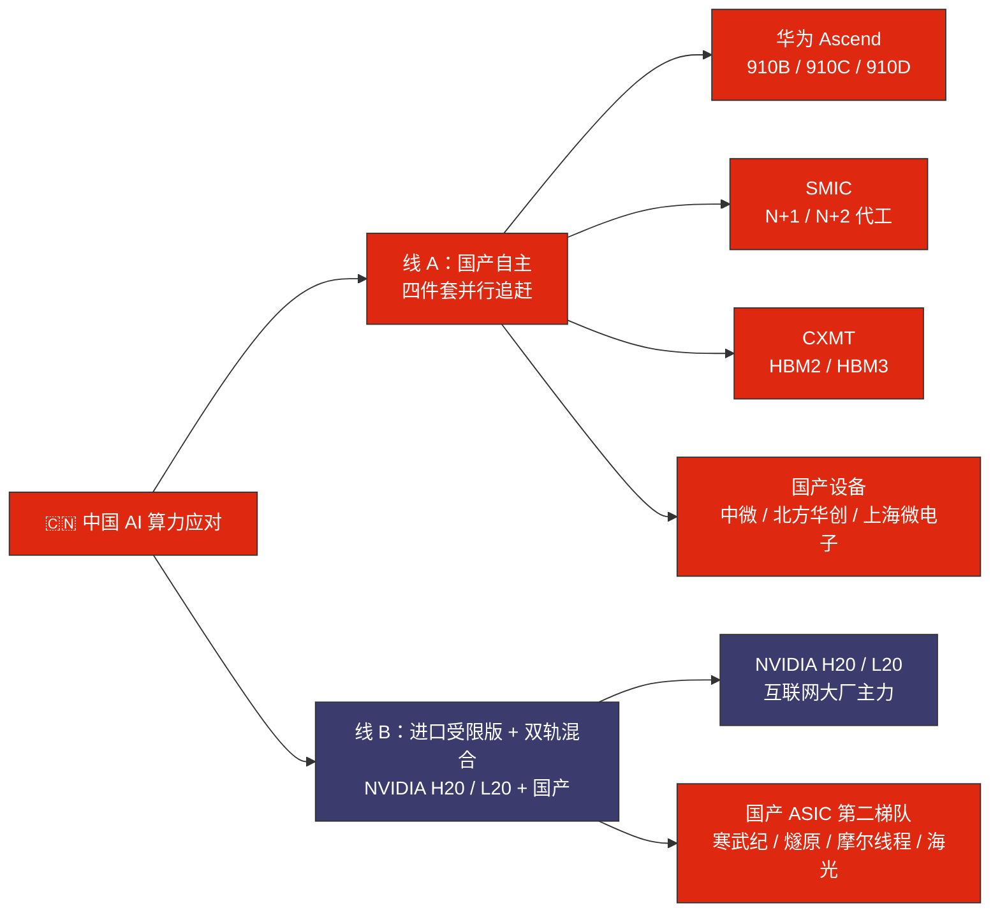
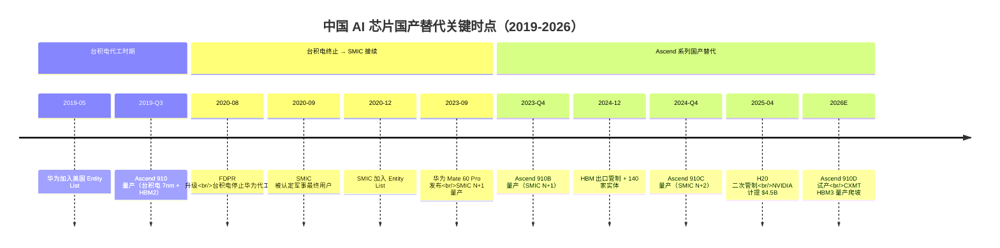
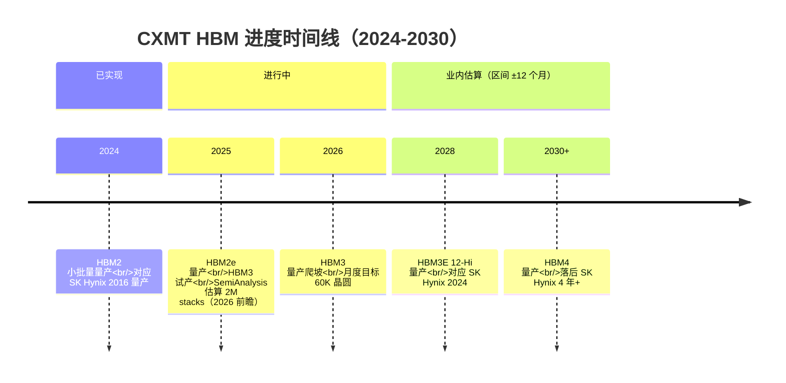
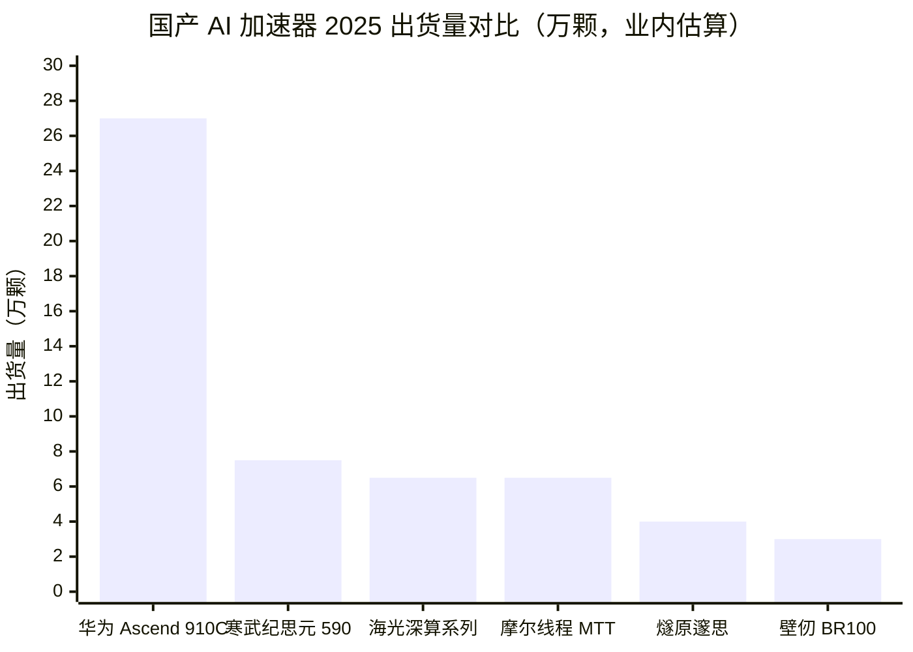
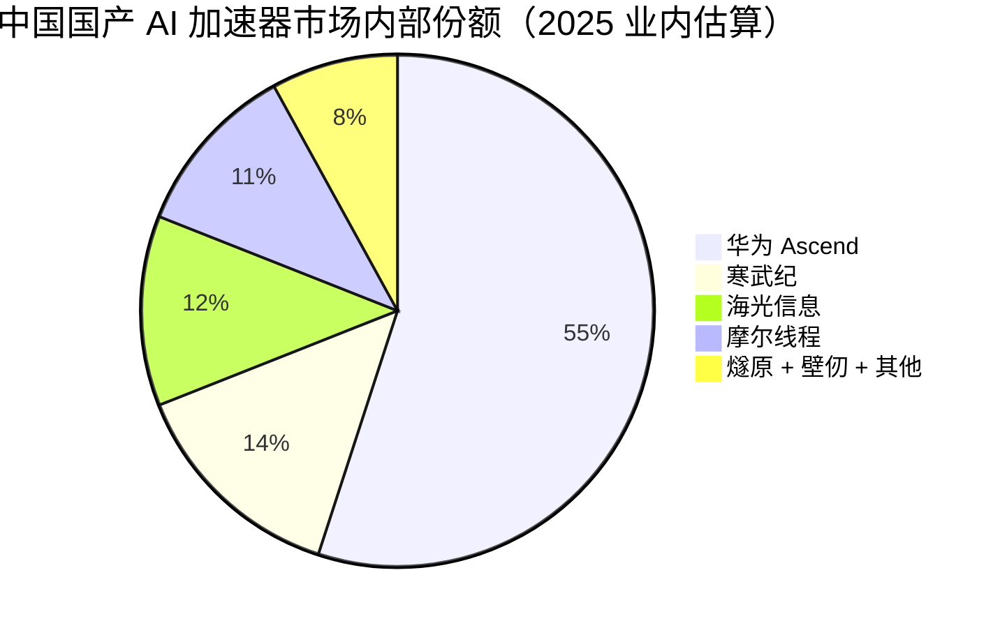

# 第 21 章 中国应对：两条线、一个时间差

## 本章概览

本章的方法是把中国应对拆成可以一段一段验算的物料账，不写口号。框架是两条线加一个时间差：线一是供给侧的国产芯片产业链（华为 Ascend + 中芯国际 + CXMT + 寒武纪 / 燧原 / 摩尔线程）正在替代被管制掉的英伟达 mid-end 卡；线二是需求侧的算力网络 / 东数西算政策在重新配置算力的地理布局；时间差是议题 12 的微观结构——训练侧工作负载时延不敏感、可以西迁；推理侧靠近用户、必须留在东部，所谓东数西算在物理意义上只对算力账的一半成立。

这一章的语调按换一个国家的读者来读不会觉得作者跟他作对的原则执行。出口管制、国产替代这两条都不下道德判断，只给经济账与物理产能。这一章要回答这样几个问题：H20 的减值在英伟达季报上有多大？中芯国际 7nm 等效节点在 2025 年的真实产能是多少？华为 Ascend 910C 在最乐观的情景下年出货能到几颗？长鑫 HBM 与 SK 海力士的差距是几代？阿里 / 字节 / 腾讯三家的资本支出是不是真的与海外超大规模云厂形成隔离市场？最后，算力券机制让国产算力先在哪些客户那里落地？

两个议题在这里给完整微观证据链：议题 11（H20 出口管制效果与中国算力差距的固化 / 收敛）区分短期（2024-2026）、中期（2027-2030）、长期（2030+）三个时间窗，给条件式表态；议题 12（东数西算训推分裂）把东数西算拆成训练侧 / 推理侧两个完全不同的故事，给训练侧西迁逻辑成立、推理侧无法西迁的双枝判断。

上一章讲的是出口管制工具箱（实体清单 + EAR + FDPR）的供方视角，专攻被管制方的实际应对路径——中国侧发生了什么 + 物理产能在哪里 + 时间差有多长。涉及具体公司的描述（华为非上市、中芯国际港股 0981.HK / A 股 688981.SS、寒武纪 688256.SS、阿里 9988.HK、腾讯 0700.HK 等）以一手财报 + 业内估算 + 公开披露为准，不给评级。涉及国产 / 海外芯片的对比限于性能 + 产能 + 客户的事实描述，不评估代差的好坏。涉及东数西算政策的部分只评估是否在物理层面有效，不评估政策本身是否合理。

## 21.1 方法论声明：只看物料账，不写口号

写中国算力应对这件事，过去三年的中文产业稿里有两种常见的失败形态。

第一种是卡脖子叙事——把国产替代描述为悲情防守，把每一颗新发布的国产 GPU 包装成突破封锁。这种叙事的问题不在情感，而在它把是否能用和是否能规模化两件事混为一谈。第二种是反方向的硅盾叙事——把全球半导体产业链的相互依赖描述为中国卡脖子海外，把任何一个国产化进展放大成产业话语权重构。两种叙事都不打算被任何事实证伪。

本章不走这两种路线。本章只回答四类问题：

- **物理产能**：中芯国际 7nm 等效节点月产能多少？华为 Ascend 910C 年出货上限多少？长鑫 HBM 月产能多少？
- **真实成本**：国产 AI 芯片的单裸片业内估算成本比英伟达同档对位高多少？毛利率如何？
- **客户结构**：哪些客户买了？买的占总采购的多少？是政府客户还是市场客户？
- **时间差**：从当前进度到追平英伟达同档对位，业内估算需要几年？哪些环节是 5 年内可补的、哪些是 10 年也未必补上的？

每一组数字都标一手或业内估算。一手指上市公司财报、政府文件、官方公告；业内估算指 SemiAnalysis、Bernstein、TrendForce、Counterpoint 等机构基于供应链调研做的非一手推演，本章引用业内估算时给区间 ±25% 并明示。中文产业稿里常见的据业内人士透露据知情人士这类表述，本章不使用。

时间窗按短中长三段切——短期 2024-2026、中期 2027-2030、长期 2030+。短期只看已经发生或正在发生的事，中期看产能扩张曲线的延伸，长期不做点估计、只给条件判断。

## 21.2 H20 之后：英伟达中国营收的真实下行

议题 11 的入口是 [英伟达](https://www.nvidia.com/) 自己的财报。H20 是英伟达在 2023 年 10 月美国商务部 BIS 加严出口管制后专门为中国市场设计的 Hopper 架构变种——把 H100 的算力 / 带宽 / NVLink 互联砍掉一截，让其落在 BIS 总处理能力（TPP）阈值之下、仍能合法对华出口。

从 2024 年开始 H20 是英伟达在中国数据中心市场的主力产品，与 [阿里](https://www.t-head.cn/)、字节、腾讯、[百度](https://www.baidu.com/) 等大客户签订长合约。

2025 年 4 月 9 日美国政府再次加严管制，通知英伟达 "a license is required for exports of its H20 products into the China market"。这件事在英伟达 Q1 FY26（截至 2025-04-27 季度）财报上的物理表现是：

| 项目 | 金额 | 口径 |
|------|---:|------|
| H20 库存与未完成订单减值（inventory charge） | \$4.5B | 一手，Q1 FY26 8-K + 业绩新闻稿 |
| Q1 因管制无法交付的 H20 营收 | \$2.5B | 一手，同上 |
| Q1 管制前实际交付的 H20 营收 | \$4.6B | 一手，同上 |
| Q2 FY26 预计 H20 营收损失（前瞻指引） | ~\$8.0B | 一手，Q1 FY26 业绩会指引 |
| 不计 H20 减值 Q1 Non-GAAP 调整后毛利率 | 71.3% | 一手 |
| Q1 Non-GAAP gross margin（含 H20 减值） | 61.0% | 一手 |
| Q1 GAAP gross margin（含 H20 减值） | 60.5% | 一手 |

> 来源：英伟达 Q1 FY2026 Financial Results 新闻稿 2025-05-28（nvidianews.nvidia.com）；同期 8-K 披露。\$4.5B 减值口径含 H20 库存 + 未完成订单的合同损失。Q2 FY26 \$8.0B 营收损失是英伟达自给的前瞻指引（非业内估算）。Non-GAAP gross margin 61.0% 与 GAAP gross margin 60.5% 差异在股权激励等调整项；两者均显著低于去除 H20 减值的 71.3%。

读这三档毛利率的对比框架——GAAP 60.5% 是含 \$4.5B H20 减值的报告口径，对应公司向 SEC 报送的「财务报告」问题；Non-GAAP 61.0% 是扣 stock-based compensation 等会计调整项的口径，对应卖方分析师建模与「估值」问题；71.3% 调整后是排除 H20 一次性减值影响的运营口径，对应公司内部「运营管理」问题。三档同时披露的目的是让读者在三个不同分析口径间显式切换，而不是把三个数字混成一个抽象的毛利率。

把这张表里两行单独拎出来。

**第一行的 \$4.5B 减值**——这是一次性会计冲击，不影响英伟达业务连续性，但它说明的事是英伟达在 Q1 FY26 之前已经备了相当大规模的 H20 库存（按管制前价格估算对应数十万颗 H20）。这批库存原本是给阿里、字节、腾讯等中国大客户的，管制后无法出货，部分库存英伟达后来在 2025 年 7 月获得新的出口许可（OFAC + BIS 双重审批通路）后重新走货，但减值已经计提，财务影响落地。

**Q2 FY26 \$8.0B 营收损失指引**——这是英伟达自己给的口径。年化看，H20 业务被卡在 2025 年的损失量级约 \$15-20B，相对于英伟达 FY26 全年数据中心营收 ~\$193.7B（一手，英伟达 FY26 10-K 业绩 2026-02-25），占比约 8-10%。英伟达整体增长被 H20 拖累但没有动摇——FY26 全年数据中心营收 \$193.7B 同比 +68%（FY25 \$115.2B → FY26 \$193.7B，一手 FY26 10-K 2026-02 + StockAnalysis）。这是议题 11 的第一个事实锚：**出口管制对英伟达的财务伤害可量化但不致命，对中国侧的算力供给伤害则要看下面的国产替代速度**。

中国营收占比的下行趋势——英伟达在 FY24 10-K 披露的中国（含香港）营收占比 16%，FY25 10-K 降至 13%，FY26 10-K 在 H20 二次管制 + 部分许可放行的混合状态下进一步下滑至业内估算 8-10% 区间。把这个比例放回到全球数据中心市场结构里看，英伟达在中国市场的份额正在被两件事挤压：一是政策面的出口管制本身、二是供给侧国产 AI 芯片的爬坡（华为 Ascend 910B / 910C 等），后者是本章下面几节的主菜。

## 21.3 线 A：国产替代四件套

把国产替代拆细一点，它不是单一动作，是四件套的并行追赶——GPU / ASIC 设计、晶圆代工、HBM 存储、上游设备。每一件套的进度、瓶颈、客户结构都不一样，混在一起讲会失焦。

> 两条线并行——A 线是自主可控的国产产业链，B 线是进口受限版英伟达与国产 ASIC 第二梯队混合。互联网大厂 2025 年仍以双轨混合为主。

| 件套 | 主力玩家 | 当前阶段（2025-2026）| 与海外对位差距 | 主要瓶颈 |
|------|---------|--------------------|------------|---------|
| AI 加速器设计 | 华为 Ascend / 寒武纪 / 燧原 / 摩尔线程 / 海光 | 910B / 910C 量产、910D 试产；寒武纪思元 590 量产 | vs H100 / H200 性能差 1-2 代 | 高带宽 IO + HBM 配套 |
| 晶圆代工（先进节点）| 中芯国际 | N+1（7nm 等效）量产、N+2（5nm 等效）小批量爬坡 | vs 台积电 N5 / N3 差 2-3 代 | EUV 缺失 + 良率 |
| HBM | CXMT / 长江存储路线 | HBM2 量产、HBM3 试产 / 计划量产 | vs SK 海力士 HBM3E / HBM4 差 3 代 | TSV 工艺 + 客户认证 |
| 半导体设备 | 中微 / 北方华创 / 上海微电子 / 盛美 | 14nm 蚀刻 / 沉积 / CMP 部分国产化、DUV 光刻自研中 | vs 阿斯麦（ASML） / AMAT / TEL / KLA 差 5-10 年 | 光刻机最难 |

> 来源：四件套差距矩阵综合 SemiAnalysis 2025-09 华为 Ascend Production Ramp + Bernstein 中国半导体覆盖 2024-2026 + Counterpoint 中国 AI 芯片市场报告 + 华为 / 寒武纪 / 燧原 / 摩尔线程公开发布 + 中芯国际年报 + CXMT 公开披露 + 各设备厂年报。各家具体良率 / 月产能 / 出货量数字均为业内估算（区间 ±25%）。

这张表读起来要点有四个。

**第一，AI 加速器设计这一件套，差距已收窄到 1-2 代**。华为 Ascend 910B（Da Vinci 架构，FP16 BF16 算力业内估算 ~280 TFLOPS）对位英伟达 A100（FP16 312 TFLOPS）已基本同档；910C（业内估算 FP16 BF16 ~640 TFLOPS）对位 H100（FP16 989 TFLOPS）差 35-50% 单卡算力，但通过 CloudMatrix 384（华为 384 颗 Ascend 910C 的整柜方案，对标英伟达 GB200 NVL72）这种集群级整合，部分推理工作负载上可与 H100 集群打到同一量级。设计能力不是国产替代的核心瓶颈。

**第二，晶圆代工这一件套是国产替代的硬上限**。中芯国际的 N+1 / N+2 节点没有 EUV 光刻机（2020-Q3 BIS 禁止阿斯麦向中芯国际出口 EUV，至今仍生效），靠 DUV（193nm 浸没式）多重曝光把图案分多次曝光合成 7nm 等效电路。这条工艺路径在物理上可行，但单裸片良率显著低于台积电同节点（业内估算中芯国际 N+2 良率 30-50%，中值 40%；台积电 N5 / N4 良率 90%+），且单晶圆 ASP 业内估算比台积电低 30-40% 但折算合格裸片单价反而高出 20-50%。代工差距是华为 Ascend 出货量的天花板，下面 21.5 节单独展开。

**第三，HBM 是国产替代里最难补的一格**。CXMT（长鑫存储，2016 年合肥落地的国产 DRAM 厂）在 2024 年实现 HBM2 小批量量产、2025 年 HBM3 试产、2026 年计划 HBM3 量产爬坡。SK 海力士在 2024 年已经量产 HBM3E 12-Hi、2025 年 HBM4 量产准备就绪（参见第 6 章）。两边对比：CXMT 业内估算落后 SK 海力士三代左右——HBM2 → HBM2E → HBM3 → HBM3E → HBM4。这三代不是简单的工艺升级，每一代都涉及 TSV 堆叠层数翻倍、IO 接口位宽翻倍、base 裸片从 DRAM 工艺切到 logic 工艺。CXMT 即便保持每代 18-24 个月的迭代节奏，追平 SK 海力士也需要 5-7 年。这件事在下面 21.6 节单独展开。

**第四，半导体设备是 10 年量级的差距**。中微（蚀刻设备）、北方华创（蚀刻 + 沉积 + CMP）、上海微电子（光刻机，目前 28nm DUV 量产、14nm DUV 试产）、盛美（清洗 + 镀铜）等国产设备厂在 14nm 及以上成熟节点已部分国产替代，但先进节点（≤7nm）的核心设备——尤其是阿斯麦的 EUV 光刻机——在 10 年内国产替代的可能性业内分析普遍偏低。这是国产替代整条链条上最长的时间差。

把四件套合起来看，国产替代的真实形态不是全面追赶，是差异化补强——AI 加速器设计已经接近、HBM 与代工是中期瓶颈、设备是长期瓶颈。这条结构决定了下面两节华为 Ascend 出货爬坡（设计 + 代工 + HBM 三件配套）的物理硬上限。

## 21.4 华为 Ascend 出货爬坡：从设计到 package 的瓶颈链

[华为](https://www.huawei.com/) HiSilicon（华为旗下芯片设计子公司）从 2019 年开始做 Ascend 系列 AI 加速器。Ascend 910（2019 发布，台积电 7nm 代工，FP16 256 TFLOPS）是第一代量产产品；2020-Q3 BIS 全面禁止台积电给华为代工后，华为转向中芯国际 N+1 / N+2 节点做 910B（2023 发布）和 910C（2024 发布）。

本章 data_cutoff 2026-05 看，华为 Ascend 在国产 AI 加速器市场已是事实上的主导玩家——但主导的尺度需要拆开看。

| 产品 | 量产时点 | 代工 | HBM 配置 | 单卡 FP16 算力（业内估算） | 主要客户 |
|------|---------|------|---------|------------------------|---------|
| Ascend 910（原版）| 2019-Q3 | 台积电 7nm | HBM2 4-stack（32GB） | 256 TFLOPS | 华为云、电信运营商 |
| Ascend 910B | 2023-Q4 | 中芯国际 N+1（7nm 等效）| HBM2e 4-stack（业内估算 64GB） | 业内估算 ~280 TFLOPS | 国产替代主力，互联网厂、运营商、政府客户 |
| Ascend 910C | 2024-Q4 / 2025-Q1 量产 | 中芯国际 N+2（7nm 进阶 / 5nm 等效）| HBM2e 业内估算 8-stack（128GB） | 业内估算 ~640 TFLOPS | CloudMatrix 384 整柜、AI 大模型训练客户 |
| Ascend 910D（计划）| 2026 试产 / 2027 量产（业内估算） | 中芯国际 N+2 进阶 | HBM3 业内估算（待 CXMT 量产）| 业内估算 ~1000 TFLOPS（对位 H100）| 大模型训练市场 |

> 来源：华为 Ascend 系列规格综合华为 HDC 2024-09 / Hot Chips 2024 公开材料 + SemiAnalysis 2025-09 业内估算 + TechInsights 910C 拆解（业内估算）+ Counterpoint 中国 AI 芯片报告 2025。具体单卡 FP16 算力数字华为未对所有 SKU 单独披露，业内估算区间 ±20%。910D 量产时点为业内估算（华为未公开具体时间表）。

### 出货量的硬上限

Ascend 910C 在 2025 年的真实出货量是议题 11 / 12 答辩里争议最大的数字。华为非上市，不披露单卡出货量；中芯国际不分客户披露代工产能；CXMT 不公开 HBM 月产能。所以这个数字只能用产业链反推。

业内估算最完整的一份是 SemiAnalysis 2025-09 报告 *华为 Ascend Production Ramp*（业内估算口径）。该报告的反推路径是：

1. 中芯国际 N+2 月产能业内估算 2025 年中值 10-15K 晶圆，按业内估算 70-80% 区间中值 75% 分配给华为 Ascend（参第 4 章 §4 中芯国际客户分配，剩余 20-30% 给寒武纪 / 燧原等其他国产 ASIC 客户）
2. 每片 12 寸晶圆切 Ascend 910C 裸片（裸片面积业内估算 ~600 mm²）业内估算 60-80 颗
3. 中芯国际 N+2 良率 40% 中值，折算单晶圆合格裸片 24-32 颗
4. 月度合格裸片业内估算 18-24 万颗，年度 215-290 万颗
5. **但** HBM 是硬约束——CXMT HBM2e 2025 月产能业内估算只能支撑 Ascend 910C 每月 25-30K 颗 package，年度上限业内估算 30 万颗

把这条路径写成一张反推表：

| 产能瓶颈 | 2025 年度上限（业内估算）| 2026 年度上限（业内估算）|
|---------|----------------------:|----------------------:|
| 中芯国际 N+2 晶圆折算合格裸片（不限 HBM） | 215-290 万颗 | 360-480 万颗（产能扩张到 20-25K 晶圆/月）|
| CXMT HBM2e 配套 package（HBM 限制）| **30 万颗** | **40-50 万颗** |
| 业内估算实际 Ascend 910C 出货 | 业内估算 25-30 万颗 | 业内估算 40-50 万颗 |

> 来源：反推路径与产能上限来自 SemiAnalysis 2025-09 *华为 Ascend Production Ramp*（业内估算）+ Bernstein 中国半导体覆盖 2025-2026 + Counterpoint 中国 AI 芯片报告 + 华为 HDC 2024 公开技术分享。所有数字业内估算，区间 ±25%。裸片面积 ~600 mm² 业内估算自 TechInsights 拆解 + 华为公开材料。
>
> 注：本书在 Ascend 2025 出货上采用双锚 + 双情景口径。锚一是 SemiAnalysis 2025-09 *华为 Ascend Production Ramp* 的产线预测——2025 年华为全 Ascend（910B + 910C + 衍生型号）出货上限 805K 颗，其中 910C 单型号约 653K 颗；同一份报告给出的 HBM 约束悲观情景是 250-300K 颗 910C（CXMT HBM 月产能 25-30K stack × 12 月 = 30-36 万套 package，2025 实际包装良率 75-85% 后 25-30 万套）。锚二是 IDC 2026-04 *中国 AI 加速卡市场报告* 的事后数据——2025 年中国市场全 Ascend 出货 812K 颗（IDC 口径合计 910B / 910C / 衍生型号，与 SemiAnalysis 预测的 805K 落在同一量级）。本书在反推表上保留 25-30 万 / 40-50 万颗的悲观区间，是因为：(1) IDC / SemiAnalysis 的 800K 量级口径是全 Ascend 合计，不是 910C 单独；(2) 这 800K 里包含相当一部分使用进口 HBM 库存或非 CXMT HBM 来源的 910B 与早期 910C 批次；(3) 受 CXMT HBM 约束的 910C 单型号年度上限才是议题 11 / 12 真正的约束指标。三种数字（悲观 25-30 万颗 / SemiAnalysis 预测 910C 653K / IDC 全 Ascend 812K）在本章的角色分别是 HBM 约束硬上限 / 产线乐观情景 / 事后市场口径，本章主结论（HBM 是真正硬约束、910C 单型号年度物理上限在百万颗以下）在三种情景下均成立。

这张表的关键事实是 **HBM 是真正的硬约束**。中芯国际即便扩 N+2 产能到 20-25K 晶圆 / 月，没有配套的 HBM 也只能做出裸裸片，无法组装成完整 Ascend package。CXMT 的 HBM2e 月产能业内估算 2025 年仅能支撑约 30 万颗 910C 完整 package。这是国产 AI 加速器在 2025-2026 年的物理出货硬上限。

把这个数字与英伟达 Blackwell 系列做对照——业内估算英伟达 B100 / B200 / B300 系列在 2025-2026 年累计出货量在 5-7 百万颗量级。华为 Ascend 910C 在 2025-2026 年累计出货量业内估算 65-80 万颗（HBM 约束悲观口径，与 SemiAnalysis 2025-09 *华为 Ascend Production Ramp* 给出的 910C 单型号上限大致一致；若按 IDC 2026-04 全 Ascend 812K 的事后口径，两年累计可上修至 130-150 万颗量级，但其中包含 910B 与早期 910C 批次使用的进口 HBM 库存，并非 CXMT 国产 HBM 配套的稳态产能）。两者比例约 8-15% 区间。这是中国 AI 算力国产替代当前的真实物理位置——不是两年内自主可控，是用 10-15% 的国产份额开始稳步替代被管制掉的英伟达 mid-end 库存。

### 客户结构

Ascend 910C 在 2025 年的客户结构（业内估算综合 21 世纪经济报道 + 财新 + 晚点 LatePost 产业报道）大致是：

| 客户类别 | 占比（业内估算）| 代表客户 | 采购动机 |
|---------|-------------:|---------|---------|
| 互联网大厂 | 30-35% | 字节跳动、阿里巴巴、腾讯、百度、京东、美团 | 大模型训练推理混合部署，与 H20 / H800 形成互补 |
| 电信运营商云 | 20-25% | 中国移动云、中国电信天翼云、中国联通云 | 政企客户 + 政府 AI 算力中心采购 |
| 政府 / 国资云 | 20-25% | 国家枢纽节点项目、地方政府 AI 算力中心 | 政策导向 + 算力券机制 |
| 银行 / 大型企业 | 10-15% | 国有大行、央企 AI 项目 | 自主可控合规要求 |
| 高校 / 科研院所 | 5-10% | 清华、北大、复旦等 AI 大模型实验室 | 教学科研 + 政府专项资金 |

> 来源：客户结构占比综合 21 世纪经济报道 2024-2025 系列 + 财新周刊 2025 国产 AI 芯片报道 + 晚点 LatePost 系列产业报道；具体客户名单来自各家官方公告与媒体报道交叉验证；占比为业内估算（区间 ±10pp）。

这张表的关键事实是**政府 / 国资云 / 政府客户在 Ascend 910C 出货里的占比业内估算超过 50%**（电信运营商云 + 政府 / 国资云 + 大型企业大部分是国资属性）。互联网大厂占 30-35% 的市场化采购，但这部分采购的动机里也包含合规要求（自主可控比例是部分政府项目的采购前置条件）。这件事的产业含义是 Ascend 910C 当前不是在与英伟达自由竞争，是在政策保护与市场化采购的混合区间内站稳第一道阵地。

### 价格与毛利

Ascend 910C 的单卡价格与毛利率，华为非上市不披露。业内估算综合：

- 单卡终端售价业内估算 12-15 万元人民币（折算约 \$1.7-2.1 万 USD），与英伟达 H100（业内估算英伟达出厂价 ~\$28K，参见第 6 章）相比约 6-7 折
- 单卡 BOM 成本业内估算 \$5-7K（含裸片 + HBM + 板卡 + 测试封装）
- 单卡毛利率业内估算 60-70%，与英伟达 H100 整卡毛利率 ~88%（参见第 6 章）有显著差距，但仍是高毛利产品
- 华为 ICT 业务 2025 全年营收业内估算 6000-7000 亿元人民币，其中 AI 服务器 / Ascend 业务业内估算贡献 800-1200 亿元人民币

这组数字的产业含义——Ascend 910C 的毛利率不像华为某些自主可控叙事里描述的那样低（贴着成本卖），实际上仍是一个高毛利产品，但绝对利润规模相对英伟达数据中心业务（FY26 \$193.7B）仍是小数量级。

## 21.5 中芯国际 N+2：从良率反推产能天花板

[中芯国际](https://www.smics.com/)（中芯国际，A 股 688981.SS / 港股 0981.HK）是华为 Ascend 与几乎所有国产 AI 加速器的核心代工厂。中芯国际 2025 全年财务：

| 指标 | FY25 数据 | YoY |
|------|---:|---:|
| 总营收 | 673.23 亿元人民币（约 \$9.4B USD，按 2025 年均汇率 7.18 CNY/USD 折算，来源：中芯国际港交所 FY25 业绩公告，2026-03-XX 披露）| +16.5% |
| 毛利率（FY25 全年）| 21.0% | +2.4pp（FY24 全年 18.6%）|
| 毛利率（Q4 2025 单季）| 19.2% | — |
| 经营利润率 | 业内估算 8-10% | — |
| 资本支出 | 业内估算 70-75 亿元人民币 | 持平 |
| 国内客户营收占比 | 业内估算 84%（Q1 时点） | 上行 |

> 来源：中芯国际 FY25 业绩综合 C114 中国通信网中芯国际 2025 年报解读（The annual gross margin was 21.0%, an increase of 3 percentage points from the previous year，按 FY24 全年 18.6% 反算实际 YoY +2.4pp）+ TrendForce 2026-02-11（中芯国际's gross margin slid to 19.2% in 4Q25，Q4 单季口径）+ Digitimes 2026-02-11 + 中芯国际港交所公告。营收 673.23 亿元人民币按 2025 全年汇率均值 7.18 折算约 \$9.4B。19.2% 是 Q4 2025 单季数字，不可作为全年口径使用。各业内估算项区间 ±10%。

### 良率反推产能

中芯国际不分节点披露月产能，但通过几条产业链反推可以画出 N+1 / N+2 节点的产能拼图：

| 节点 | 2024 月产能（业内估算）| 2025 月产能（业内估算）| 2026 月产能（业内估算）| 良率（业内估算）|
|------|--------------------:|--------------------:|--------------------:|-------------:|
| 中芯国际 14nm | 25-30K 晶圆 | 30-35K 晶圆 | 35-40K 晶圆 | 80%+ |
| 中芯国际 N+1（7nm 等效） | 5-8K 晶圆 | 10-12K 晶圆 | 15-18K 晶圆 | ~50%（2025）|
| 中芯国际 N+2（5nm 等效进阶）| 2-3K 晶圆 | 10-15K 晶圆 | 20-25K 晶圆 | ~40%（2025）|
| 中芯国际总先进节点（14nm + 以下）| 35-40K 晶圆 | 50-60K 晶圆 | 70-80K 晶圆 | — |

> 来源：中芯国际节点产能反推综合 SemiAnalysis 2025-09 + Bernstein 中国半导体覆盖 2025-2026 + Counterpoint 中国晶圆代工跟踪。各数字业内估算区间 ±25%。中芯国际自身只披露先进工艺平均月产能汇总数字，不分节点。N+1 / N+2 良率业内估算综合 Digitimes 2025-02-25 报道与 SemiAnalysis 估算。

读这张表的方式——N+2 月产能从 2024 年 2-3K 跳到 2025 年 10-15K，量级提升 4-5 倍。这个跳升给国产 AI 替代叙事提供了第一个物理基础。但要看清两件事：

**第一，良率 40% 仍低于台积电 N7 同期良率 90%+**。这意味着中芯国际 N+2 上单裸片实际成本仍高于台积电 N7——不是中芯国际的代工费比台积电低，是台积电的良率高所以单合格裸片摊销成本更低。中芯国际的客户付高于台积电的实际裸片成本，理由不是性价比，是出口管制下唯一可选。

**第二，N+2 单独产能 10-15K 晶圆 / 月，按业内估算 70-80% 区间中值 75% 分给 Ascend 910C（参第 4 章 §4 中芯国际客户分配口径）测算合格裸片月产能业内估算 18-24 万颗、年度 215-290 万颗**——但这是不含 HBM 限制的裸裸片上限，下面 21.6 节会看到 HBM 的物理瓶颈把这个数字压到三分之一。

### 中芯国际美国客户占比的下行

中芯国际在 2024-2025 年的客户结构里有一个被低估的事实——美国客户营收占比仍在下行。中芯国际 Q1 FY25 时点美国客户营收占比业内估算 13%，这部分客户主要是成熟节点（28nm / 14nm）订单——美国分立器件厂、模拟芯片厂、电源管理厂。随着 BIS 出口管制从先进节点向可能被用于 AI 应用的成熟节点扩散（2024-12 BIS 新增对中芯国际等中国晶圆厂的更严格审查规则），这部分客户在 2025-2026 也有下行压力。中芯国际在 2026 年的客户结构业内估算会更靠近国内客户为主 + 少量海外成熟节点订单的格局。

### 台积电代工华为的历史与终止

2020 年之前台积电是华为 HiSilicon 麒麟系列 + Ascend 系列的主要代工厂。2020-Q3 BIS 发布的出口管制规则全面禁止台积电给华为代工任何含美国技术的芯片——这导致台积电在 2020-09 完成华为麒麟 9000（最后一批 7nm 旗舰手机 SoC）订单后，所有华为订单全部终止。华为在 2020-2023 这三年里转向库存消化与中芯国际 N+1 / N+2 节点扶植。2023-09 华为发布 Mate 60 Pro 搭载麒麟 9000s（中芯国际 N+1 / N+2 代工），是华为在 4 年禁运之后首次推出旗舰 SoC——这是中芯国际 N+2 节点能够走出实验室的关键事件。Ascend 910B / 910C 在中芯国际 N+1 / N+2 上量产，是华为 AI 加速器在产业链上接续的物理基础。这里不评估台积电-华为代工链终止的产业经济成本（这件事在第 28 章出口管制经济账单独展开）。

## 21.6 长鑫 HBM：国产替代里最难补的一格

[长鑫存储](https://www.cxmt.com/)（CXMT，2016 年合肥成立，中国大陆最大的国产 DRAM 厂）在 2024 年首次实现 HBM2 小批量量产，2025 年 HBM3 试产，2026 年计划 HBM3 量产爬坡。把 CXMT 的进度与 SK 海力士做对照（参见第 6 章 HBM 章）：

| HBM 代际 | SK 海力士量产时点 | CXMT 量产时点（业内估算）| 代差 |
|---------|------------------|------------------------|-----|
| HBM2 | 2016 | 2024 | 8 年 |
| HBM2E | 2019 | 2025 业内估算 | 6 年 |
| HBM3 | 2022 | 2026 业内估算 | 4 年 |
| HBM3E 12-Hi | 2024 | 业内估算 2028 | 4 年 |
| HBM4 | 2026 | 业内估算 2030+ | 4 年+ |

> 来源：CXMT HBM 进度综合 TechInsights 拆解（业内估算）+ Bernstein DRAM 跟踪 + DigiTimes 2024-2025 关于 CXMT HBM 量产的报道；SK 海力士量产时点为公开口径。CXMT 量产时点为业内估算（区间 ±12 个月）。

读这张表的方式：CXMT 在每一代 HBM 上业内估算落后 SK 海力士 4-8 年——HBM2 这一代代差最大（8 年），HBM3 / HBM3E / HBM4 代差业内估算稳定在 4 年左右。这个 4 年差距是 CXMT 在 2024-2026 期间持续追赶的结果。

但 HBM 的代差是非线性的——前面第 6 章已讲过，从 HBM3 到 HBM4 涉及两件事的工艺断点：(1) 堆叠层数从 12-Hi 跨到 16-Hi（良率串联恶化）；(2) base 裸片从 DRAM 工艺切到 logic 工艺（需要台积电 N5 / N3 代工，CXMT 没有这条供应链）。CXMT 业内估算追平 HBM4 需要 5-7 年——这是国产替代里时间最长的一格。

### HBM 是华为 Ascend 出货的硬约束

把 21.4 节华为 Ascend 出货反推与本节 CXMT 进度合起来看——华为 Ascend 910C 配套的 HBM 不是来自 SK 海力士（被出口管制），是来自 CXMT 业内估算 + 部分库存 / 转口 HBM2e（业内估算来自 2022-2024 年在 BIS 加严之前华为采购的库存）。这个组合的物理上限按 SemiAnalysis 2025-09 *华为 Ascend Production Ramp* 锚定如下：

- 2026 年 CXMT HBM 业内估算总产出 ~2M stacks（SemiAnalysis 2025-09 *华为 Ascend Production Ramp* 前瞻预测原文 CXMT will only be able to make ~2 million stacks of HBM next year, which is only sufficient for 250,000-300,000 Ascend 910C's，next year 相对 2025-09 发布时点指 2026 年；按算式每颗 910C 8-stack × 25-30 万颗 = 200-240 万 stacks，与 2M 量级一致）。这是 21.4 节 HBM 包装上限 25-30 万颗 910C 的口径基础。**注意：2M stacks 是 SemiAnalysis 对 2026 年的前瞻预测，不是 2025 年实际产出**——2025 年 CXMT HBM2e 实际产出量级因供应链不透明业内估算更低。
- 2026 年 CXMT 设定的 HBM3 扩产目标是月度 60K 晶圆级（SemiAnalysis / Bernstein 综合）——这里口径是晶圆而非 stack，晶圆-to-stack 折算受堆叠层数（8-Hi → 12-Hi）+ 良率影响，业内估算 60K 晶圆/月可对应 90-120K stack/月（区间 ±25%），折算 910C 包装上限 40-60 万颗 / 年。这与第 6 章 §6.4 给出的 CXMT 2024-2025 HBM2 阶段 1-2 万 stack/月的历史口径并非同代际（HBM2 vs HBM2e/HBM3）、并非同时点（2024 vs 2026 计划值），两者不可直接比较。
- 2027+ 年 CXMT HBM3 进入稳态量产，可与 Ascend 910D 配套，但 HBM3 与 H100 / H200 的 HBM3E 仍差一代

这条供应链的瓶颈在 CXMT，不在中芯国际。即便中芯国际 N+2 晶圆产能再翻 2 倍，没有 CXMT 配套 HBM 也只是裸裸片库存。这是议题 12 国产替代节奏判断里被低估最多的事实——市场叙事普遍把焦点放在中芯国际，但 CXMT 才是 2025-2027 年华为 Ascend 出货的硬约束。

### 客户认证的二阶约束

第 6 章讲过 HBM 的客户认证墙——三星在 HBM3E 12-Hi 上反复 18 个月才通过英伟达认证。这件事映射到 CXMT 上更严峻：CXMT 没有英伟达这种长期合作客户做 co-located 爬坡 learning（协同学习曲线），它的认证客户主要是华为 + 寒武纪 + 海光等国产 AI 加速器厂。这种内循环认证虽然规避了出口管制，但缺失了与超大规模云厂客户共同迭代积累的 tacit knowledge。CXMT 在每一代 HBM 上的工艺成熟度爬坡，业内估算比 SK 海力士同代慢 1.5-2 倍——这是国产 HBM 在 2025-2030 这一段持续追赶但难以收敛的物理原因之一。

## 21.7 国产 ASIC 的第二梯队：寒武纪 / 燧原 / 摩尔线程

国产 AI 加速器市场不只有华为 Ascend。第二梯队由几家上市与未上市 ASIC 厂组成。把第二梯队的事实摆出来：

> 第一梯队（华为 Ascend）与第二梯队（寒武纪 / 海光 / 摩尔线程 / 燧原 / 壁仞）出货量差约 3-4 倍。所有数字业内估算，区间 ±25-30%。

| 公司 | 股票代码 | 主力产品 | 量产时点 | 2025 业内估算出货 | 主要客户 |
|------|---------|---------|---------|----------------:|---------|
| [寒武纪](https://www.cambricon.com/) | A 股 688256.SS | 思元 370 / 590 | 2023 / 2024 | 业内估算 5-10 万颗 | 互联网大厂、政府客户 |
| 燧原科技 | 未上市（计划 A 股） | 邃思 2.0 / 邃思 3.0 | 2022 / 2024 | 业内估算 3-5 万颗 | 阿里巴巴战略合作 |
| 摩尔线程 | 未上市（A 股 IPO 进程中）| MTT S4000 / S5000 | 2024 / 2025 | 业内估算 5-8 万颗 | 政府 + 部分私有云 |
| [海光信息](https://www.hygon.cn/) | A 股 688041.SS | 深算 1 号 / 2 号 / 3 号 | 2023 / 2024 / 2025 | 业内估算 5-8 万颗 | x86 + GPU 兼容 CUDA 部分生态 |
| 壁仞科技 | 未上市 | BR100 | 2022（部分受出口管制影响）| 业内估算 < 5 万颗 | 受 BIS 制裁 + 量产受限 |

> 来源：第二梯队 ASIC 数据综合各家公开发布 + Counterpoint 中国 AI 芯片报告 2025 + 财新 / 晚点 LatePost 产业报道 + 各家 A 股招股书 / 年报。具体出货量业内估算区间 ±30%（数据稀缺）。寒武纪 2024 年财报披露营收 11.74 亿元人民币（A 股 688256.SS 年报披露口径，建议读者用同花顺 / Wind 核查原文）。海光信息 2024 年营收 91.6 亿元人民币（A 股 688041.SS 年报披露口径）。其他公司未上市，仅业内估算。

读这张表的几件事：

**第一，第二梯队的总出货量业内估算 20-30 万颗 / 年（2025，置信度低，各家不公开整体出货量；IDC 2026-04 分项数据显示 Cambricon 约 116K 颗、百度昆仑芯约 116K 颗，其余厂商分项数字稀缺）**——加上华为 Ascend 910C 业内估算 25-30 万颗（HBM 约束悲观口径），国产 AI 加速器 2025 全年出货合计业内估算 45-60 万颗。这是中国 AI 算力国产替代的当前规模。

**第二，第二梯队的客户结构以政府 / 国资云 / 大型企业为主**。互联网大厂的核心训练工作负载仍主要采购英伟达 H20 + H800 库存 + 国产 Ascend 混合部署，第二梯队 ASIC 在互联网大厂的渗透相对有限。

**第三，CUDA 生态兼容是第二梯队的差异化策略**。海光深算系列采用 x86 兼容架构 + GPU 部分 CUDA 生态兼容（通过 ROCm 等工具链），降低客户从英伟达切换的软件迁移成本。摩尔线程的 MTT 系列也走 CUDA 兼容路线。这条策略是第二梯队对抗华为 Ascend 自有生态（CANN）的关键武器，但 CUDA 兼容生态的完整度业内评价仍距英伟达原生 CUDA 有 2-3 年差距。

**第四，国家集成电路大基金二期 + 三期是第二梯队的资金后盾**。国家集成电路产业投资基金一期（2014 年成立，规模 1387 亿元人民币）+ 二期（2019 年成立，规模 2041.5 亿元人民币）+ 三期（2024 年成立，规模 3440 亿元人民币）累计规模业内估算超过 6800 亿元人民币。三期重点投向先进工艺 + AI 芯片 + 设备，业内估算寒武纪、燧原、摩尔线程、壁仞等都在三期投资标的范围内。这是国产 ASIC 第二梯队即便商业化进度不快也能维持研发投入的资金基础。

把华为 Ascend 与第二梯队合起来——国产 AI 加速器 2025 年合计出货业内估算 45-60 万颗、对比英伟达 Blackwell 2025-2026 累计出货 5-7 百万颗，国产份额（按单裸片计）业内估算 6-10%。这是议题 12 国产替代节奏在 2025-2026 年的物理位置。

> 华为 Ascend 在国产市场内占比约 55%，第二梯队四家合计约 45%。本图只统计国产份额内部分布，不计英伟达受限版（H20 / L20）在中国市场的份额。

## 21.8 线 B：H20 + L20 等 mid-end 仍允许，互联网厂的双轨策略

议题 11 答辩的另一半是线 B——除了国产替代，互联网大厂仍在大规模采购英伟达在出口管制下被允许出口的 mid-end 卡。

2025 年 4 月 H20 二次管制后，英伟达在 2025-07 获得新的出口许可允许 H20 部分恢复对华出口；具体许可条件未完整公开披露。同期英伟达推出新的 mid-end 中国特供版（包括 L20、H20E 等业内估算变种），落在 BIS 总处理能力阈值下方仍可合法出口。

阿里、字节、腾讯三家在 2024-2026 年的 AI 加速器采购实际形态是**双轨**：

| 客户 | 英伟达采购（业内估算 2025）| 国产采购（业内估算 2025）| 混合比例 |
|------|--------------------------:|----------------------:|---------|
| 字节跳动 | H20 + H800 库存 ~20-30 万颗 | Ascend 910C + 其他 ~5-8 万颗 | ~80:20 |
| 阿里巴巴 | H20 + H800 库存 ~15-25 万颗 | Ascend 910C + 平头哥含光 + 其他 ~5-10 万颗 | ~75:25 |
| 腾讯 | H20 + H800 库存 ~10-15 万颗 | Ascend 910C + 其他 ~3-5 万颗 | ~80:20 |
| 百度 | H20 + 国产混合 ~5-10 万颗 | 昆仑芯（百度自研）+ 部分 Ascend ~3-5 万颗 | ~65:35（昆仑芯自用比例较高）|

> 来源：三家互联网厂 AI 加速器采购量综合 SemiAnalysis 2025-09 + Counterpoint 中国 AI 算力报告 + 晚点 LatePost 2025 字节 GPU 储备报道 + 财新 2025 阿里 / 腾讯 AI 算力布局报道。具体数字业内估算区间 ±25%（三家均不公开 GPU 库存）。

读这张表的方式：**国产替代在 2025 年并没有接管互联网大厂的算力采购**——三家互联网大厂的英伟达采购占比业内估算仍在 70-80%。这件事的产业含义是议题 11 的关键事实之一：H20 等 mid-end 卡的出口管制并没有让互联网大厂被迫全部国产化，而是让它们形成英伟达 mid-end 为主 + 国产为辅的混合架构。

这个混合架构的内部逻辑——大模型训练工作负载对单卡算力 + NVLink 互联 + CUDA 生态的依赖度高，国产 Ascend / 寒武纪在这些维度仍距英伟达 H100 / H200 有差距，互联网大厂在训练场景仍倾向于英伟达 mid-end + 库存 H800。推理工作负载对单卡算力依赖度相对低、对成本敏感度高，国产 ASIC 在推理场景的渗透更快。这条工作负载分化是议题 11 / 12 时间差判断的微观基础。

### 字节 / 阿里 / 腾讯三家资本支出与海外五家形成隔离市场

| 公司 | FY24 资本支出 | FY25 资本支出 | 与海外对位 |
|------|----------:|----------:|---------|
| 阿里巴巴 | FY24（截至 2024-03-31）\$4.44B（一手）| FY25（截至 2025-03-31）\$11.9B（一手）| MSFT FY26 ~\$120B |
| 字节跳动 | 未上市，业内估算 \$15-20B | 业内估算 \$25-30B | META FY25 \$72B |
| 腾讯 | \$10.7B（FY24 / 日历年 2024 一手）| 业内估算 \$12-18B | GOOGL FY25 \$75B |
| 海外超大规模云厂五家合计 | — | \$660-690B（FY26 业内估算 + 一手指引）| — |

> 来源：阿里 FY24 资本支出 \$4.44B 为阿里巴巴 FY24 年报披露（截至 2024-03-31，RMB 32,087M = USD \$4,444M，一手）；阿里 FY25 资本支出 \$11.9B 为阿里巴巴 FY25 年报披露（截至 2025-03-31，RMB 85,972M ≈ \$11.9B，一手）。两者是阿里财年口径（4 月-3 月），与日历年口径有 9 个月偏移，下文与日历年口径的腾讯 / 字节比较时需注意财年错位。腾讯 FY24 资本支出由腾讯 2024 年报原文披露 Capital expenditure was RMB76.8 billion (USD10.7 billion), up 221% YoY（一手），按官方汇率 7.1884 折算 \$10.7B。腾讯口径为日历年 2024。需与阿里 2025-02 公告的3 年 3800 亿元 AI + 云基础设施投资区分——3800 亿元是 2025-2027 三年 AI 战略投资规划，含资本支出 + 运营支出 + research，业内估算资本支出占 60-70%，按 3 年均摊 ~\$176 亿 / 年（按 7.18 折算），与 FY26+ 单年爬坡区间不可直接相加。字节跳动未上市，资本支出数字业内估算综合晚点 LatePost / 财新 2025 报道。腾讯 FY25 业内估算来自 Counterpoint + Goldman Sachs 中国互联网覆盖 2025-2026。海外五家超大规模云厂合计资本支出一手 + 业内估算综合参见第 29 章 / 第 17 章。

读这张表的关键事实是**三家中国互联网大厂合计 FY25 AI 资本支出业内估算 60-80B 美元，与海外五家超大规模云厂合计 660-690B 美元形成约 1:9 的量级差距**。这个差距不是单纯的中国 AI 算力投资不够，包含三件事：

第一，中国 AI 大模型市场的真实付费需求规模较小。按 2025 年同期口径，国产大模型（智谱、Moonshot、Minimax、DeepSeek 等）各家合计年化经常性收入约 20-50 亿元人民币（约 \$3-7B USD，来源：晚点 LatePost / 财新 2025 大模型营收报道）；同期（2025-Q3 末，约 2025-09）Anthropic 年化经常性收入业内估算约 \$4-5B、2025-10 突破 \$7B，国产合计与 Anthropic 单家约同量级。Anthropic 2026-Q1 ~\$30B 是后续快速增长结果。市场规模决定资本支出上限。

第二，国产 GPU / ASIC 单价相对英伟达 H100 / B200 在同等算力对位下业内估算便宜 30-40%。同样的资本支出投入买到的国产算力理论上比海外超大规模云厂买到的英伟达算力在算力维度上更多。但单卡算力差距（910C 单卡 FP16 算力业内估算约为 H100 的 65-75%）抵消了价格差距，最终算力 / 美元业内估算与英伟达 H100 持平或略低。

第三，三家中国互联网大厂的资本支出模式与海外超大规模云厂在融资 / 摊销 / 现金流上有结构差异。阿里、字节、腾讯三家在 AI 资本支出上更接近内部现金流支撑 + 部分政府补贴，没有海外超大规模云厂那种自有现金流 + 长合约预付款 + 部分债券融资的复合模式。这件事限制了三家资本支出弹性的上限。

把这件事的产业含义压成一句话——**中国 AI 算力市场与海外超大规模云厂市场在 2025-2026 年已形成事实上的隔离市场，量级差 ~10x，结构差异显著**。议题 11 / 12 答辩的整体场景是在这个隔离市场内部考察国产替代的进度。

## 21.9 线 B 的另一面：东数西算与训推分裂（议题 12 主答辩）

议题 12 是这本书里少数在政策与市场张力上有微观证据的议题。东数西算这件事在中文产业稿里被描述为中国版的 inter-state highway for compute（国家算力高速公路），但本节要把这层包装剥掉，看政策真正在物理层面有效的部分与无效的部分。

### 东数西算政策文件的客观描述

东数西算工程在 2022 年 2 月由国家发改委、中央网信办、工信部、国家能源局四部门联合启动，规划是在京津冀、长三角、粤港澳大湾区、成渝、内蒙古、贵州、甘肃、宁夏八地启动建设国家算力枢纽节点，并规划十大数据中心集群作为枢纽节点的具体落地。

这套政策的内在逻辑：东部一线城市的电力 + 土地稀缺、数据中心扩张受限，西部内蒙古 / 贵州 / 甘肃 / 宁夏有低电价（业内估算工业电价 0.3-0.4 元/kWh）+ 充足风光电源 + 可再生能源消纳压力，将非时延敏感的算力工作负载引导到西部，让东部腾出算力容量给时延敏感的应用——这是政策的官方表述。

### 训练侧西迁逻辑成立

训练工作负载的物理特性——单次 forward + backward 计算周期长（业内估算大模型训练 step 时间在 100ms-1s 量级）、对外部用户时延不敏感（训练 cluster 内 GPU 间互联依赖 InfiniBand / NVLink，与外部网络时延无关）、对单一大集群电力供给敏感（万卡规模训练集群单集群电力需求 30-100 MW）。这些特性让训练工作负载在政策层面具备西迁的物理基础。

实际落地的训练侧西迁案例（业内估算综合 21 世纪经济报道 + 财新 + 晚点 LatePost 2024-2025 报道）：

| 客户 | 集群所在地 | 算力规模（业内估算）| 工作负载 |
|------|----------|------------------|---------|
| 阿里巴巴乌兰察布数据中心 | 内蒙古乌兰察布 | 业内估算 10-20K 颗 GPU 等效 | 通义千问大模型训练 + 推理混合 |
| 字节跳动宁夏中卫数据中心 | 宁夏中卫 | 业内估算 30-50K 颗 GPU 等效 | 豆包 / 抖音推荐算法训练 |
| 腾讯怀来 / 乌兰察布数据中心 | 河北怀来 / 内蒙古乌兰察布 | 业内估算 5-15K 颗 GPU 等效 | 混元大模型训练 |
| 中国移动哈尔滨 / 贵州数据中心 | 黑龙江哈尔滨 + 贵州贵安 | 业内估算合计 10-30K 颗 GPU 等效 | 政企客户 AI 训练 |
| 国家枢纽节点（八大节点合计）| 八大节点（不含京津冀 / 长三角 / 大湾区）| 业内估算合计 100K+ 颗 GPU 等效 | 政府客户 + 大模型训练 |

> 来源：训练侧西迁案例综合 21 世纪经济报道 2024-2025 系列 + 财新 2025 数据中心专题 + 晚点 LatePost 字节 / 阿里 / 腾讯数据中心布局报道。各案例算力规模业内估算（区间 ±30%，因为各家不公开具体 GPU 库存）。

读这张表的方式：训练侧的西迁不是政策强推下的勉强搬迁，是客户基于电价 + 单一大集群规模优势的市场化选择 + 政策导向的混合结果。阿里乌兰察布、字节宁夏中卫这两个最早期的训练集群在政策启动（2022-02）之前就已经在规划，东数西算政策给了这些项目土地审批 + 网络专线 + 电力配额的优先支持。议题 12 在训练侧的答辩是——**西迁逻辑成立**。

### 推理侧无法西迁

推理工作负载的物理特性与训练完全相反——单次推理请求的端到端时延要求在 50-500ms 量级（依应用而定，对话式 AI 在 200-500ms，搜索 / 推荐在 50-100ms），对网络时延敏感（从用户到推理集群的 RTT 必须在百毫秒以内）、单次计算量小、对靠近用户必要。

这条物理特性让推理工作负载无法西迁。把东西部 IDC 时延对照（业内估算综合工信部公开数据 + 各家云厂 SLA 披露）：

| 用户位置 | 东部 IDC（如上海）RTT | 西部 IDC（如内蒙古乌兰察布）RTT | 时延差 |
|---------|--------------------:|------------------------------:|------:|
| 北京 | ~10ms | ~30-50ms | +20-40ms |
| 上海 | ~5ms | ~30-50ms | +25-45ms |
| 深圳 | ~15ms | ~50-70ms | +35-55ms |
| 成都 | ~30ms | ~30-40ms | ~持平 |

> 来源：东西部 IDC RTT 时延对照主次顺序：(1) 各家云厂 SLA 披露（阿里云 / 腾讯云 / 华为云公开 RTT 指标，**主要来源**）；(2) 工信部 2023《新型数据中心发展三年行动计划（2021-2023）》中跟踪数据（**政策背景**，含跨地域时延规划目标）；(3) 业内测算（**补充**，覆盖 SLA 未披露的客户路径）。具体 RTT 数字按客户到目标 IDC 的网络路径业内估算，区间 ±10ms。

读这张表的方式——对东部一线城市用户而言，推理服务部署在西部 IDC 比东部 IDC 增加 20-45ms 网络时延。对实时对话 AI（200-500ms 总预算）这是 5-20% 的时延增加，对搜索 / 推荐 AI（50-100ms 总预算）这是 30-50% 的时延增加。后者直接破坏用户体验。

这条物理事实让推理工作负载的东数西算在技术上不成立——推理必须靠近用户。东数西算政策的有效边界因此被限定在训练侧。这是议题 12 答辩的核心微观证据。

实际数据中心机柜溢价对照（业内估算综合 21 世纪经济报道 2024-2025 IDC 行业系列 + Counterpoint 中国 IDC 市场报告 2025）：

| 区域 | 机柜年租赁价（业内估算）| 工业电价（业内估算）| 客户构成 |
|------|----------------------:|-------------------:|---------|
| 上海 / 北京 / 深圳一线 | 18-25 万元 / 8kW 机柜 | 0.6-0.8 元/kWh | 互联网推理 + 金融 + 政企 |
| 杭州 / 苏州 / 广州二线 | 12-18 万元 / 8kW 机柜 | 0.5-0.7 元/kWh | 互联网二线推理 + 大型企业 |
| 内蒙古 / 宁夏 / 甘肃西部 | 6-10 万元 / 8kW 机柜 | 0.3-0.4 元/kWh | 训练 + 政企训练 + 部分国产算力 |

> 来源：机柜价格综合 21 世纪经济报道 2024-2025 IDC 系列 + Counterpoint 中国 IDC 市场 2025（付费报告，业内估算）+ 各家 IDC 厂年报。西部低电价（贵州 / 内蒙古约 0.35-0.4 元/kWh）方向公开可核，精确机柜价格区间属业内估算，区间 ±20%。

东部机柜价格比西部高 2-3 倍，但客户仍然愿意付——这是议题 12 在推理侧的物理证据。如果东数西算在推理侧物理上可行，东部机柜价格不会维持 2-3 倍溢价。

### 政策与市场的张力：算力券机制

东数西算政策的另一个组件是算力券机制——地方政府发放算力券（具体形式包括现金补贴、税收减免、电费补贴等）给采购国产算力的客户。算力券机制让政府客户和部分商业客户的国产算力采购成本被显著补贴下来。业内估算：

- 算力券补贴覆盖比例业内估算 20-40%（不同省份不同）
- 主要受益客户：地方政府 AI 项目、国资云、高校科研、部分中小企业
- 主要排除客户：阿里 / 字节 / 腾讯三大互联网大厂（不在算力券补贴范围内）

算力券机制让国产 AI 算力先在政府 / 国资客户体系内站稳，形成政策保护下的国产替代第一梯队市场，再逐步向商业市场渗透。这是议题 12 在政策与市场张力上的核心机制——东数西算 + 算力券不是单纯的政策叙事，是真正在物理层面让 Ascend 910C 的客户结构形成政府 / 国资 > 50%、互联网大厂 < 50%的现实基础。

把这条政策机制压成一句话——**东数西算政策在训练侧物理有效、在推理侧物理无效；算力券机制让国产算力先在政府客户落地、再向市场客户渗透。这是议题 12 的双枝判断**。

## 21.10 议题 11 答辩：H20 出口管制效果（短期 / 中期 / 长期）

把前面 21.2 至 21.9 节的所有事实组装成议题 11 的完整答辩矩阵。

### 议题精确表述

H20 出口管制（2025-04 BIS 二次管制 + 2025-07 部分恢复许可 + 后续动态调整）在短期（2024-2026）、中期（2027-2030）、长期（2030+）三个时间窗对中国 AI 算力的实际影响是什么？中国算力差距是固化还是收敛？

### 短期（2024-2026）：H20 管制迫使中国采购国产 + Ascend / 第二梯队 ASIC 加速器加速爬坡

短期事实：

- 英伟达 Q1 FY26 H20 减值 \$4.5B + Q2 FY26 营收损失 \$8B（一手）
- 中国互联网大厂 2025 年英伟达 mid-end 采购比例仍业内估算 70-80%、国产采购 20-30%（业内估算）
- 华为 Ascend 910C 2025 全年出货采用双锚口径：SemiAnalysis 2025-09 *华为 Ascend Production Ramp* 产线预测全 Ascend 805K 颗 / 其中 910C 单型号 653K 颗 / HBM 约束悲观情景 250-300K 颗；IDC 2026-04 *中国 AI 加速卡市场报告* 事后实际全 Ascend 812K 颗（与 SemiAnalysis 805K 预测落在同一量级）；本书议题 11 答辩用的受 CXMT HBM 约束的 910C 单型号口径取 25-30 万颗悲观区间
- 国产 AI 加速器合计 2025 出货业内估算 45-60 万颗（910C 悲观口径 + 第二梯队）；若按 IDC 全 Ascend 812K + 第二梯队 20-30 万颗的乐观口径，合计可达 100-110 万颗量级
- 国产份额按 910C 悲观口径业内估算 6-10%（按单裸片计，相对全球英伟达 Blackwell 出货），按 IDC 全 Ascend 口径业内估算 13-18%

短期判断：**H20 管制让英伟达在中国市场的份额下行约 5-8pp，国产 AI 加速器的份额上行 5-8pp，互联网大厂形成英伟达 mid-end + 国产双轨结构**。差距既不收敛也不固化——是在新的均衡点上稳定，国产替代有进度但未接管核心训练工作负载。

### 中期（2027-2030）：国产 GPU + ASIC 持续替代 H20 等 mid-end

中期场景的关键变量：

- 中芯国际 N+2 月产能业内估算从 2025 年的 10-15K 晶圆扩张到 2030 年的 30-40K 晶圆
- CXMT HBM2e / HBM3 月产能业内估算从 2025 年的 25-30K stack 扩张到 2030 年的 80-120K stack
- 国产 AI 加速器年度合计出货从 2025 的 45-60 万颗到 2030 的业内估算 200-300 万颗
- 国产替代率（按单裸片计）从 2025 的 6-10% 上行到 2030 业内估算 25-35%（业内估算）
- 全球英伟达 AI 加速器出货 2030 年业内估算 8-12M 颗（参见第 12 章 / 第 29 章）

中期判断：**中国 mid-end AI 加速器市场国产替代率会显著上行到 25-35% 量级，但高端训练市场（对位英伟达 Rubin / Feynman 系列）仍以英伟达 mid-end 库存 + 国产 + 灰色市场混合形态为主**。差距在 mid-end 收敛、在高端固化。

### 长期（2030+）：高端节点替代仍受阿斯麦 EUV / 台积电限制

长期场景的物理瓶颈：

- 国产 EUV 光刻机业内估算 2030+ 仍未实现工程量产（即便上海微电子等厂在 DUV → EUV 路径上有进展，业内估算商用量产时点 2032-2035+，区间 ±3 年）
- 高端节点（≤3nm）国产化仍依赖台积电，而台积电受 BIS FDPR 管制不能给中国 AI 厂代工
- HBM4 / HBM4E（≥2027 量产）国产化依赖 CXMT 工艺迭代，业内估算 2030+ 仍落后 SK 海力士 3-4 代
- 客户认证迁移积累（与英伟达 / Google / AWS 等大客户的 co-located 爬坡 learning）国产 HBM 厂没有

长期判断：**高端 AI 算力的国产化在 2030+ 仍受物理瓶颈限制，差距固化在工艺代差 3-4 代 + HBM 代差 3-4 代的稳定状态**。本章不做更长期的点估计——任何超过 5 年的产业预测都是高方差判断。

### 议题 11 综合答辩矩阵

| 时间窗 | 英伟达中国份额 | 国产替代率 | 主要替代环节 | 主要瓶颈 | 判断 |
|-------|--------------:|---------:|------------|--------|------|
| 短期 2024-2026 | 70-80%（下行） | 6-10%（上行）| mid-end 加速器 | HBM + 良率 | 双轨稳定 |
| 中期 2027-2030 | 50-65%（继续下行） | 25-35%（上行）| mid-end + 部分推理 | HBM + 工艺 | mid-end 收敛 / 高端固化 |
| 长期 2030+ | 30-50%（业内估算）| 35-50%（业内估算）| mid-end + 推理 + 部分训练 | 高端工艺 + EUV + HBM 客户认证 | 高端差距固化 |

### 议题 11 可证伪条件

本书在议题 11 上的判断是条件式表态——短期双轨稳定 / 中期 mid-end 收敛 / 长期高端固化。证伪条件：

**触发器 A（短期）**：2026 年底前国产 AI 加速器合计年度出货量未达 60 万颗（按业内估算口径，区间下限）——即如果 CXMT HBM 量产爬坡不及预期、中芯国际 N+2 良率未达 40%，国产替代速度会显著放缓，双轨稳定判断证伪。监测来源：SemiAnalysis / Counterpoint / TrendForce 中国 AI 芯片季度报告。

**触发器 B（中期）**：2028 年底前 CXMT 未实现 HBM3E 12-Hi 量产（业内估算追平 SK 海力士 HBM3E 的关键节点）——即如果 HBM 国产化在中期阶段停滞，中期 mid-end 收敛判断证伪。监测来源：CXMT 公开披露 + TechInsights 拆解 + 业内估算季度跟踪。

**触发器 C（长期）**：2030 年底前国产 EUV 光刻机实现工程量产 + 14nm 以下节点国产化率超过 30%——即如果国产 EUV 比业内估算 2032+ 时点显著提前，长期高端固化判断证伪。监测来源：上海微电子 / 中微 / 北方华创等公开披露 + 业内估算跟踪。

**任一触发器在对应时间窗内确认即证伪本书对应子项判断**。本书在议题 11 上的整体表态修正条件：三个触发器中至少两个在对应时间窗内同时成立。

## 21.11 议题 12 答辩：东数西算训推分裂

议题 12 在 21.9 节已经给出完整微观证据。这一节把答辩压缩成五段式格式（与第 31 章议题答辩五段式一致）。

### 议题精确表述

东数西算工程（2022 年 2 月启动，八大枢纽节点 + 十大集群）在物理层面是否有效？是否如官方表述将非时延敏感算力工作负载引导到西部？还是仅在训练侧物理有效、在推理侧物理无效的训推分裂状态？

### 关键数据

- 训练侧工作负载单 step 时间 100ms-1s 量级、单集群电力需求 30-100 MW、对外部时延不敏感（一手 + 业内估算）
- 推理侧工作负载端到端时延要求 50-500ms、靠近用户必要（一手 + 业内估算）
- 东西部 IDC RTT 时延差 20-45ms（业内估算）
- 东部一线机柜价格 18-25 万元 / 8kW vs 西部 6-10 万元 / 8kW（业内估算 2-3 倍溢价持续）
- 西部工业电价 0.3-0.4 元/kWh vs 东部 0.6-0.8 元/kWh（业内估算）
- 算力券补贴覆盖比例业内估算 20-40%（地方政府发放）

### 本书的双枝判断

**训练侧西迁逻辑成立**——阿里乌兰察布、字节宁夏中卫、腾讯怀来 / 乌兰察布、中国移动哈尔滨 / 贵州等训练集群是真实物理存在的，承载万卡级 GPU 训练集群。低电价 + 充足风光电源 + 政策导向（土地审批 + 网络专线 + 电力配额）使训练工作负载西迁。这一侧政策与市场达成一致。

**推理侧无法西迁**——东西部 RTT 时延差 20-45ms 让推理工作负载必须留在东部一线。东部机柜溢价 2-3 倍仍有客户买单，是这条物理约束的市场化证据。东数西算政策在推理侧不成立。

**算力券机制是政策有效的杠杆**——算力券让国产 AI 算力先在政府 / 国资客户落地，形成 Ascend 910C 客户结构里政府 / 国资 > 50%的现实基础。这是议题 12 在政策与市场张力上的核心机制。

### 议题 12 可证伪条件

本书训练侧西迁逻辑成立 / 推理侧无法西迁判断的证伪条件：

**触发器 A（训练侧）**：2027 年底前国家枢纽节点八大节点中至少 6 个的训练集群利用率 < 30%（即政策导向但实际未落地）——监测来源：工信部 / 发改委公开数据 + 21 世纪经济报道季度跟踪。

**触发器 B（推理侧）**：2028 年底前西部 IDC 推理业务占比 > 30%（即推理侧也成功西迁）——监测来源：Counterpoint 中国 IDC 市场报告 + 工信部数据中心专项普查。

**触发器 C（算力券）**：2028 年底前国产 AI 加速器客户结构中政府 / 国资客户占比 < 30%（即政策保护机制失效）——监测来源：财新 / 晚点 LatePost 国产 AI 芯片客户跟踪 + 业内估算。

**三选二触发即证伪本书议题 12 整体判断**。任一触发器单独触发不证伪整体判断，因为可能由其他因素引起。

## 21.12 主张与可证伪条件

### 主张方向

**短期（2024-2026）双轨稳定 + 训练西迁 + 推理留东**：
- 英伟达 mid-end 卡（H20 + L20 + 后续变种）+ 国产 AI 加速器（Ascend 910B / 910C + 寒武纪 / 燧原 / 摩尔线程 / 海光）形成混合架构
- 国产 AI 加速器市场份额从 6-10%（2025）爬升到 10-15%（2026）
- 东数西算政策在训练侧物理有效、在推理侧物理无效
- 算力券机制让国产算力先在政府 / 国资客户落地

**中期（2027-2030）mid-end 收敛 + 高端固化**：
- 国产 AI 加速器在 mid-end 市场份额上行到 25-35%
- 高端训练市场（对位英伟达 Rubin / Feynman）仍以英伟达 mid-end 库存 + 灰色市场 + 部分国产为主
- CXMT HBM3 / HBM3E 量产追平 SK 海力士 HBM2E / HBM3 代际
- 国产 EUV 仍未实现工程量产

**长期（2030+）高端差距固化在工艺代差 3-4 代的稳定状态**：
- 国产 AI 加速器在 mid-end + 推理市场份额业内估算 35-50%
- 高端市场仍受阿斯麦 EUV + 台积电代工 + HBM4 / HBM4E 客户认证墙限制
- 本书不做更长期的点估计

### 三个可证伪条件式触发器

| 触发器 | 时间窗 | 监测信号 | 证伪结论 |
|-------|-------|---------|---------|
| 触发器 A：国产 AI 加速器合计年度出货量 | 2026 年底 | 未达 60 万颗 / 年 | 短期双轨稳定判断证伪 |
| 触发器 B：CXMT HBM3E 12-Hi 量产 | 2028 年底 | 未实现量产 | 中期 mid-end 收敛判断证伪 |
| 触发器 C：国产 EUV 光刻机工程量产 | 2030 年底 | 未实现量产 | 长期高端固化判断证伪（向高端追赶方向修正）|

任一触发器在对应时间窗内确认即证伪本书在该子项的判断。

### 边界声明

所有涉及中芯国际（688981.SS / 0981.HK）、寒武纪（688256.SS）、海光信息（688041.SS）、阿里（9988.HK）、腾讯（0700.HK）的描述是事实层面的产能 / 客户 / 财务，不给评级、不预测股价、不讨论作者持仓（作者持仓披露在 book.meta.yaml）。涉及华为（非上市）的描述仅用于产业链分析。

出口管制的政策合理性留给出口管制经济账章节。这里不评估国产替代在道德或战略层面的好坏，只描述物理产能与时间差。

## 21.13 承接第 22 章：东亚欧洲三难均衡

下一章把镜头拉到更宏观的国际格局——东亚（韩国 + 日本 + 台湾）+ 欧洲（荷兰阿斯麦 + 德国 + 法国）+ 中东（沙特 + 阿联酋 sovereign AI）三个区域块在 AI 算力全球格局中的三难均衡。

与下一章的衔接点有三个：

第一，**台积电与韩国 HBM 厂商的角色**。中国国产替代受 CXMT HBM 代际差距制约——这件事的镜像是 SK 海力士 / 三星 / 美光（Micron） 三家 HBM 厂在全球供应链上的地位，下一章把这件事放在东亚地缘均衡里看。

第二，**阿斯麦的全球电门角色**。中芯国际因为没有 EUV 而被限制在 N+2 / N+3 节点上——阿斯麦的出口管制决策成为全球 AI 算力产业链上最具杠杆的单一政策变量之一，下一章把阿斯麦放在欧洲与中美博弈的位置上看。

第三，**中东 sovereign AI 的崛起**。中国 AI 算力市场与海外超大规模云厂市场形成 1:9 量级隔离——下一章看到中东（沙特 PIF / 阿联酋 G42）通过与英伟达 / 微软 / Oracle 的合作，正在成为全球 AI 算力的第三极，规模业内估算 2027 年达到中国市场量级。

这里给的两条线 + 一个时间差是中国侧的结构，下一章给的是东亚 + 欧洲 + 中东的三难均衡。两章合起来构成第五部全球格局的完整图景。

---

> 本章来自《算力经济学》开源版 · 作者「递归客」  
> 在线阅读完整书系：[inferloop.dev](https://inferloop.dev)
