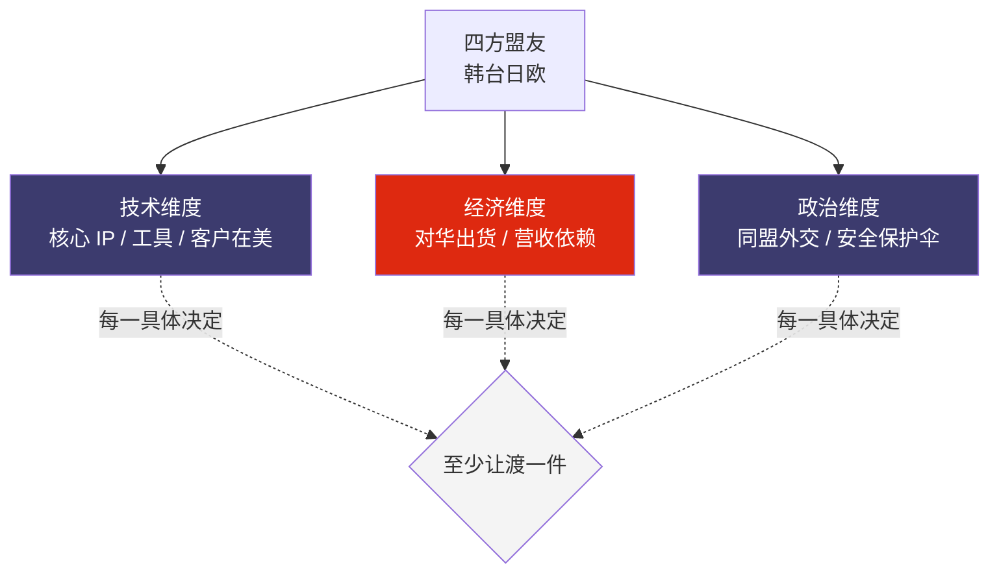
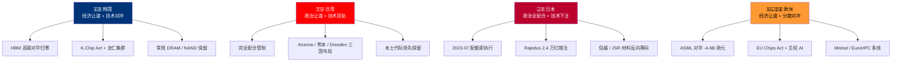
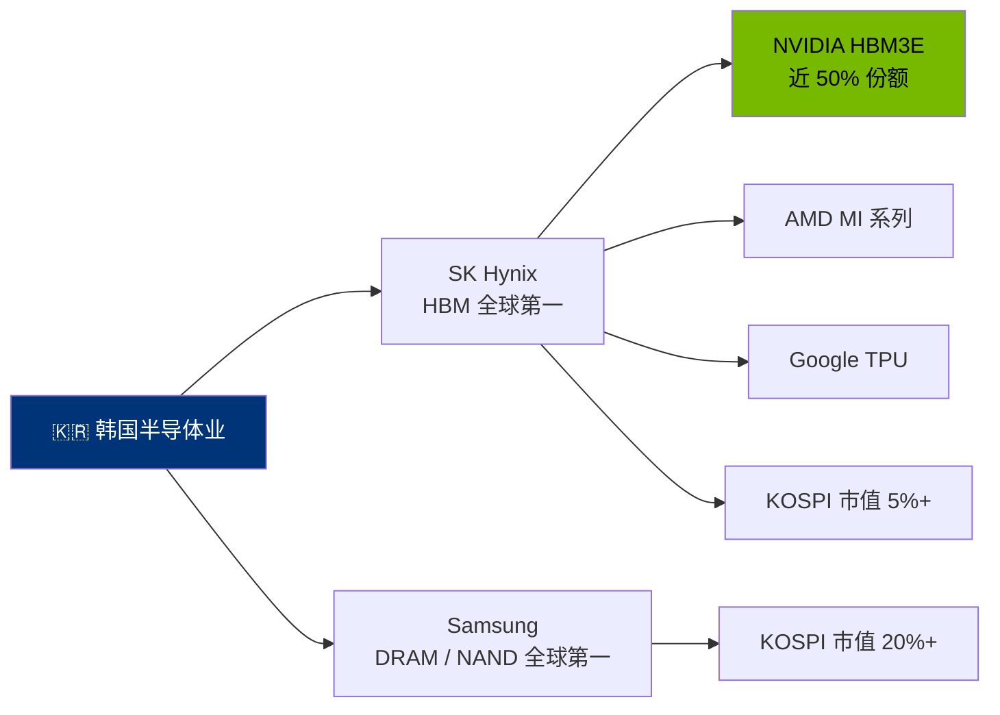
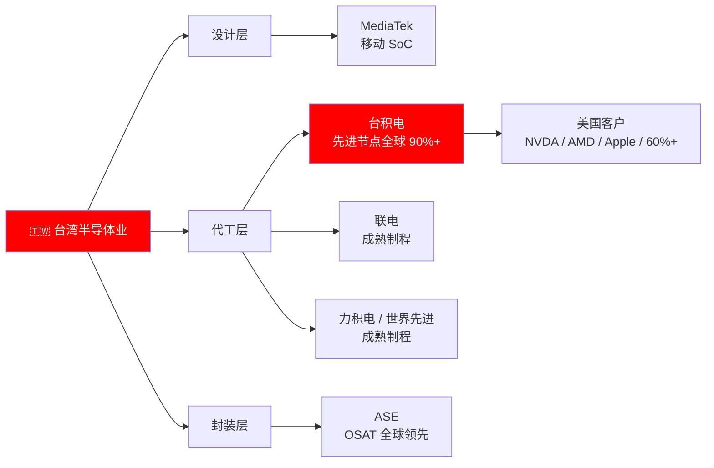
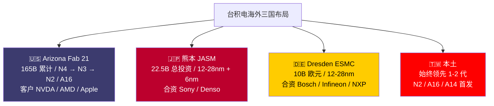
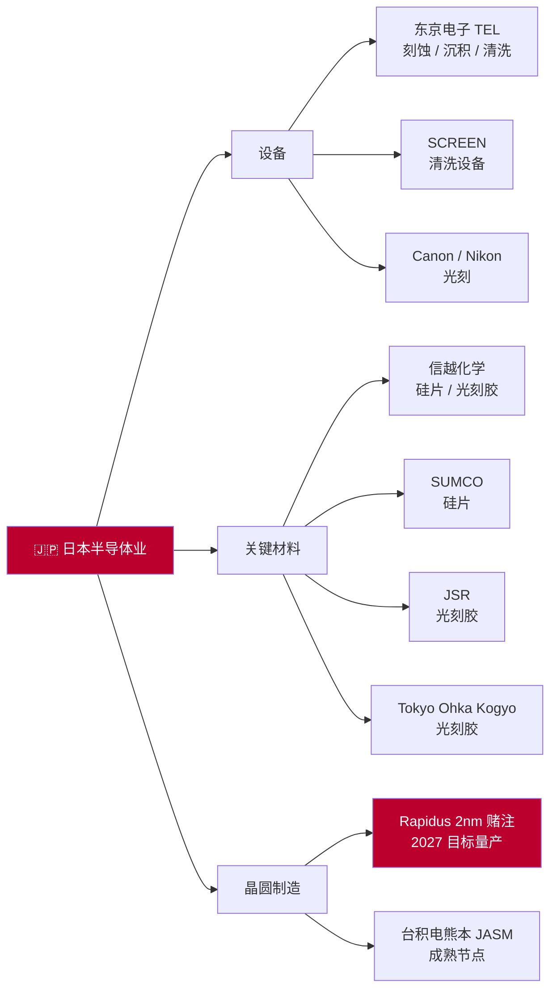
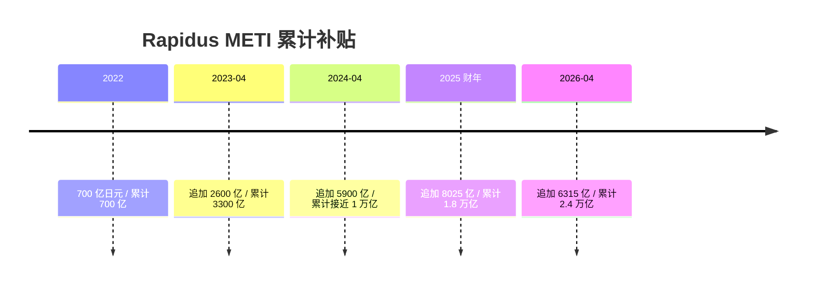
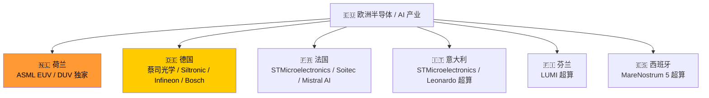
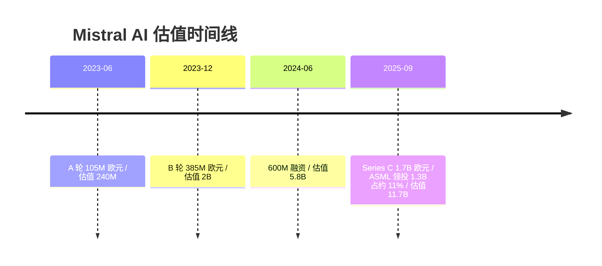

# 第 22 章 东亚与欧洲的三难均衡：韩台日欧的对冲策略

## 22.1 开篇：三难均衡是什么

上一章把 2018-2026 这八年里美国沿全球半导体价值链布防的工具讲完了——四个 chokepoint，三类工具，四方盟友配合。这一章把镜头转 180 度，对准那四方盟友本身：韩国、台湾、日本、欧洲。它们既是美国体系的关键支撑节点，又与中国深度贸易关联。

这种双重嵌入产生了一个共性约束——**技术上不能脱离美国（核心 IP / 工具 / 客户都在美国手里）、经济上不能脱离中国（出货 / 营收的相当一部分要走中国市场）、政治上必须配合美国（同盟外交压力 + 安全保护伞）**。三件事在每一个具体决定上至少要牺牲一件，这是本章使用的「三难均衡」框架。

「三难均衡」（trilemma）这个词在经济学里有现成的原型——Mundell-Fleming 货币三角不可能（固定汇率、独立货币政策、资本自由流动三件事任何国家最多同时实现两件）、Dani Rodrik 全球化三角（民主、主权、超级全球化三件事不可能同时实现）。本章借用这个结构，但不假装这是一套已被学术共识接受的半导体三难均衡理论——这只是一个组织本章的分析框架，用来把四方主体的不同选择放在同一张图上对比。

读这一章请把预设留在门口。本章既不替任何一方背书，也不评价配合美国或维护中国市场哪一边在道义上更正当。本章只做一件事——把四方主体在三个维度上的实际让渡数字摆出来，让读者自己判断每一方在做什么选择、付出什么代价、保留什么回旋空间。

本章的三个维度按可量化口径定义：

- **维度 1：对华营收依赖**——本国半导体公司对华出货占总营收的比例。这是经济维度的代理指标。占比越高，脱钩对华的痛感越强。
- **维度 2：美国 / 本土补贴对冲**——本国通过 CHIPS Act 转移补贴 + 本土补贴的总规模。这是政治维度回报的代理指标。补贴越大，配合美国的政治成本越被对冲。
- **维度 3：本土资本市场对 AI / 半导体的估值溢价**——本国资本市场对相关板块给的市盈率溢价。这是技术维度筹码的代理指标。溢价越高，本土公司从本土市场拿钱的能力越强，越能减少对外部资本的依赖。

> 术语速读：本章后续涉及若干金融指标缩写——PER（Price-to-Earnings Ratio，市盈率）、KOSPI（Korea Composite Stock Price Index，韩国综合股价指数）、SOX（Philadelphia Semiconductor Sector Index，费城半导体指数）、TOPIX（Tokyo Stock Price Index，东证股价指数）。读者可视为各国半导体板块估值与对标的速记。

把四方主体放进这三维度的横截面表里看（数据为本章后续节展开后的汇总，详细出处分见各节）：

| 主体 | 对华营收依赖 | 美国 CHIPS / 本土补贴 | 本土资本市场溢价 | 三难均衡的主导让渡 |
|---|---|---|---|---|
| 韩国（SK Hynix / Samsung） | HBM 高端业务对华 ~0%（2025-01 后停运）/ 整体 DRAM / NAND 对华仍占 30-40% 业内估算 | K-Chip Act 25% / 50% 投资 + R&D 税收抵免（2023-03）+ 龙仁集群承诺 \$470 亿（约 \$47B）/ 23 年（2024-01 公告） | KOSPI 半导体板块溢价对 KOSPI 大盘溢价显著，业内估算 PER 25-30 倍区间 | 经济维度让渡（HBM 高端对华归零） |
| 台湾（[台积电](https://www.tsmc.com/) / ASE / Mediatek） | 台积电中国营收占比 11.5%（2024 一手）→ ~10%（2025 一手） | 台积电 Arizona CHIPS 拨款 \$6.6B（2024-04，一手）+ 台湾经济部本土 + 海外补贴叠加 | TWSE 半导体板块对加权指数显著溢价，台积电占加权指数权重 35%+ | 经济维度部分让渡 + 技术维度本土保留最先进节点 |
| 日本（Rapidus / TEL / 信越 / JSR） | TEL FY2025（至 2025-03）全年中国营收占比 ~38%（一手，含 DUV 末班拉货效应；TrendForce 2025-06 预测 FY2026 回落至 ~30%）；Q4 FY2025 单季 34.3% | Rapidus 累计 METI 补贴 ¥2.4 万亿（2022-2026 累计，2026-04 口径，详 22.4 明细）+ 台积电熊本补贴 ~¥1.1 万亿 | TOPIX 半导体板块溢价显著，Rapidus 未上市 | 经济维度部分让渡 + 政治维度全面配合 |
| 欧洲（[ASML](https://www.asml.com/) / ESMC / Mistral） | ASML 中国大陆营收占比 2023 ~29% → FY2025 全年 ~33%（纯系统销售口径 €10.8B / 含 service 全口径 29% / €9.5B，ASML Q4 2025 财报 2026-01-28 一手）→ 管理层 2026 指引 ~20% | EU Chips Act €43B 公共投资（2023-09 生效，一手）+ 各国本土补贴 | STOXX Europe 600 半导体板块溢价存在但相对 SOX / TWSE 较低 | 经济维度让渡（DUV / EUV 受限）+ 主权 AI 基金对冲 |

这张表是本章主图。把四方的让渡 / 对冲 / 保留组合放到一张图里，可以更直观看出策略的差异：

下面 22.2-22.5 四节按韩、台、日、欧四方分别展开，每节回答同一组问题：这一方在三个维度上具体让渡了什么、对冲了什么、保留了什么。22.6-22.7 做横截面比较和对冲策略的稳定性边界判断。

本章的写作底线——所有数字按一手优先 + 业内估算明示口径处理；不使用预设立场的口号化措辞；公司行动的描述限于公开披露的事实，不揣测决策动机。

## 22.2 韩国：HBM 大国的双轨贸易

韩国的处境在四方里最直接。半导体是韩国经济的命根子——2022 年韩国半导体出口 \$1290 亿，占总出口约 19%。这是一个单一品类支撑一国出口的近五分之一的极端结构。

[Samsung](https://www.samsung.com/semiconductor/) 与 [SK Hynix](https://www.skhynix.com/) 两家合计在 DRAM 全球市占约 73%、NAND 全球市占约 51%。HBM 这一品类在 SK Hynix 引领下，与 [NVIDIA](https://www.nvidia.com/)、AMD、Google TPU 等美国 AI 客户深度绑定——这是 2022-2026 这一轮 AI 需求爆发里韩国半导体的第二曲线。

但 HBM 这条曲线在 2024-12 之后撞上了管制墙。把时间线和让渡幅度放在一起看。

**2024-12-02 HBM 出口管制**。美国 BIS 在这一天公告了新一轮出口管制——HBM 出口需要许可证，阈值业内估算覆盖 HBM3 / HBM3E 及以上（详见第 20 章.4）。SK Hynix 与 Samsung 在公告之后的回应非常克制，仅表态将遵守相关法规。这种克制本身是「三难均衡」的语义——公开反对会损害与美国客户（NVIDIA 是 SK Hynix HBM 的最大单一客户）的合作关系；接受管制则失去对华 HBM 出货的潜在收入。

**HBM 业务的对华营收归零**。2025-01 之后 SK Hynix、Samsung、Micron 三家正式停止对华出货高端 HBM。这一让渡的物理意义清晰——HBM3 / HBM3E 的对华营收从此为零。具体损失金额两家公司均不单独披露，按业内估算 SK Hynix HBM3 / HBM3E 的对华出货年化业内估算在 \$1-2B 区间。

把这个数字放回 SK Hynix 的整体盘子里看就能明白让渡的相对幅度——SK Hynix 2024 财年总营收 ₩66.19 万亿（约 \$480 亿，一手，SK Hynix 维基百科条目交叉财报数据）。HBM 对华出货的让渡占总营收业内估算 2-4% 区间。这不是致命让渡——SK Hynix 同时把对 NVIDIA 的 HBM3E 12-Hi 出货爬到了全球 HBM 市场近 50% 份额，对美客户营收的增长部分抵消了对华营收的损失。但让渡是真实的。

**K-Chip Act 的补贴对冲**。韩国国会在 2023-03 通过 K-Chip Act 修订（K-CHIPS 法案，正式名称为韩国「国家高级战略产业特别法」修订案），对半导体投资提供 25% 投资税收抵免、对 R&D 提供 50% 税收抵免。2024-01 韩国政府进一步宣布在京畿道龙仁建设全球最大半导体集群，承诺 23 年累计投资约 \$470 亿，目标到 2030 年关键材料自给率达到 50%。

这个补贴结构在「三难均衡」里起到的作用是——把因配合美国管制损失的对华营收，通过本土资本投入和税收抵免对冲一部分。但要注意补贴的对冲是不对称的——K-Chip Act 的税收抵免主要在本土投资 / R&D 环节生效，而对华营收损失是直接现金流损失。两者的口径不同——补贴是降低投入端成本，营收损失是减少产出端收入，财务报表上不会简单抵消。这是「补贴对冲」机制在产业经济学上的常见误区——补贴金额大不等于直接覆盖营收损失。

**对华 DRAM / NAND 业务的双轨**。HBM 之外，SK Hynix 与 Samsung 的常规 DRAM / NAND 对华业务仍然存在。两家在中国大陆均有 fab——SK Hynix 在无锡（DRAM）、重庆（封装）、大连（原 Intel NAND 业务，2021 年从 Intel 收购后整合）；Samsung 在西安（NAND）、苏州（封装）。这些 fab 的产出大多自销给中国大陆客户——这是「双轨」的字面含义：HBM 高端业务对华归零、常规存储业务对华仍在运行。

按 2024-2025 季报口径，SK Hynix 与 Samsung 整体 DRAM / NAND 对华出货占总营收的比例业内估算仍在 30-40% 区间。这条剩余的对华业务是韩国在「三难均衡」里能保留的最大对冲——常规存储不在 2024-12 管制的精确瞄准范围（管制主要瞄准 HBM3 / HBM3E 这种 AI 训练用 HBM），韩国两家可以继续运行这条业务线。

**三星 HBM3E 给 NVIDIA 认证的曲折**。这一节最值得放大的细节。三星在 HBM3E 12-Hi 给 NVIDIA 的认证上经历了多次延迟。SK Hynix 抢先一步成为 NVIDIA H100 / H200 / B200 系列 HBM 的主力供应商，三星在 2024-2025 期间始终在追赶。这一内部竞争对韩国「三难均衡」的影响是——三星在 HBM 业务上的认证不顺，使其更依赖通用 DRAM / NAND 业务，对华业务的相对重要性比 SK Hynix 更高。在 2024-12 管制后，三星受到的相对冲击业内观察小于 SK Hynix——这是「三难均衡」内部两家公司不同的处境。

**韩国本土资本市场的估值溢价**。KOSPI 指数里半导体板块（以 Samsung Electronics 和 SK Hynix 为主）的总市值占 KOSPI 总市值的相当比重。Samsung 单独占 KOSPI 总市值 20%+。SK Hynix 占比 5%+。两家合计 25%+。这种单一板块对大盘的高权重使得 KOSPI 整体走势在很大程度上跟随两家半导体公司的业绩——也使两家公司在本土资本市场上有较强的融资能力。这是「三难均衡」里技术维度的对冲——本土资本对半导体板块的高估值，使得两家公司可以从本土市场获取较低成本的资金，减少对外部资本市场的依赖。

**韩国的「让渡排序」**。把韩国在三个维度的让渡综合起来——经济维度让渡了 HBM 高端对华业务（数字上 2-4% 总营收）；政治维度全面配合美国管制（公开回应克制）；技术维度通过 K-Chip Act 与本土资本市场对冲。这是一个经济维度做主要让渡 + 政治维度全面配合 + 技术维度全力对冲的组合。这个组合的可持续性取决于两件事——HBM3 / HBM3E 之外的常规存储业务能否维持对华出货（管制范围是否扩大），以及 K-Chip Act + 龙仁集群的本土投资能否在 5-7 年内显著提升韩国半导体的本土供应链自给率（目标 2030 年关键材料 50% 自给）。

## 22.3 台湾：硅盾的物理稀释与海外建厂的三国布局

台湾的处境在四方里最复杂。台积电一家公司在全球先进晶圆制造的市占业内估算 90%+，台湾的半导体产业以台积电为核心，加上 ASE（封装）+ MediaTek（设计）+ 联电（成熟制程代工）+ 力积电、世界先进等多家中型代工，形成完整的设计 + 代工 + 封装 + 测试垂直一体链。

这种产业链全环节集中在单一岛屿的结构，过去十年里有一个流行的叙事词来概括——硅盾。这个词的含义是：因为台积电在全球先进晶圆制造的不可替代性，任何对台湾的物理冲击都会让全球科技公司付出无法承受的代价，所以台湾岛本身受到了产业经济学层面的保护。

本章对硅盾这一叙事保持距离——不是因为这一叙事在 2020-2022 那个时间窗里完全错，而是因为 2023-2026 期间的两件结构性变化使这一叙事的物理基础正在被稀释。

**变化一：台积电海外建厂的三国布局**。把台积电 2024-2026 期间的海外产能扩张按地理放在一张表里看：

| 地点 | 节点 | 量产时间 | 投资规模 | 当地补贴 | 客户结构 |
|---|---|---|---|---|---|
| 美国 Arizona Fab 21 一期 | N4 | 2025 量产（一手）| 约 \$12B | CHIPS Act \$6.6B（2024-04，一手）+ 25% 投资税收抵免 | NVDA / AMD / Apple |
| 美国 Arizona Fab 21 二期 | N3 | 2027 年下半年量产业内估算| 约 \$25B | 同上 | 同上 |
| 美国 Arizona Fab 21 三期 | N2 / A16 | 2029-2030 量产业内估算 | 约 \$25B | 同上 | 同上 |
| 美国 Arizona 后续扩展 | 整体 | 2025-03 追加 \$100B 公告 | 总累计 \$165B | 同上 | 同上 |
| 日本熊本 JASM Fab 23 | 12 / 16 / 22 / 28nm | 2024-12 商业运营（一手） | 约 \$8.6B（一期）| 日本经产省补贴约 ¥4760 亿（一期补贴口径，一手）| Sony / Denso（合资方） |
| 日本熊本 JASM Fab 24 | 6 / 12nm | 2027 量产业内估算 | 约 \$13.9B（二期）| 日本经产省追加补贴 ¥7320 亿（二期，一手）| Sony / Denso |
| 德国 Dresden ESMC | 12 / 16 / 22 / 28nm | 2027 试产 / 2029 全面运营（业内估算） | 台积电出资 €3.5B（一手）/ 总投资 €10B+ | 德国政府补贴 €5B（2024-08 EU 委员会批准，一手）| Bosch / Infineon / NXP（合资方） |

> 来源：台积电公司维基百科条目 + 各项目地公告综合，一手；具体补贴数字按各国官方公告核对。Arizona 累计 \$165B 是 2025-03 台积电在白宫与 Trump 政府联合公告口径。

读这张表的方式：台积电不再是产能 100% 集中在台湾的公司。Arizona Fab 21 系列、日本熊本 JASM、德国 Dresden ESMC——三个国家、三套合资 / 补贴结构、三种客户绑定。这种三国布局在产能层面的实际意义是——到 2030 年代初，台积电的全球产能业内估算 15-25% 将位于台湾岛外。

物理意义就更明显——台湾作为先进晶圆制造的单一不可替代地理这件事，正在被台积电自己用海外建厂的方式逐步稀释。这是结构性变化，不是临时调整。

**变化二：N+1 节点始终在台湾首发的双轨**。台积电在 2025 法说会上反复表达过一个策略——最先进节点始终在台湾首发，海外 fab 跟随台湾 1-2 个代际。这个策略在台湾「三难均衡」里的含义是——硅盾在物理产能层面被稀释，但在代际领先层面仍然保留。

把这个双轨具体说清——Arizona Fab 21 一期 2025 量产 N4 时，台湾本土已经在量产 N3 / N2；Arizona Fab 21 三期 2030 量产 N2 / A16 时，台湾本土业内估算已经在量产 A14 / A10 节点。台湾始终领先海外 fab 1-2 代——这是台积电在全球化与本土保护之间的折中策略。

但这个折中本身是有条件的——它要求台积电持续在台湾本土投入 R&D + 一座新 fab 的资本支出，且要求台湾本土的劳动力 / 电力 / 水资源持续满足先进 fab 的需求。在 2024-2026 期间，这两个条件都开始出现压力——台积电招聘量持续超过台湾本土工程师供给（部分新招工程师来自越南、印度等地）；台湾本土电力供给紧张（2025 北部 / 中部多次出现负荷紧张警报）。这些压力使得代际领先的双轨策略可能在 2030 年代某个时间点被迫调整。

**台积电对中国大陆的营收占比下行**。把台积电对中国大陆营收占比按年放出：

| 年份 | 台积电总营收 | 中国大陆区域营收占比 | 对应美国区域营收占比 |
|---|---:|---:|---:|
| 2022 | NT\$2,263.9B | 11% 业内整理 | 65% 业内整理 |
| 2023 | NT\$2,161.7B | 12% 业内整理 | 65% 业内整理 |
| 2024 | NT\$2,894.3B | 11.5%（一手） | 68.8%（一手） |
| 2025 | NT\$3,517.0B 业内整理 | ~10% 业内估算 | ~70% 业内估算 |

> 来源：台积电历年年报地区销售披露 + 2024 数字一手（台积电维基百科条目 + 年报交叉），2025 数字基于台积电已发布季报合并业内整理。区域划分按台积电财报中国区口径——含中国大陆但不含香港。

读这张表的方式：台积电对中国大陆的营收占比从来都不高（11-12% 区间，相比 NVDA / ASML 对华占比都低）。原因有两个——一是台积电的客户结构本身就以美国大客户为主（NVDA / AMD / Apple / Qualcomm / Broadcom 合计占 60%+，参见第 20 章）；二是中国大陆 fabless 公司（华为海思、中兴、寒武纪、海光等）在 2020-2026 期间因美国管制无法在台积电流片先进节点，自然减少了台积电对华营收的潜在增量。

这意味着台湾在「三难均衡」的经济维度上，原本就比韩国、日本、欧洲的让渡幅度更小——台积电没有对华业务从 30% 降到 10%这种戏剧性下降，因为台积电的对华业务一开始就不大。台湾在「三难均衡」的真正让渡发生在政治维度——台积电完全配合美国管制（2020-09 停止对华为代工 + 2022 之后停止对华先进节点出货）这件事，使得台湾在中国政府对台政策上的回旋空间被压缩。

**台湾本土资本市场的估值溢价**。台湾加权指数（TWSE）里台积电单独占总市值的权重业内估算 35%+。这是一种极端的单一公司主导市场结构。整个加权指数的走势在很大程度上跟随台积电的业绩。本土资本市场对台积电的估值溢价相对全球同行温和——台积电的 PER 业内估算长期在 20-25 倍区间，明显低于 NVIDIA 的 PER 35-50 倍。这种龙头公司在本土被低估的现象在 KOSPI 上也存在（Samsung 在韩国本土的 PER 长期低于 NVDA 在美国的 PER），背后的原因可能是本土投资者对单一公司支撑整个市场的风险有更强感知。

**台湾的「让渡排序」**。台湾在三个维度的让渡综合起来——经济维度让渡幅度小（对华营收占比本就不高）；政治维度让渡幅度大（完全配合美国管制，对华为停止代工 + 对华先进节点禁运）；技术维度通过代际领先 + 海外建厂两条腿走路，物理产能逐步分散到三国，但代际领先始终保留在本土。这是一个政治维度做主要让渡 + 经济维度本就不大 + 技术维度双轨保留的组合。产能集中在台湾岛这一前提的物理基础在 2025-2030 期间被稀释——这是事实，但不等于全面失效，因为代际领先与本土先进 R&D 仍在台湾。

## 22.4 日本：设备出口配额 + Rapidus 的产业政策回归

日本的处境在四方里最微妙。日本不是晶圆制造大国（先进节点产能基本为零），但日本是半导体设备 + 关键材料的全球供应大国——东京电子（TEL）、信越化学（硅片）、JSR（光刻胶）、SUMCO（硅片）、Tokyo Ohka Kogyo（光刻胶）、SCREEN（清洗）、Canon / Nikon（部分光刻）等多家全球关键设备与材料供应商。

这种上游集中的产业结构使得日本在全球半导体价值链上的位置介于被需要与被管理之间。

**2023-07-23 设备出口配额**。日本经产省在 2023-07-23 公告了对 23 类先进半导体制造设备的出口许可证制度，2023-07-23 同日生效。覆盖范围包括 EUV 相关、深紫外（DUV）相关、刻蚀、沉积、量测、清洗等多类设备——这是日本对美国 2022-10 出口管制的同步响应。

日本的配合度在四国里是最高的——公告即执行、没有公开博弈。原因有两个——一是日本设备厂对中国市场的依赖度近两年因 DUV 末班拉货反而上行而非下行（TEL 对华营收 FY2023 ~30%，FY2025 全年实际 ~38%——一手 TEL 财报，Q4 FY2025 单季 34.3%，全年高于市场预期，原因是日本出口配额生效前中国客户集中拉货；TrendForce 2025-06 预测 FY2026 回落至 ~30%）；二是日本在历史上多次对美国的安全政策保持高度配合（参见 1980 年代「日美半导体协议」的历史背景，详见第 4 章），日本国内对配合美国的政策共识较高。

**TEL / SCREEN / 信越 / JSR 的对华营收变化**。把日本几家关键设备 / 材料厂的对华营收占比按年放出：

| 公司 | 业务类型 | 2023 对华营收占比 | FY2025 对华营收占比 | 受配额影响幅度 |
|---|---|---|---|---|
| TEL（东京电子） | 设备 | ~30%（业内估算） | **~38%（一手 FY2025 全年；Q4 FY2025 单季 34.3%；DUV 末班拉货效应）** | 中（受配额覆盖但 FY25 因拉货反而上升；TrendForce 预测 FY26 回落 ~30%） |
| SCREEN | 清洗设备 | ~30% 业内估算 | ~25% 业内估算 | 中（部分清洗设备受配额） |
| 信越化学 | 硅片 / 光刻胶 | ~15-20% 业内估算 | ~15-20% 业内估算 | 低（硅片不在配额覆盖） |
| JSR | 光刻胶 | ~15-20% 业内估算 | ~15-20% 业内估算 | 低（光刻胶大部分不在配额）|
| SUMCO | 硅片 | ~15-20% 业内估算 | ~15-20% 业内估算 | 低 |

> 来源：TEL 行为 TEL FY2025 全年财报一手 + TrendForce 2025-06-30 关于 FY2026 展望；其余各家按季报地区销售披露 + 业内估算综合。具体百分比按各家财报披露的「Asia 除日本」或「中国」分项整理。TEL 财年起止 4 月 1 日至次年 3 月 31 日，FY2025 即 2024-04 至 2025-03。

读这张表的方式有反直觉的一面——表面看配额应该压缩日本设备厂对华营收，但 TEL FY2025 反而录得 ~38% 的高占比。原因是日本出口配额公告（2023-07）后中国客户在配额生效窗口集中拉货 DUV / 成熟节点设备，使 FY2024-FY2025 实际出货上行；TrendForce 2025-06 提示这波拉货效应将在 FY2026 退潮，预计 TEL 对华占比回落到 ~30%。材料厂（信越 / JSR / SUMCO）受配额冲击较小、对华营收占比相对稳定。原因是配额主要瞄准设备环节，材料环节的管制更复杂（材料更换的物理成本更高、客户认证周期更长，管制可能引起全球供应链中断）。这是日本「三难均衡」里的一个细节——配合美国管制在长周期上压缩设备厂对华业务，但短周期窗口里中国拉货会反向放大设备厂对华营收占比，材料厂则相对受保护。

**信越化学的全球硅片寡头地位**。这一节最值得放大的细节。信越化学（Shin-Etsu Chemical）与 SUMCO 两家合计占全球 300mm 硅片市场业内估算 50%+ 份额，加上其他三家日本厂（GlobalWafers 在台湾 + Siltronic 在德国 + SUMCO 在日本），日本系硅片厂（含日本资本控股的海外子公司 GlobalWafers 台湾 + Siltronic 德国）合计占全球 300mm 硅片市场 70%+。这是一个比 ASML EUV 更彻底的全球寡头结构——300mm 硅片是所有先进 fab 的基础原材料，没有 300mm 硅片任何 fab 都开不了工。

信越的地位有两重含义——一是日本在「三难均衡」的技术维度上有一张反向 chokepoint 的筹码（理论上日本如果要对中国 fab 断供硅片，中国 fab 的运营会受到严重影响）；二是这张筹码到目前为止没有被武器化——硅片在 2022-2026 期间始终对华正常出货，没有被纳入美国 BIS 的管制范围。

为什么没有被武器化？业内分析有两个原因——一是硅片的物理替代难度极高（不是几年内可以国产替代的环节），美国管制硅片会反向对全球 fab（包括美国本土 fab）造成连锁影响；二是日本对硅片管制的政治成本较高（一旦中国对日本硅片报复，全球 fab 都受连累，日本会承担与美国管制不对等的政治代价）。这种全球寡头但不被武器化的状态，是日本「三难均衡」里最微妙的平衡点。

**Rapidus 与日本产业政策回归**。Rapidus 是日本「三难均衡」里最戏剧性的变量。Rapidus 由 8 家日本企业（Denso、Kioxia、MUFG Bank、NEC、NTT、SoftBank、Sony、Toyota）联合出资 73 亿日元于 2022-08-10 成立，日本政府持股 40%。

Rapidus 的雄心是直接挑战 2nm 节点的量产能力——绕过日本在过去 30 年里逐步丧失的先进晶圆制造能力（详见第 4 章的日本半导体业兴衰历史），用政府主导 + 财团联合的产业政策方式在 10 年内追赶台积电 / Samsung 的 2nm 节点。这个雄心的可行性在产业经济学上有非常强的争议——日本在先进晶圆制造的工程人员、配套供应链、客户基础上都有 20-30 年的真空期，仅靠政府补贴是否能补上这段真空期是开放问题。

但日本政府的投入力度是真实的。把 Rapidus 累计获得的 METI 补贴按年列出：

| 年份 | METI 补贴金额 | 累计 |
|---|---:|---:|
| 2022 | ¥700 亿 | ¥700 亿 |
| 2023-04 | ¥2,600 亿 | ¥3,300 亿 |
| 2024-04 | ¥5,900 亿（追加） | 累计接近 ¥1 万亿 |
| 2025 财年 | ¥8,025 亿（业内整理，2025 财年补贴预算综合 METI 公告 + 多家媒体）| 累计约 ¥1.8 万亿 |
| 2026-04 | ¥6,315 亿 | 累计约 ¥2.4 万亿 |

> 来源：Rapidus 维基百科条目 + 日本经产省历次补贴公告综合，一手。这是日本战后单一公司获得的最大规模产业政策补贴之一。

**Rapidus 的时间表**。Rapidus 北海道千岁的 IIM-1 厂在 2023-09 动工，2025-04-01 试产线开始测试，2025-07-18 公开了首颗 2nm 原型（在 300mm 晶圆上）业内估算芯片密度 237.31 MTr/mm²；目标 2027 年底实现 2nm 量产。如果按计划达成，Rapidus 将与台积电（N2 在 2025 量产，台湾本土）、Samsung（SF2 在 2025 量产，韩国本土）形成 2nm 节点的三足鼎立。

业内对 Rapidus 时间表的判断分歧很大。乐观派认为日本在过去多年保留的设备 / 材料 / 工程基础足以支撑 2nm 量产；谨慎派认为 Rapidus 缺乏稳定客户基础（迄今没有公开披露的大规模长期订单）、缺乏量产经验的工程团队（Rapidus 的核心技术合作伙伴是 IBM Research，但 IBM 自己已没有先进 fab 量产经验近 10 年）。本章不预判时间表的实现概率——只指出 Rapidus 是日本「三难均衡」里经济维度上限的赌注：如果 Rapidus 成功，日本将从设备 + 材料供应国升级为先进晶圆制造国，与韩国、台湾在 2nm 节点上形成多极结构；如果 Rapidus 失败，日本将继续在设备 + 材料的上游环节守住地位。

**台积电熊本 JASM 的补充角色**。在 Rapidus 之外，台积电熊本 JASM 是日本「三难均衡」里另一个重要变量。JASM Fab 23 在 2024-12 商业运营、生产 12 / 22 / 28nm 工艺；JASM Fab 24 在建、目标 2027 年量产 6 / 12nm 工艺。这两座 fab 与 Rapidus 形成成熟节点（JASM）+ 先进节点（Rapidus）的双层布局——JASM 保证日本本土汽车产业（Sony 是合资方代表汽车级图像传感器、Denso 是合资方代表汽车级 MCU）的成熟节点供应链稳定；Rapidus 承担先进节点的产业政策赌注。这种双层布局在「三难均衡」里的含义是——日本不把所有筹码押在 Rapidus 一个赌注上，而是同时通过台积电熊本拉回成熟节点的产能。

**日本的「让渡排序」**。日本在三个维度的让渡综合起来——经济维度让渡幅度中等（TEL / SCREEN 对华营收下降 5-10pp，但信越 / JSR 等材料厂受保护）；政治维度全面配合（2023-07 配额公告即执行）；技术维度通过 Rapidus + JASM 双轨布局承担最大产业政策赌注。这是一个政治维度全面配合 + 经济维度中等让渡 + 技术维度全力下注的组合。日本的策略与韩国相反——韩国经济维度做主要让渡 + 技术维度对冲，日本是政治维度全面配合 + 技术维度下大赌注。

## 22.5 欧洲：选择性配合 + 主权 AI 的两条腿

欧洲的处境在四方里最分散。欧洲不是一个统一的国家——欧盟 27 国 + 英国 + 瑞士在半导体产业上的角色各不相同。

这种分散的产业基础使得欧洲的「三难均衡」不能用单一国家视角分析——必须看欧盟层面的协调与各成员国的具体差异。

本章按欧盟 Chips Act + ASML 案例 + 主权 AI 基金三个角度展开。

**EU Chips Act**。欧盟在 2023-09-18 正式生效 European Chips Act，承诺到 2030 年通过公共 + 私人资金共投资 €430 亿欧元，目标是把欧洲在全球半导体制造的市占从 2023 年不到 10% 提升到 2030 年 20%。法案结构包括三个支柱——研究与创新（Chips Joint Undertaking 主导）+ 国家援助框架（支持首创性制造设施）+ 供应链监控（危机响应机制）。

EU Chips Act 与美国 CHIPS Act 的关键差异有两个——一是规模差距（€43B 公共投资 vs \$76B 美国 CHIPS Act 总投资）；二是分散度（欧盟资金通过成员国国家援助框架落地，各国分别申报项目，没有美国 CHIPS Office 这种集中拨款 agency）。这种小规模 + 分散度的结构在「三难均衡」里限制了欧盟整体的政策协调能力——欧盟不能像美国 / 日本 / 韩国那样集中调动资源到单一旗舰项目。

**Chips Act 旗舰项目的实际进度**。把欧盟 Chips Act 的几个旗舰项目进度列出：

| 项目 | 地点 | 国家补贴 | 状态 | 关键日期 |
|---|---|---:|---|---|
| Intel Magdeburg | 德国 | €10B（原计划）| **2024-09 推迟两年 / 2025-07 项目取消** | 2025-07 公告 |
| 台积电 Dresden ESMC | 德国 | €5B（一手 2024-08 EU 批准） | 在建，2027 试产，2029 全面运营业内估算 | 2024-08 EU 批准 |
| Infineon Dresden | 德国 | €1B 业内估算 | 在建 / 部分量产 | 2024-2025 |
| STMicroelectronics Catania | 意大利 | €293M（一手） | 在建，2026 完成 | 2024-2025 |

> 来源：European Chips Act 维基百科条目 + 各项目地公告综合，一手。Intel Magdeburg 项目在 2024-09 因 Intel 财务困境推迟，在 2025-07 正式取消，是 EU Chips Act 战略上的重大挫败。

**Intel Magdeburg 项目取消的含义**。这一节最值得放大的细节。Intel Magdeburg 项目原计划是 EU Chips Act 的旗舰投资——德国政府承诺 €10B 国家补贴，Intel 承诺 €30B 总投资建设欧洲先进 fab。这个项目在 2024-09 因 Intel 全球战略调整宣布推迟两年，2025-07 正式取消。项目取消的连锁影响——德国失去最大单一外资半导体项目，欧盟 Chips Act 的 20% 全球市占 目标更难达成。

EU Chips Act 在 2025-07 之后的实际可执行性受到了实质冲击——剩下的旗舰项目台积电 Dresden ESMC 与 STMicroelectronics Catania 都不在先进节点（12/28nm 居多），欧洲在先进晶圆制造（≤7nm）层面到 2030 年仍然没有任何本土能力。这是欧洲「三难均衡」里的硬约束——技术维度上欧洲在晶圆制造环节没有筹码，必须依赖台湾、韩国、日本（Rapidus 如果成功）的先进节点供应。

**ASML 与荷兰：欧洲「三难均衡」的精准缩影**。ASML 案例已在第 20 章详细展开（参见第 20 章.2）。本节只补充欧洲视角的细节——ASML 在 2023-09 / 2024-01 / 2024-09 多次扩大对华 DUV 限制的过程里，荷兰政府的角色是形式上自主决定、实质上与美国对齐。2025-01 后 ASML 改向荷兰政府申请许可证的调整，使荷兰名义上成为主管当局——这是 ASML 这一个公司案例在「三难均衡」里的精准缩影。

ASML 对华营收占比从 2023 ~29% → FY2025 全年 ~33%（纯系统销售口径，€10.8B；含 service 全口径为 29% / €9.5B）→ 管理层 2026 短期指引 ~20%。读这条曲线有两个细节值得点出——一是 FY2025 ~33% 高于 FY2024 的 ~29% 看上去与管制收紧叙事矛盾，原因和 TEL 相同：2024 EUV 部分受限 + DUV 出口许可证制度生效前中国客户集中拉货，使 FY2025 录得末班车高位；二是 2026 ~20% 是 ASML 管理层自己给出的短期下行指引（Q4 2025 电话会），与 CMD 2024-11 公布的 14-18% 长期（2030 视野）目标不同口径。绝对值上 ASML 失去的对华营收业内估算在 €4-6B 区间（按 2026E 较 FY2025 峰值的下降幅度计算）。这是欧洲在「三难均衡」经济维度上最具体的让渡数字——不是抽象的对华依赖下降，是 ASML 一家公司明确的对华营收下降。

**主权 AI 基金 + EuroHPC + AI Factories**。欧洲在「三难均衡」上的对冲策略与韩国、日本不同——欧洲没有 K-Chip Act 那种瞄准本土晶圆制造的产业政策，欧洲的对冲集中在主权 AI——通过欧洲本土超算 + 欧洲本土模型公司 + 欧洲本土数据中心三层结构，对冲对美国超大规模云厂与美国 GPU 的依赖。

EuroHPC JU（European High-Performance Computing Joint Undertaking）是欧洲主权 AI 的基础设施载体。EuroHPC 2021-2027 期间总预算约 €70 亿欧元。EuroHPC 旗下已部署的超算包括：

| 名称 | 位置 | 部署时间 | 峰值性能 |
|---|---|---|---|
| JUPITER | 德国 Jülich | 2025 | 1,226 PFLOPS |
| LUMI | 芬兰 Kajaani | 2022 运营 | 539 PFLOPS |
| Leonardo | 意大利 Bologna | 2022 运营 | 316 PFLOPS |
| MareNostrum 5 | 西班牙 Barcelona | 2023 运营 | 314 PFLOPS |

JUPITER 是欧洲第一台 exascale 超算（性能超过 1 EFLOPS），2025 上线。这给欧洲本土模型训练（Mistral / Aleph Alpha）提供了非美国 cloud 的训练算力来源。

2025-02 欧盟委员会进一步公告 InvestAI 计划——€2000 亿欧元 AI 投资规模，含 €200 亿欧元数据中心专项基金，目标建设最多 5 座 AI gigafactory（每座至少 10 万颗 GPU），加上 19 座标准 AI factory（每座最多 2.5 万颗 GPU）。这是欧洲在「三难均衡」技术维度上最有规模的对冲承诺——但承诺金额与实际落地之间的差距业内观察很大，5 座 gigafactory 的具体地点和资金来源在 2026-05 仍在协调中。

**欧洲本土模型公司：Mistral AI 的崛起**。[Mistral AI](https://mistral.ai/) 是欧洲主权 AI 在模型层面的关键变量。Mistral 由三位法国研究员（Arthur Mensch 前 Google DeepMind、Guillaume Lample 与 Timothée Lacroix 前 Meta）于 2023-04-28 创立。把 Mistral 的估值时间线列出：

| 时点 | 估值 | 关键事件 |
|---|---:|---|
| 2023-06 | €240M | A 轮 €105M（Lightspeed + Eric Schmidt 等） |
| 2023-12 | €2B | B 轮 €385M（a16z + BNP Paribas + Salesforce） |
| 2024-06 | €5.8B | €600M 融资轮 |
| 2025-09 | €11.7B（投后估值，一手 Mistral 新闻稿 2025-09-09） | €1.7B Series C 融资；ASML 领投 €1.3B 获约 11% 股份（全摊薄口径，一手 ASML 新闻稿 2025-09-09） |

Mistral 在 2023-09 发布 Mistral 7B、2023-12 发布 Mixtral 8x7B（首个 MoE 架构开源模型），2024-2025 迭代多个大模型版本。Mistral 是欧洲本土非美国大模型公司的代表——但 Mistral 在 2025-09 接受 ASML 的 €1.3B 战略投资（ASML 一手新闻稿 2025-09-09，领投 €1.7B 的 Series C 融资轮，获约 11% 全摊薄股份），使欧洲半导体上游公司与欧洲本土 AI 公司形成股权绑定，这是欧洲主权 AI 在产业链整合层面的标志性事件。

德国的 [Aleph Alpha](https://aleph-alpha.com/) 是欧洲另一个本土模型公司，规模和估值均小于 Mistral，主要面向欧洲政府 / 企业市场。这两家公司加上少量其他本土公司，构成了欧洲在模型层主权上的全部筹码。规模相对美国 OpenAI / Anthropic / Google / Meta 与中国阿里 / DeepSeek / 字节，欧洲本土模型公司的训练 compute 量级业内估算小 1-2 个数量级（参见第 23 章的具体测算）。

**欧洲的「让渡排序」**。欧洲在三个维度的让渡综合起来——经济维度让渡明显（ASML 对华营收下降幅度大于其他公司）；政治维度选择性配合（荷兰对 ASML 形式自主、实质对齐；其他欧盟成员国对美国管制的配合度不一）；技术维度通过 EU Chips Act + EuroHPC + 主权 AI 基金 + Mistral 多条腿对冲。这是一个经济维度让渡显著 + 政治维度选择性配合 + 技术维度分散下注的组合。欧洲的策略与韩国、日本、台湾的关键差异是——欧洲在技术维度上没有集中下注一个产业政策赌注的能力（EU Chips Act 因分散而稀释、Intel Magdeburg 项目取消使核心赌注落空），而是采取多线分散对冲的策略。

## 22.6 横截面比较：四方在三维度上的让渡排序

把 22.2-22.5 的四方让渡汇总，可以得到一张横截面比较表（综合上文各节数字 + 业内估算）：

| 维度 | 韩国 | 台湾 | 日本 | 欧洲 |
|---|---|---|---|---|
| 经济维度让渡（对华营收损失绝对额业内估算）| HBM 对华归零 \$1-2B / 年 + 常规存储仍在运行 | 台积电对华营收占比本就 11-12%，绝对让渡幅度较小 | TEL / SCREEN 对华营收下降 5-10pp，绝对额业内估算 \$1-2B / 年 | ASML 对华营收下降 €4-6B / 年（业内估算 2026E 较 2024 峰值）|
| 政治维度配合度 | 公开回应克制（高） | 完全同步执行（最高） | 公告即执行（最高）| 选择性配合（中-高，荷兰对 ASML 形式自主）|
| 技术维度对冲投入（本土补贴 / 产业政策规模）| K-Chip Act 25% / 50% 税抵 + 龙仁 \$470 亿 / 23 年 | 台积电海外建厂 + 台湾本土代际领先 | Rapidus 累计 ¥2.4 万亿 + JASM 补贴 ¥1.2 万亿 | EU Chips Act €43B 公共 + InvestAI €200B 承诺（落地度未定）|
| 技术维度的核心赌注 | 龙仁集群关键材料 50% 自给 | 台积电 2nm / A16 在本土量产 | Rapidus 2027 年 2nm 量产 | 台积电 Dresden + STMicroelectronics Catania（成熟节点）+ Mistral 模型 |

读这张表，有几个跨主体的对比值得单独拎出来。

**对比 1：经济维度让渡的绝对额 vs 相对额分歧**。按绝对营收数字看，欧洲 ASML 一家的对华营收让渡（€4-6B / 年）大于其他三方任何一方。但按相对比例看，韩国 HBM 业务对华归零是 100% 让渡（HBM 高端业务对华出货从 2024 的 \$1-2B 量级降到 2025 的 0），相对比例最大。台湾台积电对华营收占比本就只有 11-12%，绝对额让渡反而是四方里最小的。这说明让渡幅度在不同主体上有不同口径——绝对额、相对额、品类完整度——三个口径会给出不同的让渡排序。

**对比 2：政治维度配合度的形式 vs 实质分歧**。日本和台湾在政治维度上的配合度形式上最高（公告即执行 / 与美国管制完全同步），但实质上这种配合度是各方算账后的选择——日本经产省配合是因为日本设备厂对华营收占比相对较低；台湾台积电配合是因为台积电的核心客户都在美国。

韩国和欧洲在政治维度上的配合度形式上较低（公开回应克制 / 选择性配合），但实质上这种形式上的克制也是各方算账后的策略——韩国 SK Hynix 不公开反对管制是因为反对的代价（失去美国 NVIDIA 等客户）远高于收益；欧洲荷兰对 ASML 形式自主是因为 ASML 本身需要在美国市场运营。

把这两个对比合起来，「三难均衡」框架下没有自由选择——四方主体的所有选择都是在三个维度的约束下，按减少痛感最大化的逻辑做出的算账结果。这是经济学版本的「三难均衡」——不是政治学的对立式选择，是经济学的约束下的最优反应。

**对比 3：技术维度对冲的集中 vs 分散差异**。日本是四方里在技术维度上对冲最集中的——Rapidus 一个产业政策赌注承担了日本几乎全部的重返先进晶圆制造赌注。韩国次之——K-Chip Act + 龙仁集群是高度集中的本土赌注。台湾的对冲是内外双轨——本土保留代际领先 + 海外 Arizona / 熊本 / Dresden 三国分散。欧洲的对冲是最分散的——EU Chips Act + 主权 AI 基金 + 各成员国分别投资，没有单一旗舰赌注。集中对冲的优势是资源集中、有可能产生突破；劣势是赌注失败的风险集中。分散对冲的优势是风险分散；劣势是各项目都不够大、难以在任何单一节点上形成有意义的产业能力。

## 22.7 对冲策略的稳定性边界

四方主体在 2024-2026 这两年里建立的对冲策略，能否在 2027-2030 期间持续？本节按三个触发器分析对冲策略可能被迫重新平衡的条件。

**触发器 1：美国管制范围或强度的变化**。美国管制范围如果进一步扩大——例如把 HBM3 / HBM3E 的管制扩展到 HBM2E、把 7nm 节点扩展到 14nm 节点、把 GPU 阈值进一步下调——四方主体的剩余对华业务会被压缩。韩国的常规 DRAM / NAND 对华业务（约占两家总营收 30-40%）和日本的材料厂对华业务（信越 / JSR 等约占总营收 15-20%）目前都不在管制范围，是各方在「三难均衡」里能保留的最大对冲。如果这些剩余业务被纳入管制，四方各自的让渡幅度会跃升到危险水位。

反过来，美国管制如果在 2027-2030 期间出现局部松动（例如对特定 HBM 产品颁发许可证、对特定 GPU 型号放行特定客户），四方主体的剩余对华业务空间会扩大，对冲策略会向经济维度回收方向调整。2025-2026 期间已经出现局部信号——NVIDIA H20 在 2025-04 被纳入许可证后，2026-05 出现 H200 出口许可证有条件批准 10 家中国公司的迹象（详见第 20 章.4 + 第 28 章）。如果这种有条件许可模式扩展到 HBM，韩国 SK Hynix 与 Samsung 的对华业务可能在 2027-2028 出现局部恢复。

**触发器 2：中国市场结构的变化**。中国市场结构有两种潜在变化方向——一是国产替代加速，使中国对韩日台欧的进口需求绝对值下降；二是中国 AI / 数据中心资本支出进一步爆发，使中国对韩日台欧的进口需求绝对值上升。这两个方向在 2025-2026 期间是同时存在的——华为 Ascend + CXMT HBM + SMIC 7nm 等效节点的国产替代在加速（详见第 21 章），但中国整体 AI / 数据中心建设规模也在扩大。两者的净效应在 2024-2026 期间业内估算是国产替代加速度大于市场扩张加速度，使中国对韩日台欧的进口需求净下降（这是 ASML / NVDA 等公司对华营收下降的部分原因）。

如果在 2027-2030 期间国产替代继续加速且市场扩张放缓，四方主体的对华营收会继续下行——韩国 SK Hynix / Samsung 的对华 DRAM / NAND 业务可能逐步被 CXMT / YMTC 替代；日本 TEL / SCREEN 等设备厂可能逐步被中微 / 北方华创 / 上海微电子等本土设备厂替代。这种国产替代慢周期会进一步压缩四方主体在「三难均衡」经济维度的剩余空间。

**触发器 3：本土能力的变化**。四方主体的本土赌注在 2027-2030 期间的实现进度——韩国 K-Chip Act + 龙仁集群关键材料 50% 自给（目标 2030）、台湾台积电 2nm / A16 / A14 在本土量产、日本 Rapidus 2nm 在 2027 量产、欧洲 EU Chips Act 各成员国项目陆续上线——如果按计划达成，四方主体在「三难均衡」技术维度的对冲会显著加强，对美国的技术依赖会部分降低；如果赌注失败（Rapidus 量产延迟、台积电 2nm 在本土遇阻、龙仁集群关键材料自给率不达标），四方主体在技术维度的对冲会被削弱，「三难均衡」可能向全面配合美国 + 全面让渡对华方向重新平衡。

Rapidus 是四方里赌注最大、不确定性最高的——业内估算 Rapidus 2027 量产的概率在 30-60% 区间（业内估算口径，本章不给点估计），分歧主要在客户基础与工程团队两个维度。如果 Rapidus 失败，日本会重新回到设备 + 材料供应国的传统地位，「三难均衡」里日本的技术维度对冲会失效，剩下的对冲只有信越 / JSR 等材料厂的反向 chokepoint 地位（这张筹码到目前仍未被武器化）。

**三个触发器的组合判断**。三个触发器同时触发的概率较低，但任何一个触发的概率都不小。这意味着 2027-2030 期间「三难均衡」的稳定性会在四方主体上各自动态调整——韩国可能因 HBM 出口许可证局部松动而部分回收经济维度；台湾可能因台积电海外建厂持续扩张而进一步稀释硅盾；日本可能因 Rapidus 成败而走向两个完全不同的方向；欧洲可能因 InvestAI gigafactory 落地度而调整主权 AI 对冲强度。

四方主体的对冲策略不是一次性决策——是 2024-2030 这 6-7 年期间持续调整的动态过程。本章的「三难均衡」框架不是要预测某一方的具体结局，是要给读者一套观察四方主体调整对冲策略的分析工具——通过观察三个维度的让渡数字变化，可以判断每一方的对冲策略往哪个方向调整、调整的速度有多快。

## 22.8 小结：四方对冲的不同形态

把本章压缩成几句话。

韩、台、日、欧四方主体在 2024-2026 期间承受着相同的结构性压力——技术上不能脱离美国、经济上不能脱离中国、政治上必须配合美国——这种「三难均衡」对四方都成立。但四方对应这种均衡的策略各不相同。韩国是经济维度做主要让渡 + 技术维度对冲——HBM 高端业务对华归零，但通过 K-Chip Act + 龙仁集群对冲。台湾是政治维度做主要让渡 + 技术维度双轨保留——完全配合美国管制，但通过台积电海外建厂 + 台湾本土代际领先两条腿走路。日本是政治维度全面配合 + 技术维度全力下注——配合速度最快、对 Rapidus 投入累计 ¥2.4 万亿。欧洲是经济维度让渡显著 + 政治维度选择性配合 + 技术维度分散下注——ASML 对华营收降幅最大、对 EU Chips Act + 主权 AI 基金多线分散投入。

这四种对冲形态没有哪一种是最优的——每一种都是该主体在自身约束下的算账结果。韩国不能选择台湾的策略（韩国半导体是制造为主，没有台积电那种代工领先地位），日本不能选择欧洲的策略（日本没有欧盟那种成员国分散布局的结构），各方的策略受到自身产业基础、市场结构、外交关系的约束。这是「三难均衡」框架的真正含义——不是简单的两难选择，是约束下的多目标优化，每一方在自己的约束集里寻找次优解。

这套框架要做两件事——一是判断某一方主体在某一时点的对冲调整往哪个方向走（看三个维度上的让渡数字变化）；二是判断某一方主体的对冲策略在不同触发器下的稳定性（看美国管制变化、中国市场变化、本土能力变化三个变量）。「三难均衡」框架不是标准答案，是一套观察工具。

第 23 章接下来要进入主权 AI 这个相对独立的全球趋势——欧洲的主权 AI 基金（本章 22.5 已经引出）是其中一个版本，中东（沙特、UAE）的主权 AI 基金、新加坡的数字主权政策、印度的数字印度计划、东南亚国家的多边对冲策略，构成全球主权 AI 的另一类版本。本章四方主体（韩台日欧）属于既是技术节点又有主权 AI 诉求的复合状态——第 23 章要讨论的边缘新中心则是以资本和电力 / 算力需求换技术存量的不同结构。两章合起来构成全球算力地缘格局的完整图景。

---

> 本章脚注：所有数据来源均按 data-citation 规范标注。一手来源包括韩国国际贸易协会 KITA、SK Hynix / Samsung 季报、台积电历年年报、日本经产省公告、Rapidus 公告、ASML 季报、EU 委员会公告、EuroHPC JU 公开页面、Mistral AI 公开融资公告。二手来源包括 SemiAnalysis 韩国 / 日本 / 欧洲半导体覆盖、Bernstein 全球半导体覆盖、TrendForce / Counterpoint 各国市场份额、各家公司维基百科条目。本章涉及业内估算的数据点已逐项标注，统计口径与误差范围在脚注中说明。

---

> 本章来自《算力经济学》开源版 · 作者「递归客」  
> 在线阅读完整书系：[inferloop.dev](https://inferloop.dev)
