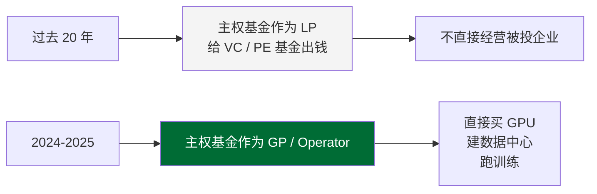
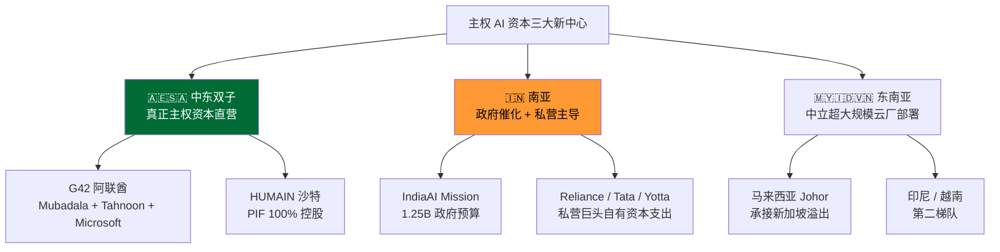
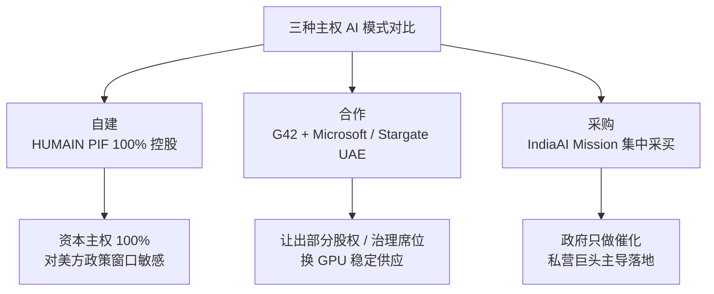
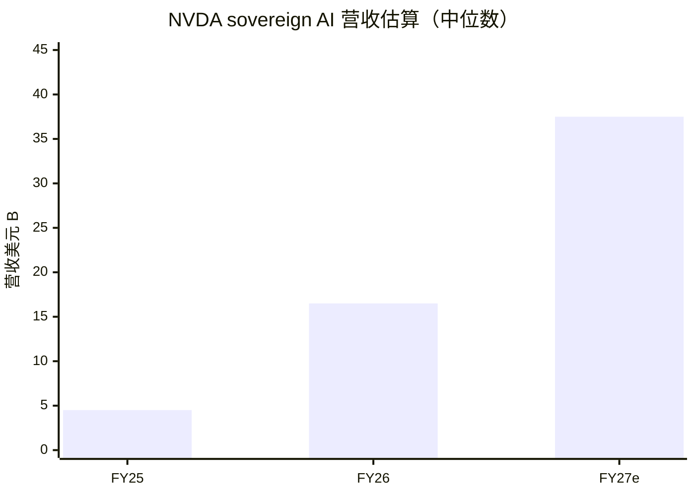
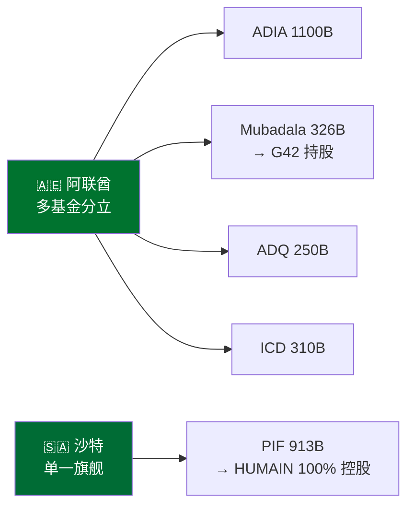
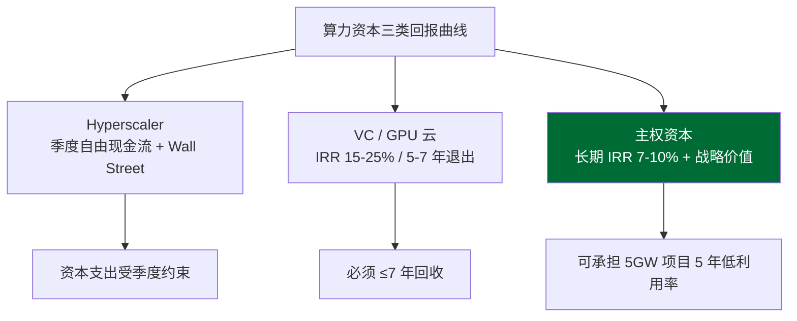
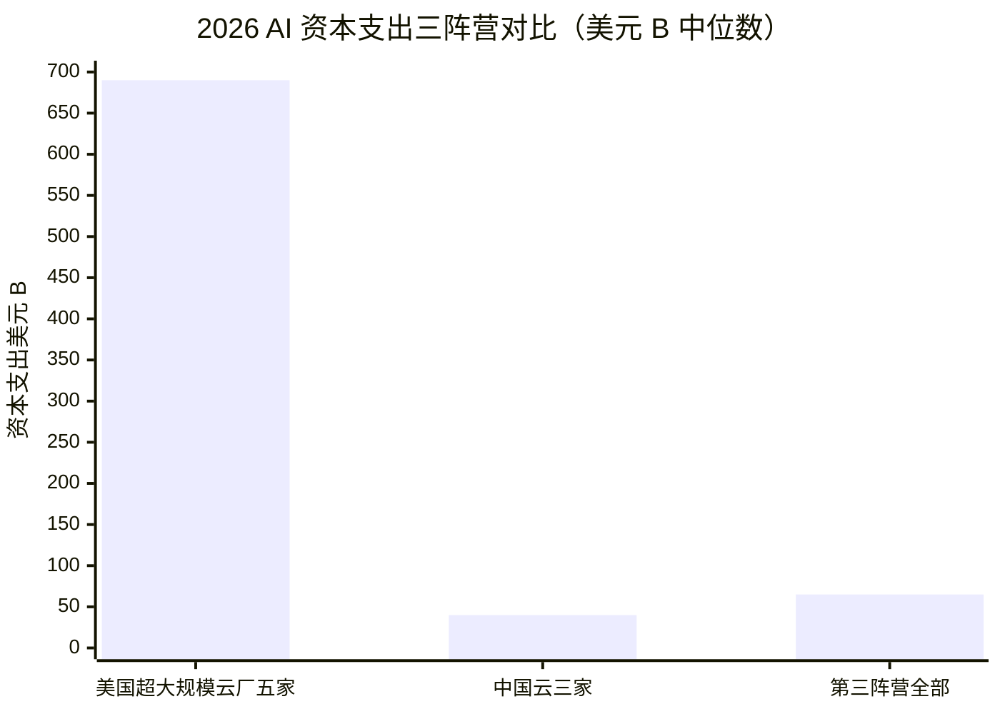

# 第 23 章 边缘新中心：主权 AI 资本如何改写算力地图（2025-）

## 23.1 一个 2025 才浮现的新现象

2024 年 4 月 16 日，Microsoft 与阿联酋 [G42](https://g42.ai/) 签下 15 亿美元战略投资协议。协议里有三件事并不寻常——第一，Microsoft 总裁 Brad Smith 直接进入 G42 董事会；第二，G42 承诺把全部 AI 工作负载迁到 Microsoft Azure；第三，G42 承诺与中国硬件供应商切割，作为获得美国 GPU 出口许可证的前提条件。

这单交易在硅谷估值与中东主权资本之间画了一道清晰的边界——美国出口管制不只是禁令，它是一份可以谈判的会员资格，主权基金愿意付的价格是放弃中国硬件、接受美方治理结构。

一年后，2025 年 5 月 12 日，沙特王储 Mohammed bin Salman 在利雅得宣布成立 [HUMAIN](https://humain.ai/)，由 PIF 全资控股，Tareq Amin 出任 CEO。

> PIF：Public Investment Fund，沙特公共投资基金。AUM 约 \$913B（PIF 2024 年报，截至 2024-12）。

同一天 Trump 访问海湾时，英伟达宣布向沙特发运约 18000 颗 GB300 Grace Blackwell AI 芯片用于 HUMAIN 项目。

把这两件事并列看，能看出一个 2024-2025 之间才完成定型的新现象——**主权基金不再只通过股权投资 AI 公司参与算力产业，它们直接下场买 GPU、建数据中心、跑训练**。

这与过去 20 年沙特、阿联酋、新加坡主权基金对硅谷的参与方式有本质区别。过去主权基金是 LP（给 VC / PE 基金出钱、不直接经营被投企业），现在它们是 GP（直接做经营与投资决策），甚至是 strategic operator（直接持有并运营算力资产的产业方）。

> LP：Limited Partner，有限合伙人。GP：General Partner，普通合伙人。

这件事对全球算力地图的意义不在于中东会不会成为 AI 中心——它已经在变成一个 AI 算力中心，单从规模上就足够无法忽视。真正的意义在于**算力产业从一个美国资本主导的产业链演化成一个美国资本 + 主权资本双轨制的产业链**。在双轨制下，传统估值锚（超大规模云厂自由现金流 / 二级市场对资本支出的容忍度 / 一级市场 VC 的回报要求）只覆盖一半的算力建设；另一半由外汇储备、国家担保、产业政策驱动，按完全不同的回报曲线计算账面。

这一轮主权 AI 资本的真实规模与落地速度，可以用 NVDA 数据中心营收里的 sovereign AI 占比作为核心观察指标（业内估算 FY26 ~7-10%，FY27 共识区间 12-18%；NVDA 不在 10-K / 10-Q 中精确拆分，所有占比均为卖方分析师反推）。围绕它有两条线：三大新中心（中东 / 南亚 / 东南亚）各自的资本来源、能源资源、地缘定位差异；以及主权 AI 玩家与超大规模云厂之间是合作还是竞争、这种关系对 2027-2028 全球算力地图的影响。

本章是 disclaimer 章。涉及 G42 / HUMAIN / Nebius / Mistral 等具体公司讨论，全部按评论而非建议措辞处理，章末有完整免责声明。本章作者持仓部分按全书统一约定——不公开披露具体头寸细节。

## 23.2 主权 AI 资本是什么——一个工作定义

在进入具体玩家之前，有必要把主权 AI 资本这个术语收敛到一个工作定义。市面上同时存在三个相邻但不同的概念：

- **国家算力**（state compute）：政府直接出资建设、政府机构使用的高性能计算资源。典型案例是美国 DOE 国家实验室的 Frontier / Aurora 超算、欧盟 EuroHPC 联合体的 LUMI。这是一个 30 年历史的传统类别，不是本章关注对象。
- **国家 AI 战略**（national AI strategy）：政府发布 AI 产业规划文件、提供研发补贴、培养人才。中国《新一代人工智能发展规划》（2017）、欧盟 AI Act（2024）、美国 NIST AI RMF 都属于这一类。这是一个政策类别，本章只在必要时引用。
- **主权 AI 资本**（sovereign AI capital）：**主权基金或国家控股实体直接投资建设的、用于训练大模型 / 提供云算力 / 服务国家战略意图的、规模在 GW 量级或万卡量级的 AI 算力资产**。这是本书使用的工作定义。

三者的差别有时模糊（某个项目可能同时是三者），工作定义抓三个判定标准——资金来源是主权基金或国家担保、资产形态是 GPU 集群 / 数据中心（而不是政策文件 / 补贴）、规模在 GW 或万卡量级。按这个标准筛选，2024-2026 年间真正达标的玩家不超过 15 家，集中在中东（G42 / HUMAIN）、南亚（IndiaAI Mission + Reliance）、东南亚（Microsoft / Google 在马来西亚 / 印尼的部署，主权属性较弱但与本地政府深度合作）、欧洲（Mistral 等已在前文 sovereign AI 早期阶段覆盖）。

把这个定义说清楚之后，下一步是测量。主权 AI 资本的总规模有多大？这是一个相当难回答的问题——大部分项目处于已公告 / 部分落地 / 持续追加的状态，很多资金链条不完全公开。一个相对可靠的反推方法是用 NVDA 的客户披露作为锚。

## 23.3 NVDA 数据中心营收里的 sovereign AI 信号

NVDA FY26 全年（截至 2026-01-25）数据中心营收 \$193.7B。这是观察 sovereign AI 规模化的最关键单一指标——因为 sovereign AI 项目几乎全部用 NVDA GPU，营收最终落在 NVDA 数据中心 P&L 里。

NVDA 自 2024 年起在电话会中频繁提及 sovereign AI 作为高增长板块。但 NVDA 在 10-K / 10-Q 中并未把 sovereign AI 单独拆分为披露口径——10-K 的客户细分维度是按产品（Compute / Networking）+ 按地理（U.S. / Singapore / Taiwan / China / Other）+ 按客户集中度（Customer A / B / C…）展开，没有 sovereign 这一行。

业内对 sovereign AI 占比的估算来自三种反推方法：

| 反推方法 | 推算逻辑 | FY26 估算占比 | 局限 |
|---------|---------|-------------|------|
| 公开订单加总法 | 把 G42 / HUMAIN / 印度 / 欧洲已公告 GPU 订单按单价 ×0.7-0.8（议价折扣）加总 | 7-10% | 漏掉未公告订单；时点错配 |
| 地理细分反推法 | 用 NVDA 10-K 中 Other 地理（含中东 / 拉美 / 部分东欧）增量贴近 | 8-12% | Other 含非主权 AI 项目 |
| 管理层口径外推法 | Jensen Huang 在 2024-2025 多次电话会提及 sovereign AI 是 tens of billions 量级 | 8-15% | 管理层口径模糊 |

> 来源：综合 SemiAnalysis 2025-2026 sovereign AI 跟踪、Bernstein 中东 AI 算力覆盖、Bloomberg 报道。**三种方法都是业内估算，非 NVDA 一手披露**。三种方法的区间是 7-15%，中位数大约在 10%。本章后文用 FY26 ~7-10%作为保守口径。

这个数字与超大规模云厂资本支出的关系值得拆一下。FY26 NVDA 数据中心营收里 sovereign AI 占 \$14-19B（按 7-10% 估算），与之对比的是超大规模云厂五巨头（Microsoft / Amazon / Google / Meta / Oracle）2026 年 AI 资本支出指引合计约 \$680-700B（同前 17 章）。sovereign AI 的 NVDA 营收只是超大规模云厂总资本支出量级的 ~2-3%。这看起来不大，但有两件事让它实际上比账面更重要：

第一，sovereign AI 的增量在 FY26 → FY27 → FY28 三年里增速估算高于超大规模云厂总资本支出。卖方共识区间 FY27 sovereign AI 占 NVDA 数据中心营收 12-18%。如果 FY27 NVDA 数据中心营收按 +35% 增长测算（与第 30 章 base case 一致），sovereign AI 绝对额会到 \$30-45B 量级。

第二，sovereign AI 的客户结构与超大规模云厂不重叠。NVDA 长期被诟病客户集中度高——FY26 10-K 显示单一最大直接客户占总营收约 22%、第二大客户占 14%、前两家合计约 36%。10-K 未给出前四合计全年口径，季度披露偶有 Customer A-D 合计约 50% 区间的数据点，本章不并入年度口径。sovereign AI 客户进来后，最大单一客户占比会自然稀释。这一点对 NVDA 估值模型的客户集中度风险参数有直接影响，第 30 章会接着讨论。

下表给出 FY25 → FY27e 三年的 sovereign AI 营收占比与绝对额估算：

| 财年 | NVDA 数据中心营收 | sovereign AI 占比（业内估算） | sovereign AI 绝对额 | 主要驱动 |
|------|-----------------|----------------------------|-------------------|---------|
| FY25 | \$115.2B（实际） | 3-5% | \$3-6B | 早期 G42 / 沙特零星订单 |
| FY26 | \$193.7B（实际） | 7-10% | \$14-19B | G42 / HUMAIN / IndiaAI / 欧洲首轮 |
| FY27e | \$245-260B（卖方共识） | 12-18% | \$30-45B | Stargate UAE / HUMAIN 扩产 / 印度第二轮 |

> 来源：FY25 / FY26 实际数据来自 NVDA 10-K；FY27e 营收为卖方一致预期（综合 Visible Alpha 2026-05）；sovereign AI 占比为业内估算，非 NVDA 披露。所有占比区间均为反推估算，**严格口径为二手 + analyst 推算**。

这张表是本章后续讨论的锚——所有具体玩家的规模与节奏，都要回到这张表上。

## 23.4 中东双子：阿联酋 G42 与沙特 HUMAIN

中东在主权 AI 资本里的位置远超其人口 / GDP 在全球的比重。阿联酋与沙特两国 GDP 合计占全球 ~1.6%（2024 年 IMF 口径），但在 sovereign AI 资本投入里两国合计占已公告项目的过半数量。

理解中东这两个玩家，需要先把资金来源 + 能源资源 + 地缘定位三件事并排放好。

### 23.4.1 资金来源对比

阿联酋与沙特都有规模庞大的主权基金，但结构不同：

| 国家 | 主权基金（AUM 估算） | 对 AI 算力的对接路径 |
|------|-------------------|-------------------|
| 阿联酋 | ADIA \$1100B / Mubadala \$326B / ADQ \$250B / Investment Corp of Dubai \$310B | Mubadala → G42（持股）；ADIA / ADQ 通过 LP 出资 |
| 沙特 | PIF \$913B（2024 年报口径） | PIF → HUMAIN（100% 控股） |

> 来源：Mubadala \$326B 来自 The National 2025-05-08 报道 Mubadala 资产规模披露；PIF \$913B 来自 PIF 2024 年报（截至 2024-12，AUM 同比 +19%）；ADIA / ADQ / ICD 综合 SWF Institute 2025-09 跟踪与各基金年报，业内估算。阿联酋多基金分立结构与沙特单一旗舰基金结构是中东主权资本的核心差异。

阿联酋的多基金分立 + 控股运营模式比沙特的单一旗舰 + 直接持有模式更复杂，但带来三个好处：一是分散监管视线，每个基金的对外形象不同，便于做不同性质的对外合作；二是控股 G42 之外还能用其他基金做股权投资（如 Mubadala 通过 ATIC 旗下投资实体在 FTX 破产清算中购入的 Anthropic 二级份额，具体持股比例未公开），多线参与算力产业；三是 G42 自身有相对独立的董事会与治理结构，外部资本（如 Microsoft）可以进入决策层。

沙特的 PIF 直接持有 HUMAIN 模式更高效但灵活性较弱。HUMAIN 的所有重大决策都要回到 PIF 与王储办公室——这意味着对外合作的谈判节奏快（不需要多基金协调），但战略转向的成本高。

### 23.4.2 G42 的业务结构与 Microsoft 协议

G42 成立于 2018 年，总部阿布扎比，董事长是阿联酋国家安全顾问 Tahnoon bin Zayed Al Nahyan。Group CEO 是 Peng Xiao，曾领导 G42 旗下网络安全子公司 Pegasus。这一治理组合有一个结构性细节——CEO 是有中国背景的工程师，而董事长是阿联酋国安系统的核心人物。这一组合在 2024 年之前给 G42 带来与中国客户 / 供应商的便利通道，2024 年之后也给 G42 带来重新定位的压力。

G42 旗下的主要业务单元：

| 单元 | 业务 | 与 AI 算力的关系 |
|------|------|----------------|
| Inception Institute of AI (IIAI) | 基础研究 + Falcon LLM 系列 | 模型层；驱动 GPU 需求 |
| Core42 | 云算力 + 政府数字基础设施 | 算力层；直接持有 GPU 集群 |
| Khazna Data Centres | 数据中心运营（与 e& / Mubadala 合资） | 数据中心层；为 Core42 等提供物理设施 |
| M42（医疗 AI） | 医疗 AI + 基因组学（与 Mubadala Health 合并而来） | 应用层；曾因数据合作引发争议 |

> 来源：G42 官方披露 + Wikipedia + 公开报道。各单元规模未在 G42 整体合并报表中拆分披露。

2024 年 4 月的 Microsoft \$1.5B 投资是 G42 历史上最重要的一笔战略合作。协议包括三项核心条款——Microsoft 总裁 Brad Smith 进入 G42 董事会、G42 承诺将其 AI 工作负载迁移到 Microsoft Azure、G42 承诺与中国硬件供应商切割。第三项是这单交易的政治焦点。在协议公布前，G42 与华为等中国供应商有过实质合作；协议公布后，G42 公开承诺不再使用中国硬件，并接受美方对其供应链与客户基础的尽职调查。

这单交易的实际意义远超 \$1.5B 的金额本身。它在美国出口管制框架内为 G42 打开了 NVDA 先进 GPU 的稳定供应渠道——在没有这单交易之前，BIS 对 G42 的 GPU 出口许可证审批存在显著不确定性；交易公布后，G42 在 H100 / H200 / GB200 各代产品上都获得了相对顺畅的许可通道。

需要补充的是后续治理调整。在 Microsoft 与 G42 完成首期合作后，美国国会对 G42 与中国关联的担保条款提出更严格要求，Microsoft 与 G42 在 2024 下半年至 2025 上半年间多次调整治理细节。这一过程显示 sovereign AI 的合作模式仍在动态校准——并非签约即定型，而是持续受到美国出口管制框架与国会监督的修正。

### 23.4.3 Stargate UAE 与 OpenAI / Oracle / 英伟达 / SoftBank / 思科（Cisco） 联盟

2025 年 5 月 22 日，G42 联合 OpenAI、Oracle、英伟达、[SoftBank](https://www.softbank.jp/en/)、思科宣布 Stargate UAE 项目。这是 Stargate 总框架在美国本土之外的第一个海外分支。按 G42 官方公告口径，Stargate UAE 本身规划 1GW 算力集群，作为更大的 UAE-US AI Campus 5GW 总规划的第一阶段。把整个 5GW Campus 落到 GPU 数量上，按 GPU 集群 IT 负载 / 总功率比 ~50-60% 测算，对应 IT 负载约 2.5-3GW，约合 H100 等效 GPU 1.5-2 百万颗（业内估算，区间口径，非官方数据）。

把这个数字放回 23.3 节的 NVDA sovereign AI 营收锚——UAE-US AI Campus 5GW 整体规划按 GB200 时点单价 ~\$30-40K × 1.5-2 百万颗算术推演，整体 GPU 采购金额量级在 \$45-80B 区间（业内估算 + 算术推演），分 3-5 年落地。这一单项目的 GPU 采购规模本身就接近 FY27 全球 sovereign AI 营收估算的过半。

Stargate UAE 的玩家组合显示了主权 AI 资本与硅谷玩家的合作模式：

| 角色 | 玩家 | 出资 / 资源 / 收益 |
|------|------|------------------|
| 主权资本方 | G42（背后 Mubadala / UAE 政府） | 资本 + 土地 + 能源 + 监管准入 |
| 模型方 | OpenAI | 模型权重 + 训练任务 + 商业客户 |
| 云栈方 | Oracle | OCI 云基础设施 + 网络互联 |
| 芯片方 | 英伟达 | GB200 等芯片优先供应 + 技术支持 |
| 资本协同方 | SoftBank | 联合投资 + 跨地区资本协同 |
| 网络方 | 思科 | 数据中心网络设备 |

> 来源：Stargate UAE 联合公告综合各方公开声明，2025-05。各方具体出资比例与收益分配未公开披露。

这种多方角色并列的结构与传统超大规模云厂自建数据中心很不一样。传统模式下，超大规模云厂（如 Microsoft、Google）单独承担全部资本与运营，对外只采购芯片与网络设备。Stargate UAE 模式下，资本由主权方承担、模型 / 云栈 / 芯片 / 网络全部从硅谷采购、运营由 G42 与 Oracle 联合执行——美国玩家几乎不出资本，但深度参与价值链上端的高毛利环节（模型 / 芯片 / 云栈），形成一种主权资本兜底资本支出 + 美国玩家拿走高毛利的分工。

### 23.4.4 HUMAIN：沙特的国家算力公司路径

沙特 HUMAIN 的设立时间晚于 G42，但起步规模与节奏更激进。2025 年 5 月 12 日，王储 Mohammed bin Salman 宣布成立 HUMAIN，作为 PIF 全资控股的国家算力公司，Tareq Amin 出任 CEO。同一周内 Trump 访问海湾时，英伟达宣布向沙特发运约 18000 颗先进 AI 芯片用于 HUMAIN 项目，AMD 也宣布对应的 Instinct 芯片合作。

HUMAIN 与 G42 在几个关键维度上有结构差异：

| 维度 | G42（UAE） | HUMAIN（沙特） |
|------|-----------|---------------|
| 持股 | Mubadala 持股 + Tahnoon 控股 + Microsoft \$1.5B | PIF 100% 控股 |
| 治理 | 独立董事会，含 Microsoft 总裁 | PIF + 王储办公室直管 |
| 启动时点 | 2018 年成立，2023-2024 转型 | 2025-05 直接成立 |
| 初始资本承诺 | 累计已披露 \$5-10B 量级 | 起步即明示 \$10B+ 量级 |
| 旗舰项目 | Stargate UAE 5GW | 首批 18000 颗 GPU + 后续追加 |
| 与中国关系 | 已切割（Microsoft 协议前提） | 未与中国切割明示，但实际默认依赖美方供应链 |
| 美方合作伙伴 | Microsoft（董事会层）+ OpenAI / Oracle / 英伟达 | 英伟达 + AMD + 高通（Qualcomm） + 多方接洽 |

> 来源：G42 / HUMAIN 公开公告综合，业内估算；具体资本承诺数据由多方报道交叉，HUMAIN 的\$10B+是公开沟通口径，未在 PIF 年报中单列。

HUMAIN 的路径相比 G42 有两个显著差异——第一，PIF 直接 100% 控股，没有让出股权空间给美方资本，因此美方在 HUMAIN 的角色更接近供应商而非股东 + 董事；第二，HUMAIN 起步时点恰逢 2025 年美方对中东出口管制的相对宽松窗口，因此首批采购规模能够直接做到万卡量级。两个差异叠加，HUMAIN 的主权属性比 G42 更纯粹，但也意味着它对美方政策窗口变化的敏感度更高——一旦出口管制收紧，HUMAIN 的供应链调整空间比 G42 小。

需要诚实交代的是 HUMAIN 的数据缺口比 G42 更大。HUMAIN 成立时点距本章数据截止（2026-05）只有约一年，PIF 年报对 HUMAIN 的财务披露有限，外部分析主要依赖联合公告与媒体报道。本章对 HUMAIN 规模的所有数字均按已公告 + 业内估算口径处理。

### 23.4.5 中东主权 AI 资本的能源与土地账

中东两个玩家的能源资源是 sovereign AI 资本的物理基础。理解这件事需要把电力 / 土地 / 冷却三件事一起看。

电力方面，阿联酋 2024 年装机容量约 35GW（IEA 2025 口径），沙特装机容量约 90GW。两国电力供应主要由天然气发电承担，大工业 / 数据中心合约电价业内估算区间 \$0.05-0.08/kWh（综合 GlobalPetrolPrices 2025-09 沙特商业电价 ~\$0.074/kWh 与 IEA 估算；中东大工业合约价相对商业零售价存在折扣，但具体合约条款未公开），仍显著低于美国超大规模云厂数据中心枢纽（弗吉尼亚 Loudoun County 工业电价 \$0.08-0.10/kWh、PG&E 服务区 \$0.18-0.22/kWh；来源：第 10 章主锚）。

土地方面，两国均有充裕的政府控制土地，可由主权基金以接近零成本划拨。这与美国超大规模云厂在弗吉尼亚 / 俄勒冈 / 德州遭遇的土地价格上涨和居民抗议形成对比。

冷却方面，中东高温环境对传统空气冷却是劣势——夏季室外温度 45-50°C 时，传统冷却 PUE（Power Usage Effectiveness，数据中心总功率与 IT 负载功率之比，业内标准 ~1.3-1.5）会推到 1.7-2.0 区间。这件事在 GB200 时代被部分解决——GB200 NVL72 机柜原生支持液冷，液冷在高温环境下的 PUE 与温带类似，约 1.2-1.3（业内估算）。GB200 的液冷标准化让中东的高温劣势被技术升级抵消。

把三件事合起来算，中东 1MW 数据中心的全年运营电费约 \$400-600K（按 PUE 1.3 + 工业电价 \$0.05/kWh + 100% 利用率反推），约为美国 Tier 1 枢纽的 30-50%。在数据中心生命周期 10-15 年的财务模型中，电费节省的累计贴现值能达到数据中心资本支出的 15-25%。这一项节省是中东 sovereign AI 资本投入相对美国超大规模云厂算账的物理基础——同样规模 GPU 集群，沙特 / 阿联酋的全生命周期 TCO（Total Cost of Ownership，总持有成本）能比美国低 15-25%。

这一节的数据有较大区间——电价数据各国披露口径不同（含税 vs 不含税、工业 vs 商业、合约 vs 现货）、PUE 实测数据公开度低、利用率假设差异大。本章给出的数字是中位数与区间，不是精确点估计。

## 23.5 南亚：印度的 IndiaAI Mission 与 Reliance 路径

印度在主权 AI 资本里是一个特殊的位置。一方面，印度有全球最大的 IT 服务业基础（TCS / Infosys / Wipro / HCL 等公司是全球最大的 IT 服务外包来源国家之一，四家上市公司合计年营收超 \$700 亿（按 FY24-FY25 上市公司年报汇总，包括 TCS \$30B + Infosys \$19B + Wipro \$11B + HCL \$13B））与全球第二大互联网用户群（2025 年印度网民约 9 亿）；另一方面，印度对 GPU 进口有多重制约——外汇储备紧张（2025 年外储 \$650-700B 量级，相对中国 \$3.2T 与沙特 \$0.5T 体量较小）、半导体先进节点供应链空白（印度国内没有 14nm 以下 fab）、国家算力战略起步晚（IndiaAI Mission 2024 年才获批）。

这种大需求 + 紧约束的组合产生了一种与中东模式不同的 sovereign AI 路径——**政府提供框架与少量补贴 + 私营巨头主导落地 + 国际云厂商提供技术栈**。

### 23.5.1 IndiaAI Mission 的政策框架

IndiaAI Mission 由印度联邦内阁在 2024 年 3 月批准，总预算约 INR 10300 crore，折合 ~\$1.2-1.3B（按 2024 年汇率，1 INR ≈ \$0.012；具体美元口径在各次披露中略有差异，~\$1.25B 是常见引用值；来源：印度 IT 部公告与 Press Information Bureau 报道综合）。

预算分配按五大支柱：

| 支柱 | 估算份额 | 内容 |
|------|---------|------|
| AI 算力（IndiaAI Compute Capacity） | 约 45-50% | 10000+ GPU 公共算力池，按需向研究 / 创业 / 政府机构开放 |
| 基础模型（IndiaAI Innovation Centre） | 约 15-20% | 训练本土多语言基础模型 |
| 数据集（IndiaAI Datasets Platform） | 约 10-15% | 公共数据集开放与质量提升 |
| 应用与人才（IndiaAI Application Development / FutureSkills） | 约 15-20% | 应用孵化与人才培养 |
| 安全与治理（IndiaAI Safe & Trusted AI） | 约 5-10% | AI 安全研究与监管框架 |

> 来源：印度 IT 部公告综合 PIB 报道；具体份额分配在不同披露中有差异，本表为业内估算综合口径，非官方精确拆分。

把这个数字与 G42 / HUMAIN 对比，IndiaAI Mission 的主权出资额明显小一个数量级——\$1.25B 大约只够买 30000-40000 颗 H100 等效 GPU（按 ~\$30K/卡），与 G42 / HUMAIN 单一项目动辄 \$5-10B 起步的尺度相比，更像是一个启动催化剂而非产业主力。

但 IndiaAI Mission 的真实意义不在于资金量。它的意义在于三件事：第一，建立了政府公共算力池的制度框架，让本土研究机构 / 创业公司能以补贴价获得 GPU 计算时长，类似于 1990s 美国 NSF 资助超算中心的制度逻辑；第二，给本土 AI 创业生态提供了一份国家背书，便于本土公司与跨国云厂商谈合作；第三，作为印度对外谈判 GPU 进口许可的政治资本——印度通过 IndiaAI Mission 向美方表明自身有清晰的国家 AI 战略与监管框架，提高了在 BIS 出口管制白名单中的优先级。

### 23.5.2 Reliance Jio 与 Tata 的私营算力建设

如果说 IndiaAI Mission 是政府催化剂，那么真正的算力主力来自印度私营巨头。[Reliance](https://www.ril.com/) Jio 在 2024 年宣布与英伟达合作建设印度 AI 算力基础设施，规划规模在 GW 量级。Reliance 旗下的 Jio AI Cloud 服务于 2024 年 8 月在年度股东大会上由 Mukesh Ambani 公开宣布。

Tata 集团旗下的 Tata Communications + Tata Consultancy Services（TCS）也启动了类似规模的 AI 算力规划。Tata 2024 年 9 月宣布与英伟达合作建设面向印度政府与企业市场的 AI 算力服务。

把 Reliance 与 Tata 的私营建设规模与 IndiaAI Mission 的政府投入做对比：

| 玩家 | 性质 | 资本来源 | 算力规模规划（业内估算） | 时点 |
|------|------|---------|----------------------|------|
| IndiaAI Mission | 政府 | 联邦预算 ~\$1.25B | 10000+ GPU 公共池 | 2024-2029 |
| Reliance Jio | 私营 | Reliance Industries 自有资本支出 | GW 量级，万卡量级 | 2024-2027 |
| Tata Communications + TCS | 私营 | Tata 集团自有资本支出 + 客户预付 | 数千卡到万卡 | 2024-2027 |
| Yotta Data Services（Hiranandani 集团） | 私营 | 集团资本支出 + 项目融资 | 万卡量级 | 2024-2026 |

> 来源：各公司公开公告综合媒体报道；具体规模为业内估算，非公司官方披露。

印度模式与中东模式的差异在这张表上很清楚：印度的算力主力是私营巨头自有资本支出，政府只做小额催化；中东的算力主力是主权基金直接出资，私营资本几乎不参与。这一差异决定了印度 sovereign AI 的主权属性比中东弱——但也意味着印度的算力扩张节奏可能更受市场盈利约束、扩张速度可能比中东慢。

### 23.5.3 印度 GPU 进口的实际约束

印度的 GPU 进口受三重约束。第一，外汇约束——印度 2024-2025 年贸易逆差占 GDP 比约 -1.5%，外汇储备虽然在历史高位（\$650-700B），但相对沙特 / 阿联酋的外汇压根不是约束是不同状态，大规模 GPU 进口需要 RBI（印度央行）批准外汇额度。第二，关税与生产激励约束——印度 2024 年推出半导体激励计划（India Semiconductor Mission），鼓励 AI 服务器在印度本土组装，对完全进口的 AI 服务器有 18-22% 的进口关税（业内估算综合印度海关披露），相比沙特 / 阿联酋接近零关税的政策有显著成本差。第三，BIS 许可证约束——印度虽然不在出口管制清单上，但具体每笔大额订单仍需 BIS 审查，节奏比中东慢。

三重约束叠加，2024-2026 年印度实际进口 GPU 量级业内估算在 5-10 万颗 H100 等效（区间口径，非官方数据），远低于 G42 / HUMAIN 单一项目万卡级别。这件事会限制印度在 sovereign AI 资本里规模的天花板——除非外汇政策与关税政策有实质调整。

## 23.6 东南亚：地理 + 能源 + 监管套利的复合驱动

东南亚（马来西亚 / 印尼 / 越南 / 泰国 / 新加坡）在主权 AI 资本里的位置与中东 / 印度都不同。东南亚国家自身的主权 AI 投入非常有限，但东南亚正在成为美国超大规模云厂与中国互联网公司之间的中性算力枢纽。

理解这件事需要先承认一件事——东南亚的主权 AI 资本严格说不存在。马来西亚 / 印尼 / 越南的主权基金（如马来西亚 Khazanah AUM \$50B、印尼 INA Sovereign Wealth Fund AUM 起步阶段、越南没有大型主权基金）与中东 / 沙特相比规模不在一个数量级，无法直接做万卡级 GPU 采购。但东南亚承接了 sovereign AI 时代的另一类资本——**超大规模云厂的中立地缘部署**。

### 23.6.1 马来西亚 Johor：与新加坡毗邻的数据中心枢纽

马来西亚南部 Johor 州在 2023-2025 年成为东南亚增速最快的数据中心枢纽。Johor 紧邻新加坡，通过新马第二通道（Second Link）连接，物理距离新加坡核心商务区不到 30 公里。Johor 在 2023-2025 间承接了原本流向新加坡的数据中心需求——新加坡因 2019 年起对数据中心新增建设实施暂停（Moratorium），导致后续超大规模云厂转向跨境部署。

Johor 数据中心枢纽的客户结构（业内估算综合 DC Byte 跟踪与媒体报道）：

| 客户类型 | 占比估算 | 代表项目 |
|---------|---------|---------|
| 美国超大规模云厂（AWS / Google / Microsoft） | 40-50% | AWS Johor、Google Johor、Microsoft Johor |
| 中国互联网公司（字节 / 阿里 / 腾讯） | 20-30% | 字节 TikTok 海外算力部分部署 |
| 本地 colocation 运营商（YTL、Bridge Data Centres、AirTrunk） | 20-30% | 多个跨客户共享设施 |
| 主权 / 国家项目 | <5% | 占比极小 |

> 来源：业内估算综合 DC Byte 2025-2026 跟踪与媒体报道，具体客户身份与占比未由超大规模云厂公开披露。

Johor 的崛起对全球算力地图的意义在于——它显示主权 AI 资本时代的中立枢纽概念。中国互联网公司在美国本土与盟友领土上面临超大规模云厂合作限制（数据出境、合规审查、政府客户隔离）；美国超大规模云厂在中国大陆同样面临监管限制。在双方都无法直接进入对方核心市场的格局下，东南亚成为双方都能进入、且对双方都不构成威胁的中立空间。

### 23.6.2 印尼与越南：第二梯队的承接

印尼与越南的数据中心承接规模小于马来西亚，但有各自的优势。印尼有东南亚最大的内需市场（2025 年人口 2.8 亿、移动互联网用户 2.1 亿），适合服务本地用户的推理算力部署。越南有相对低的工业电价（\$0.05-0.07/kWh，比马来西亚 \$0.07-0.09/kWh 略低）与制造业聚集（电子代工 / 服务器组装在越南北部已有基础），适合训练算力与推理算力混合部署。

两国在 2024-2026 间各自承接的数据中心规划（业内估算综合多方公告）：

| 国家 | 已公告新增数据中心容量 | 主要参与方 |
|------|---------------------|-----------|
| 印尼 | 800-1200MW（2024-2027 规划） | Microsoft（雅加达 \$1.7B 投资公告 2024-04）、Google、字节 |
| 越南 | 400-600MW（2024-2027 规划） | Microsoft 在河内 / 胡志明市部署、富士康越南服务器组装 |

> 来源：Microsoft 2024-04 雅加达投资公告 + 各国数据中心招标公告，业内估算综合 DC Byte 跟踪。

东南亚整体在 sovereign AI 资本时代扮演的角色，可以用一句话总结——**它本身不是主权 AI 玩家，但它是 sovereign AI 与超大规模云厂在中美之间的缓冲区，承接了双方都需要的中立部署需求**。

## 23.7 主权 AI 与超大规模云厂：合作还是竞争？

把中东 / 南亚 / 东南亚三组玩家放在一起看，能看到一个共同模式——**它们与超大规模云厂既深度合作又结构性竞争**。这种竞合并存的关系是 sovereign AI 时代算力地图最不容易概括的部分。

### 23.7.1 合作面：主权资本兜底资本支出，超大规模云厂拿走价值链上端

合作的具体形态在 Stargate UAE 已经展示——主权方出资本、出土地、出能源、出监管准入；硅谷玩家出芯片、出模型、出云栈、出客户。这种分工的财务含义是——sovereign AI 项目的资本支出由主权方在账面上承担（数百亿美元的 GPU 与数据中心资产折旧 / 利息支出落在主权方账面），而项目产生的高毛利环节（GPU 销售、模型 API、云栈运营支出加成）由硅谷玩家拿走。

把这件事翻译成估值含义——**美国玩家在 sovereign AI 时代实现了用别人的资本支出撑自己的营收**。NVDA 卖 GPU 给 G42 / HUMAIN，营收落在 NVDA P&L，但建数据中心、付电费、做折旧的资本支出落在 G42 / HUMAIN 账面。这种结构是 NVDA 数据中心营收能持续高速增长而 NVDA 自身资本支出增速远低于营收增速的核心原因之一。

但这种被别人资本支出撑的模式有一个长期问题——它依赖主权资本愿意承担低回报、长周期的算力资产。如果主权资本在某个时点重新评估算力投资的回报曲线，并决定减速，NVDA 数据中心营收的 sovereign AI 部分会受到直接冲击。这件事在 FY27-FY28 是观察的重点。

### 23.7.2 竞争面：主权资本绕开传统估值锚

竞争的形态更细微。Hyperscaler 的算力建设受三重财务约束——一是季度财报对资本支出的容忍度（Wall Street 对资本支出占营收比的接受度有上限）；二是自由现金流约束（Microsoft / Google / Meta 的自由现金流利润率必须维持在 25-35% 区间以支撑估值）；三是 VC 对未上市超大规模云厂替代者（如 CoreWeave）的回报曲线要求（IRR 15-25%、5-7 年退出）。

主权 AI 资本不受这三重约束。PIF 投 HUMAIN 不需要每季度向 Wall Street 解释资本支出；G42 背后的 Mubadala / Tahnoon 系统不需要维持季度自由现金流利润率；主权基金的回报要求是 7-10% 长期 IRR，与 VC 的 15-25% 完全不在一个量级。

这意味着主权 AI 玩家可以做超大规模云厂不会做的事——比如在某个区域建一个 5GW 的数据中心、5 年内不要求 100% 利用率、为长期战略价值（外交筹码 / 区域影响力 / 国家科技自主）支付高于市场水平的资本支出。

这种行为本身就改变了局部市场的供给曲线——sovereign AI 玩家的算力供给会压低中东 / 南亚地区的算力批发价格，让本地超大规模云厂的算力扩张面临更便宜的主权补贴竞争者。

把合作面与竞争面合起来——**主权 AI 与超大规模云厂的关系不是单一的合作或竞争，而是在不同环节的不同结构**。芯片与模型层是合作（主权方采购硅谷产品），云栈与算力批发层是竞争（主权方与超大规模云厂在同一市场提供算力服务）。这种上层合作 + 下层竞争的模式是未来 3-5 年的常态。

### 23.7.3 主权 AI 资本对硅谷 VC 生态的渗透

除了直接建算力，主权资本还以另一种方式深度参与 AI 产业——**对硅谷 VC 与 AI 公司的二级 / 一级股权投资**。Mubadala 通过 ATIC（旗下投资实体）参与 Anthropic 二级份额（具体持股比例未公开）、PIF 在 Lucid Motors / SoftBank Vision Fund 的多次投资、SoftBank Vision Fund 本身的资金过半来自沙特 PIF 与阿联酋 Mubadala、SoftBank 2025 年起对 OpenAI 的两轮巨额注资（2025-04 首轮 \$7.5B + 2025-12 次轮 \$22.5B，合计 \$30B；来源：SoftBank Group 官方新闻稿 2025-12-31）——这些链条把中东主权资本与硅谷 AI 顶级公司紧密连接。

这件事的产业含义在于——主权 AI 资本不仅在中东本地建算力，它也通过股权投资在硅谷的 OpenAI / Anthropic 等公司里持有重要份额。当这些公司决定算力部署位置时，主权资本作为股东会自然把部分部署引向中东。这种投资 + 部署的协同是 sovereign AI 资本与硅谷生态融合的深层路径。

需要诚实交代的是，主权资本对硅谷的渗透有明显的地缘约束。2024-2025 年间美国 CFIUS（Committee on Foreign Investment in the United States，美国外国投资委员会）对主权资本投资硅谷 AI 公司的审查趋严，特别是对中国关联资本的审查。中东主权资本目前仍享有相对宽松的 CFIUS 待遇，但这一窗口未来是否持续存在不确定。

## 23.8 第三阵营的 10 个代表玩家定位

把全球 sovereign AI 与相邻非美 / 非中算力玩家放在一张表上，能看出一个新的产业分层。第一阵营是美国超大规模云厂 + NVDA，第二阵营是中国本土云 + 国产 GPU（华为 / 阿里 / 腾讯，详见第 21 章）。第三阵营是 sovereign AI 与近第三方边缘玩家——它们既不完全依附美方，也不属于中国本土阵营，构成全球算力地图的第三极雏形。

下表按资本来源 + 算力规模 + 战略客户 + 地缘定位四维度排列：

| 玩家 | 国家 | 资本来源 | 已部署 / 已公告算力（业内估算） | 战略客户 | 地缘定位 |
|------|------|---------|----------------------------|---------|---------|
| G42 | 阿联酋 | Mubadala + Tahnoon + Microsoft \$1.5B | 5GW 量级（Stargate UAE）+ 既有 ~万卡 | OpenAI / Oracle / 阿联酋政府 + 中东客户 | 美方紧盟约束下的中东中枢 |
| HUMAIN | 沙特 | PIF 100% | 起步 18000 颗 + GW 量级扩产 | 沙特政府 + 英伟达 / AMD / 高通联盟 | PIF 直接控股的国家算力公司 |
| Mistral | 法国 | 法国主权基金 + 欧洲 VC + Microsoft 间接 | 数千卡量级（与 OVH / Scaleway 合作） | 欧盟政府客户 + 企业 SaaS | 欧洲主权 AI 旗舰（详第 22 章） |
| Nebius | 荷兰（前 Yandex 海外资产剥离） | 二级公开市场（NASDAQ 上市） | 万卡级 H100 / H200 | 超大规模云厂与企业 AI 客户 | 后苏联资产西迁的算力玩家 |
| Cohere | 加拿大 | 加拿大与美国 VC（含 PIF / 加拿大养老基金） | 数千卡（与 Google / Oracle 合作） | 企业级 LLM SaaS | 北美第二梯队模型公司 |
| Aleph Alpha | 德国 | 德国政府 + 私募 VC | 数千卡 | 德国政府与欧盟客户 | 欧洲主权 AI 第二梯队 |
| Reliance Jio | 印度 | Reliance Industries 自有资本支出 | GW 量级（与英伟达合作） | 印度政府 + 印度企业市场 | 私营巨头主导的印度路径 |
| Tata（Tata Communications + TCS） | 印度 | Tata 集团自有资本支出 | 数千卡到万卡 | 印度政府 + 印度国际客户 | 印度 IT 服务巨头转型 |
| Yotta Data Services | 印度 | Hiranandani 集团 + 项目融资 | 万卡量级 | 印度国内 AI 创业生态 | 印度 colocation 与算力批发 |
| 字节海外算力（TikTok 海外推理） | 跨境 | 字节自有资本支出 | 推理算力 GW 量级（部分在新加坡 / 马来西亚 / 印尼） | TikTok 海外用户推理 | 中国互联网海外算力的特殊案例 |

> 来源：综合各公司公开披露、媒体报道、SemiAnalysis / Bernstein / SWF Institute 等业内跟踪。**所有算力规模均为业内估算，多数公司未单独披露 GPU 集群规模**。表中字节海外算力因其特殊性（中国互联网公司的海外算力部署）单独列出，但严格说与本章主题的主权 AI 边界不重合，仅作为第三阵营算力分布的参照。

这张表显示了第三阵营的内部异质性——并不存在统一的 sovereign AI 阵营。中东双子（G42 / HUMAIN）是真正的主权资本直营，欧洲（Mistral / Aleph Alpha）有强主权属性但规模有限，印度三家（Reliance / Tata / Yotta）是私营巨头主导，Nebius / Cohere 是市场化算力供应方，字节海外算力是中国互联网公司的海外延伸。

把这张表与中美双极对照——美国超大规模云厂五家 2026 AI 资本支出合计 \$680-700B、中国云三家（阿里云 + 腾讯云 + 华为云）合计 AI 资本支出业内估算 \$30-50B（详第 21 章）、第三阵营全部加起来业内估算 \$50-80B（FY26 当年）。

从绝对量级看，第三阵营约相当于中国阵营、相当于美国阵营的 8-12%。这个比例不大，但增速快——卖方共识 FY26 → FY27 第三阵营的年增速在 50-80% 区间，远高于美国超大规模云厂的 25-35% 与中国云的 30-40%（业内估算综合）。

如果这个增速维持到 2028 年，第三阵营的 AI 资本支出绝对额可能达到 \$150-250B 量级，开始进入非可忽视量级。这是观察 sovereign AI 是否真正改变全球算力地图的关键时点。

## 23.9 主权 AI 资本时代的产业含义

把前面几节合起来，能从 sovereign AI 的兴起里抽取出几条对算力产业链中下游的结构性含义。

第一，**NVDA 客户基础多元化**。前章已经讨论过 NVDA 的客户集中度风险——FY26 10-K 直引口径，单一最大直接客户占总营收约 22%、前两合计约 36%。sovereign AI 客户群（G42 / HUMAIN / IndiaAI / 欧洲 / 第三阵营各家）的进入会自然稀释这一集中度。按 FY27e 估算，sovereign AI 总营收占 NVDA 数据中心营收 12-18%，对应一个分散的客户群（约 15-25 个独立主权 / 半主权客户实体），这会把 NVDA 客户集中度从 FY26 的前两合计 36%稀释到 FY27e 的前两合计 28-32%区间（业内估算，按 sovereign AI 摊薄效应反推）。客户基础多元化对 NVDA 估值模型的客户集中度风险贴现参数有直接利好。第 30 章会接着讨论。

第二，**数据中心建设需求的地理迁移**。sovereign AI 资本投入的物理形态是数据中心。按 FY26 已公告项目 + FY27e 增量估算，sovereign AI 驱动的新增数据中心容量在 2024-2028 五年内合计约 15-25GW（中东 ~10GW + 印度 ~3-5GW + 欧洲 ~2-3GW + 第三阵营其他 ~2-3GW；业内估算）。这一规模约为同期美国超大规模云厂数据中心新增（约 60-80GW）的 20-30%。地理迁移会对数据中心建设产业链（变压器 / 冷却设备 / 网络设备）的区域订单结构产生明显影响——伊顿（Eaton）、施耐德电气（Schneider Electric）、维谛技术（Vertiv）等数据中心电力设备厂商在中东 / 印度 / 东南亚的订单占比会显著上升。

第三，**电力市场的局部紧张**。中东电力供应相对宽松，但印度的电力供应基础设施已经紧张，sovereign AI 资本驱动的算力部署可能进一步推高印度工业电价。这一点与第 10 章讨论的美国 PJM 电网紧张类似——AI 算力的电力需求会快速消化基础设施富余、推高局部电价。

第四，**GPU 二级市场流通性下降**。Sovereign AI 项目的 GPU 采购通常是长期持有（数据中心生命周期 10-15 年），不会像超大规模云厂那样在 3-5 年后进入二手市场。这意味着 H100 / H200 / GB200 的二手市场流通量在 2026-2030 年间会比预期更紧。Cf 第 16 章讨论的 CoreWeave 等 GPU 云在二手市场的暴露——sovereign AI 的长期持有会减少二手市场供给，可能维持新卡价格。

第五，**对中国国产替代的间接影响**。sovereign AI 资本几乎全部采购 NVDA / AMD（美方阵营）芯片。这意味着中国国产 GPU（华为昇腾 / 寒武纪 / 燧原）在中东 / 印度 / 欧洲市场的渗透率接近零。这一格局如果维持，国产 GPU 的全球市占空间被压缩在中国本土与少数友好客户区域。第 21 章已经讨论过中国 GPU 的国内市场天花板，sovereign AI 的兴起进一步明确了国际市场不向中国 GPU 开放的现实。

第六，**第五部叙事闭环**。本书第五部的核心问题是全球算力产业的权力结构是什么样的。第 19 章给出美国体系的技术 / 资本 / 规则三位一体框架，第 20 章拆美国的政策工具，第 21 章看中国的国产替代路径，第 22 章看东亚与欧洲。本章把视野扩到中东 / 南亚 / 东南亚的第三阵营。把五章合起来看，全球算力产业的权力结构可以简化为美国主导 + 中国独立 + 第三阵营依附美方但保留谈判空间——这是 2026 年中的现实，不是 2030 年的预测。

## 23.10 主权 AI：算力作为国家产能的信号

主权 AI 资本的兴起，也给「算力是不是通用目的技术（GPT，General Purpose Technology）」这个问题提供了一个数据点。如果算力只是一个垂直行业的工具，主权基金不会大规模直接投入——它们会通过 LP 形式间接参与，把执行交给市场玩家。但 2024-2025 间主权基金的直接下场显示，国家级别玩家开始把算力视为国家产能（national 产能）而非市场商品（market commodity）。这种判断本身就接近 GPT 的定义——19 世纪铁路、20 世纪电力、20 世纪末互联网，都是被国家级别玩家视为产能的技术。

主权 AI 资本是否会进一步演化、形成与美国超大规模云厂阵营长期共存的双轨制？2025-2030 年是观察窗口。本章给出的所有数字与判断都是 2026-05 时点的截面，未来 12-24 个月内大概率会有显著修正。最重要的不是记住具体数字，而是建立对这一新现象的观察框架——**资本来源 + 能源资源 + 地缘定位 + 与硅谷生态的合作 / 竞争分层**——后续的数据更新可以按这个框架持续跟踪。

---

> **免责声明**
>
> 本章涉及具体公司（G42 / HUMAIN / Nebius / Mistral / Reliance / Tata 等）的产业评论与战略定位分析，仅为作者基于公开信息的研究结果，**不构成任何投资建议**。市场有风险，投资决策应基于读者自身的独立判断和专业咨询。
>
> 本章使用的财务数据、算力规模数据、资本承诺数据截至 2026-05，公司基本面、地缘格局与监管环境可能在阅读时已发生变化。本章中提到的公司股票、估值参考、算力规模等信息均为分析素材，作者不对其准确性、完整性或时效性作任何承诺。本章涉及的 sovereign AI 占 NVDA 营收占比、各主权 AI 项目算力规模等数据，**多数为业内估算（非一手披露）**，正文已在出现处明示口径；读者使用时请参照本书对已公告 / 业内估算 / 一手披露三种数据等级的区分规则。
>
> 本章按全书统一约定不公开披露作者具体持仓头寸细节；涉及具体公司的评论按评论而非建议原则处理，未对任何标的做多空判断或目标价测算。

---

> 本章来自《算力经济学》开源版 · 作者「递归客」  
> 在线阅读完整书系：[inferloop.dev](https://inferloop.dev)
