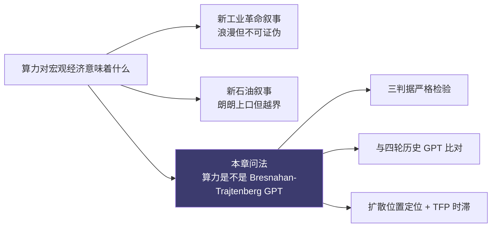
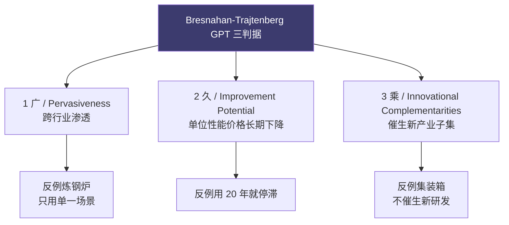
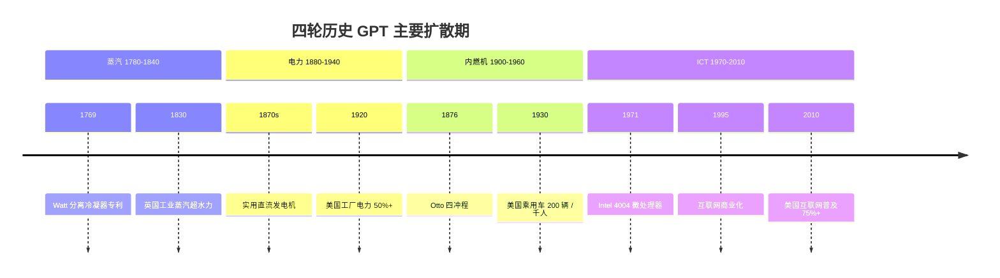
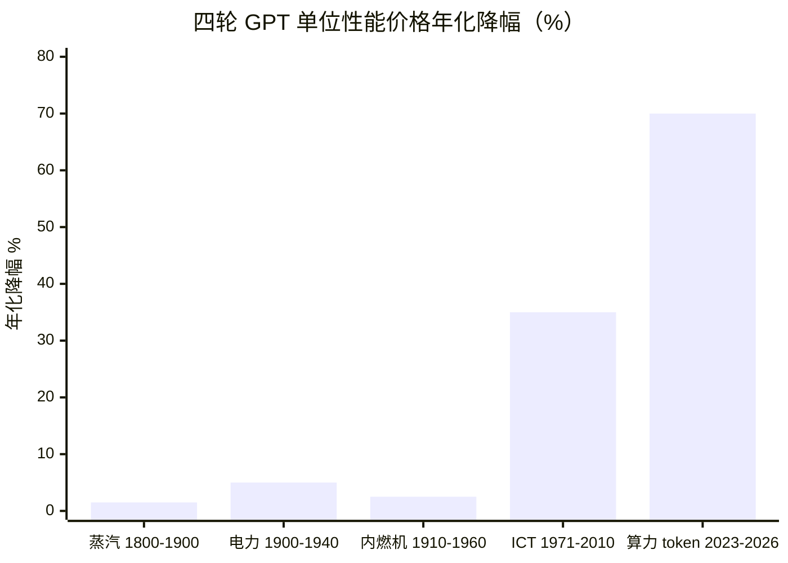
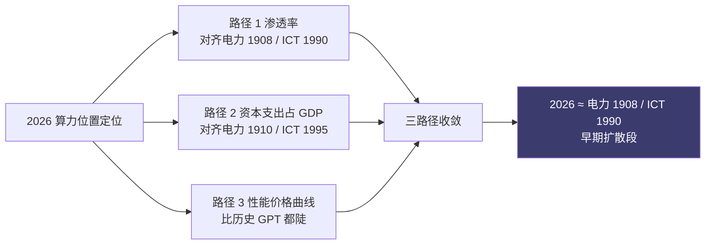
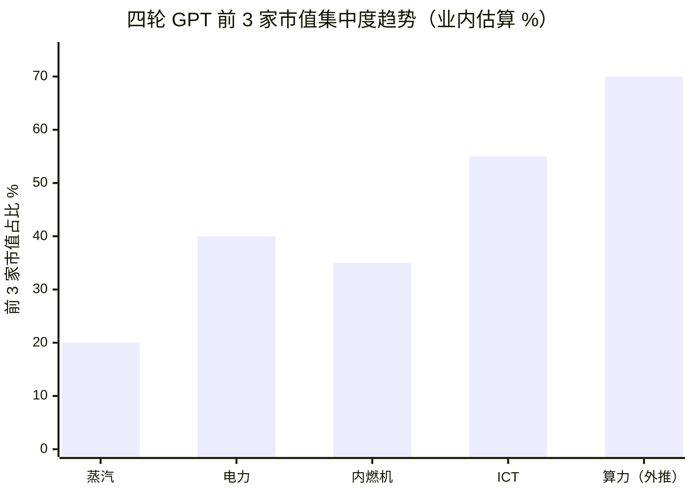
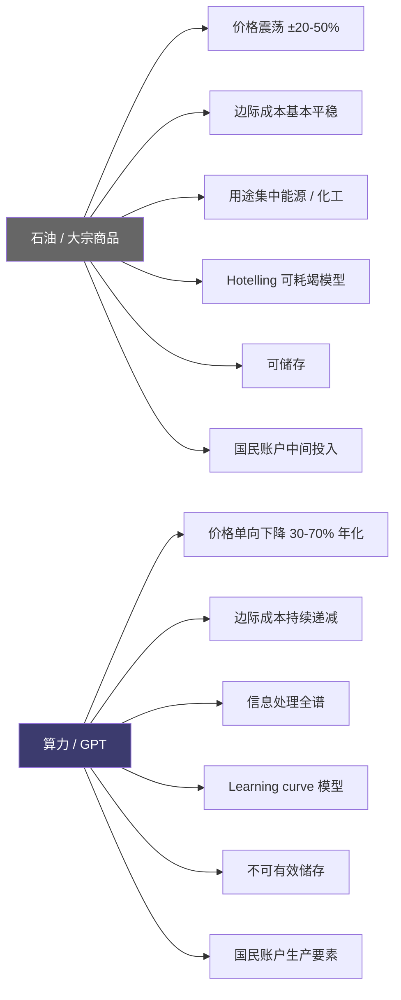

# 第 24 章 算力作为通用目的技术：与蒸汽、电力、IT 的可比

## 本章概览

第六部要回答的问题是：算力对宏观经济意味着什么。这个问题在 2024-2026 的舆论场里有两种典型答案——一种叫 AI 是新工业革命，浪漫但不可证伪；另一种叫算力是新石油，朗朗上口但经不起推敲。本章的任务是把这两种叙事翻译成可证伪的命题，再用经济学工具检验它们。

更狭窄的问法是：算力是不是 Bresnahan-Trajtenberg (1995) 意义上的 General Purpose Technology（通用目的技术，下称 GPT）？这个问法可以用三条判据严格检验，可以与历史上的蒸汽机、电力、内燃机、ICT 四轮 GPT 做横向比对，可以从扩散速度推断当前所处的历史位置，也可以从生产率显化时滞解释为什么 2024-2026 的官方 TFP 数据看起来还很平。

> ICT：Information and Communication Technology，信息与通信技术。
>
> TFP：Total Factor Productivity，全要素生产率。

第 2 章在「算力作为生产要素」一节已经埋下了 GPT 锚点——把算力写进 Cobb-Douglas 生产函数的 C 项，并把产出弹性 γ 给出三套估算（0.02-0.18 之间，参见第 2 章 §2.2）。本章把那个锚点正式展开。

本章不下任何投资判断。免责段落不展开——本章不涉及个股估值与多空判断，按全书规范不设 disclaimer 段。

## 24.1 三判据从哪里来：Bresnahan-Trajtenberg 1995

通用目的技术这个词组在 1990 年代之前散见于经济史文献，但作为可操作的分析概念被立起来，要追溯到 Timothy Bresnahan 与 Manuel Trajtenberg 1995 年发表在 *Journal of Econometrics* 第 65 卷的论文《General Purpose Technologies: 'Engines of Growth'?》。这篇论文的关键贡献不是发明这个词，而是给出三条可检验的判据，让 X 是不是 GPT 成为一个可以用证据回答的问题。

三条判据用作者的原始措辞是：

- **Pervasiveness**——该技术应被广泛使用于经济的多数部门
- **Inherent potential for technical improvements**——其性能应能在长时间内持续改进
- **Innovational complementarities**——该技术的进步应使下游产业的研发活动效率提升，即引发创新引致创新

为了让这三条判据落地，本书把它们翻译成可观测指标：

| 判据 | 原文措辞 | 操作化指标 |
|------|----------|----------|
| Pervasiveness（普适性）| widely used | 跨行业渗透率 ≥ 20%；不限于单一应用场景 |
| Improvement potential（持续改进）| inherent potential for technical improvements | 单位性能价格至少在 20 年内年化下降 ≥ 10% |
| Innovational complementarities（互补创新）| innovational complementarities | 该技术的扩散显著降低下游产业研发成本，催生新产业子集（衍生新行业） |

这三条判据的逻辑顺序很重要。第一条说广——一个只用在炼钢的炉子不是 GPT，无论它多重要；第二条说久——一个用了 20 年就停滞的技术不是 GPT，无论它多普及；第三条说乘——一个被广泛使用但不催生新事物的技术不是 GPT，比如集装箱，深刻改变了贸易但没有催生新产业链上层的研发活动。三条判据是与的关系，不是或。

后续文献对这三条判据做过细化与扩展。Lipsey、Bekar、Carlaw 在 1998 年的 *General Purpose Technologies and Long-term Economic Growth* 加上了第四条「单一可识别的通用技术」——意在排除工业革命这种过于宽泛的指代。Jovanovic 与 Rousseau 在 2005 年的 *Handbook of Economic Growth* 章节里把三判据进一步操作化，提出 GPT 出生年（年化生产率改进率拐头向上的年份）与 GPT 死亡年（被新一代 GPT 替代而停止扩散的年份）。本章主要用 Bresnahan-Trajtenberg 原版三判据，必要时引用扩展。

GPT 概念的实用价值不在于给某项技术贴一个荣誉标签，而在于把这项技术的宏观影响有多大翻译成它满足几条判据 + 程度多深。一个三判据都强成立的 GPT（例如电力），其宏观影响是几代人的；一个三判据都弱成立的技术（例如 4G 蜂窝），其宏观影响主要被吸收进消费者剩余而不显著拉高生产率统计。算力落在哪一档，是本章 24.3 节要回答的。

## 24.2 三轮历史 GPT 的 12 维度对照

把蒸汽机、电力、内燃机、ICT 四轮历史 GPT 放在同一张表里横向比对，是建立算力的位置感的基础。这一节给出 12 个维度的对照表，每一维度都标注口径与来源。

四轮 GPT 的时间窗口选取按主要扩散期，不是发明时点。

蒸汽机有现代意义的扩散始于 Watt 1769 年的分离冷凝器专利，主要扩散期 1780-1840；电力的实用直流发电机 1870 年代出现（Z.T. Gramme、Werner von Siemens），主要扩散期 1880-1940；内燃机 1876 年 Otto 四冲程，主要扩散期 1900-1960；ICT 主要扩散期 1970-2010，以集成电路（1958）、微处理器（1971）、个人计算机（1981）、互联网（1995 商业化）四个台阶为节点。

### 12 维度对照表

| 维度 | 蒸汽（1780-1840）| 电力（1880-1940）| 内燃机（1900-1960）| ICT（1970-2010）|
|------|------------------|------------------|---------------------|------------------|
| 1. 主要扩散期长度 | ~60 年 | ~60 年 | ~60 年 | ~40 年 |
| 2. 渗透率拐点 | 1830 前后（英国工业蒸汽马力首次超过水力）| 1920 前后（美国工厂电力驱动占比首次超过 50%）| 1930 前后（美国乘用车每千人 200 辆）| 1995 前后（美国家庭 PC 拥有率 ~35%）|
| 3. 渗透率成熟点 | 1900 前后（蒸汽在工业动力中占主导）| 1940 前后（美国制造业电力驱动 > 80%）| 1960 前后（西欧 / 美国汽车保有率成熟）| 2010 前后（美国互联网普及率 > 75%）|
| 4. 单位性能价格年化降幅 | 单位马力煤耗 1800-1900 年化降 1-2%（Crafts 2004 估算）| 单位 kWh 电费 1900-1940 年化降 4-6%（Devine 1983）| 单位马力造价 1910-1960 年化降 2-3% | 单位 MIPS 价格 1971-2010 年化降 ~35%（摩尔定律实测）|
| 5. 基础设施资本支出占当期 GDP 峰值 | 英国 1830-1840 铁路 + 蒸汽设备投资 ~5-7%（Crafts 估算）| 美国 1920 电力设施 + 配电网投资 ~5-6%（Devine 1983 综合）| 美国 1925 公路 + 汽车产业资本支出 ~6-8%（NBER 估算）| 美国 1999 ICT 资本支出占 GDP ~4-5%（BEA NIPA 实测）|
| 6. TFP 显化时滞 | 50+ 年（1780 扩散开始 → 1830 后才显化）| 40 年（David 1990 / Field 2011：1890 → 1929 才显化）| 30 年（1900s → 1930s 后显化）| 25 年（1971 微处理器 → 1995-2007 显化）|
| 7. 主要赢家形态 | 设备制造商（Boulton & Watt）+ 上游煤矿 | 综合电气厂商（GE、Westinghouse）+ 公用事业（Edison Electric → Con Ed）| 整车厂（Ford、GM）+ 上游石油（Standard Oil）| 平台软件（Microsoft、Oracle）+ 上游芯片（Intel）|
| 8. 赢家集中度（前 3 家市值 / 同期产业总市值）| 中等（设备 + 煤矿分散）| 中高（GE + Westinghouse 占电气制造大头）| 中等（三大整车厂 + 石油七姐妹）| 高（Wintel 联盟在 PC 时代占主导）|
| 9. 地理扩散路径 | 英国 → 欧洲 → 美国（30-50 年滞后）| 美国 + 德国领先 → 欧洲 → 日本（20-30 年滞后）| 美国主导 → 欧洲 → 全球（15-20 年滞后）| 美国主导 → 全球（5-15 年滞后）|
| 10. 政府介入度 | 低（专利保护 + 自由放任）| 中（公用事业管制 + 农村电气化补贴）| 中（公路 / 国道建设 + 石油配额）| 中（反垄断 + 互联网标准 + 出口管制）|
| 11. 主要资本市场反应 | 1840s 英国铁路狂热 + 崩盘 | 1929 美国电力公用事业泡沫 + 崩盘 | 1928-1929 汽车股 + 1973 石油危机 | 1999-2000 dot-com 泡沫 + 崩盘 |
| 12. 该 GPT 出现时既有 GPT 状态 | 水力 + 风力主导 | 蒸汽主导 | 蒸汽 + 电力主导 | 电力 + 内燃机主导 |

> 来源汇总：蒸汽部分主要参考 Crafts 2004 "Steam as a General Purpose Technology"（*Economic Journal* 114）+ Allen 2009 *The British Industrial Revolution in Global Perspective*；电力部分参考 Devine 1983 "From Shafts to Wires"（*Journal of Economic History* 43）+ David 1990 "The Dynamo and the Computer"（*American Economic Review* 80）；内燃机部分参考 Field 2011 *A Great Leap Forward* + NBER macrohistory 数据库；ICT 部分参考 Jorgenson-Ho-Stiroh 2008 "A Retrospective Look at the U.S. Productivity Growth Resurgence"（*Journal of Economic Perspectives* 22）+ BEA NIPA 历史序列。**12 个维度都属于历史综述而非时点预测**——任何一个维度的数据点在不同学者口径下都有 ±20-30% 差异。表中数字用于比较量级与方向，不用作精确建模输入。

### 四轮 GPT 对照下的三种读法

读这张表的第一种用法是看四轮 GPT 的相似性：每轮主要扩散期都在 40-60 年，每轮基础设施资本支出占当期 GDP 峰值都在 4-8% 区间，每轮都伴随一次资本市场狂热与崩盘。这些相似性不是巧合——一个技术要满足普适 + 持续改进 + 互补创新三条判据，本身就要求长时间扩散与大额基础设施投入，也就给金融周期提供了素材。

第二种用法是看差异。差异最大的是 TFP 显化时滞——蒸汽机用了 50 年才把生产率提升打到统计数字上，电力用了 40 年，ICT 缩到 25 年。这条曲线显示出加速趋势：每一轮 GPT 的工程化扩散→组织重构→统计显化链条都比上一轮短。这与互补技术（教育、企业组织、金融工具）的预先存在有关——蒸汽机扩散时还要发明现代会计与有限责任公司，ICT 扩散时这些制度都已经成熟，可以直接被新技术调用。

第三种用法是看赢家集中度。从蒸汽到电力到 ICT，前 3 家市值占同期产业总市值的比例总体上升。蒸汽时代的设备厂分散，电力时代 GE+Westinghouse 二分天下，ICT 时代 Wintel 联盟在 PC 端占主导、思科（Cisco） 在网络端占主导。这条曲线对算力时代有直接含义——若按趋势外推，算力时代的赢家集中度应高于 ICT 时代。这件事 24.6 节会展开。

### 关于 David 1990 论文的两个要点

Paul David 1990 年发表在 *American Economic Review* 第 80 卷的论文《The Dynamo and the Computer: An Historical Perspective on the Modern Productivity Paradox》是 GPT 经济学最常被引的文献之一。这篇论文 4000 字篇幅，做了两件事：

第一，把美国制造业电气化做成长序列。1899 年美国制造业总动力中电力驱动占比约 5%；1909 年约 25%；1919 年约 50%；1929 年约 78%；1939 年约 90%（David 1990 引自 Devine 1983 + Schurr 等学者综合，本数据点为学界共识；1919 年 ~50% 与 Smithsonian / Construction Physics 引述的多源历史数据一致）。30 年完成 5% → 90% 渗透。

第二，把电气化的 TFP 显化时滞与 1980s ICT 投资做对比。电气化的渗透率 1899 年才 5%，要到 1920s 后期工厂集体重构生产流水线（从集中式 line shaft 改为分布式 unit drive），TFP 才在 1929 年前后大幅跳升。David 用这个例子论证：1987 年 Solow 那句"You can see the computer age everywhere but in the productivity statistics"不应被理解为计算机无效，而应被理解为我们正处于类似 1899-1909 的电气化早期，TFP 显化要等组织重构完成。

这个论证后来被 2007 年前后的 ICT 实际生产率数据证实——1995-2007 美国年化 TFP 增速约 1.4%（BLS 口径），显著高于 1973-1995 的 0.3-0.5%。从 1980 年 IBM PC 商业起步到 1996 年生产率显化，时滞约 16 年；从 1971 年英特尔（Intel） 4004 到 1996 年生产率显化，时滞约 25 年。

David 论文的方法论——把当前 GPT 的扩散位置与历史 GPT 的扩散位置做位置定位，再用历史位置预测未来时滞——是 24.4 和 24.5 节将反复使用的工具。

## 24.3 算力符合三判据吗：逐项核验

把 Bresnahan-Trajtenberg 三判据严格套到 2025-2026 算力图景。逐条核验。

### Pervasiveness（普适性）：跨行业渗透

操作化指标：算力作为生产输入是否被多数主要行业采用、不限于单一应用场景。

证据 A：跨行业 AI 采纳率。Stanford AI Index 2026 综合 McKinsey State of AI 等问卷数据，给出 2025 年美国企业 AI 采纳率：制造 31%、金融 47%、零售 28%、医疗 22%、专业服务 41%、信息技术 65%、政府 18%。即便按下限折半估算，主要行业的真实采纳率也在 10-30% 区间，且分布广。

证据 B：算力使用形态多元。算力的应用场景从训练前沿模型（OpenAI、Anthropic、xAI）、企业内部 RAG（Retrieval-Augmented Generation，检索增强生成）、推理服务（开发者 API 调用）、推荐系统（Meta、字节、Netflix）、自动驾驶感知（Waymo、Tesla）、科学计算（AlphaFold 蛋白结构预测）、金融建模（高频交易特征生成）、生物医药（药物筛选）一直到广告投放算法，覆盖了信息处理的几乎所有子领域。

证据 C：算力作为间接投入的渗透。即便企业自身没有部署 AI，购买的 SaaS 软件（Salesforce、Microsoft Copilot、Adobe）大多已嵌入 LLM 推理算力。这种嵌入式采纳率在传统统计里不被计入，但对算力消耗有真实拉动。

判定：**Pervasiveness 强成立**。算力跨行业、跨场景、跨直接 / 间接调用形态的渗透率在 2026 年已达到电力扩散 1910-1915 年前后的水平（参考 David 1990 数据：1909 年美国制造业电力驱动占比 25%）。

### Improvement potential（持续改进）：单位性能价格曲线

操作化指标：单位算力性能价格是否在长时间内持续下降。

证据 A：硬件层 FLOPS/\$ 曲线。Epoch AI 给出 2010-2025 年 GPU FLOPS/\$ 年化降幅约 30%。这条曲线已经延续了 15 年，且 Hopper（2022）→ Blackwell（2024）→ Rubin（2026 路线图，业内估算）显示斜率未变。

证据 B：单位 token 推理价格曲线。GPT-4（2023-03）\$30 input / \$60 output per 1M tokens；GPT-4o（2024-05）\$5 / \$15；GPT-4o mini（2024-07）\$0.15 / \$0.60；GPT-5（2025）\$1.25 / \$10；DeepSeek-V3（2024-12）\$0.27 / \$1.10。同等能力档（按 MMLU benchmark 对齐）的 input 单价 2023-2026 累计跌幅超过 200 倍，年化降幅 ~70%。这条曲线比 ICT 的摩尔定律陡得多。

证据 C：算法效率改进。Epoch AI 单独跟踪算法效率（per-FLOP 模型能力）每 8-9 个月翻一倍，年化效率提升 ~2.5×。算法效率改进与硬件效率改进相乘，单位模型能力的 token 价格年化降幅在 2023-2026 区间内是历史 GPT 任一时段最陡的。

判定：**Improvement potential 极强成立**。单位算力性能价格在 15+ 年时间窗口内持续下降，且 2023-2026 段叠加算法效率改进后斜率比摩尔定律时期更陡。这是四轮 GPT 历史中 improvement potential 维度最强的一轮。

### Innovational complementarities（互补创新）：催生新产业子集

操作化指标：算力的扩散是否显著降低下游产业研发成本、催生新产业子集。

证据 A：催生的新产业子集。2023-2026 年新出现的、依赖算力为生产输入的产业子集包括：基础模型层（OpenAI、Anthropic、Mistral、DeepSeek）、AI 应用层（Cursor、Perplexity、Character.ai、Midjourney、Runway）、AI 基础设施层（CoreWeave、Lambda、Crusoe、Together AI）、Agent 层（Adept、Cognition、Devin、Operator）、AI 安全层（Anthropic 部分业务、Lakera、Robust Intelligence）、合成数据层（Scale AI、Surge）。这些子集在 2020 年之前不存在或规模可忽略。

证据 B：催生的研发活动。算力作为生产函数中的 C 项，使下游领域的 R&D（Research & Development，研发）活动效率倍增。生物医药领域 AlphaFold 类工具把预测一个蛋白结构从 9-12 个月的实验任务降到几小时的算力任务，直接拉低下游药物设计的 R&D 边际成本。半导体设计领域 EDA（Electronic Design Automation，电子设计自动化）厂商楷登电子（Cadence）、新思科技（Synopsys） 已嵌入 LLM 辅助布局布线，缩短芯片设计周期。这些是创新引致创新的直接证据。

证据 C：Spillover 跨行业研发拉动。即便企业自身的核心产品不是 AI，其内部 R&D 流程因 AI 辅助编程（GitHub Copilot、Cursor）、文献综述（Elicit、Consensus）、实验设计加速。Cui、Demirer、Jaffe 等 2024 年的论文《The Effects of Generative AI on High-Skilled Work》（SSRN 4945566）对 Microsoft 内部 4867 名工程师做 Copilot 实测，pull request 数量提升 26.1%，代码评审完成提升 10.6%。这种 spillover 是 GPT 三判据中 innovational complementarities 的标准范式。

判定：**Innovational complementarities 强成立**。算力催生了新产业子集，并显著降低下游产业研发成本，spillover 跨多个行业可见。

### 三判据合并判定

| 判据 | 强度 | 与历史 GPT 对照 |
|------|------|----------------|
| Pervasiveness | 强 | 接近电力 1910-1915 阶段 |
| Improvement potential | 极强 | 显著强于 ICT 摩尔定律时期 |
| Innovational complementarities | 强 | 接近电力 1920-1930 阶段 + ICT 1995-2005 阶段 |
| 合并 | 三判据均成立 | 算力是 Bresnahan-Trajtenberg 意义上的 GPT |

结论用事实陈述形式：**沿三判据逐项比对，算力符合 GPT 的强形式定义**。在 improvement potential 维度上斜率比四轮历史 GPT 都更陡；在 pervasiveness 维度上当前位置接近电力扩散中期；在 innovational complementarities 维度上催生新产业子集的速度比 ICT 时代更快。

这个结论的潜在反驳是算力的 improvement potential 不可持续——算法 + 硬件 + 数据三个轮子任何一个失速，曲线就走平。

## 24.4 算力 GPT 的位置定位：2026 在哪一格

把 24.2 的四轮历史 GPT 时间线与 24.3 的算力三判据核验结果叠加，可以给当前算力扩散一个位置定位。这一节用三个不同的对照路径分别推演，再交叉验证。

### 路径一：按 pervasiveness 渗透率位置对齐

算力 2025-2026 的跨行业渗透率按 Stanford AI Index 数据综合估算 25-35%（自报口径）；按已部署生产级 LLM 应用严格定义估算 8-12%。取中位 15-20%。

对照电力扩散：1909 年美国制造业电力驱动占比 25%，1919 年约 50%（David 1990 / Devine 1983）。算力当前 15-20% 渗透率对应**电力扩散 1905-1908 年**前后位置。

对照 ICT 扩散：1993 年美国家庭 PC 拥有率 22.8%，1997 年 35%。算力当前 15-20% 渗透率对应 **ICT 扩散 1988-1990 年**前后位置。

### 路径二：按基础设施资本支出占 GDP 比对齐

2025 年美国超大规模云厂 + 算力相关资本支出业内估算 \$400-450B（综合 MSFT \$80B + GOOG \$75B + META \$72B + AMZN \$105B + ORCL \$25B + Apple + xAI + CoreWeave + 其他，参见第 15 章详细拆解）。同年美国 GDP \$29T。算力资本支出占 GDP ~1.5%。

对照历史 GPT 基础设施资本支出峰值占比：电力 1920 ~5-6%（Devine 1983）、内燃机 1925 ~6-8%、ICT 1999 ~4-5%。算力当前 1.5% 距峰值 4-6% 还有 2.5-4 倍空间。

按超大规模云厂资本支出 2020-2025 年化增速 ~35% 推演，若维持中等速度（年化 20-25%），算力资本支出占 GDP 达到 4-5% 历史峰值水平约在 **2030-2032** 前后。这意味着当前位置离资本支出峰值还有 5-7 年。

### 路径三：按 improvement potential 曲线位置对齐

电力扩散从 1880 年代实用化到 1940 年成熟期约 60 年，年化电费降幅 4-6%；ICT 摩尔定律从 1971 年到 2010 年约 40 年，年化每美元 FLOPS 提升 35-40%。算力的 FLOPS/\$ + 算法效率叠加曲线 2023-2026 年化降幅 70%+（同等能力档），曲线斜率远超历史 GPT。

按这条斜率，算力 improvement potential 的成熟拐点很难按历史 GPT 时长（30-60 年）外推。一种保守判断是：在硬件 / 算法 / 数据三个轮子中至少一个达到物理或经济性极限之前，曲线会维持。物理极限的最近候选是 3nm 以下半导体节点的良率与成本问题（参见第 4 章制程章）+ 训练数据耗尽（Epoch AI 2024 估算高质量公开文本可能在 2026-2028 耗尽）。这意味着 improvement potential 的边际放缓可能在 **2027-2029** 前后开始。

### 三条路径交叉

| 路径 | 对齐位置 | 含义 |
|------|----------|------|
| 渗透率位置 | 电力 1905-1908 / ICT 1988-1990 | 早期扩散阶段，距成熟还有 20+ 年 |
| 资本支出占 GDP 位置 | 电力 1910-1915 / ICT 1995 前后 | 距资本支出峰值还有 5-7 年 |
| Improvement potential 曲线位置 | 比历史 GPT 早期都更陡 | 边际放缓可能在 2027-2029 |

三条路径给出的位置定位收敛在「2026 ≈ 电力 1908 / ICT 1990」前后。这个定位是**类比性的，不是历史一一对应**——四轮 GPT 各有特殊性，本书不主张算力扩散会复制电力或 ICT 的时间表。这个定位的实用意义是：当前的算力扩散远未到成熟期，但已经过了实验期；TFP 显化时滞按历史 GPT 经验应在 5-15 年区间内开始释放（详 24.5）；资本支出峰值与赢家洗牌的高发期还在前方（详 24.6 + 第 29 章）。

## 24.5 生产力悖论与 J 曲线：为什么 TFP 数据现在还看不到

Robert Solow 1987 年在《纽约书评》写下那句话："You can see the computer age everywhere but in the productivity statistics."。这句话被简称为 Solow 悖论或生产力悖论。

40 年后，类似的话被用在 AI 上：2024-2026 美国非农私营部门年化 TFP 增速按 BLS 口径仍在 1.0-1.5% 区间，与 2010-2019 平均 0.7% 相比有改善，但远没有达到 AI 革命级的 2-3% 水平。AI 的 computer paradox 第二季在 2026 年的舆论场已被反复提起。

### David 1990 的两个候选解释

回到 David 1990 论文，他对电气化-计算机的双重悖论给出两个候选解释：

**解释一：扩散尚未充分**。1987 年时 ICT 渗透率不到家庭普及一半，企业级深度部署更少。算力 2026 年类似——按 24.4 节定位，当前在电力 1908 / ICT 1990 前后，距 pervasiveness 成熟还有 20+ 年。在渗透率达到一定阈值之前，宏观 TFP 数据是统计噪音淹没真实信号。

**解释二：组织重构滞后**。电气化的核心生产力红利不来自把蒸汽机换成电动机——这一步只是替换动力源，效率提升有限。真正的红利来自工厂从集中式 line shaft（架空动力轴）+ 皮带传动重组为分布式 unit drive（每台机器一个电动机）+ 灵活布局，这种重组让工厂可以按工艺流程设计，而不是按动力分布设计。Devine 1983 与 David 1990 都指出，这种组织重构从 1900 年开始，到 1920s 中期才完成，这才是电气化 TFP 显化时滞 30+ 年的根本原因。

算力的组织重构滞后在 2026 年类似可观察——多数企业把 LLM 当成加速版搜索引擎使用，没有重构业务流程；少数走得快的（如部分软件工程团队大量使用 Cursor + Claude Code）已经开始重构 PR review + 代码评审流程，但比例不高。这种组织重构按历史 GPT 经验需要 10-20 年完成。

### Brynjolfsson J 曲线

Erik Brynjolfsson、Daniel Rock、Chad Syverson 在 2018 年的论文《The Productivity J-Curve: How Intangibles Complement General Purpose Technologies》提出更精细的解释——「Productivity J-Curve」（生产力 J 曲线）。

J-Curve 的核心机制是：GPT 引入的初期，企业为了用上新技术，必须投入大量无形资本（intangible capital）——员工培训、流程改造、组织重构、数据治理、安全合规。

> GAAP：Generally Accepted Accounting Principles，公认会计准则。运营支出：Operating Expenses，运营支出。

这些投入在 GAAP 下被记为当期费用，进入运营支出，降低当期利润。但生产函数中的真实资本存量是增加的——只是没被会计反映。

宏观 TFP 测算依赖企业财务数据，因此在 J-Curve 早期段 TFP 看起来甚至会比无新技术时**更差**——因为大量无形资本投入降低了当期产出 / 投入比。Brynjolfsson 等估算，1995-2007 ICT J 曲线早期段，未被资本化的无形投资让美国 TFP 被低估约 0.4-0.5 个百分点 / 年。

把 J-Curve 套到算力上：2024-2026 大量企业投入的 RAG 系统建设、内部数据治理、AI 安全合规、员工培训、Agent 工作流改造，这些大部分在财务报表上被记为运营支出，没有被资本化。这部分投入可能在 0.3-0.6% 的 TFP 低估区间内（按 Brynjolfsson 等历史 ICT J 曲线量级类比，作者推演）。

J 曲线的关键含义是：**当前 TFP 数据看起来平淡，不等于算力对生产力贡献为零；很可能是统计低估**。

### 时滞的下限

把 David 1990 + Brynjolfsson J 曲线合在一起，算力 TFP 显化的时滞下限可以推演：

- 历史 GPT 的 TFP 显化时滞按出生年算：蒸汽 50+ 年、电力 30-40 年、ICT 25 年
- 算力 GPT 出生年按 2017 Transformer 论文或 2020 GPT-3 算
- 按 ICT 时滞 25 年下限推演：算力 TFP 显著显化最早在 **2042**
- 按 ICT 时滞下限 + improvement potential 比 ICT 陡这个因素调整：可以缩短到 **2032-2037**

这条推演结论本身不是预测，是位置定位。它告诉我们一件事——2024-2026 的官方 TFP 数据平淡不应被解读为 AI 没用或算力是泡沫。按历史 GPT 经验，正常的早期段就长这样。

## 24.6 历史赢家分布的镜像

四轮历史 GPT 的赢家分布有规律可循。把这条规律外推到算力 GPT，可以给谁会是算力时代的 GE / Microsoft 提供框架性的判断——但只是框架性的，不是个股推荐。

### 三轮历史 GPT 赢家分布的特征

| GPT | 早期赢家（出生 - 拐点）| 中期赢家（拐点 - 成熟）| 成熟期赢家（成熟期）|
|------|------------------------|------------------------|---------------------|
| 蒸汽 | Boulton & Watt（设备 + 专利）| 各地中型铸造厂（应用）| 大型铁路公司（基础设施 + 渠道）|
| 电力 | Edison、Tesla（发明 + 早期公司）| GE、Westinghouse（综合制造）| 公用事业（Con Ed、PG&E）+ 大型用电产业 |
| 内燃机 | Daimler、Benz、Ford（整车 + 流水线）| GM、Chrysler、福特三巨头 | 上游石油（Standard Oil → Exxon、Shell）|
| ICT | 英特尔、Microsoft（芯片 + OS）| Cisco（网络）+ Oracle（数据库）+ SAP | Google、Apple、Amazon（应用 + 平台）|

这张表给出几个跨 GPT 共性观察：

**观察一：早期赢家是工具供应商**。蒸汽时代的 Boulton & Watt，电力时代的 Edison，内燃机时代的福特，ICT 时代的英特尔——四轮 GPT 早期阶段的最大赢家都是直接卖技术工具的公司，不是技术的应用者。算力 GPT 早期，对应位置是英伟达（H100/B200 等加速器供应商，2026 市值 ~\$4.5T 量级）、台积电（先进制程代工，参见第 4 章）、SK 海力士 / 美光（Micron）（HBM，参见第 5 章）。

**观察二：拐点后赢家变为综合系统厂商**。GE 是综合电气系统（发电机 + 电机 + 电表），Microsoft + 思科 + Oracle 是综合 IT 系统（OS + 网络 + 数据库）。综合系统厂商的特征是把单点技术整合进端到端解决方案。算力 GPT 拐点后的对应位置候选是超大规模云厂云厂（MSFT Azure / AMZN AWS / GOOG Cloud）+ 模型层综合服务厂（OpenAI / Anthropic）+ 服务器整机厂（超微电脑 / 戴尔 / 惠普企业）。

**观察三：成熟期赢家是基础设施 + 占住上游关键环节的玩家**。电力时代是公用事业，内燃机时代是石油，ICT 时代是平台运营商 + 应用层（Google、Apple、Amazon）。这些赢家共同特征是占据用户与下游之间的关键位置，享受网络效应或资源稀缺性。算力 GPT 成熟期的对应位置（如果按历史规律外推，纯框架推断）可能是电力 + 数据中心运营商（参见第 10 章、第 11 章）、模型层垄断者（如果出现）、应用层平台（如果出现 LLM 时代的 Google）。

### 集中度趋势的外推

24.2 节表 8 显示，从蒸汽到 ICT 赢家集中度趋势上升。把这条趋势外推到算力 GPT，可以做一个粗略判断：算力 GPT 的赢家集中度大概率**高于 ICT**。

依据是三层：

**第一层，技术门槛上升**。蒸汽机的核心专利在 19 世纪初已经过期，铸造工艺各地可学；电力的电机制造门槛中等；ICT 的 CPU + OS 门槛已经很高（英特尔 + Microsoft 的护城河经久不衰）；算力的核心门槛——前沿 LLM 训练 + 推理优化 + 整柜级互联——比 ICT 还高一个量级。技术门槛上升直接导致赢家集中。

**第二层，资本门槛指数级上升**。一个独立模型公司从零达到前沿（GPT-5 / Claude Sonnet 4.5 / Gemini 2 级别）需要的训练资本支出估算 \$5-20B 量级（按 GPT-5 训练业内估算 \$4-8B，参见第 1 章 / 第 15 章），这个门槛过滤掉绝大多数玩家。从零建一家与英伟达同档 GPU 厂商的资本门槛（不考虑专利）业内估算 \$50-100B 量级（参见第 7 章护城河章），这个门槛实际上只允许国家级玩家进入。

**第三层，互补网络效应**。算力的护城河来自硬件（NVIDIA）+ 软件栈（CUDA）+ 模型权重（OpenAI）+ 数据（Google / Meta）+ 应用渠道（超大规模云厂云）多层叠加。每一层都强化其他层。这种多层网络效应在 ICT 时代被 Wintel 联盟做到过，但算力时代的层数更多。

集中度趋势如果按这三层依据外推，算力时代前 5 家市值占算力相关产业总市值的比例可能达到 **60-75%**（ICT 时代成熟期约 50-60%）。

### 反例：垄断是否一定形成

把这条推论反过来追问：算力时代是否一定形成垄断或寡头？反例需要至少考虑：

- 开源模型替代（DeepSeek / Llama / Mistral）：截至 2026 年初，开源模型在某些任务上达到闭源前沿模型 6-12 个月前的水平。如果这条曲线持续，闭源模型的护城河会被持续侵蚀
- 中国独立供应链（华为昇腾、寒武纪、长江存储、长鑫存储）：在出口管制约束下，中国正在形成相对独立的算力供应链，这会让全球算力市场分裂为两个圈
- 反垄断政策：DOJ（美国司法部）对 Google 已有反垄断诉讼，类似动作可能延伸至超大规模云厂与模型层

本章给出的赢家集中度判断是按历史规律外推的基线，而非必然结局。

## 24.7 算力 GPT vs 大宗商品类比：两种叙事的有效边界

2023 年以来，算力是新石油这个比喻在产业报告、卖方研报、政策讨论里反复出现。本节用一个独立小节处理它——这个比喻的有效边界在哪里，越过边界会推出错误结论。

### 类比的吸引力来自哪里

把算力类比为大宗商品（特别是石油）的直觉来源：

**普适性相似**。石油是 20 世纪的通用动力源，几乎所有现代经济活动都依赖它；算力是 21 世纪的通用计算源，AI 时代越来越多的经济活动依赖它。这条平行很自然。

**产业链结构相似**。石油有上游开采（Saudi Aramco、Exxon）、中游加工（炼厂）、下游分销（加油站、化工）三段式产业链；算力有上游芯片（台积电、英伟达、SK 海力士）、中游云（超大规模云厂、CoreWeave）、下游模型 / 应用（OpenAI、Cursor）三段式结构。

**价格驱动需求**。石油价格 1973 年从 \$3 涨到 \$12，全球出现节能 / 替代能源浪潮；算力价格（按 token 计）2023-2026 年跌 200+ 倍，出现 Jevons 效应（参见第 13 章）下的需求爆发。两端的价格弹性都强。

**地缘集中**。石油资源高度集中在中东、俄罗斯、美国；算力的关键节点（先进半导体在台积电 / 韩国、CUDA 在美国）也高度集中在少数地理位置。地缘风险都显著。

这四点类比成立，算力 OPEC（英伟达 + 台积电 + 三大 HBM 厂限产）、算力地缘博弈（出口管制）、算力价格震荡（GPU 现货价波动）这类叙事都有一定真实性。

### 类比的失效边界在哪里

但把类比推得太远会出错。三个关键差异决定算力不是大宗商品：

**差异一：摩尔定律 vs 大宗商品价格震荡**。

石油价格在百年尺度上震荡——1973 油价从 \$3 涨到 \$12，1986 跌回 \$10，1998 跌至 \$11，2008 涨到 \$147，2014-2016 跌至 \$30，2022 涨到 \$130。震荡周期短、幅度大，没有趋势性下降。

算力按 FLOPS/\$ 计 1971-2024 年化降 30%，按等能力档 token 计 2023-2026 年化降 70%。这条曲线是单向下降，没有反向震荡。

差异的根源是：石油是一种自然资源，价格主要由需求 + 供给的边际平衡决定，资源边际成本可能因为枯竭而上升；算力是一种工程产品，价格主要由生产工艺改进决定，边际成本随技术进步下降。两者属于不同的经济学范畴——石油是 Hotelling 模型（exhaustible resource，可耗竭资源），算力是 learning curve 模型（learning by doing）。

**差异二：边际成本递减 vs 平稳**。

石油生产的边际成本曲线在 100-200 年尺度上基本平稳——技术进步（水平钻井、压裂）每隔 30-50 年来一次，把生产成本拉低一个台阶，但拉低后又稳定下来。

算力的边际成本曲线持续递减——单位训练 FLOP 成本年化降 40-50%（综合 FLOPS/\$ 与算法效率），且没有迹象表明会停止。这种长期边际成本递减让算力的供给曲线形态与大宗商品完全不同——算力的供给曲线随时间向下平移，而石油的供给曲线只在工艺突破时向下跳一档。

**差异三：通用性更高**。

石油有普适性，但其用途主要集中在能源（运输 + 发电 + 化工三类占 90%+）。

算力的用途从训练前沿模型、推理服务、推荐系统、自动驾驶、科学计算、合成生物、金融建模、广告投放，跨越十几个相互独立的应用场景。算力的普适性不仅比石油高，也比电力高——电力的核心用途是动力 + 热 + 照明三类，算力的核心用途是信息处理这一抽象品类下的几乎所有子类。

这条差异的含义是：算力作为生产要素进入 Cobb-Douglas 生产函数的方式比石油更深。

> 石油作为 intermediate input（中间投入），算力作为 factor of production（生产要素）。两者在国民账户里的位置不同。

参见第 2 章 §2 的 K_compute 讨论。

### 对照表

| 维度 | 大宗商品（以石油为例）| 算力 |
|------|----------------------|------|
| 价格趋势 | 长期震荡，无趋势 | 长期单向下降 |
| 单位价格年化变动 | ±20-50% 周期性 | -30% to -70% 单向（FLOPS/\$ 或 token/\$）|
| 边际成本曲线 | 长期基本平稳 | 长期递减（learning curve）|
| 供给曲线形态 | 向上倾斜（资源约束）| 平移下移（技术进步）|
| 经济学模型 | Hotelling 可耗竭资源模型 | Learning curve + Solow 生产函数 C 项 |
| 储存性 | 可储存（油桶 / 战略储备）| 不可有效储存（算力是流量，过期作废）|
| 替代弹性 | 中（与天然气 / 煤 / 电力可替代）| 低（对前沿模型训练几乎无替代）|
| 通用性范围 | 能源 + 化工（主要）| 信息处理（全谱）|
| 卡特尔可能性 | 已存在（OPEC）| 理论可能（英伟达 + 台积电 + HBM 三家）但未结成 |
| 国民账户位置 | 中间投入 | 生产要素（按第 2 章拆分）|

### 算力 OPEC 叙事的有效边界

把上面差异落到一个具体叙事检验：算力 OPEC 是否可能形成？

支持的论据：算力的上游极度集中——英伟达占 AI 加速器市场 ~85%，台积电占先进制程晶圆代工 ~90%，SK 海力士 + 三星 + 美光三家占 HBM 100%（参见第 5 章）。这种集中度比 OPEC 形成时的中东石油集中度更极端。

反对的论据：

第一，算力价格在长期单向下降，与卡特尔通过限产保高价的商业逻辑相反。OPEC 的存在前提是石油价格高于边际成本时各成员有动力作弊增产；算力厂商的逻辑是产能扩张 + 价格下降同时进行，没有限产保价的动机。

第二，算力的需求方比石油的需求方集中——超大规模云厂五家（MSFT / GOOG / META / AMZN / ORCL）占算力采购量的大头。需求方集中度高，会强烈抵制供应方卡特尔。

第三，算力存在跨代替代——新一代芯片（B200 / Rubin）出来后旧一代（H100）会快速折价。卡特尔限产保价的逻辑在跨代替代下失效。

结论：**算力 OPEC 作为口号有部分真实性（上游集中度确实极端），作为可执行的卡特尔结构基本不成立**（缺少限产保价的经济动机）。把算力是新石油推到会形成算力 OPEC 这一步，越过了类比的有效边界。

### 算力是新石油叙事的政策含义

类比叙事在政策上的影响不可忽略。把算力视为大宗商品会导出三类政策建议：

- 储备体系（类似战略石油储备）——但算力不可有效储存，建算力战略储备几乎不可能
- 进出口配额（类似石油配额）——美国 2022-2025 对华芯片出口管制实际上已采取此路径
- 价格管制（类似 1973 石油价格管制）——尚未出现，但偶有讨论

把算力视为 GPT 会导出不同的政策建议：

- 教育与人力资本配套投资（参见第 26 章）——电力时代的电气工程师培养，类似今天 AI 人才培养
- 反垄断与开放访问——避免算力成为少数玩家的私有平台
- 基础设施补贴 + 公用事业化讨论——算力是否应像电力一样纳入公用事业管制

两种叙事下的政策建议不同，且后者更接近 GPT 经济学文献的共识。本书在第 25 章-32 各章涉及政策含义时，主要按 GPT 框架展开。

### 本章遗留的开放问题

本章定性给出算力是 GPT 的结论，仍有几个开放问题没有解决：

1. **γ 的精细估算**：第 2 章给出 0.02-0.18 区间，在算力作为 GPT 的强假设下应能收窄到 0.05-0.10，但收窄的理由仍需论证。
2. **J 曲线的量化**：2024-2026 美国 TFP 被低估多少个百分点仍无精确估算（历史 ICT 经验是 0.4-0.5pct/年）。
3. **赢家集中度的检验**：24.6 节前 5 家占 60-75% 的外推，仍需用 2026 实际数据检验。
4. **政策范式选择**：GPT 范式与大宗商品范式之间的政策权衡尚无定论。
5. **跨国差异**：本章主要用美国数据，中国、欧盟、东盟、印度的横向比较尚缺。

---

把算力放进 Bresnahan-Trajtenberg GPT 框架的好处不在于贴一个荣誉标签，而在于把 AI 是不是新工业革命这种鸡汤问题翻译成可证伪、可量化、可对照历史的子问题。沿三判据逐项核验，算力符合 GPT 的强形式定义；按渗透率 + 资本支出 + improvement potential 三条路径交叉，当前位置类比电力 1908 / ICT 1990 早期扩散段；TFP 显化时滞按历史 GPT 经验推演在 5-15 年区间释放，2024-2026 的官方 TFP 数据平淡符合 J-Curve 早期段预期；赢家集中度按历史趋势外推可能高于 ICT 时代但反例（开源模型、独立供应链、反垄断）仍需观察；算力是新石油类比有部分有效性但越界即错——算力的 learning curve 经济学与石油的 Hotelling 经济学是两种不同的范畴。

---

> **数据时效说明**：本章 data_cutoff 2026-05。涉及历史 GPT 数据（蒸汽 / 电力 / 内燃机 / ICT）属学界长期共识，时效性不强。涉及算力当代数据（资本支出、渗透率、单位价格）每月有变化，按发布时点给出最新公开数据，发布后建议每 6-12 个月做一次更新。
>
> **引用规范说明**：本章学术引用全部为可公开访问的论文 / 政府数据 / 公司财报；二手引用（McKinsey、Stanford AI Index、Epoch AI）已标注一手回溯路径与已知口径差异。具体引用清单见 `data/24-gpt-technology/sources.md`。

---

> 本章来自《算力经济学》开源版 · 作者「递归客」  
> 在线阅读完整书系：[inferloop.dev](https://inferloop.dev)
