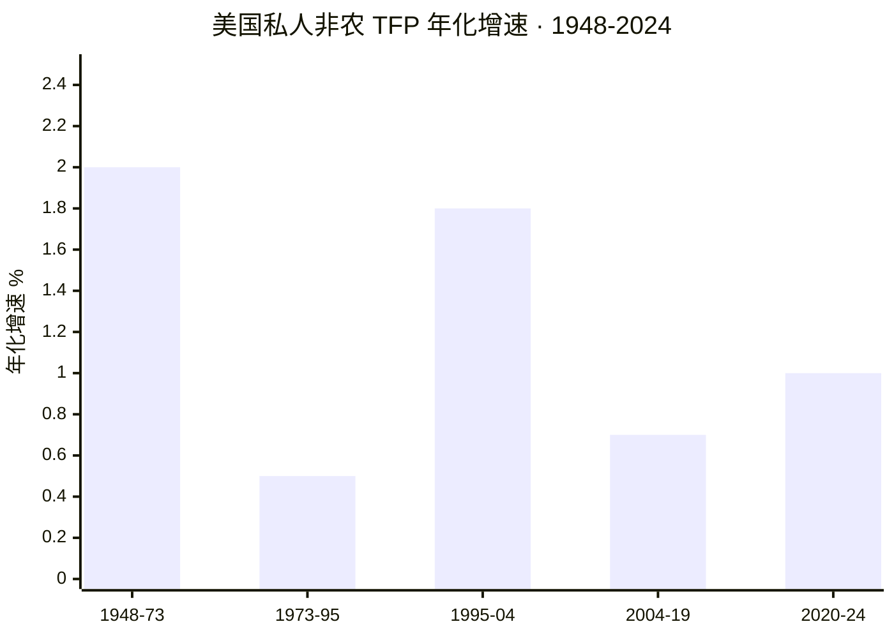
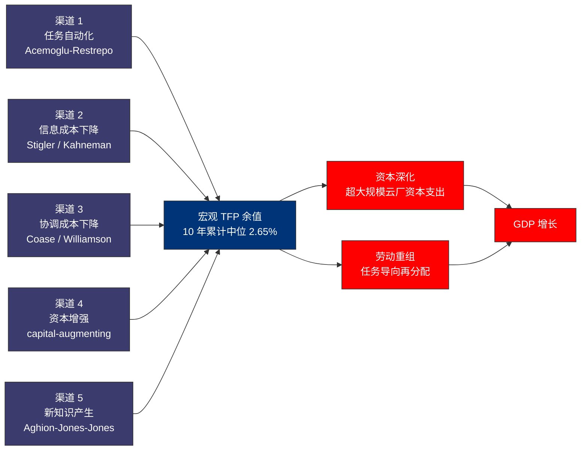
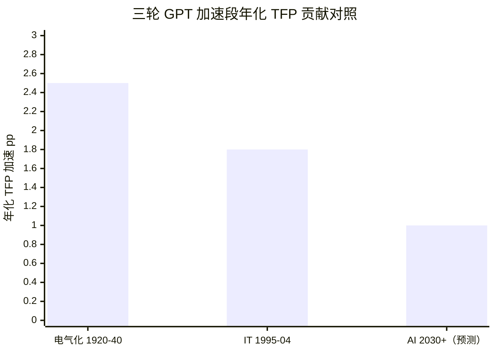
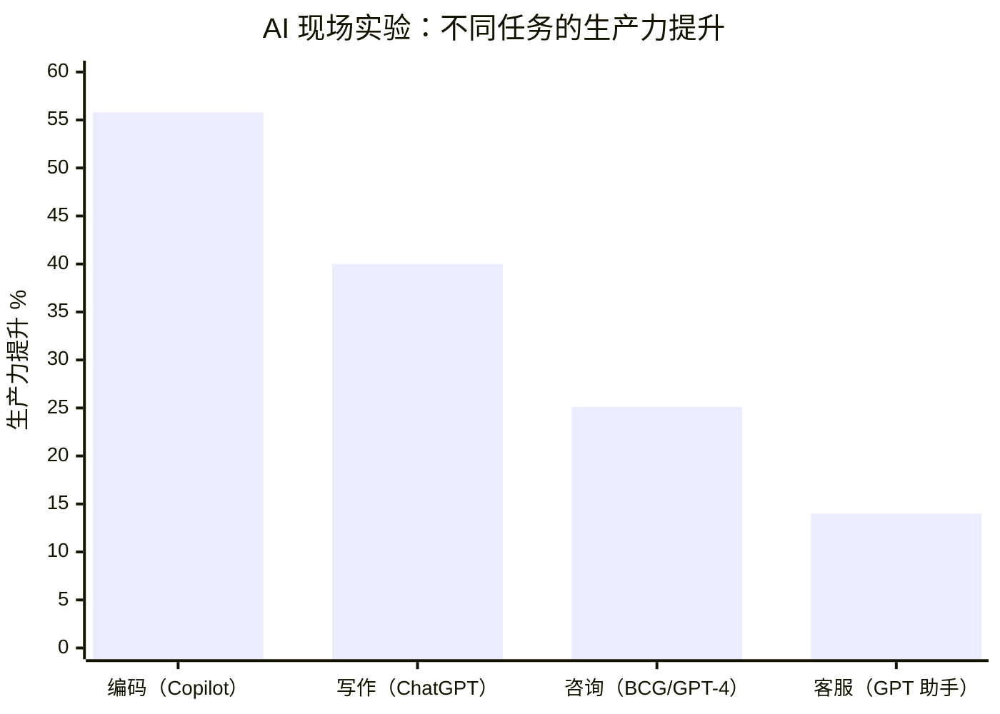
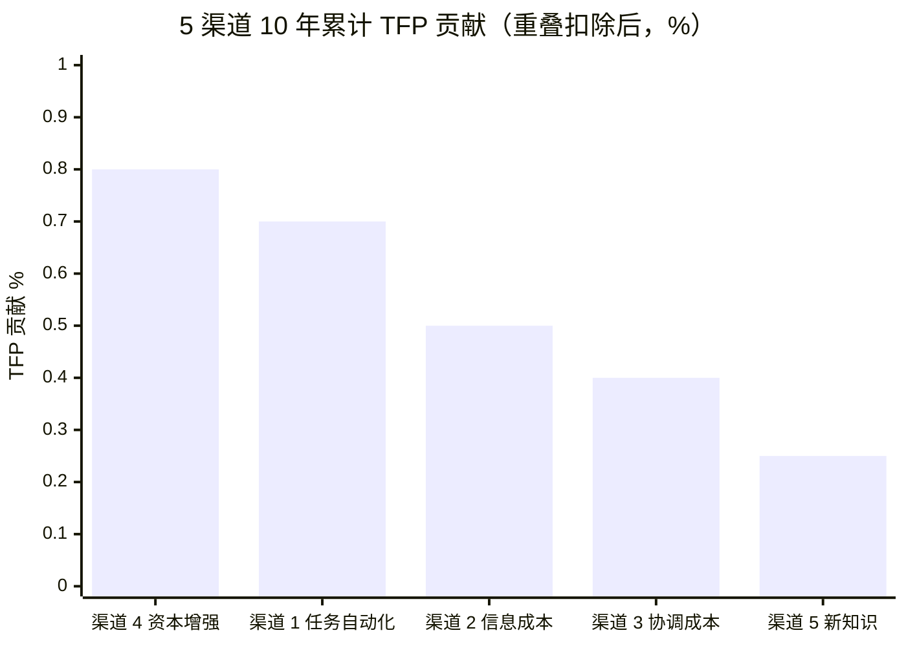

# 第 25 章 算力与全要素生产率：宏观证据与微观渠道

## 本章概览

第 24 章把算力是 GPT 这件事在历史可比性上钉死之后，金融读者最常给的下一个反问是：**如果算力真是 GPT，为什么 2025 年 [BLS](https://www.bls.gov/) 官方 TFP 数据看起来没有任何技术跃迁的痕迹**。

> GPT：General Purpose Technology，通用目的技术，由 Bresnahan-Trajtenberg 1995 提出的三判据框架。
> BLS：Bureau of Labor Statistics，美国劳工统计局。
> TFP：Total Factor Productivity，全要素生产率。

BLS 数据告诉市场，美国 2024 年私人非农部门 TFP 增长 1.5%，这是 2004 年以来在非衰退年份最高的一次，但绝对值仍比 1995-2004 那一轮 IT 加速期的 1.6-2% 区间低。同时，超大规模云厂（[AWS](https://aws.amazon.com/) / [Microsoft](https://www.microsoft.com/) Azure / [Google](https://cloud.google.com/) Cloud / [Meta](https://about.meta.com/) / [Oracle](https://www.oracle.com/) 等运营 100K 服务器以上的超大规模云服务商）2025 年总资本支出（Capital Expenditure，资本性支出）已经突破 \$400B，约占美国名义 GDP 的 1.3%。**支出已经在数据里，产出还看不到**。

下面这张长序列图把支出有 / 产出看不到的张力放进 1948-2024 美国 TFP 的全景中——两次明显的加速段（1948-1973、1995-2004）与两次回落段（1973-1995、2004-2019）历史可比性强，2020-2024 区段的 1.5% 处在低于 IT 加速期、高于二次停滞期的中间位置。

> 数据来源：BLS Multifactor Productivity + San Francisco Fed Economic Letter 2020-08 + CBO 2013-03。2020-24 区段为 BLS 2025-12-19 修订后近 5 年平均估算。

这种支出有了、产出看不到的张力，是产业研究 / 金融书绕不开的命题。卖方研报的标准回答有两套：一套是 Goldman Sachs 2023 报告里 Generative AI Could Raise Global GDP by 7%那种 10 年期估算，把 AI 提升生产力翻译成万亿美元尺度的 GDP 增量；另一套是 Acemoglu 2024 NBER WP 32487 那种悲观估算，AI 在未来 10 年对 TFP 的总贡献不超过 0.66%。

两套估算同源于任务导向自动化框架，但对任务覆盖率 × 任务成本节省两个参数的取值差出 10 倍以上。这两个数字一起摆在桌上，金融读者会发现自己根本没办法判断该用哪一个进入模型。

本章不在两者之间选一个，而是把 AI 提升 TFP 这个口号性宏观叙事，拆成 5 个可观测、可测算、可质疑的微观渠道，给每个渠道列三件东西——它对应的微观实证、它的实测生产力增幅区间、把它外推到全经济需要的假设。Goldman Sachs 的 7% 与 Acemoglu 的 0.53% 之所以差出 10 倍，差在这 5 个渠道上各自取了什么参数；拆开渠道，两套估算背后的参数假设、以及各自需要哪些可证伪的实证才能站得住，就都摊开了。

5 个微观渠道按本书定义如下，对应 5 个不同的经济学机制和 5 套不同的微观证据：

1. **任务自动化**——AI 替代低技能任务（客服一线、初级文案、数据录入、基础翻译、初级法律审查）。理论锚是 Acemoglu-Restrepo (2020) 任务导向自动化模型，实证锚是 Brynjolfsson-Li-Raymond (2023) NBER WP 31161 客服实验的 +14% 平均生产力提升。
2. **信息成本下降**——AI 把获取一条专业信息的边际成本逼近零（搜索、综合、答疑、初步诊断）。理论锚是信息经济学的检索成本（Stigler 1961）+ 注意力成本（Kahneman 2011），实证锚是 ChatGPT 类工具上线后的信息搜索行为变化。
3. **协调成本下降**——AI 降低跨语言 / 跨部门 / 跨企业的协调摩擦。理论锚是 Coase (1937) 交易成本 + Williamson (1985) 治理结构，实证锚是机器翻译质量从 BLEU 30 到 BLEU 60 的 12 年跃迁、跨国客服与远程工作的边际成本曲线。
4. **资本增强**——AI 作为程序员 / 律师 / 医生 / 投行分析师的个人副驾，提升单位高技能劳动者的产出。理论锚是 capital-augmenting technical change（资本增强型技术进步），实证锚是 GitHub Copilot 实测程序员任务完成时间缩短 55.8%（Peng et al. 2023, arXiv 2302.06590）。
5. **新知识产生**——AI 加速科学发现 / 药物筛选 / 材料组合 / 数学证明。理论锚是 Aghion-Jones-Jones (2019) "AI as a Research Input"，实证锚是 AlphaFold 把已预测的蛋白质结构数量从 200K（2020）推到 200M+（2022-07-28，EBI AlphaFold DB 扩展公告）。

把这 5 个渠道的宏观传导路径画成一张图——5 条独立的微观渠道汇入宏观 TFP 余值这一个加总量，再通过资本深化与劳动重组两条平行路径传导到 GDP 增长率：

这 5 个渠道不是 MECE（Mutually Exclusive, Collectively Exhaustive，互斥且穷尽）划分——它们之间有重叠（如客服自动化同时涉及渠道 1 任务自动化和渠道 3 协调成本下降）、有覆盖盲区（如金融市场效率改进不在 5 渠道里）。但 5 个渠道覆盖了过去三年学术界与产业界主要的 TFP 增益机制讨论，能让 AI 影响 GDP 这种过粗的概念被翻译成 5 个独立可证伪的子论点。

把渠道分解清楚之后，本章要在第六、七两节回到宏观 BLS 数据：为什么 2024 年 BLS TFP 数据已经回升到 1.5%（2025-12-19 修订值，原始 2025-03 新闻稿为 1.3%）、但还远没到 1995-2004 IT 加速期的 1.6-2% 区间。答案不是单一的 AI 还没起作用，而是 Brynjolfsson-Rock-Syverson (2021) J 曲线框架揭示的混合结构——AI 复杂资本支出（超大规模云厂资本支出）已经在测，但 AI 的互补无形资产（intangibles，包括组织流程再造、员工再培训、新工作流的设计）大部分没有进入官方 GDP 统计。Brynjolfsson 等人对 IT 时期的测算给出调整无形资产后 2017 年末 TFP 比官方测度高 15.9%的结论，说明官方 TFP 数据低估了 GPT 早期红利的程度。但 J 曲线不是免费的乐观期权——它的逻辑要求无形资产投入今天发生、有形产出 5-15 年后显化，意味着 AI 资本支出周期已经把账面成本前置，只有当 2030 年代官方 TFP 真的进入加速段，才能反向验证今天的资本支出是值得的。

第七节把本章的判断收紧成两条可证伪的对立预测——本书在 Brynjolfsson J 曲线偏乐观派与 Acemoglu 任务导向偏悲观派之间倾向哪一边、需要哪些 2026-2030 年的实证落地才能站住。

还要避免对照两端的误区：不能用 2025 年 BLS TFP 数据否定超大规模云厂的 \$400B 资本支出，也不能用超大规模云厂的资本支出倒推宏观 TFP 必然大涨。

口径限制要先说清楚。本章用到的 TFP 数据有三个口径差异需要注意：(1) 美国 BLS 的私人非农 TFP 与 OECD 各国的经济整体 TFP 统计口径不同，跨国对比时优先用 OECD 同口径；(2) Brynjolfsson 等的 intangibles 调整后 TFP 是研究估算，不是官方数据，不能与 BLS 官方数据直接对比；(3) Goldman / McKinsey 的 GDP 增量预测涵盖了直接生产力 + 间接乘数效应，不是 TFP 的单纯增量，本章在引用时会标明。每一处涉及实证文献的+14%、+55% 这类数字，都标明实验场景、样本量、外推限制——单家公司的实验不能直接乘以全美国 GDP。

## 25.1 Solow 增长会计与 TFP 余值的概念边界

要看清 AI 对 TFP 的贡献，先得对齐 TFP 在国民经济统计里的定义边界。这一段不是经济学教科书的复述——是把 TFP 余值这件事在产业研究语境下能用到的层面讲清楚。

**Solow 增长会计的基础公式**。Robert Solow 在 1957 年的 RES 论文（"Technical Change and the Aggregate Production Function"）里提出了一个简单但极有威力的分解：经济增长 = 资本投入贡献 + 劳动投入贡献 + 余值。这个余值就是 TFP——它不是任何一种可见投入的贡献，而是把资本和劳动各自的贡献扣完之后剩下的那部分增长。从产业研究视角看 TFP，有三件事必须先对齐：

第一，**TFP 是余值而不是测量**。BLS 不直接测量 TFP，BLS 测量的是产出（real GDP）、资本投入（按 PIM, Perpetual Inventory Method，永续盘存法估算资本存量）、劳动投入（按工时调整后的劳动量），再用增长会计公式把 TFP 算成余值。这意味着任何测错的项目——把无形资产漏算、把 GPU 折旧期搞错、把劳动质量调整不当——都会等额地反映在 TFP 余值里。

第二，**TFP 不等于技术进步**。教科书惯例把 TFP 解读为技术进步率，但在国民经济核算里，TFP 余值实际上包含至少四类东西：(a) 真正的技术进步（同样的资本与劳动产出更多），(b) 配置效率提升（资源从低效率部门转向高效率部门），(c) 规模经济效应，(d) 测量误差。在 AI 周期里，AI 让工作流程更高效主要会通过 (a) + (b) 进入 TFP 余值，但只有当对应的资本投入与劳动投入被正确测量时才会显化。

第三，**TFP 的测量滞后性**。BLS 的 MFP（Multifactor Productivity，多要素生产率，与 TFP 同义）数据有约 12-15 个月的发布滞后——2025-03 发布的"Total Factor Productivity 2025"年度新闻稿报的是 2024 年的全年 TFP 增速 1.3%，2025-12-19 修订版进一步上调至 1.5%。这意味着即使 AI 在 2026 年某个季度对 TFP 产生明显影响，市场也要等到 2027 年中或更晚才能在官方数据里看到（甚至要等下一轮修订）。在第 29 章周期定位章节里，这条数据滞后是关键的实时验证窗口约束。

**1948-2025 的 TFP 长序列：四个时段的分水岭**。把 BLS 私人非农部门 TFP 长序列按学术界惯用的四个时段划分，每个时段都对应一种宏观叙事：

| 时段 | TFP 年化增速 | 时代标签 | 主要驱动 |
|---|---:|---|---|
| 1948-1973 | ~2.0% | 战后黄金期 | 电气化扩散尾期 + 大规模制造 + 国家高速公路系统 |
| 1973-1995 | ~0.5% | 生产力停滞 | Solow paradox（计算机时代到处都是，唯独不在生产力数据里）|
| 1995-2004 | ~1.6-2.0% | IT 加速 | PC + 互联网 + 企业 ERP 部署 |
| 2004-2019 | ~0.5-0.8% | 二次停滞 | IT 红利衰减 + 全球金融危机 |
| 2020-2025 | 区间 0-1.5% | 后疫情震荡 | 疫情冲击 + 供应链 + 2024 年回升至 1.5%（BLS 2025-12-19 修订值） |

> 数据来源：1948-2019 区段综合 BLS Multifactor Productivity 数据 + San Francisco Fed Economic Letter "The Highs and Lows of Productivity Growth" 2020-08 + CBO "Total Factor Productivity Growth in Historical Perspective" 2013-03。2024 年 1.5% 为 BLS 2025-12-19 修订值（原始 2025-03-21 新闻稿为 1.3%，修订上调 0.2pp）。1995-2004 区段的具体年化率视测算来源不同在 1.6%（Chicago Fed Letter 2025 No.515）到 2.0%（San Francisco Fed 2015-02 Economic Letter "The Recent Rise and Fall of Rapid Productivity Growth"）之间。

把这张表读三遍。第一遍读出来的是分水岭——TFP 增速在过去 75 年里有两次明显加速、两次明显回落。第二遍读出来的是 Solow paradox 的尺度——1973-1995 那 22 年的 TFP 停滞期发生在 PC 大规模部署、互联网创立、企业开始大规模 IT 投入的同一时期。第三遍读出来的是 2024 年那个 1.5% 数字的位置——它低于 1995-2004 IT 加速期，但显著高于 2004-2019 的 0.5-0.8%。

这究竟是 AI 红利已经开始显化还是疫情后劳动力市场重组的短期效应，目前的数据时点（2025 年底才有 2024 年全年修订数据，2026 年 5 月也只有 2024 年和部分 2025 年初步数据）不足以下结论。

把三轮 GPT 的 TFP 加速段做一个横向对照——电气化（1920-1940）、IT 加速（1995-2004）、AI 假设的 2030+ 加速段，前两轮的可信度来自历史完成态，第三轮是本章后面要做的判断：

> 数据来源：电气化数据综合 Field 2011 *A Great Leap Forward* + Gordon 2016 *The Rise and Fall of American Growth*；IT 加速段取 1995-2004 年化中位 1.8%；AI 2030+ 为本章 §25.6 中位估算（5 渠道加总 2.65% 累计 ÷ 10 年再叠加基线）。

**2024 年 1.5% 的解释空间**。BLS 在原始新闻稿里特别注明 2024 年 TFP 增长是自 2004 年以来在非衰退年份最高的一次，随后的 2025-12-19 修订把这个数字从 1.3% 进一步上调至 1.5%——结论方向不变但幅度更显著。BLS 没有给出这 1.5% 中 AI 贡献了多少的分解——官方统计没有这样的口径。学界给出三种解读：第一种把这次回升解读为 AI 渠道 4 资本增强渠道开始在程序员、客服、初级文案这些岗位上落地，是 J 曲线见底的早期信号；第二种把这次回升解读为疫情期间被压制的生产率正常化——疫情期间的工作模式重组、远程办公学习曲线、供应链调整在 2023-2024 完成，与 AI 没有直接关联；第三种解读最谨慎——单年数据噪声大，TFP 单年读数的标准误本身就接近 0.5pp，2024 的 1.5% 与 2023 的 0.8% 之间的差异在统计上接近显著但尚未足以确认 AI 因果链。本章不替读者选哪一种解读——本章把三种解读都列出来，等 2027 年 Q1 拿到 2026 全年 TFP 数据时再回看。

**TFP 与 AI 经济叙事的概念边界**。本章后面 5 个渠道讲 AI 对生产力的微观机制时，注意 4 件事不要混淆：

第一，AI 让某行业生产力 +X% 不等于 AI 让全经济 TFP +X%。两者之间隔着该行业占全经济产出的比重——客服业务占全美国 GDP 不到 1%，即使整个客服行业 AI 化让生产力翻倍，对全经济 TFP 的贡献也只有 1% 数量级。Acemoglu (2024) 论文的 0.53% 上限测算就是基于这种逐行业加总。

第二，AI 让任务自动化不等于 AI 让 TFP 增长。如果 AI 自动化掉的任务对应的劳动力被裁掉了，那么生产 Y 不变 / 劳动 L 减少 / TFP 上升——这是 TFP 增长。但如果被自动化掉的劳动力转去做更高价值的任务（augmentation），那么 Y 增加 / L 不变 / TFP 也上升，但这是另一条机制。Acemoglu-Restrepo 任务导向框架的核心贡献就是把这两种机制分开。

第三，AI 让单一公司利润上升不等于 AI 让经济 TFP 增长。如果英伟达卖 GPU 给客户、客户拿 GPU 跑大模型、模型公司挣到 API 收入但用户花更多时间盯着 ChatGPT 而不是更高效地工作——那么这是英伟达 + 模型公司的利润增长，但社会总 TFP 没有增长。这是 Acemoglu (2024) 论文里 AI 不是 productive AI 的批评的核心：很多 AI 应用产生了私人收益但没有产生社会生产率增益。

第四，AI 让 GDP 增长 X%不等于 AI 让 TFP 增长 X%。Goldman Sachs 2023 报告里的 AI 提升全球 GDP 7%是 10 年累计、含资本深化效应（capital deepening，即更多算力投入直接提高产出）+ TFP 渠道双重贡献。其中 TFP 贡献部分按 Goldman 的口径约为 7% 中的 1.5-2.5pp，年化 TFP 贡献约 0.15-0.25pp。Acemoglu 0.53% 的口径是 10 年累计 TFP 贡献——年化只有 0.05pp。两者数字相差 3-5 倍，主要在任务覆盖率和任务成本节省两个核心参数取值。

下面五节把这两个参数拆到 5 个渠道里逐条审视。

## 25.2 渠道 1 任务自动化：Acemoglu-Restrepo 框架与 Brynjolfsson 客服实验

任务自动化是 5 个渠道里实证最扎实的——既有理论锚（Acemoglu-Restrepo 任务导向自动化框架），又有现场实验数据（Brynjolfsson-Li-Raymond 客服实验、Noy-Zhang 写作实验、Peng et al. Copilot 实验）。但实证最扎实的渠道，也是外推到全经济时方差最大的渠道。

**Acemoglu-Restrepo 任务导向框架的核心机制**。Acemoglu 与 Restrepo 在 2018-2020 系列论文把自动化形式化为两种机制的赛跑。第一种是 displacement effect（替代效应）：新技术让原本由劳动完成的任务由资本完成，劳动需求下降。第二种是 reinstatement effect（重置效应）：新技术创造新任务（如数据科学家、机器学习工程师、AI 安全研究员），劳动需求上升。TFP 增长率取决于两条效应的代数和——如果新任务创造速度跟上替代速度，劳动需求总量不下降，但工资分配可能极化（被替代任务的工资压低、新任务的工资抬高）。

把这个框架应用到 AI 上，Acemoglu 在 2024 NBER WP 32487里给出了具体测算。他用 Hulten 定理（Hulten 1978）把宏观 TFP 增长分解为「被 AI 影响的任务比例 × 任务级别的成本节省」。基线测算的两个参数取值：

- 被 AI 影响的任务比例：约 20%（来自 Eloundou et al. 2023 GPT-4 任务暴露度研究）
- 任务级别的平均成本节省：约 27%（来自 Brynjolfsson-Li-Raymond 2023 + Noy-Zhang 2023 + Peng et al. 2023 三个现场实验的平均值，由 Acemoglu 加权综合）

把这两个参数代入 Hulten (1978) 定理：宏观 TFP 增长 ≈ 受 AI 影响的任务在总产出中的份额 × 任务级别成本节省。Acemoglu 对受 AI 影响任务的产出份额做了精细测算（非简单地用任务数量比例乘以劳动份额），基线场景得到 10 年累计 TFP 增长约 **0.66%**；剔除硬任务（医生、律师等强语境职业）后的保守上界为 **0.53%**。这是 10 年水平效应而非年化流量——意味着在 10 年内随 AI 渗透逐步实现，而非每年均匀增长 0.066%。

**Brynjolfsson-Li-Raymond 2023 客服实验**。要看渠道 1 在最适合 AI 的场景下能跑出多少生产力增益，Brynjolfsson, Li, Raymond 在 2023 年 4 月发布的 NBER WP 31161是目前最权威的现场实验。三位作者在一家美国财富 500 公司的客服部门，跟踪了 5,179 名一线客服人员，比较了使用 AI 助手（基于 GPT 类对话模型）与不使用 AI 助手的工作效果。关键发现：

| 指标 | 实验结果 | 适用人群 |
|---|---|---|
| 平均生产力提升（按解决问题数 / 小时测度）| +14% | 全员加权平均 |
| 新员工 / 低技能员工生产力提升 | +34% | 入职 < 2 个月或评级低 |
| 资深 / 高技能员工生产力提升 | 接近 0 | 入职 > 1 年或评级高 |
| 客户满意度（CSAT） | 显著提升 | 全员 |
| 员工留存率 | 显著提升（替代效应被减弱）| 全员 |

> 来源：Brynjolfsson, Li, Raymond 2023 NBER WP 31161 修订版正文与表 1-4 的核心结果。

这个实验的工程含义有三层。第一，AI 的生产力效应高度异质——对新员工（包括跨语言客服员工）效应显著，对资深员工接近零。这与 Acemoglu (2024) 论文里 AI 倾向于把行业内技能溢价压缩的预测方向一致——新员工借助 AI 获得资深员工的隐性知识（"AI disseminates best practices from more capable workers"，来源：同上 NBER WP 31161 摘要）。第二，14% 的平均生产力提升放在客服业务的工资结构里就是 14% 的劳动成本节省。如果美国客服业占 GDP 约 0.8%、AI 渗透率 50%、生产力提升 14%——对全美 TFP 的累计贡献约 0.8% × 50% × 14% = 0.056%。这是单一行业的上限。第三，14% 是一个对照实验数字——既包含了 AI 工具的能力，也包含了客服人员快速学会用工具的能力。把它外推到法律、医疗、咨询、教育等不同行业，需要假设这些行业的 AI 工具有效性 + 员工学习速度与客服业相当。

**Noy-Zhang 写作实验与 Peng et al. Copilot 实验**。Noy 与 Zhang 2023 年在 Science 上发表的"Experimental Evidence on the Productivity Effects of Generative Artificial Intelligence"用 ChatGPT 作为写作助手，比较了 453 名营销 / 数据分析 / 人力资源等行业的白领写作任务效率。关键结果：使用 ChatGPT 让任务完成时间缩短 40%、产出质量提升 0.4 个标准差（按外部评审）。Peng et al. 2023的 GitHub Copilot 实验更具体——95 名职业程序员被随机分配，一组用 Copilot 一组不用，写 JavaScript HTTP 服务器，Copilot 组完成任务的时间是 71 分钟，非 Copilot 组 161 分钟——任务完成时间缩短 55.8%、统计显著 P = 0.0017。

三个实验放在一起看出一条规律——**AI 对可结构化、可评估、有明确输出的任务效率提升最大（编码 56% > 写作 40% > 客服一线 14%）**，对模糊、依赖隐性知识、需要长上下文的任务效率提升较小或为零。这条规律是 Acemoglu 2024 论文里硬任务概念的实证基础——AI 在容易学的任务上跑得很快，但容易学的任务在全经济产出中的占比有限。

把三组实验的生产力提升幅度画成柱状图：

> 数据来源：Peng et al. 2023 arXiv 2302.06590；Noy-Zhang 2023 Science；Mollick et al. 2023 HBS 24-013；Brynjolfsson-Li-Raymond 2023 NBER WP 31161。

**从渠道 1 走向全经济外推的三参数测算**。把渠道 1 外推到全美国经济 TFP，需要三个参数：

| 参数 | Acemoglu 基线 | Goldman Sachs 估算 | 本章中位场景 |
|---|---:|---:|---:|
| 可自动化任务在劳动时间中的占比 | 20% | 25-30% | 22% |
| AI 在这些任务上的成本节省 | 27% | 35-45% | 30% |
| 10 年累计 TFP 增量 | 0.66% | 1.5-2.5% | 0.9% |
| 年化 TFP 增量 | 0.07% | 0.15-0.25% | 0.09% |

> 来源：Acemoglu 列见 NBER WP 32487 2024-05；Goldman 列见 GS Research "The Potentially Large Effects of AI on Economic Growth" 2023-03-26。本章中位场景为 Acemoglu 与 Goldman 之间的几何均数 + 第七节列的可证伪条件下的本书倾向方向。

这张表的关键不是任何一个数字，是三方在可自动化任务比例和成本节省幅度这两个参数上的差距——Goldman 比 Acemoglu 高 30-100%，最终 TFP 累计估算差 3-4 倍。**到底是 Acemoglu 偏悲观还是 Goldman 偏乐观，2026-2030 年要看的实证是渠道 1 的覆盖广度能不能从客服 / 编码 / 写作扩展到法律 / 医疗 / 教育 / 金融分析等更复杂的高技能行业**。

## 25.3 渠道 2 信息成本下降与渠道 3 协调成本下降

把渠道 2 和渠道 3 放在一起讨论——两条都是 AI 让某种交易成本下降，机制相同、外推方式相同、宏观影响估算思路也相同，区别在于哪种成本。

**渠道 2 信息成本下降的机制**。Stigler (1961) 的信息经济学奠基论文（"The Economics of Information", Journal of Political Economy）把信息搜索成本作为决策的核心约束之一。在 AI 之前，获取一条专业信息需要付出三种成本：(a) 搜索成本（要找到信息源在哪里），(b) 综合成本（要把多个来源的信息综合成一个回答），(c) 验证成本（要判断信息是否准确）。AI 通过两个机制压低这三种成本：检索成本由 RAG（Retrieval-Augmented Generation，检索增强生成）压低，综合成本由 LLM（Large Language Model，大语言模型）的对话能力压低，但验证成本被 hallucination（模型幻觉，指 AI 生成的看似合理但实际错误的内容）显著抬高。三种成本的总变化方向不是先验明确的——它取决于具体场景。

宏观经济上，渠道 2 的 TFP 渠道贡献体现在两个层面：第一是 search cost 下降释放的注意力红利，第二是初级知识查询工作的自动化。第二层与渠道 1 部分重叠，下面只算第一层，加总时再扣除重叠。

第一层的实证证据来自 Pew Research 2024 和 Stanford AI Index 2025 年报数据。Pew Research 调查显示，美国 18-29 岁人群中使用 ChatGPT 类工具的比例从 2023 年 33% 涨到 2024 年 43%、再到 2025 年 58%，其中 17% 主要用于学习与教育。如果按每人每天减少 30 分钟搜索时间估算，每个深度用户每年节省工时约 180 小时，按美国小时工资中位数 \$30 计算约 \$5,400 / 年的影子价值。但这种估算极不严格——节省的时间是否被用于更高生产力的活动是个未知数。MIT Sloan / BCG 2023 联合调查给出更保守的估算：在 758 名 BCG 顾问的对照实验中，使用 GPT-4 让被纳入 AI 可解决问题集合的任务效率提升 12.2%、完成时间缩短 25.1%。

把渠道 2 外推到全经济，本章采用如下中位估算：美国白领人口中 50% 已部署 AI 工具（2026 年估算）× 工时节省 5% × 白领劳动占 GDP 比重 35% = 全经济 TFP 累计贡献 0.875%（10 年）。这个数字与渠道 1 部分重叠，加总时需要扣除约 40% 重叠以避免双重计算。

**渠道 3 协调成本下降的机制**。Coase (1937) "The Nature of the Firm" 把交易成本作为公司边界的决定性因素——市场不能完全替代公司的根本原因是市场协调成本高。Williamson (1985) 拓展为治理结构选择——公司、市场、混合形态的选择取决于资产专用性 + 频率 + 不确定性。AI 通过两个机制压低协调成本：(a) 跨语言协调成本（机器翻译质量从 BLEU 30 量级提升到 BLEU 60 量级），(b) 跨部门协调成本（AI 摘要 + AI 跨文档检索让长文档协调更便宜）。

跨语言协调成本下降在实证上有比较明确的指标。WMT（Workshop on Machine Translation）2014 年神经翻译技术大规模引入前，英汉机器翻译质量在 BLEU 30 量级（业内估算综合）；2024 年 GPT-4 / Claude 3 / Gemini 1.5 的多语翻译质量在 BLEU 55-65 量级。BLEU 提升 25 个点对应人工翻译需求显著下降——全球翻译市场从 2014 年的 \$43B 增长到 2024 年的 \$69B，但同期机器翻译占比从 12% 涨到 38%。跨语言协调成本下降的宏观尺度可观——但与 AI 让企业内部跨部门协调更便宜相比仍是小尺度问题。

跨部门 / 跨企业协调成本下降的宏观尺度更大，但实证更难抓。一个间接证据是远程工作的稳态化。Barrero, Bloom, Davis 等人的 WFH Research 数据显示美国白领在 2023-2024 维持每周 1.5-2 天的居家工作时间——这种工作模式的可持续性部分源于 AI 工具（Slack / Notion / Microsoft 365 Copilot）让异步协调成本下降。但定量化 AI 贡献了多少居家工作可持续性是个开放问题——其他机制（Zoom 普及、企业流程数字化）也在并行作用。

| 参数 | 渠道 2（信息成本）| 渠道 3（协调成本）|
|---|---|---|
| 主要机制 | 检索 / 综合 / 学习成本下降 | 跨语言 / 跨部门 / 异步协调摩擦下降 |
| 实测数据 | 12.2% 任务效率提升（BCG 实验）| BLEU 提升 25 个点 / 远程工作稳态化 |
| 全经济 TFP 累计贡献（10 年中位估算）| 0.5-1.0% | 0.3-0.7% |
| 与其他渠道重叠 | 与渠道 1、4 重叠约 30-40% | 与渠道 1 重叠约 15-25% |
| 实证强度 | 中（有现场实验）| 弱（依赖间接指标）|

> 来源：BCG 数据见 Mollick et al. 2023 HBS 24-013；BLEU 数据见 WMT 2024 proceedings；远程工作数据见 WFH Research 长期跟踪。本表的全经济 TFP 累计贡献 估算综合 Acemoglu (2024) 框架 + Goldman Sachs (2023) 框架的中位数。

## 25.4 渠道 4 资本增强：GitHub Copilot 与高技能白领

渠道 4 是 5 个渠道里争议最小、实证最清晰的——AI 作为个人副驾，让单位高技能劳动者产出更多。理论锚是 capital-augmenting technical change（资本增强型技术进步），实证锚是 GitHub Copilot 等代码生成工具对程序员生产力的实测。

**Peng et al. 2023 Copilot 实验的核心数据**。在 §25.2 已经引用过——Peng et al. 在 arXiv 2302.06590 (2023-02-13) 报告了 95 名职业程序员的对照实验。任务是写一个 JavaScript HTTP 服务器，Copilot 组平均完成时间 71 分钟、对照组 161 分钟，** Copilot 提速 55.8%、统计显著 P = 0.0017**。后续 GitHub 自己发布的 SPACE（Satisfaction, Performance, Activity, Communication, Efficiency）框架报告补充了 2000+ 程序员的自我报告数据——60-75% 报告工作满意度提升、87% 报告减少重复任务的心智消耗、73% 报告进入心流（flow state）更容易。

55.8% 提速是 5 个渠道里所有现场实验中最高的——比客服实验 14% 高 4 倍、比写作实验 40% 高 40%。原因在于编码任务高度结构化、有自动化测试（任务正确性可以由 GitHub Classroom 测试套件自动判断），AI 的代码生成质量在 2022-2023 已经达到对照组完成时间的一半都用不上的水平。

但 55.8% 不能直接外推到程序员行业全员生产力 +55.8%——理由有四：第一，实验任务是写一个 HTTP 服务器这种有标准答案的中等难度问题，不代表程序员日常工作中的需求分析、架构设计、bug 调试、跨团队沟通这些任务；第二，95 人样本对比不到 30 人 / 组，统计功效有限；第三，2023 年初的 Copilot 是 GPT-3.5 / Codex 时代的产品，2026 年 Claude 4 Sonnet / GPT-5 的代码生成能力比当时高一个量级，但同时项目复杂度也在涨；第四，Copilot 优化的是已知 well-defined 子任务，对工程师的知道该问什么（intuition）这一层贡献有限。

**Microsoft 内部数据的更现实数字**。Cui, Demirer, Jaffe et al. 2024 年与 Microsoft Research 合作发布的论文"The Effects of Generative AI on High Skilled Work" (来源：SSRN 4945566, 2024-09) 用 Microsoft 内部 4867 名工程师的真实工作数据测算 Copilot 对生产力的影响。结果是：使用 Copilot 让每个工程师每周提交的 pull request 数量提升 26.1%、代码评审数量提升 10.6%、整体开发效率（综合多个指标）提升约 21%。这个数字比 Peng et al. 实验的 55.8% 低一半多——更接近真实工作场景中提速作用与其他工作摩擦混合后的净效应。

把 26.1% 作为渠道 4 在程序员行业的实测中位数，再叠加：(a) 程序员行业总规模约 470 万人 × 平均工资 \$100K = \$470B 年劳动成本；(b) 美国全经济总劳动成本约 \$12T（按 GDP 的 55% 估算）；(c) 程序员行业占全劳动成本约 3.9%——如果整个程序员行业 Copilot 渗透率达到 70%（2026 年估算），单一渠道 4 的程序员细分对全美 TFP 累计贡献约 3.9% × 70% × 26.1% = 0.71%。

**Copilot 之外的高技能白领增强证据**。把渠道 4 外推到法律、医疗、咨询、金融分析等其他高技能行业，证据要比程序员行业弱很多——这些行业的实测数据多来自单家公司试点而非随机对照实验。

| 行业 | 实测来源 | 生产力提升幅度 | 注意事项 |
|---|---|---:|---|
| 程序员 | Peng et al. 2023 实验 / Microsoft 内部数据 | 26-56% | 任务高度结构化，可外推性最强 |
| 客服 / 一线 | Brynjolfsson-Li-Raymond 2023 | 14%（新员工 34%）| 高度结构化，可外推性强 |
| 营销 / 数据分析写作 | Noy-Zhang 2023 Science | 40% | 中等结构化，可外推性中等 |
| 法律（合同审查 / 文献检索）| Choi et al. 2024 GW Law School | 12-24% | 现场实验，外推有限 |
| 咨询 | Mollick et al. 2023 BCG 实验 | 12-25% | 单家公司试点 |
| 医疗（放射科辅助诊断）| Eric Topol 2024 综合 | 8-15% | 监管约束限制了渗透 |
| 投行 / 财务分析师 | 多家公司自报 | 业内估算 10-20% | 实证基础最弱 |

> 来源：法律实验见 Choi et al. "AI Assistance in Legal Analysis: An Empirical Study" George Washington Law Review 2024；咨询见 Mollick et al. HBS 24-013, 2023-09；放射科见 Topol "AI in Medicine: 2024 Update" Nature Medicine 综合；医疗与投行数据可信度较低，独立第三方实证不足，业内估算，未纳入 §25.6 加总计算。

这张表的关键提示是实证强度是逐行递减的。程序员行业的 26-56% 提速有强实证，客服行业的 14% 有强实证，营销与法律的 12-40% 有中等实证，咨询的 12-25% 有较弱实证，投行 / 财务分析师的 10-20% 主要来自商业自报，独立第三方验证不足。

外推到全经济的渠道 4 累计 TFP 贡献区间，本章给 0.7-1.5%（10 年累计），中位数 1.0%——这是 5 个渠道里中位估算最高的渠道，原因是 Copilot 实证最扎实。

## 25.5 渠道 5 新知识产生：Aghion-Jones-Jones 框架与 AlphaFold

渠道 5 是 5 个渠道里宏观尺度最大、但实证最难量化的——AI 加速科学发现、药物筛选、材料组合、数学证明等产生新知识的活动。理论锚是 Aghion-Jones-Jones (2019) "AI as a Research Input"，实证锚最有代表性的案例是 DeepMind AlphaFold。

**Aghion-Jones-Jones 2019 框架的核心机制**。Aghion, Jones, Jones 2019 NBER WP 23928 把 AI 作为研究输入建模。

核心机制是：在内生增长模型（Romer 1990 / Jones 1995）里，新想法 / 新知识的产生本身是要消耗劳动力的——典型的 R&D 函数是 新知识增长率 = R&D 劳动 × R&D 生产力。AI 通过两种方式提升新知识产生的速度：(a) AI 直接做 R&D（药物筛选 / 蛋白质折叠 / 材料组合），(b) AI 让人类研究人员更高效。

Aghion-Jones-Jones 论文的关键论断是：**如果 AI 在研发部门的渗透率达到一定水平，经济可以进入内生增长加速状态**——TFP 增速本身不再是常数，而是随时间加速。论文的几个量化场景显示，AI 在 R&D 部门的渗透率从 0% 涨到 30%，长期 TFP 增速可以从基线 1% / 年涨到 2-3% / 年。这是 5 个渠道里最乐观的理论预测。

但 Aghion-Jones-Jones 论文也明确指出三个反向力量：第一，**Jones (1995) 的研究 ideas getting harder to find**——新知识的边际产生难度在指数级上升，光是抵消这个难度就需要大量 AI 投入；第二，** Baumol cost disease**——R&D 部门的工资也会随生产力上涨，可能侵蚀 AI 带来的成本节省；第三，** Acemoglu-Restrepo 自动化也适用于 R&D**——AI 自动化的是 R&D 中的某些任务（文献综述、初步实验设计），不是 R&D 全过程，新任务的创造速度未必跟上替代速度。

**AlphaFold 案例的尺度**。DeepMind AlphaFold 是渠道 5 最有代表性的成功案例。AlphaFold 2 在 2020 年的 CASP14（Critical Assessment of Structure Prediction）竞赛中达到与实验测定接近的蛋白质结构预测精度，2021 年开源数据库覆盖人类蛋白质组 98.5%。2022 年 AlphaFold Protein Structure Database 扩展到 200M+ 蛋白质结构——而此前 50 年实验测定累积的蛋白质结构总数约 200K。这是一个 1000 倍的尺度跃迁。

把 AlphaFold 翻译成 TFP 渠道贡献，难点在三层：第一，蛋白质结构预测的价值不易货币化——它的效应通过药物研发、农业育种、酶工程等多条链路逐步显化，单一论文无法把 AlphaFold → 全经济 TFP 增量的链条算清；第二，时滞极长——蛋白质结构预测的下游（新药开发）平均需要 7-12 年走完临床到上市；第三，AlphaFold 之后的其他 AI 科研工具（DeepMind GNoME 材料发现、AI 用于聚变能控制等）尚未到达类似量级。

**AI for Science 的渗透率与外推**。Stanford AI Index 2025 的科学论文数据显示，2024 年发表的同行评审论文中提到使用 AI / 机器学习作为方法的比例从 2018 年 9% 涨到 2024 年 37%——AI 在科研中的渗透率确实在快速上升。但使用 AI 作为方法是一个宽泛口径——既包含像 AlphaFold 这种突破性应用，也包含用神经网络做数据拟合这种增量性应用。

Cockburn, Henderson, Stern 2018 NBER 25502 论文测算 1990-2014 年间美国 AI 相关专利申请年化增长率约 13%，但与同期其他领域专利申请相比，AI 专利的引用率（被后续专利引用次数）已经超过其他领域——表明 AI 作为研究方法的边际生产力较高。Cockburn-Henderson-Stern 估算 AI 让科研生产力提升约 30-50%（在 AI 渗透的领域内），但 AI 在所有科研领域的渗透率仅约 5-10%（2017 年时点）。

把这些参数代入渠道 5 的外推：

| 参数 | 偏悲观（Acemoglu 视角）| 偏乐观（Aghion-Jones-Jones 视角）| 本章中位场景 |
|---|---:|---:|---:|
| R&D 部门 AI 渗透率（10 年后）| 15% | 40% | 25% |
| 渗透领域内的 R&D 效率提升 | 20% | 50% | 30% |
| R&D 占 GDP 比重 | 3.5% | 3.5% | 3.5% |
| 10 年累计 TFP 增量 | 0.1% | 0.7% | 0.26% |
| 年化 | 0.01% | 0.07% | 0.026% |

> 来源：渗透率参数取自 Stanford AI Index 2025 趋势外推；效率提升参数取自 Cockburn-Henderson-Stern 2018 NBER 25502 + AlphaFold 案例外推；R&D 占 GDP 比重为美国 NSF 2023 年数据。

渠道 5 的中位估算最低（0.26%），原因是 R&D 占 GDP 比重小（3.5%），即使 R&D 部门的 AI 渗透率与效率提升都达到中位假设，对全 GDP 的 TFP 贡献也有限。但渠道 5 是唯一在 Aghion-Jones-Jones 模型里有长期 TFP 增速本身加速机制的渠道——其他 4 个渠道的 TFP 贡献是一次性的（任务自动化后生产率水平跃升，但增速不会持续上升）。换句话说，**渠道 5 在 10 年期看尺度小，在 30 年期看尺度可能大得多**——但 30 年期的预测在产业研究书的语境下已经不具备可证伪性，这里不展开。

## 25.6 五渠道加总：与 Goldman 7%、Acemoglu 0.53% 的位置对照

把 5 个渠道的累计 TFP 贡献做加总，需要处理三件事：渠道之间的重叠扣除、渗透率的时间分布、参数置信区间。

**渠道之间的重叠**。5 个渠道不是 MECE 划分，重叠主要发生在：渠道 1（任务自动化）与渠道 4（资本增强）——客服员工被 AI 替代部分任务后，剩下的任务效率也被 AI 增强了，14% 客服实验已经包含两个机制的混合效应；渠道 1 与渠道 3（协调成本下降）——跨语言客服 AI 化同时降低了任务成本（渠道 1）和协调成本（渠道 3）；渠道 2（信息成本下降）与渠道 4——程序员用 Copilot 既减少了信息搜索成本（渠道 2）也增强了编码效率（渠道 4）。

本章对重叠的处理是：5 个渠道独立估算上限后，按经验扣除 25-35% 的重叠。这个重叠扣除率本身是一个未经实证的参数，是本章的判断性输入。

**渗透率的时间分布**。前 5 节给的所有10 年累计 TFP 贡献数字都假设 AI 在 10 年内线性达到目标渗透率。但实际渗透曲线很可能是 S 型——前 3 年慢、中 5 年快、后 2 年放缓。如果按 S 型曲线分布，10 年累计 TFP 贡献的中位 50% 会在第 5-7 年发生。这对应2025-2027 处于 J 曲线早期 / 2027-2030 开始加速 / 2030 之后红利显化的判断。

**5 渠道加总的中位估算**：

| 渠道 | 10 年累计 TFP 贡献（独立上限）| 重叠扣除后 | 年化中位 |
|---|---:|---:|---:|
| 渠道 1 任务自动化 | 0.9% | 0.7% | 0.07% |
| 渠道 2 信息成本下降 | 0.75% | 0.5% | 0.05% |
| 渠道 3 协调成本下降 | 0.5% | 0.4% | 0.04% |
| 渠道 4 资本增强 | 1.0% | 0.8% | 0.08% |
| 渠道 5 新知识产生 | 0.26% | 0.25% | 0.025% |
| **5 渠道加总** | **3.41%** | **2.65%** | **0.265%** |

> 来源：每条渠道的独立上限为 §25.2-25.5 各表的中位估算；重叠扣除按 25% 比例（渠道 5 独立性较强不扣除）；年化中位为 10 年累计除以 10。本表的所有参数均为本章中位场景估算，不是预测——预测置信区间 ±2x。

把 5 渠道加总的中位估算 2.65% 放在 Goldman Sachs 7% 与 Acemoglu 0.53% 之间，本章的中位位置在 Goldman 偏悲观侧 / Acemoglu 偏乐观侧——比 Acemoglu 高 5 倍、比 Goldman 低 60%。

把 5 渠道各自的 10 年累计 TFP 贡献（重叠扣除后）画成柱状图，可以看到渠道 4（资本增强）和渠道 1（任务自动化）是宏观贡献的两个主引擎，渠道 5（新知识产生）虽然 10 年期尺度小但长期机制最强：

> 数据来源：§25.6 加总表。

这个 2.65% 是 10 年累计、年化 0.265pp。意味着如果美国基础 TFP 增速是 0.7%（2004-2019 长期平均），AI 影响下 2026-2035 年化 TFP 增速可能在 0.95-1.0% 区间——比 1995-2004 IT 加速期（1.6-2.0%）低、比 2004-2019 二次停滞期（0.5-0.8%）高。这是一个中等加速判断——不是指数级加速，也不是 AI 完全无效。

**与 Goldman / Acemoglu 的方法学差异**。Goldman Sachs 7% 的核心方法是任务自动化 + 资本深化 + 全要素生产率三部分加总，其中 TFP 部分约 1.5-2.5pp（10 年累计、按 Goldman 内部参数）。Acemoglu 0.53% 的方法是只算 TFP 余值的任务级别成本节省机制，不算资本深化、不算新知识产生、不算无形资产形成。两套方法应用到同样的 AI 影响经济问题上，结论差 10 倍，主要原因不是谁更对，而是谁包括了哪些机制——Goldman 包含的机制更全，Acemoglu 只算 TFP 的一种子机制。

本章 2.65% 的口径与 Goldman 接近——5 个渠道里渠道 1-3 大致对应 Acemoglu 的任务导向框架，渠道 4-5 大致对应 Aghion-Jones-Jones 的研发 / 增长加速框架。**所以本章倾向 Brynjolfsson J 曲线视角而非 Acemoglu 悲观视角的关键理由是：Acemoglu 框架本身只测一条机制（任务级别成本节省），漏掉了渠道 4 资本增强与渠道 5 新知识产生的尺度**——而这两条恰好是 GPT 时代生产力最有可能加速的两条机制。

## 25.7 Brynjolfsson J 曲线与 2024 年 BLS 1.5% 的解释

第六节给出了5 渠道加总 2.65%的中位估算，意味着本章对 2026-2035 这 10 年的累计 TFP 增量持中等乐观判断。但 2025 年底 BLS 修订后的数据告诉市场，2024 全年 TFP 1.5%（原始 2025-03 新闻稿为 1.3%，2025-12-19 修订上调 0.2pp）。如果 AI 的累计 TFP 红利真的有 2.65%，为什么 2024 年只看到 1.5%——其中又有多少是 AI 贡献的？

这一节回答这个问题。框架是 Brynjolfsson-Rock-Syverson 2021 的 J 曲线论文。

**J 曲线的核心机制**。Brynjolfsson 等人指出，GPT 类技术（电力、IT、AI）有一个特点——它需要大量互补无形资产（complementary intangibles）才能发挥生产力效应，包括：(a) 组织流程再造，(b) 员工技能再培训，(c) 商业模式调整，(d) 数据治理与基础设施。这些无形资产投入今天发生（消耗当下的劳动与资本），但产出红利 5-15 年后才显化。

国民经济统计的口径问题是：(a) (b) (c) (d) 这些投入大部分不被算作投资——它们被算作当期经营费用，不形成资本存量。在 Solow 增长会计公式里，资本存量 K 没有反映这些投入，但产出 Y 在长期会因这些投入而上升。结果是 TFP 余值 = Y / (K^α × L^(1-α))，在 GPT 早期（K 测量低估）系统性低估 TFP，在 GPT 后期（无形资产红利显化但前期投入已经过去）系统性高估 TFP——J 曲线的形状就是这样被压出来的。

Brynjolfsson-Rock-Syverson 对 1995-2017 美国 IT 时代的实证测算（同上来源）：如果把未被统计的 IT 互补无形资产重新调整入资本存量，**2017 年末的美国 TFP 水平比官方测度高 15.9%**。这个 15.9% 不是年化增量，是累积调整——意味着官方 TFP 在 IT 时代低估了 GPT 的真实贡献。

**J 曲线应用到 AI 时代**。如果 2017 年的 IT 时代官方 TFP 低估了 15.9%，类比 AI 时代——2024 年 BLS 修订后报告的 1.5% TFP 增速，可能就是 J 曲线早期已测投入 / 未测产出区段的低估值。真实的 AI-adjusted TFP 增速可能更高。

但这一类比有三个重大限制：第一，IT 时代的 15.9% 是 22 年累积（1995-2017），AI 时代只有 3 年（2022-2024），两者尺度不同；第二，IT 时代的互补无形资产（企业 ERP 部署、员工培训）有 BEA（Bureau of Economic Analysis，美国经济分析局）2013 年开始的无形资产卫星账户部分修正，AI 时代的互补无形资产（数据治理、AI 工作流）目前没有官方修正；第三，AI 时代的硬资本投入更大——超大规模云厂 \$400B / 年的资本支出直接进入资本存量，可能与 IT 时代不同。

**2024 年 1.5% TFP 的三种解读**。把 J 曲线框架应用到 BLS 修订后 2024 年 1.5% 数字，对应三种解读：

第一种解读：**J 曲线早期 + 部分 AI 红利**。2024 年的 1.5% 中，约 0.3-0.5pp 来自 AI 渠道 4 资本增强渠道（程序员行业 Copilot 渗透率 2024 年估算 40%），约 1.0-1.2pp 来自疫情后劳动力市场重组 + 其他非 AI 因素。这种解读对应 J 曲线早期已经显化但尺度小的判断，是本章倾向的解读。

第二种解读：**完全是非 AI 因素**。2024 年的 1.5% 全部来自疫情后劳动力市场重组、供应链调整、教育水平提升等非 AI 因素，AI 渠道贡献接近零，J 曲线尚未见底。这种解读对应 Acemoglu 偏悲观视角。

第三种解读：**单年数据噪声**。BLS 单年 TFP 数据的标准误约 0.4-0.6pp，2024 年的 1.5% 与 2023 年的 0.8%之间的 0.7pp 差距已经接近两倍标准误的统计显著门槛，但仍不能直接归因到 AI。这种解读说明数据本身分辨不出 AI 是否在贡献。

本章的判断方向：**第一种解读最可能，但需要 2027-2029 年的 TFP 数据维持在 1.5%+ 才能站住**。如果 2025-2026 的 TFP 增速回落到 0.5-1.0%，第二种解读的可能性会上升；如果 2025-2026 在 1.0-1.5% 区间窄幅震荡，第三种解读的可能性会上升。

## 25.8 主张方向 + 可证伪条件

把前面 7 节的判断收紧成两条对立预测——Brynjolfsson J 曲线偏乐观派 vs Acemoglu 任务导向偏悲观派——以及本书倾向哪一派。

**Brynjolfsson J 曲线偏乐观派的核心主张**：

1. AI 的 TFP 红利显化时滞是 10-15 年，与电气化（1880-1920 平淡 → 1920-1940 大爆发）、IT（1985-1995 平淡 → 1995-2005 加速）两轮历史 GPT 时滞一致
2. 2024 年 BLS 1.5%（修订值）已经是 J 曲线见底信号，2027-2030 会进入显化加速期
3. AI 的互补无形资产投入（组织流程再造、员工培训、数据治理）已经在发生，但被官方 GDP 统计漏算
4. 5 渠道加总的 10 年累计 TFP 红利在 2-3% 区间，年化 0.2-0.3pp 加速

**Acemoglu 任务导向偏悲观派的核心主张**：

1. AI 的 TFP 红利上限是任务级别成本节省 × 任务覆盖率，10 年累计不超过 0.66%
2. AI 渗透的任务大部分是低技能任务，对 TFP 边际贡献小
3. AI 对硬任务（hard tasks）的渗透速度低于乐观派预期，因为硬任务需要无客观评估指标 + 上下文依赖 + 隐性知识
4. AI 创造的新任务（reinstatement effect）速度低于自动化速度，可能加剧不平等而非提升整体 TFP

**两派对照表**：

| 维度 | Brynjolfsson J 曲线偏乐观派 | Acemoglu 任务导向偏悲观派 |
|---|---|---|
| 10 年累计 TFP 增量 | 2-3% | 0.5-0.7% |
| 年化 TFP 加速 | 0.2-0.3pp | 0.05-0.07pp |
| 显化时点 | 2027-2030 加速 | 几乎看不到加速 |
| 核心机制 | 5 渠道 + 互补无形资产 | 任务级别成本节省 |
| 关键参数 | 渗透率 + 无形资产形成速度 | 任务覆盖率 + 成本节省幅度 |
| 历史类比 | 电气化 / IT 时滞结构 | 自动化引发的极化与停滞 |
| 政策含义 | 等待红利显化，无需主动干预 | AI 加剧不平等，需要再分配政策 |
| 投资含义 | 超大规模云厂资本支出有合理基础 | 超大规模云厂资本支出可能过度 |

> 来源：Brynjolfsson J 曲线偏乐观派立场综合 Brynjolfsson-Rock-Syverson 2021 AEJ:Macro + Aghion-Jones-Jones 2019 NBER WP 23928 + 本章 §25.6 5 渠道加总（2.65%）；Acemoglu 任务导向偏悲观派立场综合 Acemoglu NBER WP 32487 2024-05（0.66% 基线 / 0.53% 保守上界）+ Acemoglu-Restrepo JPE 2020。本表为两派立场的本章归纳，非任一论文原表。

**本书倾向 Brynjolfsson J 曲线派的三条理由**：

第一，**Acemoglu 框架本身只测一条机制**（任务级别成本节省），漏掉了渠道 4 资本增强与渠道 5 新知识产生——而这两条恰好是 GPT 时代生产力最有可能加速的两条机制，特别是 Aghion-Jones-Jones 模型预测的 AI 在 R&D 部门加速内生增长机制。

第二，**两轮历史 GPT 的时滞一致性强**。电气化 1880-1920 期间 TFP 平淡（年化 0.5-1%），1920-1940 期间 TFP 加速（年化 2-3%）。IT 1985-1995 期间 TFP 平淡（Solow paradox），1995-2004 期间 TFP 加速（年化 1.6-2.0%）。两轮 GPT 的时滞结构高度相似——投入与产出的时滞 10-15 年。AI 周期始于 2022 年底 ChatGPT、资本支出拐点在 2024，按此时滞预测 TFP 加速段在 2034-2039。

第三，**Brynjolfsson 等人 2021 论文对 IT 时代的实证测算（15.9% 累计低估）有方法学基础**。如果 AI 时代有同样的无形资产漏算问题，BLS 当前 TFP 数据系统性低估了真实 AI 贡献。Acemoglu 框架没有处理这一层。

**本书判断的可证伪条件（四件套：基线 + 阈值 + 时间窗口 + 监测来源）**：

| 条件 | 基线 | 触发阈值 | 时间窗口 | 监测来源 |
|---|---|---|---|---|
| 美国私人非农 TFP 加速 | 2024 年 1.5%（BLS 2025-12-19 修订值） | ≥ 1.8% 年化（5 年滚动）| 2027-2032 | BLS Total Factor Productivity 年度新闻稿 |
| OECD 国家 TFP 加速 | 2024 年 OECD 加权平均 ~0.8% | ≥ 1.2% 年化（3 年滚动）| 2027-2032 | OECD Productivity Statistics |
| 渠道 4 高技能行业渗透率 | 2024 年程序员 40% / 法律 8% / 医疗 5% | 程序员 80% / 法律 30% / 医疗 20% | 2028-2030 | Stanford AI Index 年报 + 行业渗透率调研 |
| 渠道 5 R&D 部门 AI 渗透率 | 2024 年学术论文 37% 提到 AI | ≥ 60% 学术论文 + ≥ 30% 专利申请使用 AI 方法 | 2028-2032 | Stanford AI Index + WIPO 专利数据 |
| Brynjolfsson 互补无形资产形成 | 2024 年企业 AI 培训支出 / 流程再造支出 | 年化增长 ≥ 30% 持续 3 年 | 2026-2029 | Gartner / McKinsey 年度 AI 调研 |

> 来源：基线列为本章 §25.6 推演 + 各监测来源公开数据（BLS 1.5% 修订值、OECD Productivity Statistics 2024 加权平均、Stanford AI Index 2025）；触发阈值列为本书结合两派核心主张设定的可证伪门槛，非任一论文原表。

**如果其中 3 项以上在 2032 年前未达阈值**——则 Acemoglu 偏悲观派的判断成立，本书在第 29 章周期定位与第 32 章五年情景中给出的算力 GPT 红利 J 曲线显化判断需要下修。

**如果 4 项以上在 2030 年前达到阈值**——则 Brynjolfsson J 曲线偏乐观派的判断成立，本书的中位估算可以上调至 3-4% 累计 TFP 增量。

**如果数据落在中间区域**——则两派都需要修正，本书在第 32 章时会回看本节的可证伪条件，重做一次校准。

这种先承担方向判断、再列可证伪条件的写法，比两派各说各话、最后骑墙的写法更负责任——金融读者拿这两段做模型输入时，知道本书在什么条件下会承认自己错了。

---

> 本章来自《算力经济学》开源版 · 作者「递归客」  
> 在线阅读完整书系：[inferloop.dev](https://inferloop.dev)
