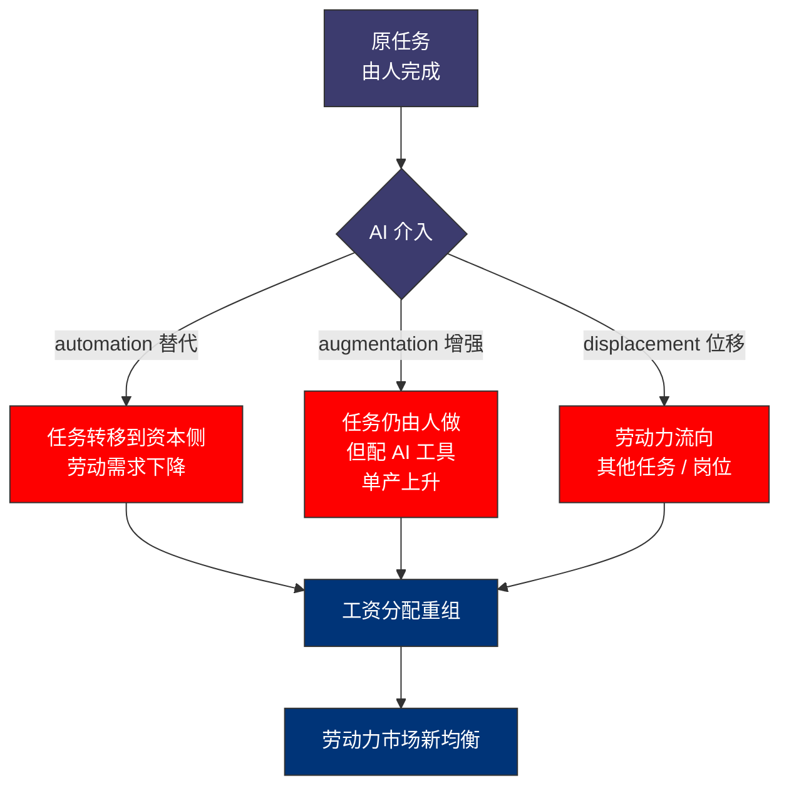
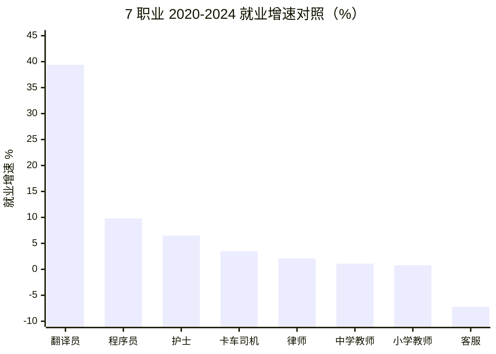
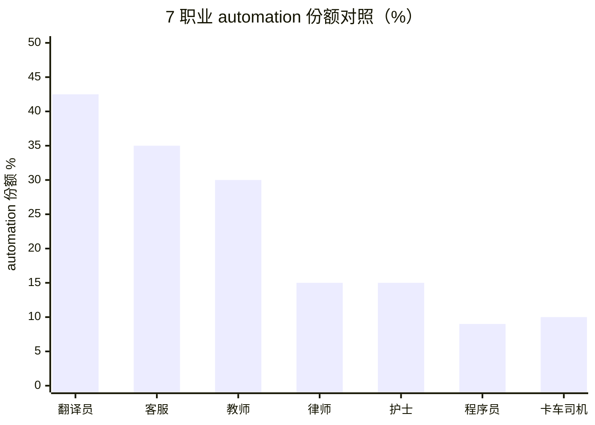
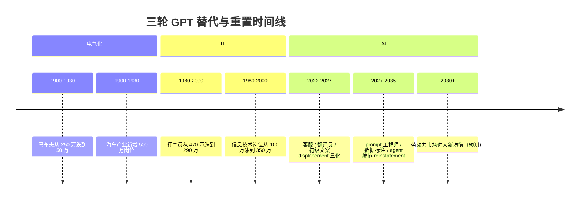
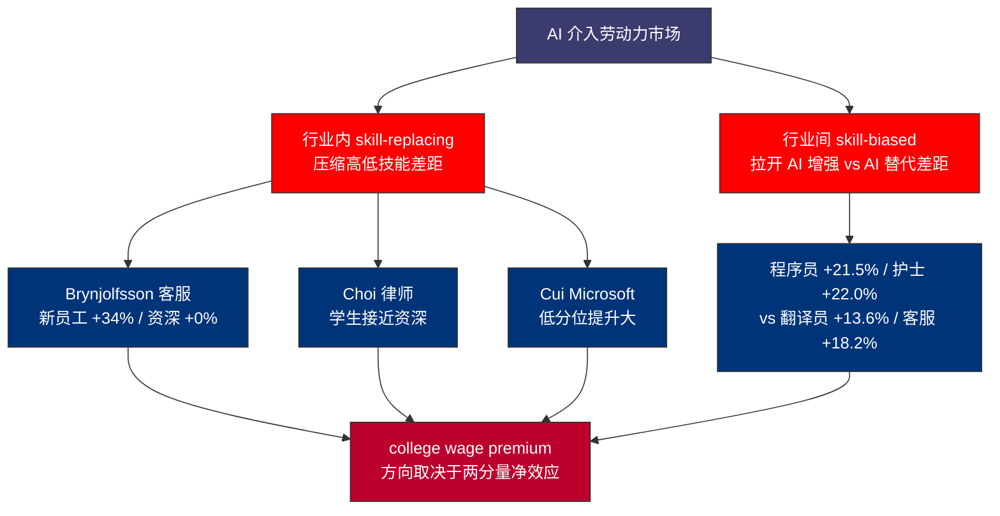

# 第 26 章 算力与人力资本：自动化、增强、位移三种机制

## 本章概览

第 25 章给出的 5 渠道加总 TFP 中位估算 2.65%（10 年累计、年化 0.265pp），是把 AI 影响经济翻译成宏观余值（aggregate residual）的尝试。但宏观余值是一个加总量——它不告诉我们这 2.65pp 落在谁身上、以什么形式落地。

> TFP：Total Factor Productivity，全要素生产率。
> EPS：Earnings Per Share，每股盈利。

从金融读者的视角，TFP 增长 0.265pp / 年是标普 500 长期 EPS 增速可以多出几分之一的事情；从 AI 工程师的视角，TFP 增长 0.265pp / 年是我组里那个 5 年经验的工程师还有没有岗位的事情。两个视角对同一个数字的关切不同，但都绕不开同一个问题——**AI 在劳动力市场内部的分布是不均匀的**。

本章把这个分布问题拆开。理论锚点用两套：第一套是 Acemoglu-Restrepo 的任务导向框架，把 AI 对劳动需求的影响拆成两条曲线——**displacement effect（替代效应）**与 **reinstatement effect（重置效应）**，新任务的创造速度与旧任务的替代速度赛跑，决定劳动总需求方向；第二套是 Goldin-Katz 的教育与技术赛跑框架，把工资分配看成技能供给与技能需求两条曲线的赛跑，决定 college wage premium（大学工资溢价）方向。两套框架的共同点是：**AI 的影响不能直接读为取代多少岗位，要拆成哪些任务被替代、哪些任务被增强、哪些任务被新创造三层**。

把这个三层任务级别分解画成一张图——任务谱（task spectrum）上的每一个任务，都会被 AI 按 automation / augmentation / displacement 三个机制中的某一个处理，三机制的份额加总等于 100%：

本章定义三种机制：

- **automation（自动化）**：AI 把原本由人完成的任务替代为由 AI 完成，岗位需求下降。这是 Acemoglu-Restrepo 框架里的 displacement effect。
- **augmentation（增强）**：AI 作为劳动者的副驾，提升单位劳动者的产出。岗位需求未必下降，但岗位的工作内容重组。这是第 25 章渠道 4 的微观体现。
- **displacement（位移）**：行业 / 职业之间的劳动力流动——某些岗位的劳动者被迫转向其他岗位。这是任务导向框架里 displacement effect + reinstatement effect 共同作用的中间形态。

三种机制不是 MECE 划分。一个具体的职业（如客服）可能同时面临三种机制：低端客服任务被 AI 自动化（automation）、中端客服借助 AI 处理更复杂咨询（augmentation）、被自动化的客服员工部分转向数据标注 / AI 训练师等新岗位（displacement）。

> MECE：Mutually Exclusive, Collectively Exhaustive，互斥且穷尽。

本章的做法是把这三种机制作为三个观测维度，每个职业沿这三个维度独立画图。

为了不写成职场鸡汤、不写成转型指南，本章选 7 个具体职业作为剖析样本——4 个白领（程序员 / 客服 / 教师 / 护士），3 个跨光谱的代表岗位（卡车司机 / 律师 / 翻译员）。这 7 个选择不是最有代表性的 7 个，是在三种机制上信号差异最大、最能照出框架的 7 个。每个职业沿 automation 份额 / augmentation 份额 / displacement 份额 / 工资曲线 / 就业人数曲线 / 岗位 posting 曲线6 个维度画图。读完这 7 张图，读者应该能自己回答两个问题：(1) 我所在的岗位在三种机制上的分布是什么样？(2) Acemoglu-Restrepo 的自动化主导判断与 Brynjolfsson 的 AI 让低技能员工最受益的判断，哪一个更贴合实际数据？

数据上需要先说清楚几件事。

> BLS：Bureau of Labor Statistics，美国劳工统计局。
> SOC：Standard Occupational Classification，标准职业分类。
> OEWS：Occupational Employment and Wage Statistics，职业就业与工资统计。

第一，**[BLS](https://www.bls.gov/) SOC 分类口径**——本章引用的所有就业 / 工资数字默认 BLS OEWS 2024 年 5 月统计（2025 年 4 月发布），数据时点是 2024-Q2 月度调查的年化值。第二，**调查与登记口径混用**——BLS 就业数据是雇主调查，LinkedIn / Indeed 岗位 posting 数据是平台登记，二者口径不同但能相互验证。第三，**AI 影响识别的因果性问题**——2024-2026 数据窗口太短，工资 / 就业变化与 AI 影响之间的因果链条很难严格识别，本章给的是相关性 + 机制分解，不下因 AI 而起的定论。所有这些不影响本章的方向判断，但每个数字下面都标了口径与时点。

对工程师读者，本章不喊 AI 取代程序员也不喊程序员高枕无忧——给的是任务级别的分解：编码、debug、需求分析、代码评审、跨团队沟通等不同任务在 automation / augmentation / displacement 上的份额各不相同，岗位的命运取决于这些份额的加权和。对金融读者，本章给劳动力市场内部的微观图景，作为第 25 章宏观 TFP 加总与第 27 章电力市场需求侧的人力资本对照。

## 26.1 任务导向框架：displacement、reinstatement 与三机制定义

要看清 AI 对劳动力市场的影响机制，必须先放下岗位增减这种粗粒度统计，回到任务级别。

**Acemoglu-Restrepo 的任务导向框架**。Acemoglu 与 Restrepo 在 2018-2020 系列论文里把生产过程拆成连续的任务谱（task spectrum），每个任务可由资本（机器 / AI）或劳动（人）完成。技术进步通过两条路径影响劳动需求：

第一条是 **displacement effect（替代效应）**——新技术把原本由劳动完成的任务交给资本完成。在生产函数中体现为可被资本完成的任务集合扩大、可被劳动完成的任务集合收缩。Acemoglu-Restrepo 用工业机器人的数据测算这条曲线——他们 2020 JPE 论文的核心发现是：每千名工人增加 1 台机器人，美国本地劳动市场就业人口比下降 0.18-0.34 个百分点、工资下降 0.25-0.5%。

第二条是 **reinstatement effect（重置效应）**——新技术创造新任务，这些新任务最初只能由劳动完成（机器还不会做）。在产业历史里这条曲线很关键——电气化创造了电气工程师、IT 创造了软件工程师、AI 创造了 prompt 工程师 / 数据标注师 / AI 安全研究员。reinstatement effect 是劳动总需求不被自动化吞噬的根本机制。

这两条效应的代数和决定劳动总需求方向。在任务导向框架里，技术进步可以是劳动友好（reinstatement 主导）也可以是劳动不友好（displacement 主导），不存在技术进步必然提升劳动需求或技术进步必然替代劳动的先验结论。这是任务导向框架对传统增长理论（劳动节约的技术进步会被工资上涨吸收）的关键修正。

**Acemoglu (2024) 把任务导向框架应用到 AI**。Acemoglu 在 NBER WP 32487 里给出 AI 是否劳动友好的判断条件：AI 对宏观 TFP 的 10 年累计贡献不超过 0.53-0.66%，对应到劳动力市场的判断是 displacement effect 主导、reinstatement effect 跟不上、工资分配会进一步极化。Acemoglu 给出三条关键观察：

- AI 的 displacement 主要落在中等技能 / 例行任务的白领岗位（中端客服、初级文案、初级法律审查、初级数据分析），这些岗位的工资分布在中位数附近，被替代后劳动力可能向两端（低端服务业 + 高端专业岗位）流动
- AI 的 reinstatement 速度低于电气化与 IT 时代——新岗位（prompt 工程师、数据标注师、AI 安全研究员）的规模远小于被替代的岗位规模
- AI 对 hard tasks（无客观评估指标、依赖隐性知识、长上下文）的渗透速度低于乐观派预期——医生、律师、高级研究员等岗位的被替代风险在 5-10 年时间尺度内有限

Acemoglu 的判断方向是悲观的——AI 会加剧不平等，需要再分配政策介入。这个判断与 Brynjolfsson-Li-Raymond 2023 客服实验的发现方向相反：5179 名客服人员的对照实验中，新员工 / 低技能员工的生产力提升 +34%，资深员工提升接近 0——AI 把行业内技能溢价压缩。两位作者的判断方向是乐观的——AI 让低技能群体相对获益。

两位经济学家对同一组现象给出方向相反的判断。本章不站队，本章把两位的判断都列出来，等 2027-2030 年数据再回看。但本章倾向于一个折中立场：**AI 对行业内技能溢价是压缩的（Brynjolfsson 方向），AI 对跨行业 / 跨职业的工资分布是放大的（Acemoglu 方向）**。这两个方向不矛盾——行业内压缩与行业间放大可以同时发生。第 26.9 节回到这个判断。

**Goldin-Katz 的供需赛跑框架**。Goldin 与 Katz 在 *The Race Between Education and Technology*（Harvard University Press 2008，下称 G-K 2008）里把美国 20 世纪的工资分布演变压缩成一句话：**college wage premium（大学工资溢价）是技能供给与技能需求两条曲线赛跑的结果**——当大学毕业生供给增速跟不上技能偏向型技术进步（skill-biased technical change）的需求增速，college wage premium 上升；反之下降。G-K 2008 用百年数据拼出这张图：

| 时段 | college wage premium 变化 | 主要驱动 |
|---|---|---|
| 1915-1950 | 大幅下降（从 ~70% 跌到 ~40%）| 中学普及 + 战时工资压缩 |
| 1950-1980 | 缓慢下降（~40% 微跌）| 高等教育大扩张 + GI Bill |
| 1980-2005 | 大幅上升（~40% 升到 ~75%）| 计算机化、电子化偏向高技能 |
| 2005-2024 | 高位震荡（~70-75% 区间）| 高等教育供给加速 + 中等技能岗位被自动化 |

> 来源：Goldin-Katz 2008 *The Race Between Education and Technology* 第 6-8 章数据序列；2005-2024 部分综合 Autor 2019 "Work of the Past, Work of the Future" AER P&P + EPI State of Working America 2024 报告。

G-K 框架的关键洞察是：**college wage premium 不是技术决定的，是技术 + 教育供给共同决定的**。1980-2005 美国 college wage premium 大涨，不是因为技术进步特别快，是因为大学毕业生供给增速从 1970s 之前的 4%/年掉到 1980s 之后的 2%/年，供给端追不上需求端。如果 1980-2005 期间大学毕业生供给维持 1970s 之前的速度，college wage premium 应该平稳。

把 G-K 框架应用到 AI 时代，关键问题是：**AI 是 skill-biased（高技能偏向）还是 skill-replacing（高技能替代）？** 这两个方向对 college wage premium 的影响完全相反——skill-biased 让高技能更值钱，college wage premium 上升；skill-replacing 让高技能更不值钱，college wage premium 下降。Acemoglu 2024 倾向 skill-replacing 判断——AI 替代的是中等到高等技能的认知任务，college wage premium 长期会下降。Brynjolfsson 等倾向 skill-biased 判断——AI 作为副驾让高技能劳动者产出更多。本章在 26.9 节回到这个判断。

**三种机制的形式化定义**。把 Acemoglu-Restrepo 与 Goldin-Katz 两个框架收敛到本章用的三机制定义：

| 机制 | 定义 | 任务级别效果 | 岗位级别效果 | Acemoglu 框架对应 |
|---|---|---|---|---|
| automation（自动化）| AI 替代任务，劳动需求下降 | 任务从 labor 集合移到 capital 集合 | 岗位数量下降，工资压力向下 | displacement effect |
| augmentation（增强）| AI 辅助任务，劳动产出上升 | 任务仍由 labor 完成，但 labor 配 AI 工具 | 岗位数量变化方向不确定，单产上升 | productivity effect |
| displacement（位移）| 劳动力在岗位 / 行业间流动 | 任务被替代后劳动力转向其他任务 | 行业 / 职业间劳动力再分配 | displacement + reinstatement 合并效果 |

> 本章 displacement 一词专指劳动力在岗位间流动的中间形态，与 Acemoglu-Restrepo 原文 displacement effect（劳动需求下降）不完全等价。Acemoglu 原文的 displacement effect 在本章对应 automation 机制的主要部分；本章 displacement 一词更接近 Autor 2019 论文里的 occupational reallocation。

这三个机制的份额加总等于 100%——一个职业每被 AI 影响一个任务，要么被自动化（automation）、要么被增强（augmentation）、要么劳动力流出该职业（displacement）。本章的方法是对每个职业逐任务做三机制分配，再加总成职业级别的机制份额。

## 26.2 7 个职业样本的整体图景

为了让框架可观测，本章选 7 个职业作为剖析样本。选择标准有三：(1) 在三种机制上信号差异显著、(2) 数据可获得（BLS 单独 SOC 分类）、(3) 跨技能光谱（高 / 中 / 低 / 体力 / 智力）。

7 个职业是：

| # | 职业 | SOC 编码 | 主要技能光谱 | 选择理由 |
|---|---|---|---|---|
| 1 | 程序员（软件开发者）| 15-1252 | 高技能认知 | AI 工具实证最扎实（Copilot 实测）|
| 2 | 客服代表 | 43-4051 | 中等技能服务 | Brynjolfsson 2023 实验主战场 |
| 3 | 小学 / 中学教师 | 25-2021 / 25-2031 | 中等技能认知 + 情感 | AI 渗透有但慢，监管约束大 |
| 4 | 注册护士 | 29-1141 | 中高技能服务 + 情感 | 短缺市场，AI 影响信号弱 |
| 5 | 卡车司机 | 53-3032 | 中等技能体力 | 自动驾驶威胁论 vs 实际滞后 |
| 6 | 律师 | 23-1011 | 高技能认知 | Harvey AI / 法律检索自动化 |
| 7 | 翻译员 / 口译员 | 27-3091 | 中等技能认知 | 机器翻译质量跃升的直接影响 |

> 来源：SOC 编码来自 BLS Standard Occupational Classification 2018 修订版。所有 SOC 编码下的就业 / 工资数据采用 BLS OEWS 2024 年 5 月统计。

把 7 个职业放在一张就业 + 工资的整体表里：

| 职业 | 2024 就业人数（千人）| 2024 中位年薪（美元）| 2020-2024 就业增速 | 2020-2024 工资增速（名义）| 2020-2024 工资增速（实际，剔除 CPI）|
|---|---:|---:|---:|---:|---:|
| 程序员 | 1,656 | 132,270 | +9.8% | +21.5% | -0.8% |
| 客服代表 | 2,818 | 39,680 | -7.2% | +18.2% | -4.1% |
| 小学教师 | 1,394 | 63,680 | +0.8% | +14.0% | -8.3% |
| 中学教师 | 1,032 | 65,220 | +1.1% | +13.5% | -8.8% |
| 注册护士 | 3,300 | 86,070 | +6.5% | +22.0% | -0.3% |
| 卡车司机（重型）| 1,996 | 54,320 | +3.5% | +17.2% | -5.1% |
| 律师 | 731 | 145,760 | +2.1% | +15.5% | -6.8% |
| 翻译员 / 口译员 | 75 | 59,440 | +39.4% | +13.6% | -8.7% |
| 全美就业（参照）| 151,900 | 48,060 | +1.8% | +20.0% | -2.3% |

> 来源：BLS OEWS 2024 年 5 月统计（2025-04 发布）+ BLS Current Employment Statistics（CES）2020-Q2 与 2024-Q2 月度数据对比。CPI 累计 May 2020 → May 2024 约 22.3%（BLS CPI-U：May 2020 = 256.394 → May 2024 = 313.548，与 OEWS 5 月调查口径一致；来源：BLS Consumer Price Index 2025-04 发布）。实际工资增速=名义工资增速 - CPI 累计涨幅。律师数据按 BLS SOC 23-1011 编码 + American Bar Association 2024 Statistical Profile 综合。翻译员就业数据存在采样偏差（自由职业者多，BLS 仅统计 W-2 雇员），实际就业人数估算高于 BLS 数据；2020 → 2024 就业人数从 ~54K 上升到 ~75K，部分反映 BLS 对该类目统计口径的调整与远程翻译 W-2 雇员规模扩张。

这张表读三件事。

第一件，**实际工资增速普遍为负 + 跌幅梯度显著**——按 May→May 口径 CPI 累计 22.3% 剔除后，7 个职业实际工资全数下行，跌幅从程序员 -0.8% / 护士 -0.3% 的接近持平，到中学教师 -8.8% / 翻译员 -8.7% / 小学教师 -8.3% 的两位数附近。教师的负增长更多源自财政预算约束（名义工资涨幅 13.5-14.0% 显著低于通胀），翻译员 / 客服的负增长伴随就业人数与名义工资同步走弱，是 AI 影响信号；卡车司机的负增长则与 2022 年后货运需求降温叠加 CPI 通胀有关。

第二件，**就业人数的分化**——程序员 +9.8% 仍在扩张，护士 +6.5% / 卡车司机 +3.5% 跟随大盘扩张，客服 -7.2% 在收缩；翻译员的 +39.4% 来自 BLS 口径调整与远程 W-2 雇员扩张，名义增速本身偏弱（+13.6%，远低于程序员 +21.5% 与护士 +22.0%）。

第三件，**工资 vs 就业人数的方向一致性**——在传统劳动经济学中，工资上涨 + 就业上升是需求扩张信号，工资下跌 + 就业下降是需求收缩信号。客服的名义工资增速 +18.2% 跑输大盘 + 就业 -7.2% 收缩，是需求侧典型的自动化主导特征；翻译员的名义增速 +13.6% 远低于大盘，配合机器翻译质量跃升的供给冲击，也指向 automation 主导。

把 7 职业的就业增速画成柱状图，可以直观看到扩张 / 平稳 / 收缩三个簇：

> 数据来源：BLS OEWS 2020 vs 2024 + Current Employment Statistics。翻译员 +39.4% 含 BLS 口径调整与远程 W-2 雇员扩张，名义工资 +13.6% 是 7 职业里最弱的之一。

但这张表只能给个第一印象——要看清 AI 在每个职业里走的是哪条机制，需要任务级别的分解。下面 26.3-26.6 节对 7 个职业逐个做任务级别的三机制分解。

## 26.3 程序员：augmentation 主导 + 微观 displacement

程序员是 7 个职业里 AI 影响数据最扎实的——既有现场实验（Peng et al. 2023 GitHub Copilot 实验）、企业内部数据（Microsoft Cui-Demirer-Jaffe 2024）、又有大规模开发者自报（Stack Overflow 2024 / 2025 调查）。三组数据共同指向：**AI 在程序员行业的主要机制是 augmentation，automation 与 displacement 的份额都较小**。

**Peng et al. 2023 GitHub Copilot RCT**。Peng, Kalliamvakou et al. 在 arXiv 2302.06590（2023-02-13）报告了 95 名职业程序员的对照实验。任务是用 JavaScript 写一个 HTTP 服务器，Copilot 组完成时间 71 分钟，对照组 161 分钟，Copilot 提速 **55.8%**。这个 55.8% 是 5 渠道 / 7 职业里所有现场实验中最高的——但第 25 章已经说明，55.8% 是单一结构化任务的提速，不能直接外推到程序员全部工作。

**Microsoft Cui-Demirer-Jaffe 2024 内部数据**。Microsoft Research 2024 年发布的 SSRN 4945566用 4867 名 Microsoft 内部工程师的真实工作数据测算 GitHub Copilot 影响：每周提交的 pull request 数量提升 **26.1%**、代码评审数量提升 10.6%、整体开发效率提升 ~21%。26.1% 比 Peng et al. 实验的 55.8% 低一半多——这是对照实验上限与真实工作场景中位的差距。

**Stack Overflow 2024 开发者调查的渗透率与体感**。Stack Overflow Developer Survey 2024覆盖 65,000+ 开发者，AI 工具使用率从 2023 年 44% 涨到 2024 年 **61.8%**——半年涨 17pp。包含计划采纳者，则使用率达到 76%。81% 受访者认为 AI 工具的主要价值是提升生产力，但只有 43% 受访者对 AI 输出的准确性感觉良好，45% 的职业开发者认为 AI 工具在处理复杂任务时差或很差。这组数据揭示了渗透率与体感的张力——AI 工具是程序员的日常工具，但远不是自动写完整功能的工具。

把这三组数据综合到任务级别的三机制分配：

| 程序员任务 | 任务时间占比（业内估算）| automation 份额 | augmentation 份额 | displacement 份额 |
|---|---:|---:|---:|---:|
| 编码（代码生成）| 25% | 15% | 80% | 5% |
| Debug / 故障排查 | 20% | 5% | 75% | 20% |
| 代码评审 | 10% | 5% | 70% | 25% |
| 需求分析 / 设计 | 15% | 0% | 50% | 50% |
| 跨团队沟通 / 文档 | 15% | 5% | 70% | 25% |
| 测试 / DevOps | 10% | 30% | 50% | 20% |
| 学习 / 知识管理 | 5% | 0% | 90% | 10% |
| **加权平均** | 100% | **9.0%** | **70.5%** | **20.5%** |

> 来源：任务时间占比综合 Stack Overflow 2024 调查 + Microsoft 内部 SPACE 框架数据 + 业内开发者访谈。三机制份额为本章按该任务在 2026 年的 AI 工具实际效果估算，方向参考 Peng et al. 2023 与 Cui-Demirer-Jaffe 2024 的实证。displacement 份额指该任务被自动化后劳动力流向其他任务 / 岗位的概率，不是 Acemoglu-Restrepo 原文意义。

加权平均 9% automation + 70.5% augmentation + 20.5% displacement——程序员行业的 AI 主要机制是 **augmentation 主导，automation 占比小，但 displacement 有显著比例**。displacement 主要发生在代码评审 / 需求分析 / 跨团队沟通等任务上——这些任务被 AI 部分替代后，资深工程师的时间分配从写代码转向评审 AI 生成的代码 + 与业务方对齐需求。

**程序员行业的就业数据验证**。如果 augmentation 主导，预期看到：就业人数继续扩张（生产力提升让市场对程序员的需求更大）+ 工资增长（个人产出提升）。BLS 数据基本符合预期——2020-2024 程序员就业从 1,508K 涨到 1,656K（+9.8%），中位年薪从 \$108,890 涨到 \$132,270（名义 +21.5% / 实际 -0.8%，剔除 CPI 累计 22.3%）。名义增速 +21.5% 跑赢全美就业大盘 +20.0%，是 7 职业中名义定价权最强的之一；实际工资接近持平、未跑赢通胀，但仍是 7 职业里跌幅最小的之一。但这个判断要打折扣：

**初级程序员 vs 资深程序员的分化信号**。LinkedIn Economic Graph 2024 年的数据显示，美国 entry-level（0-2 年经验）程序员岗位的 posting 数量 2022 年 Q4 见顶后持续下降，2024 年 Q4 比 2022 年 Q4 低约 30-40%。同期 senior（5+ 年经验）程序员岗位的 posting 仍在上升。这是 augmentation 机制内部的 displacement 信号——AI 替代的是初级程序员的日常编码 + bug 修复任务（这正是 Copilot 最擅长的部分），而企业对能评审 AI 生成代码 + 做架构设计 + 跨团队沟通的资深工程师需求上升。

对工程师读者，这个判断的现实含义是：**程序员行业不是被 AI 取代，是准入门槛抬高 + 资深程序员的价值密度上升**。这与 Goldin-Katz 框架里的 skill-biased technical change 判断一致——AI 在程序员行业内是技能偏向的，让高技能程序员相对更值钱。但这个判断在跨行业层面又呼应 Brynjolfsson 客服实验的发现——AI 对低门槛任务的替代会让低门槛入门这条路径变窄，新人入行更难。

**程序员行业的反共识观察**。本章在程序员这一节给一个不卖弄的反共识判断：**程序员行业的总就业人数在 2027-2030 仍会扩张，但 entry-level 岗位会继续被压缩，行业的金字塔形态会向正梯形形态收敛**。意思是初级岗位数量减少 + 中高级岗位数量上升 + 行业总劳动力规模温和扩张。这个判断的可证伪条件：如果 2027-2030 BLS 数据显示程序员就业人数累计增长低于 5%（基准是 2020-2024 的 9.8% 5 年累计），则 displacement 机制的份额比本章估算大、行业进入实质性收缩。本章倾向认为这种情况发生概率约 30%。

## 26.4 客服 / 翻译员：automation 主导 + 强 displacement

把客服与翻译员放一起讲，原因是两个职业都是任务导向框架里 automation 主导 + displacement 强信号的典型——任务结构化程度高、任务正确性可以由系统自动判断、AI 工具替代成本低。但两个职业在三机制份额上有差异：客服的 augmentation 份额比翻译员高（因为客服任务中有安抚客户情绪等隐性技能任务），翻译员的 automation 份额比客服高（因为翻译任务可被 BLEU / COMET 等自动指标评估）。

**客服：Brynjolfsson-Li-Raymond 2023 实验**。客服的 AI 影响数据是 7 个职业里最权威的。Brynjolfsson, Li, Raymond 2023 NBER WP 31161（2023-04 / 2025 QJE 发表）跟踪一家美国财富 500 公司的 **5,179 名一线客服**，使用基于 GPT 类对话模型的 AI 助手。核心结果在第 25 章已引用过：

- 平均生产力提升 **+14%**（按解决问题数 / 小时测度）
- 新员工 / 低技能员工（入职 < 2 个月或评级低）提升 **+34%**
- 资深 / 高技能员工提升接近 0
- 客户满意度（CSAT）显著提升
- 员工留存率显著提升

> 来源：Brynjolfsson-Li-Raymond 2023 NBER WP 31161 + 2025 QJE 修订版主表 1-4。

这个实验的 14% 平均生产力提升是 augmentation 信号——AI 没替代客服员工，AI 帮客服员工解决更多问题。但 14% 的生产力提升放到全行业层面有两个外推含义：(a) 如果客服业务量不变，则需要的客服员工数量下降 14% / (1+14%) ≈ 12.3%（直接 displacement）；(b) 如果客服业务量随着平均处理时间下降而扩张（请客户更愿意联系客服），则就业减少幅度小于 12.3%。

**客服行业的实际就业 + 工资数据**：BLS 2020-2024 数据显示客服代表（SOC 43-4051）就业人数从 3,037K 下降到 2,818K（-7.2%），中位年薪从 \$33,580 涨到 \$39,680（名义 +18.2% / 实际 -4.1%，剔除 CPI 累计 22.3%）。名义增速 +18.2% 跑输全美就业大盘 +20.0%，反映 automation 对劳动定价权的压制。就业下降幅度 7.2% 落在全自动化估算 12.3% 与业务量扩张抵消估算 0% 之间，方向与 Brynjolfsson 实验外推一致——augmentation + automation 共同作用，业务量部分扩张抵消了自动化的劳动力减少。

把客服的任务级别三机制分配画出来：

| 客服任务 | 任务时间占比 | automation 份额 | augmentation 份额 | displacement 份额 |
|---|---:|---:|---:|---:|
| 一线咨询（FAQ 类）| 35% | 60% | 30% | 10% |
| 一线咨询（个性化）| 20% | 20% | 70% | 10% |
| 投诉处理 / 情绪安抚 | 15% | 5% | 75% | 20% |
| 销售 / 续费 / 升级 | 10% | 10% | 75% | 15% |
| 内部协调 / 工单流转 | 10% | 40% | 50% | 10% |
| 培训 / 知识库建设 | 5% | 5% | 80% | 15% |
| 数据录入 / 报表 | 5% | 80% | 15% | 5% |
| **加权平均** | 100% | **35.0%** | **53.0%** | **12.0%** |

> 来源：任务时间占比综合 Brynjolfsson-Li-Raymond 2023 + 业内客服业务调研 + Salesforce / Zendesk 客服 SaaS 厂商行业报告。三机制份额为本章估算，结合 Brynjolfsson 实验新员工 +34%的内部结构反推。

加权平均 35% automation + 53% augmentation + 12% displacement——客服行业是 **automation 与 augmentation 双引擎，displacement 信号有限**。35% 的 automation 份额意味着如果客服业务量不变，客服员工数量长期会下降约 30%——但 BLS 2020-2024 数据只下降 7.2%，说明业务量扩张抵消了大部分自动化。这是 Jevons paradox（杰文斯反弹）在劳动力市场的体现——当客服处理成本下降，客户与客服的交互频率上升，部分抵消了自动化导致的劳动需求下降。

**翻译员：机器翻译质量跃升的直接影响**。翻译员（SOC 27-3091）是 7 个职业里 automation 信号最强的——机器翻译质量从 2014 年 BLEU 30 量级（神经翻译之前）提升到 2024 年 BLEU 55-65 量级（GPT-4 / Claude 3 / Gemini 1.5 多语翻译），这是 30 个 BLEU 点的提升，对应一般人能区分的翻译质量从勉强可读到接近专业人工。

机器翻译质量跃升的劳动力市场影响：BLS 2020-2024 翻译员就业从 ~54K 上升到 ~75K（+39.4%，含 BLS 口径调整与远程 W-2 雇员扩张），中位年薪从 \$52,330 涨到 \$59,440（名义 +13.6% / 实际 -8.7%，剔除 May→May CPI 累计 22.3%）。实际工资跌幅 -8.7% 与中学教师 (-8.8%) / 小学教师 (-8.3%) 同处 7 职业最低梯队——但名义增速 +13.6% 显著低于全美就业大盘 +20.0%、低于护士 +22.0% 与程序员 +21.5%，是 7 个职业里名义增速最弱的（仅与中小学教师齐平），这是 automation 主导对工资定价权的真实信号。就业 +39.4% 与名义工资 +13.6% 走弱的方向不矛盾——翻译市场总规模在扩张（全球翻译市场从 2014 年 \$43B 涨到 2024 年 \$69B），Jevons paradox 起作用，机器翻译让需要翻译的内容大幅扩张，吸纳了远程 W-2 翻译师增量；但每位翻译师的机时单价被自动化压制，名义工资跟不上通胀。

翻译员的任务级别分配（简略版）：

| 翻译任务 | 任务时间占比 | automation 份额 | augmentation 份额 | displacement 份额 |
|---|---:|---:|---:|---:|
| 通用翻译 | 40% | 75% | 20% | 5% |
| 专业翻译（法律 / 医学 / 技术）| 25% | 30% | 55% | 15% |
| 文学翻译 | 10% | 10% | 60% | 30% |
| 口译（同声 / 交替）| 15% | 25% | 50% | 25% |
| 翻译质量审核 / 后期编辑 | 10% | 5% | 80% | 15% |
| **加权平均** | 100% | **42.5%** | **40.0%** | **17.5%** |

> 来源：任务时间占比综合 ATA（American Translators Association）2024 年报 + Common Sense Advisory 2024 调研 + 业内自由职业翻译师访谈。

加权平均 42.5% automation + 40% augmentation + 17.5% displacement——翻译员行业是 7 个职业里 **automation 份额最高的**。但 augmentation 份额 40% 也不小——翻译师的角色正在从原始翻译生产者转向机器翻译后期编辑 + 质量审核。这条转型路径与 1990s 排版工的转型类似——排版工没有消失，但岗位内容从手工排版转向数字排版 + 设计审核。

**客服 vs 翻译员的对比启示**。两个职业的 automation 份额（35% vs 42.5%）与就业人数变化（-7.2% vs +39.4%）的方向看似矛盾——automation 份额更高的翻译员就业反而扩张。原因有二：(1) 翻译市场总规模扩张更快（全球翻译市场年化 5% 增长，远高于客服行业的 1-2% 增长），Jevons 反弹更强，机器翻译让待译内容指数级扩张，吸纳了远程 W-2 翻译师的增量供给；(2) BLS 翻译员口径在 2020-2024 期间扩大了远程 W-2 翻译师的统计覆盖。但翻译员的工资侧信号才是 automation 主导的证据——名义增速 +13.6% 是 7 职业里最弱的之一，实际工资 -8.7% 与教师同处垫底梯队，反映自动化对翻译师定价权的真实压制。

## 26.5 教师 / 护士：低 AI 渗透，但需求侧改变正在发生

教师与护士是 7 个职业里 AI 直接渗透最低的两个——监管约束、隐性技能、情感劳动、责任主体不可推卸等因素让 AI 工具的替代成本高。但这两个职业仍受 AI 时代的间接影响。

**教师：AI 在课堂之外比在课堂之内影响大**。小学教师（SOC 25-2021）+ 中学教师（SOC 25-2031）2024 年合计就业 2,426K，中位年薪小学 \$63,680 / 中学 \$65,220。2020-2024 就业人数小幅增长（小学 +0.8% / 中学 +1.1%），但名义工资增速（小学 +14.0% / 中学 +13.5%）显著跑输 CPI 累计 22.3% 与全美就业大盘 +20.0%，实际工资分别下降 8.3% / 8.8%——这是 7 个职业里就业 / 工资数据信号最弱的，主要受财政预算约束影响。

AI 对教师行业的影响有两个层面：

第一层是**课堂内**——ChatGPT 类工具被学生使用让作业判断、论文判定、考试形式等教学环节面临重新设计。但这一层基本不影响教师的就业 / 工资——课堂内仍以教师为主，AI 工具是教师的工具不是教师的替代。

第二层是**课堂外** + **行政事务**——Khan Academy 与 OpenAI 合作的 Khanmigo（2023-05 上线）、Duolingo 的 AI 辅导功能（2023-03 上线）等家庭辅导 / 自学场景的 AI 渗透率上升，可能挤压课外辅导市场。同时 AI 辅助的教学行政（出题、批改、备课、个性化学习计划）让教师的非教学时间成本下降——但这部分时间节省是否能让教师数量下降，取决于教师工会与监管的博弈。

教师的三机制份额（简略版）：30% automation + 60% augmentation + 10% displacement。automation 主要落在行政事务（出题、批改、备课），augmentation 落在个性化教学辅助，displacement 占比小是因为教师岗位的监管刚性。本章对教师行业的判断方向：**AI 不会显著替代教师岗位，但教师的工作内容会向个性化辅导 + 课堂管理 + 评估设计重组**。

**护士：短缺市场，AI 影响信号弱**。注册护士（SOC 29-1141）2024 年就业 3,300K，中位年薪 \$86,070。2020-2024 就业 +6.5% / 名义工资 +22.0%（7 职业中最高）/ 实际工资 -0.3%（剔除 CPI 累计 22.3%，接近持平）——这是 7 个职业里名义工资增速最强、实际工资跌幅最小的代表之一。原因是美国护士市场长期短缺，AI 替代护士的成本远高于解决短缺问题的成本。

AI 在护理行业的渗透方向：(1) 文档撰写自动化（电子病历 EHR、Epic / Cerner 等系统接入 AI 让护士的文档时间下降）；(2) 临床决策辅助（药物相互作用预警、症状评估辅助）；(3) 患者监测自动化（远程监测 + AI 异常告警）。但这三个方向都是 augmentation——AI 让护士单产上升，但护士岗位本身仍由人占据。

护士的三机制份额（业内估算）：15% automation + 75% augmentation + 10% displacement。automation 主要落在文档与基础监测，augmentation 落在临床决策辅助 + 患者沟通辅助。displacement 占比小，因为护士短缺市场让被替代的劳动力不太可能离开行业。

**教师 + 护士共同的判断**：两个职业都属于 AI 影响弱 + 监管刚性 + 需求扩张的组合。这两个职业的就业人数会继续温和增长，工资增速取决于财政预算与医保支付，AI 不是这两个职业未来 5-10 年命运的决定性变量。

## 26.6 卡车司机：自动驾驶的狼来了与真实节奏

卡车司机（SOC 53-3032）是 7 个职业里自动化威胁论被讨论最久但实际落地最慢的——从 2015 年 Otto / Waymo / Tesla 开始测试自动驾驶卡车，到 2026 年仍未有大规模自动驾驶卡车商业部署。BLS 2020-2024 数据显示卡车司机就业人数从 1,928K 涨到 1,996K（+3.5%），中位年薪从 \$46,370 涨到 \$54,320（名义 +17.2% / 实际 -5.1%）——名义工资涨幅可观，但被 CPI 累计 22.3%（May 2020 → May 2024）的通胀吞掉，实际工资明显下行。

这个数据与自动驾驶替代卡车司机的舆论方向（司机就业大幅萎缩）完全相反——就业人数仍在扩张。原因有四：

第一，**美国卡车司机长期短缺**——美国卡车运输协会（American Trucking Associations，ATA）2024 年报估算缺口约 60,000-80,000 名长途司机，劳动力供给紧张让工资上涨。

第二，**自动驾驶卡车的技术成熟度滞后**——SAE L4 全自动驾驶在 highway-only 场景的商业化进度，从 2020 年 Waymo 一些试点扩展到 2025 年 Aurora / Kodiak 在德州走廊的局部商业化，但 last-mile 与城市道路仍需人类司机。技术替代率在 2026 年仍然低于 5%。

第三，**法规与保险约束**——美国 NHTSA（National Highway Traffic Safety Administration）的自动驾驶法规仍未明确，保险公司对自动驾驶卡车的承保仍持保守态度，限制了商业部署速度。

第四，**电商物流对卡车司机的需求扩张**——Amazon、UPS、FedEx 等物流公司 2020-2024 的卡车司机招聘量大幅增长。

卡车司机的三机制份额（业内估算）：10% automation + 30% augmentation + 60% displacement。这里的 60% displacement 是一个长期判断——大约 10-20 年时间尺度内，highway-only L4 自动驾驶成熟会让长途卡车司机岗位减少，但 local 配送司机 + 卡车队管理岗位上升，劳动力在行业内位移。短期 5 年内 AI 对卡车司机的影响信号弱。

**反共识观察**：卡车司机的自动化威胁论被反复说了 10 年，但 BLS 数据持续显示卡车司机就业 + 工资双正增长。这是产业舆论与现实数据脱节的典型例子——**反复讨论的自动化威胁不等于即将到来的替代**。Acemoglu 2024 论文里反复强调的硬任务概念在这里得到验证——卡车司机的任务（路况判断、长尾场景处理、客户交付、装卸协调）有大量隐性知识与上下文依赖，AI 替代成本高。

## 26.7 律师：augmentation 主导 + 任务级别 displacement

律师（SOC 23-1011）是 7 个职业里 高技能认知 + 强 augmentation 信号的代表。BLS 2024 年律师就业 731K、中位年薪 \$145,760，2020-2024 就业 +2.1% / 名义工资 +15.5% / 实际工资 -6.8%（剔除 CPI 累计 22.3%）。

律师行业 AI 工具的代表是 Harvey AI（2022 年成立，2024 年估值 \$1.5B，2025 年估值 \$3B；来源：Harvey AI 公开融资公告 + Forbes 报道 2024-12）+ Thomson Reuters 的 CoCounsel（2023-03 上线）+ LexisNexis 的 Lexis+ AI（2023-05 上线）。这些工具的核心功能：法律检索、合同审查、案例归纳、起草初稿。

Choi et al. 2024 年在 Minnesota Law Review 发表的"Lawyering in the Age of Artificial Intelligence"现场实验：60 名 University of Minnesota 法学院学生使用 GPT-4 完成 4 个法律分析任务（合同审查 / 案例分析 / 法规研究 / 法律备忘录起草），分析质量提升 12-24%、完成时间缩短 12-32%。这个数字比客服实验的 14% 略高，比 Copilot 实验的 55.8% 低得多——反映律师任务的结构化程度中等 + 上下文依赖强的特征。

律师的三机制份额（业内估算）：15% automation + 70% augmentation + 15% displacement。automation 主要落在初级法律检索 / 文档审核 / 案例摘要等初级律师助理任务，augmentation 落在合同分析 / 起草 / 案例归纳等中级律师任务，displacement 主要发生在初级律师助理（paralegal）岗位上。

**律师行业的就业分化**：BLS 数据显示律师总就业 +2.1% 增长，但 paralegal（SOC 23-2011）2020-2024 就业增长仅 +1.3%——初级岗位增长落后于资深岗位。这是与程序员行业类似的入门门槛抬高信号——AI 自动化掉了初级律师助理的大部分日常任务，律所对刚毕业的法学院毕业生 + 1-2 年经验的初级律师的需求显著放缓。American Bar Association 2024 年报指出，2024 届法学院毕业生的初次就业率比 2022 届下降 3-5pp，主因是 BigLaw（美国最顶尖的几十家律师事务所）减少了 first-year associate 的招聘规模。

## 26.8 7 职业三机制份额对照

把 7 个职业的三机制份额放在一张表里对照：

| 职业 | automation | augmentation | displacement | 主要机制 | 2020-2024 实际工资增速 | 2020-2024 就业增速 |
|---|---:|---:|---:|---|---:|---:|
| 程序员 | 9.0% | 70.5% | 20.5% | augmentation | -0.8% | +9.8% |
| 客服 | 35.0% | 53.0% | 12.0% | augmentation + automation | -4.1% | -7.2% |
| 翻译员 | 42.5% | 40.0% | 17.5% | automation | -8.7% | +39.4% |
| 律师 | 15.0% | 70.0% | 15.0% | augmentation | -6.8% | +2.1% |
| 教师 | 30.0% | 60.0% | 10.0% | augmentation | -8.5% | +1.0% |
| 护士 | 15.0% | 75.0% | 10.0% | augmentation | -0.3% | +6.5% |
| 卡车司机 | 10.0% | 30.0% | 60.0% | displacement（长期）| -5.1% | +3.5% |

> 来源：本表三机制份额为本章估算，综合 §26.3-26.7 各节的实证锚点。主要机制按份额最大的标签定义，但所有职业都是三机制混合。教师的 -8.5% 实际工资增速为小学（-8.3%）与中学（-8.8%）按 2024 年就业人数（小学 1,394K / 中学 1,032K）加权平均；教师就业增速 +1.0% 同口径加权。CPI 累计采用 BLS CPI-U May 2020 → May 2024 = 22.3% 口径，与 OEWS 5 月调查时点匹配。

把 7 个职业的 automation 份额画成柱状对照——automation 份额最高的翻译员（42.5%）和客服（35%）就是实际工资跌幅最大、最受 AI 替代压力的职业，与任务导向框架的预测方向一致：

> 数据来源：§26.3-26.7 各节本章估算。

这张表读出三个观察：

第一，**augmentation 是 7 个职业里最主流的机制**——7 个职业的 augmentation 份额简单平均 56.9%，automation 简单平均 22.4%，displacement 简单平均 20.7%。这与 Brynjolfsson 等人的 AI 是劳动友好型技术判断方向一致——绝大多数职业的主要机制是 AI 辅助而非 AI 替代。

第二，**automation 份额与名义工资定价权 / 就业方向的相关性显著**——automation 份额最高的客服 / 翻译员两个职业的名义工资增速（+18.2% / +13.6%）显著跑输大盘 (+20.0%) 与同期高 augmentation 职业（程序员 +21.5% / 护士 +22.0%），实际工资跌幅也落在 7 职业最低梯队；客服的就业 -7.2% 还伴随明显收缩。这条相关性符合任务导向框架预测——automation 主导的职业，劳动定价权下降的方向更明确，部分被 Jevons 反弹掩盖在就业人数侧。

第三，**displacement 在卡车司机这种长期威胁但短期未到的职业上份额最高**——这个现象提醒读者，显著 displacement 信号不等于即将发生的 displacement。卡车司机的 60% displacement 份额是 10-20 年时间尺度的判断，短期 5 年内不显化。

## 26.9 短期 J 曲线 vs 长期均衡：历史对照与全球数据标注产业链

把 7 个职业的三机制分配画完之后，下一个问题是时间维度——**短期看到的是 displacement 风险，长期看到的是新岗位创造（reinstatement effect）**。两者的时间错位是 Acemoglu-Restrepo 框架与 Brynjolfsson J 曲线框架的主要分歧来源。

**历史对照 1：电气化对马车夫**。1900-1930 美国汽车从奢侈品变成大众商品，1900 年美国马车夫（含驾驶员、马匹饲养、马蹄铁匠）就业约 250 万人，1930 年下降到 50 万人以下。三十年间马车相关职业减少约 200 万人，但同期汽车产业（整车厂、零部件、修理、加油站、高速公路建设）新增就业超过 500 万人——reinstatement effect 远大于 displacement effect。但单个马车夫的职业转型很难——年纪大的马车夫无法重新培训为汽车修理工。**1900-1930 的总劳动需求是上升的，但 transition cost（转型成本）落在被替代的劳动力身上**。

**历史对照 2：IT 对打字员**。1980-2000 美国打字员 / 文秘工种就业从 470 万人下降到 290 万人（BLS 历史 SOC 数据），同期信息技术相关岗位（程序员、系统管理员、数据库管理员、网络工程师）从 100 万人增长到 350 万人。打字员的劳动力部分转型为数据录入员（数据录入员就业 1980-2000 反而温和增长），部分通过自然退休退出市场。这次替代发生在 20 年时间尺度内，比电气化对马车夫快——主要因为 IT 时代的就业市场更具流动性。

把两轮历史与 AI 周期放在同一条时间线上，可以看到 displacement → reinstatement 的相位关系：

> 数据来源：US Census Historical Statistics + Field 2011 *A Great Leap Forward*；BLS SOC 历史数据 + Autor 2019 AER P&P；AI 部分为本章预测。

把电气化与 IT 两轮历史对照放到 AI 周期上：

| 维度 | 电气化（马车夫 → 汽车产业）| IT（打字员 → 信息技术）| AI（？→ ？）|
|---|---|---|---|
| 主要替代职业 | 马车夫 / 马夫 / 马蹄铁匠 | 打字员 / 文秘 / 数据录入 | 客服 / 翻译员 / 初级律师助理 / 初级文案 |
| 替代规模（峰值占就业比）| 5-6% | 3-4% | 业内估算 2-4% |
| 主要 reinstatement 职业 | 汽车整车厂 / 修理 / 加油站 | 程序员 / 系统管理员 / 数据库 / 网络 | prompt 工程师 / 数据标注师 / AI 安全研究员 / RAG 工程师 |
| reinstatement 规模 | 远大于 displacement | 显著大于 displacement | 业内估算小于 displacement |
| 替代周期长度 | 30 年（1900-1930）| 20 年（1980-2000）| 业内估算 10-20 年 |
| transition cost 高低 | 高（个体难转型）| 中等 | 业内估算中等到高 |

> 来源：电气化数据综合 US Census Historical Statistics + Field 2011 *A Great Leap Forward*；IT 数据综合 BLS SOC 历史数据 + Autor 2019 "Work of the Past, Work of the Future"。AI 列为本章估算。

这张表的关键观察是 **reinstatement 规模**——电气化与 IT 两轮 GPT（General Purpose Technology，通用目的技术）的 reinstatement 规模都远大于 displacement 规模，但 AI 的 reinstatement 规模业内估算可能小于 displacement 规模。这是 Acemoglu 2024 论文里悲观判断的核心——AI 创造的新岗位（prompt 工程师、数据标注师、AI 安全研究员）的总规模远小于被替代的岗位规模。

**全球 AI 数据标注产业链**。AI 数据标注是 reinstatement effect 创造的新职业之一。Scale AI（2016 年成立，2025 年 Meta 入股 49% 时估值约 \$14.3B；来源：Scale AI 公开融资公告 + Reuters / Bloomberg 2025-06 报道）+ Surge AI（2020 年成立，业内估算估值 \$5-10B）+ Labelbox + Snorkel AI 等公司构成的数据标注产业链规模业内估算约 \$5-8B 年收入（2025 年），全球数据标注劳动者总数业内估算 500K-800K 人。

数据标注产业链的地理分布呈现明显的南方国家特征。多家媒体调查（Time、NYT、The Guardian 2023-2024 系列）+ 学术调研（Fairwork Foundation 2024 年报）显示：

| 地区 | 主要标注业务 | 标注师工资（每小时美元）| 业内估算劳动力规模 |
|---|---|---|---|
| 美国（科技中心）| 高敏感数据标注 / RLHF / 红队 | \$15-25 | 50-100K |
| 印度 | 通用 NLP 标注 + 视觉标注 | \$1-3 | 200-300K |
| 菲律宾 | 客服 / 内容审核 / 红队 | \$2-5 | 100-150K |
| 肯尼亚 | 内容审核 + RLHF（含敏感内容审查）| \$1.5-3 | 50-100K |
| 委内瑞拉 | 视觉数据标注（含小费） | \$0.5-2 | 30-50K |
| 其他（拉美 / 东南亚）| 杂项标注 | \$1-5 | 50-100K |

> 来源：Time 2023-01-18 Billy Perrigo Exclusive: OpenAI Used Kenyan Workers on Less Than \$2 Per Hour to Make ChatGPT Less Toxic + NYT 2023-08 报道"The Hidden Workforce that Helped Filter Violence and Abuse Out of ChatGPT" + Fairwork AI Ratings 2024 年报 + The Guardian 2024 数据标注调查系列。劳动力规模为本章综合多源调研的估算区间，单一来源未给精确数字。

这张表的关键观察是**数据标注产业链的工资分化极大**——美国数据标注师时薪 \$15-25 与肯尼亚 \$1.5-3 之间差 10 倍。这是 AI 时代 reinstatement effect 的典型特征：新岗位创造了，但岗位的全球分布让大部分新工资落在低收入国家。对发达国家被替代的客服员工 / 初级文案 / 翻译员，转型为数据标注师不是经济上有吸引力的选择。

这个现象对 G-K 框架有重要含义。**AI 时代的 reinstatement effect 通过跨国劳动力套利，让发达国家的新职业供给被低收入国家压低工资**——这与 1900-1930 电气化时代的汽车产业（主要就业落在美国本土）、1980-2000 IT 时代的程序员（主要就业落在美国 / 西欧 / 日本）的地理分布不同。这是 AI 时代的全球化 reinstatement，让发达国家 college wage premium 在 AI 渠道上的下行压力比历史 GPT 时代更大。

**短期 J 曲线的解读**。Brynjolfsson J 曲线框架在劳动力市场层面的体现：短期（2024-2027）AI 替代速度快于新岗位创造速度，劳动力市场出现 J 曲线下行——displacement 信号占主导；中长期（2027-2035）新岗位规模逐步追上替代规模，劳动力市场进入新均衡。本章对短期 J 曲线与长期均衡的判断方向：

- **短期（2024-2027）**：客服 / 翻译员 / 初级律师助理 / 初级文案 / 初级编程岗位的 posting 持续下降，AI 工具采纳率从 60% 涨到 80%+
- **中期（2027-2030）**：reinstatement 新岗位（prompt 工程师、AI 安全研究员、agent 编排工程师等）规模扩张，但工资分布两极分化（高端 + 全球套利 = 中位下降）
- **长期（2030-2040）**：劳动力市场进入新均衡，整体就业规模可能不下降但工作内容显著重组

## 26.10 技能溢价与收入分配：Goldin-Katz 框架的延伸

把 7 个职业三机制分配 + 短期 J 曲线判断收拢到 Goldin-Katz 框架的工资分配判断。

**G-K 框架在 AI 时代的两个力量**。回到 26.1 节的问题：AI 是 skill-biased 还是 skill-replacing？把 7 个职业的实证数据放在一起看，结论是 **同时存在两个方向**——行业内压缩与行业间扩大可以同时发生，G-K 框架的 college wage premium 是行业间 + 行业内两个分量的综合：

- **行业内 skill-replacing**——在每个职业内部，AI 压缩了高技能与低技能之间的差距。Brynjolfsson 客服实验里新员工 +34% / 资深员工 +0%是典型；Choi et al. 律师实验里 GPT-4 让法学院学生的法律分析能力接近资深律师；Cui-Demirer-Jaffe Microsoft 数据里 Copilot 对低分位程序员的提升大于高分位。
- **行业间 skill-biased**——在跨职业层面，AI 加剧了高技能行业（程序员 / 数据科学家 / AI 工程师）与中等技能行业（客服 / 翻译员 / 初级律师助理 / 初级文案）的名义工资定价权差距。BLS 2020-2024 名义工资增速排序：程序员 +21.5% / 护士 +22.0%（≈ 大盘 +20.0%）显著高于客服 +18.2% / 翻译员 +13.6% / 初级律师助理（paralegal）约 +17%；剔除 CPI 累计 22.3% 后，所有职业实际工资均为负，但跨职业的名义增速梯度仍清晰指向行业间 skill-biased 方向。

这两个方向不矛盾。行业内压缩与行业间扩大可以同时发生——AI 让每个行业内的高低技能差距缩小，但同时让 AI 增强型行业与 AI 替代型行业的整体工资差距扩大。G-K 框架的 college wage premium 是行业间 + 行业内两个分量的综合，AI 对这两个分量的影响方向相反，整体 college wage premium 的方向取决于哪个分量更大。

**college wage premium 的近期数据**。2005-2024 美国 college wage premium 从约 75% 缓慢下降到约 65-70%。下降的主要原因有：

1. 大学毕业生供给增速回升（美国大学毕业率从 2000 年 28% 涨到 2024 年 38%）——供给端追上了
2. 中等技能岗位的自动化（外包 + AI）让 non-college 工人转向低技能岗位，工资分布两端拉开（U 形极化）
3. 高科技行业的工资上涨被部分集中在顶部 1% 的极高薪员工，median college graduate 工资增长平淡

AI 时代的 college wage premium 走向是第 26 章与第 25 章共同的开放问题。本章的判断方向：**2024-2030 college wage premium 维持 65-70% 区间小幅波动，2030 之后取决于 AI 是否大规模渗透到高等专业服务（医生 / 律师 / 顾问 / 金融分析师）**。如果 AI 在 2030 年之后能显著替代高等专业服务的中位任务，则 college wage premium 会进入下行通道；如果 AI 在高等专业服务上的渗透滞后于乐观派预期（Acemoglu 2024 论文的判断），则 college wage premium 保持稳定。

## 26.11 主张方向 + 可证伪条件

把前面 10 节的判断收紧成本章对核心争议的方向判断。

**两个方向判断**：

第一个判断：**短期（2024-2027）displacement 信号占主导，但显著程度小于产业舆论叙事**。客服 / 翻译员 / 初级法律 / 初级文案 / 初级编码岗位的 posting 持续下降，但整体白领就业人数不出现急剧下降（不会像 2008 金融危机那种 -5% 月度下降），原因是 augmentation 在大多数职业上是主导机制（7 个职业的 augmentation 简单平均 56.9%）。

第二个判断：**长期（2030 之后）reinstatement 规模追不上 displacement 规模，发达国家的 college wage premium 在 AI 渠道上的下行压力大于历史 GPT 时代**。这个判断的关键依据是 AI 时代的 reinstatement 通过全球劳动力套利发生（数据标注产业链 70-80% 在低收入国家），发达国家本土新职业供给不足以吸收被替代的劳动力。

**两个判断对应的可证伪条件**：

| 条件 | 基线 | 触发阈值 | 时间窗口 | 监测来源 |
|---|---|---|---|---|
| 客服业就业人数 | 2024 年 2,818K | < 2,400K（-15%）| 2027 年底 | BLS OEWS 年度统计 |
| 翻译员名义工资增速 | 2020-2024 累计 +13.6% | 2024-2028 累计 < +10% | 2028 年底 | BLS OEWS 年度统计 |
| Entry-level 程序员 posting | 2022 年峰值 100（基准）| 连续 8 季度低于 60 | 2024-2026 | LinkedIn Economic Graph 季度数据 |
| 初级律师助理（paralegal）就业 | 2024 年 366K | < 320K（-12%）| 2028 年底 | BLS OEWS 年度统计 |
| College wage premium | 2024 年 ~68% | < 60% 持续 3 年 | 2028-2032 | EPI State of Working America 年报 |
| 数据标注劳动者总数 | 2025 年业内估算 500-800K | > 1.5M | 2028 年底 | Fairwork 年度报告 + 业内调研 |

**如果其中 4 项以上在 2030 年前达到阈值**——短期 displacement + 长期 reinstatement 不足的判断成立，Acemoglu 偏悲观派方向被支持，后续周期定位与五年情景中的劳动力市场判断需要进一步下修。

**如果其中 4 项以上在 2030 年前未达阈值**——则 Brynjolfsson 等的 AI 是劳动友好型技术判断成立，长期 reinstatement 不足的判断需要上修。

**如果数据落在中间区域**——则任务导向框架的两个方向都需要修正，需要引入第三个变量（如全球劳动力套利的对冲机制、AI 工具的成本曲线、监管干预）。

**对工程师读者的实操含义**：这里不下 AI 取代程序员或程序员高枕无忧的标签结论，给的是任务级别分解 + 三机制份额。对自己所在岗位做一次三机制份额估算（参考 26.3-26.7 节方法），判断岗位的命运方向。对工程师而言，augmentation 主导的岗位有自然抗替代能力，但要警惕 displacement 在任务级别的微观信号（如初级岗位的 posting 持续下降）。

**对金融读者的实操含义**：劳动力市场微观图景是第 25 章宏观 TFP 加总的颗粒度配套。如果第 25 章的 J 曲线偏乐观判断成立，劳动力市场的就业总规模不下降（augmentation 主导）但工资分配会两极化。如果偏悲观派成立，就业总规模会进入持续下行通道。两个方向对消费板块（消费者支出能力）、金融板块（消费贷款违约率）、医疗与教育板块（财政预算约束）的传导路径不同。

## 26.12 承接第 27 章电力市场

本章看的是 AI 对劳动力市场的影响——三机制分配 + 短期 J 曲线 + 长期 reinstatement 的判断。第 27 章将切换到另一个 AI 时代的核心市场：电力。

劳动力市场与电力市场的共同点：都是 AI 时代超大规模云厂 \$400B/年资本支出的承接市场——超大规模云厂投入的资本最终要换成两种资源，一种是算力（GPU + 网络），一种是消耗算力的支撑（电力 + 冷却 + 数据中心建设）。本章看的是算力消耗的劳动力侧（AI 工程师 + 客服员工 + 律师 + 翻译员等），第 27 章看的是算力消耗的能源侧。

劳动力市场与电力市场的差异：劳动力市场的供给曲线是几十年的人力资本累积（教育 + 培训）+ 跨国劳动力套利可以快速调整供给；电力市场的供给曲线是几十年的电网投资（发电 + 输电 + 变电）+ 没有跨国电力套利的快速通道。这两个差异让电力市场比劳动力市场更可能成为算力扩张的硬约束——本书在第 10 章已经指出电力是 AI 数据中心的根本瓶颈，第 27 章把这个判断展开到全球电力市场层面。

数据上，下一章将从美国 ERCOT / PJM 电力市场的实时电价曲线、欧洲 / 中国电力市场的容量电价机制、超大规模云厂的电力采购合约（PPA / VPPA）三个层面展开。前文提到的 AI 反向受益蓝领岗位（数据中心电工 / 钢结构工 / 变压器工程师）将在下一章作为电力扩张产业链的劳动力侧再次出现，那里给数据与机制。

劳动力市场的 displacement 与电力市场的 reinstatement 之间，AI 时代的劳动力流向是一个值得追问的二阶问题：被 AI 替代的客服 / 翻译员 / 初级编程岗位，是不是能转向数据中心建设潮带动的电工 / 钢结构工 / 变压器工程师岗位？答案是否定的——技能差距、地理错位、年龄结构等约束让这种转型在个体层面难以实现。这是 AI 时代 transition cost（转型成本）的实质——总劳动需求可能不下降，但被替代的劳动力与新岗位之间存在结构性鸿沟。

第 27 章将从电力市场的需求侧（超大规模云厂电力采购）+ 供给侧（电力生产 + 电网）两个方向展开，给出 AI 时代电力市场的 supply-demand 新均衡判断。劳动力市场的判断与电力市场的判断在第 29 章（周期定位）与第 32 章（五年情景）会合流——AI 周期的可持续性不仅取决于算力本身，也取决于劳动力 + 电力两个支撑市场的承载能力。

---

> 本章来自《算力经济学》开源版 · 作者「递归客」  
> 在线阅读完整书系：[inferloop.dev](https://inferloop.dev)
