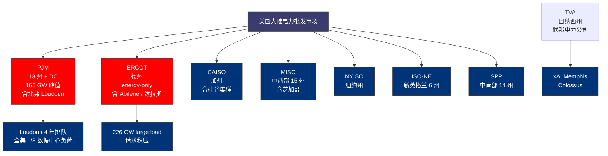
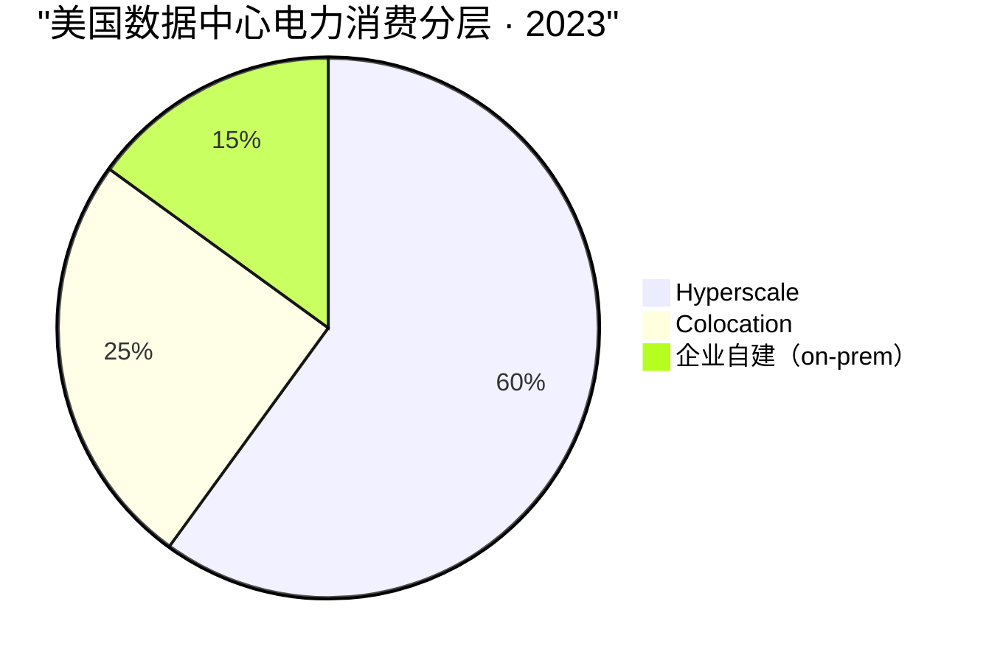
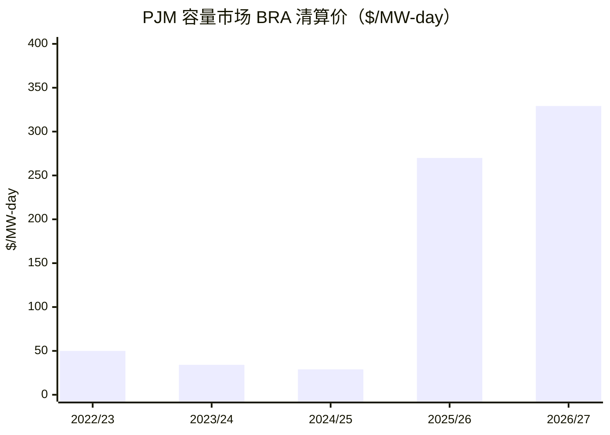
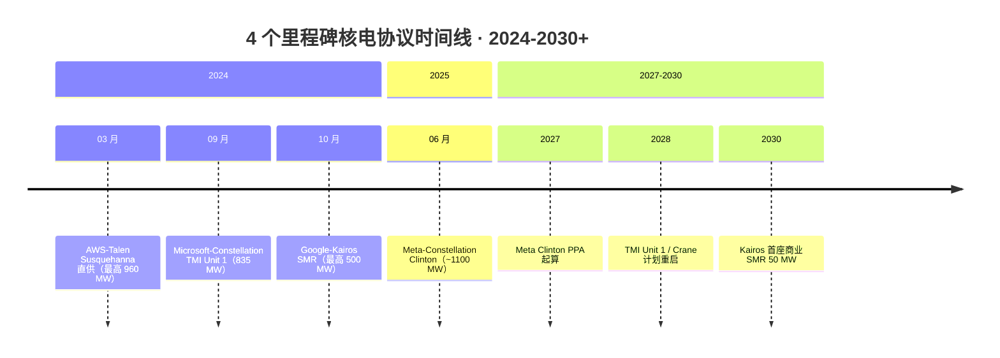
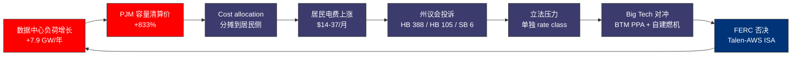

# 第 27 章 算力与电力市场：变压器、PJM、长期 PPA 与政治回压

## 本章概览

这一章把算力资本支出对电力市场的反向冲击讲透。第 10 章「钢筋水泥不是瓶颈，电是」给的是产业链画面里电力这一节的现状——变压器在哪里、[PJM](https://www.pjm.com/) 是什么、Loudoun 4 年排队为什么发生；第 14 章「缓解之后」给的是 2027 后电力作为新硬约束的预警；本章接第 10 章和第 14 章没展开的下半场——**电力市场被算力资本支出反向改写之后，发生在批发市场、企业级 PPA 市场、各州议会、居民电费账单上的连锁反应**。

第 10 章与第 27 章的边界：第 10 章处理作为算力产业链一环的数据中心电力，第 27 章处理作为宏观经济外溢的算力 vs 电力市场。同一句 PJM 容量市场清算价 +800%，在第 10 章是数据中心选址成本输入，在第 27 章是普通居民电费账单上涨输入。

本章有两个核心判断。**议题 7（电力是不是真瓶颈）**——核心 IDC 集群 2026-2028 是真瓶颈，全国 / 全球层面有冗余；第 10 章给物理基础、第 14 章给次生硬约束位，本章把为什么瓶颈是局部的、政治后果是全局的讲透。**议题 8（SMR 2030 前能否对算力供电有意义）**——2030 前几乎无意义，Big Tech 的 SMR PPA（Google-Kairos / Amazon-X-energy / Microsoft-TMI 重启）是 2032+ 的故事，对 2026-2029 这一轮资本支出周期的算力供电杯水车薪。此外 27.10 给出 [GE Vernova](https://www.gevernova.com/) / [Vistra](https://www.vistracorp.com/) / [Constellation Energy](https://www.constellationenergy.com/) / Eaton 四家 AI 电力链卖铲人的受益规模量化，严格 commentary-only。

一个卖方研报与产业号几乎不写的变量是政治回压（27.6）：弗吉尼亚 / 德州 / 俄亥俄 / 乔治亚四州的居民电费上涨曲线、立法反应、Dominion Energy / Duke Energy 的 cost allocation 之争。算力资本支出不是单纯产业链问题，它正在变成普通用户的钱包问题——这是 2026 年之后会持续放大的政治变量。

把美国 7 个主要 ISO / RTO 与对应的核心数据中心集群画一张关系图，是本章讨论的地理坐标系：

数据时点：本章 data_cutoff 2026-05。PJM 容量拍卖取最近两次 BRA 结果（2025/26 delivery year @ \$269.92/MW-day、2026/27 delivery year @ \$329.17/MW-day）。企业级 PPA 取截至 2026-05 的公开协议。SMR 时间表口径敏感（NRC 审批 vs 首堆通电 vs 实际并网三层不同），按各家公司公告与 NRC 公开记录并列呈现。

## 27.1 美国数据中心电力消费的长序列

把美国数据中心电力消费的长序列拉出来，是本章所有讨论的物理基础。

LBNL 2024 年 12 月发布的《2024 United States Data Center Energy Usage Report》是这一序列里口径最清晰的一手数据。LBNL 给出：2014 年美国数据中心电力消费约 58 TWh，占全美电力消费约 1.9%；2018 年约 76 TWh，占比约 1.9%；2023 年约 176 TWh，占比约 4.4%；2028 年预测区间 325-580 TWh，占比 6.7-12.0%。区间宽度反映对 AI 工作负载渗透速度的不同假设。

把 LBNL 序列翻译成增量节奏：2014-2018 年的 4 年里数据中心电力消费几乎平稳，年化增长不到 1%；2018-2023 年的 5 年里翻倍多一点，年化增长 18%；2023-2028 年的 5 年里再翻 2-3 倍，年化增长 13-27%。两次斜率跳变——第一次在 2018 年左右，对应公有云的大规模 scale-out；第二次在 2022 年底 ChatGPT 之后，对应 AI 训练 + 推理算力的非线性爬升。第二次斜率跳变的物理表现就是本章后面所有故事的起点。

LBNL 序列与其他口径需要并列对照。Goldman Sachs 2024 年 5 月《Generational growth: AI, data centers and the coming US power demand surge》给美国数据中心电力消费 2030 年占全美 8%的中位预测，明显低于 LBNL 12% 上限；IEA 2025 年 4 月《Energy and AI》给全球口径：数据中心电力消费 2024 年约 415 TWh、2030 年约 945 TWh，期间 CAGR 约 15%，AI 相关 2030 年达到约 400 TWh、是 2024 年（约 100 TWh）的 4 倍。三个口径方向一致，但 2030 年具体数字差异 30-50%，源于对 AI 渗透速度与单 token 推理效率的不同假设。本章后续默认采用 LBNL 中位区间。

LBNL 报告把数据中心电力消费分成三层：企业自建机房（on-premises）、大型托管数据中心（colocation）、大型 hyperscale。三层 2014 年大致均匀分布，到 2023 年 hyperscale 占比从约 15% 上升到约 60%，是数据中心电力增长的绝对主力——这意味着电力消费增长在地理上高度集中在超大规模云厂的 10-15 个核心选址（北弗 / 凤凰城 / 哥伦布 / 达拉斯 / 圣安东尼奥 / 芝加哥 / 硅谷 / 俄勒冈 Hillsboro / 爱荷华 Council Bluffs / 内布拉斯加 Omaha），而不是均匀散布在 50 个州。

> 数据来源：LBNL《2024 United States Data Center Energy Usage Report》。

这个地理集中是政治回压的物理底层——电力消费增长是全国性趋势，电费上涨的痛感是地方性的。

## 27.2 PJM 容量市场结构与 800% 涨价

把美国电力批发市场的结构铺一遍，是本章的术语基础。

美国大陆电力批发市场不是统一的全国市场，而是 7 个区域 ISO/RTO（Independent System Operator / Regional Transmission Organization）。其中 PJM Interconnection（覆盖宾夕法尼亚 / 新泽西 / 弗吉尼亚 / 俄亥俄等 13 个州及华盛顿特区，年负荷峰值约 165 GW）是全球最大的电力批发市场，覆盖人口约 6700 万，包含全美最大的数据中心集群——北弗吉尼亚 Loudoun。其他主要市场包括 [ERCOT](https://www.ercot.com/)（Electric Reliability Council of Texas，覆盖德州约 90% 负荷）、CAISO（California ISO）、MISO（Midcontinent ISO）、NYISO、ISO-NE、SPP。

每个区域 ISO 运行三类市场：

1. **能源市场**（energy market）：日前与实时市场，每 5-15 分钟出清一次实时价格（locational marginal price，LMP）。这是度电单价的来源。
2. **容量市场**（产能 market）：保证 3 年后有足够的可用发电容量，不是实际发出的电而是备用承诺。PJM 的容量市场叫 Reliability Pricing Model（RPM），每年做一次 Base Residual Auction（BRA），为 3 年后的 delivery year 锁定容量。这是本章主角。
3. **辅助服务市场**（ancillary services market）：调频、备用、电压支持等，规模小但对电网稳定关键。

PJM 容量市场清算价的跳变是本章 27.1 长序列在批发市场层面的镜像。把 5 个 delivery year 的 BRA 清算价拉出来：

| Delivery Year | 拍卖日期 | RTO-wide 清算价（\$/MW-day） | 注 |
|---|---|---:|---|
| 2022/23 | 2021-06 | \$50.00 | 平稳期 |
| 2023/24 | 2022-06 | \$34.13 | 平稳期 |
| 2024/25 | 2023-06 | \$28.92 | 平稳期 / 历史低点 |
| 2025/26 | 2024-07 | \$269.92 | 同比 +833% |
| 2026/27 | 2025-07 | \$329.17 | 同比 +22% / 全 LDA 触及行政价格上限 |

> 来源：PJM 官方 BRA 结果报告，PJM Markets and Operations / RPM 公开数据；2025/26 与 2026/27 delivery year 拍卖结果与媒体广泛报道一致（S&P Global Commodity Insights 2024-07-30 与 Utility Dive 2025-07 多篇报道引用同一数字）。RTO-wide 是 PJM 各 LDA（Locational Deliverability Area）的加权口径，部分 LDA 清算价更高（2025/26 BGE 区即马里兰州 Baltimore Gas & Electric 区域清算价 \$466.35/MW-day、Dominion 区清算价 \$444.26/MW-day，分别触及各自分区上限；ATSI 区按 RTO-wide \$269.92/MW-day 清算）。

从 \$28.92 到 \$269.92 的一年跳变是 +833%。把清算价转换成 PJM 总年度容量成本：PJM 一年的容量责任（产能 obligation）约 135-145 GW，\$269.92/MW-day × 365 天 × 135 GW ≈ \$133 亿，而 2024/25 delivery year 的总容量成本约 \$22 亿。差额 \$111 亿对应 PJM 13 个州约 6700 万人口的电费账单——这是 27.6 政治回压的直接源头。

把 5 个 delivery year 的清算价画成柱状图，斜率跳变发生在 2024/25 → 2025/26 之间——这一年正好对应北弗 Loudoun 数据中心集群第一波 100 MW+ 项目通电节点：

> 数据来源：PJM 官方 BRA 结果报告。2025/26 同比 +833%，2026/27 全 LDA 触及行政价格上限。

PJM 自家的 Independent Market Monitor（Monitoring Analytics，IMM）2024-08《Analysis of the 2025/2026 RPM Base Residual Auction》把价格跳变归因拆开：约 35% 来自数据中心负荷增长导致的 net load forecast 上调（约 7.9 GW data center 增量负荷被吃进 2025/26 obligation）、约 40% 来自电厂退役加速、约 25% 来自容量市场规则修订（reliability requirement 上调与产能 emergency transfer limit 下调）。IMM 在同一份报告里的反事实测算：剔除 2025/26 delivery year 里 7.9 GW 的数据中心增量负荷，PJM 容量总成本下降约 \$93 亿、降幅约 64%。这是把算力资本支出推高居民电费的因果关系第一次正式量化的官方文件。

2026/27 delivery year 的拍卖（2025-07 进行）清算价进一步抬到 \$329.17/MW-day、同比 +22%——这次等于 PJM 2025 年初引入的行政价格上限（CONE × 1.5，CONE = Cost of New Entry，即新建一台合规调峰燃机所需的年化净成本），全 LDA 全部触及上限，而不是出清在自由竞争点。这意味着 PJM 容量市场已经从价格信号反映稀缺切换到价格被行政上限压制 + 稀缺仍在外溢的状态。IMM 在 2025-08 的报告里直接写"the auction did not produce a market-clearing outcome consistent with competitive pricing"——这是 IMM 第一次在年度报告里使用"the market is not clearing"的表述。

把 PJM 拉到与其他 ISO 对照：ERCOT 没有强制容量市场（采用 energy-only 设计），2024-2026 实时市场尖峰电价多次触及 \$5,000-\$9,000/MWh 上限；MISO 与 SPP 同期容量市场也出现 +50% 至 +100% 抬升；CAISO 受 BTM（behind-the-meter）storage 与分布式光伏对冲，容量价格相对平稳。

PJM 的特殊性在于把全美最大数据中心集群（北弗 Loudoun）+ 全美最大燃煤退役波（俄亥俄 / 西弗吉尼亚）+ 全美最严的可靠性责任规则放在同一个容量市场里出清——价格信号必然是最先爆出来的那个。

## 27.3 4 个里程碑核电协议

PJM 容量市场把价格信号传到 Big Tech 之后，Big Tech 的反应是绕过容量市场、自己签长期 PPA 锁定电力。2024-2025 年集中爆发的 4 个核电协议是这一波绕过电网策略的里程碑。

**协议 1：Microsoft-Constellation Three Mile Island Unit 1 重启**

签约时点：2024-09-20。Constellation Energy 公告。结构：Constellation 重启 Three Mile Island Unit 1（重命名为 Crane Clean Energy Center，纪念 Constellation 前 CEO Chris Crane），Microsoft 签 20 年全量包销 PPA（power purchase agreement，电力购买协议）。容量约 835 MW。预计重启时点 2028 年（取决于 NRC 许可与州 / 地方许可）。Constellation 同步申请将运营许可延展到至少 2054 年。

须严格区分 Unit 1 与 Unit 2。1979 年 TMI 事故发生在 Unit 2，导致 Unit 2 至今封存。Unit 1 是独立反应堆，事故后继续运行至 2019 年，因经济原因关闭（不是技术 / 安全原因）。本次重启的是 Unit 1。媒体普遍把这件事说成 Three Mile Island 重启——本章统一采用 Constellation 官方表述 TMI Unit 1 / Crane Clean Energy Center 重启。

**协议 2：AWS-Talen Susquehanna 核电直供**

签约时点：2024-03 公告（Talen Energy 8-K，来源：SEC EDGAR）。结构：Talen Energy 持有的 Susquehanna 核电站（约 2.5 GW）旁的 Cumulus 数据中心园区由 AWS 收购，约定 Talen 为 AWS 数据中心提供最高 960 MW behind-the-meter 直供（不经过 PJM 电网），分阶段从 300 MW 起步逐步加到 960 MW。

协议的关键在 behind-the-meter 结构——AWS 直接从核电站取电、不走 PJM 输电网，因此不需要向 PJM 缴纳传输费 / 容量责任分摊。2024-11 FERC（Federal Energy Regulatory Commission，美国联邦能源监管委员会）以 2-1 投票否决了 Talen-AWS 的 Interconnection Service Agreement（ISA）修订。否决逻辑：FERC 认为 behind-the-meter co-located 数据中心从核电站直接取电、不分摊 PJM 公共传输基础设施成本，会让其他 PJM 用户承担本应由 AWS 承担的网络成本。这个否决创下监管先例。Talen 与 AWS 2025 年提交了修订后的 ISA（增加 grid services 与 cost sharing 条款），到 2026-05 仍在 FERC 审议中——监管约束本身可以成为瓶颈，而不只是物理产能。

**协议 3：Google-Kairos SMR 协议**

签约时点：2024-10-14。Google 与 Kairos Power 联合公告。结构：Google 承诺采购 Kairos Power SMR 集群最高 500 MW 电力，首座 SMR 计划 2030 年并网，后续陆续扩展到 2035 年。Kairos Power 的 first-of-a-kind 反应堆 Hermes（35 MWe 示范堆，氟盐冷却高温堆 KP-FHR 技术）已在田纳西州 Oak Ridge 开建。

须严格区分 SMR 技术示范与 SMR 商业发电。Hermes 是技术示范堆（不并网商业供电），第一座并网的 Kairos 商业 SMR 是计划 2030 年的项目。Google 的 500 MW 承诺分布在 2030-2035 年的多座 SMR 上。从 2030 年第一座 50 MW 商业并网到 500 MW 全部到位，Google 的 SMR 电力供给主要在 2030 年代中后期兑现——对 2026-2029 这一轮 AI 算力资本支出周期的电力供应没有任何帮助。这是议题 8 论证的核心数据点。

**协议 4：Meta-Constellation Clinton Energy Center**

签约时点：2025-06。Meta 与 Constellation 公告。结构：Meta 签 20 年 PPA 包销 Constellation 的 Clinton Energy Center 单堆（约 1100 MW）的环境属性，从 2027 年 6 月起延续到 2047 年。这个 PPA 不是物理直供（Clinton 仍向电网售电），但 Meta 为 Clinton 的非碳排放属性付费、用于匹配 Meta 数据中心的 24/7 净零电力承诺。

24/7 net zero（24/7 净零，每小时电力消费匹配每小时无碳电力供给）是 Google 2020 年首次提出、Microsoft / Meta 2022-2023 跟进的承诺。与早期年度抵消不同，24/7 net zero 要求每一小时数据中心实际消耗的电力都对应一份当时同步发电的无碳电力。这个口径让 Big Tech 必须签长期 baseload 无碳电力（核电 / 地热 / 水电 / 配储 BESS 的太阳能光伏），而不是只买便宜的中午集中峰值太阳能 PPA。Meta 同期与 Vistra 谈 Comanche Peak 核电站（德州 Glen Rose，2 unit 合计约 2,400 MW，原 NRC 运营许可分别至 2030 年 2 月与 2033 年 2 月，2024-07-30 NRC 批准 license renewal 将 Unit 1 展延至 2050-02、Unit 2 展延至 2053-02）的 PPA，截至 2026-05 谈判未公开签订；Vistra 自己有 5 GW data center pipeline 在筹备。

把 4 个协议拼起来：

| 协议 | 签约时点 | 容量 | 期限 | 直供 / 包销 | 兑现时点 |
|---|---|---:|---:|---|---|
| Microsoft-Constellation TMI Unit 1 / Crane | 2024-09-20 | 835 MW | 20 年 | 包销 + 重启 | 2028（取决于 NRC） |
| AWS-Talen Susquehanna | 2024-03 | 最高 960 MW | 数十年 | behind-the-meter 直供（FERC 受阻）| 2024 已部分 + 待 ISA 修订 |
| Google-Kairos SMR | 2024-10-14 | 最高 500 MW | 至 2035+ | grid 包销 + SMR 新建 | 2030 首堆 50 MW，2035 全量 |
| Meta-Constellation Clinton | 2025-06 | 约 1100 MW | 20 年 | 环境属性包销 | 2027-06 起 |

> 来源：各公司官方公告，时点与容量按公告原文。

四个协议的共同特征是 PPA 期限从历史上典型的 5-10 年拉到 20+ 年——这是企业级 PPA 市场的结构性变化。

把四个协议按签约时点排到时间线上，加上预计的兑现窗口，可以看到 2024-2026 集中爆发、2027-2030 才陆续物理兑现的相位差：

> 数据来源：各公司官方公告。

## 27.4 企业级 PPA 期限与规模拉长

历史上企业级电力 PPA 的典型期限是 5-10 年，规模在 100-500 MW，对应一座中型数据中心或一个区域的 5-10 年电力对冲。2024-2026 年这两个数字双双跳变。

期限拉长的物理原因有三：(1) 核电 / SMR 项目本身的资本回收周期决定 PPA 期限下限——核电站重启资本回收期 15-25 年、SMR FOAK 20+ 年，Big Tech 想拿到核电直供必须签足够长的 PPA 让发电方算得清账；(2) AI 数据中心服役周期 15-20 年（拿地到通电 4-6 年、建成后 15-20 年），15-20 年资产匹配 15-20 年 PPA；(3) 24/7 净零承诺要求每小时匹配，必须签 baseload PPA（核电 / 地热），baseload PPA 期限就是这些资产的回收周期。

规模拉大的物理原因有二：(1) 单个 hyperscale 园区的电力需求从 100 MW 级跳到 1 GW 级——Loudoun Equinix DC11 园区约 50 MW；2024 后新建的 Crusoe Abilene 园区 900 MW、Stargate Abilene 据公开规划 ≥1.2 GW、Meta Hyderabad 据公开规划 1.5 GW、xAI Memphis Colossus 已上线 150 MW + 规划扩 1 GW；(2) Big Tech 锁定 baseload 的总量目标——Microsoft 2025-2026 公开的 baseload 锁定目标约 10.5 GW，Meta 已签 + 在谈约 6 GW，Google 约 5 GW，AWS 因 FERC 否决暂停。四家合计接近 25 GW，相当于比利时（峰值负荷约 14 GW）+ 葡萄牙（约 9 GW）的电力规模。

10 个最大公开企业级 PPA（按容量排序，截至 2026-05）：

| # | 买方 | 卖方 | 资产 | 容量（MW）| 期限 | 签约时点 |
|---|---|---|---|---:|---:|---|
| 1 | Microsoft | Brookfield Renewable | 跨美 / 欧 portfolio | 10500 | 8 年滚动 | 2024-05 |
| 2 | Microsoft | Constellation | TMI Unit 1 / Crane | 835 | 20 | 2024-09 |
| 3 | Meta | Constellation | Clinton Energy Center | ~1100 | 20 | 2025-06 |
| 4 | AWS | Talen Energy | Susquehanna behind-the-meter | 最高 960 | 数十年 | 2024-03 |
| 5 | Google | Kairos Power | 多座 SMR | 最高 500 | 至 2035+ | 2024-10 |
| 6 | Amazon | X-energy | Xe-100 SMR 多座 | 最高 320 | 至 2030s | 2024-10 |
| 7 | Meta | Invenergy | Geothermal + storage | 多笔合计 ~600 | 15-20 | 2024-2025 |
| 8 | Microsoft | Helion | Fusion 商业供电（未来）| 50 | — | 2023-05（高度不确定）|
| 9 | Google | Fervo Energy | Geothermal | 多笔合计 ~400 | 15+ | 2023-2025 |
| 10 | Anthropic / Google Cloud | — | TPU 集群配套 | 公开数据不足，暂不入计数 | — | 2024-2026 |

> 来源：各公司官方公告与 sustainability report，多个 PPA 的实际价格条款未公开披露，仅按容量与期限对照。Microsoft-Brookfield 10.5 GW portfolio 是 framework agreement 而非单一资产 PPA。Microsoft-Helion fusion PPA 业内普遍认为商业可行性不确定，列出仅作完整性参考。第 10 行 Anthropic / Google Cloud 集群配套电力安排由 Google Cloud 一方对接电网与 PPA，Anthropic 未单独披露，无法计入企业级 PPA 总规模。

把 10 个 PPA 的总规模加总：仅 Big Five（Microsoft / Meta / Google / Amazon / Oracle）2024-2026 公开签订的 PPA 总规模业内估算超过 30 GW，大致等于全美 2025 年新增电力装机的 20%。Big Tech 一家把全美电力新增量的五分之一锁定走，这是市场结构层面的变化。

对应的市场含义有三条：

第一，**剩余给非超大规模云厂用户的非锁定 baseload 供给在缩小**，中型企业、传统工业用户、居民侧的电力供给方议价权下降。

第二，**电力开发商的现金流可预见性大幅提升**——Constellation / Vistra / [NextEra](https://www.nexteraenergy.com/) / GE Vernova 等公司的远期收入锁定率上升，是这些公司估值倍数 2024-2025 年系统性抬升的物理底层。

第三，**容量市场价格信号被部分削弱**——Big Tech 走双边长期 PPA 的电量越多，参与批发市场的剩余电量越少，容量市场出清的边际定价功能在弱化。这是 IMM 在 2025 年报告里强调"the market is not clearing"的另一个原因。

## 27.5 5 条物理产线合同储备

电力市场是一个由很多物理产线串起来的产业。算力资本支出把每一条物理产线都拉满了，每一条都有自己的交期。把 5 条主物理产线的合同储备与交期拉出来：

**第一条：大型变压器（power transformer）**

主供应商：GE Vernova（美国，剥离自 GE）、Hitachi Energy（瑞士 / 日本，原 ABB Power Grids）、Siemens Energy（德国）、HD Hyundai Electric（韩国）、Toshiba（日本）。交期：100-500 MVA 大型电力变压器从 24 个月（行业常态）拉长到 48-60 个月（2025-2026 实测）。变压器是数据中心园区与高压输电网之间的关键节点，没有变压器园区无法通电。GE Vernova 2025 财报披露 **Electrification 部门**（含变压器、配电、网格自动化等）合同储备约 \$40 B，同比 2023 年翻倍；变压器是该部门合同储备的最大单项。Hitachi Energy 2024 财报披露合同储备约 \$30 B。物理瓶颈在电工钢（grain-oriented electrical steel，GOES）——全球 GOES 产能集中在 JFE / 新日铁 / POSCO / 宝武 / thyssenkrupp Electrical Steel 等少数厂商，变压器制造扩产需要 2-3 年，GOES 供给扩产更慢。这是钱解决不了的瓶颈。

**第二条：低压配电（low-voltage switchgear / UPS / busway / PDU）**

主供应商：Eaton（美国）、Schneider Electric（法国）、ABB（瑞士）、Vertiv（美国）。交期从 6 个月拉长到 12-18 个月。Eaton 2025 财年披露 Electrical Americas 部门合同储备约 \$9 B，同比 2023 年增长约 50%。Schneider Electric 数据中心相关业务 organic growth 2024-2025 持续 +20% 以上。物理瓶颈在电力电子半导体（IGBT / SiC MOSFET）和铜价格上行让单位成本上升。

**第三条：燃机（gas turbine）**

主供应商：GE Vernova（H 级 / HA 级燃机美国主导）、Mitsubishi Power（9HA / M501J）、Siemens Energy（SGT-9000HL）。交期：H 级燃机（约 400-500 MW 单机）4-6 年（2025-2026 实测，来源：GE Vernova Q4 2024 法说会指引 + Mitsubishi Power 公开口径）。GE Vernova 2025 年披露重型燃机合同储备历史新高，2027-2028 出货已被预定满。物理瓶颈在高温合金（Inconel 等）和精密铸造——GE Vernova / Mitsubishi 双寡头主导，新建燃机厂周期 3-5 年。

**第四条：高压电缆（high-voltage transmission cable）**

主供应商：Prysmian（意大利）、Nexans（法国）、NKT（丹麦）、LS Cable & System（韩国）。交期：海底 HVDC 4-6 年；陆上 345 kV / 500 kV 2-3 年。Prysmian 2024 财年披露合同储备约 \$20 B。物理瓶颈在大型电缆厂产能（扩产周期 3-5 年）。

**第五条：储能（BESS，battery energy storage system）**

主供应商：Tesla（Megapack）、Fluence、Sungrow、BYD、Wartsila。交期：utility-scale BESS 12-18 个月。Tesla Megapack 2025 财年披露合同储备约 \$8 B。电池单体产能扩张快、单位成本下降明显，是 5 条产线里瓶颈最弱的一条。

把 5 条产线放在一张表里：

| 产线 | 主供应商 | 交期（2025-2026 实测）| 历史常态 | 主要瓶颈 |
|---|---|---|---|---|
| 大型变压器 | GE Vernova / Hitachi / Siemens / Hyundai / Toshiba | 48-60 月 | 24 月 | 电工钢 + 制造工艺 |
| 低压配电 | Eaton / Schneider / ABB / Vertiv | 12-18 月 | 6 月 | 电力电子半导体 + 铜 |
| 燃机（H 级） | GE Vernova / Mitsubishi / Siemens | 48-72 月 | 24-36 月 | 高温合金 + 精密铸造 |
| 高压电缆 | Prysmian / Nexans / NKT / LS / ZTT | 24-72 月 | 12-24 月 | 大型电缆厂产能 |
| 储能 BESS | Tesla / Fluence / Sungrow / BYD / Wartsila | 12-18 月 | 6-12 月 | 电池单体（瓶颈较弱）|

> 来源：各公司财报与 IR 披露 + 行业报告（Wood Mackenzie、BloombergNEF、Data Center Frontier 综合）。交期为典型 100-500 MW 项目尺度，单一项目交期受合同优先级与定制要求影响。

5 条产线的共同点：每一条都不是钱能立即解决的。变压器和燃机是 4-6 年级别的硬约束，高压电缆是 2-6 年级别的硬约束。Big Tech 不能用资本支出把这些产线在 12 个月内扩产 5 倍——这是第 10 章 / 第 14 章反复强调的电力是真瓶颈的物理底层。

但有一个细节需要点出：5 条产线的瓶颈是分级的。储能侧瓶颈最弱、低压配电其次、高压电缆 / 变压器 / 燃机最硬。这意味着 Big Tech 在 2026-2028 这个时间窗里，会优先把可以快速扩产的环节（储能、低压配电、自建燃机）拉满，作为对 4-6 年硬约束（变压器、高压电缆）的对冲。Crusoe Abilene 900 MW 燃机自建项目是这种绕过电网、自己出力策略的典型案例——燃机虽然交期 4-6 年，但比等 Dominion / Oncor 的高压输电升级（12 年以上 in PJM 部分区域）已经快得多。

## 27.6 政治回压：弗吉尼亚、德州、俄亥俄、乔治亚四州

PJM 容量市场价格抬升的成本最终落到电费账单上，而账单的承担者是 PJM 域内所有电力用户——包括数据中心、工业、商业、住宅。在 PJM 现行的容量成本分摊机制下，数据中心承担的份额按 coincident peak demand 计算，住宅用户承担的份额按 monthly peak 计算。结果是：数据中心电力消费占 PJM 总负荷约 6-8%（截至 2025 年），但容量成本增量的相当部分被分摊到了住宅与商业用户。

这是一个零和博弈，也是 2024-2026 年最具政治敏感性的产业话题之一。本节呈现四州的事实，不站任何一方。

政治回压的传导链路可以画成一条单向因果链——数据中心负荷增长推高容量市场清算价，容量成本通过分摊机制流向居民侧，居民投诉触发州议会立法，立法压力反过来约束 Big Tech 的 PPA 结构与并网通道：

**弗吉尼亚州**

弗吉尼亚是全美最大数据中心集群所在地（Loudoun + Prince William 县合计约 4 GW 数据中心负荷，占全美数据中心负荷约 1/3）。Dominion Energy 2024 IRP（Integrated Resource Plan，长期电力规划文件）显示弗吉尼亚未来 15 年电力负荷预测中数据中心占增量负荷的约 85%。Dominion 同期申请居民电费基础费率上调，2024-07 获 State Corporation Commission（SCC）批准。

弗吉尼亚州议会 2024-2025 立法 session 提交多个相关法案。HB 388（"Data Center Ratepayer Protection Act"，2024 年由 Delegate Josh Thomas 提案，2025 通过 House Labor and Commerce committee）要求 Dominion 在向数据中心客户提供电力时必须证明该负荷不会推高其他用户的电费。

HB 2027 与 SB 1107 进一步要求 Dominion 对数据中心客户单独 cost allocation。截至 2026-05 两个法案最终立法状态仍在演进，但方向明确——把数据中心从普通商业用户类别中拆出来单独定价。

JLARC（Joint Legislative Audit and Review Commission，州议会下设审计机构）2024-12《Data Centers in Virginia》测算：在 Dominion 现行 cost allocation 规则下，典型居民用户的发电与输电相关月度电费到 2040 年（按 constant / real 美元计）将比 2024 年额外增加 \$14 - \$37/月——这是把算力资本支出推高居民电费的因果关系在州级层面正式量化的官方文件。

**德州**

德州电力市场是 ERCOT，与 PJM 容量市场设计不同（energy-only），但同样面临 AI 数据中心需求冲击。ERCOT 公开的 large load 请求积压（peak load > 75 MW 的新增请求）规模达到 226 GW，其中数据中心占大头。德州州议会 2025 通过 Senate Bill 6 与相关立法，要求 ERCOT 与德州 PUC（Public Utility Commission）对 large load（≥75 MW）的并网申请加强审查，新增 transmission cost contribution 要求——大客户需要为输电基础设施升级提前支付承诺金。这是德州对数据中心绕过电网公共成本问题的回应，与 FERC 在 2024-11 否决 AWS-Talen ISA 的逻辑一致。

德州的独特性：ERCOT 不在容量市场约束下，但德州自身 reserve margin 在 2025 年夏季持续低于 NERC 推荐的 13.75% 阈值，多次进入 conservation alert，部分时段 LMP 触及 \$5,000-\$9,000/MWh。德州零售电力市场去管制（居民自选 Retail Electric Provider），政治回压表现为电力可靠性焦虑而非账单上涨指控。

**俄亥俄州**

俄亥俄是 PJM 域内煤电退役最集中的州之一。AEP Ohio（American Electric Power 俄亥俄子公司）2024-2025 年向 PUCO（Public Utilities Commission of Ohio）提交多份 cost recovery 申请，PUCO 2025 部分批准后居民月度电费 2025 年比 2024 年上涨 \$15-\$25（按家庭规模，来源：AEP Ohio 与 PUCO 公开记录）。俄亥俄州议会 2025 提案 HB 105 与 SB 65 要求 AEP Ohio 与 Duke Energy Ohio 把数据中心与传统工业用户单独 reclass。俄亥俄州的政治敏感性较弗吉尼亚低，但煤电退役 + 数据中心新增负荷的双重压力让政治回压在 2025 年明显抬升。

**乔治亚州**

乔治亚 Power（Southern Company 子公司）2024-2025 年向 Georgia PSC 提交的 large load 接入申请涉及数据中心负荷超过 7 GW。Georgia PSC 在 2024-11 批准 Georgia Power 增加 1.4 GW 天然气发电与 5 GW 输电升级，相关资本支出通过 rate base 分摊给所有用户。乔治亚州的政治回压表现为环保组织诉讼——Southern Environmental Law Center 等组织 2024-2025 多次起诉 Georgia PSC，指控批准过程未对居民电费影响做充分评估。乔治亚州议会 2025 提交 HB 1192 要求大数据中心客户单独 rate class（截至 2026-05 未通过）。

把四州拼起来，三个共同点：

第一，**政治回压集中在 cost allocation 是否合理，而不是是否要赶走数据中心**。州政府、电力公用事业、居民、数据中心运营商都接受数据中心带来 GDP 与税收的现实，争议在于电网升级成本应该由谁承担。

第二，**立法方向收敛到数据中心单独 rate class 或 transmission cost contribution**。弗吉尼亚 HB 388 / HB 2027、德州 SB 6、俄亥俄 HB 105、乔治亚 HB 1192 的核心机制都是把数据中心带来的边际成本从居民侧切割出来、由数据中心客户承担。

第三，**Big Tech 的对冲是签 behind-the-meter PPA + 自建燃机**。FERC 否决 AWS-Talen 的逻辑在物理上不能完全堵死 behind-the-meter 模式——核电站旁边的数据中心 + 燃机自建 + 园区微电网，是 Big Tech 在监管压力下的应对路径。Crusoe Abilene、xAI Memphis、Stargate Abilene 都是这种模式的代表。

政治回压是这一波算力资本支出周期中 Big Tech 没法完全用钱解决的变量。卖方研报与产业号几乎不写这一节——这件事不能给出投资标的，但本书的差异化亮点恰好在这里：算力的边际成本最终会以某种形态回到居民侧，居民侧反弹通过州议会立法 / 监管裁决 / 司法诉讼回流到 Big Tech 的资本回报率。这是 2026-2028 值得持续监测的产业变量。

## 27.7 议题 7：电力是不是真瓶颈

把议题 7 完整论证做掉。

**立场（一句话）**：核心 IDC 集群在 2026-2028 年是真瓶颈，全国 / 全球层面有冗余。

**事实层**：
1. PJM 容量市场清算价 2024/25 → 2025/26 → 2026/27 三年从 \$28.92 涨到 \$329.17/MW-day。
2. 大型变压器 2025-2026 实测交期 48-60 个月。
3. 高压输电线路 PJM 域内新建审批周期 7-12 年。
4. 北弗吉尼亚 Loudoun 县 100 MW+ 项目排队 4 年。
5. ERCOT large load 请求积压达到 226 GW。

**分析层**：把瓶颈拆解成在哪个尺度上瓶颈。

第一个尺度，**核心 IDC 集群（10-15 个城市）**。北弗 Loudoun / 凤凰城 / 哥伦布 / 达拉斯 / 圣安东尼奥 / 芝加哥 / 硅谷 / 俄勒冈 Hillsboro / 爱荷华 Council Bluffs / 内布拉斯加 Omaha——这些是超大规模云厂的核心选址，对低时延、光纤近、政策稳定、客户近有硬需求。这些选址的电力供给在 2026-2028 是真硬瓶颈，PJM 容量价格 + 变压器交期 + 高压输电审批三件事任何一件都解决不了。

第二个尺度，**美国全国**。LBNL 2024 报告预测 2028 年数据中心电力占美国总电力 6.7-12%，意味着 88-93% 的电力需求仍来自非数据中心（工业 / 商业 / 居民 / 交通）。美国 2025 年总装机约 1240 GW，其中年度退役 + 新增的净增量约 30-50 GW/年。数据中心新增负荷年化 30-40 GW（业内估算），与全美电力净增量大致匹配——意味着全国层面有承接能力，只是分布不均匀。

第三个尺度，**全球**。IEA 2025 报告全球 2030 数据中心电力 945 TWh、占全球电力消费约 3%。中东（沙特、阿联酋、卡塔尔）、北欧（瑞典、芬兰、冰岛、挪威）、东南亚（马来西亚、新加坡、泰国）、印度都在主动招商 hyperscale 数据中心。全球层面有大量未开发的低成本电力（水电 / 地热 / 中东太阳能 + 燃气），算力可以向这些地区迁移。

三个尺度的瓶颈强度从局部到全球递减：核心集群 > 全美 > 全球。这是议题 7 的核心结论——**真瓶颈与冗余共存**，取决于在哪个尺度上看。

**预测层（有假设、有边界条件）**：

预测 1：北弗 / 凤凰城 / 哥伦布等核心集群的 100 MW+ 项目通电时间在 2026-2028 仍是 4 年级别（假设：变压器交期不再恶化、PJM 审批流程不进一步收紧）。

预测 2：2028 年之后，sovereign DC（中东、东南亚、北欧）+ 美国二线城市（爱荷华、内布拉斯加、犹他、怀俄明）的新增数据中心容量会显著上升，对冲核心集群的瓶颈。这是算力地理再分布的主线（与第 10 章联动）。

预测 3：到 2030 年，全美层面的算力电力供需平衡大致恢复，但电力成本结构性抬升 30-50%（PJM 容量市场清算价 + 大型变压器交期 + 长期 PPA 锁定走的 baseload 三件事不会回到 2023 年水平）。可证伪触发条件：若 2028/29 或 2029/30 delivery year 的 PJM BRA 清算价回落至 \$100/MW-day 以下（即较 2023/24 历史低点 \$28.92 抬升不到 250%），或大型电力变压器交期回落至 30 个月内，预测 3 即被证伪。

议题 7 的反共识细节：议题 7 在公开市场已是共识——所有人都同意电力是 AI 算力的瓶颈。真正被低估的不是是不是瓶颈，而是**瓶颈带来的地理结构性后果**。卖方研报与产业号通常把电力瓶颈作为超大规模云厂资本支出上限的判断输入，但很少深入到电力瓶颈会把数据中心地理图谱重画这一层。

判断是：电力瓶颈会让算力地理在 2027-2030 年发生结构性迁移——从北弗 / 硅谷 / 凤凰城为代表的传统数据中心走廊，迁移到爱荷华 / 内布拉斯加 / 俄勒冈东部 / 怀俄明 / 北达科他为代表的低电价 + 富裕一次能源二线集群，以及中东 / 北欧 / 东南亚为代表的 sovereign AI 集群（与第 23 章联动）。这是算力资本支出周期最被低估的长期外溢之一。

## 27.8 议题 8：SMR 2030 前能否对算力供电有意义

把议题 8 完整论证做掉。表态一边倒——**2030 前 SMR 对算力供电几乎无意义**。

**事实层**：

把 SMR 主要厂商商用进度拉出来：

| 厂商 | 技术 | NRC 许可状态 | 首座商业并网时点 | 首期容量 | AI 客户 |
|---|---|---|---|---:|---|
| NuScale Power | LWR-SMR 77 MWe 模块 | 2025-05 获 VOYGR-4/6 设计许可 | 2030+（UAMPS 项目 2023 取消后无美国本土订单）| 308-462 MW（4-6 模块） | 无直接 |
| Kairos Power | 氟盐冷却高温堆 KP-FHR | Hermes 示范堆 2023-12 获建设许可 | 2030（第一座商业堆 50 MW） | 50 MW | Google |
| X-energy | 高温气冷堆 Xe-100 | NRC 设计审查进行中 | 2030 后段（首座商业堆 320 MW） | 320 MW | Amazon |
| Oklo | 钠冷快堆 Aurora | NRC pre-application 阶段（2022-01 首次 INL Aurora 申请被拒后重做；2025-07 完成 NRC readiness assessment，COLA Phase 1 计划 2025-H2 提交，截至 2026-05 仍未正式受理） | 2027-2028（first system delivery，非全功率商业并网） | 15-50 MW（单座） | DOE / 国防部 |
| TerraPower | 钠冷快堆 Natrium | 怀俄明示范堆 2024-06 开建 | 2030（first-of-a-kind 示范）| 345 MW | Berkshire Hathaway Energy |
| Westinghouse AP300 | LWR-SMR 300 MWe | NRC 设计审查 2026 启动 | 2030 后段 | 300 MW | 无直接 |
| BWXT | 微堆 mPower / Project Pele | 国防部项目 | 2030 后段 | 50-300 MW | 国防部 |

> 来源：NRC SMR Licensing Activities 公开页面 + 各公司公告综合。NuScale UAMPS 项目 2023-11 因成本失控（从 \$3.6 B 涨到 \$9.3 B）+ 订阅不足取消。Kairos Hermes 示范堆为非并网技术示范堆。Oklo 在 NRC INL Aurora 项目 2022-01 首次申请被拒绝后进入 pre-application 重做阶段，2025-07 完成 NRC readiness assessment，COLA Phase 1 计划 2025-H2 提交；截至 2026-05 Oklo 仍处于 pre-application 阶段，COLA 尚未正式受理。

**分析层**：

三个事实拼起来：(1) **SMR 首座商业并网时点下限是 2030 年**——Kairos / X-energy / Oklo / TerraPower / NuScale 没有一家给出 2030 年之前的首座商业并网承诺，Oklo "first system delivery 2027-2028"是 FOAK 系统交付而非商业并网；(2) **FOAK SMR 单座容量极小**——Kairos 50 MW、Oklo 15-50 MW、X-energy 80 MW，一个 AI hyperscale 园区电力需求 500 MW-1 GW 起步，SMR 单座连一个园区都喂不饱；(3) **FOAK 之后产能爬坡极慢**——核电监管（NRC LTO 5+ 年）+ 模块制造（首批 4-5 年）+ 选址许可 + HALEU（高 assay 低 enrichment uranium）燃料 2025-2026 供给不足，到 2035 年累计装机也只有 200-500 MW 量级。

三个事实合起来：SMR 在 2030 年首座并网时，Big Tech 的 2024-2028 资本支出周期已经过去；2035 年 SMR 累计装机量级仍然只有几 GW，对应同期超大规模云厂数据中心电力需求 200-400 GW——杯水车薪。

**预测层**：

预测 1：到 2030 年，全美 SMR 商业并网累计装机 ≤ 1 GW，对当年超大规模云厂数据中心电力供给贡献 < 1%。

预测 2：到 2035 年，全美 SMR 商业并网累计装机区间 5-15 GW（高度不确定，取决于 NRC 监管加速 + HALEU 供给 + 制造产能），对应同期超大规模云厂数据中心电力供给贡献 2-5%。

预测 3：SMR 真正成为超大规模云厂 baseload 重要来源的时点在 2035 年之后。在 2026-2034 这个时间段，SMR 是政治正确 + PR + 期权的角色，物理供电贡献接近零。

**反共识强度**：议题 8 在媒体上仍有较强的 SMR 拯救 AI 叙事。卖方研报与产业号在 2024-2025 反复讲 Oklo / NuScale 的 SMR 故事，部分财经媒体把 Microsoft-TMI / Google-Kairos / Amazon-X-energy 三个协议放在同一类。正确的看法是**把这三个协议分开看**——TMI 是重启现有大型 PWR（不是 SMR）、Kairos 是 SMR、Amazon-X-energy 是 SMR。三个协议里只有 TMI 在 2028 年有可能并网（且仍是 NRC 待批准），Kairos / X-energy 都是 2030 年之后。把 SMR 与重启核电站混为一谈是市场叙事的混淆，必须把两者分开。

议题 8 论证的最后一点：SMR 的政治意义大于物理意义。SMR PPA 让 Big Tech 在 24/7 净零承诺 + ESG 报告 + 拜登政府以来推动核电的政治正确三件事上得分；但 2030 前物理供电贡献接近零。这不是骗局——是物理时间表与资本承诺之间的预期偏差。读者在投资与产业判断时需要把 SMR 协议作为 2032+ 期权而不是 2026-2029 供给。

## 27.9 燃机自建 vs 电网托管的边际成本

把绕过电网策略的经济性算清楚。

Big Tech 在 PJM 容量价格上行 + 变压器交期 4 年 + 高压输电审批 7-12 年的三重压力下，开始在数据中心园区旁边自建燃气发电机组。Crusoe Abilene 900 MW 项目是这个策略的典型。把燃机自建 vs 电网托管的 LCOE（Levelized Cost of Electricity，平准化度电成本）对照算一遍：

假设场景（明示）：1 GW hyperscale 数据中心园区，地点假设在德州 Abilene（ERCOT 西区）；燃机自建 = 800 MW H 级燃气联合循环 + 200 MW 储能 BESS 调峰；电网托管 = 1 GW 长期 PPA + 容量责任分摊；时间窗口 2026-2030。

**燃机自建侧**（800 MW H 级燃气联合循环 + 200 MW BESS 调峰，2026-2030 假设）：H 级燃气联合循环 capex \$1,100/kW，总 capex 约 \$0.88 B；200 MW BESS capex 约 \$0.24 B（\$300/kWh × 4 hr × 200 MW）；输配电 + 接入园区 capex 约 \$0.15 B；总 capex 约 \$1.27 B、单位 \$1,270/kW。燃料成本（Henry Hub \$4/MMBtu、7,000 BTU/kWh heat rate）\$28/MWh，运维 + 排放 + capex 摊销（20 年）约 \$35/MWh。LCOE 合计约 **\$63/MWh**。

**电网托管侧**：ERCOT 远期 PPA 电价 \$50-70/MWh，容量 / reliability 分摊 \$5/MWh，输配电与监管费 \$15-25/MWh，园区 substation 接入 capex 摊销 \$5/MWh。LCOE 合计约 **\$75-105/MWh**。

两侧对照：燃机自建 LCOE 约 \$63/MWh，电网托管约 \$75-105/MWh。燃机自建在 ERCOT 西区 / 北区 2026-2030 时间窗内有 15-40% 成本优势；PJM 域内（气价上浮 + PJM 容量价格更高）成本优势更大。

但 LCOE 不是唯一变量，还有四个非成本因素：(1) **通电时间**——燃机自建 24-36 个月通电（Crusoe Abilene 已验证），电网托管在 PJM 核心区 4 年起步、高压输电审批可达 7-12 年；(2) **24/7 净零承诺**——燃机产生碳排放，电网托管 + 长期核电 PPA 在碳口径上更友好。这是 Big Tech 把 baseload 用核电锁定、用燃机自建对冲过渡期的原因；(3) **监管确定性**——FERC 2024-11 否决 Talen-AWS ISA 后，自建发电直接供数据中心需要 cost sharing 重新设计。Crusoe Abilene 的 EPC + 园区微电网 + 主网备用混合架构是当前监管下相对稳健的方案；(4) **长期资本回报**——燃机寿命 25-30 年，数据中心园区 10-15 年后重建或迁移时燃机剩余资产价值需要单独考量。

四个因素叠加后：燃机自建在快速通电 + 监管阻力低上得分；电网托管 + 长期核电 PPA 在24/7 净零 + 长期资本回报上得分。

两种策略在 2026-2030 不是替代而是组合——Big Tech 同时签长期核电 PPA（应对 2028+ baseload）+ 燃机自建（应对 2025-2028 过渡期）+ 储能 BESS（应对峰值与调频）。这是 Crusoe / xAI / OpenAI Stargate 园区燃机 + 储能 + 主网 + 长期 PPA 四件套的物理基础。本节不下哪种更好的结论，给读者一个可以套不同假设的 LCOE 框架。

## 27.10 AI 电力链受益清单

本节量化 AI 电力链卖铲人四家代表公司——GE Vernova、Vistra、Constellation、Eaton——的受益规模。本节严格遵循 commentary-only 原则：给数据、给业务结构、不下估值结论。本节末尾段落级 disclaimer 单独列。

**GE Vernova（NYSE: GEV）**

剥离自 GE 的电力业务，覆盖燃气轮机、风电、电网设备（含变压器）三块，2024 年 4 月独立上市。AI 电力链受益点：H 级 / HA 级重型燃机几乎垄断北美超大规模云厂自建燃机订单；大型电力变压器在北美市场份额前列；电网升级与高压电缆配套设备订单受益于 PJM / ERCOT 输电基础设施投资周期。FY2025 营收约 \$38 B，Total 合同储备约 \$150 B（FY2025 年末口径，Equipment 合同储备 \$64 B + Services 合同储备 \$86 B；其中 Gas Power 部门合同储备约 \$33 B、**Electrification 部门**（含变压器与配电）合同储备约 \$40 B，二者口径取自 FY2025 季度财报披露，剩余约 \$77 B 主要来自 **Wind（Offshore + Onshore）部门**与服务合同）。业内估算超大规模云厂数据中心直接订单占 Gas Power 合同储备约 30-40%（不分品类正式披露）。

**Vistra（NYSE: VST）**

美国大型独立发电公司（IPP，independent power producer），运营燃气、核电、煤电、风电、储能组合资产，主要市场在 ERCOT 与 PJM。AI 电力链受益点：Comanche Peak 双堆（2.4 GW）+ Beaver Valley + Davis-Besse + Perry 等核电资产可对接超大规模云厂长期 PPA；大型燃气 portfolio 在 ERCOT 与 PJM 容量市场出价受益于清算价上行；与 Meta、Microsoft 等超大规模云厂在谈数据中心 PPA。FY2025 营收约 \$17.7 B、Ongoing Operations 调整后 EBITDA 约 \$5.9 B，公开披露 5+ GW data center pipeline。Vistra 2024 年完成 Energy Harbor 收购（增加 4 GW 核电），是核电 + 数据中心叙事的典型受益方。

**Constellation Energy（NASDAQ: CEG）**

美国最大无碳电力生产商，运营 22 座核反应堆（约 21 GW 装机），主要市场 PJM、NYISO、MISO、ERCOT。AI 电力链受益点：现有核电资产可对接超大规模云厂长期 PPA（Microsoft-TMI Crane、Meta-Clinton 已签）；现有核电运营许可在 2024-2025 大量被申请展延至 2054+；公司 2025-2026 公开寻求在 Calvert Cliffs 等核电站现址新建 SMR 项目；与超大规模云厂的 PPA 单价业内估算高于现货市场 50-100%。FY2025 营收约 \$25.5 B、调整后运营利润约 \$4.5 B，TMI Unit 1 重启 capex 业内估算约 \$1.6 B（2024-2028，来源：Constellation FY2025 年度业绩新闻稿 + 10-K）。

**Eaton（NYSE: ETN）**

美国电力管理公司，覆盖低压配电、UPS、busway、PDU、Power Quality 等电力电子设备。AI 电力链受益点：Electrical Americas 部门超大规模云厂直接订单受益；数据中心 PDU / UPS / busway 在液冷服务器集群中需求量级抬升；业务地理与北美超大规模云厂选址重合。FY2025 营收约 \$26 B，Electrical Americas 部门营收约 \$13 B、合同储备约 \$9 B。数据中心相关订单业内估算占 EA 营收 25-35%（不分品类正式披露）。

把 4 家拼起来：

| 公司 | 业务定位 | AI 电力链受益点 | 2025 财年关键数字 |
|---|---|---|---|
| GE Vernova | 燃机 / 变压器 / 电网设备 | H 级燃机 + 变压器 + 电网升级 | 营收 \$38 B / Total 合同储备 \$150 B |
| Vistra | IPP（核电 + 燃气）| 现有核电 + 燃气 portfolio 接 PPA | 营收 \$17.7 B / EBITDA \$5.9 B / 5 GW pipeline |
| Constellation | 无碳电力生产 | 现有 21 GW 核电接超大规模云厂 PPA | 营收 \$25.5 B / Microsoft + Meta PPA 已签 |
| Eaton | 低压配电 / UPS / busway | 数据中心电力电子设备 | 营收 \$26 B / EA 部门合同储备 \$9 B |

> 来源：各公司 FY2025 10-K 与季度财报；超大规模云厂业务占比为业内估算，公司未分品类披露。

四家的共同点：业务模型从周期性发电与设备公司切换到长期合同 + 高确定性现金流。这个切换在 2024-2026 已经发生，体现在四家公司的远期收入锁定率（forward revenue under contract）系统性上升。

四家的差异化与风险一览：

- **GE Vernova**：硬件 + 服务模式，订单转化为现金流的周期 2-4 年；风险在 24/7 净零碳排放对冲（燃机侧）、变压器供给端竞争（Hitachi / Siemens Energy）、订单兑现的 capex cycle。
- **Vistra / Constellation**：长期 PPA + 现货市场 + 容量市场三层收入结构，PPA 收入可见度高；风险在 FERC 对 behind-the-meter PPA 的限制、核电监管成本、PJM 容量价格上限政策。
- **Eaton**：短交期 + 高周转模式，对季度订单敏感；风险在数据中心 capex 周期放缓、铜与电力电子半导体价格波动。

> **评论免责**
>
> 本章对 Constellation Energy / GE Vernova / Vistra / Eaton 及其他相关公司的分析与财务讨论属产业评论与方法论性质，不构成投资建议，不构成买入或卖出任何证券的推荐。**本书采用 commentary-only 模式，不做持仓披露**——读者在使用本章数据与判断时应交叉验证一手来源，并结合自身风险承受能力独立决策。数据时点截至 2026-05；后续 PJM 拍卖、各州立法与公司财报可能改变本章结论。如发现事实错误或数据失效，欢迎在 inferloop.dev 反馈勘误。

## 小结

把本章的论证链路收束到 7 句话：

第一，美国数据中心电力消费从 2018 年的 76 TWh 涨到 2023 年的 176 TWh、预测 2028 年 325-580 TWh，对应占全美电力比从 1.9% 涨到 6.7-12%。两次斜率跳变分别对应公有云 scale-out 和 AI 训练 + 推理算力爬升。

第二，PJM 容量市场清算价从 2024/25 delivery year 的 \$28.92/MW-day 涨到 2025/26 的 \$269.92、2026/27 的 \$329.17，三年八倍多跳变。PJM IMM 把约 35% 的价格涨幅归因于数据中心负荷增长。

第三，4 个里程碑核电协议（Microsoft-TMI、AWS-Talen、Google-Kairos、Meta-Constellation Clinton）把企业级 PPA 期限从 5-10 年拉到 20 年、规模从 100-500 MW 拉到 1 GW+。Big Five 2024-2026 公开签订 PPA 总规模超过 30 GW。

第四，5 条物理产线（变压器 / 低压配电 / 燃机 / 高压电缆 / 储能）2025-2026 实测交期相对历史常态 2-3 倍拉长，变压器与燃机是 48-60 月级别的硬约束。

第五，四州（弗吉尼亚、德州、俄亥俄、乔治亚）政治回压集中在 cost allocation 是否合理，立法方向收敛到数据中心单独 rate class + transmission cost contribution。这是这一轮算力资本支出周期中 Big Tech 没法完全用钱解决的变量。

第六，议题 7 的判断——核心 IDC 集群 2026-2028 是真瓶颈，全国 / 全球层面有冗余。瓶颈强度从核心集群（北弗 / 凤凰城 / 哥伦布 / 都柏林）到全美再到全球递减。瓶颈的最长期后果是算力地理结构性迁移，2027-2030 数据中心向二线集群与 sovereign DC 迁移。

第七，议题 8 的判断——2030 前 SMR 对算力供电几乎无意义。Kairos / X-energy / Oklo / NuScale 首座商业并网 2030 年起步、单座容量 50-320 MW、产能爬坡到 2035 年累计 5-15 GW，与同期超大规模云厂数据中心电力需求 200-400 GW 比是杯水车薪。SMR 是 2032+ 期权而非 2026-2029 供给。

电力市场的故事到本章为止讲完了从微观（变压器 + PJM）到中观（PPA 与受益公司）到宏观（政治回压与地理结构性迁移）的全链路。

---

> 本章来自《算力经济学》开源版 · 作者「递归客」  
> 在线阅读完整书系：[inferloop.dev](https://inferloop.dev)
