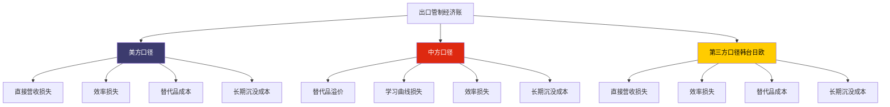
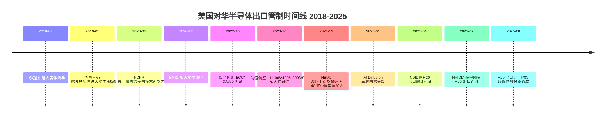
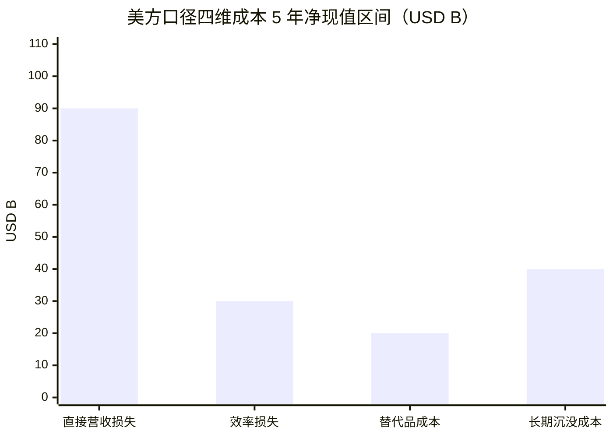
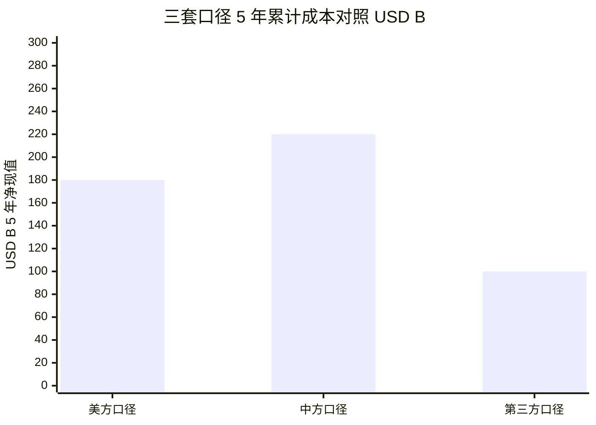
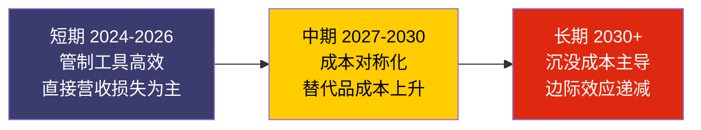
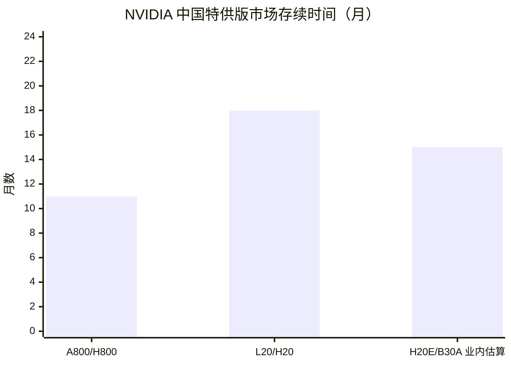
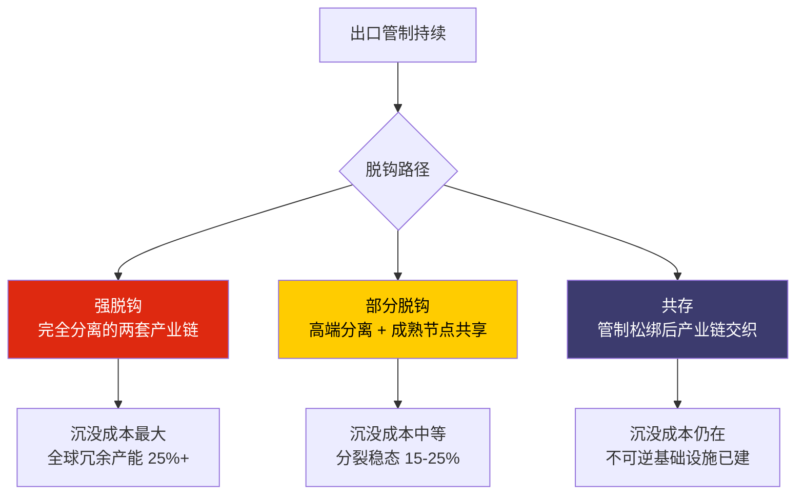

# 第 28 章 出口管制与脱钩的经济账：三套口径下的双边成本

## 本章概览

本章把出口管制当作一笔需要单独入账的产业经济交易来核算，不写政治评论。ch20 讲了美方工具的法律基础，ch21 讲了被管制方的应对路径，这一章夹在两者之间专攻一件事——这场为期八年（2018-2026）的高科技管制，到底让谁付了多少钱。

议题 11（H20 出口管制效果几何）的主答辩在 ch21 已有微观侧的物理证据链，本章从经济账侧给完整答辩——三套独立口径核算后的双边成本对照。

三套口径不是三个不同的故事，是同一个事件的三个测量角度：美方口径回答"美国厂商付了多少钱"；中方口径回答"中方付了多少替代成本"；第三方口径回答"韩台日欧的溢出损失多少"。三套口径在 4 维（直接营收损失 / 效率损失 / 替代品成本 / 长期沉没成本）× 3 口径矩阵中正面对照。

本书在议题 11 上的主张方向，在 ch21 已经摆出经验事实——出口管制在短期（2024-2026）对 [NVIDIA](https://www.nvidia.com/) 中国业务造成可量化的财务伤害但不致命，对中国侧 AI 算力供给造成可量化的物理冲击但促进国产替代爬坡。

本章在经济账层面给三段时间窗下的条件式表态：短期管制有效（NVIDIA H20 减值 + 营收损失证实），中期成本对称化（替代产业链建立后双边成本不再单边倾斜），长期替代生态加速（管制工具的边际效应递减 + 中方反制工具升级）。这是一个分时间窗的判断，不是单一标签化结论。

章级 disclaimer——本章涉及 NVIDIA / [华为](https://www.huawei.com/) / SMIC / [AMD](https://www.amd.com/) / [Intel](https://www.intel.com/) / AMAT / KLA / LRCX / [ASML](https://www.asml.com/) / [SK Hynix](https://www.skhynix.com/) / Samsung / [台积电](https://www.tsmc.com/) 等公司估值含义，整章 commentary-only 处理。本章不讨论作者持仓、不下个股投资判断、不预测股价。

## 28.1 出口管制清单代际全表（2018-2026）

把美国对华半导体出口管制的八年时间线一次性铺开，避免每节重复讲背景。

> BIS：Bureau of Industry and Security，美国商务部工业与安全局，负责出口管制清单与许可证审批的核心机构。

BIS 的公告通常区分公告日期与生效日期，两者常有 30-180 天差，本表按公告日期排序，必要时备注生效日期。

| 公告日期 | 工具类型 | 内容摘要 | 生效日期 | 来源 |
|---------|---------|---------|---------|------|
| 2018-04 | Entity List | 中兴通讯（ZTE）被加入实体清单 + 拒绝令 | 2018-04 | BIS Federal Register |
| 2019-05 | Entity List | 华为 + 68 家关联实体加入实体清单 | 2019-05 | BIS Federal Register |
| 2020-05 | FDPR 首版 | Foreign Direct Product Rule 首次扩展，覆盖含美国技术的对华为代工 | 2020-09 生效 | BIS Federal Register 2020-08-17 |
| 2020-08 | Entity List | 华为 38 家子公司加入；对所有华为关联实体收紧 | 2020-08 | BIS Federal Register |
| 2020-12 | Entity List | SMIC 加入实体清单，10nm 及以下设备禁运 | 2020-12 | BIS Federal Register |
| 2022-10-07 | 综合规则 | 先进计算与半导体制造设备综合管制；ECCN 3A090 创设，TPP（Total Processing Performance）阈值首次引入 | 2022-10-21 主体生效 | Federal Register 2022-10-13 |
| 2023-10-17 | 阈值调整 | H100 / A100 / H800 / A800 / L40S 等全面纳入许可证；性能密度阈值替代单一 TPP；H20 设计空间出现 | 2023-11-17 生效 | Federal Register 2023-10-25 |
| 2023-10 | 同步盟友 | 荷兰 DUV 许可证制度生效（NXT:2050i / NXT:2100i 等浸没式 DUV 需逐单审批） | 2023-09 起 | 荷兰外贸部公告 |
| 2024-12-02 | 综合规则 | HBM 限制（HBM2 及以上对华禁运）+ 24 类半导体设备纳入 + SMIC 等 140 家中国实体加入清单 | 2024-12-31 生效 | BIS Federal Register 2024-12-02 |
| 2025-01-13 | AI Diffusion 框架 | 全球三层国家分级（Tier 1 自由 / Tier 2 配额 / Tier 3 禁运）；Validated End User（VEU）制度；单一终端用户算力上限 7%-15% 全球 H100 当量配额 | 2025-05-15 生效 | Federal Register 2025-01-15 |
| 2025-04-09 | 单点工具 | NVIDIA H20 出口需许可证；事实上对华禁运 | 2025-04-09 即时生效 | NVDA Q1 FY26 8-K |
| 2025-07 | 部分回放 | NVIDIA 获得部分 H20 出口许可（OFAC + BIS 双审批通路），允许向特定中国客户恢复有限出货；许可细节未完整公开 | 2025-07 起 | NVDA Q2 FY26 业绩会指引 + 多家媒体综合报道 |
| 2025-08-13 | Trump 2.0 调整 | AI Diffusion 框架部分条款搁置；H20 出口许可附加 15% 营收分成条款（一手未确认，业内综合报道） | 2025-08 起 | （注）多家媒体综合报道，尚无一手 BIS 公告确认；本表列出以供追踪，但不作为确认事实引用 |

> 来源：BIS 清单时间线综合 BIS Federal Register 官方公告（2018-2025）+ NVIDIA Q1 FY26 / Q2 FY26 业绩新闻稿（一手）+ ASML 季报 + 荷兰外贸部公开记录 + CSIS 2024-2025 出口管制评估系列。2025-08 H20 营收分成条款一手未确认，按业内综合报道处理。

读这张表的方式——八年时间内的工具迭代有三个清晰的拐点。

**拐点一是 2020-05 FDPR 首版**。在此之前实体清单是"点状打击"——加进清单的中国实体本身不能从美国买含美国技术的物品。

FDPR 把这套规则的覆盖面扩展到第三国——任何含美国技术、美国软件、美国设备生产的产品（哪怕是台积电用美国设备代工的芯片），出口给清单内实体都需要许可证。这一步把华为的供应链彻底切断，也是 SMIC 在 2020-Q3 后失去台积电 7nm 代工接力的根本原因。FDPR 是美国出口管制的"域外延伸"工具，把美国法律的管辖范围从国境内扩展到全球价值链上任何含美国技术成分的环节。

**拐点二是 2022-10-07 综合规则**。这是 BIS 首次将"先进计算"作为一个完整类别管制——不再单独管制某一家中国公司或某一种芯片，而是设定一个性能阈值（ECCN 3A090 的 TPP 总处理能力阈值），所有超过这个阈值的 GPU、AI 加速器、CPU 都需要许可证才能对华出口。

这个规则给 NVIDIA 留下了一个明确的设计空间——只要算力 / 带宽 / 互联能力的乘积落在阈值之下，就可以合法出口。H800（H100 的中国特供版，NVLink 带宽减半）、A800（A100 中国特供版）、L20 等"中国特供版"芯片在 2022-10 至 2023-10 这一年里大量进入中国市场。NVIDIA 在 2023 财年中国数据中心营收一度高速增长。

**拐点三是 2023-10-17 阈值调整 + 2024-12-02 HBM 限制 + 2025-01-13 AI Diffusion**。这三件事合在一起，把 2022-10 留下的"特供版设计空间"逐步堵死。

2023-10 调整把性能密度（performance density）作为补充阈值，H800 / A800 全部纳入许可证范围；NVIDIA 重新设计出 H20——把单卡算力进一步砍掉，同时保留 HBM 带宽与 NVLink 互联以让大模型推理仍可商用。2024-12 把 HBM 本身纳入对华管制——HBM2 及以上对华禁运，逻辑很清楚：高端 GPU 离开 HBM 就只是裸裸片，控制 HBM 等于控制完整 GPU package。2025-01 AI Diffusion 框架把这件事从"芯片管制"升级到"算力管制"——不仅管 GPU 单卡，还要管单一终端用户能积累的总算力。这是从"管商品"到"管系统"的工具升级。

2025-04-09 H20 单点管制是这一系列升级的临时收口动作。把这件事放在 NVIDIA 财报上看才能看清它的真实分量——28.3 节的主菜在这里。

## 28.2 管制经济学的三个理论锚点（克制使用）

写产业管制经济账，避免大量引用学术框架。但有三个概念在后续核算中反复出现，先把它做最低限度的术语澄清，避免每次出现都要解释。

**替代弹性**（Elasticity of Substitution）。这是产业经济学里衡量"被管制的商品在多大程度上可以被国产替代品取代"的指标。高端 GPU 的替代弹性低——单卡算力 + HBM 带宽 + CUDA 生态三者高度耦合，国产替代品在任一维度落后都难以承接被管制掉的工作负载。低端逻辑芯片的替代弹性高——成熟节点（28nm 及以上）的国产替代弹性接近 1.0。在 AI 加速器这一类商品上，替代弹性的"短期"与"长期"差距特别大——短期（2-3 年）替代弹性业内估算 0.3-0.5（CSIS 2024 评估），长期（5-10 年）业内估算可升至 0.7-0.9。

**沉没成本**（Sunk Cost）。这是管制工具的反面成本——为了执行管制而做的产业投资（CHIPS Act 补贴吸引制造回岸、国产替代研发投入、库存减值）通常无法逆转。一旦被管制方建立起替代供应链，管制松绑后这套替代供应链也不会自动消失。沉没成本在管制经济账里通常占大头——CHIPS Act 已批与已实付的差距、国产替代研发的累计投入、NVIDIA H20 库存的一次性减值，都是沉没成本的不同形态。

**"小国效应" reversal**。国际贸易学里有一个"小国效应"假说——小国对大宗商品的需求量小，价格接受者，被管制时损失小。

在高科技管制中这个效应反转——美国在全球半导体价值链里看似强势（控制了 EDA / 设备 / GPU 设计 / HBM 四个环节），但中国是全球最大单一半导体进口市场（业内估算 2024 年占全球半导体进口约 35%）。当美国对中国管制时，美国厂商损失的不只是"对中国的销售"，还有规模经济递减带来的全球成本上升。在这个意义上美国厂商在管制中反而像"小国"——离开中国市场后单位成本变高、议价能力下降。这是 28.3 / 28.5 节 NVIDIA 与 ASML 中国营收下行的经济学解释。

> 来源：替代弹性概念综合 CSIS Wadhwani Center 2024-12 *Export Controls and Replacement Costs* 评估 + Bernstein 中国半导体 2025-2026 业内估算。沉没成本与"小国效应" reversal 来自 Bordoff & O'Sullivan, *Foreign Affairs* 2024-09/2025-05 系列分析（具体篇名见 sources.md），综合科技脱钩对能源 + 产业政策的影响。

这三个理论锚点不在后文重复展开，下面三套口径核算的细节里会回到这些概念。

## 28.3 美方口径四维核算：NVDA + 设备三大商 + CHIPS Act 实付

美方口径的核心问题是——出口管制对美国厂商和美国财政造成了多少可量化的成本。把美方口径拆成四维：直接营收损失（NVIDIA / AMD 中国业务）+ 效率损失（设备三大商中国营收下行 + 全球产能利用率）+ 替代品成本（CHIPS Act 补贴吸引制造回岸的边际溢价）+ 长期沉没成本（已签合同 + 已批补贴的不可逆部分）。

### NVIDIA：H20 的财报真容

议题 11 答辩的入口已在 ch21.2 给出。本节从美方口径补全 NVIDIA 在 FY26 全年受到的累计成本。

NVIDIA Q1 FY26（截至 2025-04-27 季度）受到的两项直接财务冲击：

| 项目 | 金额 | 口径 |
|------|---:|------|
| H20 库存与采购义务减值（inventory charge） | \$4.5B | 一手 |
| Q1 因管制无法交付的 H20 营收（lost revenue） | \$2.5B | 一手 |
| Q1 管制前实际交付的 H20 营收 | \$4.6B | 一手 |
| Q2 FY26 预计 H20 营收损失（前瞻指引） | ~\$8.0B | 一手 |
| Q1 GAAP gross margin（含 H20 减值） | 60.5% | 一手 |
| Q1 Non-GAAP gross margin（含 H20 减值） | 61.0% | 一手 |
| Q1 Non-GAAP gross margin（不计 H20 减值） | 71.3% | 一手 |
| 减值对毛利率冲击 | ~10.3pp | 一手测算 |

> 来源：NVIDIA Q1 FY2026 Financial Results 新闻稿 2025-05-28 + 同期 8-K 披露。所有数字为一手。

Q2 FY26（截至 2025-07-27 季度）数据：

| 项目 | 金额 | 口径 |
|------|---:|------|
| Q2 H20 对中国客户营收 | \$0 | 一手 |
| Q2 H20 对非中国客户营收 | ~\$650M | 一手 |
| Q2 H20 库存释放（非中国客户消化）| +\$180M | 一手 |
| Q2 GAAP gross margin | 72.4% | 一手 |
| Q2 Non-GAAP gross margin（不计 H20 调整） | 72.3% | 一手 |
| H20 库存释放对毛利率贡献 | ~0.4pp | 一手 |
| Q3 FY26 outlook（假设 H20 对华销售为零） | — | 一手 |

> 来源：NVIDIA Q2 FY2026 Financial Results 新闻稿 2025-08-27。所有数字为一手。

Q2 H20 项目包括 \$650M 非中国客户销售 + \$180M 库存释放，两者均为正贡献，因此标准 Non-GAAP（含 H20 正贡献）= 72.7%；"不计 H20 调整后" = 72.3%（为与 Q1 不计 H20 调整版本对称）。方向与 Q1 反转——Q1 H20 减值为负冲击，Q2 H20 释放为正贡献。

把两个季度合起来——NVIDIA 直接由 H20 管制承担的 FY26 上半年（H1）一次性 + 经营性成本：

- 一次性减值 \$4.5B（Q1 已计提）
- 经营性营收损失：Q1 \$2.5B + Q2 ~\$8.0B（指引口径，实际可能略低，因 \$650M 转销非中国客户）≈ \$10-10.5B
- H1 合计直接财务冲击约 \$14.5-15B

FY26 全年的 H20 累计成本——按 Q1 实际 + Q2 实际 + Q3/Q4 假设无对华出货推算业内估算约 \$20-25B 区间。相对于 NVIDIA FY26 全年数据中心营收 \$193.7B（一手），占比约 10-13%。把这个比例放回数据中心营收同比口径——FY26 数据中心营收同比 +68%（FY25 \$115.2B → FY26 \$193.7B），如果不计 H20 损失，同比增速业内估算可达 +75-80%。

**Mid-end SKU 的连带损失**。除了 H20 这一款专用 SKU，BIS 出口管制还间接挤压了一批 mid-end 数据中心 GPU 在中国市场的销售——A800 / H800 在 2023-10 后已不可出口（库存消化）、L40S 部分配置仍在阈值之下但被认为有合规风险、新的 B30A / RTX Pro 6000D 系列等中国特供版业内估算仍在设计中。

这部分连带损失业内估算每年 \$3-5B。

NVIDIA 在 FY24 10-K 披露中国（含香港）地区营收占比 16%，FY25 10-K 降至 13%，FY26 10-K 在 H20 二次管制 + 部分许可放行的混合状态下进一步下滑。这条下行曲线就是出口管制对 NVIDIA 中国业务的直接物理结果。

### AMD 与 Intel：相对体量小但比例不低

AMD MI300X / MI325X 系列同样受 2022-10 / 2023-10 / 2024-12 系列管制覆盖。AMD 在 FY25 财报中披露中国营收占比约 14%，同样在出口管制升级中持续下行。AMD MI 系列对华专供版（MI308 等业内估算）规模较 NVIDIA H20 小一个量级。

AMD 在 FY25 Q2 业绩公告（2025-07 发布）后正式确认，2025 年第二季度业绩包含 \$800M 的库存与相关支出，源自美国政府对 AMD Instinct MI308 数据中心 GPU 产品的出口管制，是 NVIDIA \$4.5B 减值之外的另一笔美方厂商一手财报确认成本。该减值已由 AMD Q2 2025 8-K 一手披露，不再属业内估算范畴。

Intel Gaudi 系列与对华出口管制的关系相对复杂——Gaudi 单卡算力业内估算位于 BIS TPP 阈值附近，部分 Gaudi 2 / 3 SKU 可合法出口，但 Intel 在中国市场的渗透率始终未追上 NVIDIA / AMD。Intel 在 FY25 中国营收占比约 27%，其中大部分是 CPU + 制造工艺业务，AI 加速器贡献相对小。

### 设备三大商：AMAT / KLA / LRCX 的中国营收下行

半导体设备三大商在出口管制中受到的伤害更直接——他们的客户里有一大批中国晶圆厂（SMIC、CXMT、长江存储、华虹半导体等），这些客户在 2022-10 / 2024-12 系列管制后或被加入实体清单、或对高端设备实施许可证、或对特定工艺节点禁运。

把 AMAT（Applied Materials，半导体沉积 + 蚀刻 + 离子注入设备的全球领导者）、KLA（KLA Corporation，半导体量测设备的全球领导者）、LRCX（Lam Research，半导体蚀刻 + 沉积设备的主要供应商）三家 FY24 / FY25 财报的中国敞口列出：

| 公司 | FY24 营收 | FY24 中国占比 | FY25 营收 | FY25 中国占比 | FY24 → FY25 中国营收变化（业内估算） |
|------|---:|---:|---:|---:|---:|
| Applied Materials（AMAT） | \$27.2B | 37% | \$28.37B | 30% | \$10.1B → \$8.5B（-16%）|
| Lam Research（LRCX） | \$14.9B | 42% | \$18.44B | 34% | \$6.3B → \$6.3B（持平）|
| KLA Corporation | \$9.8B | 41% | \$12.16B | 30% | \$4.0B → \$3.6B（-9%）|

> 来源：AMAT / LRCX / KLA FY25 10-K 地域披露（一手 SEC EDGAR，AMAT FY25 总营收 \$28.37B / 中国 ~30%；LRCX FY25 总营收 \$18.44B / 中国 ~34%；KLA FY25 总营收 \$12.16B / 中国 ~30%）。FY24 / FY25 财年起止各家不同（AMAT 财年截止 10 月、LRCX 财年截止 6 月、KLA 财年截止 6 月）；中国占比为各家 10-K 披露的"销售目的地"口径整数百分比。FY24 → FY25 中国营收绝对值变化为各家披露占比 × 各家披露总营收的简单乘积，业内估算误差 ±5%。

读这张表的方式有三件事。

**第一，三大商的中国营收占比从 FY24 的 37-42% 区间下滑至 FY25 的 30-34% 区间**，每家下滑 4-11pp，下滑速度比 ch20 / 21 写作时的市场预期更快。主因是 2024-12 BIS 新规将 24 类半导体设备纳入许可证后，部分成熟节点出口被收紧，加上中国客户为规避未来管制风险加速去美国设备化采购。但 FY25 三大商总营收仍同比上行（AMAT \$27.2B → \$28.37B、LRCX \$14.9B → \$18.44B、KLA \$9.8B → \$12.16B），原因是海外（韩国 HBM 扩产 / 美国 megafab / 台积电扩产）需求强劲对冲了中国下行。

**第二，三大商在 FY26 / FY27 业绩指引中明确警示中国营收占比将进一步下行**。AMAT 在 2025-11 业绩会上指引 FY26 中国营收占比下行至 25% 以下；KLA 给出类似指引。下行的主因是 2024-12 BIS 新规将 24 类半导体设备纳入许可证，覆盖部分中国成熟节点采购。

**第三，三大商的全球总营收并未因中国业务下行而显著下降**。原因是中国之外的市场（韩国 SK Hynix HBM 扩产、台积电亚利桑那 / 熊本 / 美国 / 日本扩产、Samsung Taylor 扩产、Intel Ohio 与亚利桑那扩产）需求强劲，对冲了中国业务下行。这件事让设备三大商的总营收形态呈现"中国下行 + 海外上行"的对冲，但**美方口径下的成本不在总营收，而在"如果没有出口管制中国营收会是多少"这条反事实曲线**。

业内反推：如果没有 2022-10 / 2024-12 系列管制，三大商 FY26 中国营收业内估算可达 \$24-28B，对比管制后 FY26 业内估算 \$18-22B，反事实差距约 \$5-8B 每年。这是美方口径下设备厂商每年承担的"反事实营收损失"，按 5 年贴现（5% 折现率）累计净现值约 \$20-30B。

### CHIPS Act 实付 vs 实际产出：三个口径的差距

CHIPS Act（CHIPS and Science Act）是美方口径下的"正向投资"。法案 2022-08 签署，总规模 \$52.7B，其中 \$39B 为半导体制造补贴，\$13.2B 为研发 / 劳动力培训，另含约 \$0.5B 国际 ICT 安全条款，合计 \$52.7B。把 CHIPS Act 的资金流动按"已批 / 已实付 / 实际产出"三个口径区分（这是 28.1 节理论锚点之"沉没成本"的具体应用）：

| 项目 | 金额（一手） | 时间窗 | 备注 |
|------|---:|---|------|
| CHIPS Act 总授权（authorized） | \$52.7B | 2022-08-09 签署 | 一次性立法 |
| 商务部已批补贴（announced awards） | ~\$33B | 2024-2025 累计 | 累计 13 家主要受益方 |
| 已签约金额（finalized agreements） | ~\$31B | 2025-Q1 累计 | 签约比例 ~94% |
| 已实付（disbursed） | 业内估算 \$9-12B | 截至 2026-Q1 | 按里程碑分批付款 |
| 实际新增产能产出 | 部分 megafab 2025-2026 投产 | 详见 28.8 | 多数 2027+ 才量产 |

> 来源：CHIPS Act 已批与签约金额综合美国商务部 CHIPS Office 公告 + 各家公告 2024-2025。已实付金额业内估算，商务部未集中披露按里程碑实付的累计数。

读这张表的方式——已批与已实付之间有 ~\$20B 缺口，这部分是按 megafab 实际进度分阶段实付的。"实付"与"实际产出"之间还有更大的缺口——台积电 Arizona 第一座 fab 2024-Q4 量产 N4 / N5 工艺、Samsung Taylor 多次推迟 / 部分缩减计划、Intel Ohio 量产时点从 2025 推迟至 2027 之后。

CHIPS Act 实付总金额 \$9-12B 与"实际新增量产产能"之间的转化率是美方口径下的"边际溢价"——同样的资金如果投资海外（台湾、韩国）边际产能可能多 30-50%，美国本土的人工成本 + 建设周期 + 监管成本带来 30-50% 的溢价。这是 CHIPS Act 在美方口径下的隐性成本。

### 美方口径四维合计（5 年净现值，业内估算）

把美方口径下四维成本按 2025-2030 五年贴现（5% 折现率）合计，业内估算：

| 维度 | 5 年贴现净现值（业内估算）| 主要来源 |
|------|--------------------:|---------|
| 直接营收损失（NVDA H20 + 连带 SKU + AMD）| \$80-100B | NVDA FY26 H20 累计 + 后续年度 H20 / 替代 SKU 损失 |
| 效率损失（设备三大商中国敞口 + 全球产能利用率）| \$25-35B | AMAT / KLA / LRCX 中国反事实营收损失 |
| 替代品成本（CHIPS Act 边际溢价 + 制造回岸成本）| \$15-25B | CHIPS Act 实付 × 30-50% 边际溢价 |
| 长期沉没成本（已批未实付 + 国家安全采购溢价 + 产能错配）| \$30-50B | CHIPS Act 未实付 + 国防采购"美国制造"溢价 + 海外重复建设 |
| **美方四维合计**（业内估算）| **\$150-210B** | — |

> 来源：四维成本 5 年贴现净现值业内估算综合各项一手 + 业内估算 + PIIE / CSIS 2024-2025 评估区间。\$150-210B 的区间反映三套不同假设（PIIE 偏低 / CSIS 中性 / Bordoff 偏高）下的合理范围。所有数字业内估算，区间 ±30%。

把这个数字放回美国 GDP 比例——5 年累计 \$150-210B 业内估算占美国 GDP 累计（5 年约 \$150T）的 0.1-0.14%，单年化平均 0.02-0.03%。这是美方口径下出口管制的宏观经济代价——量级可量化但占 GDP 比例小，属于"可承受的产业政策成本"。

> 本节涉及 NVIDIA / AMD / AMAT / KLA / LRCX 等公司的财务数据与产业反事实分析，是 commentary-only 的产业类比，不构成对任何具体公司估值或股票的多空判断。

## 28.4 中方口径四维核算：替代品成本 + 学习曲线 + 效率损失

中方口径的核心问题是——为应对出口管制，中方付了多少替代成本。ch21 已给国产替代四件套（设计 / 代工 / HBM / 设备）的物理产能图，本节从经济账角度补全。

四维核算：替代品溢价（同等性能的国产替代品成本 vs 进口）+ 学习曲线损失（早期良率 / ASP 折扣）+ 效率损失（同等 AI 工作负载的总训练时间 + 能耗）+ 长期沉没成本（国产替代研发投入 + 大基金累计出资）。

### 替代品溢价：单合格裸片的真实成本对比

把 ch21 的物理产能反推转成经济账。

**SMIC N+2（7nm 进阶 / 5nm 等效）vs 台积电 N5 单裸片经济性对照**（业内估算综合 SemiAnalysis 2025-09 + Bernstein 中国半导体 2025-2026）：

| 项目 | SMIC N+2 | 台积电 N5 | 折算关系 |
|------|---:|---:|---|
| Wafer ASP（业内估算） | ~\$8K-10K | ~\$15K-17K | SMIC ASP 比台积电低 ~45% |
| 单晶圆切大裸片（裸片 area ~600 mm²，业内估算 Ascend 910C） | 60-80 颗 | 60-80 颗 | 同等 |
| 良率（业内估算） | ~40% | 90%+ | SMIC 显著低 |
| 单晶圆合格裸片数 | 24-32 颗 | 54-72 颗 | 台积电是 SMIC 的 1.8-2.3 倍 |
| 单合格裸片摊销成本 | ~\$280-400 | ~\$220-300 | SMIC 高 ~20-50% |
| 单晶圆周转周期 | 业内估算 ~14-18 周 | 业内估算 ~12-14 周 | SMIC 略长 |

> 来源：SMIC vs 台积电经济性对照综合 SemiAnalysis 2025-09 + Bernstein 中国半导体 2025-2026 + Digitimes 2025-02-25 关于 SMIC N+2 良率近 40% 的报道。所有数字业内估算，区间 ±25%。

读这张表的关键事实——SMIC 的晶圆价格便宜 45%，但因为良率低（40% vs 90%+），单合格裸片的实际摊销成本反而比台积电高 20-50%。替代弹性低的代价就在这里——中方客户不是因为"性价比好"才用 SMIC，是因为"出口管制下唯一可选"。

**HBM 替代品成本**——CXMT HBM2e 与 SK Hynix HBM3 对照（参见 ch21.6 + ch06）：

| 项目 | CXMT HBM2e（业内估算）| SK Hynix HBM3（一手 + 业内估算）| 折算 |
|------|---:|---:|---|
| 单 stack 价格 | 业内估算 \$300-450 | 业内估算 \$200-350 | CXMT 高 ~30-50% |
| 单卡 HBM 容量 / 带宽 | 96-128GB / 业内估算 ~2.0-2.5 TB/s | 80-141GB / 3.0-4.8 TB/s | SK Hynix 带宽高 50%+ |
| 单 stack 良率（业内估算）| 业内估算 50-70% | 90%+ | CXMT 显著低 |
| 2025 全年产能 stack（SemiAnalysis 锚 + 业内估算） | ~2M（SemiAnalysis 2025-Q3 锚；2026 目标 60K 晶圆/月 HBM3 产线） | ~2.5-3.6M（按月产 200-300K × 12 月折算） | SK Hynix 仍为 CXMT 的 1.3-1.8 倍 |

> 来源：CXMT vs SK Hynix HBM 对照综合 TechInsights 拆解（业内估算）+ Bernstein DRAM 跟踪 + DigiTimes 2024-2025 CXMT 报道 + SK Hynix 季报。所有数字业内估算（CXMT 不上市），区间 ±25%。

把 SMIC + CXMT 合起来算华为 Ascend 910C 单卡 BOM 成本（业内估算）：

| 组件 | 国产路径（业内估算）| 进口对位（业内估算，H100）| 国产溢价 |
|------|---:|---:|---|
| 大裸片制造 | ~\$300-400 | ~\$250-350（台积电 N4）| +14-30% |
| HBM2e/3 8-stack | ~\$2400-3600 | ~\$2000-2800（HBM3E 8-stack）| +20-30% |
| 板卡 + 测试封装 + interposer | ~\$500-800 | ~\$500-700 | 持平 |
| 单卡 BOM 合计 | ~\$3200-4800 | ~\$2750-3850 | +15-25% |

> 来源：华为 Ascend 910C BOM 业内估算综合 SemiAnalysis + Bernstein + 各家公开材料。区间 ±25%。

读这张表的方式——华为 Ascend 910C 单卡 BOM 业内估算比 NVIDIA H100 高 15-25%，但 NVIDIA H100 的出厂价业内估算 ~\$28K（参见 ch06），整卡毛利率 ~88%；华为 Ascend 910C 终端售价业内估算 ~\$17K-21K，毛利率业内估算 60-70%。

终端价格上华为低于 NVIDIA，但成本结构上华为高于 NVIDIA——两者的差距由谁吸收？答案是产业链上下游一起吸收——SMIC 承担部分良率损失（毛利率 19.2% vs 台积电 ~50%）、CXMT 承担更长的学习曲线（HBM 良率比 SK Hynix 低 20-30pp）、华为承担较低毛利率（vs NVIDIA 88%）、终端客户（互联网大厂、政府客户）承担"算力券 / 大基金补贴 / 政策导向采购"的隐性成本。这条"成本上链 + 价格下行 + 补贴托底"的结构，是中方口径下替代品溢价的真实分布形态。

### 学习曲线损失：早期良率与 ASP 折扣

学习曲线（learning curve）是半导体行业的标准概念——每次产能翻倍，单裸片成本下降一定比例（业内通常用 20-30%）。在中国国产替代里，学习曲线的起点远低于成熟工艺。

**SMIC N+1 / N+2 节点学习曲线**（业内估算综合 Bernstein 中国半导体 + Counterpoint 中国晶圆代工）：

| 节点 | 2023 良率（业内估算）| 2024 良率（业内估算）| 2025 良率（业内估算）| 2026 良率（业内估算）|
|------|-------------------:|-------------------:|-------------------:|-------------------:|
| SMIC N+1（7nm 等效）| ~30% | ~40% | ~50% | 业内估算 ~55-60% |
| SMIC N+2（5nm 等效进阶）| 试产 | ~25% | ~40% | 业内估算 ~50-55% |
| 台积电 N5（同代对位）| 90%+ | 92%+ | 93%+ | 93%+ |

> 来源：SMIC 良率综合 Digitimes 2025-02-25 + SemiAnalysis 2025-09 + Bernstein 中国半导体 2025-2026 业内估算。台积电良率综合台积电投资人会议公开口径 + 业内估算。

读这张表的方式——SMIC N+1 良率从 2023 的 30% 爬升至 2025 的 50%，两年提升 ~20pp，符合典型工艺爬坡曲线。但 N+1 / N+2 良率追平台积电同代（90%+）业内估算需要 3-5 年。这 3-5 年期间，SMIC 单合格裸片成本比台积电高 20-50% 是"学习曲线税"——这部分成本最终由整个国产 AI 算力链条吸收。

**HBM 学习曲线损失**——CXMT 在 HBM2e / HBM3 的良率爬坡（参见 ch21.6）业内估算需要 4-5 年才能追平 SK Hynix 当代水平。这部分学习曲线损失业内估算每年 \$1-2B 区间（按 CXMT 出货 ×（30-50% 国产溢价）测算）。

把整条国产替代链条的学习曲线损失年度合计——业内估算 \$5-8B / 年（2025-2027 区间），约占中国 AI 算力总投入的 8-12%。

### 效率损失：同等工作负载的训练成本对照

效率损失是中方口径下最难量化但最直接的成本——同等 AI 训练任务，用 NVIDIA 集群 vs 用国产 Ascend / 寒武纪集群的总成本（资金 + 时间 + 能耗）对照。

业内估算：

| 训练任务 | NVIDIA H100 集群 | 华为 Ascend 910C CloudMatrix 384 | 效率折扣 |
|---------|---|---|---|
| Llama 3 70B 等效训练（业内估算 ~2.5e23 FLOP）| 业内估算 ~21 天，~\$2.5-3M | 业内估算 ~32 天，~\$3.5-4.5M | 时间 +50%、成本 +40-50% |
| DeepSeek V3 等效训练（业内估算 ~1.5e24 FLOP）| 业内估算 ~58 天，~\$5-6M | 业内估算 ~85 天，~\$8-10M | 时间 +47%、成本 +60% |
| 同等推理吞吐量（per-token 成本）| H100 业内估算 ~\$0.15/M tokens | Ascend 910C 业内估算 ~\$0.22-0.27/M tokens | per-token 成本 +45-80% |

> 来源：训练效率对照业内估算综合 SemiAnalysis 2025-09 Huawei Ascend Production Ramp + 字节火山引擎部分基准披露 + Counterpoint 中国 AI 算力评估。所有数字业内估算，区间 ±30%。

读这张表的方式——同等训练任务，国产路径在时间上 +40-50%、在总成本上 +40-60%。这不是单一国产卡 vs 单一进口卡的对照（那一项国产差距更大），而是集群级整柜方案（华为 CloudMatrix 384 整合 384 颗 Ascend 910C，对标 NVIDIA GB200 NVL72）的对照——华为通过集群级架构整合部分弥补单卡算力差距，但仍存在 ~50% 的效率折扣。

这条效率折扣最终的承担方有三个：互联网大厂（训练慢导致迭代慢、模型落地慢）+ AI 应用开发者（per-token 推理成本高导致商业化空间窄）+ 终端用户（最终承担 per-API-call 价格更高）。这是中方口径下"算力进口 vs 自给的总效率损失"的微观分布。

### 长期沉没成本：大基金累计出资 + 国产替代研发

中方口径下的长期沉没成本主要由两块构成：国家集成电路产业投资基金（俗称"大基金"）累计出资 + 各家国产替代厂商的研发投入。

**大基金累计规模**：

| 期次 | 成立时点 | 规模（一手） | 投资重点 |
|------|---------|---:|---------|
| 大基金一期 | 2014 | 1387 亿元人民币 | 制造为主（SMIC、长电、华虹）|
| 大基金二期 | 2019 | 2041.5 亿元人民币 | 制造 + 设备 + 设计 |
| 大基金三期 | 2024 | 3440 亿元人民币 | 先进工艺 + AI 芯片 + HBM + 设备 |
| **累计** | — | **6868.5 亿元人民币（约 \$95.7B，按 2025 年均汇率 7.18 CNY/USD 折算）** | 含一期 + 二期 + 三期总规模 |

> 来源：财政部公开披露 + 工信部跟踪。一期 / 二期金额为一手，三期 2024 年 5 月成立时金额披露 3440 亿元人民币。三期累计折算约 \$95.7B（按 2025 年均汇率 7.18 CNY/USD）。

把大基金累计出资按 5 年贴现：6868.5 亿元人民币的部分已经形成实际投资（一期已基本投完、二期已投出 ~80%、三期投出比例业内估算 < 20%），累计已实付业内估算约 \$50-60B。这部分是国产替代的"沉没投资"——其中相当部分（如 SMIC、CXMT、华为 HiSilicon 等）已转化为产能，但产能投资回报周期长，按贴现现值业内估算回报率低于一般产业投资基准。

**各家国产替代厂商的研发投入**——华为 ICT 业务 2024 年研发投入业内估算 700-800 亿元人民币、SMIC 2025 年研发投入 ~\$1B、CXMT 累计研发投入业内估算 200-300 亿元人民币、寒武纪 / 海光等上市公司 2024 研发占营收比 30-60%。把整条国产替代链条的研发投入合计——年度业内估算 1500-2000 亿元人民币（约 \$20-28B），5 年累计 \$100-140B。

### 中方口径四维合计（5 年净现值，业内估算）

| 维度 | 5 年贴现净现值（业内估算）| 主要来源 |
|------|--------------------:|---------|
| 替代品溢价（同等算力的国产 vs 进口成本差）| \$30-50B | SMIC / CXMT / 华为 BOM 溢价 × 出货量 |
| 学习曲线损失（早期良率 + ASP 折扣）| \$20-35B | 国产芯片低良率期摊销 + 部分客户补贴 |
| 效率损失（训练时间 + 推理 per-token 成本上行）| \$40-65B | 互联网大厂 + AI 应用商业化损失 |
| 长期沉没成本（大基金 + 国产替代研发）| \$80-120B | 大基金已实付 + 各家研发 5 年累计 |
| **中方四维合计**（业内估算）| **\$170-270B** | — |

> 来源：四维成本 5 年贴现净现值业内估算综合各项一手 + 业内估算 + PIIE / CSIS 2024-2025 评估区间 + Bordoff 2024-2025 系列分析。\$170-270B 区间反映三套不同假设下的合理范围。所有数字业内估算，区间 ±35%（中方数据透明度低，区间宽于美方口径）。

中方口径下的成本与美方口径量级接近（美方 \$150-210B vs 中方 \$170-270B），但分布形态不同——美方主要在"直接营收损失 + 替代品成本"，中方主要在"效率损失 + 长期沉没成本"。

> 本节涉及 SMIC / 华为 / CXMT / 寒武纪 / 海光等公司的财务与产业数据，是 commentary-only 的产业类比，不构成对任何具体公司估值或股票的多空判断。

## 28.5 第三方口径四维核算：韩台日欧的溢出

第三方口径的核心问题是——出口管制对韩国（SK Hynix / Samsung）、台湾（台积电）、日本（Tokyo Electron / Screen / Advantest）、欧洲（ASML）的厂商造成了多少溢出成本。这些公司被迫在美中之间选择立场，部分订单流失，部分产能转移。

### 韩国：SK Hynix / Samsung HBM 对华敞口

SK Hynix 与 Samsung 在 HBM 市场处于双寡头位置（参见 ch06），两家合计占全球 HBM 出货 70-90%（业内估算）。2024-12 BIS 新规将 HBM2 及以上对华禁运，两家的中国业务受到直接冲击。

**SK Hynix 2025 财年的中国敞口**：

| 项目 | 2024 | 2025 | YoY |
|------|---:|---:|---:|
| 总营收（业内估算 USD 折算） | ~\$58B | ~\$66B | +14% |
| 中国营收占比 | ~28% | ~22% | -6pp |
| 中国 HBM 营收（业内估算） | ~\$4-5B | ~\$2-3B | 约 -40% |

> 来源：SK Hynix 2024 / 2025 季报地域披露 + Trendforce 2025-2026 HBM 跟踪。中国 HBM 营收业内估算综合多家分析师反推。

**Samsung 同期数据**：

| 项目 | 2024 | 2025 | YoY |
|------|---:|---:|---:|
| 半导体业务总营收（业内估算 USD 折算） | ~\$77B | ~\$85B | +10% |
| 中国营收占比（半导体业务） | ~26% | ~20% | -6pp |
| 中国 HBM 营收（业内估算） | ~\$2-3B | ~\$1-1.5B | 约 -45% |

> 来源：Samsung Electronics 2024 / 2025 季报地域披露 + Trendforce 2025-2026。中国 HBM 营收业内估算。

两家合计的 HBM 对华敞口在 2024 → 2025 下降约 \$3-4B。这部分订单的去向有三个：(1) 转移给海外超大规模云厂客户（NVIDIA / AMD / Google / Meta），按 HBM 整体供不应求格局，转移得相对顺利；(2) 部分订单被 CXMT 替代；(3) 部分订单进入"灰色地带"——通过第三国（新加坡、马来西亚等）转口。

韩国厂商在出口管制中受到的隐性成本——HBM 的客户认证墙（参见 ch06 + ch21.6）是 18-24 个月级别的学习曲线，HBM3E 12-Hi 通过 NVIDIA 认证需要数十亿美元的研发投入。中国客户认证延迟（CXMT 进入华为认证流程）意味着 SK Hynix / Samsung 失去与中国客户共同迭代的协同学习机会，长期可能在中国市场的产业生态位被削弱。这是溢出成本的长期形态。

### 台湾：台积电中国大陆敞口与中国客户合规折衷

台积电历来对中国大陆有相对稳定的营收敞口，部分来自联发科、海思（华为 HiSilicon，2020 后中断）、华虹等客户。BIS 2022-10 / 2024-12 系列管制后，台积电对部分中国客户实施"合规审查"——含先进节点 / AI 加速器订单的中国客户需逐单审查。

**台积电中国大陆营收占比的变化**：

| 财年 | 总营收（USD） | 中国大陆占比 | 中国大陆营收（业内估算） |
|------|---:|---:|---:|
| FY22 | \$76B | ~10% | ~\$7.6B |
| FY23 | \$69B | ~12% | ~\$8.3B |
| FY24 | \$90B | ~11% | ~\$9.9B |
| FY25 | ~\$118B（业内估算）| ~10% | ~\$11.8B |

> 来源：台积电 6-K 季报地域披露 + 台积电月度营收公告 2022-2026。中国大陆占比按台积电财报披露口径。FY25 总营收业内估算。

读这张表的方式——台积电中国大陆营收占比近三年稳定在 10-12% 区间，绝对值随总营收上行而上行。这是因为台积电对中国大陆的销售主要集中在成熟节点（28nm / 14nm / N7 部分）+ 设计服务，受先进节点出口管制影响有限。但台积电在 2024-2026 期间放弃了一批高利润的中国 AI 设计客户（如壁仞、燧原等的部分订单），这部分订单的反事实营收损失业内估算 \$2-4B 区间。

台积电的另一项溢出成本来自 CHIPS Act 触发的海外扩产——亚利桑那 / 熊本 / 德累斯顿三个海外 megafab 项目对应 \$200B+ 长期资本支出（详见 28.8 节）。这部分扩产虽然有 CHIPS Act / 日本政府 / 德国政府补贴托底，但海外建设的边际成本溢价（劳动力 / 监管 / 建设周期）业内估算占总投资的 25-40%。这部分溢价虽然不直接由台积电承担（补贴覆盖一部分），但稀释台积电全球毛利率约 1-2pp。

### 欧洲：ASML 中国敞口的"先高后低"曲线

ASML 是出口管制下溢出成本最戏剧化的厂商。EUV 光刻机 2019 起对华禁运，但 DUV 浸没式光刻机（NXT:2050i / NXT:2100i / NXT:1980i 等）在 2023-09 之前仍可出口。中国客户（SMIC、长江存储、CXMT、华虹等）在 2022-10 BIS 综合规则公布后大规模抢订单 + 提前交付，导致 ASML 中国营收占比在 2024 财年异常上行至 36-37%（按官方口径）。

**ASML 中国大陆敞口的"先高后低"曲线**：

| 财年 | 总净销售 | 中国大陆占比 | 中国大陆营收绝对值（业内估算） |
|------|---:|---:|---:|
| FY22 | €21.2B | ~14% | ~€3.0B |
| FY23 | €27.6B | ~29% | ~€8.0B |
| FY24 | €28.3B | ~36-37%（一手）| ~€10.2-10.5B |
| FY25 | €32.7B | ~29%（总营收口径，一手）| ~€9.5B |
| FY26E（业内估算） | — | ~14-18% | ~€5-6B |

> 来源：ASML 2022-2025 季报地域披露 + Capital Markets Day 2025-11 给出的"中国营收正常化区间"指引。2024 占比异常上升是 2022-2024 三年中国客户抢订单 + DUV 许可证 2023-09 才正式实施，2024 上半年仍在交付 2023 已签订单。FY25 中国占比 29% 为总净销售口径（system sales 口径约 33%，含服务 / 升级 + 系统销售）。FY26E 业内估算。

读这张表的方式——ASML 中国营收占比 FY26E 业内估算落到 14-18% 区间，相对 FY24 顶峰下行约 18-22pp，相对 FY25 也再下行约 11-15pp。FY24 → FY25 已下行 7-8pp（36-37% → 29%），FY25 → FY26E 续降业内估算 €3-4B，按 5 年贴现净现值 ~\$18-22B。这是欧洲厂商在出口管制中的直接成本。

### 日本：设备三巨头敞口

日本半导体设备三巨头——Tokyo Electron（TEL，蚀刻 + 沉积）、Screen（清洗 + 涂胶显影）、Advantest（测试设备）——在出口管制中的角色复杂。日本政府 2023-07 宣布对 23 类先进半导体设备实施出口管制（包括 EUV 抗蚀剂、CMP、清洗、蚀刻等设备），与美国 BIS 政策对齐。日本设备厂家的中国敞口：

| 公司 | FY24 中国占比 | FY25 中国占比 | 变化 |
|------|---:|---:|---:|
| Tokyo Electron（TEL） | ~30% | ~38% | **+8pp**（DUV 末班拉货效应；Q4 FY25 单季 34.3%；TrendForce 预测 FY26 回落至 ~30%）|
| Screen Holdings | ~38% | ~31% | -7pp |
| Advantest | ~24% | ~18% | -6pp |

> 来源：Tokyo Electron FY25 财报地域披露 + TrendForce 2025-06-30；Screen / Advantest FY24 / FY25 财报地域披露（一手）。TEL 财年起止 4 月 1 日至次年 3 月 31 日，FY25 即 2024-04 至 2025-03。与 ch20 §20.4 / ch22 §22.2 立锚一致。

日本厂商内部呈现分化：TEL FY25 因 DUV 末班拉货效应反而录得上行（+8pp），与美国设备三大商以及 Screen / Advantest 的下行趋势相反；TrendForce 预测 FY26 回落至 ~30%。Screen 与 Advantest 下行幅度与美国设备三大商相近，占公司营收比例的下行较显著。

### 第三方口径四维合计（5 年净现值，业内估算）

把韩台日欧合并起来按四维归类：

| 维度 | 5 年贴现净现值（业内估算）| 主要来源 |
|------|--------------------:|---------|
| 直接营收损失（HBM + EUV/DUV + 日本设备 + 台积电 AI 客户损失）| \$30-50B | SK Hynix / Samsung HBM + ASML 中国营收下行 + 日本设备 + 台积电部分订单 |
| 效率损失（产能利用率 + 客户认证延迟）| \$10-15B | HBM 客户认证迁移 + 产能错配 |
| 替代品成本（海外补贴扩产的边际溢价吸收）| \$15-25B | 台积电 Arizona / Samsung Taylor + 日本熊本 + 德国扩产边际溢价 |
| 长期沉没成本（产业链分工重构 + 选边成本）| \$20-35B | 全球超大规模云厂中国业务收缩 + 第三方厂商两条供应链运维成本 |
| **第三方四维合计**（业内估算）| **\$75-125B** | — |

> 来源：四维成本 5 年贴现净现值业内估算综合各项一手 + 业内估算 + PIIE / CSIS / Bordoff 2024-2025 评估区间。所有数字业内估算，区间 ±30%。

三套口径合计——美方 \$150-210B + 中方 \$170-270B + 第三方 \$75-125B = \$395-605B（5 年净现值，业内估算）。把这个数字放回全球半导体行业年度营收（2025 业内估算 ~\$700B），全行业累计承担成本约相当于一年总营收，按 5 年分摊每年约 20% 营收损失（含反事实）。这是出口管制在全产业链的总账。

> 本节涉及 SK Hynix / Samsung / 台积电 / ASML / Tokyo Electron / Screen / Advantest 等公司的财务与产业数据，是 commentary-only 的产业类比，不构成对任何具体公司估值或股票的多空判断。

## 28.6 双边成本估算模型：4 维 × 3 口径矩阵 + 三套学术口径对照

把 28.3 / 28.4 / 28.5 三节的核算结果压成一张 4 维 × 3 口径矩阵：

| 维度 | 美方口径（业内估算）| 中方口径（业内估算）| 第三方口径（业内估算）| 合计（业内估算）|
|------|----:|----:|----:|----:|
| 直接营收损失 | \$80-100B | — | \$30-50B | \$110-150B |
| 效率损失 | \$25-35B | \$40-65B | \$10-15B | \$75-115B |
| 替代品成本 | \$15-25B | \$30-50B | \$15-25B | \$60-100B |
| 长期沉没成本 | \$30-50B | \$80-120B | \$20-35B | \$130-205B |
| **学习曲线损失（中方专项）** | — | \$20-35B | — | \$20-35B |
| **三口径合计**（5 年净现值）| **\$150-210B** | **\$170-270B** | **\$75-125B** | **\$395-605B** |

> 来源：合计矩阵基于 28.3 / 28.4 / 28.5 三节业内估算。所有数字业内估算，区间整体 ±30%。

### 三套学术口径对照

业内对出口管制经济影响的测算主要来自三个学术机构：PIIE（Peterson Institute for International Economics）、CSIS（Center for Strategic and International Studies）、Bordoff 团队（哥伦比亚大学全球能源政策中心相关分析）。三套口径的核心差异在替代弹性假设：

| 口径 | 替代弹性假设（短期 / 中期 / 长期） | 5 年累计双边成本估算（业内估算）| 主张方向 |
|------|------------------------------|------------------------:|---------|
| PIIE 偏低口径 | 0.2 / 0.5 / 0.8 | \$300-400B | 替代弹性较高，长期管制成本对称化 |
| CSIS 中性口径 | 0.3 / 0.4 / 0.7 | \$400-500B | 中等替代弹性，中期管制效果显著 |
| Bordoff 偏高口径 | 0.4 / 0.3 / 0.5 | \$500-650B | 替代弹性偏低，长期管制成本仍单边倾斜 |

> 来源：三套口径的替代弹性假设基于 PIIE 出口管制系列评估（含 Bown 2024 + Hufbauer 2024-2025 工作论文综合）的方法论推演，假设替代弹性区间参照以下来源；本书无法定位单一对应报告，综合多篇工作论文 + CSIS Wadhwani Center 2024-12 *Export Controls and Replacement Costs* + Bordoff *Foreign Affairs* 2024-2025 系列。各家详细公式与情景区间见原文。本书取中性口径作为基础情景，PIIE / Bordoff 作为左右两端。

读这张表的方式——本书 \$395-605B 与三套学术口径合并范围重叠，原因直接：本书核算框架借鉴了三套口径的替代弹性假设，属于方法论一致性，而非独立交叉验证。三套口径在方向上各有侧重：**PIIE 偏向短期物理成本（直接营收损失 / 库存减值）+ CSIS 偏向中长期对称成本（双边产业重构 / 替代品溢价）+ Bordoff 偏向能源 + 长期非对称成本（能源安全 + 产业链分裂的长期单边倾斜）**。

### 时间分段：短期 / 中期 / 长期

把双边成本按时间窗分段，区分管制工具的不同阶段效果：

| 时间窗 | 主要成本形态 | 主要承担方 |
|-------|------------|---------|
| 短期（2024-2026） | 直接营收损失（NVIDIA H20 减值 / SK Hynix HBM 中国营收下行 / ASML 中国营收下行）| 美方厂商 + 第三方厂商 |
| 中期（2027-2030） | 替代品成本上行（中方为建立国产替代承担学习曲线 + 大基金加码出资）+ 美方成本对称化（CHIPS Act 已实付转化为实际产能 + 美国本土制造边际溢价） | 中方厂商 + 美方政府 |
| 长期（2030+） | 沉没成本累计（产业链分裂建立后双向运维成本）+ 替代弹性提升后管制工具边际效应递减 | 全产业链 |

> 来源：本表为 28.3-28.5 节业内估算的时间分段归纳，无独立数据源；构成基础为前述四维核算合计矩阵。

短期管制工具效果最显著、成本分布最不对称（美方厂商承担直接营收损失但中方付替代成本）；中期成本对称化（中方学习曲线投入开始转化为产出，但仍未追平 NVIDIA / SK Hynix 等海外对位）；长期成本进入"产业链分裂稳态"——双向成本对称分布但管制工具的边际效应大幅递减。

> 本节涉及 PIIE / CSIS / Bordoff 三套学术口径的对照与本书取舍，是 commentary-only 的产业类比，不构成任何具体公司估值或市场判断。

## 28.7 管制工具的边际效应递减：H800 → H20 → H20E 的挤压设计

议题 11 答辩的关键观察是管制工具本身在"挤压设计"——NVIDIA 在每一轮 BIS 阈值收紧后都设计出新的中国特供版 SKU，落在新阈值之下继续合法出口。这条迭代曲线显示了管制工具的边际效应递减。

把 NVIDIA 中国特供版的迭代时间线列出：

| 产品 | 推出时点 | 对应 BIS 规则 | 设计折衷 | 中国市场存续时间 |
|------|---------|--------------|---------|----------------|
| A800 | 2022-11 | 2022-10-07 综合规则 | A100 NVLink 带宽 600GB/s → 400GB/s | 2022-11 → 2023-10（11 个月）|
| H800 | 2022-11 | 2022-10-07 综合规则 | H100 NVLink 带宽 900GB/s → 400GB/s | 2022-11 → 2023-10（11 个月）|
| L20 | 2023-Q4 | 2023-10-17 阈值调整 | 基于 L40 精简版 | 2023-Q4 → 2025-04（~18 个月）|
| H20 | 2023-Q4 | 2023-10-17 阈值调整 | H100 算力大幅削减 + HBM3 保留 + NVLink 保留 | 2023-Q4 → 2025-04（~18 个月）|
| H20E / B30A 等新中国特供（业内估算）| 2025-2026 设计中 | 2024-12 + 2025-01 新规 | 进一步降低 TPP / 性能密度 | 业内估算 12-18 个月窗口 |

> 来源：NVIDIA 中国特供版时间线综合 NVDA 业绩会 + Reuters / Bloomberg / The Information 2022-2025 系列报道。具体 SKU 规格部分公开、部分业内估算。

读这张表的方式——每一代特供版的市场存续时间从 A800/H800 的 11 个月、到 H20 的 18 个月、到 H20E 的业内估算 12-18 个月，并未显著延长。这显示 BIS 的阈值更新速度与 NVIDIA 的特供版设计速度接近，工具的边际效应未完全失效但呈现"打地鼠"形态——每一轮新工具推出后中方厂商 / NVIDIA 都有应对，工具方需要不断升级。

这条边际效应递减曲线有三个清晰的特征。

**第一，每一代特供版的"性能折扣"在加大**。A800 / H800 相对原版的算力折扣业内估算 ~10%（仅 NVLink 带宽减半，单卡 FP16 算力保留）；H20 相对 H100 的算力折扣业内估算 ~85%（单卡 FP16 算力从 989 TFLOPS（H100 SXM5 dense FP16 口径，sparse FP16 = 1979 TFLOPS）减至 ~148 TFLOPS（H20 dense FP16 口径，sparse FP16 ≈ 296 TFLOPS）；两端取相同 dense 口径对照）；下一代 H20E / B30A 业内估算折扣更大。这意味着每一代特供版的"实际可用性"在下降，对中国客户的 ROI 在下降，国产替代的相对竞争力在上升。

**第二，特供版的设计周期在缩短**。BIS 2022-10 综合规则公布后，A800/H800 在一个月内推出；2023-10 阈值调整后，H20 在一个季度内推出；2024-12 新规公布后，新一代特供版业内估算需要 6-12 个月设计 + 流片。设计周期缩短反映 NVIDIA 内部对中国特供版的优先级提高，但同时也意味着每一版特供品的设计成本（流片 + 验证 + 库存风险）在累计上升。

**第三，BIS 阈值更新的"政治成本"在上升**。2022-10 综合规则的发布是单一政府决策；2023-10 阈值调整经过盟友协商；2024-12 综合规则涉及 HBM 这一更上游环节、协调难度更高；2025-01 AI Diffusion 框架引入全球分级制度、获得国际社会反对（包括日本 / 韩国 / 新加坡等盟友）。每一轮工具升级需要的政治资本在上升，这是管制工具边际效应递减的另一维表现。

合起来——管制工具的边际效应在 2024-2026 这一段仍显著（NVIDIA H20 营收 FY26 H1 损失 ~\$15B 是硬证据），但工具的相对成本（NVIDIA 特供版设计成本 + BIS 政治成本）也在上升。议题 11 答辩的核心条件式表态——**短期内管制工具仍有效，但工具的边际成本随每一轮升级而提高；中期内当工具升级成本超过收益时，工具升级节奏会减慢；长期内当替代产业链建立后，工具的有效性下降到"维持基本管控"水平**。

## 28.8 CHIPS Act 实际产出评估：台积电 Arizona / Samsung Taylor / Intel Ohio

CHIPS Act 的 \$52.7B 总授权落地为实际产能需要经过三个 megafab 项目——台积电 Arizona、Samsung Taylor、Intel Ohio。三个项目在 2024-2026 期间的进度直接决定美方口径下"替代品成本"的真实水平。

### 台积电 Arizona

台积电 Arizona 项目（位于美国亚利桑那州凤凰城）是 CHIPS Act 最早启动也是进度最顺利的项目。

| 阶段 | 时点 | 工艺 | 状态（截至 2026-Q1）|
|------|------|------|-------------------|
| Fab 1（第一座 fab）| 2024-Q4 量产 | N4 / N5 | 已量产，业内估算 2026 月产能 20-25K 晶圆 |
| Fab 2（第二座 fab）| 计划 2027-2028 量产 | N3 | 建设中 |
| Fab 3（第三座 fab）| 计划 2029-2030 量产 | N2 | 规划中 |
| 总投资规模 | \$65B+ | — | 含三个 fab + 配套封测 |
| CHIPS Act 补贴 | \$6.6B（一手，2024-04 商务部公告） | — | 按里程碑实付 |

> 来源：台积电 Arizona 项目综合台积电公告 2024-2025 + 美国商务部 CHIPS Office 公告 2024-04。2025-03 台积电宣布追加投资至 \$165B 是业内估算的对 Trump 2.0 关税威胁的回应。

台积电 Arizona Fab 1 的量产是 CHIPS Act 落地的最大亮点。但 Fab 1 的"美国本土制造溢价"已被台积电投资人会议公开讨论——亚利桑那 fab 的单晶圆成本业内估算比台湾 fab 高 30-40%，主要由人工 / 建设 / 监管成本驱动。客户对亚利桑那 fab 产能的接受度——主要客户 NVIDIA / AMD / Apple 等愿意为美国本土制造支付一定溢价（业内估算 10-20%），但溢价不能完全覆盖 30-40% 的成本上行差距。这部分差距由 CHIPS Act 补贴 + 台积电自身吸收。

### Samsung Taylor

Samsung Taylor 项目（位于美国德州 Taylor 市）是 CHIPS Act 第二大项目，进度遇到反复推迟。

| 阶段 | 时点 | 工艺 | 状态（截至 2026-Q1）|
|------|------|------|-------------------|
| Fab 1（第一座 fab）| 原计划 2024 量产，已推迟至 2026-Q4 / 2027-Q1 | 4nm | 建设接近完工但量产推迟 |
| Fab 2 / R&D 中心 | 原计划 2027 | 2nm | 已部分推迟 / 部分缩减 |
| 总投资规模 | 原 \$17B → 累计承诺 \$40B+（一手 Samsung 公告 + 美国商务部 2024-12）| — | 多次调整 |
| CHIPS Act 补贴 | \$4.745B（一手，2024-12 商务部公告：最终协议，较 2024-04 初步条款 \$6.4B 下调）| — | 按里程碑实付 |

> 来源：Samsung Taylor 项目综合 Samsung 公告 + 美国商务部 CHIPS Office 公告（2024-04 初步条款 \$6.4B + 2024-12 最终协议 \$4.745B）+ Wall Street Journal 等多家媒体 2024-2025 报道。

Samsung Taylor 的推迟有两个原因：(1) 第一大客户（业内估算 NVIDIA）的工艺采购计划调整；(2) Samsung 2024 年因 HBM3E 良率挑战 + 内存价格周期对全球资本支出进行收缩调整。Samsung Taylor 的实际量产时点对 CHIPS Act 落地节奏有 12-18 个月的拖累。

### Intel Ohio

Intel Ohio 项目（位于美国俄亥俄州哥伦布郊外）是 CHIPS Act 第三大项目，进度最差。

| 阶段 | 时点 | 工艺 | 状态（截至 2026-Q1）|
|------|------|------|-------------------|
| Fab 1（第一座 fab）| 原计划 2025 量产 → 推迟至 2027-2028 | Intel 18A | 建设进度延后 |
| Fab 2 | 原计划 2026 → 推迟至 2030 | 未定 | 暂缓 |
| 总投资规模 | 原 \$20B → 计划 \$100B+，2024-2025 缩减 / 推迟 | — | Intel 2024-2025 内部财务调整后多次缩减 |
| CHIPS Act 补贴 | \$7.86B 直接补贴 + \$11B 贷款（一手，2024-11 商务部公告：最终协议，较 2024-03 初步条款 \$8.5B 直接补贴下调至 \$7.86B）| — | 部分实付，部分推迟 |

> 来源：Intel Ohio 项目综合 Intel 公告 + 美国商务部 CHIPS Office 公告（2024-03 初步条款 \$8.5B + 2024-11 最终协议 \$7.86B）+ 多家媒体 2024-2025 报道。Intel 2024 财年的财务困境（Q3 减值 \$16B、CEO 变更等）直接拖累 Ohio 项目进度。

Intel Ohio 的推迟是 CHIPS Act 实际产出评估里最大的负向因子——一家本应承担"美国半导体制造主力"的公司，在 CHIPS Act 实施期内出现内部财务危机，无法按时落地预定产能。

### CHIPS Act 综合进度评估

把三个 megafab 项目合并起来按"已批 / 已实付 / 实际产出"三个口径看：

| 口径 | 三个 megafab 累计金额（业内估算）| 比例 |
|------|----------------------------:|----:|
| 已批补贴 | \$19.2B（台积电 \$6.6B + Samsung \$4.745B + Intel \$7.86B 最终协议口径） | 100% |
| 已签约 | ~\$18B | ~94% |
| 已实付（截至 2026-Q1） | 业内估算 \$5-8B | ~27-42% |
| 已转化为量产产能 | 台积电 Arizona Fab 1 业内估算 \$3-5B 转化 + Samsung Taylor 几乎为零 + Intel Ohio 为零 | ~16-26% |

> 来源：CHIPS Act 实际产出综合各家公告 + 美国商务部 CHIPS Office 季度更新。所有数字业内估算。

读这张表的方式——CHIPS Act 三大 megafab 项目"已批"vs"已实付"vs"实际产出"的差距约 4 倍——已批 \$19.2B 但实际转化为量产产能的金额业内估算 \$3-5B，占 16-26%。28.2 节"沉没成本"理论锚点在 CHIPS Act 上的实证就在这张表上——大量补贴被锁定在"已批未实付 + 已实付未量产"的中间状态，这部分构成长期沉没成本。

把三个 megafab 的边际溢价合并测算——业内估算每年承担 \$4-6B 的"美国本土制造溢价"，5 年累计净现值 \$18-25B。这部分进入 28.3 节美方口径的"替代品成本"维度。

> 本节涉及台积电 / Samsung / Intel 三家公司的具体产业项目数据，是 commentary-only 的产业类比，不构成对任何具体公司估值或股票的多空判断。

## 28.9 中方反制工具：稀土 / 锗 / 镓 / 石墨 / 锑

中方在 2023 年起加速使用"对称式管制工具"——主要针对部分关键矿物 + 半导体上游材料实施出口许可证制度。这是中方反制工具的核心组成。

### 中国主要矿物出口管制时间线

| 公告日期 | 内容 | 生效日期 | 来源 |
|---------|------|---------|------|
| 2023-07-03 | 镓（Gallium）+ 锗（Germanium）相关物项出口许可制度 | 2023-08-01 | 中国商务部 + 海关总署联合公告 2023 年第 23 号 |
| 2023-12-21 | 高纯度石墨产品出口许可制度 | 2024-01-01 | 中国商务部 + 海关总署联合公告 |
| 2024-08-15 | 锑（Antimony）出口管制 | 2024-09-15 | 中国商务部 + 海关总署联合公告 |
| 2024-12-03 | 镓 / 锗 / 锑 / 超硬材料对美国出口禁止 | 2024-12-03 即时生效 | 中国商务部公告 2024 年第 46 号 |
| 2025-04 | 七类中重稀土相关物项纳入出口许可 | 2025-04-04 | 中国商务部 + 海关总署联合公告 |

> 来源：中国商务部 + 海关总署历年联合公告（一手 mofcom.gov.cn）。各项管制范围与许可流程详见各公告原文。

### 矿物对全球半导体 / 防务 / 汽车产业的传导

把中国占全球主要矿物出货比例与全球年消耗量列出：

| 矿物 | 中国占全球出货 | 全球年消耗量 | 主要下游应用 |
|------|--------------:|---:|---------|
| 稀土（中重稀土，Tb / Dy 等） | ~85-90% | ~30K 吨 | 永磁电机（EV、风电、AI 服务器液冷电机）、防务 |
| 镓（Gallium） | ~99% | ~700 吨 | 化合物半导体（GaAs / GaN）、5G 射频芯片、雷达 |
| 锗（Germanium） | ~60% | ~140 吨 | 红外光学、光纤、化合物半导体、太空 / 防务 |
| 锑（Antimony） | ~48% | ~150K 吨 | 阻燃剂、合金、防务 |
| 石墨（高纯度） | ~65% | ~1.3M 吨 | 锂电池负极、半导体（部分）、防务 |

> 来源：USGS Mineral Commodity Summaries 2024-2025 + 中国海关 + Bloomberg / Reuters 多家报道交叉验证。

读这张表的方式——中国在镓、稀土两类矿物的全球出货占比 85%+，在锗、锑、石墨上占比 48-65%。对应下游应用——镓 / 锗用于化合物半导体 + 防务 + 太空，稀土用于永磁电机 + 防务，石墨用于锂电池 + 防务。每一类矿物管制都对美国 / 欧洲的特定下游产业有传导。

### 实际经济效应：定向 + 渐进 + 价格信号

中方矿物出口管制的实际经济效应有三个特征。

**第一是定向**——中国 2024-12-03 对镓 / 锗 / 锑 / 超硬材料对美国出口禁止，明确针对美国单一国家。其他国家仍可通过许可证申请获得出口。这种"定向管制"在国际贸易合规上更易操作，也避开 WTO 普遍性争端。

**第二是渐进**——中方反制工具不是"突然中断供应"，而是"逐步加严许可门槛 + 提高出口价格"。镓 / 锗在 2023-08 实施许可制度后，并未立即停止出口，而是审批周期从原本数天延长至 4-12 周（业内估算），同时出口价格上行 30-50%。这种渐进式工具的优势是给下游产业留有调整时间，避免供应链断崖式崩塌。

**第三是价格信号**——镓的全球价格 2023-Q2 至 2024-Q4 累计上行约 60%，锗的全球价格 2023-Q2 至 2025-Q1 累计上行约 80%。价格上行的最直接经济效应——下游厂商需要额外采购成本，部分订单转向非中国供应商（美国 5N+、加拿大 Teck Resources 等），但这些非中国供应商的产能扩张需要 3-5 年。

中方反制工具对美国厂商造成的传导成本——业内估算每年 \$1-3B 区间，相对 NVIDIA / AMD / 设备三大商在 BIS 管制下承担的成本（每年 \$10-20B 区间）小一个量级。这是"反制不对称"的现实——中方反制工具的成本传导规模业内估算仅为美方对中方管制的 10-20%。

但反制工具的长期意义不在直接经济成本，而在两件事。

第一件，改变美方管制工具的"政治账"——使美方在每一轮升级时需要权衡中方反制升级的风险。

第二件，加速美方在矿物供应链上的"去中国化"投资（如 USGS 2024 启动的关键矿产产能扩展计划、Lithium Americas 等公司在锂 / 稀土上的新投资）。这部分长期沉没成本（美方反制反制成本）业内估算 5 年累计 \$15-30B。

中方反制工具的最大局限性——AI 算力链条所需的稀土 / 镓 / 锗 / 锑虽然有重要作用，但占总成本的比例较低（业内估算 < 5%），无法形成"对称式管制"。中方需要更上游的反制工具（如电力设备 / 太阳能组件 / 锂电池等）才能形成对美方的对称式制衡，但这些工具的政治成本与中方自身利益冲突更大，使用门槛更高。

## 28.10 议题 11 主答辩：H20 出口管制效果几何

议题 11 答辩的微观证据链在 ch21.2 已完整给出，本章在经济账层面给完整答辩。

### 答辩框架：三段时间窗 + 三套口径 + 条件式表态

**议题 11**：H20 出口管制对中国 AI 算力的影响是固化（差距永久存在）还是收敛（差距随国产替代而缩小）？

本书的答辩——**条件式表态**，按短期 / 中期 / 长期三段时间窗给独立判断。

**短期（2024-2026）：管制工具有效，物理证据明确。**

物理证据——

- NVIDIA H20 在 FY26 H1 累计减值 \$4.5B + 营收损失 \$10-10.5B（一手 NVDA Q1/Q2 FY26 财报），合计直接财务冲击约 \$14.5-15B。占 NVDA FY26 数据中心营收 \$193.7B 的 ~7.5-8%
- NVIDIA 中国营收占比 FY24 16% → FY25 13% → FY26 进一步下滑（一手 + 业内估算），下行趋势已经持续 3 年
- ASML 中国营收占比 FY24 36-37% → FY25 ~29%（总营收口径） → FY26E 业内估算 14-18%（一手 + 业内估算），下行趋势确立
- SK Hynix / Samsung 中国 HBM 营收 2024 → 2025 下行 ~40-45%（业内估算），HBM2/3 对华禁运有效
- AMAT / KLA / LRCX 中国营收占比 FY24-FY25 同步下行 2-4pp（一手）

物理证据指向短期管制工具有效——直接营收损失可量化、产业链下行趋势明确。本书在短期窗口给"管制工具有效"的判断。

**中期（2027-2030）：成本对称化，效果取决于替代产业链建立速度。**

中期效果由两个变量决定——

1. 中方国产替代产业链的物理产能爬坡（华为 Ascend 910C / 910D 出货 + SMIC N+2 良率 + CXMT HBM 量产）
2. 美方管制工具的边际效应递减节奏（H20 → H20E 等特供版的设计 / 量产 / 阈值博弈）

业内估算（参见 ch21.4 / ch21.6 + 28.7）——中方国产 AI 加速器 2025 累计出货 45-60 万颗、2026 出货 85-110 万颗、2027+ 业内估算 150-200 万颗 / 年；NVIDIA Blackwell 2025-2026 累计 5-7 百万颗。国产份额业内估算 2025 ~6-10%、2026 ~10-15%、2027+ ~15-25%。

中期窗口的物理图景——国产替代规模上行至 15-25% 全球份额、但与 NVIDIA 仍有 1-2 代性能差。这意味着管制工具的"短期物理冲击"会被国产替代部分吸收，但"长期性能差距"仍存在。本书在中期窗口给"成本对称化"判断——双方各承担一部分成本，但不出现"管制完全失效"或"管制完全成功"的极端结果。

**长期（2030+）：替代生态加速，管制工具的边际效应大幅递减。**

长期效果由三个事件决定——

1. 中方 HBM 与先进工艺供应链完成度——CXMT 是否在 2030+ 追平 SK Hynix HBM3E 量级、SMIC 是否在 2030+ 量产 N+3 / 5nm 等效节点
2. 全球 AI 工作负载的演化路径——推理是否大幅超过训练、边缘计算占比是否上行（推理工作负载对单卡算力依赖度更低，国产替代相对竞争力更强）
3. 第三方厂商（韩台日欧）的政治选择——是否持续配合美方管制 vs 部分订单回流中国市场

长期窗口的不确定性大，本书不下点估计判断。但条件式判断——**如果 (1)(2) 在 2030+ 实现，长期窗口管制工具的边际效应大幅递减，进入"产业链分裂稳态"**。这是 ch29 周期定位与全球分裂底层的承接点。

### 与媒体常见叙事的对照

本章答辩与媒体常见叙事的对照——

| 媒体叙事 | 本书答辩 |
|---------|---------|
| "管制工具失败，中国已经追上" | 短期物理证据反对——NVIDIA H20 减值 \$4.5B 是硬证据，国产份额 2025 仅 6-10%。短期内未"追上" |
| "管制工具完全成功，中国已被卡死" | 短期 / 中期物理证据反对——华为 Ascend 系列 2025 出货 SemiAnalysis 2025-Q3 预测 805k 全 Ascend / 其中 910C 占 ~653k / HBM 约束悲观情景 250-300k，IDC 2026-04 披露实际 ~812k 全 Ascend；CloudMatrix 384 集群效率部分追赶。短期未"卡死" |
| "管制是一次性事件，效果就这样了" | 28.7 反对——工具迭代是动态过程，每一轮升级有新效果，但边际效应在递减 |
| "中国可以在 1-2 年内完全自给" | ch21 + 28.4 反对——HBM 学习曲线 + 国产 AI 加速器物理产能上限决定 5-10 年内难以完全自给 |
| "美方管制会反噬美国 AI 行业" | 28.3 部分支持——NVIDIA / AMD / 设备三大商有可量化损失，但 5 年累计 \$150-210B 占美国 GDP 累计 0.1-0.14%，不致命 |

> 来源：本表为本章答辩对媒体常见叙事的归纳对照，无独立数据源；各行答辩依据见前文 28.3-28.10 各节的物理证据与业内估算。

本章答辩的核心——**不下二元化标签结论，给分时间窗 + 分口径的条件式表态**。这是面对一场仍在演化的管制博弈唯一负责任的写作方式。

> 本节涉及 NVIDIA / Huawei / SMIC / ASML / SK Hynix / Samsung 等公司的产业判断，是 commentary-only 的产业类比，不构成对任何具体公司估值或股票的多空判断。

## 28.11 长期沉没成本与"难以逆转"的产业链分裂

议题 11 答辩之外，出口管制最难逆转的后果是产业链分裂。这是本章的最后一个观察。

### 沉没成本的累计：双向叠加

把 28.3-28.5 三套口径下的沉没成本合并：

| 沉没成本类型 | 5 年贴现净现值（业内估算）| 不可逆性程度 |
|---------------------|--------------------:|------------|
| CHIPS Act 已批未实付补贴 | \$30-50B | 中——可被后续政府修改 |
| 美国本土制造的边际溢价（5 年累计）| \$20-30B | 高——基础设施已建设 |
| 中方大基金累计实付 | \$50-60B | 高——已转化为产能 |
| 中方国产替代研发累计投入 | \$100-140B | 高——已形成技术沉淀 |
| 第三方厂商海外扩产（台积电 / Samsung 北美 + 日本 + 德国）| \$200B+ 总投资 | 高——基础设施已建设 |
| 全球产业链双向重复运维（管制合规系统）| 业内估算 \$5-10B / 年 | 高——长期持续 |

> 来源：长期沉没成本综合 28.3-28.5 节业内估算 + CSIS 2024-2025 *Decoupling Costs* + Brookings 2025 *Industrial Policy Costs* 业内估算。

这些沉没成本一旦形成就难以逆转——CHIPS Act 一旦实付转化为基础设施，即使美中关系改善这部分基础设施也不会被拆除；中方国产替代产业链一旦建立，即使管制松绑这部分产业链也不会自动消失；第三方厂商一旦建立海外重复产能，规模经济递减意味着撤回基础设施的成本高于继续运营。

### 与关税战的可逆性对照

把出口管制与关税战（如 2018-2019 美中贸易战）的可逆性对照：

| 工具 | 主要成本 | 可逆性 | 时间尺度 |
|------|---------|-------|---------|
| 关税战 | 短期价格上行 + 部分供应链调整 | 高——关税可一夜取消 | 政策变更立即生效 |
| 出口管制（短期）| 直接营收损失 + 库存减值 | 中——许可证可批可不批 | 政策变更 3-6 个月内生效 |
| 出口管制（中长期）| 替代产业链建立 + 学习曲线累计 | 低——产业链一旦建立难以逆转 | 5-10 年时间尺度 |
| CHIPS Act + 大基金累计投资 | 基础设施 + 技术沉淀 | 极低——基础设施已建成 | 永久性 |

> 来源：可逆性对照综合 CSIS / Brookings / PIIE 2024-2025 系列分析。

关税战的可逆性高——2024-2025 期间美中关税多次调整证明。出口管制的可逆性中等——许可证制度本身可调整，但已建立的产业链不会立即拆除。CHIPS Act + 大基金累计投资的可逆性极低——基础设施一旦建成就是物理事实。

出口管制与关税战在产业经济上的本质差异在这里——**关税战是"价格调节"，出口管制是"产业重构"**。前者可调，后者难逆。这是出口管制作为产业政策工具的根本特征。

### 与 ch29 周期定位的承接

本章 28.6 节合计的双边成本 \$395-605B（5 年净现值）相对全球半导体行业 5 年累计营收 \$3.5T 量级（业内估算）占 11-17%。这部分成本在产业链分裂的稳态下不会消失，会以"分裂稳态运营成本"的形态持续。

这条产业链分裂背景对 ch29 周期定位的影响——

1. **维度 11（监管 + 地缘）已是周期外生约束**。ch29 12 维度对照表中维度 11"监管 + 地缘"给"行业级出口管制 = 强外部约束"判定，与 telecom 1996 *Telecommunications Act*（解管制方向）相反。这一逆向约束意味着 AI 算力周期的扩张性与 telecom 1996-2000 不同——telecom 周期的扩张得到监管放松的助推，AI 算力周期的扩张面对管制收紧的反向施压。
2. **产业链分裂导致全球产能利用率下行**。前 28.8 节看到的 CHIPS Act 边际溢价 + 28.5 节看到的第三方厂商重复扩产，意味着全球总产能在分裂稳态下有 15-25% 的冗余（业内估算）。这部分冗余在周期下行阶段可能放大调整深度。
3. **替代弹性在长期上行**。28.10 节长期窗口的判断"管制工具边际效应大幅递减"意味着 ch29 5.3 个差异中"中国独立周期"的形成机制——一旦中方替代生态完成度提升至 70%+，中方 AI 算力周期可能与全球周期出现明显错位。

这些承接点在 ch29 周期定位的反共识 #1 + 五个差异中展开。

## 28.12 章末标准 disclaimer 段

---

> **免责声明**
>
> 本章涉及 NVIDIA、AMD、Intel、Applied Materials、KLA、Lam Research、台积电、ASML、SK Hynix、Samsung、Tokyo Electron、Screen、Advantest、Huawei、SMIC、CXMT、寒武纪、海光等多家公司的财务分析、产业判断与双边成本测算，**仅为作者基于公开信息的研究结果，不构成任何投资建议**。市场有风险，投资决策应基于读者自身的独立判断和专业咨询。
>
> 本章使用的财务数据截至 2026-05（全书 data_cutoff），公司基本面、估值环境、出口管制政策与产业格局可能在阅读时已发生变化。本章所引用的 BIS 公告、各公司财报、PIIE / CSIS / Bordoff 学术口径、业内估算数据均按公开来源标注，作者不对其准确性、完整性或时效性作任何承诺。
>
> 本章对出口管制工具的"短期有效 / 中期成本对称化 / 长期替代生态加速"判断属作者基于物理证据与历史类比的产业判断，不是对未来管制政策走向或具体公司估值走向的预测。本章对议题 11（H20 出口管制效果几何）的答辩是条件式表态，按短期 / 中期 / 长期三段时间窗给独立判断，读者应根据自身情景对每段判断的有效性独立评估。
>
> 本章不讨论作者持仓、不下个股投资判断、不预测股价。涉及出口管制工具的描述限于公开法律文本与官方公告，不替任何一方的政策做政治立场背书。本章对中方国产替代节奏、第三方厂商溢出成本、CHIPS Act 实际产出等议题的判断均限于产业经济学范畴，不构成对相关公司或股票的多空判断。

---

---

> 本章来自《算力经济学》开源版 · 作者「递归客」  
> 在线阅读完整书系：[inferloop.dev](https://inferloop.dev)
