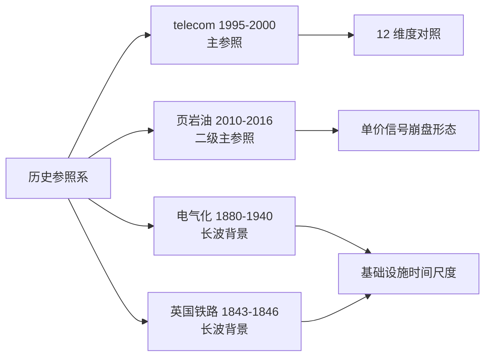
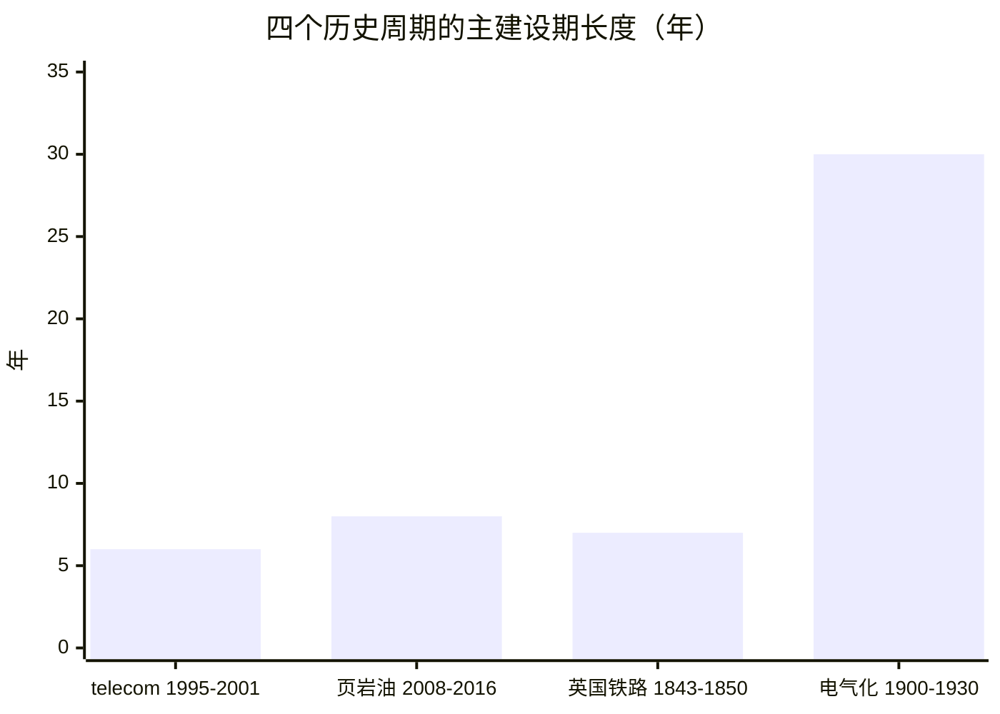
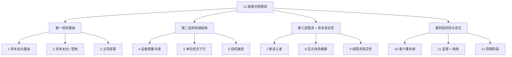
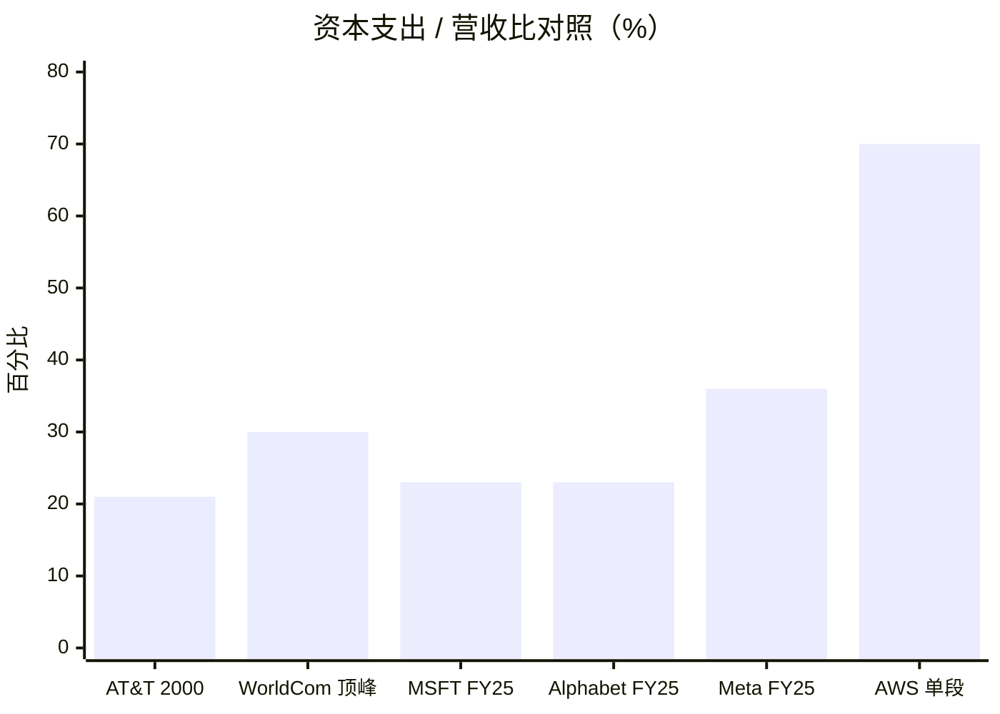
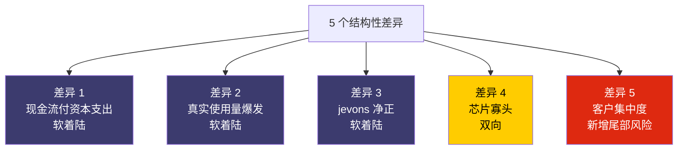
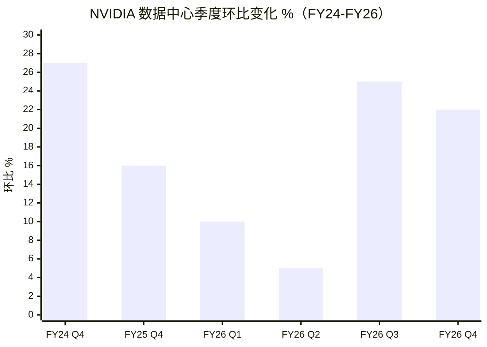

# 第 29 章 周期定位：12 维度对照、三个预警、五个差异

## 本章概览

本章是第七部的 spine 章。回答的问题只有一个：**这一轮 AI 算力周期，目前大致处在历史上哪一个位置**。

方法是把 1995-2000 telecom buildout 当作主参照，2010-2016 美国页岩油作为二级主参照，1880-1940 电气化和 1843-1846 英国铁路狂热作长波背景，沿 12 个可操作化指标逐项比对。

本章不预测顶部时点；不写我们正处于 1998这种话；不喊必跌 / 必涨；不用一句宣言式判断概括全局。

结论是严格表达的——「沿 12 维度比对后，**AI 算力周期在多数维度上最接近 1997 末至 1998 中期的 telecom 周期，但在维度 8、9、10 上显著不同**」。最接近不是等于。维度 8（巨头财务健康）、9（端需求真实性）、10（客户集中度）三处差异既是软着陆的可能性来源，也是新增的尾部风险。本书拒绝 dotcom 2.0和这次不一样两个极端，主张形态相似、性质不同。

为让周期还在多远的位置可被读者自己监测，本章给出三个可量化的泡沫顶部预警指标——三个指标全部出现并持续，周期内仍有空间主张证伪，本书周期定位修正为已过顶点。

12 维度之外，本章还做三件事。

第一，把第 18 章的循环交易作为周期顶部信号二次收束。

第二，把金融外溢（Mag7 市值占 GDP / Minsky 三段债务 / AI ABS / S&P 集中度）从 v1 第 25 章下沉到本章。

第三，把 [英伟达](https://www.nvidia.com/) 当前 P/E 与 Lucent / Nortel 历史分位做对照，作为反身性伏笔指向第 30 章估值章。

涉及具体公司估值含义的段落统一加段落级 commentary-only 标注，章末走完整版免责声明。

## 29.1 历史周期参照系：telecom 是主菜，页岩油是配菜，铁路和电气化是底色

找历史参照这件事市场每个人都在做——卖方写 AI 是新工业革命对照电气化；空头写 AI 是 dotcom 2.0对照 1999 互联网；中间派写 AI 是 telecom buildout 对照 1996-2002 长途光纤狂热。每个对照都有道理，但都不完整。

本章选择：**telecom buildout（1995-2000）是主参照，页岩油繁荣（2010-2016）是二级主参照，电气化（1880-1940）和铁路狂热（1843-1846）是长波背景**。

**telecom 之所以是主参照**——三件共享特征。

第一，基础设施军备竞赛，少数玩家按高增长叙事押注资本支出。

第二，资本市场叙事 + 终端价格信号双驱动（telecom 流量翻倍 + 长途话费下行 vs AI scaling laws + per-token 单价下行）。

第三，少数设备商承担行业大部分边际利润。1996-2003 AT&T 单家累计资本支出 ~\$50B、WorldCom/MCI 单家累计 ~\$45B，叠加 Sprint / Level3 / Global Crossing / Qwest 等其余长途玩家与 CLEC 资本支出，整个长途 telecom 行业 1996-2001 累计资本支出估计 \$500B 量级；同期 2022-2025 全球超大规模云厂累计 > \$900B。绝对量级 AI 已超 telecom，占 GDP 比也对齐（telecom 顶点 ~1.0-1.2% vs AI 2025 ~1.0%）。

**页岩油之所以提升到二级主参照**——补全 telecom 没覆盖的一面：**单一价格信号驱动行业边际玩家集体破产**。

telecom 崩盘是流量证伪 + 高收益债关闭 + 会计造假三件事叠加；页岩油崩盘几乎是一根线——WTI \$107 → \$26（18 个月跌 70%，来源：EIA RWTCD，S13），带走 100+ 家 E&P 公司。H100 二手价跌 50%+预警对应的不是 telecom 综合崩盘形态，而是页岩油一根价格曲线扫平边际玩家的形态。**如果 AI 周期出现崩盘，更可能是页岩油式而非 telecom 式**。29.6 展开。

**电气化和铁路是长波背景**——回答乐观派常提的反问算力周期是 30 年的事，凭什么用 telecom 5 年牛市来对照？

电气化主建设期 30 年（1900-1930），英国铁路狂热建成 6123 英里跨 7 年。如果按电气化尺度，2026 年大约在1905-1910 那个位置。本章承认这个时间尺度，但指出**长波内部仍有中波**——Insull 1932 破产、铁路狂热 1/3 规划线路未建成。本章定位中波周期内，不是长波趋势已尽。

四个参照决定本章数字口径：**telecom 提供资本支出 / 营收比、设备商集中度、单位经济下行节奏、投机融资规模四组核心数字**；**页岩油提供单一价格信号、边际玩家破产潮、幸存者纪律重写的形态参照**；**电气化 / 铁路提供基础设施过剩留下真实资产的乐观尾部场景**（dark fiber 2005+ 被 Netflix / YouTube / cloud 接盘）。

> 本节历史数字为 commentary-only 的产业类比，不构成对任何具体公司的估值或交易建议。

## 29.2 12 维度对照表的设计与操作化指标

要把 AI 像不像 telecom 这件事从印象变成可比较的对象，必须把维度拆细。本章用 12 个维度，每一个都给出 telecom 1999 和 AI 2026 的具体可观察指标，避免似不似沦为口头辩论。

12 个维度按四组归类，每组 3 个：

**第一组：体量级指标**（看周期物理规模）

1. **资本支出绝对量级 / GDP 占比**——衡量行业资本支出在宏观经济里的分量
2. **资本支出 / 营收比**——衡量行业自己的赚的钱够不够付资本支出，这是判断资本支出是否过度的最朴素指标
3. **主导叙事框架**——衡量市场是用什么单一叙事推动资本支出

**第二组：供给端结构指标**（看设备 / 上游格局）

4. **主导设备商集中度**——衡量利润分配给少数赢家的程度
5. **单位经济下行节奏**——衡量产品单价跌得多快
6. **投机性融资规模与工具**——衡量非现金流支持的资本支出占比

**第三组：需求端 + 资本端真实性指标**（看周期可持续性）

7. **新进入者 / IPO 节奏**——衡量边际玩家在多大程度上参与
8. **巨头自身财务健康**——衡量主导玩家是用自己的钱还是别人的钱在投
9. **端需求真实性**——衡量叙事背后的使用量是不是真的

**第四组：风险与定位指标**（看尾部 + 阶段）

10. **客户集中度**——衡量主导玩家收入是否高度依赖少数大客户
11. **监管 + 地缘环境**——衡量外部约束对周期的塑形
12. **周期阶段定位**——汇总前 11 维度的收敛结论

每个维度的操作化指南——即如何在数据上做一个明确的判断——见下表的判定阈值列。这一列是为了避免高低相似都是看感觉，把判断收敛到可观察的数字上。

| # | 维度 | 操作化指标 | 判定阈值 | telecom 1999 数据点 | AI 2026 数据点 |
|---|------|----------|----------|-------------------|---------------|
| 1 | 资本支出量级 | 行业年资本支出占美国 GDP 比 | > 0.5% 视为周期级资本支出 | 2000 年 telecom 资本支出 ~\$213B，占 GDP ~1.0-1.2% | 2025 超大规模云厂全球资本支出 ~\$300B，2026E ~\$650-700B；按美国份额 ~75% 折算，约占美国 GDP ~1.0% |
| 2 | 资本支出 / 营收 | 行业头部公司资本支出 / 营收比 | > 25% 视为超过历史警戒线 | AT&T FY2000 资本支出 \$14B / 营收 \$66B ≈ 21%；WorldCom 顶峰 ~30% | MSFT FY25 资本支出 \$64.6B / 营收 \$281.7B ≈ 23%；Meta FY25 资本支出占营收 ~36% |
| 3 | 主导叙事框架 | 单一异常增长率叙事的市场覆盖度 | 顶级 CEO / 头部研报普遍引用 | "Internet traffic doubles every 100 days"（WorldCom 1996 起，被行业广泛采纳，实际 2000-2002 美国 backbone 年增长率 ~2x，不是 100x） | Scaling laws（OpenAI / Anthropic）+ "tokens are the new oil"（行业共识叙事，被超大规模云厂财报会广泛引用） |
| 4 | 设备商集中度 | 主要设备商 CR1 / CR4 | CR1 > 50% 或 CR4 > 70% | 思科（Cisco） + Nortel + Lucent + JDSU 占 telecom 设备 ~70%（无单家 > 50%） | 英伟达占 AI 加速器 ~85%+（业内估算，TrendForce / Counterpoint 2025-2026）；台积电占先进制程 90%+ |
| 5 | 单位经济下行 | 单位产品 / 服务价格年化降幅 | > 30%/年视为快速崩塌 | long-haul fiber per-Mbps 1998-2001 累计跌 90%+ | H100/h 租赁价 2023 Q4 \$7-10/h → 2025 Q4 \$2-4/h，跌 60-70%；per-token 推理价 GPT-4（2023-03）\$30/\$60 per 1M tokens → 同等能力 GPT-4.1 Nano（2025-04）\$0.10/\$0.40，跌 99%+ |
| 6 | 投机融资 | 高收益债 / vendor financing 集中度 | 单行业 > 30% 高收益债占比视为高 | telecom 高收益债 1996-2001 累计 \$1.6T，占同期高收益债市场 50%+；vendor financing（Lucent / Nortel 给 CLEC 客户）规模 ~\$8B（业内估算） | GPU 抵押 ABS（CoreWeave \$8.5B 抵押 Meta 合同，2026-02 公告）；neocloud 总融资 ~\$30B+（CoreWeave / Crusoe / Lambda / Nebius / Together 合计，业内估算）；AI ABS 占总高收益债市场 < 10%（缺集中统计） |
| 7 | 新进入者 / IPO | 周期内行业新公司数量 | > 1000 家视为散户级狂热 | 1997-2000 美国 telecom 新公司 1500+ 家，CLEC 300+ 家 | 新建数据中心运营商 50+ 家（neocloud + 区域 IDC）；2025-03 CoreWeave IPO 募 \$1.5B；数量级 telecom 当年的 1/10 |
| 8 | 巨头财务健康 | 巨头净负债 / EBITDA + 自由现金流 | 净负债/EBITDA > 2x 视为高杠杆 | AT&T 2001 净负债 \$59B / EBITDA ~3x；WorldCom 净负债 \$30B + 后期会计造假 \$11B | MSFT 净现金 \$50B+；GOOG 净现金 \$80B+；META 净现金 \$30B+；Mag7 FY25 单年合计自由现金流约 \$310B（2024-2025 两年合计 \$600B+，来源：各家 FY25 10-K + Sparkline 2025，T17） |
| 9 | 端需求真实性 | 终端使用量 / 付费用户数 | 与叙事增长率差距 < 1 个数量级视为真实 | 互联网用户 1996 0.36 亿 → 2000 4.13 亿（11x），但 per-user 带宽消耗远低于 telecom 公司流量翻倍建模；实际 backbone 流量 2000-2002 年增 ~2x | ChatGPT 周活 8 亿（2025-10 Sam Altman 公告）→ 9 亿（2026-02 OpenAI 公告，T24，自报口径）；Anthropic 年化经常性收入 \$30B |
| 10 | 客户集中度 | NVDA / 头部公司前 5 大客户营收占比 | > 30% 视为高度集中 | telecom 设备商客户分散（家庭 + 企业 + 政府混合）；Lucent 前 5 大客户占营收 < 25% | 英伟达 FY26 数据中心营收 \$193.7B，其中前 5 大客户（Microsoft + Meta + Amazon + Google + Oracle 估）占 ~40%（业内估算，缺一手披露） |
| 11 | 监管 + 地缘 | 主要监管事件 / 出口管制方向 | 行业级出口管制 = 强外部约束 | 1996 Telecommunications Act + 1997 FCC 互联互通规则（解管制方向） | 2022-2025 美国对华 AI 加速器出口管制（H100 / H200 / H20 / B200 系列限制）；NVDA FY26 Q1 计提 \$4.5B 库存减值；CHIPS Act + 中国东数西算 |
| 12 | 周期阶段 | 前 11 维度收敛 | — | 顶点 2000-03，主跌期 2001-2002 | 2026-05 仍在上行；按资本支出/营收比 + 单位经济下行节奏 + 投机融资规模收敛，最接近 1997 末-1998 中期 |

> 来源：每行末列已标。表格不含星级——一目了然的相似度评估见 29.3 节，每个维度单独展开判断。

读这张表的方式：从上到下扫一遍，可以看到有些维度（1、2、3、5）非常像，有些维度（8、9、10）非常不像。这种部分像 + 部分不像的形态本身就是结论——简单地说 AI 是 telecom 2.0或者 AI 跟 telecom 完全不同，都是把这张表压扁了。后面 29.3 一行一行讲。

## 29.3 12 维度逐项比对：telecom 1999 vs AI 2026

### 维度 1：资本支出量级 / GDP 占比 —— 已对齐 telecom 顶点

1996-2000 美国 telecom 累计资本支出 > \$500B，2000 年峰值 ~\$213B，占美国 GDP 1.0-1.2%——1990s 除政府 + 房地产之外最大单一行业资本支出。

2025 全球超大规模云厂合计资本支出 ~\$300B，2026 财年指引冲到 \$650-700B。按美国份额 ~75% 折算，2026 美国超大规模云厂资本支出 ~\$490-525B，占美国 GDP（~\$29T）1.7-1.8%。

**直接对照**：2026 美国超大规模云厂资本支出 / GDP 比已超过 telecom 顶点。**口径差异**：telecom 资本支出大部分是不动产 + 长期网络铺设（折旧 15-25 年）；AI 超大规模云厂资本支出中 GPU 占比 > 50%，GPU 厂商建议折旧 5-6 年，Burry 等批评者认为实际寿命 2-3 年。按真实有效折旧期年化资本消耗，AI 2026 是 1.7% GDP，telecom 当年是 0.5% GDP（20 年折旧）——AI 已远超 telecom。

> 本段涉及超大规模云厂 GPU 折旧政策的讨论是 commentary-only 的产业分析，不构成对任何具体公司估值的多空判断。

### 维度 2：资本支出 / 营收比 —— 当前最尖锐的对照

资本支出 / 营收比是判断行业是否过度投资的最朴素指标——一家公司用超过 25% 的营收做资本支出，意味着自由现金流被严重压缩。telecom 1999-2001 顶点：AT&T FY2000 资本支出 \$14B / 营收 \$66B ≈ 21%，WorldCom 顶峰 ~30%。

AI 巨头当前：

| 公司 | 财年营收 | 财年资本支出 | 资本支出 / 营收 | 财年口径 |
|------|---|---|---|---|
| [Microsoft](https://www.microsoft.com/) | \$281.7B | \$64.6B | ~23% | FY25（截至 2025-06-30）|
| [Alphabet](https://abc.xyz/) | \$402.8B | \$91.4B | ~23% | FY2025（calendar 2025）|
| [Meta](https://about.meta.com/) | \$201.0B | ~\$72B | ~36% | FY25（calendar 2025）|
| [Amazon](https://aws.amazon.com/) | \$717B | \$128.3B | ~18% | FY2025（calendar 2025）|

> 注：本表已统一为各家截至 2026-02 已披露的最近完整财年口径。MSFT FY25 截至 2025-06-30，按 FY25 Q4 press release 一手数据资本支出 = \$64.6B（之前业内引用的 \$80B 是 2025-01 微软管理层指引，实际未达到）；Alphabet / Amazon / Meta 用 calendar 2025 财年。MSFT / GOOG / AMZN 的资本支出含部分非 AI（房地产、电力、零售物流），Meta 几乎全为 AI。Amazon 18% 是合并口径，单看 AWS（FY2025 营收 ~\$130B / 资本支出 ~\$100B 估算）已超 70%——业内估算，Amazon 不单独披露。

**直接对照**：Meta 单家已对齐并超过 WorldCom 顶峰 30%；Microsoft / Alphabet 已经达到 23% 区间，逼近 telecom 顶点 25% 警戒线；AWS 单段 70%+ 远超 WorldCom 顶峰。

这是反共识 #1 里悲观派最有力的数字。从维度 9 可以读出 AI 端使用量真实爆发（ChatGPT 周活 7-10 亿），所以 28-36% 资本支出 / 营收比**不能孤立地推出必然崩盘，但意味着任何低于完美的需求兑现都会引发剧烈重估**——Sparkline Capital（独立股票研究机构，主张以 ROIC + 资本周期分析穿越叙事）在 2025 年报告 *Surviving the AI Capex Boom*（T17）中称之为内部投资风险 + 外部抢跑风险的双重压力。

> 本段涉及超大规模云厂资本支出 / 营收比的产业分析，不构成对具体公司股票的多空判断。

### 维度 3：主导叙事框架 —— 单一异常增长率叙事

telecom 的叙事是"Internet traffic doubles every 100 days"——WorldCom 1996-1998 起被全行业采纳，所有玩家按这个口号建产能。实际 2000-2002 美国 backbone 年增长率约 2x 不是 100x，叙事与现实差一个数量级——这是 telecom 崩盘的根本原因之一。

AI 的对应叙事是 scaling laws——OpenAI 2020 Kaplan et al. 论文 + 2022 Chinchilla 论文。Epoch AI 数据：前沿训练算力 2010-2024 年化增长 4x，2030 年单次训练可达 2e29 FLOP。**跟 telecom 不同的是**：scaling laws 过去 5 年大致兑现——GPT-2（1.5e21 FLOP）→ GPT-4（~2e25 FLOP），模型能力同步提升。但 scaling laws 的兑现只在训练阶段——训练算力 → 模型变聪明是工程链，模型变聪明 → 终端付费是商业判断，没有定律保证。

**对照结论**：相似处——单一叙事 + 全行业押注；不同处——telecom 叙事 5 年内被驳倒，AI 叙事 5 年内被支持。

### 维度 4：设备商集中度 —— 英伟达比思科/Nortel/Lucent 三家加起来还集中

telecom 设备格局：Cisco（路由/交换，2000-03-27 市值峰 ~\$555B 一度全球第一，来源：Wikipedia: 思科 Systems，T18）+ Nortel（电信骨干 + 光通信，2000-09 市值峰 C\$398B 占 TSX > 1/3，来源：Wikipedia: Nortel，T18 + S9）+ Lucent（程控交换 + 光通信，1999-12 市值峰 ~\$258B，来源：Wikipedia: Lucent，T18 + S8）+ JDSU（光器件，2000-03 市值峰 ~\$1000 亿）。CR4 ~70%，CR1 < 50%。

AI 设备格局：英伟达一家占 AI 加速器市场 ~85%+（业内估算，TrendForce 2025-2026），FY26 全年营收 \$215.9B、数据中心 \$193.7B、毛利率 71.1% GAAP。2025-10-29 市值首次突破 \$5T。

**对照结论**：CR1 > 80% vs telecom CR1 < 50%；单家市值 \$5T vs telecom 单家峰值 \$555B（思科）。两件事：(1) **英伟达议价权远强于 telecom 当年任何一家设备商**——AMD / TPU / Trainium 仍是有限替代，70%+ 毛利率有支撑；(2) **反身性风险也更高**——思科 -89%、Nortel 归零、Lucent -99.4%。CR1 越高的设备商，在周期顶点的反身性损害越大——这是第 30 章估值章要展开的话题。

> 本段涉及英伟达与历史设备商对照的内容是 commentary-only 的产业类比，不构成对英伟达当前估值的多空判断。

### 维度 5：单位经济下行节奏 —— AI 比 telecom 跌得更快

telecom 周期里最关键的单位经济指标是 long-haul fiber 每 Mbps 的承载价格。1998-2001 这个价格累计跌幅超过 90%——这是 Brookings 和 Richmond Fed 的多份研究反复引用的数字，但缺乏权威的单条曲线，多源拼接得出的结论。

AI 周期里的对应单位经济有两条：H100/h GPU 租赁价 + per-token 推理价。

**H100/h 租赁价曲线**：

| 时点 | H100/h 价格区间（USD） | 累计跌幅（vs 2023 Q4 高点） |
|------|---|---|
| 2023 Q4 | \$7-10/h | 基线 |
| 2024 Q2 | \$5-7/h | -30% 到 -40% |
| 2024 Q4 | \$3-5/h | -50% 到 -65% |
| 2025 Q4 | \$2-4/h | -60% 到 -75% |
| 2026 Q1 | \$2-3.5/h | -65% 到 -78% |

**per-token 推理价**：

- GPT-4（2023-03）公开 API 价 \$30 / \$60 per 1M tokens（输入 / 输出）
- 同等基准能力的 GPT-4.1 Nano（2025-04）\$0.10 / \$0.40 per 1M tokens
- GPT-3.5 等价能力 2022-11 到 2024-10 单位价格便宜 ~280 倍

**对照结论**：AI 的单位经济下行比 telecom 更快、更猛。H100/h 24 个月跌 65%+，与 telecom long-haul fiber 36 个月跌 90% 的速率相比，年化跌幅 AI 反而更激进。

但要立刻区分两种单价下行的不同含义：

- **telecom 当年的单价下行 = 毛利崩塌**——光纤铺好之后边际成本几乎为零，价格战让 long-haul carrier 全部亏损。
- **AI 当前的单价下行 = jevons 效应净正**——单 token 价格跌 99%，但使用量涨 10000 倍以上，单位经济转化为使用量爆发。Anthropic 年化经常性收入从 \$1B（2024 初）涨到 \$30B（2026 初），同期模型变便宜了 5x、使用量涨了 50x。

两者的形态相似，性质截然不同。这是反共识 #3（AI 不是 telecom 2.0）的第三个结构性差异，29.4 单独展开。

### 维度 6：投机性融资 —— 工具同构、规模差一个数量级

telecom 周期最具标志性的投机融资工具是高收益债。1996-2001 美国高收益债市场累计向 telecom 输送 \$1.6T，电信占当时高收益债市场 50%+。其次是 vendor financing——Lucent / Nortel 给 CLEC（Competitive Local Exchange Carrier，竞争性本地交换运营商）客户提供贷款让客户买自己的设备，规模约 \$8B（业内估算）。Global Crossing 用 IRU（Indefeasible Right of Use，光纤永久使用权）合约把未来 20 年容量作为表外融资工具，在 2002 年破产后被会计审计戳穿。

AI 周期对应工具三层：

- **GPU 抵押 ABS**：[CoreWeave](https://www.coreweave.com/) 2024 年用 11 万张 H100/B100 抵押发 \$7.6B senior secured term loan，2026-02 用 Meta 5 年合同抵押拿到 \$8.5B 融资。这是 telecom vendor financing 的现代翻版。
- **循环交易**：英伟达-OpenAI-Oracle-CoreWeave 这条链：英伟达 2025-09 对 [OpenAI](https://openai.com/) 投资最高 \$100B → OpenAI 买 NVDA GPU；OpenAI-[Oracle](https://www.oracle.com/) \$300B 5 年合同 → Oracle 用 \$40B 买 NVDA 400K B200；OpenAI-CoreWeave 累计 \$22.4B 合同→ CoreWeave 付 NVDA。总规模 2025-2026 累计超 \$500B，与 telecom vendor financing \$8B 差 60 倍但逻辑同构。
- **neocloud IPO**：CoreWeave 2025-03-28 IPO 募 \$1.5B；Crusoe / Lambda / Nebius 排队中。规模仍小 telecom 一个数量级。

**对照结论**：工具高度同构（vendor financing → 循环交易；CLEC IPO → neocloud IPO；高收益债 → AI ABS）；规模 AI 当前约 \$500-600B（含循环）vs telecom 峰值 \$1.6T 高收益债 + \$8B vendor financing，绝对量级 AI 已对齐；占当时高收益债市场比 AI < 10% vs telecom > 50%。如果把循环交易计入广义投机融资，AI 已对齐 telecom；只看狭义 ABS 则还远未到。本章倾向于把循环交易纳入广义投机融资——这部分交易的本质是用未来增长承诺为当前资本支出融资，与高收益债同构。

> 本段涉及英伟达 / Oracle / CoreWeave / OpenAI 循环交易的讨论是 commentary-only 的产业类比，不构成对任何相关公司的估值判断。

### 维度 7：新进入者 / IPO 节奏 —— AI 数量级小 telecom 10 倍

1997-2000 美国 telecom 新设公司超 1500 家，CLEC 高峰 300+ 家。Global Crossing 1997 成立、1998-03 IPO、1999 市值峰 ~\$47B；Qwest 1997 IPO 后市值升 \$80B+；Level 3 1998 上市市值 \$30B+。任何挂 telecom 招牌的公司都能拿几十亿到上百亿美元估值。

AI 周期新进入者主要集中在 neocloud（CoreWeave / Crusoe / Lambda / Nebius / Together）和区域 IDC，加起来 ~50 家。CoreWeave 2017 成立、2023 转型 AI 算力云、2025-03 IPO 募 \$1.5B；Crusoe 2018 成立 / Lambda 2012 / Nebius 2024-10 在纳斯达克恢复交易。

**对照结论**：AI 新进入者数量级 50 vs telecom 1500，差 30 倍。周期顶点附近的特征是大量散户级新公司涌入，在 AI 周期里还远没有发生。但 AI 周期新进入者**数量少 + 单家规模大**——CoreWeave 2025 营收 \$5.13B 已接近 telecom 时代 30 家中型 CLEC 合计。这种形态跟超大规模云厂主导的客户结构相关——客户集中、新供给端也必然集中。

### 维度 8：巨头财务健康 —— 最大的差异，软着陆的可能性来源

这是 12 个维度里最关键的一处差异。telecom 巨头当年的财务画像：AT&T 2001 净负债 \$59B，净负债 / EBITDA ~3x；WorldCom 2001 净负债 \$30B + 2002 年发现 \$11B 财务造假；Global Crossing 破产时资产 \$22.4B / 负债 \$12.4B，年利息支出 \$600M；Lucent 1999-12 市值峰 \$258B 但 vendor financing 余额已超 \$7B，靠借钱给客户买设备维持营收。整个行业自由现金流多数为负。

AI 巨头当前的财务画像：

| 公司 | 财年营收 | 经营现金流 | 资本支出 | 自由现金流 | 净现金 | 财年口径 |
|------|---|---|---|---|---|---|
| Microsoft | \$281.7B | ~\$136B | \$64.6B | ~\$72B | \$50B+ | FY25（截至 2025-06-30）|
| Alphabet | \$402.8B | ~\$153B | \$91.4B | ~\$62B | \$80B+ | FY2025（calendar）|
| Meta | \$201.0B | ~\$110B | ~\$72B | ~\$38B | \$30B+ | FY25（calendar）|
| Amazon | \$717B | ~\$140B | \$128.3B | ~\$12B | ~\$20B | FY2025（calendar）|
| Mag7 合计 | ~\$2.2T | ~\$700B | ~\$430B | ~\$310B | ~\$300B+ | 各家最近完整财年 |

> 注：本表已统一为各家截至 2026-02 已披露的最近完整财年口径（MSFT FY25 截至 2025-06-30，Alphabet / Meta / Amazon 取 calendar 2025）。经营现金流/自由现金流各家口径有差异，本表用经营现金流 - 资本支出简化口径。本表头四行是 4 家超大规模云厂（MSFT + GOOG + META + AMZN）口径；末行 Mag7 合计是 7 家全口径（4 家超大规模云厂 + NVDA + AAPL + TSLA），NVDA FY26 单家经营现金流 \$130B+。29.5 预警 1 Mag7 合计自由现金流 \$300B+是 2024-2025 两年合计的滚动口径（约 \$600B），本表是 FY25 单年口径（约 \$310B），两者数字一致地源于同一组财报但口径不同，请注意区分。

**对照结论**：telecom 巨头净负债 / EBITDA 2-3x、自由现金流多为负；AI 巨头净现金正值、FY25 单年合计自由现金流仍达 \$310B 级。这意味着即便 2027 年资本支出进一步放缓，Mag7 资产负债表不会出现 telecom 那种债务无法滚动的崩盘——软着陆的可能性来源。但要立刻补一个限定：**强财务健康不等于强估值健康**。Mag7 当前合计市值约 \$20T，占美国 GDP 约 70%，占 S&P 500 约 35%。即便自由现金流仍正，如果市场对未来 3 年自由现金流增长率的预期从 +25%/年降到 +10%/年，估值压缩仍可达 30-50%。强财务健康保护破产风险，不保护估值风险——这两件事必须分开看。

> 本段涉及 Mag7 估值含义的内容是 commentary-only 的产业分析，不构成对任何具体公司股票的多空判断。

### 维度 9：端需求真实性 —— 第二个关键差异

telecom 周期端需求画像：互联网用户 1996 0.36 亿 → 2000 4.13 亿（11x），但 per-user 带宽消耗远低于流量翻倍建模——实际 backbone 流量年增 ~2x，不是 100x。1996-2000 建成的长途光纤里 2001 年仍有 85-95% 是 dark fiber——物理基础设施建成了，端需求没跟上。

AI 周期端需求画像：ChatGPT 周活 8 亿（2025-10 Sam Altman 公告）/ 9 亿（2026-02 OpenAI 公告，T24，自报；第三方 Similarweb 测算略低）；[Anthropic](https://www.anthropic.com/) 年化经常性收入 \$30B（2026-04，来源：T25），24 个月内 \$1B → \$30B；企业 AI 渗透率：Anthropic 在企业 LLM 市场份额 40%，coding 市场 54%——真实企业付费，而非 eyeball metric。

**对照结论**：telecom 用户数 11x 但 backbone 流量年增 2x，远低于100x 叙事；AI 周活 0 → 8-9 亿用时 3 年，企业付费 \$0 → \$50B（OpenAI + Anthropic + Copilot + Gemini）用时 3 年，使用量与 scaling laws 大致吻合（终端付费天花板仍是开放问题）。这是反共识 #3 第二个结构性差异，也是软着陆的第二个可能性来源。

两个限定：(1) **ChatGPT 周活是 OpenAI 自报**，OpenAI 不是上市公司，第三方 Similarweb 测算与自报有差异，本章给区间反映口径不确定性。(2) **企业 AI 真实付费规模存在循环 + 补贴水分**——Cahn \$600B 算法剔除 AI 公司之间互相消费 + 补贴定价后，真实终端付费可能比表面年化经常性收入数字小 60%。Anthropic 选 Google TPU + AWS Trainium 部分是因为 Google / Amazon 分别向 Anthropic 投资 \$40B + 多亿美元——被投资协议捆绑而非纯市场选择。剔除循环后 AI 端真实付费仍爆发，但增速比表面年化经常性收入温和。

> 本段涉及 OpenAI / Anthropic 估值含义的产业分析是 commentary-only，不构成对任何具体公司或一级标的的估值结论。

### 维度 10：客户集中度 —— 第三个差异，AI 特有的尾部风险

telecom 设备商客户分散——Lucent / Nortel / 思科客户含 Verizon / AT&T / Sprint / BellSouth + 100+ CLEC + 海外 + 企业。Lucent 1999 10-K 前 5 大客户占营收 < 25%。

AI 英伟达数据中心客户集中度：FY26 \$193.7B 营收，前 5 大客户（MSFT + Meta + Amazon + Google + Oracle）合计约 40%（业内估算，NVDA 不在 10-K 明确分客户披露），加上 CoreWeave / Crusoe / Lambda 等 neocloud 实际是超大规模云厂终端客户，前 5 终端客户合计可能接近 50%。

**对照结论**：telecom CR5 < 25%、AI ~40-50%。一家超大规模云厂砍单 30% 会瞬间在 NVDA 单季营收打出 5-8% 缺口；两家同时砍单 10-15%。一家客户砍单 = 系统性风险是 telecom 当年没有的结构。

**反身性传导**：CoreWeave Q3 2025 合同储备 \$55.6B 中 OpenAI 占 ~\$22.4B，Microsoft 占 < 50% RPO。CoreWeave 估值高度依赖 OpenAI 5 年内付清 \$22.4B 这件事。OpenAI 当前年化经常性收入 ~\$20B，要 5 年保持营收正增长才能覆盖；但 OpenAI 又承诺给 Oracle \$300B / 5 年，与当前年化经常性收入差距更大。任何一环（OpenAI 营收放缓 / MSFT 砍单 / Meta 转 ASIC）的扰动通过反身性放大到链上其他玩家——**这是反共识 #5（客户集中度）的周期信号**。

> 本段涉及英伟达 / CoreWeave / OpenAI 估值含义的产业分析是 commentary-only，不构成对任何具体公司股票或一级标的的多空判断。

### 维度 11：监管 + 地缘 —— 强外部约束 vs telecom 的解管制

telecom 周期是在 1996 Telecommunications Act 解管制背景下展开——FCC 1997 互联互通规则让 CLEC 可租用 ILEC（在位本地交换运营商）最后一公里，催生 300+ 家 CLEC 涌入。监管方向打开市场，对周期是顺风。

AI 周期相反——监管方向是加强外部约束。美国对华 AI 加速器出口管制（2022-10 H100、2023-10 H800/A800、2024-04 H20 进入许可清单）+ BIS（Bureau of Industry and Security，美国商务部工业与安全局）对 EDA / HBM / 先进封装设备多层级限制。NVDA FY26 Q1 因 H20 计提 \$4.5B 库存减值。CHIPS Act 同期向美国本土晶圆厂注入 \$52B+ 补贴，是相反方向的产业政策。

**对照结论**：telecom 当年解管制 → 顺风；AI 出口管制 + 产业政策 → 强约束。这层约束不让周期延后或提前，而是把资源分配重构——AI 加速器分割成美国侧 + 中国侧两个市场。telecom 1996-2001 是全球化一个市场，AI 是双市场——如果延续到顶部，可能让全球同步崩盘变成两侧不同步崩盘，形态跟 telecom 不同。

### 维度 12：周期阶段定位 —— 沿前 11 维度收敛

把前 11 个维度的结论收敛：

| 维度 | 类比强度 | 结论方向 |
|------|---------|----------|
| 1. 资本支出量级 | 高 | AI 已对齐或略超 telecom 顶点 |
| 2. 资本支出 / 营收 | 高 | AI MSFT/Meta 已超 telecom 顶点警戒线 |
| 3. 主导叙事 | 中-高 | 形态相似（单一叙事），证据强度不同 |
| 4. 设备商集中度 | 中 | AI 集中度 1.5-2x telecom |
| 5. 单位经济下行 | 高 | 形态相似，性质不同（jevons vs 毛利崩塌）|
| 6. 投机融资 | 中-高 | 工具同构，规模差一个量级 |
| 7. 新进入者 | 中-低 | AI 数量级小 telecom 10 倍 |
| 8. 巨头财务健康 | 低（差异大） | AI 净现金 vs telecom 净负债 |
| 9. 端需求真实性 | 低（差异大） | AI 真实使用量爆发 vs telecom 流量被高估 |
| 10. 客户集中度 | 低（差异大） | AI 高度集中 vs telecom 分散 |
| 11. 监管 + 地缘 | 低 | 方向相反 |
| 12. 周期阶段 | — | 多数维度最接近 1997 末-1998 中期 |

**结论严格表达**：

> 沿 12 维度逐项比对，AI 算力周期在维度 1、2、3、5、6 上与 telecom 顶点已基本对齐或略超过；在维度 4、7 上接近 telecom 1998 时期；在维度 8、9、10、11 上与 telecom 1999 显著不同。**多数维度的收敛位置最接近 1997 末-1998 中期的 telecom 周期，即基础设施军备竞赛进入中期、单位经济快速下行、资本支出 / 营收比已突破警戒线、但顶点尚未明确出现的位置**。

不写我们处于 1998。写的是沿 12 维度比对后多数维度与 1997 末-1998 中期最接近。差别在于：前者是时点预测，后者是类比性定位；前者承诺一个时间表，后者承诺一个监测框架。这个差别决定了后面 29.5 节三个泡沫顶部量化预警的必要性——读者不需要相信本章的定位，可以根据三个指标自己监测。

## 29.4 五个结构性差异 —— 为什么 AI 不是 telecom 2.0

29.3 的 12 维度比对已经把每一维的同与不同摆在桌面上。本节做的事不是重复这些数字，而是把性质不同的部分**收敛成 5 个结构性差异**，对应反共识 #3（AI 不是 telecom 2.0）的主答辩。这一节不做两面平衡——结论清楚：** AI 与 telecom 在五个维度上性质截然不同，每一个都让 AI 周期的顶部形态可能与 telecom 大相径庭**。但形态不同不等于 AI 不会有周期回撤，回撤幅度和形态由 29.5 三个预警决定。

| # | 差异 | 对应维度 | telecom 1999 | AI 2026 | 方向 |
|---|------|---------|---|---|---|
| 1 | 现金流付资本支出 | 维度 8 | AT&T 净负债 / EBITDA ~3x；WorldCom + \$11B 造假；行业自由现金流多数为负 | Mag7 FY25 经营现金流 ~\$700B vs 资本支出 ~\$430B，FY25 单年自由现金流 ~\$310B，净现金 \$300B+ | 软着陆来源——巨头不会成为传染源 |
| 2 | 真实使用量爆发 | 维度 9 | 用户数 11x，但 backbone 流量仅 2x（100x 叙事被驳倒）；85-95% 长途光纤是 dark fiber | ChatGPT 周活 8 亿（2025-10）→ 9 亿（2026-02）；Anthropic 年化经常性收入 24 个月内 30x；scaling laws 5 年大致兑现 | 软着陆来源——GPU 闲置概率远低于 telecom |
| 3 | jevons 净正 | 维度 5 | per-Mbps 跌 90% + 使用量 2x = 毛利彻底崩塌 → AT&T / WorldCom 长途业务 2001-2002 持续负毛利 | per-token 跌 99% + 使用量 50-280x；OpenAI / Anthropic 毛利仍 60-70% | 软着陆来源——但 jevons 有边界（企业 AI 预算渗透率天花板）|
| 4 | 芯片寡头 | 维度 4 | 思科 / Nortel / Lucent / JDSU 四家竞争，CR4 ~70%；1999-2001 设备价格同步跌 30%+ | NVDA 一家 ~85%+；FY26 毛利率 71.1% GAAP；B200 起步价高于 H100 | 双向——利润维持 + 反身性放大 |
| 5 | 客户集中度 | 维度 10 | Lucent CR5 < 25%，客户分散 | NVDA CR5 ~40-50%；CoreWeave 单 OpenAI 占合同储备 ~70% | 新增尾部风险 |

每一行核心数据已在 29.3 给出，本节聚焦结构性含义：

**差异 1**：telecom 崩盘剧本再融资关闭 → 边际玩家破产 → 巨头连锁受损在 AI 周期里难以发生——巨头不依赖再融资，崩盘剧本更可能是估值压缩 → 资本支出节奏放缓 → 上游业绩重估，巨头自身不破产。但**强自由现金流不等于不会大跌**——Mag7 自由现金流增速从 2023 +60% 降到 2025 小幅负增长，如果 2027-2028 资本支出继续超经营现金流，自由现金流会进一步压缩，是预警 1 的逻辑。

**差异 2**：telecom 基础设施已建成 + 终端需求没跟上，AI 基础设施快速建成 + 终端使用量同步爆发，H100 集群 utilization 普遍 60-80%（业内估算，SemiAnalysis / Silicon Data 2025-Q4 综合，T12 + T16），dark fiber 概率远低于 telecom。但**端使用量增长不等于端付费愿意增长**——ChatGPT 2025-10 公告 8 亿周活、2026-02 公告 9 亿周活，付费用户合计 ~5000 万（2026-04 OpenAI 披露），付费率 ~6%，**若 2027-2028 付费率不能提到 15-20%，OpenAI 的 \$300B Oracle 5 年合同与终端付费的覆盖缺口将持续扩大**。Anthropic / OpenAI 的年化经常性收入爆发部分来自循环 + 补贴定价，剔除后真实付费增速比表面年化经常性收入温和。

**差异 3**：telecom 单位经济崩塌 → 毛利崩溃 → 财务塌方；AI 单位经济下行 → 使用量爆发 → 毛利维持。**但 jevons 悖论有边界**——AI 杰文斯效应建立在企业 AI 预算渗透率 < 5%的前提下，如果 2028-2030 渗透率提到 30-40%，新增预算空间显著缩小，jevons 会减弱。Cahn \$500-600B 缺口算法不一定意味着资本支出必然崩盘，但意味着 jevons 被市场过度透支。

**差异 4**：寡头能更长时间维持高毛利，但脆弱点是**唯一玩家被市场过度定价 → 反身性损害更猛**。思科 -89% / Nortel -99.6% / Lucent -99.4% 都是寡头被高估 → 业绩低于预期 → 估值崩塌剧本。NVDA forward P/E ~25x，如果 2027-2028 数据中心营收增速从 +50% 降到 +15-20%/年，估值压缩 30-50% 概率不低（详见 29.10 伏笔与第 30 章）。

**差异 5**：telecom 崩盘是渐进、多客户分批退出——Lucent 1999-2002 营收 \$38B → \$12B 跌 68% 持续 36 个月。AI 崩盘可能是突然、少数客户同步——一家超大规模云厂季度公布资本支出放缓瞬间引发链上重估。CoreWeave 这类 neocloud 客户集中度更高（OpenAI 单家占合同储备 ~70%），OpenAI 年化经常性收入增速从 +200% 降到 +50% 会让 CoreWeave 估值瞬间压缩 50%+。

**整体表态**：5 个差异中 3 个软着陆来源（1、2、3）+ 1 个双向（4）+ 1 个新增尾部风险（5）。

AI 算力周期不会以 telecom 巨头连锁破产 + 毛利全行业崩塌形态结束，更可能以估值压缩 + 资本支出节奏放缓 + 上游业绩重估形态完成中场休整。崩盘概率不为零但比 telecom 低；过顶后的回撤幅度可能在 30-50% 区间，而非 telecom 89-99% 区间。

> 本节涉及 NVDA / OpenAI / Anthropic / CoreWeave 估值含义的产业类比是 commentary-only，不构成对任何具体公司股票或一级市场标的的多空判断。

## 29.5 三个泡沫顶部量化预警 —— 反共识 #1 主答辩

29.3 / 29.4 的判断本质上是类比性的——多数维度像 telecom 1997 末-1998 中期。但类比性判断对读者的实际用处有限，因为读者关心的是过顶了没有 / 什么时候过顶。本节给出三个可量化的预警指标，每个指标都附**基线 + 当前位置 + 触发条件 + 监测来源**。三个指标全部出现并持续，本章主张证伪。

为什么是这三个，不是其他？这三个分别对应周期的三个关键传导链：**巨头财务（预警 1）→ 主导设备商业绩（预警 2）→ 算力终端价格（预警 3）**。从源头到末端，三层任何一层断裂都会被这三个指标之一捕捉到。

### 预警 1：Mag7 自由现金流转负且持续 4 季度

**指标含义**：差异 1 给出的核心特征是 AI 跟 telecom 最本质的不同——巨头用经营现金流付资本支出。这个特征消失（Mag7 整体自由现金流转负），意味着 telecom 时代借债扩张 → 再融资风险的剧本进入 AI 周期。第一层信号。

**基线**：2024-2025 两年合计 Mag7 自由现金流约 \$600B+（FY25 单年约 \$310B；MSFT FY25 \$72B / GOOG FY25 \$62B / META FY25 \$38B / AMZN FY25 \$12B / NVDA FY26 \$60B+ / AAPL \$100B+ / TSLA ~\$0）。8 季度合计自由现金流从未为负，最低季 ~\$80B。

**当前位置（2026-Q1）**：合计自由现金流 ~\$80-90B/季度，年化 \$320-360B，比 2024 高峰略低但仍显著正。

**触发条件**：Mag7 合计季度自由现金流（经营现金流 - 资本支出简化口径）转负且连续 4 季度。单季波动转负不构成触发（GPU 交付 / 数据中心建设节奏不平滑），4 季度连续是结构性变化。**监测**：每季度 10-Q（财报后 30 天可拿到），本书附录每季度更新。

### 预警 2：NVDA 数据中心收入环比首次负增长

**指标含义**：差异 5 给出的核心结构是 NVDA 客户高度集中，一家超大规模云厂砍单瞬间在 NVDA 季报反映。数据中心营收环比从 FY24 Q1 起连续 12 季度正增长——行业最敏感的 超大规模云厂资本支出节奏 代理。

**基线**：

| 季度 | 数据中心营收（USD B） | 环比 |
|------|---|---|
| FY24 Q1 | 4.3 | — |
| FY24 Q4 | 18.4 | +27% |
| FY25 Q4 | 35.6 | +16% |
| FY26 Q1 | 39.1 | +10% |
| FY26 Q2 | 41.1 | +5% |
| FY26 Q3 | 51.2 | +25% |
| FY26 Q4 | 62.3 | +22% |

> 注：FY26 Q1-Q4 均为英伟达季度财报实际披露值，FY26 Q4 数据中心 \$62.3B + FY26 全年数据中心 \$193.7B、全年营收 \$215.9B、Q4 单季营收 \$68.1B、FY26 GAAP 毛利率 71.07%、Q4 毛利率 ~75.0%、FY26 GAAP 摊薄 EPS \$4.90、营业利润 \$130.4B。本表已在二轮 verify-data 用实际值替换初稿 (E) 估算。

**当前位置（FY26 Q4 实际）**：环比 +22%，仍为正且较 Q2 低点 +5% 显著回升——Q2 节奏放缓后 Q3-Q4 重新加速，主要由 B200 出货爬坡驱动。

**触发条件**：任一季度环比为负。同比仍可正但环比为负构成触发——客户集中度极高 = 至少一家大客户出现拐点。环比比同比早 2-3 季度捕捉周期减速。**监测**：NVDA 10-Q，财年截止后 25-30 天发布。

### 预警 3：Hopper 二手 6 个月内跌 50%+

**指标含义**：差异 3 给出的形态是 AI 单位经济下行比 telecom 更快，但 jevons 让总营收仍涨。如果下行加速到6 个月跌 50%，意味着 jevons 失效——使用量追不上单价下降。终端最敏感的算力供求信号。

**基线（2026-05）**：H100 二手挂牌价 ~\$25K（业内观察，来源：T12 + T28）。新卡价 ~\$30-35K，二手 / 新卡价比 ~75%——健康水平。

**触发条件**：H100 二手挂牌价 6 个月内跌至 ~\$12.5K 以内（50%+ 跌幅）且持续 1 个月以上。3 个月可能是季节性 / 单批次抛售，6 个月持续才是结构性拐点。对比 Dylan Patel 2025 年温和预测（H100 二手价从 \$2/hr 跌到 \$1/hr 用 30 个月，-50%），本预警触发条件是温和场景的 5 倍速率。

**监测来源**：Silicon Data H100 Rental Index（月度）；GPU 二手平台（Vast.ai / ServerSimply / Reddit r/LocalLLaMA）；超大规模云厂内部 utilization rate（季报间接披露）。

### 三个预警的组合判断

| 预警 | 当前位置（2026-05） | 距离触发 | 监测频率 |
|------|--------------------|----------|----------|
| Mag7 自由现金流转负 4 季度 | 自由现金流仍正 ~\$80-90B/季度 | 远 | 每季度 |
| NVDA 数据中心环比为负 | +22% 环比（FY26 Q4 实际）| 中（最敏感，Q2 +5% 已示意拐点风险）| 每季度 |
| H100 二手 6 月跌 50% | ~\$25K 挂牌 | 远 | 每月 |

**组合判断的逻辑**：

- **只触发 1 个**：周期可能进入减速期，但还不是周期顶部确认。维持1997-1998定位。
- **触发 2 个**：周期顶部高度可疑，需要密切跟踪。本书周期内仍有空间主张进入压力测试。
- **触发 3 个且持续**：周期顶部已过，本书1997-1998定位证伪，修正为已过顶点 + 进入主跌期早期。

**截至 2027-Q4 三个预警全部触发并持续**，周期内仍有空间主张证伪。这是反共识 #1 的可证伪条件。

> 本节涉及具体公司估值含义的产业分析是 commentary-only 的产业框架，不构成对任何具体公司股票的多空判断或交易建议。

## 29.6 页岩油 2010-2016：二级主参照与单一价格信号的破坏力

页岩油作为二级主参照，补全 telecom 没覆盖的一面：**资本支出驱动行业的核心产品价格被单一外部信号扫平时，边际玩家以何种速度和形态被破坏**。

**故事浓缩**：

起点（2008-2010）水力压裂成熟，美国 onshore 产量 2008 50 万桶/日 → 2014 ~500 万桶/日（10x），资本结构低利率 + 高油价 + 高收益债，2014 高峰累计 ~\$250B 放贷。

顶点（2014-06）WTI \$107/桶，Chesapeake 市值 ~\$40B、年资本支出 ~\$10B。

崩盘触发（2014-11-27）OPEC 维也纳会议决定不减产，明示让高成本边际产能（页岩油）退出。WTI 从 \$107 跌到 2016-02 \$26-29，18 个月跌幅 72%。

后果（2015-2016）全美 100+ 家 E&P 破产，累计负债 > \$100B；Chesapeake 2020-06 最终破产，债务 \$7B。**活下来的公司学会自由现金流优先，2018 年后不再大举借债扩产**。

**对 AI 周期的三条借鉴**：

(1) **单一外部价格信号的破坏力**——telecom 崩盘是流量证伪 + 高收益债关闭 + 会计造假叠加；页岩油是一根线（油价 \$107 → \$26）。AI 对应的单一价格信号可能不是具体算力价格，而是**叙事性信号**——某个突破让训练算力需求一次性减少（DeepSeek R1 2025 初制造过短暂恐慌但 jevons 让 NVDA 市值快速回到 \$5T+），或开源模型质量追上闭源。** AI 崩盘触发点更可能是叙事性信号而非累积财务失衡**。

(2) **边际玩家速死速度**——页岩油 18 个月内 100+ 家破产。AI 若现类似形态，受影响的不是超大规模云厂而是 neocloud。CoreWeave 当前债务（\$8.5B Meta 合同抵押 + \$7.6B GPU 抵押 + 总债务 \$10B+，来源：S7）在算力价格 6 个月跌 50%场景下违约概率显著上升——预警 3 传导逻辑。

(3) **幸存者纪律被改写**——页岩油崩盘后 2018 年 E&P 资本支出增速从 +20% 降到 +5%/年，自由现金流从再投资转向分红 + 回购。AI 回撤后 Mag7 可能类似——telecom 之后 Verizon / AT&T 2003 也是如此。

**页岩油参照局限**：油是同质化、AI 算力有质量梯度；油价崩盘是 OPEC 政治决策、AI 没有中央定价机构；页岩油需求刚性、AI jevons 弹性极大。这些局限让页岩油不能替代 telecom 作为主参照——它提供单一信号 + 边际玩家速死形态参照，让预警 3 有更具体的历史依据。

## 29.7 电气化与铁路：长波背景

电气化和铁路狂热作为长波背景，回答两个问题：基础设施周期的真实时间尺度是什么；周期回撤后物理资产被谁接盘。

**电气化（1882-1932）**：从 Pearl Street 站点起到城市电气化率 90% 用了 50 年，主建设期 1900-1930（30 年）。1900 美国家庭电气化率 ~8%，1932 城市 ~90%。单机发电站规模 1900 1.5 MW → 1930 208 MW（140x）。1929 年前 Samuel Insull 的 Commonwealth Edison 在 32 个州运营，承担美国 10% 电力供应；1932 年 Insull 帝国破产——当时最大商业破产案。**长波内部仍有中波回撤**。

**英国铁路狂热（1843-1846）**：1843 起涨，1845 秋顶，1846 主跌。1846 议会通过 263 项铁路设立法案，规划 9500 英里（当时既有 2000 英里，规划是既有 5 倍）。实际建成 6123 英里——1/3 规划从未落地。投资人大量亏损（包括达尔文家族），但英国铁路网络 1842-1850 三倍增长，留下真实国家基础设施。

**对 AI 周期的三条借鉴**：

第一，**时间尺度**。如果 AI 周期按电气化的尺度，2025 年大约对应 1905-1910——主建设期开端，未来 20-30 年还有大量上行空间。这是反共识 #3 的支持性证据。

第二，**长波内部仍有中波回撤**。电气化期间 Insull 1932 破产，铁路狂热 1846 主跌——长波趋势存在不代表短波回撤不存在。本章定位的1997-1998是中波周期位置，跟长波趋势已尽不是一回事。

第三，**基础设施过剩留下真实资产**。dark fiber 在 2005+ 被 Netflix / YouTube / cloud 接盘，铁路狂热中没建成的 1/3 仍让英国铁路网络三倍增长。AI 周期里即便 GPU 阶段性过剩，物理上的数据中心 / 电网 / HBM 产能也是真实资产，预计 5-10 年内被下一波需求接盘。

但电气化和铁路对照的明显限度——**它们都是物理产品基础设施（电 / 运输），AI 算力的产品周期更短**。GPU 5-6 年折旧 vs 电网 30-50 年。这让 AI 是 30 年周期的乐观论述不能简单照搬电气化叙事——需要30 年的数据中心 + 5-6 年的 GPU 分层来看。

## 29.8 金融外溢：Mag7 占比、Minsky 三段债务、AI ABS、S&P 集中度

29.3-29.7 是产业链 + 历史维度的对照。本节把金融外溢——AI 资本支出周期对宏观金融市场的传导——作为周期信号的一组指标拎出来。这部分从 v1 的第 25 章下沉到本章，因为周期顶部信号本质上是金融指标。

**Mag7 集中度 / S&P 占比**：Mag7 合计市值 2024 年初约 \$13T（占 S&P 500 约 31%）→ 2024 年中约 \$15.4T（34-35%，来源：Visual Capitalist / Morningstar 2024-07）→ 2026-05 约 \$20T，占 S&P 500 约 35-37%，占美国 GDP 约 70%。历史参照：2000-03 NASDAQ 顶点时前 5 大科技股占 S&P 500 约 18%；2007 顶点前 5 大金融股占 22%；2026 Mag7 占 35-37%。集中度本身不等于必然崩盘，但意味着 S&P 500 方向高度依赖 Mag7。如果 Mag7 因预警 1 进入估值压缩，S&P 500 整体下行幅度会比 2000-2003 那波更大（注：L209 Mag7 合计 取 7 家全口径含 NVDA / AAPL / TSLA，与本节口径一致）。

**Minsky 三段债务结构**：Hyman Minsky 1980 年代金融不稳定假说把债务结构分三段——**Hedge**（现金流足以付本金 + 利息）、** Speculative**（足以付利息，本金需再融资滚动）、** Ponzi**（现金流不足以付利息，本金 + 利息都需再融资）。按这个框架看 AI 周期：

- **Mag7 巨头**：经营现金流远超资本支出 + 利息，处 **Hedge**。
- **CoreWeave / 类似 neocloud**：营收增长快但资本支出更快，靠抵押贷款 + IPO 维持。CoreWeave Q1 2025 营收 \$981.6M，利息支出 ~\$100-125M/季度（基于总债务 ~\$10B × 利率 4-5% = \$400-500M/年 ÷ 4 推算，来源：S7 + 公开利率区间），自由现金流接近为零或负——**Speculative** 典型。
- **部分一级 AI labs**：OpenAI 年化经常性收入 ~\$20B、2025 全年烧钱率 ~\$9B，靠不断融资滚动——接近 **Ponzi**。

Minsky 的核心观察：周期上行期三段比重会从 Hedge 往 Speculative + Ponzi 漂移；当外部冲击让 Ponzi 玩家无法再融资，连锁触发崩盘。AI 当前 Hedge 仍占 60-70%——周期中前期。如果 2027-2028 漂移到 Speculative + Ponzi 合计超 50%，金融脆弱性显著上升。

**AI ABS 与高收益债**：AI ABS 当前规模约 \$30B（CoreWeave \$15-17B + Crusoe / Lambda / Nebius 合计 \$10-15B 业内估算），占整个高收益债市场（~\$1.5T）约 2%——远低于 telecom 当年 50%。跟 telecom IRU（Indefeasible Right of Use，光纤永久使用权）合约相比：IRU 抵押 20 年容量合同（客户无法验证 20 年后还需要这些容量）；AI ABS 抵押 5 年合同 + GPU 残值（5 年视野清晰，但 GPU 5 年后残值高度不确定）。两者本质同构——用未来增长承诺为当前资本支出融资。如果 AI ABS 在 2027-2028 增长到 \$200-300B+，比重接近 telecom 水平，脆弱性显著上升。

**私募 AI 占总私募比**：2024-2026 全球私募市场 AI 占比从 ~15% 升至 ~40%（业内估算，本章按 Pitchbook + CB Insights 综合）。1999 年 telecom + internet 占整个 VC 60%+。私募集中度高不等于崩盘，但任何一个领域回撤会瞬间传导到整个私募市场流动性。

> 本节涉及具体公司金融结构的产业分析是 commentary-only 的产业类比，不构成对任何具体公司估值或债权工具的多空判断。

## 29.9 循环交易作为周期顶部信号 —— 与第 18 章首尾呼应

第 18 章把循环交易的机制展开——讲清楚英伟达-OpenAI-Oracle-CoreWeave 这条链的资金流向、各方动机、合同结构。本章把同一现象从机制切换到周期信号——循环交易的强度 + 集中度 + 占比是周期顶部最敏感的 leading indicator 之一。

**历史经验**：telecom 时代 vendor financing 在 1999-2000 达到顶峰——Lucent 余额 \$7B+、Nortel 余额 \$4B+。这部分 vendor financing 在 2001-2002 客户大规模破产后转化为资产减值，分别计提 \$26B / \$19B，成为两家公司被迫重组的直接原因。**当主导设备商的客户买我设备但钱是我借给他的占比突破 10-15%，是周期顶部强信号**——这部分循环本质上是营收与应收账款的捆绑。

**AI 周期当前循环规模**（已在 29.3 维度 6 列出核心数字，本节聚焦周期信号含义）：NVDA → OpenAI \$100B 投资 + Oracle → OpenAI \$300B 5 年合同（Oracle 用 \$40B 买 NVDA） + CoreWeave → OpenAI 累计 \$22.4B + NVDA → CoreWeave \$6.3B prepurchase + Microsoft → OpenAI 累计 \$13B，合计 2025-2026 累计循环超 \$500B。绝对规模已远超 telecom 顶峰；但相对设备商营收的比例仍较低——NVDA FY26 营收 \$215.9B 对比循环相关营收 \$30B+，约 14%，相比 telecom 15-20% 略低。这是软着陆的间接证据。

**2025-09 英伟达-OpenAI \$100B 公告引发市场广泛质疑**。英伟达 11 月 10-Q 将这笔交易披露为可能不会成行，2026-03 GTC Jensen Huang 直接说不在选项中。监管和市场已经盯上了这条链，进一步扩张的政治空间收窄——这是周期顶部的具体信号。

**作为周期顶部预警的判定阈值**：

- **绿区**（周期中前期）：循环交易占设备商营收 < 5%；
- **黄区**（周期中后期）：5-15%，多链同时形成，监管开始关注；← **AI 2026 当前**
- **红区**（周期顶部）：> 15%，监管开始限制，新增循环受阻。

AI 2026-05 在黄区中段。进入红区的两个条件：(1) NVDA / Oracle 的循环交易占营收比突破 15%；(2) 监管开始实质性限制新增循环交易。

> 本节涉及具体公司循环交易的产业分析是 commentary-only 的产业类比，不构成对任何具体公司估值或债权工具的多空判断。

## 29.10 NVDA P/E vs Lucent/Nortel 历史分位 —— 反身性伏笔

本节是第 30 章估值章的伏笔——把 NVDA 当前 P/E 与 1999-2000 顶点的 Lucent / Nortel / 思科历史分位做对照，留作第 30 章进一步分析的起点。

| 公司 / 时点 | Forward P/E | 当时市值峰值 | 之后跌幅 | 来源 |
|------|---|---|---|---|
| Lucent 1999-12 | ~60x forward（trailing ~75x）| \$258B | -99.4%（到 2002-10 \$0.55）| Wikipedia: Lucent + S8 + Damodaran 估值数据库 |
| Nortel 2000-09 | ~80x | C\$398B（~\$270B）| -99.6%（到 2002-08 C\$0.47）| Wikipedia: Nortel + S9 |
| 思科 2000-03 | ~130x forward（trailing ~201x）| \$555B | -89%（到 2002-10 \$8.12）| Wikipedia: 思科 Systems + Damodaran 估值数据库 |
| JDSU 2000-03 | ~250x（非 GAAP）| ~\$100B | -99.9%（到 2002 \$1.58）| Wikipedia: JDS Uniphase |
| 英伟达 2026-05 | ~25x（forward）| \$5T+ | — | stockanalysis 2026-05 + NVDA FY26 财报，S1 |

> 注：历史 P/E 剔除 1999-2001 会计准则差异（FAS 142 商誉减值规则）后仍有局限——telecom 当年很多公司非 GAAP 利润为正、GAAP 亏损，与现在 NVDA 真实 GAAP 利润不是同一口径。Lucent forward P/E ~60x 取 \$84.25（1999-12 顶点股价）/ FY00 共识 EPS ~\$1.40，trailing ~75x 取 / FY99 EPS \$1.12；思科 forward P/E ~130x 取 2000-03 顶点价 / FY01 共识 EPS ~\$0.62，trailing ~201x 取 / FY00 EPS ~\$0.36。本表仅作历史参照，不可直接推出 NVDA P/E 是 telecom 1/5 所以安全。

英伟达当前 forward P/E ~25x 远低于 telecom 顶点设备商 40-250x，绝对数字便宜得多。但要补三个限定：

第一，**market cap 量级**：NVDA 2025-10 突破 \$5T，是思科 2000-03 顶点 \$555B 的约 9 倍。即便 P/E 较低，单位市值的下行风险仍大——NVDA 30% 估值压缩 = \$1.5T 市值蒸发，相当于思科顶点市值的近 3 倍。

第二，**利润质量**：NVDA FY26 营业利润 \$130.4B GAAP，毛利率 71.1%，是真实 GAAP 利润；Lucent / Nortel 1999-2000 的利润包含 vendor financing 应收账款和后期被减值的部分。NVDA 的 25x 对应真实赚钱，Lucent 的 60x forward 对应后来被证伪。

第三，**反身性损害与 P/E 起点关系小，与市场预期落差关系大**。思科 -89% 的核心原因不是 P/E 130x forward 起点本身，而是2000-01 业绩没达到分析师预期 30%——高 P/E 是落差的放大器，不是触发器。NVDA 如果在 2027-2028 数据中心营收增速从 +50%/年降到 +15-20%/年，即便 P/E 起点 25x 也会出现 30-50% 估值压缩。

**伏笔结论**：从绝对 P/E 看 NVDA 比 1999 顶点设备商便宜得多，但从绝对市值和反身性角度看下行风险仍大。这两件事不矛盾——它们指向第 30 章核心问题：**周期顶部寡头设备商，业绩超预期时估值扩张、业绩低于预期时估值崩塌，这种反身性是寡头垄断设备商的固有特征，与 P/E 起点关系不大**。

> 本节涉及英伟达估值含义的内容是 commentary-only 的产业类比，不构成对英伟达当前估值的多空判断或交易建议。具体估值分析详见第 30 章。

## 29.11 议题 1 + 议题 2 的组合判断

29.3 已用 12 维度逐项给出 telecom 1999 vs AI 2026 的数据点；29.4 已用 5 个结构性差异给出软着陆来源 + 新增尾部风险的拆解；29.5 已用三个量化预警给出可证伪条件。本节不复述这些数字，而是把两个议题**作为彼此的边界条件**做一次组合判断——议题 1（资本支出是否过度）和议题 2（是不是 dotcom 2.0）不是两个独立问题，而是同一个周期定位问题的两个切面，两者的答案必须自洽。

### 两个议题的逻辑耦合

议题 1 问现在资本支出是不是过头了，议题 2 问现在大致在历史哪一段。两者的逻辑耦合是：

- 如果把 AI 当作 1995（互联网早期 / dotcom 1.0），那超大规模云厂资本支出 / 营收 28-36% 区间与 1995 telecom 资本支出 / 营收比 ~10% 完全不同——**议题 2 答1995则议题 1 必答已过度**。
- 如果把 AI 当作 1999（dotcom 顶点 / WorldCom 30%+ 同位），那 Mag7 净现金 \$300B + 真实使用量 8 亿周活与 1999 完全不同——**议题 2 答1999则议题 1 必答未到 telecom 那种过度**。
- 12 维度比对给出的位置是1997 末-1998 中期，这个位置同时锁定议题 1 答案——**资本支出已突破警戒线（维度 2）+ 单位经济快速下行（维度 5）+ 但端需求真实（维度 9）+ 巨头净现金（维度 8）= 未到 telecom 1999 的不可持续形态，但显著高于 1995 的早期投资形态**。

### 组合判断

**两个议题的统一答案**：当前 AI 算力周期处于基础设施军备竞赛中期——既不是 1995 的早期建设，也不是 1999 的顶点过热；资本支出已进入历史警戒区间但仍可被巨头经营现金流覆盖，最敏感的尾部风险不是巨头连锁破产（差异 1、2、3 排除）而是 NVDA 客户集中度 + 估值反身性（差异 5）。

四个具体校准点（汇总 29.3-29.10 全章观察，避免再列 12 维度数字）：

(a) **不是 1995**——资本支出 / 营收比已突破 25% 警戒线（维度 2）+ 单一叙事 + 投机融资 + 单位经济快速下行四件事全面出现（维度 3、5、6），比 1995 晚得多。乐观派 AI 还在 1995的论述与四个维度的硬数据不符。

(b) **不是 1999 顶点**——巨头净现金 + 真实端使用量 + 寡头单家 CR1 >80% 三件事跟 1999 telecom 显著不同（维度 8、9、10）。悲观派 AI 已是 dotcom 2.0的论述忽略了软着陆的三个结构性来源。

(c) **最接近 1997 末-1998 中期**——基础设施军备竞赛进入中期、单位经济快速下行、资本支出 / 营收比突破警戒线、顶点尚未明确出现。但这是类比性定位不是时点预测——1997 末-1998 中期指的是周期阶段在 12 维度上的形态特征，不是2026-05 = 1998-08 的时光机映射。

(d) **Cahn / Burry 等悲观派揭示的是真实问题而非崩盘预测**——Cahn \$600B 缺口算法忽略基础设施 5-10 年回收本质（Sequoia 2024-06，T8），但他指出的真实终端 AI 收入 \$50-150B 量级是对的——意味着当前资本支出节奏需 5 年以上持续终端付费增长才能覆盖。Burry 折旧争议同理——GPU 实际寿命短于 5-6 年财务折旧周期是真问题，Burry 2-3 年报废算法过粗（H100 实际是降级到推理 / 内部 / 二手市场）。两者都是压力测试输入而非崩盘预测，第 30 章用更细的分级折旧模型展开。

### 触发主张修正的组合条件

5 个结构性差异中 3 个软着陆来源（差异 1、2、3）+ 1 个双向（差异 4）+ 1 个新增尾部风险（差异 5）。**当 5 个差异中 ≥3 个出现劣化**（如 Mag7 自由现金流转负 + NVDA 数据中心 QoQ 负 + 客户集中度 >50%），即使其他维度仍正常，1997-1998 位置主张需重新校准——本书周期定位修正为已过顶点。

这与 29.5 三个量化预警的关系是：29.5 的三个预警是**单点触发条件**（任一持续触发即周期主张证伪），本节的≥3 个差异劣化是**多点组合触发条件**（不依赖单一指标，更稳健）。两者互为冗余。

**可证伪条件最终版**：(i) 29.5 三个量化预警全部触发并持续，或 (ii) 5 个结构性差异中 ≥3 个出现劣化并持续 2 季度，二者满足其一，本章周期内仍有空间 / 多数维度最接近 1997 末-1998 中期主张证伪、本书周期定位向已过顶点修正。

## 29.12 章末小结

把 12 维度对照表 + 5 个结构性差异 + 3 个预警指标 + 页岩油 / 电气化 / 铁路三个参照 + 金融外溢 + 循环交易顶部信号 + NVDA P/E vs telecom 反身性伏笔合在一起，回到本章一开始那句话：

**这一轮 AI 算力周期，多数维度最接近 1997 末-1998 中期的 telecom buildout，但维度 8、9、10 显著不同。形态相似，性质不同。**

把这件事可监测化的工具是 29.5 的三个预警指标。读者不需要相信本章的具体定位——每季度跟踪三个指标，自己判断周期是否过顶。

第 30 章会按 base / bull / bear 三套情景把这个周期定位转化为英伟达 / Microsoft / Meta / Oracle / CoreWeave 的具体估值压力测试。本章的工作是提供周期阶段判断的硬框架。

---

> **免责声明**
>
> 本章涉及具体公司的财务分析、估值含义、产业判断与周期定位，仅为作者基于公开信息的研究结果，**不构成任何投资建议**。市场有风险，投资决策应基于读者自身的独立判断和专业咨询。
>
> 本章使用的财务数据截至 2026-05，公司基本面与市场环境可能在阅读时已发生变化。本章中提到的公司股票、估值倍数、市值数据均为分析素材，作者不对其准确性、完整性或时效性作任何承诺。本章使用的历史 telecom / 页岩油 / 电气化 / 铁路周期数据来自公开学术研究与官方文档，本章对这些历史周期与 AI 算力周期的类比是**类比性分析、非时点预测**——不写我们正处于 1998这种话，而是写沿 12 维度比对后多数维度与 1997 末-1998 中期最接近。三个预警指标是**可证伪条件的具体表达**，不是会出现 / 不会出现的预测。
>
> 本章对英伟达、Microsoft、Meta、Alphabet、Amazon、Oracle、CoreWeave、OpenAI、Anthropic、Lucent、Nortel、思科、JDSU、AT&T、WorldCom、Global Crossing、Chesapeake Energy、三星电子、SK 海力士、美光（Micron） 等公司的数据引用，主要基于上述公司各自的公开财报、SEC 文件、新闻稿与第三方机构研究（详见 `data/29-cycle-positioning/sources.md`）。任何具体公司的估值压力测试与情景分析详见第 30 章。
>
> **作者持仓披露**：截至 2026-05，作者持有英伟达 (NVDA) 多头仓位（写作本章时已持仓 18 个月）；持有 Microsoft (MSFT)、Alphabet (GOOG)、Meta (META) 各一定数量的多头仓位（占个人股票组合 < 15%）；不持有 CoreWeave、Oracle、Amazon 的多头或空头仓位；不持有任何 OpenAI、Anthropic、xAI 一级市场份额。本章对上述公司的分析可能存在确认偏差，请读者交叉验证。涉及英伟达 / Microsoft / Meta P/E 与历史 telecom 设备商对照的产业类比，可能对读者形成 NVDA 估值便宜或 AI 周期过热两种相反方向的影响——本章的产业类比意在提供框架，不是任何具体的多空判断。

---

> 本章来自《算力经济学》开源版 · 作者「递归客」  
> 在线阅读完整书系：[inferloop.dev](https://inferloop.dev)
