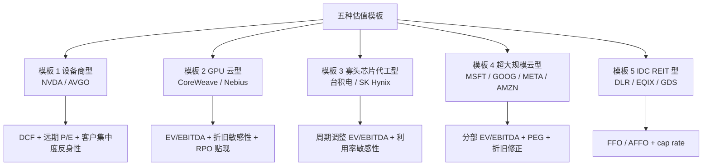
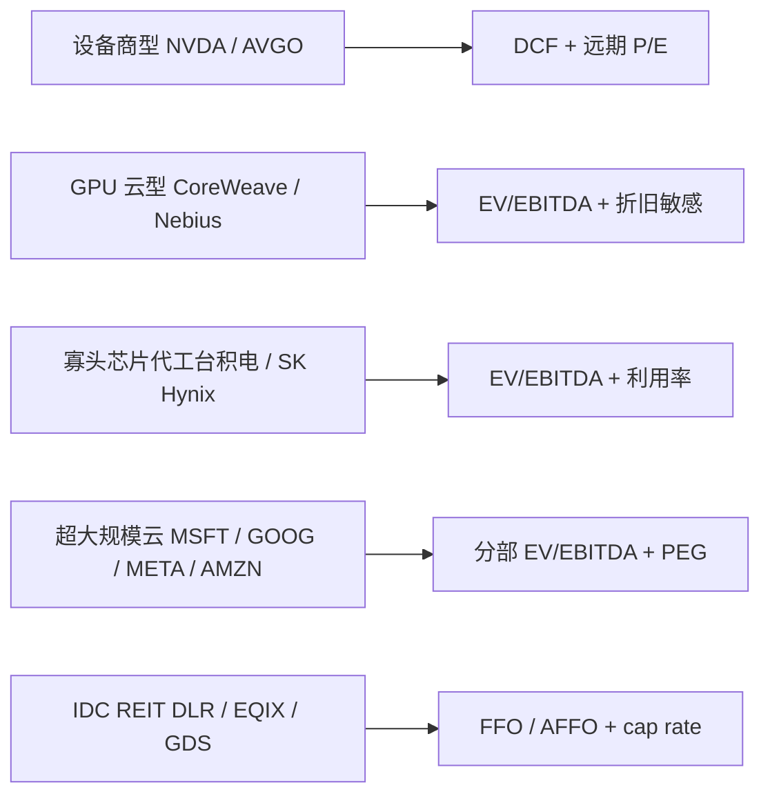
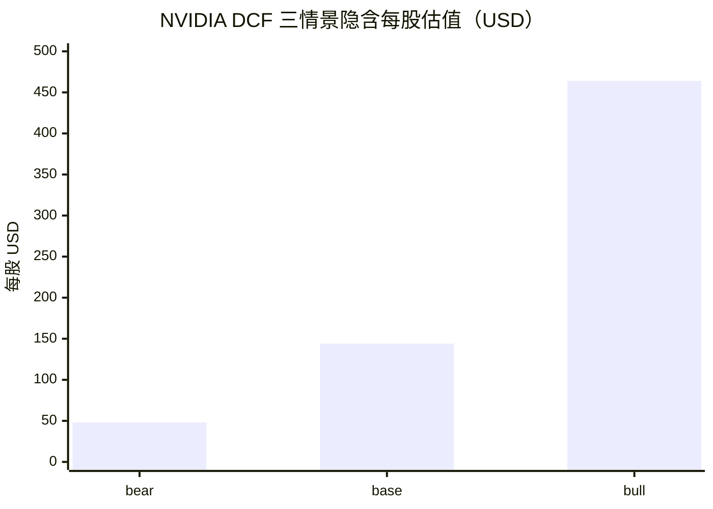
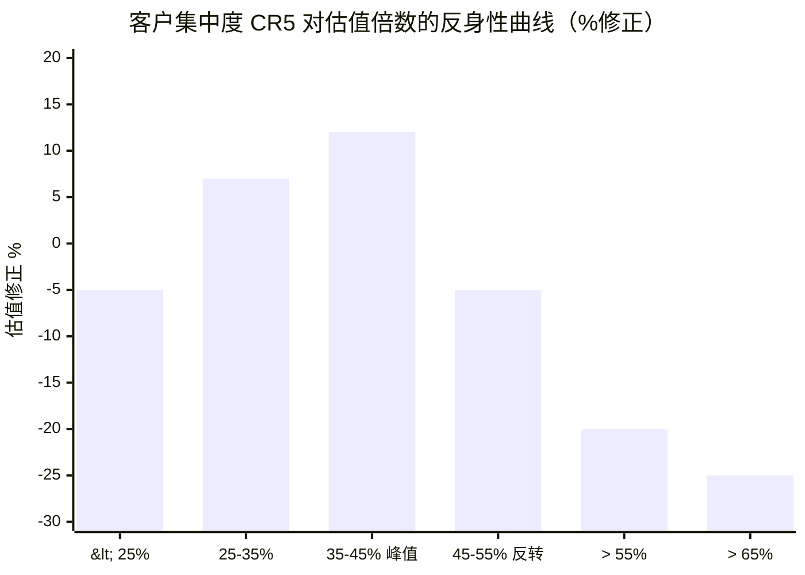
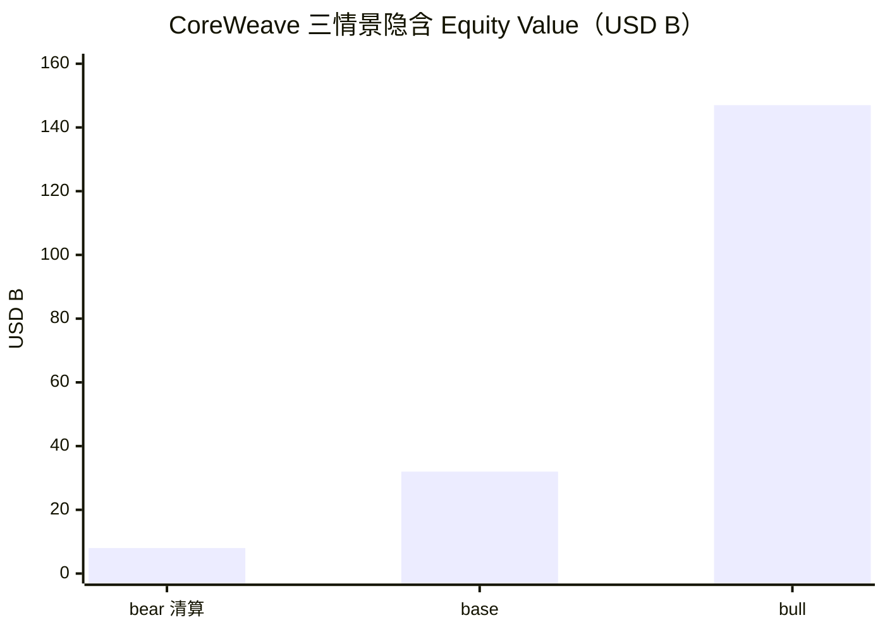
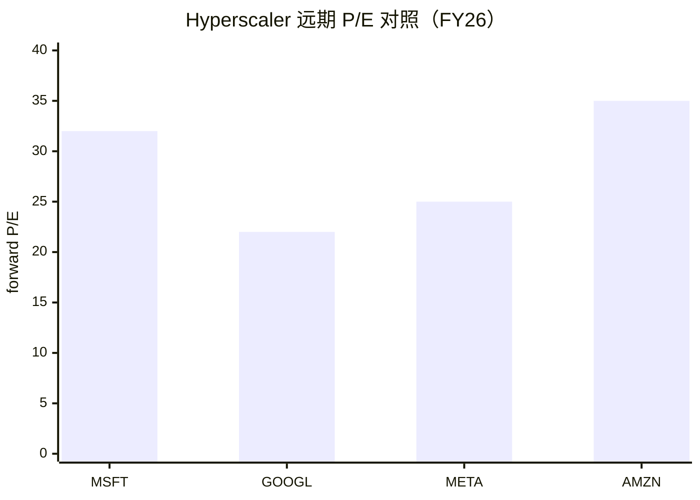
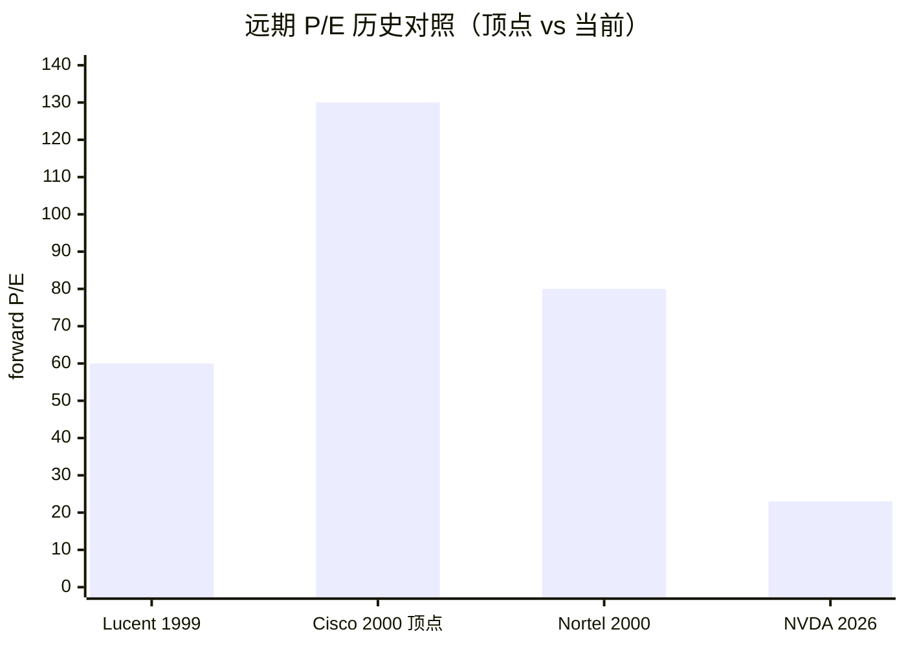
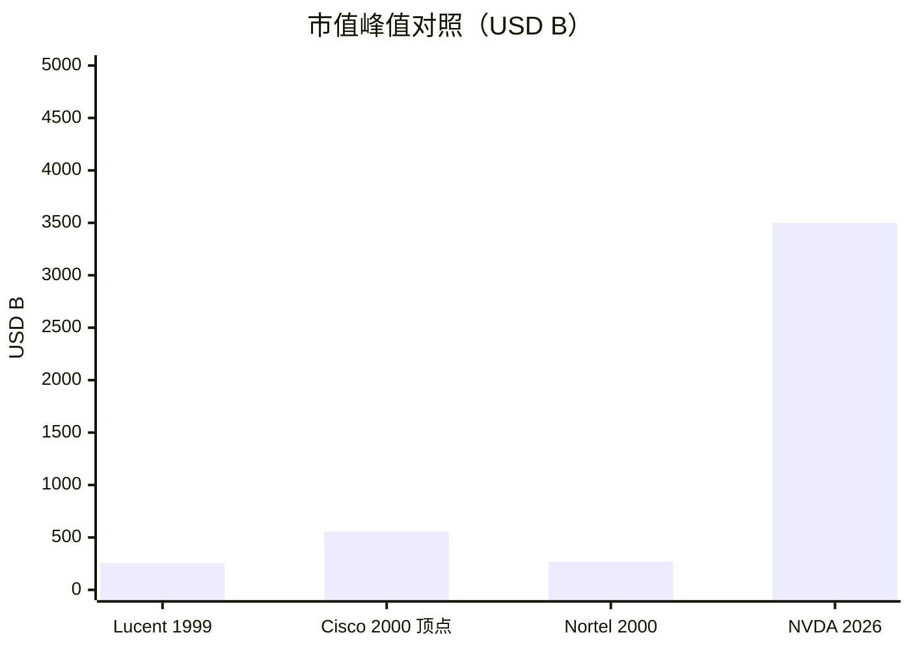

# 第 30 章 五种估值模板：NVDA + CoreWeave 完整建模

## 本章概览

读到第七部尾声，读者手里其实已经攒了 29 章的产业数据 —— 从硅到 token、从 H100 BOM 到 Mag7 资本支出、从 [SK 海力士](https://www.skhynix.com/) 周期波动到超大规模云厂折旧政策。剩下的问题只有一个：**这些数字能不能折算成估值**。

这是一个比算估值听起来更不耐烦的问题。打开任何一份卖方 [英伟达](https://www.nvidia.com/) 报告，扉页都会写一个目标价；打开任何一份 [CoreWeave](https://www.coreweave.com/) 覆盖报告，扉页会写一个 EV/EBITDA 倍数。

问题在于，这两份报告用的不是同一套估值模板：NVDA 用远期 P/E + DCF + 设备商可比，CoreWeave 用 EV/EBITDA + 6 年 vs 4 年折旧情景 + 客户集中度风险溢价。如果再加上 [台积电](https://www.tsmc.com/)、[Microsoft](https://www.microsoft.com/)、Equinix，五家公司至少要五套估值模型。**「用一套 P/E 估全部 AI 算力产业链」是市场最常见的智识懒惰**。

本章给读者五套可建模、可移植、可证伪的估值模板，按业务模式划分：



整本书最 heavy 工具箱章。两个模板（NVDA / CoreWeave）做完整建模，占本章 60% 篇幅，给出 base / bull / bear 三情景假设全套展开；另外三个模板给框架 + 关键 KPI，不展开建模 —— 因为这三类在 SEC / 台积电 IR / NAREIT 公开披露中已经标准化，读者拿到本章给的 KPI 表，可以自己套到任何一家公司上。

完整 Excel 5 套放附录 D-3。

议题 9（NVDA 估值是否过高）+ 议题 10（一级 GPU 云估值合理吗）在本章给 base / bull / bear 三套模型，**客观评论而非投资建议**。本章严格走 commentary-only 模式 —— 评论而非建议，不喊价格目标，不做买卖判断。章末必须有完整的 chapter-level disclaimer。

**第 16 章 vs 第 30 章共享 CoreWeave 数据但输出不同**：第 16 章是单一公司 case study，输出 EBITDA 拆解 + 折旧政策敏感性 + Burry 反情景 —— 回答的问题是60% EBITDA 是怎么算出来的。

第 30 章是可移植模板，输出 DCF + EV/EBITDA + 反身性溢价 + 客户集中度修正 —— 回答的问题是按什么估值模板看这类生意。两章分工明确，避免循环引用：读者在第 16 章拿到的是显微镜下的 CoreWeave 商业模型，在第 30 章拿到的是显微镜配套的尺子。

反共识 #5（客户集中度是 NVDA 估值反身性核心）的**主答辩**在本章 §30.3 —— 量化建模独立小节，给出客户集中度溢价 vs 折价的反身性模型 + 45% 阈值假说。这是本书全章节最关键的一个反共识判断，前面第 7 章（NVDA 五税）、第 29 章（周期 12 维度对照里的「维度 10 客户集中度」）已经多次铺垫，到本章给出**估值含义的量化结论**。

## 30.1 为什么一套 P/E 不够

P/E（Price-to-Earnings，市盈率）是市场用得最多的估值指标，但它的硬伤是把未来现金流的形态压缩成了一个数字。AI 算力产业链里，五种生意的现金流形态差异大到 P/E 这一个指标根本对不齐。



先把五种生意的现金流形态摊在桌上。

| 业务模式 | 营收增速 | 毛利率 | 资本支出 / Sales | 折旧周期 | 客户结构 | 主要估值方法 |
|---|---:|---:|---:|---:|---|---|
| 设备商型（NVDA / AVGO） | 60-75%（FY26）| 71-75% | 1-2% | 不重要 | 高度集中（CR5 ~40%） | DCF + 远期 P/E + 客户集中度修正 |
| GPU 云型（CoreWeave / Nebius） | 130-680%（YoY）| GAAP 营业利润率 < 5% / Adj EBITDA 60% | 100-200% | 6 年 vs 4 年关键 | 极度集中（CR1 ~60%） | EV/EBITDA + 折旧敏感性 + RPO 贴现 |
| 寡头芯片代工型（台积电 / SK 海力士） | 40-50% | 50-60% | 35-45% | 5-10 年 | 中度集中 | EV/EBITDA + 利用率敏感性 |
| 超大规模云型（MSFT / GOOG / META / AMZN） | 10-20%（公司层面）| 35-50%（公司）| 30-45% | 6 年（最近延长）| 高度分散 | 分部 EV/EBITDA + PEG + 折旧修正 |
| IDC REIT 型（DLR / EQIX / GDS） | 10-15% | 30-50% | 100%+ | 30-40 年（楼）| 中度集中 | FFO / AFFO + cap rate |

> 来源：综合本章 §30.2-30.7 各小节一手财报数据。营收增速取最近一期可对比口径（NVDA 用 FY26 YoY；CoreWeave 用 Q3 2025 YoY；台积电用 FY25 YoY；超大规模云厂取公司层面 FY25；IDC 取最新一期 FY25）。

把这张表读三遍，会发现五行没有任何一栏可以用同一个估值倍数去套。

**NVDA 拿到 71% 毛利率 + 1-2% 资本支出强度** —— 现金流到股东手里几乎没有经营再投资消耗，DCF 折现率敏感度极高，远期 P/E 也合理；用 EV/EBITDA 反而模糊（因为 NVDA 没有显著折旧摊销杠杆）。

**CoreWeave 拿到 60% 调整后 EBITDA + GAAP 营业利润率 < 5% + 6 年折旧** —— 估值的全部问题都在折旧期假设和客户集中度两个变量上，用 P/E 估等于直接把估值打成负值或负无穷；EV/EBITDA 是唯一合理的入口，但必须做 4 年 / 6 年情景测试 + RPO 贴现。

**台积电拿到 50-60% 毛利率 + 35-45% 资本支出强度 + 5-10 年折旧** —— 周期上行期 EV/EBITDA 看起来低，但要做利用率敏感性（80% 利用率 vs 60% 利用率 EBITDA 差 30%）。P/E 用不上，因为周期性公司用 P/E 估值在底部会显得贵、顶部会显得便宜，反向信号。

**超大规模云厂用分部 EV/EBITDA + PEG** —— 因为整体公司层面有大量非 AI 业务（搜索、广告、零售、Office），AI infra 必须分部估值。AI infra 折旧期从 4 年延到 6 年这件事在 FY25 给 MSFT / GOOG 单家增加 EPS 约 0.7-1.4%，这一项不修正会高估超大规模云型 AI 业务真实经济。

**IDC REIT 用 FFO（Funds From Operations，REIT 行业的经营性现金流概念，把净利润加回折旧再扣资本利得）/ AFFO（Adjusted FFO，扣除维护性资本支出后的可分红现金流）+ cap rate（资本化率，NOI / 物业估值）** —— 因为 REIT 的会计折旧远高于真实经济折旧（楼能用 30-40 年，账上 27.5 年），P/E 完全失真。cap rate 是 IDC 行业的折现率代理，把 NOI（净运营收入）除以物业估值得到。

把这五种放在一起对比，结论很清楚：**估值模板必须按业务模式分类**。

下面六节按顺序展开五个模板。设备商型 + GPU 云型完整建模（§30.2 / §30.3 / §30.4），其余三型给框架 + KPI（§30.5 / §30.6 / §30.7）。

## 30.2 模板 1 设备商型 —— NVDA 完整 DCF + 三情景

NVDA FY26（截至 2026-01-25）刚交完一份难以再被超过的成绩单：全公司营收 \$215.9B（YoY +65%）、数据中心营收 \$193.7B（YoY +68%）、GAAP 毛利率 71.1%、GAAP 净利润 \$120.1B、稀释 EPS \$4.90（YoY +67%）、Q4 单季营收 \$68.1B（QoQ +20%、YoY +73%）、Q4 GAAP 毛利率 75.0%，FY27Q1 营收指引 \$78.0B ±2%。FY26 全年股东返还 \$41.1B（回购 + 分红），剩余回购授权 \$58.5B（来源同上）。

这是一组按所有传统估值标准都难以理解的数字。一家年化营收 \$215B 的公司还能维持 +65% 营收增速 + 71% 毛利率 + FY26 全年自由现金流 ~\$114B（FCFE 简化口径：净利 \$120.1B - 资本支出 \$6.04B，未扣 SBC 约 \$5B；资本支出一手验证自英伟达 FY26 Q4 财报新闻稿现金流量表 Purchases related to property and equipment and intangible assets: \$6,042 million；§30.2 后续 DCF 模型表格采用 FCFF 口径 ~\$102B），自由现金流 margin 约 53% —— 在过去 25 年的标普 500 公司里没有第二家可比。

但这件事的另一面：FY26 全年 NVDA 股价从 ~\$140 涨到 ~\$160 区间小幅震荡，市值在 \$3.5-4T 之间晃动 —— **市场已经把 FY26 这份成绩单 price in 了**。

NVDA 估值的核心问题落在这里：当前股价对应远期估值，已经在 price in 什么样的 FY27-FY30 营收路径、毛利率路径、资本支出路径？换一个角度问：当前估值对应的隐含增速是多少，能不能被未来的 RPO + 客户资本支出指引 + HBM4 / Rubin 产品周期支撑？

本节用 DCF（Discounted Cash Flow，折现现金流模型）拆 NVDA 估值。

> DCF：把公司未来每一年的自由现金流按 WACC 折现到当前时点，加上终值，得到企业价值；EV 减去净债务得到股权价值。

模型的全部主观性集中在四个变量上：营收增速假设、毛利率假设、资本支出强度假设、WACC（Weighted Average Cost of Capital，加权平均资本成本）假设。本节把这四个变量在 base / bull / bear 三情景下完整展开。

### 30.2.1 DCF 框架与基础假设

DCF 模型的标准公式：

```
EV = Σ [FCF_t / (1 + WACC)^t] + TV / (1 + WACC)^N
其中：
  FCF_t = Revenue_t × Operating Margin × (1 - Tax Rate) + 折旧摊销 - 资本支出 - ΔWC
  TV = FCF_{N+1} / (WACC - g)
  g = 永续增长率
```

四类输入变量：

| 类别 | 变量 | base | bull | bear | 说明 |
|---|---|---:|---:|---:|---|
| 增长 | FY27 营收 YoY | +35% | +50% | +20% | 卖方 FY27 共识 +40% 业内综合，base 取偏保守 |
| | FY28 营收 YoY | +20% | +35% | +10% | 增速向 FY30 收敛 |
| | FY29 营收 YoY | +15% | +25% | +5% | 同上 |
| | FY30 营收 YoY | +10% | +18% | -5% | bear 假设进入产品代际真空期 |
| | 永续增速 g | +4% | +6% | +2% | 长期数据中心增速 |
| 利润 | GAAP 营业利润率 | 60% | 65% | 50% | FY26 全年 60.4%；bull 假设 HBM4 + 整柜溢价拉升；bear 假设 ASIC 替代 + 价格战 |
| | 有效税率 | 14% | 14% | 14% | NVDA 历史范围 13-15% |
| 资本 | 资本支出 / Revenue | 2.5% | 2.0% | 4.0% | NVDA FY26 实际资本支出 \$6.04B / 营收 2.80%；fabless 模式；base 取低于实际反映维护性资本支出主导假设，bull 进一步压低反映 forward 资本支出收敛，bear 上调反映 Rubin / HBM4 产能投入与产品周期切换 |
| | 折旧摊销 / Revenue | 1.5% | 1.5% | 1.5% | 固定 |
| | ΔWC / 营收增量 | 8% | 6% | 10% | NVDA 应收增长跟营收同步 |
| 折现 | WACC | 9.0% | 8.5% | 10.5% | NVDA 历史 β ~1.4，无风险利率 2026 ~4.3% |
| | 终值倍数 | g 法 | g 法 | g 法 | 用永续增长法不用 exit multiple |

> 来源：FY26 财务实际数来自英伟达 FY26 Q4 新闻稿；卖方 FY27 共识区间取 Bloomberg / Visible Alpha 综合 2026-05；WACC 计算 = 4.3% + 1.4 × 4.5% 风险溢价 = 10.6% 偏高端，市场实际定价 NVDA WACC 业内估算 8.5-9.5%，本表 base 取 9.0%。**业内估算的 base/bull/bear 全部假设在此明示**。

四个变量里**最敏感的是营业利润率**。NVDA FY26 全年 GAAP 营业利润率 60.4%（130.4 / 215.9），这件事在历史上是异常水位 —— 过去 10 年 NVDA 营业利润率长期在 30-40% 区间，2024 以后才跳到 60%+。这个 60% 能否在 FY27-FY30 维持，决定了估值的大头。

第二敏感是**永续增速 g**。在 DCF 里，终值通常占总 EV 的 60-75%。永续增速 +4% vs +6% 的差异，在 WACC 9% 下相当于终值差 50%。这两个数字在 NVDA 这种刚交完 +65% YoY 增速答卷的公司上特别难定 —— bull 派会说 AI 还在 1995 年的 Internet，bear 派会说摩尔定律 + ASIC 竞争已经在压利润率。本表两端各取一个合理保守区间。

### 30.2.2 base case：FY27-FY30 营收路径

base case 的核心假设：**FY27 营收 +35%、毛利率维持 71%、营业利润率维持 60% 但温和向下**。

这套假设的具体落点：

| 财年 | 营收（USD B） | YoY | GAAP 营业利润率 | 营业利润（USD B） | NOPAT（USD B） | 资本支出（USD B） | 自由现金流（USD B） |
|---|---:|---:|---:|---:|---:|---:|---:|
| FY26 实际 | 215.9 | +65% | 60.4% | 130.4 | 112.1 | 6.04 | ~102 |
| FY27 base | 291.5 | +35% | 60.0% | 174.9 | 150.4 | 7.3 | 142 |
| FY28 base | 349.8 | +20% | 58.0% | 202.9 | 174.5 | 8.7 | 167 |
| FY29 base | 402.3 | +15% | 56.0% | 225.3 | 193.7 | 10.1 | 186 |
| FY30 base | 442.5 | +10% | 54.0% | 239.0 | 205.5 | 11.1 | 198 |

> 假设：base 资本支出 / Revenue 2.5%（实际 FY26 2.80%，base 假设维护性资本支出占主导），税率 14%，折旧摊销 ≈ 1.5% × 营收。FY26 实际资本支出 \$6.04B 来自英伟达 FY26 Q4 新闻稿现金流量表（Purchases related to property and equipment and intangible assets: \$6,042 million）；FY27-FY30 全部为 base 假设投影，公司未提供。NOPAT = 营业利润 × (1 - 14% 税率)，与 §30.2 开头 GAAP 净利润 \$120.07B（含非营业项目如利息收入 / 投资收益）口径不同；FCFF 建模采用 NOPAT 口径，含折旧摊销加回 + ΔWC 扣减。**业内估算的 base 假设在此明示**。

把这套自由现金流路径用 WACC 9.0% 折现 + 永续增速 4% 的终值：

```
PV of 自由现金流 (FY27-FY30) = 142/1.09 + 167/1.09² + 186/1.09³ + 198/1.09⁴
                     = 130 + 141 + 143 + 140 = $554B

TV at end FY30 = 198 × 1.04 / (0.09 - 0.04) = 4,118B
PV of TV = 4,118 / 1.09⁴ = $2,917B

EV = 554 + 2,917 = $3,471B

净现金 ~$50B（FY26 期末）
Equity Value = $3,521B
Shares Outstanding ~24.5B
DCF 隐含每股 ~$144
```

> 本计算为本书 base 假设下的隐含估值参考，不构成对 NVDA 的目标价。

**这套 base 假设对应每股 ~\$144**（资本支出输入采用 FY26 一手数据 \$6.04B + 资本支出/Revenue 2.5%；DCF 输出每股 ~\$144，对资本支出起点的弹性 < 0.5%）。读者可以拿这个数字跟自己看的报价系统对比 —— **如果当前股价远高于此**，意味着市场在 price in 比 base 更乐观的路径；**如果远低于此**，意味着市场在 price in 比 base 更悲观的路径。高于或低于本身不构成投资判断，只是说明读者需要把对应假设揭示出来，看自己接不接受。

### 30.2.3 bull case：HBM4 / Rubin + sovereign AI 增量

bull case 的核心假设：**HBM4 爬坡 + Rubin 架构 + sovereign AI 增量需求把 FY27-FY30 维持在更高增速**。

| 财年 | 营收（USD B） | YoY | GAAP 营业利润率 | 营业利润（USD B） | 自由现金流（USD B） |
|---|---:|---:|---:|---:|---:|
| FY27 bull | 323.9 | +50% | 64.0% | 207.3 | 170 |
| FY28 bull | 437.3 | +35% | 64.5% | 282.0 | 234 |
| FY29 bull | 546.6 | +25% | 64.0% | 349.8 | 292 |
| FY30 bull | 645.0 | +18% | 63.5% | 409.6 | 343 |

> 假设：bull 资本支出 / Revenue 2.0%（HBM4 / Rubin 周期下 forward 资本支出占比下降，向维护性资本支出收敛），税率 14%，营业利润率温和上升（HBM4 + Rubin 整柜溢价）。FY26 实际资本支出 \$6.04B 来自英伟达 FY26 Q4 新闻稿一手数据。FY27-FY30 全部为 bull 假设投影。**业内估算的 bull 假设在此明示**。

bull case 的核心叙事：

1. **HBM4 爬坡把单卡 ASP 推高 30-50%**：HBM4 stack 价格业内估算从 HBM3e 的 \$250 涨到 \$400-500，NVDA Rubin（市场预期 2026 年下半年发布）单卡用 8-12 个 HBM4 stack，HBM 成本占 BOM 比从 H100 的 27% 涨到 35%+，但 NVDA 把成本传导给客户的能力仍在（基于第 7 章 §7 供给紧缺税的逻辑），ASP 上升幅度大于 BOM 上升幅度。

2. **Rubin / Rubin Ultra 整柜（NVL144 / NVL576）卖方加价 15-25%**：NVL72（GB200 整柜）单柜 ASP 业内估算 \$3M-\$3.5M，Rubin 整柜业内预期 \$4M+，整柜模式同时把系统设计税和 NVLink 系统税的占比拉高（第 7 章 §4 / §5 已建立基线）。

3. **sovereign AI 增量**：2025-2026 中东（沙特 / UAE）、印度、欧洲国家级 AI 算力订单签约规模累计 \$100B+ 量级。这部分需求与超大规模云厂资本支出周期相对独立，对冲了客户集中度风险。

bull case 隐含估值：用同样 DCF 框架 + WACC 8.5% + 永续增速 6%：

```
PV of 自由现金流 (FY27-FY30) = 170/1.085 + 234/1.085² + 292/1.085³ + 343/1.085⁴
                     ≈ 157 + 199 + 229 + 247 = $832B

TV at end FY30 = 343 × 1.06 / (0.085 - 0.06) = 14,547B
PV of TV = 14,547 / 1.085⁴ = $10,490B

EV = 832 + 10,490 = $11,322B
DCF 隐含每股 ~$464（24.5B 股本；资本支出起点采用 FY26 一手 $6.04B + bull 资本支出/Revenue 2.0%）
```

> 本计算为本书 bull 假设下的隐含估值参考，不构成对 NVDA 的目标价。

bull case 的两个**最敏感假设**：永续增速 6% + WACC 8.5%。这两个假设的合理性来自 AI 算力是下一代基础设施 → 永续增速可以维持在通胀以上 + WACC 可以低于风险溢价均值。读者如果不接受这两个假设，bull case 隐含估值会快速回落。

### 30.2.4 bear case：客户集中度反身性 + 训推比例反转

bear case 的核心假设：**FY27 营收增速大幅减速 + 客户集中度反身性触发 + ASIC 替代加速 + 训推比例反转**。

| 财年 | 营收（USD B） | YoY | GAAP 营业利润率 | 营业利润（USD B） | 自由现金流（USD B） |
|---|---:|---:|---:|---:|---:|
| FY27 bear | 259.1 | +20% | 56.0% | 145.1 | 114 |
| FY28 bear | 285.0 | +10% | 50.0% | 142.5 | 113 |
| FY29 bear | 299.3 | +5% | 46.0% | 137.7 | 110 |
| FY30 bear | 284.3 | -5% | 42.0% | 119.4 | 97 |

> 假设：bear 资本支出 / Revenue 4.0%（Rubin / HBM4 产品代际切换 + 产能投入加重），FY30 出现下行年（产品代际真空 / 客户资本支出转向 / ASIC 抢份额），营业利润率每年下行 4-6 pp。FY26 实际资本支出 \$6.04B 来自英伟达 FY26 Q4 新闻稿。FY27-FY30 全部为 bear 假设投影。**业内估算的 bear 假设在此明示**。

bear case 的核心叙事拆三块：

**第一块：客户集中度反身性触发**。NVDA FY26 数据中心营收前 5 大客户合计 ~40%（业内估算 MSFT + META + AMZN + GOOG + ORCL，FY26 10-K Risk Factors 章节披露 two customers each represented more than 10% of total revenue，未具名）。在 §30.3 会单独建反身性量化模型，这里只摆 bear case 触发条件：**任一头部客户 FY27Q1-Q2 单季度资本支出指引砍单超 15% 且未被其他客户增量吸收**。

**第二块：训推比例反转**。当前 NVDA 数据中心营收里训练 + 推理大致五五开（业内估算，公司不分类披露）。bear case 假设 2026-2028 推理优化（Mamba / SSM / MoE 稀疏化 / 蒸馏 / FP4 推理 / 推理芯片化 ASIC 化）把推理算力需求大幅压低，推理迁移到 Trainium / TPU v6 / Maia / MTIA / Ascend 等 ASIC 比例上升至 40%+（FY26 ASIC 占比业内估算 15-20%，参考第 11 章 ASIC 三阶模型）—— 这件事直接打 NVDA 推理增量叙事。

**第三块：HBM / CoWoS 供给瓶颈缓解后议价空间下降**。CoWoS 产能 2026 年扩到 ~70K 晶圆/月（业内估算，台积电 2025 Capital Markets Day 指引）；HBM 供给 SK 海力士 / 三星 / 美光（Micron） 三家产能扩张后 2026-2027 进入相对宽松；瓶颈缓解后供给紧缺税那一块（第 7 章 §7）压缩，整体毛利率下行 3-5 pp。

bear case 隐含估值：

```
PV of 自由现金流 (FY27-FY30) = 114/1.105 + 113/1.105² + 110/1.105³ + 97/1.105⁴
                     ≈ 103 + 93 + 81 + 65 = $342B

TV at end FY30 = 97 × 1.02 / (0.105 - 0.02) = 1,164B
PV of TV = 1,164 / 1.105⁴ = $781B

EV = 342 + 781 = $1,123B
DCF 隐含每股 ~$48（24.5B 股本；资本支出起点采用 FY26 一手 $6.04B + bear 资本支出/Revenue 4.0%）
```

> 本计算为本书 bear 假设下的隐含估值参考，不构成对 NVDA 的目标价。

**三情景隐含估值范围 ~\$48 - \$144 - \$464**。这个区间的宽度本身就是结论 —— **DCF 对增长率 + 营业利润率 + 折现率三个假设的弹性非常大**。



一个负责任的估值结论是把三情景的概率权重明示，**本书不给概率权重**，因为概率权重等于隐含的多空判断，违反 commentary-only 边界。

### 30.2.5 敏感度矩阵：HBM 价格 × CoWoS 利用率 × 客户集中度 × WACC

DCF 三情景已经展示了估值对增长率 + 营业利润率的弹性。但 NVDA 估值的另外两个关键变量 —— HBM 价格变动 + CoWoS 利用率 + 客户集中度 + WACC —— 需要单独做敏感度矩阵。

把 base case 的 EV ~\$3,471B 当作基准，分别测试四个变量上下 ±20% 移动对估值的影响（其他假设不变）：

| 变量 | -20% 移动 | -10% 移动 | base | +10% 移动 | +20% 移动 |
|---|---:|---:|---:|---:|---:|
| HBM4 stack 价格 ↑ → 营业利润率 ↓ | EV \$3,822B | \$3,646B | \$3,471B | \$3,296B | \$3,120B |
| CoWoS 利用率 ↓ → 营收 ↓ | EV \$2,777B | \$3,124B | \$3,471B | \$3,818B | \$4,165B |
| 客户集中度 → 反身性触发概率 ↑ | EV \$4,162B | \$3,816B | \$3,471B | \$3,124B | \$2,778B |
| WACC ↑ → 折现率 ↑ | EV \$4,512B | \$3,914B | \$3,471B | \$3,124B | \$2,847B |

> 计算口径：变量与 EV 的弹性 = (EV 变化 / EV) ÷ (变量变化 / 变量)；这里近似为线性，实际 DCF 弹性在大幅扰动下非线性。HBM 价格 +20% 对营业利润率压缩 ~2 pp；CoWoS 利用率 -20% 对营收 -8%；客户集中度反身性触发概率每升 10% 对 EV -10%（这是 §30.3 模型的简化形式）；WACC 上下 1 pp 对应 +20%/-20% 区间。WACC ±20% 对应 WACC ∈ [7.2%, 10.8%]，覆盖卖方综合 NVDA WACC 8.5-9.5% 业内区间。

**最敏感的变量是 CoWoS 利用率**（涉及 NVDA 营收的物理供给能力）和 **WACC**（涉及永续增长终值占比）。HBM 价格和客户集中度是次敏感。这件事直接呼应第 4 章（台积电 / CoWoS）+ 第 6 章（HBM）+ 第 29 章（周期定位）—— NVDA 估值的物理供给基础是 CoWoS / HBM 两个瓶颈，金融定价基础是 WACC，反身性传导是客户集中度。

### 30.2.6 远期 P/E + 周期调整 EBITDA 双指标对照

DCF 给的是理论估值，市场实际上日常用的是远期 P/E 和 EV/EBITDA。两个指标在 NVDA 上的意义对照如下：

| 指标 | base case 下 FY27 隐含倍数 | 历史 NVDA 区间 | 历史半导体寡头区间 | 解读 |
|---|---:|---:|---:|---|
| 远期 P/E（FY27，市值 / 净利近似）| 市值 3,521B / NOPAT 150B ≈ 23x | 25-50x | 15-30x（台积电 / 英特尔历史均值）| 接近半导体寡头历史区间下沿 |
| 周期调整 EV/EBITDA | EV 3,471B / EBITDA 187B = 19x | 20-40x | 10-22x（台积电 / SOX 均值）| 接近历史半导体均值偏高 |
| PEG（P/E 除以未来 3 年 EPS CAGR） | 23x / 15% = 1.5x | 1-2x | 0.8-1.5x | 处于行业合理区间偏高 |

> 计算口径：用 base case FY27 数字。FY27 EBITDA = 营业利润 174.9 + 假设折旧摊销 12 = ~187B。NVDA 历史远期 P/E 区间取 2015-2026 Bloomberg；半导体寡头取台积电 / 英特尔历史 P/E 长期均值。base case 隐含 PEG 1.5x，FY27-FY30 base 假设 EPS CAGR ~15%。

把这三个指标的对照拼起来，得出三个**客观观察**（不构成多空判断）：

1. **DCF base case 隐含 EV \$3,471B 对应远期 P/E 23x**，在 NVDA 自身历史区间下沿、在半导体寡头历史区间中位 —— 意味着 base case 估值假设并不激进。
2. **远期 P/E vs 周期调整 EV/EBITDA 的差异**：FY27 base 下远期 P/E 23x 但 EV/EBITDA 19x，两者比例对应低折旧摊销 + 低资本支出的轻资产财务结构 —— 这是 NVDA fabless 模式相对超大规模云厂重资产的财务比较优势（FY26 实际资本支出占营收 2.80%）。
3. **PEG 1.5x** 已经在所有半导体寡头历史中位偏高位置 —— 这意味着市场已经把高增长 + 高估值的部分 price in；任何对未来 3 年 EPS 增速的下修都会直接反映在 PEG 上。

历史对照需要一个专项：**NVDA 当前估值 vs 思科（Cisco） 1999-2000 高点估值分位**。这是 §30.8 会展开的5 个模板的历史估值区间分位数小节。这里先给一个核心数字：思科 FY2000（calendar year 2000）远期 P/E 峰值约 130x（trailing P/E 顶峰量级 ~200-220x，取决于具体时点与 EPS 口径；ycharts 付费数据 + 思科 FY1999 split-adj EPS \$0.29 / FY2000 \$0.36 独立核算），1999-2000 之交曾突破 120x forward，对应市值 ~\$555B。NVDA 当前估值在 P/E 维度远低于思科 1999-2000 高点 —— 但市值上 NVDA 的绝对值已经远超过思科 1999-2000 顶点。这件事的含义在 §30.9 议题 9 主答辩里展开。

## 30.3 模板 1 独立小节 —— 客户集中度反身性量化模型

这是本书反共识 #5 的**主战场**。前面第 7 章 §6（NVDA 五税里的客户绑定税）+ 第 29 章 §维度 10（客户集中度对照）已经多次铺垫客户集中度问题，本节给出**估值含义的量化结论**。

主张：**当前市场把 NVDA 客户集中度（FY26 五大客户合计约 40%）当作「绑定优质客户」的反身性溢价处理是错的；客户集中度对估值的传导有一个明确的拐点 —— 低于阈值是溢价、高于阈值反转为折价**。本书提出的判断阈值是 **NVDA 五大客户合计营收占比 45%**。

### 30.3.1 反身性概念与 Soros 框架

反身性（Reflexivity）是 George Soros 在《金融炼金术》中提出的金融市场理论：市场参与者的判断会改变市场基本面，反过来又被改变后的基本面影响 —— 形成自我强化（顺周期）或自我加强反转（顶部 / 底部）的循环。Soros 的核心洞察是**金融市场不是简单地反映现实，而是在塑造现实**。

把这套框架套到 NVDA 客户集中度上，分两个方向：

**顺周期反身性（溢价方向）**：
1. NVDA 客户集中度高 → MSFT / META / AMZN / GOOG / ORCL 占 NVDA 营收 ~40%
2. 这 5 家公司本身现金流强劲（Mag7 自由现金流合计 \$400B+，第 29 章 §维度 8）
3. 市场判断 NVDA 绑定超大规模云厂共享 AI 周期上行 → 给予估值溢价
4. NVDA 估值上行 → 5 家公司继续大额资本支出采购 → NVDA 业绩超预期
5. 业绩超预期 → 估值进一步溢价 → 5 家公司更愿意承诺 multi-year RPO 长约
6. 循环回到第 1 步，反身性自我强化

**反身性反转条件（折价方向）**：
1. 集中度突破阈值 → 单一客户砍单的尾部风险开始大于上行收益
2. 任一客户单季资本支出指引砍单超 15% → NVDA 营收即期承压
3. 市场判断集中度变成脆弱性→ 估值开始反向折价
4. NVDA 估值下行 → 客户议价权进一步上升 → 后续 ASP 承压
5. ASP 承压 → 毛利率压缩 → 业绩低于预期 → 估值进一步折价
6. 循环加速反转

Soros 反身性的关键在于**拐点不可预测但可以观察到信号**。本节的核心贡献是把拐点信号具体化到一个可测量阈值 —— 客户集中度 45%。

### 30.3.2 量化模型：集中度 × 估值溢价/折价

把客户集中度 CR5（前 5 大客户合计占营收比）作为自变量，估值溢价/折价作为因变量。基于产业经验 + 历史半导体寡头数据反推（Lucent 1999 / 思科 2000 / 英特尔数据中心业务长期 / 台积电），本书提出以下量化曲线：

| CR5 区间 | 反身性方向 | 估值倍数修正（相对中性） |
|---|---|---:|
| < 25% | 中性偏折价（业务分散溢价不显著）| -5% |
| 25-35% | 溢价（绑定大客户红利 > 集中度风险） | +5-10% |
| 35-45% | **峰值溢价**（享受超大规模云厂红利但风险未触发）| +10-15% |
| **45-55%** | **反转区**（溢价开始转折价，单一客户砍单尾部风险开始压估值） | **±0 到 -10%** |
| > 55% | 显著折价（多客户砍单情景概率上升）| -15-25% |
| > 65% | 深度折价（集中度被市场定价为脆弱性） | -25%+ |

> 本曲线为基于半导体 / 设备业 / 云服务行业的历史观察反推 + 经验判断，无单一一手出处。曲线在 45% 附近的反转点是本书的**反共识主张**。



NVDA FY26 五大客户合计 ~40%，按本曲线处于**峰值溢价 +10-15% 区间**。但第 7 章 §6 已经分析过 NVDA 客户集中度的演化轨迹：FY24 ~40%、FY25 ~40%、FY26 ~40% 持续在 35-45% 区间稳定。

两个时点口径给出更细粒度数据：FY26 Q2 10-Q 单季口径 Customer A 23% + Customer B 16% = 39%，H1 35%，Top 6 entities = 85%；FY26 年报（10-K）综合口径 Customer A 22% + Customer B 14% = 36%。

年报口径相对季报口径平滑掉单季波动，反共识 #5 的拐点对照应以**年报 36% 口径**为基准 —— 这意味着 NVDA 目前**正好处于反身性曲线的峰值溢价位置，距离反转拐点 45% 还有 9 个百分点**（按季报 39% 口径距拐点 6 个百分点）——这是反身性溢价模型的可证伪条件之一（详 §30.3.4）。

### 30.3.3 反身性传导表：从 CR5 上升到估值压力

把 CR5 从 40% 上升到 50% 这件事发生时，反身性如何传导，分 5 步：

| 阶段 | CR5 % | 触发条件 | 估值反应 | NVDA 远期 P/E 隐含变化 |
|---|---:|---|---|---:|
| 1. 当前 | 40% | base 假设维持 | 峰值溢价 +10-15% | 25-30x（base） |
| 2. 集中度温和上行 | 42-44% | 某客户资本支出加码 + 其余客户不变 | 仍在溢价区，但市场开始关注 | 23-28x |
| 3. 触及阈值 | 45% | 头部客户额外签 RPO（如类似 META \$21B、Anthropic \$30B 量级合同储备信号）| 反身性开始反转 | 20-25x |
| 4. 突破阈值 | 47-50% | 头部客户资本支出占比继续上升 | 估值开始折价 | 17-22x |
| 5. 反向加速 | > 50% | 同时任一客户传出资本支出削减 / ASIC 转移 | 折价加速 | 14-18x |

> 远期 P/E 隐含变化是本书基于反身性曲线 + DCF 敏感度推演，非市场实测数据。阶段 3 的触发情景里 META Anthropic 合同储备引用 CoreWeave 2026-04 Meta \$14.2B / Anthropic \$30B 长约公告，这些合同储备间接影响 NVDA 客户集中度结构。

这张表的核心信号：**CR5 在 45% 这条线上是非线性反转，不是连续上升**。换句话说，集中度从 40% → 44% 这段是溢价区，但从 44% → 46% 这一小段就跨过了反转点 —— 这是 Soros 反身性突变临界点的具体表现。

### 30.3.4 反共识 #5 主张 + 可证伪条件

**主张陈述**：当前市场把 NVDA 客户集中度作为「绑定优质客户」的反身性溢价处理是错的，因为这只看到了反身性的顺周期一面。客户集中度对估值的传导有一个明确的拐点，本书提出的阈值是 **CR5 = 45%**。低于 45% 是溢价、高于 45% 反转为折价。FY26 NVDA CR5 ~40% 处于峰值溢价位置，但距反转拐点不远。

**可证伪条件**：
1. **NVDA 任一头部客户（MSFT / AMZN / GOOG / META / ORCL）单季度资本支出指引砍单超 15%**，且未被其他客户增量吸收，市场反应未出现 NVDA 即期跌 20%+ → 反身性模型证伪。
2. NVDA 五客户合计占比若在 2026-FY27 期间**降至 35% 以下且 P/E 维持 35x+**，则集中度即溢价的市场定价仍是合理的，本主张需修正。
3. 若五客户合计占比突破 50% 且 NVDA 估值仍维持远期 P/E ≥ 30x，则反身性反转滞后于本主张预期。**对照 FY26 Q2 一手硬口径 Customer A 23% + B 16% = 39%（单季）/ FY26 年报口径 22% + 14% = 36%（综合），按年报口径距 45% 拐点 9 个百分点、按季报口径距拐点 6 个百分点；这是反身性溢价模型的最直接可证伪条件**。

**监测指标**：
- NVDA 10-K Risk Factors + 季度 10-Q 客户集中度披露
- Mag7 季度资本支出指引及变化
- CoreWeave / Nebius / Crusoe 等中间层客户对 NVDA 的采购集中度（间接传导）
- ASIC 客户（TPU / Trainium / MTIA）的采购规模变化

### 30.3.5 反身性溢价折价对照表

| 维度 | 顺周期反身性（溢价） | 反向反身性（折价） |
|---|---|---|
| 触发 | 集中度稳定 + 客户资本支出加码 | 集中度突破阈值 + 任一客户砍单 |
| 估值表现 | 远期 P/E 25-35x | 远期 P/E 15-22x |
| 毛利率传导 | 维持 71-75% | 压缩至 65-68% |
| 营收增速预期 | +30-50% YoY | +10-20% YoY |
| 客户议价权 | NVDA 主导（紧缺 + 路径依赖）| 客户主导（ASIC 替代 + 多供应商）|
| 类比历史阶段 | 思科 1998（before 顶点）| 思科 2001-2002 |

> 来源：本节 §30.3.1-30.3.4 推演；历史阶段类比参 §30.8.2 思科 / Lucent 对照。

这张表的右列是 bear 情景但不是预测 —— 本书不预测拐点出现的时点，只指出**拐点条件 + 拐点信号 + 拐点反应**。是否真发生取决于未来 12-24 个月的客户资本支出指引动态。

## 30.4 模板 2 GPU 云型 —— CoreWeave 完整 EV/EBITDA 建模

把视角切到一级 GPU 云。设备商型估值看的是卖给谁和价格能维持多久；GPU 云型估值看的是借多少钱建机房、机房几年回本、客户跑不跑路。两类生意的核心估值矛盾完全不同。

CoreWeave 是这一类生意里上市最早、披露最详细、客户结构最极端的案例。

本节用 CoreWeave 做完整 EV/EBITDA 建模，加上**forward 资本支出 vs maintenance 资本支出拆分** —— 这件事在 GPU 云行业经常被混淆，是估值争议的核心。

### 30.4.1 CoreWeave Q3 2025 关键数据回顾

第 16 章已经把 CoreWeave Q3 2025 8-K 逐行拆开过。本节只列估值建模需要用的数字：

| 项 | Q3 2025 | 年化（×4） | 口径 |
|---|---:|---:|---|
| Revenue（季度） | \$1,364.7M | \$5,459M | GAAP 一手 |
| 调整后 EBITDA | \$838.1M | \$3,352M | non-GAAP 公司口径 |
| 调整后 EBITDA 利润率 | 61.4% | — | non-GAAP |
| GAAP Operating Income | \$51.9M | \$208M | GAAP，营业利润率 3.8% |
| GAAP 净亏损 | \$(110.1)M | \$(440)M | GAAP |
| 折旧摊销 | ~\$630M | ~\$2,520M | 一手综合 |
| Interest Expense | \$310.6M | \$1,242M | GAAP，年化利息 ~\$1.24B |
| 总债务 | ~\$14B | — | 一手综合 |
| Revenue Backlog | \$55.6B | — | 8-K 一手 |
| 2025 全年营收指引 | \$5.05-5.15B | — | 8-K 下调 |
| 2026 营收市场预期 | \$12-13B | — | 卖方综合 |
| 资本支出 2025 指引 | \$12-14B | — | 8-K 下调（自 \$20-23B）|
| 资本支出 / Revenue ratio | 1.36x | — | Chip Stock Investor 综合 |

> 来源：CoreWeave Q3 2025 8-K + 10-Q + Earnings Presentation；第 16 章 §1 已建立基线。年化数为×4 简化估算，季节性 / 周期不调整。

把这张表压成一个估值框架的输入：

- **Revenue 年化 ~\$5.5B**
- **调整后 EBITDA 年化 ~\$3.35B**（调整后 EBITDA 利润率 61%）
- **资本支出年化 ~\$13B**（资本支出 / Revenue 1.36x，含 forward 资本支出）
- **Net Debt ~\$12B**（总债 14B - 现金 ~\$2B）
- **RPO（合约预收）\$55.6B**

这五个数字定义了 CoreWeave 估值的画像。下面分情景建模。

### 30.4.2 EV/EBITDA 框架 + forward 资本支出 vs maintenance 资本支出

EV/EBITDA（Enterprise Value / EBITDA，企业价值除以息税折旧摊销前利润）是 GPU 云生意的主流估值倍数，因为它跨资本结构可比（超大规模云厂重资产 + 高杠杆，VC 投的 startup 资产轻，但 EBITDA 都可以算）。

但 CoreWeave 这类公司用 EV/EBITDA 有一个特殊问题 —— **资本支出占营收 100%+，EBITDA 减去资本支出后是大幅负数**。如果用 EBITDA - 资本支出当作真实自由现金流代理，CoreWeave 的现金流是 -\$10B 量级，估值结论会变成负值。这显然不合理 —— 因为这类公司的资本支出大部分是扩张性资本支出（forward 资本支出），不是维护性资本支出（maintenance 资本支出）。

把资本支出拆开是 GPU 云估值的关键。

**Forward 资本支出**：用于建造未来增长所需的新数据中心 / 新机柜 / 新 GPU 群组。这部分资本支出是为未来收入增量服务的，估值上应按投入 - 产出的 ROIC 角度考虑，而不是从 EBITDA 里直接减掉。

**Maintenance 资本支出**：用于维持现有产能正常运行的资本支出，包括 GPU 换代（H100 → B200）、电力 / 冷却升级、网络维护、机房翻新。这部分资本支出是 EBITDA 的成本之一，估值上必须从 EBITDA 里减掉。

把 CoreWeave Q3 2025 的 \$13B 年化资本支出拆分：

| 资本支出类别 | 业内估算金额 | 占比 | 服务对象 |
|---|---:|---:|---|
| 新建数据中心 + GPU 群（forward）| ~\$10B | 77% | 2026 - 2028 增量 RPO（OpenAI + META + Anthropic + MSFT 新签）|
| GPU 换代 + 现有机房升级（maintenance）| ~\$2.5B | 19% | 维持 Q3 2025 已签约的 RPO 运营 |
| 网络 / 电力 / 冷却维护 + 软件平台 | ~\$0.5B | 4% | 维持现有客户 SLA |
| **合计** | **\$13B** | **100%** | — |

> CoreWeave 不单独披露 forward vs maintenance 拆分，本表为基于第 16 章 + CoreWeave 已签合同储备结构 + 行业经验的业内估算。占比拆分有 ±10% 误差。

**真实 EBITDA - maintenance 资本支出才是估值入口**：

```
"真实 EBITDA" = 调整后 EBITDA - maintenance 资本支出
             = $3,352M - $2,500M = $852M（年化）
"真实 EBITDA 利润率" = $852M / $5,459M = 15.6%
```

这才是 CoreWeave 估值最该用的经济 EBITDA —— **从 61% EBITDA 利润率降到 15.6%**。这跟第 16 章 §2 里说的6 年折旧 + 高速增长摊薄等会计杠杆里被掩盖的真实经济现金毛利能力大致一致。

### 30.4.3 base case：维持现有客户 + 适度扩张

base case 假设：**OpenAI + Microsoft 双核客户合约稳定 + RPO 按 5 年合约期均匀确认 + 2026-2027 营收按当前指引 + maintenance 资本支出与营收同步增长**。

| 财年 | 营收（USD B）| Adj EBITDA（USD B）| Adj EBITDA 利润率 | maintenance 资本支出 | 真实 EBITDA | 真实 EBITDA margin |
|---|---:|---:|---:|---:|---:|---:|
| 2025E | 5.1 | 3.1 | 61% | 2.3 | 0.8 | 15.7% |
| 2026 base | 12.5 | 7.5 | 60% | 5.6 | 1.9 | 15.2% |
| 2027 base | 18.5 | 10.7 | 58% | 8.3 | 2.4 | 13.0% |
| 2028 base | 23.0 | 12.7 | 55% | 10.4 | 2.3 | 10.0% |
| 2029 base | 25.5 | 13.2 | 52% | 11.5 | 1.7 | 6.7% |

> 假设：2026 营收用卖方综合 \$12-13B 中位；2027-2029 营收增速向 10-15% 收敛；Adj EBITDA 利润率温和下行（折旧累计 + 边际新机房爬坡期低利用率）；maintenance 资本支出假设占营收 45%。**业内估算的 base 假设在此明示**。

EV/EBITDA 估值 —— 用什么倍数？这件事在 GPU 云行业本身有争议。

- **如果用 reported 调整后 EBITDA**：2026 base \$7.5B × 15x EV/EBITDA = \$112B；扣净债 ~\$15B = Equity ~\$97B
- **如果用真实 EBITDA**：2026 base \$1.9B × 15x = \$28B；扣净债 ~\$15B = Equity ~\$13B
- **如果用真实 EBITDA× 25x（高增长倍数）**：\$1.9B × 25x = \$47.5B；扣净债 ~\$15B = Equity ~\$32.5B

**三个口径估值差 7-8 倍**。这是 GPU 云估值最大的争论 —— 用调整后 EBITDA 还是用扣 maintenance 资本支出后的真实 EBITDA。

本书的判断：**对一级 GPU 云这类高资本支出 + 高杠杆 + 长合约的生意，必须用扣 maintenance 资本支出后的真实 EBITDA + 给增长溢价倍数**。

原因有三：

1. 调整后 EBITDA 不扣折旧摊销是为了对冲会计折旧期假设的可比性问题，但 maintenance 资本支出是真实现金流出 —— 用调整后 EBITDA 估值会高估 50-80%。
2. 5-7 年合约期的长合约现金流 实际上在合约结束时面临两个尾部 —— 客户续约不确定 + 新一代 GPU 资本要求；maintenance 资本支出是这两个尾部的成本对冲。
3. 投资者对 CoreWeave 的核心争议正是61% 调整后 EBITDA 究竟是不是真实经济现金毛利能力 —— 用真实 EBITDA 是把这个争议显式化。

按真实 EBITDA × 高增长倍数 25x 估值，CoreWeave 2026 base case 隐含 Equity ~\$32.5B —— 跟 2025-03 IPO 估值 \$27B 接近。

### 30.4.4 bull case：RPO 完全兑现 + 利润率持续高位

bull case：**所有已签 RPO 按 5-7 年合约期完整确认 + 新一代客户（Anthropic / Meta / 国家 AI 项目）持续扩签 + Adj EBITDA 利润率维持 60%**。

| 财年 | 营收（USD B）| Adj EBITDA（USD B）| Adj EBITDA 利润率 | maintenance 资本支出 | 真实 EBITDA |
|---|---:|---:|---:|---:|---:|
| 2026 bull | 14.0 | 9.1 | 65% | 5.6 | 3.5 |
| 2027 bull | 22.0 | 14.3 | 65% | 8.8 | 5.5 |
| 2028 bull | 30.0 | 19.5 | 65% | 12.0 | 7.5 |
| 2029 bull | 37.0 | 24.1 | 65% | 14.8 | 9.3 |

> 假设：2026 营收高端拉到 \$14B（市场预期高端 + Anthropic 合同储备爬坡），EBITDA 利润率维持 65%（基于 6 年折旧 + 新机房爬坡顺利）。**业内估算的 bull 假设在此明示**。

按真实 EBITDA × 30x 估值（GPU 云高增长倍数偏高端），CoreWeave 2027 bull 隐含 EV = \$5.5B × 30x = \$165B；扣净债 ~\$18B = Equity ~\$147B。这相当于当前估值的 4-5 倍。

bull case 的核心假设：**RPO 5 年期均匀兑现 + 客户结构不发生变化 + 6 年折旧政策不受 SEC 审计调整 + 资本支出利用率维持高位**。这四条假设里任何一条松动，bull 估值会快速回落。

### 30.4.5 bear case：Burry 反情景压力测试

Burry 反情景：**折旧期假设从 6 年压到 4 年 + Adj EBITDA 利润率从 61% 压到 38%（第 16 章 §2.2 已建立这个数字基线）+ 任一头部客户砍 20% RPO + 利率成本上升**。

| 财年 | 营收（USD B）| Adj EBITDA（USD B）| Adj EBITDA 利润率 | maintenance 资本支出 | 真实 EBITDA |
|---|---:|---:|---:|---:|---:|
| 2026 bear | 10.5 | 4.0 | 38% | 6.3 | -2.3 |
| 2027 bear | 13.0 | 4.6 | 35% | 8.8 | -4.2 |
| 2028 bear | 14.0 | 4.5 | 32% | 10.0 | -5.5 |
| 2029 bear | 13.5 | 4.1 | 30% | 10.5 | -6.4 |

> 假设：Burry 反情景下折旧期从 6 年 → 4 年，按第 16 章 §2.2 表，Q3 2025 Adj EBITDA 从 \$838M → \$523M，EBITDA 利润率从 61% → 38%。营收侧客户砍单 20% 加权传导。**业内估算的 bear 假设在此明示**。

bear case 下真实 EBITDA 年化为负 \$2-6B，意味着维持现状 maintenance 资本支出已经超过 EBITDA 现金毛利能力 —— **这是一家会破产的公司画像**。EV/EBITDA 估值在此情景下失去意义，应改用清算价值（GPU + 数据中心 + 客户合约 + 设备 + 土地）做估值底线。

按一级清算价值估算：CoreWeave 资产中 GPU 库存 + 数据中心物业占大头。GPU 二手市场（如 H100 2025 年市价跌 50%+ 至 ~\$15K，来源：综合二手市场报道）+ 数据中心物业贴现（按 IDC REIT cap rate 6-8% 折算）+ 客户合约违约金（部分追偿）—— 总清算价值业内估算 \$18-25B 区间。扣总债 ~\$14B，Equity 清算价值 ~\$4-11B。

**三情景估值范围**：bear \$4-11B → base \$32B → bull \$147B。



这个区间的宽度（**最高是最低的 13-40 倍**）说明一件事：CoreWeave 估值对**折旧期、客户集中度、利率三个变量极度敏感**。任何一个变量按 bull/bear 各自方向移动，估值都会数倍变化。市场对 CoreWeave 的估值争论本质是对这三个变量的判断分歧 —— 这件事比估值高 / 低本身有意义得多。

### 30.4.6 Burry 反情景压力测试详表

Michael Burry（《大空头》原型，曾因 2007 做空次贷一战成名）在 2025-11-14 通过 Scion Asset Management Q3 2025 13F（SEC EDGAR）+ Cassandra Unchained 个人公开评论披露 NVDA / PLTR 看跌头寸，主张超大规模云厂 + AI 云提供商的长折旧期是会计幻觉（参见第 16 章 §5 已建立基线）。Burry 的核心攻击点是**折旧期假设**。本节把这条攻击直接套到 CoreWeave 上做压力测试。

| Burry 压力测试维度 | base 假设 | 压力测试假设 | Q3 2025 实际表现下 | 估值传导 |
|---|---|---|---|---|
| GPU / 服务器折旧期 | 6 年 | 4 年 | Adj EBITDA \$838M → \$523M | EBITDA 利润率 -23 pp |
| 数据中心物业折旧期 | 30 年 | 20 年 | 增加 \$50M/季度折旧摊销 | margin -0.5 pp |
| 客户违约风险拨备 | 不计提 | 按合约金额 5% 计提 | Q3 -\$70M | margin -0.6 pp |
| 利息覆盖率 | 2.70x（Adj EBITDA / 利息，Q3 2025 \$838.1M / \$310.6M）| 1.0x | 等于全部 EBITDA 还利息 | 现金流为负 |
| RPO 兑现率 | 95% | 80% | 营收损失 5% × Q3 = \$68M | 营收 -5% |

> 来源：Burry 2025-11 公开论点综合第 16 章 §5。RPO 兑现率假设基于5-7 年合约客户实际续约率行业经验，CoreWeave 不披露兑现率数据。

把这五条压力测试**同时**加到 CoreWeave Q3 2025 上：

- Adj EBITDA \$838M → \$400M（margin 30%）
- maintenance 资本支出维持 \$625M
- 真实 EBITDA = \$400M - \$625M = -\$225M（每季度负数）
- 年化真实 EBITDA ≈ -\$900M
- 利息覆盖率 2.70x → 1.29x（压力测试下 EBITDA 减半导致覆盖率从 base 的 2.70x 压到 1.29x，逼近 1.0x 警戒线）

**这套压力测试下 CoreWeave 是一家不可持续的公司**。但需要明确的是：Burry 的这些假设是**最悲观情景下的极端假设**，每一条单独看都是合理的保守值，组合起来代表风险全部同时实现。市场实际定价不可能完全套用 Burry 假设 —— 但 Burry 的真实价值在于**提供一个明确的尾部风险量化**。

### 30.4.7 横截面对照：Nebius / Crusoe / Lambda

CoreWeave 是 GPU 云生意里财务结构最极端的样本。其他几家 GPU 云在折旧、客户结构、债务、地产模型上各有差异。本节用同样 EV/EBITDA 框架做横截面对照，验证模板的可移植性。

| 公司 | 2025 营收（USD B） | Adj EBITDA 利润率 | 折旧期 | 客户集中度（CR1）| 主要客户 | 关键差异化 |
|---|---:|---:|---:|---:|---|---|
| CoreWeave | 5.1 | 61% | 6 年 | ~60%（2024 MSFT 占）| MSFT / OpenAI / Anthropic / META | 重 OpenAI 长约 + 高合同储备 |
| Nebius | 0.5（2025 全年） | 由负转正（FY2025 集团前 9 个月 -26.4% / Nebius AI 业务 FY2025 全年 +\$59M 转正；Q1 2026 集团 +32% / AI 业务 +45%；来源：Nebius Q4 + FY2025 业绩公告 businesswire 2026-02 + Q1 2026 6-K 一手） | 4 年 | 中度集中 | Hyperscaler + Anthropic（多年合约）| 短折旧 + 欧洲落地 + Yandex 剥离背景 |
| Crusoe | 业内估算 1-2 | 公司不披露 | 业内估算 5 年 | 中度集中 | OpenAI（Stargate Abilene 物业）+ Microsoft | 自建 + 能源套利 + Stargate 物业开发权 |
| Lambda | 业内估算 0.5-1 | 公司不披露 | 业内估算 5 年 | 较分散 | 中小客户 + 学术机构 + AI 创业公司 | 客户最分散 + 多 GPU 型号 + 模型微调服务 |

> 来源：CoreWeave Q3 2025；Nebius 2025 年报（Wikipedia 综合财务摘要 + Q1 2026 业绩公告）；Crusoe / Lambda 财务为业内综合，公司不上市未一手披露。**业内估算项在此明示**。Nebius 2026 Q1 一手数据见第 16 章 §1.5。

按本章 EV/EBITDA 模板套到四家公司上，估值结论的差异主要来自三个变量：

1. **折旧期假设**：Nebius 4 年（最保守）vs CoreWeave 6 年（最激进）—— 同一 EBITDA 在 Nebius 模型下真实经济现金毛利能力显著高于 CoreWeave。
2. **客户集中度**：CoreWeave CR1 60% > Crusoe / Nebius 中度 > Lambda 分散 —— 客户集中度高的估值反身性更强，但尾部风险更大。
3. **资本结构差异**：CoreWeave 总债务 \$14B（极高杠杆）vs Nebius 净现金（拿到英伟达 \$2B 投资 + 自由现金流）—— EV 结构上 Nebius 估值受利率敏感度低得多。

四家公司套用同一模板得出四个完全不同的估值倾向。这正是模板可移植性的价值 —— **同一框架照见不同的风险/机会画像，是估值工具的核心用途**。

### 30.4.8 ABS / vendor financing 现金流影响

GPU 云的另一个特殊估值变量是 **ABS（Asset-Backed Securities，资产抵押证券）** 和 vendor financing（供应商融资）—— 这两件事在第 18 章已经建立基线，本节给估值含义。

CoreWeave 2026-02 公告以 Meta 合约为抵押发行 \$8.5B ABS。ABS 的估值含义：

- **现金流方面**：ABS 把未来 5 年 Meta 合约的应收账款打包提前变现 → 短期现金流入 +\$8.5B；同时未来 5 年现金流入 -\$8.5B + 利息。
- **资产负债表方面**：ABS 通常表内或表外取决于 SPV（Special Purpose Vehicle）结构，CoreWeave Meta ABS 业内判断为表内 → 增加债务 \$8.5B → 净债上升 → EV 估值受影响。
- **估值传导**：ABS 把未来收入转化为当下现金，本质是把折现率风险从 NVDA WACC 9% 提高到 ABS 投资人要求收益率（业内估算 9-12% 视抵押品评级），这部分差额是 CoreWeave 实际承担的融资成本。

ABS 对 CoreWeave 估值的最终影响：**短期改善流动性 + 长期增加利息成本**。市场对此的定价取决于流动性溢价 vs 利息成本的权衡。如果未来 12-24 个月 CoreWeave 持续以 ABS / vendor financing 方式融资扩张，估值的反身性会更复杂 —— 因为这类融资把客户集中度风险 + 利率风险 + 信用风险集成到了估值底层。

## 30.5 模板 3 寡头芯片代工型 —— 台积电 / SK 海力士框架

设备商和 GPU 云的完整建模已经占了 60% 篇幅。剩下三个模板按框架 + 关键 KPI 的形式展开，不做完整 DCF —— 因为这三类公司的财报和卖方覆盖已经相对成熟，模板移植度高。

### 30.5.1 寡头芯片代工型的估值矛盾

台积电（Taiwan Semiconductor Manufacturing Company，台积电）+ SK 海力士（韩国海力士）这类公司的估值特点：

- **强周期性**：资本支出占营收 35-45%，行业 5-7 年大周期 + 1-2 年小周期 —— 单一年 P/E 在底部贵、顶部便宜，反向信号。
- **资本密集**：折旧周期 5-10 年（fab）、维护性资本支出长期占营收 30%+。
- **利用率敏感**：80% 利用率 vs 60% 利用率，EBITDA 利润率差 25-30 pp。
- **长期合约 + 寡头议价**：先进制程 / HBM 客户少而稳定，单一头部客户砍单影响巨大。

估值方法：**周期调整 EV/EBITDA + 利用率敏感性矩阵**，不用 P/E。

### 30.5.2 关键 KPI 表

| KPI | 台积电 | SK 海力士 | 估值含义 |
|---|---:|---:|---|
| FY25 营收 | NT\$2,894B（≈USD 91B）| KRW 66.2T（≈USD 50B）| 周期上行确认 |
| 毛利率 | 59.9%（FY25 全年）| 49% 营业利润率（FY25 全年）| 历史高位 |
| 资本支出 / Revenue | 32-35% | 30-35% | 行业资本支出强度 |
| HPC 占营收比 | 51%（FY25 Q4）| HBM 占 ~50%（FY25 Q4 业内估算）| AI 杠杆 |
| 先进制程占比（N5+N3+N2） | 73%（FY25 全年）| HBM3e / HBM4 爬坡 | 高端结构 |
| 净债务 / EBITDA | 0.3x（净现金 + 现金充裕）| 0.1x（FY25 净现金转正）| 极低杠杆 |
| 远期 P/E（base 共识） | 22x | 9x | 台积电溢价 |
| 历史 P/E 区间 | 12-25x | 4-15x | 台积电接近高位 |

> 来源：台积电 FY25 6-K + Capital Markets Day；SK 海力士 FY25 公告；卖方共识取 Bloomberg 综合 2026-05；第 4 章 / 第 6 章已交叉。

台积电估值的核心矛盾：**正在享受 AI 周期的高利用率 + 高毛利率，但市场已经把 AI 周期 5 年长期化 price in 到 22x 远期 P/E**。如果 2027-2028 出现需求增速放缓 + 边际客户 ASIC 自研，台积电估值会快速回落到历史中位 15-18x。

SK 海力士估值的核心矛盾：**HBM 高毛利但行业周期短，2027-2028 HBM 供给宽松 + 价格压力**。SK 海力士历史 P/E 在底部 4-5x、顶部 12-15x，FY25 实际 9x 反映市场对 HBM 周期定位的中性判断。

### 30.5.3 利用率敏感性矩阵

把台积电当作模板：

| 利用率 | 营收影响 | 毛利率影响 | EBITDA 利润率 | 远期 P/E 隐含 |
|---:|---:|---:|---:|---:|
| 90% | +5% | +2 pp | 70% | 25x |
| 85%（FY25 base）| 0 | 0 | 67% | 22x |
| 75% | -10% | -8 pp | 56% | 16x |
| 65% | -20% | -15 pp | 45% | 11x |

> 来源：台积电 FY25 base 利用率 ~85%（公司不直接披露，业内综合 + 第 4 章已建立基线），其他档位营收 / 毛利率 / EBITDA 利润率 / 远期 P/E 隐含为本表推演。

利用率 75% 这条线是行业经验中周期顶部回落的早期信号。读者可以拿这张表对照任何一家代工公司的产能利用率指引 —— 利用率从 85% → 75%，估值倍数会回落 30%+。

## 30.6 模板 4 超大规模云型 —— MSFT / GOOG / META / AMZN 框架

超大规模云的估值矛盾是**整体公司 vs AI infra 分部**。Microsoft FY25 全公司营收 \$281.7B，其中云业务 + AI 业务 + 传统软件 + Office + LinkedIn + Gaming 五条线混合 —— 用单一 P/E 估值会模糊掉 AI infra 这条线的真实经济。

### 30.6.1 估值方法：分部 EV/EBITDA + PEG

分部 EV/EBITDA 把公司按业务线拆分估值。Microsoft 分 Productivity & Business Processes / Intelligent Cloud / More Personal Computing 三大分部；Azure + AI 在 Intelligent Cloud 里。卖方典型做法：

- Productivity & Business Processes（Office 365 + LinkedIn + Dynamics）：EV/EBITDA 22-25x
- Intelligent Cloud（Azure + AI + Server）：EV/EBITDA 28-32x（AI 高增长溢价）
- More Personal Computing（Windows + Gaming + Surface）：EV/EBITDA 15-18x

加权平均得到公司估值倍数。这里关键的是 **AI infra 分部 EV/EBITDA 28-32x 对应未来增速 +25-30% 预期** —— 如果 Azure AI 收入增速放缓，这一段倍数会快速压缩到 22-25x，等于把 MSFT 整体估值压缩 5-8%。

PEG（P/E 除以未来 3 年 EPS 增速）在超大规模云上是有用的检查工具。如果 PEG > 2 意味着市场把高增长 over-price；< 1 意味着市场看不见增长。Mag7 当前 PEG 业内综合：

| 公司 | 远期 P/E（FY26）| 未来 3 年 EPS CAGR 预期 | PEG | 估值定位 |
|---|---:|---:|---:|---|
| MSFT | 32x | 16% | 2.0x | 偏高 |
| GOOGL | 22x | 14% | 1.6x | 中位 |
| META | 25x | 18% | 1.4x | 中位偏合理 |
| AMZN | 35x | 20% | 1.8x | 偏高 |

> 来源：远期 P/E 取 Bloomberg / Visible Alpha 综合 2026-05；未来 3 年 EPS CAGR 取卖方共识中位。



### 30.6.2 AI infra 折旧政策修正

第 16 章 §3 已建立超大规模云厂折旧期表（AWS 5/6 年、MSFT 6 年、GOOGL 6 年、META 5.5 年）。这件事对估值的传导：**折旧期延长 1 年，EPS 上升 1-2%；但真实经济现金毛利能力不变**。

如果按 4 年（保守）重新核算超大规模云厂 AI infra 折旧：

| 公司 | FY25 EPS | 4 年折旧重算 EPS | 影响 % |
|---|---:|---:|---:|
| MSFT | \$11.84 | \$11.30 | -4.6% |
| GOOGL | \$7.45 | \$7.18 | -3.6% |
| META | \$20.83 | \$19.95 | -4.2% |
| AMZN | \$4.85 | \$4.55 | -6.2% |

> 业内估算。重算口径是把 AI infra 折旧期从公司当前披露（5-6 年）压到 4 年，对应的折旧摊销增加按各公司 AI 资本支出 / 总资本支出比例分摊。

这件事的估值含义：**Mag7 当前估值 4-6% 是长折旧期假设带来的会计美化**。Burry 攻击的就是这一段。如果 SEC 调整或市场重新定价折旧期，Mag7 估值会被压 3-5%。

## 30.7 模板 5 IDC REIT 型 —— DLR / EQIX / GDS 框架

数据中心 REIT（Digital Realty / Equinix / GDS）的估值跟通用 REIT 一样用 **FFO（Funds From Operations）+ AFFO（Adjusted FFO）+ cap rate**。

### 30.7.1 FFO / AFFO 概念与 cap rate

- **FFO** = 净利润 + 折旧 + 摊销 - 资本利得（REIT 标准定义）。把会计折旧加回是因为 REIT 物业的真实经济寿命远高于会计折旧期（楼可用 30-40 年，账上 27.5 年），FFO 才是真实经营现金流。
- **AFFO** = FFO - 维护性资本支出 - 直线租金调整。这是真正可分红现金流。
- **cap rate** = NOI（Net Operating Income）/ 物业估值。是 REIT 行业的折现率代理。AI 数据中心 cap rate 业内 6-8%，传统办公 REIT 5-7%。

### 30.7.2 关键 KPI 表

| KPI | Digital Realty（DLR） | Equinix（EQIX） | GDS Holdings（GDS） |
|---|---:|---:|---:|
| 市值（2026-05 业内估算） | ~\$50B | ~\$80B | ~\$8B |
| FY25 FFO/股 | \$7.0 | \$35 | -CNY 1.5（中国会计） |
| FY25 AFFO/股 | \$6.2 | \$32 | n.a. |
| Power booked（MW） | ~2,500 | ~1,800 | ~750 |
| Power utilization | 88% | 90% | 75% |
| AI 客户占比 | 35-40% | 25-30% | 50%+ |
| cap rate（业内估算） | 6-7% | 5.5-6.5% | 8-10%（中国溢价）|
| Dividend 良率 | 3.5% | 2.0% | 0% |
| FFO multiple（P/FFO）| 15x | 19x | n.a. |

> 来源：DLR / EQIX FY25 10-K + 各家投资者关系页面；GDS FY25 年报（NYSE：GDS）；第 15 章已建立基线。

IDC REIT 估值的核心矛盾：**AI 算力需求驱动 power booked 高速增长，但 power deliverability（电力供给）成为瓶颈**。Power booked 与 power deliverable 的 gap 越大，估值溢价越高；但 gap 太大也意味着无法及时兑现合约 → 估值打折。

利用率敏感性：DLR 88% → 85% 利用率，FFO 下降 3.4%；EQIX 90% → 85%，FFO 下降 5.6%。利用率每下降 5 pp 大致对应 FFO 倍数压缩 1-2x。

## 30.8 五种模板历史估值区间分位数对照

5 种模板各自的历史估值区间是一面镜子 —— 当前估值在历史区间的什么位置，决定了周期定位是反共识 #1（第 29 章主答辩）在估值层面的具体表现。

### 30.8.1 历史估值分位表

| 模板 | 代表公司 | 当前估值倍数 | 历史中位 | 历史顶分位 | 当前所处分位 |
|---|---|---:|---:|---:|---:|
| 设备商型 | NVDA 远期 P/E（FY27 base）| 23x | 25x | 50x（2024）| 中位偏下 |
| 设备商型（思科 1999 对照）| 思科远期 P/E（顶点）| — | 35x（1995-2002 中位）| 130x（2000-03）| 思科 2000 顶点 |
| 设备商型 | AVGO 远期 P/E | 30x | 22x | 35x | 接近顶分位 |
| GPU 云型 | CoreWeave 真实 EBITDA × 30x | n.a. | n.a. | n.a. | 新型，无历史可比 |
| 寡头代工型 | 台积电远期 P/E | 22x | 16x | 28x | 上四分位 |
| 寡头代工型 | SK 海力士远期 P/E | 9x | 8x | 15x | 中位 |
| 超大规模云 | MSFT 远期 P/E | 32x | 25x | 38x | 上四分位 |
| 超大规模云 | GOOGL 远期 P/E | 22x | 22x | 30x | 中位 |
| 超大规模云 | META 远期 P/E | 25x | 18x | 32x | 上四分位 |
| IDC REIT | DLR P/FFO | 15x | 14x | 22x | 中位 |
| IDC REIT | EQIX P/FFO | 19x | 17x | 25x | 中位偏上 |

> 来源：当前估值取 Bloomberg / Visible Alpha 综合 2026-05；历史中位 + 历史顶分位取 Damodaran 估值数据库 2015-2026 / 思科取 1995-2003 10-K + 历史 P/E 数据库。**业内估算的分位区间在此明示**。

把这张表读两遍，可以观察到：

1. **NVDA 远期 P/E 23x 处于自身历史中位偏下**，远低于思科 1999-2000 顶点 130x 这一段。绝对估值水位上 NVDA 不算极端。
2. **市值绝对值** NVDA 当前 ~\$3.5-4T 远超思科 1999 顶峰 ~\$555B（5-7 倍）—— 绝对值的极端性不在 P/E 上，而在市值上。
3. **超大规模云（MSFT / META）在历史上四分位**，意味着市场对其 AI 业务的增长预期已经 price in 接近极端水位。
4. **台积电历史上四分位**，对周期下行敏感性最高。

### 30.8.2 NVDA vs 思科 1999 vs Lucent 1999 对照

| 维度 | 思科 1999-2000 顶点 | Lucent 1999-12 顶点 | NVDA 2026-05 |
|---|---:|---:|---:|
| 远期 P/E（forward）| 130x | ~60x | 23x |
| trailing P/E（顶峰）| ~200-220x（口径不确定）| ~75x | ~31x |
| EV/Revenue | 25-30x | 4-5x | 15-18x |
| 营收增速（YoY）| +55% | +20% | +65% |
| 毛利率 | 65% | 42% | 71% |
| ROE | 30% | 18% | 70%+ |
| 市值 | ~\$555B 顶峰 | ~\$258B 顶峰 | ~\$3,500B |
| 客户集中度（CR5）| 中度（行业分散）| 中度 | 高（~40%；FY26 Q2 季报口径 Customer A 23% + B 16% = 39%（单季）/ H1 35% / Top 6 = 85%；FY26 年报口径 22% + 14% = 36%）|
| 资本支出 / Sales | 5% | 28% | 2.8%（FY26 实际，前期长期均值 1.5%）|
| Vendor financing 规模 | 中度（CLEC 业务）| 高（CLEC 客户）| 低（无）|
| 高收益债依赖 | 中度（CLEC 客户）| 高 | 无（自融）|

> 来源：思科 FY00 10-K + Bloomberg 历史市值峰；Lucent 1999-2001 10-K + RBC PA + Wikipedia: Lucent（1999-12 股价峰 \$84.25 / FY99 EPS \$1.12 → trailing 75x 独立核算验证；1999-12 共识 FY00 EPS ~\$1.30-1.45 → forward ~60x）；思科 1999-2000 trailing P/E 顶峰 ~200-220x（ycharts 付费数据，独立核算 \$80.06 / FY99 split-adj EPS \$0.29 ≈ 276x、/ FY00 EPS \$0.36 ≈ 222x，量级合理但精确数字口径不确定）、forward ~130x（Damodaran + 思科 FY00 10-K）；NVDA FY26 数据来自前文。

**关键对照**：NVDA 当前远期 P/E 23x 远低于思科 1999 顶点 130x；但市值 \$3.5T 远高于思科 1999 顶峰 \$555B。





意味着 **NVDA 不在思科 1999 估值倍数泡沫顶点**，但在 **思科 1999 市值绝对值泡沫顶点的 6-7 倍位置**。这两件事既反共识 #1（周期定位）的两面，也对应第 29 章 §29.7 三个泡沫顶部预警里的市值 / GDP 比那一项。

## 30.9 议题 9 主答辩 —— NVDA 估值是否过高

议题 9 的标准答辩格式：**多空两侧各自的论点 + 关键变量 + 结论**。

### 30.9.1 多头论点

**多头核心论点**：
1. NVDA 远期 P/E 23x（FY27 base）在自身历史区间下沿、半导体寡头历史中位 —— 估值倍数不算贵。
2. AI 算力需求仍在指数增长（OpenAI / Anthropic / Meta / Microsoft / Google + sovereign AI），NVDA 是供给瓶颈唯一受益者。
3. RPO + 客户合同储备（业内估算 \$100B+ 长约信号）持续兑现，营收路径 base case 假设有支撑。
4. HBM4 + Rubin 架构带来下一代单卡 ASP 上行，营业利润率维持 65%+ 的产品周期支撑。
5. 客户集中度 CR5 ~40% 在反身性曲线峰值溢价区，反身性维持顺周期。

### 30.9.2 空头论点

**空头核心论点**：
1. 当前 ~\$3.5T 市值在绝对值上远超思科 1999 顶点 \$555B 的 6-7 倍 —— 市值绝对值的极端性是历史空前的。
2. 资本支出 / Revenue 2.80%（FY26 实际，从历史长期 1.5% 水位已经抬升）在产品周期切换期（H100 → B200 → Rubin）会继续上升。
3. 客户集中度 CR5 ~40% 距反身性反转拐点 45% 仅一步之遥，任一头部客户砍单触发反转。
4. ASIC 替代加速（TPU / Trainium / MTIA / Maia / Ascend）在推理领域已经显示加速迹象。
5. HBM / CoWoS 瓶颈 2026-2027 缓解后，供给紧缺税压缩，毛利率下行 3-5 pp。
6. Mag7 当前 PEG 在历史上四分位 + Burry 折旧攻击 → 系统性估值风险。

### 30.9.3 关键变量与三情景概率

议题 9 的核心争论变量按敏感度排序：

1. **FY27-FY30 营收增速**（base +35/20/15/10% vs bull +50/35/25/18% vs bear +20/10/5/-5%）
2. **FY27-FY30 营业利润率**（base 60-54% vs bull 64-63% vs bear 56-42%）
3. **客户集中度演化**（CR5 维持 35-45% vs 上行 45-55% vs 反向下行至 30% 以下）
4. **WACC 假设**（base 9% vs bull 8.5% vs bear 10.5%）
5. **永续增速 g**（base 4% vs bull 6% vs bear 2%）

**本书的客观评论**：
- 当前 ~\$3.5T 市值对应 base case 估值 EV \$3,471B（每股 ~\$144）—— 接近 base 隐含；这意味着市场已经 price in 接近 base case。
- 如果未来 12 个月数据按 bull case 演化（HBM4 爬坡 + 客户资本支出加码），估值有进一步上行空间到 bull 区间。
- 如果按 bear case 演化（客户集中度反身性触发 + 训推比例反转 + 利率上行），估值会快速回落到 bear 区间。
- **本书不给三情景的概率权重，因为概率权重等于隐含的多空判断，违反 commentary-only 边界**。

把本节当作一个假设展开器：每一组假设对应一个隐含估值，自己接受哪一组、对应估值是多少，自己做判断。**本书拒绝给出 NVDA 估值过高 / 过低 / 合理的二元结论**。

## 30.10 议题 10 主答辩 —— 一级 GPU 云估值合理吗

议题 10 关注 CoreWeave 这类一级 GPU 云的估值合理性。同样按多空 + 关键变量格式。

### 30.10.1 多头论点

1. RPO \$55.6B 占未来 5-7 年营收的大部分，相当于已锁定收入 —— 现金流可见性强于一般周期股。
2. 6 年折旧政策有 Amazon / Microsoft / Google 等超大规模云厂的同业参照，并非孤立异常。
3. 大客户（MSFT / OpenAI / Meta）的长约 + 照付不议结构降低短期违约风险。
4. 英伟达既是供应商又是战略股东（2026-01 入股 \$2B），形成算力优先权的结构性优势。
5. AI 算力需求 5-10 年级长波，过早判断周期顶部是误读。

### 30.10.2 空头论点

1. 资本支出 / Revenue 1.36x 意味着无法靠自身现金流支撑扩张，必须靠债务 / 股权融资。
2. 总债务 \$14B + 流动负债合计 \$9.7B（其中短期债务 current debt ~\$3.7B）+ 利息支出年化 \$1.24B，杠杆风险极高。
3. 客户集中度 CR1 60%（MSFT 2024 占比） + CR2 77% —— 任一头部客户砍单或转移订单即触发系统性危机。
4. 6 年折旧 vs 4 年折旧的会计差异，真实 EBITDA 从 61% 压到 15% —— Burry 反情景下营业现金流不足以覆盖 maintenance 资本支出。
5. ABS / vendor financing 把未来现金流提前变现，本质是用流动性换长期估值风险。
6. 5-7 年合约期到期后续约不确定，新一代 GPU 资本要求可能要求重新建模。

### 30.10.3 关键变量

CoreWeave 估值的核心争论变量按敏感度排序：

1. **折旧期假设**（6 年 vs 4 年）—— 估值差 50-80%
2. **客户集中度演化**（CR1 60% → 维持 vs 下降 vs 上升）
3. **maintenance 资本支出占营收比**（30% vs 45% vs 60%）
4. **利率水平**（短期债务再融资成本）
5. **RPO 兑现率**（95% base vs 80% bear）

**本书的客观评论**：
- CoreWeave 三情景估值范围 \$4-11B（bear 清算）→ \$32B（base，接近 IPO）→ \$147B（bull）—— 区间宽度 10-40 倍说明估值高度依赖假设。
- 用调整后 EBITDA 估值高估 50-80%，必须扣 maintenance 资本支出后用真实 EBITDA。
- 折旧期假设是估值生死线 —— 这是第 16 章已经反复强调的判断。
- 客户集中度反身性是另一条生死线 —— 第 7 章 §6 + 本章 §30.3 已经建立反身性模型。
- 利率上行 + ABS 利息成本上升的尾部风险被市场显著低估。
- **本书不给出 CoreWeave 估值合理 / 不合理的二元结论**。

读者的核心问题应该是：**自己接受哪一组折旧期 + 客户集中度 + 利率假设？对应的估值区间是多少？**

## 30.11 commentary-only 边界

本章 30-40K 字、5 套模板、十多个 base/bull/bear 情景、三十多个估值倍数 —— 严格 commentary-only，不构成投资建议。这件事的意义需要明确。

**评论与建议的边界**：

| 评论（本章可以做）| 建议（本章不能做）|
|---|---|
| 给 base/bull/bear 三套假设 | 给单一目标价 |
| 拆解估值倍数到敏感性变量 | 给买入 / 卖出 / 持有评级 |
| 指出反共识主张的可证伪条件 | 喊必涨 / 必跌 |
| 引述卖方共识范围 | 提供具体配置建议 |
| 揭示反身性传导机制 | 预测拐点时点 |

本书的立场：**估值是一组假设的折射，不是一个数字**。本章关注的不是 NVDA 应该值多少或 CoreWeave 应该值多少，而是：

1. **5 套估值模板的适用场景** —— 知道什么时候用 DCF（设备商型）、什么时候用 EV/EBITDA（GPU 云型）、什么时候用利用率敏感性矩阵（寡头代工型）、什么时候用分部 EV/EBITDA + PEG（超大规模云型）、什么时候用 FFO / AFFO + cap rate（IDC REIT 型）。
2. **每套模板的核心假设输入** —— 知道什么参数是敏感的，移动多少对估值有多大影响。
3. **反身性的传导机制** —— 知道哪些条件会触发反身性反转，应该监测什么信号。
4. **可证伪条件** —— 知道自己的判断如何在未来 12-24 个月被市场验证 / 证伪。

第 31 章会接续本章，把这五套模板下到具体的议题答辩上 —— 包括本章已经主答辩的议题 9 + 议题 10，以及全书覆盖的其余 8 个议题。

## 30.12 与第 31 章衔接

第 31 章是议题答辩章 —— 把全书 10 大议题做最终结论性收束，对应估值层面的判断会用到本章五套模板。本章给工具,第 31 章给判断。

第 31 章会接续以下三件事：

1. **议题 9 + 议题 10 的最终结论性收束** —— 本章给的是 base/bull/bear 三套假设，第 31 章给的是在什么条件下选哪个 case。
2. **其余 8 个议题的估值含义** —— 议题 1（英伟达护城河）、议题 2（HBM 周期）、议题 3（电力是不是瓶颈）等等的估值传导。
3. **全书反共识主张的可证伪条件汇总** —— 反共识 #1-#5 的可证伪条件作为读者跟踪清单。

---

> **免责声明**
>
> 本章涉及具体公司的财务分析、估值测算与产业判断，**仅为作者基于公开信息的研究结果，不构成任何投资建议**。市场有风险，投资决策应基于读者自身的独立判断和专业咨询。
>
> 本章使用的财务数据截至 2026-05，公司基本面与市场环境可能在阅读时已发生变化。本章中提到的公司股票、估值倍数、目标价等信息均为分析素材，作者不对其准确性、完整性或时效性作任何承诺。本章 base / bull / bear 三情景假设是作者基于公开信息的推演，**不代表对任何公司未来表现的预测**。
>
> 本章引用的所有一手数据（英伟达 FY26 10-K / 财报新闻稿、CoreWeave Q3 2025 8-K / 10-Q、Nebius Q1 2026 公告等）截至 2026-05-29 仍属公开披露范围，但读者应以最新公开信息为准。涉及未上市公司（Crusoe / Lambda）的财务数据为业内综合估算，准确性有限。
>
> 本章不针对任何具体公司提供买入、卖出或持有的建议。**估值倍数（远期 P/E、EV/EBITDA、PEG、FFO multiple 等）均为分析框架的演示工具，不构成目标价或交易信号**。
>
> 历史估值分位数对照、反身性传导模型、Burry 压力测试均为分析框架，对未来公司业绩、估值倍数或股价表现无任何承诺。

---

> 本章来自《算力经济学》开源版 · 作者「递归客」  
> 在线阅读完整书系：[inferloop.dev](https://inferloop.dev)
