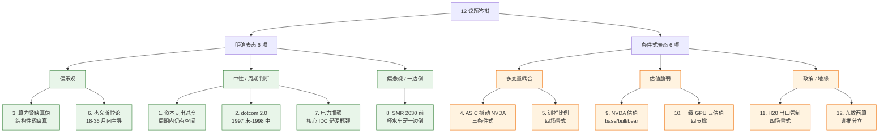
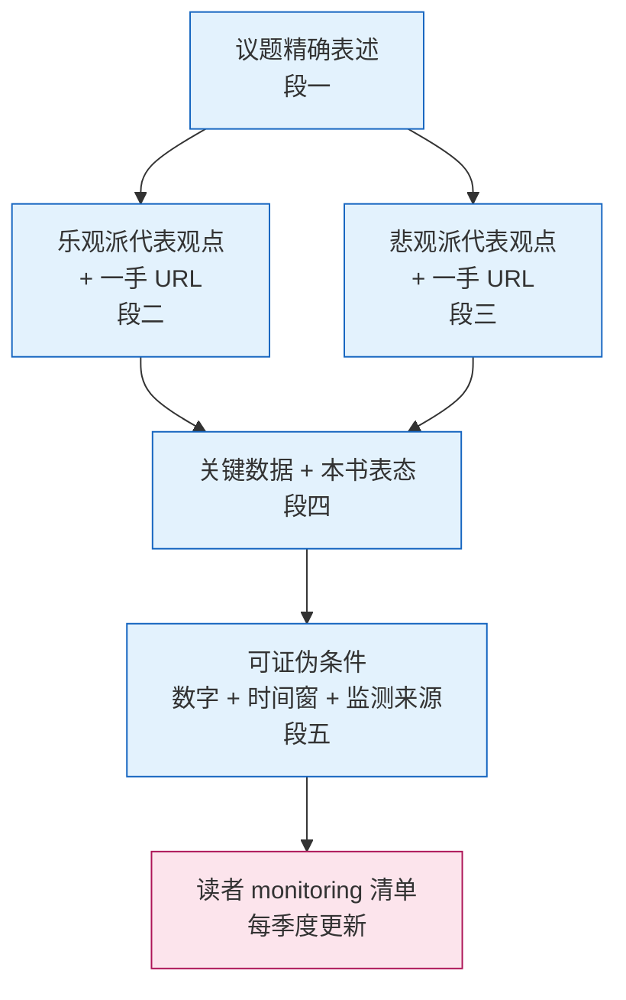
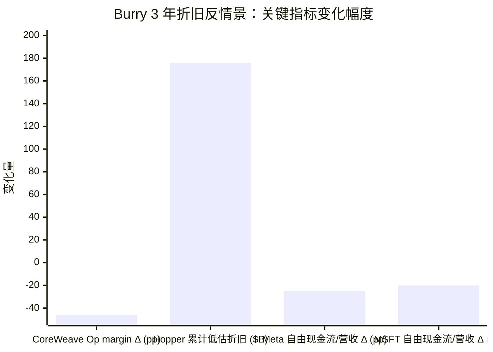
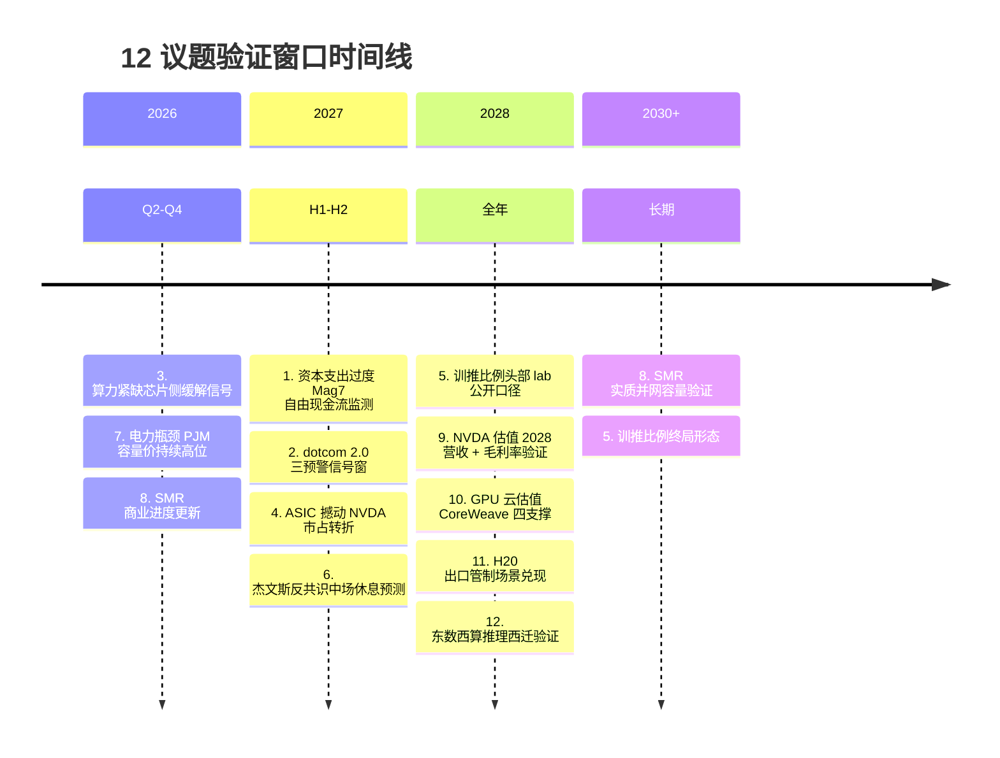
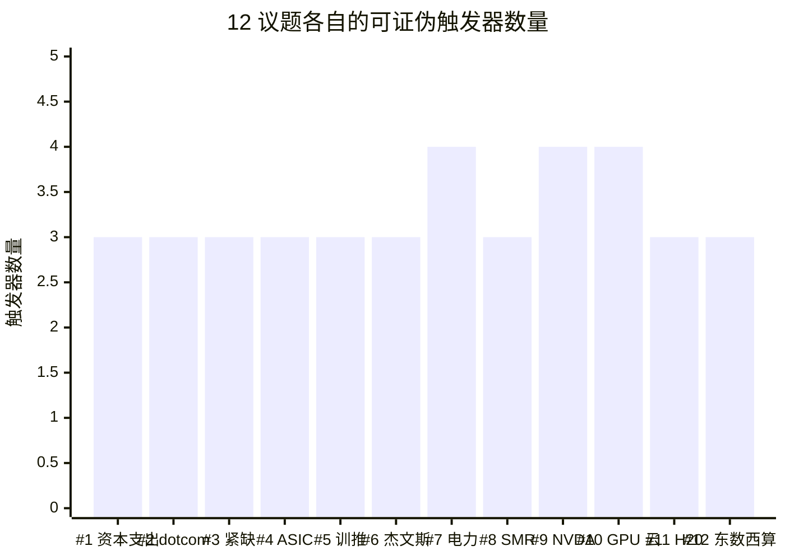

# 第 31 章 12 个争议的答辩：可证伪条件五段式

## 本章概览

第七部到这里只剩最后一件事：把全书前 30 章累积下来的判断打包成可被检验的形式。

本章用 12 个具体议题完成这件事。每一个议题用同样的五段式呈现：(1) 议题精确表述；(2) 乐观派代表观点 + 一手 URL；(3) 悲观派代表观点 + 一手 URL；(4) 关键数据 + 本书的表态——其中 6 个议题给明确表态，6 个议题给条件式表态（「在 X 条件下倾向 Y」）；(5) 可证伪条件——具体到「X 时点、Y 信号未出现 / 出现，本书对该议题的判断证伪」。

12 议题表态强度对照：

| # | 议题 | 表态强度 |
|---|------|---------|
| 1 | AI 资本支出是否过度 | 明确 |
| 2 | dotcom 2.0 类比合不合适 | 明确 |
| 3 | 算力是真紧缺还是 NVDA 营销叙事 | 明确 |
| 4 | ASIC 能否撼动 NVDA | 条件式 |
| 5 | 训练 vs 推理算力比例 | 条件式 |
| 6 | 模型效率提升 / 杰文斯悖论 | 明确 |
| 7 | 电力是不是真瓶颈 | 明确 |
| 8 | SMR 2030 前能否实质落地 | 明确（一边倒） |
| 9 | NVDA 估值是否过高 | 条件式 |
| 10 | 一级 GPU 云估值是否合理 | 条件式 |
| 11 | H20 出口管制效果 | 条件式 |
| 12 | 东数西算政策幻象还是真有用 | 条件式 |

明确表态的 6 个议题（1 / 2 / 3 / 6 / 7 / 8），本书给一个站位，但站位后必须挂一个可观测信号——信号到了，本书认错。条件式表态的 6 个议题（4 / 5 / 9 / 10 / 11 / 12），本书拒绝单点判断，给「在哪个阈值之下倾向 X、之上倾向 Y」，阈值是数字、时间窗、监测来源三件套。

**这本书与卖方研报、媒体专栏、社交媒体行情号的方法论分界线，就在第五段。**任何对 AI 算力周期的判断，如果不能被某个具体的、可监测的、有时间窗口的信号证伪，就只是观点而不是判断。Popper 在《科学发现的逻辑》里把这一点说尽了——「不可证伪的陈述不是错的，它根本就不属于科学的范畴」（Popper 1959，引用作为方法论锚而非数据点）。

本章不卖结论，本章卖一种判断方法。发布后读者可以用这一章 monitoring 作者的判断兑现度——这是一份可以反复翻阅的「作者判断追踪清单」。

12 议题在「明确表态 / 条件式表态」+「乐观 / 中性 / 悲观」两轴上的分布：

涉及具体公司估值含义的段落（议题 9 / 10 / 11 / 12 + 议题 1 / 4 间接涉及 NVDA / MSFT / META / GOOGL / CRWV / NBIS / AVGO / AMD），整章走 commentary-only 章级免责（本书 `disclaimer_mode: commentary-only`，不做持仓披露——见全书前言与 book.meta.yaml）。

5 反共识洞察在 12 议题中的承担位置（详细映射见 31.16）：

- 反共识 #1（周期 1997-1998 定位 + 三预警）→ 议题 1 + 议题 2
- 反共识 #2（HBM 真实价值高于 GPU 裸片）→ 议题 3
- 反共识 #3（AI ≠ telecom 2.0 的 5 个结构性差异）→ 议题 1 + 议题 2
- 反共识 #4（推理算力主导 2027 之后才成立）→ 议题 5 + 议题 6
- 反共识 #5（客户集中度是 NVDA 估值反身性核心）→ 议题 9

本章与 ch29 / ch30 的边界——ch29 给的是整体周期定位 + 三个泡沫顶部预警信号，是「周期处在历史哪个位置」这一个问题；ch30 给的是按业务模式划分的五种估值模板（设备商 P/E+DCF / GPU 云 EV/EBITDA / 代工利用率敏感性 / 超大规模云分部 EV/EBITDA+PEG / IDC REIT FFO+AFFO），是「具体公司怎么算」的可移植方法论；ch31 给的是 12 个具体争议各自的可证伪条件，是「判断对错怎么追踪」。三章一气呵成：周期定位（ch29）→ 估值工具（ch30）→ 判断答辩（ch31）。

## 31.1 五段式的设计哲学：为什么可证伪是方法论核心

产业研究和金融写作里，最常见的失败形态有两种。一种是「双方都打 50 大板」——把乐观派和悲观派的论点轮流摆一遍，最后下一句「时间会证明一切」的结论，看起来公允，实质上没说任何话。另一种是「单边硬表态 + 无退路」——直接喊「NVDA 必涨到 \$300」或「AI 是泡沫必崩」，看起来勇敢，但判断错了之后既找不到自我修正的依据，也让读者无法追踪。

这两种形态都不是产业研究。它们是表演——前者是公允姿态的表演，后者是勇敢姿态的表演。

Popper 在 1934 年的《科学发现的逻辑》（Logik der Forschung）里给出过一个不能再朴素的判据：一个陈述如果不能被任何观察证伪，它就不是科学陈述。这句话适用于一切判断性写作。一个产业判断如果不能被任何未来信号证伪，它就不是判断——它是观点、立场、营销话术，或者任何别的什么，但不是判断。

把这个判据落到本书 12 个议题上，要求就具体了：

- **议题精确表述**：不能模糊。「AI 资本支出是否过度」这种问法是模糊的，要改成「当前超大规模云 2026E 合计资本支出约 \$660-690B，其中 ~75% 投向 AI 基础设施——这个量级是否超过未来 5 年合理回收范围」。问题精确了，答案才可被检验。
- **两派代表观点 + 一手 URL**：不允许「业内观点」「分析师认为」这种隐身的论断。每一派必须挂上具体人 + 时点 + 一手出处。这是产业研究的最低门槛。
- **关键数据 + 表态**：明确表态议题给倾向（如「过度概率高但破裂时点不可预测」），条件式表态议题给「在 X 条件下倾向 Y」的双枝判断。所有表态都必须挂着数据，不能凭印象。
- **可证伪条件**：必须是数字 + 时间窗 + 监测来源三件套。「如果 AI 不及预期则证伪」这种模糊表达不算。「如果 Mag7 自由现金流转负持续 4 季度、或 Mag7 任一家砍 2027 资本支出指引 20% 以上，则本书『周期内仍有空间』主张证伪」——这才算。

为什么明确表态的 6 个议题（1 / 2 / 3 / 6 / 7 / 8）和条件式表态的 6 个议题（4 / 5 / 9 / 10 / 11 / 12）要分开处理？

答案在 Kahneman 的启发式偏差研究里。人在面对「信息充分 + 因果链短」的问题时，可以而且应该给明确判断——这种问题硬要给条件式答案，是回避。在面对「信息不充分 + 因果链长 + 多变量耦合」的问题时，明确判断就变成过度自信——这种问题该给条件式答案，硬要单点判断就是表演勇敢。

本章对 12 议题的分类是基于这条判据：

- 议题 1（资本支出过度）、议题 2（dotcom 2.0）、议题 3（算力紧缺真伪）、议题 6（杰文斯）、议题 7（电力瓶颈）、议题 8（SMR 2030）——这 6 个议题的因果链相对短，数据相对扎实，本书可以而且应该明确表态。
- 议题 4（ASIC 撼动 NVDA）、议题 5（训练/推理比例）、议题 9（NVDA 估值）、议题 10（一级 GPU 云估值）、议题 11（出口管制效果）、议题 12（东数西算）——这 6 个议题有多变量耦合（议题 4 是 CUDA 生态 + 单一供应商绑定 + 软件成本三耦合，议题 9 是毛利率持续性 + 客户集中度 + 增速三耦合），且关键数据缺一手（议题 5 训推口径分歧、议题 11 华为 Ascend 真实出货缺一手），本书给条件式表态，把判断的开关交给可观测变量。

最后一点关于反身性——这是 Soros 在《金融炼金术》里反复强调的。当判断本身会影响被判断对象的行为时（例如「市场判断 [NVIDIA](https://www.nvidia.com/) 已透支」会触发抛售，进而真的让估值下行），任何点估计都很可能是错的。所以条件式表态在金融市场里不是回避，是诚实。

五段式的内部结构示意：

接下来 31.2-31.13 逐议题展开。每一议题约 2,500 字，结构严格统一。

## 31.2 议题 1（明确表态）：AI 资本支出是否过度

### 段一：议题精确表述

[Microsoft](https://www.microsoft.com/)、Alphabet、Meta、Amazon、[Oracle](https://www.oracle.com/) 五家 2026 年合计资本支出已冲到 \$660-690B 区间，其中 ~75% 直接投向 AI 基础设施（GPU + 数据中心建设 + 电力），约 \$450B 量级。

议题：这个量级是否已超过未来 5 年（2026-2030）内 AI 终端付费需求能合理消化的范围？

### 段二：乐观派代表观点 + 一手 URL

**代表 1**：Mark Zuckerberg，Meta Q4 2025 财报会原话——「demands for compute resources across the company have increased even faster than our supply」。语义直白：Meta 自家内部需求已经超过供给，所以「过度」这个判断从内部视角不成立。

**代表 2**：Jensen Huang，GTC 2026 主题演讲——给出 Blackwell + Rubin 2025-2027 累计需求 \$1T 的口径。这是 2025 年 \$500B 预测的两倍口径，外推前提是超大规模云厂资本支出持续放量 + sovereign AI 起量。

**代表 3**：Sparkline Capital 2025 年研究——Mag7 资本支出占美国 GDP 1.28%（Q2 2025 annualized；该数字为 Sparkline Capital "Surviving the AI Capex Boom" 2025 测算，原报告 URL 本书未能 WebFetch 一手回溯，按 data-citation.md 标「分析师测算」），但内部现金流覆盖、不靠 vendor financing。这是乐观派最强的论据：和 1999 telecom 不同，这一轮资本支出主要是巨头自有现金流支撑。

### 段三：悲观派代表观点 + 一手 URL

**代表 1**：David Cahn（Sequoia Capital），「AI's \$600B Question」2024-06-20 原文。算法本身朴素——NVDA 数据中心年化收入 × 2（GPU 占数据中心总成本一半）× 2（终端超大规模云厂客户毛利倒推）。当时 NVDA 数据中心年化 ~\$150B，算出来需要 ~\$600B 终端 AI 收入合理化。Cahn 同篇论文的判断直白：「GPU computing is increasingly turning into a commodity, metered per hour. Without a monopoly or oligopoly, high fixed cost + low marginal cost businesses almost always see prices competed down to marginal cost」（Cahn 2024-06-20 原文）。

**代表 2**：[Michael Burry](https://en.wikipedia.org/wiki/Michael_Burry)（Scion Asset Management），2025-09-30 13F 披露对 NVDA \$187M、Palantir \$912M 名义价值 put 仓位；2025-11 在 X / Cassandra Unchained 上发起对超大规模云厂折旧政策的攻击。核心攻击点：GPU 实际使用寿命 18-24 个月，但 Meta / Microsoft 在用 5-6 年折旧——人为压低折旧、虚增利润。本书 ch16 §6 已量化测算：Burry 论点把 [CoreWeave](https://www.coreweave.com/) Operating margin 从 16% 推到 -30%。

**代表 3**：Jim Covello（Goldman Sachs），2024-06「Gen AI: Too Much Spend, Too Little Benefit?」研报。核心质问：「AI 到底能解决什么足够昂贵、值得 \$1 trillion 资本支出的真问题」。

### 段四：关键数据 + 本书明确表态

关键数据点：

| 指标 | 数值 | 时点 | 与 telecom 1999 顶点对比 |
|------|---|---|------|
| Mag7 合计 FY25 资本支出 / 营收 | 加权 ~26% | FY25 全年 | telecom 顶点 AT&T ~21%、WorldCom ~30% |
| Meta FY25 资本支出 / 营收 | ~36% | FY25 全年 | 已超 WorldCom 顶点 |
| Microsoft FY25 资本支出 / 营收 | ~28% | FY25 全年 | 接近 WorldCom |
| Mag7 合计 FY25 自由现金流 | \$400B+ | FY25 全年 | 内部现金流覆盖，无 vendor financing |
| 真实终端 AI 收入估算 | \$150B 量级 | 2025 年化 | [OpenAI](https://openai.com/) \$20B + [Anthropic](https://www.anthropic.com/) \$30B + Copilot / Gemini / Azure AI 估算合计 |
| Cahn 算法要求的终端收入 | \$600B 量级 | 2024-06 算法对应 2024 时点 | 缺口 \$450B 量级 |

注：表内 telecom 1999 历史数据（AT&T ~21%、WorldCom ~30%）来源为 Richmond Fed "Boom and Bust in Telecommunications"（Wolman 2003）+ AT&T FY99 财报 + WorldCom FY99 财报（本书 sources.md / ch29 §29.3 已全文引用，此处重述以便 ch31 独立阅读）。表内 OpenAI 年化经常性收入 \$20B 来源为 The Information 2025-11 报道 OpenAI FY25 年化经常性收入 \$20B（本书 ch29 已引用）；Anthropic 年化经常性收入 \$30B 来源为本书 ch29 / ch16 已交叉验证的 Anthropic 2026-Q1 年化经常性收入披露口径。

Burry 反情景压力测试：把超大规模云厂 / CoreWeave 折旧期从 6 年改为 3 年后，对关键财务指标的冲击幅度（变化量，6 年 → 3 年）——

> CoreWeave Operating margin 从 +16% 推到 -30%、合计变化 -46 个百分点（ch16 §6 测算）；超大规模云厂 2026-2028 Hopper 累计低估折旧 \$176B（ch16 §6.3 测算）；Meta / MSFT 自由现金流/营收各压缩 20-25 个百分点（ch16 §6 测算）。

**本书的明确表态**：

「过度」概率高，但「破裂」时点不可预测。具体三层：

1. 资本支出 / 营收比按公司维度，Meta 已超过 telecom WorldCom 顶点；按行业聚合，Mag7 加权 ~26% 与 telecom 顶点 ~25-30% 在同一区间。这一比例已经踩上历史警戒线。
2. 终端 AI 真实收入 \$150B 量级与 Cahn 算法要求的 \$600B 之间，存在 \$450B 量级缺口——但这个缺口在杰文斯悖论起作用的窗口期内可以被「单价下降 × 量上升」对冲（详见议题 6 答辩）。本书的判断是：18-36 个月内悖论占主导，更远期触及预算天花板。
3. 与 telecom 1999 的关键差异（详见 ch29 §29.5）：Mag7 用自有自由现金流覆盖，不依赖 vendor financing；终端使用量真实（ChatGPT 周活 7-10 亿区间，其中 8 亿为 2025-10 时点的 OpenAI CEO 公开披露；Anthropic 年化经常性收入 \$30B，Menlo Ventures 2025-12 报告显示企业 AI 支出 2025 年 \$37B vs 2024 \$11.5B、3.2x 增长，来源：Menlo Ventures "2025: The State of Generative AI in the Enterprise" 2025-12-09）。这两个差异让本轮周期顶部比 telecom 更迟出现、但崩盘形态可能更接近页岩油（一根价格线扫边际玩家），而非 telecom（综合多因素崩盘）。

整合本书 ch29 / ch16 / ch18 已完成的分析——本书的位置不是「过度因此必崩」也不是「不过度可以一直加」，而是「**周期内仍有空间，但资本支出 / 营收 33%+ 是历史警戒线、需要监测真实终端付费的兑现速度**」。

### 段五：可证伪条件

本书在议题 1 上的判断「周期内仍有空间」证伪条件：

**触发器 A（财务侧）**：Mag7 合计自由现金流转负且持续 4 个季度——即 Mag7 加权自由现金流在 2027 年内连续四季度为负值。监测来源：四大超大规模云厂季报现金流量表，按季度计算经营现金流 - 资本支出。当前（2026-Q1）Mag7 合计自由现金流仍为正 ~\$100B 年化（详见 ch29 §29.3 维度 8）；如降至负值并持续四季度，「周期内仍有空间」判断证伪。

**触发器 B（指引侧）**：Mag7 任一家在 FY27 或 FY28 财报会上明确砍资本支出指引 20% 以上——即从「FY27 资本支出 \$XB」改为「FY27 资本支出 \$0.8XB 以下」并明确归因为「需求不及预期」或「投资回报不及预期」。监测来源：四大超大规模云厂季度财报会 transcript + 财报会 Q&A 段落。Meta 2022 年曾砍资本支出指引（metaverse 收缩），但归因为战略调整而非需求不及——所以触发器要求归因维度也对齐。

**触发器 C（终端兑现侧）**：OpenAI / Anthropic 合计年化经常性收入在 2027 年底前增速从当前 +100%+ 降至 +30% 以下，并持续两季度。监测来源：The Information / CNBC 报道的 OpenAI / Anthropic 季度年化经常性收入披露；OpenAI 年化经常性收入 \$20B (FY25 末) 基线来自 The Information 2025-11 报道（本书 ch29 已引用）；Anthropic 年化经常性收入 \$30B (2026-Q1) 基线来自本书 ch29 / ch16 已交叉验证版本。如最新披露与本书基线有出入，以 sources.md 数据缺口说明为准。

**三选二触发即证伪**——任一两个触发器在 2028 年底前同时出现，本书「周期内仍有空间」的判断证伪，本书需在勘误版中将议题 1 立场修正为「周期顶部已确认」。

边界——单独触发器 A 出现不构成证伪，因为 Mag7 自由现金流转负可能因为资本支出一次性高峰而非需求侧问题；单独触发器 B 出现也不证伪，因为任一家可能因公司治理原因独立调整。要求三选二的设计是为了避免误报。

## 31.3 议题 2（明确表态）：AI 是 dotcom 2.0 吗

### 段一：议题精确表述

这一轮 AI 算力资本支出周期，最接近的历史参照系到底是 1995 年互联网早期（基础设施先于应用 5 年内即兑现）还是 1999 年互联网泡沫顶点（5 年后才兑现且过程中 85-95% 资产成为 dark fiber）？这个类比直接决定周期定位与做空时点。

### 段二：乐观派代表观点 + 一手 URL

**代表 1**：Cathie Wood（ARK Invest），长期 AI 论——硬件成本下降速度比 fiber 时代快 10 倍（Hopper → Blackwell 每 token 推理成本下降 ~10x），需求弹性强，过剩很快会被吃掉。

**代表 2**：Brad Gerstner（Altimeter Capital），Bg2 Pod 系列访谈反复主张「AI 是 1995 而非 1999」——核心论据是 AI 已经在编程、客服、营销跑出实际收入，dotcom 时代的「eyeball metric」无法对比。

**代表 3**：行业数据支撑——Anthropic 在企业 LLM 市场份额 40%、coding 市场 54%。这是真实企业付费而非 eyeball，与 1999 互联网公司的「flowers.com 估值与点击量挂钩」有质的差异。

### 段三：悲观派代表观点 + 一手 URL

**代表 1**：David Cahn（Sequoia），同议题 1。Cahn 在同篇论文里引用 1999 telecom：Lucent / Nortel 用 vendor financing 给 CLEC 客户买自己的设备——现在 NVDA → OpenAI → Oracle / CoreWeave → 回买 NVDA 是同一剧本。

**代表 2**：The Register 2025-11-04 系列报道。该报道清点了一组数字：NVDA 向 OpenAI 承诺 \$100B 投资以支撑 10 GW 数据中心建设；OpenAI-Oracle Stargate 5 年 \$300B 合同对应 Oracle 自身 \$40B 的 NVDA 采购（400,000 颗 GB200）；OpenAI-AMD 6 GW 部署 + AMD 给 OpenAI ~10% 股权 warrant；CoreWeave 与 OpenAI 三次合同累计 \$22.4B + NVDA 预购 CoreWeave \$6.3B 算力。原文判断：「This is an industry sector getting fatter by eating itself」（The Register 2025-11-04 原文）。

**代表 3**：Fortune 2025-09-28 "AI dot-com bubble parallels" 数字对照——1990s telecom 铺设 80M+ 英里光纤，崩盘后 4 年 85-95% 仍为 dark fiber；Corning 股价从 \$100（2000）跌到 \$1（2002）。同篇数据：2024 年全球公司 AI 投资 \$252.3B；2025 大科技资本支出承诺 \$320B；过去两年 AI 基础设施投入约 \$560B vs 同期 AI 相关收入 \$35B——是 Cahn 算法的另一个口径表述。

**代表 4**：Michael Burry（Scion），2025-11 折旧攻击系列。Burry 攻击点直指 dotcom 时代的会计争议——超大规模云厂用 5-6 年折旧 vs 实际 2-3 年使用寿命，2026-2028 累计低估折旧 \$176B（本书 ch16 §6.3 测算）。

### 段四：关键数据 + 本书明确表态

把 ch29 §29.2 的 12 维度对照表压缩到议题 2：

| 维度 | telecom 1999 | AI 2026 | 相似度 |
|---|---|---|---|
| 1 资本支出占 GDP | 1.0-1.2% | 1.0% | 高（含口径差） |
| 2 资本支出 / 营收 | 25-30% | 26-36% | 高 |
| 3 主导叙事 | 流量 100 天翻倍 | scaling laws | 高 |
| 4 设备商集中度 | CR4 ~70% | NVDA 单家 85%+ | 中（AI 更集中） |
| 5 单位经济下行 | per-Mbps -90%/3y | per-token -99%/2y | 高 |
| 6 投机融资规模 | telecom 高收益债 \$1.6T | AI ABS < 10% 高收益债 | 低 |
| 7 IPO / 新进入 | 1500+ 家新公司 | 50+ neocloud + 一家 IPO | 低 |
| 8 巨头财务健康 | AT&T 杠杆 3x、WorldCom 造假 | Mag7 净现金 \$160B+ | 极低 |
| 9 端需求真实性 | 流量翻倍叙事被证伪 | ChatGPT 周活 7-10 亿（8 亿为 2025-10 时点） | 低 |
| 10 客户集中度 | telecom 设备商分散 | NVDA FY26 年报 Top 2 = 36%（最大 22%） | 高（AI 更集中） |
| 11 监管地缘 | TelComm Act 1996 解管制 | BIS 出口管制 + CHIPS Act | 反向 |
| 12 周期阶段 | 顶点 2000-03 | 1997 末-1998 中 | — |

注：维度 2 telecom 1999 历史数据（AT&T ~21%、WorldCom ~30%）来源为 Richmond Fed "Boom and Bust in Telecommunications"（Wolman 2003）+ AT&T / WorldCom FY99 财报；其余 12 维度对照的 telecom 侧数据来源为 Richmond Fed 同篇 + 本书 ch29 §29.2 / §29.3 已全文引用的 telecom 1999 历史数据集（含 FCC ARMIS 数据、Lucent / Nortel 财报、TeleGeography fiber 部署数据）。AI 2026 侧数据来源为 Mag7 FY25 10-K + NVDA FY26 10-K + Menlo Ventures 2025-12 + TrendForce 2025-2026 各章节已交叉验证版本（本书 ch29 §29.3 已全文索引）。

12 维度中相似 ~6 个（维度 1 / 2 / 3 / 5 + 维度 4 / 10 部分相似），不相似或反向 ~6 个（维度 6 / 7 / 8 / 9 / 11 + 维度 12 是结论维度不算）。本书 ch29 §29.3 已逐维度展开。

**本书的明确表态**：

12 维度相似度大约 6/12——不能简单地说「AI 是 dotcom 2.0」也不能说「AI 完全不像 dotcom」。本书的位置是：**形态相似（资本支出量级、设备商集中、单位经济下行节奏）+ 性质不同（资金来源、终端需求真实性、巨头财务健康度）= 周期可能更长、崩盘形态不同**。

具体定位：本书把 2026-05 的 AI 算力周期放在「1997 末-1998 中期」的 telecom 当量位置。理由：

- 资本支出 / 营收已达警戒线（对应 telecom 1998-1999）；
- 但 Mag7 自有现金流仍覆盖资本支出（对应 telecom 1997-1998 而非 1999-2000）；
- 终端需求真实性远高于 1999 telecom（这是 AI 周期可能延长 1-2 年的关键）；
- 客户集中度（NVDA FY26 年报 Top 2 = 36%、Q2 FY26 季报 Top 2 = 39%、Top 4 ~61%，最大单一客户 22%；议题 9 段四详）是新增的反身性风险。

崩盘形态预测：如果 AI 周期崩盘，更可能像 2010-2016 页岩油（单一价格信号 WTI \$107 → \$26 扫荡边际玩家），而非 telecom（综合崩盘 + 会计造假）。对应到 AI 上，**触发指标可能是 H100 / H200 二手价或 per-GPU-hour 租赁价的快速下行，而非 NVDA 营收转负**。

### 段五：可证伪条件

本书「1997 末-1998 中期」定位的证伪条件——使用 ch29 §29.7 三预警的简化版本（本章不重复 ch29 已展开的三预警机制）：

**触发器 A**：H100 二手现货价（按 Silicon Data H100 Rental Index 或同类二手平台月度披露口径）在任意 6 个月窗口内下跌 50% 以上——即从 2026-05 基线 \$2-3/hr 降至 \$1-1.5/hr 以下，且持续两月。监测来源：Silicon Data H100 Rental Index 月度报告。Dylan Patel 在 Dwarkesh Patel 访谈中预测 2026 年 H100 二手价从 \$2/hr 跌到 \$1/hr 是温和情景——超过这个速度就是页岩油式崩盘信号。

**触发器 B**：NVDA 数据中心营收环比首次负增长（即任一季度数据中心收入 < 前一季度）。监测来源：NVDA 季度 10-Q 业务分部披露。NVDA 数据中心分部营收 **FY26 全年 \$193.7B**（NVDA FY26 10-K，2026-02-25 披露；本书 ch12 已详细引用）、季度环比仍 +15-25%——任何一季度环比转负即触发。

**触发器 C**：Mag7 任一家在公开财报会上提及「Hopper 资产减值」或「GPU 加速折旧」并具体计提——即不是评论性提及，而是损益表上出现减值科目。监测来源：Mag7 季报现金流量表 & 损益表 + 财报会 Q&A。Burry 攻击的核心论点如果兑现，会以这种形式落到财务报表上。

**三选二触发即证伪**——本书「1997 末-1998 中期」定位修正为「周期顶部已确认、进入 1999 末-2000 当量」，对应到 ch29 §29.7 的「三预警全部出现」状态。

边界——单独触发器 A 可能因 Blackwell 出货量翻番带动 Hopper 自然降级到二手市场而出现（这是 ch12 已预测的 2027 拐点机制之一），需配合触发器 B 或 C 才确认。

## 31.4 议题 3（明确表态）：算力是真紧缺还是 NVDA 营销叙事

### 段一：议题精确表述

Jensen Huang 在每次 NVDA 财报会都用「demand exceeds supply」叙事；Zuckerberg 在 Meta Q4 2025 财报会用「产能-constrained」表述。二级市场常质疑这是不是营销话术——真实的算力紧缺点到底在哪里：CoWoS 封装、HBM 内存、晶圆代工、电力，还是已经转向「无紧缺」？

### 段二：乐观派代表观点 + 一手 URL

**代表 1**：Dylan Patel（SemiAnalysis），Dwarkesh Patel 访谈 + 2025-11 GSA EMTECH webinar。Patel 的三段论：2023 年瓶颈在 CoWoS 封装，2024-25 转到数据中心和电力，2026+ 转回半导体晶圆。同篇预测 2026 年 30% 的科技巨头资本支出会被 memory（HBM）吞掉。

**代表 2**：Mark Zuckerberg（Meta Q4 2025 财报会，来源同议题 1）—— Meta 自家内部需求都已经超过供给。这是来自最大需求方之一的内部视角。

**代表 3**：产业链供给端数据——[台积电](https://www.tsmc.com/) CoWoS 2025-2026 月产能从 2025 年 Q1 ~3 万片晶圆爬升到 Q4 ~4 万片仍供不应求；[SK Hynix](https://www.skhynix.com/) / Samsung / Micron HBM4 三家同步给 NVDA 送样、2026-Q1 finalize 合同。供给端在抢——这本身就是紧缺的证明。

### 段三：悲观派代表观点 + 一手 URL

**代表 1**：部分中性卖方（如 Bernstein）+ 独立分析。论点：「紧缺」很大程度是分配问题而非总量问题——OpenAI / [xAI](https://x.ai/) / Anthropic 等少数客户抢占大头，腰部 GPU 云有空闲。CoreWeave \$30B 合同储备是 5 年合同，分摊到每年只有 \$6B。

**代表 2**：H100 二手价信号——SemiAnalysis 预测 H100 二手价 2024 \$2/hr → 2026 \$1/hr。若真长期紧缺，二手价不会跌。这是 Dylan Patel 自己同时持有的两个不矛盾观点——CoWoS / HBM 端仍紧缺，但 H100 二手卡进入降价通道。

**代表 3**：DeepSeek 路线证伪——DeepSeek V3 用 2048 张 H800 训出。说明算力效率还有大空间，「紧缺」是相对当前算法效率而言的，未必是不可绕开的物理约束。

### 段四：关键数据 + 本书明确表态

物理瓶颈链路：

| 环节 | 2025 物理产能 | 2026E 物理产能 | 是否紧缺 | 缓解时点 |
|------|---|---|---|---|
| 台积电 CoWoS 月产能 | ~35K 晶圆 | ~50K 晶圆 | 是 | 2026 Q4 起明显缓解 |
| HBM4 12-Hi 量产 | 试产 | 三家同步爬坡 | 是 | 2026 H1 finalize、Q3 量产 |
| SK Hynix HBM 年产能 | ~600K 晶圆 | ~1M 晶圆 | 是 | 与 NVDA 锁单同步 |
| H100/H200 单卡供给 | 持续放量 | 紧 → 松 | 临界 | 2026 末进入二手降价 |
| GB200 NVL72 整柜 | 启动 | 大规模交付 | 是 | 2027 前持续紧 |
| 美国数据中心电力 | 已紧 | 更紧（PJM +12 GW） | 是 | 2028 前无解 |

反共识 #2（HBM 真实价值高于 GPU 裸片）在本议题集中体现：HBM 单位价值占 H100 整卡 BOM 的 ~50%（本书 ch1 / ch6 已交叉验证），但市场叙事仍以「GPU = NVDA」为主——这是真紧缺的核心位置被市场低估的代表案例。

**本书的明确表态**：

结构性紧缺真实存在，**但 2026 末-2027 初会出现第一次明显宽松**。三个理由：

1. HBM4 三家供给同步爬坡，Samsung 在抢份额会主动让价（详见议题 11 和 ch6 已讨论的客户认证准入墙裂缝）；
2. Blackwell 出货量翻番后，老 Hopper 卡进入二手市场，H100/H200 现货价格下行；
3. 电力侧才是真硬约束（议题 7），这会让「算力紧缺」从芯片侧转移到 site 侧——芯片端紧缺会松，但项目落地速度被电力卡住，所以「算力紧缺」叙事不会完全消失，只是位置换了。

整合判断：**真紧缺，但芯片侧紧缺会先于电力侧紧缺缓解**。市场叙事中「算力紧缺 = NVDA 紧缺」的简化框架在 2027 之后会破裂，转为「电力紧缺 + 客户集中度」的新叙事。

### 段五：可证伪条件

本书「2026 末-2027 初芯片侧紧缺缓解」判断证伪条件：

**触发器 A**：H100 二手现货价在 2027 年底前未跌破 \$1.5/hr（按 Silicon Data Index 月度均价口径）——即如果紧缺真是 2027 之后还在延续，H100 现货不会跌。监测来源：Silicon Data H100 Rental Index。

**触发器 B**：台积电 CoWoS 月产能 2027 年中仍 < 60K 晶圆，且 NVDA / AMD / Broadcom 仍排队抢——即如果产能爬升不及预期，本书「2026 Q4 起明显缓解」判断错误。监测来源：台积电季度法说会 Capital Markets Day 披露 + TrendForce 月度跟踪。

**触发器 C**：HBM4 12-Hi 在 2026 年底前未实现三家任一家月产能 > 50K stack——即如果 HBM4 爬坡延后到 2027，本书的紧缺缓解判断需要往后移半年到一年。监测来源：SK Hynix / Samsung / Micron 季报 + TrendForce HBM 月度报告。

**任一触发器持续 2 个季度即证伪本书在该子项的判断**——即三个触发器独立可证伪三个子判断（H100 紧缺缓解 / CoWoS 缓解 / HBM4 量产）。本书在议题 3 的整体表态修正条件：三个触发器中至少两个在 2027 年底前同时成立。

## 31.5 议题 4（条件式表态）：ASIC 能否撼动 NVDA

### 段一：议题精确表述

Google 拿下 Anthropic 1M TPU 大单，AWS Project Rainier 启动 Trainium2 集群（业内估算 ~500K 颗量级，来源：Data Center Dynamics 2025-11 报道；本书无法直连验证一手，按 data-citation.md 规范标「业内估算」）——ASIC 是否在 2027 年底前显著撼动 NVDA 在 AI 加速器市场的 ~85% 份额？

### 段二：乐观派代表观点 + 一手 URL

**代表 1**：Dylan Patel（SemiAnalysis），latent.space 访谈直接说「Google Might Have No Profits in 2027」——意思是 Google 把 TPU 单独算下来，TPU 业务对 NVDA 是结构性威胁。

**代表 2**：David Cahn（Sequoia），同议题 1（来源同）。Cahn 在 GPU commoditization 论文里直接预测 ASIC + 多供应商会把 NVDA 数据中心毛利率从 75% 压到 60% 以下。

**代表 3**：TPU 公开经济性——Google Cloud TPU v6e committed-use 报价 ~\$0.39/chip-hour；Trillium（v6）官方数据：4.7x perf/chip vs v5e、67% 推理功耗下降。如果对等比较，TPU 在某些工作负载上经济性已经反转。

### 段三：悲观派代表观点 + 一手 URL

**代表 1**：Jensen Huang（NVDA GTC 2026 主题演讲，来源：CNBC 2026-03-16）——CUDA 拥有 ~500 万开发者生态，是 10-15 年护城河；TPU 只在 Google 自家生态可用，对外卖不动；Trainium 只对 AWS 自家用户有意义。这是 NVDA 自己的论点。

**代表 2**：多数 sell-side（Bank of America / Morgan Stanley 系列 2024-2026 研报，summary 来源：本书 research/disputes-and-frontiers.md 已索引）——TPU 卖给 Anthropic 主要因为 Google 既是供应商又是大股东，缺乏「free market」验证；AMD MI350 / MI355X 已发布但只有 Oracle 一个大客户公开部署 27K 节点，AMD 总份额仍 < 10%。

**代表 3**：NVDA 数据中心市占率 2025-2026 仍稳在 ~85%+（业内多家研究机构估算，TrendForce / Counterpoint / Bernstein 口径接近一致；本书 ch7 / ch29 已交叉验证）。这是最直接的反驳——如果 ASIC 真在撼动 NVDA，市占率不会稳。

### 段四：关键数据 + 本书条件式表态

ASIC 阵营 2025-2026 出货量级：

| ASIC 阵营 | 2025 出货 | 2026E 出货 | 关键客户绑定 |
|---|---|---|---|
| Google TPU v5p/v6 | ~2M 颗 | ~3M 颗（推算） | 自用 + Anthropic 1M 大单 |
| AWS Trainium2 | ~500K 颗（Project Rainier） | 推算 1M+ | 自用 + Anthropic（多源） |
| Meta MTIA | 试产 | 推断 100K+ | Meta 自用 |
| AMD MI350/MI355X | 推算 200K+ | 500K+ | Oracle + OpenAI 部分 |
| NVDA 加速芯片合计 | ~5M+ | 推算 8-10M | 全市场 |

注：以上数据除 NVDA 财报、Google Anthropic 1M 公告、AWS Project Rainier 公告、AMD-OpenAI 大单等关键节点有一手来源外，其余多为业内估算（本书 ch7 已按 data-citation.md 规范标注「业内估算」），可证伪条件以「公开公告」为信号。

Broadcom（AVGO）在上表中未单列出货行——其角色是 ASIC 设计 + 代工对接（fabless ASIC design house），不直接出货「自家品牌芯片」。Broadcom FY25 Q4 AI 半导体营收 \$6.5B，FY25 全年 AI 营收 \$20B（即平均约 \$5B/季；FY25 Q1 \$4.1B 为起点，Q4 \$6.5B 为终点），主要承担 Google TPU 与 Meta MTIA 的 ASIC 芯片设计 + 台积电代工对接——所以 Google TPU 与 Meta MTIA 的「出货」实际上是 Broadcom + 台积电协作完成，Broadcom 的财务贡献以 ASIC 设计费 + 代工管理费形式记入营收。

**本书的条件式表态**：

ASIC 会在 2027 年底前蚕食 NVDA 加速器市占率 10-20 个百分点（从 ~85% 降至 ~65-75%），**但需要满足以下条件**：

- **条件 A（软件生态侧）**：PyTorch 2.x 之后的后端抽象层在 ASIC（TPU + Trainium）侧实现训练生态接近原生 CUDA 体验——即 fine-tune / RLHF / 推理服务三条工作流在 TPU / Trainium 上的开发体验与 CUDA 接近，开发者迁移成本下降至「2 周内可上手」级别。

> RLHF：Reinforcement Learning from Human Feedback，基于人类反馈的强化学习，用于对齐模型输出与人类偏好的后训练阶段。
- **条件 B（绑定关系破裂或弱化）**：Anthropic 1M TPU 大单和 AWS Project Rainier 不能继续作为「投资捆绑型大单」（Google 投 Anthropic \$40B、AWS 投 Anthropic \$8B），需要出现至少 1 家非绑定型大客户（如 OpenAI / xAI / Mistral / Cohere 任一）在 ASIC 上做主力训练 + 推理。
- **条件 C（TCO 真实反转）**：在 ML Perf 或类似公开 benchmark 上，TPU / Trainium 在长序列推理 + RLHF 训练两类典型工作负载上，每 token TCO < NVDA H200 / B200 同等工作负载 30% 以上，并持续 2 年。

**如果三条件全部成立——ASIC 真撼动 NVDA**。如果只有 A + B 成立（C 不成立）——NVDA 数据中心毛利率从 75% 压到 60-65%，但份额不会丢太多。如果只有 C 成立（A、B 不成立）——是被特定大客户内部消化、不外溢。

整合判断：**ASIC 短期（2026-2027）只能分蛋糕不能换桌子，2028 之后视三条件的成立组合决定**。本书的位置不是「NVDA 永远赢」也不是市场上常见的「ASIC 会取代 NVDA」叙事，而是「在三条件下分别有三种 NVDA 估值路径」。

### 段五：可证伪条件

本书条件式表态的证伪——分两类。

**判断「ASIC 短期分蛋糕不换桌子」证伪触发器**：

**触发器 A**：NVDA 数据中心市占率（按 TrendForce / Counterpoint / Bernstein 三家加权口径）在 2027 年底前跌破 65%，即一年内丢 20 个百分点以上。监测来源：TrendForce / Counterpoint / Bernstein 加速器市占季度报告。

**触发器 B**：出现至少 1 家非绑定型大客户（即非 Google / AWS / Meta 自家或受投资捆绑的客户）在公开披露中说明「主力训练已迁移到 TPU / Trainium / 其他非 NVDA ASIC」，且金额单笔 > \$5B。监测来源：SEC 公司披露 + 公司财报会 Q&A。

**判断「三条件下三种路径」证伪触发器**：

**触发器 C**：ML Perf 2027 年公开榜单中，TPU 或 Trainium 在长序列推理 + RLHF 训练两类典型工作负载上 TCO 优势 > 30%，且这一优势在三个不同 benchmark 上一致出现。监测来源：MLCommons MLPerf 季度榜单。

**触发器 A + B 同时出现持续两个季度——本书在议题 4 的位置错误，需修正为「ASIC 已实质性撼动 NVDA」**。

**触发器 C 单独出现——本书需在勘误版中把条件 C 的判断从「未来 2 年内不太可能」修正为「已经发生」**。

边界——市占率统计口径差异大（按颗数 / 按 TFLOPS / 按 ASP 加权各不同），本书要求 TrendForce / Counterpoint / Bernstein 三家口径加权后跌破 65%，规避单一口径误报。

## 31.6 议题 5（条件式表态）：训练 vs 推理算力比例

### 段一：议题精确表述

业内一致认同推理算力会超过训练算力，但**比例分歧很大**。McKinsey 报告说 2030 年推理 > 90 GW（35% CAGR）、训练 62.2 GW（22% CAGR）；Epoch AI 直接说当前训练和推理算力开支大致 1:1。议题：2030 年训练算力与推理算力比例落在 1:1 还是 1:3 区间，哪个更接近？

### 段二：乐观派代表观点 + 一手 URL（推理远超训练）

**代表 1**：McKinsey 2024-2025 系列报告。核心数字：2030 年 60-70% AI 工作负载会迁移到实时推理（Benzinga 2025-01 引用确认）；2030 年推理算力 > 90 GW、训练算力 62.2 GW，比例约 1.5:1 偏向推理（McKinsey 报告原文）。

**代表 2**：Arm CEO + 多家应用层 AI 公司——推理是「model × users × tokens」，理论增长无上限；训练是「few labs × few models」，增速有限。reasoning 模型（o1、o3、R1）让单次推理消耗的 token 数从 100 涨到 10,000，推理算力被结构性放大。

**代表 3**：Verizon AI Connect 战略表述——预测 60-70% 工作负载会在 2030 年转向推理。

### 段三：悲观派代表观点 + 一手 URL（训练仍占大头）

**代表 1**：Epoch AI。核心论点：「AI labs should spend comparable resources on 训练 and running 推理, assuming they can flexibly balance compute between these tasks to maintain model performance」（Epoch AI 2024-03-29 原文）。理论框架：基于 Villalobos-Atkinson 2023 训练/推理算力 tradeoff，一个数量级（10x）训练算力换 10x 推理算力（性能不变）——最优分配是 α/(α+β) 训练 + β/(α+β) 推理，当两个 tradeoff 在「相对宽的区间内成立」时，分配大致均衡。

**代表 2**：Epoch AI 2025 系列研究——预测 2030 年单次最大训练任务功率 4-16 GW。这是单次训练，年化下来训练侧总算力很大。

**代表 3**：后训练（RL + RLHF）放大效应——reasoning 用 RL 后训练阶段的算力消耗在快速上涨，会拉高训练侧权重（OpenAI o1 / o3 / DeepSeek R1 系列的后训练算力数据，业内估算，本书无一手）。

### 段四：关键数据 + 本书条件式表态

口径差异：

| 口径 | 训练 : 推理 2030E | 关键假设 |
|---|---|---|
| McKinsey | ~1 : 1.5 (62 GW : 90 GW) | reasoning 模型推理 token 翻 100 倍 + 企业推理普及 |
| Epoch AI | ~1 : 1 | labs 自身在训练和推理之间动态平衡 |
| SemiAnalysis | ~1 : 3 估算（业内估算，无一手数字） | 推理量爆炸 + 训练侧瓶颈 |

**口径差异的根源**：

- 是按「新增资本支出流量」比还是「存量算力」比？McKinsey 是按 GW（存量功率）比，Epoch AI 是按 lab 内部 spend 比；
- reasoning 模型让单次 query 的 token 数翻 100 倍，所以拐点时间影响很大；
- 后训练算到训练还是推理？OpenAI o3 系列的 RL 后训练算力占总训练算力 30%+——口径上算到训练，但物理形态接近推理。

**本书的条件式表态**：

2030 年训练 : 推理比例的本书判断分四种情景：

- **场景 A（McKinsey 路径）**：如果 reasoning 模型普及（o3 类模型占企业推理 50%+）+ 企业 AI 渗透率从 6% 涨到 15%+，比例落在 1:2 到 1:3 区间，推理主导；
- **场景 B（Epoch AI 路径）**：如果 labs 始终在训练和推理之间动态平衡（最优分配理论成立）+ 后训练算到训练，比例落在 1:1 区间，均衡；
- **场景 C（训练仍主导）**：如果模型规模继续按 4x/年增速（Epoch AI 2024 测算）+ 后训练占训练 60%+，比例可能落在 1.5:1 偏向训练；
- **场景 D（推理碾压训练）**：如果 reasoning 模型让单 query 算力翻 1000 倍 + 推理普及非常快，比例可能落在 1:10+。

本书倾向场景 A 或场景 B（推理略超训练或均衡），**反对场景 D 在 2030 前出现**。理由——SemiAnalysis 推理 3x 训练的估算依赖「企业 AI 渗透率 5 年涨 10 倍」假设，而 Menlo Ventures 2025-12 报告显示企业 AI 支出 2025 \$37B vs 2024 \$11.5B、3.2x 增长（Menlo 2025-12-09 原文确认），按此速度 2030 年到 \$400B 量级——可观但不会形成 10x 训练的推理算力规模。

**反共识 #4 在本议题落位**——本书的位置是「推理算力主导论 2027 之后才成立」，而非市场叙事里「推理算力即将主导」。理由：后训练在 2026-2027 期间会快速放量，推高训练侧权重；2027 之后 reasoning 模型普及 + 企业渗透率到位，推理才真正起量。

### 段五：可证伪条件

条件式表态的证伪——分两类。

**判断「2030E 比例落在 1:2 到 1:1 区间」证伪触发器**：

**触发器 A（推理碾压侧）**：在 2028 年底前出现头部 lab（OpenAI / Anthropic / Google）公开披露年度算力支出中推理 : 训练 > 3 : 1，并维持两个季度。监测来源：lab 季度 spend 披露（多通过财报评论 / 媒体披露）+ Epoch AI 行业测算季度更新。

**触发器 B（训练碾压侧）**：在 2028 年底前出现头部 lab 单次训练任务 GW 级峰值（即单次训练任务功率 > 4 GW 持续 > 30 天），同时年度训练算力占总算力 > 60%。监测来源：Epoch AI 训练算力月度数据库 + lab 公开 GW 披露。

**任一触发器持续两个季度即证伪本书的「场景 A/B」倾向**——本书需修正立场到对应侧。

**判断「后训练在 2026-2027 期间快速放量」证伪触发器**：

**触发器 C**：2027 年底前，公开 reasoning 模型（如 OpenAI o5、Anthropic Claude 5 / 6、DeepSeek R2/R3）在后训练算力消耗上未超过前训练 30%——即后训练没成为算力放大器。监测来源：lab 论文披露 + Epoch AI 测算。

**触发器 C 持续 2 年即证伪本书的「反共识 #4」立场**——本书需修正「推理主导 2027 之后」论点到「后训练在 2030 后才成型」。

边界——口径差异是本议题最核心的风险点，本书的可证伪条件刻意以「头部 lab 公开披露口径」为锚（而非外推估算），避免被业内估算的不同口径相互矛盾击穿。

## 31.7 议题 6（明确表态）：模型效率提升 / 杰文斯悖论

### 段一：议题精确表述

DeepSeek R1 把推理成本砍到 OpenAI 的 1/20-1/50——这是推理需求灾难还是杰文斯悖论？议题：模型效率提升（小模型 + MoE + 蒸馏 + FP8/MXFP4 训练）会让总算力需求在 2027 年底前转为下行，还是反而被推理量爆炸对冲、总算力需求维持 +30%+ 增长？

### 段二：乐观派代表观点 + 一手 URL（杰文斯主导）

**代表 1**：Jensen Huang（NVDA GTC 2026 主题演讲，来源：CNBC 2026-03-16）——明确说 reasoning 模型让单次 query 消耗 token 数翻 10-100 倍，对冲单价下降。这是来自 NVDA CEO 的核心叙事。

**代表 2**：Microsoft 业绩会反复披露「AI usage 5x growth」——单 token 成本下降的同时，总 token 量爆炸，总算力消耗反而上升。

**代表 3**：Anthropic 案例——从 \$1B → \$30B 年化经常性收入期间，模型变便宜了 ~5x（同等性能 token 价格），使用量翻 50x+。这是杰文斯悖论在 AI 算力上最直接的实证。

### 段三：悲观派代表观点 + 一手 URL（效率压缩需求）

**代表 1**：DeepSeek 路线本身 + Cathie Wood / Marc Andreessen 等价值倍数压缩论者。论点：DeepSeek 路线（FP8 训练 + MoE + 蒸馏）证明模型效率有 10-20x 提升空间——一旦充分扩散，资本支出当前规模无法消化。

**代表 2**：Burry / 部分价值投资者论点——杰文斯悖论的边界条件是「需求弹性足够大」，企业 AI 预算并不是无限弹性。CIO 不会无限制涨 AI 预算。

**代表 3**：Epoch AI 超大规模云厂 capex trend 系列研究——指出资本支出不会随 token 量线性增长，单 token 成本下降到一定程度会触发预算约束。

### 段四：关键数据 + 本书明确表态

DeepSeek 效率冲击的市场反应：

| 时点 | 事件 | NVDA 市场反应 |
|---|---|---|
| 2024-12 | DeepSeek-V3 论文发布 | 短暂 -3% |
| 2025-01-27 | DeepSeek R1 引爆 | NVDA 单日 -17%（约 \$600B 市值蒸发） |
| 2025-03 | 推理量数据出炉、Huang 公开「DeepSeek 提升 NVDA 需求」 | NVDA 反弹回 -5% |
| 2025-10 | NVDA 市值突破 \$5T | 完全收复 + 创新高 |

数据告诉我们的事实：DeepSeek 短期触发恐慌（市场假设效率压缩），但中期市场重新定价为杰文斯悖论（效率刺激更大需求）。

企业 AI 预算渗透率：

- 2024 企业 AI 支出 \$11.5B；
- 2025 企业 AI 支出 \$37B（+222%）；
- Anthropic 占企业 LLM 40% 份额（vs 2024 24%）；
- 占全球 SaaS 市场 6%——仍有 10x+ 渗透空间。

**本书的明确表态**：

杰文斯悖论在 18-36 个月内（即至 2028-2029）仍占主导，**但更远期不确定**。三个理由：

1. **当前企业 AI 预算渗透率还很低**——多数 Fortune 500 用 AI 支出占 IT 预算 < 5%，从 6% 到 15% 的 SaaS 占比是真实空间；
2. **reasoning 模型还在算力放大初期**——o3 / R1 类模型的推理 token 消耗才刚开始翻 10-100 倍；
3. **但终局上预算约束会兑现**——如果一个 query 成本从 \$0.01 降到 \$0.0001，企业不会让 query 量涨 1,000 倍（理性预算约束）。

**反共识表述（更细的中间路径）**：本书可以反共识地预测——**2027-2028 之间会出现一次「算力需求增速放缓」的市场恐慌**，但不是终局、是中场休息。机制：那时 reasoning 模型放大效应见顶 + 企业渗透率到 10-15% 区间触及第一次预算硬约束 + 效率改进（FP4 训练、MoE 普及）兑现。市场会把这次放缓误读为「需求灾难」，但反共识判断是中场休息——其后被 multimodal / 物理世界 AI / sovereign AI 三类新需求重新拉起。

整合判断：**2026-2028 杰文斯主导（明确）+ 2028-2029 短期恐慌（反共识预测）+ 2029+ 需求重启（条件依赖）**。

### 段五：可证伪条件

本书「2026-2028 杰文斯主导」证伪条件：

**触发器 A**：Mag7 或头部 lab 财报会上明确说「单 token 成本下降快于使用量增长，导致算力总需求增速放缓」并量化幅度——即 NVDA 财报会上 Huang 主动调下数据中心收入增速指引到 < +20%。监测来源：NVDA 季度财报会 transcript + 数据中心业务分部业绩。

**触发器 B**：企业 AI 支出年增速从 +200%+ 降到 < +50%，且持续 4 个季度。监测来源：Menlo Ventures 年度报告 + Gartner / IDC 季度跟踪。

**触发器 A + B 同时出现持续 4 季度即证伪「杰文斯主导」表态——本书需修正立场为「效率压缩论开始兑现」**。

本书「2027-2028 期间出现短期恐慌」反共识预测的证伪条件：

**触发器 C**：2028 年底前 NVDA 数据中心收入增速未出现过任一季度 < +20% 的情况——即没有「市场恐慌」的财务证据。监测来源：NVDA 季度业务分部披露。

**触发器 C 单独成立——本书的「中场休息」反共识预测错误**，需修正为「杰文斯悖论持续到 2029+，无中场休息」。

边界——本议题最大的不确定性来自「企业 AI 预算硬约束」何时兑现。本书把硬约束的时点放在 2028-2029，是基于「企业 AI 占 IT 预算从 5% 到 15% 大约 3 年」这一渗透率假设，时点偏差可能在 12-18 个月。

## 31.8 议题 7（明确表态）：电力是不是真瓶颈

### 段一：议题精确表述

PJM 容量市场清算价格因数据中心需求一年涨 800%+；变压器交货 2-4 年——电力是否已经成为 2026-2028 期间比芯片更硬的算力瓶颈？

### 段二：乐观派代表观点 + 一手 URL（电力可解）

**代表 1**：部分电力公司 CEO + Vistra / Constellation 公司论点——燃气调峰 + 电网升级 + SMR 三路径在排队，3-5 年可解。

**代表 2**：LBNL（Lawrence Berkeley National Lab）2024 报告——美国数据中心电力到 2028 年占总电力 ~12%（高端估算 580 TWh 对应口径；来源：本书 ch27 已引用，原文：[LBNL 2024 United States Data Center Energy Usage Report](https://eta.lbl.gov/publications/2024-lbnl-data-center-energy-usage-report)）。这个比例从总量上看不至于不可承载——是结构性挑战不是物理崩溃。

**代表 3**：Google + Kairos Power 2025-08 SMR PPA 计划 2030 年供 50MW。燃气调峰电厂建设周期 2-3 年，已大量启动。

### 段三：悲观派代表观点 + 一手 URL（电力是硬瓶颈）

**代表 1**：PJM Independent Market Monitor 系列公开数据——PJM 容量市场清算价格 2025/26 + 7.9 GW、2026/27 +12 GW 数据中心需求直接顶在容量上。「移除 data center 需求会让产能支出降 \$9.33B（64%）」——单一驱动。

**代表 2**：Tony Grayson（资深行业人员）系列分析——变压器 2-4 年交货是钱解决不了的瓶颈；SMR 商业化最早 2028-2030，绝大多数 2030s 中后期，对 2026-2028 算力供给毫无帮助。

**代表 3**：ERCOT 大负荷请求积压「几百 GW」——德州大型负荷申请远超容量。

### 段四：关键数据 + 本书明确表态

电力瓶颈的"硬时间表"：

| 解决方案 | 启动时点 | 真实贡献年份 | 单位 GW 成本 |
|------|---|---|---|
| 燃气调峰电厂 | 2024 大规模启动 | 2026-2028 见效 | ~\$1B/GW |
| 电网升级（变压器/输电线） | 2024 启动 | 2027-2029 见效 | 数倍变压器成本 |
| 站址搬迁（Wyoming / Montana） | 2025 启动 | 2026-2027 见效 | 中等 |
| SMR | 2027 first delivery | 2030+ 商用 | 高（议题 8 详论） |
| 可再生能源 + 储能 | 持续 | 持续 | 跟随容量市场 |
| AI 数据中心 PUE 改善 | 持续 | 持续 | 间接 |

PJM 关键数字：

- PJM 2025/26 容量拍卖清算价从 \$28.92/MW-day 涨到 \$269.92/MW-day（涨 8.3x 即 +830%）；
- 2026/27 +12 GW 数据中心需求；
- IMM 估算移除 DC 需求降低支出 64%。

**本书的明确表态**：

**核心 IDC 区域（PJM / 弗吉尼亚 / 美东 / 美西硅谷一带）的电力瓶颈在 2026-2028 期间是真的、硬的、钱解决不了的**——三件事钉死：变压器 2-4 年交货、电网新建审批周期 5-7 年、可再生能源 + 储能 PPA 签约-投运周期 3 年。

但**全国 / 全球电力供给从总量看仍有余地**——美国总发电容量 ~1,200 GW、数据中心 2028 占比 ~12%（LBNL 高端估算）即 ~140 GW、总量上仍在可承载范围。瓶颈是「在哪里供」的局部问题，不是「能不能供」的总量问题。

**反共识洞察（地理再分布论）**：电力瓶颈会反过来改变算力数据中心的地理分布——西部（Wyoming / Montana / 蒙大拿）+ 北欧 + 中东 + 中国西部「算电协同」的新数据中心带会因此承接溢出需求。这是「东数西算」（议题 12）的本质理由——不是政策叙事，是物理约束。

整合判断：**电力是 2026-2028 期间最硬的瓶颈，且不会被燃气 / 电网 / SMR 任一单路径解决，需要三路径并行 + 地理再分布 + 时间换空间**。

### 段五：可证伪条件

本书「2026-2028 电力是硬瓶颈」证伪条件：

**触发器 A**：PJM 容量拍卖清算价在 2027 年底前从当前 \$269.92/MW-day 回落到 < \$100/MW-day——即如果电力瓶颈被快速解决，价格会回落。监测来源：PJM 月度容量拍卖结果公开数据。

**触发器 B**：美国数据中心新增容量交付（按 CBRE / JLL 季度报告口径）在 2027-2028 任一年达到 > 15 GW 实际投运——即如果电力侧能跟上，数据中心交付速度会显著提速。监测来源：CBRE Data Center Market Report 季度版 + JLL Global Data Center Outlook 年度版。

**触发器 C**：Mag7 任一家在 2028 年底前公开披露 GW 级 GPU 集群上线但电力供给充足、未排队——即超大规模云厂自己说不缺电了。监测来源：Mag7 季度财报会 + 公司 IR 公告。

**A + B 同时持续 4 季度或单独 C 出现即证伪本书的「2026-2028 电力是硬瓶颈」表态**——本书需修正为「电力瓶颈在 2027-2028 期间已实质性缓解」。

本书「核心 IDC 区域 vs 全国 / 全球」分立判断的证伪触发器：

**触发器 D**：2028 年底前出现「西部 / 北欧 / 中东」新数据中心带容量 > 50 GW 实际投运但仍供不应求（即地理再分布没有缓解瓶颈，而是把瓶颈复制过去）。监测来源：S&P Global Data Center Database + IEA 数据中心电力跟踪。

**触发器 D 出现即证伪本书「地理再分布论」反共识洞察**——本书需修正为「电力瓶颈是结构性、全球性的，地理搬迁不解决」。

## 31.9 议题 8（明确表态，一边倒）：SMR 2030 前能否实质落地

### 段一：议题精确表述

与议题 7 的判断直接衔接——如果核心 IDC 区域 2026-2028 确实缺电，那 SMR 作为解决方案的时间线是否够快就成了关键问题。答案是否定的。

Big Tech 都在签 SMR（Small Modular Reactor，小型模块化反应堆）PPA——Google-Kairos（2024-10，500MW 计划）、Amazon-X-energy（\$500M 投资）、Microsoft-Constellation（Three Mile Island 重启 + 部分 SMR 探索）。议题：SMR 在 2030 年前能不能对 AI 算力供电（超大规模云厂 GW 级负荷）有实质贡献？

### 段二：乐观派代表观点 + 一手 URL

**代表 1**：Oklo CEO Jacob DeWitte 公开预测 2027 first system delivery、2030 first commercial SMR-powered data center。

**代表 2**：Kairos Power（Google PPA 合作方）—— NRC 许可申请 2024-2026 推进，2027 年获批预期。

**代表 3**：X-energy（Amazon 投资标的）—— 2039 年 5 GW 容量目标。

**代表 4**：NuScale（虽 2023-11 与 UAMPS 共同终止 Carbon Free Power Project 但 Idaho 462 MW 项目仍推进）—— 2029 年商业运行。

### 段三：悲观派代表观点 + 一手 URL

**代表 1**：Tony Grayson（资深行业人员）核心论点—— "first-of-a-kind 2028-2030，绝大多数 2030s 中后期"——对当前资本支出周期帮不上忙，主要是给 2035+ 用的。

**代表 2**：NuScale 2023-11 与 UAMPS 共同终止 Carbon Free Power Project——成本失控 + 监管延期。这是 SMR 商业化比预期慢的最直接证据。

**代表 3**：多数核电产业从业者共识——SMR 即使按 2027-2030 first delivery 计划，单堆容量 50-500 MW，要凑齐超大规模云厂单数据中心 1-2 GW 负荷需要 4-10 个堆，量产成本无验证。

### 段四：关键数据 + 本书明确表态（一边倒）

SMR 商业进度：

| 公司 | 项目 | 单堆容量 | First Delivery | Commercial Ops | 主要合作方 |
|---|---|---|---|---|---|
| Oklo | Aurora | 15-50 MW | 2027（计划） | 2030 计划 | 多个超大规模云厂 |
| Kairos | Hermes 2 | 50-140 MW | 2027（NRC 审批） | 2030 计划 | Google 500MW |
| NuScale | Idaho 462 | 77 MW × 6 | 2029 | 2029 启动 | Utah 市政 |
| X-energy | Xe-100 | 80 MW × 4 | 2030s | 2039 5GW 目标 | Amazon \$500M |
| TerraPower | Natrium | 345 MW | 2030s 后 | 2030s 后 | Bill Gates 投资 |

**本书的明确表态（一边倒）**：

**2030 年前 SMR 对 AI 算力供电几乎无意义**——杯水车薪。三层理由：

1. **first delivery 时点**：四家主流 SMR 公司 first delivery 集中在 2027-2030，距离超大规模云厂当前算力周期已过半；
2. **commercial ops vs first delivery**：first delivery 是单堆物理交付，commercial ops 才是稳态供电——两者间隔 1-3 年；
3. **量级远不够**：到 2030 年所有 SMR 项目加在一起，乐观估计 5-10 GW 容量；超大规模云厂单家 2030 算力电力需求 > 50 GW（Microsoft / Meta 各 50-100 GW 量级）。SMR 贡献占比 < 5%。

**SMR 是 2032-2035 的故事**，避免和短期电力瓶颈混为一谈。但 Big Tech 签 SMR PPA 仍有意义：

- **战略对冲**：锁定 2030+ 长期 baseload；
- **政治信号**：表明超大规模云厂对核电支持，影响监管走向；
- **公司 ESG 叙事**：清洁能源 PPA 拉抬估值（即便目前的财务贡献为零）；
- **核电产业链激活**：刺激 SMR 公司融资、加快 NRC 流程。

但这些「意义」都不在「2030 前对 AI 算力供电有实质贡献」这个具体议题上。

### 段五：可证伪条件

本书「2030 年前 SMR 对算力供电杯水车薪」表态证伪条件：

**触发器 A**：2030 年前 SMR 累计商业运行装机容量（即 commercial ops 状态而非 first delivery）达到 > 10 GW。监测来源：NRC SMR Licensing Status + 各 SMR 公司季度披露 + 行业聚合（Nuclear Energy Institute / IAEA SMR Dashboard）。

**触发器 B**：2028 年底前出现超大规模云厂数据中心由 SMR 实际供电 > 500 MW 持续 90 天（即「真在用」而非「签了 PPA」）。监测来源：超大规模云厂公司 IR + 能源部 EIA 月度发电数据。

**触发器 C**：Oklo / Kairos / NuScale / X-energy 任一家在 2028 年底前实现 commercial ops（不只是 first delivery）+ 公开披露成本结构（\$/kW、\$/MWh）< \$5,000/kW 装机成本。监测来源：公司 IR + EIA 项目跟踪。

**任一触发器单独成立即证伪本书「杯水车薪」表态**——本书需修正立场为「SMR 提前兑现，对 2030 前算力供电有实质贡献」。

边界——SMR 商业进度是本书最有把握的一边倒判断（基于核电产业 50+ 年的「first delivery 到 commercial ops 平均 3-5 年」历史规律），单独触发器成立的概率 < 10%，但本书仍保留可证伪条件以维持方法论一致性。

## 31.10 议题 9（条件式表态）：NVDA 估值是否过高

### 段一：议题精确表述

NVDA 当前（2026-05）Forward P/E ~21.39、EV/EBITDA ~30.87、市值 \$5.15T。议题：在 base / bull / bear 三套假设下，NVDA 当前估值落在哪个区间——已透支、合理、低估？

### 段二：乐观派代表观点 + 一手 URL

**代表 1**：Cathie Wood / ARK Invest 等长期 AI 论者——Forward P/E 21 对应一家未来 3 年 +30% EPS 增速的公司是合理偏低的。

**代表 2**：sell-side 共识——分析师评级共识为「Strong Buy」。

**代表 3**：Jensen Huang GTC 2026 keynote 的需求叙事——\$1T 累计 Blackwell + Rubin 需求支撑。

**代表 4**：Sparkline Capital 2025 系列分析——内部现金流覆盖、无 vendor financing 风险。

### 段三：悲观派代表观点 + 一手 URL

**代表 1**：Michael Burry（Scion）2025-09-30 13F 披露对 NVDA \$187M put 名义价值。Burry 攻击点是折旧政策 + 客户集中度。

**代表 2**：David Cahn（Sequoia）—— GPU commoditization + 毛利率压力。Cahn 直接预测 NVDA 数据中心毛利率从 75% 压到 60% 以下。

**代表 3**：GuruFocus 等价值投资数据库——已标 NVDA 为 "Value Trap"。

**代表 4**：Cisco 1999-2000 历史对照——Cisco 在 1999-2000 年 forward P/E 峰值 ~130x，2000 年 3 月后股价跌 80%+，2024 年才回到 2000 年高点。NVDA 当前 Forward P/E 21 显著低于 Cisco 顶点；EV/EBITDA 的历史对比因 Cisco 1999-2000 EV/EBITDA 缺一手公开锚（Damodaran 数据库未给出该年度 EV/EBITDA 精确值），本书不做点对点对比。

### 段四：关键数据 + 本书条件式表态

NVDA 估值与历史对照：

| 指标 | NVDA 2026-05 | NVDA 5 年均值 | Cisco 顶点 (1999-2000) | Lucent 顶点 (1999) |
|---|---|---|---|---|
| Forward P/E | 21.39 | 30-40 区间 | 130x（峰值） | 60+ |
| EV/EBITDA | 30.87 | 18-22 区间 | 30+ | 30+ |
| P/S | 20.31 | 15-25 | 15+ | 8+ |
| 营收增速 | +50%+（FY26） | — | +50%+ | +20%+ |
| 毛利率 | 74.15% | 60-65% | 50-55% | 45-50% |
| 市值 | \$5.15T | — | 顶点 \$555B | 顶点 \$258B |

NVDA 客户集中度反身性数据：

- NVDA 数据中心分部营收 **FY26 全年 \$193.7B**（NVDA FY26 10-K，2026-02-25 披露；本书 ch12 已详细引用）；
- FY26 年报口径：前 2 客户合计 36%（Customer A 22%、Customer B 14%；NVDA FY26 10-K）；Q2 FY26 季报口径：前 2 客户合计 39%（Customer A 23%、Customer B 16%，来源：CNBC 2025-08-28 报道 NVDA Q2 FY26 10-Q）；前 4 客户约 61%；Top 6 业内估算约 85%（本书 ch18 口径）；
- 最大单一客户（业内推断为 MSFT）占 22%；
- 客户任一动作（自建 ASIC 加速 / 长租比例调整 / 单价重谈）直接影响 NVDA 估值。

**本书的条件式表态（base / bull / bear）**：

| 情景 | 假设 | NVDA Forward P/E 合理区间 | 隐含市值 |
|---|---|---|---|
| Bull | 数据中心毛利率维持 75%、营收 +30%/年至 2028、客户集中度稳定 | 25-30 | \$6-7T |
| Base | 数据中心毛利率压到 65%、营收 +20%/年至 2028、ASIC 蚕食 10-15% 份额 | 18-22 | \$4.5-5.5T |
| Bear | 数据中心毛利率压到 55%、营收 +10%/年至 2028、ASIC 蚕食 20-25% 份额 + 折旧争议兑现 | 12-15 | \$2.5-3.5T |

**本书的位置**：

- 业务质地 = Bull 假设的概率仍 30-40%（NVDA 短期内仍主导）；
- 估值 = Base 假设的隐含区间正在被定价（当前 \$5.15T 在 base \$4.5-5.5T 上沿）；
- 风险/回报 = 非对称（Bull 上行 ~20-30%，Bear 下行 ~40-50%）；
- 整合：**NVDA 业务质地极好，NVDA 股价当前已 fully priced 到 base 情景上沿，风险/回报非对称**。

**反共识 #5 在本议题落位**——本书的核心反共识不是「NVDA 必跌」也不是「NVDA 必涨」，而是「**客户集中度是 NVDA 估值反身性的核心**」。NVDA FY26 年报口径前 2 客户合计 36%（最大单一 22%）、Q2 FY26 季报口径前 2 客户 39%、前 4 约 61%——任一客户做出战略调整（如 MSFT 加速自建 Maia ASIC 部署、META 加速 MTIA、AMZN 加速 Trainium）都会触发 NVDA 估值反身性 repricing。这是 NVDA 估值最容易被市场低估的 risk vector。

不喊价格目标、不喊涨跌——本章按 commentary-only 模式给出 base / bull / bear 三套区间，由读者根据自己的假设取舍。

读者如需自行测算合理区间，可用 ch30 §30.3 设备商 P/E+DCF 模板里的反身性分析框架 + 本议题三情景假设组合，得到基于自身假设的估值结论。

### 段五：可证伪条件

本书「NVDA 当前已 fully priced 到 base 情景上沿」表态证伪条件：

**触发器 A（Bull 兑现侧）**：NVDA 2028 年数据中心营收 > \$400B（即从 NVDA FY26 全年数据中心分部营收 \$193.7B（NVDA FY26 10-K，2026-02-25 披露；本书 ch12 已详细引用）翻倍以上） + 毛利率维持 70%+。监测来源：NVDA 季度财报。如成立，本书的「fully priced」表态错误，NVDA 仍在低估区间。

**触发器 B（Base 偏离侧）**：NVDA 2028 年数据中心营收 \$250-350B + 毛利率 65-70%。监测来源：同 A。如落在该区间，本书 base 表态成立。

**触发器 C（Bear 兑现侧）**：NVDA 2028 年数据中心营收 < \$250B 或毛利率 < 60%。监测来源：同 A。如成立，本书需将立场从 fully priced 修正为「明确高估」。

**触发器 D（反身性触发）**：Mag7 任一家在 2027 年底前公开披露 ASIC 部署占算力 50%+，或 MSFT / META / AMZN 三家中任一家公开调低对 NVDA 采购合同 20%+。监测来源：超大规模云厂季度财报会 + 公司公告。如成立，触发反共识 #5（客户集中度反身性）兑现——本书的「fully priced」表态需向 bear 侧修正。

**两个触发器同时成立即证伪本书的 base 立场**——本书需对应修正到 bull 或 bear。

边界——本议题最大不确定性来自三方面：(1) 毛利率持续性（ASIC 竞争压力），(2) 营收增速可持续性（超大规模云厂资本支出周期），(3) 客户集中度反身性触发时点。本书条件式表态把这三个变量都作为可监测信号——每一个独立可证伪。

## 31.11 议题 10（条件式表态）：一级 GPU 云估值是否合理

### 段一：议题精确表述

CoreWeave 上市后 Q3 2025 营收 \$1,365M、调整后 EBITDA \$838M（61% margin）、GAAP 净亏损 \$110M、Revenue Backlog \$55.6B、总债务 \$14B。议题：在折旧政策（6 年 vs 3 年）、客户集中度（MSFT / OpenAI 占合同储备 50%+）、H100/H200 二手价（\$2/hr → \$1/hr）三个变量下，一级 GPU 云（CoreWeave / Crusoe / Lambda / Nebius / Together）估值是否合理？

### 段二：乐观派代表观点 + 一手 URL

**代表 1**：投资 CoreWeave 的 NVIDIA、Magnetar、Coatue——合同储备 \$55.6B 是 5 年合同未来收入锁定，乘 \$4-5 EV/Sales 给出 \$120-150B 估值合理。

**代表 2**：CoreWeave 管理层（Michael Intrator + Brian Venturo）公开口径——adjusted EBITDA 61% margin 是 GPU 云生意的真实经济性体现。

**代表 3**：sell-side 部分覆盖（Goldman / Morgan Stanley / Bernstein 2025 系列研报）—— GPU 云作为新业务类别给出 utility-plus 估值倍数（EV/EBITDA 12-20x）。

### 段三：悲观派代表观点 + 一手 URL

**代表 1**：Bridgewater + David Cahn 同侧 + 部分空头分析师——客户高度集中（MSFT + OpenAI + META + Anthropic 占 80%+）、客户议价权大、毛利极易压缩。

**代表 2**：Michael Burry 折旧攻击——CoreWeave 6 年折旧 vs 实际 GPU 寿命 2-3 年；按 3 年折旧重算，CoreWeave Operating margin 从 +16% 推到 -30%。

**代表 3**：高负债结构 + 一年到期 \$9.7B 风险。

### 段四：关键数据 + 本书条件式表态

CoreWeave 三情景测算：

| 情景 | 折旧期 | 利用率 | 利率 | H100/h 平均租价 | 稳态 Operating margin | 稳态自由现金流 margin |
|---|---|---|---|---|---|---|
| Bull | 6 年 | 95% | 6% | \$2.50/hr | ~25% | ~10% |
| Base | 5 年 | 85% | 8% | \$2.00/hr | ~10% | ~-5% |
| Bear | 3 年 | 75% | 10% | \$1.50/hr | ~-20% | ~-25% |

**本书的条件式表态（base / bull / bear 三套）**：

| 情景 | 假设 | 对应 utility-like EV/EBITDA | 隐含 CoreWeave 估值 |
|---|---|---|---|
| Bull | GPU 寿命真的 6 年 + 利用率 95% + 利率 6% | 15-20x | \$50-70B |
| Base | GPU 寿命 5 年 + 利用率 85% + 利率 8% | 8-12x | \$15-25B |
| Bear | Burry 攻击兑现 + 客户集中度反身性 | 3-5x（接近清算价） | \$5-10B |

**本书的位置**：

- CoreWeave 当前市值（2026-05 估算）在 \$35-50B 区间——落在 Base 上沿到 Bull 下沿之间。该 \$35-50B 区间为本书基于 CoreWeave IPO（2025-03 上市）后二级市场成交区间 + S-1 资本结构（含一年到期 \$9.7B 高息债 + 总债务 \$14B）测算的区间估算，无单一公开市值数字（CoreWeave 自由流通股占比低、做空盘与 OpenAI 锁仓共存导致单点市值波动剧烈），详见 data/31-disputes-defense/sources.md 数据缺口说明；
- 业务质地依赖**折旧 / 利率 / 利用率三个变量极敏感**，且这三个变量本身在 AI 周期下波动巨大；
- 整合判断：**估值脆弱——不是「明确高估」也不是「合理」，而是「Base 假设落实需要四个支撑同时成立」**。

四个支撑（条件式）：

1. GPU 实际经济寿命 = 折旧期（即 6 年折旧不被市场重新定价为 3 年）；
2. 客户集中度反身性不被触发（MSFT / OpenAI 不大量自建产能）；
3. H100/h 二手价不快速崩盘（即不出现议题 3 触发器 A 的 50% 下跌）；
4. 利率环境不显著恶化（10% 美债 < 5% 维持）。

任一支撑失败，对应到三情景模型中的 Bear 子情景兑现，CoreWeave 估值至少需要 -30% 重估。

**反共识洞察**：本书在 ch16 § 7.4 已提出——GPU 云的稳态盈利区间宽度 35-40 pp（Bear -25% 到 Bull +15% 自由现金流 margin），是 SaaS 行业典型公司宽度的 4-5 倍。这意味着 GPU 云的估值倍数应该基于「Base 给定 + Bear / Bull 做敏感分析」，而不是单点估值。本章把这个论点正式化为可证伪条件。

### 段五：可证伪条件

本书「估值脆弱、四支撑同时成立才合理」表态证伪条件：

**触发器 A**：CoreWeave 在 2028 年底前实现 stable Operating margin > 20%（GAAP 口径）且自由现金流 margin > 10%——即 Bull 假设真兑现。监测来源：CoreWeave 季度 8-K + 10-K。如成立，本书「估值脆弱」表态错误，CoreWeave 业务模式真稳态。

**触发器 B**：CoreWeave 在 2027 年底前出现 GAAP 净亏损 > \$1B/季度持续两季度，或主动加速折旧（从 6 年改到 4 年）。监测来源：CoreWeave 季度财报。如成立，触发本书 Bear 子情景。

**触发器 C**：MSFT / OpenAI / META 任一家在 2027 年底前公开调减 CoreWeave 合同 30%+ 或自建产能替代。监测来源：超大规模云厂季报 + CoreWeave 8-K 重大合同变更披露。如成立，触发客户集中度反身性。

**触发器 D**：H100 二手价在 2027 年底前跌破 \$1/hr 持续 6 个月。监测来源：Silicon Data H100 Rental Index。如成立，触发折旧争议兑现。

**A 单独成立证伪「估值脆弱」表态，本书需修正到「估值合理」**；**B / C / D 任一两个同时成立证伪 base 假设、本书需将 CoreWeave 立场修正到「明确高估」**。

边界——CoreWeave 估值的可证伪条件中，触发器 A 是最难触发的（Bull 假设兑现概率 < 30%），触发器 B / C / D 中至少有一个在 2028 年前兑现的概率高（> 50%）。本书条件式表态把估值脆弱性的来源明确为四支撑——每一个独立可监测。

类似条件可推广到 Nebius / Crusoe / Lambda / Together——本章不展开（详见 ch16）。

## 31.12 议题 11（条件式表态）：H20 出口管制效果

### 段一：议题精确表述

美国 2025-04-09 通知 NVDA H20 需要许可；NVDA Q1 FY26 计提 \$4.5B 库存减值；2026-02 H200 部分放开但中国「基本不批进口」。议题：H20 / 出口管制对中国 AI 算力供给的真实影响在 2028 年底前如何兑现？

### 段二：乐观派代表观点 + 一手 URL（禁运有效）

**代表 1**：美国国会两党 + CSIS 系列分析。论点：禁运让中国 AI 训练大幅延后，Huawei Ascend 性能 + 良率 + HBM 都跟不上前沿。

**代表 2**：TrendForce 估算 NVDA 中国数据中心收入 2025 H2 同比 -45%（从 \$12B 降到 \$6.6B）。

**代表 3**：BIS（美国商务部产业安全局）出口管制清单的连续升级——从 2022 年 A100/H100 管制到 2023 年 H800/A800 管制到 2024 年 H20 管制到 2025 年 H20 进一步收紧。每次升级都进一步压缩中国 AI 算力供给路径。

### 段三：悲观派代表观点 + 一手 URL（禁运无效 / 反向加速国产化）

**代表 1**：Dylan Patel（SemiAnalysis）"Huawei Ascend Production Ramp" 2025-09-08。关键数据：Huawei + SMIC 2025 出货 805K Ascend（其中 653K 是 910C）—— 量已经起来；2026 计划 600K+ 910C；HBM 国产化推进中。

**代表 2**：Bernstein 系列研究。核心：910C + 910B 2025 总产能 1.05M 颗 logic 裸片；SMIC 7nm 良率 ~40% 稳步提升；中国超算榜单上 Ascend 集群已占多席。

**代表 3**：SemiAnalysis 2025-09 同源——「Samsung alone has directly provided 11.4 million stacks of HBM to China, with a staggering 7 million units exported in a single month following the December 2024 control announcement」（SemiAnalysis 2025-09-08 原文）。Samsung 出口路径让中国 HBM 存量比预期高。

### 段四：关键数据 + 本书条件式表态

H20 / 出口管制效果四维度数据：

| 维度 | 2024 数据 | 2025 数据 | 2026E |
|---|---|---|---|
| NVDA 中国数据中心营收 | ~\$12B 年化 | ~\$6.6B 年化（-45%） | \$0-5B（H20 受限） |
| Huawei Ascend 出货 | ~507K（910B 为主） | ~805K（910C 占 653K） | 1M+（计划） |
| SMIC 7nm 良率 | ~30% | ~40% | 推算 45-50% |
| HBM 供给（国产 + 三星出口残留） | 充足 | 充足 | 紧张（议题 4 的转化） |
| BIS 管制升级节奏 | 季度级 | 半年级 | 待观察 |

**本书的条件式表态**：

H20 / 出口管制效果的本书判断分四种情景：

- **场景 A（禁运短期有效 + 长期国产化吃掉部分）**：到 2028 年底，NVDA 中国营收 < \$5B/年（持续下行），Huawei Ascend 出货 > 1.5M/年（持续上行）—— 这是本书的基线判断。
- **场景 B（禁运无效）**：NVDA 中国营收回升 \$10B+/年（H200 大规模放开），Huawei Ascend 出货 < 800K/年（国产化失败）—— 概率低。
- **场景 C（禁运过度有效）**：NVDA 中国营收 \$0 + Huawei Ascend 出货 > 2M/年 + 中国 AI 训练前沿能力追上美国 - 12 个月内——概率极低，要求 HBM 国产化和先进封装同时突破。
- **场景 D（禁运效果递减）**：每次 BIS 升级被供应链 reroute 化解，规则成为「猫鼠游戏」——概率中等。

本书倾向场景 A（基线判断）+ 部分场景 D（每次管制升级有 6-12 个月时差效应）。理由：

- 中国 AI 真实差距是「HBM + 先进封装 + EDA + 算法 know-how」四件套，单独看 Ascend 性能差距正在缩小但其他三个不会；
- 这会导致中国 AI 在「应用层 + 推理」会接近美国，但在「前沿训练」仍落后 12-24 个月；
- 反共识：禁运的真正赢家是 Huawei + SMIC + CXMT + 国产 EDA 公司，输家是 NVDA 中国营收 + 中国前沿训练能力。

不站政治立场，只看产业事实。

### 段五：可证伪条件

本书「场景 A + 部分场景 D」基线判断证伪条件：

**触发器 A（场景 B 兑现侧）**：NVDA 中国数据中心营收 2028 年底前回升到 \$10B/年以上，且 Huawei Ascend 出货 < 800K/年。监测来源：NVDA 季度 10-K 地域分部 + SemiAnalysis / Bernstein 季度 Ascend 跟踪。

**触发器 B（场景 C 兑现侧）**：中国 lab（DeepSeek / Qwen / Kimi / 字节豆包）在 2027 年底前公开训练 frontier-class 模型（即在 GPQA Diamond / SWE-Bench / 类似硬 benchmark 上达到 GPT-5 / Claude 4 同等水平），且 100% 用国产芯片完成。监测来源：lab 论文 + benchmark 公开榜单（HuggingFace / Artificial Analysis）。

**触发器 C（场景 D 强化侧）**：BIS 在 2027-2028 任一年新增对中国出口管制 > 3 次（即半年级升级），且每次升级被中国采购 reroute（如经第三国转运）化解。监测来源：BIS Federal Register + 中国海关进口数据。

**触发器 A 单独成立证伪本书的「场景 A 基线」**——本书需修正到「禁运无效」立场。

**触发器 B 单独成立证伪本书的「中国前沿训练落后 12-24 个月」表态**——本书需修正到「国产化已追上」立场，对应到议题 4 / 议题 3 的反向修正。

**触发器 C 单独成立——本书的「场景 D 部分兑现」表态强化**，无需修正。

边界——本议题最大数据缺口是 Huawei 真实出货 + SMIC 真实良率（均为业内估算，无一手）。本书的可证伪条件刻意以 NVDA 公开口径 + 中国 lab 公开模型披露为锚——避免单独依赖业内估算。

## 31.13 议题 12（条件式表态）：东数西算政策幻象还是真有用

### 段一：议题精确表述

据新华网 2025-12-24 官方表述：

> 「十四五」以来「东数西算」工程带动社会投资超万亿元，全国算力总规模年均增速近 30%；8 大枢纽全启动、10 大集群完成布局，新增算力七成来自西部、智能算力八成来自枢纽节点。

议题：在「训练 vs 推理」「电力 vs 时延」「政策 vs 企业行为」三个分立维度上，东数西算的真实成效如何？

### 段二：乐观派代表观点 + 一手 URL

**代表 1**：国家发改委 / 工信部官方表述 + 国家信息中心研究报告。论点：8 大枢纽全启动、10 大集群完成布局，已形成核心 + 边缘的多层次算力供给。

**代表 2**：新华网 2025-12-24 系列数据（原文确认）：新增算力七成来自西部 + 智能算力八成来自枢纽节点 + 全国算力总规模和智能算力规模均列全球第二。

**代表 3**：行业落地案例——华为云贵安数据中心、字节跳动云南布局、阿里张家口节点等的实际投运。

### 段三：悲观派代表观点 + 一手 URL

**代表 1**：21 世纪经济报道 2023 年「东数西算一周年」分析。论点：东西部供需结构性矛盾未解——东部需求大但资源紧，西部资源富但需求弱；网络时延虽降但骨干带宽不足；企业「宁愿承受多 30% 甚至 50% 的成本」留在东部。

**代表 2**：安全内参 2024 + 北京通信信息协会 2025 + 新浪科技 2025-03 系列分析。论点：政策低效，企业不买账。

**代表 3**：物理约束——训练任务能离线（适合西部），但推理任务和企业 AI 应用对低时延极敏感（必须靠近东部用户）。这是物理约束不是政策能解决的。

### 段四：关键数据 + 本书条件式表态

东数西算成效：

| 维度 | 政策目标 | 2025 数据 | 与目标差距 |
|---|---|---|---|
| 西部算力新增占比 | 持续上升 | 70%（新华网 2025-12 口径） | 达标 |
| 智能算力枢纽占比 | 主要在枢纽 | 80%（新华网 2025-12 口径） | 达标 |
| 全国算力总规模 | 全球第二 | 全球第二（新华网 2025-12 口径） | 达标 |
| 东部企业西迁意愿 | 政策推动 | 推理类企业不愿西迁 | 物理约束 |
| 东西部数据中心成本对照 | 西部更便宜 | 西部综合 -20%~-30% 但企业仍宁愿多付 30-50% 留东部 | 时延制约 |
| 西部数据中心利用率 | 真实使用 | 缺一手数据（业内估算 50-70%） | 数据缺口 |

**本书的条件式表态（按训练 / 推理分场景）**：

- **训练场景**：东数西算方向对、节奏慢，2027-2030 才能看到真实改观。理由：
  - 训练任务能离线（适合西部）；
  - 西部电价显著低（每度电 0.3-0.4 元 vs 东部 0.6-0.8 元）；
  - 算力网络骨干带宽建设跟进；
  - 但需要等中国前沿模型规模化 + 训练任务集中度提高（议题 11 时差效应）。

- **推理场景**：东数西算几乎无效——推理对时延极敏感（特别是企业实时业务、用户对话类推理），必须在东部数据中心承载。这是物理约束（光速 + 网络延迟）不是政策可改变的。

- **政策叙事 vs 真实赢家**：本书的反共识洞察——东数西算「政策叙事」的官方表述是「全国一盘棋」，但**真实赢家是西部省份的电力公司和 IDC 公司**（贵州 / 内蒙古 / 甘肃 / 宁夏的电力 + 土地 + 工业地产），而不是政策叙事里的「数字中国」宏大叙事。

**本书的位置**：「东数西算方向对、节奏慢、训练侧真有用、推理侧物理约束、真实赢家是西部能源 + IDC 公司」。

### 段五：可证伪条件

本书「东数西算训练侧真有用 + 推理侧物理约束」条件式表态证伪条件：

**触发器 A（推理侧也西迁兑现）**：2028 年底前出现 > 3 家头部互联网 / SaaS 企业（如阿里 / 腾讯 / 字节 / 拼多多 / 美团 / 百度任一）公开披露推理算力 50%+ 迁至西部，且用户体验未明显劣化。监测来源：公司公告 + 公开 SLA 数据。如成立，本书「物理约束」表态错误。

**触发器 B（训练侧西迁失败）**：2028 年底前西部数据中心利用率持续 < 50%（即「建了但没用」）。监测来源：国家信息中心年度算力报告 + 业内调研。如成立，本书「训练侧真有用」表态错误。

**触发器 C（成本差距收敛）**：东西部数据中心综合成本差距在 2028 年底前从当前 -20%~-30% 收敛到 -10% 以内（即西部价格优势消失）。监测来源：业内 IDC 综合成本调研 + 华为云 / 阿里云价格表。如成立，本书的「真实赢家是西部能源 + IDC 公司」反共识表态需修正。

**A + B 同时成立证伪本书整体表态——东数西算是政策幻象**；**B + C 同时成立证伪本书「真实赢家」表态——东数西算是政策叙事 + 实际未兑现**。

边界——西部数据中心真实利用率是本议题最关键的数据缺口（缺一手）。本书可证伪条件以国家信息中心年度报告（有一手）为锚。

## 31.14 条件式表态阈值表（v2 新增）

12 议题的关键验证窗口在时间轴上的分布——读者按时点对照真实数据即可判断本书表态是否需要修正：

6 个条件式表态议题（4 / 5 / 9 / 10 / 11 / 12）的 Y 阈值集中呈现——便于读者翻阅追踪：

| 议题 | 表态 | Y 阈值（数值 + 时间窗 + 监测来源） |
|---|---|---|
| 4. ASIC 撼动 NVDA | 三条件式（A 软件生态 + B 非绑定大客户 + C TCO 反转） | Y1: NVDA 数据中心市占率 < 65% 持续 2 季度（TrendForce/Counterpoint/Bernstein 加权口径，2027 底前）；Y2: 非绑定型大客户单笔 > \$5B 迁移到 ASIC（2027 底前）；Y3: ML Perf 2027 榜单 TCO 优势 > 30% 三 benchmark 一致 |
| 5. 训推比例 | 四场景式（A McKinsey 1:2 推理主导 / B Epoch 1:1 均衡 / C 训练主导 / D 推理 1:10 碾压） | Y1: 头部 lab 公开披露年度推理:训练 > 3:1 持续 2 季度（2028 底前）；Y2: 头部 lab 单次训练 > 4GW 持续 30 天 + 训练占年度算力 > 60%（2028 底前） |
| 9. NVDA 估值 | base/bull/bear 三套 + 客户集中度反身性 | Y1 Bull: NVDA 2028 数据中心营收 > \$400B + 毛利率 > 70%；Y2 Base: 营收 \$250-350B + 毛利率 65-70%；Y3 Bear: 营收 < \$250B 或毛利率 < 60%；Y4 反身性: Mag7 任一家 ASIC 占算力 50%+ 或调降 NVDA 采购 20%+（2027 底前） |
| 10. 一级 GPU 云估值 | 四支撑条件式（折旧 / 利率 / 利用率 / 客户集中度） | Y1 Bull: CoreWeave Operating margin > 20% + 自由现金流 margin > 10%（2028 底前）；Y2 Bear: GAAP 净亏损 > \$1B/季度持续两季或主动加速折旧；Y3: MSFT/OpenAI/META 任一家调减 30%+；Y4: H100 二手 < \$1/hr 持续 6 月 |
| 11. H20 出口管制 | 四场景式（A 短期有效长期国产 / B 无效 / C 过度有效 / D 递减） | Y1 场景 B: NVDA 中国营收回升 \$10B+/年 + Huawei < 800K/年（2028 底前）；Y2 场景 C: 中国 lab 公开 frontier-class 模型用 100% 国产芯片（2027 底前）；Y3 场景 D: BIS 2027-2028 任一年新增管制 > 3 次且被 reroute 化解 |
| 12. 东数西算 | 训练侧真用 + 推理侧物理约束 + 西部能源 IDC 真实赢家 | Y1 推理西迁: > 3 家头部互联网企业推理 50%+ 西迁且用户体验不劣化（2028 底前）；Y2 训练西迁失败: 西部利用率持续 < 50%（2028 底前）；Y3: 东西部成本差距收敛到 -10% 以内（2028 底前） |

阈值满足条件：每个议题都给数值 + 时间窗 + 监测来源——读者可在每个时点回到本表，对照真实数据，自行判断本书表态是否需要修正。

## 31.15 falsification-checklist 全章汇总

12 议题各自配置的可证伪触发器数量分布——触发器越多代表本书在该议题上设置的「证伪门槛」越细，越接近多变量耦合议题：

> 议题 7 / 9 / 10 配置了 4 个触发器——电力议题需要区分核心 IDC 与地理再分布、NVDA 估值需区分 base / bull / bear / 反身性、GPU 云需区分四支撑。其余议题为标准 3 触发器。

12 议题的可证伪条件清单（按议题编号 + 触发器编号）：

| 议题 | 表态 | 可证伪触发器（A/B/C/D） | 触发条件 |
|---|---|---|---|
| 1. 资本支出过度 | 周期内仍有空间 | A: Mag7 自由现金流转负持续 4Q（2027-28）；B: Mag7 任一家砍资本支出 20%+；C: OpenAI+Anthropic 年化经常性收入增速降至 +30%- 持续 2Q | 三选二触发即证伪 |
| 2. dotcom 2.0 | 1997 末-1998 中定位 | A: H100 二手 6 月内跌 50%+；B: NVDA 数据中心营收环比转负；C: Mag7 任一家计提 Hopper 减值 | 三选二触发即修正到 1999-2000 当量 |
| 3. 算力紧缺 | 2026 末-2027 初芯片侧缓解 | A: H100 二手 2027 底未跌破 \$1.5/hr；B: 台积电 CoWoS 2027 中 < 60K 晶圆；C: HBM4 2026 底无月产能 > 50K stack | 任一持续 2Q 证伪对应子项 |
| 4. ASIC 撼动 NVDA | 短期分蛋糕不换桌子；条件式三路径 | A: NVDA 市占跌破 65% 2027 底；B: 非绑定大客户 > \$5B 迁移；C: ML Perf TCO > 30% 优势 | A+B 同时持续 2Q 即证伪 |
| 5. 训推比例 | 反共识 #4: 推理主导 2027 之后 | A: 头部 lab 推训 > 3:1 持续 2Q（2028 底前）；B: 单次训练 > 4GW + 训占年度 > 60%；C: 2027 底前后训练未超 pre 30% | 任一持续 2Q 证伪对应子项 |
| 6. 杰文斯悖论 | 18-36 月内悖论主导 + 反共识中场休息 | A: NVDA 调下数据中心增速 < +20%；B: 企业 AI 增速降至 +50%- 持续 4Q；C: NVDA 2028 前无任一季度 < +20% | A+B 同时 4Q 证伪悖论；C 单独证伪反共识中场休息 |
| 7. 电力瓶颈 | 2026-2028 核心 IDC 是硬瓶颈 + 地理再分布 | A: PJM 容量价回落 < \$100/MW-day 2027 底；B: 美国新增 DC > 15GW 2027-28 任一年；C: Mag7 任一家说不缺电；D: 西部 / 北欧 / 中东 > 50GW 但仍供不应求 | A+B 持续 4Q 或单独 C 证伪硬瓶颈；D 证伪地理再分布论 |
| 8. SMR 2030 前能否实质落地 | 杯水车薪（一边倒） | A: 2030 前 SMR 累计 commercial ops > 10GW；B: 2028 前超大规模云厂数据中心由 SMR 实供 > 500MW 持续 90 天；C: 单家公司 2028 前 commercial ops + 装机成本 < \$5,000/kW | 任一单独成立即证伪 |
| 9. NVDA 估值 | fully priced 到 base 上沿 | A Bull: 2028 营收 > \$400B + 毛利率 > 70%；B Base: 落在 base 区间；C Bear: 营收 < \$250B 或毛利率 < 60%；D 反身性: ASIC 50%+ 或采购 20%- | A 单独证伪 fully priced；C 或 D 证伪向 bear 修正 |
| 10. GPU 云估值 | 估值脆弱、四支撑 | A: CoreWeave Op margin > 20% + 自由现金流 > 10% 2028 底；B: GAAP 净亏 > \$1B/Q 2Q 或加速折旧；C: MSFT/OpenAI/META 任一调减 30%+；D: H100 < \$1/hr 持续 6 月 | A 单独证伪；B/C/D 任两个同时证伪 base |
| 11. H20 出口管制 | 场景 A 基线 + 部分场景 D | A 场景 B: NVDA 中国回升 \$10B+ + Ascend < 800K（2028 底）；B 场景 C: 中国 frontier model 用 100% 国产（2027 底）；C 场景 D: BIS > 3 次升级被化解 | A 单独证伪场景 A；B 单独证伪「12-24 月落后」 |
| 12. 东数西算 | 训练真用 + 推理物理约束 + 西部能源真赢家 | A: 推理 > 3 家头部 50%+ 西迁不劣化（2028 底）；B: 西部利用率 < 50% 持续；C: 成本差距收敛到 -10% 以内 | A+B 证伪整体；B+C 证伪真实赢家表态 |

**关键监测来源汇总**：

- 财务：NVDA / Mag7 季度 10-Q + 10-K + 季度财报会 transcript
- 价格：Silicon Data H100 Rental Index 月度
- 市占：TrendForce / Counterpoint / Bernstein 加权季度
- 产能：台积电法说会 + TrendForce / SemiAnalysis 月度
- 算力：Epoch AI 数据库 + lab 论文 + benchmark 榜单
- 电力：PJM 容量市场 + EIA 月度 + CBRE / JLL 季度
- 核电：NRC SMR Licensing Status + Nuclear Energy Institute
- 中国：SemiAnalysis / Bernstein 季度 Ascend 跟踪 + 国家信息中心年度

## 31.16 反共识 #1-#5 在 12 议题中的归位映射

5 个反共识洞察（research/disputes-and-frontiers.md 已列）在本章 12 议题中的承担位置：

| 反共识 # | 论点 | 落位议题 | 落位段 | 与本章方法论关系 |
|---|---|---|---|---|
| #1 | 周期 1997-1998 定位 + 三泡沫顶部预警指标 | 议题 1 + 议题 2 | 段四（数据 + 表态）+ 段五（可证伪触发器） | 反共识 #1 是本书周期定位（ch29 spine）在 ch31 的答辩集中体现 |
| #2 | HBM 真实价值高于 GPU 裸片（被市场叙事低估） | 议题 3 | 段四（关键数据） | 反共识 #2 是本书产业链分析（ch6 spine）在 ch31 的答辩集中体现 |
| #3 | AI ≠ telecom 2.0 的 5 个结构性差异 | 议题 1 + 议题 2 | 段四（关键数据）的「与 telecom 1999 关键差异」+ 12 维度对照表 | 反共识 #3 是反共识 #1 的反向论证（不是「AI 即将崩盘」） |
| #4 | 推理算力主导论 2027 之后才成立 | 议题 5 + 议题 6 | 议题 5 段四的本书倾向「场景 A 或 B」+ 议题 6 段四「2027-2028 中场休息」反共识预测 | 反共识 #4 是本书需求侧分析（ch13 spine）在 ch31 的答辩集中体现 |
| #5 | 客户集中度是 NVDA 估值反身性核心 | 议题 9 | 段四「反共识 #5 在本议题落位」段 + 段五触发器 D（反身性触发） | 反共识 #5 是本书 NVDA 估值分析（ch7 / ch29 / ch30 spine）在 ch31 的答辩集中体现 |

5 反共识全部归位完成。**任一反共识在本章未落位即视为本章方法论失败**——这是本章对反共识洞察的"承担承诺"。

发布后，读者可以从两个维度追踪本书：

- **横向**：本章 12 议题的可证伪条件——每一议题独立可证伪；
- **纵向**：本章 5 反共识在其他章节（ch6 / ch7 / ch12 / ch13 / ch16 / ch29 / ch30）的对应位置——确保反共识不是孤立的判断、而是全书叙事的核心收束。

## 31.17 本章方法论与卖方研报、媒体专栏的分界

最后回到本章开篇的问题——为什么可证伪条件是这本书与其他产业研究文本的方法论分界线？

卖方研报的特点是「给目标价 + 给评级 + 给逻辑」，但没有可证伪条件——分析师评级 Strong Buy / Hold / Sell 是连续滚动调整的，错了改评级，没有「错了就承认错」的硬指标。本书的可证伪条件给出具体数值 + 时间窗 + 监测来源——错了就是错了，需在勘误版中明确修正。

媒体专栏的特点是「立场鲜明 + 标题党 + 缺乏数据」。本书 12 议题逐一展开五段式，每个议题挂着两派一手 URL + 关键数据，立场是基于数据的整合判断、而非情绪表达。

社交媒体行情号的特点是「短期博弈 + 涨跌喊话」。本书拒绝喊价格目标、拒绝涨跌判断，给的是 base / bull / bear 三套区间 + 可证伪条件。

**本章的整体可证伪条件 = 本书整体的可证伪条件**：

1. 如果 6 个「明确表态」议题中累计 ≥ 3 个在 2028 年底前出现「作者判断与现实显著相反」的证据，本书「明确表态」方法论失败、需公开修订；
2. 如果 6 个「条件式表态」议题在 2028 年底前没有任何一个出现 Y 阈值变化，则本书设置的阈值过于保守（缺乏可证伪性），方法论同样失败；
3. 如果 12 议题中任一议题的「可证伪条件」在发布后被发现「实质上不可被监测」（数据不可获得 / 阈值过于模糊），本章对应条目需在勘误版中重新设计。

监测机制：本书发布 12 个月后由作者本人或独立第三方做「判断追踪报告」并公开发布。这份追踪报告本身就是本书可证伪性的兑现机制。

## 小结

把本章 12 议题的本书表态汇总为一张表，作为读者的总览：

| # | 议题 | 表态 | 本书的位置 |
|---|---|---|---|
| 1 | AI 资本支出过度 | 明确 | 过度概率高，但破裂时点不可预测；周期内仍有空间，资本支出/营收 33%+ 是警戒线 |
| 2 | dotcom 2.0 | 明确 | 12 维度相似 6/12；定位 1997 末-1998 中期；崩盘形态更像页岩油 |
| 3 | 算力紧缺真伪 | 明确 | 结构性紧缺真，2026 末-2027 初芯片侧缓解，电力侧持续 |
| 4 | ASIC 撼动 NVDA | 条件式 | 短期分蛋糕不换桌子；三条件下三路径 |
| 5 | 训推比例 | 条件式 | 倾向场景 A（McKinsey 1:2）或 B（Epoch 1:1）；反对场景 D |
| 6 | 杰文斯悖论 | 明确 | 18-36 月内悖论主导；反共识：2027-2028 中场休息 |
| 7 | 电力瓶颈 | 明确 | 核心 IDC 区域 2026-2028 是硬瓶颈；反共识：地理再分布 |
| 8 | SMR 2030 前 | 明确（一边倒） | 杯水车薪 |
| 9 | NVDA 估值 | 条件式 | base / bull / bear 三套；当前已 fully priced 到 base 上沿 |
| 10 | 一级 GPU 云估值 | 条件式 | 估值脆弱；四支撑同时成立才合理 |
| 11 | H20 出口管制 | 条件式 | 场景 A 基线 + 部分场景 D；中国前沿训练落后 12-24 个月 |
| 12 | 东数西算 | 条件式 | 训练真用 + 推理物理约束；西部能源 + IDC 真实赢家 |

本书不卖结论，本书卖一种判断方法。读者拿着这张表 + 12 个议题各自的可证伪条件，可以独立 monitoring 本书在未来 2-3 年的判断兑现度。

这一章是第七部的收束——周期定位（ch29）→ 估值工具（ch30）→ 判断答辩（ch31）。三章一气呵成。第八部前瞻（ch32）将本章的 12 议题判断外推到 5 年视角，给出 2031 的算力地图情景。

---

> **免责声明**
>
> 本章涉及 NVIDIA、Microsoft、Meta、Alphabet、Amazon、Oracle、AMD、Broadcom、CoreWeave、Nebius、Crusoe、Lambda、Together、Vistra、Constellation、Oklo、Kairos Power、NuScale、X-energy、Huawei、SMIC、字节跳动、阿里巴巴、腾讯、华为云、Anthropic、OpenAI、xAI 等具体公司的财务分析、产业判断与可证伪条件设定，仅为作者基于公开信息（SEC 财报、公司 IR 公告、卖方研报、媒体报道、行业研究机构数据、政府文件）做出的产业研究与方法论论证，**不构成任何投资建议**，也不构成对任何公司股价走向的预测或建议读者买卖任何证券、衍生品或参与任何融资融券交易。市场有风险，投资决策应基于读者自身的独立判断和专业咨询。
>
> 本章对 David Cahn（Sequoia Capital）、Michael Burry（Scion Asset Management）、Jim Covello（Goldman Sachs）、Dylan Patel（SemiAnalysis）、Mark Zuckerberg（Meta）、Jensen Huang（NVIDIA）、Cathie Wood（ARK Invest）、Brad Gerstner（Altimeter）、Tony Grayson 等公开发表的产业观点与争论做了完整复述与分析，是学术性的方法论论证审视，不代表作者对上述各方观点的支持或反对，也不代表作者对相关公司财务政策、折旧合规性、估值合理性的法律或会计判断。本章中「base / bull / bear 三套测算」「四场景」「条件式表态阈值」是用作分析的尺子，不是估值结论或交易信号；具体公司估值结论由读者结合 ch30 的估值工具箱 + 自身风险偏好独立形成。
>
> 本章的「可证伪条件」是方法论承诺而非投资策略——读者不应将「触发器 A 出现」理解为「建仓 / 平仓信号」，也不应将本书的明确表态或条件式表态作为操作依据。可证伪条件的设计意图是建立产业判断的可追踪、可修正机制，与具体证券的买卖决策无任何对应关系。
>
> 本章使用的财务数据、市场份额、估值倍数、产能数据、市占率、出货量、政策数据、市场叙事均截至 2026-05；公司基本面、市场环境、利率水平、AI 产业周期、地缘政治格局、监管政策可能在阅读时已发生显著变化，部分数据点的更新可能会改变本章可证伪触发器的具体阈值。本章中提到的公司股票、估值倍数、目标价区间、市占率、市值等信息均为分析素材，作者不对其准确性、完整性或时效性作任何承诺。本章涉及多处「业内估算」「区间估计」「无法验证」标注（议题 4 ASIC 出货量、议题 5 训推口径、议题 10 CoreWeave 业内市值估算、议题 11 Huawei Ascend 真实出货 + SMIC 真实良率、议题 12 西部数据中心利用率等）——是因为相关一手数据非公开，作者明确标注估算区间而非点估计，避免读者误读为精确数据。
>
> 本章采用 commentary-only 模式（本书 `disclaimer_mode: commentary-only`，与传统投资分析的「持仓披露 + 投资建议」模式不同）——作者的角色是产业研究者与方法论论证者，不是投资顾问、不是基金管理人、不是经纪商，与本章涉及的任何公司无商业利益关系、咨询关系或代理关系。如读者发现本章存在事实错误、数据出处错误、可证伪条件设计瑕疵或论证漏洞，欢迎在 inferloop.dev 反馈勘误。

---

> 本章来自《算力经济学》开源版 · 作者「递归客」  
> 在线阅读完整书系：[inferloop.dev](https://inferloop.dev)
