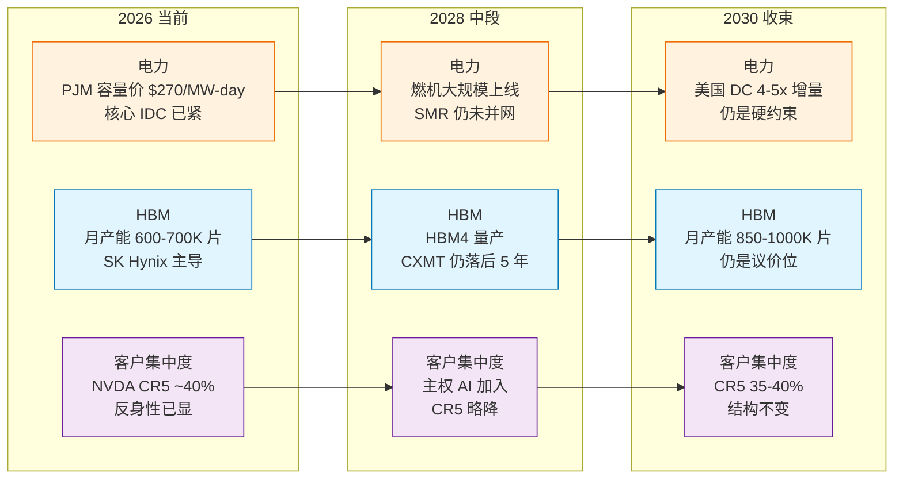
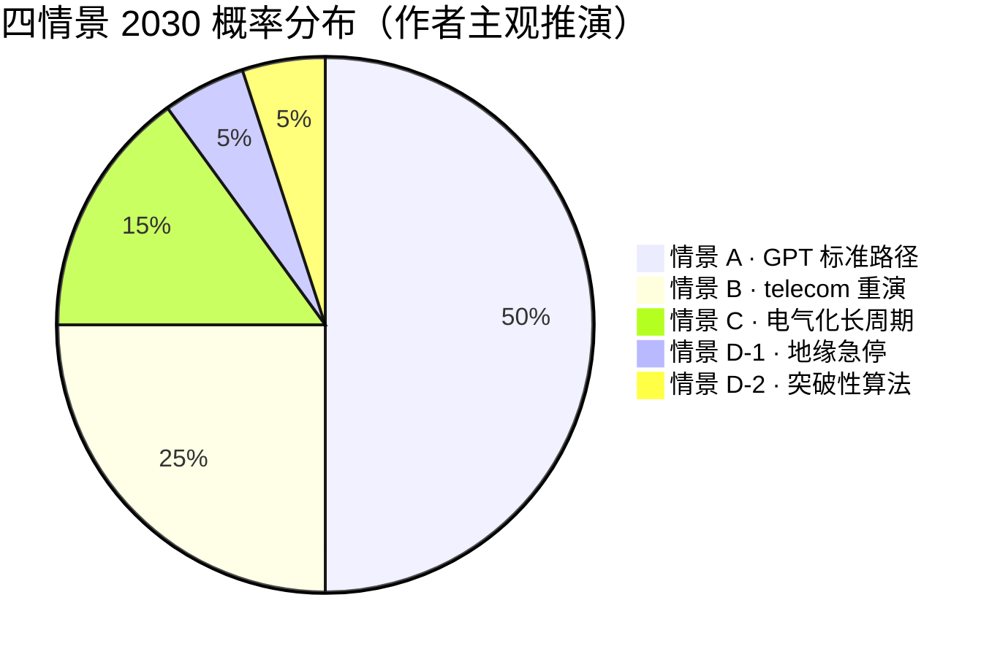
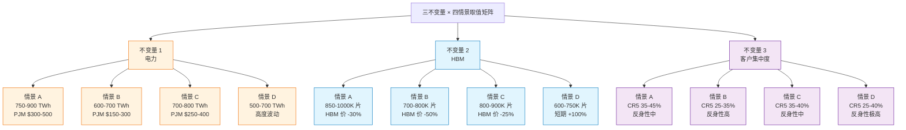
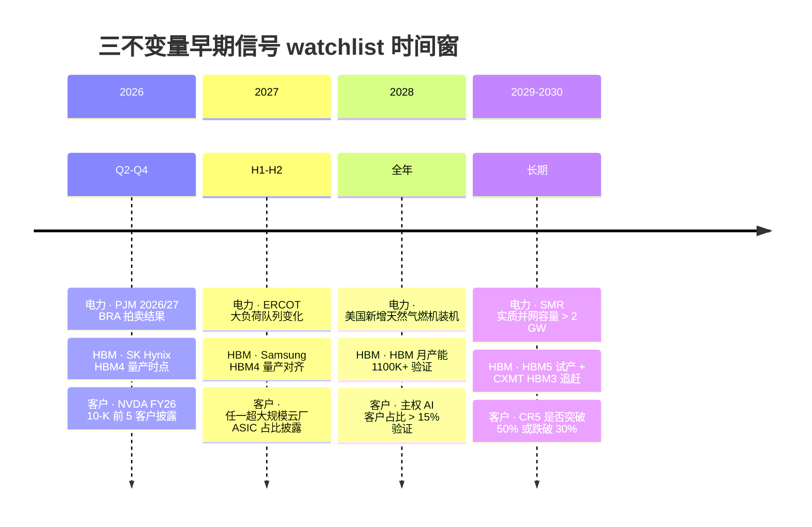
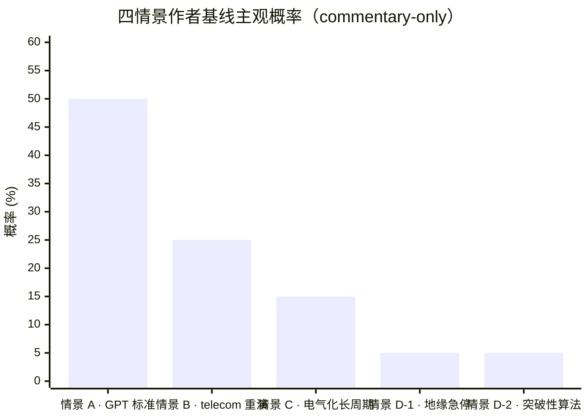
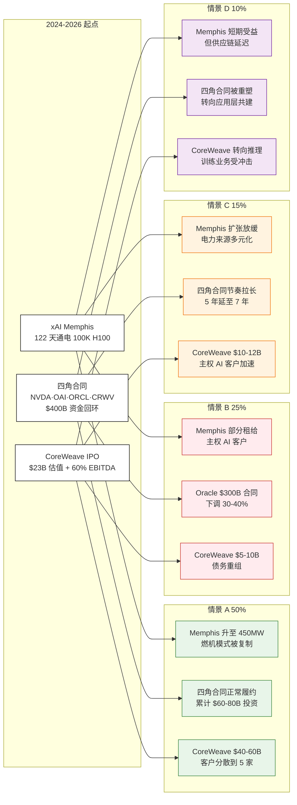

# 第 32 章 五年之后：电力、HBM、客户集中度三不变量

## 32.1 为什么是情景规划，而不是点预测

写到第 32 章这个位置，最大的诱惑是给一组数字：2030 年全球数据中心耗电多少 TWh、[NVIDIA](https://www.nvidia.com/) 数据中心营收多少 USD、HBM 全球产能多少 GB——把全书 31 章的判断收敛成一张五年外推表，写完封笔。

这种写法在卖方研报里随处可见。Morgan Stanley、Goldman Sachs、Bernstein 各家都在 2025-2026 出过类似的「2030 AI 基础设施市场规模」单一数字预测——TAM（Total Addressable Market，可触达市场规模）\$3T、\$5T、\$8T 都有人写。这些数字的共同特征是：单一情景外推 + 固定增速假设 + 链上每一环节按比例放大。读者拿到的是一个表面精确（精确到亿美元）但内部脆弱（任一假设劣化整张表崩塌）的数字。

这本书不走这条路。原因不是「未来不可预测」这种回避式表态——回避也不是诚实——而是因为方法论本身有更好的工具。

Pierre Wack 在 1971-1985 年间为 Royal Dutch Shell 设计的情景规划方法（Scenario Planning），1985 年发表在 *Harvard Business Review* 的两篇论文 "Scenarios: Uncharted Waters Ahead" 和 "Scenarios: Shooting the Rapids"（Wack 1985 HBR）把这件事说尽了——**在多变量、长链条、强反身性的系统里，给一组定性可分辨、定量可比对的情景，比给单一点预测更稳健**。

Shell 的真实使用记录：1973 年第一次石油危机时，Shell 用情景规划方法事先准备了「油价短期内翻倍」的应对预案，在七大石油公司中应对危机最为从容——这是情景规划被验证为有用的最早一手记录。

把 Wack 的方法搬到 AI 算力周期，需要回到 Frank Knight 1921 年在 *Risk, Uncertainty and Profit* 里给出的那条经典区分。Knight 把面向未来的不确定性分两类：

- **风险（Risk）**：结果集合已知，每个结果的概率分布可量化。掷骰子是 Risk，保险公司给一辆车定意外险费率也是 Risk。
- **不确定性（Uncertainty）**：结果集合本身不完全可知，概率分布无法精确量化。一个新的通用目的技术五年后的市场结构是 Uncertainty。

AI 算力周期的五年前瞻落在 Uncertainty 一侧——结果集合（哪些情景会出现、各自概率分布）无法用历史频率直接推算。点预测在 Risk 域是合理的，在 Uncertainty 域是过度自信。

Taleb 在 *Antifragile* (2012) 里又给了一层补充——凸性脆弱性（convexity / fragility）。当系统对某一变量的响应是凸的（小幅扰动后果有限、大幅扰动后果非线性放大），点预测的危害最大；当系统对该变量响应是凹的（小幅扰动有冲击、大幅扰动反而被吸收），点预测的危害较小。AI 算力周期对电力、HBM、客户集中度三个变量的响应是凸的——任一变量小幅偏离当前路径，整个产业链可吸收；偏离超过某个阈值，链上多环节非线性扩散。Taleb 给的处方是：**不要预测，要识别脆弱性来源（fragility identification）**。

本章按这个方法论组织。第 32.2 节定义四个情景的关键变量。32.3-32.6 展开四个情景：

- **情景 A（GPT 标准路径）**：基础设施周期延续 10-15 年，TFP（Total Factor Productivity，全要素生产率）红利 2028-2030 后显化，资本市场中途回调一次但不崩
- **情景 B（telecom 重演）**：18-24 个月内资本支出砍单 + 第一家 neocloud 破产 + NVDA 数据中心环比负增长
- **情景 C（电气化长周期）**：建设期拉长到 20 年，节奏更慢更宽广
- **情景 D（地缘急停 / 突破性算法）**：台海冲突或 H 系列管制全面化，或 DeepSeek 路线极限放大

32.7 是台海风险的独立子情景（嵌在情景 B / D 之间），给三个量化可观测指标。32.8 是本章方法论核心——**三不变量**（电力、HBM、客户集中度）。32.9 给三不变量的早期信号 watchlist。32.10 给作者主观概率分布与修正机制。32.11 回应序章三个不可能的算力故事在五年之后的情景路径。32.12 是全书收尾。

三不变量在 2026 → 2030 的演变路径：

涉及具体公司路径推演与作者主观概率的段落，按 commentary-only 规则做段落级免责。全书统一持仓披露规则见第 29 章与 book.meta.yaml；本章不重复披露。

## 32.2 四情景的关键变量定义

要让四个情景可分辨、可监测、可证伪，必须把变量定义清楚。沿用全书 12 个维度的子集，本章压到 7 个关键变量。

| # | 变量 | 度量单位 | 监测来源 | 在四情景里的角色 |
|---|------|---------|---------|----------------|
| 1 | 全球超大规模云厂年资本支出 | USD B/年 | 4 大超大规模云厂季报 | 周期幅度的总闸门 |
| 2 | NVDA 数据中心营收增速（YoY）| % | NVDA 季报 | 上游设备的最敏感指针 |
| 3 | H100/h GPU 租赁均价 | USD/h | Silicon Data Rental Index | 单位经济信号 |
| 4 | 美国数据中心年耗电（含 AI 增量）| TWh/年 | EIA + LBNL + IEA 互证 | 电力硬约束 |
| 5 | HBM 全球月产能（按 8-Hi 等价）| 千片/月 | TrendForce + 三家 IR | HBM 双瓶颈 |
| 6 | NVDA 前 5 大客户营收占比 | % | NVDA 10-K + 业内估算 | 反身性核心 |
| 7 | 真实终端 AI 付费年化经常性收入（[OpenAI](https://openai.com/) + [Anthropic](https://www.anthropic.com/) + Copilot + Gemini + Azure AI + AWS Bedrock）| USD B/年 | 各家自报 + 第三方 | 需求侧真实性 |

四个情景对这 7 个变量在 2030-12 这个时点上的取值，给一组定性可分辨的区间。**不是点预测——是「在情景 X 下，变量 i 大致落在区间 [a, b]」的形态描述**。

| 变量（2030-12 时点）| 情景 A | 情景 B | 情景 C | 情景 D |
|----|----|----|----|----|
| 1. 超大规模云厂年资本支出 | \$900B-1.1T | \$400-500B（砍 40-50%）| \$700-800B | \$300-450B |
| 2. NVDA DC 营收 YoY | +15-25% | -10 至 +5% | +20-30% | -15 至 +10% |
| 3. H100/h 租赁均价 | \$1.5-2.5 | \$0.8-1.5 | \$1.5-2.0 | \$0.8-2.5（双向）|
| 4. 美国 DC 耗电 | 750-900 TWh | 600-700 TWh | 700-800 TWh | 500-700 TWh |
| 5. HBM 月产能（8-Hi 等价）| 850-1000 千片 | 700-800 千片 | 800-900 千片 | 600-750 千片 |
| 6. NVDA CR5 占比 | 35-45% | 25-35% | 35-40% | 25-40% |
| 7. 真实终端 AI 年化经常性收入 | \$400-600B | \$150-250B | \$300-450B | \$200-400B |

> 表内数值区间为作者基于全书各章数据 + Pierre Wack 情景规划方法的外推推演（commentary-only），不是任何具体公司或行业的财务预测。每个区间的下限对应「该情景成立的最低支撑」，上限对应「该情景接近临界但尚未跨入另一情景」。

读这张表的方式：每一列是一个情景在 7 个变量上的形态指纹（signature）。这些指纹之间互相不重叠——情景 A 的超大规模云厂资本支出 \$900B 不会出现在情景 B 里，情景 D 的 NVDA CR5 25% 不会出现在情景 A 里。这是 Wack 情景规划方法的硬要求——**情景互斥可分辨，才是情景；情景之间互相重叠，本质是单一基线情景的窄区间扰动**。

四情景的概率分布（作者主观推演，详见 32.10）：

A 50% 不是「中性预期」——是「在当前可观测信息下，本书认为最可能的形态是 A」。25% 给 B 是因为第 29 章三个预警指标 + 第 31 章议题 1 答辩里已经识别出真实的脆弱性来源，不是低概率尾部事件。

## 32.3 情景 A（50%）——GPT 标准路径

**情景 A 的核心叙事**：AI 算力周期是一轮通用目的技术（General Purpose Technology，GPT）扩散周期，与 1880-1930 电气化、1995-2025 互联网 + 移动互联网在结构上同构。基础设施扩张期 10-15 年，2026-2030 是扩张中段。TFP 红利在 2028-2030 显化，资本市场中途有一次回调（10-25% 区间）但不全面崩盘。

**关键路径**：

1. **资本支出**：4 大超大规模云厂 2026 合计资本支出 \$660-690B，2027-2028 升至 \$800B 量级，2029-2030 顶部 \$950B-1.05T，2031 后温和回落。增速从 +60% (2024-2025) 降到 +20% (2027-2028) 再降到 +5-10% (2029-2030)——典型的 S 曲线扩张段。
2. **电力**：美国数据中心耗电从 2023 约 176 TWh（LBNL 2024 报告基线）升至 2030 750-900 TWh——4-5x 增量。增量来源：超大规模云厂自建 + neocloud + 主权 AI。增量电力来自天然气燃机（~50%）+ 现有核电延寿（~15%）+ 新增风光储（~30%）+ SMR 试点项目（~5%）。
3. **HBM**：[SK Hynix](https://www.skhynix.com/) HBM3e 维持 2025-2026 主力，HBM4 量产 2026 H2，HBM4e 量产 2027-2028，HBM5 试产 2029-2030。Samsung 在 HBM4 量产时点缩小代差。Micron 维持 20-25% 全球市占。CXMT HBM2 2025-Q3 量产、HBM2e 2026 量产、HBM3 试产 2027-2028（代差缩小但未追平）。
4. **客户集中度**：NVDA 前 5 大客户营收占比从 2026 ~40% 缓慢下降到 2030 ~35-40%——主权 AI 客户 + 二线超大规模云厂 + 大型企业 IT 自建合计 10-15% 营收，分散一部分集中度。但前 5 仍是超大规模云厂主导。
5. **终端付费**：OpenAI + Anthropic + Copilot + Gemini + Azure AI + AWS Bedrock 合计年化经常性收入从 2026 ~\$150B 升至 2030 \$400-600B（4x 增量）。企业 AI 渗透率从 2025 ~5% 升至 2030 25-35%。jevons 悖论在 2027-2028 仍占主导，2029 后接近企业 AI 预算天花板，单价下降弹性减弱。

**赢家清单**：

- NVDA 守住 75%+ AI 加速器市场份额（从 2025 ~85% 略降），FY30 数据中心营收 \$350-450B
- [台积电](https://www.tsmc.com/) 受益于 CoWoS 产能持续紧张 + N2 / N3P 节点高溢价，先进封装毛利维持 55%+
- SK Hynix 在 HBM 寡头格局中保持 50%+ 全球市占
- [CoreWeave](https://www.coreweave.com/) 第一波 GPU 云存活——但客户结构必须从 OpenAI 单家占合同储备 40%（Q3 2025）进一步分散到 OpenAI + 二级客户合计不超 50%
- Mag7 整体自由现金流维持正值但增速温和，Meta / [Microsoft](https://www.microsoft.com/) 在 2027-2028 经历一次估值重估（forward P/E 从 25x 调到 18-20x），不是崩塌

**输家清单**：

- 没有自建 GPU 池子、毛利率低于 50% 的二线 neocloud（合计 5-10 家）2028-2029 被并购或破产
- 试图正面挑战 NVDA + CUDA 生态的硬件初创——Groq / Cerebras / SambaNova 等保留特定推理细分市场份额，不构成 NVDA 主体替代
- 完全押注训练算力扩张、忽略推理转向的设备商和云

**早期信号 watchlist**（情景 A 仍成立的支撑信号）：

- Mag7 合计自由现金流 2027 全年仍正 \$200B+
- NVDA 数据中心营收 YoY 2027-2028 维持 +20% 以上
- ChatGPT 周活 2028 升至 12-15 亿（vs 2026 7-10 亿）
- 美国电力新增装机 2027-2028 年化 30-40 GW（与超大规模云厂 PPA 节奏匹配）
- HBM 月产能 2028 升至 1100-1300 千片（vs 2026 600-700 千片）

> 本节涉及具体公司路径推演（NVDA / 台积电 / SK Hynix / CoreWeave / Mag7）是 commentary-only 的产业类比，不构成对任何具体公司股票或一级标的的多空判断。情景 A 是作者主观推演的 50% 概率情景，不是预测或承诺。

## 32.4 情景 B（25%）——telecom 重演

**情景 B 的核心叙事**：AI 算力周期与 1996-2001 telecom buildout 在结构上高度相似——第 29 章 12 维度对照表中维度 1、2、3、5、6 已经对齐 telecom 顶点。如果维度 8、9、10 三个软着陆来源在 2027-2028 任一环节失效（巨头自由现金流转负 / 端付费增速从 +100% 降到 +30% / 客户集中度从 40% 升至 50%+），第 29 章 「形态相似、性质不同」主张证伪，本轮周期沿 telecom 形态走完——18-24 个月内资本支出砍单 + 第一家 neocloud 破产 + NVDA 数据中心环比负增长。

**关键路径**：

1. **资本支出**：4 大超大规模云厂 2027 财报季任一家明确砍 FY28 资本支出指引 20% 以上（第 31 章议题 1 触发器 B），剩余三家跟随砍 10-15%。2028 合计资本支出 \$400-500B（vs 2026 \$660-690B）——砍 30-40%。
2. **NVDA**：数据中心营收 2027 H2 环比首次负增长（第 29 章预警 2 触发），2028 同比 -10% 至 +5% 区间。H200 / B200 / GB200 库存上升，毛利率从 71%（NVDA FY26 Non-GAAP，详第 29 章）跌到 60%——历史 telecom 时代 Cisco 2001 的同等位置。
3. **Neocloud 第一家破产**：CoreWeave / Crusoe / Lambda / Nebius 中的一家在 OpenAI 削减算力采购 + 数据中心租约违约 + 利息覆盖率跌破 1.0 的三重压力下进入 Chapter 11——按第 16 章模型，触发条件是「OpenAI 单家合同金额削减 40%+ + GPU 二手价 6 个月跌 50%+」。
4. **GPU 二手价**：H100 / H200 二手挂牌价 6 个月内跌 50%+（第 29 章预警 3 触发）。新卡价跌至 \$15-18K（vs 2026 ~\$30K），二手 / 新卡价比跌到 40-50%（健康水平 75%）。
5. **杰文斯失效**：单 token 推理价跌 80%（vs 2026 基线）但使用量只涨 2-3x，单位经济总量首次下行。终端 AI 年化经常性收入增速从 +100% 降到 +30%（第 31 章议题 1 触发器 C）。

**赢家清单**：

- 现金流强 + 折旧期长 + 客户分散的设备商：博通（VRT）、施耐德（SU）、Vertiv（VRT）、Eaton（ETN）等数据中心电气设备商
- 主权 AI / 政府客户为主的二线云厂（包括中国国资云 + 欧洲主权云 + 中东主权云）——受市场化周期影响小
- Mag7 中现金最厚的 MSFT / GOOG / META：估值压缩 30-40% 但不破产，反而在低位增持 AI 资产
- 二级市场上做空 NVDA / 长期持有 Mag7 现金流强的 long-short 策略

**输家清单**：

- NVDA：市值从 \$5T+ 压缩到 \$2.5-3.5T 区间（-30% 至 -50%），forward P/E 从 25x 跌到 15x；不是破产、不是 Cisco -89% 形态——是寡头估值压缩的高情景
- 第一家破产的 neocloud + 排队的 2-3 家：股权 0-30%，债权 50-80% 回收
- 押注 AI 训练年化经常性收入持续 +100% 的一级市场标的：OpenAI / Anthropic / [xAI](https://x.ai/) 估值在私募轮次重估 -30% 至 -50%
- 过度集中持仓 Mag7 + AI 主题 ETF 的散户：组合最大回撤 25-35%

**早期信号 watchlist**（情景 B 触发的关键预警）：

- Mag7 合计季度自由现金流 2027 连续 2 季度转负（第 29 章预警 1 + 第 31 章议题 1 触发器 A）
- 任一超大规模云厂财报会明确砍资本支出指引 20%+ 并归因「需求不及预期」（第 31 章议题 1 触发器 B）
- OpenAI + Anthropic 合计年化经常性收入增速从 +100% 降到 +30%（第 31 章议题 1 触发器 C）
- H100 二手价 6 个月跌 50%+ 并持续 1 个月（第 29 章预警 3）
- NVDA 数据中心环比首次负增长（第 29 章预警 2）

5 个信号触发 ≥3 个并持续 2 季度，情景 B 概率从 25% 上调到 40%+（详见 32.10 修正机制）。

> 本节涉及具体公司路径推演（NVDA / CoreWeave / Mag7 / OpenAI / Anthropic）是 commentary-only 的产业类比，不构成对任何具体公司股票或一级标的的多空判断或交易建议。情景 B 是作者主观推演的 25% 概率情景，不是预测。

## 32.5 情景 C（15%）——电气化长周期

**情景 C 的核心叙事**：AI 算力周期是 1880-1940 电气化的延长版——基础设施扩张期不是 10-15 年而是 20-30 年，节奏更慢、范围更宽广。2026-2050 是连续扩张期，2028-2030 不会出现明确顶点，而是温和增速回落（从 +20%/年降到 +8-12%/年）。TFP 红利显化时点推迟到 2035 后，资本市场的回调更频繁但每次幅度更小（10-15% 区间），不出现 1999-2001 那种主跌期。

**关键路径**：

1. **资本支出**：4 大超大规模云厂资本支出增速从 +60% (2025) 平滑降到 +20% (2028) 再到 +10% (2030)，2030 合计 \$700-800B（情景 A 是 \$900B-1.1T）。建设期被监管 + 电力瓶颈 + 跨国分裂三件事拉长。
2. **电力**：美国数据中心耗电 2030 升至 700-800 TWh（情景 A 750-900 TWh），增速被以下因素抑制——PJM 容量市场拍卖电价 2027-2028 持续高位拉响政治回压、ERCOT 大负荷队列被监管阶段性冻结、加州 / 弗吉尼亚 / 俄勒冈陆续推数据中心电费分摊条例。SMR 在 2030 前实质并网容量 < 1 GW（第 31 章议题 8 结论的延续）。
3. **HBM**：HBM4 量产时点延后 6-12 个月（vs 情景 A），SK Hynix + Samsung + Micron 三家 HBM4 月产能 2030 升至 850-950 千片（情景 A 850-1000 千片）。CXMT HBM3 量产时点延后到 2030（情景 A 是 2027-2028）。
4. **客户集中度**：NVDA 前 5 客户占比维持 35-40%。主权 AI 在 EU + 中东 + 印度三个区域加速，二线主权云客户在 NVDA 客户结构中占比从 2026 ~5% 升至 2030 12-15%。
5. **终端付费**：终端 AI 年化经常性收入从 2026 ~\$150B 升至 2030 \$300-450B（vs 情景 A \$400-600B）——企业 AI 预算渗透率 2030 升至 20-25%（vs 情景 A 25-35%）。增速被以下因素抑制——监管收紧（欧盟 AI Act 全面生效 + 美国部分州的 AI 责任立法）、跨国分裂加剧（中国市场对 NVDA 关闭、欧盟数据本地化推高合规成本）。

**赢家清单**：

- 长期分阶段建设的基建股：天然气燃机（GE Vernova 旗下 GE Power）、电网设备（Eaton / Schneider）、数据中心 REIT（DLR / EQIX / GDS）
- 跨地区分布的多元化云：MSFT Azure + GOOG GCP 在 EU + 中东 + 印度的主权云业务受益于跨国分裂
- 受益于较慢节奏的能源公司：Vistra / Constellation / NextEra 在 2027-2030 持续与超大规模云厂签 10-15 年 PPA
- SMR 开发商（X-energy / Oklo / NuScale）在 2030 后才进入量产阶段——情景 C 给它们多 2-3 年缓冲

**输家清单**：

- 押注短期爆发的纯算力周期股：单纯卖算力的设备商和云厂在情景 C 下不会破产，但估值倍数压缩到电气化时代电气设备公司的水平（forward P/E 15-20x，而非 30x+）
- 单一押注训练算力大爆发的硬件初创
- 试图在 24-36 个月内兑现 ASIC 替代 NVDA 的方案

**早期信号 watchlist**（情景 C 标志性信号）：

- 4 大超大规模云厂资本支出增速 2027-2028 平滑回落（每季度环比 +5-8%，而不是大幅波动）
- 美国电力新增装机 2027-2028 年化 25-30 GW（情景 A 是 30-40 GW，节奏更慢）
- 终端 AI 年化经常性收入增速 2027 +50-70%（情景 A 是 +80-100%，情景 B 是 +20-40%）
- 监管事件频率上升：欧盟 AI Act 罚单、美国数据中心电费分摊州级法案陆续出台
- jevons 悖论持续但弹性递减（单价跌 50%、使用量涨 2-3x，而不是涨 10x+）

> 本节涉及具体公司路径推演是 commentary-only 的产业类比，不构成对任何具体公司股票或一级标的的多空判断。情景 C 是作者主观推演的 15% 概率情景。

## 32.6 情景 D（10%）——地缘急停 / 突破性算法

情景 D 是一组「真正改变游戏规则」的尾部情景集合。两个子情景从不同方向同时威胁四情景结构本身——地缘急停从供给侧切断，突破性算法从需求侧瓦解。两子情景概率各 5%（合计 10%），互不依赖。

### 子情景 D-1（5%）：地缘急停——台海冲突或 H 系列管制全面化

**核心叙事**：2027-2028 期间台海发生军事冲突（不必是全面战争，封锁 / 军演升级 / 海上事件即可），或美国商务部工业和安全局（Bureau of Industry and Security，BIS）把 H100 / H200 / B200 全系列纳入对华许可清单（vs 当前 H20 部分管制），全球 AI 算力供应链出现 6-18 个月断裂。

**关键路径**：

1. **HBM 断供**：SK Hynix + Samsung 韩国厂区运行不受直接影响，但台积电 5nm / 4nm / 3nm 节点临时停产 1-6 个月（台湾本岛物理生产环节），全球 AI 加速器供应在 2027-2028 出现深度短缺
2. **NVDA**：B200 / GB200 / Rubin 平台交付推迟，对美国超大规模云厂客户营收延后 6-12 个月确认。库存减值规模业内估算 \$20-40B 量级（vs 2025 H20 减值 \$4.5B）
3. **资本支出**：4 大超大规模云厂 2028 资本支出被迫下调到 \$400-500B（不是因为需求不足，是因为供应不到货）
4. **HBM / CoWoS 价格**：现货市场价格短期上涨 50-150%，长协价被迫重谈
5. **市场反应**：NVDA / TSM / 4 大超大规模云厂单日跌幅 -15 至 -30% 区间，VIX 单周冲上 50+，S&P 500 单月下跌 12-20%

**赢家清单**：

- 中国 AI 加速器链（华为 Ascend、海光、寒武纪）在国内市场加速渗透——从 2026 国内 30% 市占升至 2028 60%+
- SMIC + CXMT 长期产能扩张被政策加速
- 主权 AI 项目（EU / 中东 / 印度）：在全球供应紧张时点拿到优先配额
- 黄金 / 美债（避险资产）

**输家清单**：

- NVDA / TSM / 4 大超大规模云厂：股价短期 -20 至 -40%，长期取决于冲突持续时间
- 私募 AI labs（OpenAI / Anthropic / xAI）：估值在私募轮次重估 -30 至 -50%

### 子情景 D-2（5%）：突破性算法

**核心叙事**：1-2 年内出现「训练算力下降 10x + 推理覆盖率上升 10x」的新算法——DeepSeek-V3 路径的极限放大版，或扩散模型 / state-space models / 全新架构突破。算力需求增速放缓，但应用层加速。

**关键路径**：

1. **训练算力需求**：从当前线性增长（前沿训练算力 2010-2024 年化 4x）放缓到 +2x/年。Epoch AI 数据中 2030 单次训练 2e29 FLOP 目标向 2032-2033 推迟。
2. **推理算力需求**：推理覆盖率从 2026 ~30% 升至 2028 70%+（vs 情景 A 50-60%）。jevons 悖论极限放大——单 token 价格跌 99%+ 但使用量涨 100-1000x，总量爆发。
3. **NVDA**：训练侧需求增速放缓 → 数据中心营收 YoY 从 +50% 降到 +15-25%。但推理侧加速 → ASIC（博通 / Marvell / Meta MTIA / Google TPU / AWS Trainium）市占快速从 2026 ~15% 升至 2030 35-40%。NVDA 总营收受双向拉扯，2030 数据中心营收 \$280-380B（情景 A \$350-450B）。
4. **HBM 需求结构变化**：推理需求对 HBM 带宽 / 容量要求显著低于训练 —— HBM3e + HBM4 长期看是过剩格局而非紧缺格局。HBM 月产能在 2028-2030 进入价格下行周期。
5. **应用层加速**：终端 AI 年化经常性收入不是线性 +50%/年增长 —— 是 step function——某些应用（agent / coding / 创意 / 客服自动化）一次性渗透 50-70% 行业，年化经常性收入在 2028-2029 一次性翻倍。

**赢家清单**：

- 模型层 + 应用层公司：Anthropic / OpenAI / DeepSeek（一级估值 +5-10x）
- ASIC 厂商：博通 / Marvell / Google TPU 内部 / AWS Trainium 内部
- 推理专用加速器初创：Groq / Cerebras / Tenstorrent

**输家清单**：

- 单纯卖训练算力的设备商：NVDA 训练侧营收增速放缓
- 押注 HBM4 / HBM5 长期紧缺的资本支出
- CoreWeave / Crusoe 等以训练算力为主的 neocloud

> 子情景 D-1 与 D-2 在 7 个关键变量上的形态不同（D-1 是供给冲击 = 资本支出砍但价格涨，D-2 是需求结构调整 = 资本支出部分放缓但 ASIC 受益）。本章在 32.2 表中将两者合并为情景 D 的取值区间——下限对应 D-1（供给冲击导致深度短缺），上限对应 D-2（需求结构调整但总量未崩塌）。情景 D 是作者主观推演的 10% 概率情景（D-1 5% + D-2 5%），不构成任何具体地缘事件或技术突破的预测。

## 32.7 台海风险作为情景 B / D 子情景：三个量化可观测指标

台海风险是 2024-2026 期间产业研究里最难处理的变量——既不能政治化（写成「必然冲突」或「必然不冲突」的硬表态），也不能逃避（数据中心的 GPU 75%+ 经过台湾本岛物理生产环节）。本章的处理方式：把台海风险作为情景 D-1 的核心触发器，但提前用三个量化可观测指标做监测。

历史可比是 1995-1996 第三次台海危机（Third Taiwan Strait Crisis）。Wikipedia 综合记录的关键事实——1995 年 7 月 21 日至 28 日，PLA 在台湾以北 36 英里海域进行 DF-15 导弹试射；1996 年 3 月，导弹试射点距基隆 20 英里、距高雄 29 英里，超过 70% 的商业航运经过这两个港口；同期 "Shipping and insurance rates for freight to Taiwan radically increased during the crisis"——这是历史上一次有据可查的「海上保险费率因台海风险快速上升」的事件，距今 30 年。

把 1995-1996 历史经验翻到 2026 监测框架——给三个量化可观测指标。

### 指标 1：劳合社台海航运保险费率（war risk premium）

**指标含义**：劳合社（Lloyd's of London）和其他主要再保险机构会按区域评估航运战争风险（war risk insurance），并按月度更新。台海航运保险费率反映保险业对台海冲突概率的市场化定价。

**基线（2024-2026）**：业内估算台海航运 war risk 保险费率约为船舶价值的 0.02-0.05%/航次（按季度更新，详见劳合社年度市场报告）。1995-1996 危机期间，相同指标上涨到 0.15-0.3%（业内估算综合 historical Lloyd's Market Reports）。

**触发阈值**：
- **黄区**：费率升至 0.08-0.15% 区间并持续 1 个月——市场开始定价中等冲突概率
- **红区**：费率升至 0.15-0.3% 并持续 2 周以上——市场定价对齐 1995-1996 危机水平
- **黑天鹅区**：> 0.5%——超过历史峰值，航运实质性中断

**监测来源**：Lloyd's Market Reports（年度披露）、Joint War Committee 季度评估、各大航运公司（Maersk / MSC / 阳明 / 长荣）季报中的保险成本变化。

### 指标 2：台积电 ADR vs TPE 上市价差（dual-listing 偏离）

**指标含义**：台积电在 NYSE 以 ADR 形式上市（代码 TSM），同时在台湾证交所原股上市（代码 2330.TW）。在正常市场环境下，TSM ADR 价格 ≈ 5 × 2330.TW 价格 × USD/TWD 汇率（每 ADR 代表 5 股原股）。

如果出现台海风险，TSM ADR（美国投资者可立即抛售）会率先反映恐慌情绪，2330.TW（台湾本地市场）会出现技术性滞后。**两者价差的偏离幅度是台海风险的实时市场定价**。

**基线**：正常市场环境下，TSM ADR vs 5x 2330.TW × FX 的偏离在 ±2% 区间（按 20 日移动平均平滑后）。1995-1996 危机期间，相同口径偏离曾达 -8 至 -12%（业内估算综合 Bloomberg 历史数据）。

**触发阈值**：
- **黄区**：偏离 -3 至 -6% 并持续 1 周——市场定价中等风险升温
- **红区**：偏离 -6 至 -10% 并持续 3 个工作日——市场定价对齐 1995-1996 危机水平
- **黑天鹅区**：偏离 < -10%——超过历史峰值

**监测来源**：Bloomberg / Refinitiv 双重上市数据，按 5 日 / 20 日移动平均平滑后比较。注意：台股交易日历与美股不一致（春节、清明等），口径应剔除非同步交易日。

### 指标 3：TSM 12 月期权偏度 skew（put / call IV 比）

**指标含义**：TSM 美股期权市场提供 12 个月期 put 与 call 期权报价。put implied volatility（IV）与 call IV 的比率，反映期权市场对下行风险的定价偏度（risk reversal skew）。当市场预期下行尾部风险大于上行尾部风险时，put IV > call IV，比率上升。

**基线**：正常市场环境下，TSM 12 月 25-delta put IV / 25-delta call IV 比率约 1.0-1.2 区间（业内估算综合 Cboe / 期权数据）。比较参照——NVDA 同期 put / call IV 比约 1.0-1.15（科技股标准区间）。

**触发阈值**：
- **黄区**：比率升至 1.4-1.7 并持续 1 个月——期权市场定价中等地缘风险升温
- **红区**：比率升至 1.7-2.2 并持续 2 周以上——期权市场定价对齐 1995-1996 同期水平
- **黑天鹅区**：> 2.5——超过历史峰值

**监测来源**：Cboe / Bloomberg 期权数据、各大投行 derivatives strategy 周报、TSM 25-delta risk reversal skew 历史数据。

### 三个指标的组合判断

| 指标 | 基线（2026-05）| 黄区触发 | 红区触发 | 监测频率 |
|------|----|----|----|----|
| 1. Lloyd's war risk 保险费率 | 0.02-0.05%/航次 | 0.08-0.15% | 0.15-0.3% | 月度 |
| 2. TSM ADR vs TPE 偏离 | ±2% | -3 至 -6% | -6 至 -10% | 日度 |
| 3. TSM 12M put/call IV 比 | 1.0-1.2 | 1.4-1.7 | 1.7-2.2 | 日度 |

**组合判断逻辑**：
- 三个指标全部在基线区间——情景 D-1 概率维持 5%
- 任一指标进入黄区——情景 D-1 概率上调到 8-12%
- 任两个指标同时进入红区——情景 D-1 概率上调到 20-25%
- 三个指标同时进入红区——情景 D-1 概率上调到 35%+，本章四情景概率分布需要全面重估

注：这三个指标都不是「冲突预测」——是「市场对冲突概率的实时定价」。它们的功能是在冲突真正发生之前 1-6 个月给出预警，而不是替代地缘政治分析。

> 本节涉及具体公司（TSM）股价 / 期权数据的分析是 commentary-only 的产业风险监测框架，不构成对 TSM 或其他公司股票的多空判断。台海风险的政治分析超出本书范围，本节仅提供量化可观测指标。

## 32.8 三不变量：电力、HBM、客户集中度

四情景在 7 个变量上的取值不同，但**有三个变量在所有四情景下都构成产业链最高约束位**——无论情景 A / B / C / D 出现，这三个变量都不会让位。这是本章方法论的核心——**三不变量**。

为什么是这三个不是其他？

- **电力**——是 2030 前的硬约束。第 10 章（数据中心与电力）+ 第 14 章（双瓶颈缓解后的新硬约束）+ 第 27 章（电力市场政治回压）三段递进的判断在四情景下都成立。AI 算力扩张速度被电力新增装机速度限制，不被 GPU 产能限制；这件事在情景 A 下显著（增量电力来源紧张），在情景 B 下显著（即使资本支出砍单，已签 PPA 仍需履约），在情景 C 下显著（建设期拉长但电力需求总量不变），在情景 D 下显著（供给冲击让电力本地化成本上升）。
- **HBM + 先进封装**——双瓶颈即使 2027 缓解后仍是产业链最高议价位。第 5 章（HBM 三家寡头）+ 第 6 章（CoWoS 双瓶颈）+ 第 11 章（2027 拐点）三段判断的归位。无论 NVDA 营收增速如何，HBM 每 GB 的真实价值（包括芯片成本 + 封装成本 + 良率损失 + 客户认证墙）在四情景下都是 GPU 裸片之上的核心定价位。
- **客户集中度**——产业链最大反身性风险。第 7 章（NVDA 客户结构）+ 第 14 章（终端付费真实性）+ 第 29 章（周期反身性）+ 第 30 章（估值反身性）四章累积的判断。NVDA 前 5 客户占营收 35-45% 在情景 A 下成立，30-40% 在情景 C 下成立，25-35% 在情景 B 下成立，25-40% 在情景 D 下成立——区间略有变化，但「前 5 客户合计占近一半营收」这个结构在四情景下都成立。

### 不变量 1：电力

**核心数据**：

- LBNL 2024 报告：2023 年美国数据中心耗电约 176 TWh（占美国总耗电 4.4%）
- IEA Energy and AI 2025 估算：2030 年全球数据中心耗电约 945 TWh（vs 2024 约 415 TWh），AI 数据中心是主要增长来源（注：IEA 945 TWh 是全球数据中心耗电口径，美国占全球约 19-20%；LBNL 176 TWh 是美国口径，非同口径对比）
- ERCOT 大负荷队列业内估算 2026-Q1 累计 226 GW（vs 2024 基数 63 GW，~3.6× 倍数），其中数据中心 70%+，绝大多数将不能按时通电（业内估算综合 ERCOT 公开 large load 申请数据 + Bernstein 2026 报告）
- PJM 2025/26 容量市场拍卖（Base Residual Auction，BRA）清算价从 2024/25 的 \$28.92/MW-day 飙升至 \$269.92/MW-day（+833%）（以下简称 \$270/MW-day）

**四情景下的电力变量取值**：

| 情景 | 美国 DC 2030 耗电 | PJM 2027/28 BRA 清算价业内估算 | SMR 2030 前并网容量 |
|------|----|----|----|
| A | 750-900 TWh | \$300-500/MW-day | < 1 GW |
| B | 600-700 TWh | \$150-300/MW-day | < 0.5 GW |
| C | 700-800 TWh | \$250-400/MW-day | < 1 GW |
| D | 500-700 TWh | 高度波动 | < 0.5 GW |

> 不变量 1 的硬数据：无论情景 A / B / C / D，美国数据中心 2030 耗电都显著高于 2024 基线（4-5x 区间）。即便情景 B 出现，已签 PPA 与已开工建设的数据中心仍需履约。SMR 在 2030 前实质并网容量在四情景下都 < 1 GW（第 31 章议题 8 一边倒结论的延续）。

### 不变量 2：HBM + 先进封装

**核心数据**：

- SK Hynix HBM3e 2024-Q1 量产、HBM4 2026 H2 量产、HBM5 2029-2030 试产
- HBM4 规格：2 TB/s 带宽（vs HBM3e 1.2 TB/s）、64 GB 最大容量（16-Hi 配置）
- SK Hynix + Samsung + Micron 三家 2025 HBM 全球月产能业内估算 600-700 千片（8-Hi 等价 = 以 8 层堆叠为标准单位换算不同堆叠高度的产能；HBM3e 12-Hi → 按 1.5 计入，HBM4 16-Hi → 按 2 计入；详第 5 章）（业内估算综合 TrendForce 2025-Q3 + Bernstein 2025-Q4）
- CXMT HBM2 2025-Q2-Q3 量产（业内估算综合 TechInsights 拆解），HBM3 试产推迟到 2027-2028（vs SK Hynix 2022 量产 HBM3，落后 5-6 年）

**四情景下的 HBM 变量取值**：

| 情景 | HBM 全球月产能 2030（8-Hi 等价）| CXMT 量产代际 2030 | HBM 单 GB 价业内估算变化 |
|------|----|----|----|
| A | 850-1000 千片 | HBM3 试产 | -30% vs 2026 基线 |
| B | 700-800 千片 | HBM3 试产 | -50% vs 2026 基线 |
| C | 800-900 千片 | HBM2e 量产 | -25% vs 2026 基线 |
| D | 600-750 千片 | HBM2e 量产 | 高度波动（供给冲击下短期 +100%）|

> 不变量 2 的硬数据：无论情景 A / B / C / D，HBM 在四情景下都是产业链最高议价位之一（高于 GPU 裸片）。HBM 月产能在情景 A 下不到 1100 千片，在情景 B / D 下出现紧缺。SK Hynix HBM4 / HBM5 客户认证墙在四情景下都难以被新进入者突破（Samsung 是唯二的潜在替代，但 HBM4 量产时点已对齐 SK Hynix）。

### 不变量 3：客户集中度

**核心数据**：

- NVDA FY26 数据中心营收 \$193.7B，前 5 大客户业内估算占 40% 左右（MSFT + META + AMZN + GOOG + ORCL 合计 ~40%，业内估算综合 NVDA 10-K 风险因素披露 + Bernstein 拆解）
- CoreWeave Q3 2025 合同储备 \$55.6B，其中 OpenAI 单家 \$22.4B（40%），加上 Microsoft 占比超过 60%
- NVDA Q1 FY27 财报披露口径业内估算前 5 客户占比仍在 38-42% 区间（业内估算）

**四情景下的客户集中度变量取值**：

| 情景 | NVDA 前 5 客户营收占比 2030 | 头部 neocloud 单一客户占合同储备 | 反身性风险等级 |
|------|----|----|----|
| A | 35-40% | 50-60% | 中（缓慢分散）|
| B | 25-35% | 80%+（CoreWeave 类型） | 高（OpenAI 削减直接传导）|
| C | 35-40% | 50-60% | 中（主权 AI 分散部分）|
| D | 25-40% | 60-80% | 极高（地缘急停下直接传导）|

> 不变量 3 的硬数据：无论情景 A / B / C / D，NVDA 前 5 客户占营收都不会降到 25% 以下。「一家客户砍单 = 系统性风险」的结构在四情景下都成立。这是第 29 章维度 10 + 第 30 章反身性核心 + 第 31 章议题 9 的累积归位——客户集中度是 NVDA 估值反身性核心，不会因为情景切换而消失。

### 三不变量在四情景下的取值矩阵

把上面三张表压缩成一张矩阵图——三不变量（电力 / HBM / 客户集中度）× 四情景（A / B / C / D）的取值压缩到一张图上，便于读者一眼对照「在哪个情景下、哪个不变量最紧」：

### 三不变量的方法论含义

三不变量在四情景下都成立，意味着——**无论本章四情景哪个出现，这三个变量都是产业链最高约束位**。任何对 AI 算力周期五年前瞻的分析，都必须把这三个变量作为基准锚（baseline anchor），其他变量都是相对这三个不变量的派生。

写到这里，回到 Wack 情景规划方法的核心洞察——**情景规划的目的不是预测，是识别不变量**。Shell 1971 第一次做情景规划时，发现的不是「油价会涨到多少」，而是「OPEC 国家的政治议价权 + 全球需求增长 + 石油储量分布」三个不变量。同样的方法搬到 AI 算力周期，三不变量是：电力、HBM、客户集中度。

## 32.9 三不变量的早期信号 watchlist

三不变量的方法论价值在于——它们的状态变化会比情景切换早 6-12 个月发出信号。给三不变量配套监测 watchlist，让读者能在情景切换发生前自己判断。

### 不变量 1（电力）的早期信号

| 信号 | 监测来源 | 当前状态（2026-05）| 触发阈值 |
|------|---------|-------------------|----------|
| PJM 2027/28 BRA 拍卖清算价 | PJM 公告 | 2025/26 \$270/MW-day | > \$400/MW-day 触发电力紧缺加剧 |
| ERCOT 大负荷队列变化 | ERCOT 月度披露 | 226 GW | > 250 GW 或队列被监管冻结 |
| 美国新增天然气燃机装机 | EIA 月度电力数据 | 2025 全年 9-12 GW | < 5 GW/年 = 供给侧瓶颈加剧；> 15 GW/年 = 缓解节奏对齐情景 A |
| 美国数据中心电费分摊州级法案 | 各州监管披露 | 弗吉尼亚 / 加州在筹备 | ≥3 州通过类似法案 = 政治回压加剧 |
| SMR 试点项目实际并网容量 | NRC / 各项目披露 | 2030 前业内估算 < 1 GW | > 2 GW 在 2029 前并网 = 情景 A 加分项；持续延误 = 情景 C 加分项 |

### 不变量 2（HBM）的早期信号

| 信号 | 监测来源 | 当前状态（2026-05）| 触发阈值 |
|------|---------|-------------------|----------|
| SK Hynix HBM4 量产时点 | SK Hynix IR | 计划 2026 H2 | 推迟超过 6 个月 = 情景 C / D 加分项 |
| Samsung HBM4 量产时点 | Samsung IR | 计划 2026 H2-2027 H1 | 准时量产 = 双供给压力缓解 |
| 台积电 CoWoS 月产能 | 台积电 Capital Markets Day | 2026 H1 月产能业内估算 7-8 万片 12 寸晶圆等价 | < 10 万/月持续 = 2027 拐点延后 |
| HBM 现货价 | TrendForce / DRAMeXchange 月度 | HBM3e 单 GB ~\$15-20 | 上涨 30%+ = 短缺加剧；下跌 30%+ = 进入下行周期 |
| CXMT HBM3 试产时点 | TechInsights / SemiAnalysis | 2026-Q1 暂未量产 | 提前到 2026 内 = 中国替代节奏加快 |

### 不变量 3（客户集中度）的早期信号

| 信号 | 监测来源 | 当前状态（2026-05）| 触发阈值 |
|------|---------|-------------------|----------|
| NVDA 10-K 披露的前 5 客户占比 | NVDA 年报 10-K | FY26 业内估算 ~40% | > 50% 或 < 30% = 反身性风险结构变化 |
| Mag7 + [Oracle](https://www.oracle.com/) 合计资本支出占 NVDA 数据中心营收 | NVDA 季报 + Mag7 季报 | 2026 ~50% 区间 | 升至 60%+ = 客户集中度加剧；降至 35% 以下 = 客户分散 |
| CoreWeave OpenAI 合同占合同储备比例 | CoreWeave 8-K | Q3 2025 ~40% | > 50% = 反身性高风险位 |
| 主权 AI 客户在 NVDA 营收占比 | NVDA 业绩会 + 业内估算 | 业内估算 < 5% | > 15% = 客户分散加速 |
| 任一超大规模云厂季报披露「自研 ASIC 占内部算力 50%+」 | Mag7 季报 + 财报会 | Google TPU + AWS Trainium 内部占比业内估算 30-40% | 任一家明确披露 > 50% = NVDA 客户结构松动 |

### Watchlist 关键信号的预期出现时间窗

把三不变量 watchlist 中最关键的几个信号在时间轴上摆开，读者可以按季度对照真实数据更新自己的判断：

三个不变量的每个 watchlist 内部触发数量，给出该不变量的「紧张程度」。

- **不变量松动**：单个 watchlist 内 ≥3 个信号触发并持续 2 季度——该不变量在情景中地位下降，本章定位需重新校准
- **不变量加剧**：单个 watchlist 内 ≥2 个信号触发并持续 1 季度——该不变量是当前周期主要约束，对应情景概率分布需调整

整个 watchlist 的设计哲学：**让读者不需要依赖作者的判断，自己用三不变量的状态变化追踪情景演化**。

## 32.10 作者主观概率分布与修正机制

写到这里需要回到全书最不舒服的一段——给出作者主观概率分布。

写产业研究最容易的地方是逃避表态。把四个情景列出来，每个情景的关键变量给出区间，最后写「未来不确定，请读者自行判断」——这种写法在卖方研报里随处可见，看起来公允，本质是不负责任。Popper 在 *The Logic of Scientific Discovery*（1959）里把这件事说尽了——**不可证伪的陈述不是错的，它根本就不属于科学的范畴**。

本书的方法论承诺是「有判断且可证伪」。所以本章必须明示——**情景 A 50% / 情景 B 25% / 情景 C 15% / 情景 D 10%（D-1 5% + D-2 5%）**。

作者基线主观概率分布的柱状形态：

> 这只是基线。在 32.10 末尾的修正机制下，每个信号触发都会让对应情景概率上调或下调——例如「Mag7 自由现金流持续 4 季度转负」会让情景 B 从 25% 上调到 40-50%、情景 A 从 50% 下调到 30%。修正后的概率分布以本书勘误版为准。

### 概率分布的明示理由

50% 给情景 A 的理由：

1. **第 29 章 12 维度对照**：12 维度中 5 个软着陆来源（差异 1 巨头自由现金流 / 差异 2 真实使用量 / 差异 3 jevons 净正 / 差异 4 NVDA 寡头议价 / 差异 5 客户集中度）有 3 个明确支持软着陆（差异 1 / 2 / 3），1 个双向（差异 4），1 个新增风险（差异 5）。3:1:1 的比例支持「软着陆为主、新增尾部风险为辅」的形态。
2. **真实终端付费已经爆发**：ChatGPT 周活 7-10 亿（2026-Q1 OpenAI 自报）+ Anthropic 年化经常性收入 \$30B + Menlo Ventures 2025-12 报告显示企业 AI 支出 2025 年 \$37B vs 2024 \$11.5B（3.2x 增长）+ 全行业终端年化经常性收入 ~\$150B。终端付费的真实爆发让「1995 + 1999」二选一的悲观情景不成立。
3. **历史可比的胜出**：1995-2000 telecom 周期、1880-1940 电气化、1843-1846 铁路狂热三轮基础设施周期都不是「直接进入崩盘」的形态——都是「上行 5-15 年 + 中场休整 + 持续扩张」。AI 算力周期更可能沿这个形态展开。

25% 给情景 B 的理由：

1. **第 29 章三个泡沫顶部预警**：Mag7 自由现金流转负 / NVDA 数据中心环比负增长 / H100 二手 6 月跌 50%——三个预警每一个都有真实触发的可能。即使每个预警单独触发概率仅 15-20%，三个预警形态相关（任一触发引发市场恐慌可能引发其他触发），合并概率明显高于独立累积。
2. **杰文斯悖论的边界**：Cahn \$600B 缺口算法的真实终端付费数字（\$50-150B 量级）虽然忽略了 5-10 年回收本质，但确实指出 jevons 弹性会在某个时点失效——只是时点不可精确预测。
3. **客户集中度的反身性**：NVDA CR5 ~40% 是真实约束。一家超大规模云厂砍单 30% 在 NVDA 季报打出 5-8% 缺口；两家同时砍单 10-15%。这种结构在 telecom 时代不存在。

15% 给情景 C 的理由：

1. **真实电力瓶颈拉长建设期**：PJM 2025/26 BRA 价 +833%、ERCOT 226 GW 排队、加州 / 弗吉尼亚 / 俄勒冈电费分摊州级法案——这些事件在 2027-2028 大概率累积成实际节奏拉长，但不会导致砍 30% 资本支出。
2. **跨国分裂加剧**：欧盟 AI Act + 中美双向技术限制 + 主权 AI 兴起——三件事让全球 AI 算力市场从一个全球市场分裂成多个区域市场，建设期被监管和合规拉长。
3. **TFP 红利显化推迟**：Erik Brynjolfsson 等学者的「J 曲线」假说指出，通用目的技术红利显化时点滞后于基础设施扩张 5-10 年。AI 算力周期 2026 还在扩张期，TFP 红利显化推迟到 2032-2035 是合理推演。

10% 给情景 D 的理由：

1. **地缘急停（D-1 5%）**：1995-1996 第三次台海危机距今 30 年，期间未发生军事冲突。但 2024-2026 期间台海地缘紧张度业内观察显著高于 1995-2024 平均水平。BIS 对华出口管制扩展 / 台海军事冲突两个事件的合并概率在 5% 量级（业内主观推演，无法精确量化）。
2. **突破性算法（D-2 5%）**：DeepSeek-V3 2024-12 已经展示了训练算力下降 10x 的可能性。如果在 2027-2028 出现另一次类似突破（state-space models / 新架构 / 训练数据效率 100x），算力需求增速放缓是合理推演。

### 修正机制：「如果 X 信号出现，则概率上调到 Y」

主观概率分布不是固定不变。本章给一组明确的修正规则——如果 12 个月内观察到 X 信号，本书相应情景概率上调到 Y。

| 信号 | 时间窗 | 影响情景 | 概率调整 |
|------|--------|---------|----------|
| Mag7 合计自由现金流季度转负持续 4 季度 | 12 个月 | B ↑ | B 从 25% → 40-50% |
| 任一超大规模云厂砍资本支出指引 20%+ 并归因「需求不及预期」 | 6 个月 | B ↑ | B 从 25% → 35-45% |
| OpenAI + Anthropic 合计年化经常性收入增速从 +100% 降到 +30% | 12 个月 | B ↑ | B 从 25% → 35-40% |
| H100 二手 6 月跌 50%+ 并持续 1 月 | 6 个月 | B ↑ | B 从 25% → 40-50% |
| 上述 5 个信号触发 ≥3 个并持续 2 季度 | 24 个月 | B ↑ A ↓ | A 从 50% → 30%，B 从 25% → 50% |
| Lloyd's war risk 保险费率进入红区 + TSM 双重上市偏离进入红区 | 6 个月 | D-1 ↑ | D-1 从 5% → 25%+ |
| 突破性算法事件（训练算力下降 10x + 推理覆盖率上升 10x）| 18 个月 | D-2 ↑ | D-2 从 5% → 15-25% |
| SMR 任一项目在 2029 前实质并网 1 GW+ | 36 个月 | A ↑ C ↓ | A +5%，C -5% |
| ERCOT 大负荷队列被监管冻结 ≥6 个月 | 12 个月 | C ↑ | C 从 15% → 25% |
| HBM 月产能 2028 突破 1300 千片 | 24 个月 | A ↑ | A 从 50% → 55-60% |
| HBM 月产能 2028 卡在 < 800 千片 | 24 个月 | B / D ↑ | B + D 合计 +10% |
| NVDA CR5 占比 2028 升至 50%+ | 24 个月 | B ↑ D-1 ↑ | B + D-1 合计 +10% |

> 上表是作者主观推演的修正规则（commentary-only），不是任何具体公司或情景的预测。修正规则的功能是让读者后续可监测——如果信号出现而本书概率分布未调整，可视为本书主张证伪。

### 重大变化触发条件

如果以下三件事任一发生，本章四情景框架本身需要重新设计（不是概率调整，是框架重构）：

1. **超过情景 D 的尾部事件**：全面台海军事冲突 + 持续 6 个月以上的全球 AI 算力供应中断
2. **超过情景 A 的极强爆发**：终端 AI 年化经常性收入在 2028 升至 \$1T 以上，企业 AI 渗透率突破 50%（vs 情景 A 25-35%）——通用目的技术红利显化时点提前 5 年
3. **新出现的产业链结构性变化**：硅光子 / 量子计算 / 全新计算架构在 2028-2030 完成商业化——使 GPU + HBM + CoWoS 三件事在 5-10 年视角下被淘汰

这三件事的合并概率业内主观推演 < 5%，但不能为零。本书不假装这些情景不存在——只是因为它们超过当前可观测信息的判断能力，留作 36-60 个月后再重新评估。

> 本节涉及作者主观概率分布与修正机制是 commentary-only 的方法论表态，不构成任何具体公司股票或一级标的的多空判断或交易建议。概率分布的「明示理由」无法被外部数据直接验证，只能通过修正机制让读者后续验证。如果在 12-24 个月内观察到上述信号但本书未在勘误版中调整概率分布，可视为本书在该议题上证伪。

## 32.11 回到序章：五年之后的三个故事

写到全书最后一节，绕回序章提出的三件事——xAI Memphis、四角合同、CoreWeave IPO。这三件事在 2024-2025 同时发生时，本书第一节的判断是「传统框架在三个独立维度上同时失效」。五年之后，它们在四情景下分别会走到哪里？

序章三件事在四情景下的路径分叉：

### xAI Memphis 在五年之后

**情景 A**：Memphis 集群从 250MW 升至 450MW 量级（业内估算综合 2026 年初公开扩张计划），35 台移动燃机长期化为稳态电源 + 部分被本地化天然气电厂 / SMR 替代。NAACP 诉讼通过和解协议解决——xAI 支付社区健康基金 + 加装排放过滤设备。Colossus 不再是「极端案例」，而是 2026-2030 期间美国 AI 数据中心标准建设范式之一。Stargate 在亚利桑那 / 新墨西哥 / 北达科他 / 俄亥俄四个站点复制类似模式。CoreWeave 与 Lancium 在德州的合作扩张到 4-6 个站点。「自建燃机绕电网」从 2024 年的工程极端实验，在 2030 年成为美国数据中心的常规选项。

**情景 B**：xAI 在 2027-2028 因 OpenAI 削减算力采购 + Grok 商业化不及预期，将 Memphis 部分容量出租给主权 AI 客户（沙特 PIF / 阿联酋 G42 / 印度 Reliance）。35 台移动燃机部分退役，剩余的承担调峰角色。「绕电网」自建模式被监管收紧——FERC（美国联邦能源监管委员会）2027 年通过新规要求 100MW+ 数据中心必须并入区域电网容量市场，behind-the-meter 模式被实质性限制。

**情景 C**：Memphis 容量扩张节奏放缓到每年 100-150MW（vs 情景 A 200-300MW/年）。电力来源结构从 2024 年的纯天然气燃机调整为天然气 + 本地化核电（TVA 现有核电延寿）+ 风光储混合。NAACP 诉讼达成更详细的环境正义协议。Stargate 的复制模式延后到 2028-2030 才落地。

**情景 D-1（地缘急停）**：Memphis 短期受益——华为 / 中国 AI 加速器对美国市场关闭后，xAI 转向 NVDA + AMD 双供应链，Memphis 集群算力扩张速度加快 30%。但 NVDA B200 / Rubin 平台台海冲击下交付延迟，2028 算力扩张实际节奏被迫放缓。

**情景 D-2（突破性算法）**：训练算力需求增速放缓让 Memphis 的训练定位被调整——50% 容量转为推理服务（直接给 Grok 商业化使用），50% 维持训练。集群利用率从 80% 降至 60%，但单 token 商业化效率上升。

### 四角合同（NVIDIA-OpenAI-Oracle-CoreWeave）在五年之后

**情景 A**：四角合同结构在 2027-2029 期间正常履约。NVIDIA \$100B 对 OpenAI 的投资分批发放，到 2030 累计发放 \$60-80B（不到 \$100B 上限，因为 Vera Rubin 平台部署节奏接近指引但略低）。Oracle \$300B / 5 年合同从 2027 开始计费，到 2030 累计计费 \$150-180B。CoreWeave 累计 \$22.4B / 5 年合同正常履约。四家合计算力部署超过 8 GW（vs 公告目标 10 GW）。整个链条的可信度在 2028-2029 期间被市场重新评估为「正常履约的复杂合同结构」，不再是 2025 年那种「市场质疑循环交易」的悬疑形态。

**情景 B**：四角合同在 2027-2028 出现履约困难。OpenAI 年化经常性收入增速从 +100% 降到 +30% 让 Oracle \$300B 合同变成「悬挂债务」——Oracle 被迫在 2028 财报披露合同金额下调 30-40%。Oracle 估值倍数 EV/EBITDA 从 2025 年顶峰 20x 跌回 12x，市值从 2025-09 后峰值压缩 40%+。NVIDIA 对 OpenAI 投资在 2028 减值 30-40%——NVDA non-GAAP 利润受影响。CoreWeave 营收增速降至 +30%，估值从 IPO 时点 \$23B 跌至 \$8-12B 区间。

**情景 C**：四角合同正常履约但节奏拉长。OpenAI 把 \$300B 与 Oracle 的合同从 5 年延长到 7 年，每年算力采购金额降至 \$42B（vs 5 年合同每年 \$60B）。NVIDIA \$100B 对 OpenAI 投资到 2032 才累计发放。整个链条沿更慢节奏展开。

**情景 D-1（地缘急停）**：四角合同在台海冲击下被迫重新协商。NVIDIA B200 / Rubin 平台台湾段产能受影响 → OpenAI / Oracle / CoreWeave 算力部署计划推迟 6-12 个月。四家在 2027-2028 期间共同承担供应链冲击。这种结构反而让链上玩家在危机中更紧密。

**情景 D-2（突破性算法）**：OpenAI 训练算力需求增速放缓 → \$300B 合同被部分转为推理算力采购 → Oracle 在推理算力部署上的能力被迫重建。NVIDIA \$100B 投资部分用于支持 OpenAI 转向应用层和 agent 化产品——四角合同的内涵从「算力买卖」演变成「应用层共建」。

### CoreWeave IPO 在五年之后

**情景 A**：CoreWeave 从 IPO 时点 \$23B 估值升至 2028-2029 期间 \$40-60B 区间。营收从 2024 \$1.92B 增至 2028 \$12-15B（年均 +60%）。客户结构从 IPO 时点 Microsoft 一家 62% 分散到 Microsoft + OpenAI + Anthropic + Mistral + 主权 AI 五家合计 70-80%。调整后 EBITDA 利润率维持 50-55% 区间（略低于 IPO 时点 60% 因为客户分散后议价权下降）。Burry 在 2025-11 攻击的折旧政策争议在 2028 期间被部分平息——SEC 通过新规要求 GPU 折旧期不超过 5 年（部分采纳了 Burry 的批评，但留有空间）。

**情景 B**：CoreWeave 在 2027-2028 期间面临 OpenAI 削减算力 + 利息覆盖率下降 + GPU 二手价跌 50% 三重压力。营收增速从 +200% 降至 +20%，调整后 EBITDA 利润率跌至 30-40%。债务结构在 2028 出现一次重组——senior secured term loan 部分延期 + 部分股权置换。市值从 IPO 时点 \$23B 跌至 \$5-10B 区间（-60% 至 -75%）。CoreWeave 不破产（差异于情景 B 中第一家破产 neocloud），但成为「telecom 重演」剧本中 Cisco 类型的角色——估值大幅压缩、行业地位维持但增长神话破灭。

**情景 C**：CoreWeave 营收增长节奏放缓但稳定。2028 营收 \$10-12B，调整后 EBITDA 利润率维持 50%+。客户分散节奏比情景 A 快——主权 AI 客户（沙特 / 阿联酋 / 印度 / 欧盟）在 CoreWeave 营收中占比 2030 升至 20-25%。Burry 折旧争议在情景 C 下被更细的分级折旧模型替代——CoreWeave 采用 5 年硬件折旧 + 7 年数据中心建筑折旧 + 10 年长期合约现金流折现的混合模型，市场逐渐接受。

**情景 D-1（地缘急停）**：CoreWeave 短期受益——主权 AI 客户在地缘紧张下加速采购 CoreWeave 算力，2028 营收增速重新回到 +80% 区间。但 B200 / Rubin 平台交付延迟让 CoreWeave 利润率下降。整体净影响小幅正向。

**情景 D-2（突破性算法）**：CoreWeave 训练算力业务受影响——OpenAI 训练算力需求增速放缓 → CoreWeave 训练业务营收增速从 +200% 降到 +30%。但推理算力业务受益——CoreWeave 在 2028-2029 期间快速扩张推理服务，推理算力营收占比从 2026 ~20% 升至 2030 50%+。整体营收增速维持 +50% 区间。

### 三个故事的共同收敛

四情景下 xAI Memphis、四角合同、CoreWeave IPO 三件事各有不同走向，但**共同结构**没有变化——

- **物理资产层**：自建燃机绕电网在四情景下都不消失——只是在情景 A / C 下被监管化、在情景 B 下被部分退役、在情景 D 下被加速或延后
- **合同结构层**：四角资金回环在四情景下都不解体——只是在情景 A 下被正常履约、在情景 B 下被迫重新协商、在情景 C 下被延长节奏、在情景 D 下被供应链冲击重塑
- **资本结构层**：6 年直线折旧 + 照付不议长合约 + 60% 调整后 EBITDA 的会计选择在四情景下都被市场重新评估——但作为一种估值模板的存在不会消失

序章第一节那句「传统框架在三个独立维度上同时失效」，在五年之后的解读是：**这种失效不是短暂的，是 2024-2026 这一轮通用目的技术扩张期的结构性特征**。失效之后，新的语言（包括本书提出的「算力经济学」概念）需要在 5-10 年内继续完善。

> 本节涉及具体公司路径推演（xAI / NVIDIA / OpenAI / Oracle / CoreWeave）在四情景下的走向是 commentary-only 的产业类比，不构成对任何具体公司股票或一级标的的多空判断或交易建议。所有路径推演都是基于本章四情景概率分布与三不变量框架的延伸，不是预测。

## 32.12 全书收尾：立此存照，留可证伪条件

写到这里，全书 32 章结束。

第 1 章从一张 H100 SXM5 的物理 BOM 开始，沙子到 token 的 11 个环节。第 7 章把 NVIDIA 的护城河拆解为 CUDA 生态 + 软件税 + 客户集中度三层。第 10 章把数据中心与电力的耦合关系放到 PJM 容量市场 + ERCOT 大负荷队列两个具体可观测的位置。

第 16 章把 CoreWeave 60% 调整后 EBITDA 与 6 年直线折旧政策的关系展开成一个完整的财务工程问题。第 18 章把 NVIDIA-OpenAI-Oracle-CoreWeave 四角合同从「关联交易疑似」翻译成「用未来现金流承诺撑当前资本支出周期」的具体机制。第 27 章把电力市场的政治回压（PJM 价格飙升 + 居民电费上涨 + 数据中心电费分摊州级法案）放在桌上。

第 29 章用 12 维度对照表给出周期定位——多数维度最接近 1997 末-1998 中期的 telecom 周期，但维度 8、9、10 显著不同。第 30 章给出按业务模式划分的五种估值模板（设备商 P/E+DCF / GPU 云 EV/EBITDA / 代工利用率敏感性 / 超大规模云分部 EV/EBITDA+PEG / IDC REIT FFO+AFFO）。第 31 章给 12 个争议的可证伪条件五段式答辩。

整本书的工作只有一件：**当工程、合同、估值、产业组织四个独立学科开始相互依赖、不能再独立分析的时候，给出一种新的语言去同时讨论它们**。序章第六节那句「为什么需要一门算力经济学」，回答就到此为止。

本书不假装提供完整答案。AI 算力周期还在中段，最关键的几个问题——杰文斯悖论的边界在哪、客户集中度的反身性临界点在哪、电力硬约束在 2028-2030 是否被突破、HBM 双瓶颈在 2027 后是否真的缓解、SMR 在 2030 前能否实质并网——这些问题需要后续 5-10 年的产业演化才能给出答案。本书的工作是把当下（2024-2026）观察到的所有现象 + 数据 + 推理链条整理出来，留作未来勘误的基准。

### 立此存照

把本书最强的判断在收尾位置明示：

1. **当前周期定位：多数维度最接近 1997 末-1998 中期的 telecom buildout，但维度 8、9、10 显著不同**（第 29 章主张）
2. **三个泡沫顶部预警**：Mag7 自由现金流转负 / NVDA 数据中心环比负增长 / H100 二手 6 月跌 50%——三个预警全部触发并持续，第 29 章主张证伪（第 29 章 + 第 31 章议题 1）
3. **AI ≠ telecom 2.0 的五个结构性差异**：现金流付资本支出 / 真实使用量爆发 / jevons 净正 / 芯片寡头 / 客户集中度（第 29 章 + 第 31 章议题 2）
4. **三不变量：电力、HBM、客户集中度**——在四情景下都成立，是产业链最高约束位（本章）
5. **四情景概率分布（作者主观推演）：A 50% / B 25% / C 15% / D 10%**（本章）

这些判断每一条都附可证伪条件。可证伪条件汇总——

- 5 个泡沫顶部预警指标（第 29 章三个 + 第 31 章议题 1 三选二）触发 ≥3 个并持续 2 季度——周期定位主张证伪
- 三不变量 watchlist 中 ≥2 个不变量进入加剧状态并持续 2 季度——三不变量框架需要重新校准
- 四情景修正机制（32.10）中的信号触发并持续相应时间窗——概率分布需要相应调整
- 12-24 个月内出现「重大变化触发条件」（32.10 末尾）任一——四情景框架本身需要重构

### 留可证伪条件

本书的可信度建立在「判断 + 可证伪」上，不在「正确」上。读者不需要相信本书的具体判断——只需要把上述可证伪条件作为 monitoring 清单，每季度按公开数据更新自己的判断。

如果 2028 年底前三个泡沫顶部预警全部触发，而本书未在勘误版中将周期定位修正为「已过顶点」，可视为本书证伪。如果 2030 年三不变量任一已经退出产业链最高约束位（例如 SMR 实质并网 > 5 GW 让电力不再是硬约束 / HBM 月产能 > 1500 千片让 HBM 不再是议价位 / NVDA CR5 降至 25% 让客户集中度不再是反身性核心），本书三不变量框架证伪。如果 2031 年四情景中 ≥2 个出现，本书主观概率分布证伪。

这些证伪条件不是「可能不准」的回避式表态——是「在 X 时点出现 Y 信号本书认错」的明确承诺。本书与卖方研报、媒体专栏、社交媒体行情号的方法论分界线就划在这里。

### 一句话送别

读完这本书 32 章，下一次再看到一条新的算力新闻——某家自建燃机数据中心通电、某家四角合同签下、某家 AI 公司亏着 IPO、某家超大规模云厂砍资本支出、某家 neocloud 破产、某次台海事件——读者能把它放进 32 章累积的某个具体坐标系里看，知道这件事影响哪个维度、对哪个不变量构成扰动、让哪个情景概率上调或下调。

序章第六节那个「最低要求」就到这一步——下一次看到新算力新闻，知道把它放进哪个坐标系里看。本书的工作到此结束。

剩下的事情，时间会做。读者用 monitoring 清单做。本书会在 12-24 个月内根据可观测信号做勘误更新。

---

> **免责声明**
>
> 本章是全书收尾章，涉及 NVIDIA、Microsoft、Alphabet、Meta、Amazon、Oracle、CoreWeave、xAI、OpenAI、Anthropic、台积电、SK Hynix、Samsung、Micron、CXMT、SMIC、华为、博通、Marvell、Vistra、Constellation、NextEra、GE Vernova、Eaton、Schneider、Vertiv、Digital Realty、Equinix、GDS、Groq、Cerebras、SambaNova、Tenstorrent、NuScale、X-energy、Oklo 等公司的产业类比、情景路径推演与作者主观概率分布。所有内容仅为作者基于公开信息的研究结果，**不构成任何投资建议**。市场有风险，投资决策应基于读者自身的独立判断和专业咨询。
>
> 本章使用的财务数据、产业数据、监管事件截至 2026-05，公司基本面与市场环境可能在阅读时已发生变化。本章中提到的公司股票、估值倍数、市值数据、资本支出指引数据均为分析素材，作者不对其准确性、完整性或时效性作任何承诺。本章中的四情景概率分布（A 50% / B 25% / C 15% / D 10%）是作者基于全书 31 章累积数据 + Pierre Wack 情景规划方法 + Knight 风险与不确定性框架 + Taleb 凸性脆弱性识别方法的主观推演，**不是任何具体情景或事件的预测**。任何对四情景概率分布的解读，应以本章 32.10 节明示的修正机制为准。
>
> 本章对台海风险的三个量化可观测指标（Lloyd's 保险费率 / TSM 双重上市价差 / TSM 期权偏度）是产业风险监测框架，**不构成对台海地缘事件的政治预测或判断**。本章引用 1995-1996 第三次台海危机的历史数据来自 Wikipedia 综合 + Lloyd's Market Reports + Bloomberg 历史数据，仅作为产业研究的历史可比参照，不构成对当前或未来台海事件的概率预测。
>
> 本章对 NVIDIA、CoreWeave、Oracle 等公司在四情景下的具体路径推演（包括估值变化区间、营收增速区间、客户结构变化等）是**条件式情景分析**——只在该情景成立的前提下有意义，不构成对任何具体公司股票或一级标的的多空判断或交易建议。具体估值压力测试见第 30 章。
>
> **作者持仓披露**：见全书统一持仓披露规则（book.meta.yaml 与第 29 章章末）。本书 `disclaimer_mode: commentary-only`，全书统一一次性披露，本章不重复。涉及本书重点分析的公司可能存在确认偏差，请读者交叉验证。

---

> 本章来自《算力经济学》开源版 · 作者「递归客」  
> 在线阅读完整书系：[inferloop.dev](https://inferloop.dev)
